# C++ STL Visual Reference — From Basics to Advanced

> Visual-first reference for mastering the C++ Standard Template Library using diagrams, small code, and practical use cases.

---

## Clickable Index

- [1. STL Big Picture](#1-stl-big-picture)
- [2. Project Setup From Scratch](#2-project-setup-from-scratch)
- [3. Basic STL Template](#3-basic-stl-template)
- [4. Containers Overview](#4-containers-overview)
- [5. Vector](#5-vector)
- [6. String](#6-string)
- [7. Pair and Tuple](#7-pair-and-tuple)
- [8. Array](#8-array)
- [9. Deque](#9-deque)
- [10. Stack](#10-stack)
- [11. Queue](#11-queue)
- [12. Priority Queue](#12-priority-queue)
- [13. Set and Multiset](#13-set-and-multiset)
- [14. Map and Multimap](#14-map-and-multimap)
- [15. Unordered Set and Unordered Map](#15-unordered-set-and-unordered-map)
- [16. Iterators](#16-iterators)
- [17. Algorithms](#17-algorithms)
- [18. Lambda Functions](#18-lambda-functions)
- [19. Custom Sort](#19-custom-sort)
- [20. Binary Search Patterns](#20-binary-search-patterns)
- [21. Two Pointer Pattern](#21-two-pointer-pattern)
- [22. Sliding Window Pattern](#22-sliding-window-pattern)
- [23. Graph Use Cases](#23-graph-use-cases)
- [24. Advanced STL Patterns](#24-advanced-stl-patterns)
- [25. Common Mistakes](#25-common-mistakes)
- [26. Practice Roadmap](#26-practice-roadmap)

---

# 1. STL Big Picture

STL gives ready-made data structures and algorithms.

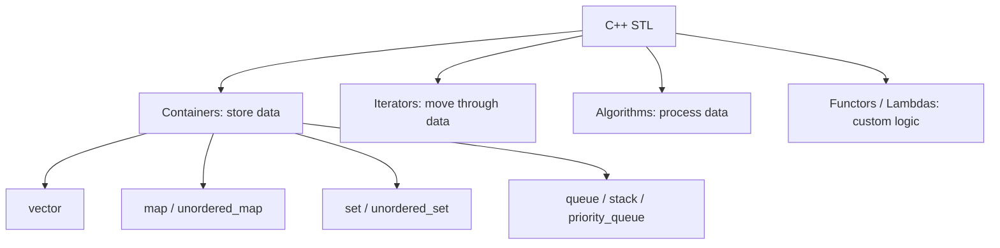

Mental model:

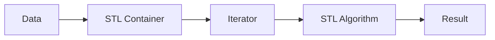

---

# 2. Project Setup From Scratch

## Option A: Single file

Create file:

```bash
main.cpp
```

Compile:

```bash
g++ -std=c++17 main.cpp -o app
./app
```

## Option B: Simple folder

```text
cpp-stl-practice/
├── main.cpp
└── README.md
```

## Option C: VS Code setup

Install:

- C++ compiler: `g++`
- VS Code C/C++ extension
- Code Runner extension, optional

Basic command:

```bash
g++ -std=c++17 main.cpp && ./a.out
```

---

# 3. Basic STL Template

Use this starter for most examples.

```cpp
#include <bits/stdc++.h>
using namespace std;

int main() {
    vector<int> nums = {5, 2, 9, 1};

    sort(nums.begin(), nums.end());

    for (int x : nums) {
        cout << x << " ";
    }

    return 0;
}
```

Output:

```text
1 2 5 9
```

---

# 4. Containers Overview

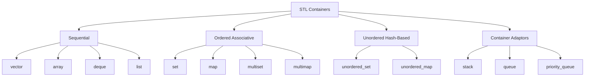

Quick choice guide:

| Need | Use |
|---|---|
| Dynamic list | `vector` |
| Fast front and back insert | `deque` |
| Unique sorted values | `set` |
| Key-value sorted data | `map` |
| Fast lookup by key | `unordered_map` |
| Last-in-first-out | `stack` |
| First-in-first-out | `queue` |
| Always get max/min | `priority_queue` |

---

# 5. Vector

`vector` is a dynamic array.

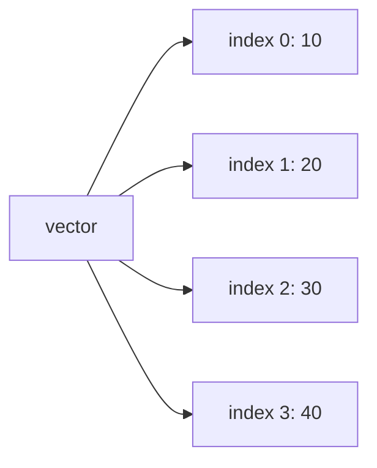

## Basic operations

```cpp
#include <bits/stdc++.h>
using namespace std;

int main() {
    vector<int> v;

    v.push_back(10);
    v.push_back(20);
    v.push_back(30);

    cout << v[0] << endl;      // 10
    cout << v.size() << endl;  // 3

    v.pop_back();              // removes 30

    for (int x : v) {
        cout << x << " ";
    }
}
```

## Use case: store user IDs

```cpp
vector<int> userIds = {101, 102, 103};
userIds.push_back(104);
```

## Common vector methods

| Method | Meaning |
|---|---|
| `push_back(x)` | Add at end |
| `pop_back()` | Remove last |
| `size()` | Number of elements |
| `empty()` | Check empty |
| `clear()` | Remove all |
| `sort(v.begin(), v.end())` | Sort ascending |

---

# 6. String

`string` behaves like a character vector.

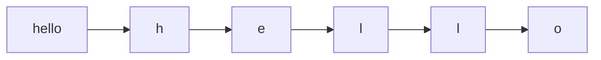

```cpp
#include <bits/stdc++.h>
using namespace std;

int main() {
    string name = "alice";

    name += " smith";

    cout << name.size() << endl;
    cout << name.substr(0, 5) << endl; // alice

    reverse(name.begin(), name.end());
    cout << name << endl;
}
```

Use case: check palindrome.

```cpp
bool isPalindrome(string s) {
    string t = s;
    reverse(t.begin(), t.end());
    return s == t;
}
```

---

# 7. Pair and Tuple

Use `pair` for two values.

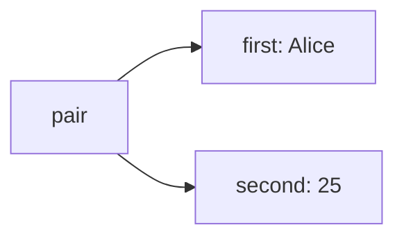

```cpp
pair<string, int> user = {"Alice", 25};
cout << user.first << endl;   // Alice
cout << user.second << endl;  // 25
```

Use `tuple` for more than two values.

```cpp
tuple<int, string, double> product = {1, "Laptop", 999.99};

int id;
string name;
double price;

tie(id, name, price) = product;
```

---

# 8. Array

`array` has fixed size.

```cpp
#include <bits/stdc++.h>
using namespace std;

int main() {
    array<int, 5> marks = {90, 80, 70, 60, 50};

    cout << marks[0] << endl;
    cout << marks.size() << endl;
}
```

Use when size is known and fixed.

---

# 9. Deque

`deque` allows fast insert/remove from both ends.

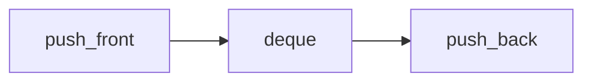

```cpp
#include <bits/stdc++.h>
using namespace std;

int main() {
    deque<int> dq;

    dq.push_back(10);
    dq.push_front(5);
    dq.push_back(20);

    cout << dq.front() << endl; // 5
    cout << dq.back() << endl;  // 20

    dq.pop_front();
    dq.pop_back();
}
```

Use case: browser history, recent activity, sliding window.

---

# 10. Stack

Stack is Last In, First Out.

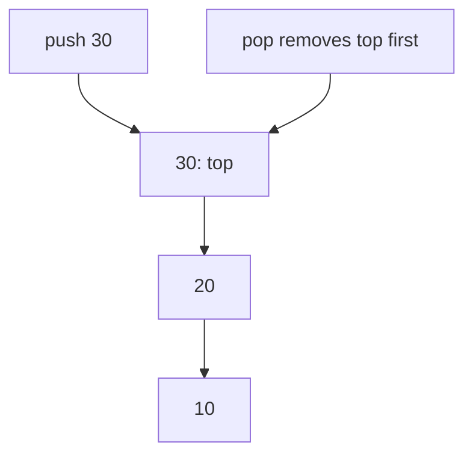

```cpp
#include <bits/stdc++.h>
using namespace std;

int main() {
    stack<int> st;

    st.push(10);
    st.push(20);
    st.push(30);

    cout << st.top() << endl; // 30
    st.pop();
    cout << st.top() << endl; // 20
}
```

Use case: undo feature.

```cpp
stack<string> undo;
undo.push("typed hello");
undo.push("deleted word");

cout << "Undo: " << undo.top();
undo.pop();
```

---

# 11. Queue

Queue is First In, First Out.

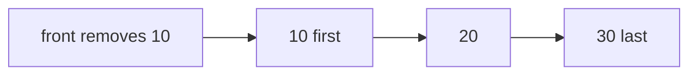

```cpp
#include <bits/stdc++.h>
using namespace std;

int main() {
    queue<string> q;

    q.push("user1");
    q.push("user2");
    q.push("user3");

    cout << q.front() << endl; // user1
    q.pop();
    cout << q.front() << endl; // user2
}
```

Use case: job processing.

```cpp
queue<string> jobs;
jobs.push("send email");
jobs.push("generate report");

while (!jobs.empty()) {
    cout << "Processing " << jobs.front() << endl;
    jobs.pop();
}
```

---

# 12. Priority Queue

Default priority queue gives the largest item first.

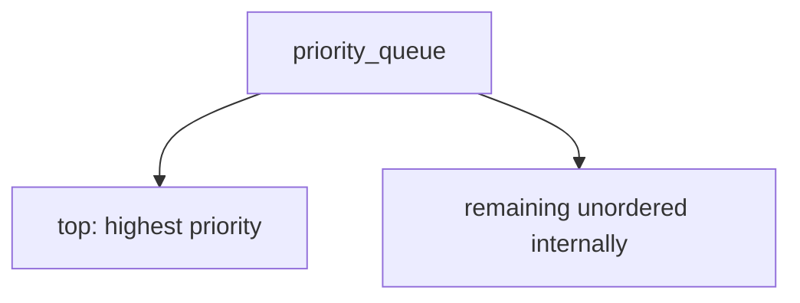

## Max heap

```cpp
priority_queue<int> pq;

pq.push(30);
pq.push(10);
pq.push(50);

cout << pq.top(); // 50
```

## Min heap

```cpp
priority_queue<int, vector<int>, greater<int>> minHeap;

minHeap.push(30);
minHeap.push(10);
minHeap.push(50);

cout << minHeap.top(); // 10
```

Use case: top K scores.

```cpp
vector<int> scores = {90, 70, 95, 88, 100};
priority_queue<int> pq(scores.begin(), scores.end());

int k = 3;
while (k--) {
    cout << pq.top() << " ";
    pq.pop();
}
```

---

# 13. Set and Multiset

`set` stores unique sorted values.

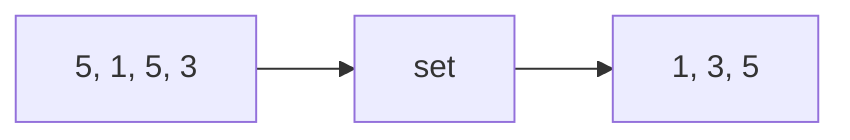

```cpp
set<int> s;

s.insert(5);
s.insert(1);
s.insert(5);
s.insert(3);

for (int x : s) {
    cout << x << " "; // 1 3 5
}
```

Find value:

```cpp
if (s.find(3) != s.end()) {
    cout << "Found";
}
```

`multiset` allows duplicates.

```cpp
multiset<int> ms;
ms.insert(5);
ms.insert(5);
ms.insert(1);
```

Use case: unique usernames.

```cpp
set<string> usernames;
usernames.insert("alice");
usernames.insert("bob");
```

---

# 14. Map and Multimap

`map` stores sorted key-value pairs.

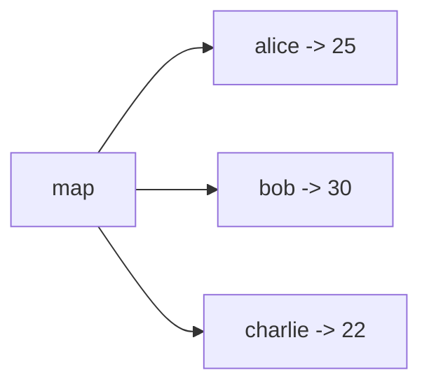

```cpp
map<string, int> age;

age["alice"] = 25;
age["bob"] = 30;

cout << age["alice"] << endl;
```

Count frequency:

```cpp
vector<string> names = {"alice", "bob", "alice"};
map<string, int> freq;

for (string name : names) {
    freq[name]++;
}

for (auto [name, count] : freq) {
    cout << name << " -> " << count << endl;
}
```

Use case: product stock.

```cpp
map<string, int> stock;
stock["laptop"] = 10;
stock["phone"] = 25;
```

---

# 15. Unordered Set and Unordered Map

Hash-based containers are usually faster for lookup.

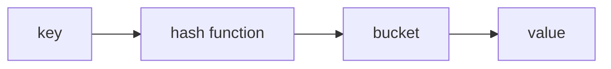

## unordered_set

```cpp
unordered_set<int> seen;

seen.insert(10);
seen.insert(20);

if (seen.count(10)) {
    cout << "Already seen";
}
```

## unordered_map

```cpp
unordered_map<string, int> visits;

visits["/home"]++;
visits["/products"]++;
visits["/home"]++;

cout << visits["/home"]; // 2
```

Use case: fast duplicate detection.

```cpp
bool hasDuplicate(vector<int>& nums) {
    unordered_set<int> seen;

    for (int x : nums) {
        if (seen.count(x)) return true;
        seen.insert(x);
    }
    return false;
}
```

---

# 16. Iterators

Iterator = pointer-like object used to walk through containers.

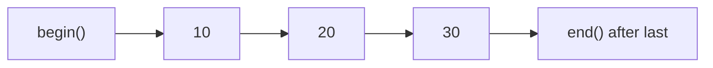

```cpp
vector<int> v = {10, 20, 30};

for (auto it = v.begin(); it != v.end(); it++) {
    cout << *it << " ";
}
```

Reverse iterator:

```cpp
for (auto it = v.rbegin(); it != v.rend(); it++) {
    cout << *it << " ";
}
```

Modern style:

```cpp
for (int x : v) {
    cout << x << " ";
}
```

---

# 17. Algorithms

STL algorithms work with iterators.

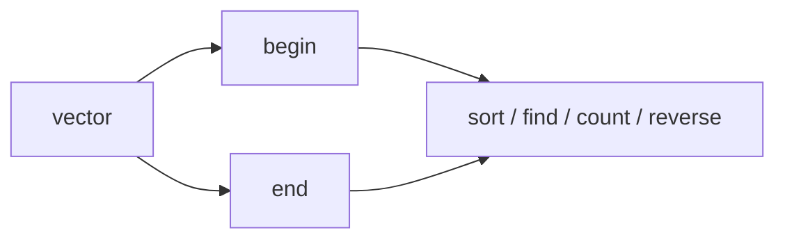

## sort

```cpp
vector<int> v = {4, 1, 3, 2};
sort(v.begin(), v.end());
```

## reverse

```cpp
reverse(v.begin(), v.end());
```

## find

```cpp
auto it = find(v.begin(), v.end(), 3);

if (it != v.end()) {
    cout << "Found";
}
```

## count

```cpp
int c = count(v.begin(), v.end(), 2);
```

## accumulate

```cpp
int sum = accumulate(v.begin(), v.end(), 0);
```

## max and min

```cpp
int mx = *max_element(v.begin(), v.end());
int mn = *min_element(v.begin(), v.end());
```

---

# 18. Lambda Functions

Lambda = small function written inline.

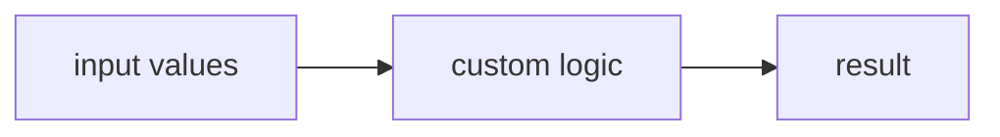

```cpp
auto add = [](int a, int b) {
    return a + b;
};

cout << add(2, 3); // 5
```

Use with sort:

```cpp
vector<int> v = {4, 1, 3, 2};

sort(v.begin(), v.end(), [](int a, int b) {
    return a > b;
});
```

---

# 19. Custom Sort

## Sort users by age

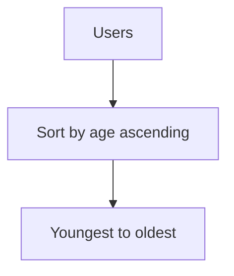

```cpp
struct User {
    string name;
    int age;
};

int main() {
    vector<User> users = {
        {"Alice", 25},
        {"Bob", 20},
        {"Charlie", 30}
    };

    sort(users.begin(), users.end(), [](User a, User b) {
        return a.age < b.age;
    });

    for (auto u : users) {
        cout << u.name << " " << u.age << endl;
    }
}
```

## Sort pairs

```cpp
vector<pair<string, int>> items = {
    {"apple", 3},
    {"banana", 1},
    {"orange", 2}
};

sort(items.begin(), items.end(), [](auto a, auto b) {
    return a.second < b.second;
});
```

---

# 20. Binary Search Patterns

Binary search works on sorted data.

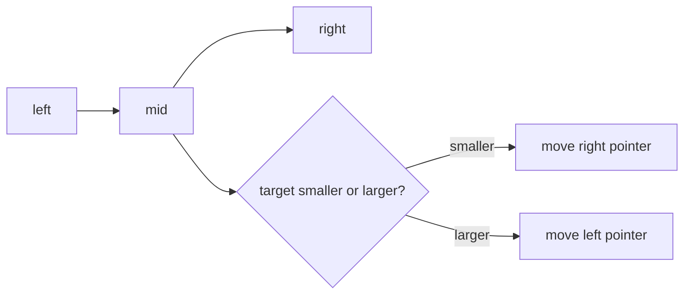

## STL binary_search

```cpp
vector<int> v = {1, 3, 5, 7, 9};

bool exists = binary_search(v.begin(), v.end(), 5);
```

## lower_bound

First position where value is `>= target`.

```cpp
vector<int> v = {1, 3, 3, 5, 7};

auto it = lower_bound(v.begin(), v.end(), 3);
cout << (it - v.begin()); // 1
```

## upper_bound

First position where value is `> target`.

```cpp
auto it = upper_bound(v.begin(), v.end(), 3);
cout << (it - v.begin()); // 3
```

Use case: count occurrences in sorted array.

```cpp
int countTarget(vector<int>& v, int target) {
    auto left = lower_bound(v.begin(), v.end(), target);
    auto right = upper_bound(v.begin(), v.end(), target);
    return right - left;
}
```

---

# 21. Two Pointer Pattern

Use two pointers when array is sorted or when checking pairs.

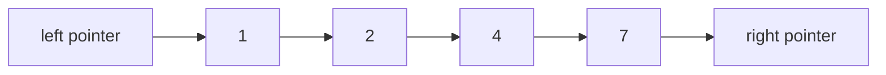

Use case: two sum in sorted array.

```cpp
bool twoSumSorted(vector<int>& nums, int target) {
    int left = 0;
    int right = nums.size() - 1;

    while (left < right) {
        int sum = nums[left] + nums[right];

        if (sum == target) return true;
        if (sum < target) left++;
        else right--;
    }

    return false;
}
```

---

# 22. Sliding Window Pattern

Use sliding window for subarray/string problems.

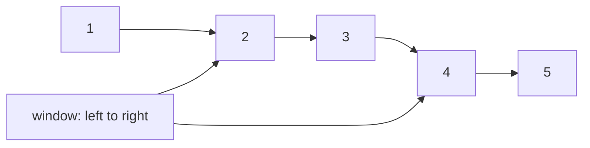

Use case: max sum of subarray of size `k`.

```cpp
int maxSumK(vector<int>& nums, int k) {
    int windowSum = 0;

    for (int i = 0; i < k; i++) {
        windowSum += nums[i];
    }

    int best = windowSum;

    for (int right = k; right < nums.size(); right++) {
        windowSum += nums[right];
        windowSum -= nums[right - k];
        best = max(best, windowSum);
    }

    return best;
}
```

---

# 23. Graph Use Cases

Use adjacency list with `vector<vector<int>>`.

```mermaid
flowchart LR
    A["0"] --> B["1"]
    A --> C["2"]
    B --> D["3"]
    C --> D
```

## Build graph

```cpp
int n = 4;
vector<vector<int>> graph(n);

graph[0].push_back(1);
graph[0].push_back(2);
graph[1].push_back(3);
graph[2].push_back(3);
```

## BFS using queue

```cpp
void bfs(vector<vector<int>>& graph, int start) {
    vector<bool> visited(graph.size(), false);
    queue<int> q;

    visited[start] = true;
    q.push(start);

    while (!q.empty()) {
        int node = q.front();
        q.pop();

        cout << node << " ";

        for (int next : graph[node]) {
            if (!visited[next]) {
                visited[next] = true;
                q.push(next);
            }
        }
    }
}
```

## DFS using recursion

```cpp
void dfs(int node, vector<vector<int>>& graph, vector<bool>& visited) {
    visited[node] = true;
    cout << node << " ";

    for (int next : graph[node]) {
        if (!visited[next]) {
            dfs(next, graph, visited);
        }
    }
}
```

Use case: social network friends.

```cpp
unordered_map<string, vector<string>> friends;

friends["Alice"].push_back("Bob");
friends["Alice"].push_back("Charlie");
friends["Bob"].push_back("David");
```

---

# 24. Advanced STL Patterns

## Frequency map

```mermaid
flowchart LR
    Values["a b a c a"] --> Map["unordered_map<char, int>"] --> Counts["a:3 b:1 c:1"]
```

```cpp
unordered_map<char, int> freq;
string s = "abaca";

for (char c : s) {
    freq[c]++;
}
```

## Top K frequent elements

```cpp
vector<int> topKFrequent(vector<int>& nums, int k) {
    unordered_map<int, int> freq;

    for (int x : nums) {
        freq[x]++;
    }

    priority_queue<pair<int, int>> pq;

    for (auto [num, count] : freq) {
        pq.push({count, num});
    }

    vector<int> result;

    while (k--) {
        result.push_back(pq.top().second);
        pq.pop();
    }

    return result;
}
```

## Remove duplicates

```cpp
vector<int> nums = {3, 1, 3, 2, 1};
set<int> uniqueNums(nums.begin(), nums.end());
```

## Sort then unique

```cpp
vector<int> nums = {3, 1, 3, 2, 1};

sort(nums.begin(), nums.end());
nums.erase(unique(nums.begin(), nums.end()), nums.end());
```

## Prefix sum

```mermaid
flowchart LR
    A["nums: 2 4 1 3"] --> P["prefix: 0 2 6 7 10"]
```

```cpp
vector<int> nums = {2, 4, 1, 3};
vector<int> prefix(nums.size() + 1, 0);

for (int i = 0; i < nums.size(); i++) {
    prefix[i + 1] = prefix[i] + nums[i];
}

// sum from index l to r
int l = 1, r = 3;
int sum = prefix[r + 1] - prefix[l];
```

---

# 25. Common Mistakes

## Mistake 1: Using `v[i]` out of range

Wrong:

```cpp
vector<int> v;
cout << v[0]; // crash or undefined behavior
```

Correct:

```cpp
if (!v.empty()) {
    cout << v[0];
}
```

## Mistake 2: Forgetting sorted requirement

Wrong:

```cpp
vector<int> v = {5, 1, 3};
binary_search(v.begin(), v.end(), 3); // unreliable because not sorted
```

Correct:

```cpp
sort(v.begin(), v.end());
binary_search(v.begin(), v.end(), 3);
```

## Mistake 3: Erasing while iterating incorrectly

Correct:

```cpp
vector<int> v = {1, 2, 3, 4};

for (auto it = v.begin(); it != v.end(); ) {
    if (*it % 2 == 0) {
        it = v.erase(it);
    } else {
        it++;
    }
}
```

---

# 26. Practice Roadmap

```mermaid
flowchart TD
    Start["Start"] --> Vector["vector + string"]
    Vector --> MapSet["map + set"]
    MapSet --> StackQueue["stack + queue"]
    StackQueue --> Algorithms["sort/find/count/accumulate"]
    Algorithms --> Patterns["two pointer + sliding window"]
    Patterns --> Graphs["BFS + DFS"]
    Graphs --> Advanced["priority_queue + custom sort + hashing"]
```

## Easy practice

- Reverse a vector
- Count frequency of characters
- Find maximum element
- Remove duplicates
- Check palindrome

## Medium practice

- Two sum
- Top K frequent elements
- Group anagrams
- Valid parentheses using stack
- Sliding window max sum

## Hard practice

- Dijkstra using priority queue
- LRU cache using list + unordered_map
- Median from data stream using two heaps
- Word ladder using BFS
- Merge K sorted lists using priority queue

---

# Final Cheat Sheet

| Problem type | STL choice |
|---|---|
| Store list | `vector` |
| Fast lookup | `unordered_set` |
| Count frequency | `unordered_map` |
| Sorted unique values | `set` |
| Key-value sorted | `map` |
| Undo / backtracking | `stack` |
| BFS / jobs | `queue` |
| Highest or lowest priority | `priority_queue` |
| Sorted search | `lower_bound`, `upper_bound` |
| Subarray range sum | `prefix sum` |
| Fixed window | `sliding window` |

