# Backtracking Patterns LCCM Master Guide

> Rebuilt from `000_BACKTRACKING_PATTERNS_ALGOMONSTER.md` into the same **001-style phase-wise CP + FAANG master guide** format.

This guide includes:

- Clickable index
- LCCM template for every problem
- Input / output / example
- Brute-force thinking when useful
- Optimal recursion / backtracking idea
- C++ code
- Recursion tree
- Mermaid tree-style dry run
- Pattern recognition cheat sheet

---

## Clickable Index

### Core Framework

- [0. One-Minute Master Map](#0-one-minute-master-map)
- [1. LCCM Framework](#1-lccm-framework)
- [2. Universal Templates](#2-universal-templates)
- [3. How To Read A Recursion Tree](#3-how-to-read-a-recursion-tree)
- [4. Phase Map](#4-phase-map)


### Phase 1 — Core Combinatorial Search


- [P1. Generate All Strings From Choices](#p1-generate-all-strings-from-choices)
- [P2. Letter Combinations of a Phone Number](#p2-letter-combinations-of-a-phone-number)

### Phase 2 — Backtracking With Pruning


- [P3. Palindrome Partitioning](#p3-palindrome-partitioning)

### Phase 3 — Backtracking With Additional State


- [P4. Generate Valid Parentheses](#p4-generate-valid-parentheses)
- [P5. Permutations](#p5-permutations)

### Phase 4 — Aggregation / Return Value Backtracking


- [P6. Word Break](#p6-word-break)
- [P7. Number of Ways to Decode a Message](#p7-number-of-ways-to-decode-a-message)
- [P8. Coin Change Minimum Coins](#p8-coin-change-minimum-coins)

### Phase 5 — Deduplication Patterns


- [P9. Three Sum Without Duplicate Triplets](#p9-three-sum-without-duplicate-triplets)

### Phase 6 — Combination Style Backtracking


- [P10. Combination Sum](#p10-combination-sum)
- [P11. Subsets](#p11-subsets)

### Final Revision

- [Backtracking Pattern Recognition Table](#backtracking-pattern-recognition-table)
- [LCCM Decision Tree](#lccm-decision-tree)
- [Common Mistakes](#common-mistakes)
- [Interview One-Liners](#interview-one-liners)
- [Final 5-Second Pattern Identification Drill](#final-5-second-pattern-identification-drill)

---

# 0. One-Minute Master Map

```text
Recursion      = solve smaller version of same problem.
Backtracking   = try choice -> recurse -> undo choice.
Pruning        = skip branch early when it can never become valid.
Additional state = carry values like used[], open/close, remaining sum.
Aggregation    = recursive calls return values and parent combines them.
Deduplication  = sort / frequency map / skip same-level duplicate choices.
```

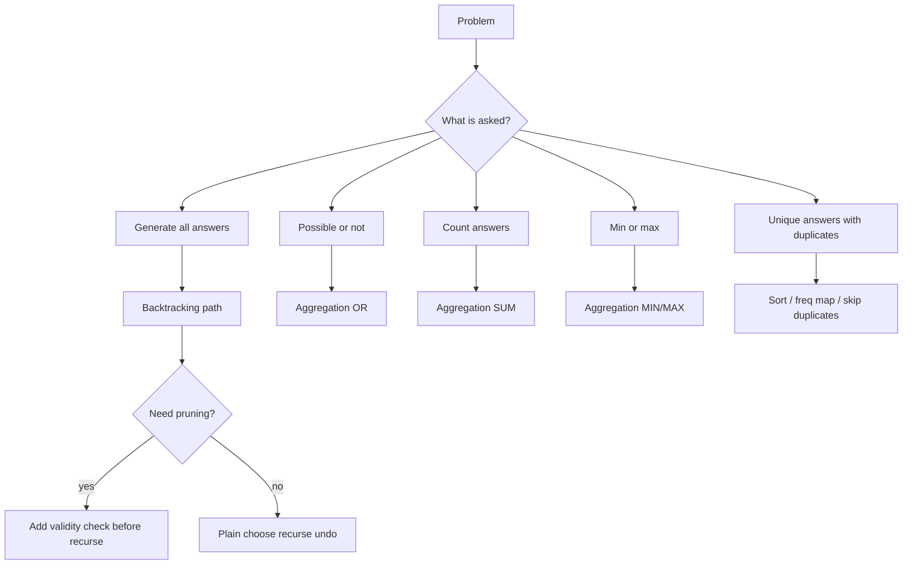

# 1. LCCM Framework

LCCM is the fastest way to convert a backtracking problem into code.

| Letter | Meaning | Question |
|---|---|---|
| L | Level | What does one recursive call represent? |
| C | Choice | What choices are available at this level? |
| C | Check / Constraint | Is this choice valid? Can I prune? |
| M | Move | How do I apply, recurse, and undo? |

```text
Level      =
Choices    =
Check      =
Move       =
Base case  =
Answer     =
```

# 2. Universal Templates

## 2.1 Backtracking Template - Generate All Answers

```cpp
void rec(int level) {
    if (base_case) {
        ans.push_back(path);
        return;
    }

    for (auto choice : choices) {
        if (!isSafe(choice)) continue;

        // choose
        path.push_back(choice);

        // explore
        rec(next_level);

        // undo
        path.pop_back();
    }
}
```

## 2.2 Aggregation Template

Use this when the problem asks for:

- possible or not
- number of ways
- minimum / maximum value

```cpp
ReturnType dfs(State state) {
    if (base_case) return base_value;

    ReturnType ans = initial_value;

    for (auto choice : choices) {
        if (!valid(choice)) continue;

        ReturnType child = dfs(next_state);
        ans = aggregate(ans, child);
    }

    return ans;
}
```

| Problem asks | Return type | Initial value | Aggregate |
|---|---:|---:|---|
| possible? | bool | false | OR |
| count ways | int / long long | 0 | + |
| maximum | int | -INF | max |
| minimum | int | INF | min |

## 2.3 Deduplication Template

```cpp
sort(nums.begin(), nums.end());

for (int i = start; i < n; i++) {
    if (i > start && nums[i] == nums[i - 1]) continue;

    path.push_back(nums[i]);
    dfs(i + 1);
    path.pop_back();
}
```

# 3. How To Read A Recursion Tree

A recursion tree shows **choices**.  
A recursion stack shows **execution order**.

For backtracking, each node should show:

```text
(level, path, extra state)
```

Example:

```text
level 0: ""
├── choose a -> level 1: "a"
│   ├── choose a -> level 2: "aa"
│   └── choose b -> level 2: "ab"
└── choose b -> level 1: "b"
    ├── choose a -> level 2: "ba"
    └── choose b -> level 2: "bb"
```

# 4. Phase Map

| Phase | Pattern | Main idea |
|---|---|---|
| 1 | Core combinatorial search | Add -> recurse -> remove |
| 2 | Backtracking with pruning | Skip invalid choices early |
| 3 | Additional state | Carry used/open/close/counts |
| 4 | Aggregation recursion | Return bool/count/min/max |
| 5 | Deduplication | Sort/frequency map/skip duplicates |
| 6 | Combination style | Take/skip by index |

---


# Phase 1 — Core Combinatorial Search

## Phase Code Template From PDF

```cpp
void rec(int level) {
    if (level == n) {
        // report / print / store path
        return;
    }

    for (auto choice : choices) {
        path.push_back(choice);   // add
        rec(level + 1);           // recurse
        path.pop_back();          // remove / backtrack
    }
}
```

**PDF idea:** `add -> rec(level + 1) -> remove`.


# P1. Generate All Strings From Choices

**Difficulty:** Easy  

**Pattern:** `LCCM: Level=index, Choice=character, Constraint=index<n, Move=add→recurse→remove`


## Problem Statement

Given possible characters at each position, generate all strings. Example choices are {a,b} for each of 2 positions.

## Input

```text
choices = ['a', 'b']
length = 2
```

## Output

```text
aa
ab
ba
bb
```

## Optimal Backtracking Idea

At every level, choose one character, append it to path, recurse to next index, then remove it while backtracking.

## LCCM


```text
Level = index / position
Choices = valid next elements
Constraint = depends on problem
Move = add → recurse → remove
```


## Recursion Tree

```text
rec(0, "")
├── choose 'a' -> rec(1, "a")
│   ├── choose 'a' -> rec(2, "aa") ✅ output
│   └── choose 'b' -> rec(2, "ab") ✅ output
└── choose 'b' -> rec(1, "b")
    ├── choose 'a' -> rec(2, "ba") ✅ output
    └── choose 'b' -> rec(2, "bb") ✅ output
```

## C++ Code

```cpp
#include <bits/stdc++.h>
using namespace std;

int n;
string res;
vector<char> choices = {'a', 'b'};

void rec(int level) {
    if (level == n) {
        cout << res << '\n';
        return;
    }

    for (char ch : choices) {
        res.push_back(ch);       // add
        rec(level + 1);          // recurse
        res.pop_back();          // remove / backtrack
    }
}

signed main() {
    n = 2;
    rec(0);
    return 0;
}
```

## Mermaid Tree Dry Run

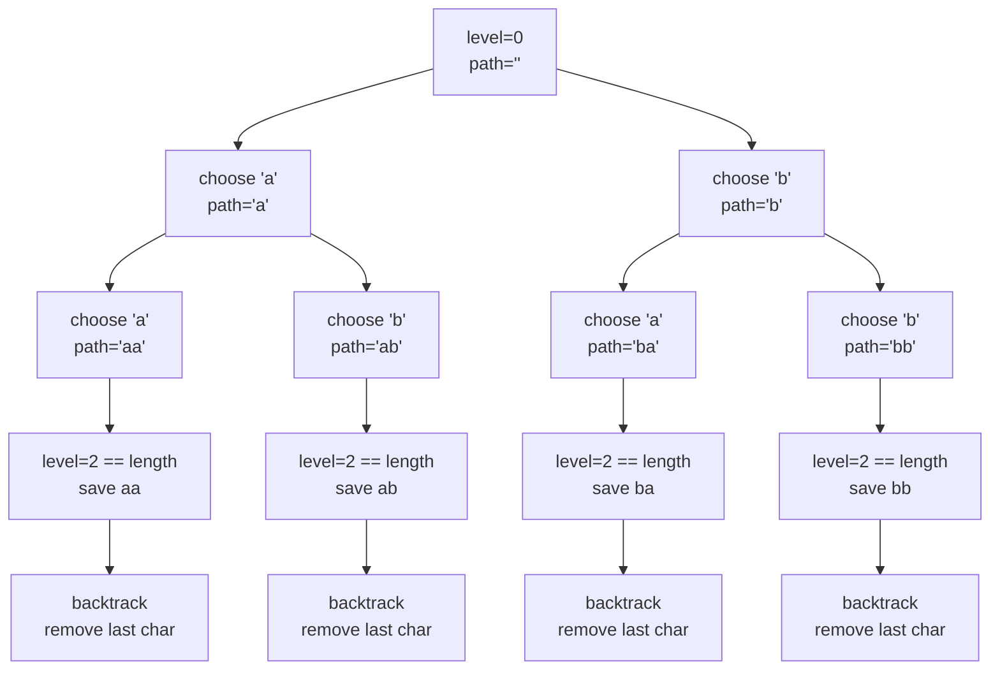

```text
choices = ['a', 'b']
length = 2

Root:
    level=0, path=""

Branch 1:
    choose 'a'
    path="a"

    choose 'a'
    path="aa"
    level == length
    save "aa"
    backtrack -> path="a"

    choose 'b'
    path="ab"
    save "ab"
    backtrack -> path="a"

    backtrack -> path=""

Branch 2:
    choose 'b'
    path="b"

    choose 'a'
    path="ba"
    save "ba"

    choose 'b'
    path="bb"
    save "bb"

Final output:
    aa, ab, ba, bb
```

## Complexity

Time O(k^n * n), Space O(n) recursion path, excluding output.

## Mental Model

> Use LCCM first: identify level, choices, constraint, and move before coding.

## Pattern Trigger


Use this when the problem asks to generate all combinations/strings/subsets by trying choices recursively.


---


---

# P2. Letter Combinations of a Phone Number

**Difficulty:** Medium  

**Pattern:** `LCCM: Level=digit index, Choice=letter mapped from digit`


## Problem Statement

Given digits 2-9, return all possible letter combinations based on phone keypad mapping.

## Input

```text
digits = "23"
```

## Output

```text
["ad","ae","af","bd","be","bf","cd","ce","cf"]
```

## Optimal Backtracking Idea

For each digit, iterate over mapped letters. Add letter, recurse to next digit, then remove letter.

## LCCM


```text
Level = index in digits
Choices = letters mapped from digits[level]
Constraint = level < digits.size()
Move = add letter → recurse(level+1) → remove letter
```


## Recursion Tree

```text
rec(0, "")
├── choose 'a' from digit 2 -> rec(1, "a")
│   ├── choose 'd' -> "ad" ✅
│   ├── choose 'e' -> "ae" ✅
│   └── choose 'f' -> "af" ✅
├── choose 'b' from digit 2 -> rec(1, "b")
│   ├── choose 'd' -> "bd" ✅
│   ├── choose 'e' -> "be" ✅
│   └── choose 'f' -> "bf" ✅
└── choose 'c' from digit 2 -> rec(1, "c")
    ├── choose 'd' -> "cd" ✅
    ├── choose 'e' -> "ce" ✅
    └── choose 'f' -> "cf" ✅
```

## C++ Code

```cpp
#include <bits/stdc++.h>
using namespace std;

string digits;
string res;
vector<string> keyboard(10);

void rec(int level) {
    if (level == (int)digits.size()) {
        cout << res << '\n';
        return;
    }

    int digit = digits[level] - '0';

    for (char ch : keyboard[digit]) {
        res.push_back(ch);       // add letter
        rec(level + 1);          // recurse to next digit
        res.pop_back();          // remove letter
    }
}

signed main() {
    keyboard[2] = "abc";
    keyboard[3] = "def";
    keyboard[4] = "ghi";
    keyboard[5] = "jkl";
    keyboard[6] = "mno";
    keyboard[7] = "pqrs";
    keyboard[8] = "tuv";
    keyboard[9] = "wxyz";

    cin >> digits;
    rec(0);
    return 0;
}
```

## Mermaid Tree Dry Run

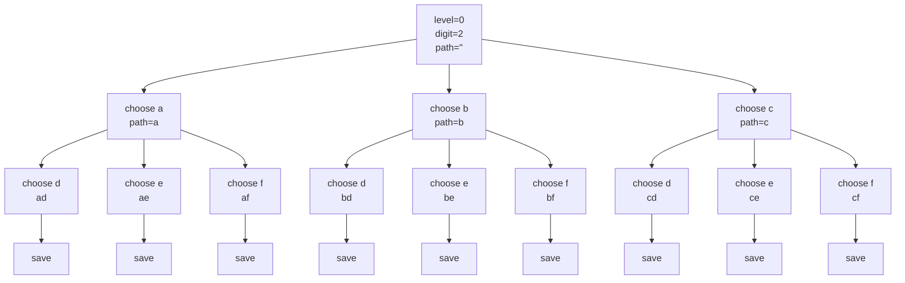

```text
digits = "23"

Level 0:
    digit 2 -> choices a,b,c

Level 1:
    digit 3 -> choices d,e,f

Tree expansion:
    a -> ad, ae, af
    b -> bd, be, bf
    c -> cd, ce, cf

Final:
    ad ae af bd be bf cd ce cf
```

## Complexity

Time O(4^n * n), Space O(n) recursion path, excluding output.

## Mental Model

> Use LCCM first: identify level, choices, constraint, and move before coding.

## Pattern Trigger


Use this when the problem asks to generate all combinations/strings/subsets by trying choices recursively.


---


---

# Phase 2 — Backtracking With Pruning

## Phase Code Template From PDF

```cpp
void rec(int start_index) {
    if (is_leaf(start_index)) {
        // report path
        return;
    }

    for (int end = start_index; end < n; end++) {
        if (!is_valid(choice)) continue;   // pruning
        path.push_back(choice);
        rec(end + 1);
        path.pop_back();
    }
}
```

**PDF idea:** before going deeper, check whether the branch can still become valid.


# P3. Palindrome Partitioning

**Difficulty:** Medium  

**Pattern:** `LCCM: Level=start index, Choice=substring start..end, Constraint=substring is palindrome`


## Problem Statement

Given a string s, partition it so every substring is a palindrome. Return all valid partitions.

## Input

```text
s = "aab"
```

## Output

```text
[["a","a","b"], ["aa","b"]]
```

## Optimal Backtracking Idea

At each start index, try every ending index. Only recurse if s[start..end] is palindrome. Non-palindromes are pruned.

## LCCM


```text
Level = start index
Choices = substring s[start..end]
Constraint = substring must be palindrome
Move = add substring → recurse(end+1) → remove substring
```


## Recursion Tree

```text
rec(start=0, path=[])
├── choose "a" ✅ palindrome -> rec(1, ["a"])
│   ├── choose "a" ✅ -> rec(2, ["a","a"])
│   │   └── choose "b" ✅ -> rec(3, ["a","a","b"]) ✅ output
│   └── choose "ab" ❌ prune
├── choose "aa" ✅ palindrome -> rec(2, ["aa"])
│   └── choose "b" ✅ -> rec(3, ["aa","b"]) ✅ output
└── choose "aab" ❌ prune
```

## C++ Code

```cpp
#include <bits/stdc++.h>
using namespace std;

string s;
vector<string> res;

bool isPalindrome(string x) {
    int l = 0;
    int r = (int)x.size() - 1;

    while (l < r) {
        if (x[l] != x[r]) return false;
        l++;
        r--;
    }
    return true;
}

void rec(int level) {
    if (level == (int)s.size()) {
        for (string part : res) cout << part << " ";
        cout << '\n';
        return;
    }

    string temp = "";

    for (int end = level; end < (int)s.size(); end++) {
        temp.push_back(s[end]);

        if (isPalindrome(temp)) {        // pruning check
            res.push_back(temp);         // add substring
            rec(end + 1);                // move to next start index
            res.pop_back();              // remove substring
        }
    }
}

signed main() {
    cin >> s;
    rec(0);
    return 0;
}
```

## Mermaid Tree Dry Run

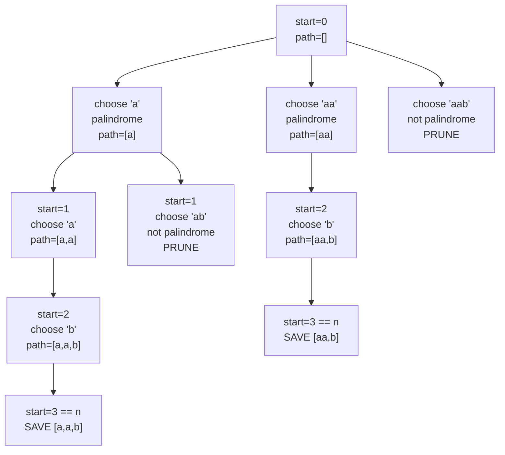

```text
s = "aab"

start=0:
    try "a"   -> palindrome -> recurse start=1
    try "aa"  -> palindrome -> recurse start=2
    try "aab" -> not palindrome -> prune

Branch "a":
    start=1
    try "a"  -> palindrome
        start=2
        try "b" -> palindrome
            start=3
            save ["a","a","b"]

    try "ab" -> not palindrome -> prune

Branch "aa":
    start=2
    try "b" -> palindrome
        start=3
        save ["aa","b"]

Final:
    ["a","a","b"]
    ["aa","b"]
```

## Complexity

Time O(n * 2^n), Space O(n) recursion path, excluding output.

## Mental Model

> Use LCCM first: identify level, choices, constraint, and move before coding.

## Pattern Trigger


Use this when some choices can be rejected immediately before recursion.


---


---

# Phase 3 — Backtracking With Additional State

## Phase Code Template From PDF

```cpp
void rec(int level, /* additional state */) {
    if (is_leaf(level)) {
        // add result
        return;
    }

    for (auto choice : choices) {
        if (!is_valid(choice, state)) continue;

        // add choice + update state
        rec(level + 1, /* updated state */);
        // remove choice + revert state
    }
}
```

**PDF idea:** carry extra state like `used[]`, `open`, `close`, or counters when path alone is not enough.


# P4. Generate Valid Parentheses

**Difficulty:** Medium  

**Pattern:** `Additional state: open count and close count`


## Problem Statement

Generate all valid parentheses strings with n pairs.

## Input

```text
n = 2
```

## Output

```text
["(())", "()()"]
```

## Optimal Backtracking Idea

At every position choose '(' if open<n. Choose ')' if close<open. This prunes invalid states early.

## LCCM


```text
Level = position / path length
Choices = '(' or ')'
Constraint = open < n, close < open
Move = add bracket → update open/close → recurse → remove bracket
```


## Recursion Tree

```text
rec("", open=0, close=0)
└── add '(' -> rec("(", 1, 0)
    ├── add '(' -> rec("((", 2, 0)
    │   └── add ')' -> rec("(()", 2, 1)
    │       └── add ')' -> rec("(())", 2, 2) ✅
    └── add ')' -> rec("()", 1, 1)
        └── add '(' -> rec("()(", 2, 1)
            └── add ')' -> rec("()()", 2, 2) ✅
```

## C++ Code

```cpp
#include <bits/stdc++.h>
using namespace std;

int n;
string res;

void rec(int open, int close) {
    if ((int)res.size() == 2 * n) {
        cout << res << '\n';
        return;
    }

    if (open < n) {
        res.push_back('(');
        rec(open + 1, close);
        res.pop_back();
    }

    if (close < open) {
        res.push_back(')');
        rec(open, close + 1);
        res.pop_back();
    }
}

signed main() {
    cin >> n;
    rec(0, 0);
    return 0;
}
```

## Mermaid Tree Dry Run

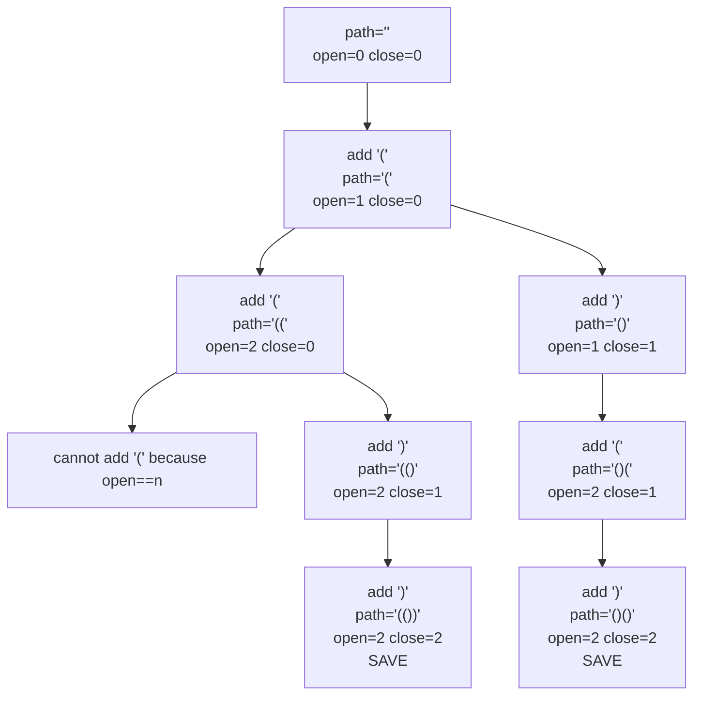

```text
n = 2

Root:
    path="", open=0, close=0

Only valid first move:
    add '(' -> path="(", open=1, close=0

From "(":
    Choice 1: add '('
        path="(("
        open=2, close=0
        now open == n, so cannot add more '('
        add ')' -> "(()"
        add ')' -> "(())"
        save

    Choice 2: add ')'
        path="()"
        open=1, close=1
        cannot add ')' because close == open
        add '(' -> "()("
        add ')' -> "()()"
        save

Final:
    (())
    ()()
```

## Complexity

Time O(Catalan(n) * n), Space O(n).

## Mental Model

> Use LCCM first: identify level, choices, constraint, and move before coding.

## Pattern Trigger


Use this when path alone is not enough; you must carry extra state like `used`, `open`, `close`, or counts.


---


---

# P5. Permutations

**Difficulty:** Medium  

**Pattern:** `Additional state: used boolean array`


## Problem Statement

Given distinct characters, generate all permutations.

## Input

```text
s = "abc"
```

## Output

```text
abc
acb
bac
bca
cab
cba
```

## Optimal Backtracking Idea

At each level choose any unused character. Mark it used, recurse, then unmark while backtracking.

## LCCM


```text
Level = position in permutation
Choices = unused characters
Constraint = each character used once
Move = mark used → add → recurse → remove → unmark
```


## Recursion Tree

```text
rec(path="")
├── choose a
│   ├── choose b
│   │   └── choose c -> abc ✅
│   └── choose c
│       └── choose b -> acb ✅
├── choose b
│   ├── choose a
│   │   └── choose c -> bac ✅
│   └── choose c
│       └── choose a -> bca ✅
└── choose c
    ├── choose a
    │   └── choose b -> cab ✅
    └── choose b
        └── choose a -> cba ✅
```

## C++ Code

```cpp
#include <bits/stdc++.h>
using namespace std;

int n;
string s;
string res;
vector<bool> used;

void rec(int level) {
    if (level == n) {
        cout << res << '\n';
        return;
    }

    for (int i = 0; i < n; i++) {
        if (!used[i]) {
            used[i] = true;       // mark used
            res.push_back(s[i]);  // add

            rec(level + 1);       // recurse

            res.pop_back();       // remove
            used[i] = false;      // unmark used
        }
    }
}

signed main() {
    cin >> s;
    n = s.size();
    used.assign(n, false);
    rec(0);
    return 0;
}
```

## Mermaid Tree Dry Run

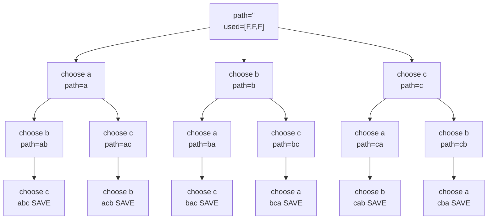

```text
s = "abc"

Level 0:
    choose a, b, or c

Branch a:
    path="a"
    remaining choices = b,c

    choose b -> path="ab"
        remaining c -> "abc" save

    backtrack to "a"

    choose c -> path="ac"
        remaining b -> "acb" save

Branch b:
    produces bac, bca

Branch c:
    produces cab, cba

Final:
    abc, acb, bac, bca, cab, cba
```

## Complexity

Time O(n! * n), Space O(n).

## Mental Model

> Use LCCM first: identify level, choices, constraint, and move before coding.

## Pattern Trigger


Use this when path alone is not enough; you must carry extra state like `used`, `open`, `close`, or counts.


---


---

# Phase 4 — Aggregation / Return Value Backtracking

## Phase Code Template From PDF

```cpp
ReturnType rec(int level) {
    if (base_case) return base_value;

    ReturnType res = initial_value;

    for (auto choice : choices) {
        if (!valid(choice)) continue;
        ReturnType child = rec(next_level);
        res = aggregate(res, child);   // OR / SUM / MIN / MAX
    }

    return res;
}
```

**PDF idea:** recursive call returns a value, and parent combines child answers.


# P6. Word Break

**Difficulty:** Medium  

**Pattern:** `Aggregation OR: does any branch return true?`


## Problem Statement

Given a string and dictionary words, return true if string can be segmented into dictionary words.

## Input

```text
target = "algomonster"
words = ["algo", "monster"]
```

## Output

```text
true
```

## Optimal Backtracking Idea

At index start, try every dictionary word matching the prefix. If any recursive branch reaches the end, return true.

## LCCM


```text
Level = start index in target
Choices = dictionary words matching prefix
Constraint = word must match target[start..]
Move = recurse(start + word.length), aggregate OR
```


## Recursion Tree

```text
rec(start=0, remaining="algomonster")
└── choose "algo" ✅ matches prefix
    rec(start=4, remaining="monster")
    └── choose "monster" ✅ matches prefix
        rec(start=11)
        start == target.length ✅ true
```

## C++ Code

```cpp
#include <bits/stdc++.h>
using namespace std;

string target;
int n;
vector<string> words;

bool rec(int level) {
    if (level == n) {
        return true;
    }

    bool res = false;

    for (string word : words) {
        int len = word.size();

        if (level + len <= n && target.substr(level, len) == word) {
            res = res || rec(level + len);   // OR aggregation
        }
    }

    return res;
}

signed main() {
    cin >> target;
    cin >> n;

    words.resize(n);
    for (int i = 0; i < n; i++) cin >> words[i];

    bool ans = rec(0);
    cout << (ans ? "match found" : "match not found") << '\n';
    return 0;
}
```

## Mermaid Tree Dry Run

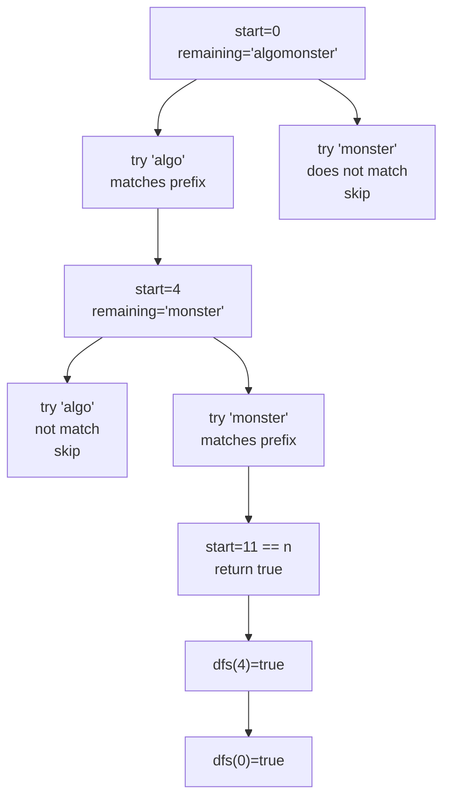

```text
target = "algomonster"
words = ["algo", "monster"]

dfs(0):
    remaining = "algomonster"
    "algo" matches prefix
    recurse dfs(4)

dfs(4):
    remaining = "monster"
    "algo" does not match
    "monster" matches
    recurse dfs(11)

dfs(11):
    start == target.length
    return true

Aggregation OR:
    dfs(11) = true
    dfs(4)  = true
    dfs(0)  = true

Answer = true
```

## Complexity

Without memo can be exponential. With memo: O(n * number_of_words * word_length).

## Mental Model

> Use LCCM first: identify level, choices, constraint, and move before coding.

## Pattern Trigger


Use this when recursion must **return a value** instead of only printing paths: true/false, count, min, or max.


---


---

# P7. Number of Ways to Decode a Message

**Difficulty:** Medium  

**Pattern:** `Aggregation SUM: number of valid branches`


## Problem Statement

Given a digit string, count how many ways it can be decoded where 1=A, 2=B, ..., 26=Z.

## Input

```text
s = "123"
```

## Output

```text
3
```

## Optimal Backtracking Idea

At each index choose one digit if valid, and choose two digits if valid between 10 and 26. Sum results from both choices.

## LCCM


```text
Level = current index i
Choices = 1 digit or 2 digits
Constraint = valid number 1..26, no leading zero
Move = recurse next index, aggregate SUM
```


## Recursion Tree

```text
rec(0, "123")
├── take "1" -> rec(1, "23")
│   ├── take "2" -> rec(2, "3")
│   │   └── take "3" -> rec(3) ✅ 1 way: A B C
│   └── take "23" -> rec(3) ✅ 1 way: A W
└── take "12" -> rec(2, "3")
    └── take "3" -> rec(3) ✅ 1 way: L C

Total = 3
```

## C++ Code

```cpp
#include <bits/stdc++.h>
using namespace std;

string s;

int rec(int level) {
    if (level == (int)s.size()) {
        return 1;
    }

    if (s[level] == '0') {
        return 0;
    }

    int ways = 0;

    // choose 1 digit
    ways += rec(level + 1);

    // choose 2 digits if valid: 10 to 26
    if (level + 1 < (int)s.size()) {
        int val = stoi(s.substr(level, 2));
        if (val >= 10 && val <= 26) {
            ways += rec(level + 2);
        }
    }

    return ways;
}

signed main() {
    cin >> s;
    cout << rec(0) << '\n';
    return 0;
}
```

## Mermaid Tree Dry Run

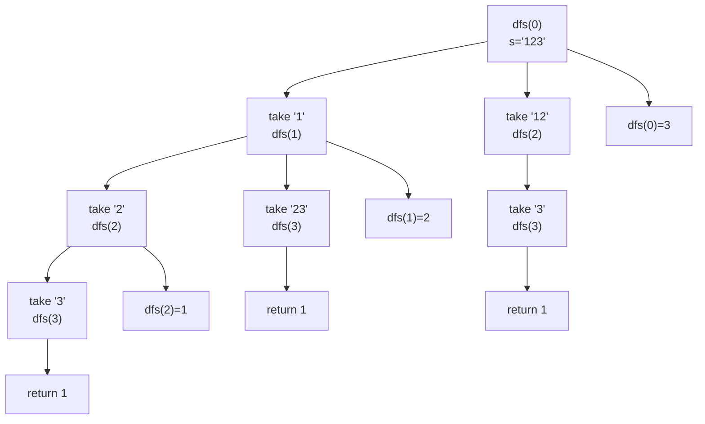

```text
s = "123"

dfs(0):
    one digit  "1"  -> dfs(1)
    two digits "12" -> dfs(2)

dfs(1), remaining "23":
    one digit  "2"  -> dfs(2)
    two digits "23" -> dfs(3)

dfs(2), remaining "3":
    one digit "3" -> dfs(3)

dfs(3):
    reached end
    return 1

Aggregate:
    dfs(2) = 1
    dfs(1) = dfs(2) + dfs(3)
           = 1 + 1
           = 2

    dfs(0) = dfs(1) + dfs(2)
           = 2 + 1
           = 3

Answer = 3
```

## Complexity

With memo O(n), Space O(n).

## Mental Model

> Use LCCM first: identify level, choices, constraint, and move before coding.

## Pattern Trigger


Use this when recursion must **return a value** instead of only printing paths: true/false, count, min, or max.


---


---

# P8. Coin Change Minimum Coins

**Difficulty:** Medium  

**Pattern:** `Aggregation MIN: take or skip coin`


## Problem Statement

Given coin denominations and amount, find minimum number of coins needed. Coins can be used unlimited times.

## Input

```text
coins = [1, 2, 5]
amount = 11
```

## Output

```text
3  // 5 + 5 + 1
```

## Optimal Backtracking Idea

At each coin index, either take current coin and stay at same index, or skip it and move to next index. Aggregate with min.

## LCCM


```text
Level = coin index
Choices = take coin or skip coin
Constraint = remaining sum must not go below zero
Move = take → same index, skip → next index, aggregate MIN
```


## Recursion Tree

```text
rec(index=0, sum=11)
├── take coin 1 -> rec(0, 10)
│   └── ...
└── skip coin 1 -> rec(1, 11)
    ├── take coin 2 -> rec(1, 9)
    └── skip coin 2 -> rec(2, 11)
        ├── take coin 5 -> rec(2, 6)
        │   ├── take coin 5 -> rec(2, 1)
        │   └── ...
        └── skip coin 5 -> invalid
Valid best path:
    take 5 -> take 5 -> take 1 = 3 coins
```

## C++ Code

```cpp
#include <bits/stdc++.h>
using namespace std;

const int INF = 1e9;
int n;
int sum;
vector<int> arr;

int rec(int level, int rem) {
    if (rem == 0) return 0;
    if (rem < 0) return INF;
    if (level == n) return INF;

    int include = INF;
    if (rem >= arr[level]) {
        include = 1 + rec(level, rem - arr[level]);   // take, stay because unlimited use
    }

    int exclude = rec(level + 1, rem);                // skip, move next coin

    return min(include, exclude);                     // MIN aggregation
}

signed main() {
    cin >> n >> sum;
    arr.resize(n);
    for (int i = 0; i < n; i++) cin >> arr[i];

    int ans = rec(0, sum);
    cout << (ans >= INF ? -1 : ans) << '\n';
    return 0;
}
```

## Mermaid Tree Dry Run

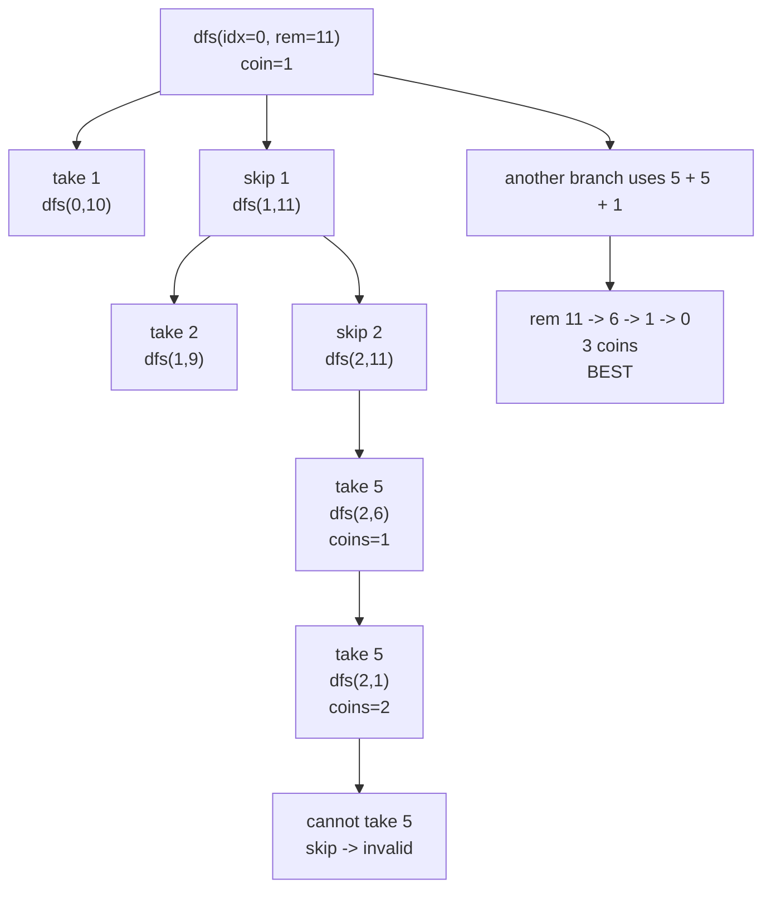

```text
coins = [1, 2, 5]
amount = 11

State:
    dfs(index, remaining)

At dfs(0, 11):
    Choice 1: take coin 1
        dfs(0, 10)
        stay on index 0 because coin reuse allowed

    Choice 2: skip coin 1
        dfs(1, 11)

At dfs(1, 11):
    Choice 1: take coin 2
        dfs(1, 9)

    Choice 2: skip coin 2
        dfs(2, 11)

At dfs(2, 11), coin=5:
    take 5 -> dfs(2, 6)
    take 5 -> dfs(2, 1)
    cannot take 5 now

Best successful path:
    11 -> 6 by taking 5
    6  -> 1 by taking 5
    1  -> 0 by taking 1

Answer = 3 coins
```

## Complexity

With memo O(n * amount), Space O(n * amount).

## Mental Model

> Use LCCM first: identify level, choices, constraint, and move before coding.

## Pattern Trigger


Use this when recursion must **return a value** instead of only printing paths: true/false, count, min, or max.


---


---

# Phase 5 — Deduplication Patterns

## Phase Code Template From PDF

```cpp
sort(nums.begin(), nums.end());

for (int i = 0; i < n; i++) {
    if (i > 0 && nums[i] == nums[i - 1]) continue;

    int l = i + 1;
    int r = n - 1;

    while (l < r) {
        int sum = nums[i] + nums[l] + nums[r];

        if (sum == target) {
            // save answer
            l++;
            r--;
            while (l < r && nums[l] == nums[l - 1]) l++;
            while (l < r && nums[r] == nums[r + 1]) r--;
        } else if (sum < target) {
            l++;
        } else {
            r--;
        }
    }
}
```

**PDF idea:** sort first, then skip duplicates at the fixed index and pointer movement.


# P9. Three Sum Without Duplicate Triplets

**Difficulty:** Medium  

**Pattern:** `Sort + fixed i + two pointers + skip duplicates`


## Problem Statement

Given nums, return unique triplets [a,b,c] such that a+b+c=0.

## Input

```text
nums = [-1, 0, 1, 2, -1, -4]
```

## Output

```text
[[-1,-1,2], [-1,0,1]]
```

## Optimal Backtracking Idea

Sort. Fix i. Then run two-sum using left/right. Skip duplicate i, duplicate left, and duplicate right.

## LCCM


```text
Level = fixed index i
Choices = left/right movement
Constraint = skip duplicate values
Move = if sum too small left++, if too large right--, if equal record and skip duplicates
```


## Recursion Tree

```text
Sorted nums = [-4, -1, -1, 0, 1, 2]

i = 0 -> -4
    twoSum target = 4 -> no pair

i = 1 -> -1
    twoSum target = 1
    find (-1, 2) -> [-1, -1, 2]
    find (0, 1)  -> [-1, 0, 1]

i = 2 -> -1 duplicate of previous i -> skip
```

## C++ Code

```cpp
#include <bits/stdc++.h>
using namespace std;

vector<vector<int>> threeSum(vector<int>& nums) {
    sort(nums.begin(), nums.end());
    vector<vector<int>> result;
    int n = nums.size();

    for (int i = 0; i < n; i++) {
        if (i > 0 && nums[i] == nums[i - 1]) continue;   // skip duplicate fixed value

        int l = i + 1;
        int r = n - 1;
        int target = -nums[i];

        while (l < r) {
            int sum = nums[l] + nums[r];

            if (sum == target) {
                result.push_back({nums[i], nums[l], nums[r]});

                l++;
                r--;

                while (l < r && nums[l] == nums[l - 1]) l++;   // skip duplicate left
                while (l < r && nums[r] == nums[r + 1]) r--;   // skip duplicate right
            } else if (sum < target) {
                l++;
            } else {
                r--;
            }
        }
    }

    return result;
}
```

## Mermaid Tree Dry Run

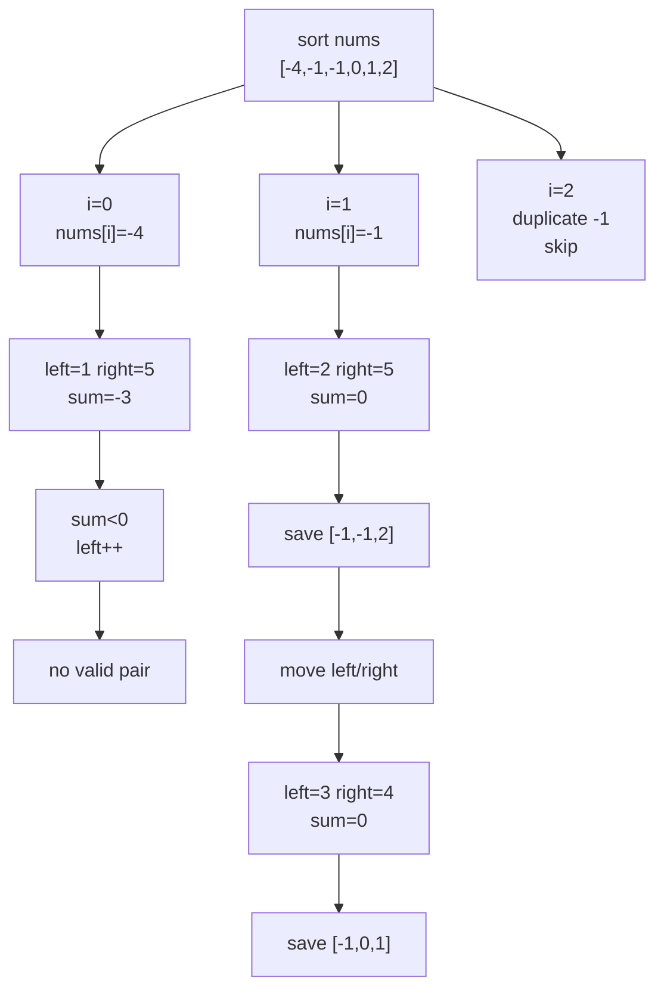

```text
nums = [-1, 0, 1, 2, -1, -4]

Sort:
    [-4, -1, -1, 0, 1, 2]

i=0, nums[i]=-4:
    left=1, right=5
    sum = -4 + -1 + 2 = -3
    sum < 0, move left

    keep moving left
    no valid triplet

i=1, nums[i]=-1:
    left=2, right=5
    sum = -1 + -1 + 2 = 0
    save [-1,-1,2]

    move left and right
    left=3, right=4
    sum = -1 + 0 + 1 = 0
    save [-1,0,1]

i=2:
    nums[2] == nums[1]
    duplicate fixed value
    skip

Final:
    [-1,-1,2]
    [-1,0,1]
```

## Complexity

Time O(n²), Space O(1) excluding output.

## Mental Model

> Use LCCM first: identify level, choices, constraint, and move before coding.

## Pattern Trigger


Use this when sorted input has duplicates and output must avoid duplicate combinations/triplets.


---


---

# Phase 6 — Combination Style Backtracking

## Phase Code Template From PDF

```cpp
void rec(int level, int remaining) {
    if (remaining == 0) {
        // report path
        return;
    }

    if (level == n || remaining < 0) return;

    path.push_back(arr[level]);
    rec(level, remaining - arr[level]);     // take: stay for reuse
    path.pop_back();

    rec(level + 1, remaining);              // skip
}
```

**PDF idea:** combination problems usually become take/skip recursion by index.


# P10. Combination Sum

**Difficulty:** Medium  

**Pattern:** `Index based take/skip, unlimited reuse`


## Problem Statement

Given candidates and target, return all unique combinations where candidates sum to target. Same number can be reused unlimited times.

## Input

```text
candidates = [2, 3, 6, 7]
target = 7
```

## Output

```text
[[2,2,3], [7]]
```

## Optimal Backtracking Idea

At index i, either take candidates[i] and stay at i, or skip it and move to i+1.

## LCCM


```text
Level = candidate index
Choices = take current candidate or skip it
Constraint = remaining target >= 0
Move = take → same index, skip → index+1
```


## Recursion Tree

```text
rec(i=0, rem=7, path=[])
├── take 2 -> rec(0, rem=5, [2])
│   ├── take 2 -> rec(0, rem=3, [2,2])
│   │   ├── take 2 -> rec(0, rem=1, [2,2,2])
│   │   │   └── take 2 -> rem=-1 ❌
│   │   └── skip 2 -> rec(1, rem=3, [2,2])
│   │       └── take 3 -> rec(1, rem=0, [2,2,3]) ✅
│   └── ...
└── skip 2 -> rec(1, rem=7, [])
    └── skip 3 -> skip 6 -> take 7 -> [7] ✅
```

## C++ Code

```cpp
#include <bits/stdc++.h>
using namespace std;

int n;
int target;
vector<int> arr;
vector<int> res;

void rec(int level, int sum) {
    if (sum == 0) {
        for (int x : res) cout << x << " ";
        cout << '\n';
        return;
    }

    if (level == n || sum < 0) {
        return;
    }

    // take current number: stay at same level because reuse is allowed
    res.push_back(arr[level]);
    rec(level, sum - arr[level]);
    res.pop_back();

    // skip current number: move to next level
    rec(level + 1, sum);
}

signed main() {
    cin >> n >> target;
    arr.resize(n);
    for (int i = 0; i < n; i++) cin >> arr[i];

    rec(0, target);
    return 0;
}
```

## Mermaid Tree Dry Run

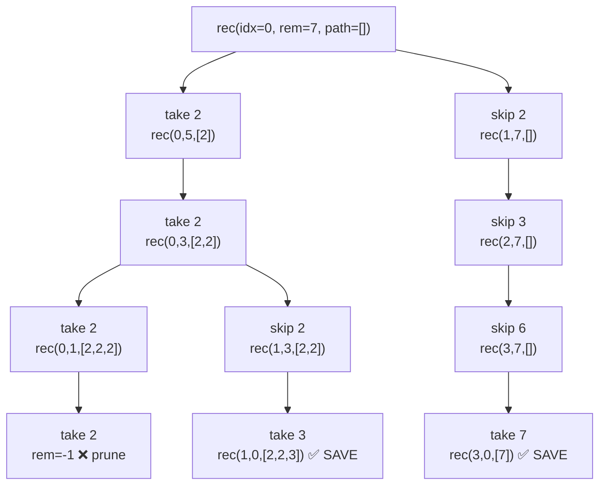

```text
candidates = [2, 3, 6, 7]
target = 7

Root:
    rec(idx=0, rem=7, path=[])

Branch take 2:
    path=[2], rem=5

Take 2 again:
    path=[2,2], rem=3

Take 2 again:
    path=[2,2,2], rem=1

Take 2 again:
    rem=-1
    prune

Backtrack to path=[2,2], rem=3

Skip 2:
    idx=1, rem=3

Take 3:
    path=[2,2,3]
    rem=0
    SAVE [2,2,3]

Backtrack to root

Skip 2:
    idx=1, rem=7

Skip 3, skip 6, take 7:
    path=[7]
    rem=0
    SAVE [7]

Final:
    [2,2,3]
    [7]
```

## Complexity

Exponential in target/min_candidate, Space O(target/min_candidate).

## Mental Model

> Use LCCM first: identify level, choices, constraint, and move before coding.

## Pattern Trigger


Use this when the problem asks to generate all combinations/strings/subsets by trying choices recursively.


---


---

# P11. Subsets

**Difficulty:** Easy  

**Pattern:** `Include / exclude at every index`


## Problem Statement

Given distinct numbers, return all subsets.

## Input

```text
nums = [1, 2, 3]
```

## Output

```text
[[], [1], [2], [3], [1,2], [1,3], [2,3], [1,2,3]]
```

## Optimal Backtracking Idea

At every index, choose to include nums[i] or exclude nums[i].

## LCCM


```text
Level = index in nums
Choices = include nums[i] or exclude nums[i]
Constraint = none
Move = include → recurse → remove → exclude
```


## Recursion Tree

```text
rec(i=0, path=[])
├── include 1 -> rec(1, [1])
│   ├── include 2 -> rec(2, [1,2])
│   │   ├── include 3 -> [1,2,3] ✅
│   │   └── exclude 3 -> [1,2] ✅
│   └── exclude 2 -> rec(2, [1])
│       ├── include 3 -> [1,3] ✅
│       └── exclude 3 -> [1] ✅
└── exclude 1 -> rec(1, [])
    ├── include 2 -> rec(2, [2])
    │   ├── include 3 -> [2,3] ✅
    │   └── exclude 3 -> [2] ✅
    └── exclude 2 -> rec(2, [])
        ├── include 3 -> [3] ✅
        └── exclude 3 -> [] ✅
```

## C++ Code

```cpp
#include <bits/stdc++.h>
using namespace std;

int n;
vector<int> arr;
vector<int> res;

void rec(int level) {
    if (level == n) {
        cout << "[ ";
        for (int x : res) cout << x << " ";
        cout << "]\n";
        return;
    }

    // take arr[level]
    res.push_back(arr[level]);
    rec(level + 1);
    res.pop_back();

    // skip arr[level]
    rec(level + 1);
}

signed main() {
    cin >> n;
    arr.resize(n);
    for (int i = 0; i < n; i++) cin >> arr[i];

    rec(0);
    return 0;
}
```

## Mermaid Tree Dry Run

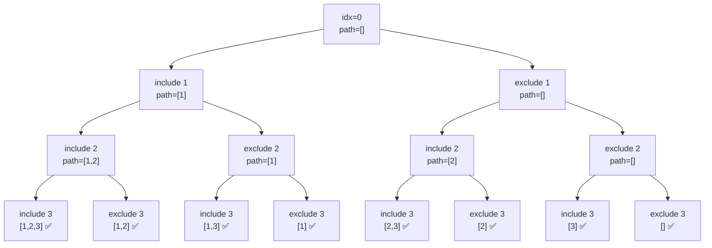

```text
nums = [1, 2, 3]

idx=0:
    include 1
        idx=1:
            include 2
                idx=2:
                    include 3 -> [1,2,3]
                    exclude 3 -> [1,2]

            exclude 2
                idx=2:
                    include 3 -> [1,3]
                    exclude 3 -> [1]

    exclude 1
        idx=1:
            include 2
                idx=2:
                    include 3 -> [2,3]
                    exclude 3 -> [2]

            exclude 2
                idx=2:
                    include 3 -> [3]
                    exclude 3 -> []

Final subsets:
    [1,2,3], [1,2], [1,3], [1],
    [2,3], [2], [3], []
```

## Complexity

Time O(n * 2^n), Space O(n) recursion path, excluding output.

## Mental Model

> Use LCCM first: identify level, choices, constraint, and move before coding.

## Pattern Trigger


Use this when the problem asks to generate all combinations/strings/subsets by trying choices recursively.


---


# Final Backtracking Revision Sheet

## Universal Backtracking Checklist

```text
1. What is LEVEL?
2. What are CHOICES at this level?
3. What CONSTRAINT rejects bad choices?
4. What is MOVE?
       add
       recurse
       remove
5. Is this:
       all results?
       true/false?
       count ways?
       min/max?
6. Do I need extra state?
       used[]
       open/close
       remaining sum
       start index
7. Do I need deduplication?
       sort
       skip same value
```

---

# Fast Pattern Recognition

| Problem Shape | Pattern |
|---|---|
| Generate all strings | Basic combinatorial search |
| Phone digits | Choices depend on digit |
| Palindrome cuts | Backtracking with pruning |
| Parentheses | Additional state open/close |
| Permutations | used[] state |
| Word break | OR aggregation |
| Decode ways | SUM aggregation |
| Coin change min | MIN aggregation |
| 3Sum | Sort + two pointers + dedup |
| Combination sum | Take/skip with reuse |
| Subsets | Include/exclude |

---

# Interview One-Liners

```text
Backtracking:
At each level, try every valid choice, recurse, then undo the choice.

Pruning:
Do not recurse into branches that can never lead to a valid answer.

Additional state:
When path alone is not enough, carry extra variables like used[], open, close, or remaining sum.

Aggregation:
If recursion returns true/count/min/max, combine child answers using OR, SUM, MIN, or MAX.

Deduplication:
Sort first, then skip repeated values at the same decision level.
```

---

🔥 End of handbook.


---


# Backtracking Pattern Recognition Table

| Problem shape | Level | Choices | Check | Move |
|---|---|---|---|---|
| generate strings | index | characters | length limit | push/recurse/pop |
| phone keypad | digit index | mapped letters | digit has mapping | push/recurse/pop |
| palindrome partition | start index | end index / substring | substring palindrome | push/recurse(end+1)/pop |
| valid parentheses | path length | '(' or ')' | open < n, close < open | push/recurse/pop |
| permutation | path position | unused element | used[i] == false | mark/push/recurse/pop/unmark |
| word break | start index | matching word | prefix match | dfs(start + len) |
| decode ways | index | one digit / two digits | valid number 1..26 | sum dfs(i+1), dfs(i+2) |
| coin change | index + remaining | take / skip | remaining >= 0 | take same idx, skip idx+1 |
| 3Sum | fixed i | left/right pair | skip duplicates | two pointer movement |
| combination sum | index + remaining | take / skip | remaining >= 0 | take same idx or next idx |
| subsets | index | include / exclude | none | push/recurse/pop/recurse |

# LCCM Decision Tree

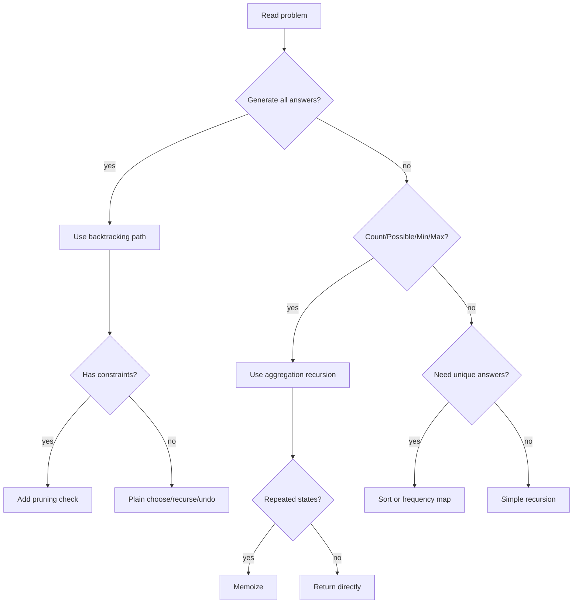

# Common Mistakes

## 1. Saving answer too early

Wrong:

```cpp
ans.push_back(path); // too early
```

Correct:

```cpp
if (base_case) {
    ans.push_back(path);
    return;
}
```

## 2. Forgetting undo step

Wrong:

```cpp
path.push_back(x);
dfs(...);
// missing pop_back
```

Correct:

```cpp
path.push_back(x);
dfs(...);
path.pop_back();
```

## 3. Wrong duplicate handling

For duplicate permutations, use frequency map.  
For combination / subset duplicates, sort and skip same-level duplicates.

## 4. Wrong level design

| Problem | Good level |
|---|---|
| strings | index / position |
| phone digits | digit index |
| subsets | index |
| permutation | path position |
| palindrome partition | start index |
| combination sum | index + remaining sum |
| word break | start index |
| decode ways | current index |

## 5. No pruning

Add pruning when:

- remaining target < 0
- close > open
- open > n
- substring is not palindrome
- word prefix does not match
- duplicate choice appears at same level

# Interview One-Liners

```text
Backtracking is recursion with choose, explore, and undo.
LCCM helps design recursion: Level, Choice, Check, Move.
For generate-all problems, save only at the base case.
For invalid branches, prune before recursion.
For possible/count/min/max problems, use aggregation recursion.
For repeated states, add memoization.
For duplicates, sort or use frequency map.
```

# Final 5-Second Pattern Identification Drill

| If you see... | Think... |
|---|---|
| Generate all combinations | Backtracking |
| Generate strings of fixed length | Level = position |
| Phone digits | Choice depends on current digit |
| Palindrome split | Level = start index, choice = cut |
| Valid parentheses | Extra state: open / close |
| Permutation | used[] or frequency map |
| Possible or not | OR aggregation |
| Count ways | SUM aggregation |
| Minimum coins | MIN aggregation |
| Duplicate triplets | Sort + skip duplicates |
| Combination sum | Take / skip by index |
| Subsets | Include / exclude |

---

🔥 End of 000-style-upgraded-to-001 handbook.
