# Graph Algorithms Complete Handbook — CP + DSA / FAANG

> Goal: one complete graph notebook for Competitive Programming and DSA interviews.
>
> Rendering rule used in this file:
>
> - Mental maps and term diagrams use **safe Mermaid only**.
> - All problem dry runs use **plain text tree style**, like recursion/backtracking notes.
> - No Mermaid is used inside dry-run sections, so you will not get `Unable to render rich display` there.

---

## Clickable Index

### 0. Master Maps
- [0.1 Graph Master Map](#01-graph-master-map)
- [0.2 Algorithm Selection Map](#02-algorithm-selection-map)
- [0.3 CP + DSA Graph Roadmap](#03-cp--dsa-graph-roadmap)

### 1. Graph Basics
- [1.1 Core Terms](#11-core-terms)
- [1.2 Graph Representation](#12-graph-representation)
- [1.3 Input Templates](#13-input-templates)
- [1.4 Graph Modelling Checklist](#14-graph-modelling-checklist)

### 2. Traversal
- [2.1 DFS](#21-dfs-depth-first-search)
- [2.2 BFS](#22-bfs-breadth-first-search)
- [2.3 Connected Components](#23-connected-components)
- [2.4 Bipartite Check](#24-bipartite-check)
- [2.5 Grid BFS / DFS](#25-grid-bfs--dfs)
- [2.6 Multi-Source BFS](#26-multi-source-bfs)
- [2.7 0-1 BFS](#27-0-1-bfs)

### 3. Cycles and DAG
- [3.1 Cycle Detection in Undirected Graph](#31-cycle-detection-in-undirected-graph)
- [3.2 Cycle Detection in Directed Graph](#32-cycle-detection-in-directed-graph)
- [3.3 Topological Sort — DFS](#33-topological-sort--dfs)
- [3.4 Topological Sort — Kahn](#34-topological-sort--kahn)
- [3.5 DAG DP](#35-dag-dp)

### 4. Shortest Path
- [4.1 BFS Shortest Path](#41-bfs-shortest-path)
- [4.2 Dijkstra](#42-dijkstra)
- [4.3 Bellman-Ford](#43-bellman-ford)
- [4.4 Floyd-Warshall](#44-floyd-warshall)
- [4.5 Shortest Path Formulation Patterns](#45-shortest-path-formulation-patterns)

### 5. MST and DSU
- [5.1 DSU](#51-dsu-disjoint-set-union)
- [5.2 Kruskal MST](#52-kruskal-mst)
- [5.3 Prim MST](#53-prim-mst)
- [5.4 MST Pattern Problems](#54-mst-pattern-problems)

### 6. Advanced CP Graphs
- [6.1 SCC — Kosaraju](#61-scc--kosaraju)
- [6.2 Bridges](#62-bridges)
- [6.3 Articulation Points](#63-articulation-points)
- [6.4 Euler Path / Circuit](#64-euler-path--circuit)
- [6.5 LCA Binary Lifting](#65-lca-binary-lifting)
- [6.6 Tree Diameter](#66-tree-diameter)
- [6.7 Tree DP / Rerooting Intro](#67-tree-dp--rerooting-intro)
- [6.8 Network Flow Intro](#68-network-flow-intro)
- [6.9 Bipartite Matching Intro](#69-bipartite-matching-intro)

### 7. Practice Problem Pack
- [P1. Number of Connected Components](#p1-number-of-connected-components)
- [P2. Shortest Path in Unweighted Graph](#p2-shortest-path-in-unweighted-graph)
- [P3. Escape from Monsters](#p3-escape-from-monsters)
- [P4. Course Schedule](#p4-course-schedule)
- [P5. Network Delay](#p5-network-delay)
- [P6. Cheapest Path With 0/1 Edges](#p6-cheapest-path-with-01-edges)
- [P7. Negative Cycle Detection](#p7-negative-cycle-detection)
- [P8. All Pairs Shortest Path](#p8-all-pairs-shortest-path)
- [P9. Minimum Cost to Connect Cities](#p9-minimum-cost-to-connect-cities)
- [P10. Count Islands](#p10-count-islands)
- [P11. Rotten Oranges](#p11-rotten-oranges)
- [P12. Alien Dictionary](#p12-alien-dictionary)
- [P13. Redundant Connection](#p13-redundant-connection)
- [P14. Number of Provinces](#p14-number-of-provinces)
- [P15. Cheapest Flights With K Stops](#p15-cheapest-flights-with-k-stops)
- [P16. Bridges in Graph](#p16-bridges-in-graph)
- [P17. Strongly Connected Components](#p17-strongly-connected-components)
- [P18. LCA Queries](#p18-lca-queries)

### 8. Final Revision
- [8.1 Complexity Table](#81-complexity-table)
- [8.2 Pattern Recognition Table](#82-pattern-recognition-table)
- [8.3 Template Pack](#83-template-pack)
- [8.4 Common Bugs](#84-common-bugs)

---

# 0.1 Graph Master Map

```mermaid
flowchart TD
    A["Graphs"] --> B["Basics"]
    A --> C["Traversal"]
    A --> D["Cycles and DAG"]
    A --> E["Shortest Path"]
    A --> F["MST and DSU"]
    A --> G["Advanced CP"]

    B --> B1["Node / Vertex"]
    B --> B2["Edge"]
    B --> B3["Directed"]
    B --> B4["Undirected"]
    B --> B5["Weighted"]

    C --> C1["DFS"]
    C --> C2["BFS"]
    C --> C3["Grid BFS / DFS"]
    C --> C4["Multi-Source BFS"]
    C --> C5["0-1 BFS"]

    D --> D1["Undirected Cycle"]
    D --> D2["Directed Cycle"]
    D --> D3["Topological Sort"]
    D --> D4["DAG DP"]

    E --> E1["BFS Shortest Path"]
    E --> E2["Dijkstra"]
    E --> E3["Bellman-Ford"]
    E --> E4["Floyd-Warshall"]

    F --> F1["DSU"]
    F --> F2["Kruskal"]
    F --> F3["Prim"]

    G --> G1["SCC"]
    G --> G2["Bridges"]
    G --> G3["Articulation Points"]
    G --> G4["LCA"]
    G --> G5["Flow / Matching"]
```

# 0.2 Algorithm Selection Map

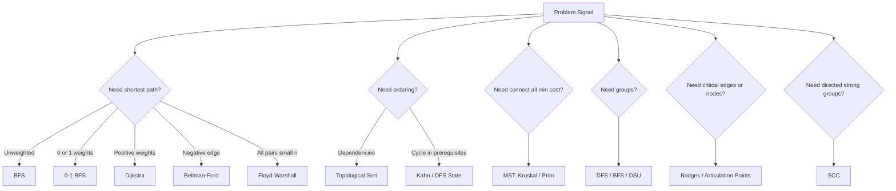

# 0.3 CP + DSA Graph Roadmap

| Phase | Topics | Target |
|---|---|---|
| 1 | representation, DFS, BFS | foundation |
| 2 | components, bipartite, grid BFS | interview medium |
| 3 | cycle detection, topo sort | course/dependency problems |
| 4 | shortest path: BFS, 0-1 BFS, Dijkstra | CP + FAANG core |
| 5 | Bellman-Ford, Floyd-Warshall | advanced shortest path |
| 6 | DSU, MST | greedy graph patterns |
| 7 | SCC, bridges, articulation | CP intermediate/advanced |
| 8 | LCA, tree DP, rerooting | tree graph mastery |
| 9 | flow, matching | advanced CP |

---

# 1.1 Core Terms

## Node and Edge

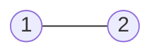

`1` and `2` are nodes. The line between them is an edge.

- `1` and `2` are nodes / vertices.
- `(1,2)` is an edge.

## Directed Graph

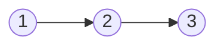

Direction matters: `1` can go to `2`, and `2` can go to `3`.

Direction matters. You can move only along the arrow.

## Undirected Graph

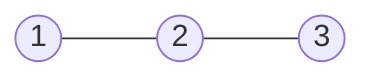

Undirected edge works both ways.

Edge works both ways.

## Weighted Graph

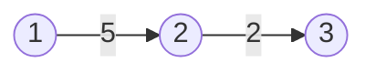

Each edge has a cost.

Each edge has cost.

## DAG

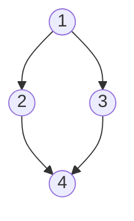

DAG = Directed Acyclic Graph. No directed path returns to an active node.

DAG = Directed Acyclic Graph. Used in prerequisites, build order, dependency ordering, DP on graph.

---

# 1.2 Graph Representation

## Edge List

Best for algorithms that process edges directly.

```cpp
vector<tuple<int,int,int>> edges; // u, v, w
```

Used in:

- Bellman-Ford
- Kruskal
- sorting edges

## Adjacency List

Best for sparse graph and traversal.

```cpp
vector<vector<int>> g(n + 1);
```

Weighted version:

```cpp
vector<vector<pair<int,int>>> g(n + 1); // {neighbor, weight}
```

## Adjacency Matrix

Best for dense graph or Floyd-Warshall.

```cpp
vector<vector<long long>> dist(n + 1, vector<long long>(n + 1, INF));
```

---

# 1.3 Input Templates

## Undirected Unweighted

```cpp
int n, m;
cin >> n >> m;
vector<vector<int>> g(n + 1);

for (int i = 0; i < m; i++) {
    int u, v;
    cin >> u >> v;
    g[u].push_back(v);
    g[v].push_back(u);
}
```

## Directed Unweighted

```cpp
int n, m;
cin >> n >> m;
vector<vector<int>> g(n + 1);

for (int i = 0; i < m; i++) {
    int u, v;
    cin >> u >> v;
    g[u].push_back(v);
}
```

## Weighted Directed

```cpp
int n, m;
cin >> n >> m;
vector<vector<pair<int,int>>> g(n + 1);

for (int i = 0; i < m; i++) {
    int u, v, w;
    cin >> u >> v >> w;
    g[u].push_back({v, w});
}
```

---

# 1.4 Graph Modelling Checklist

Before choosing an algorithm, answer this:

```text
Node       = What is one state? city, cell, word, course, mask?
Edge       = What transition is allowed?
Cost       = 1, 0/1, positive, negative?
Source     = one source or many sources?
Target     = one node, boundary, all nodes, minimum among many?
Visited    = node only or state tuple?
Answer     = distance, count, possible, order, min cost?
```

Examples:

| Problem | Node | Edge | Algorithm |
|---|---|---|---|
| Grid shortest path | `(r,c)` | 4-direction move | BFS |
| Word ladder | word | change one char | BFS |
| Course schedule | course | prerequisite | Topo |
| Network delay | city | weighted road | Dijkstra |
| Cheapest 0/1 path | node | 0/1 edge | 0-1 BFS |
| Build roads min cost | city | weighted connection | MST |

---

# 2.1 DFS Depth First Search

## Step-by-Step Working

```text
1. Start from a node/source.
2. Mark current node as visited.
3. Pick one unvisited neighbor and go deeper recursively.
4. Keep going deep until no unvisited neighbor exists.
5. Backtrack to the previous node.
6. Try the next unvisited neighbor.
7. Finish when all reachable nodes from the source are visited.
```

## Use Cases

| Use Case | Why DFS fits |
|---|---|
| Connected components | One DFS marks one full component |
| Cycle detection | DFS keeps parent/recursion-state information |
| Topological sort | Finish-time order comes naturally from DFS |
| Tree problems | Subtree traversal is recursive |
| Backtracking on graph/grid | DFS explores one path fully before trying another |


## Idea

### Graph Model — Mermaid

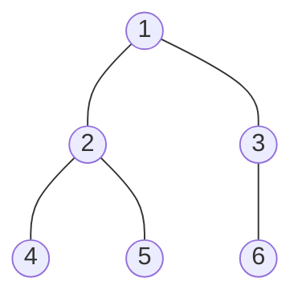

### DFS Call Model — Mermaid

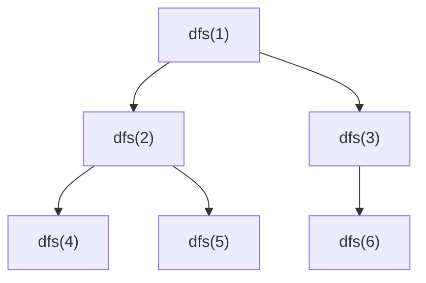


DFS goes deep, then backtracks.

```text
DFS Code Flow

DFS(u)
│
├── vis[u] = 1
│
├── scan adjacency list g[u]
│   │
│   ├── neighbor v is unvisited
│   │   └── call DFS(v)
│   │       └── after DFS(v) finishes, come back to u
│   │
│   └── neighbor v already visited
│       └── skip
│
└── no more neighbors
    └── return to parent call

Mental picture:
start -> go deep -> no child -> backtrack -> try next child
```

## C++ Code

```cpp
#include <bits/stdc++.h>
using namespace std;

vector<vector<int>> g;
vector<int> vis;

void dfs(int u) {
    vis[u] = 1;
    for (int v : g[u]) {
        if (!vis[v]) dfs(v);
    }
}

int main() {
    int n, m;
    cin >> n >> m;
    g.assign(n + 1, {});

    for (int i = 0; i < m; i++) {
        int u, v;
        cin >> u >> v;
        g[u].push_back(v);
        g[v].push_back(u);
    }

    vis.assign(n + 1, 0);
    dfs(1);
}
```

## Tree-Wise Dry Run

Graph:

```text
1 -- 2
1 -- 3
2 -- 4
2 -- 5
3 -- 6
```

```text
dfs(1) | visit 1
├── neighbor 2 unvisited
│   └── dfs(2) | visit 2
│       ├── neighbor 1 already visited -> skip
│       ├── neighbor 4 unvisited
│       │   └── dfs(4) | visit 4 -> return
│       └── neighbor 5 unvisited
│           └── dfs(5) | visit 5 -> return
└── neighbor 3 unvisited
    └── dfs(3) | visit 3
        ├── neighbor 1 already visited -> skip
        └── neighbor 6 unvisited
            └── dfs(6) | visit 6 -> return
```

## Index-by-Index Dry Run

| Step | Current call | Neighbor checked | Action | Visited |
|---:|---|---|---|---|
| 1 | dfs(1) | — | visit 1 | {1} |
| 2 | dfs(1) | 2 | call dfs(2) | {1} |
| 3 | dfs(2) | — | visit 2 | {1,2} |
| 4 | dfs(2) | 1 | visited, skip | {1,2} |
| 5 | dfs(2) | 4 | call dfs(4) | {1,2} |
| 6 | dfs(4) | — | visit 4, return | {1,2,4} |
| 7 | dfs(2) | 5 | call dfs(5) | {1,2,4} |
| 8 | dfs(5) | — | visit 5, return | {1,2,4,5} |
| 9 | dfs(1) | 3 | call dfs(3) | {1,2,4,5} |
| 10 | dfs(3) | 6 | call dfs(6) | {1,2,3,4,5} |
| 11 | dfs(6) | — | visit 6, return | {1,2,3,4,5,6} |

---

# 2.2 BFS Breadth First Search

## Step-by-Step Working

```text
1. Put source node in queue.
2. Set dist[source] = 0.
3. Pop the front node from queue.
4. Visit all unvisited neighbors.
5. Assign dist[neighbor] = dist[current] + 1.
6. Push newly visited neighbors into queue.
7. Continue until queue becomes empty.
```

## Use Cases

| Use Case | Why BFS fits |
|---|---|
| Shortest path in unweighted graph | First visit gives minimum edges |
| Grid shortest path | Each move has equal cost |
| Level order traversal | Queue naturally processes level by level |
| Minimum moves problems | Every move costs 1 |
| Word ladder/state graph | Each valid transformation is one edge |


## Idea

### Graph Model — Mermaid


### BFS Level Model — Mermaid

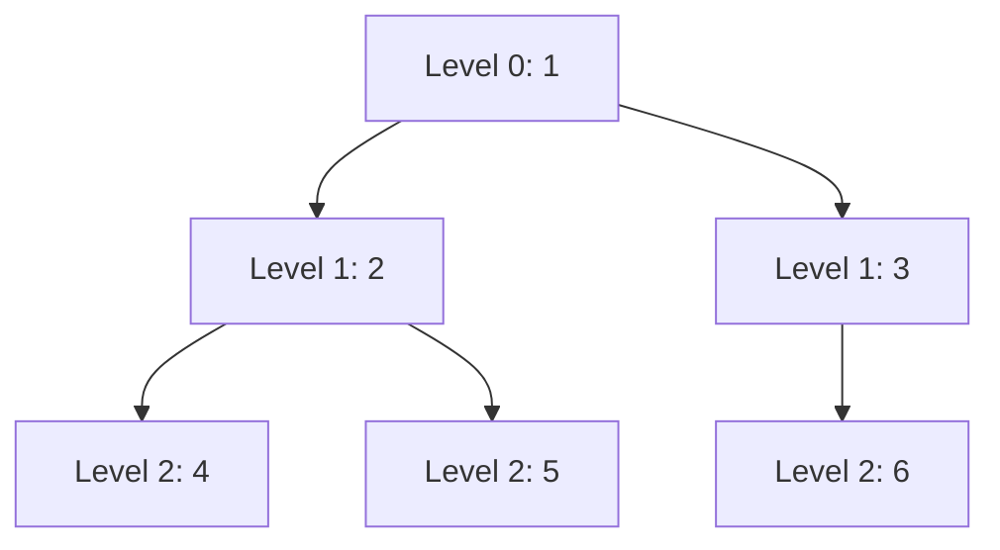


BFS explores level by level. It gives shortest path in unweighted graph.

```text
BFS Code Flow

Initialize
├── dist[src] = 0
└── queue = [src]

Loop while queue is not empty
├── pop front node u
├── scan all neighbors v of u
│   │
│   ├── if dist[v] == -1
│   │   ├── dist[v] = dist[u] + 1
│   │   └── push v into queue
│   │
│   └── else already visited
│       └── skip
│
└── when queue becomes empty, all reachable nodes are processed

Level picture:
source -> distance 1 nodes -> distance 2 nodes -> distance 3 nodes
```

## C++ Code

```cpp
#include <bits/stdc++.h>
using namespace std;

int main() {
    int n, m;
    cin >> n >> m;
    vector<vector<int>> g(n + 1);

    for (int i = 0; i < m; i++) {
        int u, v;
        cin >> u >> v;
        g[u].push_back(v);
        g[v].push_back(u);
    }

    int src;
    cin >> src;

    vector<int> dist(n + 1, -1);
    queue<int> q;

    dist[src] = 0;
    q.push(src);

    while (!q.empty()) {
        int u = q.front();
        q.pop();

        for (int v : g[u]) {
            if (dist[v] == -1) {
                dist[v] = dist[u] + 1;
                q.push(v);
            }
        }
    }

    for (int i = 1; i <= n; i++) cout << dist[i] << ' ';
}
```

## Tree-Wise Dry Run

```text
Level 0: 1 | dist[1]=0
├── Level 1: 2 | dist[2]=1
│   ├── Level 2: 4 | dist[4]=2
│   └── Level 2: 5 | dist[5]=2
└── Level 1: 3 | dist[3]=1
    └── Level 2: 6 | dist[6]=2
```

## Index-by-Index Queue Dry Run

| Step | Queue before | Pop | Newly pushed | Distance update |
|---:|---|---:|---|---|
| 1 | [1] | 1 | 2, 3 | d2=1, d3=1 |
| 2 | [2,3] | 2 | 4, 5 | d4=2, d5=2 |
| 3 | [3,4,5] | 3 | 6 | d6=2 |
| 4 | [4,5,6] | 4 | none | — |
| 5 | [5,6] | 5 | none | — |
| 6 | [6] | 6 | none | — |

---

# 2.3 Connected Components

## Step-by-Step Working

```text
1. Initialize all nodes as unvisited.
2. Iterate nodes from 1 to n.
3. When an unvisited node is found, start DFS/BFS from it.
4. That traversal marks all nodes in the same component.
5. Increase component count by 1.
6. Continue scanning remaining nodes.
```

## Use Cases

| Use Case | Meaning |
|---|---|
| Count groups | Number of independent graph parts |
| Provinces/friend circles | Each component is one province/group |
| Island counting | Each island is one grid component |
| Connectivity preprocessing | Know which nodes belong together |


## Problem Statement

Given an undirected graph, count connected components.

## Input

```text
6 3
1 2
2 3
4 5
```

## Output

```text
3
```

## C++ Code

```cpp
#include <bits/stdc++.h>
using namespace std;

vector<vector<int>> g;
vector<int> vis;

void dfs(int u) {
    vis[u] = 1;
    for (int v : g[u]) {
        if (!vis[v]) dfs(v);
    }
}

int main() {
    int n, m;
    cin >> n >> m;
    g.assign(n + 1, {});

    for (int i = 0; i < m; i++) {
        int u, v;
        cin >> u >> v;
        g[u].push_back(v);
        g[v].push_back(u);
    }

    vis.assign(n + 1, 0);
    int components = 0;

    for (int i = 1; i <= n; i++) {
        if (!vis[i]) {
            components++;
            dfs(i);
        }
    }

    cout << components << '\n';
}
```

## Tree-Wise Dry Run

```text
for i = 1..6
├── i=1 unvisited -> components=1
│   └── dfs(1)
│       └── dfs(2)
│           └── dfs(3)
├── i=2 visited -> skip
├── i=3 visited -> skip
├── i=4 unvisited -> components=2
│   └── dfs(4)
│       └── dfs(5)
├── i=5 visited -> skip
└── i=6 unvisited -> components=3
    └── dfs(6)
```

## Index-by-Index Dry Run

| i | visited before? | Action | components |
|---:|---|---|---:|
| 1 | no | start dfs(1), visits 1,2,3 | 1 |
| 2 | yes | skip | 1 |
| 3 | yes | skip | 1 |
| 4 | no | start dfs(4), visits 4,5 | 2 |
| 5 | yes | skip | 2 |
| 6 | no | start dfs(6) | 3 |

---

# 2.4 Bipartite Check

## Step-by-Step Working

```text
1. Keep color[node] = -1 initially.
2. Start BFS/DFS from each uncolored node.
3. Color source as 0.
4. For every edge u-v:
   ├── if v is uncolored, color[v] = color[u] ^ 1
   ├── if v already has opposite color, continue
   └── if v has same color as u, graph is not bipartite
5. If no conflict appears, graph is bipartite.
```

## Use Cases

| Use Case | Why bipartite matters |
|---|---|
| Two-team/group partition | Adjacent/conflicting nodes must be opposite |
| Odd cycle detection | Undirected graph is bipartite iff no odd cycle |
| Matching problems | Bipartite matching needs left/right partition |
| Coloring constraints | Two-color feasibility problem |


## Idea

### Graph Model — Mermaid

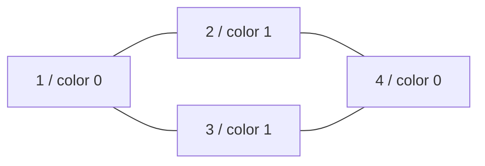


A graph is bipartite if every node can be colored with two colors and no edge connects same color.

```text
Bipartite Coloring Code Flow

Start BFS from any uncolored node
├── color[start] = 0
├── push start into queue
│
├── pop u
│   └── scan every neighbor v
│       │
│       ├── v is uncolored
│       │   ├── color[v] = color[u] ^ 1
│       │   └── push v
│       │
│       ├── v is already colored differently
│       │   └── valid edge
│       │
│       └── v has same color as u
│           └── not bipartite

Example valid shape:

Color 0:   1       4
           |\     /
           | \   /
Color 1:   2   3

Every edge crosses between color 0 and color 1.
```

## C++ Code

```cpp
#include <bits/stdc++.h>
using namespace std;

bool isBipartite(int n, vector<vector<int>>& g) {
    vector<int> color(n + 1, -1);

    for (int start = 1; start <= n; start++) {
        if (color[start] != -1) continue;

        queue<int> q;
        color[start] = 0;
        q.push(start);

        while (!q.empty()) {
            int u = q.front();
            q.pop();

            for (int v : g[u]) {
                if (color[v] == -1) {
                    color[v] = color[u] ^ 1;
                    q.push(v);
                } else if (color[v] == color[u]) {
                    return false;
                }
            }
        }
    }

    return true;
}
```

## Tree-Wise Dry Run

Graph:

```text
1 -- 2
1 -- 3
2 -- 4
3 -- 4
```

```text
start 1 -> color[1]=0
├── neighbor 2 uncolored -> color[2]=1
├── neighbor 3 uncolored -> color[3]=1
├── pop 2
│   └── neighbor 4 uncolored -> color[4]=0
└── pop 3
    └── neighbor 4 already color 0, different from color[3]=1 -> ok
```

## Index-by-Index Dry Run

| Step | Node | Action | Colors |
|---:|---:|---|---|
| 1 | 1 | color 0 | 1:0 |
| 2 | 2 | color opposite of 1 | 1:0, 2:1 |
| 3 | 3 | color opposite of 1 | 1:0, 2:1, 3:1 |
| 4 | 4 | color opposite of 2 | 1:0, 2:1, 3:1, 4:0 |
| 5 | edge 3-4 | colors differ | valid |

---

# 2.5 Grid BFS / DFS

## Step-by-Step Working

```text
1. Treat every valid cell as a graph node.
2. From cell (r,c), generate neighbors using dx/dy.
3. Skip outside cells.
4. Skip blocked/wall cells.
5. Apply BFS for shortest path or DFS for component exploration.
6. Store visited/dist in a 2D array.
```

## Use Cases

| Use Case | Algorithm choice |
|---|---|
| Shortest path in maze | BFS |
| Count islands/rooms | DFS or BFS |
| Flood fill | DFS or BFS |
| Fire/monster spread | Multi-source BFS |
| Minimum steps in matrix | BFS |


## Idea

### Grid as Graph Model — Mermaid

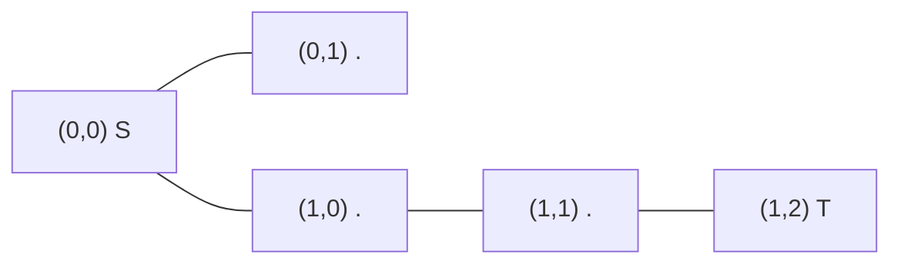


A grid is an implicit graph.

```text
Grid to Graph Conversion

Grid:
S . #
. . T

Each open cell is a node:
(0,0)=S, (0,1), (1,0), (1,1), (1,2)=T

Edges come from 4-direction moves:
(0,0) -- (0,1)
  |
(1,0) -- (1,1) -- (1,2)

# cell is blocked, so no edge goes through it.

Code movement:
for d = 0..3
├── nx = x + dx[d]
├── ny = y + dy[d]
├── if outside grid -> skip
├── if wall '#' -> skip
└── otherwise this neighbor is reachable
```

## C++ Grid Template

```cpp
int dx[4] = {1, -1, 0, 0};
int dy[4] = {0, 0, 1, -1};

bool inside(int x, int y, int n, int m) {
    return x >= 0 && y >= 0 && x < n && y < m;
}
```

## Tree-Wise Dry Run

Grid:

```text
S . .
# # .
. . T
```

```text
BFS from S=(0,0)
├── level 0: (0,0)
├── level 1: (0,1)
├── level 2: (0,2)
├── level 3: (1,2)
└── level 4: (2,2) target
```

---

# 2.6 Multi-Source BFS

## Step-by-Step Working

```text
1. Identify all starting sources.
2. Push all sources into queue initially.
3. Set dist[source] = 0 for every source.
4. Run normal BFS.
5. The first time a node/cell is reached, it is reached from the nearest source.
```

## Use Cases

| Use Case | Meaning |
|---|---|
| Rotten oranges | All rotten cells spread together |
| Monsters/fire escape | Enemy/fire wave starts from many cells |
| Nearest zero/hospital | Distance to closest source |
| Multi-start shortest path | Several valid starting nodes |


## Idea

### Multi-Source Wave Model — Mermaid

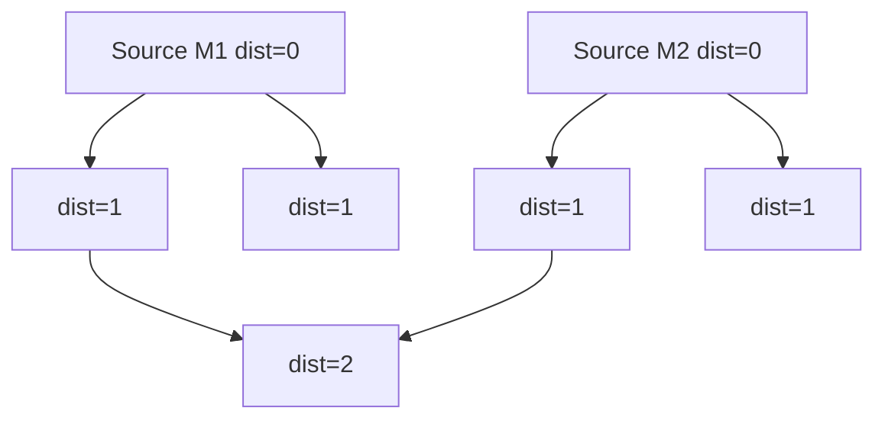


Push all sources first with distance `0`. Then normal BFS.

```text
Multi-Source BFS Code Flow

Initial queue contains ALL sources:
queue = [source1, source2, source3, ...]

All sources start together:
dist[source1] = 0
dist[source2] = 0
dist[source3] = 0

Wave expansion picture:

Time 0:   M . . . M
          |       |
Time 1:   . .   . .
          |       |
Time 2:     . . .

Meaning:
The first time a cell/node is reached, it is reached by the nearest source.

Code movement:
pop current cell/node
├── try all neighbors
├── if new shorter distance found
│   ├── update dist
│   └── push neighbor
└── continue until queue empty
```

Used for:

- nearest monster
- nearest zero
- fire spread
- rotting oranges
- nearest hospital

## C++ Code

```cpp
#include <bits/stdc++.h>
using namespace std;

const int INF = 1e9;
int dx[4] = {1, -1, 0, 0};
int dy[4] = {0, 0, 1, -1};

vector<vector<int>> multiSourceBFS(vector<string>& grid, vector<pair<int,int>> sources) {
    int n = grid.size(), m = grid[0].size();
    vector<vector<int>> dist(n, vector<int>(m, INF));
    queue<pair<int,int>> q;

    for (auto [x, y] : sources) {
        dist[x][y] = 0;
        q.push({x, y});
    }

    while (!q.empty()) {
        auto [x, y] = q.front();
        q.pop();

        for (int d = 0; d < 4; d++) {
            int nx = x + dx[d], ny = y + dy[d];
            if (nx < 0 || ny < 0 || nx >= n || ny >= m) continue;
            if (grid[nx][ny] == '#') continue;

            if (dist[nx][ny] > dist[x][y] + 1) {
                dist[nx][ny] = dist[x][y] + 1;
                q.push({nx, ny});
            }
        }
    }

    return dist;
}
```

## Tree-Wise Dry Run

Grid:

```text
M . .
. # .
. . M
```

```text
Initial queue:
├── (0,0) dist=0
└── (2,2) dist=0

Expansion tree:
├── source (0,0)
│   ├── (0,1) dist=1
│   │   └── (0,2) dist=2
│   └── (1,0) dist=1
│       └── (2,0) dist=2
└── source (2,2)
    ├── (1,2) dist=1
    │   └── (0,2) already has dist=2
    └── (2,1) dist=1
        └── (2,0) already has dist=2
```

## Index-by-Index Queue Dry Run

| Step | Queue before | Pop | Push | Meaning |
|---:|---|---|---|---|
| 1 | [(0,0),(2,2)] | (0,0) | (0,1),(1,0) | wave from first monster |
| 2 | [(2,2),(0,1),(1,0)] | (2,2) | (1,2),(2,1) | wave from second monster |
| 3 | [(0,1),(1,0),(1,2),(2,1)] | (0,1) | (0,2) | dist 2 |
| 4 | [...] | (1,0) | (2,0) | dist 2 |

---

# 2.7 0-1 BFS

## Step-by-Step Working

```text
1. Use deque instead of normal queue.
2. Set dist[source] = 0.
3. Pop node from front.
4. For every edge u -> v:
   ├── if weight is 0 and improves dist[v], push_front(v)
   └── if weight is 1 and improves dist[v], push_back(v)
5. Continue until deque is empty.
```

## Use Cases

| Use Case | Why 0-1 BFS fits |
|---|---|
| Edge weights are only 0 and 1 | Faster than Dijkstra |
| Minimum reversals | Original edge cost 0, reversed edge cost 1 |
| Grid with free/paid moves | Free move = 0, paid move = 1 |
| State transition with binary cost | Deque preserves shortest order |


## Idea

### Graph Model — Mermaid

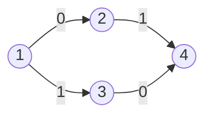


For edge weights only `0` and `1`:

```text
0-1 BFS Deque Idea

If edge cost = 0:
current distance does not increase
└── push_front(v), because v should be processed soon

If edge cost = 1:
distance increases by 1
└── push_back(v), because it is slightly farther

Graph example:

1 --0--> 2 --1--> 4
|                  ^
1                  |0
v                  |
3 -----------------+

Deque behavior:
start dq=[1]
├── 1->2 cost 0 -> push_front(2)
└── 1->3 cost 1 -> push_back(3)

So nodes with cheaper current distance stay near the front.
```

## C++ Code

```cpp
#include <bits/stdc++.h>
using namespace std;
const int INF = 1e9;

vector<int> zeroOneBFS(int n, vector<vector<pair<int,int>>>& g, int src) {
    vector<int> dist(n + 1, INF);
    deque<int> dq;

    dist[src] = 0;
    dq.push_front(src);

    while (!dq.empty()) {
        int u = dq.front();
        dq.pop_front();

        for (auto [v, w] : g[u]) {
            if (dist[v] > dist[u] + w) {
                dist[v] = dist[u] + w;
                if (w == 0) dq.push_front(v);
                else dq.push_back(v);
            }
        }
    }

    return dist;
}
```

## Tree-Wise Dry Run

Graph:

```text
1 --0--> 2
1 --1--> 3
2 --1--> 4
3 --0--> 4
```

```text
start dq=[1], d1=0
└── pop 1
    ├── edge 1->2 cost 0 -> d2=0 -> push_front 2
    └── edge 1->3 cost 1 -> d3=1 -> push_back 3
        dq becomes [2,3]
        └── pop 2
            └── edge 2->4 cost 1 -> d4=1 -> push_back 4
                dq becomes [3,4]
                └── pop 3
                    └── edge 3->4 cost 0 -> candidate 1, no improvement
```

## Index-by-Index Dry Run

| Step | dq before | pop | Relax | dq after | dist |
|---:|---|---:|---|---|---|
| 1 | [1] | 1 | 1->2 cost0 | [2] | d2=0 |
| 2 | [2] then [2,3] | 1 | 1->3 cost1 | [2,3] | d3=1 |
| 3 | [2,3] | 2 | 2->4 cost1 | [3,4] | d4=1 |
| 4 | [3,4] | 3 | 3->4 cost0 no improve | [4] | d4=1 |

---

# 3.1 Cycle Detection in Undirected Graph

## Step-by-Step Working

```text
1. Run DFS with parent parameter.
2. Mark current node visited.
3. For every neighbor:
   ├── if neighbor is unvisited, DFS(neighbor, current)
   ├── if neighbor is parent, ignore it
   └── if neighbor is visited and not parent, cycle exists
```

## Use Cases

| Use Case | Meaning |
|---|---|
| Detect redundant edge | Extra edge creates cycle |
| Validate tree | Tree must be connected and acyclic |
| Undirected graph sanity check | Find whether graph has loop structure |
| Kruskal intuition | DSU also detects same idea |


## Idea

### Graph Model — Mermaid

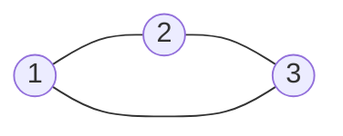

### DFS Cycle Model — Mermaid

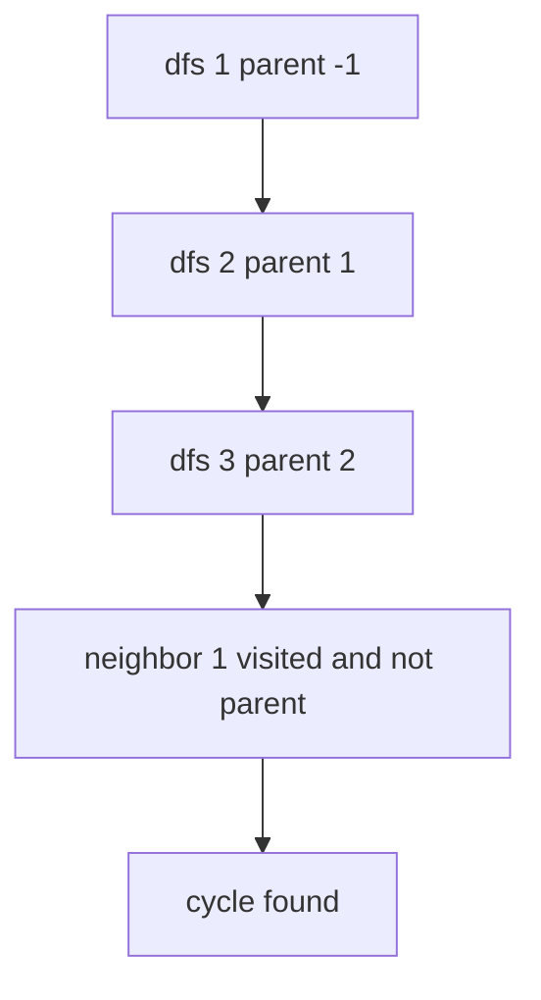


If DFS reaches a visited node that is not parent, cycle exists.

```text
Undirected Cycle Code Flow

DFS(u, parent)
├── mark u visited
├── scan neighbors v
│   │
│   ├── v is not visited
│   │   └── DFS(v, u)
│   │
│   ├── v is visited AND v == parent
│   │   └── this is the edge we used to come here, ignore
│   │
│   └── v is visited AND v != parent
│       └── another path reached an old node -> cycle found

Graph example:

    1
   / \
  2---3

DFS tree path:
1 -> 2 -> 3

Back edge detected:
3 -> 1

Cycle:
1 -> 2 -> 3 -> 1
```

## C++ Code

```cpp
bool dfsCycle(int u, int parent, vector<vector<int>>& g, vector<int>& vis) {
    vis[u] = 1;

    for (int v : g[u]) {
        if (!vis[v]) {
            if (dfsCycle(v, u, g, vis)) return true;
        } else if (v != parent) {
            return true;
        }
    }

    return false;
}
```

## Tree-Wise Dry Run

Input edges:

```text
1-2, 2-3, 3-1
```

```text
dfs(1, parent=-1)
└── dfs(2, parent=1)
    ├── neighbor 1 is parent -> ignore
    └── dfs(3, parent=2)
        ├── neighbor 2 is parent -> ignore
        └── neighbor 1 is visited and 1 != parent
            └── cycle found
```

---

# 3.2 Cycle Detection in Directed Graph

## Step-by-Step Working

```text
1. Use state array: 0=unvisited, 1=active, 2=finished.
2. When DFS enters node u, set state[u]=1.
3. For every directed edge u -> v:
   ├── if state[v]=0, DFS(v)
   ├── if state[v]=1, back edge found -> cycle
   └── if state[v]=2, already safe
4. When all neighbors finish, set state[u]=2.
```

## Use Cases

| Use Case | Meaning |
|---|---|
| Course schedule possible? | Cycle means impossible prerequisites |
| Build/dependency graph | Cyclic dependency is invalid |
| Topological sort validation | Only DAG can be topologically sorted |
| Deadlock-style dependency cycle | Active recursion path detects loop |


## Idea

### Graph Model — Mermaid

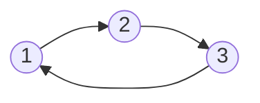


Use state array:

```text
0 = unvisited
1 = currently in recursion stack
2 = fully processed
```

If DFS sees state `1`, cycle exists.

```text
Directed Cycle Code Flow

DFS(u) starts
├── state[u] = 1   // active in current path
├── scan directed edges u -> v
│   │
│   ├── state[v] = 0
│   │   └── DFS(v)
│   │
│   ├── state[v] = 1
│   │   └── v is already in current recursion path -> cycle
│   │
│   └── state[v] = 2
│       └── v already fully processed -> safe
│
└── state[u] = 2   // finished

Graph example:

1 ---> 2 ---> 3
^             |
|             v
+-------------+

Current active path: 1 -> 2 -> 3
When 3 sees edge 3 -> 1, state[1] is still 1.
So directed cycle exists.
```

## C++ Code

```cpp
bool dfsDirectedCycle(int u, vector<vector<int>>& g, vector<int>& state) {
    state[u] = 1;

    for (int v : g[u]) {
        if (state[v] == 0) {
            if (dfsDirectedCycle(v, g, state)) return true;
        } else if (state[v] == 1) {
            return true;
        }
    }

    state[u] = 2;
    return false;
}
```

## Tree-Wise Dry Run

```text
dfs(1) -> state[1]=1
└── dfs(2) -> state[2]=1
    └── dfs(3) -> state[3]=1
        └── edge 3->1
            └── state[1]=1 means 1 is in current call path
                └── directed cycle found
```

---

# 3.3 Topological Sort — DFS

## Step-by-Step Working

```text
1. Run DFS on every unvisited node.
2. Visit all outgoing neighbors first.
3. After all children are finished, push current node into topo list.
4. Reverse the final list.
5. Result is a valid dependency order for a DAG.
```

## Use Cases

| Use Case | Meaning |
|---|---|
| Dependency ordering | Parent before dependent task |
| Course schedule order | Prerequisite before course |
| Build order | Compile dependencies first |
| DAG DP | Need processing order before transitions |


## Idea

### DAG Model — Mermaid

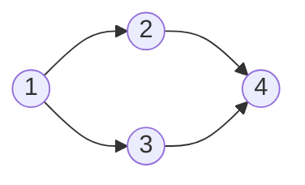


In DAG, node is pushed after processing all children. Reverse the order.

```text
DFS Topological Sort Code Flow

DFS(u)
├── mark u visited
├── first finish all nodes depending on u
│   ├── DFS(child1)
│   ├── DFS(child2)
│   └── ...
├── push u into topo list AFTER children
└── return

Why reverse?
Children are pushed before parent.
So final list is reverse finish order.

Example DAG:

1 ---> 2 ---> 4
|             ^
v             |
3 ------------+

DFS push order can be:
4, 2, 3, 1

Reverse gives topological order:
1, 3, 2, 4
```

## C++ Code

```cpp
void dfsTopo(int u, vector<vector<int>>& g, vector<int>& vis, vector<int>& topo) {
    vis[u] = 1;
    for (int v : g[u]) {
        if (!vis[v]) dfsTopo(v, g, vis, topo);
    }
    topo.push_back(u);
}
```

## Tree-Wise Dry Run

Graph:

```text
1 -> 2
1 -> 3
2 -> 4
3 -> 4
```

```text
dfs(1)
├── dfs(2)
│   └── dfs(4)
│       └── push 4
│   └── push 2
├── dfs(3)
│   └── neighbor 4 already visited
│   └── push 3
└── push 1

before reverse = [4,2,3,1]
after reverse  = [1,3,2,4]
```

---

# 3.4 Topological Sort — Kahn

## Step-by-Step Working

```text
1. Compute indegree of every node.
2. Push all indegree-0 nodes into queue.
3. Pop one node and append to topo order.
4. For each outgoing edge u -> v, reduce indegree[v].
5. If indegree[v] becomes 0, push v.
6. If topo size < n at the end, graph has a cycle.
```

## Use Cases

| Use Case | Why Kahn fits |
|---|---|
| Course schedule | Natural prerequisite removal |
| Detect cycle in DAG problem | topo size check |
| Lexicographically smallest topo | Use priority queue instead of queue |
| Task scheduling | Process tasks with no pending dependency |


## Idea

### DAG Model — Mermaid


Use indegree and queue of zero-indegree nodes.

```text
Kahn Topological Sort Code Flow

indegree[v] = number of prerequisites before v

Start:
├── push all nodes with indegree 0
│
Loop:
├── pop u from queue
├── add u to topo order
├── remove outgoing edges u -> v logically
│   └── indegree[v]--
└── if indegree[v] becomes 0
    └── push v

Example:

1 ---> 2 ---> 4
|             ^
v             |
3 ------------+

Initial indegree:
1:0, 2:1, 3:1, 4:2

Queue movement:
[1] -> pop 1 -> push 2,3 -> [2,3]
[2,3] -> pop 2 -> indeg[4]=1
[3] -> pop 3 -> indeg[4]=0 -> push 4
[4] -> pop 4 -> done
```

## C++ Code

```cpp
vector<int> topoKahn(int n, vector<vector<int>>& g) {
    vector<int> indeg(n + 1, 0);
    for (int u = 1; u <= n; u++) {
        for (int v : g[u]) indeg[v]++;
    }

    queue<int> q;
    for (int i = 1; i <= n; i++) {
        if (indeg[i] == 0) q.push(i);
    }

    vector<int> topo;
    while (!q.empty()) {
        int u = q.front();
        q.pop();
        topo.push_back(u);

        for (int v : g[u]) {
            indeg[v]--;
            if (indeg[v] == 0) q.push(v);
        }
    }

    return topo;
}
```

## Tree-Wise Dry Run

```text
Initial indegree:
1:0, 2:1, 3:1, 4:2

Queue=[1]
└── pop 1 -> topo=[1]
    ├── remove 1->2 -> indeg[2]=0 -> push 2
    └── remove 1->3 -> indeg[3]=0 -> push 3
        Queue=[2,3]
        ├── pop 2 -> topo=[1,2]
        │   └── remove 2->4 -> indeg[4]=1
        └── pop 3 -> topo=[1,2,3]
            └── remove 3->4 -> indeg[4]=0 -> push 4
                └── pop 4 -> topo=[1,2,3,4]
```

---

# 3.5 DAG DP

## Step-by-Step Working

```text
1. Confirm graph is DAG.
2. Get topological order.
3. Initialize dp[source] or base states.
4. Process nodes in topo order.
5. Relax/push dp value through outgoing edges.
6. Final answer is stored in target/all dp states.
```

## Use Cases

| Use Case | DP meaning |
|---|---|
| Count paths in DAG | dp[v] += dp[u] |
| Longest path in DAG | dp[v] = max(dp[v], dp[u] + weight) |
| Minimum cost dependency path | relax in topo order |
| Number of ways to complete tasks | Dependencies form DAG |


## Idea

### DAG DP Model — Mermaid

```mermaid
flowchart LR
    A["1: dp=1"] --> B["2: dp += dp1"]
    A --> C["3: dp += dp1"]
    B --> D["4: dp += dp2"]
    C --> D["4: dp += dp3"]
```


If graph is DAG, process nodes in topological order and relax transitions.

```text
DAG DP Code Flow

1. Get topological order
2. Initialize dp[source] or base values
3. Process nodes from left to right in topo order
4. Push answer forward through edges

Example graph:

1 ---> 2 ---> 4
|             ^
v             |
3 ------------+

Topo order: [1, 2, 3, 4]

Count paths from 1:
dp[1] = 1
├── process 1: dp[2]+=1, dp[3]+=1
├── process 2: dp[4]+=dp[2] => 1
├── process 3: dp[4]+=dp[3] => 2
└── process 4: final dp[4]=2
```

Used for:

- longest path in DAG
- count paths in DAG
- minimum cost with dependencies

## C++ Template

```cpp
vector<int> topo = topoKahn(n, g);
vector<long long> dp(n + 1, 0);
dp[src] = 1;

for (int u : topo) {
    for (int v : g[u]) {
        dp[v] += dp[u]; // count paths example
    }
}
```

## Tree-Wise Dry Run

```text
topo order = [1,2,3,4]
dp[1]=1
├── process 1 -> add to 2 and 3
│   ├── dp[2]=1
│   └── dp[3]=1
├── process 2 -> add to 4 -> dp[4]=1
└── process 3 -> add to 4 -> dp[4]=2
```

---

# 4.1 BFS Shortest Path

Same as BFS when all edges have cost 1.

## Tree-Wise Dry Run

```text
source 1 distance 0
├── nodes reachable in 1 edge: 2,3
│   ├── nodes reachable in 2 edges from 2: 4,5
│   └── nodes reachable in 2 edges from 3: 6
└── first time visiting a node gives shortest distance
```

---

# 4.2 Dijkstra

## Step-by-Step Working

```text
1. Set all distances to INF.
2. Set dist[source] = 0.
3. Push (0, source) into min-priority queue.
4. Always pop the node with smallest current distance.
5. Ignore stale priority queue entries.
6. Relax all outgoing positive-weight edges.
7. Repeat until queue is empty.
```

## Use Cases

| Use Case | Why Dijkstra fits |
|---|---|
| Road/network delay | Non-negative travel times |
| Cheapest path with positive weights | Greedy min-distance expansion |
| Weighted grid | Moving cost is positive |
| State graph with positive cost | Priority queue handles different costs |


## Use When

### Weighted Graph Model — Mermaid

```mermaid
flowchart LR
    A((1)) -->|2| B((2))
    A -->|5| C((3))
    B -->|1| C
    B -->|2| D((4))
    C -->|1| E((5))
    D -->|3| E
```


- weighted graph
- non-negative weights
- single-source shortest path

## C++ Code

```cpp
#include <bits/stdc++.h>
using namespace std;
const long long INF = 4e18;

vector<long long> dijkstra(int n, vector<vector<pair<int,int>>>& g, int src) {
    vector<long long> dist(n + 1, INF);
    priority_queue<pair<long long,int>, vector<pair<long long,int>>, greater<pair<long long,int>>> pq;

    dist[src] = 0;
    pq.push({0, src});

    while (!pq.empty()) {
        auto [du, u] = pq.top();
        pq.pop();

        if (du != dist[u]) continue;

        for (auto [v, w] : g[u]) {
            if (dist[v] > dist[u] + w) {
                dist[v] = dist[u] + w;
                pq.push({dist[v], v});
            }
        }
    }

    return dist;
}
```

## Tree-Wise Dry Run

Input:

```text
1->2 cost 2
1->3 cost 5
2->3 cost 1
2->4 cost 2
3->5 cost 1
4->5 cost 3
```

```text
pq={(0,1)}, dist[1]=0
└── pop 1
    ├── relax 1->2 -> dist[2]=2
    └── relax 1->3 -> dist[3]=5
        pq={(2,2),(5,3)}
        └── pop 2
            ├── relax 2->3 -> dist[3]=3 better than 5
            └── relax 2->4 -> dist[4]=4
                pq={(3,3),(4,4),(5,3 old)}
                └── pop 3
                    └── relax 3->5 -> dist[5]=4
```

## Index-by-Index Dry Run

| Step | Pop | Relaxation | Dist array for nodes 1..5 |
|---:|---|---|---|
| 1 | 1 | d2=2, d3=5 | [0,2,5,INF,INF] |
| 2 | 2 | d3=3, d4=4 | [0,2,3,4,INF] |
| 3 | 3 | d5=4 | [0,2,3,4,4] |
| 4 | 4 | no improvement | [0,2,3,4,4] |
| 5 | 5 | done | [0,2,3,4,4] |

---

# 4.3 Bellman-Ford

## Step-by-Step Working

```text
1. Store graph as edge list.
2. Set dist[source] = 0, all others INF.
3. Repeat n-1 times:
   └── try relaxing every edge.
4. After n-1 passes, all shortest simple paths are finalized.
5. Do one extra pass.
6. If any edge still relaxes, a negative cycle exists.
```

## Use Cases

| Use Case | Why Bellman-Ford fits |
|---|---|
| Negative edge weights | Dijkstra is unsafe with negative edges |
| Negative cycle detection | Extra relaxation detects it |
| Currency arbitrage style problems | Profitable cycle maps to negative cycle |
| Small/medium graph shortest path | Simpler than advanced algorithms |


## Use When

### Negative Edge Graph Model — Mermaid

```mermaid
flowchart LR
    A((1)) -->|1| B((2))
    B -->|-1| C((3))
    C -->|-1| A
```


- negative edges exist
- need negative cycle detection

## C++ Code

```cpp
struct Edge {
    int u, v;
    long long w;
};

vector<long long> bellmanFord(int n, vector<Edge>& edges, int src) {
    const long long INF = 4e18;
    vector<long long> dist(n + 1, INF);
    dist[src] = 0;

    for (int i = 1; i <= n - 1; i++) {
        bool changed = false;
        for (auto e : edges) {
            if (dist[e.u] != INF && dist[e.v] > dist[e.u] + e.w) {
                dist[e.v] = dist[e.u] + e.w;
                changed = true;
            }
        }
        if (!changed) break;
    }

    return dist;
}
```

## Negative Cycle Check

```cpp
bool hasNegativeCycle(int n, vector<Edge>& edges, vector<long long>& dist) {
    const long long INF = 4e18;
    for (auto e : edges) {
        if (dist[e.u] != INF && dist[e.v] > dist[e.u] + e.w) {
            return true;
        }
    }
    return false;
}
```

## Tree-Wise Dry Run

```text
Start dist[src]=0
├── pass 1 over all edges
│   └── paths with at most 1 edge become correct
├── pass 2 over all edges
│   └── paths with at most 2 edges become correct
├── ...
├── pass n-1
│   └── all shortest simple paths are considered
└── extra pass
    ├── if any distance improves -> negative cycle
    └── otherwise -> final distances
```

---

# 4.4 Floyd-Warshall

## Step-by-Step Working

```text
1. Create dist matrix.
2. dist[i][i] = 0.
3. dist[u][v] = edge weight for every edge.
4. For every middle node k:
   └── try improving every pair i -> j using i -> k -> j.
5. After all k, dist[i][j] is shortest path between every pair.
```

## Use Cases

| Use Case | Why Floyd-Warshall fits |
|---|---|
| All-pairs shortest path | Direct dist matrix answer |
| Many shortest path queries | Precompute once, answer O(1) |
| Small dense graph | O(n^3) acceptable |
| Transitive closure variant | Reachability between all pairs |


## Use When

### All-Pairs Graph Model — Mermaid

```mermaid
flowchart LR
    A((1)) -->|4| B((2))
    B -->|2| C((3))
    A -->|10| C
```


- all-pairs shortest path
- `n` is small
- `O(n^3)` is acceptable

## C++ Code

```cpp
const long long INF = 4e18;

for (int k = 1; k <= n; k++) {
    for (int i = 1; i <= n; i++) {
        for (int j = 1; j <= n; j++) {
            if (dist[i][k] == INF || dist[k][j] == INF) continue;
            dist[i][j] = min(dist[i][j], dist[i][k] + dist[k][j]);
        }
    }
}
```

## Tree-Wise Dry Run

```text
k = 1 | allow node 1 as middle
└── update every pair (i,j)

k = 2 | allow nodes {1,2} as middle
└── dist[1][3] = min(direct 10, dist[1][2] + dist[2][3]) = 6

k = 3 | allow nodes {1,2,3} as middle
└── final matrix ready
```

## Matrix Example

| From/To | 1 | 2 | 3 |
|---|---:|---:|---:|
| 1 | 0 | 4 | 10 |
| 2 | INF | 0 | 2 |
| 3 | INF | INF | 0 |

After `k=2`:

```text
dist[1][3] = min(10, 4 + 2) = 6
```

---

# 4.5 Shortest Path Formulation Patterns

| Signal | Algorithm |
|---|---|
| Minimum moves in grid | BFS |
| Multiple starts | Multi-source BFS |
| 0/1 edge cost | 0-1 BFS |
| Positive road times | Dijkstra |
| Negative edges | Bellman-Ford |
| All pair queries | Floyd-Warshall |
| State includes coupons/stops/mask | BFS/Dijkstra on state graph |

## State Graph Example

```text
state = (node, usedCoupon)
edge  = move to neighbor with coupon unchanged or used
answer = min dist[target][0], dist[target][1]
```

---

# 5.1 DSU Disjoint Set Union

## Step-by-Step Working

```text
1. Initially every node is its own parent.
2. find(x) returns representative/leader of x's component.
3. Path compression makes future find() faster.
4. unite(a,b) finds both leaders.
5. If leaders are same, a and b are already connected.
6. Otherwise attach smaller component under larger component.
```

## Use Cases

| Use Case | Why DSU fits |
|---|---|
| Dynamic connectivity | Merge components quickly |
| Kruskal MST | Check whether edge creates cycle |
| Redundant connection | Edge whose endpoints already share leader |
| Number of components | Decrease count after successful union |


## Idea

### Component Model — Mermaid

```mermaid
flowchart LR
    A((1)) --- B((2))
    B --- C((3))
    D((4))
```


DSU maintains groups/components.

```text
DSU Code Flow

find(x)
├── if parent[x] == x
│   └── x is the group leader
└── else recursively find leader and compress path

unite(a,b)
├── leaderA = find(a)
├── leaderB = find(b)
├── if leaderA == leaderB
│   └── already same component -> cannot merge / cycle edge
└── else attach smaller component to larger component

Component picture:

Initial:
{1} {2} {3} {4}

unite(1,2):
{1,2} {3} {4}

unite(2,3):
{1,2,3} {4}

unite(1,3):
find(1) == find(3)
└── already connected
```

Used for:

- connectivity queries
- cycle detection in undirected graph
- Kruskal MST
- redundant connection

## C++ Code

```cpp
struct DSU {
    vector<int> parent, sz;

    DSU(int n) {
        parent.resize(n + 1);
        sz.assign(n + 1, 1);
        iota(parent.begin(), parent.end(), 0);
    }

    int find(int x) {
        if (parent[x] == x) return x;
        return parent[x] = find(parent[x]);
    }

    bool unite(int a, int b) {
        a = find(a);
        b = find(b);
        if (a == b) return false;
        if (sz[a] < sz[b]) swap(a, b);
        parent[b] = a;
        sz[a] += sz[b];
        return true;
    }
};
```

## Tree-Wise Dry Run

```text
Initial:
├── {1}
├── {2}
├── {3}
└── {4}

union(1,2)
└── {1,2}, {3}, {4}

union(2,3)
└── find(2)=1, find(3)=3 -> merge
    └── {1,2,3}, {4}

union(1,3)
└── find(1)=1, find(3)=1 -> already same -> cycle/redundant edge
```

---

# 5.2 Kruskal MST

## Step-by-Step Working

```text
1. Sort all edges by increasing weight.
2. Start with n separate components.
3. For each edge from cheapest to costliest:
   ├── if endpoints are in different components, take edge
   └── otherwise skip because it creates cycle
4. Stop after taking n-1 edges.
5. Sum of taken edges is MST cost.
```

## Use Cases

| Use Case | Why Kruskal fits |
|---|---|
| Minimum cost to connect all nodes | MST chooses cheapest non-cycle edges |
| Sparse graph with edge list | Sorting edges is natural |
| Need chosen edges | Kruskal directly builds selected edge set |
| Clustering | Stop early when desired components remain |


## Idea

### Weighted Undirected Graph Model — Mermaid

```mermaid
flowchart LR
    A((1)) ---|1| B((2))
    B ---|2| C((3))
    C ---|3| D((4))
    A ---|4| C
    B ---|7| D
```


Sort edges by weight. Add edge if DSU says it connects different components.

```text
Kruskal Code Flow

1. Sort all edges by weight
2. Start with every node as separate component
3. For each edge u-v in sorted order:
   │
   ├── if find(u) != find(v)
   │   ├── take this edge
   │   ├── unite(u,v)
   │   └── add weight to MST cost
   │
   └── else
       └── skip edge because it creates cycle

Example:

Edges sorted:
1-2:1, 2-3:2, 3-4:3, 1-3:4

Build MST:
{1} {2} {3} {4}
├── take 1-2 -> {1,2} {3} {4}
├── take 2-3 -> {1,2,3} {4}
├── take 3-4 -> {1,2,3,4}
└── stop after n-1 edges
```

## C++ Code

```cpp
struct Edge {
    int u, v;
    long long w;
};

long long kruskal(int n, vector<Edge>& edges) {
    sort(edges.begin(), edges.end(), [](Edge a, Edge b) {
        return a.w < b.w;
    });

    DSU dsu(n);
    long long cost = 0;
    int used = 0;

    for (auto e : edges) {
        if (dsu.unite(e.u, e.v)) {
            cost += e.w;
            used++;
        }
    }

    if (used != n - 1) return -1;
    return cost;
}
```

## Tree-Wise Dry Run

Edges sorted:

```text
1-2:1
2-3:2
3-4:3
1-3:4
2-4:7
```

```text
Start components: {1},{2},{3},{4}
├── take 1-2 cost 1 -> {1,2},{3},{4}
├── take 2-3 cost 2 -> {1,2,3},{4}
├── take 3-4 cost 3 -> {1,2,3,4}
└── chosen edges = 3 = n-1 -> MST cost = 6
```

---

# 5.3 Prim MST

## Step-by-Step Working

```text
1. Start from any node.
2. Push all outgoing edges into min-heap.
3. Pick cheapest edge that reaches an unvisited node.
4. Add that node to MST.
5. Push its outgoing edges.
6. Continue until all nodes are included.
```

## Use Cases

| Use Case | Why Prim fits |
|---|---|
| Graph already in adjacency list | No need edge-list sorting |
| Dense graph | Prim can be efficient with heap/matrix variants |
| Grow connected network | Always expands from visited set |
| Minimum spanning tree | Same MST result as Kruskal |


## Idea

### Frontier Model — Mermaid

```mermaid
flowchart LR
    A["1 visited"] ---|1| B((2))
    A ---|4| C((3))
    B ---|2| C
    B ---|7| D((4))
    C ---|3| D
```


Grow one connected tree. Always choose cheapest edge from visited set to unvisited node.

```text
Prim Code Flow

Start from node 1
├── push (0,1) into min-heap
│
Loop:
├── pop cheapest edge leading to node u
├── if u already used -> skip
├── otherwise add u to MST
├── add edge cost to total
└── push all edges from u to unused neighbors

Visited set grows like this:

Step 0: {1}
        frontier edges from 1

Step 1: {1,2}
        choose cheapest edge crossing from visited to unvisited

Step 2: {1,2,3}
        again choose cheapest crossing edge

Stop when all nodes are visited.
```

## C++ Code

```cpp
long long primMST(int n, vector<vector<pair<int,int>>>& g) {
    vector<int> used(n + 1, 0);
    priority_queue<pair<int,int>, vector<pair<int,int>>, greater<pair<int,int>>> pq;

    pq.push({0, 1});
    long long cost = 0;
    int count = 0;

    while (!pq.empty()) {
        auto [w, u] = pq.top();
        pq.pop();

        if (used[u]) continue;
        used[u] = 1;
        cost += w;
        count++;

        for (auto [v, wt] : g[u]) {
            if (!used[v]) pq.push({wt, v});
        }
    }

    if (count != n) return -1;
    return cost;
}
```

## Tree-Wise Dry Run

```text
visited={1}
└── push edges from 1
    └── pick cheapest crossing edge 1-2
        └── visited={1,2}
            └── push edges from 2
                └── pick cheapest crossing edge 2-3
                    └── visited={1,2,3}
                        └── continue until all nodes visited
```

---

# 5.4 MST Pattern Problems

| Problem signal | Think |
|---|---|
| connect all cities minimum cost | MST |
| n nodes, weighted undirected edges | MST |
| choose n-1 edges | MST |
| avoid cycle while minimizing cost | Kruskal + DSU |
| graph already adjacency list | Prim can be natural |

---

# 6.1 SCC — Kosaraju

## Step-by-Step Working

```text
1. Run DFS on original graph.
2. Push nodes after they finish.
3. Reverse all directed edges.
4. Process nodes in decreasing finish time.
5. Each DFS on reversed graph gives exactly one SCC.
6. Assign component id to reached nodes.
```

## Use Cases

| Use Case | Meaning |
|---|---|
| Find strongly connected groups | Every node inside group reaches every other |
| Condense graph into DAG | SCCs become super-nodes |
| 2-SAT foundation | Implication graph uses SCCs |
| Deadlock/dependency clusters | Mutually dependent nodes form SCC |


## Idea

### SCC Graph Model — Mermaid

```mermaid
flowchart LR
    A((1)) --> B((2))
    B --> C((3))
    C --> A
    C --> D((4))
    D --> E((5))
    E --> D
```


Strongly Connected Component = every node can reach every other node inside component.

Kosaraju:

1. DFS original graph, push nodes by finish time.
2. Reverse graph.
3. Process nodes in reverse finish order on reversed graph.

```text
SCC Visual Idea

Original graph:

1 ---> 2 ---> 3
^             |
|             v
+-------------+

3 ---> 4 ---> 5
      ^       |
      |       v
      +-------+

SCC groups:
{1,2,3} and {4,5}

Kosaraju code flow:

Pass 1 on original graph
├── run DFS
└── push node when it finishes

Reverse all edges
├── u -> v becomes v -> u

Pass 2 on reversed graph
├── process highest finish-time node first
├── DFS reaches exactly one SCC
└── assign component id
```

## C++ Code

```cpp
void dfs1(int u, vector<vector<int>>& g, vector<int>& vis, vector<int>& order) {
    vis[u] = 1;
    for (int v : g[u]) if (!vis[v]) dfs1(v, g, vis, order);
    order.push_back(u);
}

void dfs2(int u, vector<vector<int>>& rg, vector<int>& comp, int cid) {
    comp[u] = cid;
    for (int v : rg[u]) if (comp[v] == -1) dfs2(v, rg, comp, cid);
}

vector<int> kosaraju(int n, vector<vector<int>>& g) {
    vector<vector<int>> rg(n + 1);
    for (int u = 1; u <= n; u++) {
        for (int v : g[u]) rg[v].push_back(u);
    }

    vector<int> vis(n + 1, 0), order;
    for (int i = 1; i <= n; i++) if (!vis[i]) dfs1(i, g, vis, order);

    reverse(order.begin(), order.end());
    vector<int> comp(n + 1, -1);
    int cid = 0;

    for (int u : order) {
        if (comp[u] == -1) dfs2(u, rg, comp, cid++);
    }

    return comp;
}
```

## Tree-Wise Dry Run

```text
Original graph:
1 -> 2 -> 3 -> 1, 3 -> 4, 4 -> 5 -> 4

Pass 1 finish order:
└── DFS from 1 visits 1,2,3,4,5
    └── push by finish: [5,4,3,2,1]

Reverse order for pass 2:
└── [1,2,3,4,5]
    ├── start 1 in reversed graph -> reaches 1,2,3 -> SCC 0
    └── start 4 -> reaches 4,5 -> SCC 1
```

---

# 6.2 Bridges

## Step-by-Step Working

```text
1. Run DFS and assign tin[u].
2. Maintain low[u] = earliest ancestor reachable from u/subtree.
3. For tree edge u-v, DFS into v.
4. After returning, update low[u] from low[v].
5. If low[v] > tin[u], v's subtree cannot reach u or ancestor.
6. Therefore edge u-v is a bridge.
```

## Use Cases

| Use Case | Meaning |
|---|---|
| Critical connections | Removing bridge disconnects network |
| Network reliability | Find single points of edge failure |
| Road/communication graph | Critical road/cable detection |
| CP low-link problems | Foundation for advanced graph algorithms |


## Idea

### Bridge Graph Model — Mermaid

```mermaid
flowchart LR
    A((1)) --- B((2))
    B --- C((3))
    B --- D((4))
    D --- E((5))
    E --- B
```


Bridge = edge whose removal increases number of components.

Use DFS timestamps:

```text
tin[u] = entry time
low[u] = earliest reachable ancestor from subtree of u
edge u-v is bridge if low[v] > tin[u]
```

```text
Bridge Code Flow

DFS(u, parent)
├── tin[u] = low[u] = timer++
├── scan neighbor v
│   │
│   ├── v == parent
│   │   └── skip
│   │
│   ├── v already visited
│   │   └── back edge found: low[u] = min(low[u], tin[v])
│   │
│   └── v unvisited
│       ├── DFS(v,u)
│       ├── low[u] = min(low[u], low[v])
│       └── if low[v] > tin[u], edge u-v is bridge

Visual:

1 -- 2 -- 3
     |\   |
     | \  |
     5 -- 4

Edge 1-2 is bridge if subtree at 2 cannot reach ancestor 1.
Cycle edges around 2-3-4-5 are not bridges because back edges keep low[] small.
```

## C++ Code

```cpp
int timer = 0;
vector<int> tin, low, vis;
vector<pair<int,int>> bridges;

void dfsBridge(int u, int p, vector<vector<int>>& g) {
    vis[u] = 1;
    tin[u] = low[u] = timer++;

    for (int v : g[u]) {
        if (v == p) continue;
        if (vis[v]) {
            low[u] = min(low[u], tin[v]);
        } else {
            dfsBridge(v, u, g);
            low[u] = min(low[u], low[v]);
            if (low[v] > tin[u]) {
                bridges.push_back({u, v});
            }
        }
    }
}
```

## Tree-Wise Dry Run

Graph:

```text
1-2-3 forms chain, and 2-4-5-2 forms cycle
```

```text
dfs(1)
└── dfs(2)
    ├── dfs(3)
    │   └── low[3] cannot reach ancestor of 2
    │       └── low[3] > tin[2] -> edge 2-3 is bridge
    └── dfs(4)
        └── dfs(5)
            └── back edge 5->2 updates low[5]
                └── low[4] becomes tin[2], so 2-4 not bridge
```

---

# 6.3 Articulation Points

## Step-by-Step Working

```text
1. Run DFS with tin[] and low[].
2. Root is articulation if it has more than one DFS child.
3. For non-root u, check every DFS child v.
4. If low[v] >= tin[u], subtree v cannot reach an ancestor of u.
5. Removing u disconnects that subtree.
6. Mark u as articulation point.
```

## Use Cases

| Use Case | Meaning |
|---|---|
| Critical routers/cities | Removing node disconnects network |
| Biconnected component foundation | Low-link concept required |
| Failure analysis | Single point of node failure |
| CP graph cuts | Classic cut-vertex problems |


## Idea

### Articulation Graph Model — Mermaid

```mermaid
flowchart TD
    A((1)) --- B((2))
    A --- C((3))
    B --- D((4))
```


Articulation point = removing this node increases components.

Rules:

```text
root is articulation if it has more than 1 DFS child
non-root u is articulation if some child v has low[v] >= tin[u]
```

```text
Articulation Code Flow

DFS(u,parent)
├── tin[u] = low[u] = timer++
├── children = 0
├── scan neighbor v
│   │
│   ├── back edge to visited node
│   │   └── low[u] = min(low[u], tin[v])
│   │
│   └── tree edge to unvisited v
│       ├── DFS(v,u)
│       ├── low[u] = min(low[u], low[v])
│       ├── if parent exists and low[v] >= tin[u]
│       │   └── u is articulation
│       └── children++
│
└── if root and children > 1
    └── root is articulation

Visual:

    1
   / \
  2   3
 /
4

If root 1 has DFS child 2 and DFS child 3,
removing 1 separates the graph.

For non-root u:
ancestor --- u --- child-subtree
             |
If child-subtree has no back edge above u, then u is a cut point.
```

## C++ Code

```cpp
int timerAP = 0;
vector<int> tinAP, lowAP, visAP, isArt;

void dfsAP(int u, int p, vector<vector<int>>& g) {
    visAP[u] = 1;
    tinAP[u] = lowAP[u] = timerAP++;
    int children = 0;

    for (int v : g[u]) {
        if (v == p) continue;
        if (visAP[v]) {
            lowAP[u] = min(lowAP[u], tinAP[v]);
        } else {
            dfsAP(v, u, g);
            lowAP[u] = min(lowAP[u], lowAP[v]);
            if (p != -1 && lowAP[v] >= tinAP[u]) {
                isArt[u] = 1;
            }
            children++;
        }
    }

    if (p == -1 && children > 1) isArt[u] = 1;
}
```

## Tree-Wise Dry Run

```text
dfs root 1
├── child subtree A
└── child subtree B

If root has two DFS children:
└── removing root separates A and B -> articulation

For non-root u:
└── if child v cannot reach ancestor of u
    └── low[v] >= tin[u]
        └── removing u disconnects v subtree -> articulation
```

---

# 6.4 Euler Path / Circuit

## Step-by-Step Working

```text
1. Check graph connectivity ignoring isolated nodes.
2. Count vertices with odd degree.
3. If 0 odd vertices, Euler circuit exists.
4. If 2 odd vertices, Euler path exists.
5. Otherwise Euler path/circuit does not exist.
6. To construct path, use Hierholzer algorithm.
```

## Use Cases

| Use Case | Meaning |
|---|---|
| Use every edge exactly once | Euler path/circuit definition |
| Route inspection | Traverse all roads/edges |
| Word chain/de Bruijn style problems | Edges must be consumed once |
| CP path construction | Hierholzer is standard |


## Undirected Graph Rules

| Case | Condition |
|---|---|
| Euler circuit | all vertices have even degree |
| Euler path | exactly 0 or 2 odd degree vertices |
| none | more than 2 odd degree vertices |

Graph must be connected ignoring isolated nodes.

## Tree-Wise Dry Run

```text
Degrees:
1:2, 2:2, 3:2
└── all even -> Euler circuit exists

Degrees:
1:1, 2:2, 3:1
└── exactly two odd nodes -> Euler path exists, starts at one odd and ends at other
```

---

# 6.5 LCA Binary Lifting

## Step-by-Step Working

```text
1. Root the tree.
2. DFS to compute depth[u] and up[u][0] = parent.
3. Build up[u][j] = 2^j-th ancestor.
4. To answer LCA(a,b), lift deeper node up to same depth.
5. Lift both nodes upward from high powers to low powers.
6. When their parents match, that parent is LCA.
```

## Use Cases

| Use Case | Meaning |
|---|---|
| Fast ancestor queries | O(log n) per query |
| Distance between tree nodes | dist = depth[a]+depth[b]-2*depth[lca] |
| Path queries on tree | LCA splits path into two ancestor paths |
| Tree CP/interview problems | Core advanced tree technique |


## Idea

### Tree Model — Mermaid

```mermaid
flowchart TD
    A((1)) --> B((2))
    A --> C((3))
    B --> D((4))
    B --> E((5))
```


Precompute `up[u][j]` = 2^j-th ancestor of `u`.

```text
Binary Lifting Code Flow

Preprocessing DFS:
up[u][0] = parent of u
up[u][1] = 2^1-th ancestor = up[ up[u][0] ][0]
up[u][2] = 2^2-th ancestor = up[ up[u][1] ][1]
...

Tree:

        1
      /   \
     2     3
    / \
   4   5

Ancestor table idea:
node 4:
├── up[4][0] = 2      // 1 step up
└── up[4][1] = 1      // 2 steps up

LCA query code flow:
1. Lift deeper node until both depths equal
2. Jump both nodes upward from largest power to smallest
3. When their parents match, that parent is LCA
```

## C++ Code

```cpp
const int LOG = 20;
vector<vector<int>> up;
vector<int> depth;
vector<vector<int>> tree;

void dfsLCA(int u, int p) {
    up[u][0] = p;
    for (int j = 1; j < LOG; j++) {
        up[u][j] = up[up[u][j - 1]][j - 1];
    }

    for (int v : tree[u]) {
        if (v == p) continue;
        depth[v] = depth[u] + 1;
        dfsLCA(v, u);
    }
}

int lca(int a, int b) {
    if (depth[a] < depth[b]) swap(a, b);

    int diff = depth[a] - depth[b];
    for (int j = LOG - 1; j >= 0; j--) {
        if (diff & (1 << j)) a = up[a][j];
    }

    if (a == b) return a;

    for (int j = LOG - 1; j >= 0; j--) {
        if (up[a][j] != up[b][j]) {
            a = up[a][j];
            b = up[b][j];
        }
    }

    return up[a][0];
}
```

## Tree-Wise Dry Run

Tree:

```text
1
├── 2
│   ├── 4
│   └── 5
└── 3
```

Query `lca(4,5)`:

```text
4 and 5 same depth
├── highest jump where ancestors differ? none before parent
└── parent of both = 2 -> LCA = 2
```

Query `lca(4,3)`:

```text
4 depth=2, 3 depth=1
├── lift 4 by 1 -> becomes 2
├── now compare 2 and 3
└── parents are both 1 -> LCA = 1
```

---

# 6.6 Tree Diameter

## Step-by-Step Working

```text
1. Start BFS/DFS from any node x.
2. Find farthest node a from x.
3. Start BFS/DFS from a.
4. Find farthest node b from a.
5. Distance a-b is tree diameter.
```

## Use Cases

| Use Case | Meaning |
|---|---|
| Longest path in tree | Diameter definition |
| Minimum height/tree center problems | Centers lie on diameter path |
| Network maximum latency in tree | Longest node-to-node distance |
| Tree DP practice | Diameter can also be computed by DP |


## Idea

### Diameter Tree Model — Mermaid

```mermaid
flowchart TD
    A((1)) --- B((2))
    A --- C((3))
    B --- D((4))
    B --- E((5))
    C --- F((6))
```


Diameter = longest path in tree.

Two BFS/DFS method:

1. BFS from any node -> farthest node `A`.
2. BFS from `A` -> farthest node `B`.
3. Distance `A-B` is diameter.

```text
Tree Diameter Visual

        1
      /   \
     2     3
    / \\     \
   4   5     6

Longest path may be:
4 -> 2 -> 1 -> 3 -> 6

Two BFS/DFS flow:

Start from any node, say 1
└── farthest node found = A, for example 4

Start again from A=4
└── farthest node found = B, for example 6

Distance 4 to 6 = diameter
```

## Tree-Wise Dry Run

```text
start from 1
└── farthest found = 5

start from 5
└── farthest found = 6
    └── distance 5 to 6 = diameter
```

---

# 6.7 Tree DP / Rerooting Intro

## Step-by-Step Working

```text
1. Root the tree at any node.
2. Do postorder DFS to compute subtree DP.
3. Combine children answers into parent answer.
4. For rerooting, pass parent-side contribution to children.
5. Recompute answer as if each node were root.
```

## Use Cases

| Use Case | Meaning |
|---|---|
| Subtree size/sum | Basic tree DP |
| Maximum independent set on tree | Include/exclude DP |
| Sum of distances from every node | Rerooting classic |
| Tree contribution problems | Move root and reuse computed values |


## Tree DP Pattern

```text
dp[u] = answer for subtree rooted at u
```

Example subtree size:

```cpp
void dfsSize(int u, int p) {
    sub[u] = 1;
    for (int v : tree[u]) {
        if (v == p) continue;
        dfsSize(v, u);
        sub[u] += sub[v];
    }
}
```

## Tree-Wise Dry Run

```text
dfs(1)
├── dfs(2)
│   ├── dfs(4) -> sub[4]=1
│   └── dfs(5) -> sub[5]=1
│   └── sub[2]=1+1+1=3
└── dfs(3) -> sub[3]=1
└── sub[1]=1+3+1=5
```

---

# 6.8 Network Flow Intro

## Step-by-Step Working

```text
1. Model source, sink, and directed capacity edges.
2. Flow on an edge cannot exceed capacity.
3. Intermediate nodes conserve flow: incoming = outgoing.
4. Find augmenting paths from source to sink.
5. Push possible flow through each path.
6. Stop when no augmenting path remains.
```

## Use Cases

| Use Case | Meaning |
|---|---|
| Maximum transfer | Max flow from source to sink |
| Min cut | Max-flow min-cut theorem |
| Assignment with capacities | Model choices as flow |
| Matching generalization | Bipartite matching can be solved by flow |


## When to Think Flow

| Signal | Think |
|---|---|
| maximum amount from source to sink | max flow |
| capacity on edges | flow |
| assign resources with constraints | bipartite matching / flow |
| minimum cut | max-flow min-cut |

## Core Mental Model

```text
source -> capacity edges -> sink
flow cannot exceed capacity
flow conservation at intermediate nodes
```

For interviews, flow is uncommon. For CP, Dinic is the standard next algorithm.

---

# 6.9 Bipartite Matching Intro

## Step-by-Step Working

```text
1. Split graph into left side and right side.
2. For each left node, try to assign one right node.
3. If desired right node is free, match it.
4. If occupied, try to rematch its current owner elsewhere.
5. If rematching succeeds, current node gets that right node.
6. Count successful matches.
```

## Use Cases

| Use Case | Meaning |
|---|---|
| Assign workers to jobs | One-to-one valid pairing |
| Students to projects | Match based on allowed choices |
| Maximum pairings | Max cardinality bipartite matching |
| Flow reduction | Can be modeled as max flow too |


## When to Use

### Bipartite Matching Model — Mermaid

```mermaid
flowchart LR
    A1["Applicant A"] --> J1["Job 1"]
    A1 --> J2["Job 2"]
    A2["Applicant B"] --> J1
    A3["Applicant C"] --> J2
```


- assign applicants to jobs
- match workers to tasks
- pair left-side nodes with right-side nodes

## Simple DFS Kuhn Template

```cpp
bool tryKuhn(int u, vector<vector<int>>& g, vector<int>& mt, vector<int>& seen) {
    if (seen[u]) return false;
    seen[u] = 1;

    for (int v : g[u]) {
        if (mt[v] == -1 || tryKuhn(mt[v], g, mt, seen)) {
            mt[v] = u;
            return true;
        }
    }
    return false;
}
```

## Tree-Wise Dry Run

```text
try match left node A
├── job 1 free -> match A-1
try match left node B
├── job 1 occupied by A
│   └── try to move A to another job
└── if A can move, B gets job 1
```

---

# P1. Number of Connected Components

## Problem Statement

Given `n` nodes and `m` undirected edges, find the number of connected components.

## Technique

DFS/BFS connected component counting.

## Step-by-Step Working

```text
1. Build an undirected adjacency list.
2. Keep visited array initialized with 0.
3. Scan all nodes from 1 to n.
4. If node i is unvisited, this is a new component.
5. Increase answer by 1.
6. Run DFS/BFS from i to mark the whole component.
7. Continue until all nodes are scanned.
```

## Safe Diagram

```text
Component 1: 1 -- 2 -- 3
Component 2: 4 -- 5
Component 3: 6

Answer = 3 components
```

## Input

```text
6 3
1 2
2 3
4 5
```

## Output

```text
3
```

## C++ Code

```cpp
#include <bits/stdc++.h>
using namespace std;

void dfs(int u, vector<vector<int>>& g, vector<int>& vis) {
    vis[u] = 1;
    for (int v : g[u]) {
        if (!vis[v]) dfs(v, g, vis);
    }
}

int main() {
    int n, m;
    cin >> n >> m;

    vector<vector<int>> g(n + 1);
    for (int i = 0; i < m; i++) {
        int u, v;
        cin >> u >> v;
        g[u].push_back(v);
        g[v].push_back(u);
    }

    vector<int> vis(n + 1, 0);
    int components = 0;

    for (int i = 1; i <= n; i++) {
        if (!vis[i]) {
            components++;
            dfs(i, g, vis);
        }
    }

    cout << components << '\n';
    return 0;
}
```

## Dry Run

```text
i=1 unvisited -> components=1 -> DFS visits 1,2,3
i=2 visited -> skip
i=3 visited -> skip
i=4 unvisited -> components=2 -> DFS visits 4,5
i=5 visited -> skip
i=6 unvisited -> components=3 -> DFS visits 6
```

---

# P2. Shortest Path in Unweighted Graph

## Problem Statement

Given an unweighted graph and source `src`, print the shortest distance from `src` to every node.

## Technique

BFS shortest path.

## Step-by-Step Working

```text
1. Build adjacency list.
2. Initialize dist[i] = -1 for all nodes.
3. Set dist[src] = 0 and push src into queue.
4. Pop node u from queue.
5. For each unvisited neighbor v, set dist[v] = dist[u] + 1.
6. Push v into queue.
7. First visit gives shortest distance because every edge has cost 1.
```

## Safe Diagram

```text
Source: 1

Level 0: 1
Level 1: 2, 3
Level 2: 4, 5, 6
```

## Input

```text
6 5
1 2
1 3
2 4
2 5
3 6
1
```

## Output

```text
0 1 1 2 2 2
```

## C++ Code

```cpp
#include <bits/stdc++.h>
using namespace std;

int main() {
    int n, m;
    cin >> n >> m;

    vector<vector<int>> g(n + 1);
    for (int i = 0; i < m; i++) {
        int u, v;
        cin >> u >> v;
        g[u].push_back(v);
        g[v].push_back(u);
    }

    int src;
    cin >> src;

    vector<int> dist(n + 1, -1);
    queue<int> q;

    dist[src] = 0;
    q.push(src);

    while (!q.empty()) {
        int u = q.front();
        q.pop();

        for (int v : g[u]) {
            if (dist[v] == -1) {
                dist[v] = dist[u] + 1;
                q.push(v);
            }
        }
    }

    for (int i = 1; i <= n; i++) cout << dist[i] << ' ';
    cout << '\n';
    return 0;
}
```

## Dry Run

```text
queue=[1], dist[1]=0
pop 1 -> push 2,3 -> dist[2]=1, dist[3]=1
pop 2 -> push 4,5 -> dist[4]=2, dist[5]=2
pop 3 -> push 6 -> dist[6]=2
```

---

# P3. Escape from Monsters

## Problem Statement

Given a grid with walls `#`, empty cells `.`, player `A`, and monsters `M`, decide whether the player can reach any boundary cell before monsters reach that cell.

## Technique

Multi-source BFS for monsters + BFS for player.

## Step-by-Step Working

```text
1. Push all monster cells into queue and compute monsterDist.
2. Start BFS from player cell A.
3. For every next player cell, check:
   - inside grid
   - not wall
   - not already visited by player
   - playerTime + 1 < monsterDist[next]
4. If player reaches a boundary cell safely, answer YES.
5. Otherwise answer NO.
```

## Safe Diagram

```text
M wave spreads first conceptually:
M -> time 1 -> time 2 -> ...

Player can move into a cell only if:
player arrival time < monster arrival time
```

## Input

```text
5 5
#####
#A..#
#.M.#
#...#
####.
```

## Output

```text
YES
```

## C++ Code

```cpp
#include <bits/stdc++.h>
using namespace std;

const int INF = 1e9;
int dx[4] = {1, -1, 0, 0};
int dy[4] = {0, 0, 1, -1};

bool inside(int x, int y, int n, int m) {
    return x >= 0 && y >= 0 && x < n && y < m;
}

vector<vector<int>> bfsMonsters(vector<string>& grid, vector<pair<int,int>>& monsters) {
    int n = grid.size(), m = grid[0].size();
    vector<vector<int>> dist(n, vector<int>(m, INF));
    queue<pair<int,int>> q;

    for (auto [x, y] : monsters) {
        dist[x][y] = 0;
        q.push({x, y});
    }

    while (!q.empty()) {
        auto [x, y] = q.front();
        q.pop();

        for (int d = 0; d < 4; d++) {
            int nx = x + dx[d], ny = y + dy[d];
            if (!inside(nx, ny, n, m)) continue;
            if (grid[nx][ny] == '#') continue;
            if (dist[nx][ny] > dist[x][y] + 1) {
                dist[nx][ny] = dist[x][y] + 1;
                q.push({nx, ny});
            }
        }
    }
    return dist;
}

int main() {
    int n, m;
    cin >> n >> m;

    vector<string> grid(n);
    pair<int,int> start;
    vector<pair<int,int>> monsters;

    for (int i = 0; i < n; i++) {
        cin >> grid[i];
        for (int j = 0; j < m; j++) {
            if (grid[i][j] == 'A') start = {i, j};
            if (grid[i][j] == 'M') monsters.push_back({i, j});
        }
    }

    auto monsterDist = bfsMonsters(grid, monsters);
    vector<vector<int>> playerDist(n, vector<int>(m, INF));
    queue<pair<int,int>> q;

    playerDist[start.first][start.second] = 0;
    q.push(start);

    while (!q.empty()) {
        auto [x, y] = q.front();
        q.pop();

        if (x == 0 || y == 0 || x == n - 1 || y == m - 1) {
            cout << "YES\n";
            return 0;
        }

        for (int d = 0; d < 4; d++) {
            int nx = x + dx[d], ny = y + dy[d];
            if (!inside(nx, ny, n, m)) continue;
            if (grid[nx][ny] == '#') continue;
            if (playerDist[nx][ny] != INF) continue;

            int nt = playerDist[x][y] + 1;
            if (nt < monsterDist[nx][ny]) {
                playerDist[nx][ny] = nt;
                q.push({nx, ny});
            }
        }
    }

    cout << "NO\n";
    return 0;
}
```

## Dry Run

```text
Phase 1: all monsters start at time 0 and fill monsterDist.
Phase 2: player starts at A.
For every move:
├── wall -> reject
├── monster arrives earlier/equal -> reject
└── player arrives strictly earlier -> accept
```

---

# P4. Course Schedule

## Problem Statement

Given courses and prerequisite edges `u -> v`, decide whether all courses can be completed.

## Technique

Topological sort using Kahn's algorithm.

## Step-by-Step Working

```text
1. Build directed graph.
2. Compute indegree of every node.
3. Push all indegree-0 courses into queue.
4. Pop a course and count it as completed.
5. Reduce indegree of its dependent courses.
6. If any dependent course becomes indegree 0, push it.
7. If completed count == n, possible. Otherwise cycle exists.
```

## Input

```text
4 3
1 2
2 3
3 4
```

## Output

```text
YES
```

## C++ Code

```cpp
#include <bits/stdc++.h>
using namespace std;

int main() {
    int n, m;
    cin >> n >> m;

    vector<vector<int>> g(n + 1);
    vector<int> indeg(n + 1, 0);

    for (int i = 0; i < m; i++) {
        int u, v;
        cin >> u >> v;
        g[u].push_back(v);
        indeg[v]++;
    }

    queue<int> q;
    for (int i = 1; i <= n; i++) {
        if (indeg[i] == 0) q.push(i);
    }

    int completed = 0;
    while (!q.empty()) {
        int u = q.front();
        q.pop();
        completed++;

        for (int v : g[u]) {
            indeg[v]--;
            if (indeg[v] == 0) q.push(v);
        }
    }

    cout << (completed == n ? "YES" : "NO") << '\n';
    return 0;
}
```

## Dry Run

```text
indegree: 1=0, 2=1, 3=1, 4=1
queue=[1]
pop 1 -> indeg[2]=0 -> push 2
pop 2 -> indeg[3]=0 -> push 3
pop 3 -> indeg[4]=0 -> push 4
pop 4 -> completed=4 -> YES
```

---

# P5. Network Delay

## Problem Statement

Given weighted directed edges and source `k`, find time needed for signal to reach all nodes. If any node is unreachable, print `-1`.

## Technique

Dijkstra shortest path.

## Step-by-Step Working

```text
1. Build weighted directed graph.
2. Set dist[k] = 0 and all other distances INF.
3. Use min-priority queue by distance.
4. Pop the closest node.
5. Ignore stale queue entries.
6. Relax all outgoing edges.
7. Answer is maximum dist[i]. If any INF remains, answer is -1.
```

## Input

```text
4 3
2 1 1
2 3 1
3 4 1
2
```

## Output

```text
2
```

## C++ Code

```cpp
#include <bits/stdc++.h>
using namespace std;

const long long INF = 4e18;

int main() {
    int n, m;
    cin >> n >> m;

    vector<vector<pair<int,int>>> g(n + 1);
    for (int i = 0; i < m; i++) {
        int u, v, w;
        cin >> u >> v >> w;
        g[u].push_back({v, w});
    }

    int k;
    cin >> k;

    vector<long long> dist(n + 1, INF);
    priority_queue<pair<long long,int>, vector<pair<long long,int>>, greater<pair<long long,int>>> pq;

    dist[k] = 0;
    pq.push({0, k});

    while (!pq.empty()) {
        auto [du, u] = pq.top();
        pq.pop();

        if (du != dist[u]) continue;

        for (auto [v, w] : g[u]) {
            if (dist[v] > dist[u] + w) {
                dist[v] = dist[u] + w;
                pq.push({dist[v], v});
            }
        }
    }

    long long ans = 0;
    for (int i = 1; i <= n; i++) {
        if (dist[i] == INF) {
            cout << -1 << '\n';
            return 0;
        }
        ans = max(ans, dist[i]);
    }

    cout << ans << '\n';
    return 0;
}
```

## Dry Run

```text
start k=2, dist[2]=0
pop 2 -> relax 2->1 = 1, 2->3 = 1
pop 1 -> no outgoing
pop 3 -> relax 3->4 = 2
max distance = 2
```

---

# P6. Cheapest Path With 0/1 Edges

## Problem Statement

Given graph with edge weights only `0` and `1`, find shortest distance from source to all nodes.

## Technique

0-1 BFS using deque.

## Step-by-Step Working

```text
1. Set all distances INF.
2. Set dist[src] = 0.
3. Use deque instead of queue.
4. If edge cost is 0 and improves distance, push_front.
5. If edge cost is 1 and improves distance, push_back.
6. Continue until deque is empty.
```

## Input

```text
4 4
1 2 0
1 3 1
2 4 1
3 4 0
1
```

## Output

```text
0 0 1 1
```

## C++ Code

```cpp
#include <bits/stdc++.h>
using namespace std;

const int INF = 1e9;

int main() {
    int n, m;
    cin >> n >> m;

    vector<vector<pair<int,int>>> g(n + 1);
    for (int i = 0; i < m; i++) {
        int u, v, w;
        cin >> u >> v >> w;
        g[u].push_back({v, w});
    }

    int src;
    cin >> src;

    vector<int> dist(n + 1, INF);
    deque<int> dq;

    dist[src] = 0;
    dq.push_front(src);

    while (!dq.empty()) {
        int u = dq.front();
        dq.pop_front();

        for (auto [v, w] : g[u]) {
            if (dist[v] > dist[u] + w) {
                dist[v] = dist[u] + w;
                if (w == 0) dq.push_front(v);
                else dq.push_back(v);
            }
        }
    }

    for (int i = 1; i <= n; i++) cout << dist[i] << ' ';
    cout << '\n';
    return 0;
}
```

## Dry Run

```text
dq=[1]
pop 1 -> 1->2 cost 0 -> push_front 2, d2=0
pop 1 -> 1->3 cost 1 -> push_back 3, d3=1
pop 2 -> 2->4 cost 1 -> push_back 4, d4=1
pop 3 -> 3->4 cost 0 -> candidate 1, no improvement
```

---

# P7. Negative Cycle Detection

## Problem Statement

Given weighted directed graph, detect whether a negative cycle is reachable from source.

## Technique

Bellman-Ford extra relaxation pass.

## Step-by-Step Working

```text
1. Store edges as edge list.
2. Set dist[src] = 0 and others INF.
3. Relax all edges n-1 times.
4. Do one more pass over all edges.
5. If any edge can still relax, a negative cycle exists.
6. Otherwise no reachable negative cycle exists.
```

## Input

```text
3 3
1 2 1
2 3 -1
3 1 -1
1
```

## Output

```text
YES
```

## C++ Code

```cpp
#include <bits/stdc++.h>
using namespace std;

const long long INF = 4e18;

struct Edge {
    int u, v;
    long long w;
};

int main() {
    int n, m;
    cin >> n >> m;

    vector<Edge> edges(m);
    for (auto &e : edges) cin >> e.u >> e.v >> e.w;

    int src;
    cin >> src;

    vector<long long> dist(n + 1, INF);
    dist[src] = 0;

    for (int pass = 1; pass <= n - 1; pass++) {
        for (auto e : edges) {
            if (dist[e.u] != INF && dist[e.v] > dist[e.u] + e.w) {
                dist[e.v] = dist[e.u] + e.w;
            }
        }
    }

    bool negativeCycle = false;
    for (auto e : edges) {
        if (dist[e.u] != INF && dist[e.v] > dist[e.u] + e.w) {
            negativeCycle = true;
            break;
        }
    }

    cout << (negativeCycle ? "YES" : "NO") << '\n';
    return 0;
}
```

## Dry Run

```text
After n-1 passes, normal shortest paths should be fixed.
Extra pass:
if any dist[v] can become smaller, improvement is caused by a negative cycle.
```

---

# P8. All Pairs Shortest Path

## Problem Statement

Given weighted directed graph and queries `(u, v)`, answer shortest path from `u` to `v`.

## Technique

Floyd-Warshall.

## Step-by-Step Working

```text
1. Create dist matrix initialized to INF.
2. Set dist[i][i] = 0.
3. Add direct edges into matrix.
4. For each middle node k, try path i -> k -> j.
5. Update dist[i][j] if this path is shorter.
6. Answer each query from matrix.
```

## Input

```text
3 3
1 2 4
2 3 2
1 3 10
2
1 3
3 1
```

## Output

```text
6
-1
```

## C++ Code

```cpp
#include <bits/stdc++.h>
using namespace std;

const long long INF = 4e18;

int main() {
    int n, m;
    cin >> n >> m;

    vector<vector<long long>> dist(n + 1, vector<long long>(n + 1, INF));
    for (int i = 1; i <= n; i++) dist[i][i] = 0;

    for (int i = 0; i < m; i++) {
        int u, v;
        long long w;
        cin >> u >> v >> w;
        dist[u][v] = min(dist[u][v], w);
    }

    for (int k = 1; k <= n; k++) {
        for (int i = 1; i <= n; i++) {
            for (int j = 1; j <= n; j++) {
                if (dist[i][k] == INF || dist[k][j] == INF) continue;
                dist[i][j] = min(dist[i][j], dist[i][k] + dist[k][j]);
            }
        }
    }

    int q;
    cin >> q;
    while (q--) {
        int u, v;
        cin >> u >> v;
        cout << (dist[u][v] == INF ? -1 : dist[u][v]) << '\n';
    }

    return 0;
}
```

## Dry Run

```text
Direct: 1->3 = 10
Using middle node 2:
1->2->3 = 4 + 2 = 6
So dist[1][3] becomes 6.
```

---

# P9. Minimum Cost to Connect Cities

## Problem Statement

Given cities and weighted undirected edges, connect all cities with minimum total cost.

## Technique

Minimum Spanning Tree using Kruskal + DSU.

## Step-by-Step Working

```text
1. Sort all edges by weight.
2. Initially every city is its own component.
3. Process edges from cheapest to costliest.
4. If endpoints are in different components, take the edge and union them.
5. If endpoints are already connected, skip the edge.
6. MST is valid when exactly n-1 edges are used.
```

## Input

```text
4 5
1 2 1
1 3 4
2 3 2
2 4 7
3 4 3
```

## Output

```text
6
```

## C++ Code

```cpp
#include <bits/stdc++.h>
using namespace std;

struct DSU {
    vector<int> parent, sz;

    DSU(int n) {
        parent.resize(n + 1);
        sz.assign(n + 1, 1);
        iota(parent.begin(), parent.end(), 0);
    }

    int find(int x) {
        if (parent[x] == x) return x;
        return parent[x] = find(parent[x]);
    }

    bool unite(int a, int b) {
        a = find(a);
        b = find(b);
        if (a == b) return false;
        if (sz[a] < sz[b]) swap(a, b);
        parent[b] = a;
        sz[a] += sz[b];
        return true;
    }
};

struct Edge {
    int u, v;
    long long w;
};

int main() {
    int n, m;
    cin >> n >> m;

    vector<Edge> edges(m);
    for (auto &e : edges) cin >> e.u >> e.v >> e.w;

    sort(edges.begin(), edges.end(), [](const Edge& a, const Edge& b) {
        return a.w < b.w;
    });

    DSU dsu(n);
    long long cost = 0;
    int used = 0;

    for (auto e : edges) {
        if (dsu.unite(e.u, e.v)) {
            cost += e.w;
            used++;
        }
    }

    cout << (used == n - 1 ? cost : -1) << '\n';
    return 0;
}
```

## Dry Run

```text
Sorted edges:
1-2 cost 1 -> take, cost=1
2-3 cost 2 -> take, cost=3
3-4 cost 3 -> take, cost=6
Now used edges = 3 = n-1, answer = 6
```

---

# P10. Count Islands

## Problem Statement

Given grid of `1` land and `0` water, count islands. An island is a group of connected land cells in 4 directions.

## Technique

Grid DFS connected components.

## Step-by-Step Working

```text
1. Scan every cell.
2. If cell is land and unvisited, this is a new island.
3. Increase island count.
4. Run DFS/BFS to mark all connected land cells.
5. Continue scanning until grid ends.
```

## Input

```text
4 5
11000
11000
00100
00011
```

## Output

```text
3
```

## C++ Code

```cpp
#include <bits/stdc++.h>
using namespace std;

int dx[4] = {1, -1, 0, 0};
int dy[4] = {0, 0, 1, -1};

void dfs(int x, int y, vector<string>& grid, vector<vector<int>>& vis) {
    int n = grid.size(), m = grid[0].size();
    vis[x][y] = 1;

    for (int d = 0; d < 4; d++) {
        int nx = x + dx[d], ny = y + dy[d];
        if (nx < 0 || ny < 0 || nx >= n || ny >= m) continue;
        if (grid[nx][ny] == '0' || vis[nx][ny]) continue;
        dfs(nx, ny, grid, vis);
    }
}

int main() {
    int n, m;
    cin >> n >> m;

    vector<string> grid(n);
    for (auto &row : grid) cin >> row;

    vector<vector<int>> vis(n, vector<int>(m, 0));
    int islands = 0;

    for (int i = 0; i < n; i++) {
        for (int j = 0; j < m; j++) {
            if (grid[i][j] == '1' && !vis[i][j]) {
                islands++;
                dfs(i, j, grid, vis);
            }
        }
    }

    cout << islands << '\n';
    return 0;
}
```

## Dry Run

```text
First unvisited land: (0,0) -> island 1, DFS marks top-left block.
Next unvisited land: (2,2) -> island 2.
Next unvisited land: (3,3) -> island 3, DFS marks (3,3),(3,4).
```

---

# P11. Rotten Oranges

## Problem Statement

Each minute, rotten oranges rot adjacent fresh oranges. Return minimum minutes to rot all oranges, or `-1` if impossible.

## Technique

Multi-source BFS.

## Step-by-Step Working

```text
1. Push all initially rotten oranges into queue with time 0.
2. Count all fresh oranges.
3. BFS layer by layer.
4. When a fresh neighbor is reached, mark it rotten and reduce fresh count.
5. Track maximum time used.
6. If fresh count becomes 0, return time. Otherwise return -1.
```

## Input

```text
3 3
2 1 1
1 1 0
0 1 1
```

## Output

```text
4
```

## C++ Code

```cpp
#include <bits/stdc++.h>
using namespace std;

int dx[4] = {1, -1, 0, 0};
int dy[4] = {0, 0, 1, -1};

int main() {
    int n, m;
    cin >> n >> m;

    vector<vector<int>> grid(n, vector<int>(m));
    queue<tuple<int,int,int>> q;
    int fresh = 0;

    for (int i = 0; i < n; i++) {
        for (int j = 0; j < m; j++) {
            cin >> grid[i][j];
            if (grid[i][j] == 2) q.push({i, j, 0});
            if (grid[i][j] == 1) fresh++;
        }
    }

    int ans = 0;
    while (!q.empty()) {
        auto [x, y, t] = q.front();
        q.pop();
        ans = max(ans, t);

        for (int d = 0; d < 4; d++) {
            int nx = x + dx[d], ny = y + dy[d];
            if (nx < 0 || ny < 0 || nx >= n || ny >= m) continue;
            if (grid[nx][ny] != 1) continue;

            grid[nx][ny] = 2;
            fresh--;
            q.push({nx, ny, t + 1});
        }
    }

    cout << (fresh == 0 ? ans : -1) << '\n';
    return 0;
}
```

## Dry Run

```text
time 0: initial rotten cells in queue
time 1: adjacent fresh cells become rotten
time 2: next layer becomes rotten
...
answer = last time when a fresh orange became rotten
```

---

# P12. Alien Dictionary

## Problem Statement

Given words sorted in an alien language, find one valid character ordering.

## Technique

Graph construction from adjacent words + topological sort.

## Step-by-Step Working

```text
1. Compare every adjacent word pair.
2. Find first position where characters differ.
3. If word1[i] != word2[i], add edge word1[i] -> word2[i].
4. This edge means word1[i] comes before word2[i].
5. Run topological sort on characters.
6. If topo contains all characters, return order. Otherwise cycle/invalid.
```

## Input

```text
5
baa
abcd
abca
cab
cad
```

## Output

```text
bdac
```

One valid output is `bdac`; other valid orders may exist.

## C++ Code

```cpp
#include <bits/stdc++.h>
using namespace std;

int main() {
    int n;
    cin >> n;

    vector<string> words(n);
    set<char> chars;

    for (auto &w : words) {
        cin >> w;
        for (char c : w) chars.insert(c);
    }

    map<char, set<char>> g;
    map<char, int> indeg;
    for (char c : chars) indeg[c] = 0;

    bool invalid = false;

    for (int i = 0; i + 1 < n; i++) {
        string a = words[i], b = words[i + 1];
        int len = min(a.size(), b.size());
        bool found = false;

        for (int j = 0; j < len; j++) {
            if (a[j] != b[j]) {
                if (!g[a[j]].count(b[j])) {
                    g[a[j]].insert(b[j]);
                    indeg[b[j]]++;
                }
                found = true;
                break;
            }
        }

        if (!found && a.size() > b.size()) invalid = true;
    }

    queue<char> q;
    for (auto [c, deg] : indeg) {
        if (deg == 0) q.push(c);
    }

    string order;
    while (!q.empty()) {
        char u = q.front();
        q.pop();
        order.push_back(u);

        for (char v : g[u]) {
            indeg[v]--;
            if (indeg[v] == 0) q.push(v);
        }
    }

    if (invalid || order.size() != chars.size()) cout << "INVALID\n";
    else cout << order << '\n';

    return 0;
}
```

## Dry Run

```text
baa vs abcd -> first diff b/a -> b before a
abcd vs abca -> first diff d/a -> d before a
abca vs cab -> first diff a/c -> a before c
cab vs cad -> first diff b/d -> b before d
Topo order can be b d a c
```

---

# P13. Redundant Connection

## Problem Statement

Given an undirected graph that started as a tree and then one extra edge was added, find the extra edge.

## Technique

DSU cycle detection.

## Step-by-Step Working

```text
1. Initially every node is its own component.
2. Process edges in given order.
3. For edge u-v, check find(u) and find(v).
4. If leaders are different, unite them.
5. If leaders are same, u and v are already connected.
6. This edge creates a cycle, so it is redundant.
```

## Input

```text
3
1 2
1 3
2 3
```

## Output

```text
2 3
```

## C++ Code

```cpp
#include <bits/stdc++.h>
using namespace std;

struct DSU {
    vector<int> parent, sz;

    DSU(int n) {
        parent.resize(n + 1);
        sz.assign(n + 1, 1);
        iota(parent.begin(), parent.end(), 0);
    }

    int find(int x) {
        if (parent[x] == x) return x;
        return parent[x] = find(parent[x]);
    }

    bool unite(int a, int b) {
        a = find(a);
        b = find(b);
        if (a == b) return false;
        if (sz[a] < sz[b]) swap(a, b);
        parent[b] = a;
        sz[a] += sz[b];
        return true;
    }
};

int main() {
    int m;
    cin >> m;

    vector<pair<int,int>> edges(m);
    int mx = 0;
    for (auto &[u, v] : edges) {
        cin >> u >> v;
        mx = max(mx, max(u, v));
    }

    DSU dsu(mx);

    for (auto [u, v] : edges) {
        if (!dsu.unite(u, v)) {
            cout << u << ' ' << v << '\n';
            return 0;
        }
    }

    return 0;
}
```

## Dry Run

```text
edge 1-2 -> different components -> union
edge 1-3 -> different components -> union
edge 2-3 -> same component -> redundant edge = 2 3
```

---

# P14. Number of Provinces

## Problem Statement

Given an adjacency matrix `isConnected`, count how many provinces/components exist.

## Technique

DFS/BFS over adjacency matrix.

## Step-by-Step Working

```text
1. Treat each city as a graph node.
2. Matrix value 1 means direct connection.
3. Scan all cities.
4. If city is unvisited, start a new province.
5. DFS marks all cities reachable from it.
6. Number of DFS starts equals number of provinces.
```

## Input

```text
3
1 1 0
1 1 0
0 0 1
```

## Output

```text
2
```

## C++ Code

```cpp
#include <bits/stdc++.h>
using namespace std;

void dfs(int u, vector<vector<int>>& mat, vector<int>& vis) {
    vis[u] = 1;
    int n = mat.size();

    for (int v = 0; v < n; v++) {
        if (mat[u][v] == 1 && !vis[v]) {
            dfs(v, mat, vis);
        }
    }
}

int main() {
    int n;
    cin >> n;

    vector<vector<int>> mat(n, vector<int>(n));
    for (int i = 0; i < n; i++) {
        for (int j = 0; j < n; j++) cin >> mat[i][j];
    }

    vector<int> vis(n, 0);
    int provinces = 0;

    for (int i = 0; i < n; i++) {
        if (!vis[i]) {
            provinces++;
            dfs(i, mat, vis);
        }
    }

    cout << provinces << '\n';
    return 0;
}
```

## Dry Run

```text
city 0 unvisited -> province 1 -> DFS visits 0 and 1
city 1 visited -> skip
city 2 unvisited -> province 2 -> DFS visits 2
answer = 2
```

---

# P15. Cheapest Flights With K Stops

## Problem Statement

Find cheapest price from `src` to `dst` with at most `k` stops.

## Technique

Modified Bellman-Ford by number of edges, or BFS/Dijkstra on state. This version uses Bellman-Ford style relaxation for at most `k + 1` edges.

## Step-by-Step Working

```text
1. At most k stops means at most k + 1 edges.
2. dist[x] means cheapest cost to reach x using current allowed edge count.
3. For each round from 0 to k, copy old dist into temp.
4. Relax every flight using old dist only.
5. Assign temp back to dist.
6. dist[dst] after k+1 rounds is answer.
```

## Input

```text
3 3
0 1 100
1 2 100
0 2 500
0 2 1
```

## Output

```text
200
```

## C++ Code

```cpp
#include <bits/stdc++.h>
using namespace std;

const int INF = 1e9;

struct Flight {
    int u, v, cost;
};

int main() {
    int n, m;
    cin >> n >> m;

    vector<Flight> flights(m);
    for (auto &f : flights) cin >> f.u >> f.v >> f.cost;

    int src, dst, k;
    cin >> src >> dst >> k;

    vector<int> dist(n, INF);
    dist[src] = 0;

    for (int edges = 0; edges <= k; edges++) {
        vector<int> temp = dist;

        for (auto f : flights) {
            if (dist[f.u] == INF) continue;
            temp[f.v] = min(temp[f.v], dist[f.u] + f.cost);
        }

        dist = temp;
    }

    cout << (dist[dst] == INF ? -1 : dist[dst]) << '\n';
    return 0;
}
```

## Dry Run

```text
k=1 stop means max 2 edges.
round 1 allows paths with 1 edge:
0->1 = 100, 0->2 = 500
round 2 allows paths with 2 edges:
0->1->2 = 200, better than 500
answer = 200
```

---

# P16. Bridges in Graph

## Problem Statement

Given undirected graph, print all bridges. A bridge is an edge whose removal increases number of connected components.

## Technique

Tarjan DFS using `tin` and `low`.

## Step-by-Step Working

```text
1. Run DFS and assign tin[u] = low[u] = timer++.
2. For tree edge u-v, DFS into v.
3. After returning, update low[u] = min(low[u], low[v]).
4. For back edge u-v, update low[u] = min(low[u], tin[v]).
5. If low[v] > tin[u], subtree v cannot reach u or ancestor.
6. Therefore edge u-v is a bridge.
```

## Input

```text
5 5
1 2
2 3
2 4
4 5
5 2
```

## Output

```text
1 2
2 3
```

## C++ Code

```cpp
#include <bits/stdc++.h>
using namespace std;

vector<vector<int>> g;
vector<int> tin, low, vis;
vector<pair<int,int>> bridges;
int timerVal = 0;

void dfs(int u, int parent) {
    vis[u] = 1;
    tin[u] = low[u] = timerVal++;

    for (int v : g[u]) {
        if (v == parent) continue;

        if (vis[v]) {
            low[u] = min(low[u], tin[v]);
        } else {
            dfs(v, u);
            low[u] = min(low[u], low[v]);

            if (low[v] > tin[u]) {
                bridges.push_back({u, v});
            }
        }
    }
}

int main() {
    int n, m;
    cin >> n >> m;

    g.assign(n + 1, {});
    for (int i = 0; i < m; i++) {
        int u, v;
        cin >> u >> v;
        g[u].push_back(v);
        g[v].push_back(u);
    }

    tin.assign(n + 1, -1);
    low.assign(n + 1, -1);
    vis.assign(n + 1, 0);

    for (int i = 1; i <= n; i++) {
        if (!vis[i]) dfs(i, -1);
    }

    for (auto [u, v] : bridges) {
        cout << u << ' ' << v << '\n';
    }

    return 0;
}
```

## Dry Run

```text
After DFS child v returns to parent u:
if low[v] > tin[u]
    v-subtree has no back edge to u or ancestor
    so removing u-v disconnects graph
```

---

# P17. Strongly Connected Components

## Problem Statement

Given directed graph, print strongly connected components. In one SCC, every node can reach every other node.

## Technique

Kosaraju algorithm.

## Step-by-Step Working

```text
1. Build original graph and reversed graph.
2. First DFS on original graph stores nodes by finish time.
3. Reverse the finish order.
4. Run DFS on reversed graph in that order.
5. Each DFS in reversed graph gives one SCC.
```

## Input

```text
5 6
1 2
2 3
3 1
3 4
4 5
5 4
```

## Output

```text
1 3 2
4 5
```

Order may vary.

## C++ Code

```cpp
#include <bits/stdc++.h>
using namespace std;

void dfs1(int u, vector<vector<int>>& g, vector<int>& vis, vector<int>& order) {
    vis[u] = 1;
    for (int v : g[u]) {
        if (!vis[v]) dfs1(v, g, vis, order);
    }
    order.push_back(u);
}

void dfs2(int u, vector<vector<int>>& rg, vector<int>& vis, vector<int>& comp) {
    vis[u] = 1;
    comp.push_back(u);
    for (int v : rg[u]) {
        if (!vis[v]) dfs2(v, rg, vis, comp);
    }
}

int main() {
    int n, m;
    cin >> n >> m;

    vector<vector<int>> g(n + 1), rg(n + 1);
    for (int i = 0; i < m; i++) {
        int u, v;
        cin >> u >> v;
        g[u].push_back(v);
        rg[v].push_back(u);
    }

    vector<int> vis(n + 1, 0), order;
    for (int i = 1; i <= n; i++) {
        if (!vis[i]) dfs1(i, g, vis, order);
    }

    reverse(order.begin(), order.end());
    fill(vis.begin(), vis.end(), 0);

    for (int u : order) {
        if (!vis[u]) {
            vector<int> comp;
            dfs2(u, rg, vis, comp);
            for (int x : comp) cout << x << ' ';
            cout << '\n';
        }
    }

    return 0;
}
```

## Dry Run

```text
Original graph DFS:
finish order captures source-like SCCs last.
Reverse finish order:
process highest finish first.
Reversed graph DFS:
each traversal stays inside one SCC.
```

---

# P18. LCA Queries

## Problem Statement

Given a rooted tree and many queries `(u, v)`, return the lowest common ancestor of `u` and `v`.

## Technique

Binary lifting.

## Step-by-Step Working

```text
1. Root the tree, usually at 1.
2. DFS to compute depth[node] and up[node][0] immediate parent.
3. Precompute up[node][j] = 2^j-th ancestor.
4. For query u,v, lift deeper node to same depth.
5. If both nodes become same, that node is LCA.
6. Otherwise lift both upward from high power to low power.
7. Parent after final lift is LCA.
```

## Input

```text
5 3
1 2
1 3
2 4
2 5
4 5
4 3
2 4
```

## Output

```text
2
1
2
```

## C++ Code

```cpp
#include <bits/stdc++.h>
using namespace std;

const int LOG = 20;
vector<vector<int>> g;
vector<array<int, LOG>> up;
vector<int> depth;

void dfs(int u, int parent) {
    up[u][0] = parent;

    for (int j = 1; j < LOG; j++) {
        up[u][j] = up[up[u][j - 1]][j - 1];
    }

    for (int v : g[u]) {
        if (v == parent) continue;
        depth[v] = depth[u] + 1;
        dfs(v, u);
    }
}

int lift(int u, int diff) {
    for (int j = 0; j < LOG; j++) {
        if (diff & (1 << j)) u = up[u][j];
    }
    return u;
}

int lca(int u, int v) {
    if (depth[u] < depth[v]) swap(u, v);

    u = lift(u, depth[u] - depth[v]);
    if (u == v) return u;

    for (int j = LOG - 1; j >= 0; j--) {
        if (up[u][j] != up[v][j]) {
            u = up[u][j];
            v = up[v][j];
        }
    }

    return up[u][0];
}

int main() {
    int n, q;
    cin >> n >> q;

    g.assign(n + 1, {});
    up.assign(n + 1, {});
    depth.assign(n + 1, 0);

    for (int i = 0; i < n - 1; i++) {
        int u, v;
        cin >> u >> v;
        g[u].push_back(v);
        g[v].push_back(u);
    }

    dfs(1, 1);

    while (q--) {
        int u, v;
        cin >> u >> v;
        cout << lca(u, v) << '\n';
    }

    return 0;
}
```

## Dry Run

```text
Query LCA(4,5):
4 and 5 have same depth.
Their parents are both 2.
Answer = 2.

Query LCA(4,3):
4 is deeper, lift 4 to depth of 3 -> node 2.
2 and 3 differ.
Their parent is 1.
Answer = 1.
```

---

# 8.1 Complexity Table

| Algorithm | Time | Space | Use |
|---|---:|---:|---|
| DFS | O(V+E) | O(V) | reachability/components |
| BFS | O(V+E) | O(V) | unweighted shortest path |
| Multi-source BFS | O(V+E) | O(V) | nearest source/spread |
| 0-1 BFS | O(V+E) | O(V) | 0/1 weights |
| Dijkstra | O((V+E)logV) | O(V+E) | non-negative weights |
| Bellman-Ford | O(VE) | O(V) | negative edges/cycles |
| Floyd-Warshall | O(V^3) | O(V^2) | all-pairs shortest path |
| Topological Sort | O(V+E) | O(V) | DAG order |
| DSU | almost O(1) amortized | O(V) | components/connectivity |
| Kruskal | O(ElogE) | O(V) | MST |
| Prim | O(ElogV) | O(V+E) | MST |
| SCC Kosaraju | O(V+E) | O(V+E) | directed components |
| Bridges | O(V+E) | O(V) | critical edges |
| LCA binary lifting | O(NlogN) build, O(logN) query | O(NlogN) | tree ancestor queries |

---

# 8.2 Pattern Recognition Table

| Problem words | Pattern |
|---|---|
| minimum moves | BFS |
| nearest source | multi-source BFS |
| 0/1 cost | 0-1 BFS |
| positive weights | Dijkstra |
| negative edge | Bellman-Ford |
| all pair shortest path | Floyd-Warshall |
| prerequisite / dependency | Topological sort |
| can complete all tasks | cycle detection in directed graph |
| connected groups | DFS/BFS/DSU |
| minimum cost to connect all | MST |
| redundant edge | DSU |
| critical connection | bridge |
| remove node disconnects graph | articulation point |
| mutual reachability in directed graph | SCC |
| ancestor queries in tree | LCA |
| tree longest path | diameter |
| assign left to right | bipartite matching |
| capacity source sink | max flow |

---

# 8.3 Template Pack

## DFS

```cpp
void dfs(int u) {
    vis[u] = 1;
    for (int v : g[u]) {
        if (!vis[v]) dfs(v);
    }
}
```

## BFS

```cpp
queue<int> q;
dist[src] = 0;
q.push(src);

while (!q.empty()) {
    int u = q.front(); q.pop();
    for (int v : g[u]) {
        if (dist[v] == -1) {
            dist[v] = dist[u] + 1;
            q.push(v);
        }
    }
}
```

## Dijkstra

```cpp
priority_queue<pair<long long,int>, vector<pair<long long,int>>, greater<pair<long long,int>>> pq;
dist[src] = 0;
pq.push({0, src});

while (!pq.empty()) {
    auto [du, u] = pq.top(); pq.pop();
    if (du != dist[u]) continue;

    for (auto [v, w] : g[u]) {
        if (dist[v] > dist[u] + w) {
            dist[v] = dist[u] + w;
            pq.push({dist[v], v});
        }
    }
}
```

## Topological Sort Kahn

```cpp
queue<int> q;
for (int i = 1; i <= n; i++) if (indeg[i] == 0) q.push(i);

while (!q.empty()) {
    int u = q.front(); q.pop();
    topo.push_back(u);
    for (int v : g[u]) {
        indeg[v]--;
        if (indeg[v] == 0) q.push(v);
    }
}
```

## DSU

```cpp
int find(int x) {
    if (parent[x] == x) return x;
    return parent[x] = find(parent[x]);
}

bool unite(int a, int b) {
    a = find(a); b = find(b);
    if (a == b) return false;
    if (sz[a] < sz[b]) swap(a, b);
    parent[b] = a;
    sz[a] += sz[b];
    return true;
}
```

---

# 8.4 Common Bugs

| Bug | Fix |
|---|---|
| forgetting undirected reverse edge | add both `g[u].push_back(v)` and `g[v].push_back(u)` |
| using DFS for shortest path unweighted | use BFS |
| using Dijkstra with negative edges | use Bellman-Ford |
| not skipping stale Dijkstra states | `if (du != dist[u]) continue;` |
| recursive DFS stack overflow | use iterative DFS or increase stack in CP if allowed |
| topological sort on cyclic graph | check `topo.size() == n` |
| 0-1 BFS using normal queue | use deque |
| Floyd-Warshall overflow with INF | check `dist[i][k] != INF && dist[k][j] != INF` |
| bridge code ignores parent edge wrongly in multigraph | track edge id for robust solution |
| LCA `up[root][0]` invalid | set root parent to root |

---

# Final Mental Model

```text
Graph solving = modelling + algorithm selection + implementation discipline.

1. Convert problem into nodes and edges.
2. Identify edge cost type.
3. Identify source/target form.
4. Pick algorithm.
5. Write template.
6. Dry run with queue/stack/tree.
```

---

# 8.5 Mermaid Graph Model Pack

Use these when you want quick visual memory of graph patterns.

## Undirected Graph

```mermaid
flowchart LR
    A((1)) --- B((2))
    B --- C((3))
    C --- A
```

## Directed Graph

```mermaid
flowchart LR
    A((1)) --> B((2))
    B --> C((3))
    C --> D((4))
```

## Weighted Graph

```mermaid
flowchart LR
    A((1)) -->|5| B((2))
    B -->|2| C((3))
    A -->|10| C
```

## DAG

```mermaid
flowchart LR
    A((1)) --> B((2))
    A --> C((3))
    B --> D((4))
    C --> D
```

## Cycle Graph

```mermaid
flowchart LR
    A((1)) --- B((2))
    B --- C((3))
    C --- A
```

## Tree Graph

```mermaid
flowchart TD
    A((1)) --> B((2))
    A --> C((3))
    B --> D((4))
    B --> E((5))
```

## Grid as Graph

```mermaid
flowchart LR
    A["(0,0)"] --- B["(0,1)"]
    A --- C["(1,0)"]
    C --- D["(1,1)"]
    B --- D
```

## Bipartite Graph

```mermaid
flowchart LR
    L1["Left 1"] --> R1["Right 1"]
    L1 --> R2["Right 2"]
    L2["Left 2"] --> R1
    L3["Left 3"] --> R2
```

## Flow Network

```mermaid
flowchart LR
    S((S)) -->|cap 3| A((A))
    S -->|cap 2| B((B))
    A -->|cap 2| T((T))
    B -->|cap 2| T
```


---

# 9. Full Runnable C++ Algorithm Templates With `main()`

> Use this section when you want every algorithm as a complete runnable file. Each template reads input, builds the graph, calls the algorithm, and prints the result.

## 9.1 DFS — Runnable

```cpp
#include <bits/stdc++.h>
using namespace std;

vector<vector<int>> g;
vector<int> vis;

void dfs(int u) {
    vis[u] = 1;
    cout << u << ' ';
    for (int v : g[u]) {
        if (!vis[v]) dfs(v);
    }
}

int main() {
    int n, m;
    cin >> n >> m;
    g.assign(n + 1, {});
    vis.assign(n + 1, 0);

    for (int i = 0; i < m; i++) {
        int u, v;
        cin >> u >> v;
        g[u].push_back(v);
        g[v].push_back(u);
    }

    int src;
    cin >> src;
    dfs(src);
    cout << '\n';
}
```

## 9.2 BFS — Runnable

```cpp
#include <bits/stdc++.h>
using namespace std;

int main() {
    int n, m;
    cin >> n >> m;
    vector<vector<int>> g(n + 1);

    for (int i = 0; i < m; i++) {
        int u, v;
        cin >> u >> v;
        g[u].push_back(v);
        g[v].push_back(u);
    }

    int src;
    cin >> src;
    vector<int> dist(n + 1, -1);
    queue<int> q;

    dist[src] = 0;
    q.push(src);

    while (!q.empty()) {
        int u = q.front();
        q.pop();

        for (int v : g[u]) {
            if (dist[v] == -1) {
                dist[v] = dist[u] + 1;
                q.push(v);
            }
        }
    }

    for (int i = 1; i <= n; i++) cout << dist[i] << ' ';
    cout << '\n';
}
```

## 9.3 Bipartite Check — Runnable

```cpp
#include <bits/stdc++.h>
using namespace std;

int main() {
    int n, m;
    cin >> n >> m;
    vector<vector<int>> g(n + 1);

    for (int i = 0; i < m; i++) {
        int u, v;
        cin >> u >> v;
        g[u].push_back(v);
        g[v].push_back(u);
    }

    vector<int> color(n + 1, -1);
    bool ok = true;

    for (int start = 1; start <= n; start++) {
        if (color[start] != -1) continue;

        queue<int> q;
        color[start] = 0;
        q.push(start);

        while (!q.empty()) {
            int u = q.front();
            q.pop();

            for (int v : g[u]) {
                if (color[v] == -1) {
                    color[v] = color[u] ^ 1;
                    q.push(v);
                } else if (color[v] == color[u]) {
                    ok = false;
                }
            }
        }
    }

    cout << (ok ? "YES" : "NO") << '\n';
}
```

## 9.4 Undirected Cycle Detection — Runnable

```cpp
#include <bits/stdc++.h>
using namespace std;

bool dfsCycle(int u, int parent, vector<vector<int>>& g, vector<int>& vis) {
    vis[u] = 1;

    for (int v : g[u]) {
        if (!vis[v]) {
            if (dfsCycle(v, u, g, vis)) return true;
        } else if (v != parent) {
            return true;
        }
    }
    return false;
}

int main() {
    int n, m;
    cin >> n >> m;
    vector<vector<int>> g(n + 1);

    for (int i = 0; i < m; i++) {
        int u, v;
        cin >> u >> v;
        g[u].push_back(v);
        g[v].push_back(u);
    }

    vector<int> vis(n + 1, 0);
    bool hasCycle = false;

    for (int i = 1; i <= n; i++) {
        if (!vis[i] && dfsCycle(i, -1, g, vis)) {
            hasCycle = true;
            break;
        }
    }

    cout << (hasCycle ? "CYCLE" : "NO CYCLE") << '\n';
}
```

## 9.5 Directed Cycle Detection — Runnable

```cpp
#include <bits/stdc++.h>
using namespace std;

bool dfs(int u, vector<vector<int>>& g, vector<int>& state) {
    state[u] = 1;
    for (int v : g[u]) {
        if (state[v] == 0) {
            if (dfs(v, g, state)) return true;
        } else if (state[v] == 1) {
            return true;
        }
    }
    state[u] = 2;
    return false;
}

int main() {
    int n, m;
    cin >> n >> m;
    vector<vector<int>> g(n + 1);

    for (int i = 0; i < m; i++) {
        int u, v;
        cin >> u >> v;
        g[u].push_back(v);
    }

    vector<int> state(n + 1, 0);
    bool hasCycle = false;

    for (int i = 1; i <= n; i++) {
        if (state[i] == 0 && dfs(i, g, state)) {
            hasCycle = true;
            break;
        }
    }

    cout << (hasCycle ? "CYCLE" : "NO CYCLE") << '\n';
}
```

## 9.6 Topological Sort — Kahn Runnable

```cpp
#include <bits/stdc++.h>
using namespace std;

int main() {
    int n, m;
    cin >> n >> m;
    vector<vector<int>> g(n + 1);
    vector<int> indeg(n + 1, 0);

    for (int i = 0; i < m; i++) {
        int u, v;
        cin >> u >> v;
        g[u].push_back(v);
        indeg[v]++;
    }

    queue<int> q;
    for (int i = 1; i <= n; i++) {
        if (indeg[i] == 0) q.push(i);
    }

    vector<int> topo;
    while (!q.empty()) {
        int u = q.front();
        q.pop();
        topo.push_back(u);

        for (int v : g[u]) {
            indeg[v]--;
            if (indeg[v] == 0) q.push(v);
        }
    }

    if ((int)topo.size() != n) {
        cout << "CYCLE\n";
        return 0;
    }

    for (int x : topo) cout << x << ' ';
    cout << '\n';
}
```

## 9.7 Dijkstra — Runnable

```cpp
#include <bits/stdc++.h>
using namespace std;
using ll = long long;
const ll INF = 4e18;

int main() {
    int n, m;
    cin >> n >> m;
    vector<vector<pair<int,int>>> g(n + 1);

    for (int i = 0; i < m; i++) {
        int u, v, w;
        cin >> u >> v >> w;
        g[u].push_back({v, w});
    }

    int src;
    cin >> src;
    vector<ll> dist(n + 1, INF);
    priority_queue<pair<ll,int>, vector<pair<ll,int>>, greater<pair<ll,int>>> pq;

    dist[src] = 0;
    pq.push({0, src});

    while (!pq.empty()) {
        auto [du, u] = pq.top();
        pq.pop();

        if (du != dist[u]) continue;

        for (auto [v, w] : g[u]) {
            if (dist[v] > dist[u] + w) {
                dist[v] = dist[u] + w;
                pq.push({dist[v], v});
            }
        }
    }

    for (int i = 1; i <= n; i++) {
        if (dist[i] == INF) cout << "INF ";
        else cout << dist[i] << ' ';
    }
    cout << '\n';
}
```

## 9.8 Bellman-Ford — Runnable

```cpp
#include <bits/stdc++.h>
using namespace std;
using ll = long long;
const ll INF = 4e18;

struct Edge {
    int u, v;
    ll w;
};

int main() {
    int n, m;
    cin >> n >> m;
    vector<Edge> edges;

    for (int i = 0; i < m; i++) {
        int u, v;
        ll w;
        cin >> u >> v >> w;
        edges.push_back({u, v, w});
    }

    int src;
    cin >> src;
    vector<ll> dist(n + 1, INF);
    dist[src] = 0;

    for (int i = 1; i <= n - 1; i++) {
        bool changed = false;
        for (auto e : edges) {
            if (dist[e.u] != INF && dist[e.v] > dist[e.u] + e.w) {
                dist[e.v] = dist[e.u] + e.w;
                changed = true;
            }
        }
        if (!changed) break;
    }

    bool negCycle = false;
    for (auto e : edges) {
        if (dist[e.u] != INF && dist[e.v] > dist[e.u] + e.w) {
            negCycle = true;
        }
    }

    if (negCycle) cout << "NEGATIVE CYCLE\n";
    else {
        for (int i = 1; i <= n; i++) {
            if (dist[i] == INF) cout << "INF ";
            else cout << dist[i] << ' ';
        }
        cout << '\n';
    }
}
```

## 9.9 Floyd-Warshall — Runnable

```cpp
#include <bits/stdc++.h>
using namespace std;
using ll = long long;
const ll INF = 4e18;

int main() {
    int n, m;
    cin >> n >> m;
    vector<vector<ll>> dist(n + 1, vector<ll>(n + 1, INF));

    for (int i = 1; i <= n; i++) dist[i][i] = 0;

    for (int i = 0; i < m; i++) {
        int u, v;
        ll w;
        cin >> u >> v >> w;
        dist[u][v] = min(dist[u][v], w);
    }

    for (int k = 1; k <= n; k++) {
        for (int i = 1; i <= n; i++) {
            for (int j = 1; j <= n; j++) {
                if (dist[i][k] == INF || dist[k][j] == INF) continue;
                dist[i][j] = min(dist[i][j], dist[i][k] + dist[k][j]);
            }
        }
    }

    for (int i = 1; i <= n; i++) {
        for (int j = 1; j <= n; j++) {
            if (dist[i][j] == INF) cout << "INF ";
            else cout << dist[i][j] << ' ';
        }
        cout << '\n';
    }
}
```

## 9.10 DSU + Kruskal MST — Runnable

```cpp
#include <bits/stdc++.h>
using namespace std;
using ll = long long;

struct DSU {
    vector<int> parent, sz;

    DSU(int n) {
        parent.resize(n + 1);
        sz.assign(n + 1, 1);
        iota(parent.begin(), parent.end(), 0);
    }

    int find(int x) {
        if (parent[x] == x) return x;
        return parent[x] = find(parent[x]);
    }

    bool unite(int a, int b) {
        a = find(a);
        b = find(b);
        if (a == b) return false;
        if (sz[a] < sz[b]) swap(a, b);
        parent[b] = a;
        sz[a] += sz[b];
        return true;
    }
};

struct Edge {
    int u, v;
    ll w;
};

int main() {
    int n, m;
    cin >> n >> m;
    vector<Edge> edges(m);

    for (auto &e : edges) cin >> e.u >> e.v >> e.w;

    sort(edges.begin(), edges.end(), [](Edge a, Edge b) {
        return a.w < b.w;
    });

    DSU dsu(n);
    ll cost = 0;
    int used = 0;

    for (auto e : edges) {
        if (dsu.unite(e.u, e.v)) {
            cost += e.w;
            used++;
        }
    }

    if (used != n - 1) cout << -1 << '\n';
    else cout << cost << '\n';
}
```

## 9.11 Prim MST — Runnable

```cpp
#include <bits/stdc++.h>
using namespace std;
using ll = long long;

int main() {
    int n, m;
    cin >> n >> m;
    vector<vector<pair<int,int>>> g(n + 1);

    for (int i = 0; i < m; i++) {
        int u, v, w;
        cin >> u >> v >> w;
        g[u].push_back({v, w});
        g[v].push_back({u, w});
    }

    vector<int> used(n + 1, 0);
    priority_queue<pair<int,int>, vector<pair<int,int>>, greater<pair<int,int>>> pq;
    pq.push({0, 1});

    ll cost = 0;
    int count = 0;

    while (!pq.empty()) {
        auto [w, u] = pq.top();
        pq.pop();

        if (used[u]) continue;
        used[u] = 1;
        cost += w;
        count++;

        for (auto [v, wt] : g[u]) {
            if (!used[v]) pq.push({wt, v});
        }
    }

    if (count != n) cout << -1 << '\n';
    else cout << cost << '\n';
}
```

## 9.12 Kosaraju SCC — Runnable

```cpp
#include <bits/stdc++.h>
using namespace std;

void dfs1(int u, vector<vector<int>>& g, vector<int>& vis, vector<int>& order) {
    vis[u] = 1;
    for (int v : g[u]) if (!vis[v]) dfs1(v, g, vis, order);
    order.push_back(u);
}

void dfs2(int u, vector<vector<int>>& rg, vector<int>& comp, int cid) {
    comp[u] = cid;
    for (int v : rg[u]) if (comp[v] == -1) dfs2(v, rg, comp, cid);
}

int main() {
    int n, m;
    cin >> n >> m;
    vector<vector<int>> g(n + 1), rg(n + 1);

    for (int i = 0; i < m; i++) {
        int u, v;
        cin >> u >> v;
        g[u].push_back(v);
        rg[v].push_back(u);
    }

    vector<int> vis(n + 1, 0), order;
    for (int i = 1; i <= n; i++) {
        if (!vis[i]) dfs1(i, g, vis, order);
    }

    reverse(order.begin(), order.end());
    vector<int> comp(n + 1, -1);
    int cid = 0;

    for (int u : order) {
        if (comp[u] == -1) dfs2(u, rg, comp, cid++);
    }

    cout << "SCC count = " << cid << '\n';
    for (int i = 1; i <= n; i++) cout << "node " << i << " -> comp " << comp[i] << '\n';
}
```

## 9.13 Bridges — Runnable

```cpp
#include <bits/stdc++.h>
using namespace std;

int timer = 0;
vector<int> tin, low, vis;
vector<pair<int,int>> bridges;

void dfsBridge(int u, int p, vector<vector<int>>& g) {
    vis[u] = 1;
    tin[u] = low[u] = timer++;

    for (int v : g[u]) {
        if (v == p) continue;
        if (vis[v]) {
            low[u] = min(low[u], tin[v]);
        } else {
            dfsBridge(v, u, g);
            low[u] = min(low[u], low[v]);
            if (low[v] > tin[u]) bridges.push_back({u, v});
        }
    }
}

int main() {
    int n, m;
    cin >> n >> m;
    vector<vector<int>> g(n + 1);

    for (int i = 0; i < m; i++) {
        int u, v;
        cin >> u >> v;
        g[u].push_back(v);
        g[v].push_back(u);
    }

    tin.assign(n + 1, -1);
    low.assign(n + 1, -1);
    vis.assign(n + 1, 0);

    for (int i = 1; i <= n; i++) {
        if (!vis[i]) dfsBridge(i, -1, g);
    }

    for (auto [u, v] : bridges) cout << u << ' ' << v << '\n';
}
```

## 9.14 Articulation Points — Runnable

```cpp
#include <bits/stdc++.h>
using namespace std;

int timerAP = 0;
vector<int> tinAP, lowAP, visAP, isArt;

void dfsAP(int u, int p, vector<vector<int>>& g) {
    visAP[u] = 1;
    tinAP[u] = lowAP[u] = timerAP++;
    int children = 0;

    for (int v : g[u]) {
        if (v == p) continue;
        if (visAP[v]) {
            lowAP[u] = min(lowAP[u], tinAP[v]);
        } else {
            dfsAP(v, u, g);
            lowAP[u] = min(lowAP[u], lowAP[v]);

            if (p != -1 && lowAP[v] >= tinAP[u]) isArt[u] = 1;
            children++;
        }
    }

    if (p == -1 && children > 1) isArt[u] = 1;
}

int main() {
    int n, m;
    cin >> n >> m;
    vector<vector<int>> g(n + 1);

    for (int i = 0; i < m; i++) {
        int u, v;
        cin >> u >> v;
        g[u].push_back(v);
        g[v].push_back(u);
    }

    tinAP.assign(n + 1, -1);
    lowAP.assign(n + 1, -1);
    visAP.assign(n + 1, 0);
    isArt.assign(n + 1, 0);

    for (int i = 1; i <= n; i++) {
        if (!visAP[i]) dfsAP(i, -1, g);
    }

    for (int i = 1; i <= n; i++) {
        if (isArt[i]) cout << i << ' ';
    }
    cout << '\n';
}
```

## 9.15 LCA Binary Lifting — Runnable

```cpp
#include <bits/stdc++.h>
using namespace std;

const int LOG = 20;
vector<vector<int>> tree;
vector<array<int, LOG>> up;
vector<int> depth;

void dfs(int u, int p) {
    up[u][0] = p;
    for (int j = 1; j < LOG; j++) {
        up[u][j] = up[up[u][j - 1]][j - 1];
    }

    for (int v : tree[u]) {
        if (v == p) continue;
        depth[v] = depth[u] + 1;
        dfs(v, u);
    }
}

int lift(int u, int k) {
    for (int j = 0; j < LOG; j++) {
        if (k & (1 << j)) u = up[u][j];
    }
    return u;
}

int lca(int a, int b) {
    if (depth[a] < depth[b]) swap(a, b);
    a = lift(a, depth[a] - depth[b]);

    if (a == b) return a;

    for (int j = LOG - 1; j >= 0; j--) {
        if (up[a][j] != up[b][j]) {
            a = up[a][j];
            b = up[b][j];
        }
    }
    return up[a][0];
}

int main() {
    int n, q;
    cin >> n >> q;
    tree.assign(n + 1, {});
    up.assign(n + 1, {});
    depth.assign(n + 1, 0);

    for (int i = 0; i < n - 1; i++) {
        int u, v;
        cin >> u >> v;
        tree[u].push_back(v);
        tree[v].push_back(u);
    }

    dfs(1, 1);

    while (q--) {
        int a, b;
        cin >> a >> b;
        cout << lca(a, b) << '\n';
    }
}
```
