# Graph Formulation Ideas for CP + DSA / FAANG

> Goal: learn how to convert hidden problems into graph problems.
>
> Core question:
>
> ```text
> What is a node?
> What is an edge?
> What is the cost?
> What is the state?
> ```

---

# Clickable Index

## 0. Master Thinking
- [0.1 Universal Graph Formulation Template](#01-universal-graph-formulation-template)
- [0.2 Graph Formulation Decision Tree](#02-graph-formulation-decision-tree)
- [0.3 Algorithm Selection Table](#03-algorithm-selection-table)

## 1. Core Formulations
- [1.1 Normal Object Graph](#11-normal-object-graph)
- [1.2 Grid as Graph](#12-grid-as-graph)
- [1.3 Implicit Graph](#13-implicit-graph)
- [1.4 State Graph](#14-state-graph)
- [1.5 Multi-Source Graph](#15-multi-source-graph)
- [1.6 0-1 Weighted Graph](#16-0-1-weighted-graph)
- [1.7 Dependency Graph / DAG](#17-dependency-graph--dag)
- [1.8 Reverse Graph Thinking](#18-reverse-graph-thinking)
- [1.9 Graph from Array](#19-graph-from-array)
- [1.10 Graph from String](#110-graph-from-string)
- [1.11 Graph with Bitmask State](#111-graph-with-bitmask-state)
- [1.12 Component Graph / Condensation DAG](#112-component-graph--condensation-dag)

## 2. Practice Problems by Formulation
- [P1. Number of Provinces — Normal Object Graph](#p1-number-of-provinces--normal-object-graph)
- [P2. Shortest Path in Binary Matrix — Grid as Graph](#p2-shortest-path-in-binary-matrix--grid-as-graph)
- [P3. Jump Game — Implicit Graph](#p3-jump-game--implicit-graph)
- [P4. Cheapest Flights Within K Stops — State Graph](#p4-cheapest-flights-within-k-stops--state-graph)
- [P5. Rotten Oranges — Multi-Source BFS](#p5-rotten-oranges--multi-source-bfs)
- [P6. Minimum Cost Direction Grid — 0-1 BFS](#p6-minimum-cost-direction-grid--0-1-bfs)
- [P7. Course Schedule — Dependency DAG](#p7-course-schedule--dependency-dag)
- [P8. Nearest Exit / Reverse Distance — Reverse Graph](#p8-nearest-exit--reverse-distance--reverse-graph)
- [P9. Word Ladder — String Transformation Graph](#p9-word-ladder--string-transformation-graph)
- [P10. Shortest Path Visiting All Nodes — Bitmask State Graph](#p10-shortest-path-visiting-all-nodes--bitmask-state-graph)

## 3. Final Revision
- [3.1 Five-Second Recognition Checklist](#31-five-second-recognition-checklist)
- [3.2 Formulation Cheat Sheet](#32-formulation-cheat-sheet)

---

# 0.1 Universal Graph Formulation Template

Every graph problem can be expressed like this:

```text
Node   = one entity or one state
Edge   = one valid transition
Cost   = price/time/move count of transition
Source = starting node/state
Target = destination node/state or condition
Answer = shortest path / possible / count / order / min cost
```

## Visual Mental Model

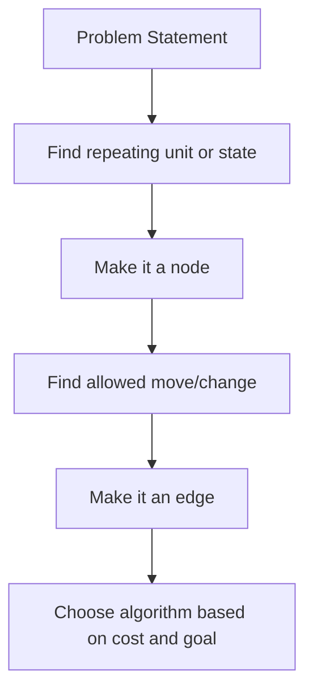

---

# 0.2 Graph Formulation Decision Tree

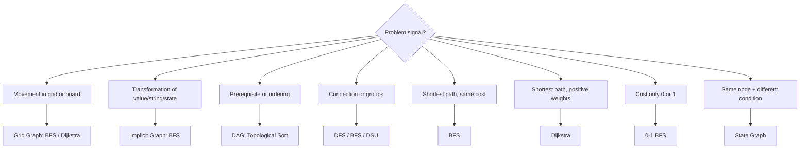

---

# 0.3 Algorithm Selection Table

| Problem Signal | Graph Formulation | Algorithm |
|---|---|---|
| minimum moves | unweighted graph | BFS |
| grid movement | cell graph | BFS / DFS |
| fire/virus/nearest source | multi-source graph | Multi-source BFS |
| cost is 0 or 1 | 0-1 weighted graph | 0-1 BFS |
| positive weighted path | weighted graph | Dijkstra |
| negative edges | weighted graph | Bellman-Ford |
| prerequisites | DAG | Topological Sort |
| connected groups | components | DFS / BFS / DSU |
| same node with extra condition | state graph | BFS / Dijkstra on state |
| all-pairs shortest path | dense/small graph | Floyd-Warshall |
| cycles inside directed graph | SCC | Kosaraju / Tarjan |

---

# 1.1 Normal Object Graph

## Formulation

```text
Node = object
Edge = relation between objects
```

## Common Examples

| Problem | Node | Edge |
|---|---|---|
| cities and roads | city | road |
| people and friendship | person | friendship |
| network delay | server | network link |
| provinces | city | direct connection |

## Visualization

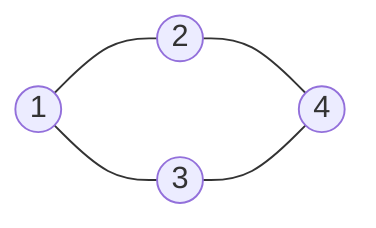

## Idea — How It Works

A normal object graph is the easiest graph formulation because the objects and relations are already visible in the statement.

Think like this:

```text
Problem gives cities / people / servers / courses
        |
        v
Each object becomes one node
        |
        v
Each direct relation becomes one edge
        |
        v
Now ask: do I need components, reachability, shortest path, or cycle?
```

Sequence view:

```text
Input relation: 1 connected to 2
        |
        v
Create edge: 1 --- 2
        |
        v
Traversal from 1 can now reach 2
```

Use this when the statement already says things like connected, friend, road, cable, network, route, relation, or directly reachable.

---

# 1.2 Grid as Graph

## Formulation

```text
Node = cell (r, c)
Edge = valid move to neighbor cell
Cost = usually 1 move
```

## Movement Directions

```cpp
int dx[4] = {1, -1, 0, 0};
int dy[4] = {0, 0, 1, -1};
```

## Visualization

Grid:

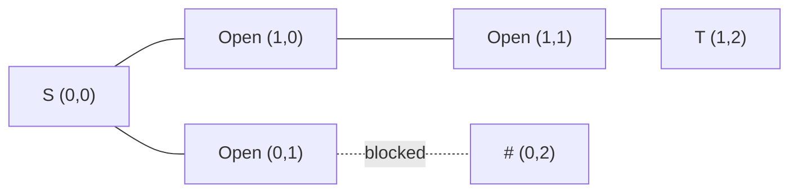

## Idea — How It Works

A grid is not given as an adjacency list, but it behaves exactly like a graph.

Think like this:

```text
Cell (r,c) = node
Move up/down/left/right/diagonal = edge
Blocked cell = node you cannot enter
Distance level = number of moves
```

Sequence view for BFS:

```text
Start cell enters queue
        |
        v
Pop current cell
        |
        v
Try all valid directions
        |
        v
Push unvisited open neighbors
        |
        v
First time target is reached = shortest path
```

Why BFS? Every move has equal cost. So BFS explores all cells at distance `1`, then distance `2`, then distance `3`. The first visit is guaranteed minimum.

---

# 1.3 Implicit Graph

## Formulation

```text
Node = current value/index/state
Edge = operation allowed by problem
```

## Examples

| Problem | Node | Edge |
|---|---|---|
| Jump Game | index | jump to reachable index |
| Open Lock | lock string | rotate one wheel |
| Word Ladder | word | change one character |
| Snakes and Ladders | board square | dice roll + snake/ladder jump |

## Visualization — Jump Game

```text
arr = [2,3,1,1,4]

index 0 can jump to 1 and 2
index 1 can jump to 2, 3, and 4

0 ---> 1 ---> 4
|      |
v      v
2 ---> 3
```

## Idea — How It Works

An implicit graph means the graph exists logically, but building all edges may be expensive or unnecessary.

Think like this:

```text
Current index/value/string/state = node
Allowed operation = edge generator
Neighbor is created only when needed
```

Sequence view:

```text
Take current state
        |
        v
Apply all legal operations
        |
        v
Generate next states
        |
        v
Process next states using BFS/DFS/greedy
```

For Jump Game:

```text
At index i
        |
        v
nums[i] tells how many outgoing edges exist
        |
        v
Instead of visiting every edge, track farthest reachable index
```

This is why some graph-looking problems can be optimized into greedy when only reachability/farthest boundary matters.

---

# 1.4 State Graph

## Formulation

```text
State = (node, extra information)
```

## When Needed

Use state graph when reaching the same node with different conditions gives different future possibilities.

## Examples

| Problem | State |
|---|---|
| Cheapest flight with K stops | (city, stops_used) |
| path with coupon | (node, coupon_used) |
| grid with keys | (r, c, key_mask) |
| obstacle elimination | (r, c, obstacles_removed) |

## Visualization

Same city, different stops:

```text
(city=2, stops=1)  !=  (city=2, stops=2)
```

State graph layers:

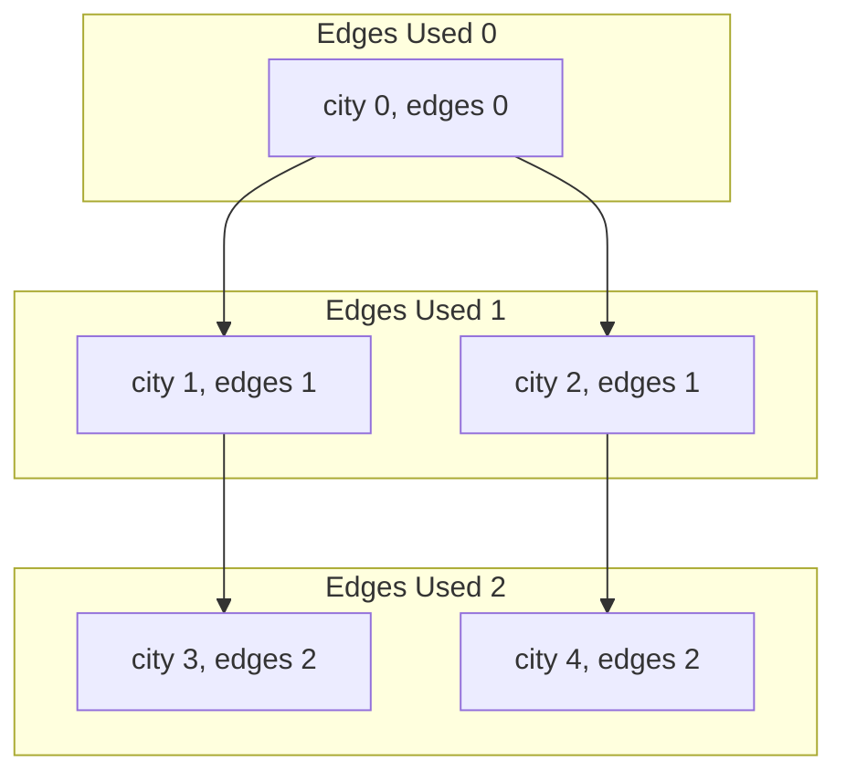

## Idea — How It Works

A state graph is needed when `node` alone does not fully describe your situation.

Key rule:

```text
If two visits to the same node have different future possibilities,
they are different states.
```

Sequence view:

```text
Reach city 2 with 1 stop used
        |
        v
Can still take more flights

Reach city 2 with 3 stops used
        |
        v
Maybe cannot take more flights
```

So these are not equal:

```text
(city=2, stops=1) != (city=2, stops=3)
```

Mental test:

```text
Can I mark only city as visited?
        |
        ├── yes -> normal graph
        └── no  -> add extra info into state
```

Common extra info: stops used, key mask, remaining fuel, coupon used, obstacles removed, visited set.

---

# 1.5 Multi-Source Graph

## Formulation

```text
Node = normal node/cell
Source = many starting nodes
Algorithm = BFS from all sources together
```

## Examples

| Problem | Sources |
|---|---|
| Rotten Oranges | all rotten oranges |
| Fire spread | all fire cells |
| Monsters | all monsters |
| nearest zero | all zero cells |

## Visualization

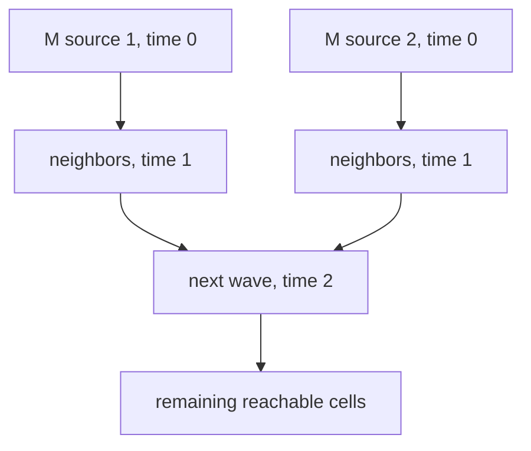

## Idea — How It Works

Multi-source BFS means all sources start at the same time.

Instead of running BFS separately from each source, put all sources in the queue initially.

Sequence view:

```text
Push all sources with distance/time 0
        |
        v
Expand them together level by level
        |
        v
Nearest source reaches each node first
        |
        v
Distance/time is finalized on first visit
```

This models simultaneous spread:

```text
Minute 0: all rotten/fire/monster cells active
Minute 1: all neighbors affected
Minute 2: next boundary affected
```

Use this when the question says nearest, spread, infection, fire, monsters, all zeros, all gates, or all starting points.

---

# 1.6 0-1 Weighted Graph

## Formulation

```text
Node = state
Edge cost = only 0 or 1
Algorithm = 0-1 BFS using deque
```

## Visualization

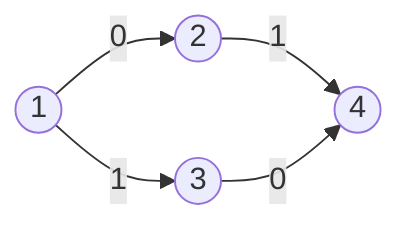

## Rule

```text
cost 0 edge -> push_front
cost 1 edge -> push_back
```

## Idea — How It Works

0-1 BFS is a shortest path algorithm for graphs where every edge cost is only `0` or `1`.

Normal BFS cannot handle different costs. Dijkstra can handle it, but 0-1 BFS is faster and simpler for only two costs.

Sequence view:

```text
Pop best current state from front
        |
        v
Try each neighbor
        |
        v
If edge cost is 0 -> push_front
If edge cost is 1 -> push_back
```

Why this works:

```text
cost 0 move does not increase distance
        -> should be processed immediately

cost 1 move increases distance
        -> can wait behind current-distance states
```

Mental model:

```text
Deque behaves like a lightweight priority queue
where distance can only stay same or increase by 1.
```

---

# 1.7 Dependency Graph / DAG

## Formulation

```text
Node = task/course/job
Edge = prerequisite relation
```

## Visualization

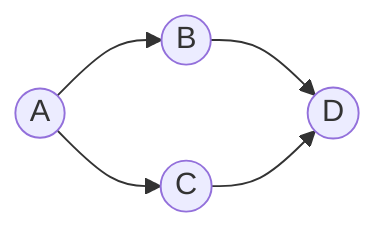

Meaning:

```text
A must happen before B and C.
B and C must happen before D.
```

## Use

- Topological sort
- cycle detection
- DAG DP

## Idea — How It Works

A dependency graph is used when one thing must happen before another thing.

Direction matters:

```text
prerequisite -> dependent task
```

Sequence view for topological sort:

```text
Compute indegree of every node
        |
        v
Push nodes with indegree 0
        |
        v
Take one available node
        |
        v
Remove its outgoing edges
        |
        v
New nodes with indegree 0 become available
```

If all nodes are processed, the schedule is possible.
If some nodes remain unprocessed, they are stuck in a cycle.

Cycle intuition:

```text
A needs B
B needs C
C needs A

No node can start first.
```

---

# 1.8 Reverse Graph Thinking

## Formulation

```text
Original edge: u -> v
Reverse edge:  v -> u
```

## When Useful

When many nodes ask distance/reachability to one target.

## Visualization

Original:

Original graph:

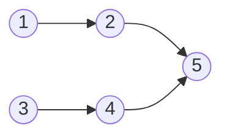

Reversed graph:

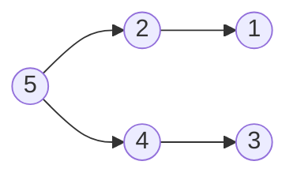

Now run BFS once from `5`.

## Idea — How It Works

Reverse graph thinking is useful when many nodes want to reach one target.

Brute force way:

```text
Run BFS from every node to destination
Too expensive
```

Better way:

```text
Reverse every edge
        |
        v
Start once from destination
        |
        v
Reach all nodes that can reach destination in original graph
```

Sequence view:

```text
Original: x ---> ... ---> target
Reverse : target ---> ... ---> x
```

The path length does not change. Only the direction of traversal changes.

Use this when the problem asks:

```text
For every node, find distance/reachability to one fixed destination.
```

---

# 1.9 Graph from Array

## Formulation

```text
Node = index
Edge = relation between indices
```

## Examples

| Problem | Edge |
|---|---|
| Jump Game | i -> reachable j |
| Teleporter | i -> arr[i] |
| next greater | i -> next greater index |
| permutation cycle | i -> p[i] |

## Visualization

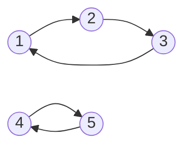

## Idea — How It Works

In array graph problems, indices are usually nodes. The value at an index tells where you can go.

Think like this:

```text
Index = node
arr[i] / rule around i = outgoing edge information
Visited index = processed node
Cycle in indices = repeated transition
```

Sequence view:

```text
i = current index
        |
        v
Use arr[i] to compute next index/indices
        |
        v
Move to next index
        |
        v
Detect reachability, cycle, component, or best path
```

Examples:

```text
Jump Game: i -> i+1 ... i+nums[i]
Teleport:  i -> arr[i]
Permutation: i -> p[i]
```

This is powerful because many array problems become simple once you ask, `from this index, where can I go next?`

---

# 1.10 Graph from String

## Formulation

```text
Node = string / word / pattern
Edge = one valid transformation
```

## Examples

| Problem | Edge |
|---|---|
| Word Ladder | change one character |
| Open Lock | rotate one digit |
| string swap | swap two positions |
| remove/insert operation | transform string |

## Visualization

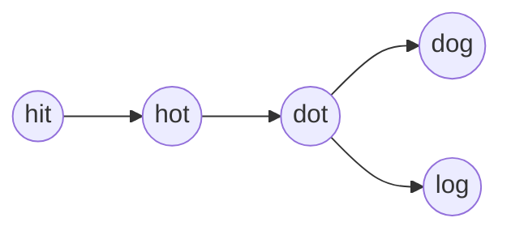

## Idea — How It Works

String transformation problems are graph problems when one operation changes one string into another.

Think like this:

```text
Current string = node/state
One allowed edit/swap/rotation/change = edge
Target string = destination
Minimum operations = BFS shortest path
```

Sequence view:

```text
word = hot
        |
        v
Change one character
        |
        v
dot, lot, hit, ...
        |
        v
Keep only valid dictionary words
        |
        v
BFS level = transformation count
```

Important trick: do not build all word-to-word edges if too large. Generate neighbors dynamically by trying character changes or using wildcard patterns.

---

# 1.11 Graph with Bitmask State

## Formulation

```text
State = (node, mask)
mask  = visited nodes / collected keys / used features
```

## Examples

| Problem | State |
|---|---|
| shortest path visiting all nodes | (node, visited_mask) |
| keys and locks | (r, c, key_mask) |
| TSP | (city, visited_mask) |

## Visualization

```text
(node=2, mask=011) means:
currently at node 2
visited nodes 0 and 1
```

Layer view:

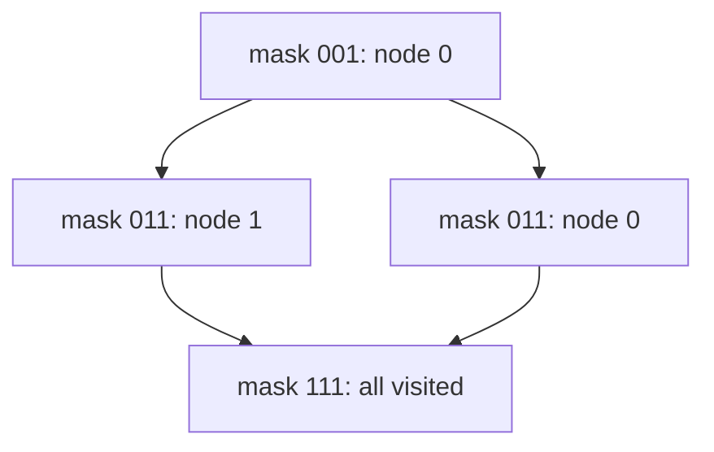

## Idea — How It Works

Bitmask state is used when the path history matters, but the history is small enough to encode in bits.

Think like this:

```text
node = where I am now
mask = what I have already visited/collected
state = (node, mask)
```

Sequence view:

```text
At node u with mask
        |
        v
Move to neighbor v
        |
        v
Set bit v in mask
        |
        v
New state = (v, mask | (1 << v))
```

Why normal visited[node] fails:

```text
Being at node 2 after visiting {0,2}
is different from
being at node 2 after visiting {0,1,2}.
```

Goal usually becomes:

```text
mask == (1 << n) - 1
```

That means every node/key/item has been visited or collected.

---

# 1.12 Component Graph / Condensation DAG

## Formulation

```text
Compress each connected/SCC component into one node.
```

## Visualization

Original:

Original graph:

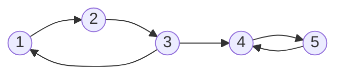

Condensation graph:

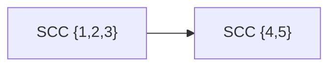

## Idea — How It Works

Component graph means compress a group of mutually connected nodes into one super-node.

For undirected graph:

```text
connected component -> one compressed node
```

For directed graph:

```text
strongly connected component -> one compressed node
```

Sequence view:

```text
Find components/SCCs
        |
        v
Assign component id to each node
        |
        v
For every original edge u -> v
        |
        v
If comp[u] != comp[v], create comp[u] -> comp[v]
```

Why useful:

```text
Inside one SCC, every node can reach every other node.
So for outside decisions, the whole SCC behaves like one unit.
```

After compression, directed SCC graph becomes a DAG. That allows topological ordering, DP, and reachability reasoning.

---

# P1. Number of Provinces — Normal Object Graph

## Problem

Given `n` cities and an adjacency matrix where `isConnected[i][j] = 1` means city `i` and city `j` are directly connected, count provinces.

## Input

```text
n = 3
isConnected =
1 1 0
1 1 0
0 0 1
```

## Output

```text
2
```

## Formulation

```text
Node = city
Edge = direct connection
Answer = number of connected components
Algorithm = DFS/BFS
```

## Idea — How It Works

A province means a group of cities where every city can reach every other city directly or indirectly. That is exactly a connected component.

Sequence diagram:

```text
Start scanning cities
        |
        v
Find city i not visited
        |
        v
This starts one new province
        |
        v
DFS/BFS marks all cities connected to i
        |
        v
Continue scanning for next unvisited city
```

Why count increases before DFS:

```text
When city i is unvisited, no previous province reached it.
So it must belong to a new province.
```

## Visualization

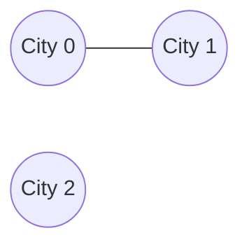

## C++ Code

```cpp
#include <bits/stdc++.h>
using namespace std;

void dfs(int u, vector<vector<int>>& isConnected, vector<int>& vis) {
    vis[u] = 1;
    int n = isConnected.size();

    for (int v = 0; v < n; v++) {
        if (isConnected[u][v] == 1 && !vis[v]) {
            dfs(v, isConnected, vis);
        }
    }
}

int findCircleNum(vector<vector<int>>& isConnected) {
    int n = isConnected.size();
    vector<int> vis(n, 0);
    int provinces = 0;

    for (int i = 0; i < n; i++) {
        if (!vis[i]) {
            provinces++;
            dfs(i, isConnected, vis);
        }
    }

    return provinces;
}
```

## Dry Run

```text
i=0 unvisited
└── provinces=1
    └── dfs(0)
        └── visits 1

i=1 already visited -> skip

i=2 unvisited
└── provinces=2
    └── dfs(2)

answer = 2
```

---

# P2. Shortest Path in Binary Matrix — Grid as Graph

## Problem

Given a binary matrix, `0` means open and `1` means blocked. Find shortest path from top-left to bottom-right using 8 directions.

## Input

```text
grid =
0 1
1 0
```

## Output

```text
2
```

## Formulation

```text
Node = cell (r,c)
Edge = move to any of 8 neighboring cells
Cost = 1
Algorithm = BFS
```

## Idea — How It Works

Each open cell is a node. Moving to a neighboring open cell is one edge with cost `1`.

Because every move has the same cost, BFS gives the shortest path.

Sequence diagram:

```text
Put start cell in queue with distance 1
        |
        v
Pop current cell
        |
        v
Try 8 directions
        |
        v
For every valid open unvisited cell:
    dist[next] = dist[current] + 1
        |
        v
First time bottom-right is popped/reached = answer
```

Why not DFS? DFS may go deep through a longer path first. BFS expands by distance level, so it finds minimum moves.

## Visualization

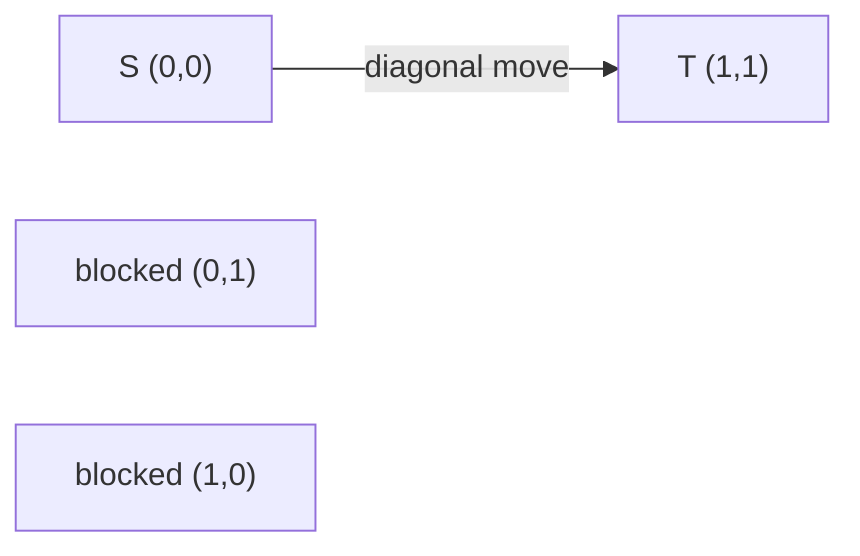

## C++ Code

```cpp
#include <bits/stdc++.h>
using namespace std;

int shortestPathBinaryMatrix(vector<vector<int>>& grid) {
    int n = grid.size();
    if (grid[0][0] == 1 || grid[n - 1][n - 1] == 1) return -1;

    vector<vector<int>> dist(n, vector<int>(n, -1));
    queue<pair<int,int>> q;

    int dx[8] = {1,1,1,0,0,-1,-1,-1};
    int dy[8] = {1,0,-1,1,-1,1,0,-1};

    dist[0][0] = 1;
    q.push({0,0});

    while (!q.empty()) {
        auto [x, y] = q.front();
        q.pop();

        if (x == n - 1 && y == n - 1) return dist[x][y];

        for (int d = 0; d < 8; d++) {
            int nx = x + dx[d];
            int ny = y + dy[d];

            if (nx < 0 || ny < 0 || nx >= n || ny >= n) continue;
            if (grid[nx][ny] == 1) continue;
            if (dist[nx][ny] != -1) continue;

            dist[nx][ny] = dist[x][y] + 1;
            q.push({nx, ny});
        }
    }

    return -1;
}
```

## Dry Run

```text
start (0,0), dist=1
└── check 8 directions
    └── diagonal (1,1) is valid
        └── dist[1][1] = 2
            └── target reached

answer = 2
```

---

# P3. Jump Game — Implicit Graph

## Problem

Given `nums[i]`, maximum jump length from index `i`. Return true if you can reach last index.

## Input

```text
nums = [2,3,1,1,4]
```

## Output

```text
true
```

## Formulation

```text
Node = index i
Edge = i -> j where i < j <= i + nums[i]
Goal = can reach n-1
```

## Idea — How It Works

Graph view:

```text
Node = index
Edge = jump from i to any j where i < j <= i + nums[i]
```

But building all edges is unnecessary. For reachability, we only need the farthest index reachable so far.

Sequence diagram:

```text
farthest = 0
        |
        v
Scan i from left to right
        |
        v
If i > farthest:
    i is unreachable -> return false
        |
        v
Else update:
    farthest = max(farthest, i + nums[i])
```

Core intuition:

```text
All indices <= farthest are reachable territory.
If current i is inside territory, it can expand territory.
If current i is outside territory, there is a gap you cannot cross.
```

## Visualization

```text
0 can jump to 1,2
1 can jump to 2,3,4

0 ---> 1 ---> 4
|      |
v      v
2 ---> 3
```

## C++ Code

```cpp
#include <bits/stdc++.h>
using namespace std;

bool canJump(vector<int>& nums) {
    int farthest = 0;

    for (int i = 0; i < (int)nums.size(); i++) {
        if (i > farthest) return false;
        farthest = max(farthest, i + nums[i]);
    }

    return true;
}
```

## Dry Run

```text
nums = [2,3,1,1,4]

farthest = 0

i=0
├── i <= farthest, reachable
└── farthest = max(0, 0+2) = 2

i=1
├── i <= farthest, reachable
└── farthest = max(2, 1+3) = 4

i=2 reachable, farthest remains 4
i=3 reachable, farthest remains 4
i=4 reachable

answer = true
```

---

# P4. Cheapest Flights Within K Stops — State Graph

## Problem

Find cheapest price from `src` to `dst` with at most `k` stops.

## Input

```text
n = 4
flights = [[0,1,100],[1,2,100],[2,3,100],[0,3,500]]
src = 0, dst = 3, k = 1
```

## Output

```text
500
```

## Formulation

```text
State = (city, edges_used)
Edge = take a flight
Cost = flight price
Algorithm = modified BFS / Bellman-Ford style relaxation
```

## Idea — How It Works

City alone is not enough because the number of edges/stops already used changes what you can do next.

State view:

```text
State = (city, edges_used)
Transition = take one flight
Cost = ticket price
Limit = edges_used <= k + 1
```

Sequence diagram:

```text
Start with src cost 0
        |
        v
Relax all flights once -> paths using at most 1 edge
        |
        v
Relax all flights again -> paths using at most 2 edges
        |
        v
Repeat k+1 times total
```

Why copy `ndist = dist` each step?

```text
During one step, we must only extend paths from previous step.
Without a copy, newly updated values could be reused immediately,
accidentally using too many flights in the same round.
```

## Visualization

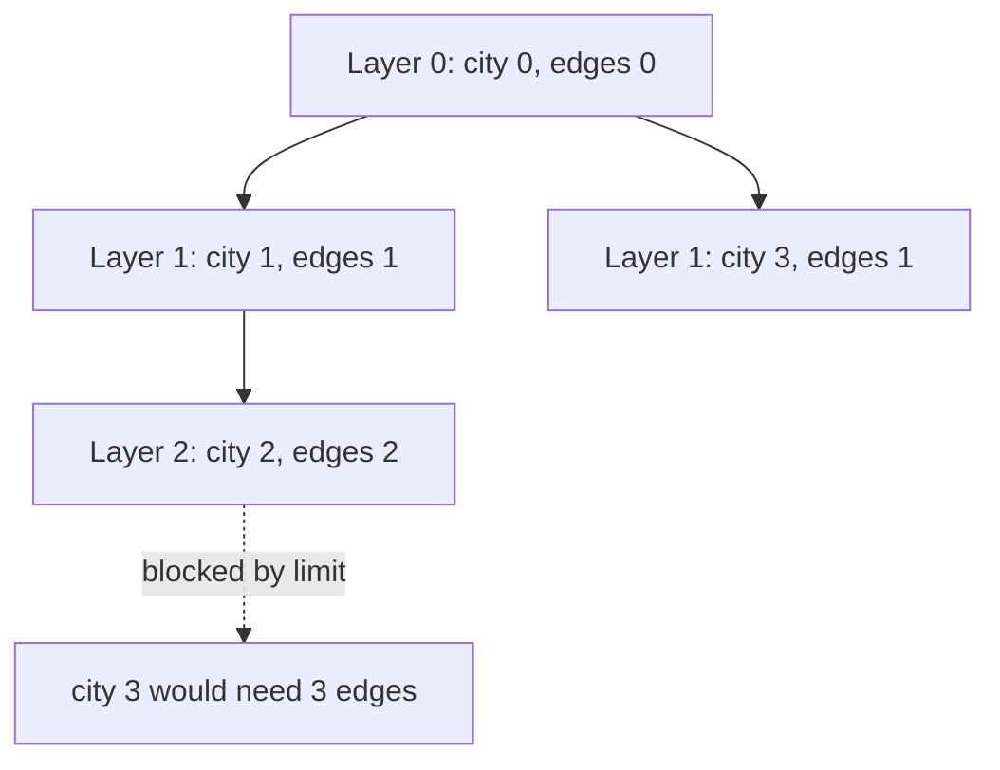

`k = 1` stop means at most `k + 1 = 2` edges.

## C++ Code

```cpp
#include <bits/stdc++.h>
using namespace std;

int findCheapestPrice(int n, vector<vector<int>>& flights, int src, int dst, int k) {
    const int INF = 1e9;
    vector<int> dist(n, INF);
    dist[src] = 0;

    // At most k stops = at most k+1 edges
    for (int step = 0; step <= k; step++) {
        vector<int> ndist = dist;

        for (auto &f : flights) {
            int u = f[0], v = f[1], w = f[2];
            if (dist[u] == INF) continue;
            ndist[v] = min(ndist[v], dist[u] + w);
        }

        dist = ndist;
    }

    return dist[dst] == INF ? -1 : dist[dst];
}
```

## Dry Run

```text
Initial:
dist[0]=0, others INF

step 0: use at most 1 edge
├── 0->1 cost 100 => dist[1]=100
└── 0->3 cost 500 => dist[3]=500

step 1: use at most 2 edges
├── 1->2 cost 100 => dist[2]=200
└── 0->3 still 500

Cannot use 2->3 because that would require 3 edges.

answer = 500
```

---

# P5. Rotten Oranges — Multi-Source BFS

## Problem

Each minute, rotten oranges rot adjacent fresh oranges. Return minutes to rot all oranges.

## Input

```text
grid =
2 1 1
1 1 0
0 1 1
```

## Output

```text
4
```

## Formulation

```text
Node = cell
Source = all rotten oranges initially
Edge = 4-direction adjacency
Cost = 1 minute
Algorithm = multi-source BFS
```

## Idea — How It Works

This is not one-source BFS. Every initially rotten orange starts spreading at minute `0`.

Sequence diagram:

```text
Scan grid
├── push all rotten oranges into queue
└── count all fresh oranges
        |
        v
Process queue level by level
        |
        v
Each level = one minute
        |
        v
When a fresh neighbor becomes rotten:
    fresh--
    push it for next minute
```

Why BFS level = minute:

```text
All nodes currently in queue rot neighbors at the same time.
Those newly rotten nodes can spread only in the next minute.
```

## Visualization

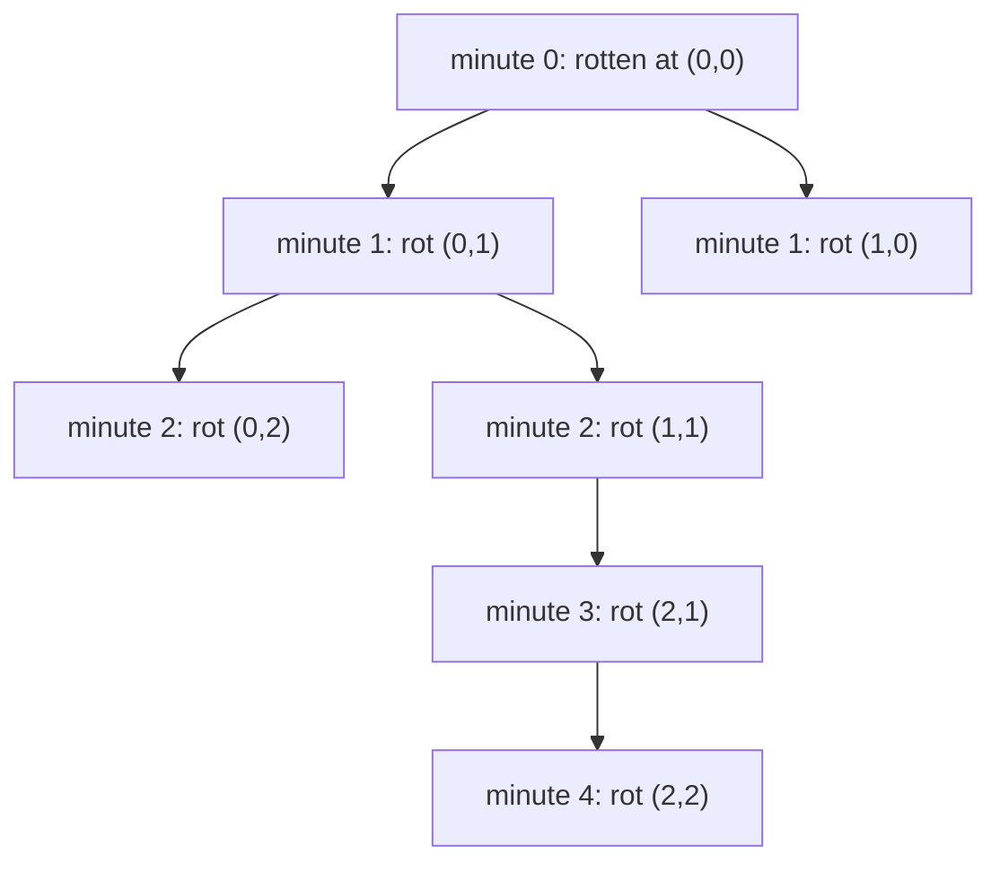

## C++ Code

```cpp
#include <bits/stdc++.h>
using namespace std;

int orangesRotting(vector<vector<int>>& grid) {
    int n = grid.size(), m = grid[0].size();
    queue<pair<int,int>> q;
    int fresh = 0;

    for (int i = 0; i < n; i++) {
        for (int j = 0; j < m; j++) {
            if (grid[i][j] == 2) q.push({i,j});
            if (grid[i][j] == 1) fresh++;
        }
    }

    int dx[4] = {1,-1,0,0};
    int dy[4] = {0,0,1,-1};
    int minutes = 0;

    while (!q.empty() && fresh > 0) {
        int sz = q.size();
        minutes++;

        while (sz--) {
            auto [x,y] = q.front();
            q.pop();

            for (int d = 0; d < 4; d++) {
                int nx = x + dx[d];
                int ny = y + dy[d];

                if (nx < 0 || ny < 0 || nx >= n || ny >= m) continue;
                if (grid[nx][ny] != 1) continue;

                grid[nx][ny] = 2;
                fresh--;
                q.push({nx,ny});
            }
        }
    }

    return fresh == 0 ? minutes : -1;
}
```

## Dry Run

```text
Initial queue: [(0,0)]
fresh = 6

minute 1:
├── rot (0,1)
└── rot (1,0)

minute 2:
├── rot (0,2)
└── rot (1,1)

minute 3:
└── rot (2,1)

minute 4:
└── rot (2,2)

fresh = 0
answer = 4
```

---

# P6. Minimum Cost Direction Grid — 0-1 BFS

## Problem

Each cell has a direction. Moving in the given direction costs `0`; changing direction costs `1`. Find minimum cost to reach bottom-right.

## Input

```text
grid =
1 1 3
3 2 2
1 1 4
```

Direction meaning:

```text
1 = right
2 = left
3 = down
4 = up
```

## Output

```text
0
```

## Formulation

```text
Node = cell (r,c)
Edge = move to neighbor
Cost = 0 if move follows arrow, else 1
Algorithm = 0-1 BFS
```

## Idea — How It Works

Each cell is a node. From each cell, you can move in 4 directions. The cost depends on whether you follow the arrow.

```text
Follow arrow     -> cost 0
Change direction -> cost 1
```

Sequence diagram:

```text
Start at (0,0), dist = 0
        |
        v
Pop cell from front of deque
        |
        v
Try 4 moves
        |
        v
If new distance is better:
    cost 0 -> push_front
    cost 1 -> push_back
```

Why push_front for cost 0?

```text
A zero-cost move has same distance as current node.
It deserves to be processed before cost-1 moves.
```

## Visualization

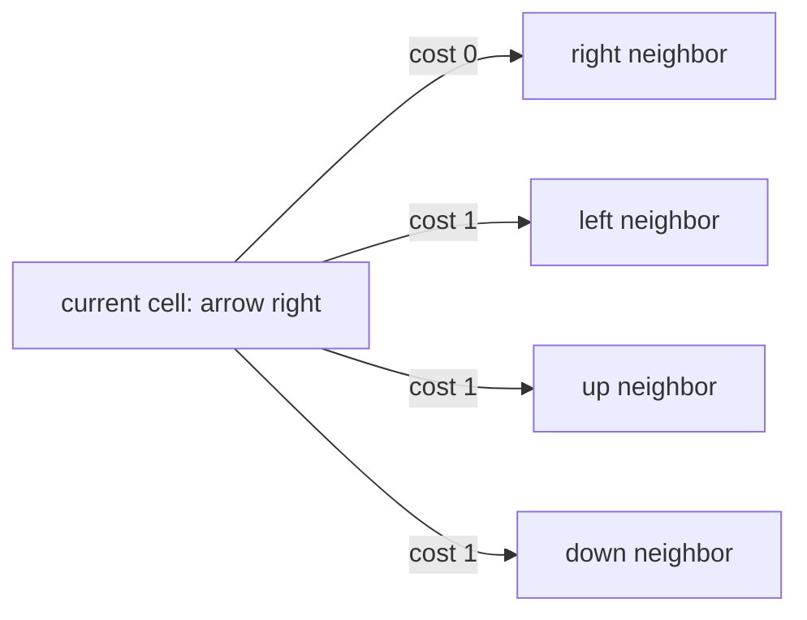

## C++ Code

```cpp
#include <bits/stdc++.h>
using namespace std;

int minCost(vector<vector<int>>& grid) {
    int n = grid.size(), m = grid[0].size();
    const int INF = 1e9;

    vector<vector<int>> dist(n, vector<int>(m, INF));
    deque<pair<int,int>> dq;

    // directions: right, left, down, up
    int dx[4] = {0, 0, 1, -1};
    int dy[4] = {1, -1, 0, 0};

    dist[0][0] = 0;
    dq.push_front({0,0});

    while (!dq.empty()) {
        auto [x,y] = dq.front();
        dq.pop_front();

        for (int d = 0; d < 4; d++) {
            int nx = x + dx[d];
            int ny = y + dy[d];

            if (nx < 0 || ny < 0 || nx >= n || ny >= m) continue;

            int cost = (grid[x][y] == d + 1) ? 0 : 1;

            if (dist[nx][ny] > dist[x][y] + cost) {
                dist[nx][ny] = dist[x][y] + cost;

                if (cost == 0) dq.push_front({nx,ny});
                else dq.push_back({nx,ny});
            }
        }
    }

    return dist[n - 1][m - 1];
}
```

## Dry Run

```text
Start (0,0), cost=0
├── arrow says right
├── move to (0,1) cost 0 -> push_front
└── other moves cost 1 -> push_back

At (0,1), arrow says right
└── move to (0,2) cost 0

At (0,2), arrow says down
└── move to (1,2) cost 0

At (1,2), arrow says left
└── continue following zero-cost path

answer = 0
```

---

# P7. Course Schedule — Dependency DAG

## Problem

Given `numCourses` and prerequisites, return true if all courses can be completed.

## Input

```text
numCourses = 2
prerequisites = [[1,0]]
```

Meaning: to take course `1`, first take course `0`.

## Output

```text
true
```

## Formulation

```text
Node = course
Edge = prerequisite -> course
Goal = detect if DAG exists
Algorithm = topological sort
```

## Idea — How It Works

A course can be taken only after all prerequisites are completed. This naturally becomes a directed graph.

```text
pre -> course
```

Sequence diagram:

```text
Build graph and indegree
        |
        v
Push courses with indegree 0
        |
        v
Take one course
        |
        v
Reduce indegree of dependent courses
        |
        v
If a dependent course becomes 0, push it
```

Why cycle means impossible:

```text
In a cycle, every course waits for another course in the same cycle.
No course reaches indegree 0.
```

## Visualization

```mermaid
graph LR
    C0((Course 0)) --> C1((Course 1))
```

## C++ Code

```cpp
#include <bits/stdc++.h>
using namespace std;

bool canFinish(int numCourses, vector<vector<int>>& prerequisites) {
    vector<vector<int>> g(numCourses);
    vector<int> indeg(numCourses, 0);

    for (auto &p : prerequisites) {
        int course = p[0];
        int pre = p[1];
        g[pre].push_back(course);
        indeg[course]++;
    }

    queue<int> q;
    for (int i = 0; i < numCourses; i++) {
        if (indeg[i] == 0) q.push(i);
    }

    int taken = 0;

    while (!q.empty()) {
        int u = q.front();
        q.pop();
        taken++;

        for (int v : g[u]) {
            indeg[v]--;
            if (indeg[v] == 0) q.push(v);
        }
    }

    return taken == numCourses;
}
```

## Dry Run

```text
prerequisite: 0 -> 1
indeg[0]=0
indeg[1]=1

queue = [0]
└── pop 0
    └── remove edge 0->1
        └── indeg[1]=0, push 1

queue = [1]
└── pop 1

taken = 2
answer = true
```

---

# P8. Nearest Exit / Reverse Distance — Reverse Graph

## Problem

Given directed roads and one destination, find distance from every node to destination.

## Input

```text
Edges:
1 -> 2
2 -> 5
3 -> 4
4 -> 5
Destination = 5
```

## Output

```text
dist[1]=2
dist[2]=1
dist[3]=2
dist[4]=1
dist[5]=0
```

## Formulation

```text
Original question = distance from every node to destination
Reverse graph = run BFS/Dijkstra once from destination
```

## Idea — How It Works

The original question asks distance from many nodes to one destination. Running BFS from every node is wasteful.

Reverse trick:

```text
Original path: u -> ... -> destination
Reverse path : destination -> ... -> u
```

Sequence diagram:

```text
Reverse all edges
        |
        v
Start BFS from destination
        |
        v
First time node x is reached
        |
        v
dist[x] = distance from x to destination in original graph
```

This turns many BFS runs into one BFS run.

## Visualization

Original:

```text
1 -> 2 -> 5
3 -> 4 -> 5
```

Reverse:

```text
5 -> 2 -> 1
5 -> 4 -> 3
```

## C++ Code

```cpp
#include <bits/stdc++.h>
using namespace std;

vector<int> distanceToDestination(int n, vector<pair<int,int>>& edges, int dest) {
    vector<vector<int>> rev(n + 1);

    for (auto [u, v] : edges) {
        rev[v].push_back(u);
    }

    vector<int> dist(n + 1, -1);
    queue<int> q;

    dist[dest] = 0;
    q.push(dest);

    while (!q.empty()) {
        int u = q.front();
        q.pop();

        for (int v : rev[u]) {
            if (dist[v] == -1) {
                dist[v] = dist[u] + 1;
                q.push(v);
            }
        }
    }

    return dist;
}
```

## Dry Run

```text
Start from destination 5 in reversed graph

dist[5]=0
├── from 5 reach 2 and 4
│   ├── dist[2]=1
│   └── dist[4]=1
├── from 2 reach 1
│   └── dist[1]=2
└── from 4 reach 3
    └── dist[3]=2
```

---

# P9. Word Ladder — String Transformation Graph

## Problem

Given `beginWord`, `endWord`, and dictionary, return shortest transformation length. One letter can change at a time.

## Input

```text
beginWord = hit
endWord = cog
wordList = [hot,dot,dog,lot,log,cog]
```

## Output

```text
5
```

Path:

```text
hit -> hot -> dot -> dog -> cog
```

## Formulation

```text
Node = word
Edge = two words differ by one character
Cost = 1 transformation
Algorithm = BFS
```

## Idea — How It Works

Every word is a node. If two words differ by one character, there is an edge between them.

Sequence diagram:

```text
Start from beginWord
        |
        v
Generate all valid one-character changes
        |
        v
Push dictionary words not visited
        |
        v
Each BFS level = one transformation
        |
        v
First time endWord appears = shortest transformation length
```

Why BFS works:

```text
Every transformation has equal cost 1.
So the first time we reach a word, it is by the minimum number of changes.
```

## Visualization

```mermaid
graph TD
    hit((hit)) --> hot((hot))
    hot --> dot((dot))
    hot --> lot((lot))
    dot --> dog((dog))
    lot --> log((log))
    dog --> cog((cog))
    log --> cog
```

## C++ Code

```cpp
#include <bits/stdc++.h>
using namespace std;

int ladderLength(string beginWord, string endWord, vector<string>& wordList) {
    unordered_set<string> dict(wordList.begin(), wordList.end());
    if (!dict.count(endWord)) return 0;

    queue<pair<string,int>> q;
    q.push({beginWord, 1});

    unordered_set<string> vis;
    vis.insert(beginWord);

    while (!q.empty()) {
        auto [word, dist] = q.front();
        q.pop();

        if (word == endWord) return dist;

        string cur = word;
        for (int i = 0; i < (int)cur.size(); i++) {
            char old = cur[i];

            for (char c = 'a'; c <= 'z'; c++) {
                cur[i] = c;

                if (dict.count(cur) && !vis.count(cur)) {
                    vis.insert(cur);
                    q.push({cur, dist + 1});
                }
            }

            cur[i] = old;
        }
    }

    return 0;
}
```

## Dry Run

```text
queue = [(hit,1)]

pop hit
└── generate hot
    └── push (hot,2)

pop hot
├── generate dot -> push (dot,3)
└── generate lot -> push (lot,3)

pop dot
└── generate dog -> push (dog,4)

pop lot
└── generate log -> push (log,4)

pop dog
└── generate cog -> push (cog,5)

answer = 5
```

---

# P10. Shortest Path Visiting All Nodes — Bitmask State Graph

## Problem

Given an undirected connected graph, return shortest path length that visits all nodes. You may start and stop anywhere.

## Input

```text
graph = [[1,2,3],[0],[0],[0]]
```

## Output

```text
4
```

## Formulation

```text
State = (node, visited_mask)
Edge = move to neighbor and update mask
Goal = mask == all_visited
Algorithm = multi-source BFS on state graph
```

## Idea — How It Works

This is a shortest path problem, but visited history matters. So normal `visited[node]` is wrong.

State:

```text
(node, visited_mask)
```

Sequence diagram:

```text
Start from every node
        |
        v
Each start state has one bit set
        |
        v
Move to neighbor
        |
        v
Turn on neighbor's bit in mask
        |
        v
If mask == full mask, all nodes visited
```

Why multi-source BFS?

```text
The problem says you may start anywhere.
So push every possible starting node with distance 0.
```

## Visualization

```mermaid
graph TD
    A["state (0,0001)"] --> B["move to 1: (1,0011)"]
    B --> C["move back to 0: (0,0011)"]
    C --> D["move to 2: (2,0111)"]
```

## C++ Code

```cpp
#include <bits/stdc++.h>
using namespace std;

int shortestPathLength(vector<vector<int>>& graph) {
    int n = graph.size();
    int full = (1 << n) - 1;

    queue<tuple<int,int,int>> q; // node, mask, dist
    vector<vector<int>> vis(n, vector<int>(1 << n, 0));

    for (int i = 0; i < n; i++) {
        int mask = (1 << i);
        q.push({i, mask, 0});
        vis[i][mask] = 1;
    }

    while (!q.empty()) {
        auto [u, mask, dist] = q.front();
        q.pop();

        if (mask == full) return dist;

        for (int v : graph[u]) {
            int nmask = mask | (1 << v);

            if (!vis[v][nmask]) {
                vis[v][nmask] = 1;
                q.push({v, nmask, dist + 1});
            }
        }
    }

    return -1;
}
```

## Dry Run

Graph:

```text
    1
    |
2 - 0 - 3
```

```text
Start BFS from all nodes:
(0,0001), (1,0010), (2,0100), (3,1000)

One possible path:
1 -> 0 -> 2 -> 0 -> 3

Masks:
(1,0010)
└── move to 0 -> (0,0011)
    └── move to 2 -> (2,0111)
        └── move to 0 -> (0,0111)
            └── move to 3 -> (3,1111)

all visited mask = 1111
answer = 4
```

---

# 3.1 Five-Second Recognition Checklist

When you see a problem, ask:

```text
1. What is one node/state?
2. What is one valid move/edge?
3. Is every move cost 1?
4. Are edge costs 0/1/positive/negative?
5. Do I need shortest path, reachability, count, or order?
6. Does same node with different condition matter?
7. Are there multiple sources?
8. Can reversing edges simplify it?
9. Is this actually a DAG/dependency problem?
10. Can I avoid building graph and generate neighbors dynamically?
```

---

# 3.2 Formulation Cheat Sheet

| Pattern | Node | Edge | Algorithm |
|---|---|---|---|
| Object graph | object | relation | DFS/BFS/DSU |
| Grid graph | cell | direction move | BFS/DFS |
| Shortest moves | state | one operation | BFS |
| Multi-source spread | cell/node | adjacency | Multi-source BFS |
| 0/1 cost | state | cost 0 or 1 | 0-1 BFS |
| Positive weighted | node/state | weighted edge | Dijkstra |
| Dependency | task/course | prerequisite | Topological Sort |
| Array graph | index | jump/relation | DFS/BFS/Greedy |
| String graph | word/string | transform | BFS |
| Bitmask graph | (node, mask) | move + update mask | BFS/DP |
| SCC graph | component | cross-component edge | SCC + DAG DP |

---

# Final Mental Model

```text
Graph formulation is not about drawing nodes.
It is about identifying STATES and TRANSITIONS.

Once state and transition are clear,
algorithm choice becomes mechanical.
```

