# Constructive Algorithms Visual Reference

> **Goal:** Learn how to build valid answers step by step using patterns, invariants, dry runs, and contest/OA proof tactics.

---

## Clickable Index

1. [Core Idea](#1-core-idea)
2. [When to Think Constructive](#2-when-to-think-constructive)
3. [Beginner Patterns](#3-beginner-patterns)
4. [FAANG / Interview Patterns](#4-faang--interview-patterns)
5. [Advanced / CM-Level Patterns](#5-advanced--cm-level-patterns)
6. [Pattern Decision Tree](#6-pattern-decision-tree)
7. [Proof Methods](#7-proof-methods)
8. [Dry Run Examples](#8-dry-run-examples)
9. [C++ Templates](#9-c-templates)
10. [Contest / OA Checklist](#10-contest--oa-checklist)
11. [Common Mistakes](#11-common-mistakes)
12. [Practice Ladder](#12-practice-ladder)

---

# 1. Core Idea

Constructive algorithms are about **building one valid answer**, not necessarily the best one.

| Idea | Meaning |
|---|---|
| Build step by step | Add one element, edge, character, or operation at a time |
| Maintain invariant | A rule that must stay true after every step |
| Output any valid answer | Usually many answers exist |
| Avoid full search | Do not try all possibilities |

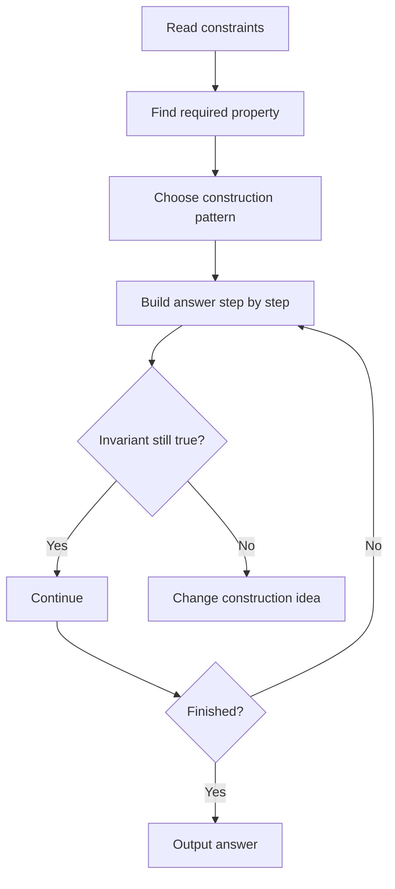

---

# 2. When to Think Constructive

Look for these words:

| Signal | Meaning |
|---|---|
| Construct any | Need one valid answer |
| Find any valid | Multiple answers allowed |
| Rearrange | Usually permutation/string construction |
| Output sequence | Build array/permutation |
| Is it possible? If yes, print one | Need feasibility + construction |
| Perform operations | Need transform one state to another |

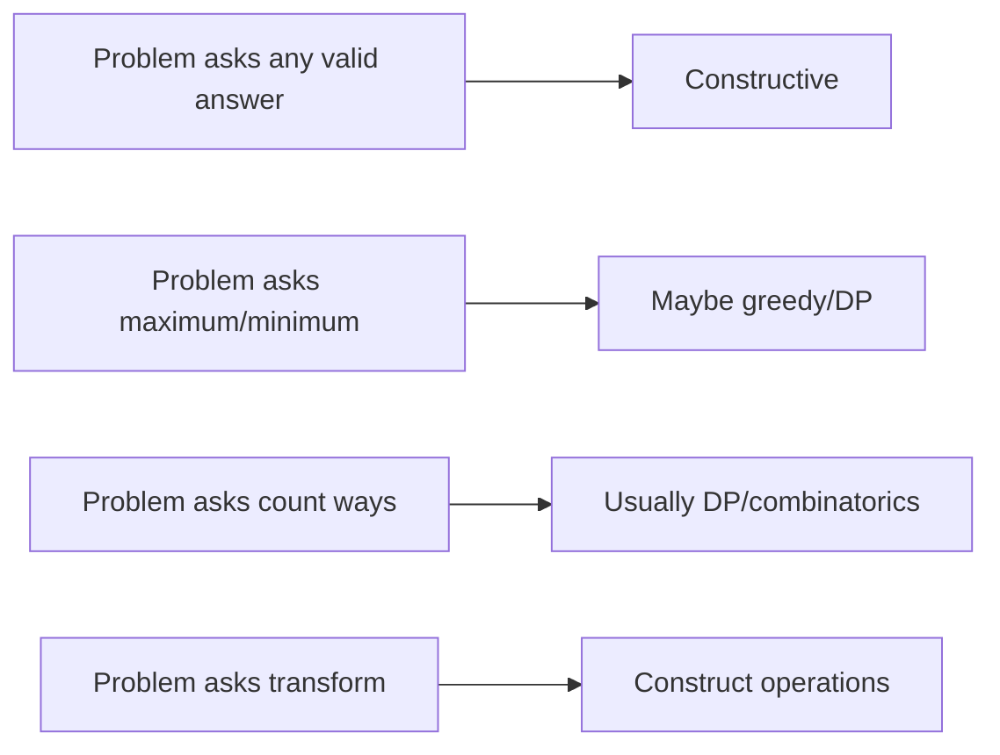

---

# 3. Beginner Patterns

## 3.1 Build Array with Given Sum

### Concept
Create an array of size `n` with sum `S` while respecting bounds.

| Form | Tactic |
|---|---|
| positive integers | Start all with `1`, distribute remaining |
| bounded values | Give as much as possible to each slot |
| parity required | Use even/odd blocks |

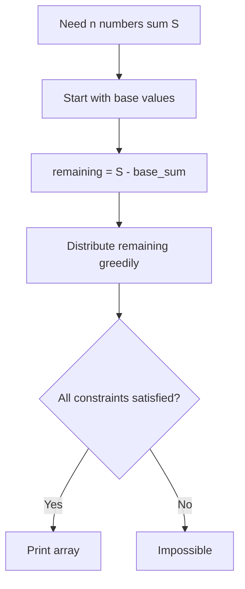

### C++ Code

```cpp
#include <bits/stdc++.h>
using namespace std;

vector<int> buildPositiveArray(int n, int S) {
    if (S < n) return {}; // impossible: each must be >= 1

    vector<int> a(n, 1);
    int rem = S - n;

    for (int i = 0; i < n && rem > 0; i++) {
        a[i] += rem;
        rem = 0;
    }
    return a;
}

int main() {
    int n = 5, S = 12;
    vector<int> ans = buildPositiveArray(n, S);

    if (ans.empty()) cout << "NO\n";
    else {
        cout << "YES\n";
        for (int x : ans) cout << x << ' ';
        cout << '\n';
    }
}
```

### Dry Run

| Step | Array | Remaining | Reason |
|---|---:|---:|---|
| Start | `[1,1,1,1,1]` | `7` | Minimum valid base |
| Add remaining | `[8,1,1,1,1]` | `0` | Sum becomes 12 |
| Done | `[8,1,1,1,1]` | `0` | Valid answer |

---

## 3.2 Construct Permutation by Odd-Even Split

### Concept
Many permutation problems need avoiding adjacent differences or creating simple structure.

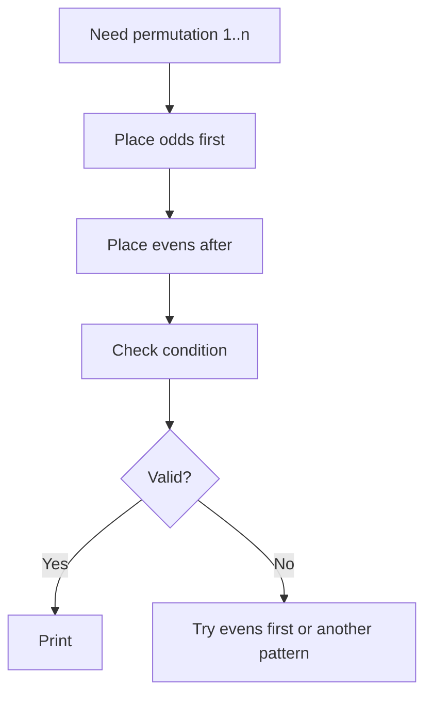

### C++ Code

```cpp
#include <bits/stdc++.h>
using namespace std;

vector<int> oddEvenPermutation(int n) {
    vector<int> p;
    for (int x = 1; x <= n; x += 2) p.push_back(x);
    for (int x = 2; x <= n; x += 2) p.push_back(x);
    return p;
}

int main() {
    int n = 7;
    vector<int> p = oddEvenPermutation(n);
    for (int x : p) cout << x << ' ';
}
```

### Dry Run for `n = 7`

| Phase | Output |
|---|---|
| Odds | `1 3 5 7` |
| Evens | `1 3 5 7 2 4 6` |

---

## 3.3 Alternating High-Low Construction

### Concept
Useful when adjacent elements must be different, zig-zag, or spread apart.

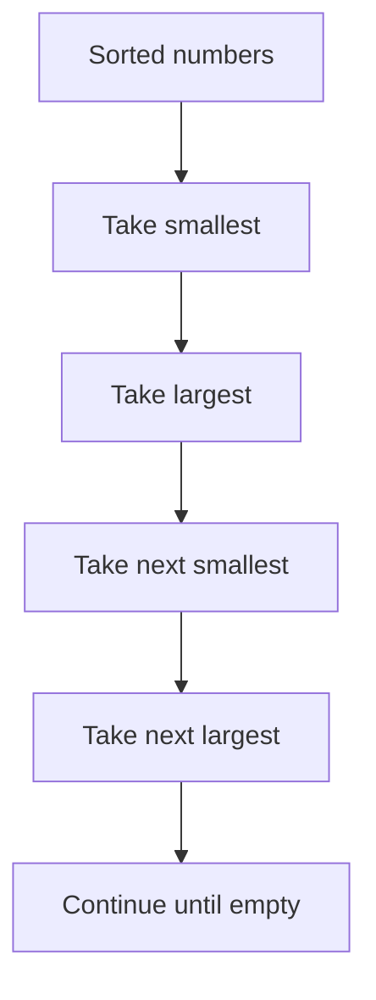

### C++ Code

```cpp
#include <bits/stdc++.h>
using namespace std;

vector<int> highLow(vector<int> a) {
    sort(a.begin(), a.end());
    int l = 0, r = (int)a.size() - 1;
    vector<int> ans;

    while (l <= r) {
        ans.push_back(a[l++]);
        if (l <= r) ans.push_back(a[r--]);
    }
    return ans;
}
```

### Dry Run

Input: `[1,2,3,4,5,6]`

| Step | Pick | Result |
|---|---:|---|
| 1 | `1` | `[1]` |
| 2 | `6` | `[1,6]` |
| 3 | `2` | `[1,6,2]` |
| 4 | `5` | `[1,6,2,5]` |
| 5 | `3` | `[1,6,2,5,3]` |
| 6 | `4` | `[1,6,2,5,3,4]` |

---

# 4. FAANG / Interview Patterns

## 4.1 Frequency-Based String Construction

### Problem Form
Rearrange a string so no two adjacent characters are equal.

### Pattern
Use a max heap and always pick the most frequent valid character.

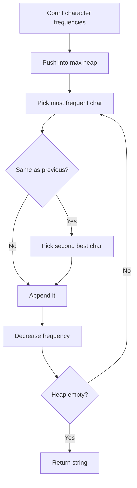

### C++ Code

```cpp
#include <bits/stdc++.h>
using namespace std;

string reorganizeString(string s) {
    unordered_map<char, int> freq;
    for (char c : s) freq[c]++;

    priority_queue<pair<int, char>> pq;
    for (auto [c, f] : freq) pq.push({f, c});

    string ans;

    while (!pq.empty()) {
        auto [f1, c1] = pq.top();
        pq.pop();

        if (!ans.empty() && ans.back() == c1) {
            if (pq.empty()) return "";

            auto [f2, c2] = pq.top();
            pq.pop();

            ans.push_back(c2);
            f2--;

            if (f2 > 0) pq.push({f2, c2});
            pq.push({f1, c1});
        } else {
            ans.push_back(c1);
            f1--;

            if (f1 > 0) pq.push({f1, c1});
        }
    }

    return ans;
}
```

### Dry Run: `s = "aaabbc"`

| Step | Heap Top | Previous | Pick | Result |
|---|---|---|---|---|
| 1 | `a:3` | none | `a` | `a` |
| 2 | `a:2` | `a` | `b` | `ab` |
| 3 | `a:2` | `b` | `a` | `aba` |
| 4 | `b:1/a:1/c:1` | `a` | `c` or `b` | `abac` |
| 5 | `a:1/b:1` | `c` | `b` | `abacb` |
| 6 | `a:1` | `b` | `a` | `abacba` |

---

## 4.2 Prefix-Valid Construction

### Concept
Build so every prefix remains valid.

Examples:
- Balanced parentheses
- Valid sequence under constraints
- Avoid negative prefix sum

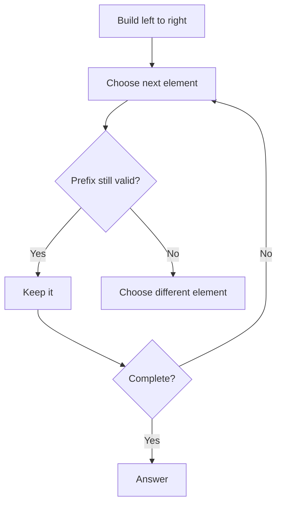

### C++: Balanced Parentheses

```cpp
#include <bits/stdc++.h>
using namespace std;

string buildParentheses(int n) {
    string ans;
    int open = 0, close = 0;

    while ((int)ans.size() < 2 * n) {
        if (open < n) {
            ans.push_back('(');
            open++;
        } else {
            ans.push_back(')');
            close++;
        }
    }
    return ans;
}
```

### Invariant
At every prefix:

```text
close <= open <= n
```

---

## 4.3 Construct Operations to Transform State

### Concept
Instead of outputting final array directly, output operations that create it.

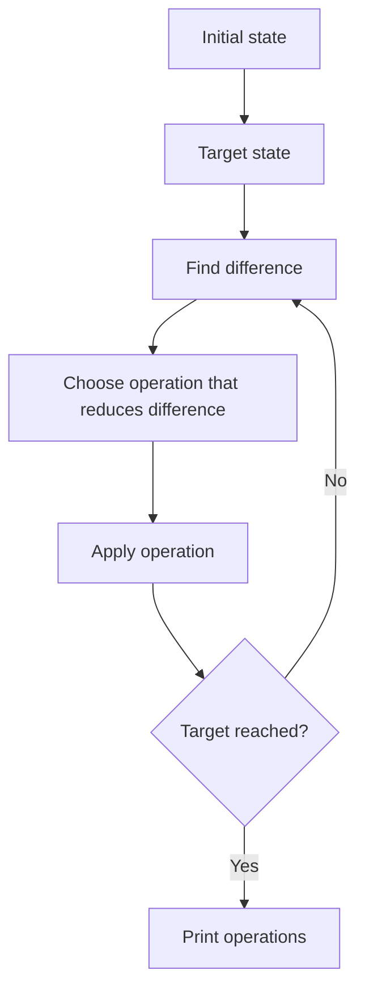

### C++ Skeleton

```cpp
#include <bits/stdc++.h>
using namespace std;

int main() {
    vector<int> a = {1, 2, 3};
    vector<int> target = {3, 2, 1};
    vector<pair<int, int>> ops;

    for (int i = 0; i < (int)a.size(); i++) {
        if (a[i] != target[i]) {
            int j = i;
            while (a[j] != target[i]) j++;
            swap(a[i], a[j]);
            ops.push_back({i, j});
        }
    }

    cout << ops.size() << '\n';
    for (auto [i, j] : ops) cout << i << ' ' << j << '\n';
}
```

---

# 5. Advanced / CM-Level Patterns

## 5.1 Invariant-Based Construction

### Concept
Find a rule that stays true during the whole construction.

| Invariant Type | Example |
|---|---|
| Sum invariant | Total sum remains fixed |
| Parity invariant | Odd/even property remains fixed |
| Graph invariant | Connectivity remains true |
| Prefix invariant | Every prefix satisfies condition |
| Ordering invariant | Elements remain sorted/valid |

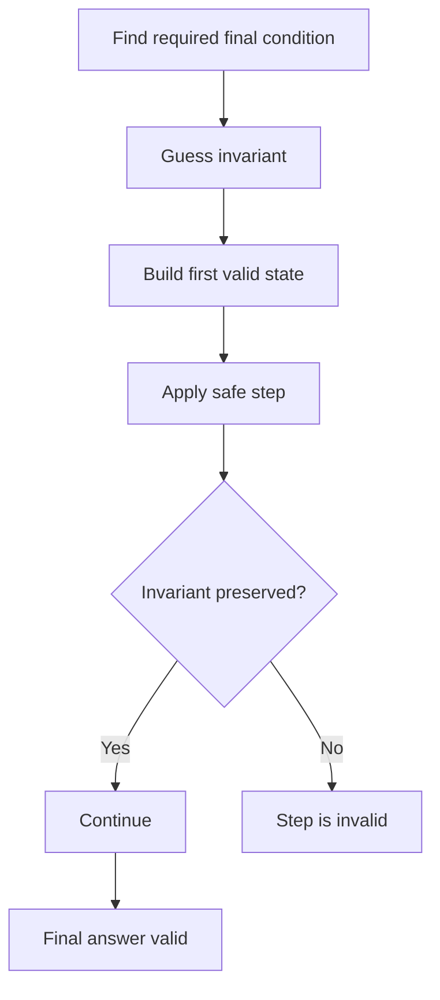

---

## 5.2 Reverse Construction

### Concept
Sometimes building forward is hard, but undoing from target is easy.

| Forward | Reverse |
|---|---|
| Start from empty | Start from final condition |
| Add elements | Remove elements |
| Hard choices | Forced choices |

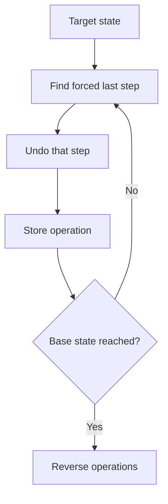

---

## 5.3 Constructive + Math

### Concept
Use number properties to build the answer.

| Math Tool | Construction Use |
|---|---|
| Parity | Split odds/evens |
| GCD | Build coprime pairs |
| Modulo | Cycle patterns |
| Powers of two | Bitmask construction |
| Sum formulas | Check feasibility |

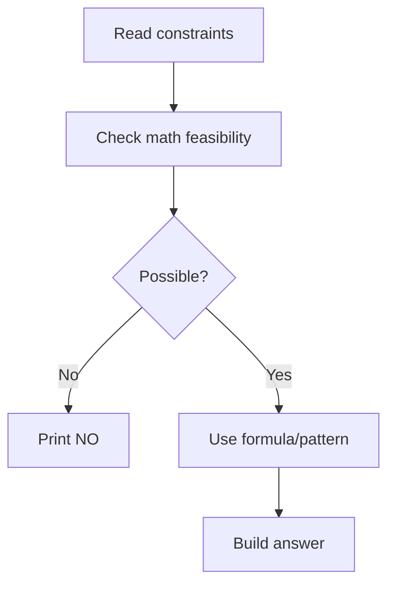

---

## 5.4 Constructive + Graph

### Concept
Build edges/nodes so the graph has required properties.

| Requirement | Construction Idea |
|---|---|
| Connected graph | Start with chain/tree |
| Exactly k edges | Build tree, then add extra edges |
| Bipartite graph | Split nodes into two sets |
| Star shape | Connect all nodes to center |
| Path shape | Connect `1-2-3-...-n` |

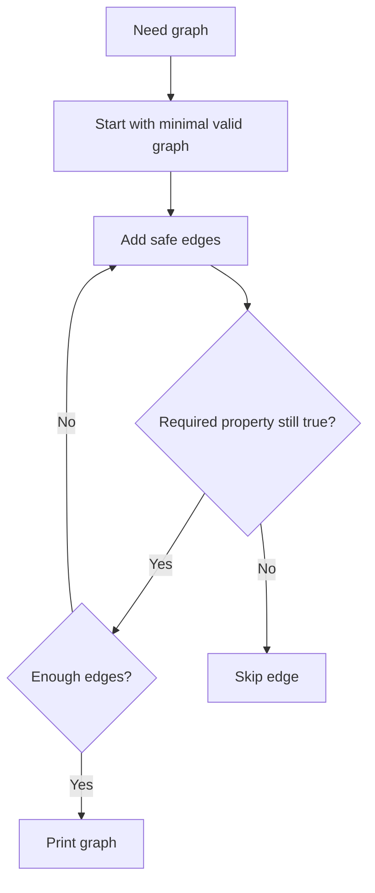

### C++: Connected Graph with `n` nodes and `m` edges

```cpp
#include <bits/stdc++.h>
using namespace std;

int main() {
    int n = 5, m = 6;

    if (m < n - 1 || m > n * (n - 1) / 2) {
        cout << "NO\n";
        return 0;
    }

    vector<pair<int, int>> edges;

    // Build chain first: guarantees connectivity
    for (int i = 1; i < n; i++) {
        edges.push_back({i, i + 1});
    }

    // Add extra edges
    for (int i = 1; i <= n && (int)edges.size() < m; i++) {
        for (int j = i + 2; j <= n && (int)edges.size() < m; j++) {
            edges.push_back({i, j});
        }
    }

    cout << "YES\n";
    for (auto [u, v] : edges) cout << u << ' ' << v << '\n';
}
```

### Dry Run: `n = 5, m = 6`

| Step | Edge Added | Reason |
|---|---|---|
| 1 | `1-2` | chain |
| 2 | `2-3` | chain |
| 3 | `3-4` | chain |
| 4 | `4-5` | chain |
| 5 | `1-3` | extra safe edge |
| 6 | `1-4` | extra safe edge |

---

# 6. Pattern Decision Tree

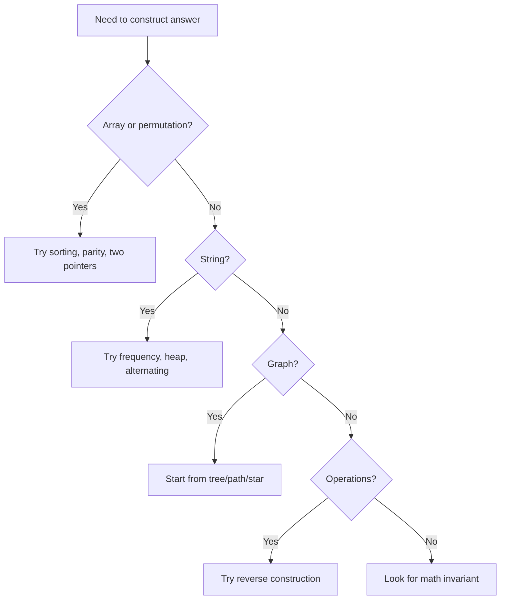

---

# 7. Proof Methods

## 7.1 Invariant Proof

Use when your construction maintains a rule.

### Proof Format

| Step | What to Write |
|---|---|
| Define invariant | State the rule that is always true |
| Base case | Show it is true before construction starts |
| Step | Show one operation keeps it true |
| Finish | Show invariant implies final answer is valid |

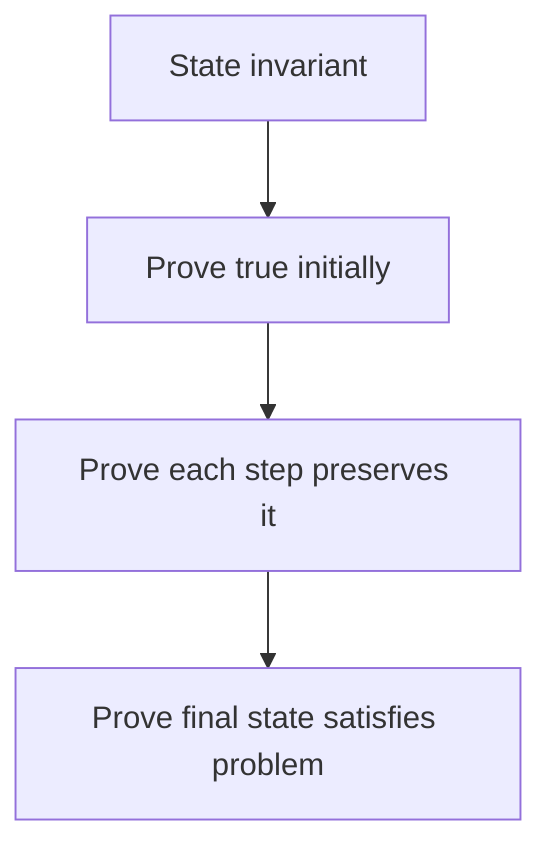

---

## 7.2 Exchange Argument

This is usually for greedy-style constructive problems.

### Idea
Show that if an optimal/valid solution does not use your chosen step, you can swap it in without making things worse.

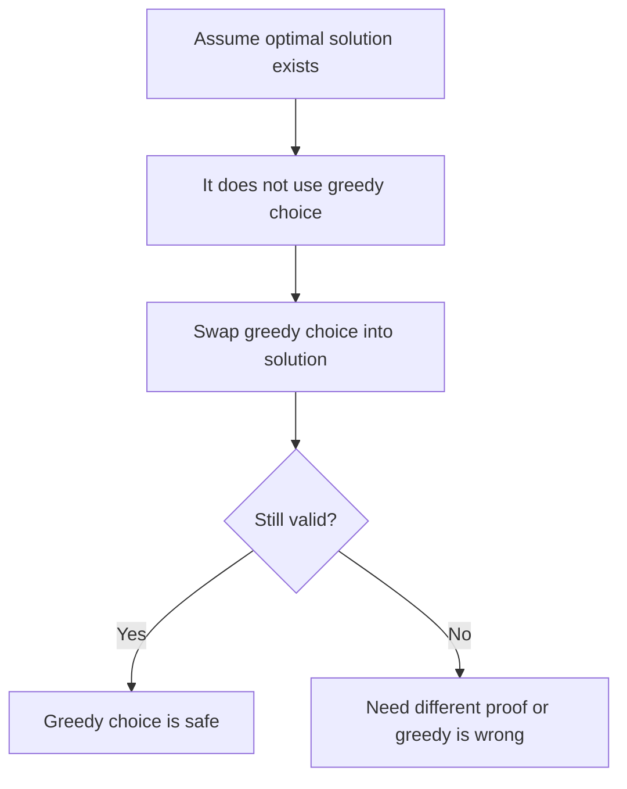

### Exchange Argument Template

```text
1. Let OPT be any valid/optimal solution.
2. Our algorithm chooses X first.
3. Suppose OPT chooses Y instead of X.
4. Replace Y with X.
5. Show constraints are still satisfied.
6. Show answer is not worse.
7. Therefore, some optimal solution starts with X.
8. Repeat for remaining steps.
```

---

## 7.3 Feasibility Proof

Use when problem asks: `print YES and construction, otherwise NO`.

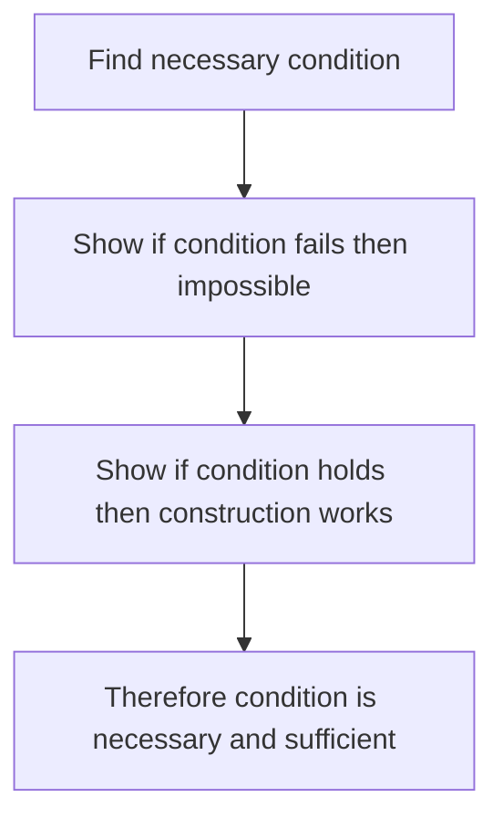

### Template

```text
Necessary:
- Explain why invalid cases cannot work.

Sufficient:
- Give construction.
- Prove construction satisfies all constraints.
```

---

# 8. Dry Run Examples

## 8.1 Example: Construct Array with Sum

### Problem
Construct `n = 4` positive integers with sum `S = 10`.

### Construction
Start with `[1,1,1,1]`, then distribute remaining `6`.

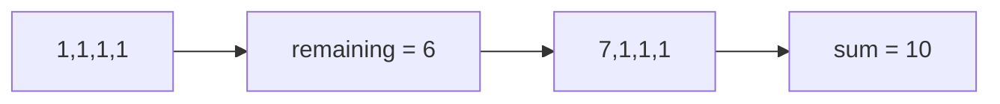

### Dry Run Table

| Step | State | Explanation |
|---|---|---|
| Base | `[1,1,1,1]` | Minimum positive array |
| Remaining | `10 - 4 = 6` | Extra sum to distribute |
| Final | `[7,1,1,1]` | Valid sum 10 |

### Proof

| Proof Part | Explanation |
|---|---|
| Necessary | Sum must be at least `n` because all values are positive |
| Sufficient | If `S >= n`, `[1,1,...,1]` plus remaining always works |

---

## 8.2 Example: Reorganize String

### Problem
Construct string with no adjacent equal characters.

Input: `aaabbc`

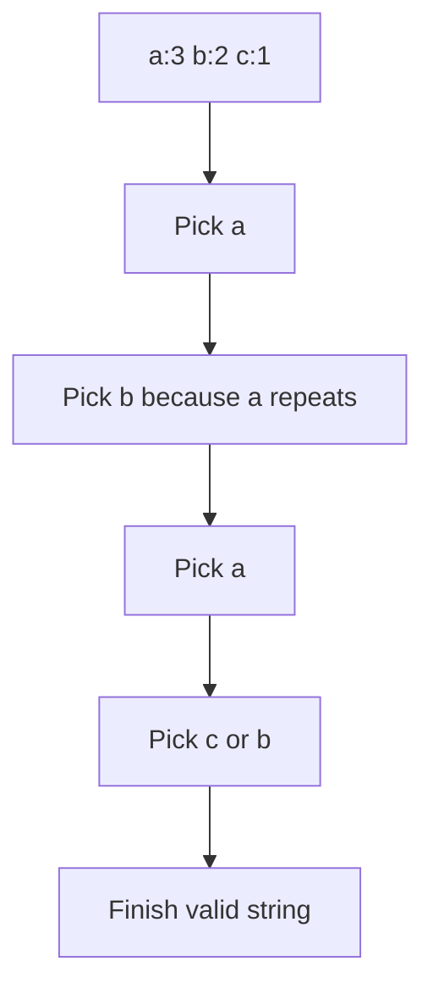

### Dry Run

| Step | Counts | Pick | Result |
|---|---|---|---|
| 1 | `a3 b2 c1` | `a` | `a` |
| 2 | `a2 b2 c1` | `b` | `ab` |
| 3 | `a2 b1 c1` | `a` | `aba` |
| 4 | `a1 b1 c1` | `c` | `abac` |
| 5 | `a1 b1` | `b` | `abacb` |
| 6 | `a1` | `a` | `abacba` |

### Proof Idea
Always avoid placing the same character as previous. Heap gives the best available candidate. If no alternative exists, construction is impossible.

---

## 8.3 Example: Connected Graph Construction

### Problem
Construct connected graph with `n = 4`, `m = 4`.

### Construction
First build chain, then add extra edge.

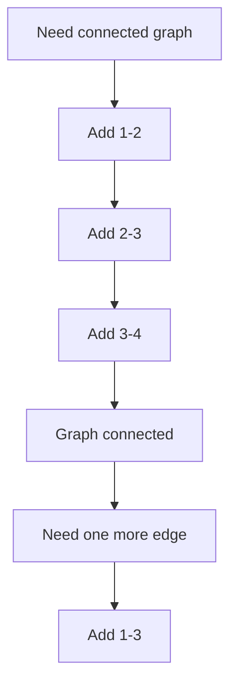

### Dry Run

| Step | Edges | Connected? |
|---|---|---|
| 1 | `1-2` | partial |
| 2 | `1-2, 2-3` | partial |
| 3 | `1-2, 2-3, 3-4` | yes |
| 4 | add `1-3` | yes |

### Proof
A chain of `n-1` edges connects all nodes. Extra edges do not break connectivity.

---

## 8.4 Example: Permutation with No Adjacent Difference 1

### Problem
Construct permutation `1..n` such that adjacent numbers do not differ by `1`.

### Common Construction
Print evens, then odds.

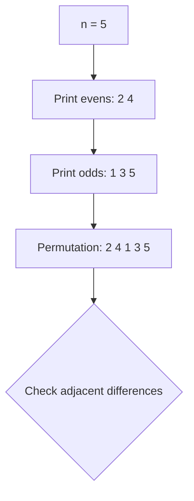

### Dry Run

| Adjacent Pair | Difference | Valid? |
|---|---:|---|
| `2,4` | `2` | yes |
| `4,1` | `3` | yes |
| `1,3` | `2` | yes |
| `3,5` | `2` | yes |

### Edge Cases

| n | Possible? | Reason |
|---:|---|---|
| 1 | yes | single number |
| 2 | no | only `1 2` or `2 1` |
| 3 | no | impossible to avoid difference 1 |
| 4+ | yes | even-odd construction works |

### C++ Code

```cpp
#include <bits/stdc++.h>
using namespace std;

int main() {
    int n;
    cin >> n;

    if (n == 1) {
        cout << 1 << '\n';
        return 0;
    }

    if (n <= 3) {
        cout << "NO SOLUTION\n";
        return 0;
    }

    for (int x = 2; x <= n; x += 2) cout << x << ' ';
    for (int x = 1; x <= n; x += 2) cout << x << ' ';
    cout << '\n';
}
```

---

# 9. C++ Templates

## 9.1 General Constructive Skeleton

```cpp
#include <bits/stdc++.h>
using namespace std;

void solve() {
    // 1. Read input

    // 2. Check impossible cases

    // 3. Build answer step by step

    // 4. Optional: validate answer during debugging

    // 5. Print answer
}

int main() {
    ios::sync_with_stdio(false);
    cin.tie(nullptr);

    int T = 1;
    cin >> T;
    while (T--) solve();
}
```

---

## 9.2 Validate Construction Helper

```cpp
template <class T>
void printVector(const vector<T>& a) {
    for (auto x : a) cout << x << ' ';
    cout << '\n';
}

bool isPermutation(const vector<int>& p, int n) {
    vector<int> seen(n + 1, 0);
    for (int x : p) {
        if (x < 1 || x > n || seen[x]) return false;
        seen[x] = 1;
    }
    return true;
}
```

---

## 9.3 Frequency Heap Template

```cpp
priority_queue<pair<int, char>> pq;

for (auto [ch, count] : freq) {
    pq.push({count, ch});
}

string ans;
while (!pq.empty()) {
    auto [cnt, ch] = pq.top();
    pq.pop();

    // choose ch if valid
    // otherwise choose second best
}
```

---

## 9.4 Graph Construction Template

```cpp
vector<pair<int, int>> edges;

// Start with path to guarantee connectivity
for (int i = 1; i < n; i++) {
    edges.push_back({i, i + 1});
}

// Add extra safe edges
for (int i = 1; i <= n; i++) {
    for (int j = i + 2; j <= n; j++) {
        edges.push_back({i, j});
    }
}
```

---

# 10. Contest / OA Checklist

Before coding:

| Question | Why it matters |
|---|---|
| What exactly must be constructed? | Array, string, graph, operations |
| Are there impossible cases? | Need print `NO` sometimes |
| What invariant can I maintain? | Main proof tool |
| Can I build from simple base? | Easier construction |
| Is reverse easier? | Common in operations problems |
| Can I validate with small cases? | Prevent hidden WA |

During proof:

```mermaid
flowchart TD
    A[State construction] --> B[Handle impossible cases]
    B --> C[Show every step is valid]
    C --> D[Show final output satisfies constraints]
    D --> E[Complexity]
```

---

# 11. Common Mistakes

| Mistake | Fix |
|---|---|
| Ignoring small `n` | Always test `n = 1,2,3` |
| Assuming construction always works | Prove feasibility |
| Breaking invariant midway | Check after every step |
| Too much brute force | Look for pattern or invariant |
| Printing invalid answer | Add local validation while practicing |
| Forgetting duplicate constraints | Use set/frequency checks |

---

# 12. Practice Ladder

## Beginner

| Topic | Practice Focus |
|---|---|
| Build array with sum | Feasibility + construction |
| Odd-even permutation | Parity pattern |
| High-low arrangement | Two pointers |
| Balanced parentheses | Prefix invariant |

## FAANG / OA

| Topic | Practice Focus |
|---|---|
| Reorganize string | Heap construction |
| Task scheduler style | Frequency + cooldown |
| Restore array/order | Map + constraints |
| Construct operations | Simulation |

## Advanced / CM

| Topic | Practice Focus |
|---|---|
| Graph construction | Minimal base + extra edges |
| Bitwise construction | XOR/AND/OR invariants |
| Reverse operations | Work backward |
| Constructive number theory | GCD, parity, modulo |
| Interactive-style construction | Maintain invariant under queries |

---

# Final Mental Model

```mermaid
flowchart TD
    A[Constructive Problem] --> B[Find impossible cases]
    B --> C[Choose simple base]
    C --> D[Maintain invariant]
    D --> E[Build answer]
    E --> F[Dry run small cases]
    F --> G[Prove construction]
    G --> H[Submit]
```

