# 014 Ad Hoc Advanced Patterns Master Guide
## Codeforces A/B/C/D + FAANG Observation Training

> Goal: upgrade from simple ad hoc to advanced observation forms used in harder Codeforces B/C/D problems.
>
> Style used in every problem:
>
> `Problem Statement → Input/Output → Observation → Timeline Dry Run → Index-by-Index Table → C++ Code → Complexity`

---

# Clickable Index

- [0. How To Use This Advanced Guide](#0-how-to-use-this-advanced-guide)
- [1. Advanced Pattern Map](#1-advanced-pattern-map)
- [2. Form M: Greedy Observation Ad Hoc](#2-form-m-greedy-observation-ad-hoc)
  - [M1. Ferris Wheel](#m1-ferris-wheel)
  - [M2. Dragons](#m2-dragons)
- [3. Form N: Reverse Thinking / Reverse Simulation](#3-form-n-reverse-thinking--reverse-simulation)
  - [N1. Broken Calculator](#n1-broken-calculator)
  - [N2. Construct Target Array With Multiple Sums](#n2-construct-target-array-with-multiple-sums)
- [4. Form O: Invariant + Conservation](#4-form-o-invariant--conservation)
  - [O1. Coin Piles](#o1-coin-piles)
  - [O2. Even Array](#o2-even-array)
- [5. Form P: Geometry / Coordinate Observation](#5-form-p-geometry--coordinate-observation)
  - [P1. Beautiful Matrix](#p1-beautiful-matrix)
  - [P2. Robot Bounded In Circle](#p2-robot-bounded-in-circle)
- [6. Form Q: Permutation Observation](#6-form-q-permutation-observation)
  - [Q1. Presents](#q1-presents)
  - [Q2. Minimum Swaps To Sort](#q2-minimum-swaps-to-sort)
- [7. Form R: Interval / Event Observation](#7-form-r-interval--event-observation)
  - [R1. Restaurant Customers](#r1-restaurant-customers)
  - [R2. Merge Intervals](#r2-merge-intervals)
- [8. Form S: Bitwise Observation Ad Hoc](#8-form-s-bitwise-observation-ad-hoc)
  - [S1. Single Number](#s1-single-number)
  - [S2. Power Of Two](#s2-power-of-two)
- [9. Form T: Math Observation Ad Hoc](#9-form-t-math-observation-ad-hoc)
  - [T1. Greatest Common Divisor Observation](#t1-greatest-common-divisor-observation)
  - [T2. K-th Not Divisible By n](#t2-k-th-not-divisible-by-n)
- [10. Form U: Process Compression](#10-form-u-process-compression)
  - [U1. Josephus Problem I](#u1-josephus-problem-i)
  - [U2. Queue At The School](#u2-queue-at-the-school)
- [11. Form V: Observation From Examples](#11-form-v-observation-from-examples)
  - [V1. Add Digits](#v1-add-digits)
  - [V2. Domino Piling](#v2-domino-piling)
- [12. Final Advanced Ad Hoc Checklist](#12-final-advanced-ad-hoc-checklist)

---

# 0. How To Use This Advanced Guide

For each ad hoc problem, ask:

```text
1. Is there a direct process?
2. Can the process be reversed?
3. Does some quantity never change?
4. Does sorting reveal the greedy order?
5. Is it about intervals/events?
6. Is it a permutation/cycle problem?
7. Is bitwise behaviour hidden?
8. Can repeated operations be compressed?
9. Do tiny examples reveal a formula?
```

---

# 1. Advanced Pattern Map


```mermaid
flowchart TD
    A["Advanced Ad Hoc"] --> B["Greedy Observation"]
    A --> C["Reverse Thinking"]
    A --> D["Invariant"]
    A --> E["Geometry Coordinate"]
    A --> F["Permutation"]
    A --> G["Interval Event"]
    A --> H["Bitwise"]
    A --> I["Math"]
    A --> J["Process Compression"]
    A --> K["Observation From Examples"]

    B --> B1["Sort then choose"]
    B --> B2["Two pointers"]
    B --> B3["Exchange idea"]

    C --> C1["Undo operation"]
    C --> C2["Work from target"]
    C --> C3["Reverse construction"]

    D --> D1["Sum invariant"]
    D --> D2["Parity invariant"]
    D --> D3["Modulo invariant"]

    E --> E1["Manhattan distance"]
    E --> E2["Direction state"]
    E --> E3["Coordinate transform"]

    F --> F1["Inverse mapping"]
    F --> F2["Cycles"]
    F --> F3["Swaps"]

    G --> G1["Sort events"]
    G --> G2["Merge"]
    G --> G3["Sweep line"]

    H --> H1["XOR cancel"]
    H --> H2["Highest bit"]
    H --> H3["Power of two"]

    I --> I1["GCD"]
    I --> I2["Ceil floor"]
    I --> I3["Divisibility"]

    J --> J1["Batch repeated steps"]
    J --> J2["Cycle compression"]
    J --> J3["Modulo time"]

    K --> K1["Small table"]
    K --> K2["Find pattern"]
    K --> K3["Prove rule"]
```

---

# 2. Form M: Greedy Observation Ad Hoc

## Recognition

Use greedy when a local choice can safely lead to global best.

| Signal | Greedy Thought |
|---|---|
| maximum/minimum arrangement | sort |
| pair small with large | two pointers |
| choose weakest/earliest first | sorted order |
| one resource increases/decreases | process easiest first |

---

# M1. Ferris Wheel

**Link:** https://cses.fi/problemset/task/1090

## Problem Statement

There are `n` children with weights. Each gondola can carry at most two children and total weight at most `x`. Find the minimum number of gondolas.

## Input

```text
n = 4, x = 10
weights = [7, 2, 3, 9]
```

## Output

```text
3
```

## Observation

Sort weights. Pair the lightest child with the heaviest possible child.

If lightest + heaviest <= x, put both together. Otherwise, heaviest must go alone.

## Timeline Dry Run

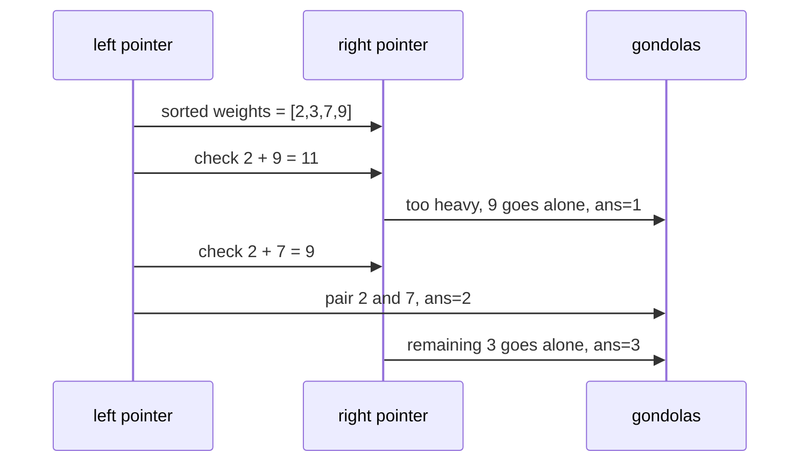
```mermaid
sequenceDiagram
    participant L as left pointer
    participant R as right pointer
    participant Ans as gondolas

    L->>R: sorted weights = [2,3,7,9]
    L->>R: check 2 + 9 = 11
    R->>Ans: too heavy, 9 goes alone, ans=1
    L->>R: check 2 + 7 = 9
    L->>Ans: pair 2 and 7, ans=2
    R->>Ans: remaining 3 goes alone, ans=3
```

## Index-by-Index Table

| Step | left | right | Check | Action | Gondolas |
|---:|---:|---:|---|---|---:|
| 1 | 0 | 3 | `2 + 9 = 11 > 10` | `9` alone | 1 |
| 2 | 0 | 2 | `2 + 7 = 9 <= 10` | pair `2,7` | 2 |
| 3 | 1 | 1 | one child left | `3` alone | 3 |

## C++ Code

```cpp
#include <bits/stdc++.h>
using namespace std;

int ferrisWheel(vector<int>& w, int x) {
    sort(w.begin(), w.end());

    int l = 0;
    int r = (int)w.size() - 1;
    int ans = 0;

    while (l <= r) {
        if (w[l] + w[r] <= x) {
            l++;
            r--;
        } else {
            r--;
        }
        ans++;
    }

    return ans;
}
```

## Complexity

```text
Time: O(n log n)
Space: O(1) apart from sorting
```

---

# M2. Dragons

**Link:** https://codeforces.com/problemset/problem/230/A

## Problem Statement

You have initial strength `s`. There are dragons `(strength, bonus)`. You can defeat a dragon only if your strength is greater than dragon strength. After defeating, you gain bonus. Determine if you can defeat all dragons.

## Input

```text
s = 2
dragons = [(1,99), (100,0)]
```

## Output

```text
YES
```

## Observation

Fight the weakest dragon first. If you cannot defeat the weakest currently available dragon, you cannot defeat any stronger dragon either.

## Timeline Dry Run

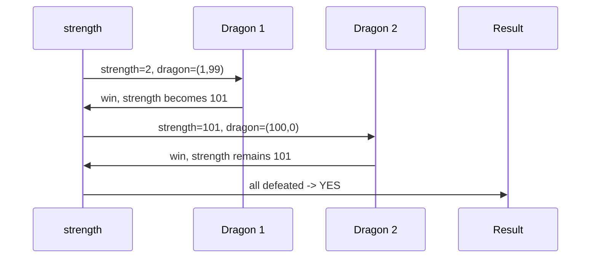
```mermaid
sequenceDiagram
    participant Hero as strength
    participant D1 as Dragon 1
    participant D2 as Dragon 2
    participant Ans as Result

    Hero->>D1: strength=2, dragon=(1,99)
    D1->>Hero: win, strength becomes 101
    Hero->>D2: strength=101, dragon=(100,0)
    D2->>Hero: win, strength remains 101
    Hero->>Ans: all defeated -> YES
```

## Index-by-Index Table

| Step | Current Strength | Dragon Strength | Bonus | Can Defeat? | New Strength |
|---:|---:|---:|---:|---|---:|
| 1 | 2 | 1 | 99 | yes | 101 |
| 2 | 101 | 100 | 0 | yes | 101 |

## C++ Code

```cpp
#include <bits/stdc++.h>
using namespace std;

bool canDefeatAll(int s, vector<pair<int,int>>& dragons) {
    sort(dragons.begin(), dragons.end());

    for (auto [need, bonus] : dragons) {
        if (s <= need) return false;
        s += bonus;
    }

    return true;
}
```

## Complexity

```text
Time: O(n log n)
Space: O(1)
```

---

# 3. Form N: Reverse Thinking / Reverse Simulation

## Recognition

Use reverse thinking when forward simulation branches too much or grows too fast.

| Signal | Reverse Idea |
|---|---|
| multiply forward | divide backward |
| append/build target | remove from target |
| operation increases value | reverse decreases value |
| many possible forward choices | one forced reverse choice |

---

# N1. Broken Calculator

**Link:** https://leetcode.com/problems/broken-calculator/

## Problem Statement

Starting from `startValue`, you can either multiply by 2 or subtract 1. Find minimum operations to reach `target`.

## Input

```text
startValue = 3
target = 10
```

## Output

```text
3
```

## Observation

Forward has many choices. Reverse from target is easier:

- If target is even, divide by 2.
- If target is odd, add 1.
- Stop when target <= startValue.

## Timeline Dry Run

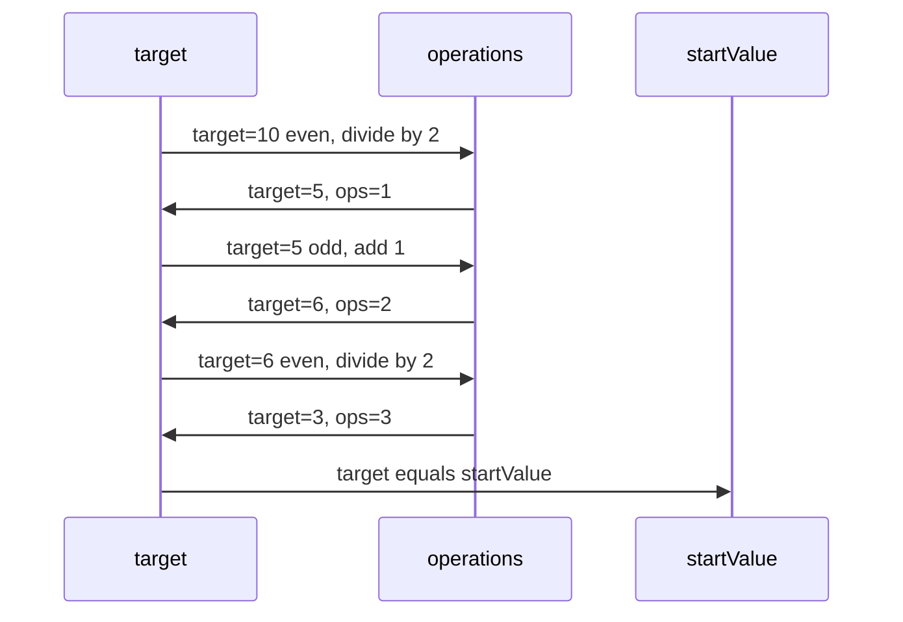
```mermaid
sequenceDiagram
    participant T as target
    participant Ops as operations
    participant S as startValue

    T->>Ops: target=10 even, divide by 2
    Ops->>T: target=5, ops=1
    T->>Ops: target=5 odd, add 1
    Ops->>T: target=6, ops=2
    T->>Ops: target=6 even, divide by 2
    Ops->>T: target=3, ops=3
    T->>S: target equals startValue
```

## Index-by-Index Table

| Step | target before | Rule | target after | ops |
|---:|---:|---|---:|---:|
| 1 | 10 | even → divide by 2 | 5 | 1 |
| 2 | 5 | odd → add 1 | 6 | 2 |
| 3 | 6 | even → divide by 2 | 3 | 3 |

## C++ Code

```cpp
#include <bits/stdc++.h>
using namespace std;

int brokenCalc(int startValue, int target) {
    int ops = 0;

    while (target > startValue) {
        if (target % 2 == 0) {
            target /= 2;
        } else {
            target++;
        }
        ops++;
    }

    return ops + (startValue - target);
}
```

## Complexity

```text
Time: O(log target)
Space: O(1)
```

---

# N2. Construct Target Array With Multiple Sums

**Link:** https://leetcode.com/problems/construct-target-array-with-multiple-sums/

## Problem Statement

Start with an array of ones. In one move, replace one element with the sum of the whole array. Determine if target can be built.

## Input

```text
target = [9,3,5]
```

## Output

```text
true
```

## Observation

Reverse the process. The largest element must be the last updated value. Replace it by:

```text
largest % sum_of_rest
```

## Timeline Dry Run

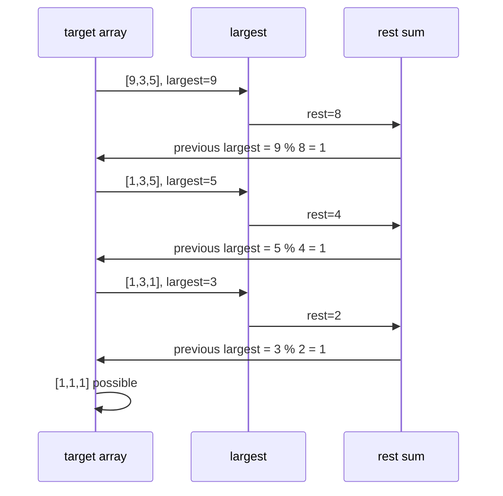
```mermaid
sequenceDiagram
    participant Arr as target array
    participant Max as largest
    participant Rest as rest sum

    Arr->>Max: [9,3,5], largest=9
    Max->>Rest: rest=8
    Rest->>Arr: previous largest = 9 % 8 = 1
    Arr->>Max: [1,3,5], largest=5
    Max->>Rest: rest=4
    Rest->>Arr: previous largest = 5 % 4 = 1
    Arr->>Max: [1,3,1], largest=3
    Max->>Rest: rest=2
    Rest->>Arr: previous largest = 3 % 2 = 1
    Arr->>Arr: [1,1,1] possible
```

## Index-by-Index Table

| Step | Array State | Largest | Rest Sum | Previous Value | Valid? |
|---:|---|---:|---:|---:|---|
| 1 | `[9,3,5]` | 9 | 8 | 1 | yes |
| 2 | `[1,3,5]` | 5 | 4 | 1 | yes |
| 3 | `[1,3,1]` | 3 | 2 | 1 | yes |
| 4 | `[1,1,1]` | 1 | - | - | done |

## C++ Code

```cpp
#include <bits/stdc++.h>
using namespace std;

bool isPossible(vector<int>& target) {
    long long sum = 0;
    priority_queue<int> pq;

    for (int x : target) {
        sum += x;
        pq.push(x);
    }

    while (pq.top() != 1) {
        long long largest = pq.top();
        pq.pop();

        long long rest = sum - largest;

        if (rest <= 0 || rest >= largest) return false;

        long long prev = largest % rest;

        if (prev == 0) {
            if (rest == 1) return true;
            return false;
        }

        sum = rest + prev;
        pq.push((int)prev);
    }

    return true;
}
```

## Complexity

```text
Time: O(n log n * number of reductions)
Space: O(n)
```

---

# 4. Form O: Invariant + Conservation

## Recognition

An invariant is something that stays unchanged after operations.

| Invariant Type | Example |
|---|---|
| sum | total tokens |
| parity | odd/even count |
| modulo | value mod k |
| color | chessboard color |
| difference | balance between groups |

---

# O1. Coin Piles

**Link:** https://cses.fi/problemset/task/1754

## Problem Statement

There are two piles with `a` and `b` coins. One move removes 2 coins from one pile and 1 coin from the other. Determine if both piles can become zero.

## Input

```text
a = 2, b = 1
```

## Output

```text
YES
```

## Observation

Each move removes exactly 3 coins. So `a + b` must be divisible by 3.

Also, the larger pile cannot be more than twice the smaller pile.

## Timeline Dry Run

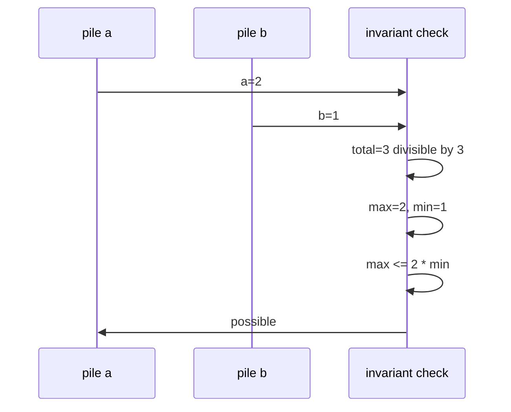
```mermaid
sequenceDiagram
    participant A as pile a
    participant B as pile b
    participant Check as invariant check

    A->>Check: a=2
    B->>Check: b=1
    Check->>Check: total=3 divisible by 3
    Check->>Check: max=2, min=1
    Check->>Check: max <= 2 * min
    Check->>A: possible
```

## Index-by-Index Table

| Check | Value | Required | Result |
|---|---:|---|---|
| total | `2 + 1 = 3` | divisible by 3 | pass |
| balance | `max=2, min=1` | `2 <= 2*1` | pass |
| final | - | both pass | YES |

## C++ Code

```cpp
#include <bits/stdc++.h>
using namespace std;

bool coinPiles(long long a, long long b) {
    long long sum = a + b;
    long long mx = max(a, b);
    long long mn = min(a, b);

    return sum % 3 == 0 && mx <= 2 * mn;
}
```

## Complexity

```text
Time: O(1)
Space: O(1)
```

---

# O2. Even Array

**Link:** https://codeforces.com/problemset/problem/1367/B

## Problem Statement

Array length is `n`. You need every index `i` to have `a[i] % 2 == i % 2`. You can swap any two elements. Find minimum swaps or `-1`.

## Input

```text
n = 4
a = [3,2,7,6]
```

## Output

```text
2
```

## Observation

Only mismatched parity positions matter.

- odd value at even index must swap with even value at odd index.
- counts must match.

## Timeline Dry Run

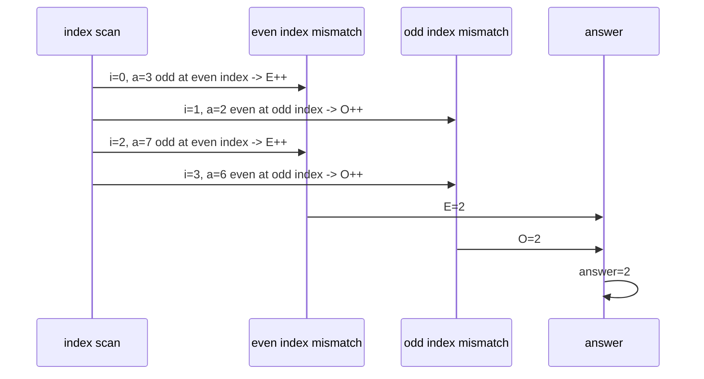
```mermaid
sequenceDiagram
    participant I as index scan
    participant E as even index mismatch
    participant O as odd index mismatch
    participant Ans as answer

    I->>E: i=0, a=3 odd at even index -> E++
    I->>O: i=1, a=2 even at odd index -> O++
    I->>E: i=2, a=7 odd at even index -> E++
    I->>O: i=3, a=6 even at odd index -> O++
    E->>Ans: E=2
    O->>Ans: O=2
    Ans->>Ans: answer=2
```

## Index-by-Index Table

| i | a[i] | i parity | value parity | Mismatch Type |
|---:|---:|---|---|---|
| 0 | 3 | even | odd | even-index mismatch |
| 1 | 2 | odd | even | odd-index mismatch |
| 2 | 7 | even | odd | even-index mismatch |
| 3 | 6 | odd | even | odd-index mismatch |

## C++ Code

```cpp
#include <bits/stdc++.h>
using namespace std;

int evenArray(vector<int>& a) {
    int evenMismatch = 0;
    int oddMismatch = 0;

    for (int i = 0; i < (int)a.size(); i++) {
        if (a[i] % 2 != i % 2) {
            if (i % 2 == 0) evenMismatch++;
            else oddMismatch++;
        }
    }

    if (evenMismatch != oddMismatch) return -1;
    return evenMismatch;
}
```

## Complexity

```text
Time: O(n)
Space: O(1)
```

---

# 5. Form P: Geometry / Coordinate Observation

## Recognition

Use when a problem can be reduced to coordinate movement, distance, direction, or geometry invariant.

---

# P1. Beautiful Matrix

**Link:** https://codeforces.com/problemset/problem/263/A

## Problem Statement

A `5 x 5` matrix contains exactly one `1`. You can swap adjacent rows or columns. Find minimum moves to bring `1` to center `(2,2)` using zero-based index.

## Input

```text
0 0 0 0 0
0 0 0 0 1
0 0 0 0 0
0 0 0 0 0
0 0 0 0 0
```

## Output

```text
3
```

## Observation

Adjacent row/column swaps are exactly Manhattan distance to center.

```text
answer = abs(r - 2) + abs(c - 2)
```

## Timeline Dry Run

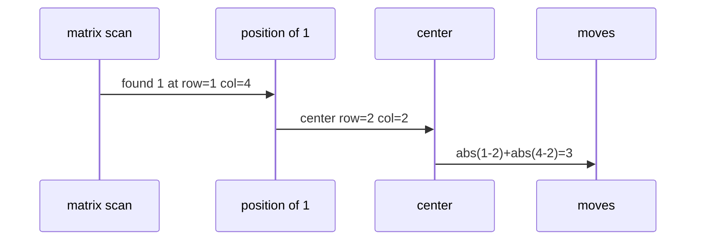
```mermaid
sequenceDiagram
    participant Scan as matrix scan
    participant Pos as position of 1
    participant Center as center
    participant Ans as moves

    Scan->>Pos: found 1 at row=1 col=4
    Pos->>Center: center row=2 col=2
    Center->>Ans: abs(1-2)+abs(4-2)=3
```

## Index-by-Index Table

| Item | Row | Col |
|---|---:|---:|
| position of `1` | 1 | 4 |
| center | 2 | 2 |
| row distance | `abs(1-2)` | 1 |
| col distance | `abs(4-2)` | 2 |
| answer | - | 3 |

## C++ Code

```cpp
#include <bits/stdc++.h>
using namespace std;

int beautifulMatrix(vector<vector<int>>& mat) {
    for (int r = 0; r < 5; r++) {
        for (int c = 0; c < 5; c++) {
            if (mat[r][c] == 1) {
                return abs(r - 2) + abs(c - 2);
            }
        }
    }
    return 0;
}
```

## Complexity

```text
Time: O(25)
Space: O(1)
```

---

# P2. Robot Bounded In Circle

**Link:** https://leetcode.com/problems/robot-bounded-in-circle/

## Problem Statement

Robot starts at `(0,0)` facing north. It follows instructions repeatedly forever. Determine if it remains bounded in a circle.

## Input

```text
instructions = "GGLLGG"
```

## Output

```text
true
```

## Observation

After one instruction cycle:

- If robot returns to origin, bounded.
- If robot does not face north, repeated cycles will rotate path and eventually circle.
- If not at origin and still facing north, unbounded.

## Timeline Dry Run

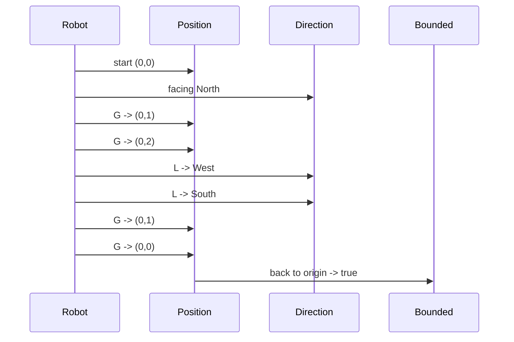
```mermaid
sequenceDiagram
    participant R as Robot
    participant Pos as Position
    participant Dir as Direction
    participant Ans as Bounded

    R->>Pos: start (0,0)
    R->>Dir: facing North
    R->>Pos: G -> (0,1)
    R->>Pos: G -> (0,2)
    R->>Dir: L -> West
    R->>Dir: L -> South
    R->>Pos: G -> (0,1)
    R->>Pos: G -> (0,0)
    Pos->>Ans: back to origin -> true
```

## Index-by-Index Table

| Step | Instruction | Position Before | Direction Before | Position After | Direction After |
|---:|---|---|---|---|---|
| 1 | G | `(0,0)` | N | `(0,1)` | N |
| 2 | G | `(0,1)` | N | `(0,2)` | N |
| 3 | L | `(0,2)` | N | `(0,2)` | W |
| 4 | L | `(0,2)` | W | `(0,2)` | S |
| 5 | G | `(0,2)` | S | `(0,1)` | S |
| 6 | G | `(0,1)` | S | `(0,0)` | S |

## C++ Code

```cpp
#include <bits/stdc++.h>
using namespace std;

bool isRobotBounded(string instructions) {
    int x = 0, y = 0;
    int dir = 0; // 0=N, 1=E, 2=S, 3=W

    vector<int> dx = {0, 1, 0, -1};
    vector<int> dy = {1, 0, -1, 0};

    for (char c : instructions) {
        if (c == 'G') {
            x += dx[dir];
            y += dy[dir];
        } else if (c == 'L') {
            dir = (dir + 3) % 4;
        } else {
            dir = (dir + 1) % 4;
        }
    }

    return (x == 0 && y == 0) || dir != 0;
}
```

## Complexity

```text
Time: O(n)
Space: O(1)
```

---

# 6. Form Q: Permutation Observation

## Recognition

Permutation problems often hide inverse mapping, cycles, relative order, or swap counts.

---

# Q1. Presents

**Link:** https://codeforces.com/problemset/problem/136/A

## Problem Statement

Person `i` gives a gift to person `p[i]`. For each person, output who gave them a gift.

## Input

```text
p = [2,3,4,1]
```

## Output

```text
4 1 2 3
```

## Observation

This is inverse permutation.

If `i` gives to `p[i]`, then:

```text
ans[p[i]] = i
```

## Timeline Dry Run

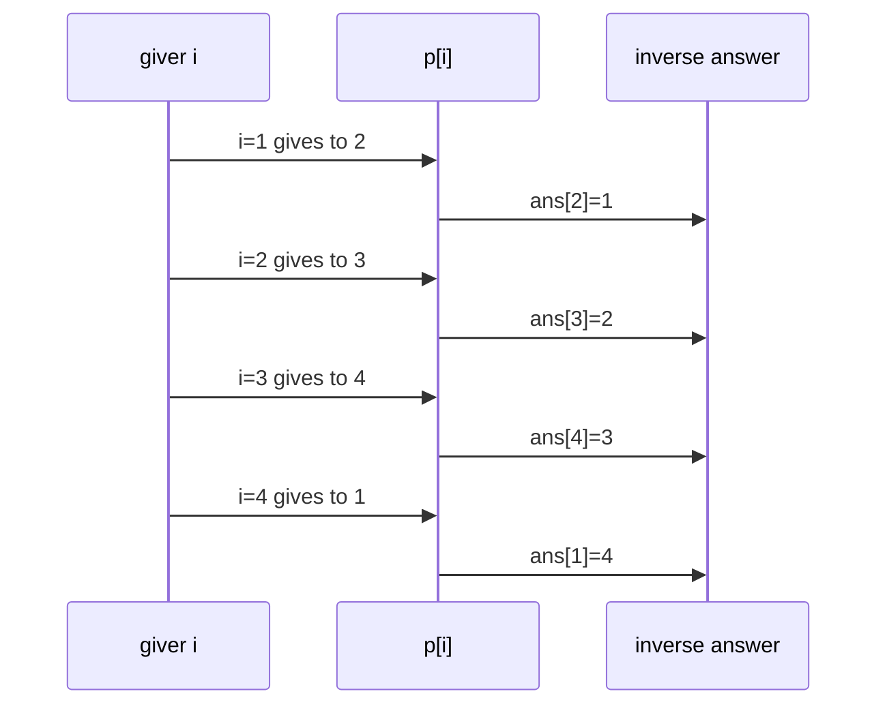
```mermaid
sequenceDiagram
    participant I as giver i
    participant P as p[i]
    participant Ans as inverse answer

    I->>P: i=1 gives to 2
    P->>Ans: ans[2]=1
    I->>P: i=2 gives to 3
    P->>Ans: ans[3]=2
    I->>P: i=3 gives to 4
    P->>Ans: ans[4]=3
    I->>P: i=4 gives to 1
    P->>Ans: ans[1]=4
```

## Index-by-Index Table

| i | p[i] | Meaning | Update |
|---:|---:|---|---|
| 1 | 2 | 1 gives to 2 | `ans[2]=1` |
| 2 | 3 | 2 gives to 3 | `ans[3]=2` |
| 3 | 4 | 3 gives to 4 | `ans[4]=3` |
| 4 | 1 | 4 gives to 1 | `ans[1]=4` |

## C++ Code

```cpp
#include <bits/stdc++.h>
using namespace std;

vector<int> presents(vector<int>& p) {
    int n = p.size();
    vector<int> ans(n + 1);

    for (int i = 1; i <= n; i++) {
        ans[p[i - 1]] = i;
    }

    vector<int> result;
    for (int person = 1; person <= n; person++) {
        result.push_back(ans[person]);
    }

    return result;
}
```

## Complexity

```text
Time: O(n)
Space: O(n)
```

---

# Q2. Minimum Swaps To Sort

## Problem Statement

Given an array with distinct values, find minimum swaps needed to sort it.

## Input

```text
a = [4,3,2,1]
```

## Output

```text
2
```

## Observation

A permutation cycle of length `k` needs `k - 1` swaps.

## Timeline Dry Run

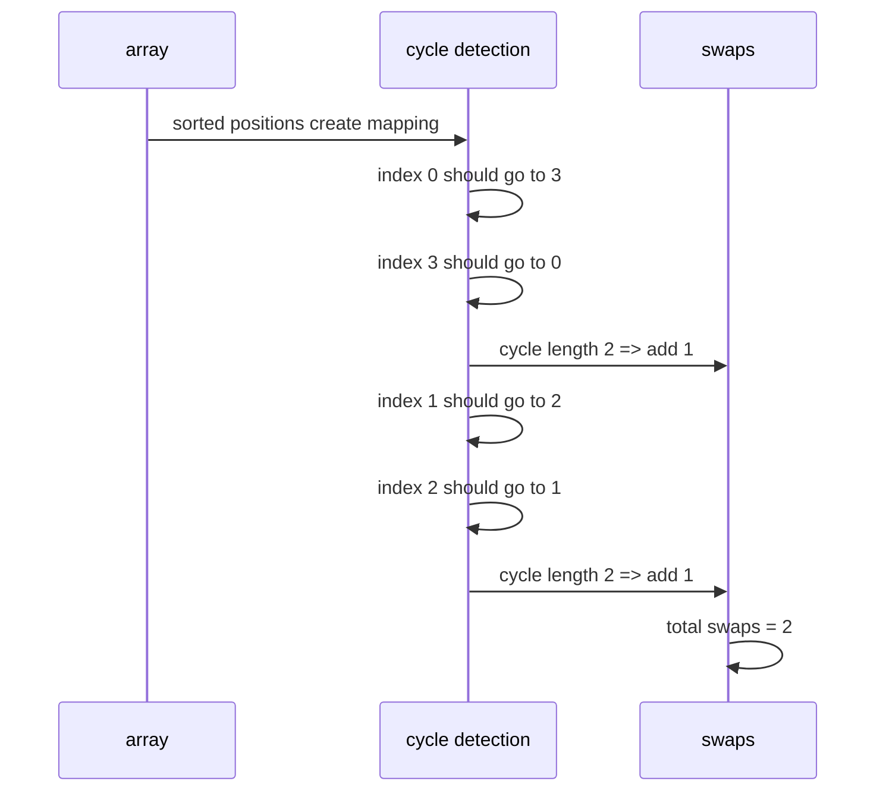
```mermaid
sequenceDiagram
    participant Arr as array
    participant Cycle as cycle detection
    participant Ans as swaps

    Arr->>Cycle: sorted positions create mapping
    Cycle->>Cycle: index 0 should go to 3
    Cycle->>Cycle: index 3 should go to 0
    Cycle->>Ans: cycle length 2 => add 1
    Cycle->>Cycle: index 1 should go to 2
    Cycle->>Cycle: index 2 should go to 1
    Cycle->>Ans: cycle length 2 => add 1
    Ans->>Ans: total swaps = 2
```

## Index-by-Index Table

| Cycle | Indices | Length | Swaps Needed |
|---:|---|---:|---:|
| 1 | `0 -> 3 -> 0` | 2 | 1 |
| 2 | `1 -> 2 -> 1` | 2 | 1 |
| Total | - | - | 2 |

## C++ Code

```cpp
#include <bits/stdc++.h>
using namespace std;

int minSwapsToSort(vector<int> a) {
    int n = a.size();

    vector<pair<int,int>> v;
    for (int i = 0; i < n; i++) {
        v.push_back({a[i], i});
    }

    sort(v.begin(), v.end());

    vector<int> vis(n, 0);
    int swaps = 0;

    for (int i = 0; i < n; i++) {
        if (vis[i] || v[i].second == i) continue;

        int cycleSize = 0;
        int j = i;

        while (!vis[j]) {
            vis[j] = 1;
            j = v[j].second;
            cycleSize++;
        }

        swaps += cycleSize - 1;
    }

    return swaps;
}
```

## Complexity

```text
Time: O(n log n)
Space: O(n)
```

---

# 7. Form R: Interval / Event Observation

## Recognition

If a problem has start/end times, ranges, arrivals/departures, or segment overlap, think interval/event.

---

# R1. Restaurant Customers

**Link:** https://cses.fi/problemset/task/1619

## Problem Statement

Given arrival and leaving times of customers, find maximum number of customers inside restaurant at any time.

## Input

```text
times = [(5,8), (2,4), (3,9)]
```

## Output

```text
2
```

## Observation

Convert intervals into events:

- arrival = `+1`
- leaving = `-1`

Sort events by time and scan.

## Timeline Dry Run

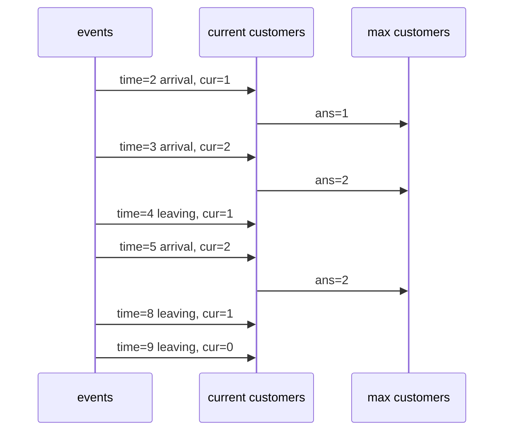
```mermaid
sequenceDiagram
    participant Events as events
    participant Cur as current customers
    participant Ans as max customers

    Events->>Cur: time=2 arrival, cur=1
    Cur->>Ans: ans=1
    Events->>Cur: time=3 arrival, cur=2
    Cur->>Ans: ans=2
    Events->>Cur: time=4 leaving, cur=1
    Events->>Cur: time=5 arrival, cur=2
    Cur->>Ans: ans=2
    Events->>Cur: time=8 leaving, cur=1
    Events->>Cur: time=9 leaving, cur=0
```

## Index-by-Index Table

| Step | Time | Event | Current After | Answer |
|---:|---:|---|---:|---:|
| 1 | 2 | arrival | 1 | 1 |
| 2 | 3 | arrival | 2 | 2 |
| 3 | 4 | leaving | 1 | 2 |
| 4 | 5 | arrival | 2 | 2 |
| 5 | 8 | leaving | 1 | 2 |
| 6 | 9 | leaving | 0 | 2 |

## C++ Code

```cpp
#include <bits/stdc++.h>
using namespace std;

int restaurantCustomers(vector<pair<int,int>>& intervals) {
    vector<pair<int,int>> events;

    for (auto [a, b] : intervals) {
        events.push_back({a, +1});
        events.push_back({b, -1});
    }

    sort(events.begin(), events.end());

    int cur = 0;
    int ans = 0;

    for (auto [time, delta] : events) {
        cur += delta;
        ans = max(ans, cur);
    }

    return ans;
}
```

## Complexity

```text
Time: O(n log n)
Space: O(n)
```

---

# R2. Merge Intervals

**Link:** https://leetcode.com/problems/merge-intervals/

## Problem Statement

Given intervals, merge all overlapping intervals.

## Input

```text
intervals = [[1,3],[2,6],[8,10],[15,18]]
```

## Output

```text
[[1,6],[8,10],[15,18]]
```

## Observation

Sort by start. Maintain last merged interval. If next starts before or at last end, merge.

## Timeline Dry Run

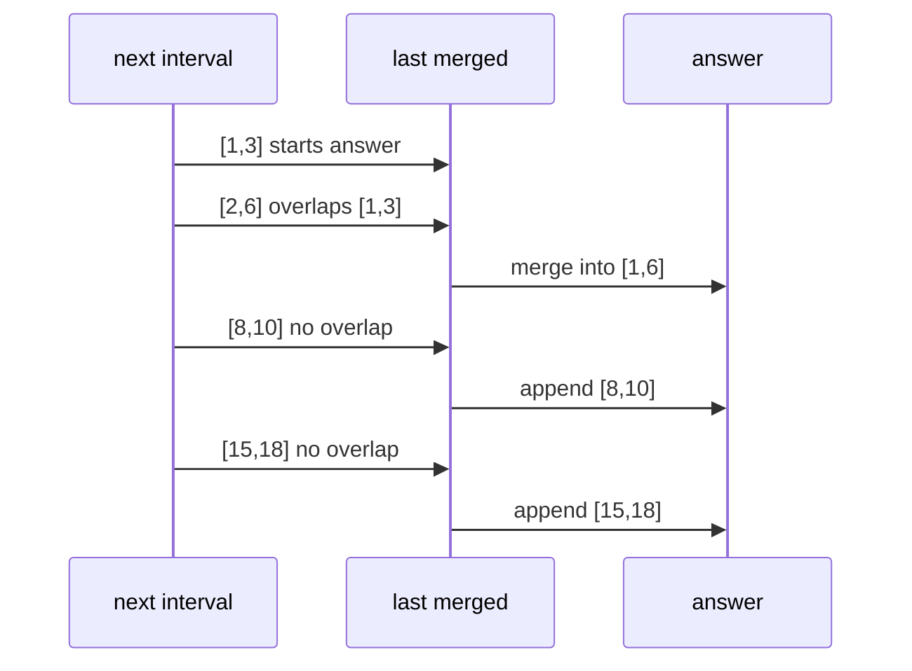
```mermaid
sequenceDiagram
    participant Next as next interval
    participant Last as last merged
    participant Ans as answer

    Next->>Last: [1,3] starts answer
    Next->>Last: [2,6] overlaps [1,3]
    Last->>Ans: merge into [1,6]
    Next->>Last: [8,10] no overlap
    Last->>Ans: append [8,10]
    Next->>Last: [15,18] no overlap
    Last->>Ans: append [15,18]
```

## Index-by-Index Table

| Step | Current Interval | Last Merged Before | Action | Answer |
|---:|---|---|---|---|
| 1 | `[1,3]` | empty | push | `[[1,3]]` |
| 2 | `[2,6]` | `[1,3]` | merge | `[[1,6]]` |
| 3 | `[8,10]` | `[1,6]` | push | `[[1,6],[8,10]]` |
| 4 | `[15,18]` | `[8,10]` | push | `[[1,6],[8,10],[15,18]]` |

## C++ Code

```cpp
#include <bits/stdc++.h>
using namespace std;

vector<vector<int>> mergeIntervals(vector<vector<int>>& intervals) {
    sort(intervals.begin(), intervals.end());

    vector<vector<int>> ans;

    for (auto interval : intervals) {
        if (ans.empty() || interval[0] > ans.back()[1]) {
            ans.push_back(interval);
        } else {
            ans.back()[1] = max(ans.back()[1], interval[1]);
        }
    }

    return ans;
}
```

## Complexity

```text
Time: O(n log n)
Space: O(n)
```

---

# 8. Form S: Bitwise Observation Ad Hoc

## Recognition

Bitwise ad hoc is usually about cancellation, powers of two, highest bit, or independent bit decisions.

---

# S1. Single Number

**Link:** https://leetcode.com/problems/single-number/

## Problem Statement

Every number appears twice except one. Find the single number.

## Input

```text
nums = [4,1,2,1,2]
```

## Output

```text
4
```

## Observation

XOR cancels equal numbers:

```text
x ^ x = 0
x ^ 0 = x
```

## Timeline Dry Run

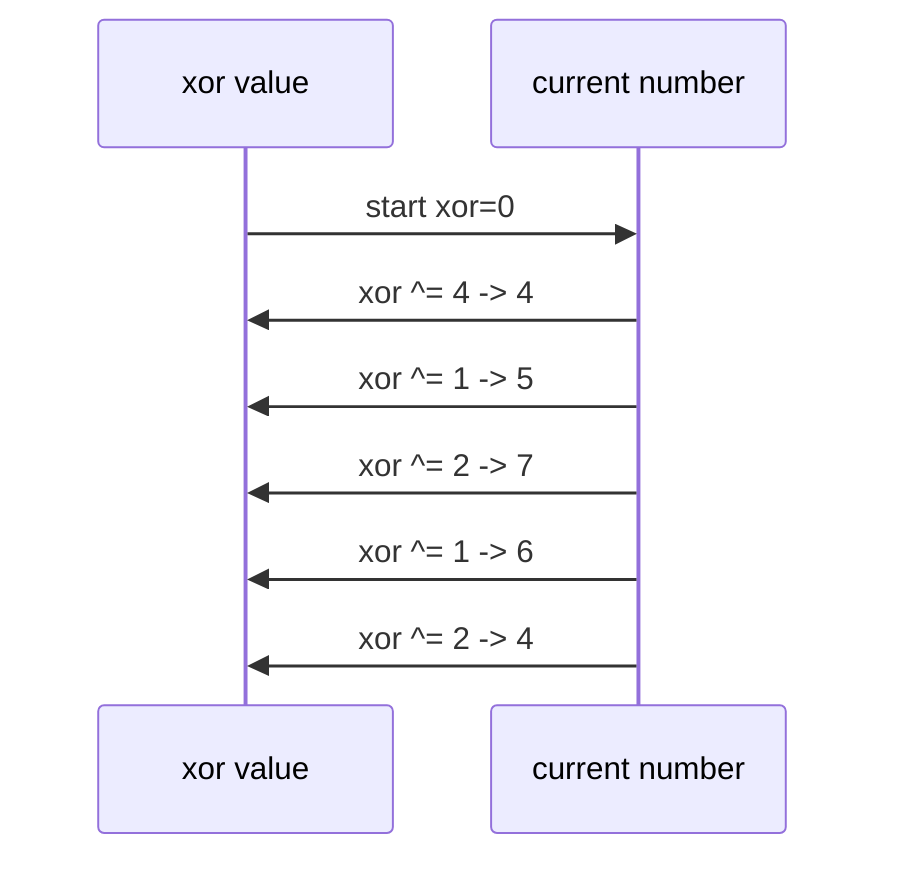
```mermaid
sequenceDiagram
    participant X as xor value
    participant Num as current number

    X->>Num: start xor=0
    Num->>X: xor ^= 4 -> 4
    Num->>X: xor ^= 1 -> 5
    Num->>X: xor ^= 2 -> 7
    Num->>X: xor ^= 1 -> 6
    Num->>X: xor ^= 2 -> 4
```

## Index-by-Index Table

| i | nums[i] | xor before | xor after |
|---:|---:|---:|---:|
| 0 | 4 | 0 | 4 |
| 1 | 1 | 4 | 5 |
| 2 | 2 | 5 | 7 |
| 3 | 1 | 7 | 6 |
| 4 | 2 | 6 | 4 |

## C++ Code

```cpp
#include <bits/stdc++.h>
using namespace std;

int singleNumber(vector<int>& nums) {
    int xr = 0;

    for (int x : nums) {
        xr ^= x;
    }

    return xr;
}
```

## Complexity

```text
Time: O(n)
Space: O(1)
```

---

# S2. Power Of Two

**Link:** https://leetcode.com/problems/power-of-two/

## Problem Statement

Determine if `n` is a power of two.

## Input

```text
n = 16
```

## Output

```text
true
```

## Observation

Power of two has exactly one set bit. Therefore:

```text
n & (n - 1) == 0
```

## Timeline Dry Run

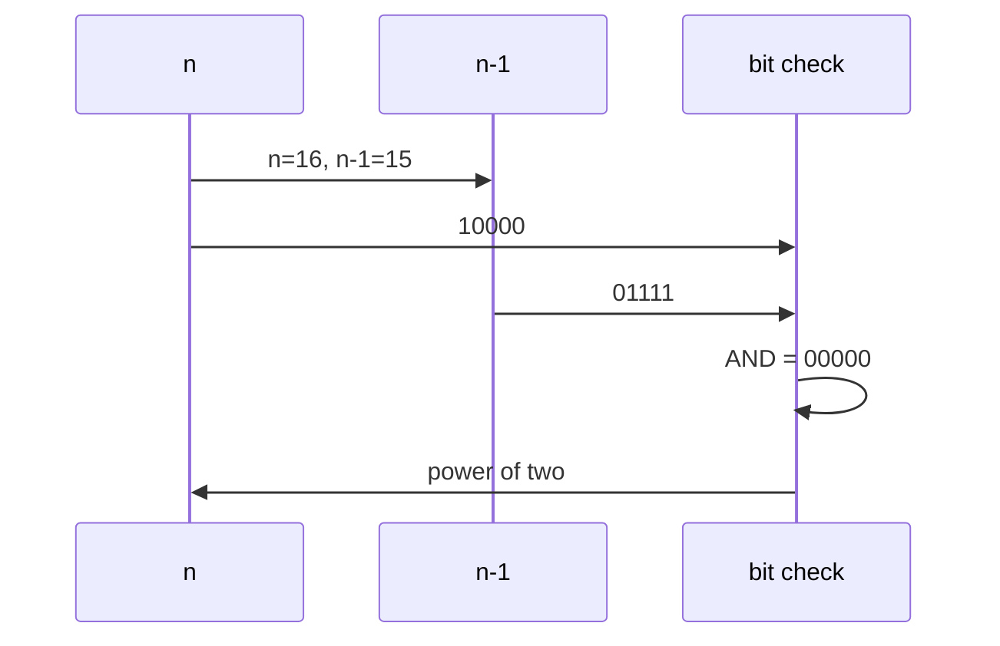
```mermaid
sequenceDiagram
    participant N as n
    participant M as n-1
    participant Check as bit check

    N->>M: n=16, n-1=15
    N->>Check: 10000
    M->>Check: 01111
    Check->>Check: AND = 00000
    Check->>N: power of two
```

## Index-by-Index Table

| Value | Binary |
|---|---|
| `16` | `10000` |
| `15` | `01111` |
| `16 & 15` | `00000` |

## C++ Code

```cpp
#include <bits/stdc++.h>
using namespace std;

bool isPowerOfTwo(int n) {
    return n > 0 && (n & (n - 1)) == 0;
}
```

## Complexity

```text
Time: O(1)
Space: O(1)
```

---

# 9. Form T: Math Observation Ad Hoc

## Recognition

Math ad hoc relies on divisibility, gcd, ceil/floor, modular blocks, and number properties.

---

# T1. Greatest Common Divisor Observation

## Problem Statement

Given two numbers, find their greatest common divisor.

## Input

```text
a = 48, b = 18
```

## Output

```text
6
```

## Observation

Euclidean algorithm:

```text
gcd(a, b) = gcd(b, a % b)
```

## Timeline Dry Run

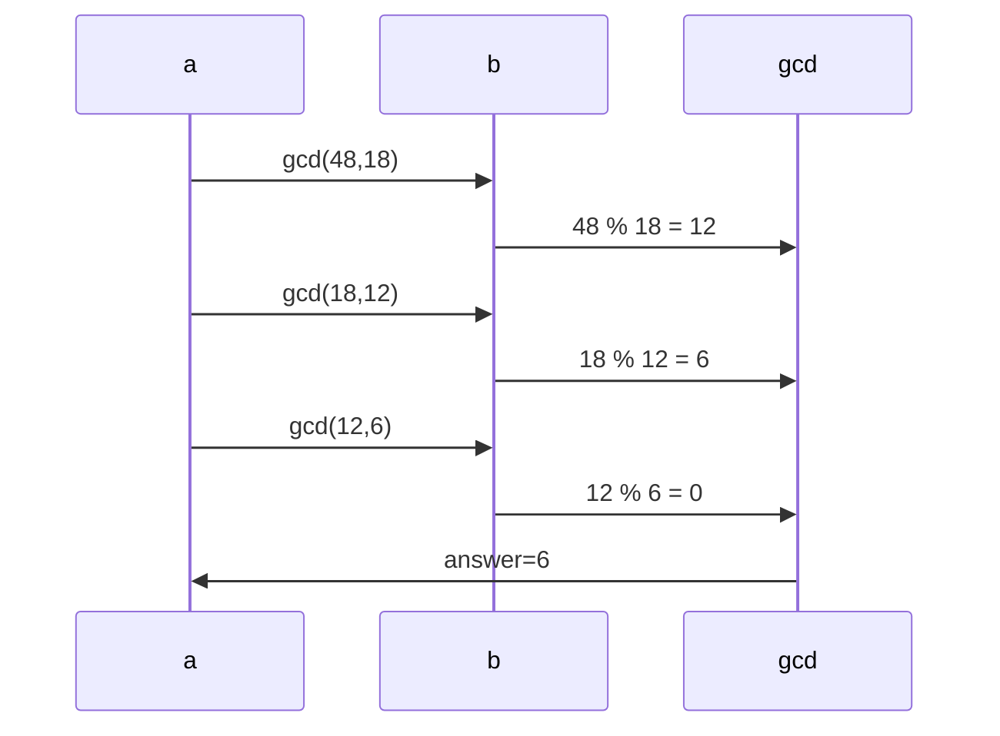
```mermaid
sequenceDiagram
    participant A as a
    participant B as b
    participant G as gcd

    A->>B: gcd(48,18)
    B->>G: 48 % 18 = 12
    A->>B: gcd(18,12)
    B->>G: 18 % 12 = 6
    A->>B: gcd(12,6)
    B->>G: 12 % 6 = 0
    G->>A: answer=6
```

## Index-by-Index Table

| Step | a | b | a % b |
|---:|---:|---:|---:|
| 1 | 48 | 18 | 12 |
| 2 | 18 | 12 | 6 |
| 3 | 12 | 6 | 0 |

## C++ Code

```cpp
#include <bits/stdc++.h>
using namespace std;

long long gcdValue(long long a, long long b) {
    while (b != 0) {
        long long r = a % b;
        a = b;
        b = r;
    }
    return a;
}
```

## Complexity

```text
Time: O(log min(a,b))
Space: O(1)
```

---

# T2. K-th Not Divisible By n

**Link:** https://codeforces.com/problemset/problem/1352/C

## Problem Statement

Find the `k-th` positive integer not divisible by `n`.

## Input

```text
n = 3, k = 7
```

## Output

```text
10
```

## Observation

In every block of length `n`, exactly `n - 1` numbers are not divisible by `n`.

Formula:

```text
answer = k + (k - 1) / (n - 1)
```

## Timeline Dry Run

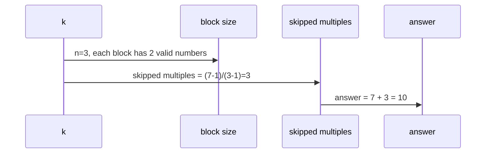
```mermaid
sequenceDiagram
    participant K as k
    participant Block as block size
    participant Extra as skipped multiples
    participant Ans as answer

    K->>Block: n=3, each block has 2 valid numbers
    K->>Extra: skipped multiples = (7-1)/(3-1)=3
    Extra->>Ans: answer = 7 + 3 = 10
```

## Index-by-Index Table

| Valid Count | Number | Divisible by 3? |
|---:|---:|---|
| 1 | 1 | no |
| 2 | 2 | no |
| - | 3 | yes, skip |
| 3 | 4 | no |
| 4 | 5 | no |
| - | 6 | yes, skip |
| 5 | 7 | no |
| 6 | 8 | no |
| - | 9 | yes, skip |
| 7 | 10 | no |

## C++ Code

```cpp
#include <bits/stdc++.h>
using namespace std;

long long kthNotDivisible(long long n, long long k) {
    return k + (k - 1) / (n - 1);
}
```

## Complexity

```text
Time: O(1)
Space: O(1)
```

---

# 10. Form U: Process Compression

## Recognition

Use process compression when direct simulation is too slow, but repeated behaviour has a cycle or batch effect.

---

# U1. Josephus Problem I

**Link:** https://cses.fi/problemset/task/2162

## Problem Statement

There are `n` children in a circle. Repeatedly remove every second child. Print removal order.

## Input

```text
n = 7
```

## Output

```text
2 4 6 1 5 3 7
```

## Observation

Naive circular erase is slow. Use queue:

- move first child to back
- remove next child

This compresses circular pointer movement.

## Timeline Dry Run

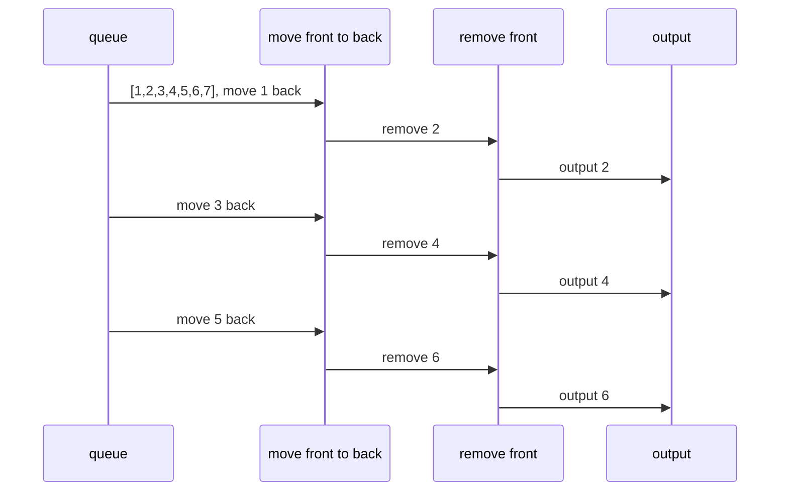
```mermaid
sequenceDiagram
    participant Q as queue
    participant Move as move front to back
    participant Remove as remove front
    participant Ans as output

    Q->>Move: [1,2,3,4,5,6,7], move 1 back
    Move->>Remove: remove 2
    Remove->>Ans: output 2
    Q->>Move: move 3 back
    Move->>Remove: remove 4
    Remove->>Ans: output 4
    Q->>Move: move 5 back
    Move->>Remove: remove 6
    Remove->>Ans: output 6
```

## Index-by-Index Table

| Step | Queue Before | Move To Back | Removed | Output |
|---:|---|---:|---:|---|
| 1 | `[1,2,3,4,5,6,7]` | 1 | 2 | `2` |
| 2 | `[3,4,5,6,7,1]` | 3 | 4 | `2 4` |
| 3 | `[5,6,7,1,3]` | 5 | 6 | `2 4 6` |
| 4 | `[7,1,3,5]` | 7 | 1 | `2 4 6 1` |
| 5 | `[3,5,7]` | 3 | 5 | `2 4 6 1 5` |
| 6 | `[7,3]` | 7 | 3 | `2 4 6 1 5 3` |
| 7 | `[7]` | - | 7 | `2 4 6 1 5 3 7` |

## C++ Code

```cpp
#include <bits/stdc++.h>
using namespace std;

vector<int> josephusOrder(int n) {
    queue<int> q;

    for (int i = 1; i <= n; i++) {
        q.push(i);
    }

    vector<int> ans;

    while (!q.empty()) {
        int keep = q.front();
        q.pop();

        if (!q.empty()) {
            q.push(keep);

            int removed = q.front();
            q.pop();

            ans.push_back(removed);
        } else {
            ans.push_back(keep);
        }
    }

    return ans;
}
```

## Complexity

```text
Time: O(n)
Space: O(n)
```

---

# U2. Queue At The School

**Link:** https://codeforces.com/problemset/problem/266/B

## Problem Statement

Given a queue of boys `B` and girls `G`. For `t` seconds, every `BG` pair swaps simultaneously. Print final queue.

## Input

```text
s = "BGGBG"
t = 1
```

## Output

```text
GBGGB
```

## Observation

Each second is one compressed sweep. When swapping `BG`, skip next position because simultaneous swap consumes both characters.

## Timeline Dry Run

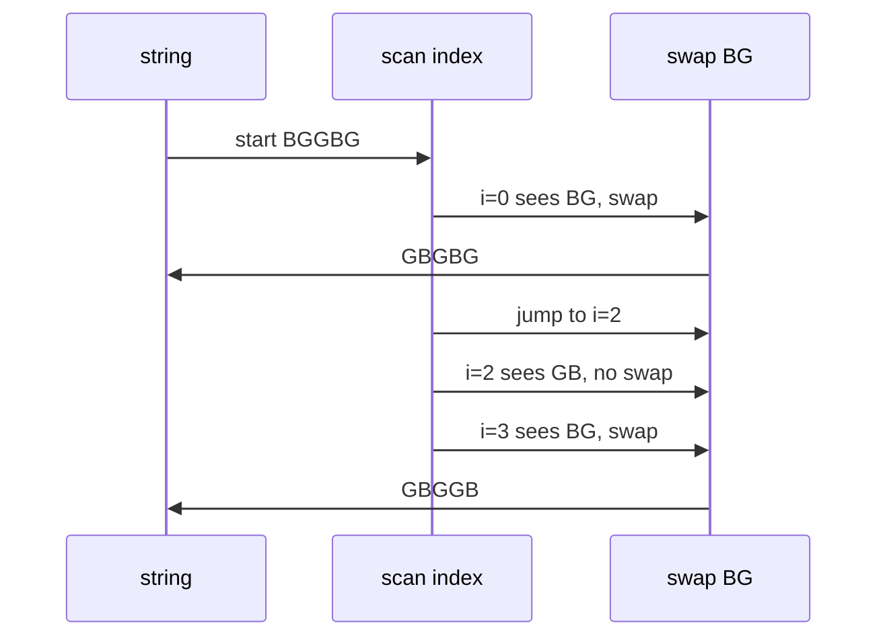
```mermaid
sequenceDiagram
    participant S as string
    participant I as scan index
    participant Swap as swap BG

    S->>I: start BGGBG
    I->>Swap: i=0 sees BG, swap
    Swap->>S: GBGBG
    I->>Swap: jump to i=2
    I->>Swap: i=2 sees GB, no swap
    I->>Swap: i=3 sees BG, swap
    Swap->>S: GBGGB
```

## Index-by-Index Table

| i | Pair | Action | String After |
|---:|---|---|---|
| 0 | `BG` | swap and skip | `GBGBG` |
| 2 | `GB` | no swap | `GBGBG` |
| 3 | `BG` | swap and skip | `GBGGB` |

## C++ Code

```cpp
#include <bits/stdc++.h>
using namespace std;

string queueAtSchool(string s, int t) {
    int n = s.size();

    while (t--) {
        for (int i = 0; i + 1 < n; i++) {
            if (s[i] == 'B' && s[i + 1] == 'G') {
                swap(s[i], s[i + 1]);
                i++;
            }
        }
    }

    return s;
}
```

## Complexity

```text
Time: O(n * t)
Space: O(1)
```

---

# 11. Form V: Observation From Examples

## Recognition

When the problem looks weird, generate small values and search for a pattern.

Process:

```text
1. Write answer for n = 1..10
2. Look for repeat/cycle/modulo
3. Derive formula
4. Test on edge cases
5. Code formula
```

---

# V1. Add Digits

**Link:** https://leetcode.com/problems/add-digits/

## Problem Statement

Repeatedly add digits of a number until one digit remains.

## Input

```text
num = 38
```

## Output

```text
2
```

## Observation

Answers repeat every 9. This is digital root.

```text
if num == 0 -> 0
else -> 1 + (num - 1) % 9
```

## Timeline Dry Run

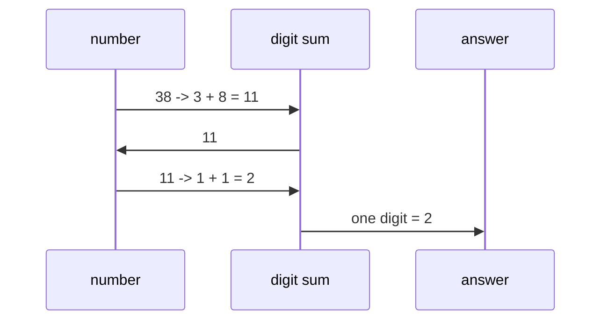
```mermaid
sequenceDiagram
    participant Num as number
    participant Sum as digit sum
    participant Ans as answer

    Num->>Sum: 38 -> 3 + 8 = 11
    Sum->>Num: 11
    Num->>Sum: 11 -> 1 + 1 = 2
    Sum->>Ans: one digit = 2
```

## Index-by-Index Table

| Step | Number | Digit Sum | Continue? |
|---:|---:|---:|---|
| 1 | 38 | 11 | yes |
| 2 | 11 | 2 | no |

## C++ Code

```cpp
#include <bits/stdc++.h>
using namespace std;

int addDigits(int num) {
    if (num == 0) return 0;
    return 1 + (num - 1) % 9;
}
```

## Complexity

```text
Time: O(1)
Space: O(1)
```

---

# V2. Domino Piling

**Link:** https://codeforces.com/problemset/problem/50/A

## Problem Statement

Given an `m x n` board, place maximum number of `2 x 1` dominoes.

## Input

```text
m = 3
n = 3
```

## Output

```text
4
```

## Observation

Each domino covers 2 cells. Maximum dominoes is:

```text
floor(m * n / 2)
```

## Timeline Dry Run

```mermaid
sequenceDiagram
    participant Board as board
    participant Cell as cells
    participant Dom as dominoes

    Board->>Cell: m=3, n=3
    Cell->>Cell: total cells = 9
    Cell->>Dom: each domino covers 2 cells
    Dom->>Dom: answer = 9 / 2 = 4
```

## Index-by-Index Table

| m | n | Cells | Domino Size | Answer |
|---:|---:|---:|---:|---:|
| 3 | 3 | 9 | 2 | 4 |

## C++ Code

```cpp
#include <bits/stdc++.h>
using namespace std;

int dominoPiling(int m, int n) {
    return (m * n) / 2;
}
```

## Complexity

```text
Time: O(1)
Space: O(1)
```

---

# 12. Final Advanced Ad Hoc Checklist

## Recognition Table

| If You See | Think |
|---|---|
| pair light/heavy | greedy two pointers |
| weakest/cheapest/earliest | sort greedy |
| target grows too fast | reverse simulation |
| operations preserve something | invariant |
| row/column movement | Manhattan distance |
| facing direction | direction state |
| gift/order mapping | inverse permutation |
| swaps to sort | cycle decomposition |
| intervals/time | events/sweep line |
| duplicate cancellation | XOR |
| divisible/not divisible | block formula |
| repeated process too large | compression/cycle |
| weird sequence | examples → formula |

## Advanced Contest Debug Checklist

```text
1. Did I test n=1?
2. Did I test all equal?
3. Did I test impossible case?
4. Did I test already valid case?
5. Did I test max/min values?
6. Did I check overflow?
7. Did I check sorting order?
8. Did I check if reverse is easier?
9. Did I check invariant?
10. Did I compress repeated operations?
```

## Final Mindset

```text
Advanced ad hoc is not random.
It is usually one hidden observation:
- sort order
- reverse operation
- invariant
- modulo pattern
- compressed process
- inverse mapping
```
