# Greedy Algorithms Visual Reference

> A visual-first reference from **newbie → FAANG/interview → CM/competitive programming level**.  
> Main language: **C++**. Java is included where it helps visual learning.

---

## Clickable Index

1. [Greedy Core Idea](#1-greedy-core-idea)
2. [Greedy Recognition Flowchart](#2-greedy-recognition-flowchart)
3. [Levels Roadmap](#3-levels-roadmap)
4. [Pattern Summary Table](#4-pattern-summary-table)
5. [Beginner Patterns](#5-beginner-patterns)
   - [Sort + Pick Smallest/Largest](#51-sort--pick-smallestlargest)
   - [Earliest Finish Interval](#52-earliest-finish-interval)
   - [Running Min/Max](#53-running-minmax)
6. [FAANG / Interview Patterns](#6-faang--interview-patterns)
   - [Jump Game](#61-forward-reachability-jump-game)
   - [Gas Station](#62-reset-when-invalid-gas-station)
   - [Meeting Rooms With Heap](#63-dynamic-choice-with-heap-meeting-rooms)
   - [Partition Labels](#64-boundary-expansion-partition-labels)
7. [Advanced / Competitive Patterns](#7-advanced--competitive-patterns)
   - [Greedy + Binary Search](#71-greedy--binary-search-on-answer)
   - [Greedy + DSU / Kruskal](#72-greedy--dsu-kruskal-mst)
   - [Huffman Coding](#73-huffman-coding)
   - [Job Sequencing With Deadlines](#74-job-sequencing-with-deadlines)
8. [How To Prove Greedy Works](#8-how-to-prove-greedy-works)
9. [Exchange Argument Step-by-Step](#9-exchange-argument-step-by-step)
10. [Greedy vs DP Decision Table](#10-greedy-vs-dp-decision-table)
11. [Common Mistakes](#11-common-mistakes)
12. [Reusable C++ Templates](#12-reusable-c-templates)
13. [Practice Ladder](#13-practice-ladder)
14. [Final Cheat Sheet](#14-final-cheat-sheet)

---

# 1. Greedy Core Idea

Greedy means:

- Pick the **best choice right now**.
- Do **not** go back and change decisions.
- It works only when:
  - **Local best choice** leads to **global best answer**.

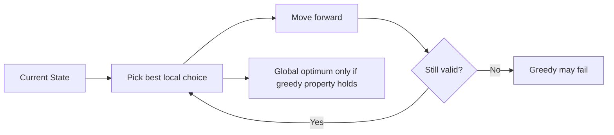

Simple thought:

| Question | Meaning |
|---|---|
| Can I sort? | Many greedy problems start with sorting. |
| Can I choose one item safely? | Greedy needs an irreversible safe choice. |
| Does future depend heavily on previous choices? | Might be DP. |
| Can I prove by swapping? | Often greedy. |

---

# 2. Greedy Recognition Flowchart

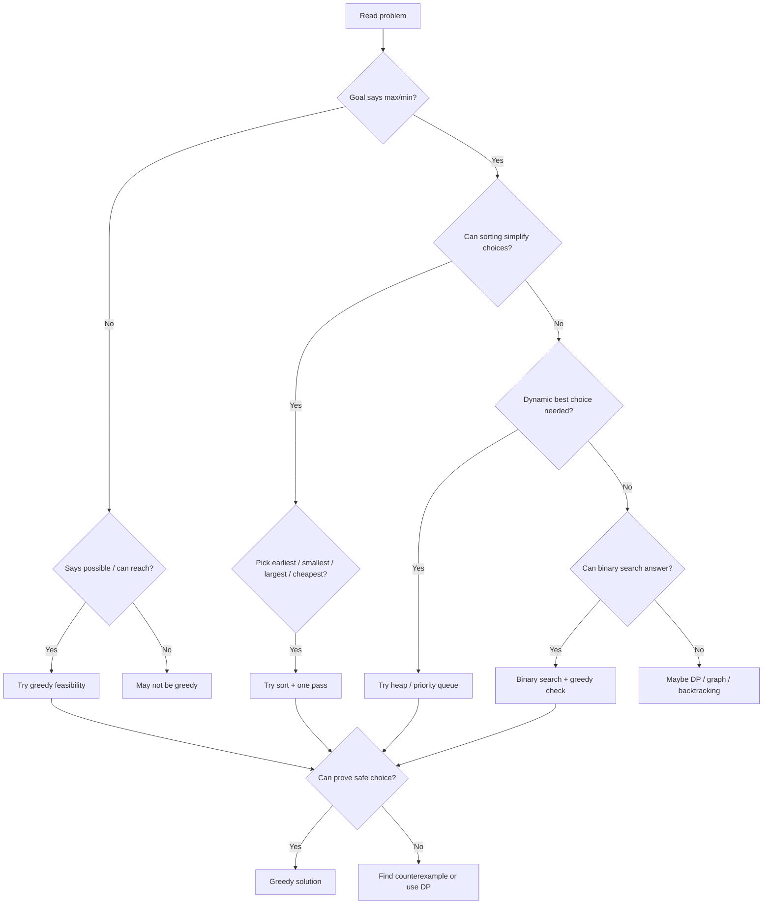

---

# 3. Levels Roadmap

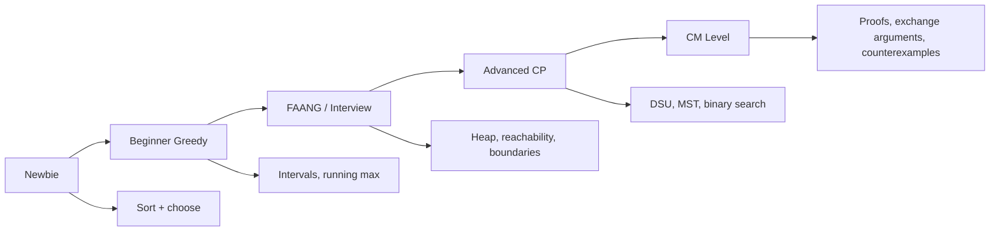

| Level | What You Learn | Main Skill |
|---|---|---|
| Newbie | Sort and pick | Simple implementation |
| Beginner | Intervals, min/max tracking | Pattern recognition |
| FAANG | Heap, feasibility, boundary greedy | Edge cases |
| Advanced | DSU, MST, binary search on answer | Combining patterns |
| CM | Proofs and counterexamples | Knowing why greedy works |

---

# 4. Pattern Summary Table

| Pattern | Main Idea | Sort By | Data Structure | Common Problems |
|---|---|---|---|---|
| Sort + Pick | Take best item first | Value / weight / size | Array | Assign cookies |
| Interval Greedy | Pick earliest ending interval | End time | Array | Activity selection |
| Running Min/Max | Track best so far | None | Variables | Stock buy/sell |
| Reachability | Track farthest reachable point | None | Variables | Jump Game |
| Reset Greedy | If prefix fails, restart | None | Variables | Gas Station |
| Heap Greedy | Always pick best available | Sometimes | Priority queue | Meeting Rooms |
| Boundary Greedy | Expand current valid segment | None or preprocess | Hash/map | Partition Labels |
| Binary Search + Greedy | Guess answer, check feasibility | Usually sorted | Variables | Aggressive cows |
| DSU Greedy | Add cheapest safe edge | Weight | DSU | Kruskal MST |
| Huffman | Merge two smallest repeatedly | Frequency | Min-heap | Compression |

---

# 5. Beginner Patterns

## 5.1 Sort + Pick Smallest/Largest

### Concept

Sort first, then greedily match the best possible item.

Example: **Assign Cookies**  
Each child has greed factor. Each cookie has size. Give cookie if size >= greed.

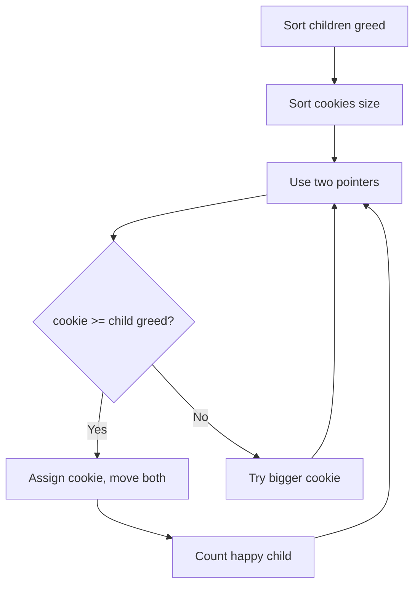

### C++ Code

```cpp
#include <bits/stdc++.h>
using namespace std;

int findContentChildren(vector<int>& greed, vector<int>& cookies) {
    sort(greed.begin(), greed.end());
    sort(cookies.begin(), cookies.end());

    int child = 0, cookie = 0;

    while (child < (int)greed.size() && cookie < (int)cookies.size()) {
        if (cookies[cookie] >= greed[child]) {
            child++;   // this child is satisfied
        }
        cookie++;      // use this cookie or discard it
    }

    return child;
}
```

### Java Code

```java
import java.util.*;

class Solution {
    public int findContentChildren(int[] greed, int[] cookies) {
        Arrays.sort(greed);
        Arrays.sort(cookies);

        int child = 0, cookie = 0;

        while (child < greed.length && cookie < cookies.length) {
            if (cookies[cookie] >= greed[child]) {
                child++;
            }
            cookie++;
        }

        return child;
    }
}
```

### Visual Example

| Children greed | 1 | 2 | 3 |
|---|---:|---:|---:|
| Cookies | 1 | 1 | 2 |

Process:

| Step | Child Need | Cookie | Action |
|---|---:|---:|---|
| 1 | 1 | 1 | Assign |
| 2 | 2 | 1 | Too small, skip cookie |
| 3 | 2 | 2 | Assign |

Answer = `2` happy children.

---

## 5.2 Earliest Finish Interval

### Concept

To maximize non-overlapping intervals, pick the interval that ends earliest.

```mermaid
gantt
    title Activity Selection Example
    dateFormat  X
    axisFormat %s
    A :a, 1, 3
    B :b, 2, 5
    C :c, 4, 7
    D :d, 6, 9
```

Why earliest finish?

- It leaves maximum room for future intervals.
- A longer interval blocks more future choices.

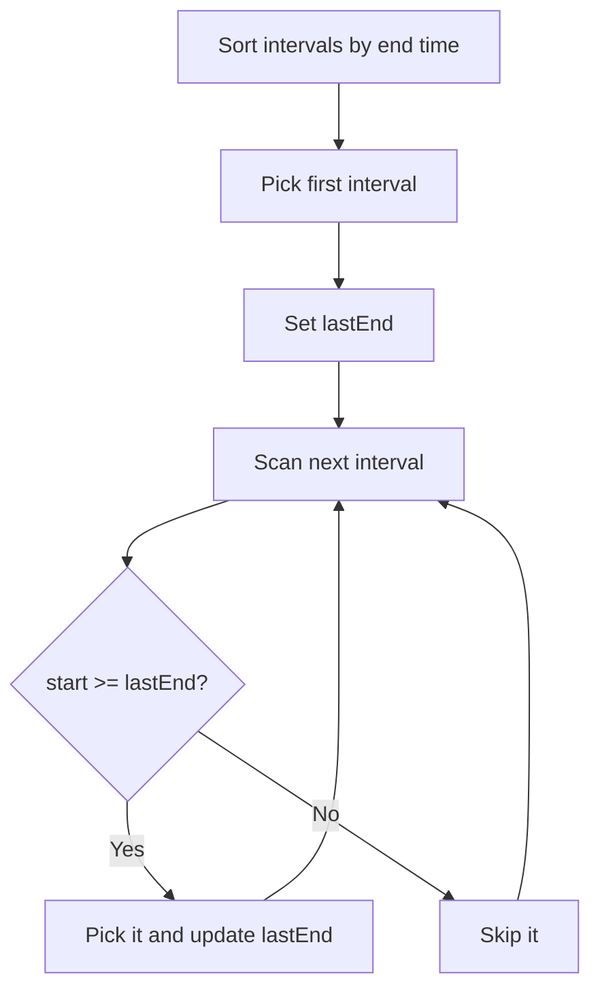

### C++ Code

```cpp
#include <bits/stdc++.h>
using namespace std;

int maxNonOverlapping(vector<pair<int,int>>& intervals) {
    sort(intervals.begin(), intervals.end(), [](auto& a, auto& b) {
        return a.second < b.second;
    });

    int count = 0;
    int lastEnd = INT_MIN;

    for (auto [start, end] : intervals) {
        if (start >= lastEnd) {
            count++;
            lastEnd = end;
        }
    }

    return count;
}
```

---

## 5.3 Running Min/Max

### Concept

Track the best previous value while scanning.

Example: **Best Time to Buy and Sell Stock**

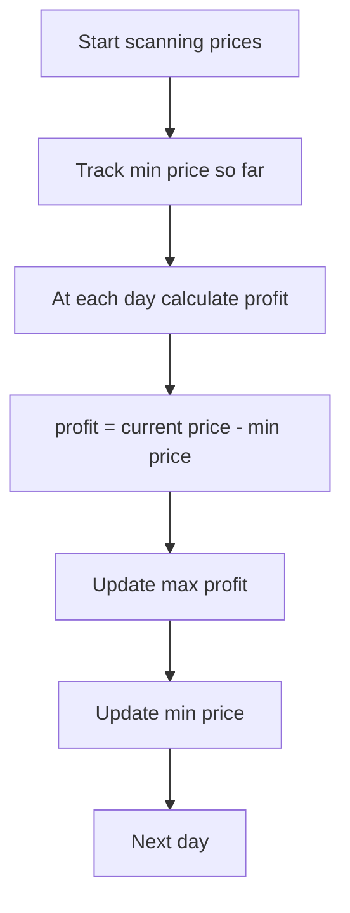

### C++ Code

```cpp
#include <bits/stdc++.h>
using namespace std;

int maxProfit(vector<int>& prices) {
    int minPrice = INT_MAX;
    int bestProfit = 0;

    for (int price : prices) {
        minPrice = min(minPrice, price);
        bestProfit = max(bestProfit, price - minPrice);
    }

    return bestProfit;
}
```

### Visual Table

Prices: `[7, 1, 5, 3, 6, 4]`

| Day | Price | Min So Far | Profit Today | Best Profit |
|---:|---:|---:|---:|---:|
| 1 | 7 | 7 | 0 | 0 |
| 2 | 1 | 1 | 0 | 0 |
| 3 | 5 | 1 | 4 | 4 |
| 4 | 3 | 1 | 2 | 4 |
| 5 | 6 | 1 | 5 | 5 |
| 6 | 4 | 1 | 3 | 5 |

---

# 6. FAANG / Interview Patterns

## 6.1 Forward Reachability: Jump Game

### Concept

Track the farthest index you can reach.

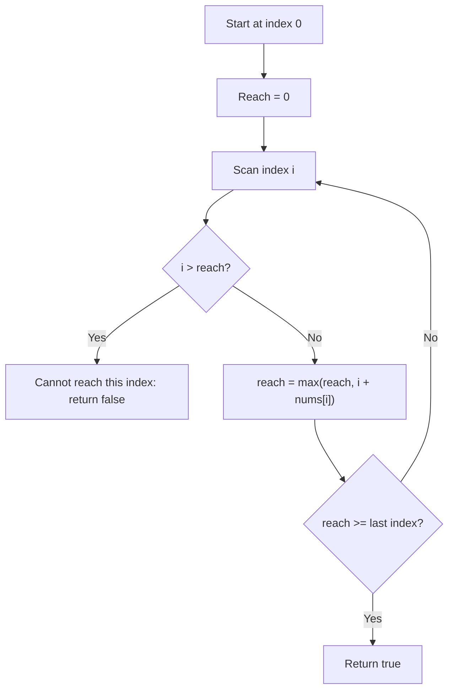

### C++ Code

```cpp
#include <bits/stdc++.h>
using namespace std;

bool canJump(vector<int>& nums) {
    int farthest = 0;

    for (int i = 0; i < (int)nums.size(); i++) {
        if (i > farthest) return false;
        farthest = max(farthest, i + nums[i]);
    }

    return true;
}
```

### Key Tactic

- You do not need the exact path.
- You only need the farthest reachable index.

---

## 6.2 Reset When Invalid: Gas Station

### Concept

If starting from `start` fails at station `i`, then no station between `start` and `i` can be the answer.

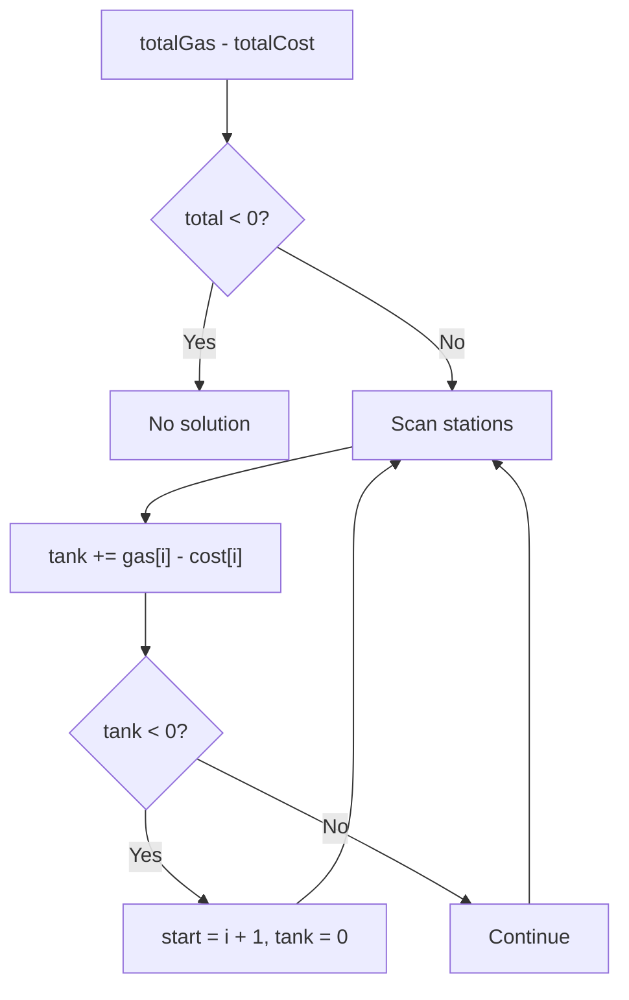

### C++ Code

```cpp
#include <bits/stdc++.h>
using namespace std;

int canCompleteCircuit(vector<int>& gas, vector<int>& cost) {
    int total = 0;
    int tank = 0;
    int start = 0;

    for (int i = 0; i < (int)gas.size(); i++) {
        int diff = gas[i] - cost[i];
        total += diff;
        tank += diff;

        if (tank < 0) {
            start = i + 1;
            tank = 0;
        }
    }

    return total >= 0 ? start : -1;
}
```

---

## 6.3 Dynamic Choice With Heap: Meeting Rooms

### Concept

Use a min-heap to track the earliest meeting room that becomes free.

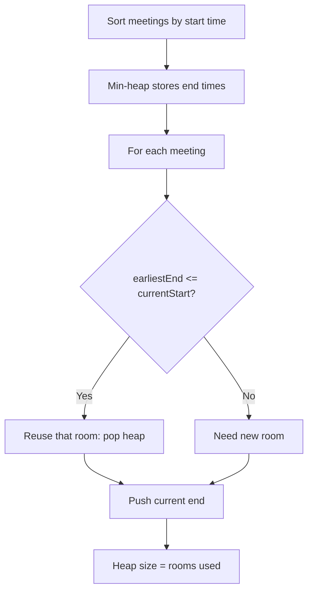

### C++ Code

```cpp
#include <bits/stdc++.h>
using namespace std;

int minMeetingRooms(vector<vector<int>>& intervals) {
    sort(intervals.begin(), intervals.end());

    priority_queue<int, vector<int>, greater<int>> minHeap;

    for (auto& meeting : intervals) {
        int start = meeting[0];
        int end = meeting[1];

        if (!minHeap.empty() && minHeap.top() <= start) {
            minHeap.pop();
        }

        minHeap.push(end);
    }

    return minHeap.size();
}
```

### Java Code

```java
import java.util.*;

class Solution {
    public int minMeetingRooms(int[][] intervals) {
        Arrays.sort(intervals, (a, b) -> a[0] - b[0]);

        PriorityQueue<Integer> heap = new PriorityQueue<>();

        for (int[] meeting : intervals) {
            int start = meeting[0];
            int end = meeting[1];

            if (!heap.isEmpty() && heap.peek() <= start) {
                heap.poll();
            }

            heap.offer(end);
        }

        return heap.size();
    }
}
```

---

## 6.4 Boundary Expansion: Partition Labels

### Concept

Each character must stay inside one partition. Track the farthest last occurrence of characters seen so far.

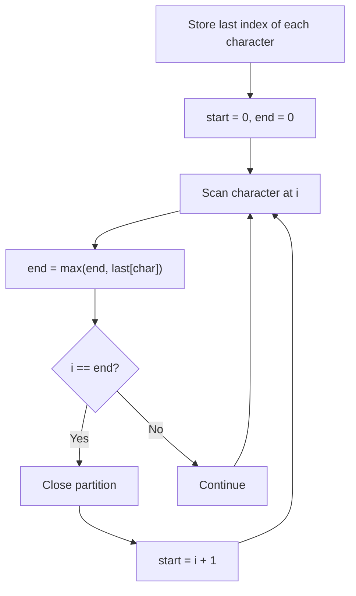

### C++ Code

```cpp
#include <bits/stdc++.h>
using namespace std;

vector<int> partitionLabels(string s) {
    vector<int> last(26);

    for (int i = 0; i < (int)s.size(); i++) {
        last[s[i] - 'a'] = i;
    }

    vector<int> answer;
    int start = 0, end = 0;

    for (int i = 0; i < (int)s.size(); i++) {
        end = max(end, last[s[i] - 'a']);

        if (i == end) {
            answer.push_back(end - start + 1);
            start = i + 1;
        }
    }

    return answer;
}
```

---

# 7. Advanced / Competitive Patterns

## 7.1 Greedy + Binary Search on Answer

### Concept

When the answer is numeric and feasibility is monotonic:

- If answer `x` works, maybe bigger works.
- If answer `x` fails, maybe smaller works.

Example: **Aggressive Cows**  
Maximize minimum distance between cows.

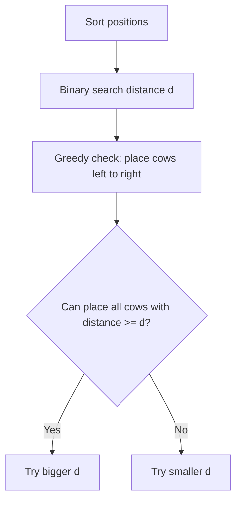

### C++ Code

```cpp
#include <bits/stdc++.h>
using namespace std;

bool canPlace(vector<int>& positions, int cows, int dist) {
    int placed = 1;
    int last = positions[0];

    for (int i = 1; i < (int)positions.size(); i++) {
        if (positions[i] - last >= dist) {
            placed++;
            last = positions[i];
        }
    }

    return placed >= cows;
}

int aggressiveCows(vector<int>& positions, int cows) {
    sort(positions.begin(), positions.end());

    int low = 1;
    int high = positions.back() - positions.front();
    int answer = 0;

    while (low <= high) {
        int mid = low + (high - low) / 2;

        if (canPlace(positions, cows, mid)) {
            answer = mid;
            low = mid + 1;
        } else {
            high = mid - 1;
        }
    }

    return answer;
}
```

---

## 7.2 Greedy + DSU: Kruskal MST

### Concept

Pick the smallest edge that does not create a cycle.

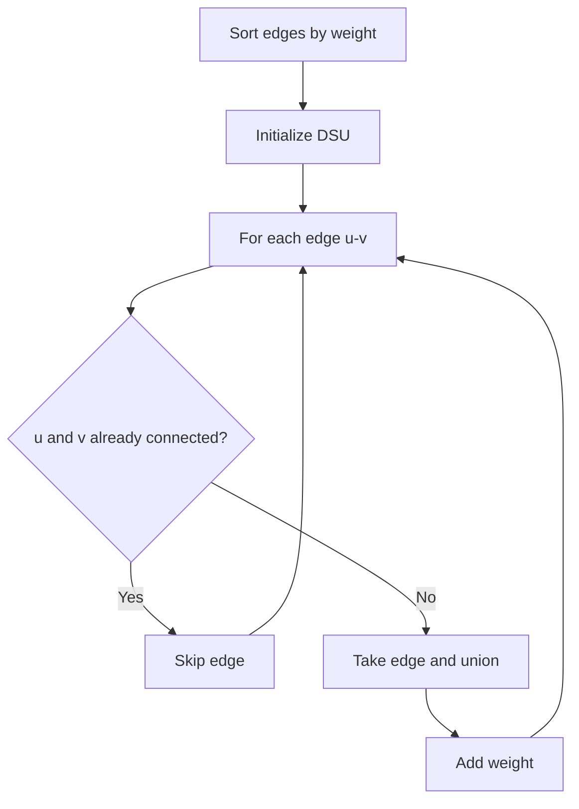

### C++ Code

```cpp
#include <bits/stdc++.h>
using namespace std;

struct DSU {
    vector<int> parent, size;

    DSU(int n) {
        parent.resize(n);
        size.assign(n, 1);
        iota(parent.begin(), parent.end(), 0);
    }

    int find(int x) {
        if (parent[x] == x) return x;
        return parent[x] = find(parent[x]);
    }

    bool unite(int a, int b) {
        a = find(a);
        b = find(b);

        if (a == b) return false;

        if (size[a] < size[b]) swap(a, b);
        parent[b] = a;
        size[a] += size[b];
        return true;
    }
};

struct Edge {
    int u, v, w;
};

int kruskalMST(int n, vector<Edge>& edges) {
    sort(edges.begin(), edges.end(), [](Edge& a, Edge& b) {
        return a.w < b.w;
    });

    DSU dsu(n);
    int totalWeight = 0;

    for (Edge& e : edges) {
        if (dsu.unite(e.u, e.v)) {
            totalWeight += e.w;
        }
    }

    return totalWeight;
}
```

---

## 7.3 Huffman Coding

### Concept

Repeatedly merge the two smallest frequencies.

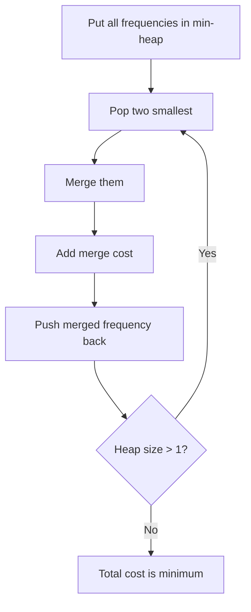

### C++ Code

```cpp
#include <bits/stdc++.h>
using namespace std;

int huffmanCost(vector<int>& freq) {
    priority_queue<int, vector<int>, greater<int>> pq;

    for (int f : freq) pq.push(f);

    int cost = 0;

    while (pq.size() > 1) {
        int a = pq.top(); pq.pop();
        int b = pq.top(); pq.pop();

        int merged = a + b;
        cost += merged;
        pq.push(merged);
    }

    return cost;
}
```

### Visual Example

Frequencies: `[5, 9, 12, 13, 16, 45]`

| Step | Pick Two Smallest | Merge | Cost So Far |
|---:|---|---:|---:|
| 1 | 5, 9 | 14 | 14 |
| 2 | 12, 13 | 25 | 39 |
| 3 | 14, 16 | 30 | 69 |
| 4 | 25, 30 | 55 | 124 |
| 5 | 45, 55 | 100 | 224 |

---

## 7.4 Job Sequencing With Deadlines

### Concept

Do the most profitable jobs first, but place each job as late as possible before its deadline.

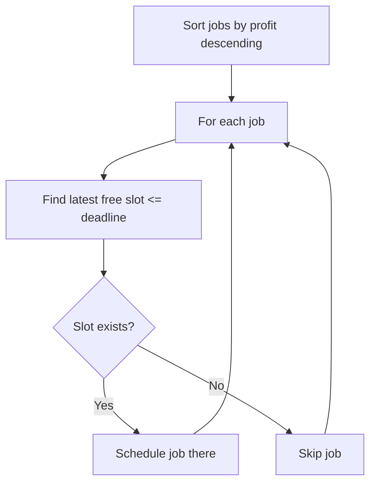

### C++ Code: Simple Version

```cpp
#include <bits/stdc++.h>
using namespace std;

struct Job {
    int id;
    int deadline;
    int profit;
};

pair<int,int> jobSequencing(vector<Job>& jobs) {
    sort(jobs.begin(), jobs.end(), [](Job& a, Job& b) {
        return a.profit > b.profit;
    });

    int maxDeadline = 0;
    for (auto& job : jobs) maxDeadline = max(maxDeadline, job.deadline);

    vector<int> slot(maxDeadline + 1, -1);
    int count = 0, profit = 0;

    for (auto& job : jobs) {
        for (int t = job.deadline; t >= 1; t--) {
            if (slot[t] == -1) {
                slot[t] = job.id;
                count++;
                profit += job.profit;
                break;
            }
        }
    }

    return {count, profit};
}
```

### C++ Code: DSU Optimized Version

```cpp
#include <bits/stdc++.h>
using namespace std;

struct DSUTime {
    vector<int> parent;

    DSUTime(int n) {
        parent.resize(n + 1);
        iota(parent.begin(), parent.end(), 0);
    }

    int find(int x) {
        if (parent[x] == x) return x;
        return parent[x] = find(parent[x]);
    }

    void occupy(int x) {
        parent[x] = find(x - 1);
    }
};

struct Job {
    int id;
    int deadline;
    int profit;
};

pair<int,int> jobSequencingDSU(vector<Job>& jobs) {
    sort(jobs.begin(), jobs.end(), [](Job& a, Job& b) {
        return a.profit > b.profit;
    });

    int maxDeadline = 0;
    for (auto& job : jobs) maxDeadline = max(maxDeadline, job.deadline);

    DSUTime dsu(maxDeadline);
    int count = 0, profit = 0;

    for (auto& job : jobs) {
        int availableSlot = dsu.find(job.deadline);

        if (availableSlot > 0) {
            count++;
            profit += job.profit;
            dsu.occupy(availableSlot);
        }
    }

    return {count, profit};
}
```

---

# 8. How To Prove Greedy Works

A greedy solution is not complete until you know **why it works**.

## Main Proof Styles

| Proof Style | Idea | Common Use |
|---|---|---|
| Exchange Argument | Swap optimal solution to match greedy choice | Intervals, sorting greedy |
| Cut Property | Cheapest safe edge crossing a cut is valid | MST |
| Staying Ahead | Greedy is always at least as good as others | Jump Game, scheduling |
| Contradiction | Assume greedy fails, prove impossible | Gas Station |

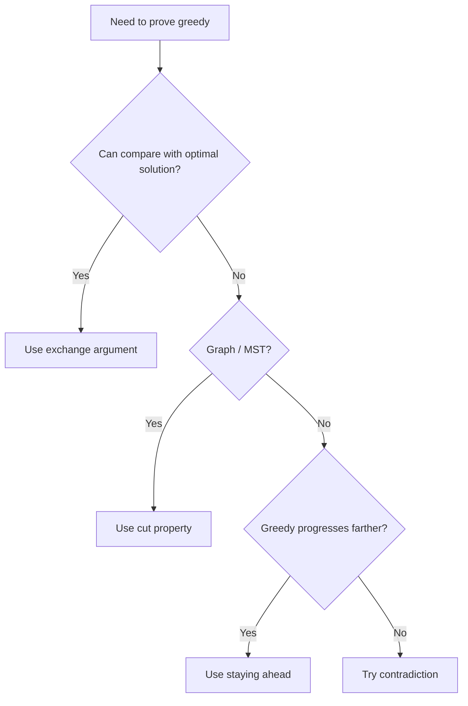

---

# 9. Exchange Argument Step-by-Step

## What Is Exchange Argument?

You prove:

> There exists an optimal solution that includes the greedy choice.

Then you repeat the same logic for the remaining problem.

---

## Template

```text
1. Let G be the greedy choice.
2. Let O be an optimal solution.
3. If O already uses G, good.
4. If O does not use G:
   - Replace some choice in O with G.
   - Show the solution is still valid.
   - Show the solution is not worse.
5. Therefore, greedy choice can be part of an optimal solution.
6. Repeat for the remaining subproblem.
```

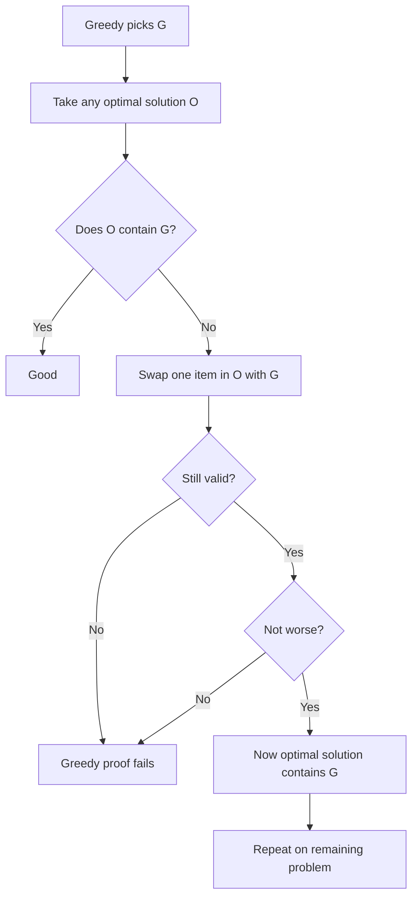

---

## Example 1: Activity Selection

Goal: Pick maximum number of non-overlapping intervals.

Greedy choice: Pick interval with earliest end time.

### Step-by-Step Proof

| Step | Explanation |
|---|---|
| 1 | Greedy picks interval `G` with earliest ending time. |
| 2 | Suppose optimal solution picks another first interval `O`. |
| 3 | Since `G` ends no later than `O`, replacing `O` with `G` does not block future intervals. |
| 4 | Number of intervals remains same. |
| 5 | So there is an optimal solution starting with `G`. |
| 6 | Repeat for intervals after `G`. |

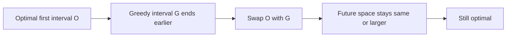

### Tiny Visual

```text
Timeline:

G: [1---3]
O: [1-------5]
Next intervals start after 5? They also start after 3.

So choosing G is never worse.
```

---

## Example 2: Assign Cookies

Goal: Maximize satisfied children.

Greedy choice: Give the smallest cookie that can satisfy the least greedy child.

### Step-by-Step Proof

| Step | Explanation |
|---|---|
| 1 | Sort children by greed. Sort cookies by size. |
| 2 | Consider least greedy child. |
| 3 | If smallest available cookie can satisfy them, use it. |
| 4 | Using a bigger cookie is wasteful because the smaller cookie already works. |
| 5 | Save bigger cookies for harder children. |
| 6 | Therefore greedy is safe. |

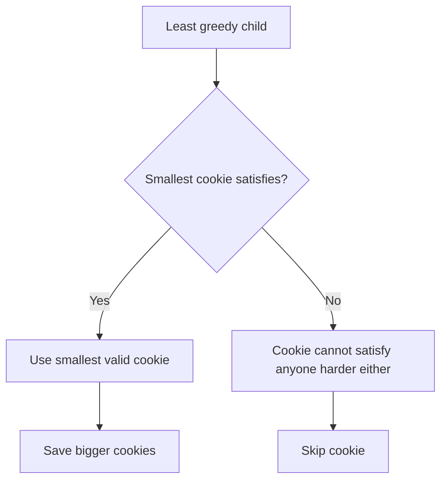

---

## Example 3: Kruskal MST

Goal: Build minimum spanning tree.

Greedy choice: Pick smallest edge that does not create cycle.

Proof idea: **Cut property**.

| Step | Explanation |
|---|---|
| 1 | Divide graph into two groups. |
| 2 | Look at edges crossing the cut. |
| 3 | The lightest crossing edge is safe. |
| 4 | If MST uses a heavier crossing edge, replace it with the lighter one. |
| 5 | Tree remains connected and weight does not increase. |

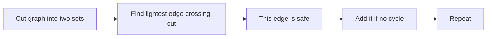

---

# 10. Greedy vs DP Decision Table

| Situation | Greedy? | DP? |
|---|---:|---:|
| Local choice is always safe | Yes | Maybe no |
| Need to try many previous states | No | Yes |
| Problem asks max/min | Maybe | Maybe |
| Sorting reveals obvious order | Often | Maybe |
| You can prove by exchange | Yes | Usually no |
| Counterexample exists | No | Maybe yes |
| Choices affect future heavily | Risky | Often yes |

```mermaid
flowchart TD
    A[Problem has choices] --> B{Can one local choice be proven safe?}
    B -->|Yes| C[Greedy]
    B -->|No| D{Need best among many states?}
    D -->|Yes| E[DP]
    D -->|No| F[Try graph / search / binary search]
```

---

# 11. Common Mistakes

| Mistake | Example | Fix |
|---|---|---|
| Greedy without proof | Coin change with non-standard coins | Find counterexample |
| Sorting wrong key | Intervals sorted by start instead of end | Ask what preserves future space |
| Ignoring edge cases | Empty input, one element | Test smallest cases |
| Using greedy when future matters | 0/1 knapsack | Use DP |
| Forgetting feasibility | Jump Game | Track farthest reachable |

## Counterexample: Coin Change

Coins: `[1, 3, 4]`, amount = `6`

Greedy picks:

```text
4 + 1 + 1 = 3 coins
```

Optimal:

```text
3 + 3 = 2 coins
```

So greedy fails here.

```mermaid
flowchart TD
    A[Amount 6] --> B[Greedy picks 4]
    B --> C[Remaining 2]
    C --> D[Pick 1 + 1]
    D --> E[3 coins]
    A --> F[Optimal picks 3 + 3]
    F --> G[2 coins]
```

---

# 12. Reusable C++ Templates

## 12.1 Sort by End Time

```cpp
sort(intervals.begin(), intervals.end(), [](auto& a, auto& b) {
    return a[1] < b[1];
});
```

## 12.2 Min-Heap

```cpp
priority_queue<int, vector<int>, greater<int>> pq;
```

## 12.3 Max-Heap

```cpp
priority_queue<int> pq;
```

## 12.4 Greedy Feasibility Check

```cpp
bool can(vector<int>& arr, int x) {
    // Return true if answer x is possible
    return true;
}
```

## 12.5 Binary Search on Answer

```cpp
int low = 0, high = 1e9;
int answer = -1;

while (low <= high) {
    int mid = low + (high - low) / 2;

    if (can(mid)) {
        answer = mid;
        low = mid + 1;     // maximize answer
    } else {
        high = mid - 1;
    }
}
```

## 12.6 DSU Template

```cpp
struct DSU {
    vector<int> parent, size;

    DSU(int n) {
        parent.resize(n);
        size.assign(n, 1);
        iota(parent.begin(), parent.end(), 0);
    }

    int find(int x) {
        if (parent[x] == x) return x;
        return parent[x] = find(parent[x]);
    }

    bool unite(int a, int b) {
        a = find(a);
        b = find(b);

        if (a == b) return false;
        if (size[a] < size[b]) swap(a, b);

        parent[b] = a;
        size[a] += size[b];
        return true;
    }
};
```

---

# 13. Practice Ladder

| Level | Problems | Pattern |
|---|---|---|
| Newbie | Assign Cookies | Sort + two pointers |
| Newbie | Lemonade Change | Local simulation |
| Beginner | Best Time to Buy/Sell Stock | Running min/max |
| Beginner | Activity Selection | Sort by end time |
| Beginner | Minimum Number of Arrows | Interval greedy |
| FAANG | Jump Game | Farthest reach |
| FAANG | Gas Station | Reset when invalid |
| FAANG | Partition Labels | Boundary expansion |
| FAANG | Meeting Rooms II | Min-heap |
| FAANG | Task Scheduler | Heap/count greedy |
| Advanced | Aggressive Cows | Binary search + greedy |
| Advanced | Kruskal MST | DSU greedy |
| Advanced | Huffman Coding | Min-heap merge |
| CM | Scheduling with deadlines | Greedy + DSU |
| CM | Matroid-style greedy | Proof-heavy greedy |

---

# 14. Final Cheat Sheet

## Greedy Signals

Look for:

- Maximum / minimum
- Non-overlapping
- Earliest / latest
- Can reach / possible
- Minimum resources
- Pick smallest/largest safely
- Repeatedly merge or choose best available

## Greedy Tactics

| Tactic | Use When |
|---|---|
| Sort ascending | Smallest first helps |
| Sort descending | Biggest/profit first helps |
| Sort by end time | Intervals/non-overlap |
| Heap | Need changing best candidate |
| Farthest reach | Reachability problems |
| Reset start | Prefix failure problems |
| DSU | Need avoid cycles or find slots |
| Binary search + greedy | Answer is numeric and monotonic |

## Proof Checklist

```text
1. What is my greedy choice?
2. Why is it safe?
3. Can I swap it into an optimal solution?
4. Does it keep the answer valid?
5. Does it avoid making the answer worse?
6. After choosing it, is the remaining problem the same type?
```

```mermaid
flowchart TD
    A[Greedy choice] --> B[Safe?]
    B -->|No| C[Find counterexample]
    B -->|Yes| D[Exchange with optimal]
    D --> E[Still valid?]
    E -->|No| C
    E -->|Yes| F[Not worse?]
    F -->|No| C
    F -->|Yes| G[Greedy works]
```

---

## One-Line Memory Rule

> Greedy works when you can make one choice now and prove it never hurts the future.

