# STL Problem Solving Playbook

> A grouped Markdown guide for solving competitive-programming problems using C++ STL, patterns, frameworks, forms, and tactics. Built from the original STL notes and expanded with missing concepts.

---

## Table of Contents

1. [How to Use This Playbook](#1-how-to-use-this-playbook)
2. [Big Picture Map](#2-big-picture-map)
3. [Concepts](#3-concepts)
4. [Frameworks](#4-frameworks)
5. [Problem Forms](#5-problem-forms)
6. [Tactics](#6-tactics)
7. [STL Decision System](#7-stl-decision-system)
8. [Pattern Library](#8-pattern-library)
9. [Templates](#9-templates)
10. [Debugging and Edge Cases](#10-debugging-and-edge-cases)
11. [Final One-Minute Checklist](#11-final-one-minute-checklist)

---

## 1. How to Use This Playbook

When you see a new problem, do not start coding immediately.

Use this flow:

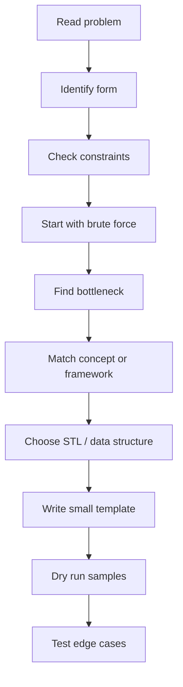

Mental model:

```text
Problem Form -> Hidden Pattern -> Required Operations -> STL Choice -> Template
```

Example:

```text
Problem: q queries asking sum(l, r)
Form: range query
Pattern: prefix sum if static
Operations: fast range sum
STL/DS: vector<long long> prefix
```

---

## 2. Big Picture Map

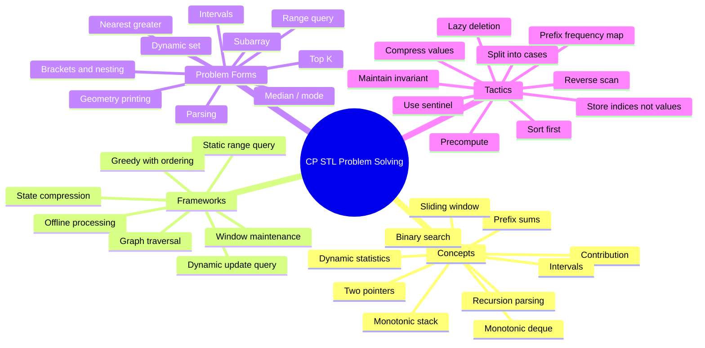

---

## 3. Concepts

### 3.1 Complexity First

Before choosing STL, estimate what can pass.

| Constraint | Usually Accepted |
|---:|---|
| `n <= 20` | backtracking / bitmask |
| `n <= 100` | `O(n^3)` sometimes |
| `n <= 2e3` | `O(n^2)` |
| `n <= 2e5` | `O(n log n)` or `O(n)` |
| `n <= 1e6` | `O(n)` or light `O(n log n)` |

One-minute trick:

```text
If q is large, precompute or use a data structure.
If updates exist, prefix sums alone may fail.
If negatives exist, simple sliding window may fail.
```

---

### 3.2 Invariants

An invariant is something kept true after every operation.

Examples:

| Pattern | Invariant |
|---|---|
| Balanced parentheses | depth never negative and ends at zero |
| Monotonic deque minimum | deque values are increasing |
| Two multisets median | left half size >= right half size and differs by at most one |
| Merged intervals | intervals are non-overlapping and sorted |
| Top K sum | `top` contains largest `k` elements |

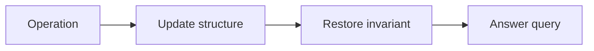

---

### 3.3 Prefix Sums

Use when repeated range sums are asked on static data.

```text
sum(l, r) = pref[r + 1] - pref[l]
```

```cpp
vector<long long> pref(n + 1, 0);
for (int i = 0; i < n; i++) pref[i + 1] = pref[i] + a[i];

long long rangeSum(int l, int r) {
    return pref[r + 1] - pref[l];
}
```

Use cases:

- range sum query
- subarray sum
- count prefix properties
- 2D matrix sum
- balanced bracket range checking with prefix depth

---

### 3.4 Difference Array

Use when many range updates happen and final array is needed.

```text
Add x to [l, r]:
diff[l] += x
diff[r + 1] -= x
```

```cpp
vector<long long> diff(n + 1, 0);
diff[l] += x;
if (r + 1 < n) diff[r + 1] -= x;

long long cur = 0;
for (int i = 0; i < n; i++) {
    cur += diff[i];
    a[i] += cur;
}
```

Trick:

```text
Range update, final values only -> difference array
Range update + online query -> Fenwick / segment tree
```

---

### 3.5 Sliding Window

Use when a contiguous segment moves through the array.

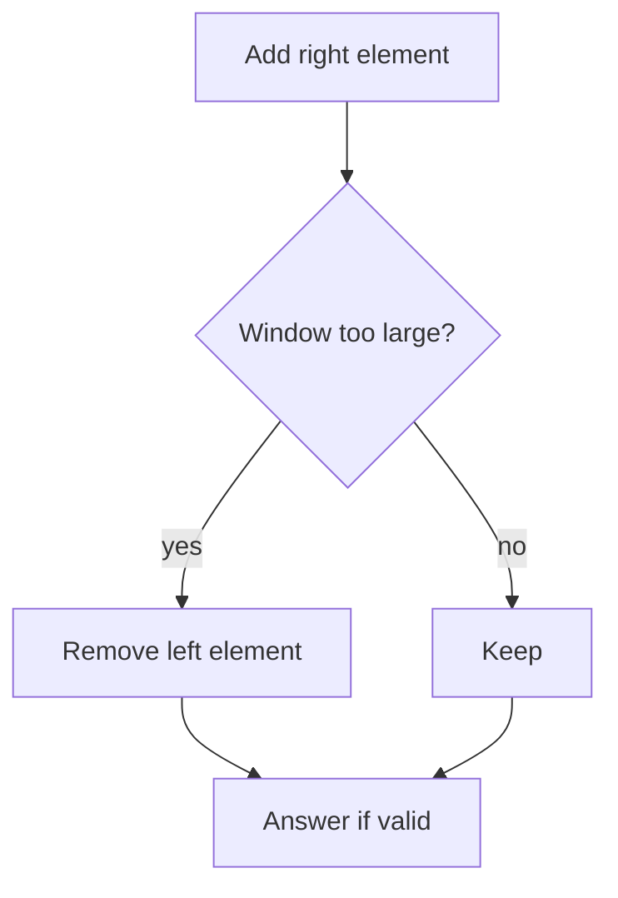

Fixed size template:

```cpp
for (int r = 0; r < n; r++) {
    add(a[r]);

    if (r - k >= 0) remove(a[r - k]);

    if (r >= k - 1) answer();
}
```

Variable size template:

```cpp
int l = 0;
for (int r = 0; r < n; r++) {
    add(a[r]);

    while (!valid()) {
        remove(a[l]);
        l++;
    }

    answer(l, r);
}
```

Warning:

```text
If array has negative numbers, sum-based sliding window is usually unsafe.
Use prefix + map instead.
```

---

### 3.6 Two Pointers

Use after sorting or when two ends move monotonically.

Examples:

- pair sum in sorted array
- count pairs with sum <= x
- merge two sorted arrays
- remove duplicates

```cpp
int l = 0, r = n - 1;
while (l < r) {
    long long sum = a[l] + a[r];
    if (sum == target) break;
    else if (sum < target) l++;
    else r--;
}
```

---

### 3.7 Binary Search on Answer

Use when answer is numeric and feasibility is monotonic.

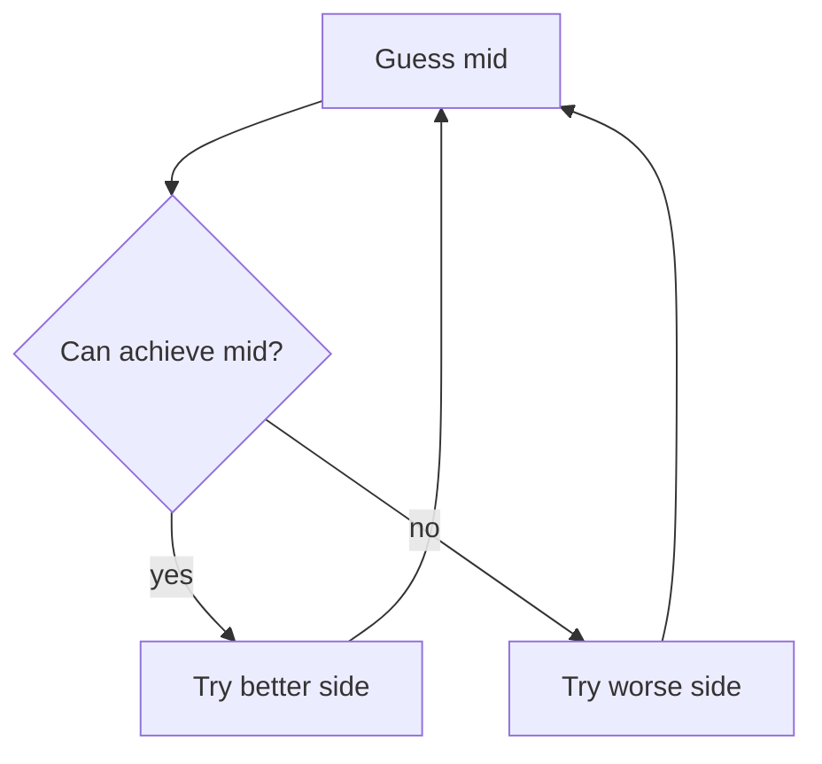

Template for minimum feasible answer:

```cpp
long long lo = 0, hi = 1e18, ans = hi;
while (lo <= hi) {
    long long mid = lo + (hi - lo) / 2;
    if (can(mid)) {
        ans = mid;
        hi = mid - 1;
    } else {
        lo = mid + 1;
    }
}
```

Clues:

```text
minimum maximum
maximum minimum
can we do within x?
smallest time
largest distance
```

---

### 3.8 Monotonic Stack

Use for nearest greater/smaller element.

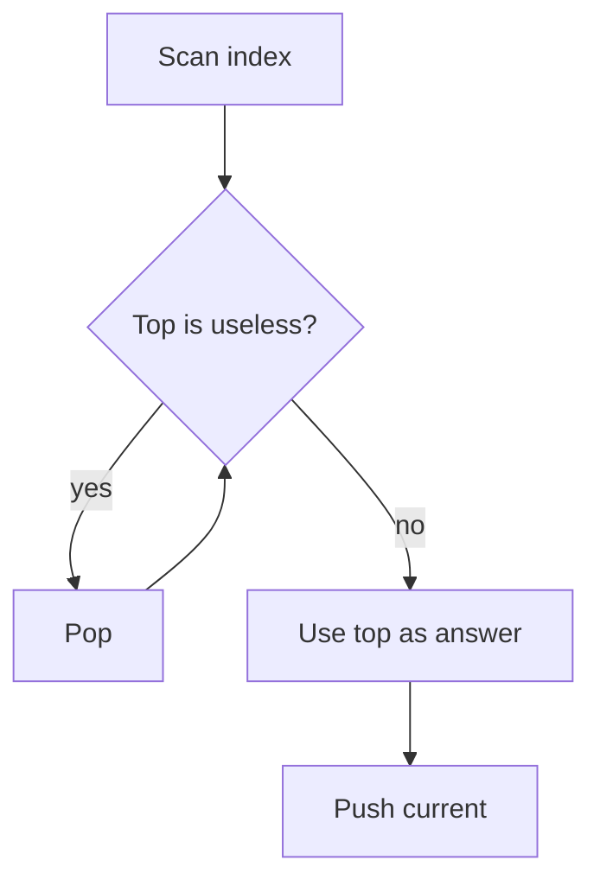

Next greater to the right:

```cpp
vector<int> nge(n, n);
stack<int> st;

for (int i = n - 1; i >= 0; i--) {
    while (!st.empty() && a[st.top()] <= a[i]) st.pop();
    if (!st.empty()) nge[i] = st.top();
    st.push(i);
}
```

Trick:

```text
To the right -> scan right to left
To the left  -> scan left to right
Greater      -> pop <= current
Smaller      -> pop >= current
```

---

### 3.9 Monotonic Deque

Use for min/max in every sliding window.

For minimum, keep increasing values.

```cpp
struct MinDeque {
    deque<int> dq;

    void add(int x) {
        while (!dq.empty() && dq.back() > x) dq.pop_back();
        dq.push_back(x);
    }

    void remove(int x) {
        if (!dq.empty() && dq.front() == x) dq.pop_front();
    }

    int get() {
        return dq.front();
    }
};
```

For maximum, reverse the comparison.

---

### 3.10 Contribution Technique

Use when too many objects exist.

```text
Instead of enumerating every subarray,
ask how many times each element contributes.
```

Sum of all subarrays:

```text
a[i] appears in (i + 1) * (n - i) subarrays
```

```cpp
long long ans = 0;
for (int i = 0; i < n; i++) {
    ans += 1LL * a[i] * (i + 1) * (n - i);
}
```

---

### 3.11 Coordinate Compression

Use when values are huge but only relative order matters.

```cpp
vector<int> vals = a;
sort(vals.begin(), vals.end());
vals.erase(unique(vals.begin(), vals.end()), vals.end());

for (int &x : a) {
    x = lower_bound(vals.begin(), vals.end(), x) - vals.begin();
}
```

Use cases:

- Fenwick over large coordinates
- counting inversions
- offline queries
- frequency arrays when values are big

---

### 3.12 Offline Processing

Use when queries are known before answering.

Examples:

- sort queries by right endpoint
- sort events by coordinate
- Mo's algorithm
- process add/remove events

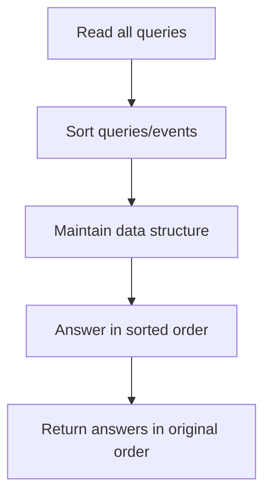

---

## 4. Frameworks

### 4.1 Universal Problem Solving Framework

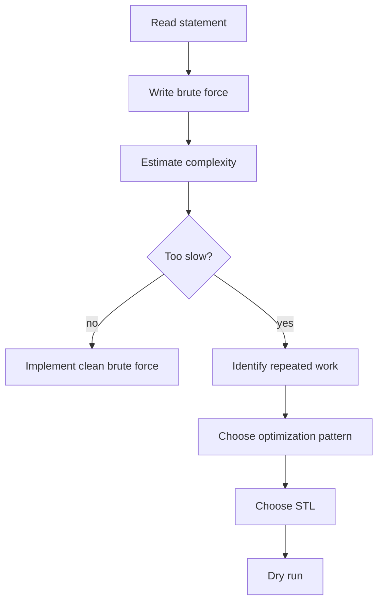

Checklist:

```text
1. What is n?
2. What is q?
3. Static or dynamic?
4. Online or offline?
5. Are values negative?
6. Is order important?
7. Need min/max/median/mode?
8. Need exact answer or feasibility?
```

---

### 4.2 Range Query Framework

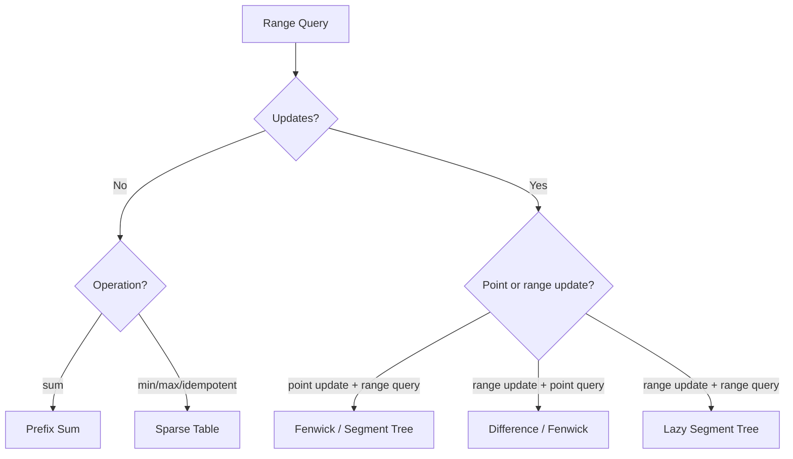

---

### 4.3 Dynamic Set Framework

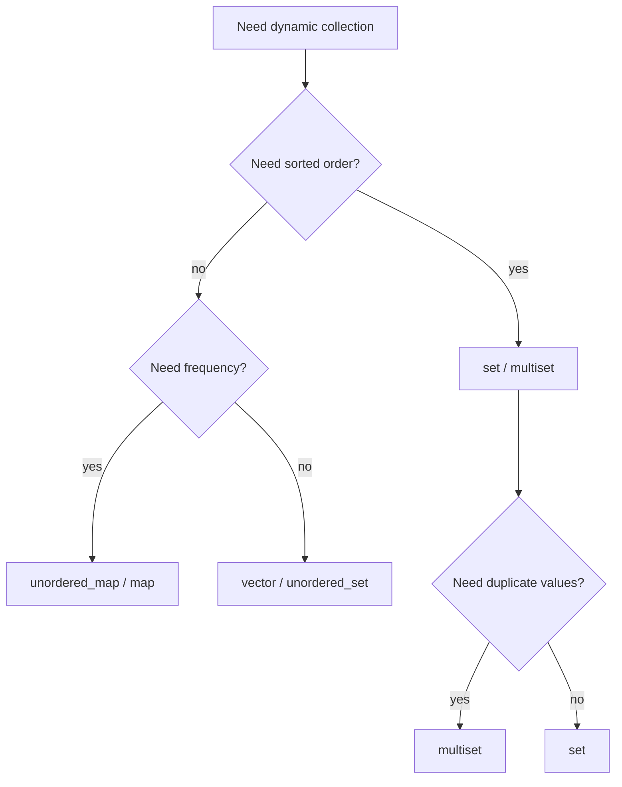

Operations table:

| Need | Pick |
|---|---|
| sorted unique | `set` |
| sorted duplicates | `multiset` |
| key-value ordered | `map` |
| key-value faster average | `unordered_map` |
| min/max both | `multiset` |
| arbitrary erase duplicate | `multiset` with iterator erase |

---

### 4.4 Window Maintenance Framework

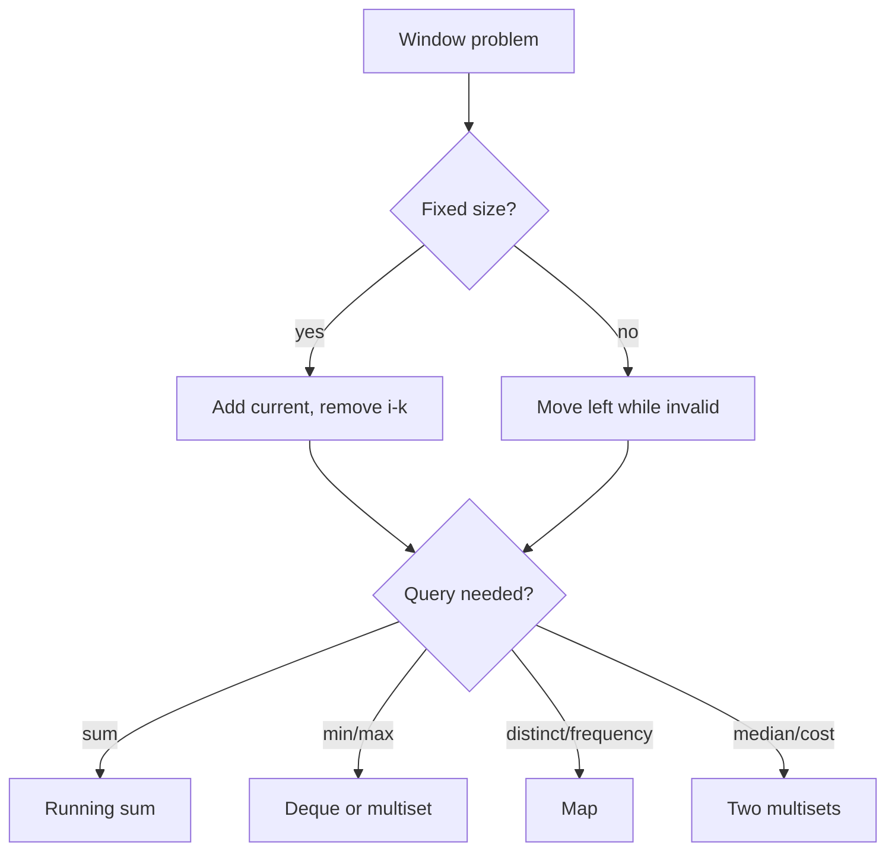

---

### 4.5 Greedy With Ordering Framework

Greedy usually needs sorting or a priority queue.

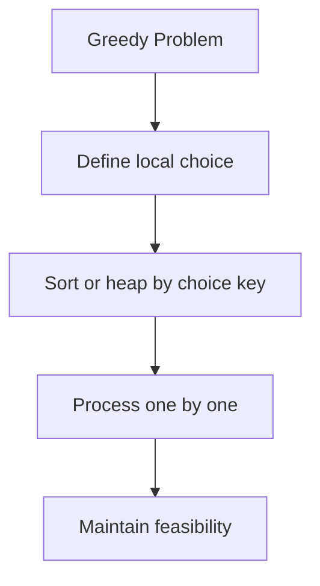

Clues:

```text
earliest deadline
minimum cost first
largest gain first
interval scheduling
choose smallest possible
choose largest possible
```

---

## 5. Problem Forms

### 5.1 Balanced Brackets / Parentheses

Single bracket type:

```cpp
bool validParentheses(const string& s) {
    int depth = 0;
    for (char c : s) {
        if (c == '(') depth++;
        else if (c == ')') depth--;
        if (depth < 0) return false;
    }
    return depth == 0;
}
```

Multiple bracket types:

```cpp
bool isBalanced(const string& s) {
    map<char, char> match = {{')','('}, {']','['}, {'}','{'}};
    stack<char> st;

    for (char c : s) {
        if (c == '(' || c == '[' || c == '{') st.push(c);
        else if (match.count(c)) {
            if (st.empty() || st.top() != match[c]) return false;
            st.pop();
        }
    }
    return st.empty();
}
```

Range bracket query:

```text
Use prefix depth + range minimum.
Balanced [l, r] if:
1. depth[r] == depth[l-1]
2. min depth in [l, r] >= depth[l-1]
```

---

### 5.2 Subarray Sum Equals X

```cpp
long long countSubarraysWithSumX(vector<int>& a, long long x) {
    map<long long, long long> freq;
    freq[0] = 1;

    long long pref = 0, ans = 0;
    for (int v : a) {
        pref += v;
        ans += freq[pref - x];
        freq[pref]++;
    }
    return ans;
}
```

Use prefix + map when negative values exist.

---

### 5.3 Sliding Window Minimum / Maximum

Options:

| Method | Complexity | When |
|---|---:|---|
| `multiset` | `O(n log k)` | easier, arbitrary values |
| monotonic deque | `O(n)` | optimal min/max |

Deque minimum:

```cpp
vector<int> slidingMin(vector<int>& a, int k) {
    deque<int> dq; // stores indices
    vector<int> ans;

    for (int i = 0; i < (int)a.size(); i++) {
        while (!dq.empty() && dq.front() <= i - k) dq.pop_front();
        while (!dq.empty() && a[dq.back()] >= a[i]) dq.pop_back();
        dq.push_back(i);

        if (i >= k - 1) ans.push_back(a[dq.front()]);
    }
    return ans;
}
```

Index-based deque is safer than value-based deque when duplicates exist.

---

### 5.4 Sliding Window Cost / Make Equal

Minimum sum of absolute differences occurs at median.

Maintain:

- `lo`: smaller half
- `hi`: larger half
- `leftSum`, `rightSum`

```cpp
long long cost() {
    long long m = *lo.rbegin();
    return m * (long long)lo.size() - leftSum
         + rightSum - m * (long long)hi.size();
}
```

---

### 5.5 Mean / Variance / Median / Mode Dashboard

| Statistic | Maintain |
|---|---|
| mean | `sum`, `count` |
| variance | `sum`, `squareSum`, `count` |
| median | two multisets |
| mode | frequency map + ordered frequency set |

Mode pattern:

```cpp
map<int,int> freq;
multiset<pair<int,int>> order; // {frequency, value}
```

Update frequency by removing old pair, changing count, inserting new pair.

---

### 5.6 Next Greater / Smaller Element

```cpp
vector<int> nextGreater(vector<int>& a) {
    int n = a.size();
    vector<int> ans(n, n);
    stack<int> st;

    for (int i = n - 1; i >= 0; i--) {
        while (!st.empty() && a[st.top()] <= a[i]) st.pop();
        if (!st.empty()) ans[i] = st.top();
        st.push(i);
    }
    return ans;
}
```

---

### 5.7 Trapping Rain Water

Stack idea:

```text
current bar = right wall
popped bar = bottom
new stack top = left wall
```

```cpp
int trap(vector<int>& h) {
    int ans = 0;
    stack<int> st;

    for (int i = 0; i < (int)h.size(); i++) {
        while (!st.empty() && h[st.top()] < h[i]) {
            int bottom = st.top();
            st.pop();
            if (st.empty()) break;

            int left = st.top();
            int width = i - left - 1;
            int height = min(h[left], h[i]) - h[bottom];
            ans += width * height;
        }
        st.push(i);
    }
    return ans;
}
```

---

### 5.8 Intervals / Range Coverage

Static point coverage:

```text
covered = total - endingBeforeX - startingAfterX
```

Dynamic merged intervals:

```cpp
struct RangeCover {
    set<pair<int,int>> ranges;

    bool covered(int x) {
        auto it = ranges.upper_bound({x, INT_MAX});
        if (it == ranges.begin()) return false;
        --it;
        return it->second >= x;
    }

    void insertRange(int l, int r) {
        auto it = ranges.lower_bound({l, INT_MIN});

        if (it != ranges.begin()) {
            auto p = prev(it);
            if (p->second >= l - 1) it = p;
        }

        while (it != ranges.end() && it->first <= r + 1) {
            l = min(l, it->first);
            r = max(r, it->second);
            it = ranges.erase(it);
        }

        ranges.insert({l, r});
    }
};
```

---

### 5.9 Top K Sum

Maintain two multisets:

- `top`: largest `k`
- `rest`: all others
- `sumTop`: sum of `top`

```text
After every insert/remove:
1. top size must be k if enough elements exist
2. every top element >= every rest element
```

---

### 5.10 Priority Queue Problems

Default max heap:

```cpp
priority_queue<int> pq;
```

Min heap:

```cpp
priority_queue<int, vector<int>, greater<int>> pq;
```

Use heap for:

- Dijkstra
- k largest / k smallest
- task scheduling
- merge k sorted lists
- repeatedly take best current option

Do not use plain heap when arbitrary erase is required unless using lazy deletion.

---

### 5.11 Molecular Formula / Nested Parser

Parsing framework:

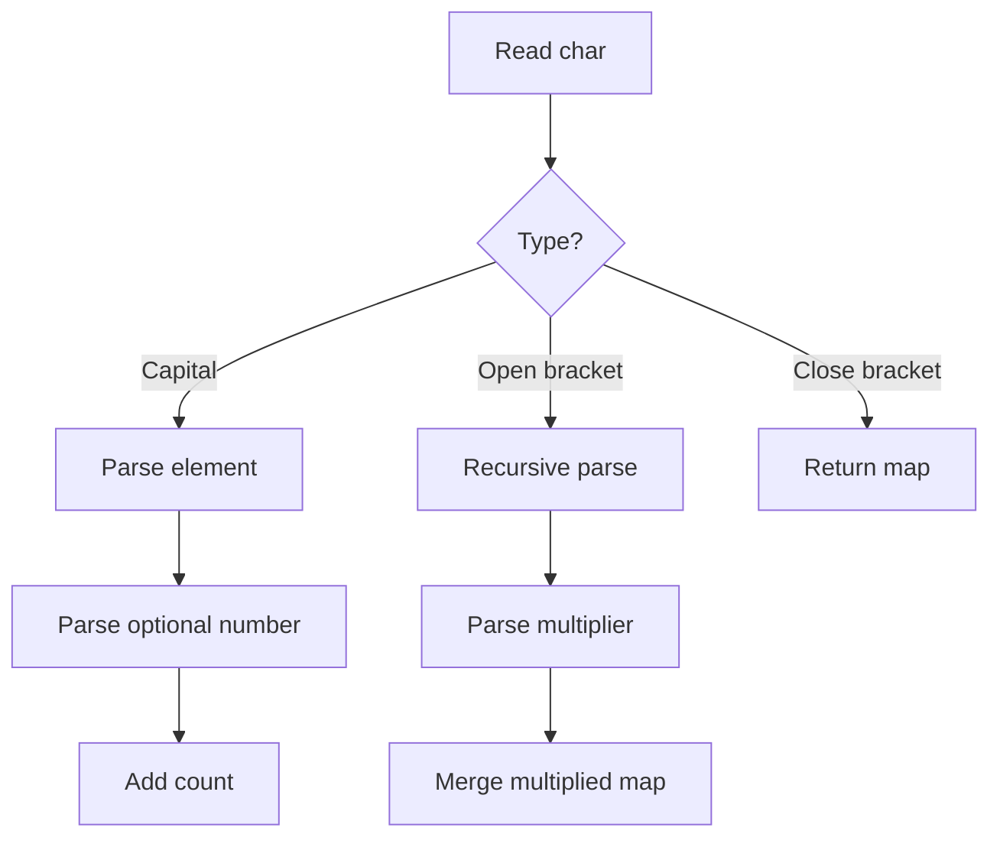

Key tactics:

```text
Capital + lowercase letters = element name
No number means 1
Parentheses mean recursive subproblem
map gives sorted output
```

---

### 5.12 Pattern Printing / Coordinate Geometry

Think in cells, not spaces.

```cpp
bool star(int i, int j, int n, int m) {
    return i == j || i + j == n - 1;
}

for (int i = 0; i < n; i++) {
    for (int j = 0; j < m; j++) {
        cout << (star(i, j, n, m) ? '*' : ' ');
    }
    cout << '\n';
}
```

Common conditions:

| Pattern | Condition |
|---|---|
| main diagonal | `i == j` |
| anti diagonal | `i + j == n - 1` |
| border | `i == 0 || j == 0 || i == n-1 || j == m-1` |
| upper triangle | `i <= j` |
| lower triangle | `i >= j` |

---

## 6. Tactics

### 6.1 Store Indices, Not Values

Safer for duplicates and distances.

Use indices in:

- monotonic stack
- monotonic deque
- next greater/smaller
- histogram
- sliding window max/min

---

### 6.2 Sort First

Sorting often reveals structure.

Use sorting for:

- intervals
- greedy
- two pointers
- coordinate compression
- sweep line
- grouping equal values

---

### 6.3 Sentinel Values

Add artificial boundaries to simplify code.

Examples:

```text
prefix freq starts with freq[0] = 1
histogram add height 0 at end
parentheses base depth before l
DP initialize impossible with INF
```

---

### 6.4 Lazy Deletion

Use with priority queues when arbitrary delete is needed but not directly supported.

```cpp
priority_queue<int> pq;
map<int,int> deleted;

void clean() {
    while (!pq.empty() && deleted[pq.top()] > 0) {
        deleted[pq.top()]--;
        pq.pop();
    }
}
```

---

### 6.5 Coordinate Compression

When values are too large for arrays but count of values is small.

```text
Original values: 1000000000, -5, 1000000000
Compressed:      1,          0,  1
```

---

### 6.6 Reverse the Direction

Some problems become easy if scanned from the other side.

Examples:

```text
next greater to right -> scan right to left
suffix information -> scan right to left
remove from end -> think reverse add
```

---

### 6.7 Convert Range to Events

Sweep line tactic:

```text
interval [l, r]
create event +1 at l
create event -1 at r+1
sort events
scan active count
```

Use for:

- maximum overlapping intervals
- calendar rooms
- coverage length
- range updates offline

---

### 6.8 Split by Sign / Parity / Modulo

Many problems depend on a hidden class.

Examples:

- odd/even counts
- prefix sum modulo `k`
- positive vs negative
- same parity pairs
- same remainder pairs

Counting subarrays divisible by `k`:

```cpp
long long countDivisible(vector<int>& a, int k) {
    vector<long long> cnt(k, 0);
    cnt[0] = 1;
    long long pref = 0, ans = 0;

    for (int x : a) {
        pref = (pref + x) % k;
        if (pref < 0) pref += k;
        ans += cnt[pref];
        cnt[pref]++;
    }
    return ans;
}
```

---

## 7. STL Decision System

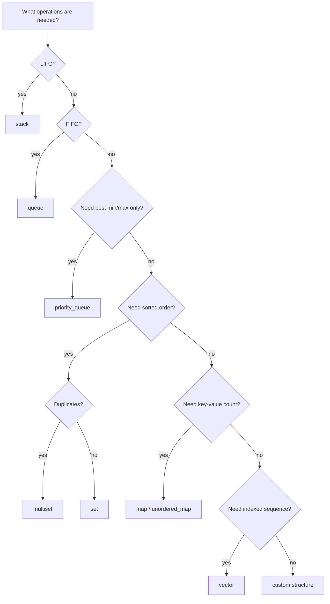

| Need | Use |
|---|---|
| fast random access | `vector` |
| LIFO | `stack` |
| FIFO | `queue` |
| BFS double-ended | `deque` |
| current max/min | `priority_queue` |
| sorted unique | `set` |
| sorted duplicates | `multiset` |
| ordered key-value | `map` |
| average fast key-value | `unordered_map` |
| min/max window | monotonic `deque` |
| nearest greater/smaller | monotonic `stack` |
| dynamic median | two `multiset`s |
| dynamic top k | two `multiset`s or heap |

---

## 8. Pattern Library

### 8.1 Quick Pattern Recognition Table

| Problem clue | Think |
|---|---|
| fixed size `k` subarray | sliding window |
| variable valid segment | two pointers / sliding window |
| range sum query | prefix sum |
| many range updates, final array | difference array |
| subarray sum equals `x` | prefix sum + map |
| subarray sum divisible by `k` | prefix modulo frequency |
| min/max in each window | monotonic deque |
| next greater/smaller | monotonic stack |
| dynamic median | two multisets |
| top k sum | two multisets |
| intervals overlap | sort / sweep line |
| dynamic interval coverage | set of merged intervals |
| nested brackets/formula | stack / recursion |
| all subarrays/subsequences | contribution technique |
| minimum maximum | binary search answer |
| large values but few unique | coordinate compression |
| shortest path weighted | Dijkstra + min heap |
| unweighted shortest path | BFS + queue |
| components/connectivity | DFS/BFS/DSU |

---

### 8.2 Revision Flow

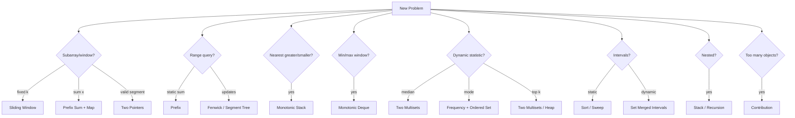

---

## 9. Templates

### 9.1 Minimal C++ Setup

```cpp
#include <bits/stdc++.h>
using namespace std;

using ll = long long;

int main() {
    ios::sync_with_stdio(false);
    cin.tie(nullptr);

    return 0;
}
```

---

### 9.2 Safe Multiset Erase One Copy

```cpp
auto it = ms.find(x);
if (it != ms.end()) {
    ms.erase(it);
}
```

Never use this if you only want one copy:

```cpp
ms.erase(x); // removes all copies of x
```

---

### 9.3 Frequency Map Update

```cpp
map<int,int> freq;

void add(int x) {
    freq[x]++;
}

void remove(int x) {
    freq[x]--;
    if (freq[x] == 0) freq.erase(x);
}
```

---

### 9.4 Fenwick Tree

Use for prefix sums with point updates.

```cpp
struct Fenwick {
    int n;
    vector<long long> bit;

    Fenwick(int n) : n(n), bit(n + 1, 0) {}

    void add(int idx, long long val) {
        for (++idx; idx <= n; idx += idx & -idx) bit[idx] += val;
    }

    long long sumPrefix(int idx) {
        long long ans = 0;
        for (++idx; idx > 0; idx -= idx & -idx) ans += bit[idx];
        return ans;
    }

    long long rangeSum(int l, int r) {
        if (r < l) return 0;
        return sumPrefix(r) - (l ? sumPrefix(l - 1) : 0);
    }
};
```

---

### 9.5 DSU / Union Find

Use for connectivity and merging components.

```cpp
struct DSU {
    vector<int> parent, sz;

    DSU(int n) : parent(n), sz(n, 1) {
        iota(parent.begin(), parent.end(), 0);
    }

    int find(int x) {
        if (parent[x] == x) return x;
        return parent[x] = find(parent[x]);
    }

    bool unite(int a, int b) {
        a = find(a);
        b = find(b);
        if (a == b) return false;
        if (sz[a] < sz[b]) swap(a, b);
        parent[b] = a;
        sz[a] += sz[b];
        return true;
    }
};
```

---

### 9.6 BFS Template

```cpp
vector<int> dist(n, -1);
queue<int> q;

dist[start] = 0;
q.push(start);

while (!q.empty()) {
    int u = q.front();
    q.pop();

    for (int v : graph[u]) {
        if (dist[v] == -1) {
            dist[v] = dist[u] + 1;
            q.push(v);
        }
    }
}
```

---

### 9.7 Dijkstra Template

```cpp
const long long INF = 4e18;
vector<long long> dist(n, INF);
priority_queue<pair<long long,int>, vector<pair<long long,int>>, greater<pair<long long,int>>> pq;

dist[src] = 0;
pq.push({0, src});

while (!pq.empty()) {
    auto [d, u] = pq.top();
    pq.pop();

    if (d != dist[u]) continue;

    for (auto [v, w] : graph[u]) {
        if (dist[v] > d + w) {
            dist[v] = d + w;
            pq.push({dist[v], v});
        }
    }
}
```

---

## 10. Debugging and Edge Cases

### 10.1 Common Mistakes

- Calling `top()`, `front()`, `back()`, or `pop()` on empty containers.
- Using `multiset.erase(value)` when only one copy should be erased.
- Forgetting `freq[0] = 1` in prefix-sum counting.
- Forgetting negative modulo correction.
- Using `int` where `long long` is needed.
- Off-by-one in prefix sums.
- Forgetting to remove outgoing window element.
- Not handling duplicates in set/stack/deque logic.
- Custom comparator returns true for equal elements.
- Binary search infinite loop because bounds do not move.

---

### 10.2 Edge Case Checklist

```text
n = 0 or n = 1
all equal values
strictly increasing
strictly decreasing
contains negative numbers
contains zero
large values causing overflow
duplicate values
k = 1
k = n
empty answer
no valid segment
all segments valid
```

---

### 10.3 Dry Run Method

For every template, track:

```text
index
current value
data structure state
answer so far
invariant after operation
```

---

## 11. Final One-Minute Checklist

Before coding:

```text
1. What is the problem form?
2. What is the brute force?
3. Why is brute force too slow?
4. What repeated work can be removed?
5. Static or dynamic?
6. Online or offline?
7. Are values positive, negative, or mixed?
8. Do I need sorted order?
9. Do I need arbitrary erase?
10. Which invariant must be maintained?
```

Final memory hook:

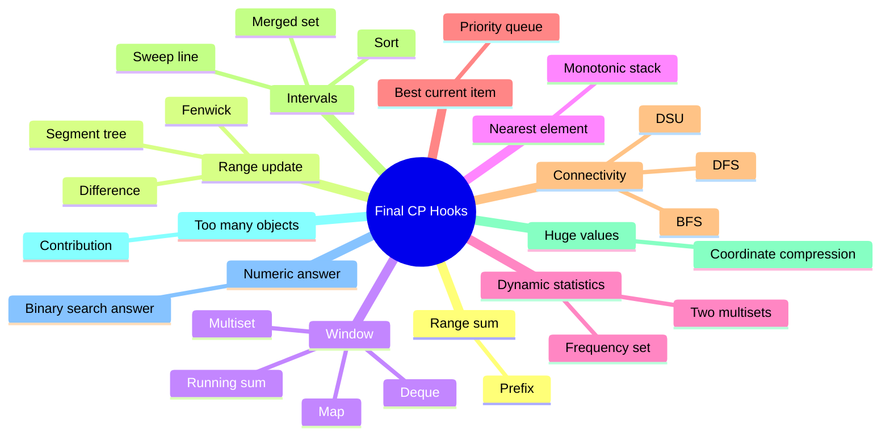

---

## Golden Rules

```text
Start with brute force.
Use constraints to reject brute force.
Name the pattern.
Choose STL by required operations.
Maintain a clear invariant.
Prefer indices when duplicates matter.
Use long long for counts and sums.
Dry run before submitting.
```
