# Prefix Sum Problem Solving Playbook

> Goal: solve almost any competitive-programming problem related to **prefix sum**, **partial sum**, **difference array**, and their 2D versions.

---

# 0. Master Map

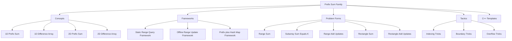

---

# 1. Concepts

## 1.1 Prefix Sum

Prefix sum stores the cumulative total up to each index.

```text
pref[i] = a[0] + a[1] + ... + a[i]
```

For range sum:

```text
sum(l, r) = pref[r] - pref[l - 1]
```

Safer 1-indexed version:

```text
pref[0] = 0
pref[i] = pref[i - 1] + a[i - 1]
sum(l, r) = pref[r + 1] - pref[l]
```

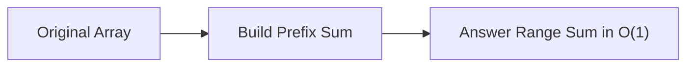

### C++

```cpp
vector<long long> buildPrefix(const vector<long long>& a) {
    int n = (int)a.size();
    vector<long long> pref(n + 1, 0);

    for (int i = 1; i <= n; i++) {
        pref[i] = pref[i - 1] + a[i - 1];
    }

    return pref;
}

long long rangeSum(const vector<long long>& pref, int l, int r) {
    return pref[r + 1] - pref[l];
}
```

---

## 1.2 Difference Array

Difference array is the inverse idea of prefix sum.

Use it when many range updates are given and final array is needed later.

For adding `x` to `[l, r]`:

```text
diff[l] += x
diff[r + 1] -= x
```

Then take prefix sum over `diff`.

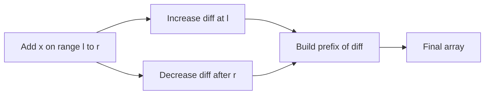

### C++

```cpp
vector<long long> applyRangeAdds(
    int n,
    const vector<tuple<int, int, long long>>& queries
) {
    vector<long long> diff(n + 1, 0);

    for (auto [l, r, x] : queries) {
        diff[l] += x;
        diff[r + 1] -= x;
    }

    vector<long long> ans(n);
    long long running = 0;

    for (int i = 0; i < n; i++) {
        running += diff[i];
        ans[i] = running;
    }

    return ans;
}
```

---

## 1.3 2D Prefix Sum

Use it for fast rectangle sum queries in a matrix.

```text
pref[i][j] = sum of rectangle from top-left to cell i,j
```

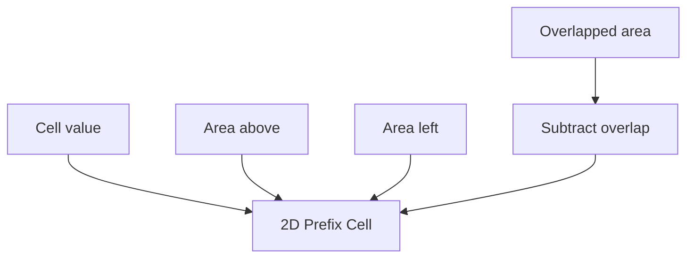

1-indexed formula:

```text
pref[i][j] = a[i - 1][j - 1]
           + pref[i - 1][j]
           + pref[i][j - 1]
           - pref[i - 1][j - 1]
```

Rectangle query:

```text
sum(U, D, L, R)
= pref[D + 1][R + 1]
- pref[U][R + 1]
- pref[D + 1][L]
+ pref[U][L]
```

### C++

```cpp
struct Prefix2D {
    int n, m;
    vector<vector<long long>> pref;

    Prefix2D(const vector<vector<long long>>& a) {
        n = (int)a.size();
        m = (int)a[0].size();

        pref.assign(n + 1, vector<long long>(m + 1, 0));

        for (int i = 1; i <= n; i++) {
            for (int j = 1; j <= m; j++) {
                pref[i][j] = a[i - 1][j - 1]
                           + pref[i - 1][j]
                           + pref[i][j - 1]
                           - pref[i - 1][j - 1];
            }
        }
    }

    long long query(int U, int D, int L, int R) {
        return pref[D + 1][R + 1]
             - pref[U][R + 1]
             - pref[D + 1][L]
             + pref[U][L];
    }
};
```

---

## 1.4 2D Difference Array

Use it for many rectangle add updates.

For adding `x` to rectangle rows `[U, D]` and columns `[L, R]`:

```text
diff[U][L] += x
diff[U][R + 1] -= x
diff[D + 1][L] -= x
diff[D + 1][R + 1] += x
```

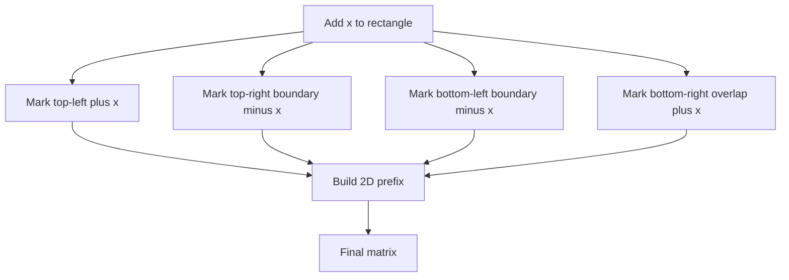

### C++

```cpp
vector<vector<long long>> applyRectangleAdds(
    int n,
    int m,
    const vector<tuple<int, int, int, int, long long>>& queries
) {
    vector<vector<long long>> diff(n + 1, vector<long long>(m + 1, 0));

    for (auto [U, D, L, R, x] : queries) {
        diff[U][L] += x;
        diff[U][R + 1] -= x;
        diff[D + 1][L] -= x;
        diff[D + 1][R + 1] += x;
    }

    vector<vector<long long>> ans(n, vector<long long>(m, 0));

    for (int i = 0; i < n; i++) {
        for (int j = 0; j < m; j++) {
            long long up = (i > 0 ? ans[i - 1][j] : 0);
            long long left = (j > 0 ? ans[i][j - 1] : 0);
            long long diag = (i > 0 && j > 0 ? ans[i - 1][j - 1] : 0);

            ans[i][j] = diff[i][j] + up + left - diag;
        }
    }

    return ans;
}
```

---

# 2. Frameworks

## 2.1 Static Range Query Framework

Use when array does not change.

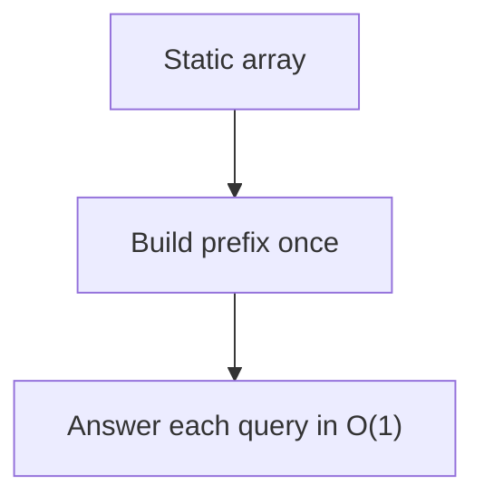

```text
Preprocess: O(n)
Each query: O(1)
Total: O(n + q)
```

---

## 2.2 Offline Range Update Framework

Use when all updates are known first, and final array is needed after.

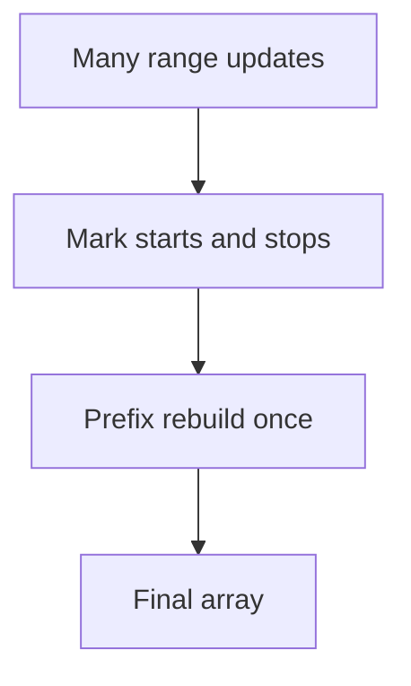

```text
Each update: O(1)
Rebuild: O(n)
Total: O(n + q)
```

---

## 2.3 Prefix Plus Hash Map Framework

Use when counting subarrays with a target sum.

```text
pref[r] - pref[l - 1] = k
pref[l - 1] = pref[r] - k
```

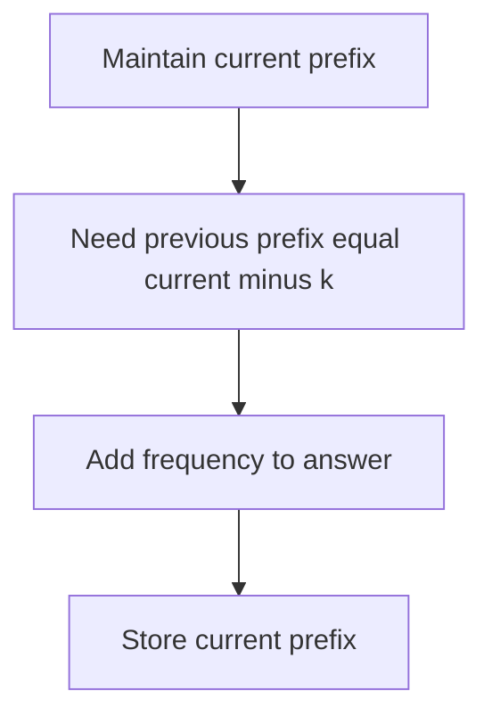

### C++

```cpp
long long countSubarraysWithSumK(const vector<long long>& a, long long k) {
    unordered_map<long long, long long> freq;
    freq[0] = 1;

    long long pref = 0;
    long long ans = 0;

    for (long long x : a) {
        pref += x;
        ans += freq[pref - k];
        freq[pref]++;
    }

    return ans;
}
```

---

## 2.4 When Prefix Is Not Enough

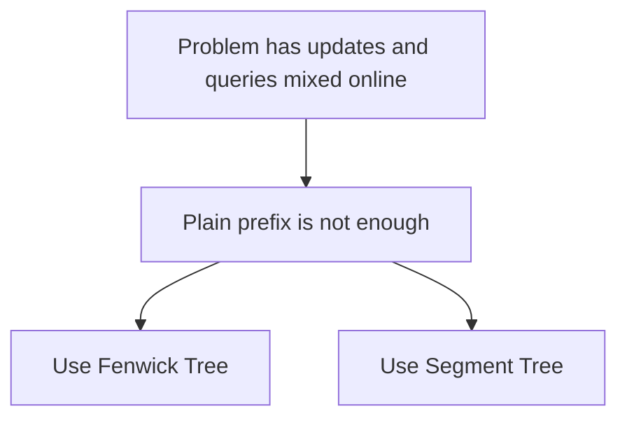

Use:
- Fenwick Tree for point update + range sum
- Fenwick Tree with tricks for range update + point query
- Segment Tree for flexible range updates and queries

---

# 3. Problem Forms

## 3.1 Range Sum Query

Clue:

```text
Given l and r, find sum of a[l..r]
```

Use:

```text
1D prefix sum
```

---

## 3.2 Count Subarrays With Sum K

Clue:

```text
How many subarrays have sum exactly k?
```

Use:

```text
prefix sum + frequency map
```

Works with:
- positive numbers
- zero
- negative numbers

---

## 3.3 Longest Subarray With Sum K

Use earliest position of each prefix sum.

```cpp
int longestSubarraySumK(const vector<long long>& a, long long k) {
    unordered_map<long long, int> first;
    first[0] = -1;

    long long pref = 0;
    int best = 0;

    for (int i = 0; i < (int)a.size(); i++) {
        pref += a[i];

        if (first.count(pref - k)) {
            best = max(best, i - first[pref - k]);
        }

        if (!first.count(pref)) {
            first[pref] = i;
        }
    }

    return best;
}
```

---

## 3.4 Subarray Sum Divisible by M

Two prefix sums with same remainder create a subarray divisible by `m`.

```cpp
long long countDivisibleByM(const vector<long long>& a, int m) {
    vector<long long> cnt(m, 0);
    cnt[0] = 1;

    long long pref = 0;
    long long ans = 0;

    for (long long x : a) {
        pref = (pref + x) % m;
        if (pref < 0) pref += m;

        ans += cnt[pref];
        cnt[pref]++;
    }

    return ans;
}
```

---

## 3.5 Binary Array Count Problems

For binary arrays:
- number of ones in range
- number of zeros in range
- count subarrays with exact number of ones

Use prefix count.

```cpp
vector<int> prefOnes(n + 1, 0);
for (int i = 1; i <= n; i++) {
    prefOnes[i] = prefOnes[i - 1] + (a[i - 1] == 1);
}
```

---

## 3.6 Range Add Updates

Clue:

```text
Add x to every element from l to r
```

Use:

```text
difference array
```

---

## 3.7 Rectangle Sum Query

Clue:

```text
Find sum inside submatrix
```

Use:

```text
2D prefix sum
```

---

## 3.8 Rectangle Add Updates

Clue:

```text
Add x to every cell inside rectangle
```

Use:

```text
2D difference array
```

---

## 3.9 Prefix XOR

For XOR range queries:

```text
xor(l, r) = pxor[r + 1] XOR pxor[l]
```

```cpp
vector<int> buildPrefixXor(const vector<int>& a) {
    int n = (int)a.size();
    vector<int> px(n + 1, 0);

    for (int i = 1; i <= n; i++) {
        px[i] = px[i - 1] ^ a[i - 1];
    }

    return px;
}
```

---

## 3.10 Weighted Prefix Sum

Sometimes query needs weighted value.

Example:

```text
sum of i * a[i]
```

Build:

```cpp
weightedPref[i] = weightedPref[i - 1] + i * a[i]
```

Useful in:
- distance sum
- cost shifting
- contribution problems

---

# 4. Tactics

## 4.1 Decision Table

| Problem clue | Use |
|---|---|
| Many range sum queries | 1D prefix |
| Many range add updates, final array only | 1D difference |
| Count subarrays with sum K | Prefix + map |
| Longest subarray with sum K | Prefix + earliest index |
| Subarray sum divisible by M | Prefix remainder count |
| Matrix rectangle sum | 2D prefix |
| Matrix rectangle add | 2D difference |
| Updates and queries mixed online | Fenwick / Segment Tree |
| XOR range query | Prefix XOR |

---

## 4.2 Indexing Tactic

Prefer 1-indexed prefix:

```text
pref[0] = 0
pref[i] = sum of first i elements
```

Then:

```text
sum(l, r) = pref[r + 1] - pref[l]
```

This avoids `if (l == 0)`.

---

## 4.3 Overflow Tactic

Use `long long`.

```cpp
long long sum = 0;
vector<long long> pref(n + 1);
```

Even if values are `int`, sums may overflow.

---

## 4.4 Boundary Tactic for Difference Array

Allocate one extra cell.

```cpp
vector<long long> diff(n + 1, 0);
diff[l] += x;
diff[r + 1] -= x;
```

No need to check `r + 1 < n`.

---

## 4.5 Hash Map Tactic

For subarray sum with negative numbers, sliding window may fail.

Use:

```text
prefix + map
```

---

## 4.6 Modulo Tactic

In C++, negative modulo can stay negative.

Fix it:

```cpp
pref %= m;
if (pref < 0) pref += m;
```

---

# 5. Common Mistakes

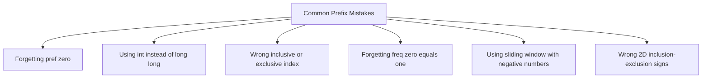

## Mistake 1: Forgetting `freq[0] = 1`

Wrong:

```cpp
unordered_map<long long, long long> freq;
```

Correct:

```cpp
unordered_map<long long, long long> freq;
freq[0] = 1;
```

---

## Mistake 2: Off-by-One in Prefix

Always define clearly:

```text
Is pref[i] sum up to index i?
Or sum of first i elements?
```

Recommended:

```text
pref[i] = sum of first i elements
```

---

## Mistake 3: Wrong Difference Boundary

Correct for inclusive `[l, r]`:

```cpp
diff[l] += x;
diff[r + 1] -= x;
```

---

# 6. Final Problem-Solving Flow

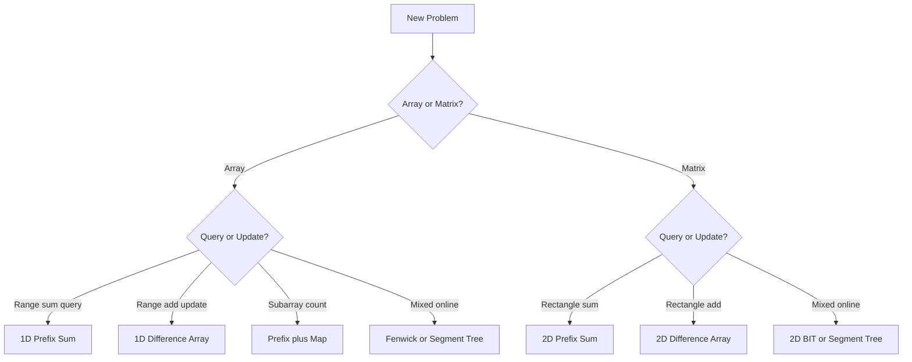

---

# 7. Minimal Contest Templates

## 7.1 1D Prefix

```cpp
vector<long long> pref(n + 1, 0);

for (int i = 1; i <= n; i++) {
    pref[i] = pref[i - 1] + a[i - 1];
}

auto sum = [&](int l, int r) {
    return pref[r + 1] - pref[l];
};
```

---

## 7.2 1D Difference

```cpp
vector<long long> diff(n + 1, 0);

auto addRange = [&](int l, int r, long long x) {
    diff[l] += x;
    diff[r + 1] -= x;
};

for (int i = 1; i < n; i++) {
    diff[i] += diff[i - 1];
}
```

---

## 7.3 Prefix + Map

```cpp
unordered_map<long long, long long> freq;
freq[0] = 1;

long long pref = 0;
long long ans = 0;

for (long long x : a) {
    pref += x;
    ans += freq[pref - k];
    freq[pref]++;
}
```

---

## 7.4 2D Prefix

```cpp
vector<vector<long long>> pref(n + 1, vector<long long>(m + 1, 0));

for (int i = 1; i <= n; i++) {
    for (int j = 1; j <= m; j++) {
        pref[i][j] = a[i - 1][j - 1]
                   + pref[i - 1][j]
                   + pref[i][j - 1]
                   - pref[i - 1][j - 1];
    }
}

auto query = [&](int U, int D, int L, int R) {
    return pref[D + 1][R + 1]
         - pref[U][R + 1]
         - pref[D + 1][L]
         + pref[U][L];
};
```

---

## 7.5 2D Difference

```cpp
vector<vector<long long>> diff(n + 1, vector<long long>(m + 1, 0));

auto addRect = [&](int U, int D, int L, int R, long long x) {
    diff[U][L] += x;
    diff[U][R + 1] -= x;
    diff[D + 1][L] -= x;
    diff[D + 1][R + 1] += x;
};

for (int i = 0; i < n; i++) {
    for (int j = 0; j < m; j++) {
        long long up = (i ? diff[i - 1][j] : 0);
        long long left = (j ? diff[i][j - 1] : 0);
        long long diag = (i && j ? diff[i - 1][j - 1] : 0);
        diff[i][j] += up + left - diag;
    }
}
```

---

# 8. Final Memory Hooks

```text
Prefix Sum:
    accumulate first, subtract later.

Difference Array:
    mark start and stop, rebuild later.

Prefix + Map:
    current prefix asks for old prefix.

2D Prefix:
    add big rectangle, subtract outside, add overlap.

2D Difference:
    four corners control one rectangle.
```
