# Binary Search Problem Solving Playbook

> A structured competitive-programming guide for solving **Binary Search** problems.
>
> Main goal: turn problems into a clean **search space + monotonic check function**.

---

# Index

```text
0. Master Map
1. Concepts
   1.1 What Binary Search Really Means
   1.2 Search Space
   1.3 Monotonic Predicate
   1.4 First True Pattern
   1.5 Last True Pattern
   1.6 Lower Bound and Upper Bound
   1.7 Binary Search on Answer
   1.8 Real-Valued Binary Search
   1.9 Ternary Search
2. Frameworks
   2.1 Binary Search Thinking Framework
   2.2 Search Space Framework
   2.3 Check Function Framework
   2.4 Minimize Maximum Framework
   2.5 Maximize Minimum Framework
   2.6 Kth Smallest Framework
   2.7 Per-Start Binary Search Framework
3. Problem Forms
   3.1 Sorted Array Search
   3.2 First Element Greater or Equal
   3.3 Rotated Sorted Array
   3.4 Peak in Bitonic Array
   3.5 Painter Partition
   3.6 Factory Machines
   3.7 Aggressive Cows
   3.8 Minimize Maximum Gap
   3.9 Kth Pair Sum
   3.10 Kth in Multiplication Table
   3.11 Subarray Length with Prefix
   3.12 Sum of Cubes
4. Tactics
   4.1 Pattern Recognition
   4.2 Bounds Tactics
   4.3 Check Function Tactics
   4.4 Overflow Tactics
   4.5 Infinite Loop Tactics
   4.6 Precision Tactics
5. C++ Template Library
6. Final Checklist
```

---

# 0. Master Map

```mermaid
flowchart TD
    A["Binary Search"] --> B["Concepts"]
    A --> C["Frameworks"]
    A --> D["Problem Forms"]
    A --> E["Tactics"]
    A --> F["C++ Templates"]

    B --> B1["Search Space"]
    B --> B2["Monotonic Predicate"]
    B --> B3["First True"]
    B --> B4["Last True"]
    B --> B5["Binary Search on Answer"]

    C --> C1["Formulate Answer"]
    C --> C2["Define Bounds"]
    C --> C3["Write Check Function"]
    C --> C4["Prove Monotonicity"]

    D --> D1["Sorted Arrays"]
    D --> D2["Minimize Maximum"]
    D --> D3["Maximize Minimum"]
    D --> D4["Kth Smallest"]
    D --> D5["Real Domain"]

    E --> E1["Avoid Overflow"]
    E --> E2["Avoid Infinite Loop"]
    E --> E3["Choose Correct Template"]
```

---

# 1. Concepts

## 1.1 What Binary Search Really Means

Binary search is not only for sorted arrays.

It works whenever the answer space can be split into two monotonic zones:

```text
false false false true true true
```

or:

```text
true true true false false false
```

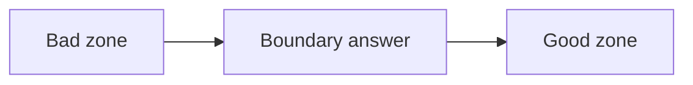

The goal is to find the boundary.

---

## 1.2 Search Space

Search space means:

```text
all possible values where the answer may exist
```

Examples:

| Problem | Search Space |
|---|---|
| Find element in sorted array | index range |
| Minimum time | time range |
| Maximum minimum distance | distance range |
| Kth smallest value | value range |
| Real answer | floating-point range |

Safe midpoint:

```cpp
long long mid = lo + (hi - lo) / 2;
```

Avoid:

```cpp
long long mid = (lo + hi) / 2;
```

because it can overflow.

---

## 1.3 Monotonic Predicate

A predicate is a function returning true or false.

Binary search needs the predicate to be monotonic.

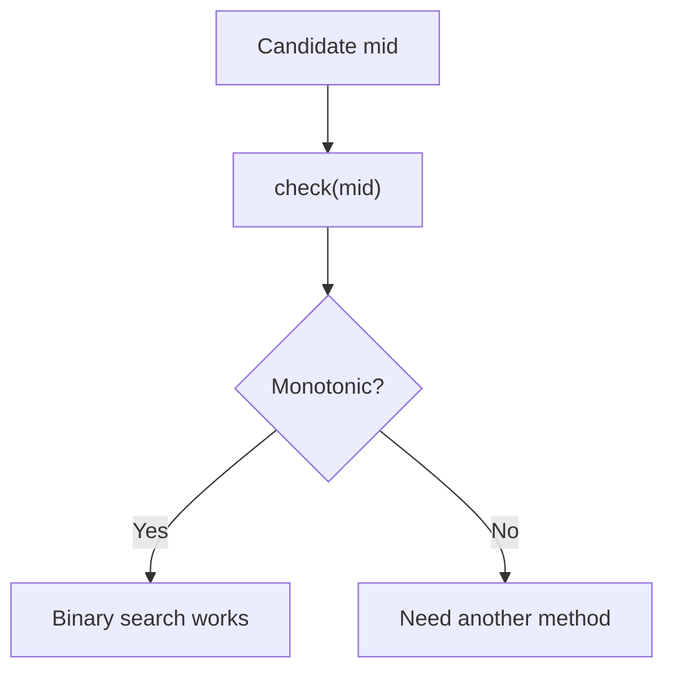

Good examples:

```text
Can finish within mid time?
Can split with maximum sum <= mid?
Can place k cows with distance >= mid?
Are there at least k values <= mid?
```

Bad example:

```text
Is mid exactly the answer?
```

---

## 1.4 First True Pattern

Use when the pattern is:

```text
false false false true true true
```

Goal:

```text
find first true
```

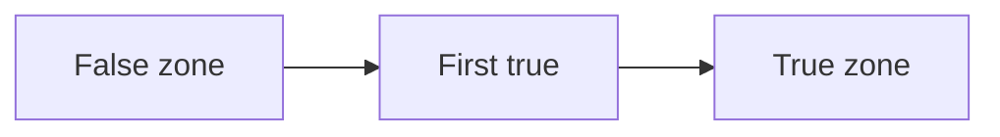

### C++

```cpp
long long firstTrue(long long lo, long long hi) {
    long long ans = hi + 1;

    while (lo <= hi) {
        long long mid = lo + (hi - lo) / 2;

        if (check(mid)) {
            ans = mid;
            hi = mid - 1;
        } else {
            lo = mid + 1;
        }
    }

    return ans;
}
```

Use for:

```text
minimum possible answer
lower_bound
minimum time
minimum maximum value
```

---

## 1.5 Last True Pattern

Use when the pattern is:

```text
true true true false false false
```

Goal:

```text
find last true
```

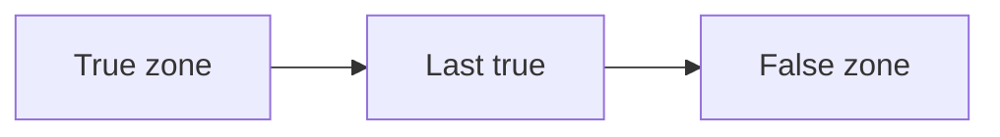

### C++

```cpp
long long lastTrue(long long lo, long long hi) {
    long long ans = lo - 1;

    while (lo <= hi) {
        long long mid = lo + (hi - lo) / 2;

        if (check(mid)) {
            ans = mid;
            lo = mid + 1;
        } else {
            hi = mid - 1;
        }
    }

    return ans;
}
```

Use for:

```text
maximum possible answer
maximum minimum distance
last valid index
```

---

## 1.6 Lower Bound and Upper Bound

### Lower Bound

First element greater than or equal to `x`.

```cpp
lower_bound(v.begin(), v.end(), x);
```

### Upper Bound

First element greater than `x`.

```cpp
upper_bound(v.begin(), v.end(), x);
```

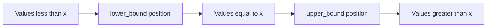

### Common counts

```cpp
int lessThanX = lower_bound(v.begin(), v.end(), x) - v.begin();

int lessOrEqualX = upper_bound(v.begin(), v.end(), x) - v.begin();

int equalX = upper_bound(v.begin(), v.end(), x)
           - lower_bound(v.begin(), v.end(), x);
```

---

## 1.7 Binary Search on Answer

This is the most important contest form.

Instead of searching an index, search the answer value.

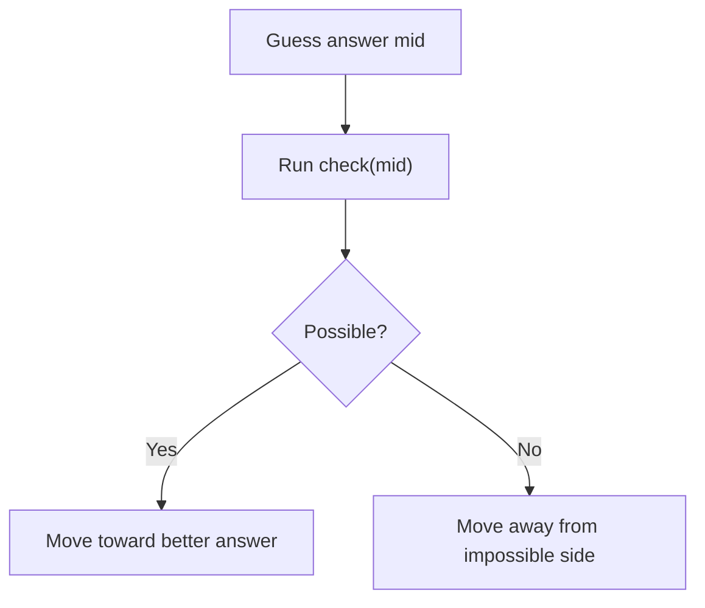

Common phrases:

```text
minimize maximum
maximize minimum
minimum time
maximum distance
kth smallest
can complete within X
at least K
at most K
```

---

## 1.8 Real-Valued Binary Search

Use when answer is decimal.

Integer binary search moves with:

```cpp
lo = mid + 1;
hi = mid - 1;
```

Real binary search moves with:

```cpp
lo = mid;
hi = mid;
```

because there is no next integer.

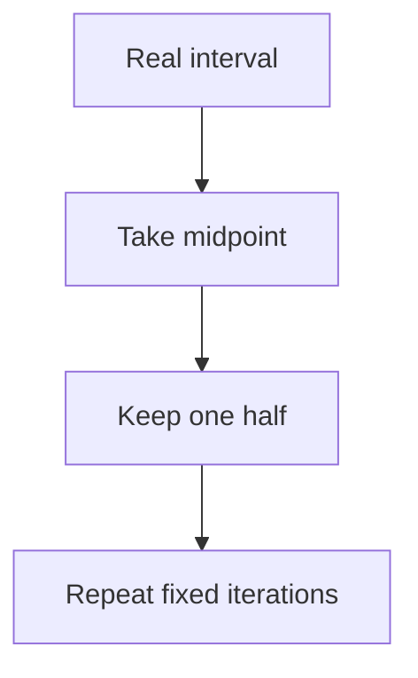

### C++

```cpp
long double realBinarySearch(long double lo, long double hi) {
    for (int it = 0; it < 100; it++) {
        long double mid = (lo + hi) / 2;

        if (check(mid)) {
            hi = mid;
        } else {
            lo = mid;
        }
    }

    return (lo + hi) / 2;
}
```

---

## 1.9 Ternary Search

Use for unimodal functions:

```text
increasing then decreasing
```

or:

```text
decreasing then increasing
```

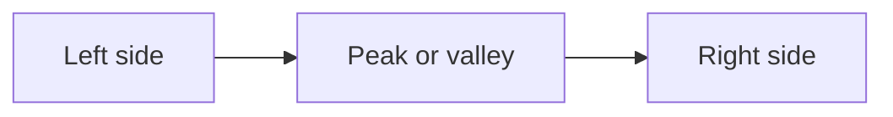

Binary search needs monotonic true/false.  
Ternary search needs hill/valley shape.

---

# 2. Frameworks

## 2.1 Binary Search Thinking Framework

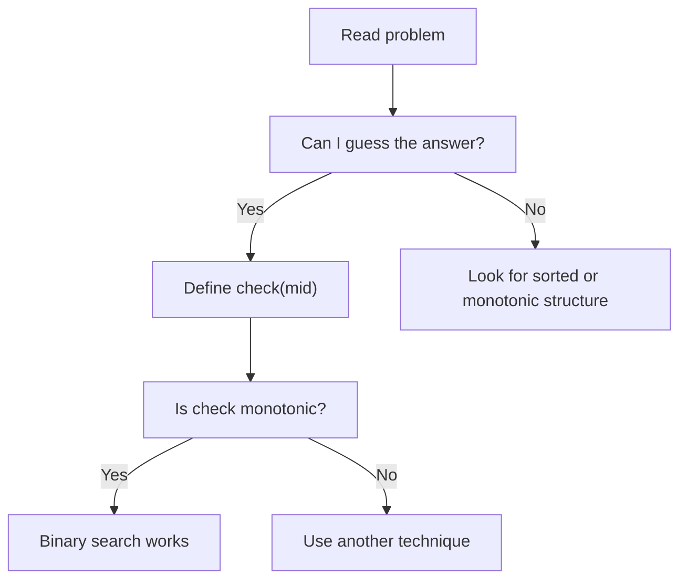

Mental trick:

```text
Optimization problem -> Decision problem
```

Instead of:

```text
What is the minimum answer?
```

Ask:

```text
Can answer be <= mid?
```

---

## 2.2 Search Space Framework

Every binary search needs:

```text
lo = smallest possible candidate
hi = largest possible candidate
```

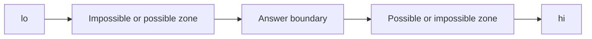

Examples:

| Problem | lo | hi |
|---|---:|---:|
| Painter partition | max element | sum of all elements |
| Factory machines | 0 | fastest machine times target |
| Aggressive cows | 0 | max coordinate minus min coordinate |
| Kth pair sum | minA plus minB | maxA plus maxB |
| Multiplication table | 1 | n times m |

---

## 2.3 Check Function Framework

A good check function has 3 parts:

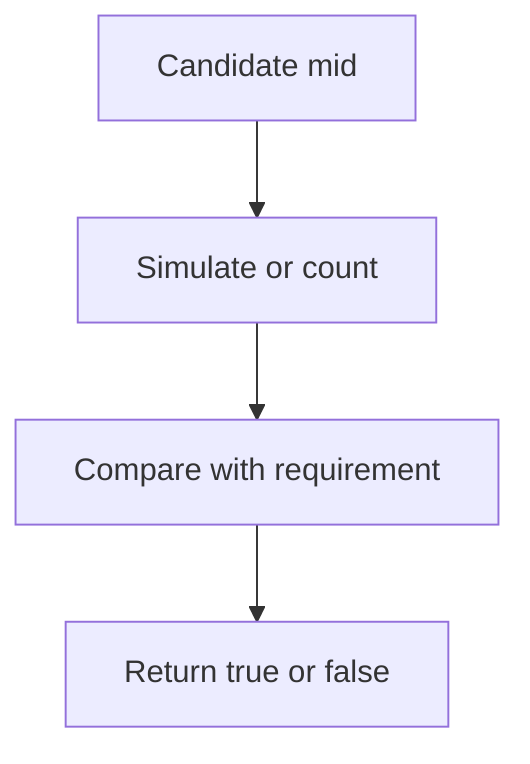

Checklist:

```text
1. What does mid mean?
2. What does true mean?
3. If true at mid, is it true for bigger or smaller values?
4. Is the check O(n), O(log n), or O(n log n)?
```

---

## 2.4 Minimize Maximum Framework

Common phrase:

```text
minimize the maximum value
```

Pattern:

```text
false false false true true true
```

Find first true.

Example:

```text
Can we keep maximum block sum <= mid?
```

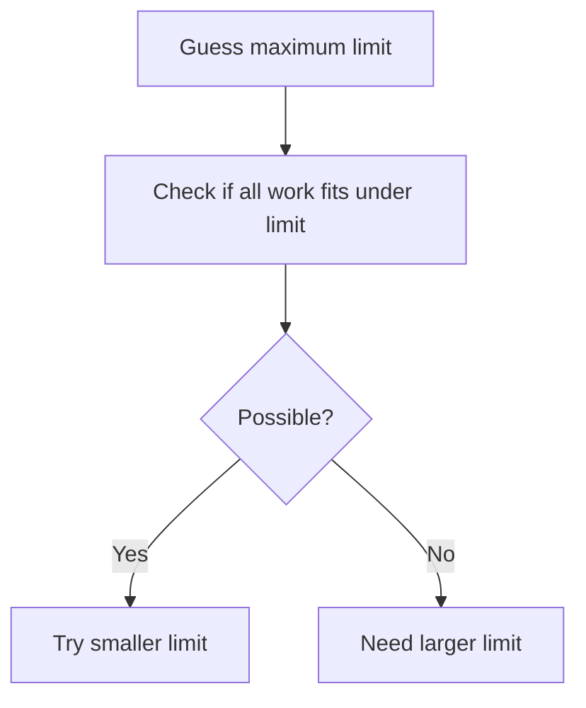

---

## 2.5 Maximize Minimum Framework

Common phrase:

```text
maximize the minimum value
```

Pattern:

```text
true true true false false false
```

Find last true.

Example:

```text
Can we place k cows with distance at least mid?
```

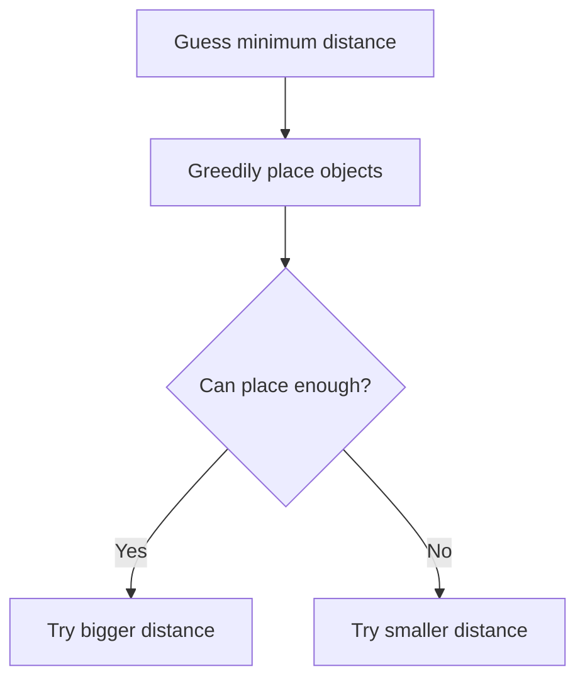

---

## 2.6 Kth Smallest Framework

Do not generate all values.

Guess value `x`, count how many generated values are `<= x`.

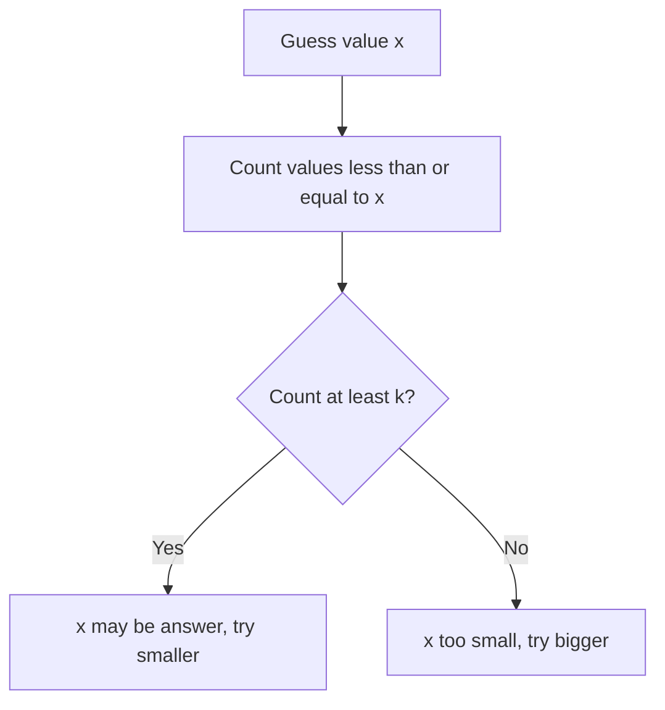

This is first true.

---

## 2.7 Per-Start Binary Search Framework

For every starting index, binary search the farthest valid ending index.

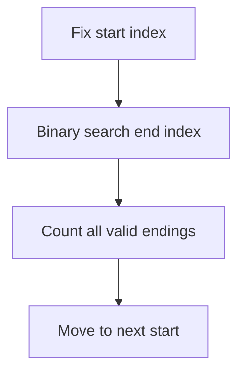

Useful when:
- validity is monotonic as end expands
- prefix sums can answer window property quickly

---

# 3. Problem Forms

## 3.1 Sorted Array Search

Find whether `x` exists in sorted array.

```cpp
bool exists(vector<int>& a, int x) {
    int lo = 0;
    int hi = (int)a.size() - 1;

    while (lo <= hi) {
        int mid = lo + (hi - lo) / 2;

        if (a[mid] == x) return true;
        if (a[mid] < x) lo = mid + 1;
        else hi = mid - 1;
    }

    return false;
}
```

---

## 3.2 First Element Greater or Equal

This is manual lower bound.

```cpp
int lowerBoundManual(vector<int>& a, int x) {
    int n = (int)a.size();
    int lo = 0;
    int hi = n - 1;
    int ans = n;

    while (lo <= hi) {
        int mid = lo + (hi - lo) / 2;

        if (a[mid] >= x) {
            ans = mid;
            hi = mid - 1;
        } else {
            lo = mid + 1;
        }
    }

    return ans;
}
```

---

## 3.3 Rotated Sorted Array

Find index of minimum element.

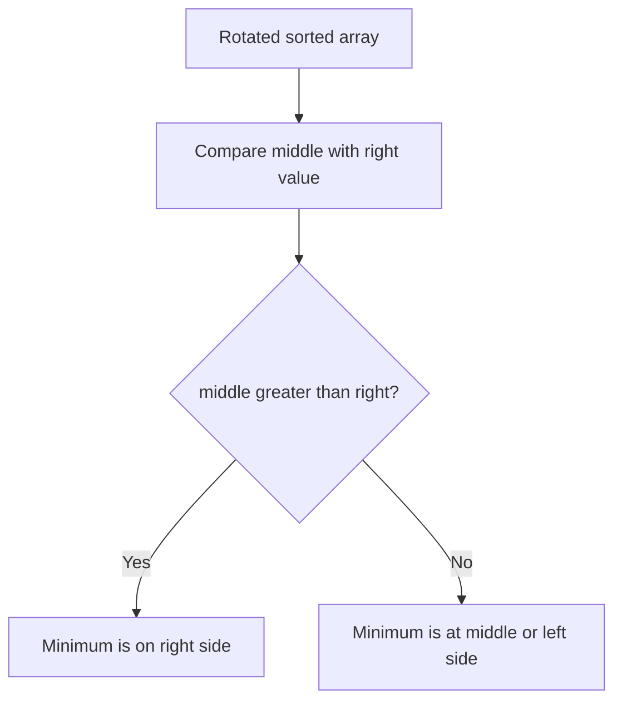

```cpp
int rotationCount(vector<int>& a) {
    int lo = 0;
    int hi = (int)a.size() - 1;

    while (lo < hi) {
        int mid = lo + (hi - lo) / 2;

        if (a[mid] > a[hi]) {
            lo = mid + 1;
        } else {
            hi = mid;
        }
    }

    return lo;
}
```

---

## 3.4 Peak in Bitonic Array

Bitonic means increasing then decreasing.

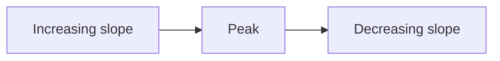

```cpp
int findPeak(vector<int>& a) {
    int lo = 0;
    int hi = (int)a.size() - 1;

    while (lo < hi) {
        int mid = lo + (hi - lo) / 2;

        if (a[mid] > a[mid + 1]) {
            hi = mid;
        } else {
            lo = mid + 1;
        }
    }

    return lo;
}
```

---

## 3.5 Painter Partition / Split Array Largest Sum

Problem:

```text
Split array into k continuous parts.
Minimize the maximum part sum.
```

### Intuition

If maximum allowed sum is small, maybe impossible.  
If maximum allowed sum is large, possible.

Pattern:

```text
false false false true true true
```

### Formulate

```text
mid = maximum allowed sum for one painter
check(mid) = can split into at most k groups?
```

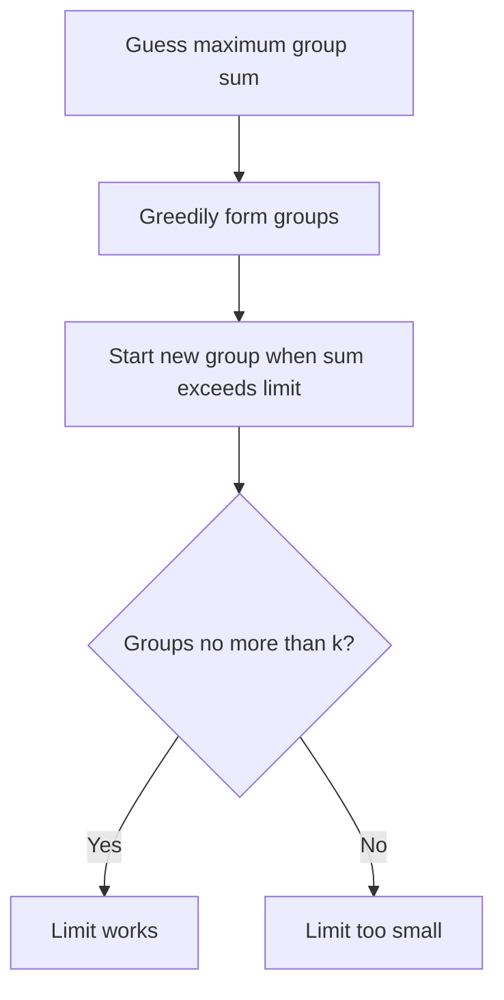

### C++

```cpp
bool canSplit(const vector<int>& a, int k, long long limit) {
    int groups = 1;
    long long current = 0;

    for (int x : a) {
        if (x > limit) return false;

        if (current + x <= limit) {
            current += x;
        } else {
            groups++;
            current = x;
        }
    }

    return groups <= k;
}

long long splitArrayLargestSum(vector<int>& a, int k) {
    long long lo = 0;
    long long hi = 0;

    for (int x : a) {
        lo = max(lo, (long long)x);
        hi += x;
    }

    long long ans = hi;

    while (lo <= hi) {
        long long mid = lo + (hi - lo) / 2;

        if (canSplit(a, k, mid)) {
            ans = mid;
            hi = mid - 1;
        } else {
            lo = mid + 1;
        }
    }

    return ans;
}
```

---

## 3.6 Factory Machines

Problem:

```text
Machines make products.
Machine i makes one product in time a[i].
Find minimum time to make target products.
```

### Formulate

```text
mid = guessed time
check(mid) = total products made by time mid >= target
```

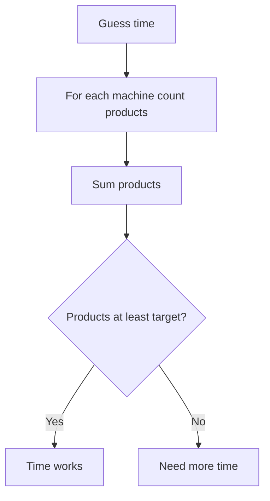

### C++

```cpp
bool canMake(const vector<long long>& machine, long long target, long long time) {
    long long made = 0;

    for (long long m : machine) {
        made += time / m;
        if (made >= target) return true;
    }

    return false;
}

long long minTime(vector<long long>& machine, long long target) {
    long long lo = 0;
    long long hi = *min_element(machine.begin(), machine.end()) * target;
    long long ans = hi;

    while (lo <= hi) {
        long long mid = lo + (hi - lo) / 2;

        if (canMake(machine, target, mid)) {
            ans = mid;
            hi = mid - 1;
        } else {
            lo = mid + 1;
        }
    }

    return ans;
}
```

---

## 3.7 Aggressive Cows

Problem:

```text
Place k cows in stalls.
Maximize minimum distance.
```

### Formulate

```text
mid = minimum required distance
check(mid) = can place at least k cows?
```

Pattern:

```text
true true true false false false
```

### C++

```cpp
bool canPlace(vector<long long>& pos, int k, long long dist) {
    int placed = 1;
    long long last = pos[0];

    for (int i = 1; i < (int)pos.size(); i++) {
        if (pos[i] - last >= dist) {
            placed++;
            last = pos[i];
        }
    }

    return placed >= k;
}

long long maximizeMinDistance(vector<long long>& pos, int k) {
    sort(pos.begin(), pos.end());

    long long lo = 0;
    long long hi = pos.back() - pos.front();
    long long ans = 0;

    while (lo <= hi) {
        long long mid = lo + (hi - lo) / 2;

        if (canPlace(pos, k, mid)) {
            ans = mid;
            lo = mid + 1;
        } else {
            hi = mid - 1;
        }
    }

    return ans;
}
```

---

## 3.8 Minimize Maximum Gap

Problem:

```text
Given points, add k extra points.
Minimize maximum adjacent gap.
```

### Formulate

```text
mid = allowed maximum gap
check(mid) = extra points needed <= k
```

For gap `d`, extra points needed:

```text
ceil(d / mid) - 1
```

Safe integer formula:

```text
(d + mid - 1) / mid - 1
```

### C++

```cpp
bool canLimitGap(vector<long long>& pos, long long k, long long x) {
    if (x == 0) return false;

    long long need = 0;

    for (int i = 1; i < (int)pos.size(); i++) {
        long long d = pos[i] - pos[i - 1];
        need += (d + x - 1) / x - 1;

        if (need > k) return false;
    }

    return need <= k;
}

long long minimizeMaxGap(vector<long long>& pos, long long k) {
    sort(pos.begin(), pos.end());

    long long lo = 1;
    long long hi = 0;

    for (int i = 1; i < (int)pos.size(); i++) {
        hi = max(hi, pos[i] - pos[i - 1]);
    }

    long long ans = hi;

    while (lo <= hi) {
        long long mid = lo + (hi - lo) / 2;

        if (canLimitGap(pos, k, mid)) {
            ans = mid;
            hi = mid - 1;
        } else {
            lo = mid + 1;
        }
    }

    return ans;
}
```

---

## 3.9 Kth Pair Sum

Problem:

```text
A and B are arrays.
C contains all values A[i] + B[j].
Find kth smallest value in C.
```

Do not build C.

### Formulate

```text
mid = guessed pair sum
check(mid) = count of pair sums <= mid is at least k
```

```mermaid
flowchart TD
    A["Guess value"] --> B["For each element in A"]
    B --> C["Count valid elements in B using upper_bound"]
    C --> D{"Total count at least k?"}
    D -->|"Yes"| E["Try smaller value"]
    D -->|"No"| F["Try bigger value"]
```

### C++

```cpp
long long countPairsLE(
    const vector<long long>& A,
    const vector<long long>& B,
    long long x
) {
    long long count = 0;

    for (long long a : A) {
        count += upper_bound(B.begin(), B.end(), x - a) - B.begin();
    }

    return count;
}

long long kthPairSum(vector<long long> A, vector<long long> B, long long k) {
    sort(A.begin(), A.end());
    sort(B.begin(), B.end());

    if (A.size() > B.size()) swap(A, B);

    long long lo = A.front() + B.front();
    long long hi = A.back() + B.back();
    long long ans = hi;

    while (lo <= hi) {
        long long mid = lo + (hi - lo) / 2;

        if (countPairsLE(A, B, mid) >= k) {
            ans = mid;
            hi = mid - 1;
        } else {
            lo = mid + 1;
        }
    }

    return ans;
}
```

---

## 3.10 Kth in Multiplication Table

Problem:

```text
Find kth smallest value in n by m multiplication table.
```

### Formulate

```text
mid = guessed table value
check(mid) = count values <= mid is at least k
```

For row `i`:

```text
count = min(m, mid / i)
```

### C++

```cpp
long long countLEInTable(long long n, long long m, long long x) {
    long long count = 0;

    for (long long i = 1; i <= n; i++) {
        count += min(m, x / i);
    }

    return count;
}

long long kthInMultiplicationTable(long long n, long long m, long long k) {
    long long lo = 1;
    long long hi = n * m;
    long long ans = hi;

    while (lo <= hi) {
        long long mid = lo + (hi - lo) / 2;

        if (countLEInTable(n, m, mid) >= k) {
            ans = mid;
            hi = mid - 1;
        } else {
            lo = mid + 1;
        }
    }

    return ans;
}
```

---

## 3.11 Subarray Length with Prefix

Problem:

```text
Binary array.
Can flip at most k zeros.
Find largest all-one subarray.
```

### Formulate

```text
mid = guessed length
check(mid) = exists window of length mid with zeros <= k
```

```mermaid
flowchart TD
    A["Guess length"] --> B["Check every window"]
    B --> C["Use prefix zeros"]
    C --> D{"Any window valid?"}
    D -->|"Yes"| E["Length works"]
    D -->|"No"| F["Length too large"]
```

### C++

```cpp
bool canMakeOnes(const vector<int>& a, int k, int len) {
    int n = a.size();

    vector<int> pref(n + 1, 0);
    for (int i = 0; i < n; i++) {
        pref[i + 1] = pref[i] + (a[i] == 0);
    }

    for (int l = 0; l + len <= n; l++) {
        int r = l + len;
        int zeros = pref[r] - pref[l];

        if (zeros <= k) return true;
    }

    return false;
}
```

Note: This can often be optimized with sliding window.

---

## 3.12 Sum of Cubes

Problem:

```text
Check if x = a^3 + b^3
```

### Formulate

Fix `a`, binary search or compute cube root for remaining value.

```mermaid
flowchart TD
    A["Choose a"] --> B["remaining equals x minus a cubed"]
    B --> C["Find cube root of remaining"]
    C --> D{"Perfect cube?"}
    D -->|"Yes"| E["Answer yes"]
    D -->|"No"| F["Try next a"]
```

### Overflow-safe cube root

```cpp
long long cubeRootFloor(long long x) {
    long long lo = 1;
    long long hi = 1000000;
    long long ans = 0;

    while (lo <= hi) {
        long long mid = lo + (hi - lo) / 2;

        if (mid <= x / mid / mid) {
            ans = mid;
            lo = mid + 1;
        } else {
            hi = mid - 1;
        }
    }

    return ans;
}
```

---

# 4. Tactics

## 4.1 Pattern Recognition

| Phrase in problem | Think |
|---|---|
| sorted array | classic binary search |
| first greater or equal | lower bound |
| first greater | upper bound |
| minimum possible value | first true |
| maximum possible value | last true |
| minimize maximum | binary search on answer |
| maximize minimum | binary search on answer |
| minimum time | binary search on answer |
| kth smallest | count values less or equal |
| decimal answer | real binary search |
| hill or valley function | ternary search |

---

## 4.2 Bounds Tactics

Good bounds make binary search easy.

```mermaid
flowchart TD
    A["Find lo"] --> B["Smallest possible candidate"]
    C["Find hi"] --> D["Largest possible candidate"]
    B --> E["Run binary search"]
    D --> E
```

Common bounds:

```text
lo = 0 or 1
hi = max value
hi = sum of values
hi = fastest time * target
hi = maximum coordinate gap
```

---

## 4.3 Check Function Tactics

A good `check(mid)` should answer:

```text
Is mid enough?
Is mid possible?
Can we do it within mid?
Can we achieve at least mid?
Are there at least k values <= mid?
```

```mermaid
flowchart TD
    A["mid"] --> B["Interpret mid"]
    B --> C["Simulate or count"]
    C --> D["Compare to requirement"]
    D --> E["Return true or false"]
```

---

## 4.4 Overflow Tactics

Use:

```cpp
long long mid = lo + (hi - lo) / 2;
```

For multiplication check:

```cpp
mid <= x / mid / mid
```

instead of:

```cpp
mid * mid * mid <= x
```

---

## 4.5 Infinite Loop Tactics

For integer binary search:

```cpp
lo = mid + 1;
hi = mid - 1;
```

Do not do this in integer binary search:

```cpp
lo = mid;
hi = mid;
```

unless using a special half-open template.

---

## 4.6 Precision Tactics

For real-valued answers:

```cpp
for (int it = 0; it < 100; it++)
```

is often safer than EPS.

Output with:

```cpp
cout << fixed << setprecision(10) << ans << '\n';
```

---

# 5. C++ Template Library

## 5.1 First True

```cpp
long long firstTrue(long long lo, long long hi) {
    long long ans = hi + 1;

    while (lo <= hi) {
        long long mid = lo + (hi - lo) / 2;

        if (check(mid)) {
            ans = mid;
            hi = mid - 1;
        } else {
            lo = mid + 1;
        }
    }

    return ans;
}
```

---

## 5.2 Last True

```cpp
long long lastTrue(long long lo, long long hi) {
    long long ans = lo - 1;

    while (lo <= hi) {
        long long mid = lo + (hi - lo) / 2;

        if (check(mid)) {
            ans = mid;
            lo = mid + 1;
        } else {
            hi = mid - 1;
        }
    }

    return ans;
}
```

---

## 5.3 Half-Open Lower Bound

```cpp
int lowerBound(vector<int>& a, int x) {
    int lo = 0;
    int hi = a.size();

    while (lo < hi) {
        int mid = lo + (hi - lo) / 2;

        if (a[mid] >= x) {
            hi = mid;
        } else {
            lo = mid + 1;
        }
    }

    return lo;
}
```

---

## 5.4 Half-Open Upper Bound

```cpp
int upperBound(vector<int>& a, int x) {
    int lo = 0;
    int hi = a.size();

    while (lo < hi) {
        int mid = lo + (hi - lo) / 2;

        if (a[mid] > x) {
            hi = mid;
        } else {
            lo = mid + 1;
        }
    }

    return lo;
}
```

---

## 5.5 Real Binary Search

```cpp
long double realBinarySearch(long double lo, long double hi) {
    for (int it = 0; it < 100; it++) {
        long double mid = (lo + hi) / 2;

        if (check(mid)) {
            hi = mid;
        } else {
            lo = mid;
        }
    }

    return (lo + hi) / 2;
}
```

---

## 5.6 Ternary Search for Minimum

```cpp
long double ternarySearch(long double lo, long double hi) {
    for (int it = 0; it < 200; it++) {
        long double m1 = lo + (hi - lo) / 3;
        long double m2 = hi - (hi - lo) / 3;

        if (f(m1) < f(m2)) {
            hi = m2;
        } else {
            lo = m1;
        }
    }

    return f((lo + hi) / 2);
}
```

---

# 6. Final Checklist

Before coding, ask:

```text
1. What is the answer type?
2. Can I guess the answer?
3. What is lo?
4. What is hi?
5. What does check(mid) mean?
6. Is check monotonic?
7. Is this first true or last true?
8. Can mid overflow?
9. Can check overflow?
10. Are there boundary cases?
```

---

# 7. Final Memory Hooks

```text
Binary search = find boundary.

First true:
    false false false true true true

Last true:
    true true true false false false

Optimization:
    convert to decision.

Kth smallest:
    count values <= mid.

Minimize maximum:
    first true.

Maximize minimum:
    last true.

The hard part:
    check(mid), not the while loop.
```

---

END
