# Two Pointers & Sliding Window Problem Solving Playbook

> A structured competitive-programming guide for solving **Two Pointers** and **Sliding Window** problems.
>
> Goal: recognize the form, choose the right pointer movement rule, maintain the right window state, and solve in `O(n)` or `O(n log n)`.

---

# Clickable Index

- [0. Master Map](#0-master-map)
- [1. Concepts](#1-concepts)
  - [1.1 What Two Pointers Means](#11-what-two-pointers-means)
  - [1.2 Sliding Window vs Two Pointers](#12-sliding-window-vs-two-pointers)
  - [1.3 Opposite Ends](#13-opposite-ends)
  - [1.4 Same Direction Window](#14-same-direction-window)
  - [1.5 Fixed Size Window](#15-fixed-size-window)
  - [1.6 Variable Size Window](#16-variable-size-window)
  - [1.7 Multi-List Traversal](#17-multi-list-traversal)
  - [1.8 Fix One Then Two Pointers](#18-fix-one-then-two-pointers)
  - [1.9 Monotonic Window Property](#19-monotonic-window-property)
- [2. Frameworks](#2-frameworks)
  - [2.1 Pattern Selection Framework](#21-pattern-selection-framework)
  - [2.2 Opposite Ends Framework](#22-opposite-ends-framework)
  - [2.3 Expand-Shrink Window Framework](#23-expand-shrink-window-framework)
  - [2.4 Head-Tail Maximal Window Framework](#24-head-tail-maximal-window-framework)
  - [2.5 Count Subarrays Framework](#25-count-subarrays-framework)
  - [2.6 Exact K via At Most Framework](#26-exact-k-via-at-most-framework)
  - [2.7 Multi-List Merge Framework](#27-multi-list-merge-framework)
  - [2.8 Sort-Fix-Search Framework](#28-sort-fix-search-framework)
- [3. Problem Forms](#3-problem-forms)
  - [3.1 Two Sum in Sorted Array](#31-two-sum-in-sorted-array)
  - [3.2 Palindrome Check](#32-palindrome-check)
  - [3.3 Container With Most Water](#33-container-with-most-water)
  - [3.4 Remove Duplicates from Sorted Array](#34-remove-duplicates-from-sorted-array)
  - [3.5 Merge Two Sorted Arrays](#35-merge-two-sorted-arrays)
  - [3.6 Longest Subarray With At Most K Zeros](#36-longest-subarray-with-at-most-k-zeros)
  - [3.7 Minimum Size Subarray Sum](#37-minimum-size-subarray-sum)
  - [3.8 Count Subarrays With Sum Less Than K](#38-count-subarrays-with-sum-less-than-k)
  - [3.9 Count Subarrays With At Most K Distinct](#39-count-subarrays-with-at-most-k-distinct)
  - [3.10 Count Subarrays With Exactly K Distinct](#310-count-subarrays-with-exactly-k-distinct)
  - [3.11 Longest Substring Without Repeating Characters](#311-longest-substring-without-repeating-characters)
  - [3.12 Minimum Window Substring](#312-minimum-window-substring)
  - [3.13 Subsequence Check](#313-subsequence-check)
  - [3.14 Intersection of Two Sorted Lists](#314-intersection-of-two-sorted-lists)
  - [3.15 Three Sum](#315-three-sum)
  - [3.16 Four Sum Pattern](#316-four-sum-pattern)
  - [3.17 Count Pairs With Difference K](#317-count-pairs-with-difference-k)
  - [3.18 Trapping Rain Water Two-Pointer Version](#318-trapping-rain-water-two-pointer-version)
  - [3.19 Sliding Window Maximum](#319-sliding-window-maximum)
  - [3.20 Sliding Window Median](#320-sliding-window-median)
- [4. Tactics](#4-tactics)
- [5. C++ Template Library](#5-c-template-library)
- [6. Final Checklist](#6-final-checklist)
- [7. Memory Hooks](#7-memory-hooks)

---

# 0. Master Map

```mermaid
flowchart TD
    A["Two Pointers and Sliding Window"] --> B["Concepts"]
    A --> C["Frameworks"]
    A --> D["Problem Forms"]
    A --> E["Tactics"]
    A --> F["C++ Templates"]

    B --> B1["Opposite Ends"]
    B --> B2["Same Direction"]
    B --> B3["Fixed Window"]
    B --> B4["Variable Window"]
    B --> B5["Multi-List Traversal"]

    C --> C1["Expand and Shrink"]
    C --> C2["Move Smaller or Larger Side"]
    C --> C3["Count Valid Windows"]
    C --> C4["Exact K from At Most K"]

    D --> D1["Pair Problems"]
    D --> D2["Subarray Problems"]
    D --> D3["Substring Problems"]
    D --> D4["K Sum Problems"]
    D --> D5["Merge Problems"]

    E --> E1["Pointer Movement"]
    E --> E2["Frequency State"]
    E --> E3["Duplicate Handling"]
    E --> E4["Monotonic Conditions"]
```

---

# 1. Concepts

## 1.1 What Two Pointers Means

Two pointers means using two indices that move intelligently so we avoid brute force.

```text
Brute force: try all pairs or all subarrays
Two pointers: move left, right, head, tail, i, j based on a rule
```

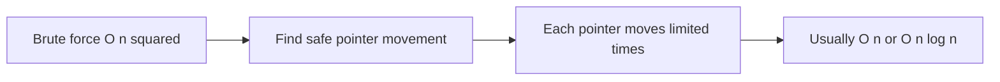

Core question:

```text
Which side can I safely discard?
```

---

## 1.2 Sliding Window vs Two Pointers

Sliding window is a specific form of two pointers focused on a contiguous subarray or substring.

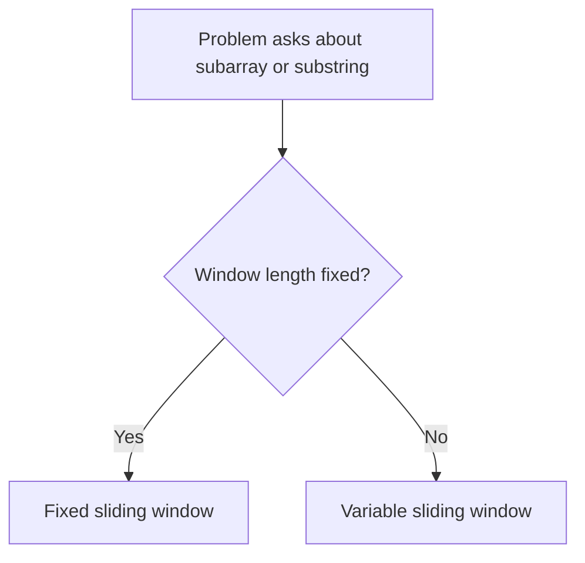

| Type | Meaning |
|---|---|
| Two pointers | General two-index technique |
| Sliding window | Two pointers over a contiguous range |
| Fixed window | Window size stays `k` |
| Variable window | Window expands and shrinks |

---

## 1.3 Opposite Ends

Pointers start at both ends.

```text
l = 0
r = n - 1
```

Used for:

- sorted pair sum
- palindrome
- container with most water
- trapping rain water
- partitioning

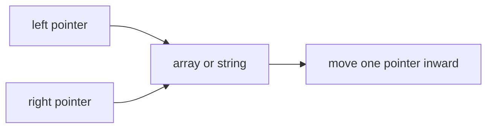

---

## 1.4 Same Direction Window

Both pointers move forward.

```text
tail <= head
```

Used for:

- longest valid subarray
- shortest valid subarray
- count subarrays
- at most K distinct
- at most K zeros
- substrings with frequency constraints

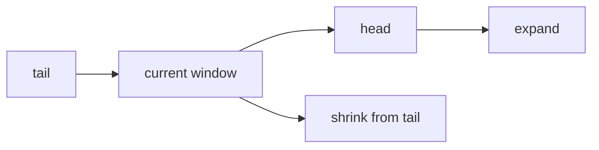

---

## 1.5 Fixed Size Window

Window size is exactly `k`.

```text
add new right element
remove old left element
answer current window
```

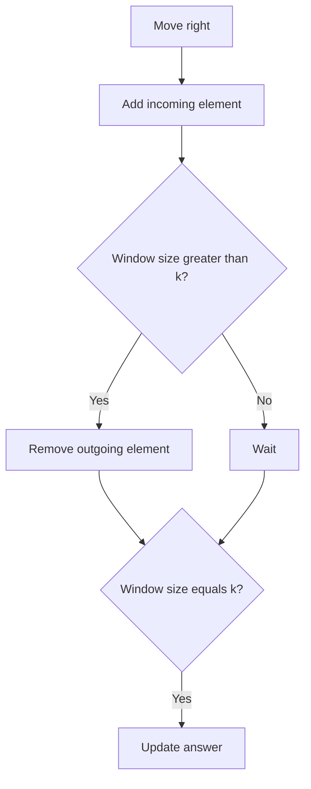

---

## 1.6 Variable Size Window

Window size changes according to validity.

```text
expand while valid or until invalid
shrink until valid again
```

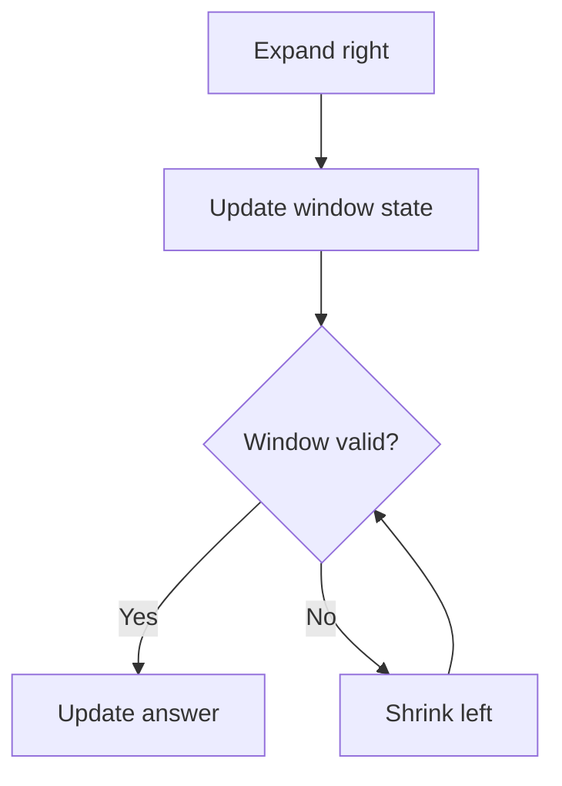

---

## 1.7 Multi-List Traversal

Use one pointer per list.

Used for:

- merging sorted arrays
- intersection of sorted arrays
- subsequence check
- comparing strings
- matching sequences

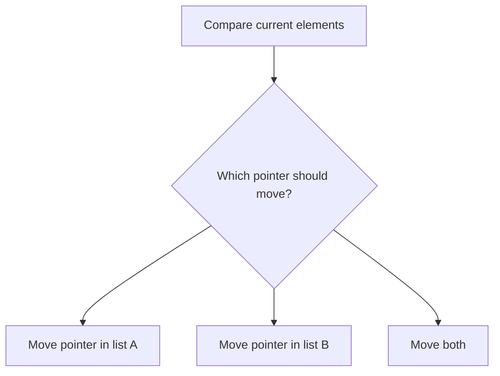

---

## 1.8 Fix One Then Two Pointers

For 3Sum and higher `k`-sum problems:

```text
sort
fix one element
solve remaining pair problem with two pointers
```

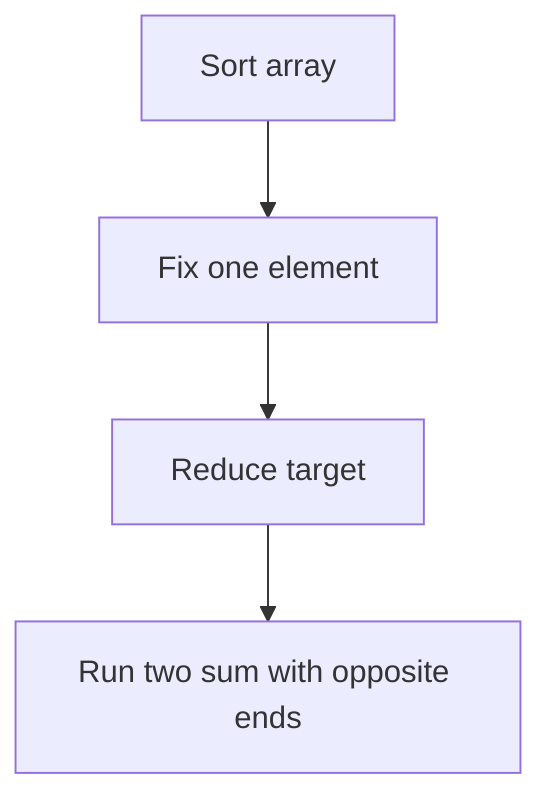

---

## 1.9 Monotonic Window Property

Sliding window usually needs a property that changes predictably as the window expands.

| Property | Expanding right does what? |
|---|---|
| sum of positive numbers | never decreases |
| number of zeros | never decreases unless left moves |
| distinct count | increases or stays |
| frequency violation | can be fixed by moving left |

If the condition is not monotonic, sliding window may fail.

---

# 2. Frameworks

## 2.1 Pattern Selection Framework

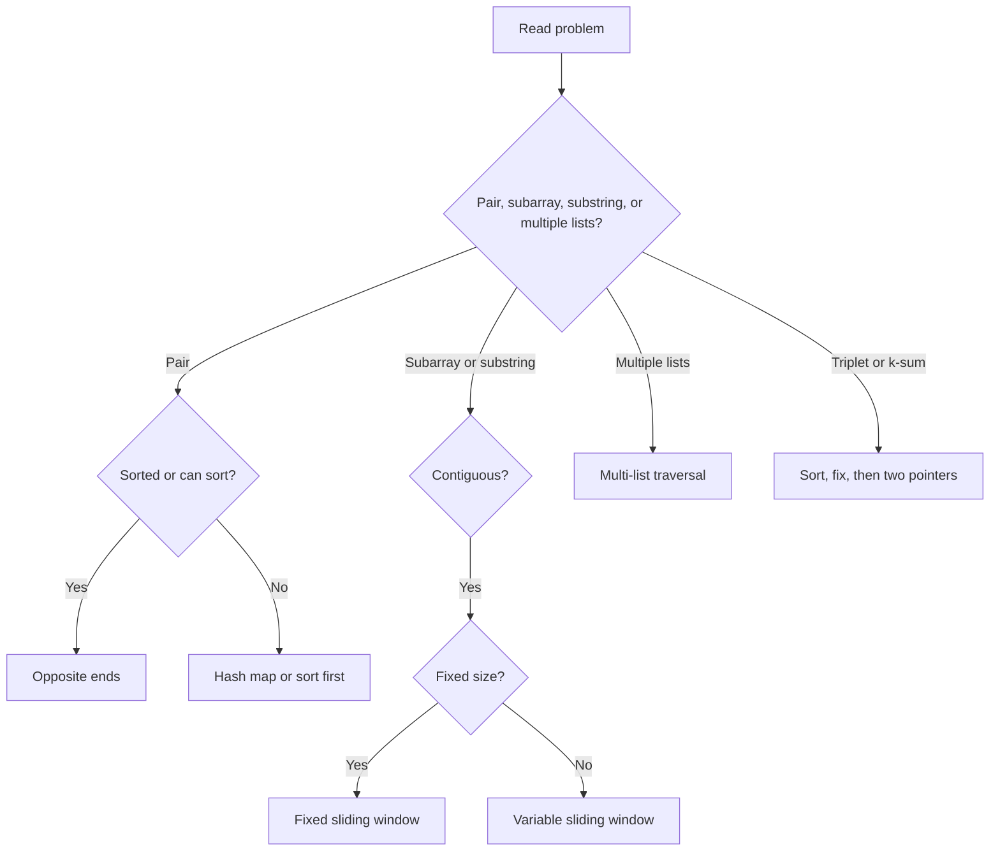

---

## 2.2 Opposite Ends Framework

Use when sorted order lets you discard one side.

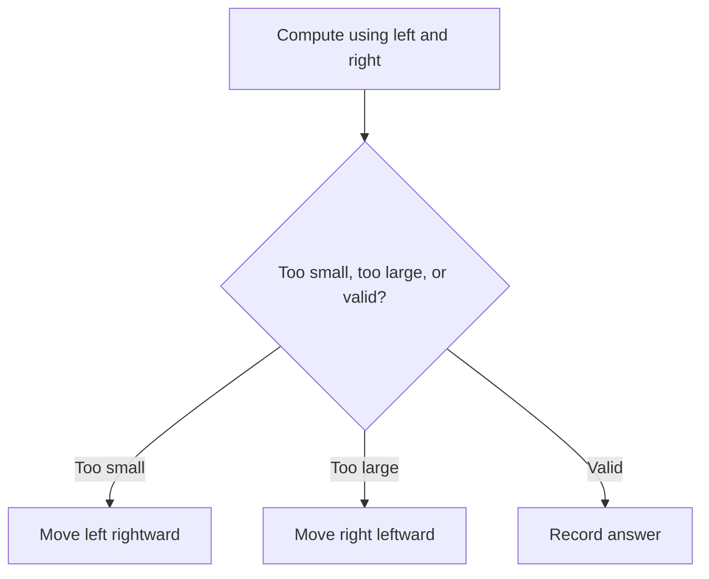

Template idea:

```cpp
int l = 0;
int r = n - 1;

while (l < r) {
    // evaluate a[l], a[r]
    // move l or r based on rule
}
```

---

## 2.3 Expand-Shrink Window Framework

Most common variable sliding window.

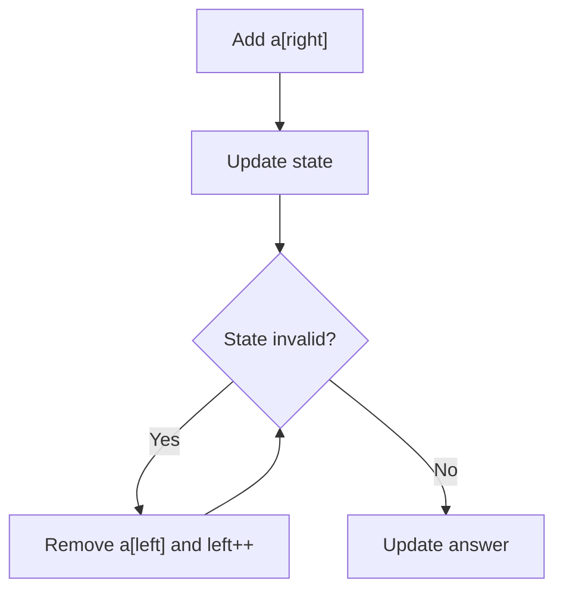

Template idea:

```cpp
int left = 0;

for (int right = 0; right < n; right++) {
    add(a[right]);

    while (invalid()) {
        remove(a[left]);
        left++;
    }

    updateAnswer(left, right);
}
```

---

## 2.4 Head-Tail Maximal Window Framework

Use when for each `tail`, you want farthest valid `head`.

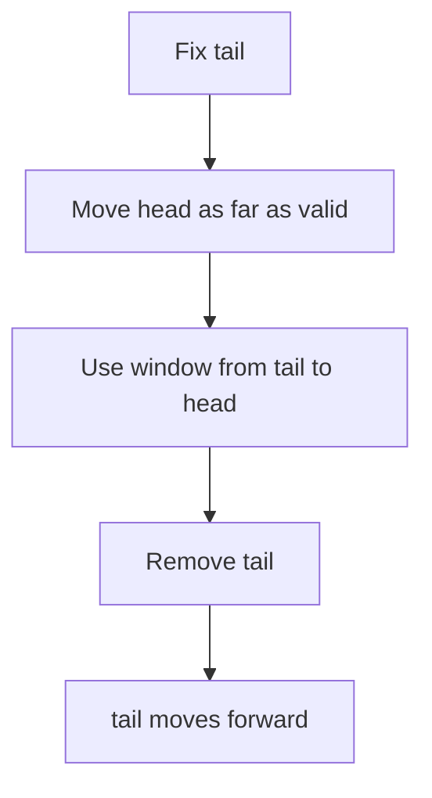

Useful for:

- count subarrays
- maximal valid segment
- at most K distinct
- at most K zeros

---

## 2.5 Count Subarrays Framework

If window `[left, right]` is valid and all subwindows ending at `right` are also valid:

```text
add right - left + 1
```

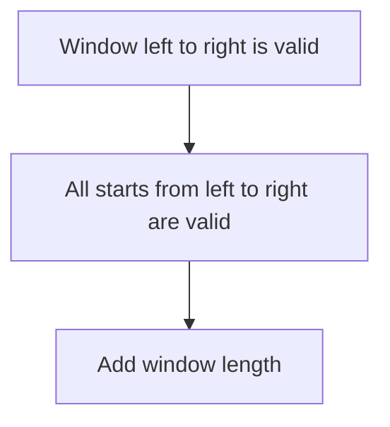

Example:

```cpp
ans += right - left + 1;
```

---

## 2.6 Exact K via At Most Framework

Exact conditions are often hard.

Use:

```text
exactly K = atMost(K) - atMost(K - 1)
```

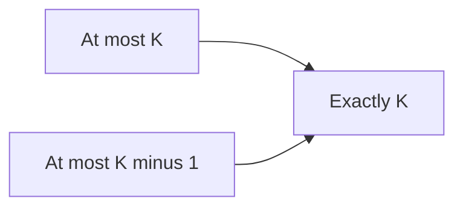

Works for:

- exactly K distinct
- exactly K zeros
- exactly K odd numbers
- exactly K consonants
- exactly K different values

---

## 2.7 Multi-List Merge Framework

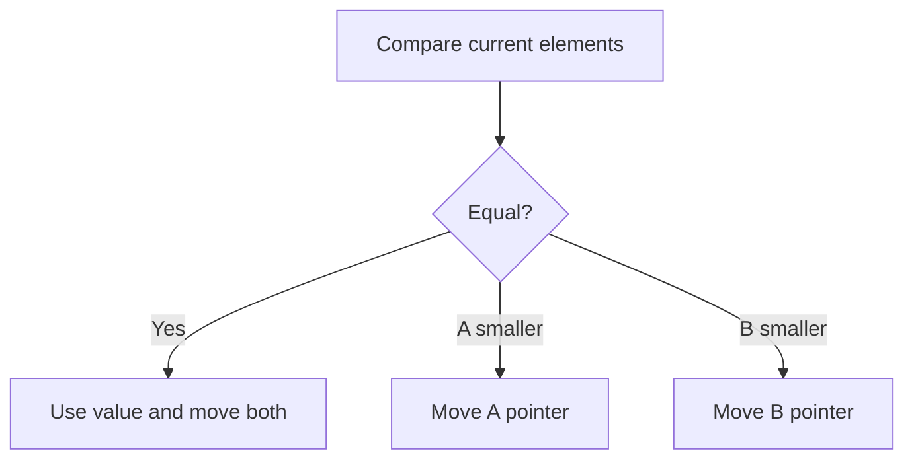

Used when both lists are sorted or ordered.

---

## 2.8 Sort-Fix-Search Framework

For `kSum`:

```text
sort
fix one or more elements
solve 2Sum on remaining range
skip duplicates
```

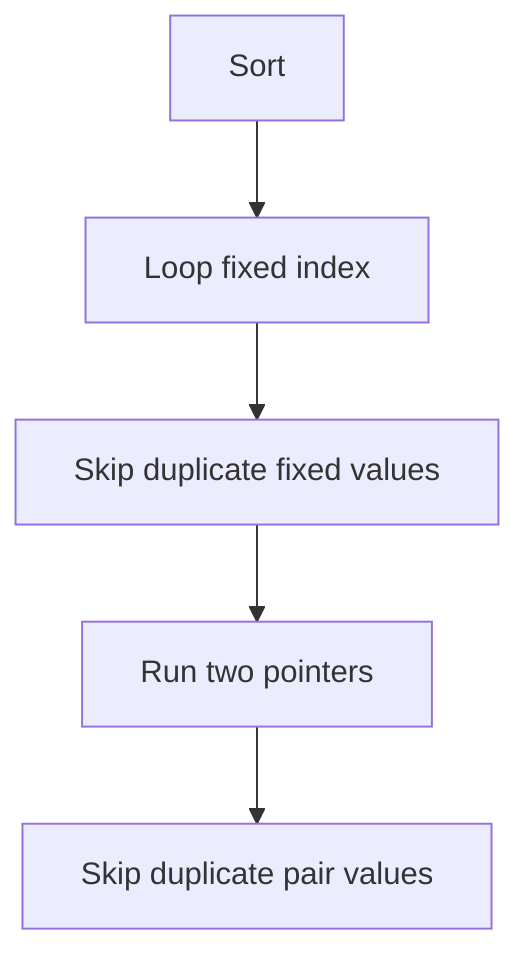

---

# 3. Problem Forms

## 3.1 Two Sum in Sorted Array

### Intuition

If sum is too small, increase it by moving `left`.
If sum is too large, decrease it by moving `right`.

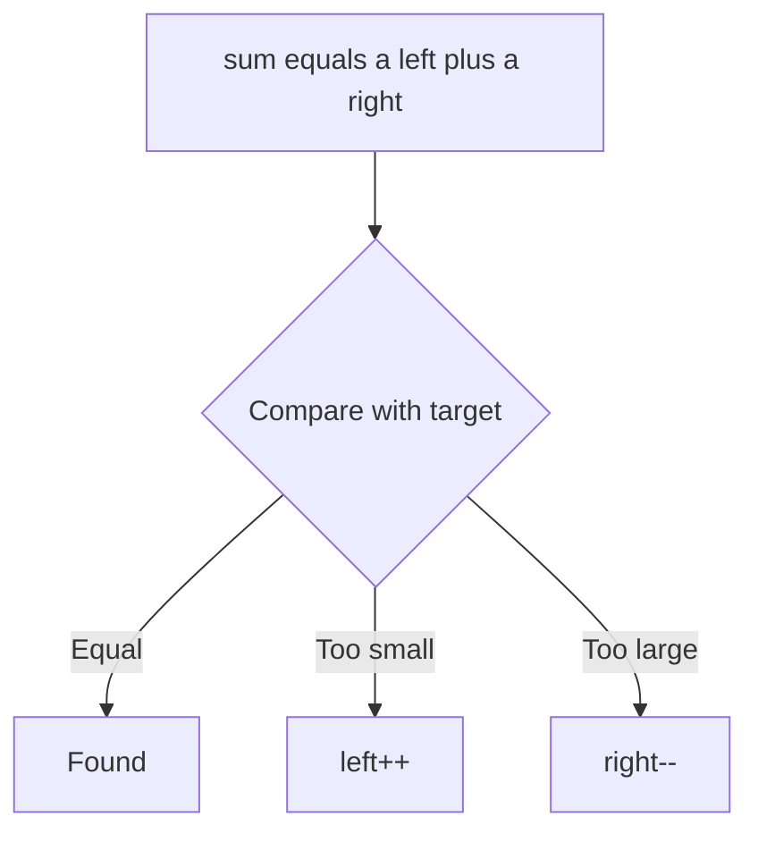

### C++

```cpp
bool twoSumSorted(vector<int>& a, int target) {
    int l = 0;
    int r = (int)a.size() - 1;

    while (l < r) {
        long long sum = (long long)a[l] + a[r];

        if (sum == target) return true;
        if (sum < target) l++;
        else r--;
    }

    return false;
}
```

---

## 3.2 Palindrome Check

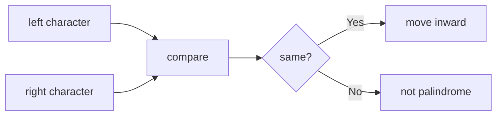

### C++

```cpp
bool isPalindrome(const string& s) {
    int l = 0;
    int r = (int)s.size() - 1;

    while (l < r) {
        if (s[l] != s[r]) return false;
        l++;
        r--;
    }

    return true;
}
```

---

## 3.3 Container With Most Water

### Intuition

Area is limited by the shorter wall.  
Move the shorter wall because moving the taller wall cannot improve the height limit while width shrinks.

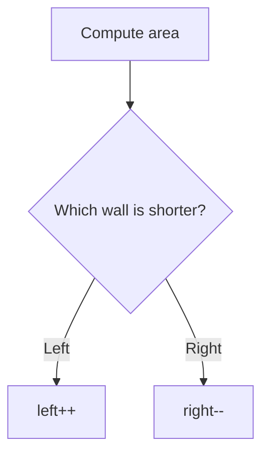

### C++

```cpp
int maxArea(vector<int>& height) {
    int l = 0;
    int r = (int)height.size() - 1;
    int ans = 0;

    while (l < r) {
        int width = r - l;
        int h = min(height[l], height[r]);
        ans = max(ans, width * h);

        if (height[l] < height[r]) l++;
        else r--;
    }

    return ans;
}
```

---

## 3.4 Remove Duplicates from Sorted Array

Use slow and fast pointers.

```mermaid
flowchart TD
    A["fast scans array"] --> B{"new unique value?"}
    B -->|"Yes"| C["write at slow"]
    B -->|"No"| D["skip"]
```

### C++

```cpp
int removeDuplicates(vector<int>& a) {
    if (a.empty()) return 0;

    int slow = 1;

    for (int fast = 1; fast < (int)a.size(); fast++) {
        if (a[fast] != a[fast - 1]) {
            a[slow] = a[fast];
            slow++;
        }
    }

    return slow;
}
```

---

## 3.5 Merge Two Sorted Arrays

```mermaid
flowchart TD
    A["Compare a i and b j"] --> B{"Which is smaller?"}
    B -->|"a i"| C["push a i and i++"]
    B -->|"b j"| D["push b j and j++"]
```

### C++

```cpp
vector<int> mergeSorted(vector<int>& a, vector<int>& b) {
    int i = 0;
    int j = 0;
    vector<int> ans;

    while (i < (int)a.size() && j < (int)b.size()) {
        if (a[i] <= b[j]) {
            ans.push_back(a[i]);
            i++;
        } else {
            ans.push_back(b[j]);
            j++;
        }
    }

    while (i < (int)a.size()) ans.push_back(a[i++]);
    while (j < (int)b.size()) ans.push_back(b[j++]);

    return ans;
}
```

---

## 3.6 Longest Subarray With At Most K Zeros

```mermaid
flowchart TD
    A["Move right"] --> B["Add zero count if needed"]
    B --> C{"zeros greater than k?"}
    C -->|"Yes"| D["Move left until valid"]
    C -->|"No"| E["Update answer"]
    D --> E
```

### C++

```cpp
int longestOnes(vector<int>& a, int k) {
    int left = 0;
    int zeros = 0;
    int ans = 0;

    for (int right = 0; right < (int)a.size(); right++) {
        if (a[right] == 0) zeros++;

        while (zeros > k) {
            if (a[left] == 0) zeros--;
            left++;
        }

        ans = max(ans, right - left + 1);
    }

    return ans;
}
```

---

## 3.7 Minimum Size Subarray Sum

Works when all numbers are positive.

Problem:

```text
Find shortest subarray with sum >= target.
```

```mermaid
flowchart TD
    A["Expand right and add sum"] --> B{"sum at least target?"}
    B -->|"Yes"| C["Update minimum length"]
    C --> D["Shrink left"]
    D --> B
    B -->|"No"| E["Continue expanding"]
```

### C++

```cpp
int minSubarrayLen(int target, vector<int>& a) {
    int n = a.size();
    int left = 0;
    long long sum = 0;
    int ans = n + 1;

    for (int right = 0; right < n; right++) {
        sum += a[right];

        while (sum >= target) {
            ans = min(ans, right - left + 1);
            sum -= a[left];
            left++;
        }
    }

    return ans == n + 1 ? 0 : ans;
}
```

---

## 3.8 Count Subarrays With Sum Less Than K

Works when all numbers are positive.

```mermaid
flowchart TD
    A["Add right value"] --> B{"sum greater or equal k?"}
    B -->|"Yes"| C["remove left"]
    C --> B
    B -->|"No"| D["add window length"]
```

### C++

```cpp
long long countSubarraysSumLessThanK(vector<int>& a, long long k) {
    int left = 0;
    long long sum = 0;
    long long ans = 0;

    for (int right = 0; right < (int)a.size(); right++) {
        sum += a[right];

        while (left <= right && sum >= k) {
            sum -= a[left];
            left++;
        }

        ans += right - left + 1;
    }

    return ans;
}
```

Warning: if negative numbers exist, this sliding window logic may fail.

---

## 3.9 Count Subarrays With At Most K Distinct

```mermaid
flowchart TD
    A["Add right value"] --> B["Update frequency"]
    B --> C{"distinct greater than k?"}
    C -->|"Yes"| D["Remove left value"]
    D --> C
    C -->|"No"| E["Add right minus left plus one"]
```

### C++

```cpp
long long countAtMostKDistinct(vector<int>& a, int k) {
    if (k < 0) return 0;

    unordered_map<int, int> freq;
    int left = 0;
    int distinct = 0;
    long long ans = 0;

    for (int right = 0; right < (int)a.size(); right++) {
        if (freq[a[right]] == 0) distinct++;
        freq[a[right]]++;

        while (distinct > k) {
            freq[a[left]]--;
            if (freq[a[left]] == 0) distinct--;
            left++;
        }

        ans += right - left + 1;
    }

    return ans;
}
```

---

## 3.10 Count Subarrays With Exactly K Distinct

```text
exactly K = atMost K - atMost K minus 1
```

### C++

```cpp
long long countExactlyKDistinct(vector<int>& a, int k) {
    return countAtMostKDistinct(a, k)
         - countAtMostKDistinct(a, k - 1);
}
```

---

## 3.11 Longest Substring Without Repeating Characters

```mermaid
flowchart TD
    A["Add character at right"] --> B{"duplicate exists?"}
    B -->|"Yes"| C["remove from left"]
    C --> B
    B -->|"No"| D["update answer"]
```

### C++

```cpp
int lengthOfLongestSubstring(string s) {
    vector<int> freq(256, 0);
    int left = 0;
    int ans = 0;

    for (int right = 0; right < (int)s.size(); right++) {
        freq[(unsigned char)s[right]]++;

        while (freq[(unsigned char)s[right]] > 1) {
            freq[(unsigned char)s[left]]--;
            left++;
        }

        ans = max(ans, right - left + 1);
    }

    return ans;
}
```

---

## 3.12 Minimum Window Substring

Problem:

```text
Find shortest substring of s containing all characters of t.
```

```mermaid
flowchart TD
    A["Expand right"] --> B["Update formed requirements"]
    B --> C{"All requirements satisfied?"}
    C -->|"Yes"| D["Update best answer"]
    D --> E["Shrink left"]
    E --> C
    C -->|"No"| F["Keep expanding"]
```

### C++

```cpp
string minWindow(string s, string t) {
    vector<int> need(256, 0);
    vector<int> have(256, 0);

    int required = 0;
    for (char c : t) {
        if (need[(unsigned char)c] == 0) required++;
        need[(unsigned char)c]++;
    }

    int formed = 0;
    int left = 0;
    int bestLen = INT_MAX;
    int bestStart = 0;

    for (int right = 0; right < (int)s.size(); right++) {
        unsigned char c = s[right];
        have[c]++;

        if (need[c] > 0 && have[c] == need[c]) {
            formed++;
        }

        while (formed == required) {
            if (right - left + 1 < bestLen) {
                bestLen = right - left + 1;
                bestStart = left;
            }

            unsigned char d = s[left];
            have[d]--;

            if (need[d] > 0 && have[d] < need[d]) {
                formed--;
            }

            left++;
        }
    }

    return bestLen == INT_MAX ? "" : s.substr(bestStart, bestLen);
}
```

---

## 3.13 Subsequence Check

```mermaid
flowchart TD
    A["i points to s and j points to t"] --> B{"characters match?"}
    B -->|"Yes"| C["i++ and j++"]
    B -->|"No"| D["j++ only"]
```

### C++

```cpp
bool isSubsequence(string s, string t) {
    int i = 0;
    int j = 0;

    while (i < (int)s.size() && j < (int)t.size()) {
        if (s[i] == t[j]) i++;
        j++;
    }

    return i == (int)s.size();
}
```

---

## 3.14 Intersection of Two Sorted Lists

```mermaid
flowchart TD
    A["Compare current values"] --> B{"Equal?"}
    B -->|"Yes"| C["record and move both"]
    B -->|"First smaller"| D["move first pointer"]
    B -->|"Second smaller"| E["move second pointer"]
```

### C++

```cpp
vector<int> intersectionSorted(vector<int>& a, vector<int>& b) {
    int i = 0;
    int j = 0;
    vector<int> ans;

    while (i < (int)a.size() && j < (int)b.size()) {
        if (a[i] == b[j]) {
            ans.push_back(a[i]);
            i++;
            j++;
        } else if (a[i] < b[j]) {
            i++;
        } else {
            j++;
        }
    }

    return ans;
}
```

---

## 3.15 Three Sum

Sort, fix one value, solve remaining two-sum.

```mermaid
flowchart TD
    A["Sort array"] --> B["Fix index i"]
    B --> C["Run left and right pointers"]
    C --> D{"sum equals target?"}
    D -->|"Yes"| E["record triplet and skip duplicates"]
    D -->|"Too small"| F["left++"]
    D -->|"Too large"| G["right--"]
```

### C++

```cpp
vector<vector<int>> threeSumTarget(vector<int>& a, int target) {
    sort(a.begin(), a.end());

    vector<vector<int>> ans;
    int n = a.size();

    for (int i = 0; i < n; i++) {
        if (i > 0 && a[i] == a[i - 1]) continue;

        int l = i + 1;
        int r = n - 1;

        while (l < r) {
            long long sum = (long long)a[i] + a[l] + a[r];

            if (sum == target) {
                ans.push_back({a[i], a[l], a[r]});

                int lv = a[l];
                int rv = a[r];

                while (l < r && a[l] == lv) l++;
                while (l < r && a[r] == rv) r--;
            } else if (sum < target) {
                l++;
            } else {
                r--;
            }
        }
    }

    return ans;
}
```

---

## 3.16 Four Sum Pattern

Four sum = fix two values, then run two pointers.

### C++

```cpp
vector<vector<int>> fourSum(vector<int>& a, long long target) {
    sort(a.begin(), a.end());

    int n = a.size();
    vector<vector<int>> ans;

    for (int i = 0; i < n; i++) {
        if (i > 0 && a[i] == a[i - 1]) continue;

        for (int j = i + 1; j < n; j++) {
            if (j > i + 1 && a[j] == a[j - 1]) continue;

            int l = j + 1;
            int r = n - 1;

            while (l < r) {
                long long sum = (long long)a[i] + a[j] + a[l] + a[r];

                if (sum == target) {
                    ans.push_back({a[i], a[j], a[l], a[r]});

                    int lv = a[l];
                    int rv = a[r];

                    while (l < r && a[l] == lv) l++;
                    while (l < r && a[r] == rv) r--;
                } else if (sum < target) {
                    l++;
                } else {
                    r--;
                }
            }
        }
    }

    return ans;
}
```

---

## 3.17 Count Pairs With Difference K

For sorted array.

```mermaid
flowchart TD
    A["Compare a right minus a left"] --> B{"Difference"}
    B -->|"Too small"| C["right++"]
    B -->|"Too large"| D["left++"]
    B -->|"Equal"| E["count and move"]
```

### C++

```cpp
int countPairsDiffK(vector<int> a, int k) {
    sort(a.begin(), a.end());

    int n = a.size();
    int l = 0;
    int r = 1;
    int ans = 0;

    while (r < n) {
        if (l == r) {
            r++;
            continue;
        }

        int diff = a[r] - a[l];

        if (diff == k) {
            ans++;
            l++;
            r++;
        } else if (diff < k) {
            r++;
        } else {
            l++;
        }
    }

    return ans;
}
```

For unique pairs, skip duplicate values after counting.

---

## 3.18 Trapping Rain Water Two-Pointer Version

### Intuition

Water at a side depends on the smaller max boundary.

```mermaid
flowchart TD
    A["Track leftMax and rightMax"] --> B{"left height smaller?"}
    B -->|"Yes"| C["process left side"]
    B -->|"No"| D["process right side"]
```

### C++

```cpp
int trap(vector<int>& h) {
    int l = 0;
    int r = (int)h.size() - 1;

    int leftMax = 0;
    int rightMax = 0;
    int ans = 0;

    while (l < r) {
        if (h[l] < h[r]) {
            leftMax = max(leftMax, h[l]);
            ans += leftMax - h[l];
            l++;
        } else {
            rightMax = max(rightMax, h[r]);
            ans += rightMax - h[r];
            r--;
        }
    }

    return ans;
}
```

---

## 3.19 Sliding Window Maximum

For fixed window max, use monotonic deque.

```mermaid
flowchart TD
    A["Add new index"] --> B["Remove smaller values from back"]
    B --> C["Remove expired front"]
    C --> D["Front is maximum"]
```

### C++

```cpp
vector<int> maxSlidingWindow(vector<int>& a, int k) {
    deque<int> dq;
    vector<int> ans;

    for (int i = 0; i < (int)a.size(); i++) {
        while (!dq.empty() && a[dq.back()] <= a[i]) {
            dq.pop_back();
        }

        dq.push_back(i);

        if (dq.front() <= i - k) {
            dq.pop_front();
        }

        if (i >= k - 1) {
            ans.push_back(a[dq.front()]);
        }
    }

    return ans;
}
```

---

## 3.20 Sliding Window Median

For fixed window median, use two multisets.

```mermaid
flowchart TD
    A["Insert incoming value"] --> B["Erase outgoing value"]
    B --> C["Balance two halves"]
    C --> D["Median is top of lower half"]
```

### C++

```cpp
struct SlidingMedian {
    multiset<int> lo;
    multiset<int> hi;

    void rebalance() {
        while (lo.size() < hi.size()) {
            auto it = hi.begin();
            lo.insert(*it);
            hi.erase(it);
        }

        while (lo.size() > hi.size() + 1) {
            auto it = prev(lo.end());
            hi.insert(*it);
            lo.erase(it);
        }
    }

    void insert(int x) {
        if (lo.empty() || x <= *lo.rbegin()) lo.insert(x);
        else hi.insert(x);

        rebalance();
    }

    void erase(int x) {
        auto it = lo.find(x);
        if (it != lo.end()) {
            lo.erase(it);
        } else {
            it = hi.find(x);
            if (it != hi.end()) hi.erase(it);
        }

        rebalance();
    }

    double median() {
        if (lo.size() > hi.size()) return *lo.rbegin();
        return ((double)*lo.rbegin() + *hi.begin()) / 2.0;
    }
};
```

---

# 4. Tactics

## 4.1 Pattern Recognition Table

| Problem clue | Technique |
|---|---|
| sorted pair sum | opposite ends |
| palindrome | opposite ends |
| max area with two borders | opposite ends |
| contiguous subarray | sliding window |
| fixed length `k` | fixed window |
| longest valid subarray | expand right, shrink left |
| shortest valid subarray | expand right, shrink while valid |
| count valid subarrays | add window length |
| exactly K | atMost K minus atMost K minus one |
| sorted lists | multi-list traversal |
| triplets | sort, fix one, two pointers |
| window max/min | monotonic deque |
| window median | two multisets |
| negative numbers in sum condition | usually prefix or balanced tree, not sliding window |

---

## 4.2 Movement Rules

| Situation | Move |
|---|---|
| sorted pair sum too small | `left++` |
| sorted pair sum too large | `right--` |
| palindrome chars equal | both inward |
| palindrome chars different | fail |
| window invalid | move left |
| window valid and seeking longest | update answer |
| window valid and seeking shortest | shrink left |
| sorted merge smaller value | move smaller pointer |
| container problem | move shorter wall |

---

## 4.3 Window State Tactics

Common window state:

```text
sum
zero count
odd count
frequency map
distinct count
max/min deque
two multisets
matched character count
```

When moving right:

```cpp
add(a[right]);
```

When moving left:

```cpp
remove(a[left]);
left++;
```

---

## 4.4 Counting Tactics

If all subarrays ending at `right` and starting from `left..right` are valid:

```cpp
ans += right - left + 1;
```

If for fixed `left`, farthest `right` is valid:

```cpp
ans += right - left + 1;
```

If counting invalid is easier:

```text
valid = total - invalid
```

---

## 4.5 Exact vs At Most vs At Least

```text
exactly K = atMost(K) - atMost(K - 1)
atLeast K = total - atMost(K - 1)
```

Common uses:

- exactly K distinct
- exactly K zeros
- exactly K odd numbers
- at least K distinct

---

## 4.6 Sorting Tactics

Sorting enables:

- two sum sorted
- 3Sum
- 4Sum
- pair difference
- interval-like pair reasoning

But sorting destroys original order.

Use sorting only if order is not important.

---

## 4.7 Duplicate Handling

For unique pairs/triplets:

```cpp
while (l < r && a[l] == leftValue) l++;
while (l < r && a[r] == rightValue) r--;
```

For fixed index:

```cpp
if (i > 0 && a[i] == a[i - 1]) continue;
```

For counting duplicates, count duplicate blocks instead of skipping blindly.

---

## 4.8 When Two Pointers Fails

Two pointers may fail when:

- array has negative numbers and condition depends on sum monotonicity
- order cannot be changed but sorted order is needed
- window validity is not monotonic
- removing left does not predictably fix the condition
- query updates are mixed online

Try:

- prefix sum + hash map
- binary search
- Fenwick tree
- segment tree
- dynamic programming
- heap or multiset

---

## 4.9 Complexity Proof Tactic

Nested loops can still be `O(n)`.

Reason:

```text
left only moves forward at most n times
right only moves forward at most n times
total pointer moves <= 2n
```

```mermaid
flowchart LR
    A["left moves at most n"] --> C["O n total"]
    B["right moves at most n"] --> C
```

---

# 5. C++ Template Library

## 5.1 Opposite Ends

```cpp
int l = 0;
int r = n - 1;

while (l < r) {
    if (condition(a[l], a[r])) {
        // use answer
    }

    if (shouldMoveLeft()) {
        l++;
    } else {
        r--;
    }
}
```

---

## 5.2 Fixed Size Window

```cpp
long long sum = 0;

for (int right = 0; right < n; right++) {
    sum += a[right];

    if (right >= k) {
        sum -= a[right - k];
    }

    if (right >= k - 1) {
        // window is [right-k+1, right]
        updateAnswer(sum);
    }
}
```

---

## 5.3 Expand-Shrink Variable Window

```cpp
int left = 0;

for (int right = 0; right < n; right++) {
    add(a[right]);

    while (invalid()) {
        remove(a[left]);
        left++;
    }

    updateAnswer(left, right);
}
```

---

## 5.4 Count At Most K

```cpp
long long atMostK(vector<int>& a, int k) {
    if (k < 0) return 0;

    int left = 0;
    long long ans = 0;

    // state variables here

    for (int right = 0; right < (int)a.size(); right++) {
        add(a[right]);

        while (stateGreaterThanK()) {
            remove(a[left]);
            left++;
        }

        ans += right - left + 1;
    }

    return ans;
}
```

---

## 5.5 Exactly K

```cpp
long long exactlyK(vector<int>& a, int k) {
    return atMostK(a, k) - atMostK(a, k - 1);
}
```

---

## 5.6 Head-Tail Maximal Window

```cpp
int head = -1;
int tail = 0;

while (tail < n) {
    while (head + 1 < n && canTake(head + 1)) {
        head++;
        add(a[head]);
    }

    // current valid window is [tail, head]
    updateAnswer(tail, head);

    if (tail > head) {
        tail++;
        head = tail - 1;
    } else {
        remove(a[tail]);
        tail++;
    }
}
```

---

## 5.7 Multi-List Traversal

```cpp
int i = 0;
int j = 0;

while (i < n && j < m) {
    if (a[i] == b[j]) {
        // use match
        i++;
        j++;
    } else if (a[i] < b[j]) {
        i++;
    } else {
        j++;
    }
}
```

---

## 5.8 Three Sum Template

```cpp
sort(a.begin(), a.end());

for (int i = 0; i < n; i++) {
    if (i > 0 && a[i] == a[i - 1]) continue;

    int l = i + 1;
    int r = n - 1;

    while (l < r) {
        long long sum = (long long)a[i] + a[l] + a[r];

        if (sum == target) {
            // record
            int lv = a[l];
            int rv = a[r];

            while (l < r && a[l] == lv) l++;
            while (l < r && a[r] == rv) r--;
        } else if (sum < target) {
            l++;
        } else {
            r--;
        }
    }
}
```

---

## 5.9 Monotonic Deque Window Max

```cpp
deque<int> dq;

for (int i = 0; i < n; i++) {
    while (!dq.empty() && a[dq.back()] <= a[i]) {
        dq.pop_back();
    }

    dq.push_back(i);

    if (dq.front() <= i - k) {
        dq.pop_front();
    }

    if (i >= k - 1) {
        int currentMax = a[dq.front()];
    }
}
```

---

# 6. Final Checklist

Before coding, ask:

```text
1. Is it pair, subarray, substring, or multi-list?
2. Is the array sorted, or can I sort it?
3. Is the window fixed size or variable size?
4. What is the window state?
5. What makes the window invalid?
6. When do I move left?
7. When do I move right?
8. Am I counting windows or finding best length?
9. Is exact K better solved using atMost?
10. Are duplicates important?
11. Does the array contain negative values?
12. Is the condition monotonic as the window expands?
```

---

# 7. Memory Hooks

```text
Two Sum sorted:
    small sum -> left++
    big sum -> right--

Container:
    move shorter wall

Window:
    expand right
    shrink left when invalid

Count valid subarrays:
    add window length

Exactly K:
    atMost K - atMost K-1

3Sum:
    sort, fix one, two sum

Multi-list:
    move the pointer that is behind

Nested while is still O(n):
    each pointer moves forward at most n times
```

---

END
