# Bitwise Problem Solving Playbook

> A structured competitive-programming guide for solving **Bit Manipulation / Bitmasking / XOR / AND / OR** problems.
>
> Goal: recognize the bit pattern, choose the correct framework, write the formula/check, and solve efficiently.

---

# Clickable Index

- [0. Master Map](#0-master-map)
- [1. Concepts](#1-concepts)
  - [1.1 Binary Representation](#11-binary-representation)
  - [1.2 Bit Operators](#12-bit-operators)
  - [1.3 Bit Positions and Masks](#13-bit-positions-and-masks)
  - [1.4 Check Set Clear Toggle](#14-check-set-clear-toggle)
  - [1.5 Common Bit Tricks](#15-common-bit-tricks)
  - [1.6 Bitmask as Set](#16-bitmask-as-set)
  - [1.7 Bit Contribution](#17-bit-contribution)
  - [1.8 Prefix XOR](#18-prefix-xor)
  - [1.9 Bit Cycles](#19-bit-cycles)
  - [1.10 Greedy High Bit to Low Bit](#110-greedy-high-bit-to-low-bit)
  - [1.11 Binary Trie](#111-binary-trie)
  - [1.12 C++ Bitset](#112-c-bitset)
- [2. Frameworks With Examples](#2-frameworks-with-examples)
  - [2.1 Basic Bit Operation Framework](#21-basic-bit-operation-framework)
  - [2.2 Bitmask Set Framework](#22-bitmask-set-framework)
  - [2.3 Subset Enumeration Framework](#23-subset-enumeration-framework)
  - [2.4 Submask Enumeration Framework](#24-submask-enumeration-framework)
  - [2.5 Bit Contribution Framework](#25-bit-contribution-framework)
  - [2.6 Prefix XOR Framework](#26-prefix-xor-framework)
  - [2.7 Bit Count Prefix Framework](#27-bit-count-prefix-framework)
  - [2.8 Cyclic Bit Counting Framework](#28-cyclic-bit-counting-framework)
  - [2.9 High-to-Low Greedy Framework](#29-high-to-low-greedy-framework)
  - [2.10 XOR Trie Framework](#210-xor-trie-framework)
  - [2.11 Operation Conservation Framework](#211-operation-conservation-framework)
  - [2.12 DP Over Bitmask Framework](#212-dp-over-bitmask-framework)
- [3. Problem Forms](#3-problem-forms)
  - [3.1 Power of Two](#31-power-of-two)
  - [3.2 Single Number](#32-single-number)
  - [3.3 Two Unique Numbers](#33-two-unique-numbers)
  - [3.4 Generate All Subsets](#34-generate-all-subsets)
  - [3.5 Count Pair XOR Sum](#35-count-pair-xor-sum)
  - [3.6 Count Pair AND Sum](#36-count-pair-and-sum)
  - [3.7 Count Pair OR Sum](#37-count-pair-or-sum)
  - [3.8 Range XOR Query](#38-range-xor-query)
  - [3.9 Count Subarrays With XOR K](#39-count-subarrays-with-xor-k)
  - [3.10 Maximum XOR Pair](#310-maximum-xor-pair)
  - [3.11 Maximum AND of K Numbers](#311-maximum-and-of-k-numbers)
  - [3.12 Sum of Set Bits From 0 to N](#312-sum-of-set-bits-from-0-to-n)
  - [3.13 Range AND Query](#313-range-and-query)
  - [3.14 Range OR Query](#314-range-or-query)
  - [3.15 Bitmask DP Assignment](#315-bitmask-dp-assignment)
  - [3.16 Traveling Salesman Bitmask DP](#316-traveling-salesman-bitmask-dp)
  - [3.17 SOS DP Subset Sum Over Masks](#317-sos-dp-subset-sum-over-masks)
  - [3.18 Gray Code](#318-gray-code)
- [4. Tactics](#4-tactics)
  - [4.1 Pattern Recognition Table](#41-pattern-recognition-table)
  - [4.2 Operator Meaning Tactics](#42-operator-meaning-tactics)
  - [4.3 Bit Contribution Tactics](#43-bit-contribution-tactics)
  - [4.4 XOR Tactics](#44-xor-tactics)
  - [4.5 AND OR Tactics](#45-and-or-tactics)
  - [4.6 Mask Enumeration Tactics](#46-mask-enumeration-tactics)
  - [4.7 Overflow and Shift Tactics](#47-overflow-and-shift-tactics)
  - [4.8 Signed Integer Tactics](#48-signed-integer-tactics)
  - [4.9 When Bitwise Fails](#49-when-bitwise-fails)
- [5. C++ Template Library](#5-c-template-library)
- [6. Final Checklist](#6-final-checklist)
- [7. Memory Hooks](#7-memory-hooks)

---

# 0. Master Map

```mermaid
flowchart TD
    A["Bitwise Problem"] --> B["Concepts"]
    A --> C["Frameworks"]
    A --> D["Problem Forms"]
    A --> E["Tactics"]
    A --> F["C++ Templates"]

    B --> B1["Operators"]
    B --> B2["Masks"]
    B --> B3["Contribution"]
    B --> B4["Prefix XOR"]
    B --> B5["Trie"]

    C --> C1["Split By Bit"]
    C --> C2["Represent Set As Mask"]
    C --> C3["Greedy High Bits"]
    C --> C4["Count Prefix Bits"]
    C --> C5["DP Over Masks"]

    D --> D1["Pair XOR AND OR"]
    D --> D2["Subarray XOR"]
    D --> D3["Range Bit Queries"]
    D --> D4["Subset Generation"]
    D --> D5["Maximum XOR"]

    E --> E1["Use long long"]
    E --> E2["Avoid Bad Shifts"]
    E --> E3["Check Operator Precedence"]
    E --> E4["Use Builtins"]
```

---

# 1. Concepts

## 1.1 Binary Representation

Every integer can be represented using bits.

Example:

```text
13 decimal = 1101 binary
```

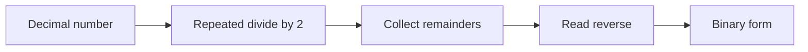

### C++

```cpp
string toBinary(long long x) {
    if (x == 0) return "0";

    string s;
    while (x > 0) {
        s.push_back(char('0' + (x % 2)));
        x /= 2;
    }

    reverse(s.begin(), s.end());
    return s;
}
```

---

## 1.2 Bit Operators

| Operator | Meaning | Example |
|---|---|---|
| `&` | AND | bit is `1` only if both are `1` |
| `|` | OR | bit is `1` if at least one is `1` |
| `^` | XOR | bit is `1` if bits are different |
| `~` | NOT | flips all bits |
| `<<` | left shift | multiply by power of two |
| `>>` | right shift | divide by power of two for non-negative values |

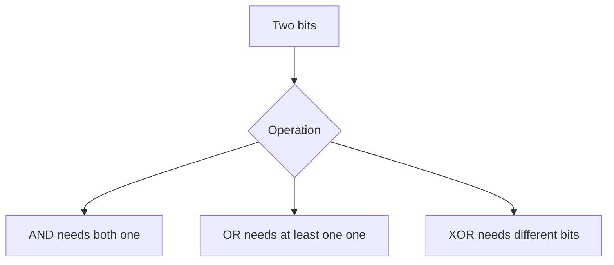

---

## 1.3 Bit Positions and Masks

Bit positions are usually counted from right to left starting at `0`.

```text
binary:  1 0 1 1
index:   3 2 1 0
```

A mask for bit `pos`:

```cpp
1LL << pos
```

---

## 1.4 Check Set Clear Toggle

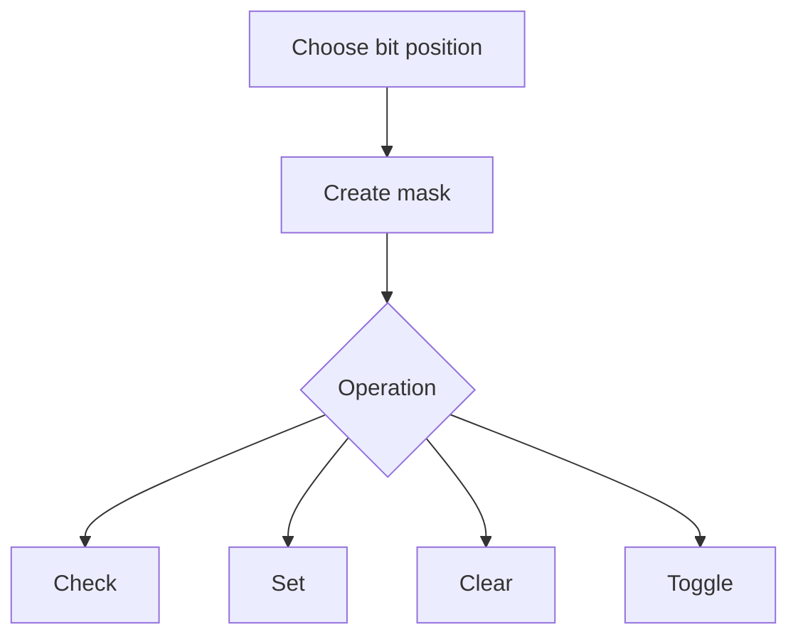

### C++

```cpp
bool isSet(long long x, int pos) {
    return ((x >> pos) & 1LL) != 0;
}

long long setBit(long long x, int pos) {
    return x | (1LL << pos);
}

long long clearBit(long long x, int pos) {
    return x & ~(1LL << pos);
}

long long toggleBit(long long x, int pos) {
    return x ^ (1LL << pos);
}
```

---

## 1.5 Common Bit Tricks

| Trick | Meaning |
|---|---|
| `x & (x - 1)` | removes lowest set bit |
| `x & -x` | gets lowest set bit |
| `x & 1` | checks odd/even |
| `__builtin_popcountll(x)` | counts set bits |
| `(n & (n - 1)) == 0` | power of two check |

### C++

```cpp
bool isPowerOfTwo(long long n) {
    return n > 0 && (n & (n - 1)) == 0;
}

long long lowbit(long long x) {
    return x & -x;
}

int countBits(long long x) {
    return __builtin_popcountll(x);
}
```

---

## 1.6 Bitmask as Set

A mask can represent a subset.

```text
bit = 1 means element is present
bit = 0 means element is absent
```

Example:

```text
elements: [A, B, C, D]
mask:      1  0  1  1
subset:   {A, C, D}
```

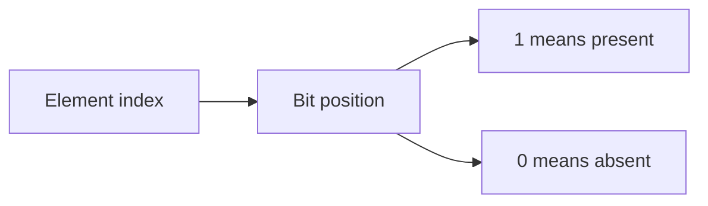

Set operations:

| Set operation | Bit operation |
|---|---|
| union | `A | B` |
| intersection | `A & B` |
| difference | `A & ~B` |
| toggle membership | `mask ^ bit` |
| add element | `mask | bit` |
| remove element | `mask & ~bit` |

---

## 1.7 Bit Contribution

Many bitwise sums can be solved bit by bit.

Instead of looping over all pairs:

```text
for every pair
```

count how much each bit contributes.

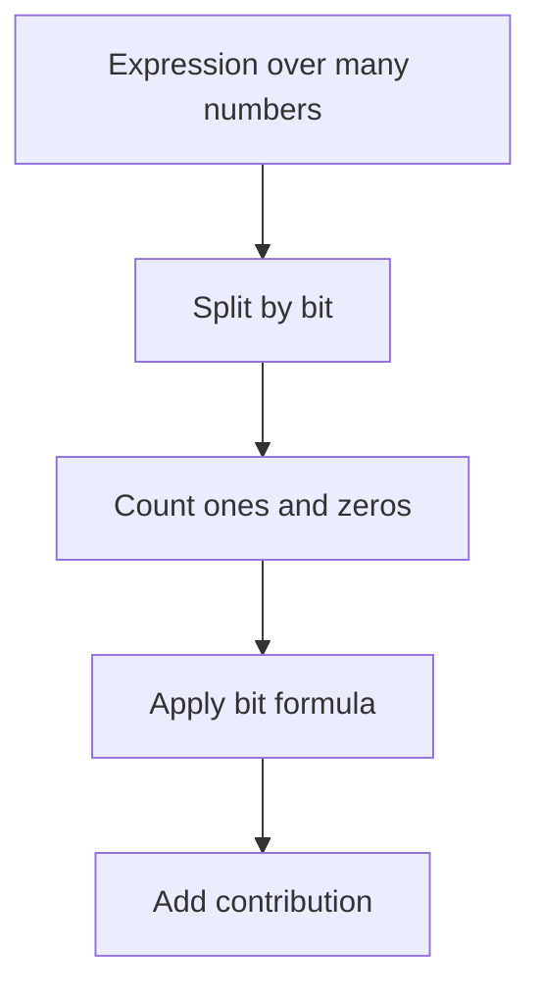

---

## 1.8 Prefix XOR

XOR has cancellation:

```text
x ^ x = 0
x ^ 0 = x
```

So prefix XOR works like prefix sum.

```text
xor(l, r) = px[r + 1] ^ px[l]
```

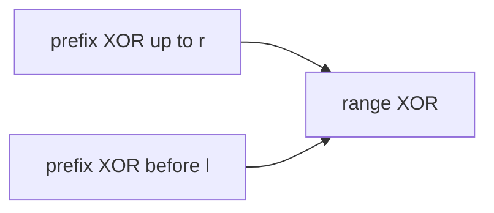

---

## 1.9 Bit Cycles

For bit `i`, values from `0` upward follow a repeating pattern.

```text
bit i has:
2^i zeros
2^i ones
cycle length = 2^(i + 1)
```

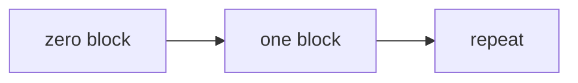

Used for counting set bits from `0` to `n`.

---

## 1.10 Greedy High Bit to Low Bit

High bits dominate lower bits.

To maximize a bitwise answer, try setting higher bits first.

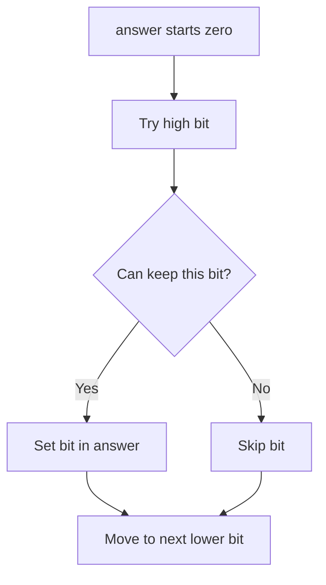

---

## 1.11 Binary Trie

A binary trie stores numbers bit by bit.

Used for:
- maximum XOR pair
- minimum XOR pair
- maximum XOR subarray
- XOR queries

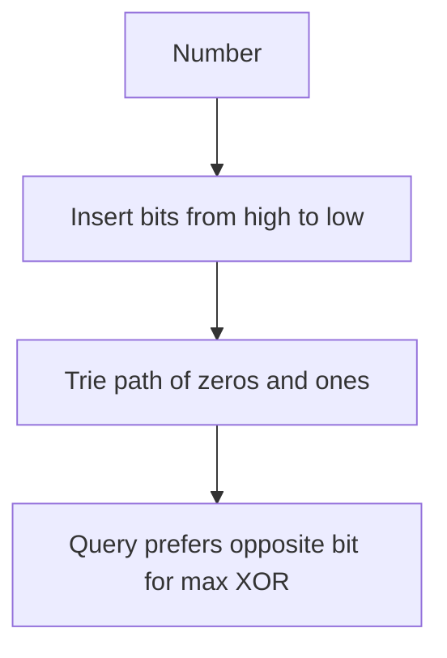

---

## 1.12 C++ Bitset

`bitset<N>` stores fixed-size bits.

Useful when:
- need more than 64 bits
- need fast bit operations on many boolean states
- subset DP optimization

```cpp
bitset<1000> b;
b.set(5);
b.reset(5);
b.flip(5);
int cnt = b.count();
```

---

# 2. Frameworks With Examples

## 2.1 Basic Bit Operation Framework

### When to use

Use when the problem asks to:
- check whether a bit exists
- turn a feature on/off
- store boolean flags compactly
- test parity or powers of two

### Framework

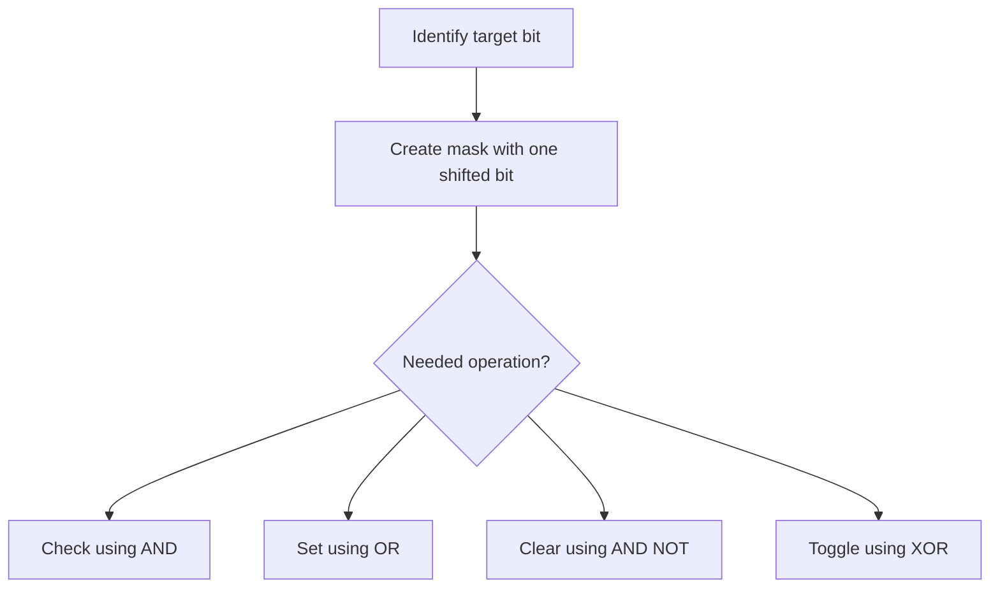

### Example

Problem:

```text
Given x = 10, check if bit 1 is set.
```

Binary:

```text
10 = 1010
bit 1 is 1
```

C++:

```cpp
long long x = 10;
int bit = 1;

bool ok = (x & (1LL << bit)) != 0;
```

---

## 2.2 Bitmask Set Framework

### When to use

Use when:
- number of elements is small, usually `n <= 20`
- you need subsets
- each element is either chosen or not chosen
- state can be represented by selected elements

### Framework

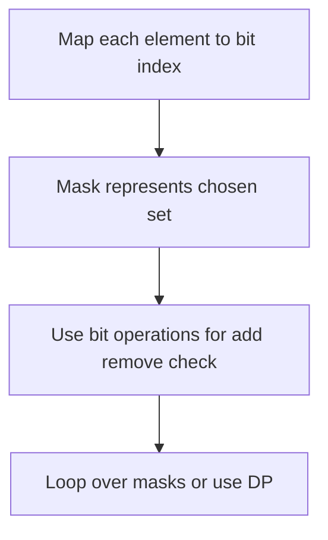

### Example

Elements:

```text
tasks = [A, B, C]
```

Mask:

```text
101 means choose A and C
```

C++:

```cpp
int mask = 0;
mask |= (1 << 0); // choose A
mask |= (1 << 2); // choose C

bool hasB = (mask >> 1) & 1;
```

---

## 2.3 Subset Enumeration Framework

### When to use

Use when you need to try every subset.

Usually safe when:

```text
n <= 20
```

### Framework

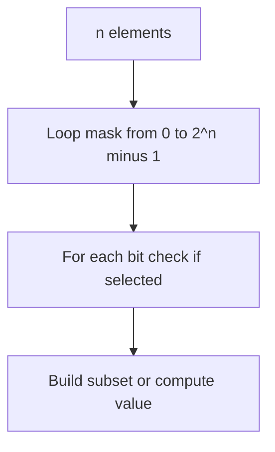

### Example

```text
arr = [2, 5, 7]
```

Masks:

```text
000 -> {}
001 -> {2}
010 -> {5}
011 -> {2,5}
100 -> {7}
```

C++:

```cpp
for (int mask = 0; mask < (1 << n); mask++) {
    int sum = 0;

    for (int i = 0; i < n; i++) {
        if ((mask >> i) & 1) {
            sum += a[i];
        }
    }

    cout << mask << " sum = " << sum << "\n";
}
```

---

## 2.4 Submask Enumeration Framework

### When to use

Use when for a given mask, you need all its submasks.

Common in:
- DP over subsets
- partitioning masks
- SOS DP
- subset convolution basics

### Framework

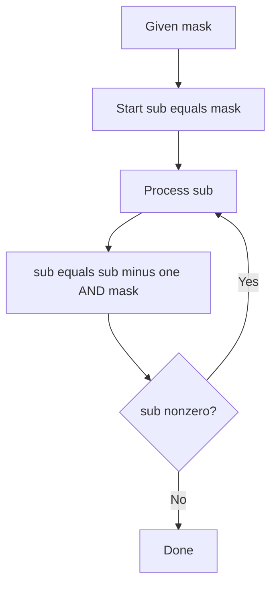

### Example

For:

```text
mask = 1101
```

Submasks include:

```text
1101, 1100, 1001, 1000, 0101, ...
```

C++:

```cpp
for (int sub = mask; sub; sub = (sub - 1) & mask) {
    // process non-empty submask
}

// include zero submask separately if needed
```

---

## 2.5 Bit Contribution Framework

### When to use

Use when problem asks sum over all pairs/subarrays and operation is bitwise:

```text
sum of pair XOR
sum of pair AND
sum of pair OR
```

### Framework

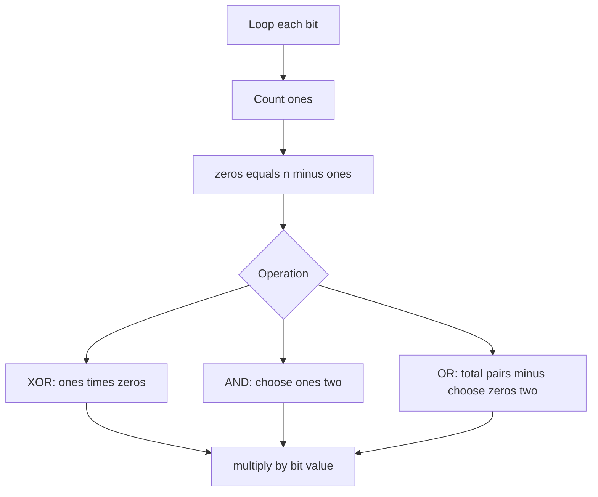

### Example

Array:

```text
[1, 3, 5]
```

Binary:

```text
1 = 001
3 = 011
5 = 101
```

For XOR at bit `1`:
- ones = 1
- zeros = 2
- pairs = 2
- contribution = `2 * 2^1 = 4`

---

## 2.6 Prefix XOR Framework

### When to use

Use when:
- range XOR queries
- subarray XOR equals K
- maximum XOR subarray
- XOR of many segments

### Framework

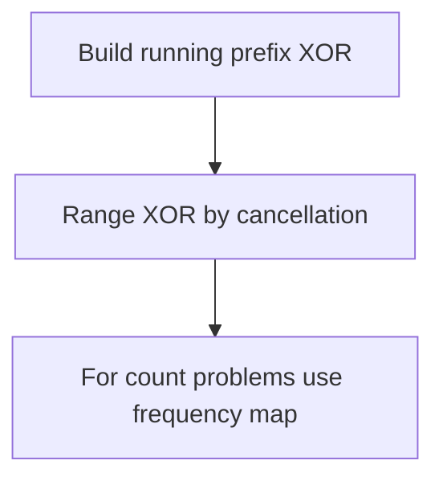

### Example

Problem:

```text
Count subarrays with XOR K.
```

If:

```text
px[r] ^ px[l - 1] = K
```

Then:

```text
px[l - 1] = px[r] ^ K
```

C++:

```cpp
long long countSubarrayXorK(vector<int>& a, int k) {
    unordered_map<int, long long> freq;
    freq[0] = 1;

    int px = 0;
    long long ans = 0;

    for (int x : a) {
        px ^= x;
        ans += freq[px ^ k];
        freq[px]++;
    }

    return ans;
}
```

---

## 2.7 Bit Count Prefix Framework

### When to use

Use for range queries on AND, OR, or bit statistics.

### Framework

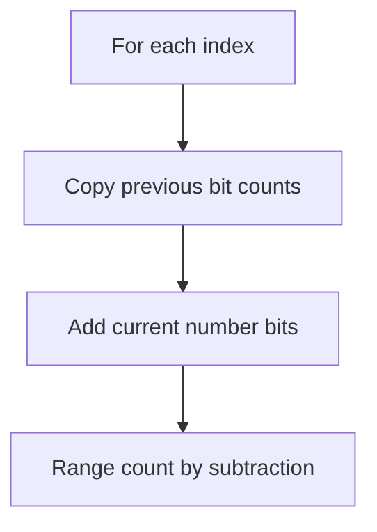

### Example

Range AND query:

For each bit:
- if count of ones in range equals length, bit is `1`
- otherwise bit is `0`

C++:

```cpp
int rangeAnd(vector<array<int, 31>>& pref, int l, int r) {
    int len = r - l + 1;
    int ans = 0;

    for (int bit = 0; bit < 31; bit++) {
        int ones = pref[r + 1][bit] - pref[l][bit];
        if (ones == len) {
            ans |= (1 << bit);
        }
    }

    return ans;
}
```

---

## 2.8 Cyclic Bit Counting Framework

### When to use

Use when counting set bits from `0` to `n`, or across a large numeric range.

### Framework

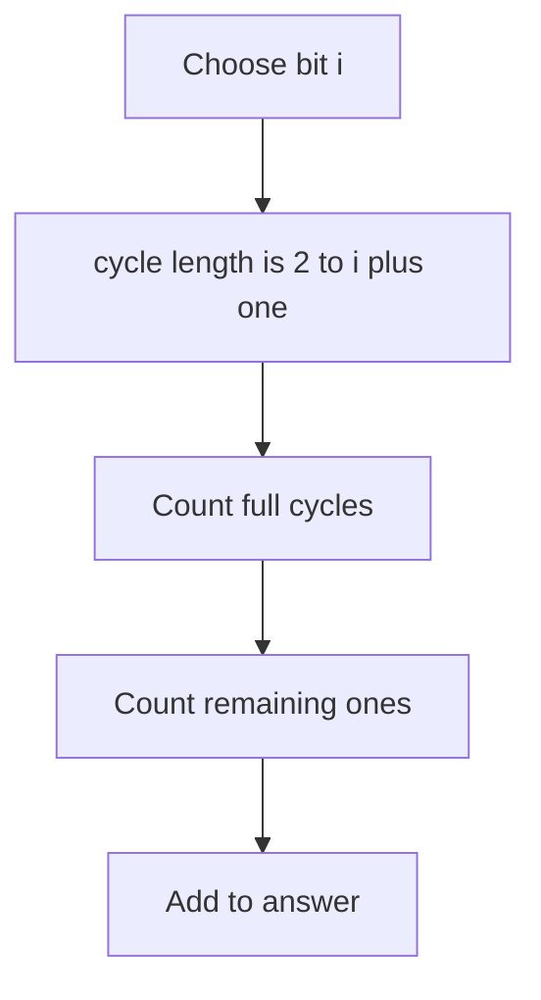

### Example

Count ones at bit `2` from `0` to `19`.

```text
total numbers = 20
half = 4
cycle = 8
full cycles = 2
remainder = 4
ones = 2 * 4 + max(0, 4 - 4) = 8
```

---

## 2.9 High-to-Low Greedy Framework

### When to use

Use when maximizing bitwise answer:
- maximum AND of at least K numbers
- maximum possible OR under constraints
- maximum XOR with basis or trie
- building answer bit by bit

### Framework

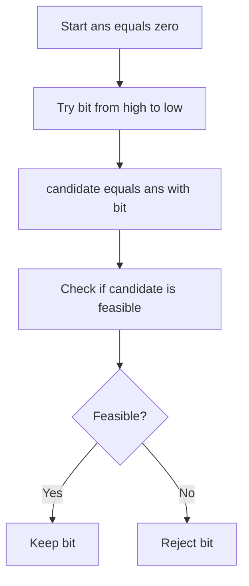

### Example

Find maximum AND value among at least `k` numbers.

Candidate bitmask must be contained inside enough numbers.

```cpp
if ((x & candidate) == candidate) {
    count++;
}
```

---

## 2.10 XOR Trie Framework

### When to use

Use when choosing a number that maximizes XOR with another number.

### Framework

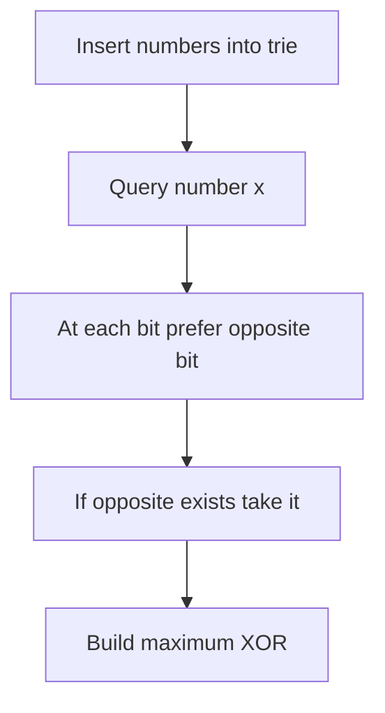

### Example

For number `x`, at a high bit:
- if x has `0`, prefer trie child `1`
- if x has `1`, prefer trie child `0`

This makes XOR bit equal to `1`.

---

## 2.11 Operation Conservation Framework

### When to use

Use when an operation changes numbers but preserves bit counts or total value.

Common identity:

```text
a + b = (a | b) + (a & b)
```

### Framework

```mermaid
flowchart TD
    A["Analyze operation"] --> B["Find invariant"]
    B --> C["Usually bit counts are conserved"]
    C --> D["Rearrange bits optimally"]
```

### Example

If operations preserve count of set bits at every position, and goal is maximize sum of squares:

```text
Put many bits into the same numbers.
```

Because concentrated values increase square sum.

---

## 2.12 DP Over Bitmask Framework

### When to use

Use when:
- `n <= 20`
- state is a chosen subset
- need minimum/maximum/count over subsets
- assignment or TSP style problems

### Framework

```mermaid
flowchart TD
    A["State is mask"] --> B["dp mask means best answer for selected set"]
    B --> C["Try adding one unselected element"]
    C --> D["Transition to new mask"]
```

### Example

Assignment problem:

```text
dp[mask] = max score after assigning first popcount(mask) workers to selected jobs
```

C++:

```cpp
for (int mask = 0; mask < (1 << n); mask++) {
    int worker = __builtin_popcount(mask);

    for (int job = 0; job < n; job++) {
        if (((mask >> job) & 1) == 0) {
            int nmask = mask | (1 << job);
            dp[nmask] = max(dp[nmask], dp[mask] + score[worker][job]);
        }
    }
}
```

---

# 3. Problem Forms

## 3.1 Power of Two

```cpp
bool isPowerOfTwo(long long n) {
    return n > 0 && (n & (n - 1)) == 0;
}
```

---

## 3.2 Single Number

Problem:

```text
Every number appears twice except one.
Find the unique number.
```

XOR cancels duplicates.

```cpp
int singleNumber(vector<int>& a) {
    int ans = 0;

    for (int x : a) {
        ans ^= x;
    }

    return ans;
}
```

---

## 3.3 Two Unique Numbers

Problem:

```text
Every number appears twice except two numbers.
Find those two.
```

### Idea

XOR all numbers:

```text
xr = unique1 ^ unique2
```

Pick a set bit in `xr`; the two unique numbers differ there.

```cpp
pair<int, int> twoUniqueNumbers(vector<int>& a) {
    int xr = 0;

    for (int x : a) xr ^= x;

    int bit = xr & -xr;

    int x = 0;
    int y = 0;

    for (int v : a) {
        if (v & bit) x ^= v;
        else y ^= v;
    }

    return {x, y};
}
```

---

## 3.4 Generate All Subsets

```cpp
vector<vector<int>> allSubsets(vector<int>& a) {
    int n = a.size();
    vector<vector<int>> ans;

    for (int mask = 0; mask < (1 << n); mask++) {
        vector<int> subset;

        for (int i = 0; i < n; i++) {
            if ((mask >> i) & 1) {
                subset.push_back(a[i]);
            }
        }

        ans.push_back(subset);
    }

    return ans;
}
```

---

## 3.5 Count Pair XOR Sum

```cpp
long long sumPairXor(vector<int>& a) {
    int n = a.size();
    long long ans = 0;

    for (int bit = 0; bit < 31; bit++) {
        long long ones = 0;

        for (int x : a) {
            if ((x >> bit) & 1) ones++;
        }

        long long zeros = n - ones;
        ans += ones * zeros * (1LL << bit);
    }

    return ans;
}
```

---

## 3.6 Count Pair AND Sum

```cpp
long long sumPairAnd(vector<int>& a) {
    long long ans = 0;

    for (int bit = 0; bit < 31; bit++) {
        long long ones = 0;

        for (int x : a) {
            if ((x >> bit) & 1) ones++;
        }

        ans += ones * (ones - 1) / 2 * (1LL << bit);
    }

    return ans;
}
```

---

## 3.7 Count Pair OR Sum

```cpp
long long sumPairOr(vector<int>& a) {
    int n = a.size();
    long long totalPairs = 1LL * n * (n - 1) / 2;
    long long ans = 0;

    for (int bit = 0; bit < 31; bit++) {
        long long ones = 0;

        for (int x : a) {
            if ((x >> bit) & 1) ones++;
        }

        long long zeros = n - ones;
        long long pairs = totalPairs - zeros * (zeros - 1) / 2;

        ans += pairs * (1LL << bit);
    }

    return ans;
}
```

---

## 3.8 Range XOR Query

```cpp
vector<int> buildPrefixXor(vector<int>& a) {
    int n = a.size();
    vector<int> px(n + 1, 0);

    for (int i = 0; i < n; i++) {
        px[i + 1] = px[i] ^ a[i];
    }

    return px;
}

int rangeXor(vector<int>& px, int l, int r) {
    return px[r + 1] ^ px[l];
}
```

---

## 3.9 Count Subarrays With XOR K

```cpp
long long countSubarrayXorK(vector<int>& a, int k) {
    unordered_map<int, long long> freq;
    freq[0] = 1;

    int px = 0;
    long long ans = 0;

    for (int x : a) {
        px ^= x;
        ans += freq[px ^ k];
        freq[px]++;
    }

    return ans;
}
```

---

## 3.10 Maximum XOR Pair

```cpp
struct TrieNode {
    int child[2];

    TrieNode() {
        child[0] = child[1] = -1;
    }
};

struct BinaryTrie {
    vector<TrieNode> trie;

    BinaryTrie() {
        trie.push_back(TrieNode());
    }

    void insert(int x) {
        int node = 0;

        for (int bit = 30; bit >= 0; bit--) {
            int b = (x >> bit) & 1;

            if (trie[node].child[b] == -1) {
                trie[node].child[b] = trie.size();
                trie.push_back(TrieNode());
            }

            node = trie[node].child[b];
        }
    }

    int maxXorWith(int x) {
        int node = 0;
        int ans = 0;

        for (int bit = 30; bit >= 0; bit--) {
            int b = (x >> bit) & 1;
            int want = b ^ 1;

            if (trie[node].child[want] != -1) {
                ans |= (1 << bit);
                node = trie[node].child[want];
            } else {
                node = trie[node].child[b];
            }
        }

        return ans;
    }
};

int maxPairXor(vector<int>& a) {
    BinaryTrie bt;

    for (int x : a) {
        bt.insert(x);
    }

    int ans = 0;

    for (int x : a) {
        ans = max(ans, bt.maxXorWith(x));
    }

    return ans;
}
```

---

## 3.11 Maximum AND of K Numbers

```cpp
long long maxAndAtLeastK(vector<long long>& a, int k) {
    long long ans = 0;

    for (int bit = 60; bit >= 0; bit--) {
        long long candidate = ans | (1LL << bit);
        int count = 0;

        for (long long x : a) {
            if ((x & candidate) == candidate) {
                count++;
            }
        }

        if (count >= k) {
            ans = candidate;
        }
    }

    return ans;
}
```

---

## 3.12 Sum of Set Bits From 0 to N

```cpp
long long countOnesAtBit(long long x, int bit) {
    long long total = x + 1;
    long long half = 1LL << bit;
    long long cycle = 1LL << (bit + 1);

    long long full = total / cycle;
    long long rem = total % cycle;

    return full * half + max(0LL, rem - half);
}

long long sumSetBitsFromZeroToN(long long n) {
    long long ans = 0;

    for (int bit = 0; bit < 60; bit++) {
        ans += countOnesAtBit(n, bit);
    }

    return ans;
}
```

---

## 3.13 Range AND Query

Use bit prefix counts.

```cpp
struct BitPrefix {
    vector<array<int, 31>> pref;

    BitPrefix(vector<int>& a) {
        int n = a.size();
        pref.assign(n + 1, {});

        for (int i = 0; i < n; i++) {
            pref[i + 1] = pref[i];

            for (int bit = 0; bit < 31; bit++) {
                if ((a[i] >> bit) & 1) {
                    pref[i + 1][bit]++;
                }
            }
        }
    }

    int rangeAnd(int l, int r) {
        int len = r - l + 1;
        int ans = 0;

        for (int bit = 0; bit < 31; bit++) {
            int ones = pref[r + 1][bit] - pref[l][bit];

            if (ones == len) {
                ans |= (1 << bit);
            }
        }

        return ans;
    }
};
```

---

## 3.14 Range OR Query

For OR:
- if count of ones in range is greater than `0`, bit is set.

```cpp
int rangeOr(vector<array<int, 31>>& pref, int l, int r) {
    int ans = 0;

    for (int bit = 0; bit < 31; bit++) {
        int ones = pref[r + 1][bit] - pref[l][bit];

        if (ones > 0) {
            ans |= (1 << bit);
        }
    }

    return ans;
}
```

---

## 3.15 Bitmask DP Assignment

```cpp
int maxAssignmentScore(vector<vector<int>>& score) {
    int n = score.size();
    vector<int> dp(1 << n, INT_MIN);

    dp[0] = 0;

    for (int mask = 0; mask < (1 << n); mask++) {
        int worker = __builtin_popcount((unsigned)mask);

        if (worker >= n || dp[mask] == INT_MIN) continue;

        for (int job = 0; job < n; job++) {
            if (((mask >> job) & 1) == 0) {
                int nmask = mask | (1 << job);
                dp[nmask] = max(dp[nmask], dp[mask] + score[worker][job]);
            }
        }
    }

    return dp[(1 << n) - 1];
}
```

---

## 3.16 Traveling Salesman Bitmask DP

```cpp
long long tsp(vector<vector<int>>& dist) {
    int n = dist.size();
    const long long INF = 4e18;

    vector<vector<long long>> dp(1 << n, vector<long long>(n, INF));
    dp[1][0] = 0;

    for (int mask = 0; mask < (1 << n); mask++) {
        for (int u = 0; u < n; u++) {
            if (dp[mask][u] == INF) continue;

            for (int v = 0; v < n; v++) {
                if (((mask >> v) & 1) == 0) {
                    int nmask = mask | (1 << v);
                    dp[nmask][v] = min(dp[nmask][v], dp[mask][u] + dist[u][v]);
                }
            }
        }
    }

    long long ans = INF;
    int full = (1 << n) - 1;

    for (int u = 0; u < n; u++) {
        ans = min(ans, dp[full][u] + dist[u][0]);
    }

    return ans;
}
```

---

## 3.17 SOS DP Subset Sum Over Masks

Problem:

```text
Given f[mask], compute g[mask] = sum of f[submask] for all submask of mask.
```

```cpp
vector<long long> sos(vector<long long> f, int n) {
    for (int bit = 0; bit < n; bit++) {
        for (int mask = 0; mask < (1 << n); mask++) {
            if ((mask >> bit) & 1) {
                f[mask] += f[mask ^ (1 << bit)];
            }
        }
    }

    return f;
}
```

---

## 3.18 Gray Code

Gray code changes only one bit between consecutive numbers.

Formula:

```text
gray(i) = i ^ (i >> 1)
```

```cpp
vector<int> grayCode(int n) {
    vector<int> ans;

    for (int i = 0; i < (1 << n); i++) {
        ans.push_back(i ^ (i >> 1));
    }

    return ans;
}
```

---

# 4. Tactics

## 4.1 Pattern Recognition Table

| Problem clue | Think |
|---|---|
| each element chosen or not | bitmask |
| generate subsets | loop over masks |
| state is selected set | bitmask DP |
| pair XOR sum | bit contribution |
| pair AND sum | bit contribution |
| pair OR sum | bit contribution |
| range XOR | prefix XOR |
| subarray XOR K | prefix XOR plus map |
| max XOR | binary trie |
| max AND | high-to-low greedy |
| count bits from 0 to N | cyclic bit counting |
| more than 64 bits | `bitset` |
| repeated operation preserves bits | conservation of bit counts |

---

## 4.2 Operator Meaning Tactics

```text
AND:
    keeps common 1 bits

OR:
    combines all 1 bits

XOR:
    detects differences and cancels equal values
```

---

## 4.3 Bit Contribution Tactics

For each bit:

```text
XOR: different bits
AND: both one
OR: at least one one
```

Summary:

```text
XOR pairs = ones * zeros
AND pairs = ones choose two
OR pairs = total pairs - zeros choose two
```

---

## 4.4 XOR Tactics

Important XOR identities:

```text
x ^ x = 0
x ^ 0 = x
x ^ y = y ^ x
x ^ y ^ x = y
```

Use XOR for:
- unique element
- prefix XOR
- subarray XOR
- parity of occurrence
- toggling bits

---

## 4.5 AND OR Tactics

AND:
- decreases or stays same when adding more numbers
- good for high-bit greedy
- range AND can be answered by bit counts or sparse table

OR:
- increases or stays same when adding more numbers
- good for coverage
- range OR can be answered by bit counts or sparse table

---

## 4.6 Mask Enumeration Tactics

All masks:

```cpp
for (int mask = 0; mask < (1 << n); mask++)
```

All submasks:

```cpp
for (int sub = mask; sub; sub = (sub - 1) & mask)
```

Check bit:

```cpp
if ((mask >> i) & 1)
```

Add bit:

```cpp
mask | (1 << i)
```

Remove bit:

```cpp
mask & ~(1 << i)
```

---

## 4.7 Overflow and Shift Tactics

Use:

```cpp
1LL << bit
```

not:

```cpp
1 << bit
```

For bit 60:

```cpp
1LL << 60
```

Use `long long` for contribution formulas.

---

## 4.8 Signed Integer Tactics

Be careful with:
- `~x`
- right shift of negative numbers
- shifting into sign bit
- `1 << 31`

Prefer unsigned or long long when needed.

```cpp
unsigned int u = x;
```

---

## 4.9 When Bitwise Fails

Bitwise may not be enough when:
- operation involves carries in normal addition
- constraints require ordering not captured by bits
- values are negative and sign bits matter
- subsets are too large for `2^n`
- online updates need data structures

Try:
- prefix sums
- dynamic programming
- trie
- segment tree
- Fenwick tree
- meet in the middle

---

# 5. C++ Template Library

## 5.1 Basic Bit Helpers

```cpp
bool isSet(long long x, int bit) {
    return ((x >> bit) & 1LL) != 0;
}

long long setBit(long long x, int bit) {
    return x | (1LL << bit);
}

long long clearBit(long long x, int bit) {
    return x & ~(1LL << bit);
}

long long toggleBit(long long x, int bit) {
    return x ^ (1LL << bit);
}

int popcount(long long x) {
    return __builtin_popcountll(x);
}
```

---

## 5.2 Subset Loop

```cpp
for (int mask = 0; mask < (1 << n); mask++) {
    for (int bit = 0; bit < n; bit++) {
        if ((mask >> bit) & 1) {
            // element bit is selected
        }
    }
}
```

---

## 5.3 Submask Loop

```cpp
for (int sub = mask; sub; sub = (sub - 1) & mask) {
    // process sub
}
```

---

## 5.4 Prefix XOR

```cpp
vector<int> px(n + 1, 0);

for (int i = 0; i < n; i++) {
    px[i + 1] = px[i] ^ a[i];
}

int queryXor(int l, int r) {
    return px[r + 1] ^ px[l];
}
```

---

## 5.5 Bit Contribution Skeleton

```cpp
long long solve(vector<int>& a) {
    long long ans = 0;
    int n = a.size();

    for (int bit = 0; bit < 31; bit++) {
        long long ones = 0;

        for (int x : a) {
            if ((x >> bit) & 1) {
                ones++;
            }
        }

        long long zeros = n - ones;

        // choose formula based on XOR AND OR
    }

    return ans;
}
```

---

## 5.6 High-to-Low Greedy Skeleton

```cpp
long long ans = 0;

for (int bit = 60; bit >= 0; bit--) {
    long long candidate = ans | (1LL << bit);

    if (feasible(candidate)) {
        ans = candidate;
    }
}
```

---

## 5.7 Binary Trie Skeleton

```cpp
struct TrieNode {
    int child[2];

    TrieNode() {
        child[0] = child[1] = -1;
    }
};

struct BinaryTrie {
    vector<TrieNode> trie;

    BinaryTrie() {
        trie.push_back(TrieNode());
    }

    void insert(int x) {
        int node = 0;

        for (int bit = 30; bit >= 0; bit--) {
            int b = (x >> bit) & 1;

            if (trie[node].child[b] == -1) {
                trie[node].child[b] = trie.size();
                trie.push_back(TrieNode());
            }

            node = trie[node].child[b];
        }
    }
};
```

---

## 5.8 Bitmask DP Skeleton

```cpp
vector<long long> dp(1 << n, INF);
dp[0] = 0;

for (int mask = 0; mask < (1 << n); mask++) {
    for (int bit = 0; bit < n; bit++) {
        if (((mask >> bit) & 1) == 0) {
            int nmask = mask | (1 << bit);
            dp[nmask] = min(dp[nmask], dp[mask] + cost(mask, bit));
        }
    }
}
```

---

# 6. Final Checklist

Before coding, ask:

```text
1. Is this about individual bits?
2. Can I split the answer by bit?
3. Is this a subset problem?
4. Is n small enough for 2^n?
5. Is XOR cancellation useful?
6. Do I need prefix XOR?
7. Do I need count of ones per bit?
8. Is the goal max AND OR XOR?
9. Can I greedily build high bits?
10. Do I need a binary trie?
11. Are shifts safe with long long?
12. Are negative numbers involved?
```

---

# 7. Memory Hooks

```text
Bitmask:
    set as integer

XOR:
    difference and cancellation

AND:
    common bits

OR:
    union of bits

Contribution:
    solve bit by bit

Prefix XOR:
    range XOR and subarray XOR

High-to-low greedy:
    decide powerful bits first

Trie:
    max XOR wants opposite bit

Bitmask DP:
    dp[mask] means solved selected set
```

---

END
