# Recursion & Backtracking Problem Solving Playbook

> A structured competitive-programming guide for solving **Recursion**, **Backtracking**, **DFS generation**, **board placement**, and **recursive aggregation** problems.
>
> Goal: identify the recursion state, choices, constraints, movement, and answer type before coding.

---

# Clickable Index

- [0. Master Map](#0-master-map)
- [1. Concepts](#1-concepts)
  - [1.1 What Recursion Means](#11-what-recursion-means)
  - [1.2 What Backtracking Means](#12-what-backtracking-means)
  - [1.3 Recursion Tree vs Recursion Stack](#13-recursion-tree-vs-recursion-stack)
  - [1.4 Base Case and Recursive Case](#14-base-case-and-recursive-case)
  - [1.5 LCCM Framework](#15-lccm-framework)
  - [1.6 Path, State, and Answer](#16-path-state-and-answer)
  - [1.7 Pruning](#17-pruning)
  - [1.8 Aggregation Recursion](#18-aggregation-recursion)
  - [1.9 Memoization](#19-memoization)
  - [1.10 Complexity of Recursion](#110-complexity-of-recursion)
- [2. Frameworks With Templates and Examples](#2-frameworks-with-templates-and-examples)
  - [2.1 Basic Recursion Framework](#21-basic-recursion-framework)
  - [2.2 Generate All Answers Framework](#22-generate-all-answers-framework)
  - [2.3 Include-Exclude Framework](#23-include-exclude-framework)
  - [2.4 Permutation Framework](#24-permutation-framework)
  - [2.5 Partition/Cut Framework](#25-partitioncut-framework)
  - [2.6 Constraint Backtracking Framework](#26-constraint-backtracking-framework)
  - [2.7 Board Placement Framework](#27-board-placement-framework)
  - [2.8 Aggregation Count Framework](#28-aggregation-count-framework)
  - [2.9 Aggregation Boolean Framework](#29-aggregation-boolean-framework)
  - [2.10 Optimization Recursion Framework](#210-optimization-recursion-framework)
  - [2.11 Memoized Recursion Framework](#211-memoized-recursion-framework)
  - [2.12 DFS Grid Framework](#212-dfs-grid-framework)
- [3. Problem Forms](#3-problem-forms)
  - [3.1 Factorial](#31-factorial)
  - [3.2 GCD](#32-gcd)
  - [3.3 Fibonacci](#33-fibonacci)
  - [3.4 Generate Strings of Length N](#34-generate-strings-of-length-n)
  - [3.5 Phone Keypad Combinations](#35-phone-keypad-combinations)
  - [3.6 Subsets](#36-subsets)
  - [3.7 Subsets With Duplicates](#37-subsets-with-duplicates)
  - [3.8 Permutations](#38-permutations)
  - [3.9 Permutations With Duplicates](#39-permutations-with-duplicates)
  - [3.10 Combination Sum](#310-combination-sum)
  - [3.11 Combination Sum Without Reuse](#311-combination-sum-without-reuse)
  - [3.12 Palindrome Partitioning](#312-palindrome-partitioning)
  - [3.13 Generate Valid Parentheses](#313-generate-valid-parentheses)
  - [3.14 Word Break](#314-word-break)
  - [3.15 Decode Ways](#315-decode-ways)
  - [3.16 Tower of Hanoi](#316-tower-of-hanoi)
  - [3.17 N Queens](#317-n-queens)
  - [3.18 K Knights](#318-k-knights)
  - [3.19 Sudoku Solver](#319-sudoku-solver)
  - [3.20 Rat in a Maze / Grid Paths](#320-rat-in-a-maze--grid-paths)
  - [3.21 Flood Fill / Number of Islands](#321-flood-fill--number-of-islands)
  - [3.22 Expression Add Operators](#322-expression-add-operators)
- [4. Tactics](#4-tactics)
  - [4.1 Pattern Recognition Table](#41-pattern-recognition-table)
  - [4.2 Choosing the Level](#42-choosing-the-level)
  - [4.3 Choosing the Choices](#43-choosing-the-choices)
  - [4.4 Check and Pruning Tactics](#44-check-and-pruning-tactics)
  - [4.5 Move and Undo Tactics](#45-move-and-undo-tactics)
  - [4.6 Duplicate Handling Tactics](#46-duplicate-handling-tactics)
  - [4.7 Answer Type Tactics](#47-answer-type-tactics)
  - [4.8 Memoization Tactics](#48-memoization-tactics)
  - [4.9 Board Problem Tactics](#49-board-problem-tactics)
  - [4.10 Complexity Tactics](#410-complexity-tactics)
  - [4.11 Common Mistakes](#411-common-mistakes)
- [5. C++ Template Library](#5-c-template-library)
- [6. Final Checklist](#6-final-checklist)
- [7. Memory Hooks](#7-memory-hooks)

---

# 0. Master Map

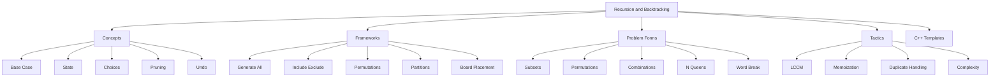

---

# 1. Concepts

## 1.1 What Recursion Means

Recursion means a function solves a problem by calling itself on a smaller version of the same problem.

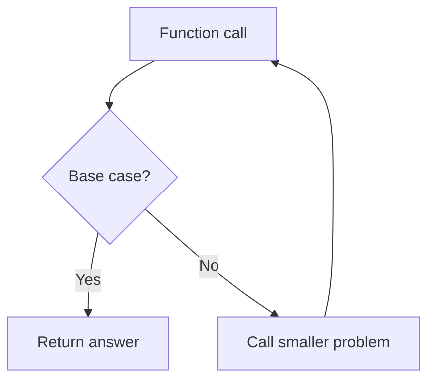

Example:

```text
factorial(n) = n * factorial(n - 1)
factorial(0) = 1
```

---

## 1.2 What Backtracking Means

Backtracking is recursion with choices and undo.

```text
choose -> check -> recurse -> undo
```

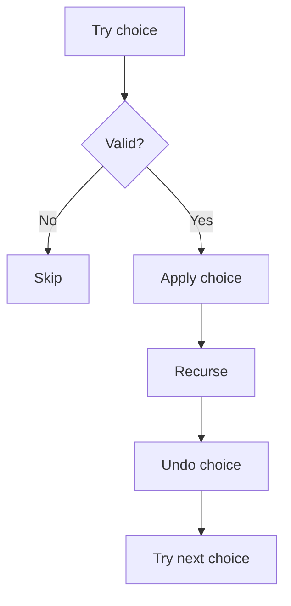

Backtracking is used when we need all answers, count answers, check if possible, optimize under constraints, or place objects on a board.

---

## 1.3 Recursion Tree vs Recursion Stack

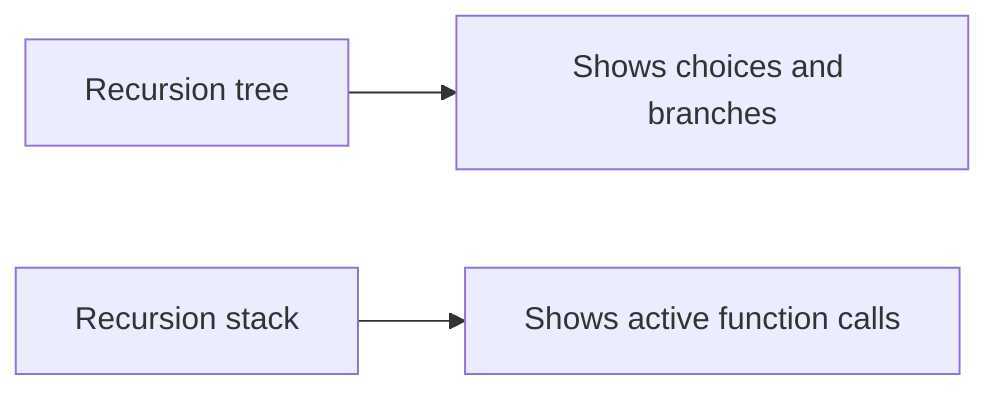

Use the recursion tree to design. Use the recursion stack to debug.

---

## 1.4 Base Case and Recursive Case

Every recursion needs:

```text
base case = when to stop
recursive case = how to move to smaller state
```

Common bugs:

```text
no base case
base case never reached
state does not change
wrong return type
forgetting to undo state
```

---

## 1.5 LCCM Framework

```text
L = Level
C = Choice
C = Check
M = Move
```

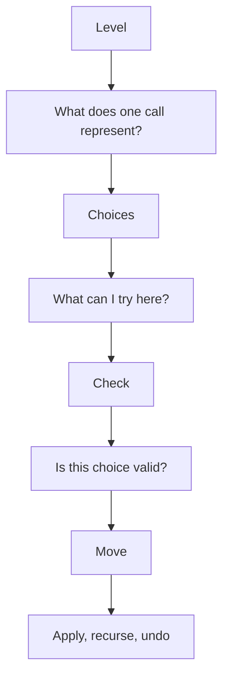

Before coding, write:

```text
Level:
Choices:
Check:
Move:
Base case:
Answer type:
```

---

## 1.6 Path, State, and Answer

| Term | Meaning |
|---|---|
| `path` | current partial answer |
| `state` | data used to validate choices |
| `answer` | final saved results |
| `level` | recursion depth, index, row, cell, or position |

Example for permutations:

```text
path = current permutation
state = used array
answer = list of permutations
level = path length
```

---

## 1.7 Pruning

Pruning means stopping useless branches early.

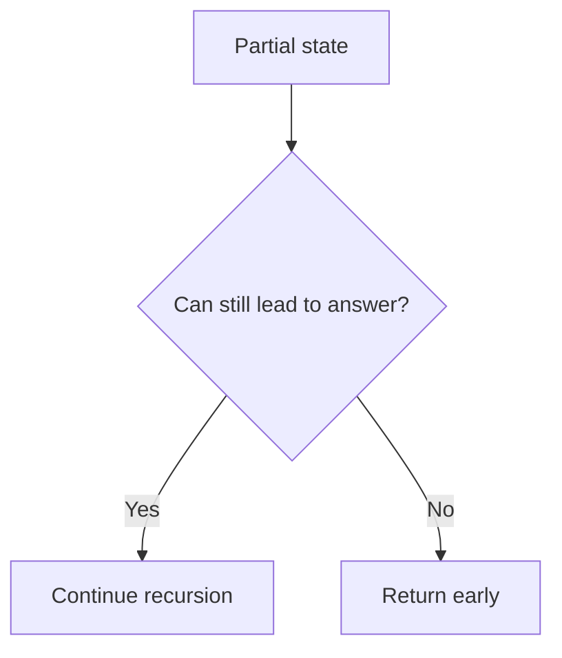

Examples:

```text
remaining sum < 0
substring is not palindrome
board cell is unsafe
close parentheses > open parentheses
duplicate branch appears
not enough remaining elements
```

---

## 1.8 Aggregation Recursion

Some recursion returns a value instead of saving paths.

| Problem asks | Return type | Combine children |
|---|---|---|
| possible? | `bool` | OR |
| count ways | `int` / `long long` | sum |
| minimum | number | min |
| maximum | number | max |

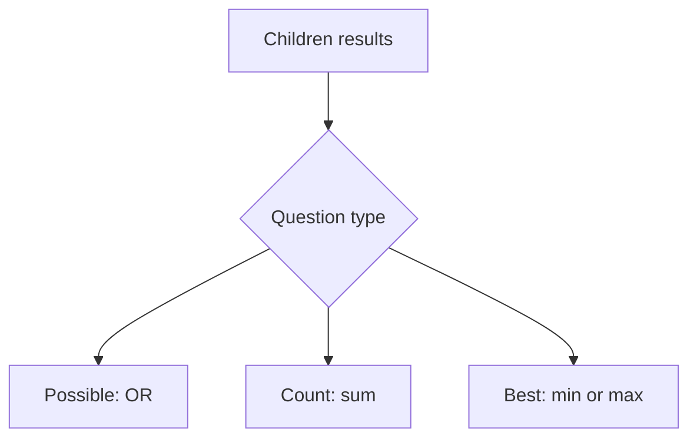

---

## 1.9 Memoization

Memoization stores answers for repeated states.

Use when:

```text
same state appears many times
answer depends only on state
branches overlap
```

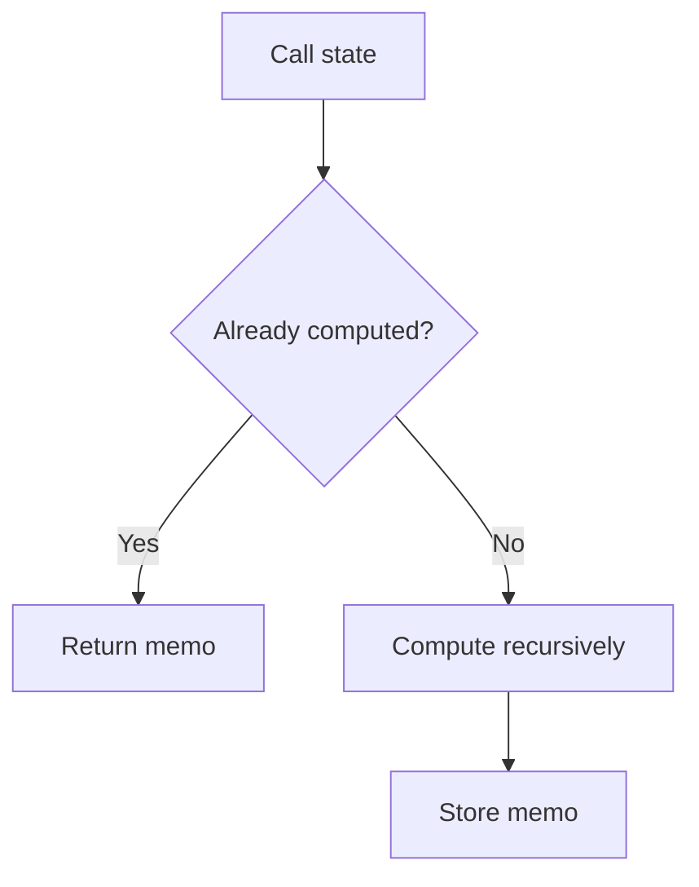

---

## 1.10 Complexity of Recursion

Backtracking complexity is usually:

```text
number of states * cost per state
```

| Problem | Rough complexity |
|---|---|
| subsets | `O(2^n)` |
| permutations | `O(n!)` |
| phone keypad | `O(4^n)` |
| valid parentheses | Catalan number |
| N Queens | roughly `O(n!)` with pruning |
| Word Break naive | exponential |

---

# 2. Frameworks With Templates and Examples

## 2.1 Basic Recursion Framework

Use when each problem reduces to a smaller version.

### Template

```cpp
ReturnType solve(State state) {
    if (base_case(state)) {
        return base_answer;
    }

    return combine(solve(smaller_state));
}
```

### Example: Factorial

```text
Level = n
Choice = none
Check = n == 0
Move = n -> n - 1
Answer type = one value
```

```cpp
long long fact(int n) {
    if (n == 0) return 1;
    return 1LL * n * fact(n - 1);
}
```

How it works:

```text
fact(4)
= 4 * fact(3)
= 4 * 3 * fact(2)
= 4 * 3 * 2 * fact(1)
= 4 * 3 * 2 * 1 * fact(0)
= 24
```

---

## 2.2 Generate All Answers Framework

Use when the problem says:

```text
generate all
print all
return all
list all
```

### Template

```cpp
void dfs(State state) {
    if (base_case) {
        ans.push_back(path);
        return;
    }

    for (Choice choice : choices) {
        if (!valid(choice)) continue;

        apply(choice);
        dfs(next_state);
        undo(choice);
    }
}
```

### Example: Generate strings of length `n` from `{a,b}`

```cpp
void generateStrings(int n, string& path, vector<string>& ans) {
    if ((int)path.size() == n) {
        ans.push_back(path);
        return;
    }

    for (char ch : {'a', 'b'}) {
        path.push_back(ch);
        generateStrings(n, path, ans);
        path.pop_back();
    }
}
```

---

## 2.3 Include-Exclude Framework

Each element has two choices: take it or skip it.

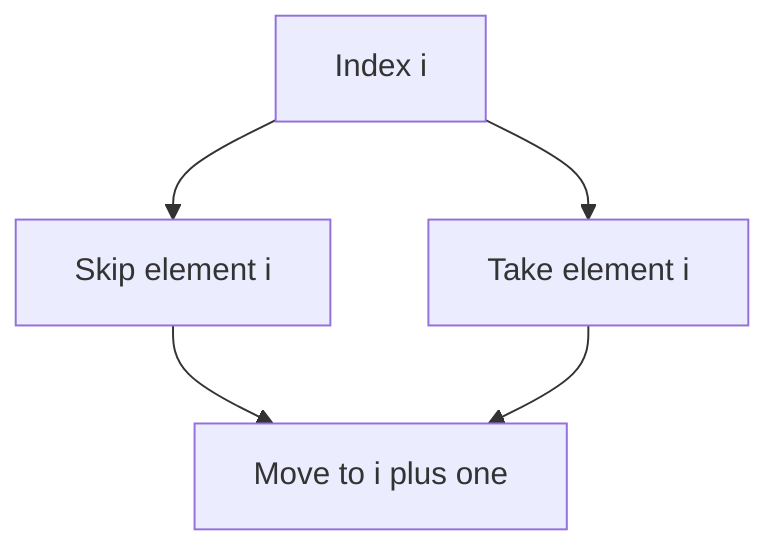

### Template

```cpp
void dfs(int i) {
    if (i == n) {
        save_or_process();
        return;
    }

    dfs(i + 1);

    path.push_back(a[i]);
    dfs(i + 1);
    path.pop_back();
}
```

### Example

For `[1,2]`:

```text
skip 1, skip 2 -> []
skip 1, take 2 -> [2]
take 1, skip 2 -> [1]
take 1, take 2 -> [1,2]
```

---

## 2.4 Permutation Framework

Use when order matters and each item is used once.

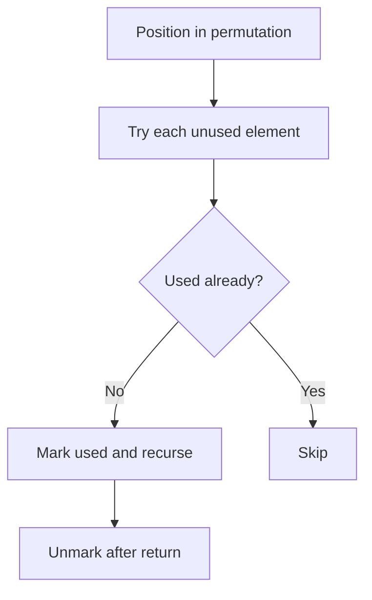

### Template

```cpp
void dfs() {
    if ((int)path.size() == n) {
        ans.push_back(path);
        return;
    }

    for (int i = 0; i < n; i++) {
        if (used[i]) continue;

        used[i] = 1;
        path.push_back(a[i]);

        dfs();

        path.pop_back();
        used[i] = 0;
    }
}
```

---

## 2.5 Partition/Cut Framework

Use when splitting a string or array into pieces.

Examples:

```text
palindrome partitioning
word break
expression add operators
recursive split problems
```

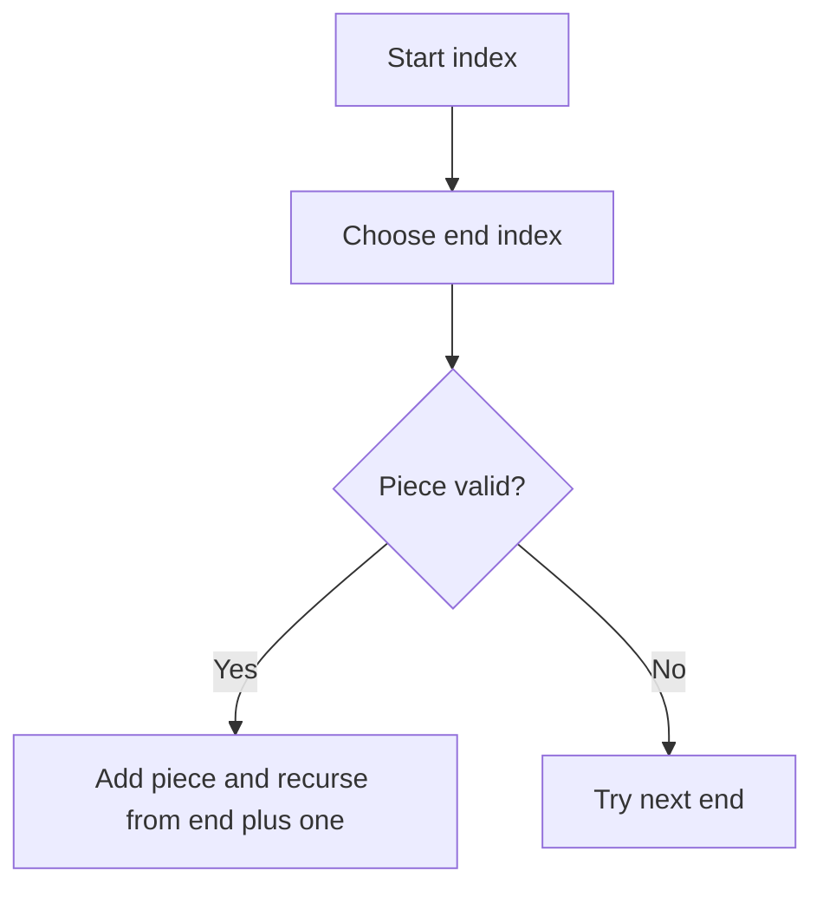

### Template

```cpp
void dfs(int start) {
    if (start == n) {
        ans.push_back(path);
        return;
    }

    for (int end = start; end < n; end++) {
        if (!valid(start, end)) continue;

        path.push_back(piece(start, end));
        dfs(end + 1);
        path.pop_back();
    }
}
```

---

## 2.6 Constraint Backtracking Framework

Use when choices must obey rules.

Examples:

```text
valid parentheses
N Queens
Sudoku
graph coloring
K Knights
```

### Template

```cpp
void dfs(Level level) {
    if (done()) {
        save_answer();
        return;
    }

    for (auto choice : choices(level)) {
        if (!safe(choice)) continue;

        apply(choice);
        dfs(next_level);
        undo(choice);
    }
}
```

---

## 2.7 Board Placement Framework

Use when placing objects on a board/grid.

| Board problem | Level |
|---|---|
| N Queens | row |
| K Knights | cell index |
| Sudoku | empty cell index |
| Maze path | current cell |

### Template

```cpp
void dfs(int cell) {
    if (finished) {
        save_or_count();
        return;
    }

    int r = cell / m;
    int c = cell % m;

    dfs(cell + 1);

    if (safe(r, c)) {
        place(r, c);
        dfs(cell + 1);
        remove(r, c);
    }
}
```

---

## 2.8 Aggregation Count Framework

Use when question asks how many ways.

```cpp
long long dfs(State state) {
    if (base_case) {
        return 1;
    }

    long long ways = 0;

    for (auto choice : choices) {
        if (!valid(choice)) continue;
        ways += dfs(next_state);
    }

    return ways;
}
```

---

## 2.9 Aggregation Boolean Framework

Use when question asks if any solution exists.

```cpp
bool dfs(State state) {
    if (success_state) return true;
    if (failure_state) return false;

    for (auto choice : choices) {
        if (!valid(choice)) continue;

        if (dfs(next_state)) {
            return true;
        }
    }

    return false;
}
```

---

## 2.10 Optimization Recursion Framework

Use for minimum cost, maximum score, longest path, shortest path.

```cpp
int dfs(State state) {
    if (base_case) return base_value;

    int best = INF;

    for (auto choice : choices) {
        if (!valid(choice)) continue;

        best = min(best, cost(choice) + dfs(next_state));
    }

    return best;
}
```

---

## 2.11 Memoized Recursion Framework

Use when the same state repeats.

```cpp
int dfs(int state) {
    if (base_case) return base_value;

    if (memo[state] != -1) return memo[state];

    int ans = 0;

    for (auto choice : choices) {
        ans += dfs(next_state);
    }

    return memo[state] = ans;
}
```

---

## 2.12 DFS Grid Framework

Use for islands, maze, connected components, flood fill, word search.

```cpp
void dfs(int r, int c) {
    if (r < 0 || c < 0 || r >= n || c >= m) return;
    if (blocked(r, c) || visited[r][c]) return;

    visited[r][c] = true;

    dfs(r + 1, c);
    dfs(r - 1, c);
    dfs(r, c + 1);
    dfs(r, c - 1);
}
```

---

# 3. Problem Forms

## 3.1 Factorial

```cpp
long long fact(int n) {
    if (n == 0) return 1;
    return 1LL * n * fact(n - 1);
}
```

---

## 3.2 GCD

```cpp
long long gcdRec(long long a, long long b) {
    if (b == 0) return a;
    return gcdRec(b, a % b);
}
```

---

## 3.3 Fibonacci

```cpp
long long fibMemo(int n, vector<long long>& dp) {
    if (n <= 1) return n;
    if (dp[n] != -1) return dp[n];

    return dp[n] = fibMemo(n - 1, dp) + fibMemo(n - 2, dp);
}
```

---

## 3.4 Generate Strings of Length N

```cpp
void generateStrings(int n, string& path, vector<string>& ans) {
    if ((int)path.size() == n) {
        ans.push_back(path);
        return;
    }

    for (char ch : {'a', 'b'}) {
        path.push_back(ch);
        generateStrings(n, path, ans);
        path.pop_back();
    }
}
```

---

## 3.5 Phone Keypad Combinations

```cpp
vector<string> phoneCombinations(string digits) {
    if (digits.empty()) return {};

    vector<string> mp = {
        "", "", "abc", "def", "ghi", "jkl",
        "mno", "pqrs", "tuv", "wxyz"
    };

    vector<string> ans;
    string path;

    function<void(int)> dfs = [&](int level) {
        if (level == (int)digits.size()) {
            ans.push_back(path);
            return;
        }

        int digit = digits[level] - '0';

        for (char ch : mp[digit]) {
            path.push_back(ch);
            dfs(level + 1);
            path.pop_back();
        }
    };

    dfs(0);
    return ans;
}
```

---

## 3.6 Subsets

```cpp
vector<vector<int>> subsets(vector<int>& nums) {
    vector<vector<int>> ans;
    vector<int> path;

    function<void(int)> dfs = [&](int i) {
        if (i == (int)nums.size()) {
            ans.push_back(path);
            return;
        }

        dfs(i + 1);

        path.push_back(nums[i]);
        dfs(i + 1);
        path.pop_back();
    };

    dfs(0);
    return ans;
}
```

---

## 3.7 Subsets With Duplicates

```cpp
vector<vector<int>> subsetsWithDup(vector<int>& nums) {
    sort(nums.begin(), nums.end());

    vector<vector<int>> ans;
    vector<int> path;

    function<void(int)> dfs = [&](int start) {
        ans.push_back(path);

        for (int i = start; i < (int)nums.size(); i++) {
            if (i > start && nums[i] == nums[i - 1]) continue;

            path.push_back(nums[i]);
            dfs(i + 1);
            path.pop_back();
        }
    };

    dfs(0);
    return ans;
}
```

---

## 3.8 Permutations

```cpp
vector<vector<int>> permute(vector<int>& nums) {
    vector<vector<int>> ans;
    vector<int> path;
    vector<int> used(nums.size(), 0);

    function<void()> dfs = [&]() {
        if ((int)path.size() == (int)nums.size()) {
            ans.push_back(path);
            return;
        }

        for (int i = 0; i < (int)nums.size(); i++) {
            if (used[i]) continue;

            used[i] = 1;
            path.push_back(nums[i]);

            dfs();

            path.pop_back();
            used[i] = 0;
        }
    };

    dfs();
    return ans;
}
```

---

## 3.9 Permutations With Duplicates

```cpp
vector<vector<int>> permuteUnique(vector<int>& nums) {
    map<int, int> freq;
    for (int x : nums) freq[x]++;

    vector<vector<int>> ans;
    vector<int> path;
    int n = nums.size();

    function<void()> dfs = [&]() {
        if ((int)path.size() == n) {
            ans.push_back(path);
            return;
        }

        for (auto& [x, cnt] : freq) {
            if (cnt == 0) continue;

            cnt--;
            path.push_back(x);

            dfs();

            path.pop_back();
            cnt++;
        }
    };

    dfs();
    return ans;
}
```

---

## 3.10 Combination Sum

Reuse allowed.

```cpp
vector<vector<int>> combinationSum(vector<int>& cand, int target) {
    vector<vector<int>> ans;
    vector<int> path;

    function<void(int, int)> dfs = [&](int idx, int rem) {
        if (rem == 0) {
            ans.push_back(path);
            return;
        }

        if (idx == (int)cand.size() || rem < 0) return;

        path.push_back(cand[idx]);
        dfs(idx, rem - cand[idx]);
        path.pop_back();

        dfs(idx + 1, rem);
    };

    dfs(0, target);
    return ans;
}
```

---

## 3.11 Combination Sum Without Reuse

```cpp
vector<vector<int>> combinationSum2(vector<int>& cand, int target) {
    sort(cand.begin(), cand.end());

    vector<vector<int>> ans;
    vector<int> path;

    function<void(int, int)> dfs = [&](int start, int rem) {
        if (rem == 0) {
            ans.push_back(path);
            return;
        }

        for (int i = start; i < (int)cand.size(); i++) {
            if (i > start && cand[i] == cand[i - 1]) continue;
            if (cand[i] > rem) break;

            path.push_back(cand[i]);
            dfs(i + 1, rem - cand[i]);
            path.pop_back();
        }
    };

    dfs(0, target);
    return ans;
}
```

---

## 3.12 Palindrome Partitioning

```cpp
bool isPal(const string& s, int l, int r) {
    while (l < r) {
        if (s[l] != s[r]) return false;
        l++;
        r--;
    }

    return true;
}

vector<vector<string>> partitionPalindrome(string s) {
    vector<vector<string>> ans;
    vector<string> path;

    function<void(int)> dfs = [&](int start) {
        if (start == (int)s.size()) {
            ans.push_back(path);
            return;
        }

        for (int end = start; end < (int)s.size(); end++) {
            if (!isPal(s, start, end)) continue;

            path.push_back(s.substr(start, end - start + 1));
            dfs(end + 1);
            path.pop_back();
        }
    };

    dfs(0);
    return ans;
}
```

---

## 3.13 Generate Valid Parentheses

```cpp
vector<string> generateParenthesis(int n) {
    vector<string> ans;
    string path;

    function<void(int, int)> dfs = [&](int open, int close) {
        if ((int)path.size() == 2 * n) {
            ans.push_back(path);
            return;
        }

        if (open < n) {
            path.push_back('(');
            dfs(open + 1, close);
            path.pop_back();
        }

        if (close < open) {
            path.push_back(')');
            dfs(open, close + 1);
            path.pop_back();
        }
    };

    dfs(0, 0);
    return ans;
}
```

---

## 3.14 Word Break

```cpp
bool wordBreak(string s, vector<string>& words) {
    int n = s.size();
    vector<int> memo(n + 1, -1);

    function<bool(int)> dfs = [&](int start) -> bool {
        if (start == n) return true;
        if (memo[start] != -1) return memo[start];

        for (string& w : words) {
            int len = w.size();

            if (start + len <= n && s.substr(start, len) == w) {
                if (dfs(start + len)) {
                    return memo[start] = true;
                }
            }
        }

        return memo[start] = false;
    };

    return dfs(0);
}
```

---

## 3.15 Decode Ways

```cpp
int numDecodings(string s) {
    int n = s.size();
    vector<int> memo(n + 1, -1);

    function<int(int)> dfs = [&](int i) -> int {
        if (i == n) return 1;
        if (s[i] == '0') return 0;
        if (memo[i] != -1) return memo[i];

        int ways = dfs(i + 1);

        if (i + 1 < n) {
            int val = (s[i] - '0') * 10 + (s[i + 1] - '0');
            if (val <= 26) {
                ways += dfs(i + 2);
            }
        }

        return memo[i] = ways;
    };

    return dfs(0);
}
```

---

## 3.16 Tower of Hanoi

```cpp
void towerOfHanoi(int n, char source, char auxiliary, char target) {
    if (n == 0) return;

    towerOfHanoi(n - 1, source, target, auxiliary);

    cout << "Move disk " << n << " from "
         << source << " to " << target << "\n";

    towerOfHanoi(n - 1, auxiliary, source, target);
}
```

Moves:

```text
2^n - 1
```

---

## 3.17 N Queens

```cpp
vector<vector<string>> solveNQueens(int n) {
    vector<vector<string>> ans;
    vector<string> board(n, string(n, '.'));

    vector<int> col(n, 0);
    vector<int> diag1(2 * n, 0);
    vector<int> diag2(2 * n, 0);

    function<void(int)> dfs = [&](int row) {
        if (row == n) {
            ans.push_back(board);
            return;
        }

        for (int c = 0; c < n; c++) {
            int d1 = row + c;
            int d2 = row - c + n;

            if (col[c] || diag1[d1] || diag2[d2]) continue;

            board[row][c] = 'Q';
            col[c] = diag1[d1] = diag2[d2] = 1;

            dfs(row + 1);

            board[row][c] = '.';
            col[c] = diag1[d1] = diag2[d2] = 0;
        }
    };

    dfs(0);
    return ans;
}
```

---

## 3.18 K Knights

```cpp
bool safeKnight(vector<vector<int>>& board, int r, int c) {
    int n = board.size();

    vector<int> dx = {-1, -1, -2, -2};
    vector<int> dy = {-2, 2, -1, 1};

    for (int i = 0; i < 4; i++) {
        int nr = r + dx[i];
        int nc = c + dy[i];

        if (nr >= 0 && nr < n && nc >= 0 && nc < n && board[nr][nc]) {
            return false;
        }
    }

    return true;
}

int countKKnights(int n, int k) {
    vector<vector<int>> board(n, vector<int>(n, 0));
    int ans = 0;

    function<void(int, int)> dfs = [&](int cell, int placed) {
        if (placed == k) {
            ans++;
            return;
        }

        if (cell == n * n) return;

        int r = cell / n;
        int c = cell % n;

        dfs(cell + 1, placed);

        if (safeKnight(board, r, c)) {
            board[r][c] = 1;
            dfs(cell + 1, placed + 1);
            board[r][c] = 0;
        }
    };

    dfs(0, 0);
    return ans;
}
```

---

## 3.19 Sudoku Solver

```cpp
bool solveSudoku(vector<vector<char>>& board) {
    function<bool(int, int)> dfs = [&](int r, int c) -> bool {
        if (r == 9) return true;

        int nr = (c == 8 ? r + 1 : r);
        int nc = (c == 8 ? 0 : c + 1);

        if (board[r][c] != '.') {
            return dfs(nr, nc);
        }

        for (char ch = '1'; ch <= '9'; ch++) {
            bool ok = true;

            for (int i = 0; i < 9; i++) {
                if (board[r][i] == ch) ok = false;
                if (board[i][c] == ch) ok = false;
            }

            int sr = (r / 3) * 3;
            int sc = (c / 3) * 3;

            for (int i = 0; i < 3; i++) {
                for (int j = 0; j < 3; j++) {
                    if (board[sr + i][sc + j] == ch) ok = false;
                }
            }

            if (!ok) continue;

            board[r][c] = ch;
            if (dfs(nr, nc)) return true;
            board[r][c] = '.';
        }

        return false;
    };

    return dfs(0, 0);
}
```

---

## 3.20 Rat in a Maze / Grid Paths

```cpp
void gridPaths(
    vector<vector<int>>& grid,
    int r,
    int c,
    string& path,
    vector<string>& ans
) {
    int n = grid.size();
    int m = grid[0].size();

    if (r < 0 || c < 0 || r >= n || c >= m || grid[r][c] == 0) {
        return;
    }

    if (r == n - 1 && c == m - 1) {
        ans.push_back(path);
        return;
    }

    grid[r][c] = 0;

    vector<pair<int, int>> dirs = {{1,0}, {0,1}, {-1,0}, {0,-1}};
    string moves = "DRUL";

    for (int i = 0; i < 4; i++) {
        path.push_back(moves[i]);
        gridPaths(grid, r + dirs[i].first, c + dirs[i].second, path, ans);
        path.pop_back();
    }

    grid[r][c] = 1;
}
```

---

## 3.21 Flood Fill / Number of Islands

```cpp
void dfsIsland(vector<vector<char>>& grid, int r, int c) {
    int n = grid.size();
    int m = grid[0].size();

    if (r < 0 || c < 0 || r >= n || c >= m || grid[r][c] != '1') {
        return;
    }

    grid[r][c] = '0';

    dfsIsland(grid, r + 1, c);
    dfsIsland(grid, r - 1, c);
    dfsIsland(grid, r, c + 1);
    dfsIsland(grid, r, c - 1);
}

int numIslands(vector<vector<char>>& grid) {
    int n = grid.size();
    int m = grid[0].size();
    int ans = 0;

    for (int i = 0; i < n; i++) {
        for (int j = 0; j < m; j++) {
            if (grid[i][j] == '1') {
                ans++;
                dfsIsland(grid, i, j);
            }
        }
    }

    return ans;
}
```

---

## 3.22 Expression Add Operators

```cpp
vector<string> addOperators(string num, long long target) {
    vector<string> ans;
    string path;

    function<void(int, long long, long long)> dfs =
        [&](int idx, long long value, long long prev) {
            if (idx == (int)num.size()) {
                if (value == target) ans.push_back(path);
                return;
            }

            for (int end = idx; end < (int)num.size(); end++) {
                if (end > idx && num[idx] == '0') break;

                string part = num.substr(idx, end - idx + 1);
                long long cur = stoll(part);
                int oldLen = path.size();

                if (idx == 0) {
                    path += part;
                    dfs(end + 1, cur, cur);
                    path.resize(oldLen);
                } else {
                    path += "+" + part;
                    dfs(end + 1, value + cur, cur);
                    path.resize(oldLen);

                    path += "-" + part;
                    dfs(end + 1, value - cur, -cur);
                    path.resize(oldLen);

                    path += "*" + part;
                    dfs(end + 1, value - prev + prev * cur, prev * cur);
                    path.resize(oldLen);
                }
            }
        };

    dfs(0, 0, 0);
    return ans;
}
```

---

# 4. Tactics

## 4.1 Pattern Recognition Table

| Problem clue | Pattern |
|---|---|
| compute one value recursively | basic recursion |
| generate all answers | backtracking |
| choose or skip each item | include-exclude |
| arrange all items | permutation |
| split string into parts | partition/cut |
| rules while building | constraint backtracking |
| board placement | board backtracking |
| count ways | aggregation sum |
| possible or not | aggregation OR |
| min/max answer | optimization recursion |
| same state repeats | memoization |
| grid connected area | DFS flood fill |

---

## 4.2 Choosing the Level

| Problem | Good level |
|---|---|
| subsets | index |
| permutations | path length |
| phone keypad | digit index |
| palindrome partition | start index |
| valid parentheses | path length or open/close counts |
| N Queens | row |
| K Knights | cell index |
| Sudoku | empty cell index |
| maze | current cell |

---

## 4.3 Choosing the Choices

| Problem | Choices |
|---|---|
| subsets | take or skip |
| permutations | unused element |
| phone keypad | letters for current digit |
| palindrome partition | end index |
| valid parentheses | `(` or `)` |
| N Queens | column |
| Sudoku | digit 1 to 9 |
| grid path | 4 directions |

---

## 4.4 Check and Pruning Tactics

Prune when:

```text
remaining target is negative
substring is not palindrome
board cell is unsafe
digit has leading zero
close parentheses would exceed open
duplicate branch appears
not enough remaining elements
```

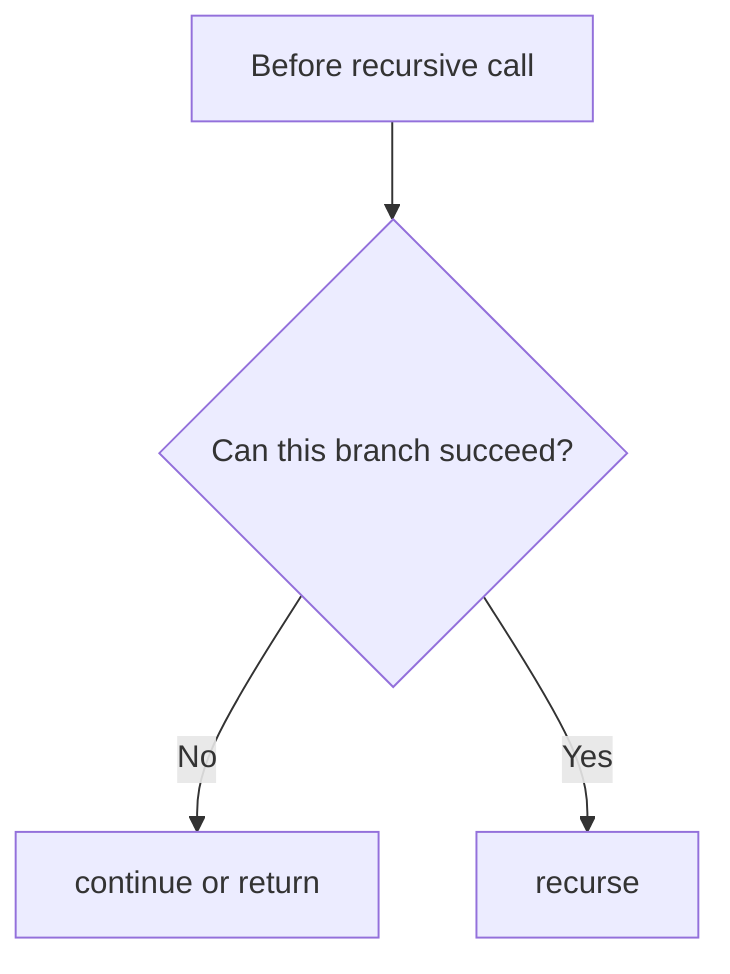

---

## 4.5 Move and Undo Tactics

Always restore changed state.

```cpp
apply(choice);
dfs(next);
undo(choice);
```

| Apply | Undo |
|---|---|
| `path.push_back(x)` | `path.pop_back()` |
| `used[i] = 1` | `used[i] = 0` |
| `freq[x]--` | `freq[x]++` |
| `board[r][c] = 'Q'` | `board[r][c] = '.'` |
| `visited[r][c] = true` | `visited[r][c] = false` for path search |

---

## 4.6 Duplicate Handling Tactics

For subsets/combinations with duplicates:

```cpp
sort(nums.begin(), nums.end());
if (i > start && nums[i] == nums[i - 1]) continue;
```

For permutations with duplicates, prefer frequency map:

```cpp
map<int, int> freq;
```

Mental trick:

```text
Duplicates? Choose value counts, not duplicate indices.
```

---

## 4.7 Answer Type Tactics

| Need | Code style |
|---|---|
| all answers | `void dfs`, push at base |
| count answers | return number or increment global |
| possible | return bool and stop early |
| min/max | return best value |
| first solution | return bool to stop recursion |

---

## 4.8 Memoization Tactics

Memo key should include every variable that affects the future answer.

| Problem | Memo key |
|---|---|
| Fibonacci | `n` |
| Word Break | `start` |
| Decode Ways | `index` |
| Grid paths | `(r, c)` |
| DP over subsets | `mask` |
| TSP | `(mask, last)` |

---

## 4.9 Board Problem Tactics

For board problems:

```text
choose level carefully
use helper arrays for fast safety
avoid checking whole board repeatedly
```

N Queens fast safety:

```text
col[c]
diag1[row + col]
diag2[row - col + n]
```

Sudoku fast safety:

```text
rowUsed[9][10]
colUsed[9][10]
boxUsed[9][10]
```

---

## 4.10 Complexity Tactics

Ask:

```text
How many choices per level?
How many levels?
What is check cost?
Can pruning reduce branches?
Can memoization remove repeated states?
```

Common estimates:

```text
Subsets: 2^n
Permutations: n!
Combinations: C(n,k)
Phone keypad: 3^a * 4^b
N Queens: roughly n! with pruning
```

---

## 4.11 Common Mistakes

1. Forgetting base case.
2. Base case after invalid access.
3. Forgetting to undo state.
4. Saving path before reaching base case.
5. Passing large vectors by value accidentally.
6. Not handling duplicates.
7. Using global state without restoring it.
8. Missing memoization for repeated states.
9. Wrong recursion level.
10. Checking constraints too late.

---

# 5. C++ Template Library

## 5.1 Universal Backtracking Template

```cpp
void dfs(int level) {
    if (base_case) {
        save_answer();
        return;
    }

    for (auto choice : choices) {
        if (!valid(choice)) continue;

        apply(choice);
        dfs(next_level);
        undo(choice);
    }
}
```

---

## 5.2 Include-Exclude Template

```cpp
void dfs(int i) {
    if (i == n) {
        ans.push_back(path);
        return;
    }

    dfs(i + 1);

    path.push_back(a[i]);
    dfs(i + 1);
    path.pop_back();
}
```

---

## 5.3 For-Loop Combination Template

```cpp
void dfs(int start) {
    ans.push_back(path);

    for (int i = start; i < n; i++) {
        path.push_back(a[i]);
        dfs(i + 1);
        path.pop_back();
    }
}
```

---

## 5.4 Permutation Template

```cpp
void dfs() {
    if ((int)path.size() == n) {
        ans.push_back(path);
        return;
    }

    for (int i = 0; i < n; i++) {
        if (used[i]) continue;

        used[i] = 1;
        path.push_back(a[i]);

        dfs();

        path.pop_back();
        used[i] = 0;
    }
}
```

---

## 5.5 Frequency Map Permutation Template

```cpp
void dfs() {
    if ((int)path.size() == n) {
        ans.push_back(path);
        return;
    }

    for (auto& [value, count] : freq) {
        if (count == 0) continue;

        count--;
        path.push_back(value);

        dfs();

        path.pop_back();
        count++;
    }
}
```

---

## 5.6 Partition Template

```cpp
void dfs(int start) {
    if (start == n) {
        ans.push_back(path);
        return;
    }

    for (int end = start; end < n; end++) {
        if (!valid(start, end)) continue;

        path.push_back(getPiece(start, end));
        dfs(end + 1);
        path.pop_back();
    }
}
```

---

## 5.7 Boolean Recursion Template

```cpp
bool dfs(State state) {
    if (success(state)) return true;
    if (fail(state)) return false;

    for (auto choice : choices) {
        if (!valid(choice)) continue;

        if (dfs(next_state)) {
            return true;
        }
    }

    return false;
}
```

---

## 5.8 Count Recursion Template

```cpp
long long dfs(State state) {
    if (base_case) return 1;

    long long ways = 0;

    for (auto choice : choices) {
        if (!valid(choice)) continue;

        ways += dfs(next_state);
    }

    return ways;
}
```

---

## 5.9 Optimization Recursion Template

```cpp
int dfs(State state) {
    if (base_case) return base_value;

    int best = INF;

    for (auto choice : choices) {
        if (!valid(choice)) continue;

        best = min(best, cost(choice) + dfs(next_state));
    }

    return best;
}
```

---

## 5.10 Memoized DFS Template

```cpp
int dfs(int state) {
    if (base_case) return base_value;

    if (memo[state] != -1) return memo[state];

    int ans = 0;

    for (auto choice : choices) {
        ans += dfs(next_state);
    }

    return memo[state] = ans;
}
```

---

## 5.11 Grid DFS Template

```cpp
void dfs(int r, int c) {
    if (r < 0 || c < 0 || r >= n || c >= m) return;
    if (blocked(r, c) || visited[r][c]) return;

    visited[r][c] = true;

    dfs(r + 1, c);
    dfs(r - 1, c);
    dfs(r, c + 1);
    dfs(r, c - 1);
}
```

---

# 6. Final Checklist

Before coding, write:

```text
Level:
Choices:
Check:
Move:
Base case:
Answer type:
State variables:
Need undo?
Need memo?
Duplicate handling?
Complexity:
```

---

# 7. Memory Hooks

```text
Recursion:
    solve smaller problem

Backtracking:
    choose, recurse, undo

LCCM:
    Level, Choice, Check, Move

Generate all:
    save at base case

Count:
    sum children

Possible:
    OR children

Optimize:
    min or max children

Duplicates:
    sort and skip, or use frequency map

Board:
    row, cell, or current position as level

Memoization:
    repeated state means cache it
```

---

END
