# Graph Algorithms Problem Solving Playbook

> A structured competitive-programming guide for solving **graph problems**.
>
> Goal: convert a problem into **nodes + edges + costs + constraints**, then choose the correct graph algorithm.

---

# Clickable Index

- [0. Master Map](#0-master-map)
- [1. Concepts](#1-concepts)
  - [1.1 What Is a Graph?](#11-what-is-a-graph)
  - [1.2 Nodes and Edges](#12-nodes-and-edges)
  - [1.3 Directed vs Undirected](#13-directed-vs-undirected)
  - [1.4 Weighted vs Unweighted](#14-weighted-vs-unweighted)
  - [1.5 Sparse vs Dense](#15-sparse-vs-dense)
  - [1.6 Path, Cycle, Reachability](#16-path-cycle-reachability)
  - [1.7 Connected Components](#17-connected-components)
  - [1.8 Trees and DAGs](#18-trees-and-dags)
  - [1.9 Graph Representations](#19-graph-representations)
  - [1.10 Implicit Graphs and State Graphs](#110-implicit-graphs-and-state-graphs)
- [2. Frameworks With Templates and Examples](#2-frameworks-with-templates-and-examples)
  - [2.1 Graph Formulation Framework](#21-graph-formulation-framework)
  - [2.2 DFS Framework](#22-dfs-framework)
  - [2.3 BFS Framework](#23-bfs-framework)
  - [2.4 Grid BFS/DFS Framework](#24-grid-bfsdfs-framework)
  - [2.5 Connected Components Framework](#25-connected-components-framework)
  - [2.6 Cycle Detection Framework](#26-cycle-detection-framework)
  - [2.7 Bipartite Framework](#27-bipartite-framework)
  - [2.8 Multi-Source BFS Framework](#28-multi-source-bfs-framework)
  - [2.9 Shortest Path Selection Framework](#29-shortest-path-selection-framework)
  - [2.10 0-1 BFS Framework](#210-0-1-bfs-framework)
  - [2.11 Dijkstra Framework](#211-dijkstra-framework)
  - [2.12 Bellman-Ford Framework](#212-bellman-ford-framework)
  - [2.13 Floyd-Warshall Framework](#213-floyd-warshall-framework)
  - [2.14 Topological Sort Framework](#214-topological-sort-framework)
  - [2.15 DSU Framework](#215-dsu-framework)
  - [2.16 MST Framework](#216-mst-framework)
  - [2.17 SCC Framework](#217-scc-framework)
  - [2.18 State Graph Framework](#218-state-graph-framework)
- [3. Problem Forms](#3-problem-forms)
  - [3.1 Build Graph From Input](#31-build-graph-from-input)
  - [3.2 Reachability](#32-reachability)
  - [3.3 Count Connected Components](#33-count-connected-components)
  - [3.4 Component Size and Component ID](#34-component-size-and-component-id)
  - [3.5 Unweighted Shortest Path](#35-unweighted-shortest-path)
  - [3.6 Print Shortest Path](#36-print-shortest-path)
  - [3.7 Grid Shortest Path](#37-grid-shortest-path)
  - [3.8 Number of Islands](#38-number-of-islands)
  - [3.9 Bipartite Check](#39-bipartite-check)
  - [3.10 Undirected Cycle Detection](#310-undirected-cycle-detection)
  - [3.11 Directed Cycle Detection](#311-directed-cycle-detection)
  - [3.12 Topological Ordering](#312-topological-ordering)
  - [3.13 Course Schedule / Dependency Problems](#313-course-schedule--dependency-problems)
  - [3.14 Longest Path in DAG](#314-longest-path-in-dag)
  - [3.15 Multi-Source BFS](#315-multi-source-bfs)
  - [3.16 Monster Escape / Fire Spread](#316-monster-escape--fire-spread)
  - [3.17 0-1 BFS Wall Breaking](#317-0-1-bfs-wall-breaking)
  - [3.18 Dijkstra Shortest Path](#318-dijkstra-shortest-path)
  - [3.19 Dijkstra on State Graph](#319-dijkstra-on-state-graph)
  - [3.20 Bellman-Ford Negative Edges](#320-bellman-ford-negative-edges)
  - [3.21 Negative Cycle Detection](#321-negative-cycle-detection)
  - [3.22 Floyd-Warshall All Pairs](#322-floyd-warshall-all-pairs)
  - [3.23 Transitive Closure](#323-transitive-closure)
  - [3.24 Kruskal MST](#324-kruskal-mst)
  - [3.25 Prim MST](#325-prim-mst)
  - [3.26 Super Node Trick](#326-super-node-trick)
  - [3.27 Strongly Connected Components](#327-strongly-connected-components)
  - [3.28 Bridges and Articulation Points](#328-bridges-and-articulation-points)
- [4. Tactics](#4-tactics)
  - [4.1 Algorithm Recognition Table](#41-algorithm-recognition-table)
  - [4.2 Graph Formulation Tactics](#42-graph-formulation-tactics)
  - [4.3 Representation Tactics](#43-representation-tactics)
  - [4.4 Traversal Tactics](#44-traversal-tactics)
  - [4.5 Shortest Path Tactics](#45-shortest-path-tactics)
  - [4.6 Grid Tactics](#46-grid-tactics)
  - [4.7 Cycle Tactics](#47-cycle-tactics)
  - [4.8 Topological Sort Tactics](#48-topological-sort-tactics)
  - [4.9 MST Tactics](#49-mst-tactics)
  - [4.10 State Graph Tactics](#410-state-graph-tactics)
  - [4.11 Common Mistakes](#411-common-mistakes)
- [5. C++ Template Library](#5-c-template-library)
- [6. Final Checklist](#6-final-checklist)
- [7. Memory Hooks](#7-memory-hooks)

---

# 0. Master Map

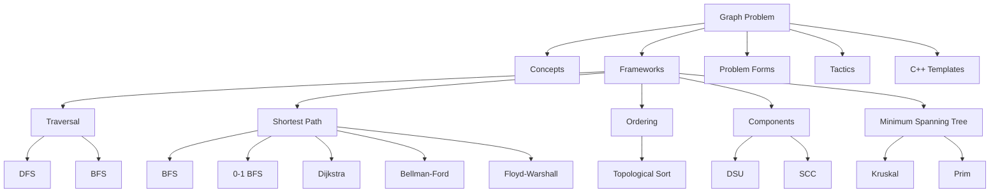

---

# 1. Concepts

## 1.1 What Is a Graph?

A graph is:

```text
G = (V, E)

V = vertices / nodes
E = edges / connections
```

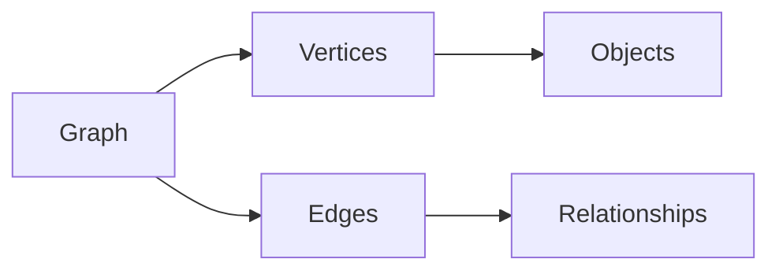

Mental trick:

```text
Nodes are things.
Edges are relationships.
```

---

## 1.2 Nodes and Edges

Examples:

| Problem object | Node |
|---|---|
| city map | city |
| social network | person |
| grid maze | cell |
| word transformation | word/string |
| game state | full state |
| dependency problem | task/course |

Edges represent possible movement, relation, dependency, or transition.

---

## 1.3 Directed vs Undirected

Undirected:

```text
u -- v
```

Add both directions.

```cpp
g[u].push_back(v);
g[v].push_back(u);
```

Directed:

```text
u -> v
```

Add only one direction.

```cpp
g[u].push_back(v);
```

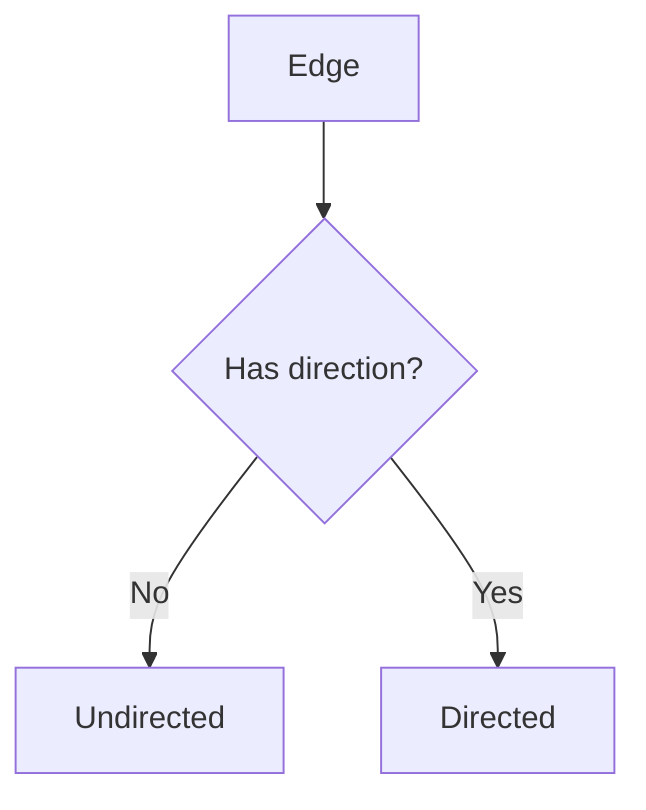

---

## 1.4 Weighted vs Unweighted

Unweighted graph:

```text
all edges have equal cost
```

Weighted graph:

```text
edge has cost or distance
```

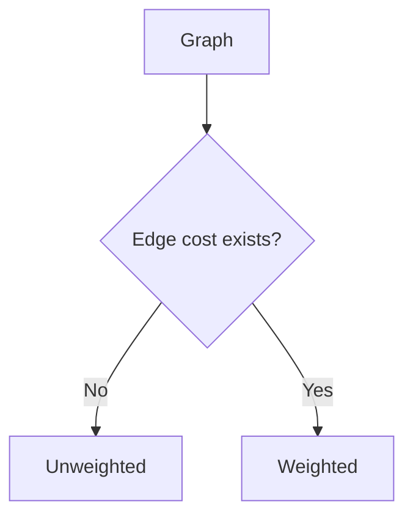

Algorithm hint:

```text
unweighted shortest path -> BFS
weighted non-negative shortest path -> Dijkstra
```

---

## 1.5 Sparse vs Dense

Let:

```text
N = nodes
M = edges
```

Sparse:

```text
M is much smaller than N^2
```

Dense:

```text
M is close to N^2
```

Representation hint:

```text
Sparse -> adjacency list
Dense -> adjacency matrix may be okay
```

---

## 1.6 Path, Cycle, Reachability

Path:

```text
sequence of nodes connected by edges
```

Cycle:

```text
path that returns to an earlier node
```

Reachability:

```text
can we go from u to v?
```

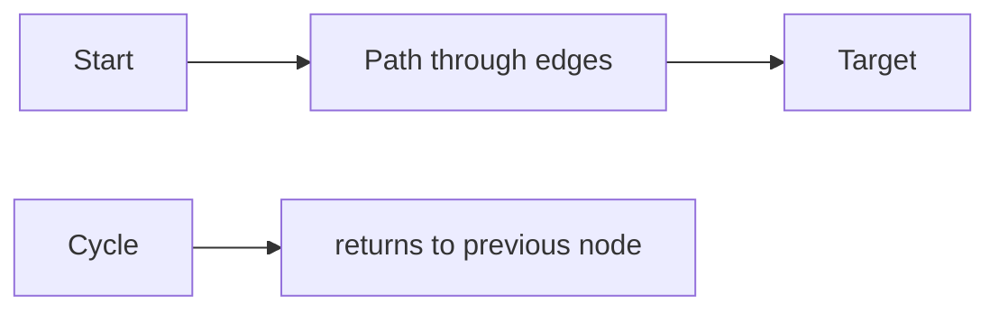

---

## 1.7 Connected Components

A connected component is a maximal group of nodes reachable from each other in an undirected graph.

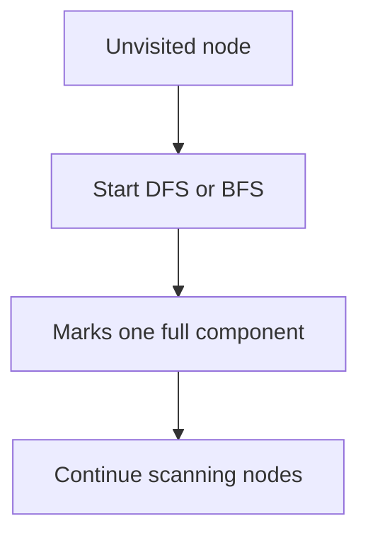

---

## 1.8 Trees and DAGs

Tree:

```text
connected undirected acyclic graph
edges = nodes - 1
```

DAG:

```text
Directed Acyclic Graph
```

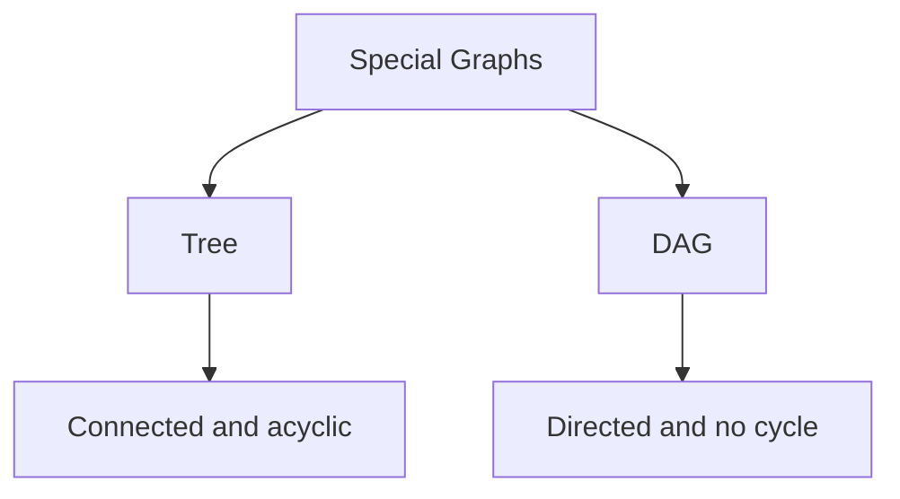

Trees often use DFS.  
DAGs often use topological sort.

---

## 1.9 Graph Representations

### Adjacency List

Best default.

```cpp
vector<vector<int>> g(n + 1);
```

Weighted:

```cpp
vector<vector<pair<int,int>>> g(n + 1);
```

### Adjacency Matrix

Good for dense graph or fast edge check.

```cpp
vector<vector<int>> mat(n + 1, vector<int>(n + 1, 0));
```

### Edge List

Good for Kruskal and Bellman-Ford.

```cpp
struct Edge {
    int u, v;
    long long w;
};
vector<Edge> edges;
```

---

## 1.10 Implicit Graphs and State Graphs

Sometimes graph is not given directly.

Grid:

```text
node = cell
edge = movement to neighbour cell
```

State graph:

```text
node = full condition, like (city, fuel)
edge = transition from one state to another
```

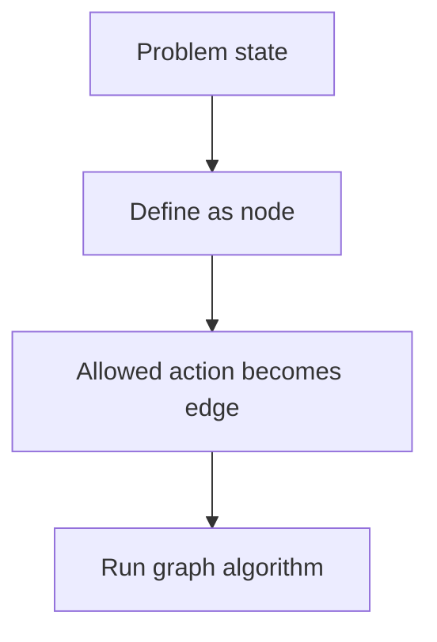

---

# 2. Frameworks With Templates and Examples

## 2.1 Graph Formulation Framework

### When to use

Use at the start of every graph problem.

### Template

```text
1. What is a node?
2. What is an edge?
3. Is the edge directed?
4. Is the edge weighted?
5. What is the source/target?
6. What is being optimized or checked?
7. Which algorithm fits?
```

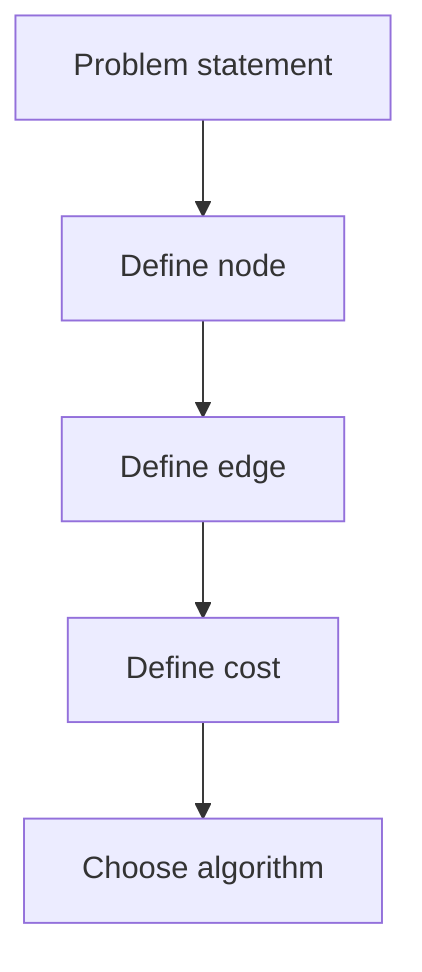

### Example: Maze

Problem:

```text
Find shortest path from S to E in grid with walls.
```

Formulation:

```text
node = cell (r,c)
edge = move up/down/left/right
cost = 1 per move
blocked = wall
algorithm = BFS
```

---

## 2.2 DFS Framework

### Use when

- reachability
- components
- tree traversal
- cycle detection
- subtree DP
- flood fill
- topological DFS

### Template

```cpp
void dfs(int u) {
    visited[u] = true;

    for (int v : g[u]) {
        if (!visited[v]) {
            dfs(v);
        }
    }
}
```

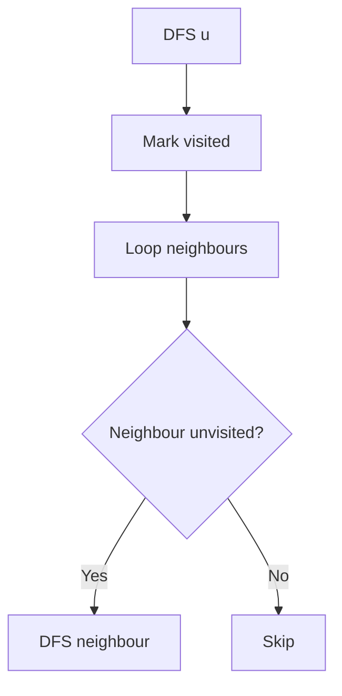

### Example

Graph edges:

```text
1-2, 2-3, 4-5
```

DFS from `1` visits:

```text
1,2,3
```

Node `4` remains unvisited, so it is a different component.

---

## 2.3 BFS Framework

### Use when

- shortest path in unweighted graph
- level order traversal
- minimum number of moves
- grid shortest path
- multi-source spread

### Template

```cpp
vector<int> bfs(int n, vector<vector<int>>& g, int src) {
    const int INF = 1e9;
    vector<int> dist(n + 1, INF);
    queue<int> q;

    dist[src] = 0;
    q.push(src);

    while (!q.empty()) {
        int u = q.front();
        q.pop();

        for (int v : g[u]) {
            if (dist[v] == INF) {
                dist[v] = dist[u] + 1;
                q.push(v);
            }
        }
    }

    return dist;
}
```

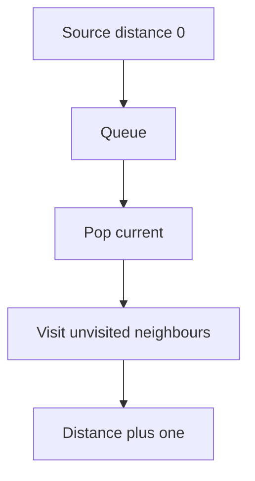

### Example

If source is `1`:

```text
dist[1] = 0
neighbours of 1 get dist 1
their neighbours get dist 2
```

---

## 2.4 Grid BFS/DFS Framework

### Use when

Problem is on a matrix.

### Template

```cpp
int dr[4] = {1, -1, 0, 0};
int dc[4] = {0, 0, 1, -1};

bool valid(int r, int c) {
    return r >= 0 && r < n && c >= 0 && c < m && grid[r][c] != '#';
}
```

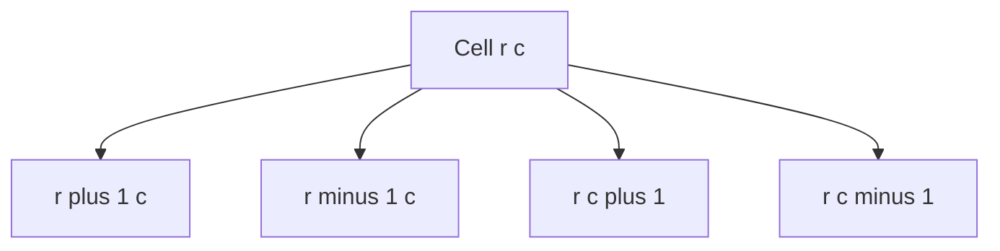

### Example

For grid shortest path:

```text
node = cell
edge = valid movement to neighbour
algorithm = BFS
```

---

## 2.5 Connected Components Framework

### Template

```cpp
int countComponents(int n, vector<vector<int>>& g) {
    vector<int> vis(n + 1, 0);
    int components = 0;

    function<void(int)> dfs = [&](int u) {
        vis[u] = 1;

        for (int v : g[u]) {
            if (!vis[v]) dfs(v);
        }
    };

    for (int i = 1; i <= n; i++) {
        if (!vis[i]) {
            components++;
            dfs(i);
        }
    }

    return components;
}
```

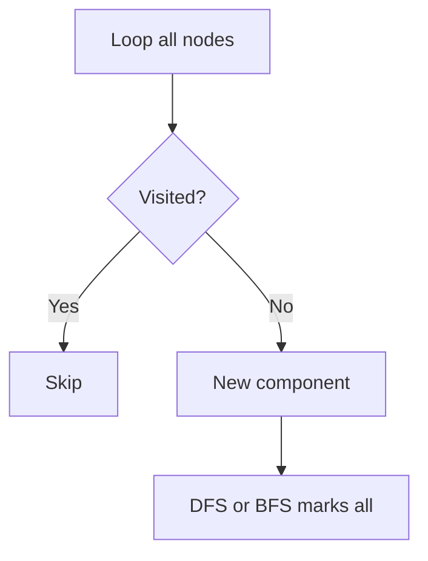

### Example

If nodes split into:

```text
{1,2,3}, {4,5}, {6}
```

Answer is:

```text
3 components
```

---

## 2.6 Cycle Detection Framework

### Undirected

If during DFS you find a visited neighbour that is not parent, cycle exists.

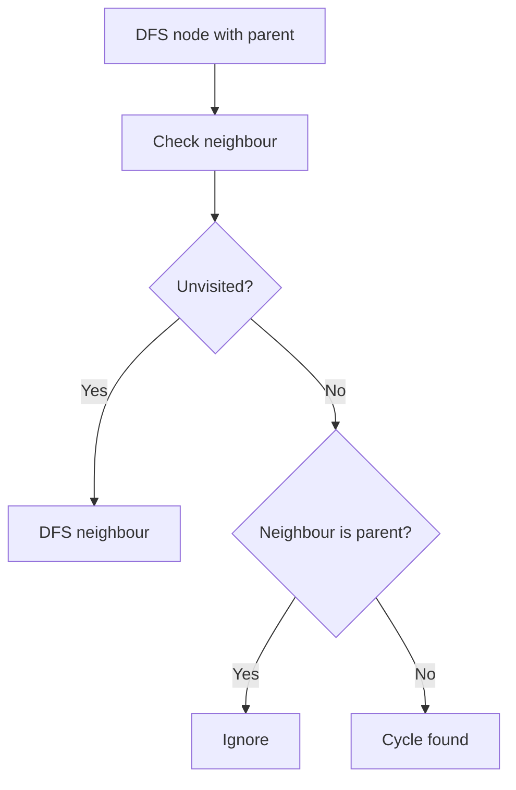

### Directed

Use colors:

```text
0 = unvisited
1 = currently in recursion stack
2 = finished
```

Back edge to color `1` means cycle.

---

## 2.7 Bipartite Framework

### Use when

Need to split graph into two groups with no same-group edge.

### Template idea

```text
color source 0
neighbour gets opposite color
same color edge means impossible
```

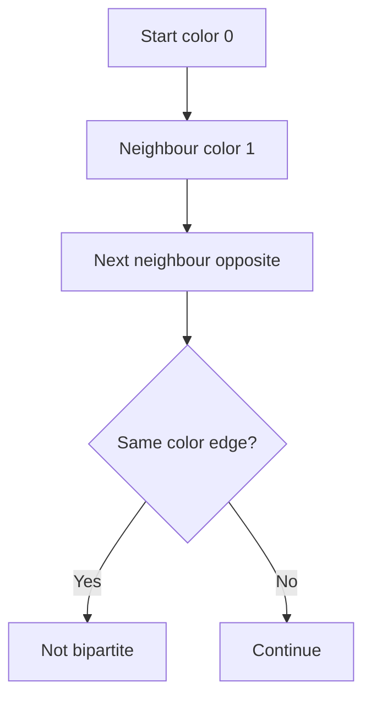

### Example

Odd cycle:

```text
1-2-3-1
```

Not bipartite.

Even cycle:

```text
1-2-3-4-1
```

Bipartite.

---

## 2.8 Multi-Source BFS Framework

### Use when

Need distance to nearest source.

Examples:
- nearest hospital
- rotting oranges
- fire spread
- monsters
- nearest zero in matrix

### Template

```text
Push all sources with distance 0.
Run BFS once.
```

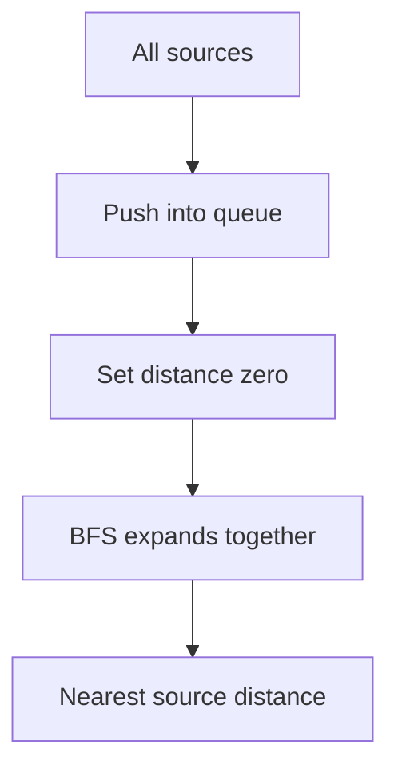

### Example

In a grid with many monsters, multi-source BFS gives time when the nearest monster reaches every cell.

---

## 2.9 Shortest Path Selection Framework

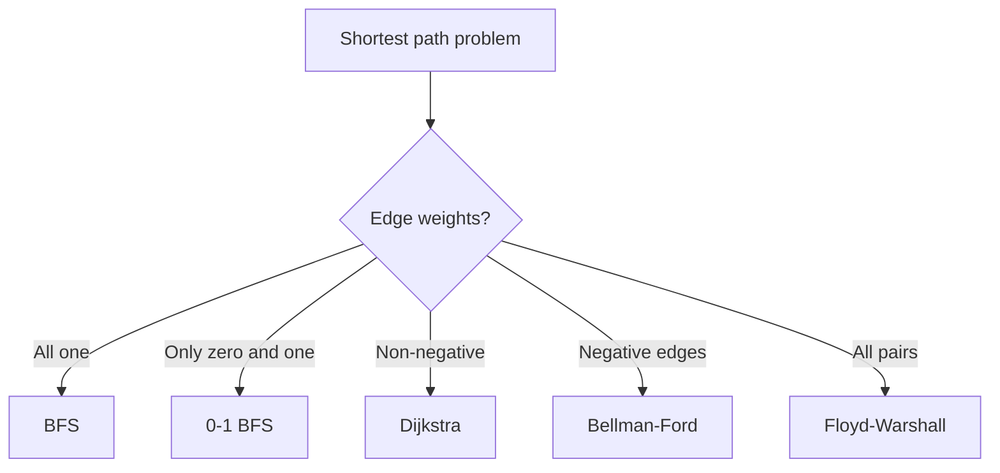

### Example

| Edge cost type | Algorithm |
|---|---|
| all cost 1 | BFS |
| only 0 or 1 | 0-1 BFS |
| positive weights | Dijkstra |
| negative edge exists | Bellman-Ford |
| many all-pairs queries | Floyd-Warshall |

---

## 2.10 0-1 BFS Framework

### Use when

All edge weights are only:

```text
0 or 1
```

### Template

```cpp
vector<int> zeroOneBFS(int n, vector<vector<pair<int,int>>>& g, int src) {
    const int INF = 1e9;
    vector<int> dist(n + 1, INF);
    deque<int> dq;

    dist[src] = 0;
    dq.push_front(src);

    while (!dq.empty()) {
        int u = dq.front();
        dq.pop_front();

        for (auto [v, w] : g[u]) {
            if (dist[v] > dist[u] + w) {
                dist[v] = dist[u] + w;

                if (w == 0) dq.push_front(v);
                else dq.push_back(v);
            }
        }
    }

    return dist;
}
```

### Example

Moving into an empty cell costs `0`, breaking a wall costs `1`.

```text
edge cost 0 -> push front
edge cost 1 -> push back
```

---

## 2.11 Dijkstra Framework

### Use when

Single-source shortest path with non-negative weights.

### Template

```cpp
vector<long long> dijkstra(int n, vector<vector<pair<int,int>>>& g, int src) {
    const long long INF = 4e18;
    vector<long long> dist(n + 1, INF);

    priority_queue<
        pair<long long,int>,
        vector<pair<long long,int>>,
        greater<pair<long long,int>>
    > pq;

    dist[src] = 0;
    pq.push({0, src});

    while (!pq.empty()) {
        auto [du, u] = pq.top();
        pq.pop();

        if (du != dist[u]) continue;

        for (auto [v, w] : g[u]) {
            if (dist[v] > dist[u] + w) {
                dist[v] = dist[u] + w;
                pq.push({dist[v], v});
            }
        }
    }

    return dist;
}
```

### Example

Road network:

```text
node = city
edge = road
weight = travel time
algorithm = Dijkstra
```

---

## 2.12 Bellman-Ford Framework

### Use when

Graph has negative edges.

### Template

```cpp
struct Edge {
    int u, v;
    long long w;
};

vector<long long> bellmanFord(int n, vector<Edge>& edges, int src) {
    const long long INF = 4e18;
    vector<long long> dist(n + 1, INF);

    dist[src] = 0;

    for (int iter = 1; iter <= n - 1; iter++) {
        bool changed = false;

        for (auto e : edges) {
            if (dist[e.u] == INF) continue;

            if (dist[e.v] > dist[e.u] + e.w) {
                dist[e.v] = dist[e.u] + e.w;
                changed = true;
            }
        }

        if (!changed) break;
    }

    return dist;
}
```

### Example

If discounts or profits create negative edges, Dijkstra may fail. Use Bellman-Ford.

---

## 2.13 Floyd-Warshall Framework

### Use when

Need all-pairs shortest path and `n` is small enough.

### Template

```cpp
for (int k = 1; k <= n; k++) {
    for (int i = 1; i <= n; i++) {
        for (int j = 1; j <= n; j++) {
            dist[i][j] = min(dist[i][j], dist[i][k] + dist[k][j]);
        }
    }
}
```

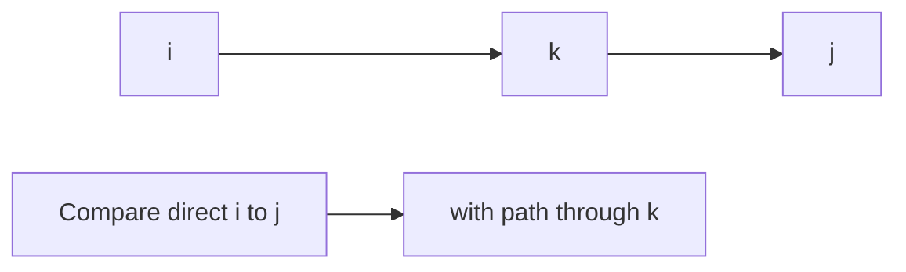

### Example

Many queries:

```text
What is shortest path between u and v?
```

If `n <= 400`, Floyd-Warshall can be useful.

---

## 2.14 Topological Sort Framework

### Use when

Directed dependency graph.

```text
u -> v means u must happen before v
```

### Kahn Template

```cpp
vector<int> topoKahn(int n, vector<vector<int>>& g) {
    vector<int> indeg(n + 1, 0);

    for (int u = 1; u <= n; u++) {
        for (int v : g[u]) indeg[v]++;
    }

    queue<int> q;
    for (int i = 1; i <= n; i++) {
        if (indeg[i] == 0) q.push(i);
    }

    vector<int> topo;

    while (!q.empty()) {
        int u = q.front();
        q.pop();

        topo.push_back(u);

        for (int v : g[u]) {
            indeg[v]--;
            if (indeg[v] == 0) q.push(v);
        }
    }

    return topo;
}
```

### Example

Courses:

```text
edge prerequisite -> course
topological order = valid course order
```

---

## 2.15 DSU Framework

### Use when

Need dynamic connectivity while adding edges.

Examples:
- Kruskal MST
- count components after unions
- detect cycle in undirected graph
- group merging

### Template

```cpp
struct DSU {
    vector<int> parent, sz;

    DSU(int n) {
        parent.resize(n + 1);
        sz.assign(n + 1, 1);

        for (int i = 1; i <= n; i++) {
            parent[i] = i;
        }
    }

    int find(int x) {
        if (parent[x] == x) return x;
        return parent[x] = find(parent[x]);
    }

    bool unite(int a, int b) {
        a = find(a);
        b = find(b);

        if (a == b) return false;

        if (sz[a] < sz[b]) swap(a, b);

        parent[b] = a;
        sz[a] += sz[b];

        return true;
    }
};
```

### Example

When adding edge `(u,v)`:
- if `find(u) == find(v)`, adding it creates a cycle
- otherwise union them

---

## 2.16 MST Framework

### Use when

Need connect all nodes with minimum total edge cost.

### Kruskal

```text
sort edges by weight
add edge if it connects different components
```

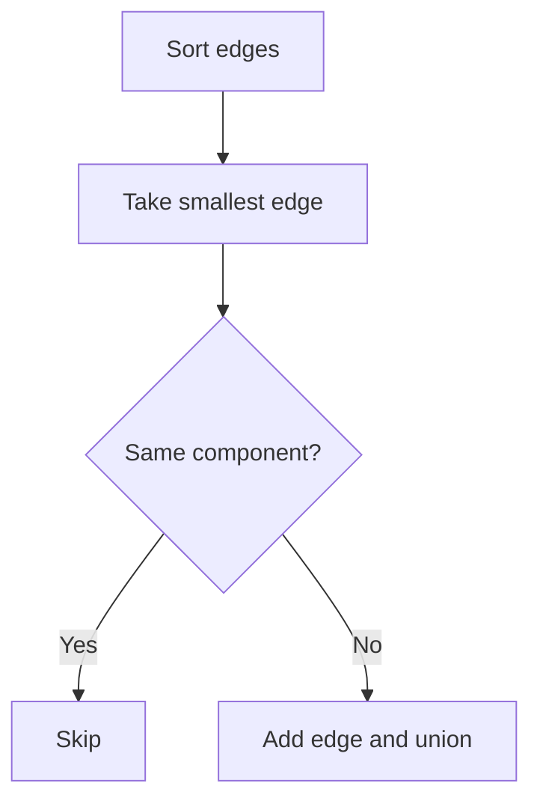

### Example

Minimum cost to connect cities with roads.

---

## 2.17 SCC Framework

### Use when

Directed graph has mutual reachability groups.

Applications:
- cycle membership
- condensation DAG
- 2-SAT foundation
- strongly connected regions

### Kosaraju idea

```text
1. DFS order by finish time.
2. Reverse graph.
3. DFS in reverse finish order.
```

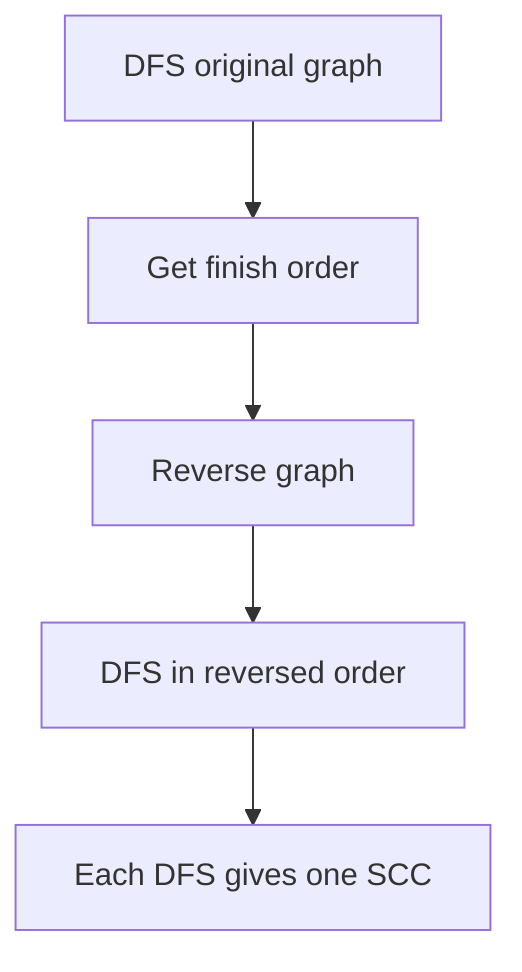

---

## 2.18 State Graph Framework

### Use when

The same physical node can have different future possibilities depending on extra information.

Examples:
- `(row, col, walls_broken)`
- `(city, fuel)`
- `(node, used_coupon)`
- `(mask, last_node)`
- `(position, key_set)`

### Template

```text
state = all information needed for future decisions
edge = one valid transition
cost = transition cost
algorithm = BFS / Dijkstra / DP
```

```mermaid
flowchart TD
    A["Original node"] --> B["Expanded states"]
    B --> C["State transitions"]
    C --> D["Run graph algorithm"]
```

### Example

Can break at most `k` walls:

```text
state = (r, c, broken)
move into wall -> broken + 1
move into empty -> broken unchanged
algorithm = BFS
```

---

# 3. Problem Forms

## 3.1 Build Graph From Input

### Undirected

```cpp
vector<vector<int>> g(n + 1);

for (int i = 0; i < m; i++) {
    int u, v;
    cin >> u >> v;

    g[u].push_back(v);
    g[v].push_back(u);
}
```

### Directed

```cpp
vector<vector<int>> g(n + 1);

for (int i = 0; i < m; i++) {
    int u, v;
    cin >> u >> v;

    g[u].push_back(v);
}
```

### Weighted

```cpp
vector<vector<pair<int,int>>> g(n + 1);

for (int i = 0; i < m; i++) {
    int u, v, w;
    cin >> u >> v >> w;

    g[u].push_back({v, w});
}
```

---

## 3.2 Reachability

```cpp
bool reachable(int n, vector<vector<int>>& g, int src, int target) {
    vector<int> vis(n + 1, 0);

    function<void(int)> dfs = [&](int u) {
        vis[u] = 1;

        for (int v : g[u]) {
            if (!vis[v]) dfs(v);
        }
    };

    dfs(src);
    return vis[target];
}
```

---

## 3.3 Count Connected Components

```cpp
int countComponents(int n, vector<vector<int>>& g) {
    vector<int> vis(n + 1, 0);
    int components = 0;

    function<void(int)> dfs = [&](int u) {
        vis[u] = 1;

        for (int v : g[u]) {
            if (!vis[v]) dfs(v);
        }
    };

    for (int i = 1; i <= n; i++) {
        if (!vis[i]) {
            components++;
            dfs(i);
        }
    }

    return components;
}
```

---

## 3.4 Component Size and Component ID

```cpp
vector<int> comp;
vector<int> compSize;

void dfsComponent(int u, int id, vector<vector<int>>& g) {
    comp[u] = id;
    compSize[id]++;

    for (int v : g[u]) {
        if (comp[v] == 0) {
            dfsComponent(v, id, g);
        }
    }
}
```

---

## 3.5 Unweighted Shortest Path

Use BFS.

```cpp
vector<int> shortestUnweighted(int n, vector<vector<int>>& g, int src) {
    vector<int> dist(n + 1, -1);
    queue<int> q;

    dist[src] = 0;
    q.push(src);

    while (!q.empty()) {
        int u = q.front();
        q.pop();

        for (int v : g[u]) {
            if (dist[v] == -1) {
                dist[v] = dist[u] + 1;
                q.push(v);
            }
        }
    }

    return dist;
}
```

---

## 3.6 Print Shortest Path

```cpp
vector<int> shortestPath(int n, vector<vector<int>>& g, int src, int target) {
    vector<int> dist(n + 1, -1), parent(n + 1, -1);
    queue<int> q;

    dist[src] = 0;
    q.push(src);

    while (!q.empty()) {
        int u = q.front();
        q.pop();

        for (int v : g[u]) {
            if (dist[v] == -1) {
                dist[v] = dist[u] + 1;
                parent[v] = u;
                q.push(v);
            }
        }
    }

    if (dist[target] == -1) return {};

    vector<int> path;
    for (int cur = target; cur != -1; cur = parent[cur]) {
        path.push_back(cur);
    }

    reverse(path.begin(), path.end());
    return path;
}
```

---

## 3.7 Grid Shortest Path

```cpp
int shortestGridPath(vector<string>& grid, pair<int,int> src, pair<int,int> target) {
    int n = grid.size();
    int m = grid[0].size();

    vector<vector<int>> dist(n, vector<int>(m, -1));
    queue<pair<int,int>> q;

    int dr[4] = {1, -1, 0, 0};
    int dc[4] = {0, 0, 1, -1};

    auto valid = [&](int r, int c) {
        return r >= 0 && r < n && c >= 0 && c < m && grid[r][c] != '#';
    };

    dist[src.first][src.second] = 0;
    q.push(src);

    while (!q.empty()) {
        auto [r, c] = q.front();
        q.pop();

        for (int k = 0; k < 4; k++) {
            int nr = r + dr[k];
            int nc = c + dc[k];

            if (valid(nr, nc) && dist[nr][nc] == -1) {
                dist[nr][nc] = dist[r][c] + 1;
                q.push({nr, nc});
            }
        }
    }

    return dist[target.first][target.second];
}
```

---

## 3.8 Number of Islands

```cpp
void dfsIsland(vector<vector<char>>& grid, int r, int c) {
    int n = grid.size();
    int m = grid[0].size();

    if (r < 0 || c < 0 || r >= n || c >= m || grid[r][c] != '1') {
        return;
    }

    grid[r][c] = '0';

    dfsIsland(grid, r + 1, c);
    dfsIsland(grid, r - 1, c);
    dfsIsland(grid, r, c + 1);
    dfsIsland(grid, r, c - 1);
}

int numIslands(vector<vector<char>>& grid) {
    int ans = 0;

    for (int i = 0; i < (int)grid.size(); i++) {
        for (int j = 0; j < (int)grid[0].size(); j++) {
            if (grid[i][j] == '1') {
                ans++;
                dfsIsland(grid, i, j);
            }
        }
    }

    return ans;
}
```

---

## 3.9 Bipartite Check

```cpp
bool isBipartite(int n, vector<vector<int>>& g) {
    vector<int> color(n + 1, -1);

    for (int src = 1; src <= n; src++) {
        if (color[src] != -1) continue;

        queue<int> q;
        color[src] = 0;
        q.push(src);

        while (!q.empty()) {
            int u = q.front();
            q.pop();

            for (int v : g[u]) {
                if (color[v] == -1) {
                    color[v] = color[u] ^ 1;
                    q.push(v);
                } else if (color[v] == color[u]) {
                    return false;
                }
            }
        }
    }

    return true;
}
```

---

## 3.10 Undirected Cycle Detection

```cpp
bool hasCycleUndirected(int n, vector<vector<int>>& g) {
    vector<int> vis(n + 1, 0);

    function<bool(int, int)> dfs = [&](int u, int parent) {
        vis[u] = 1;

        for (int v : g[u]) {
            if (!vis[v]) {
                if (dfs(v, u)) return true;
            } else if (v != parent) {
                return true;
            }
        }

        return false;
    };

    for (int i = 1; i <= n; i++) {
        if (!vis[i] && dfs(i, -1)) return true;
    }

    return false;
}
```

---

## 3.11 Directed Cycle Detection

```cpp
bool hasCycleDirected(int n, vector<vector<int>>& g) {
    vector<int> color(n + 1, 0);

    function<bool(int)> dfs = [&](int u) {
        color[u] = 1;

        for (int v : g[u]) {
            if (color[v] == 0) {
                if (dfs(v)) return true;
            } else if (color[v] == 1) {
                return true;
            }
        }

        color[u] = 2;
        return false;
    };

    for (int i = 1; i <= n; i++) {
        if (color[i] == 0 && dfs(i)) return true;
    }

    return false;
}
```

---

## 3.12 Topological Ordering

```cpp
vector<int> topoKahn(int n, vector<vector<int>>& g) {
    vector<int> indeg(n + 1, 0);

    for (int u = 1; u <= n; u++) {
        for (int v : g[u]) indeg[v]++;
    }

    queue<int> q;
    for (int i = 1; i <= n; i++) {
        if (indeg[i] == 0) q.push(i);
    }

    vector<int> topo;

    while (!q.empty()) {
        int u = q.front();
        q.pop();

        topo.push_back(u);

        for (int v : g[u]) {
            indeg[v]--;
            if (indeg[v] == 0) q.push(v);
        }
    }

    return topo;
}
```

---

## 3.13 Course Schedule / Dependency Problems

If topological order size is not `n`, cycle exists.

```cpp
bool canFinish(int n, vector<vector<int>>& g) {
    vector<int> topo = topoKahn(n, g);
    return (int)topo.size() == n;
}
```

---

## 3.14 Longest Path in DAG

```cpp
int longestPathDAG(int n, vector<vector<int>>& g) {
    vector<int> topo = topoKahn(n, g);
    vector<int> dp(n + 1, 0);

    for (int u : topo) {
        for (int v : g[u]) {
            dp[v] = max(dp[v], dp[u] + 1);
        }
    }

    return *max_element(dp.begin(), dp.end());
}
```

---

## 3.15 Multi-Source BFS

```cpp
vector<int> multiSourceBFS(int n, vector<vector<int>>& g, vector<int>& sources) {
    vector<int> dist(n + 1, -1);
    queue<int> q;

    for (int s : sources) {
        dist[s] = 0;
        q.push(s);
    }

    while (!q.empty()) {
        int u = q.front();
        q.pop();

        for (int v : g[u]) {
            if (dist[v] == -1) {
                dist[v] = dist[u] + 1;
                q.push(v);
            }
        }
    }

    return dist;
}
```

---

## 3.16 Monster Escape / Fire Spread

Strategy:

```text
1. Multi-source BFS from all monsters/fire cells.
2. BFS from player.
3. Player can step into cell only if playerTime < monsterTime.
```

```mermaid
flowchart TD
    A["All monsters"] --> B["Monster distance grid"]
    C["Player"] --> D["Player BFS"]
    B --> E["Compare times"]
    D --> E
    E --> F["Escape if player reaches boundary earlier"]
```

---

## 3.17 0-1 BFS Wall Breaking

```cpp
int minWallsToBreak(vector<string>& grid, pair<int,int> start, pair<int,int> finish) {
    int n = grid.size();
    int m = grid[0].size();

    const int INF = 1e9;
    vector<vector<int>> dist(n, vector<int>(m, INF));
    deque<pair<int,int>> dq;

    int dr[4] = {1, -1, 0, 0};
    int dc[4] = {0, 0, 1, -1};

    auto valid = [&](int r, int c) {
        return r >= 0 && r < n && c >= 0 && c < m;
    };

    dist[start.first][start.second] = 0;
    dq.push_front(start);

    while (!dq.empty()) {
        auto [r, c] = dq.front();
        dq.pop_front();

        for (int k = 0; k < 4; k++) {
            int nr = r + dr[k];
            int nc = c + dc[k];

            if (!valid(nr, nc)) continue;

            int w = (grid[nr][nc] == '#');

            if (dist[nr][nc] > dist[r][c] + w) {
                dist[nr][nc] = dist[r][c] + w;

                if (w == 0) dq.push_front({nr, nc});
                else dq.push_back({nr, nc});
            }
        }
    }

    return dist[finish.first][finish.second];
}
```

---

## 3.18 Dijkstra Shortest Path

Use the template from [2.11 Dijkstra Framework](#211-dijkstra-framework).

---

## 3.19 Dijkstra on State Graph

Example state:

```text
(city, fuel)
```

General rule:

```text
If same node with different condition behaves differently, add condition to state.
```

```cpp
struct Item {
    long long dist;
    int node;
    int state;

    bool operator>(const Item& other) const {
        return dist > other.dist;
    }
};
```

---

## 3.20 Bellman-Ford Negative Edges

Use the template from [2.12 Bellman-Ford Framework](#212-bellman-ford-framework).

---

## 3.21 Negative Cycle Detection

```cpp
bool hasNegativeCycle(int n, vector<Edge>& edges, int src) {
    const long long INF = 4e18;
    vector<long long> dist(n + 1, INF);

    dist[src] = 0;

    for (int iter = 1; iter <= n - 1; iter++) {
        for (auto e : edges) {
            if (dist[e.u] != INF && dist[e.v] > dist[e.u] + e.w) {
                dist[e.v] = dist[e.u] + e.w;
            }
        }
    }

    for (auto e : edges) {
        if (dist[e.u] != INF && dist[e.v] > dist[e.u] + e.w) {
            return true;
        }
    }

    return false;
}
```

---

## 3.22 Floyd-Warshall All Pairs

```cpp
void floydWarshall(vector<vector<long long>>& dist, int n) {
    const long long INF = 4e18;

    for (int k = 1; k <= n; k++) {
        for (int i = 1; i <= n; i++) {
            for (int j = 1; j <= n; j++) {
                if (dist[i][k] == INF || dist[k][j] == INF) continue;

                dist[i][j] = min(dist[i][j], dist[i][k] + dist[k][j]);
            }
        }
    }
}
```

---

## 3.23 Transitive Closure

```cpp
void transitiveClosure(int n, vector<vector<int>>& reach) {
    for (int k = 1; k <= n; k++) {
        for (int i = 1; i <= n; i++) {
            for (int j = 1; j <= n; j++) {
                reach[i][j] = reach[i][j] || (reach[i][k] && reach[k][j]);
            }
        }
    }
}
```

---

## 3.24 Kruskal MST

```cpp
struct EdgeMST {
    int u, v;
    long long w;
};

long long kruskal(int n, vector<EdgeMST>& edges) {
    sort(edges.begin(), edges.end(), [](const EdgeMST& a, const EdgeMST& b) {
        return a.w < b.w;
    });

    DSU dsu(n);
    long long cost = 0;
    int used = 0;

    for (auto e : edges) {
        if (dsu.unite(e.u, e.v)) {
            cost += e.w;
            used++;

            if (used == n - 1) break;
        }
    }

    if (used != n - 1) return -1;
    return cost;
}
```

---

## 3.25 Prim MST

```cpp
long long prim(int n, vector<vector<pair<int,int>>>& g) {
    vector<int> used(n + 1, 0);

    priority_queue<
        pair<int,int>,
        vector<pair<int,int>>,
        greater<pair<int,int>>
    > pq;

    pq.push({0, 1});

    long long cost = 0;
    int taken = 0;

    while (!pq.empty()) {
        auto [w, u] = pq.top();
        pq.pop();

        if (used[u]) continue;

        used[u] = 1;
        cost += w;
        taken++;

        for (auto [v, nw] : g[u]) {
            if (!used[v]) {
                pq.push({nw, v});
            }
        }
    }

    if (taken != n) return -1;
    return cost;
}
```

---

## 3.26 Super Node Trick

If each node has activation/build cost:

```text
Create super node 0.
Connect 0 to every node i with edge cost activationCost[i].
Run MST.
```

```mermaid
flowchart TD
    A["Super node 0"] --> B["Node 1"]
    A --> C["Node 2"]
    A --> D["Node 3"]
    B --> E["Original graph edges"]
    C --> E
    D --> E
```

---

## 3.27 Strongly Connected Components

### Kosaraju

```cpp
vector<vector<int>> g, rg;
vector<int> vis, order, comp;

void dfs1(int u) {
    vis[u] = 1;

    for (int v : g[u]) {
        if (!vis[v]) dfs1(v);
    }

    order.push_back(u);
}

void dfs2(int u, int id) {
    comp[u] = id;

    for (int v : rg[u]) {
        if (comp[v] == 0) dfs2(v, id);
    }
}

int kosaraju(int n) {
    vis.assign(n + 1, 0);
    comp.assign(n + 1, 0);
    order.clear();

    for (int i = 1; i <= n; i++) {
        if (!vis[i]) dfs1(i);
    }

    reverse(order.begin(), order.end());

    int id = 0;
    for (int u : order) {
        if (comp[u] == 0) {
            id++;
            dfs2(u, id);
        }
    }

    return id;
}
```

---

## 3.28 Bridges and Articulation Points

Use DFS timestamps.

Bridge:

```text
edge u-v is bridge if low[v] > tin[u]
```

Articulation point:

```text
non-root u is articulation if low[v] >= tin[u]
root is articulation if it has more than one DFS child
```

```mermaid
flowchart TD
    A["DFS timestamps"] --> B["tin u"]
    A --> C["low u"]
    C --> D["Detect bridge or articulation"]
```

---

# 4. Tactics

## 4.1 Algorithm Recognition Table

| Problem clue | Use |
|---|---|
| reachability | DFS/BFS |
| count components | DFS/BFS |
| shortest path, unweighted | BFS |
| grid shortest path | BFS |
| nearest source | multi-source BFS |
| edge weights 0/1 | 0-1 BFS |
| non-negative weights | Dijkstra |
| negative edges | Bellman-Ford |
| all-pairs shortest path | Floyd-Warshall |
| dependencies/order | Topological sort |
| directed cycle | DFS colors or Kahn |
| undirected cycle | DFS parent or DSU |
| connect all cheapest | MST |
| dynamic connectivity with unions | DSU |
| mutually reachable groups | SCC |
| critical edges/nodes | bridges/articulation |

---

## 4.2 Graph Formulation Tactics

Always write:

```text
Node =
Edge =
Cost =
Source =
Target =
Algorithm =
```

If graph is hidden, create it mentally.

---

## 4.3 Representation Tactics

| Need | Representation |
|---|---|
| iterate neighbours | adjacency list |
| check edge fast | adjacency matrix |
| sort edges | edge list |
| Bellman-Ford | edge list |
| Kruskal | edge list |
| Floyd-Warshall | matrix |
| grid | implicit graph |

---

## 4.4 Traversal Tactics

DFS:
- components
- recursion tree
- cycle detection
- low-link algorithms

BFS:
- shortest path in unweighted graph
- levels
- minimum moves
- spread simulation

---

## 4.5 Shortest Path Tactics

```text
All weights same -> BFS
Weights 0/1 -> 0-1 BFS
Non-negative -> Dijkstra
Negative edge -> Bellman-Ford
All pairs -> Floyd-Warshall
```

Never use Dijkstra with negative edges.

---

## 4.6 Grid Tactics

For grid problems:

```text
node = cell
directions = 4 or 8 moves
valid = inside + not blocked
visited/dist matrix
```

If keys, walls broken, fuel, day/night, or special condition matters:

```text
state = (row, col, condition)
```

---

## 4.7 Cycle Tactics

Undirected:

```text
visited neighbour not parent means cycle
```

Directed:

```text
edge to currently exploring node means cycle
```

Kahn:

```text
topological size less than n means cycle
```

---

## 4.8 Topological Sort Tactics

Use when:
- prerequisite
- dependency
- must happen before
- build order
- DAG DP

Indegree zero means:

```text
nothing blocks this node
```

---

## 4.9 MST Tactics

Use MST when:
- connect all nodes
- minimum total connection cost
- choose `n - 1` edges
- no cycles
- network/wiring/roads/pipes

Kruskal:
- edge list
- sort edges
- DSU

Prim:
- adjacency list
- priority queue
- grows from one node

---

## 4.10 State Graph Tactics

Add state dimension when future options depend on history.

Examples:

| Extra condition | State |
|---|---|
| walls broken | `(r,c,broken)` |
| fuel left | `(city,fuel)` |
| used coupon | `(node,used)` |
| collected keys | `(r,c,mask)` |
| visited subset | `(mask,last)` |

---

## 4.11 Common Mistakes

1. Adding reverse edge in directed graph.
2. Forgetting reverse edge in undirected graph.
3. Using BFS for weighted graph.
4. Using Dijkstra with negative edges.
5. Not initializing distances to INF.
6. Forgetting disconnected components.
7. Not checking all nodes for cycle/component.
8. Stack overflow with recursive DFS on large graph.
9. Confusing indegree and outdegree.
10. Not handling multiple edges in Floyd-Warshall.
11. Not using `long long` for distances.
12. Missing state dimension in grid/state graph.
13. Reusing visited incorrectly in shortest path.
14. Not skipping stale Dijkstra priority queue entries.

---

# 5. C++ Template Library

## 5.1 DFS

```cpp
void dfs(int u) {
    vis[u] = 1;

    for (int v : g[u]) {
        if (!vis[v]) dfs(v);
    }
}
```

---

## 5.2 BFS

```cpp
vector<int> bfs(int n, vector<vector<int>>& g, int src) {
    vector<int> dist(n + 1, -1);
    queue<int> q;

    dist[src] = 0;
    q.push(src);

    while (!q.empty()) {
        int u = q.front();
        q.pop();

        for (int v : g[u]) {
            if (dist[v] == -1) {
                dist[v] = dist[u] + 1;
                q.push(v);
            }
        }
    }

    return dist;
}
```

---

## 5.3 Grid Directions

```cpp
int dr4[4] = {1, -1, 0, 0};
int dc4[4] = {0, 0, 1, -1};

int dr8[8] = {1, 1, 1, 0, 0, -1, -1, -1};
int dc8[8] = {1, 0, -1, 1, -1, 1, 0, -1};
```

---

## 5.4 Dijkstra

```cpp
vector<long long> dijkstra(int n, vector<vector<pair<int,int>>>& g, int src) {
    const long long INF = 4e18;
    vector<long long> dist(n + 1, INF);

    priority_queue<
        pair<long long,int>,
        vector<pair<long long,int>>,
        greater<pair<long long,int>>
    > pq;

    dist[src] = 0;
    pq.push({0, src});

    while (!pq.empty()) {
        auto [du, u] = pq.top();
        pq.pop();

        if (du != dist[u]) continue;

        for (auto [v, w] : g[u]) {
            if (dist[v] > dist[u] + w) {
                dist[v] = dist[u] + w;
                pq.push({dist[v], v});
            }
        }
    }

    return dist;
}
```

---

## 5.5 DSU

```cpp
struct DSU {
    vector<int> parent, sz;

    DSU(int n) {
        parent.resize(n + 1);
        sz.assign(n + 1, 1);

        for (int i = 1; i <= n; i++) parent[i] = i;
    }

    int find(int x) {
        if (parent[x] == x) return x;
        return parent[x] = find(parent[x]);
    }

    bool unite(int a, int b) {
        a = find(a);
        b = find(b);

        if (a == b) return false;

        if (sz[a] < sz[b]) swap(a, b);

        parent[b] = a;
        sz[a] += sz[b];

        return true;
    }
};
```

---

# 6. Final Checklist

Before coding, ask:

```text
1. What is the node?
2. What is the edge?
3. Is graph directed or undirected?
4. Is graph weighted or unweighted?
5. Is graph explicit or implicit?
6. Do I need reachability, shortest path, ordering, cycle, components, or MST?
7. Are edge weights all 1, 0/1, non-negative, or negative?
8. Is there a hidden state dimension?
9. Can graph be disconnected?
10. Do I need path reconstruction?
11. Is recursion depth safe?
12. Do I need long long for distance?
```

---

# 7. Memory Hooks

```text
Graph formulation:
    node, edge, cost, algorithm

DFS:
    go deep

BFS:
    level by level, shortest unweighted path

Multi-source BFS:
    nearest source

0-1 BFS:
    zero cost push front, one cost push back

Dijkstra:
    non-negative weighted shortest path

Bellman-Ford:
    negative edges and negative cycle

Floyd-Warshall:
    all pairs shortest path

Topological sort:
    dependency order in DAG

DSU:
    merge components

MST:
    connect all nodes cheapest

State graph:
    if future depends on condition, add condition to state
```

---

END
