# Tree + Binary Lifting + DSU Problem Solving Playbook

> A structured competitive-programming guide for solving **Tree**, **LCA**, **Binary Lifting**, **Tree DP**, **Tree Path Query**, **Centroid**, and **Union Find / DSU** problems.
>
> Goal: recognize the tree form, root the tree when useful, choose DFS/BFS/LCA/DSU, and solve with reusable frameworks.

---

# Clickable Index

- [0. Master Map](#0-master-map)
- [1. Concepts](#1-concepts)
  - [1.1 What Is a Tree?](#11-what-is-a-tree)
  - [1.2 Rooted vs Unrooted Tree](#12-rooted-vs-unrooted-tree)
  - [1.3 Parent, Child, Depth, Subtree](#13-parent-child-depth-subtree)
  - [1.4 Tree Path](#14-tree-path)
  - [1.5 Tree Diameter](#15-tree-diameter)
  - [1.6 Tree Center](#16-tree-center)
  - [1.7 Tree Centroid](#17-tree-centroid)
  - [1.8 Lowest Common Ancestor](#18-lowest-common-ancestor)
  - [1.9 Binary Lifting](#19-binary-lifting)
  - [1.10 Tree Difference / Partial Sum](#110-tree-difference--partial-sum)
  - [1.11 DSU / Union Find](#111-dsu--union-find)
- [2. Frameworks With Templates and Examples](#2-frameworks-with-templates-and-examples)
  - [2.1 Tree Formulation Framework](#21-tree-formulation-framework)
  - [2.2 Root and DFS Preprocessing Framework](#22-root-and-dfs-preprocessing-framework)
  - [2.3 Subtree Aggregation Framework](#23-subtree-aggregation-framework)
  - [2.4 Rerooting DP Framework](#24-rerooting-dp-framework)
  - [2.5 Diameter Framework](#25-diameter-framework)
  - [2.6 LCA Framework](#26-lca-framework)
  - [2.7 Binary Lifting Jump Framework](#27-binary-lifting-jump-framework)
  - [2.8 Path Query Aggregate Framework](#28-path-query-aggregate-framework)
  - [2.9 Tree Difference Framework](#29-tree-difference-framework)
  - [2.10 Euler Tour Framework](#210-euler-tour-framework)
  - [2.11 DSU Framework](#211-dsu-framework)
  - [2.12 Offline Reverse DSU Framework](#212-offline-reverse-dsu-framework)
- [3. Problem Forms](#3-problem-forms)
  - [3.1 Compute Parent Depth Subtree Size](#31-compute-parent-depth-subtree-size)
  - [3.2 Connected Tree Validation](#32-connected-tree-validation)
  - [3.3 Find Path Between Two Nodes](#33-find-path-between-two-nodes)
  - [3.4 Tree Diameter](#34-tree-diameter)
  - [3.5 Tree Center](#35-tree-center)
  - [3.6 Tree Centroid](#36-tree-centroid)
  - [3.7 LCA Queries](#37-lca-queries)
  - [3.8 Distance Between Nodes](#38-distance-between-nodes)
  - [3.9 K-th Ancestor](#39-k-th-ancestor)
  - [3.10 K-th Node on Path](#310-k-th-node-on-path)
  - [3.11 Dynamic Root LCA](#311-dynamic-root-lca)
  - [3.12 Path XOR / Sum Using Prefix](#312-path-xor--sum-using-prefix)
  - [3.13 Path Min Max GCD With Binary Lifting](#313-path-min-max-gcd-with-binary-lifting)
  - [3.14 Path Update and Point Query](#314-path-update-and-point-query)
  - [3.15 Subtree Update and Point Query](#315-subtree-update-and-point-query)
  - [3.16 Sum of All Pair Distances](#316-sum-of-all-pair-distances)
  - [3.17 Number of Nodes at Distance K](#317-number-of-nodes-at-distance-k)
  - [3.18 DSU Count Components](#318-dsu-count-components)
  - [3.19 Kruskal MST](#319-kruskal-mst)
  - [3.20 Offline Edge Removal Queries](#320-offline-edge-removal-queries)
- [4. Tactics](#4-tactics)
  - [4.1 Pattern Recognition Table](#41-pattern-recognition-table)
  - [4.2 Rooting Tactics](#42-rooting-tactics)
  - [4.3 DFS State Tactics](#43-dfs-state-tactics)
  - [4.4 LCA Tactics](#44-lca-tactics)
  - [4.5 Path Query Tactics](#45-path-query-tactics)
  - [4.6 Tree DP Tactics](#46-tree-dp-tactics)
  - [4.7 DSU Tactics](#47-dsu-tactics)
  - [4.8 Edge vs Node Value Tactics](#48-edge-vs-node-value-tactics)
  - [4.9 Common Mistakes](#49-common-mistakes)
- [5. C++ Template Library](#5-c-template-library)
- [6. Final Checklist](#6-final-checklist)
- [7. Memory Hooks](#7-memory-hooks)

---

# 0. Master Map

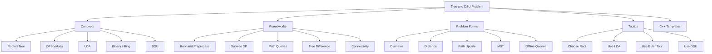

---

# 1. Concepts

## 1.1 What Is a Tree?

A tree is an undirected graph with:

```text
N nodes
N - 1 edges
connected
no cycle
exactly one simple path between any two nodes
```

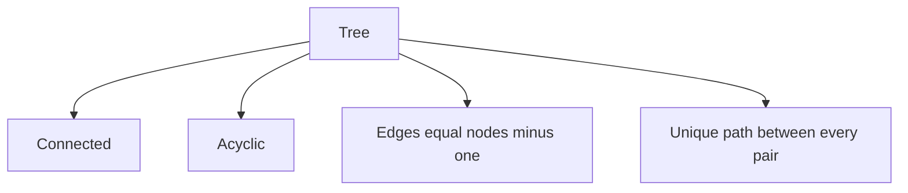

Mental trick:

```text
Tree = graph with no alternative paths.
```

---

## 1.2 Rooted vs Unrooted Tree

An unrooted tree has only connections.

After choosing a root, we get:

```text
parent
children
depth
subtree
ancestor
descendant
```

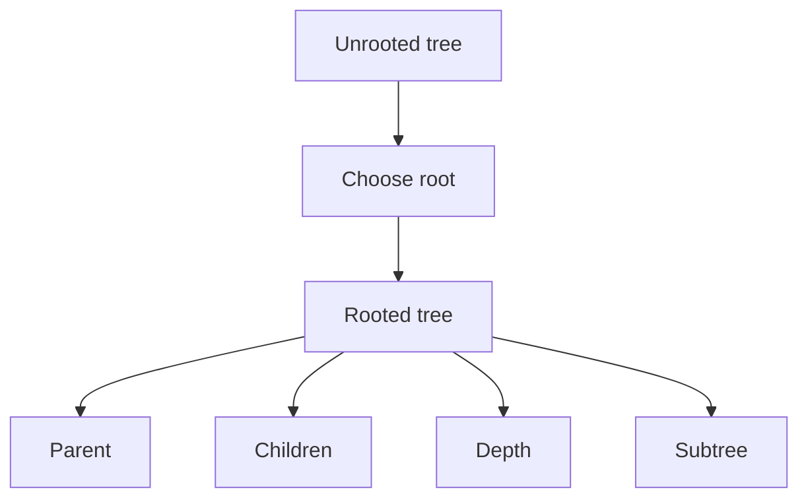

Mental trick:

```text
If problem says subtree or ancestor, root the tree.
```

---

## 1.3 Parent, Child, Depth, Subtree

| Term | Meaning |
|---|---|
| root | chosen top node |
| parent | previous node toward root |
| child | next node away from root |
| depth | distance from root |
| subtree | node plus all descendants |
| leaf | node with no children |

---

## 1.4 Tree Path

Because there is exactly one simple path between two nodes, path queries are common.

Path from `u` to `v` goes:

```text
u -> LCA(u, v) -> v
```

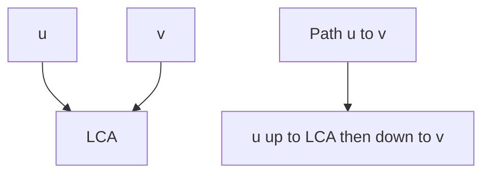

---

## 1.5 Tree Diameter

Diameter:

```text
longest shortest path in the tree
```

In a tree, diameter can be found by:

```text
1. BFS or DFS from any node to farthest node A
2. BFS or DFS from A to farthest node B
3. distance A to B is diameter
```

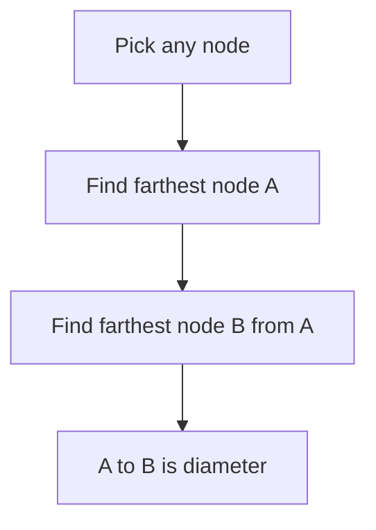

---

## 1.6 Tree Center

Center:

```text
middle node or middle edge of the diameter path
```

A tree has:
- one center if diameter length is even
- two centers if diameter length is odd

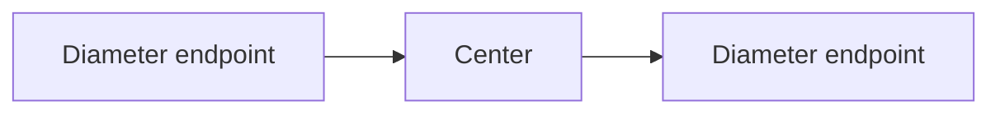

---

## 1.7 Tree Centroid

Centroid:

```text
node such that removing it creates components of size at most N / 2
```

A tree has one or two centroids.

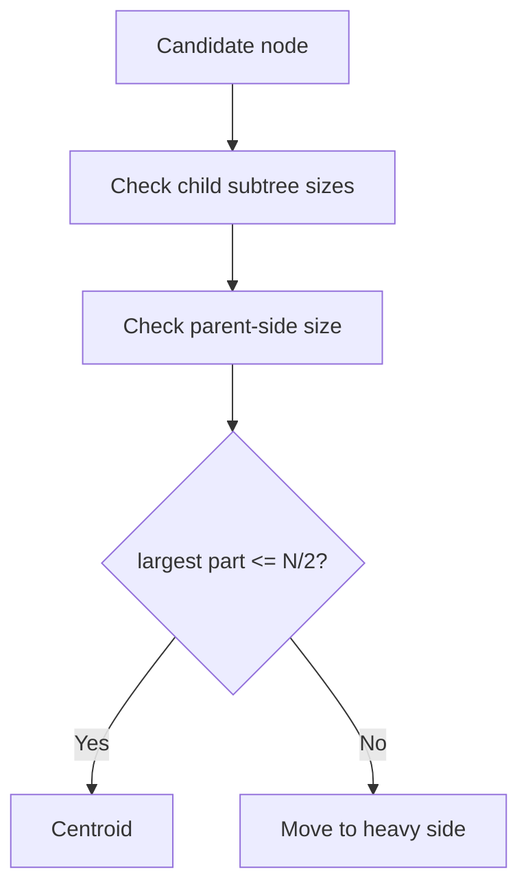

Center and centroid are different concepts.

---

## 1.8 Lowest Common Ancestor

LCA of `u` and `v`:

```text
deepest node that is ancestor of both u and v
```

Used for:
- distance queries
- path queries
- path updates
- k-th node on path

---

## 1.9 Binary Lifting

Binary lifting stores ancestors at powers of two.

```text
up[u][j] = 2^j-th ancestor of u
```

Recurrence:

```text
up[u][j] = up[ up[u][j - 1] ][j - 1]
```

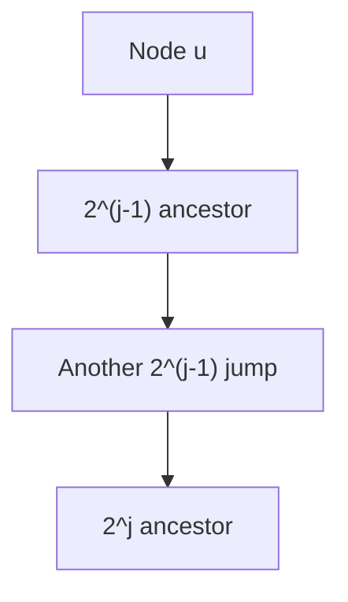

Mental trick:

```text
Any k-step jump can be built from powers of two.
```

---

## 1.10 Tree Difference / Partial Sum

For many path updates, update endpoints and LCA, then accumulate with postorder DFS.

For node path add `x` on path `u-v`:

```text
add[u] += x
add[v] += x
add[lca] -= x
add[parent[lca]] -= x
```

Then accumulate children into parent.

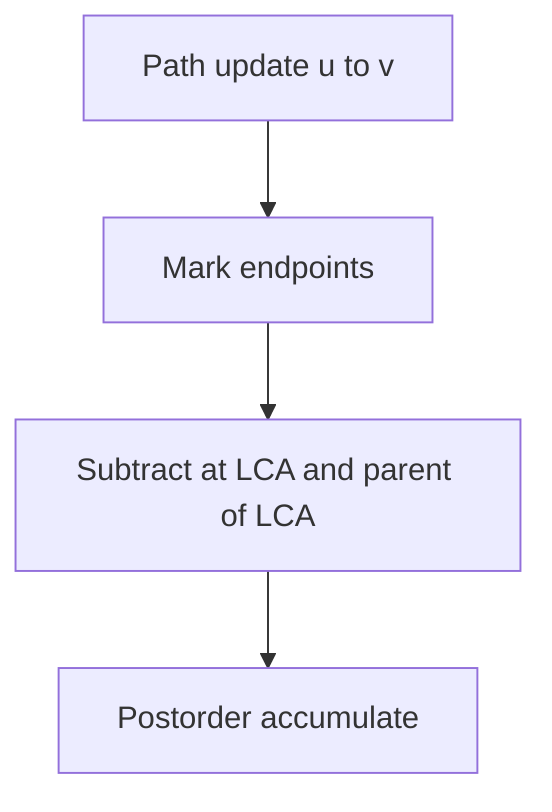

---

## 1.11 DSU / Union Find

DSU manages components dynamically under edge additions.

Operations:

```text
find(x) = representative of x component
merge(a, b) = join components
same(a, b) = check same component
```

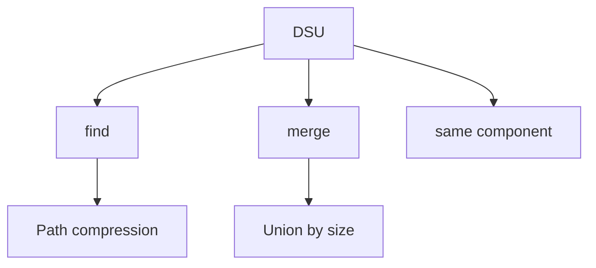

---

# 2. Frameworks With Templates and Examples

## 2.1 Tree Formulation Framework

### When to use

Use first on every tree problem.

### Questions

```text
1. Is the input guaranteed to be a tree?
2. Should I root it?
3. What should each DFS compute?
4. Is the query about subtree or path?
5. Are updates online or offline?
6. Is connectivity dynamic?
```

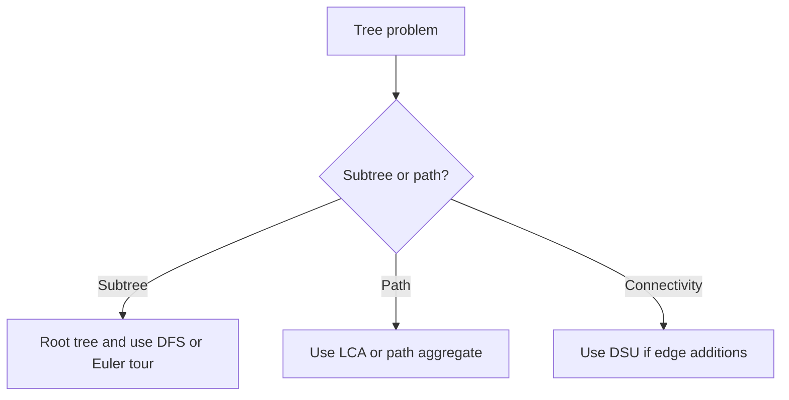

### Example

Problem:

```text
Given q queries asking distance between u and v.
```

Formulation:

```text
Root tree at 1.
Compute depth.
Precompute LCA.
Answer dist = depth[u] + depth[v] - 2 * depth[lca].
```

---

## 2.2 Root and DFS Preprocessing Framework

### Use when

Need:
- parent
- depth
- subtree size
- child count
- entry/exit time
- leaf check

### Template

```cpp
void dfs(int u, int p) {
    parent[u] = p;
    subtree[u] = 1;

    for (int v : g[u]) {
        if (v == p) continue;

        depth[v] = depth[u] + 1;
        dfs(v, u);
        subtree[u] += subtree[v];
    }
}
```

### Example

Tree:

```text
1 connected to 2 and 3
2 connected to 4
```

After root at `1`:

```text
parent[2] = 1
parent[3] = 1
parent[4] = 2
depth[4] = 2
subtree[2] = 2
```

---

## 2.3 Subtree Aggregation Framework

### Use when

Information flows from children to parent.

Examples:
- subtree size
- subtree sum
- count leaves in subtree
- maximum depth under node
- DP on tree

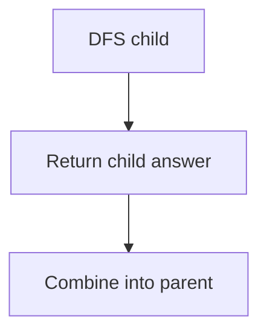

### Template

```cpp
void dfs(int u, int p) {
    dp[u] = base_value_for_u;

    for (int v : g[u]) {
        if (v == p) continue;

        dfs(v, u);
        dp[u] = combine(dp[u], dp[v]);
    }
}
```

### Example: count leaves in subtree

```cpp
void dfsLeaves(int u, int p) {
    leafCount[u] = 0;
    bool hasChild = false;

    for (int v : g[u]) {
        if (v == p) continue;

        hasChild = true;
        dfsLeaves(v, u);
        leafCount[u] += leafCount[v];
    }

    if (!hasChild) {
        leafCount[u] = 1;
    }
}
```

---

## 2.4 Rerooting DP Framework

### Use when

Need answer for every node as if that node is root.

Examples:
- sum of distances from every node
- maximum distance from every node
- subtree contribution from all directions

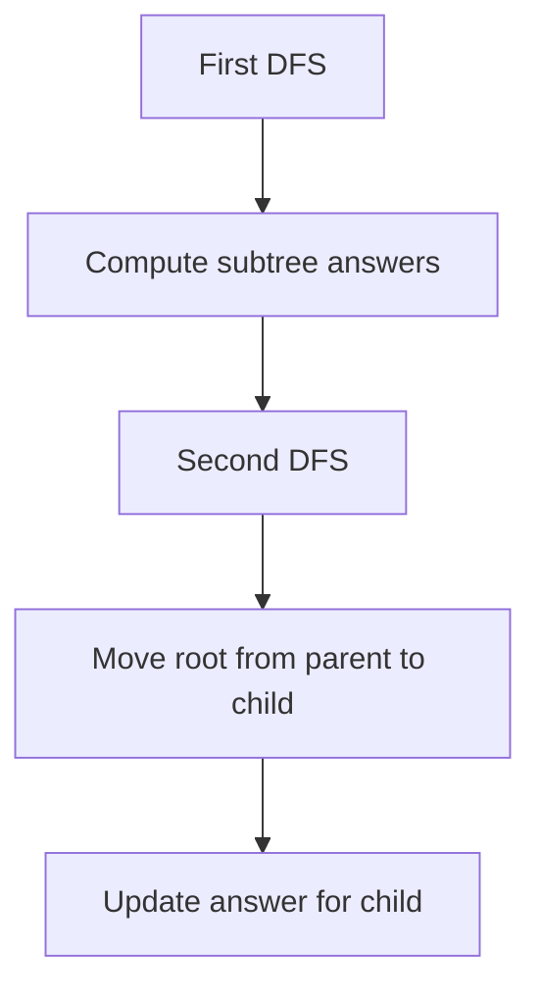

### Example: sum of distances from every node

First DFS:
- `sub[u]`
- `ans[1] = sum distances from root 1`

Second DFS formula moving root `u -> v`:

```text
ans[v] = ans[u] - sub[v] + (n - sub[v])
```

C++:

```cpp
vector<int> sub;
vector<long long> distSum;
int n;

void dfs1(int u, int p, int depth) {
    sub[u] = 1;
    distSum[1] += depth;

    for (int v : g[u]) {
        if (v == p) continue;
        dfs1(v, u, depth + 1);
        sub[u] += sub[v];
    }
}

void dfs2(int u, int p) {
    for (int v : g[u]) {
        if (v == p) continue;

        distSum[v] = distSum[u] - sub[v] + (n - sub[v]);
        dfs2(v, u);
    }
}
```

How it works:

```text
When root moves from u to child v:
nodes inside v subtree get 1 closer -> subtract sub[v]
all other nodes get 1 farther -> add n - sub[v]
```

---

## 2.5 Diameter Framework

### Use when

Problem asks:
- longest path
- farthest pair
- tree radius/center
- minimum height root

### Template

```cpp
auto a = farthest(1);
auto b = farthest(a.node);
diameter = b.distance;
```

### Example

Tree path:

```text
4 - 2 - 1 - 3 - 5
```

Farthest from `1` may be `4`.  
Farthest from `4` is `5`.  
Diameter is path `4 -> 2 -> 1 -> 3 -> 5`.

---

## 2.6 LCA Framework

### Use when

Query asks about path between two nodes repeatedly.

### Template flow

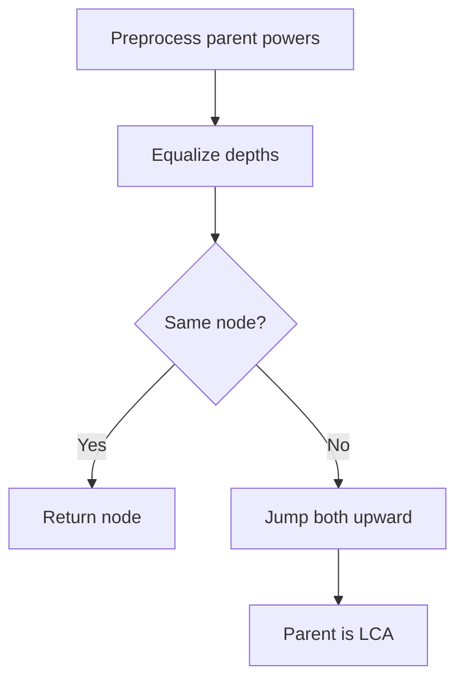

### Example

If:

```text
depth[u] = 7
depth[v] = 4
```

First lift `u` by `3` so both are at depth `4`.

Then jump both upward until parents match.

---

## 2.7 Binary Lifting Jump Framework

### Use when

Need:
- k-th ancestor
- functional graph k-th next
- jump k times
- binary lifting over next greater element
- binary lifting over parent

### Template

```cpp
int jump(int u, long long k) {
    for (int bit = LOG - 1; bit >= 0; bit--) {
        if ((k >> bit) & 1LL) {
            u = up[u][bit];
        }
    }

    return u;
}
```

### Example

To jump `13` ancestors:

```text
13 = 8 + 4 + 1
jump 8, then 4, then 1
```

---

## 2.8 Path Query Aggregate Framework

### Use when

Need aggregate on path:
- min edge
- max edge
- sum
- gcd
- xor

For reversible operations like XOR or sum, prefix may work.

For non-reversible or edge min/max, use binary lifting aggregate.

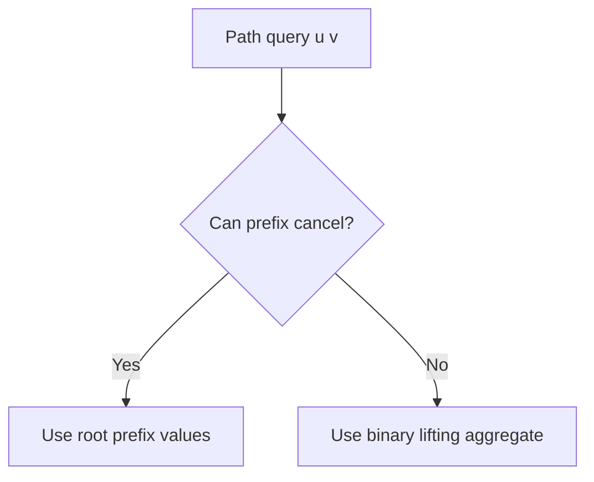

### Template idea

Store:

```text
up[u][j]
agg[u][j] = aggregate on jump from u upward 2^j steps
```

When lifting, combine aggregate.

---

## 2.9 Tree Difference Framework

### Use when

Many path updates are known, then final node/edge values are asked.

### Node path update

```text
add[u] += x
add[v] += x
add[lca] -= x
add[parent[lca]] -= x
```

Postorder:

```text
add[parent] += add[child]
```

### Example

Update path `4 -> 5`.

If `lca(4,5) = 2`:

```text
add[4] += x
add[5] += x
add[2] -= x
add[parent[2]] -= x
```

After postorder accumulation, only nodes on path receive `x`.

---

## 2.10 Euler Tour Framework

### Use when

Need subtree queries/updates.

A subtree becomes a contiguous range in DFS order.

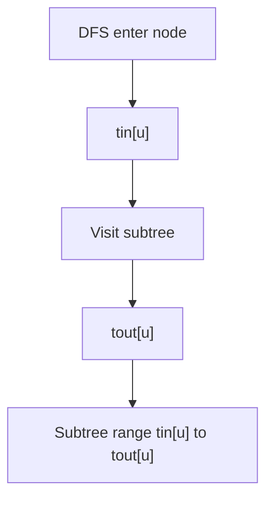

### Template

```cpp
int timer = 0;
vector<int> tin, tout, euler;

void dfsEuler(int u, int p) {
    tin[u] = timer++;
    euler.push_back(u);

    for (int v : g[u]) {
        if (v == p) continue;
        dfsEuler(v, u);
    }

    tout[u] = timer - 1;
}
```

Subtree of `u`:

```text
[tin[u], tout[u]]
```

Example:

```text
Subtree sum query -> segment tree/Fenwick over Euler order.
```

---

## 2.11 DSU Framework

### Use when

Need dynamic connectivity with edge additions.

### Template

```cpp
DSU dsu(n);

for each edge u v:
    dsu.merge(u, v)

query:
    dsu.same(u, v)
```

### Example

Edges added:

```text
1-2
3-4
2-3
```

After all:
```text
1,2,3,4 are connected
```

DSU tracks this without DFS each time.

---

## 2.12 Offline Reverse DSU Framework

### Use when

There are deletions, but all queries are known offline.

DSU cannot delete edges easily.

Reverse time:

```text
delete in forward = add in reverse
```

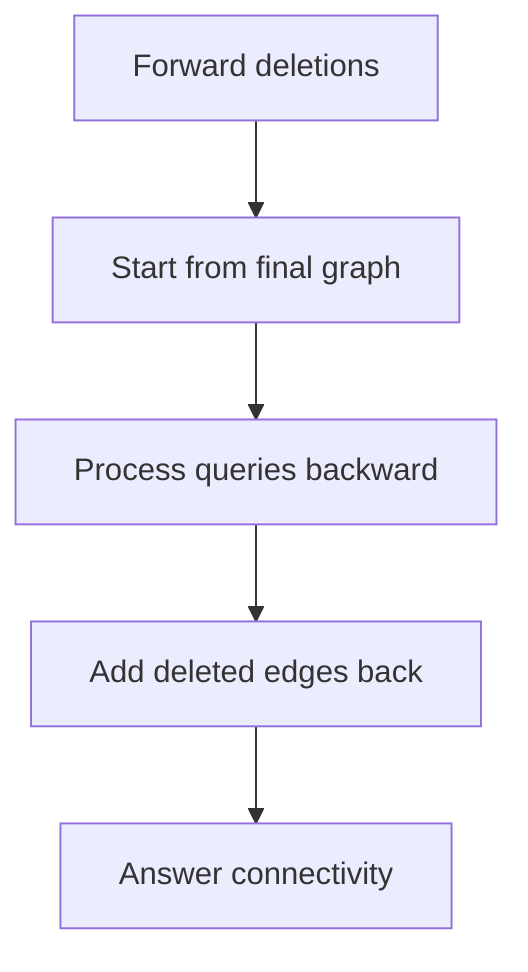

### Example

Forward:

```text
remove edge e1
query components
remove edge e2
query components
```

Reverse:

```text
start after both removed
answer query
add e2
answer query
add e1
```

---

# 3. Problem Forms

## 3.1 Compute Parent Depth Subtree Size

```cpp
vector<int> parentNode, depthNode, subtreeSize;

void dfsTree(int u, int p) {
    parentNode[u] = p;
    subtreeSize[u] = 1;

    for (int v : g[u]) {
        if (v == p) continue;

        depthNode[v] = depthNode[u] + 1;
        dfsTree(v, u);
        subtreeSize[u] += subtreeSize[v];
    }
}
```

---

## 3.2 Connected Tree Validation

A graph is a tree if:
- edges = `n - 1`
- connected

```cpp
bool isTree(int n, vector<vector<int>>& g, int edges) {
    if (edges != n - 1) return false;

    vector<int> vis(n + 1, 0);

    function<void(int)> dfs = [&](int u) {
        vis[u] = 1;
        for (int v : g[u]) {
            if (!vis[v]) dfs(v);
        }
    };

    dfs(1);

    for (int i = 1; i <= n; i++) {
        if (!vis[i]) return false;
    }

    return true;
}
```

---

## 3.3 Find Path Between Two Nodes

```cpp
bool dfsFindPath(int u, int p, int target, vector<int>& path) {
    path.push_back(u);

    if (u == target) return true;

    for (int v : g[u]) {
        if (v == p) continue;

        if (dfsFindPath(v, u, target, path)) {
            return true;
        }
    }

    path.pop_back();
    return false;
}
```

---

## 3.4 Tree Diameter

```cpp
pair<int,int> farthestNode(int src, int n) {
    vector<int> dist(n + 1, -1);
    queue<int> q;

    dist[src] = 0;
    q.push(src);

    while (!q.empty()) {
        int u = q.front();
        q.pop();

        for (int v : g[u]) {
            if (dist[v] == -1) {
                dist[v] = dist[u] + 1;
                q.push(v);
            }
        }
    }

    int best = src;
    for (int i = 1; i <= n; i++) {
        if (dist[i] > dist[best]) best = i;
    }

    return {best, dist[best]};
}

int treeDiameter(int n) {
    auto first = farthestNode(1, n);
    auto second = farthestNode(first.first, n);
    return second.second;
}
```

---

## 3.5 Tree Center

Find diameter path, then take middle.

```cpp
vector<int> treeCentersFromPath(vector<int>& path) {
    int len = path.size();

    if (len % 2 == 1) {
        return {path[len / 2]};
    }

    return {path[len / 2 - 1], path[len / 2]};
}
```

---

## 3.6 Tree Centroid

```cpp
int findCentroid(int u, int p, int n) {
    for (int v : g[u]) {
        if (v == p) continue;

        if (subtreeSize[v] > n / 2) {
            return findCentroid(v, u, n);
        }
    }

    return u;
}
```

Exact check:

```cpp
bool isCentroid(int u, int n) {
    int largestPart = n - subtreeSize[u];

    for (int v : g[u]) {
        if (parentNode[v] == u) {
            largestPart = max(largestPart, subtreeSize[v]);
        }
    }

    return largestPart <= n / 2;
}
```

---

## 3.7 LCA Queries

```cpp
int lca(int u, int v) {
    if (depthNode[u] < depthNode[v]) swap(u, v);

    int diff = depthNode[u] - depthNode[v];

    for (int i = LOG - 1; i >= 0; i--) {
        if ((diff >> i) & 1) {
            u = up[u][i];
        }
    }

    if (u == v) return u;

    for (int i = LOG - 1; i >= 0; i--) {
        if (up[u][i] != up[v][i]) {
            u = up[u][i];
            v = up[v][i];
        }
    }

    return up[u][0];
}
```

---

## 3.8 Distance Between Nodes

```cpp
int treeDistance(int u, int v) {
    int w = lca(u, v);
    return depthNode[u] + depthNode[v] - 2 * depthNode[w];
}
```

---

## 3.9 K-th Ancestor

```cpp
int kthAncestor(int u, long long k) {
    for (int i = LOG - 1; i >= 0; i--) {
        if ((k >> i) & 1LL) {
            u = up[u][i];
            if (u == -1) break;
        }
    }

    return u;
}
```

---

## 3.10 K-th Node on Path

Let path be from `u` to `v`, zero-indexed by steps.

```cpp
int kthNodeOnPath(int u, int v, int k) {
    int w = lca(u, v);

    int upLen = depthNode[u] - depthNode[w];

    if (k <= upLen) {
        return kthAncestor(u, k);
    }

    int totalLen = depthNode[u] + depthNode[v] - 2 * depthNode[w];
    int downStepsFromV = totalLen - k;

    return kthAncestor(v, downStepsFromV);
}
```

---

## 3.11 Dynamic Root LCA

```cpp
int lcaWithRoot(int u, int v, int root) {
    int a = lca(u, v);
    int b = lca(u, root);
    int c = lca(v, root);

    int ans = a;

    if (depthNode[b] > depthNode[ans]) ans = b;
    if (depthNode[c] > depthNode[ans]) ans = c;

    return ans;
}
```

---

## 3.12 Path XOR / Sum Using Prefix

For edge XOR:

```cpp
vector<int> prefixXor;

void dfsPrefixXor(int u, int p, int xr) {
    prefixXor[u] = xr;

    for (auto [v, w] : weightedTree[u]) {
        if (v == p) continue;
        dfsPrefixXor(v, u, xr ^ w);
    }
}

int pathXor(int u, int v) {
    return prefixXor[u] ^ prefixXor[v];
}
```

For edge sum:

```cpp
long long pathSumByPrefix(int u, int v) {
    int w = lca(u, v);
    return prefSum[u] + prefSum[v] - 2 * prefSum[w];
}
```

---

## 3.13 Path Min Max GCD With Binary Lifting

Store aggregate per jump.

```cpp
// Example for minimum edge
long long pathMinEdge(int u, int v) {
    long long ans = INF;

    if (depthNode[u] < depthNode[v]) swap(u, v);

    int diff = depthNode[u] - depthNode[v];

    for (int i = LOG - 1; i >= 0; i--) {
        if ((diff >> i) & 1) {
            ans = min(ans, minUp[u][i]);
            u = up[u][i];
        }
    }

    if (u == v) return ans;

    for (int i = LOG - 1; i >= 0; i--) {
        if (up[u][i] != up[v][i]) {
            ans = min(ans, minUp[u][i]);
            ans = min(ans, minUp[v][i]);

            u = up[u][i];
            v = up[v][i];
        }
    }

    ans = min(ans, minUp[u][0]);
    ans = min(ans, minUp[v][0]);

    return ans;
}
```

---

## 3.14 Path Update and Point Query

```cpp
vector<long long> addValue;
vector<int> postorder;

void dfsPostorder(int u, int p) {
    for (int v : g[u]) {
        if (v == p) continue;
        dfsPostorder(v, u);
    }

    postorder.push_back(u);
}

void addPath(int u, int v, long long x) {
    int w = lca(u, v);

    addValue[u] += x;
    addValue[v] += x;
    addValue[w] -= x;

    if (parentNode[w] != -1) {
        addValue[parentNode[w]] -= x;
    }
}

void finalizePathAdds() {
    for (int u : postorder) {
        if (parentNode[u] != -1) {
            addValue[parentNode[u]] += addValue[u];
        }
    }
}
```

---

## 3.15 Subtree Update and Point Query

Use Euler tour + Fenwick difference.

```text
subtree of u = range [tin[u], tout[u]]
```

For subtree add `x`:

```text
bit.add(tin[u], x)
bit.add(tout[u] + 1, -x)
```

Point query for node `u`:

```text
bit.sum(tin[u])
```

---

## 3.16 Sum of All Pair Distances

```cpp
long long sumAllPairDistances(int n) {
    long long ans = 0;

    function<void(int,int)> dfs = [&](int u, int p) {
        subtreeSize[u] = 1;

        for (int v : g[u]) {
            if (v == p) continue;

            dfs(v, u);
            subtreeSize[u] += subtreeSize[v];

            long long s = subtreeSize[v];
            ans += s * (n - s);
        }
    };

    dfs(1, -1);
    return ans;
}
```

Weighted edge:

```text
contribution = weight * s * (n - s)
```

---

## 3.17 Number of Nodes at Distance K

Simple from one source:

```cpp
int countDistanceK(int src, int k, int n) {
    vector<int> dist(n + 1, -1);
    queue<int> q;

    dist[src] = 0;
    q.push(src);

    int ans = 0;

    while (!q.empty()) {
        int u = q.front();
        q.pop();

        if (dist[u] == k) ans++;

        for (int v : g[u]) {
            if (dist[v] == -1) {
                dist[v] = dist[u] + 1;
                q.push(v);
            }
        }
    }

    return ans;
}
```

For many queries, consider:
- centroid decomposition
- Euler + depth buckets
- DSU on tree depending on query type

---

## 3.18 DSU Count Components

```cpp
int countComponents(int n, vector<pair<int,int>>& edges) {
    DSU dsu(n);
    int components = n;

    for (auto [u, v] : edges) {
        if (dsu.merge(u, v)) {
            components--;
        }
    }

    return components;
}
```

---

## 3.19 Kruskal MST

```cpp
struct Edge {
    int u, v;
    long long w;
};

long long kruskal(int n, vector<Edge>& edges) {
    sort(edges.begin(), edges.end(), [](const Edge& a, const Edge& b) {
        return a.w < b.w;
    });

    DSU dsu(n);
    long long cost = 0;
    int used = 0;

    for (auto e : edges) {
        if (dsu.merge(e.u, e.v)) {
            cost += e.w;
            used++;
        }
    }

    return used == n - 1 ? cost : -1;
}
```

---

## 3.20 Offline Edge Removal Queries

```text
1. Mark all edges that will be removed.
2. Build DSU with edges that remain at the end.
3. Process queries backward.
4. A remove query becomes add edge.
5. Store answers and reverse them.
```

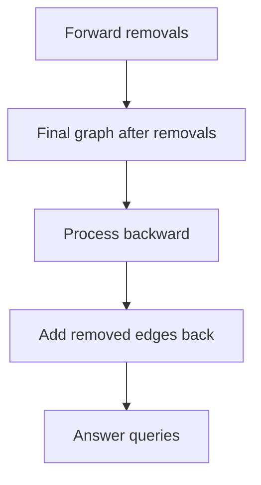

---

# 4. Tactics

## 4.1 Pattern Recognition Table

| Problem clue | Technique |
|---|---|
| subtree size / subtree sum | DFS |
| path between two nodes | LCA |
| many distance queries | LCA + depth |
| k-th ancestor | binary lifting |
| k-th node on path | LCA + binary lifting |
| path min/max/gcd | binary lifting aggregate |
| many path updates offline | tree difference |
| subtree update/query | Euler tour + Fenwick/segment tree |
| longest path | diameter |
| middle of tree | center |
| balance tree by removing node | centroid |
| dynamic add connectivity | DSU |
| edge removals offline | reverse + DSU |
| MST | Kruskal + DSU |

---

## 4.2 Rooting Tactics

Choose root:
- usually `1`
- for subtree queries, any fixed root works
- for parent/depth/LCA, root once
- for dynamic root queries, preprocess with fixed root then use formula

---

## 4.3 DFS State Tactics

Common DFS state:

```text
u = current node
p = parent
depth[u]
subtree[u]
parent[u]
tin/tout
prefix value
```

Always skip parent in undirected tree:

```cpp
if (v == p) continue;
```

---

## 4.4 LCA Tactics

Use LCA when:
- query says path between `u` and `v`
- need distance
- need ancestor relation
- need path update
- need k-th node on path

Ancestor check with Euler:

```cpp
bool isAncestor(int a, int b) {
    return tin[a] <= tin[b] && tout[b] <= tout[a];
}
```

---

## 4.5 Path Query Tactics

| Operation | Good approach |
|---|---|
| sum edge path | root prefix + LCA |
| XOR edge path | prefix XOR |
| min edge path | binary lifting aggregate |
| max edge path | binary lifting aggregate |
| gcd node path | binary lifting aggregate |
| path update offline | tree difference |
| path update online | HLD + segment tree |

---

## 4.6 Tree DP Tactics

Tree DP usually has:

```text
dp[u] = answer for subtree of u
```

If answer needs parent side too, use rerooting.

Common forms:
- independent set on tree
- vertex cover on tree
- matching on tree
- sum distances
- max path through node

---

## 4.7 DSU Tactics

Use DSU when:
- edges are added
- components merge
- need component size
- need connectivity queries
- Kruskal MST
- reverse deletion queries

Do not use plain DSU when:
- need path queries
- need deletions online
- need split components
- need tree ancestors

---

## 4.8 Edge vs Node Value Tactics

For edge value queries:
- store edge value at child node after rooting
- root has identity value

For node value queries:
- include LCA carefully
- prefix formula often includes subtracting LCA once or twice depending on operation

Examples:

```text
edge sum path = pref[u] + pref[v] - 2*pref[lca]
node sum path = pref[u] + pref[v] - 2*pref[lca] + value[lca]
```

---

## 4.9 Common Mistakes

1. Forgetting tree has `n - 1` edges.
2. Not skipping parent in DFS.
3. Stack overflow on deep recursive DFS.
4. Using LCA without equalizing depth first.
5. Wrong `LOG` size.
6. Confusing center and centroid.
7. Forgetting edge value belongs to child.
8. Incorrect tree difference signs.
9. Trying DSU for path queries.
10. Processing edge deletions forward with DSU.

---

# 5. C++ Template Library

## 5.1 Tree Reading

```cpp
int n;
vector<vector<int>> g;

void readTree() {
    cin >> n;
    g.assign(n + 1, {});

    for (int i = 0; i < n - 1; i++) {
        int u, v;
        cin >> u >> v;

        g[u].push_back(v);
        g[v].push_back(u);
    }
}
```

---

## 5.2 DFS Preprocessing

```cpp
vector<int> parentNode, depthNode, subtreeSize;

void dfsPre(int u, int p) {
    parentNode[u] = p;
    subtreeSize[u] = 1;

    for (int v : g[u]) {
        if (v == p) continue;

        depthNode[v] = depthNode[u] + 1;
        dfsPre(v, u);
        subtreeSize[u] += subtreeSize[v];
    }
}
```

---

## 5.3 LCA Preprocessing

```cpp
int LOG;
vector<vector<int>> up;

void dfsLCA(int u, int p) {
    up[u][0] = p;

    for (int j = 1; j < LOG; j++) {
        if (up[u][j - 1] == -1) {
            up[u][j] = -1;
        } else {
            up[u][j] = up[up[u][j - 1]][j - 1];
        }
    }

    for (int v : g[u]) {
        if (v == p) continue;

        depthNode[v] = depthNode[u] + 1;
        dfsLCA(v, u);
    }
}
```

---

## 5.4 LCA Query

```cpp
int lca(int u, int v) {
    if (depthNode[u] < depthNode[v]) swap(u, v);

    int diff = depthNode[u] - depthNode[v];

    for (int j = LOG - 1; j >= 0; j--) {
        if ((diff >> j) & 1) {
            u = up[u][j];
        }
    }

    if (u == v) return u;

    for (int j = LOG - 1; j >= 0; j--) {
        if (up[u][j] != up[v][j]) {
            u = up[u][j];
            v = up[v][j];
        }
    }

    return up[u][0];
}
```

---

## 5.5 Euler Tour

```cpp
int timer = 0;
vector<int> tin, tout, euler;

void dfsEuler(int u, int p) {
    tin[u] = timer++;
    euler.push_back(u);

    for (int v : g[u]) {
        if (v == p) continue;
        dfsEuler(v, u);
    }

    tout[u] = timer - 1;
}
```

---

## 5.6 DSU

```cpp
struct DSU {
    vector<int> parent;
    vector<int> size;

    DSU(int n) {
        parent.resize(n + 1);
        size.assign(n + 1, 1);

        for (int i = 1; i <= n; i++) {
            parent[i] = i;
        }
    }

    int find(int x) {
        if (parent[x] == x) return x;
        return parent[x] = find(parent[x]);
    }

    bool merge(int a, int b) {
        a = find(a);
        b = find(b);

        if (a == b) return false;

        if (size[a] < size[b]) swap(a, b);

        parent[b] = a;
        size[a] += size[b];

        return true;
    }

    bool same(int a, int b) {
        return find(a) == find(b);
    }

    int componentSize(int x) {
        return size[find(x)];
    }
};
```

---

## 5.7 Fenwick for Euler Subtree Updates

```cpp
struct Fenwick {
    int n;
    vector<long long> bit;

    Fenwick(int n) : n(n), bit(n + 1, 0) {}

    void add(int idx, long long val) {
        idx++;
        while (idx <= n) {
            bit[idx] += val;
            idx += idx & -idx;
        }
    }

    long long sumPrefix(int idx) {
        idx++;
        long long ans = 0;

        while (idx > 0) {
            ans += bit[idx];
            idx -= idx & -idx;
        }

        return ans;
    }

    void rangeAdd(int l, int r, long long val) {
        add(l, val);
        if (r + 1 < n) add(r + 1, -val);
    }

    long long pointQuery(int idx) {
        return sumPrefix(idx);
    }
};
```

---

# 6. Final Checklist

Before coding, ask:

```text
1. Is it really a tree?
2. Should I root the tree?
3. What is the root?
4. Is query about subtree or path?
5. Do I need parent/depth/subtree?
6. Do I need LCA?
7. Is operation prefix-cancellable?
8. Do I need binary lifting aggregate?
9. Are updates offline or online?
10. Can Euler tour convert subtree to range?
11. Is connectivity dynamic with edge additions?
12. Can DSU solve it?
```

---

# 7. Memory Hooks

```text
Tree:
    connected, acyclic, n-1 edges

Root tree:
    parent, depth, subtree become meaningful

DFS:
    children return info to parent

Diameter:
    farthest from farthest

Center:
    middle of diameter

Centroid:
    no component after removal has size > n/2

LCA:
    equalize depth, then jump together

Distance:
    depth[u] + depth[v] - 2*depth[lca]

Binary lifting:
    jump in powers of two

Tree difference:
    mark endpoints, subtract at meeting point, accumulate

Euler tour:
    subtree becomes range

DSU:
    component manager for merging
```

---

END
