# Dynamic Programming Problem Solving Playbook

> A structured competitive-programming guide for solving **Dynamic Programming** problems.
>
> Goal: identify the DP form, define state meaning, write transitions, choose base values, optimize state/space, and reconstruct answers.

---

# Clickable Index

- [0. Master Map](#0-master-map)
- [1. Concepts](#1-concepts)
  - [1.1 What DP Really Means](#11-what-dp-really-means)
  - [1.2 Recursion Before DP](#12-recursion-before-dp)
  - [1.3 Overlapping Subproblems](#13-overlapping-subproblems)
  - [1.4 Optimal Substructure](#14-optimal-substructure)
  - [1.5 State and State Meaning](#15-state-and-state-meaning)
  - [1.6 Transition](#16-transition)
  - [1.7 Base Case and Invalid Case](#17-base-case-and-invalid-case)
  - [1.8 Memoization vs Tabulation](#18-memoization-vs-tabulation)
  - [1.9 DP Complexity](#19-dp-complexity)
  - [1.10 Answer Reconstruction](#110-answer-reconstruction)
- [2. Frameworks With Templates and Examples](#2-frameworks-with-templates-and-examples)
  - [2.1 Universal DP Framework](#21-universal-dp-framework)
  - [2.2 LCCM to DP Framework](#22-lccm-to-dp-framework)
  - [2.3 Take or Not Take Framework](#23-take-or-not-take-framework)
  - [2.4 Ending at Index Framework](#24-ending-at-index-framework)
  - [2.5 Matching DP Framework](#25-matching-dp-framework)
  - [2.6 Interval DP Framework](#26-interval-dp-framework)
  - [2.7 Game DP Framework](#27-game-dp-framework)
  - [2.8 Grid DP Framework](#28-grid-dp-framework)
  - [2.9 Automata DP Framework](#29-automata-dp-framework)
  - [2.10 Digit DP Framework](#210-digit-dp-framework)
  - [2.11 Tree DP Framework](#211-tree-dp-framework)
  - [2.12 Bitmask DP Framework](#212-bitmask-dp-framework)
  - [2.13 Partition DP Framework](#213-partition-dp-framework)
  - [2.14 DP Optimization Framework](#214-dp-optimization-framework)
- [3. Problem Forms](#3-problem-forms)
  - [3.1 Stairs DP](#31-stairs-dp)
  - [3.2 Fibonacci Memoization](#32-fibonacci-memoization)
  - [3.3 Subset Sum](#33-subset-sum)
  - [3.4 0/1 Knapsack](#34-01-knapsack)
  - [3.5 Unbounded Knapsack](#35-unbounded-knapsack)
  - [3.6 Vacation DP](#36-vacation-dp)
  - [3.7 Delete and Earn](#37-delete-and-earn)
  - [3.8 LIS O(n²)](#38-lis-on)
  - [3.9 LIS O(n log n)](#39-lis-on-log-n)
  - [3.10 Longest Bitonic Subsequence](#310-longest-bitonic-subsequence)
  - [3.11 Palindrome Partition Minimum Cuts](#311-palindrome-partition-minimum-cuts)
  - [3.12 K Non-Overlapping Segments](#312-k-non-overlapping-segments)
  - [3.13 LCS](#313-lcs)
  - [3.14 Edit Distance](#314-edit-distance)
  - [3.15 Palindrome Table](#315-palindrome-table)
  - [3.16 Matrix Chain Multiplication](#316-matrix-chain-multiplication)
  - [3.17 Game DP Win/Lose](#317-game-dp-winlose)
  - [3.18 Grid Path DP](#318-grid-path-dp)
  - [3.19 Forbidden Subsequence DP](#319-forbidden-subsequence-dp)
  - [3.20 Count Strings Avoiding Pattern](#320-count-strings-avoiding-pattern)
  - [3.21 Split Array Into K Parts](#321-split-array-into-k-parts)
  - [3.22 Max Sum Divisible by K](#322-max-sum-divisible-by-k)
  - [3.23 Longest Regular Bracket Sequence](#323-longest-regular-bracket-sequence)
  - [3.24 Digit DP Count Numbers](#324-digit-dp-count-numbers)
  - [3.25 Tree Independent Set](#325-tree-independent-set)
  - [3.26 Bitmask Assignment DP](#326-bitmask-assignment-dp)
- [4. Tactics](#4-tactics)
  - [4.1 Pattern Recognition Table](#41-pattern-recognition-table)
  - [4.2 State Design Tactics](#42-state-design-tactics)
  - [4.3 Transition Tactics](#43-transition-tactics)
  - [4.4 Base Value Tactics](#44-base-value-tactics)
  - [4.5 Iteration Order Tactics](#45-iteration-order-tactics)
  - [4.6 Space Optimization Tactics](#46-space-optimization-tactics)
  - [4.7 State Rotation Tactics](#47-state-rotation-tactics)
  - [4.8 State Reduction Tactics](#48-state-reduction-tactics)
  - [4.9 Reconstruction Tactics](#49-reconstruction-tactics)
  - [4.10 Common Mistakes](#410-common-mistakes)
- [5. C++ Template Library](#5-c-template-library)
- [6. Final Checklist](#6-final-checklist)
- [7. Memory Hooks](#7-memory-hooks)

---

# 0. Master Map

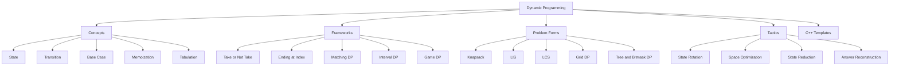

---

# 1. Concepts

## 1.1 What DP Really Means

Dynamic Programming is:

```text
recursion + memory
```

It is used when a problem has repeated states.

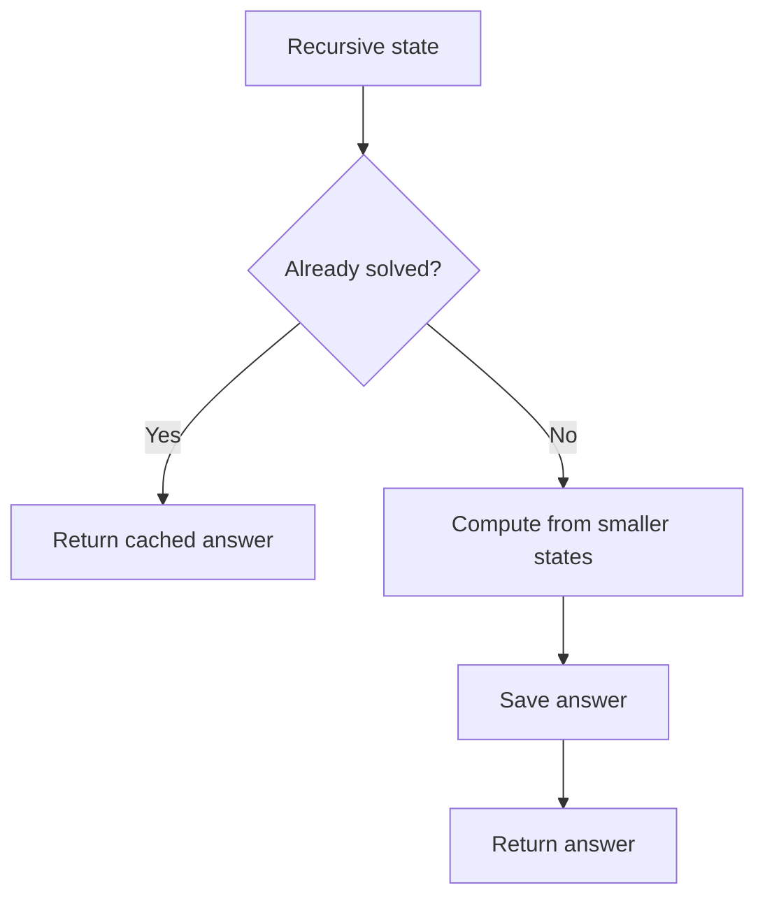

Mental trick:

```text
First write recursion. Then cache states.
```

---

## 1.2 Recursion Before DP

Recursion asks:

```text
Can I solve this using smaller versions of the same problem?
```

Example:

```text
fib(n) = fib(n - 1) + fib(n - 2)
```

Without memoization, Fibonacci recomputes many states.

With DP, each state is computed once.

---

## 1.3 Overlapping Subproblems

Overlapping subproblems means:

```text
same state appears multiple times
```

Example:

```text
fib(5) calls fib(4) and fib(3)
fib(4) also calls fib(3)
```

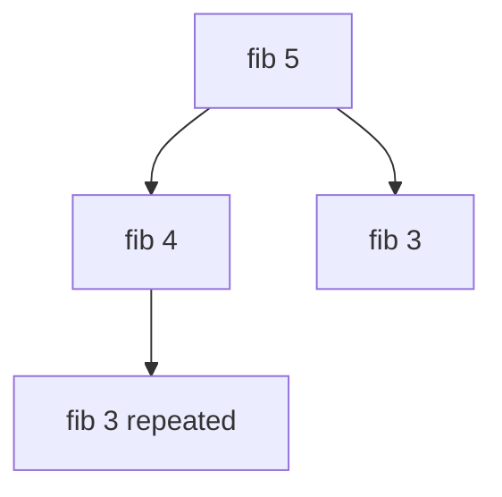

---

## 1.4 Optimal Substructure

Optimal substructure means:

```text
answer of current state can be built from answers of smaller states
```

Examples:
- shortest path in DAG
- knapsack
- LCS
- edit distance
- grid path

---

## 1.5 State and State Meaning

The state is the information needed to uniquely describe a subproblem.

Bad state:

```text
dp[i] maybe answer somehow
```

Good state:

```text
dp[i][w] = maximum value using items i..n-1 with capacity w
```

Always write:

```text
dp state:
meaning:
```

---

## 1.6 Transition

Transition describes how to move from one state to smaller/next states.

Example knapsack:

```text
skip item
take item
```

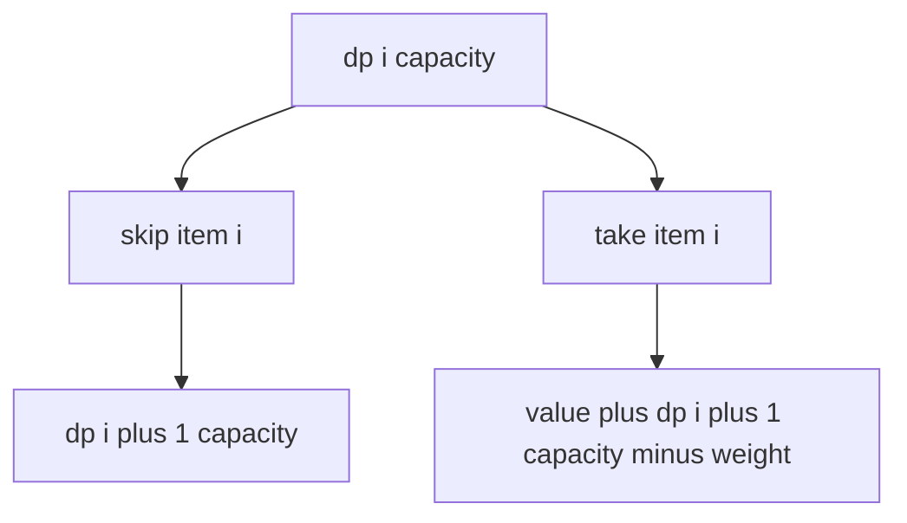

---

## 1.7 Base Case and Invalid Case

Base values depend on answer type.

| Problem type | Invalid state | Finished valid state |
|---|---:|---:|
| Count ways | `0` | `1` |
| Possible? | `false` | `true` |
| Minimize | `INF` | `0` |
| Maximize | `-INF` | `0` |

Mental trick:

```text
Invalid value should never be selected.
Finished value should add no extra cost.
```

---

## 1.8 Memoization vs Tabulation

Memoization:

```text
top-down recursion + cache
```

Tabulation:

```text
bottom-up table filling
```

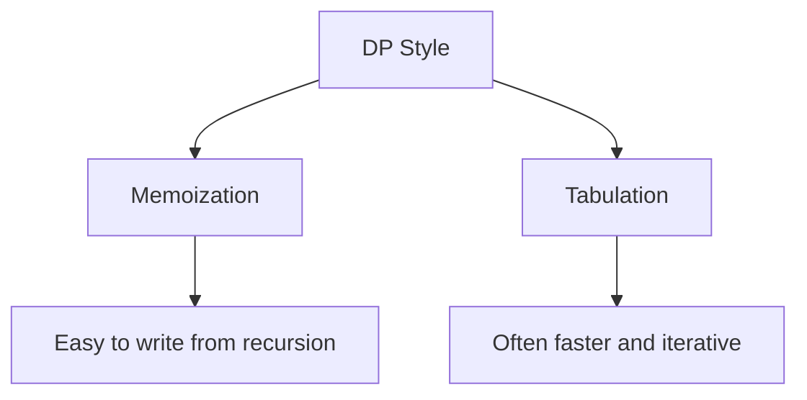

---

## 1.9 DP Complexity

Formula:

```text
time = number of states * transitions per state
memory = number of states
```

Example:

```text
dp[i][sum]
states = n * sum
transitions = 2
time = O(n * sum)
```

---

## 1.10 Answer Reconstruction

After computing DP, reconstruct answer by following transitions that preserve optimal value.

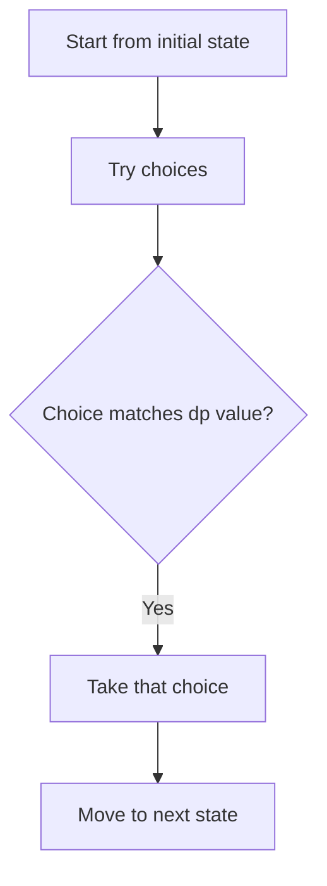

Example:

```text
If dp(i,w) == dp(i+1,w), item i was skipped.
Otherwise item i was taken.
```

---

# 2. Frameworks With Templates and Examples

## 2.1 Universal DP Framework

### Steps

```text
1. Identify DP form.
2. Define state.
3. Write state meaning.
4. Write transitions.
5. Define base and invalid cases.
6. Count states and transitions.
7. Code memoization or tabulation.
```

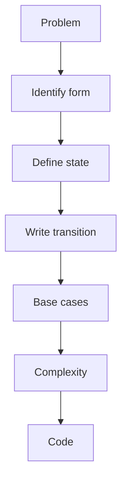

### Memoization template

```cpp
int rec(State state) {
    if (invalid(state)) return INVALID_VALUE;
    if (base(state)) return BASE_VALUE;

    if (computed[state]) return dp[state];

    int ans = INITIAL_VALUE;

    for (Choice choice : choices) {
        ans = combine(ans, rec(next_state));
    }

    computed[state] = true;
    return dp[state] = ans;
}
```

---

## 2.2 LCCM to DP Framework

LCCM:

```text
Level
Choice
Check
Move
```

DP version:

| LCCM | DP equivalent |
|---|---|
| Level | index/state dimension |
| Choice | transition options |
| Check | invalid/pruning |
| Move | next state |

### Example: stairs

```text
Level = current stair
Choice = jump 1 or 2
Check = cannot exceed n
Move = x -> x + jump
State = dp[x]
Meaning = ways to reach n from stair x
```

C++:

```cpp
int waysStairs(int n) {
    vector<int> dp(n + 2, -1);

    function<int(int)> rec = [&](int x) {
        if (x == n) return 1;
        if (x > n) return 0;
        if (dp[x] != -1) return dp[x];

        return dp[x] = rec(x + 1) + rec(x + 2);
    };

    return rec(0);
}
```

---

## 2.3 Take or Not Take Framework

### Use when

Each item has choices:

```text
take
skip
```

Examples:
- subset sum
- knapsack
- choose K items
- delete and earn
- subsequence selection

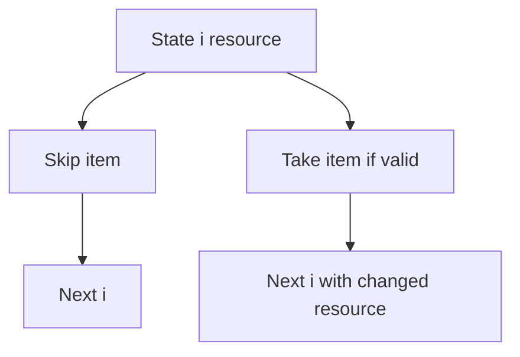

### Template

```cpp
int rec(int i, int resource) {
    if (invalid) return BAD;
    if (i == n) return BASE;

    if (dp[i][resource] != UNKNOWN) return dp[i][resource];

    int skip = rec(i + 1, resource);
    int take = value(i) + rec(i + 1, resource - cost(i));

    return dp[i][resource] = combine(skip, take);
}
```

### Example

0/1 knapsack:
- resource = remaining capacity
- combine = max
- bad = `-INF`

---

## 2.4 Ending at Index Framework

### Use when

Problem asks best structure ending at index `i`.

Examples:
- LIS ending at i
- max subarray ending at i
- longest valid bracket ending at i
- partition ending at i

```text
dp[i] = best answer ending at i
```

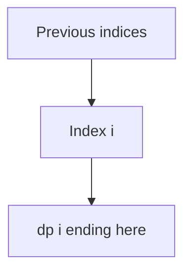

### Template

```cpp
for (int i = 0; i < n; i++) {
    dp[i] = base;

    for (int j = 0; j < i; j++) {
        if (canTransition(j, i)) {
            dp[i] = combine(dp[i], dp[j] + contribution(j, i));
        }
    }

    ans = combine(ans, dp[i]);
}
```

### Example

LIS:

```text
dp[i] = 1 + max dp[j] where j < i and a[j] < a[i]
```

---

## 2.5 Matching DP Framework

### Use when

There are two or more strings/arrays and you match/edit/align them.

Examples:
- LCS
- edit distance
- wildcard matching
- regex matching
- interleaving strings

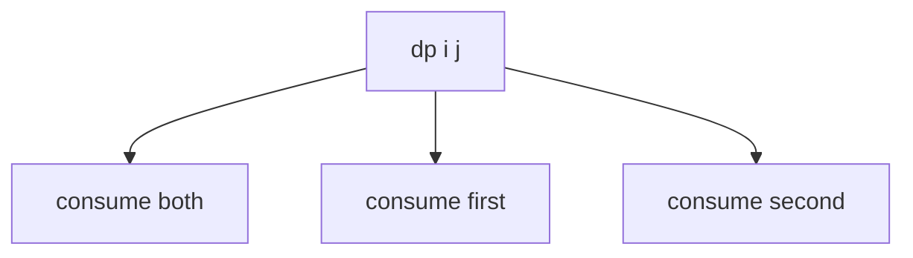

### Template

```cpp
int rec(int i, int j) {
    if (i == n || j == m) return base;

    if (dp[i][j] != -1) return dp[i][j];

    if (match(i, j)) {
        return dp[i][j] = goodTransition();
    }

    return dp[i][j] = combine(
        rec(i + 1, j),
        rec(i, j + 1),
        rec(i + 1, j + 1)
    );
}
```

---

## 2.6 Interval DP Framework

### Use when

State is an interval:

```text
dp[l][r] = answer for subarray/string l..r
```

Examples:
- palindrome table
- matrix chain multiplication
- burst balloons
- merge stones
- optimal game on interval

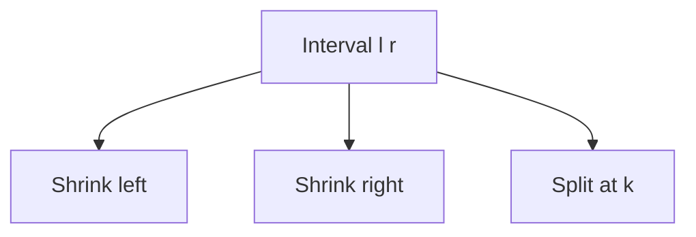

### Template

```cpp
for (int len = 1; len <= n; len++) {
    for (int l = 0; l + len - 1 < n; l++) {
        int r = l + len - 1;

        dp[l][r] = initial;

        for (int k = l; k < r; k++) {
            dp[l][r] = combine(
                dp[l][r],
                dp[l][k] + dp[k + 1][r] + cost(l, k, r)
            );
        }
    }
}
```

### Example

Matrix chain:
- split interval at `k`
- combine left cost + right cost + multiplication cost

---

## 2.7 Game DP Framework

### Use when

Two players alternate turns.

Common state:

```text
dp[state] = whether current player wins
```

Winning rule:

```text
current wins if any move sends opponent to losing state
```

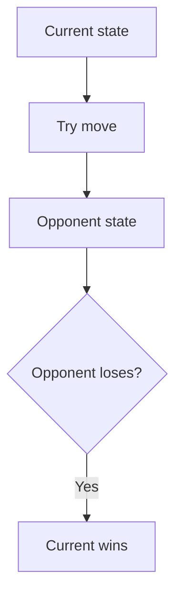

### Template

```cpp
bool win(State s) {
    if (noMoves(s)) return false;

    if (memo has s) return memo[s];

    for (auto move : moves(s)) {
        if (!win(apply(s, move))) {
            return memo[s] = true;
        }
    }

    return memo[s] = false;
}
```

---

## 2.8 Grid DP Framework

### Use when

Movement is constrained on a grid.

Examples:
- only right/down
- min path sum
- max path
- two walkers
- obstacle paths

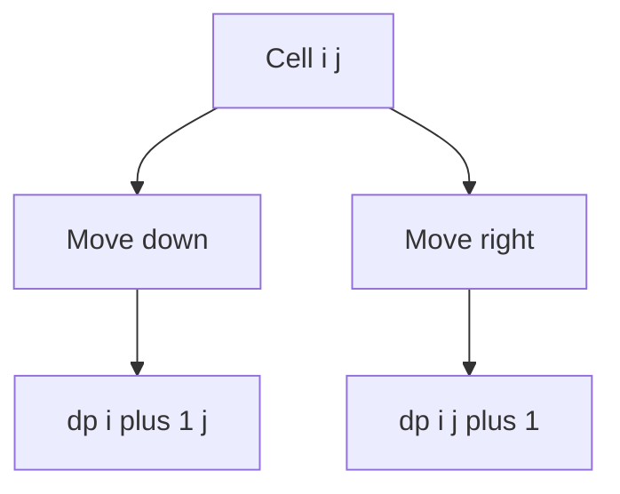

### Template

```cpp
for (int i = n - 1; i >= 0; i--) {
    for (int j = m - 1; j >= 0; j--) {
        dp[i][j] = grid[i][j] + combine(valid next states);
    }
}
```

---

## 2.9 Automata DP Framework

### Use when

Need to avoid/track a pattern in a string.

Examples:
- avoid forbidden subsequence
- avoid forbidden substring
- count strings not containing pattern
- build string with limited matched prefix

State:

```text
dp[index][matched]
```

where `matched` means how much of target pattern is currently matched.

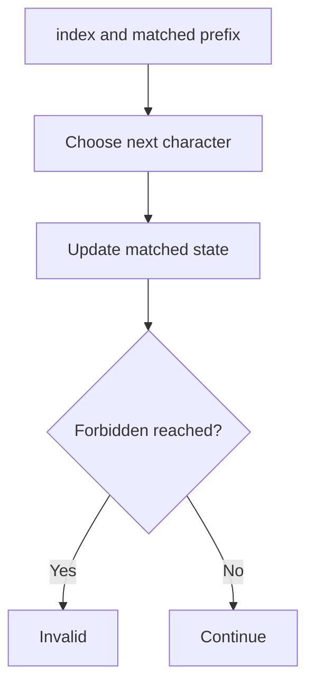

---

## 2.10 Digit DP Framework

### Use when

Counting numbers with constraints up to `N`.

State usually includes:

```text
position
tight
started
property state
```

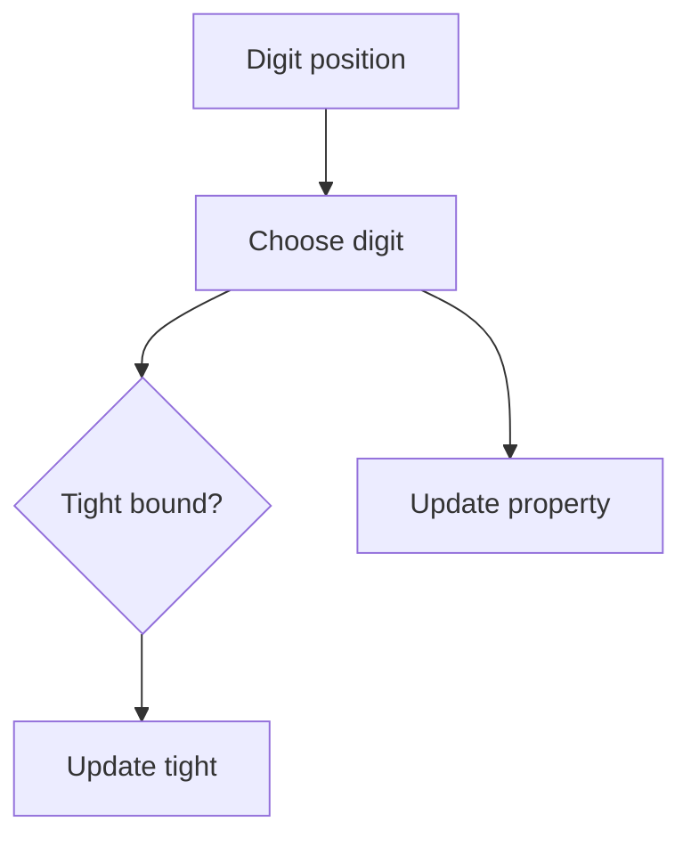

### Template

```cpp
long long rec(int pos, bool tight, bool started, int state) {
    if (pos == digits.size()) {
        return validFinal(started, state);
    }

    long long ans = 0;
    int limit = tight ? digits[pos] : 9;

    for (int d = 0; d <= limit; d++) {
        bool ntight = tight && (d == limit);
        bool nstarted = started || d != 0;
        int nstate = update(state, d, nstarted);

        ans += rec(pos + 1, ntight, nstarted, nstate);
    }

    return ans;
}
```

---

## 2.11 Tree DP Framework

### Use when

Input is a tree and answer depends on subtrees.

State examples:

```text
dp[u][0] = best answer in subtree if u not chosen
dp[u][1] = best answer in subtree if u chosen
```

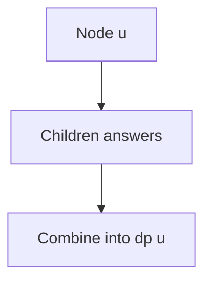

### Example

Independent set on tree:
- if choose u, cannot choose children
- if skip u, children may be chosen or skipped

---

## 2.12 Bitmask DP Framework

### Use when

`n` is small and state is a subset.

State:

```text
dp[mask] = answer for selected set mask
```

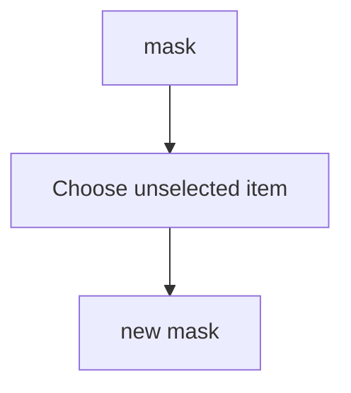

### Example

Assignment:
- `mask` = jobs already assigned
- `worker = popcount(mask)`

---

## 2.13 Partition DP Framework

### Use when

Problem asks split array/string into parts.

State:

```text
dp[i][k] = best answer for prefix/suffix using k parts
```

Transition:

```text
choose cut position
```

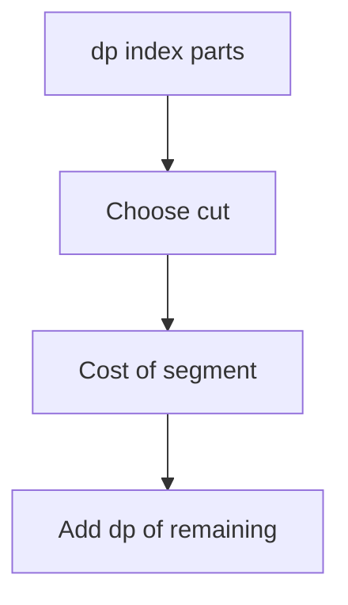

---

## 2.14 DP Optimization Framework

### Common optimizations

| Problem | Optimization |
|---|---|
| 0/1 knapsack | 1D reverse loop |
| unbounded knapsack | 1D forward loop |
| LIS | binary search tails |
| large capacity | rotate state to value |
| two-agent grid | derive one coordinate |
| range min/max transition | monotonic queue |
| convex transitions | convex hull trick |
| divide transition range | divide and conquer DP |

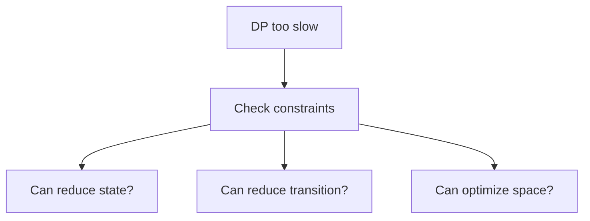

---

# 3. Problem Forms

## 3.1 Stairs DP

```cpp
int waysStairs(int n) {
    vector<int> dp(n + 2, -1);

    function<int(int)> rec = [&](int x) {
        if (x == n) return 1;
        if (x > n) return 0;
        if (dp[x] != -1) return dp[x];

        return dp[x] = rec(x + 1) + rec(x + 2);
    };

    return rec(0);
}
```

---

## 3.2 Fibonacci Memoization

```cpp
long long fibMemo(int n, vector<long long>& dp) {
    if (n <= 1) return n;
    if (dp[n] != -1) return dp[n];

    return dp[n] = fibMemo(n - 1, dp) + fibMemo(n - 2, dp);
}
```

---

## 3.3 Subset Sum

```cpp
bool subsetSum(vector<int>& a, int T) {
    int n = a.size();
    vector<vector<int>> dp(n + 1, vector<int>(T + 1, -1));

    function<int(int,int)> rec = [&](int i, int rem) {
        if (rem < 0) return 0;

        if (i == n) {
            return rem == 0;
        }

        if (dp[i][rem] != -1) return dp[i][rem];

        int ans = rec(i + 1, rem);

        if (rem >= a[i]) {
            ans = ans || rec(i + 1, rem - a[i]);
        }

        return dp[i][rem] = ans;
    };

    return rec(0, T);
}
```

---

## 3.4 0/1 Knapsack

```cpp
int knapsack01(vector<int>& w, vector<int>& val, int W) {
    int n = w.size();
    vector<vector<int>> dp(n + 1, vector<int>(W + 1, -1));

    function<int(int,int)> rec = [&](int i, int cap) {
        if (cap < 0) return (int)-1e9;
        if (i == n) return 0;

        if (dp[i][cap] != -1) return dp[i][cap];

        int ans = rec(i + 1, cap);

        if (w[i] <= cap) {
            ans = max(ans, val[i] + rec(i + 1, cap - w[i]));
        }

        return dp[i][cap] = ans;
    };

    return rec(0, W);
}
```

### 1D optimized

```cpp
int knapsack1D(vector<int>& w, vector<int>& val, int W) {
    vector<int> dp(W + 1, 0);

    for (int i = 0; i < (int)w.size(); i++) {
        for (int cap = W; cap >= w[i]; cap--) {
            dp[cap] = max(dp[cap], val[i] + dp[cap - w[i]]);
        }
    }

    return dp[W];
}
```

---

## 3.5 Unbounded Knapsack

```cpp
int unboundedKnapsack(vector<int>& w, vector<int>& val, int W) {
    vector<int> dp(W + 1, 0);

    for (int i = 0; i < (int)w.size(); i++) {
        for (int cap = w[i]; cap <= W; cap++) {
            dp[cap] = max(dp[cap], val[i] + dp[cap - w[i]]);
        }
    }

    return dp[W];
}
```

---

## 3.6 Vacation DP

```cpp
int vacation(vector<array<int,3>>& points) {
    int n = points.size();
    vector<vector<int>> dp(n + 1, vector<int>(4, -1));

    function<int(int,int)> rec = [&](int day, int prev) {
        if (day == n) return 0;

        if (dp[day][prev] != -1) return dp[day][prev];

        int ans = 0;

        for (int act = 0; act < 3; act++) {
            if (act == prev) continue;
            ans = max(ans, points[day][act] + rec(day + 1, act));
        }

        return dp[day][prev] = ans;
    };

    return rec(0, 3);
}
```

---

## 3.7 Delete and Earn

```cpp
long long deleteAndEarn(vector<int>& a) {
    int mx = 0;
    for (int x : a) mx = max(mx, x);

    vector<long long> freq(mx + 2, 0);
    for (int x : a) freq[x]++;

    vector<long long> dp(mx + 3, -1);

    function<long long(int)> rec = [&](int x) {
        if (x > mx) return 0LL;
        if (dp[x] != -1) return dp[x];

        long long take = freq[x] * x + rec(x + 2);
        long long skip = rec(x + 1);

        return dp[x] = max(take, skip);
    };

    return rec(1);
}
```

---

## 3.8 LIS O(n²)

```cpp
int lisN2(vector<int>& a) {
    int n = a.size();
    vector<int> dp(n, 1);

    int ans = 0;

    for (int i = 0; i < n; i++) {
        for (int j = 0; j < i; j++) {
            if (a[j] < a[i]) {
                dp[i] = max(dp[i], dp[j] + 1);
            }
        }

        ans = max(ans, dp[i]);
    }

    return ans;
}
```

---

## 3.9 LIS O(n log n)

```cpp
int lisNlogN(vector<int>& a) {
    vector<int> tail;

    for (int x : a) {
        auto it = lower_bound(tail.begin(), tail.end(), x);

        if (it == tail.end()) {
            tail.push_back(x);
        } else {
            *it = x;
        }
    }

    return tail.size();
}
```

---

## 3.10 Longest Bitonic Subsequence

```cpp
int longestBitonic(vector<int>& a) {
    int n = a.size();
    vector<int> inc(n, 1), dec(n, 1);

    for (int i = 0; i < n; i++) {
        for (int j = 0; j < i; j++) {
            if (a[j] < a[i]) {
                inc[i] = max(inc[i], inc[j] + 1);
            }
        }
    }

    for (int i = n - 1; i >= 0; i--) {
        for (int j = n - 1; j > i; j--) {
            if (a[j] < a[i]) {
                dec[i] = max(dec[i], dec[j] + 1);
            }
        }
    }

    int ans = 1;
    for (int i = 0; i < n; i++) {
        ans = max(ans, inc[i] + dec[i] - 1);
    }

    return ans;
}
```

---

## 3.11 Palindrome Partition Minimum Cuts

```cpp
int minPalindromeParts(string s) {
    int n = s.size();
    vector<vector<int>> pal(n, vector<int>(n, 0));

    for (int len = 1; len <= n; len++) {
        for (int l = 0; l + len - 1 < n; l++) {
            int r = l + len - 1;

            if (len == 1) pal[l][r] = 1;
            else if (len == 2) pal[l][r] = (s[l] == s[r]);
            else pal[l][r] = (s[l] == s[r] && pal[l + 1][r - 1]);
        }
    }

    const int INF = 1e9;
    vector<int> dp(n, INF);

    for (int i = 0; i < n; i++) {
        for (int j = 0; j <= i; j++) {
            if (pal[j][i]) {
                dp[i] = min(dp[i], j == 0 ? 1 : 1 + dp[j - 1]);
            }
        }
    }

    return dp[n - 1];
}
```

---

## 3.12 K Non-Overlapping Segments

```cpp
long long maxKSegments(vector<int>& a, int m, int k) {
    int n = a.size();
    vector<long long> pref(n + 1, 0);

    for (int i = 0; i < n; i++) {
        pref[i + 1] = pref[i] + a[i];
    }

    auto sumSegment = [&](int l, int r) {
        return pref[r + 1] - pref[l];
    };

    vector<vector<long long>> dp(n + 1, vector<long long>(k + 1, 0));

    for (int i = 1; i <= n; i++) {
        for (int x = 0; x <= k; x++) {
            dp[i][x] = dp[i - 1][x];

            if (x > 0 && i >= m) {
                long long seg = sumSegment(i - m, i - 1);
                dp[i][x] = max(dp[i][x], dp[i - m][x - 1] + seg);
            }
        }
    }

    return dp[n][k];
}
```

---

## 3.13 LCS

```cpp
int lcs(string s, string t) {
    int n = s.size();
    int m = t.size();

    vector<vector<int>> dp(n + 1, vector<int>(m + 1, -1));

    function<int(int,int)> rec = [&](int i, int j) {
        if (i == n || j == m) return 0;

        if (dp[i][j] != -1) return dp[i][j];

        if (s[i] == t[j]) {
            return dp[i][j] = 1 + rec(i + 1, j + 1);
        }

        return dp[i][j] = max(rec(i + 1, j), rec(i, j + 1));
    };

    return rec(0, 0);
}
```

---

## 3.14 Edit Distance

```cpp
int editDistance(string s, string t) {
    int n = s.size();
    int m = t.size();

    vector<vector<int>> dp(n + 1, vector<int>(m + 1, -1));

    function<int(int,int)> rec = [&](int i, int j) {
        if (i == n) return m - j;
        if (j == m) return n - i;

        if (dp[i][j] != -1) return dp[i][j];

        if (s[i] == t[j]) {
            return dp[i][j] = rec(i + 1, j + 1);
        }

        int replaceCost = 1 + rec(i + 1, j + 1);
        int deleteCost = 1 + rec(i + 1, j);
        int insertCost = 1 + rec(i, j + 1);

        return dp[i][j] = min({replaceCost, deleteCost, insertCost});
    };

    return rec(0, 0);
}
```

---

## 3.15 Palindrome Table

```cpp
vector<vector<int>> buildPalindromeTable(string s) {
    int n = s.size();
    vector<vector<int>> pal(n, vector<int>(n, 0));

    for (int len = 1; len <= n; len++) {
        for (int l = 0; l + len - 1 < n; l++) {
            int r = l + len - 1;

            if (len == 1) pal[l][r] = 1;
            else if (len == 2) pal[l][r] = (s[l] == s[r]);
            else pal[l][r] = (s[l] == s[r] && pal[l + 1][r - 1]);
        }
    }

    return pal;
}
```

---

## 3.16 Matrix Chain Multiplication

```cpp
int matrixChain(vector<int>& p) {
    int n = p.size() - 1;
    const int INF = 1e9;

    vector<vector<int>> dp(n, vector<int>(n, 0));

    for (int len = 2; len <= n; len++) {
        for (int l = 0; l + len - 1 < n; l++) {
            int r = l + len - 1;
            dp[l][r] = INF;

            for (int k = l; k < r; k++) {
                int cost = dp[l][k] + dp[k + 1][r]
                         + p[l] * p[k + 1] * p[r + 1];

                dp[l][r] = min(dp[l][r], cost);
            }
        }
    }

    return dp[0][n - 1];
}
```

---

## 3.17 Game DP Win/Lose

```cpp
bool canWin(int X) {
    vector<int> dp(X + 1, -1);

    function<int(int)> rec = [&](int x) {
        if (x <= 1) return 0;
        if (dp[x] != -1) return dp[x];

        for (int move = 1; move < x; move++) {
            if (!rec(x - move)) {
                return dp[x] = 1;
            }
        }

        return dp[x] = 0;
    };

    return rec(X);
}
```

---

## 3.18 Grid Path DP

```cpp
int maxGridPath(vector<vector<int>>& grid) {
    int n = grid.size();
    int m = grid[0].size();

    vector<vector<int>> dp(n, vector<int>(m, INT_MIN));

    for (int i = n - 1; i >= 0; i--) {
        for (int j = m - 1; j >= 0; j--) {
            if (i == n - 1 && j == m - 1) {
                dp[i][j] = grid[i][j];
            } else {
                int best = INT_MIN;

                if (i + 1 < n) best = max(best, dp[i + 1][j]);
                if (j + 1 < m) best = max(best, dp[i][j + 1]);

                dp[i][j] = grid[i][j] + best;
            }
        }
    }

    return dp[0][0];
}
```

---

## 3.19 Forbidden Subsequence DP

```cpp
long long avoidHard(string s, vector<int>& cost) {
    string t = "hard";
    int n = s.size();

    const long long INF = 4e18;
    vector<vector<long long>> dp(n + 1, vector<long long>(4, -1));

    function<long long(int,int)> rec = [&](int i, int match) {
        if (match == 4) return INF;
        if (i == n) return 0LL;

        if (dp[i][match] != -1) return dp[i][match];

        long long deleteChar = cost[i] + rec(i + 1, match);

        long long keepChar;
        if (s[i] == t[match]) {
            keepChar = rec(i + 1, match + 1);
        } else {
            keepChar = rec(i + 1, match);
        }

        return dp[i][match] = min(deleteChar, keepChar);
    };

    return rec(0, 0);
}
```

---

## 3.20 Count Strings Avoiding Pattern

```cpp
vector<vector<int>> buildAutomata(string pat) {
    int m = pat.size();
    vector<vector<int>> go(m + 1, vector<int>(2, 0));

    for (int state = 0; state <= m; state++) {
        for (int bit = 0; bit <= 1; bit++) {
            string cur = pat.substr(0, state);
            cur.push_back(char('0' + bit));

            int nxt = min(m, (int)cur.size());

            while (nxt > 0) {
                string pref = pat.substr(0, nxt);
                string suff = cur.substr(cur.size() - nxt);

                if (pref == suff) break;
                nxt--;
            }

            go[state][bit] = nxt;
        }
    }

    return go;
}

long long countAvoidPattern(int n, string pat) {
    int m = pat.size();
    auto go = buildAutomata(pat);

    vector<vector<long long>> dp(n + 1, vector<long long>(m, -1));

    function<long long(int,int)> rec = [&](int idx, int state) {
        if (state == m) return 0LL;
        if (idx == n) return 1LL;

        if (dp[idx][state] != -1) return dp[idx][state];

        long long ans = 0;

        for (int bit = 0; bit <= 1; bit++) {
            int nxt = go[state][bit];

            if (nxt != m) {
                ans += rec(idx + 1, nxt);
            }
        }

        return dp[idx][state] = ans;
    };

    return rec(0, 0);
}
```

---

## 3.21 Split Array Into K Parts

```cpp
int splitMinSumOfMax(vector<int>& a, int k) {
    int n = a.size();
    const int INF = 1e9;

    vector<vector<int>> dp(n + 1, vector<int>(k + 1, -1));

    function<int(int,int)> rec = [&](int i, int parts) {
        if (i == n) return parts == 0 ? 0 : INF;
        if (parts == 0) return INF;

        if (dp[i][parts] != -1) return dp[i][parts];

        int ans = INF;
        int mx = -INF;

        for (int end = i; end < n; end++) {
            mx = max(mx, a[end]);
            ans = min(ans, mx + rec(end + 1, parts - 1));
        }

        return dp[i][parts] = ans;
    };

    return rec(0, k);
}
```

---

## 3.22 Max Sum Divisible by K

```cpp
int maxSumDivisibleByK(vector<int>& a, int k) {
    const int NEG = -1e9;

    vector<int> dp(k, NEG);
    dp[0] = 0;

    for (int x : a) {
        vector<int> ndp = dp;

        for (int r = 0; r < k; r++) {
            if (dp[r] == NEG) continue;

            int nr = (r + x) % k;
            ndp[nr] = max(ndp[nr], dp[r] + x);
        }

        dp = ndp;
    }

    return dp[0];
}
```

---

## 3.23 Longest Regular Bracket Sequence

```cpp
pair<int,int> longestRegularBracket(string s) {
    int n = s.size();
    vector<int> dp(n, 0);

    int best = 0;
    int count = 1;

    for (int i = 0; i < n; i++) {
        if (s[i] == ')') {
            int j = i - 1;

            if (j >= 0) {
                j -= dp[j];
            }

            if (j >= 0 && s[j] == '(') {
                dp[i] = i - j + 1;

                if (j - 1 >= 0) {
                    dp[i] += dp[j - 1];
                }
            }
        }

        if (dp[i] > best) {
            best = dp[i];
            count = 1;
        } else if (dp[i] == best && best > 0) {
            count++;
        }
    }

    if (best == 0) count = 1;

    return {best, count};
}
```

---

## 3.24 Digit DP Count Numbers

Example: count numbers from `0` to `N` with digit sum divisible by `K`.

```cpp
long long countDigitSumDivisible(string N, int K) {
    vector<int> digits;
    for (char c : N) digits.push_back(c - '0');

    int len = digits.size();
    vector<vector<vector<long long>>> dp(
        len + 1,
        vector<vector<long long>>(K, vector<long long>(2, -1))
    );

    function<long long(int,int,int)> rec = [&](int pos, int rem, int tight) {
        if (pos == len) {
            return rem == 0 ? 1LL : 0LL;
        }

        if (dp[pos][rem][tight] != -1) return dp[pos][rem][tight];

        int limit = tight ? digits[pos] : 9;
        long long ans = 0;

        for (int d = 0; d <= limit; d++) {
            int ntight = tight && (d == limit);
            int nrem = (rem + d) % K;
            ans += rec(pos + 1, nrem, ntight);
        }

        return dp[pos][rem][tight] = ans;
    };

    return rec(0, 0, 1);
}
```

---

## 3.25 Tree Independent Set

```cpp
vector<vector<int>> tree;
vector<array<long long, 2>> dp;

void dfsTreeDP(int u, int p) {
    dp[u][0] = 0;
    dp[u][1] = 1;

    for (int v : tree[u]) {
        if (v == p) continue;

        dfsTreeDP(v, u);

        dp[u][0] += max(dp[v][0], dp[v][1]);
        dp[u][1] += dp[v][0];
    }
}
```

Answer:

```cpp
max(dp[root][0], dp[root][1])
```

---

## 3.26 Bitmask Assignment DP

```cpp
int maxAssignmentScore(vector<vector<int>>& score) {
    int n = score.size();
    vector<int> dp(1 << n, INT_MIN);

    dp[0] = 0;

    for (int mask = 0; mask < (1 << n); mask++) {
        int worker = __builtin_popcount((unsigned)mask);

        if (worker >= n || dp[mask] == INT_MIN) continue;

        for (int job = 0; job < n; job++) {
            if (((mask >> job) & 1) == 0) {
                int nmask = mask | (1 << job);
                dp[nmask] = max(dp[nmask], dp[mask] + score[worker][job]);
            }
        }
    }

    return dp[(1 << n) - 1];
}
```

---

# 4. Tactics

## 4.1 Pattern Recognition Table

| Problem clue | DP form |
|---|---|
| choose or skip items | take/not take |
| subset/knapsack | take/not take + resource |
| best ending at i | ending-index DP |
| two strings | matching DP |
| substring or interval | interval DP |
| alternating players | game DP |
| grid with restricted moves | grid DP |
| avoid pattern | automata DP |
| number up to N | digit DP |
| tree input | tree DP |
| small n, subsets | bitmask DP |
| split into parts | partition DP |

---

## 4.2 State Design Tactics

A state must contain exactly enough information.

Ask:

```text
What changes future decisions?
Can any variable be derived?
Which constraint is smaller?
```

Bad:

```text
dp with too many variables
```

Good:

```text
remove derived variables
rotate to smaller dimension
```

---

## 4.3 Transition Tactics

Write choices first:

```text
skip/take
match/skip
cut here
move right/down
choose digit
choose child state
```

Then convert choices into formulas.

---

## 4.4 Base Value Tactics

Use correct identity:

```text
count ways: base success = 1
possible: base success = true
min cost: base success = 0, invalid = INF
max score: base success = 0, invalid = -INF
```

---

## 4.5 Iteration Order Tactics

For tabulation:

```text
Fill states after their dependencies are ready.
```

Examples:
- `dp[i]` depends on previous `j`: iterate `i` forward.
- interval DP depends on shorter intervals: iterate by length.
- suffix recursion `rec(i)` depends on `rec(i+1)`: iterate backwards.
- grid bottom-right recursion: iterate bottom-up.

---

## 4.6 Space Optimization Tactics

If current row only depends on next/previous row:

```text
use two rows
```

If possible:

```text
use one row
```

Knapsack:
- 0/1 goes backward
- unbounded goes forward

---

## 4.7 State Rotation Tactics

If one dimension is huge, try rotating.

Example:

```text
capacity huge, total value small
```

Instead of:

```text
dp[weight] = max value
```

Use:

```text
dp[value] = min weight
```

---

## 4.8 State Reduction Tactics

If a variable can be derived, remove it.

Example two walkers:

```text
r1 + c1 = r2 + c2
c2 = r1 + c1 - r2
```

So use:

```text
dp[r1][c1][r2]
```

instead of:

```text
dp[r1][c1][r2][c2]
```

---

## 4.9 Reconstruction Tactics

To print answer:

```text
1. Compute dp.
2. Start from initial state.
3. Try transitions.
4. Choose transition that matches dp value.
5. Move to next state.
```

For optimization:

```text
if dp[state] == value(choice) + dp[next]:
    choose that transition
```

---

## 4.10 Common Mistakes

1. Not writing state meaning.
2. Wrong base case.
3. Using `-1` as unknown when answer can be `-1`.
4. Forgetting invalid states.
5. Wrong loop order in tabulation.
6. Not counting complexity.
7. Overusing dimensions.
8. Missing modulo in count problems.
9. Using int where long long is needed.
10. Forgetting answer may be max over all ending states, not necessarily last state.

---

# 5. C++ Template Library

## 5.1 Memoization Template

```cpp
int rec(int state) {
    if (invalid(state)) return BAD;
    if (base(state)) return BASE;

    if (vis[state]) return dp[state];

    vis[state] = 1;
    int ans = INITIAL;

    for (auto choice : choices(state)) {
        ans = combine(ans, rec(nextState(state, choice)));
    }

    return dp[state] = ans;
}
```

---

## 5.2 Take or Not Take Template

```cpp
int rec(int i, int rem) {
    if (rem < 0) return BAD;
    if (i == n) return rem == 0 ? GOOD : BAD;

    if (dp[i][rem] != UNKNOWN) return dp[i][rem];

    int skip = rec(i + 1, rem);
    int take = rec(i + 1, rem - a[i]);

    return dp[i][rem] = combine(skip, take);
}
```

---

## 5.3 Ending at Index Template

```cpp
for (int i = 0; i < n; i++) {
    dp[i] = base;

    for (int j = 0; j < i; j++) {
        if (canTransition(j, i)) {
            dp[i] = combine(dp[i], dp[j] + cost(j, i));
        }
    }

    ans = combine(ans, dp[i]);
}
```

---

## 5.4 Matching DP Template

```cpp
int rec(int i, int j) {
    if (i == n || j == m) return base;

    if (dp[i][j] != -1) return dp[i][j];

    if (s[i] == t[j]) {
        return dp[i][j] = 1 + rec(i + 1, j + 1);
    }

    return dp[i][j] = max(rec(i + 1, j), rec(i, j + 1));
}
```

---

## 5.5 Interval DP Template

```cpp
for (int len = 1; len <= n; len++) {
    for (int l = 0; l + len - 1 < n; l++) {
        int r = l + len - 1;

        dp[l][r] = initial;

        for (int k = l; k < r; k++) {
            dp[l][r] = combine(
                dp[l][r],
                dp[l][k] + dp[k + 1][r] + cost(l, k, r)
            );
        }
    }
}
```

---

## 5.6 Game DP Template

```cpp
bool win(State s) {
    if (noMoves(s)) return false;

    if (memo.count(s)) return memo[s];

    for (auto move : moves(s)) {
        State nxt = apply(s, move);

        if (!win(nxt)) {
            return memo[s] = true;
        }
    }

    return memo[s] = false;
}
```

---

## 5.7 Grid DP Template

```cpp
for (int i = n - 1; i >= 0; i--) {
    for (int j = m - 1; j >= 0; j--) {
        if (i == n - 1 && j == m - 1) {
            dp[i][j] = grid[i][j];
        } else {
            dp[i][j] = grid[i][j] + combine(next states);
        }
    }
}
```

---

## 5.8 Bitmask DP Template

```cpp
vector<int> dp(1 << n, INITIAL);
dp[0] = BASE;

for (int mask = 0; mask < (1 << n); mask++) {
    for (int bit = 0; bit < n; bit++) {
        if (((mask >> bit) & 1) == 0) {
            int nmask = mask | (1 << bit);
            dp[nmask] = combine(dp[nmask], transition(dp[mask], bit));
        }
    }
}
```

---

## 5.9 Digit DP Template

```cpp
long long rec(int pos, int tight, int started, int state) {
    if (pos == len) return validFinal(started, state);

    if (!tight && memo exists) return memo;

    int limit = tight ? digits[pos] : 9;
    long long ans = 0;

    for (int d = 0; d <= limit; d++) {
        int ntight = tight && (d == limit);
        int nstarted = started || d != 0;
        int nstate = update(state, d, nstarted);

        ans += rec(pos + 1, ntight, nstarted, nstate);
    }

    save if not tight;
    return ans;
}
```

---

# 6. Final Checklist

Before coding, write:

```text
DP form:
State:
State meaning:
Choices:
Transition:
Base case:
Invalid case:
Initial answer:
Final answer location:
Number of states:
Transitions per state:
Can optimize space?
Can reduce state?
Need reconstruction?
```

---

# 7. Memory Hooks

```text
DP:
    recursion plus memory

State:
    enough info to determine future

Transition:
    choices turned into formulas

TC:
    states times transitions

Form 1:
    take or skip

Form 2:
    best ending at i

Form 3:
    matching pointers

Form 4:
    interval l r, fill by length

Form 5:
    win if any move makes opponent lose

Knapsack:
    0/1 backward, unbounded forward

Partition:
    choose cut

Automata:
    remember matched prefix

Digit DP:
    position, tight, started, property

Tree DP:
    children combine into parent

Bitmask DP:
    selected set is mask
```

---

END
