# Greedy Algorithms Visual Guide: Newbie to FAANG and CM Level

> Visual reference with Mermaid diagrams, pattern tables, C++ code, Java snippets, dry runs, and proof tactics.

---

## Clickable Index

1. [Core Greedy Concept](#1-core-greedy-concept)
2. [Greedy Recognition Flowchart](#2-greedy-recognition-flowchart)
3. [Greedy vs DP Decision Table](#3-greedy-vs-dp-decision-table)
4. [Pattern Map: Beginner to Advanced](#4-pattern-map-beginner-to-advanced)
5. [Universal Greedy Template](#5-universal-greedy-template)
6. [Beginner Patterns](#6-beginner-patterns)
   - [6.1 Sort and Pick](#61-sort-and-pick)
   - [6.2 Earliest Finish Interval](#62-earliest-finish-interval)
   - [6.3 Running Min or Max](#63-running-min-or-max)
7. [FAANG and OA Patterns](#7-faang-and-oa-patterns)
   - [7.1 Jump Game: Forward Reachability](#71-jump-game-forward-reachability)
   - [7.2 Gas Station: Reset Start](#72-gas-station-reset-start)
   - [7.3 Meeting Rooms: Heap Greedy](#73-meeting-rooms-heap-greedy)
   - [7.4 Partition Labels: Last Occurrence](#74-partition-labels-last-occurrence)
   - [7.5 Minimum Arrows: Interval End Greedy](#75-minimum-arrows-interval-end-greedy)
8. [Advanced and CM Patterns](#8-advanced-and-cm-patterns)
   - [8.1 Kruskal MST: Greedy plus DSU](#81-kruskal-mst-greedy-plus-dsu)
   - [8.2 Huffman Coding: Two Smallest Merge](#82-huffman-coding-two-smallest-merge)
   - [8.3 Job Scheduling With Deadlines](#83-job-scheduling-with-deadlines)
   - [8.4 Binary Search plus Greedy Check](#84-binary-search-plus-greedy-check)
9. [How to Prove Greedy Works](#9-how-to-prove-greedy-works)
10. [Exchange Argument Step by Step](#10-exchange-argument-step-by-step)
11. [Contest and OA Proof Templates](#11-contest-and-oa-proof-templates)
12. [Common Mistakes and Counterexamples](#12-common-mistakes-and-counterexamples)
13. [Final Cheat Sheet](#13-final-cheat-sheet)

---

# 1. Core Greedy Concept

Greedy means:

- Pick the best choice **right now**.
- Never go back and change old decisions.
- It works only when local best choices combine into the global best answer.

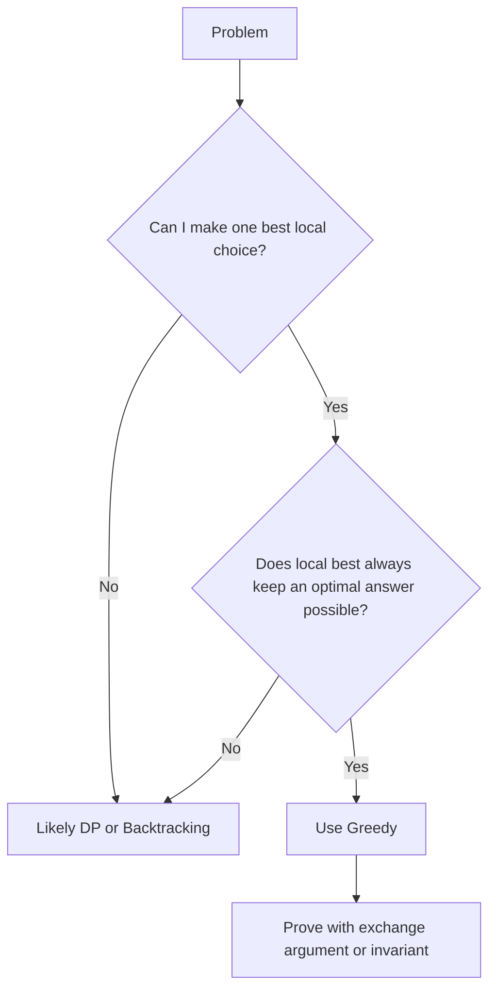

## Greedy Formula

| Idea | Meaning |
|---|---|
| Local choice | Best decision now |
| Global optimum | Best final answer |
| Greedy-choice property | A local choice can be part of some optimal solution |
| Optimal substructure | After choosing locally, the remaining problem is same type |

---

# 2. Greedy Recognition Flowchart

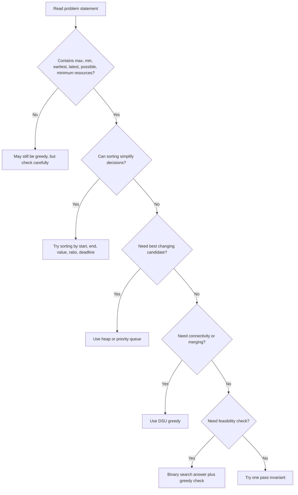

---

# 3. Greedy vs DP Decision Table

| Question | Greedy Signal | DP Signal |
|---|---|---|
| Do choices affect future heavily? | No | Yes |
| Can one local rule always win? | Yes | No |
| Need compare many states? | No | Yes |
| Can I sort and scan once? | Often | Sometimes |
| Can I prove by exchange? | Yes | Usually no |
| Need remember previous combinations? | No | Yes |

## Quick Test

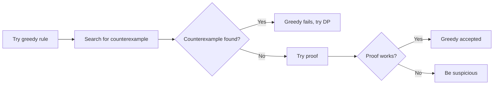

---

# 4. Pattern Map: Beginner to Advanced

| Level | Pattern Form | Main Tactic | Typical Problems |
|---|---|---|---|
| Beginner | Sort and pick | Sort, scan, choose | Assign Cookies |
| Beginner | Earliest finish | Sort by end time | Activity Selection |
| Beginner | Running best | Track min or max | Stock Buy Sell |
| FAANG | Reachability | Track farthest reach | Jump Game |
| FAANG | Reset point | Reset when impossible | Gas Station |
| FAANG | Heap choice | Pick best active item | Meeting Rooms |
| FAANG | Last boundary | Expand current segment | Partition Labels |
| Advanced | DSU greedy | Sort and merge | Kruskal MST |
| Advanced | Huffman merge | Merge two smallest | Huffman Coding |
| Advanced | Deadline greedy | Put job latest possible | Job Scheduling |
| CM | Binary search plus greedy | Guess answer, check feasibility | Aggressive Cows |

---

# 5. Universal Greedy Template

## Thinking Template

```text
1. Define what choice is made at each step.
2. Decide ordering: sort by what?
3. Decide data structure: array, heap, set, DSU?
4. Maintain invariant.
5. Prove local choice does not hurt optimal answer.
6. Test with edge cases.
```

## C++ Skeleton

```cpp
#include <bits/stdc++.h>
using namespace std;

int greedySolve(vector<int>& a) {
    sort(a.begin(), a.end());

    int ans = 0;
    // invariant: ans is optimal for processed elements
    for (int x : a) {
        // make local best choice
        if (/* condition */) {
            ans++;
        }
    }
    return ans;
}
```

## Java Skeleton

```java
import java.util.*;

class Solution {
    public int greedySolve(int[] a) {
        Arrays.sort(a);
        int ans = 0;

        for (int x : a) {
            // make local best choice
            if (true) {
                ans++;
            }
        }
        return ans;
    }
}
```

---

# 6. Beginner Patterns

---

## 6.1 Sort and Pick

### Concept

Sort the input so the best local choice becomes obvious.

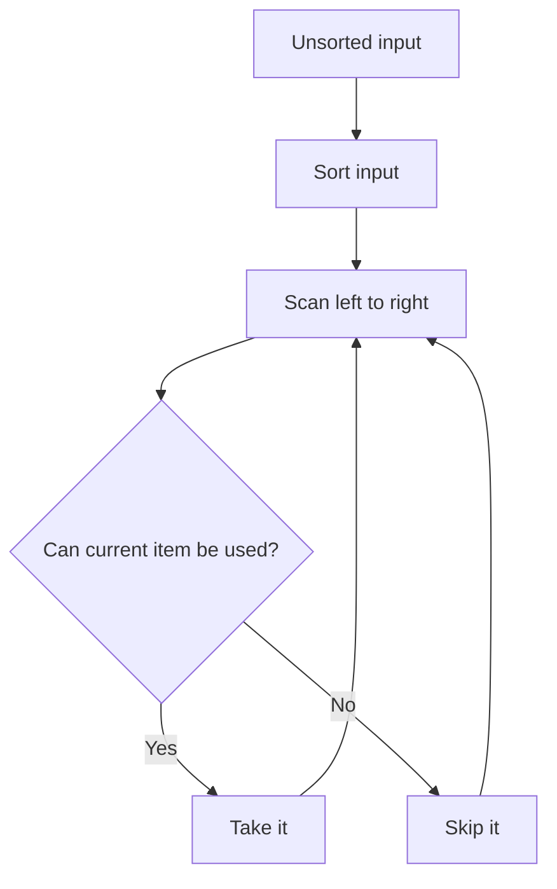

### Example: Assign Cookies

Problem: Each child has greed factor. Each cookie has size. A child is content if cookie size is at least greed.

### Tactic

- Sort children by greed.
- Sort cookies by size.
- Give the smallest possible cookie to each child.

### C++ Code

```cpp
#include <bits/stdc++.h>
using namespace std;

int findContentChildren(vector<int>& greed, vector<int>& cookies) {
    sort(greed.begin(), greed.end());
    sort(cookies.begin(), cookies.end());

    int child = 0;
    for (int cookie : cookies) {
        if (child < greed.size() && cookie >= greed[child]) {
            child++;
        }
    }
    return child;
}
```

### Dry Run

Input:

```text
greed   = [1, 2, 3]
cookies = [1, 1]
```

| Step | Cookie | Current Child Greed | Action | Content Children |
|---|---:|---:|---|---:|
| 1 | 1 | 1 | Assign | 1 |
| 2 | 1 | 2 | Cannot assign | 1 |

Answer: `1`

### Why Greedy Works

- Giving a large cookie to a low-greed child can waste power.
- The smallest cookie that satisfies a child leaves bigger cookies for harder children.
- So this local choice never hurts the future.

---

## 6.2 Earliest Finish Interval

### Concept

To select max non-overlapping intervals, always choose the interval that ends earliest.

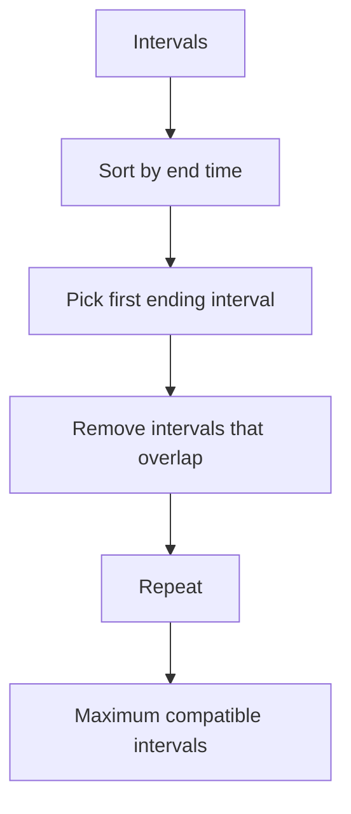

### Example: Activity Selection

Intervals:

```text
[1, 3], [2, 4], [3, 5], [0, 6], [5, 7]
```

Sorted by end:

```text
[1, 3], [2, 4], [3, 5], [0, 6], [5, 7]
```

### C++ Code

```cpp
#include <bits/stdc++.h>
using namespace std;

int maxActivities(vector<pair<int,int>>& intervals) {
    sort(intervals.begin(), intervals.end(), [](auto& a, auto& b) {
        return a.second < b.second;
    });

    int count = 0;
    int lastEnd = INT_MIN;

    for (auto [start, end] : intervals) {
        if (start >= lastEnd) {
            count++;
            lastEnd = end;
        }
    }
    return count;
}
```

### Dry Run

| Interval | Last End | Compatible? | Action | Count |
|---|---:|---|---|---:|
| [1,3] | -inf | Yes | Take | 1 |
| [2,4] | 3 | No | Skip | 1 |
| [3,5] | 3 | Yes | Take | 2 |
| [0,6] | 5 | No | Skip | 2 |
| [5,7] | 5 | Yes | Take | 3 |

Answer: `3`

### Mermaid Timeline

```mermaid
gantt
    title Activity Selection Example
    dateFormat X
    axisFormat %s
    section Picked
    A 1-3 :a1, 1, 2
    C 3-5 :a2, 3, 2
    E 5-7 :a3, 5, 2
    section Skipped
    B 2-4 :b1, 2, 2
    D 0-6 :b2, 0, 6
```

### Proof Idea

- Suppose optimal solution picks interval X first.
- Greedy picks interval G, which ends no later than X.
- Replace X with G.
- This replacement leaves at least as much remaining time.
- Therefore greedy can still lead to an optimal solution.

---

## 6.3 Running Min or Max

### Concept

Track the best value seen so far.

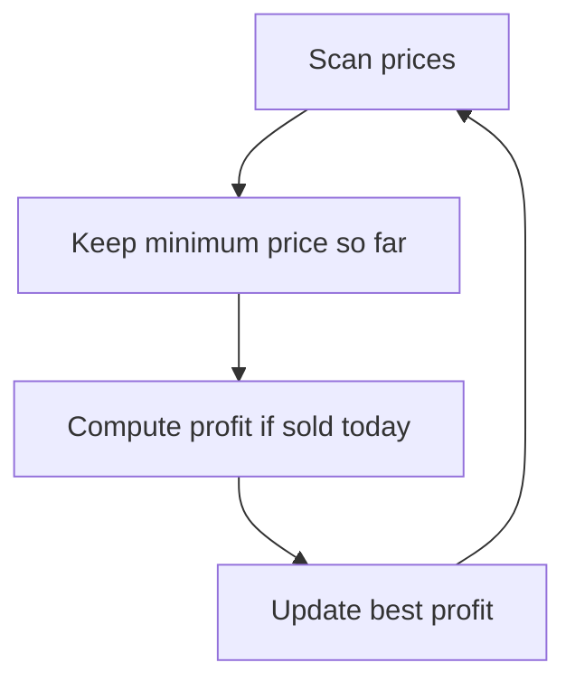

### Example: Best Time to Buy and Sell Stock

Input:

```text
prices = [7, 1, 5, 3, 6, 4]
```

### C++ Code

```cpp
#include <bits/stdc++.h>
using namespace std;

int maxProfit(vector<int>& prices) {
    int minPrice = INT_MAX;
    int best = 0;

    for (int price : prices) {
        minPrice = min(minPrice, price);
        best = max(best, price - minPrice);
    }
    return best;
}
```

### Dry Run

| Day | Price | Min So Far | Profit Today | Best Profit |
|---:|---:|---:|---:|---:|
| 1 | 7 | 7 | 0 | 0 |
| 2 | 1 | 1 | 0 | 0 |
| 3 | 5 | 1 | 4 | 4 |
| 4 | 3 | 1 | 2 | 4 |
| 5 | 6 | 1 | 5 | 5 |
| 6 | 4 | 1 | 3 | 5 |

Answer: `5`

---

# 7. FAANG and OA Patterns

---

## 7.1 Jump Game: Forward Reachability

### Concept

Track the farthest index you can reach.

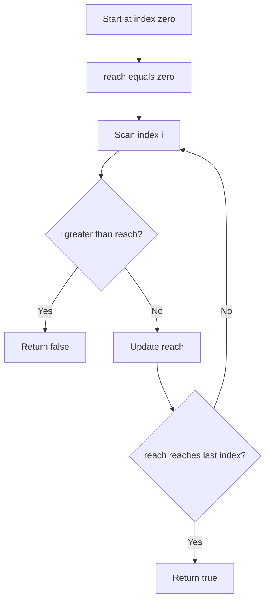

### C++ Code

```cpp
#include <bits/stdc++.h>
using namespace std;

bool canJump(vector<int>& nums) {
    int reach = 0;
    int n = nums.size();

    for (int i = 0; i < n; i++) {
        if (i > reach) return false;
        reach = max(reach, i + nums[i]);
        if (reach >= n - 1) return true;
    }
    return true;
}
```

### Java Code

```java
class Solution {
    public boolean canJump(int[] nums) {
        int reach = 0;
        for (int i = 0; i < nums.length; i++) {
            if (i > reach) return false;
            reach = Math.max(reach, i + nums[i]);
            if (reach >= nums.length - 1) return true;
        }
        return true;
    }
}
```

### Dry Run

Input:

```text
nums = [2, 3, 1, 1, 4]
```

| i | nums[i] | Old Reach | New Reach | Meaning |
|---:|---:|---:|---:|---|
| 0 | 2 | 0 | 2 | Can reach index 2 |
| 1 | 3 | 2 | 4 | Can reach last index |

Answer: `true`

### Proof Invariant

At every index `i`, `reach` is the farthest index reachable using positions from `0` to `i`.

If `i > reach`, no previous jump can reach `i`, so answer is impossible.

---

## 7.2 Gas Station: Reset Start

### Concept

If total gas is enough, there is a solution. If current tank becomes negative at station `i`, no station from current start to `i` can be the answer.

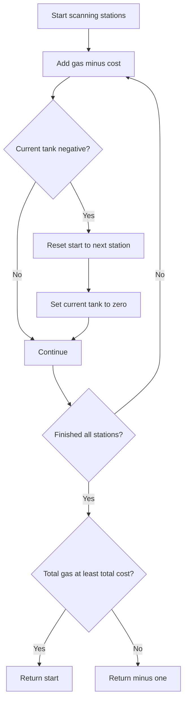

### C++ Code

```cpp
#include <bits/stdc++.h>
using namespace std;

int canCompleteCircuit(vector<int>& gas, vector<int>& cost) {
    int total = 0;
    int tank = 0;
    int start = 0;

    for (int i = 0; i < gas.size(); i++) {
        int diff = gas[i] - cost[i];
        total += diff;
        tank += diff;

        if (tank < 0) {
            start = i + 1;
            tank = 0;
        }
    }
    return total >= 0 ? start : -1;
}
```

### Dry Run

```text
gas  = [1, 2, 3, 4, 5]
cost = [3, 4, 5, 1, 2]
diff = [-2, -2, -2, 3, 3]
```

| i | Diff | Tank | Action | Start |
|---:|---:|---:|---|---:|
| 0 | -2 | -2 | Reset | 1 |
| 1 | -2 | -2 | Reset | 2 |
| 2 | -2 | -2 | Reset | 3 |
| 3 | 3 | 3 | Continue | 3 |
| 4 | 3 | 6 | Continue | 3 |

Answer: `3`

### Why Reset Works

If starting from `s` fails at `i`, then every station between `s` and `i` also fails because they start with less or equal accumulated fuel advantage.

---

## 7.3 Meeting Rooms: Heap Greedy

### Concept

Use a min heap of meeting end times.

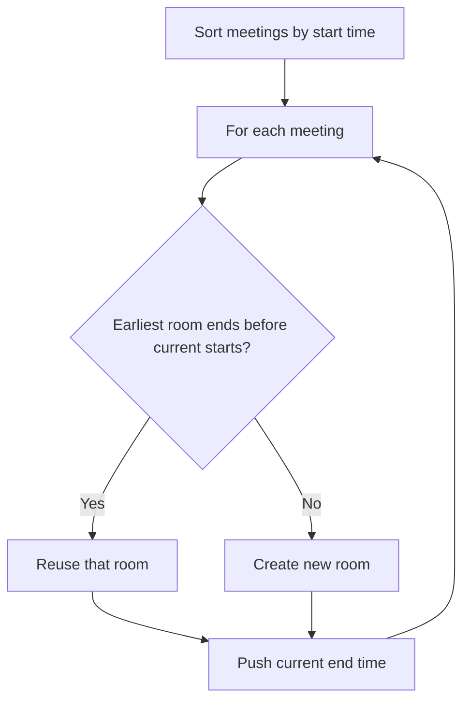

### C++ Code

```cpp
#include <bits/stdc++.h>
using namespace std;

int minMeetingRooms(vector<vector<int>>& intervals) {
    sort(intervals.begin(), intervals.end());
    priority_queue<int, vector<int>, greater<int>> pq;

    for (auto& meeting : intervals) {
        int start = meeting[0];
        int end = meeting[1];

        if (!pq.empty() && pq.top() <= start) {
            pq.pop();
        }
        pq.push(end);
    }
    return pq.size();
}
```

### Dry Run

Input:

```text
[[0,30], [5,10], [15,20]]
```

| Meeting | Heap Before | Action | Heap After |
|---|---|---|---|
| [0,30] | [] | New room | [30] |
| [5,10] | [30] | New room | [10,30] |
| [15,20] | [10,30] | Reuse room ending 10 | [20,30] |

Answer: `2`

### Proof Invariant

The heap always stores end times of active meetings. Heap size equals rooms currently needed. Maximum heap size gives minimum rooms.

---

## 7.4 Partition Labels: Last Occurrence

### Concept

Each character must appear in only one partition. Keep expanding the current partition until all characters inside are fully covered.

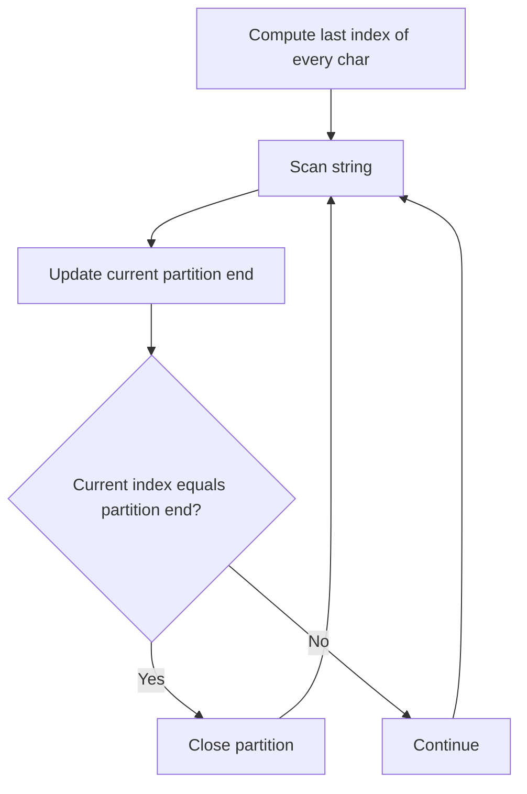

### C++ Code

```cpp
#include <bits/stdc++.h>
using namespace std;

vector<int> partitionLabels(string s) {
    vector<int> last(26);
    for (int i = 0; i < s.size(); i++) {
        last[s[i] - 'a'] = i;
    }

    vector<int> ans;
    int start = 0, end = 0;

    for (int i = 0; i < s.size(); i++) {
        end = max(end, last[s[i] - 'a']);
        if (i == end) {
            ans.push_back(end - start + 1);
            start = i + 1;
        }
    }
    return ans;
}
```

### Dry Run

Input:

```text
s = "ababcbacadefegdehijhklij"
```

| i | char | Last char index | Current End | Close? |
|---:|---|---:|---:|---|
| 0 | a | 8 | 8 | No |
| 1 | b | 5 | 8 | No |
| 4 | c | 7 | 8 | No |
| 8 | a | 8 | 8 | Yes, length 9 |
| 9 | d | 14 | 14 | No |
| 15 | e | 15 | 15 | Yes later partition closes |

Answer:

```text
[9, 7, 8]
```

---

## 7.5 Minimum Arrows: Interval End Greedy

### Concept

Sort balloons by end coordinate. Shoot arrow at earliest end to cover as many overlapping balloons as possible.

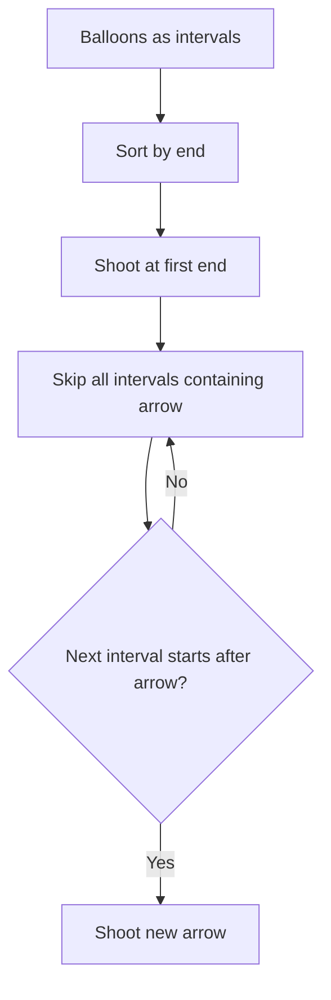

### C++ Code

```cpp
#include <bits/stdc++.h>
using namespace std;

int findMinArrowShots(vector<vector<int>>& points) {
    sort(points.begin(), points.end(), [](auto& a, auto& b) {
        return a[1] < b[1];
    });

    int arrows = 0;
    long long arrowPos = LLONG_MIN;

    for (auto& p : points) {
        if (p[0] > arrowPos) {
            arrows++;
            arrowPos = p[1];
        }
    }
    return arrows;
}
```

### Dry Run

Input:

```text
[[10,16], [2,8], [1,6], [7,12]]
```

Sorted by end:

```text
[1,6], [2,8], [7,12], [10,16]
```

| Balloon | Arrow Position | Action | Arrows |
|---|---:|---|---:|
| [1,6] | none | Shoot at 6 | 1 |
| [2,8] | 6 | Covered | 1 |
| [7,12] | 6 | Shoot at 12 | 2 |
| [10,16] | 12 | Covered | 2 |

Answer: `2`

---

# 8. Advanced and CM Patterns

---

## 8.1 Kruskal MST: Greedy plus DSU

### Concept

Pick the smallest edge that does not form a cycle.

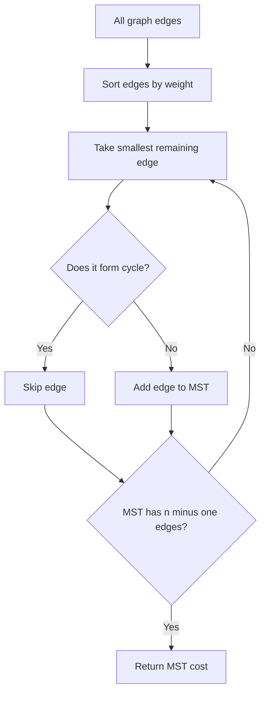

### C++ Code

```cpp
#include <bits/stdc++.h>
using namespace std;

struct DSU {
    vector<int> parent, rankv;

    DSU(int n) {
        parent.resize(n);
        rankv.assign(n, 0);
        iota(parent.begin(), parent.end(), 0);
    }

    int find(int x) {
        if (parent[x] == x) return x;
        return parent[x] = find(parent[x]);
    }

    bool unite(int a, int b) {
        a = find(a);
        b = find(b);
        if (a == b) return false;
        if (rankv[a] < rankv[b]) swap(a, b);
        parent[b] = a;
        if (rankv[a] == rankv[b]) rankv[a]++;
        return true;
    }
};

struct Edge {
    int u, v, w;
};

int kruskal(int n, vector<Edge>& edges) {
    sort(edges.begin(), edges.end(), [](Edge& a, Edge& b) {
        return a.w < b.w;
    });

    DSU dsu(n);
    int cost = 0;
    int used = 0;

    for (auto& e : edges) {
        if (dsu.unite(e.u, e.v)) {
            cost += e.w;
            used++;
            if (used == n - 1) break;
        }
    }
    return cost;
}
```

### Dry Run

Graph edges:

| Edge | Weight |
|---|---:|
| 0-1 | 1 |
| 1-2 | 2 |
| 0-2 | 3 |
| 2-3 | 4 |

| Step | Edge | Forms Cycle? | Action | Cost |
|---:|---|---|---|---:|
| 1 | 0-1 | No | Take | 1 |
| 2 | 1-2 | No | Take | 3 |
| 3 | 0-2 | Yes | Skip | 3 |
| 4 | 2-3 | No | Take | 7 |

Answer: `7`

### Proof Idea

Cut property: for any cut, the minimum edge crossing that cut is safe to include in an MST.

---

## 8.2 Huffman Coding: Two Smallest Merge

### Concept

Always merge the two lowest frequencies.

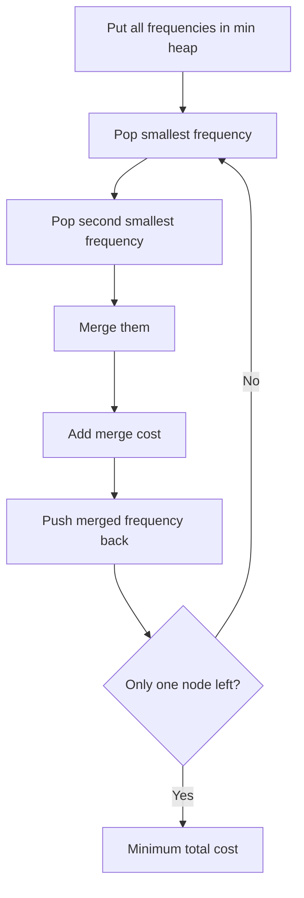

### C++ Code

```cpp
#include <bits/stdc++.h>
using namespace std;

int huffmanCost(vector<int>& freq) {
    priority_queue<int, vector<int>, greater<int>> pq(freq.begin(), freq.end());
    int cost = 0;

    while (pq.size() > 1) {
        int a = pq.top(); pq.pop();
        int b = pq.top(); pq.pop();
        int merged = a + b;
        cost += merged;
        pq.push(merged);
    }
    return cost;
}
```

### Dry Run

Input:

```text
freq = [5, 9, 12, 13, 16, 45]
```

| Step | Pop | Merge | Cost Added | Total Cost | Heap After |
|---:|---|---:|---:|---:|---|
| 1 | 5, 9 | 14 | 14 | 14 | 12,13,14,16,45 |
| 2 | 12,13 | 25 | 25 | 39 | 14,16,25,45 |
| 3 | 14,16 | 30 | 30 | 69 | 25,30,45 |
| 4 | 25,30 | 55 | 55 | 124 | 45,55 |
| 5 | 45,55 | 100 | 100 | 224 | 100 |

Answer: `224`

### Proof Idea

The two smallest frequencies should be deepest siblings. If they are not, swap them with deeper nodes to reduce or keep the same cost.

---

## 8.3 Job Scheduling With Deadlines

### Concept

Choose highest profit jobs first. Put each job in the latest available slot before its deadline.

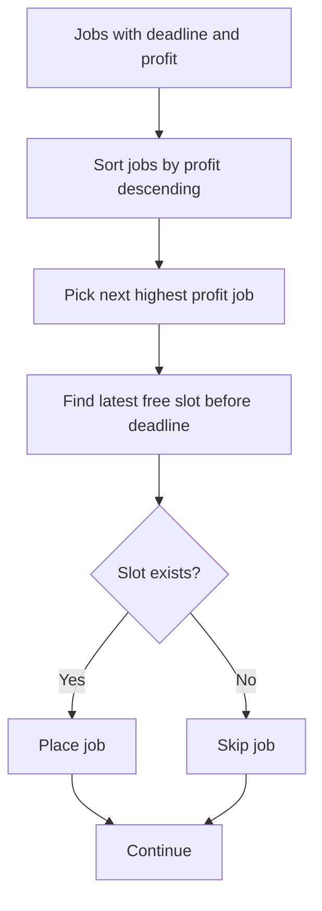

### C++ Code

```cpp
#include <bits/stdc++.h>
using namespace std;

struct Job {
    int id;
    int deadline;
    int profit;
};

int jobScheduling(vector<Job>& jobs) {
    sort(jobs.begin(), jobs.end(), [](Job& a, Job& b) {
        return a.profit > b.profit;
    });

    int maxDeadline = 0;
    for (auto& job : jobs) maxDeadline = max(maxDeadline, job.deadline);

    vector<int> slot(maxDeadline + 1, -1);
    int totalProfit = 0;

    for (auto& job : jobs) {
        for (int t = job.deadline; t >= 1; t--) {
            if (slot[t] == -1) {
                slot[t] = job.id;
                totalProfit += job.profit;
                break;
            }
        }
    }
    return totalProfit;
}
```

### Dry Run

Jobs:

| Job | Deadline | Profit |
|---|---:|---:|
| A | 2 | 100 |
| B | 1 | 19 |
| C | 2 | 27 |
| D | 1 | 25 |
| E | 3 | 15 |

Sorted by profit:

```text
A, C, D, B, E
```

| Step | Job | Latest Slot Tried | Action | Slots | Profit |
|---:|---|---:|---|---|---:|
| 1 | A | 2 | Place at 2 | [_, A, _] | 100 |
| 2 | C | 2 then 1 | Place at 1 | [C, A, _] | 127 |
| 3 | D | 1 | No slot | [C, A, _] | 127 |
| 4 | B | 1 | No slot | [C, A, _] | 127 |
| 5 | E | 3 | Place at 3 | [C, A, E] | 142 |

Answer: `142`

### Faster DSU Version for Contest

```cpp
#include <bits/stdc++.h>
using namespace std;

struct DSU {
    vector<int> parent;
    DSU(int n) {
        parent.resize(n + 1);
        iota(parent.begin(), parent.end(), 0);
    }
    int find(int x) {
        if (parent[x] == x) return x;
        return parent[x] = find(parent[x]);
    }
    void occupy(int x) {
        parent[x] = find(x - 1);
    }
};

struct Job {
    int deadline;
    int profit;
};

int scheduleJobsDSU(vector<Job>& jobs) {
    sort(jobs.begin(), jobs.end(), [](Job& a, Job& b) {
        return a.profit > b.profit;
    });

    int maxD = 0;
    for (auto& j : jobs) maxD = max(maxD, j.deadline);

    DSU dsu(maxD);
    int profit = 0;

    for (auto& j : jobs) {
        int freeSlot = dsu.find(j.deadline);
        if (freeSlot > 0) {
            profit += j.profit;
            dsu.occupy(freeSlot);
        }
    }
    return profit;
}
```

---

## 8.4 Binary Search plus Greedy Check

### Concept

When the answer is numeric, binary search the answer. Use greedy to check if a guessed answer is possible.

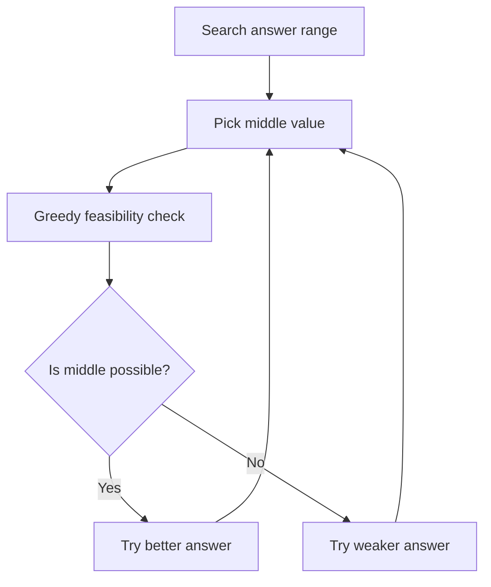

### Example: Aggressive Cows

Place `k` cows in stalls to maximize minimum distance.

### C++ Code

```cpp
#include <bits/stdc++.h>
using namespace std;

bool canPlace(vector<int>& stalls, int k, int dist) {
    int count = 1;
    int last = stalls[0];

    for (int i = 1; i < stalls.size(); i++) {
        if (stalls[i] - last >= dist) {
            count++;
            last = stalls[i];
        }
    }
    return count >= k;
}

int aggressiveCows(vector<int>& stalls, int k) {
    sort(stalls.begin(), stalls.end());

    int low = 1;
    int high = stalls.back() - stalls.front();
    int ans = 0;

    while (low <= high) {
        int mid = low + (high - low) / 2;

        if (canPlace(stalls, k, mid)) {
            ans = mid;
            low = mid + 1;
        } else {
            high = mid - 1;
        }
    }
    return ans;
}
```

### Dry Run

Input:

```text
stalls = [1, 2, 4, 8, 9]
k = 3
```

| Guess Distance | Greedy Placement | Possible? | Action |
|---:|---|---|---|
| 4 | 1, 8 | No | Decrease |
| 2 | 1, 4, 8 | Yes | Increase |
| 3 | 1, 4, 8 | Yes | Increase |

Answer: `3`

### Why Greedy Check Works

To maximize placements for a fixed distance, always place the next cow at the earliest possible stall. This leaves maximum remaining space.

---

# 9. How to Prove Greedy Works

There are four common proof styles.

| Proof Style | When to Use | Key Sentence |
|---|---|---|
| Exchange argument | Sorting, intervals, deadlines | Replace optimal choice with greedy choice |
| Invariant | One-pass greedy | After every step, this statement remains true |
| Cut property | MST, graph greedy | Minimum crossing edge is safe |
| Staying ahead | Reachability | Greedy is always at least as good as any other method |

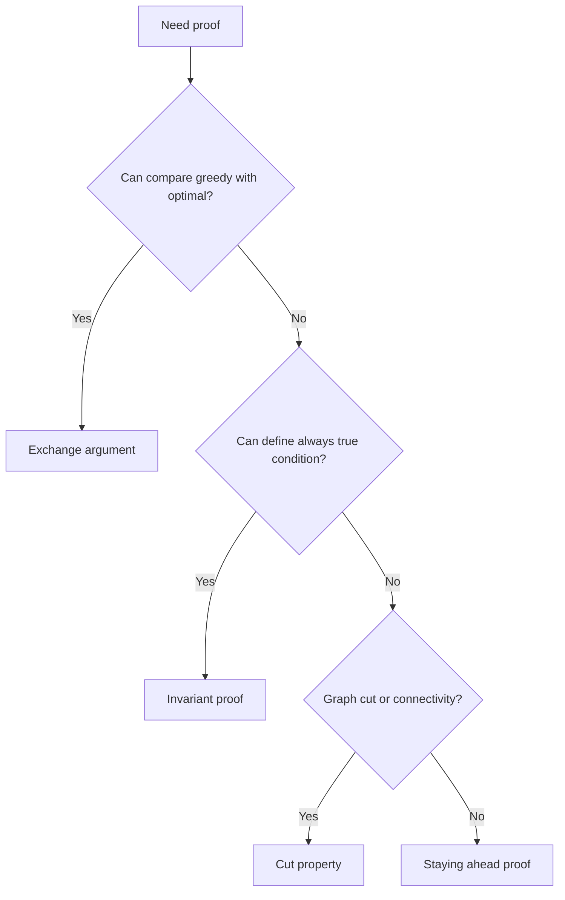

---

# 10. Exchange Argument Step by Step

## General Exchange Template

```text
1. Let OPT be an optimal solution.
2. Let G be the first greedy choice.
3. If OPT already contains G, good.
4. If not, replace OPT's first choice with G.
5. Show the new solution is still valid.
6. Show the new solution is not worse.
7. Repeat for the remaining choices.
8. Therefore greedy is optimal.
```

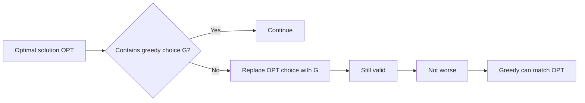

---

## Example 1: Activity Selection Proof

### Greedy Choice

Pick interval with earliest end time.

### Step-by-step Proof

| Step | Explanation |
|---|---|
| 1 | Let OPT be a maximum set of non-overlapping intervals |
| 2 | Let G be the interval with earliest end time |
| 3 | Let O be the first interval chosen by OPT |
| 4 | Since G ends no later than O, replacing O with G keeps all later intervals valid |
| 5 | Number of intervals remains same |
| 6 | Therefore there exists an optimal solution starting with G |
| 7 | Repeat on remaining intervals |

### Visual Proof

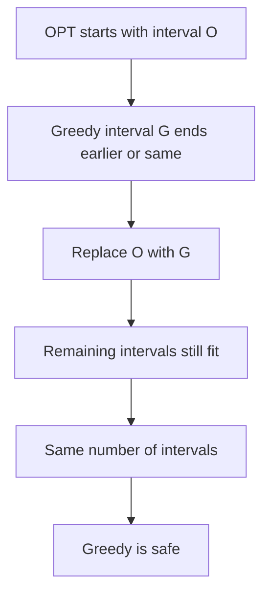

---

## Example 2: Minimum Arrows Proof

### Greedy Choice

Shoot arrow at earliest ending balloon.

### Step-by-step Proof

| Step | Explanation |
|---|---|
| 1 | Let first uncovered balloon have earliest end `e` |
| 2 | Any solution must shoot one arrow inside this balloon |
| 3 | Moving that arrow to `e` still bursts this balloon |
| 4 | Since `e` is the smallest end, moving to `e` does not lose balloons that started before `e` and ended after `e` |
| 5 | So shooting at `e` is safe |

---

## Example 3: Job Scheduling Proof

### Greedy Choice

Process jobs by highest profit. Place selected job as late as possible before deadline.

### Why latest slot?

- Earlier slots are more valuable because many jobs may need them.
- Placing a job late keeps earlier slots open.

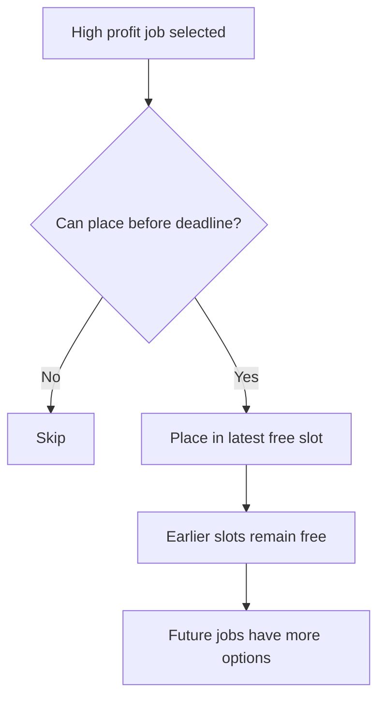

### Exchange Proof

| Step | Explanation |
|---|---|
| 1 | Consider highest profit job J that greedy schedules |
| 2 | If OPT also schedules J, fine |
| 3 | If OPT schedules lower profit job K instead, replace K with J |
| 4 | Profit does not decrease |
| 5 | Latest-slot placement preserves earlier flexibility |

---

## Example 4: Jump Game Staying Ahead Proof

### Greedy Value

`reach` is farthest index reachable so far.

| Step | Explanation |
|---|---|
| 1 | At index `i`, greedy stores maximum reach from all previous reachable indices |
| 2 | Any other path reaching `i` cannot reach farther than this max |
| 3 | Therefore greedy stays ahead of all possible choices |
| 4 | If greedy cannot reach index `i`, nobody can |

---

# 11. Contest and OA Proof Templates

## Template A: Sort plus Pick

```text
We sort by ______.
At each step, greedy chooses ______.
Assume an optimal solution chooses a different item X first.
The greedy item G is no worse because ______.
Replace X with G.
The solution remains valid because ______.
The answer does not decrease.
Therefore greedy is optimal.
```

## Template B: Heap Greedy

```text
The heap stores all currently available candidates.
At every step, choosing the best heap element is safe because no unavailable element can be used now.
Among available elements, choosing any worse option cannot improve the future more than the greedy choice.
Thus the greedy choice is optimal for this step.
```

## Template C: Reachability

```text
Invariant: after processing index i, reach is the farthest reachable position.
If i is greater than reach, no previous choice can reach i.
Otherwise, updating reach with i plus nums[i] considers every possible jump source.
Therefore the algorithm is correct.
```

## Template D: Binary Search plus Greedy Check

```text
The answer is monotonic.
If value X is possible, then all weaker values are also possible.
If value X is impossible, then all stronger values are impossible.
The greedy check is valid because it always makes the earliest or safest placement, leaving maximum room for future choices.
Therefore binary search plus greedy check finds the optimal answer.
```

---

# 12. Common Mistakes and Counterexamples

| Mistake | Why It Fails | Example |
|---|---|---|
| Pick biggest interval first | Blocks many smaller intervals | Activity selection |
| Pick biggest jump always | May not maximize future reach | Jump Game II variants |
| Use greedy for any coin system | Non-canonical coins fail | coins [1,3,4], amount 6 |
| Sort by start instead of end | Bad for interval selection | Long early interval blocks others |
| Ignore proof | Greedy may only feel right | OA hidden tests fail |

## Coin Counterexample

Coins:

```text
[1, 3, 4], amount = 6
```

Greedy:

```text
4 + 1 + 1 = 3 coins
```

Optimal:

```text
3 + 3 = 2 coins
```

So greedy fails here.

```mermaid
flowchart TD
    A[Amount 6] --> B[Greedy picks 4]
    B --> C[Remaining 2]
    C --> D[Pick 1 and 1]
    D --> E[Total 3 coins]
    A --> F[Optimal picks 3 and 3]
    F --> G[Total 2 coins]
```

---

# 13. Final Cheat Sheet

## Recognition Cheat Sheet

| If You See | Try This |
|---|---|
| Maximum non-overlapping | Sort by end |
| Minimum rooms/resources | Sort plus heap |
| Can reach end | Farthest reach |
| Complete circular route | Total sum plus reset |
| Characters must stay together | Last occurrence boundary |
| Minimum arrows/points | Sort intervals by end |
| Connect graph cheaply | Kruskal or Prim |
| Merge with minimum cost | Min heap |
| Maximize minimum value | Binary search plus greedy |
| Deadlines and profit | Sort by profit plus latest slot |

## Greedy Proof Cheat Sheet

```mermaid
flowchart TD
    A[Greedy proof] --> B[State greedy choice]
    B --> C[State invariant or exchange]
    C --> D[Compare with optimal solution]
    D --> E[Show greedy choice is safe]
    E --> F[Reduce to smaller problem]
    F --> G[Conclude optimal]
```

## 10-Second Greedy Check

```text
1. Can I sort it?
2. What is the local best choice?
3. Can I explain why this choice does not hurt future choices?
4. Can I find a counterexample?
5. If no counterexample and proof exists, use greedy.
```

---

# Practice Order

| Order | Problem | Pattern |
|---:|---|---|
| 1 | Assign Cookies | Sort and pick |
| 2 | Best Time to Buy Sell Stock | Running min |
| 3 | Activity Selection | Earliest finish |
| 4 | Jump Game | Reachability |
| 5 | Gas Station | Reset start |
| 6 | Meeting Rooms II | Heap greedy |
| 7 | Partition Labels | Last occurrence |
| 8 | Minimum Arrows | Interval end |
| 9 | Aggressive Cows | Binary search plus greedy |
| 10 | Kruskal MST | DSU greedy |
| 11 | Huffman Coding | Min heap merge |
| 12 | Job Scheduling | Deadline greedy |

---

# One-Line Summary

Greedy works when you can prove that choosing the best current option keeps at least one optimal solution alive.

