# Ultimate Math Guide: Modular Arithmetic, Number Theory, Combinatorics  
## C++ Pattern Playbook for Newbie → Candidate Master + LC/FAANG

> Goal: recognize math patterns, map them to forms/tactics, implement clean C++ templates, and practice in difficulty order.

---

# Clickable Index

- [0. How to Use This Guide](#0-how-to-use-this-guide)
- [1. Math Thinking Flow](#1-math-thinking-flow)
- [2. Difficulty Roadmap](#2-difficulty-roadmap)
- [3. Master Pattern Map](#3-master-pattern-map)
- [4. C++ Math Template Pack](#4-c-math-template-pack)
- [5. Modular Arithmetic](#5-modular-arithmetic)
- [6. Number Theory](#6-number-theory)
- [7. Combinatorics](#7-combinatorics)
- [8. LC/FAANG Math Patterns](#8-lcfaang-math-patterns)
- [9. Candidate Master Escalation Patterns](#9-candidate-master-escalation-patterns)
- [10. Difficulty-Sorted Problem Set](#10-difficulty-sorted-problem-set)
- [11. Final Revision Checklist](#11-final-revision-checklist)

---

# 0. How to Use This Guide

For every problem:

```text
Statement
→ constraints
→ identify form
→ choose tactic
→ write formula
→ test small simulation
→ implement template
→ check overflow/mod/edge cases
```

## Core Matching Table

| Signal in Problem | Likely Form | Pattern | Main Tactic | Typical Code |
|---|---|---|---|---|
| Answer modulo `1e9+7` | Modular arithmetic | Formula under mod | normalize every operation | `modAdd`, `modMul`, `modPow` |
| Need `a^b mod m` | Fast exponentiation | Binary exponentiation | square and multiply | `modPow` |
| Need division under mod | Modular inverse | Fermat / Extended GCD | inverse then multiply | `modInv` |
| `nCr mod MOD` many queries | Combinatorics | Precompute factorials | `fact`, `invFact` | `nCr` |
| Need gcd/lcm | Number theory | Euclid | reduce pairwise | `gcd`, `lcm` |
| Prime checking | Number theory | Trial division / sieve | divide up to sqrt or precompute | `isPrime`, `sieve` |
| Count divisors | Divisor theory | prime factorization | exponent product | factor map |
| Count arrangements | Combinatorics | permutations/combinations | choose positions | `nCr`, factorial |
| Count ways with constraints | Combinatorics + DP | states + transitions | recurrence | DP |
| Repeated cycles | Modular / number theory | periodicity | find period | `% period` |
| Pair count divisible by k | Modular buckets | remainder grouping | frequency of remainders | `cnt[r]` |

---

# 1. Math Thinking Flow

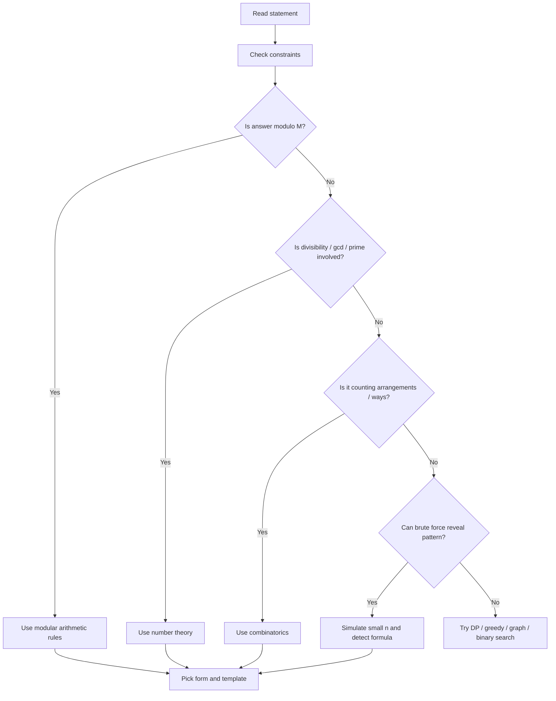
```mermaid
flowchart TD
    A["Read statement"] --> B["Check constraints"]
    B --> C{"Is answer modulo M?"}
    C -->|Yes| D["Use modular arithmetic rules"]
    C -->|No| E{"Is divisibility / gcd / prime involved?"}
    E -->|Yes| F["Use number theory"]
    E -->|No| G{"Is it counting arrangements / ways?"}
    G -->|Yes| H["Use combinatorics"]
    G -->|No| I{"Can brute force reveal pattern?"}
    I -->|Yes| J["Simulate small n and detect formula"]
    I -->|No| K["Try DP / greedy / graph / binary search"]
    D --> L["Pick form and template"]
    F --> L
    H --> L
    J --> L
```

## CM Thinking Flow

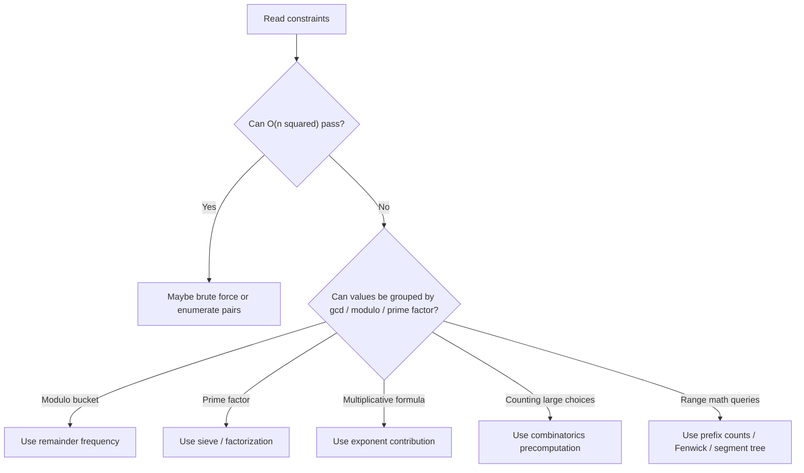
```mermaid
flowchart TD
    A["Read constraints"] --> B{"Can O(n squared) pass?"}
    B -->|Yes| C["Maybe brute force or enumerate pairs"]
    B -->|No| D{"Can values be grouped by gcd / modulo / prime factor?"}
    D -->|Modulo bucket| E["Use remainder frequency"]
    D -->|Prime factor| F["Use sieve / factorization"]
    D -->|Multiplicative formula| G["Use exponent contribution"]
    D -->|Counting large choices| H["Use combinatorics precomputation"]
    D -->|Range math queries| I["Use prefix counts / Fenwick / segment tree"]
```

## FAANG Thinking Flow

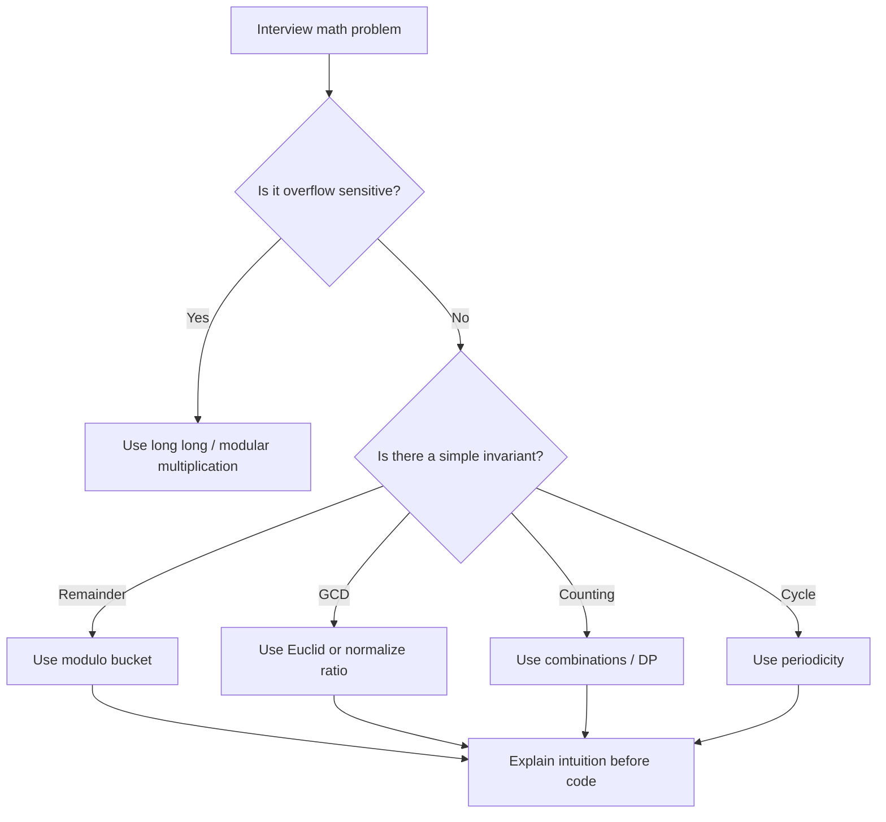
```mermaid
flowchart TD
    A["Interview math problem"] --> B{"Is it overflow sensitive?"}
    B -->|Yes| C["Use long long / modular multiplication"]
    B -->|No| D{"Is there a simple invariant?"}
    D -->|Remainder| E["Use modulo bucket"]
    D -->|GCD| F["Use Euclid or normalize ratio"]
    D -->|Counting| G["Use combinations / DP"]
    D -->|Cycle| H["Use periodicity"]
    E --> I["Explain intuition before code"]
    F --> I
    G --> I
    H --> I
```

---

# 2. Difficulty Roadmap

| Level | Target | What to Master |
|---|---|---|
| Newbie | basic math implementation | gcd, lcm, modulo, power, prime check |
| Pupil | common CP math | sieve, factorization, divisor count, simple nCr |
| Specialist | formula matching | modular inverse, combinatorics, inclusion-exclusion basics |
| Expert | faster and deeper math | linear sieve, SPF, Euler phi, CRT, stars and bars |
| Candidate Master | advanced contest math | Mobius idea, multiplicative functions, combinatorics with constraints |
| LC/FAANG | interview math patterns | modulo buckets, gcd normalization, combinational counting, cycle detection |

---

# 3. Master Pattern Map

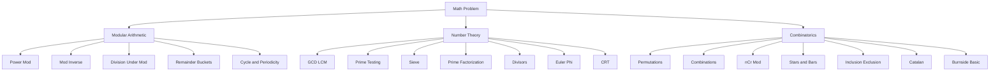
```mermaid
flowchart TD
    A["Math Problem"] --> B["Modular Arithmetic"]
    A --> C["Number Theory"]
    A --> D["Combinatorics"]

    B --> B1["Power Mod"]
    B --> B2["Mod Inverse"]
    B --> B3["Division Under Mod"]
    B --> B4["Remainder Buckets"]
    B --> B5["Cycle and Periodicity"]

    C --> C1["GCD LCM"]
    C --> C2["Prime Testing"]
    C --> C3["Sieve"]
    C --> C4["Prime Factorization"]
    C --> C5["Divisors"]
    C --> C6["Euler Phi"]
    C --> C7["CRT"]

    D --> D1["Permutations"]
    D --> D2["Combinations"]
    D --> D3["nCr Mod"]
    D --> D4["Stars and Bars"]
    D --> D5["Inclusion Exclusion"]
    D --> D6["Catalan"]
    D --> D7["Burnside Basic"]
```

---

# 4. C++ Math Template Pack

```cpp
#include <bits/stdc++.h>
using namespace std;

using ll = long long;
const ll MOD = 1000000007LL;

ll norm(ll x, ll mod = MOD) {
    x %= mod;
    if (x < 0) x += mod;
    return x;
}

ll modAdd(ll a, ll b, ll mod = MOD) {
    return norm(norm(a, mod) + norm(b, mod), mod);
}

ll modSub(ll a, ll b, ll mod = MOD) {
    return norm(norm(a, mod) - norm(b, mod), mod);
}

ll modMul(ll a, ll b, ll mod = MOD) {
    return (__int128)norm(a, mod) * norm(b, mod) % mod;
}

ll modPow(ll a, ll e, ll mod = MOD) {
    a = norm(a, mod);
    ll ans = 1 % mod;

    while (e > 0) {
        if (e & 1LL) ans = modMul(ans, a, mod);
        a = modMul(a, a, mod);
        e >>= 1LL;
    }

    return ans;
}

ll extGcd(ll a, ll b, ll& x, ll& y) {
    if (b == 0) {
        x = 1;
        y = 0;
        return a;
    }

    ll x1, y1;
    ll g = extGcd(b, a % b, x1, y1);
    x = y1;
    y = x1 - y1 * (a / b);
    return g;
}

ll modInvGeneral(ll a, ll mod) {
    ll x, y;
    ll g = extGcd(a, mod, x, y);
    if (g != 1) return -1;
    return norm(x, mod);
}

ll modInvPrime(ll a, ll mod = MOD) {
    return modPow(a, mod - 2, mod);
}
```

---

# 5. Modular Arithmetic

## 5.1 Pattern Map

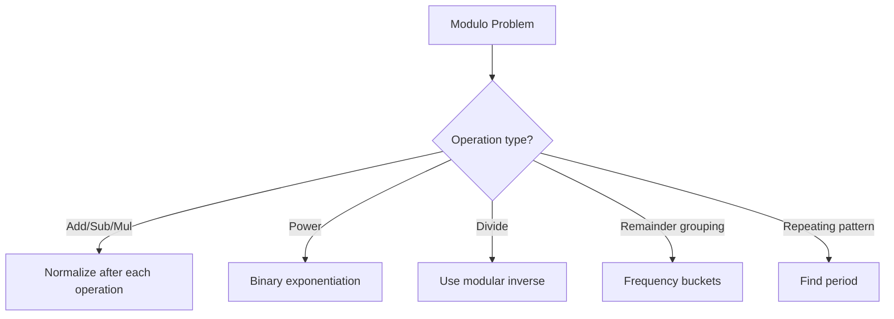
```mermaid
flowchart TD
    A["Modulo Problem"] --> B{"Operation type?"}
    B -->|Add/Sub/Mul| C["Normalize after each operation"]
    B -->|Power| D["Binary exponentiation"]
    B -->|Divide| E["Use modular inverse"]
    B -->|Remainder grouping| F["Frequency buckets"]
    B -->|Repeating pattern| G["Find period"]
```

## Form M1: Basic Mod Operations

### Intuition

Modulo keeps numbers inside a fixed range.

```text
(a + b) mod M = ((a mod M) + (b mod M)) mod M
(a * b) mod M = ((a mod M) * (b mod M)) mod M
```

### Simulation

```text
a = 8, b = 9, M = 5
8 + 9 = 17
17 mod 5 = 2

8 mod 5 = 3
9 mod 5 = 4
3 + 4 = 7
7 mod 5 = 2
```

### Flowchart

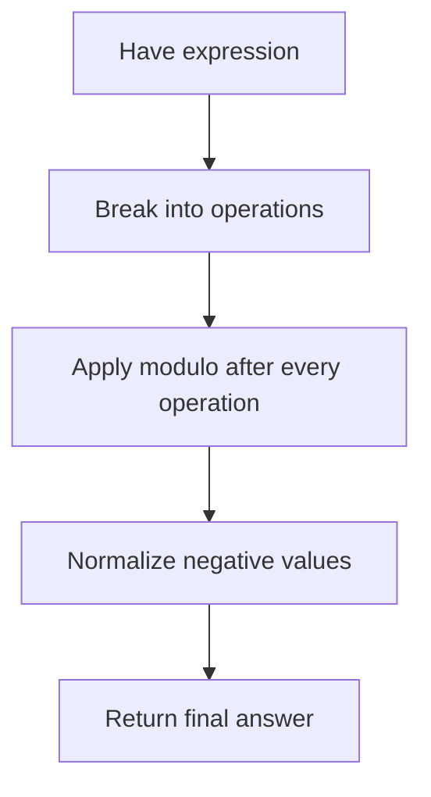
```mermaid
flowchart TD
    A["Have expression"] --> B["Break into operations"]
    B --> C["Apply modulo after every operation"]
    C --> D["Normalize negative values"]
    D --> E["Return final answer"]
```

### C++

```cpp
long long ans = 0;
ans = modAdd(ans, x);
ans = modSub(ans, y);
ans = modMul(ans, z);
```

---

## Form M2: Binary Exponentiation

### Use When

| Signal | Meaning |
|---|---|
| `a^b mod m` | direct power is impossible |
| exponent up to `1e18` | need `O(log b)` |
| repeated squaring | binary exponentiation |

### Logic Flow

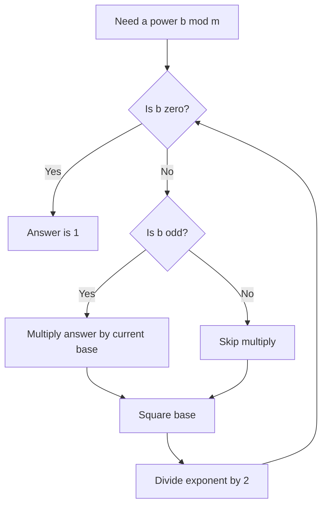
```mermaid
flowchart TD
    A["Need a power b mod m"] --> B{"Is b zero?"}
    B -->|Yes| C["Answer is 1"]
    B -->|No| D{"Is b odd?"}
    D -->|Yes| E["Multiply answer by current base"]
    D -->|No| F["Skip multiply"]
    E --> G["Square base"]
    F --> G
    G --> H["Divide exponent by 2"]
    H --> B
```

### C++

```cpp
long long modPow(long long a, long long e, long long mod) {
    a %= mod;
    long long ans = 1 % mod;

    while (e > 0) {
        if (e & 1LL) ans = (__int128)ans * a % mod;
        a = (__int128)a * a % mod;
        e >>= 1LL;
    }

    return ans;
}
```

---

## Form M3: Modular Inverse and Division

### Intuition

Normal division does not work under modulo.

```text
a / b mod M = a * inverse(b) mod M
```

If `M` is prime and `b` is not divisible by `M`:

```text
inverse(b) = b^(M - 2) mod M
```

### Flowchart

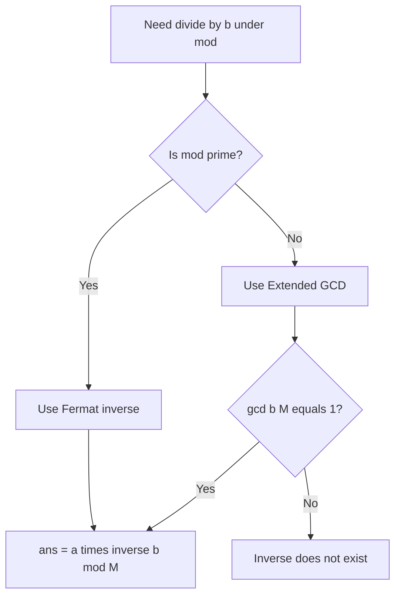
```mermaid
flowchart TD
    A["Need divide by b under mod"] --> B{"Is mod prime?"}
    B -->|Yes| C["Use Fermat inverse"]
    B -->|No| D["Use Extended GCD"]
    C --> E["ans = a times inverse b mod M"]
    D --> F{"gcd b M equals 1?"}
    F -->|Yes| E
    F -->|No| G["Inverse does not exist"]
```

### C++

```cpp
long long divideModPrime(long long a, long long b, long long mod) {
    return modMul(a, modPow(b, mod - 2, mod), mod);
}
```

---

## Form M4: Remainder Bucket Counting

### FAANG Pattern

Often appears as:

- pairs divisible by `k`
- subarray sum divisible by `k`
- songs divisible by 60
- count pairs where `(a + b) % k == 0`

### Logic

For each remainder `r`, need complement:

```text
need = (k - r) % k
```

### Flowchart

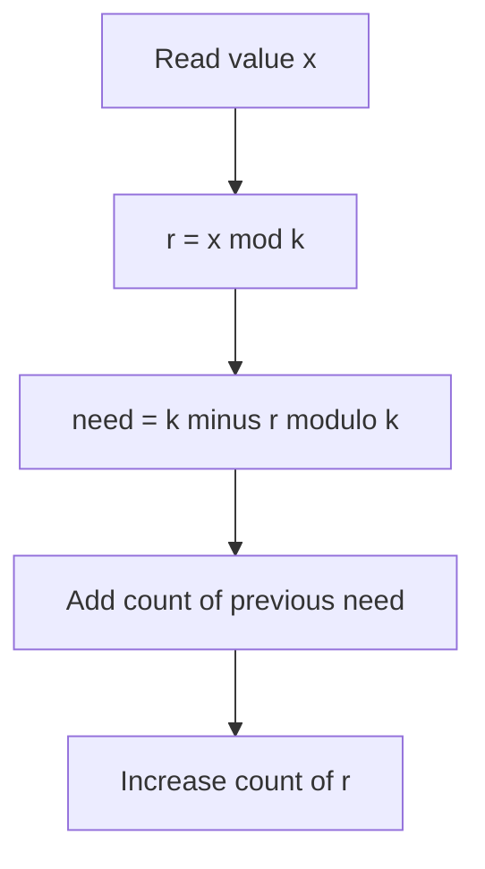
```mermaid
flowchart TD
    A["Read value x"] --> B["r = x mod k"]
    B --> C["need = k minus r modulo k"]
    C --> D["Add count of previous need"]
    D --> E["Increase count of r"]
```

### C++

```cpp
long long countPairsDivisibleByK(vector<int>& a, int k) {
    vector<long long> cnt(k, 0);
    long long ans = 0;

    for (int x : a) {
        int r = ((x % k) + k) % k;
        int need = (k - r) % k;
        ans += cnt[need];
        cnt[r]++;
    }

    return ans;
}
```

---

# 6. Number Theory

## 6.1 Pattern Map

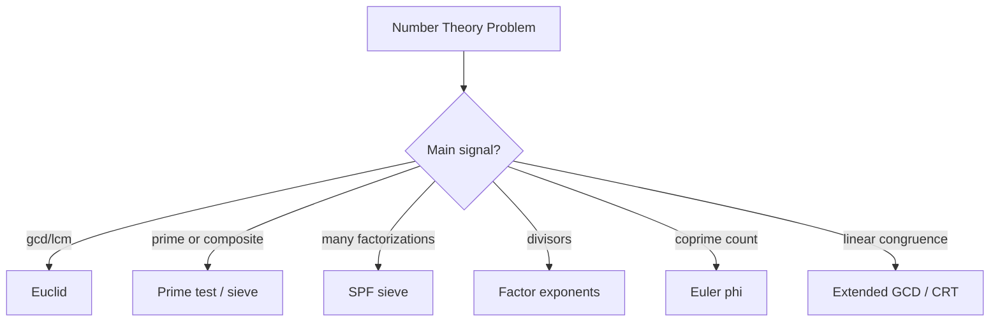
```mermaid
flowchart TD
    A["Number Theory Problem"] --> B{"Main signal?"}
    B -->|gcd/lcm| C["Euclid"]
    B -->|prime or composite| D["Prime test / sieve"]
    B -->|many factorizations| E["SPF sieve"]
    B -->|divisors| F["Factor exponents"]
    B -->|coprime count| G["Euler phi"]
    B -->|linear congruence| H["Extended GCD / CRT"]
```

---

## Form N1: GCD and LCM

### Intuition

GCD is the largest number that divides both.  
Euclid uses:

```text
gcd(a, b) = gcd(b, a mod b)
```

### Flowchart

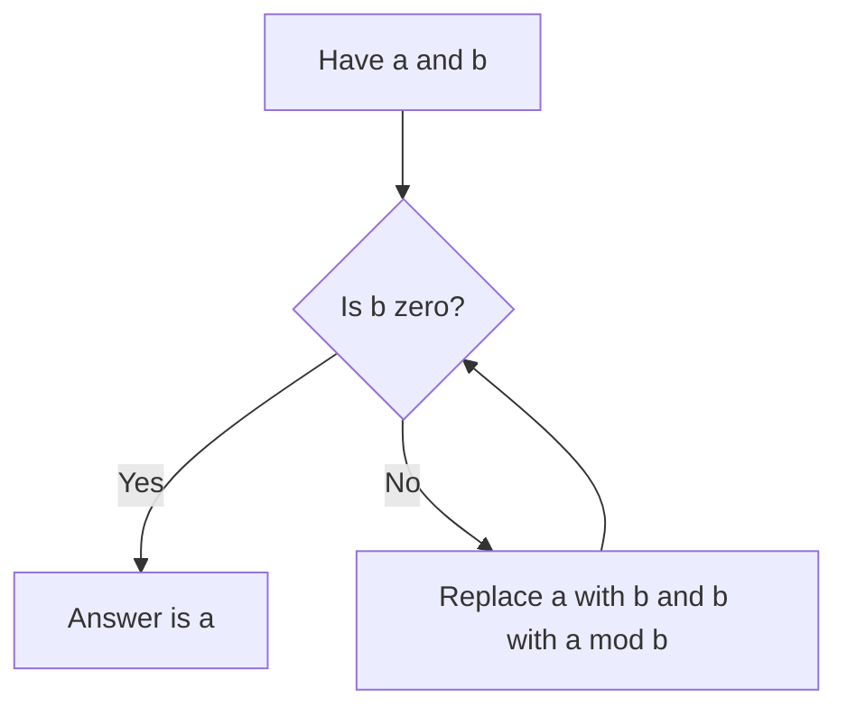
```mermaid
flowchart TD
    A["Have a and b"] --> B{"Is b zero?"}
    B -->|Yes| C["Answer is a"]
    B -->|No| D["Replace a with b and b with a mod b"]
    D --> B
```

### C++

```cpp
long long gcdll(long long a, long long b) {
    while (b != 0) {
        long long r = a % b;
        a = b;
        b = r;
    }
    return abs(a);
}

long long lcmll(long long a, long long b) {
    return a / gcdll(a, b) * b;
}
```

---

## Form N2: Prime Check

### Use When

| Constraint | Approach |
|---:|---|
| one number up to `1e9` | trial division up to sqrt |
| many queries up to `1e6` or `1e7` | sieve |
| huge 64-bit numbers | Miller Rabin |

### Flowchart

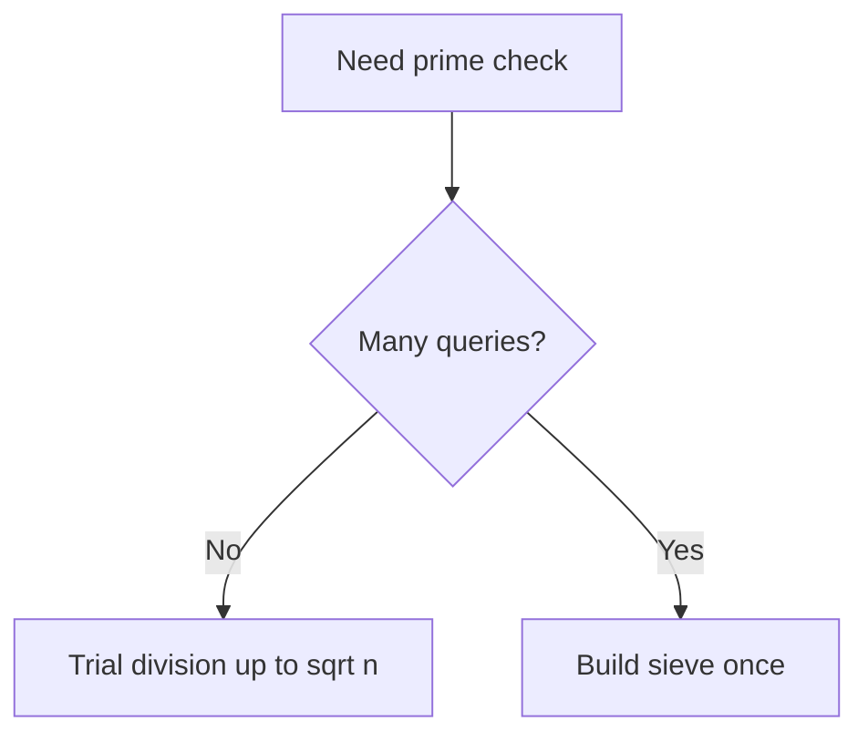
```mermaid
flowchart TD
    A["Need prime check"] --> B{"Many queries?"}
    B -->|No| C["Trial division up to sqrt n"]
    B -->|Yes| D["Build sieve once"]
```

### C++

```cpp
bool isPrime(long long n) {
    if (n < 2) return false;
    if (n % 2 == 0) return n == 2;

    for (long long d = 3; d * d <= n; d += 2) {
        if (n % d == 0) return false;
    }

    return true;
}
```

---

## Form N3: Sieve of Eratosthenes

### Intuition

Mark multiples of every prime as composite.

### Simulation

```text
n = 10
2 is prime -> mark 4,6,8,10
3 is prime -> mark 6,9
5 is prime -> mark 10
Primes = 2,3,5,7
```

### Flowchart

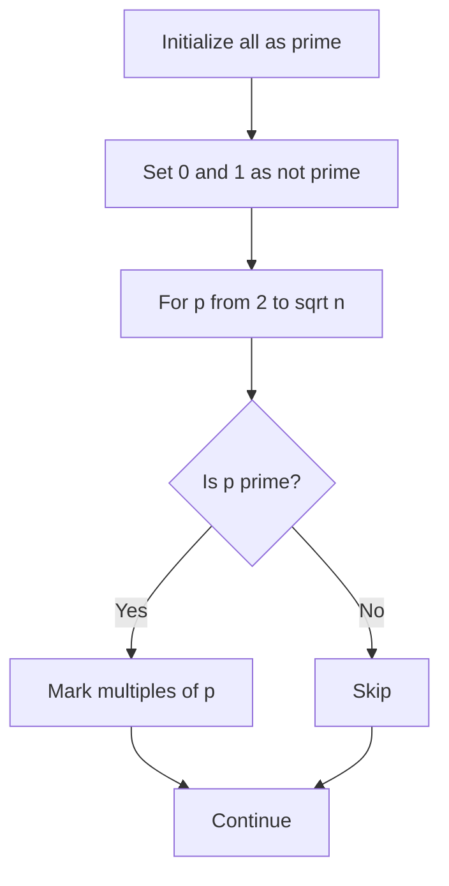
```mermaid
flowchart TD
    A["Initialize all as prime"] --> B["Set 0 and 1 as not prime"]
    B --> C["For p from 2 to sqrt n"]
    C --> D{"Is p prime?"}
    D -->|Yes| E["Mark multiples of p"]
    D -->|No| F["Skip"]
    E --> G["Continue"]
    F --> G
```

### C++

```cpp
vector<int> sieve(int n) {
    vector<bool> isPrime(n + 1, true);
    vector<int> primes;

    if (n >= 0) isPrime[0] = false;
    if (n >= 1) isPrime[1] = false;

    for (int p = 2; p <= n; p++) {
        if (isPrime[p]) {
            primes.push_back(p);
            if (1LL * p * p <= n) {
                for (long long x = 1LL * p * p; x <= n; x += p) {
                    isPrime[(int)x] = false;
                }
            }
        }
    }

    return primes;
}
```

---

## Form N4: Smallest Prime Factor Sieve

### Use When

- many factorization queries
- need divisor count repeatedly
- need prime factors fast

### Flowchart

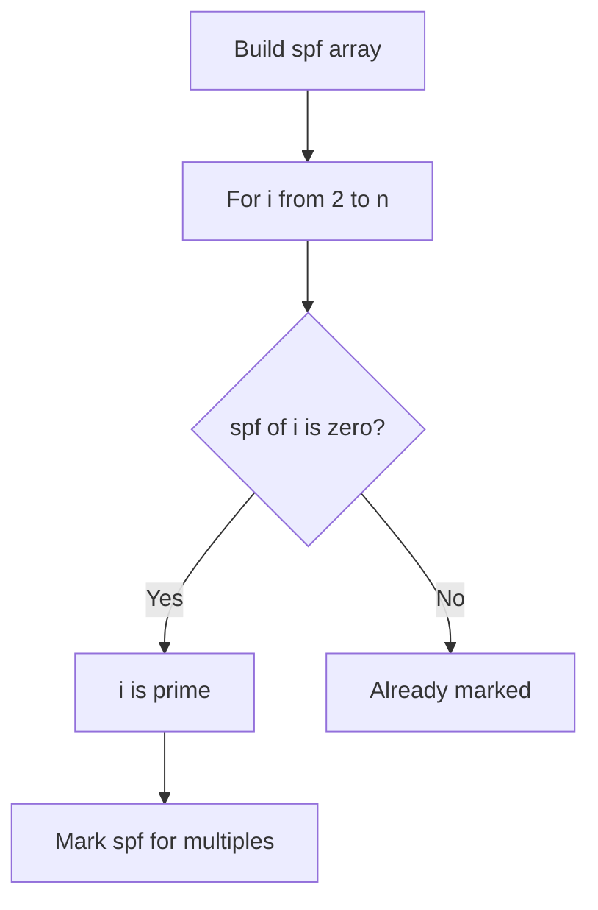
```mermaid
flowchart TD
    A["Build spf array"] --> B["For i from 2 to n"]
    B --> C{"spf of i is zero?"}
    C -->|Yes| D["i is prime"]
    D --> E["Mark spf for multiples"]
    C -->|No| F["Already marked"]
```

### C++

```cpp
vector<int> buildSPF(int n) {
    vector<int> spf(n + 1, 0);

    for (int i = 2; i <= n; i++) {
        if (spf[i] == 0) {
            spf[i] = i;
            if (1LL * i * i <= n) {
                for (long long j = 1LL * i * i; j <= n; j += i) {
                    if (spf[(int)j] == 0) spf[(int)j] = i;
                }
            }
        }
    }

    return spf;
}

vector<pair<int,int>> factorizeSPF(int x, const vector<int>& spf) {
    vector<pair<int,int>> res;

    while (x > 1) {
        int p = spf[x];
        int cnt = 0;

        while (x % p == 0) {
            x /= p;
            cnt++;
        }

        res.push_back({p, cnt});
    }

    return res;
}
```

---

## Form N5: Divisor Count and Divisor Sum

If:

```text
n = p1^a1 * p2^a2 * ... * pk^ak
```

Then:

```text
number of divisors = (a1 + 1)(a2 + 1)...(ak + 1)
```

### Flowchart

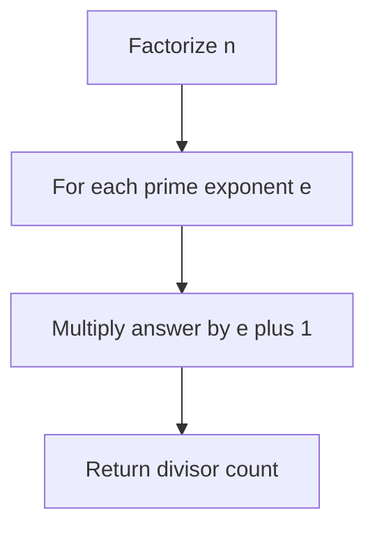
```mermaid
flowchart TD
    A["Factorize n"] --> B["For each prime exponent e"]
    B --> C["Multiply answer by e plus 1"]
    C --> D["Return divisor count"]
```

### C++

```cpp
long long divisorCount(long long n) {
    long long ans = 1;

    for (long long p = 2; p * p <= n; p++) {
        if (n % p == 0) {
            int e = 0;
            while (n % p == 0) {
                n /= p;
                e++;
            }
            ans *= (e + 1);
        }
    }

    if (n > 1) ans *= 2;
    return ans;
}
```

---

## Form N6: Euler Phi

### Intuition

`phi(n)` counts numbers from `1` to `n` that are coprime with `n`.

Formula:

```text
phi(n) = n * product over prime p dividing n of (1 - 1/p)
```

### Flowchart

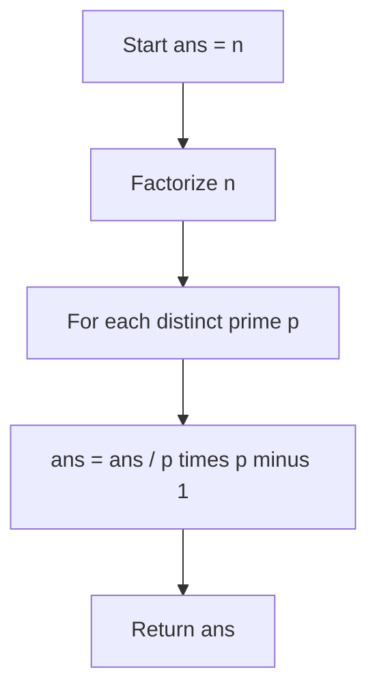
```mermaid
flowchart TD
    A["Start ans = n"] --> B["Factorize n"]
    B --> C["For each distinct prime p"]
    C --> D["ans = ans / p times p minus 1"]
    D --> E["Return ans"]
```

### C++

```cpp
long long phi(long long n) {
    long long ans = n;

    for (long long p = 2; p * p <= n; p++) {
        if (n % p == 0) {
            while (n % p == 0) n /= p;
            ans = ans / p * (p - 1);
        }
    }

    if (n > 1) ans = ans / n * (n - 1);
    return ans;
}
```

---

## Form N7: Extended GCD and Linear Diophantine

Equation:

```text
ax + by = c
```

Solution exists iff:

```text
gcd(a, b) divides c
```

### Flowchart

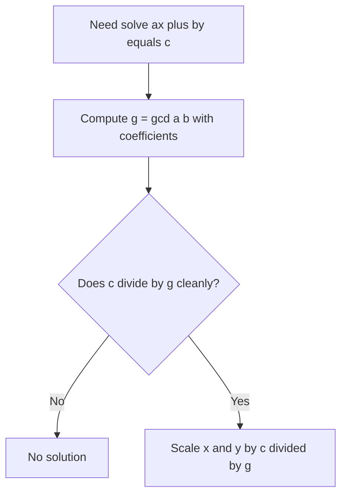
```mermaid
flowchart TD
    A["Need solve ax plus by equals c"] --> B["Compute g = gcd a b with coefficients"]
    B --> C{"Does c divide by g cleanly?"}
    C -->|No| D["No solution"]
    C -->|Yes| E["Scale x and y by c divided by g"]
```

### C++

```cpp
bool solveDiophantine(long long a, long long b, long long c, long long& x, long long& y) {
    long long g = extGcd(abs(a), abs(b), x, y);

    if (c % g != 0) return false;

    x *= c / g;
    y *= c / g;

    if (a < 0) x = -x;
    if (b < 0) y = -y;

    return true;
}
```

---

# 7. Combinatorics

## 7.1 Pattern Map

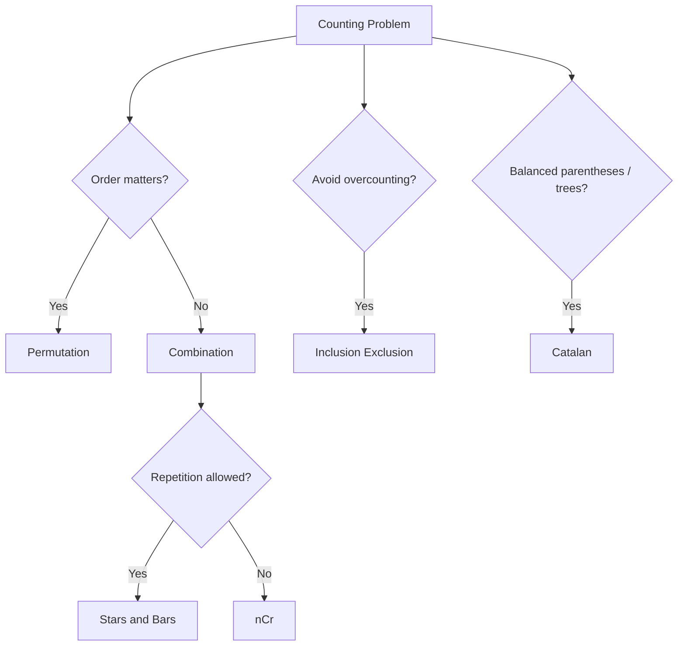
```mermaid
flowchart TD
    A["Counting Problem"] --> B{"Order matters?"}
    B -->|Yes| C["Permutation"]
    B -->|No| D["Combination"]
    D --> E{"Repetition allowed?"}
    E -->|Yes| F["Stars and Bars"]
    E -->|No| G["nCr"]
    A --> H{"Avoid overcounting?"}
    H -->|Yes| I["Inclusion Exclusion"]
    A --> J{"Balanced parentheses / trees?"}
    J -->|Yes| K["Catalan"]
```

---

## Form C1: Permutations

### Intuition

If order matters:

```text
nPr = n! / (n-r)!
```

### Flowchart

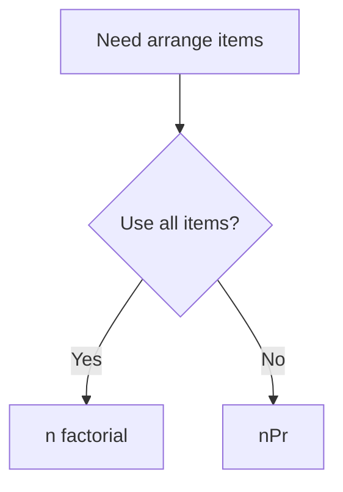
```mermaid
flowchart TD
    A["Need arrange items"] --> B{"Use all items?"}
    B -->|Yes| C["n factorial"]
    B -->|No| D["nPr"]
```

### C++

```cpp
long long permNoMod(int n, int r) {
    long long ans = 1;

    for (int i = 0; i < r; i++) {
        ans *= (n - i);
    }

    return ans;
}
```

---

## Form C2: Combinations

### Intuition

If order does not matter:

```text
nCr = n! / (r! * (n-r)!)
```

### C++ Precompute

```cpp
struct Comb {
    int n;
    long long mod;
    vector<long long> fact, invFact;

    Comb(int n, long long mod) : n(n), mod(mod), fact(n + 1), invFact(n + 1) {
        fact[0] = 1;
        for (int i = 1; i <= n; i++) fact[i] = fact[i - 1] * i % mod;

        invFact[n] = modPow(fact[n], mod - 2, mod);
        for (int i = n - 1; i >= 0; i--) invFact[i] = invFact[i + 1] * (i + 1) % mod;
    }

    long long nCr(int N, int R) {
        if (R < 0 || R > N) return 0;
        return fact[N] * invFact[R] % mod * invFact[N - R] % mod;
    }
};
```

### Flowchart

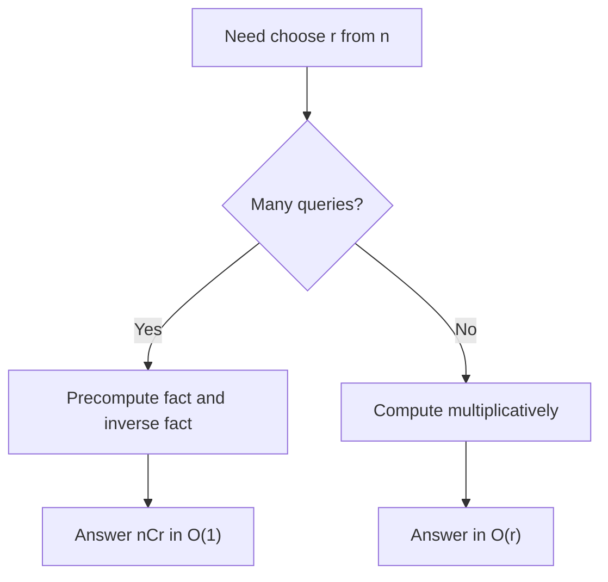
```mermaid
flowchart TD
    A["Need choose r from n"] --> B{"Many queries?"}
    B -->|Yes| C["Precompute fact and inverse fact"]
    B -->|No| D["Compute multiplicatively"]
    C --> E["Answer nCr in O(1)"]
    D --> F["Answer in O(r)"]
```

---

## Form C3: Stars and Bars

### Use When

Count non-negative integer solutions:

```text
x1 + x2 + ... + xk = n
```

Answer:

```text
C(n + k - 1, k - 1)
```

### Simulation

```text
n = 5 candies, k = 3 kids
Example: 2 + 1 + 2
Represent as: ** | * | **
There are 5 stars and 2 bars.
Choose bar positions among 7 slots.
Answer = C(7, 2)
```

### Flowchart

```mermaid
flowchart TD
    A["Distribute identical items"] --> B{"Variables nonnegative?"}
    B -->|Yes| C["Use C n plus k minus 1 choose k minus 1"]
    B -->|No lower bounds| D["Subtract minimum required first"]
    D --> C
```

---

## Form C4: Inclusion Exclusion

### Intuition

To count union:

```text
count A or B = count A + count B - count A and B
```

For many sets:

```text
add singles, subtract pairs, add triples, ...
```

### Flowchart

```mermaid
flowchart TD
    A["Need count objects satisfying at least one condition"] --> B["Count each condition"]
    B --> C["Subtract overlaps of two"]
    C --> D["Add overlaps of three"]
    D --> E["Continue alternating signs"]
```

### C++ Skeleton

```cpp
long long inclusionExclusion(vector<int>& primes, long long n) {
    int m = primes.size();
    long long ans = 0;

    for (int mask = 1; mask < (1 << m); mask++) {
        long long mult = 1;
        int bits = 0;

        for (int i = 0; i < m; i++) {
            if (mask & (1 << i)) {
                bits++;
                if (mult > n / primes[i]) {
                    mult = n + 1;
                    break;
                }
                mult *= primes[i];
            }
        }

        long long cnt = n / mult;
        if (bits % 2 == 1) ans += cnt;
        else ans -= cnt;
    }

    return ans;
}
```

---

## Form C5: Catalan Numbers

### Appears In

| Form | Example |
|---|---|
| balanced parentheses | valid bracket strings |
| binary search trees | number of BSTs |
| non-crossing pairings | chord matching |
| triangulations | polygon triangulation |

Formula:

```text
Catalan(n) = C(2n, n) / (n + 1)
```

### Flowchart

```mermaid
flowchart TD
    A["Problem has balanced recursive structure"] --> B{"Looks like valid parentheses or BST count?"}
    B -->|Yes| C["Use Catalan"]
    B -->|No| D["Try DP counting"]
```

### C++

```cpp
long long catalan(int n, Comb& comb) {
    long long ans = comb.nCr(2 * n, n);
    ans = ans * modInvPrime(n + 1, comb.mod) % comb.mod;
    return ans;
}
```

---

# 8. LC/FAANG Math Patterns

| FAANG Pattern | Recognition Signal | Tactic | C++ Form | Example Problems |
|---|---|---|---|---|
| Remainder pairs | pair sum divisible by k | complement bucket | `cnt[(k-r)%k]` | LC 1010, LC 1497 |
| Subarray divisible | prefix sum `% k` repeats | prefix remainder freq | map/vector count | LC 974 |
| GCD normalization | slopes / ratios | divide by gcd | pair reduced | LC 149 Max Points |
| Fast power | pow under mod | binary exponentiation | `modPow` | LC 50, LC 372 |
| Prime counting | count primes below n | sieve | vector bool | LC 204 |
| Product except self | multiplication identity | prefix/suffix | no division | LC 238 |
| Happy number / cycle | repeated digit transform | Floyd cycle | slow-fast | LC 202 |
| Count arrangements | choose positions | combinatorics / DP | `nCr` or DP | LC 62, LC 70 |
| Integer break | math optimization | prefer 3s | formula | LC 343 |
| Trailing zeroes | count factors of 5 | repeated divide | loop | LC 172 |

## FAANG Flow

```mermaid
flowchart TD
    A["See math interview problem"] --> B{"Array with divisibility?"}
    B -->|Yes| C["Modulo buckets"]
    B -->|No| D{"Geometry / slope?"}
    D -->|Yes| E["Normalize by gcd"]
    D -->|No| F{"Counting paths / ways?"}
    F -->|Yes| G["Combinatorics or DP"]
    F -->|No| H{"Power or large exponent?"}
    H -->|Yes| I["Binary exponentiation"]
    H -->|No| J{"Cycle in repeated operation?"}
    J -->|Yes| K["Floyd cycle or set"]
```

---

# 9. Candidate Master Escalation Patterns

| CM Pattern | Newbie Version | CM Version | Tactic |
|---|---|---|---|
| Count divisible pairs | `O(n^2)` pairs | remainder frequency | modulo buckets |
| Count coprime pairs | gcd every pair | Mobius / inclusion over divisors | divisor frequency |
| Many factor queries | trial division | SPF / linear sieve | precompute |
| nCr huge | Pascal DP | factorial + inverse / Lucas | modular combinatorics |
| Range prime/divisor queries | recompute | prefix over sieve values | precompute arrays |
| Multiplicative function | factor one number | sieve all values | phi/mobius/divisor count sieve |
| Congruence system | brute search | CRT | extended gcd |
| Count constrained strings | brute recursion | DP + combinatorics | automata/counting |

## CM Flow for Math Problems

```mermaid
flowchart TD
    A["Brute force idea"] --> B["Find repeated expensive operation"]
    B --> C{"Repeated gcd / prime / factor?"}
    C -->|Yes| D["Precompute sieve or SPF"]
    C -->|No| E{"Repeated choose / count?"}
    E -->|Yes| F["Precompute factorial and inverse factorial"]
    E -->|No| G{"Repeated modulo relation?"}
    G -->|Yes| H["Group by remainder"]
    G -->|No| I{"Repeated divisor relation?"}
    I -->|Yes| J["Count by divisors / multiples"]
```

---

# 10. Difficulty-Sorted Problem Set

> Links use LeetCode, CSES, Codeforces, AtCoder, and SPOJ style practice.  
> Some Codeforces links are problem pages; if unavailable, search the title on Codeforces.

---

## 10.1 Newbie Problems

| # | Problem | Platform | Link | Form | Pattern | Tactic | Intuition | Implementation |
|---:|---|---|---|---|---|---|---|---|
| 1 | Power of Two | LeetCode | https://leetcode.com/problems/power-of-two/ | bit/math | divisibility by 2 | `n > 0 and n & n-1` | powers of two have one bit | bit check |
| 2 | Count Primes | LeetCode | https://leetcode.com/problems/count-primes/ | prime | sieve | mark multiples | avoid checking each number separately | sieve |
| 3 | Excel Sheet Column Number | LeetCode | https://leetcode.com/problems/excel-sheet-column-number/ | base conversion | positional value | multiply by 26 | same as decimal but base 26 | loop |
| 4 | Factorial Trailing Zeroes | LeetCode | https://leetcode.com/problems/factorial-trailing-zeroes/ | factors | count 5s | divide by 5 repeatedly | every 10 needs 2 and 5; 5 is limiting | loop |
| 5 | Add Digits | LeetCode | https://leetcode.com/problems/add-digits/ | modular | digital root | mod 9 | decimal number remainder property | formula |
| 6 | GCD and LCM | CSES Intro style | https://cses.fi/problemset/ | gcd | Euclid | repeated modulo | reduce until remainder zero | `std::gcd` |
| 7 | Missing Number | LeetCode | https://leetcode.com/problems/missing-number/ | sum formula | arithmetic sum | expected minus actual | sum 0..n known | formula |
| 8 | Palindrome Number | LeetCode | https://leetcode.com/problems/palindrome-number/ | digits | reverse half | avoid string | compare digits | digit loop |
| 9 | Plus One | LeetCode | https://leetcode.com/problems/plus-one/ | digit carry | simulation | carry from end | same as manual addition | vector |
| 10 | Sqrt x | LeetCode | https://leetcode.com/problems/sqrtx/ | math + binary search | monotonic square | avoid overflow | largest x with x squared <= n | binary search |

### Newbie Flow

```mermaid
flowchart TD
    A["Math problem"] --> B{"Digits?"}
    B -->|Yes| C["Use mod 10 and divide by 10"]
    B -->|No| D{"Prime?"}
    D -->|Yes| E["Trial division or sieve"]
    D -->|No| F{"GCD?"}
    F -->|Yes| G["Euclid"]
    F -->|No| H{"Modulo?"}
    H -->|Yes| I["Normalize remainder"]
```

---

## 10.2 Easy to Medium Problems

| # | Problem | Platform | Link | Form | Pattern | Tactic | Intuition | Implementation |
|---:|---|---|---|---|---|---|---|---|
| 1 | Pow x n | LeetCode | https://leetcode.com/problems/powx-n/ | exponentiation | binary power | square and multiply | exponent bits decide multiplication | fast pow |
| 2 | Super Pow | LeetCode | https://leetcode.com/problems/super-pow/ | modular power | exponent digits | recursive mod power | handle huge exponent as digits | modPow |
| 3 | Subarray Sums Divisible by K | LeetCode | https://leetcode.com/problems/subarray-sums-divisible-by-k/ | prefix modulo | equal remainders | frequency map | same remainder means difference divisible | prefix count |
| 4 | Pairs of Songs Divisible by 60 | LeetCode | https://leetcode.com/problems/pairs-of-songs-with-total-durations-divisible-by-60/ | remainder pair | complement modulo | bucket | each song needs complementary remainder | vector count |
| 5 | Check If Array Pairs Are Divisible by k | LeetCode | https://leetcode.com/problems/check-if-array-pairs-are-divisible-by-k/ | remainder pairing | bucket validation | match counts | remainder r pairs with k-r | count |
| 6 | Happy Number | LeetCode | https://leetcode.com/problems/happy-number/ | digit cycle | cycle detection | set or Floyd | repeated operation eventually cycles | slow-fast |
| 7 | Greatest Common Divisor of Strings | LeetCode | https://leetcode.com/problems/greatest-common-divisor-of-strings/ | gcd | string periodicity | gcd length | valid base length must divide both | gcd + check |
| 8 | Product of Array Except Self | LeetCode | https://leetcode.com/problems/product-of-array-except-self/ | product identity | prefix suffix | no division | left product times right product | two passes |
| 9 | Unique Paths | LeetCode | https://leetcode.com/problems/unique-paths/ | combinatorics | choose moves | nCr | choose positions of down/right moves | nCr |
| 10 | Climbing Stairs | LeetCode | https://leetcode.com/problems/climbing-stairs/ | counting | Fibonacci | DP | ways depend on previous two | DP |
| 11 | Number of Good Pairs | LeetCode | https://leetcode.com/problems/number-of-good-pairs/ | combinations | choose 2 from frequency | frequency count | each equal group contributes C(freq,2) | map |
| 12 | Count Odd Numbers in an Interval Range | LeetCode | https://leetcode.com/problems/count-odd-numbers-in-an-interval-range/ | parity | count formula | half intervals | odds alternate | formula |
| 13 | Bulb Switcher | LeetCode | https://leetcode.com/problems/bulb-switcher/ | divisor parity | perfect squares | sqrt n | bulbs toggled divisor count times | formula |
| 14 | K-th Factor of n | LeetCode | https://leetcode.com/problems/the-kth-factor-of-n/ | divisors | enumerate divisors | sqrt split | divisors come in pairs | loop |
| 15 | Powerful Integers | LeetCode | https://leetcode.com/problems/powerful-integers/ | powers | generate bounded powers | set unique | powers grow exponentially | nested loops |

### Medium Flow

```mermaid
flowchart TD
    A["Medium math"] --> B{"Need count subarrays or pairs divisible?"}
    B -->|Yes| C["Use modulo buckets"]
    B -->|No| D{"Need power?"}
    D -->|Yes| E["Use binary exponentiation"]
    D -->|No| F{"Need choose paths or positions?"}
    F -->|Yes| G["Use nCr or DP"]
    F -->|No| H{"Repeated digit transform?"}
    H -->|Yes| I["Use cycle detection"]
```

---

## 10.3 Medium to Hard Problems

| # | Problem | Platform | Link | Form | Pattern | Tactic | Intuition | Implementation |
|---:|---|---|---|---|---|---|---|---|
| 1 | Count Good Meals | LeetCode | https://leetcode.com/problems/count-good-meals/ | pair sum powers | hash complements | powers of two targets | each value pairs to power minus value | map |
| 2 | Max Points on a Line | LeetCode | https://leetcode.com/problems/max-points-on-a-line/ | geometry gcd | slope normalization | divide dx dy by gcd | same line has same reduced slope | map pair |
| 3 | Number of Boomerangs | LeetCode | https://leetcode.com/problems/number-of-boomerangs/ | distance count | combinations | freq distance | choose ordered pairs with same distance | map |
| 4 | Mirror Reflection | LeetCode | https://leetcode.com/problems/mirror-reflection/ | gcd/lcm | parity after lcm | reduce using gcd | unfold square room | math |
| 5 | Poor Pigs | LeetCode | https://leetcode.com/problems/poor-pigs/ | combinatorics | states per pig | logarithm/count states | each pig has tests+1 outcomes | formula |
| 6 | Count Number of Teams | LeetCode | https://leetcode.com/problems/count-number-of-teams/ | combinatorics | count left/right smaller greater | contribution | each middle contributes combinations | loops / BIT |
| 7 | Combination Sum IV | LeetCode | https://leetcode.com/problems/combination-sum-iv/ | ordered counting | DP | sum transitions | order matters, use target DP | DP |
| 8 | Number of Ways to Reorder Array to Get Same BST | LeetCode | https://leetcode.com/problems/number-of-ways-to-reorder-array-to-get-same-bst/ | combinatorics tree | choose interleavings | nCr + recursion | left/right relative order preserved | DFS + comb |
| 9 | Count Sorted Vowel Strings | LeetCode | https://leetcode.com/problems/count-sorted-vowel-strings/ | stars and bars | nondecreasing strings | C(n+4,4) | count counts of vowels | formula |
| 10 | Number of Sets of K Non-Overlapping Line Segments | LeetCode | https://leetcode.com/problems/number-of-sets-of-k-non-overlapping-line-segments/ | combinatorics DP | choose endpoints | DP/formula | segments share endpoints allowed | DP / nCr |
| 11 | Smallest Integer Divisible by K | LeetCode | https://leetcode.com/problems/smallest-integer-divisible-by-k/ | modulo automaton | remainder transition | seen remainders | never build huge number | loop remainder |
| 12 | Find the Punishment Number | LeetCode | https://leetcode.com/problems/find-the-punishment-number-of-an-integer/ | digits + recursion | partition digits | backtracking | split square string into parts | DFS |
| 13 | Sum of Square Numbers | LeetCode | https://leetcode.com/problems/sum-of-square-numbers/ | number theory | two squares | two pointers / theorem | search a^2 + b^2 | sqrt loop |
| 14 | Consecutive Numbers Sum | LeetCode | https://leetcode.com/problems/consecutive-numbers-sum/ | arithmetic progression | length divisibility | enumerate length | n = k*x + k(k-1)/2 | math |
| 15 | Preimage Size of Factorial Zeroes Function | LeetCode | https://leetcode.com/problems/preimage-size-of-factorial-zeroes-function/ | trailing zeroes | binary search math | count fives | inverse of monotonic function | binary search |

### Hard Flow

```mermaid
flowchart TD
    A["Hard math"] --> B{"Can model as frequency contribution?"}
    B -->|Yes| C["Count contribution per center / distance / divisor"]
    B -->|No| D{"Need huge count modulo?"}
    D -->|Yes| E["Precompute combinations"]
    D -->|No| F{"Has monotonic math function?"}
    F -->|Yes| G["Binary search answer"]
    F -->|No| H{"Has reduced ratio / slope?"}
    H -->|Yes| I["Normalize with gcd"]
```

---

## 10.4 Candidate Master / Advanced CP Problems

| # | Problem | Platform | Link | Form | Pattern | Tactic | Intuition | Implementation |
|---:|---|---|---|---|---|---|---|---|
| 1 | Common Divisors | CSES | https://cses.fi/problemset/task/1081 | divisor frequency | multiples counting | count values divisible by d | largest d with at least two multiples | frequency + loop |
| 2 | Counting Divisors | CSES | https://cses.fi/problemset/task/1713 | factorization | divisor count | SPF | exponent product | SPF |
| 3 | Exponentiation | CSES | https://cses.fi/problemset/task/1095 | modular power | binary exponentiation | O(log b) | power under mod | modPow |
| 4 | Exponentiation II | CSES | https://cses.fi/problemset/task/1712 | Fermat reduction | exponent tower | reduce exponent mod MOD-1 | prime modulus theorem | modPow |
| 5 | Divisor Analysis | CSES | https://cses.fi/problemset/task/2182 | divisor functions | multiplicative formulas | count, sum, product | use prime exponents | modular formulas |
| 6 | Binomial Coefficients | CSES | https://cses.fi/problemset/task/1079 | nCr mod | factorial precompute | inverse factorial | many queries | Comb |
| 7 | Distributing Apples | CSES | https://cses.fi/problemset/task/1716 | stars and bars | combinations with repetition | C(n+m-1,m-1) | identical apples | Comb |
| 8 | Christmas Party | CSES | https://cses.fi/problemset/task/1717 | derangements | recurrence | dp[n]=(n-1)(dp[n-1]+dp[n-2]) | nobody gets own gift | DP |
| 9 | Bracket Sequences I | CSES | https://cses.fi/problemset/task/2064 | Catalan | balanced parentheses | C(2n,n)/(n+1) | Catalan count | Comb |
| 10 | Bracket Sequences II | CSES | https://cses.fi/problemset/task/2187 | Catalan with prefix | constrained sequence | ballot/Catalan | prefix must stay valid | combinatorics |
| 11 | Prime Multiples | CSES | https://cses.fi/problemset/task/2185 | inclusion exclusion | count multiples | subset over primes | add/subtract intersections | bitmask |
| 12 | Counting Coprime Pairs | CSES | https://cses.fi/problemset/task/2417 | Mobius-like | inclusion over divisors | count gcd 1 | subtract multiples | sieve |
| 13 | Sum of Divisors | CSES | https://cses.fi/problemset/task/1082 | divisor summatory | quotient grouping | group equal n/i | avoid O(n) | math grouping |
| 14 | Fibonacci Numbers | CSES | https://cses.fi/problemset/task/1722 | matrix exponentiation | linear recurrence | fast matrix pow | nth term in log n | matrix |
| 15 | Throwing Dice | CSES | https://cses.fi/problemset/task/1096 | matrix DP | recurrence exponentiation | transition matrix | large n recurrence | matrix pow |
| 16 | Tower of Hanoi | CSES | https://cses.fi/problemset/task/2165 | recursion math | 2^n - 1 moves | recursive construction | move n-1, biggest, n-1 | recursion |
| 17 | Two Sets II | CSES | https://cses.fi/problemset/task/1093 | combinatorics DP | subset count | divide by 2 | partition equal sum | DP + modInv |
| 18 | Counting Necklaces | CSES | https://cses.fi/problemset/task/2209 | Burnside | rotations | average fixed colorings | symmetry classes | Burnside |
| 19 | Counting Grids | CSES | https://cses.fi/problemset/task/2210 | Burnside | grid symmetries | fixed states | quotient by rotations | Burnside |
| 20 | Anti-Primes | SPOJ | https://www.spoj.com/problems/ANTP/ | divisor count | highly composite | DFS over exponents | maximize divisors under limit | recursive search |
| 21 | Candy I | SPOJ | https://www.spoj.com/problems/CANDY/ | divisibility | average check | sum mod n | equal distribution possible | formula |
| 22 | Last Digit | SPOJ | https://www.spoj.com/problems/LASTDIG/ | modular cycle | last digit period | exponent mod cycle | powers repeat | pattern |
| 23 | ETF Euler Totient Function | SPOJ | https://www.spoj.com/problems/ETF/ | phi | factorization | Euler formula | count coprimes | phi |
| 24 | LightOJ 1138 Trailing Zeroes III | LightOJ | https://lightoj.com/problem/trailing-zeroes-iii | binary search math | inverse zero count | monotonic | find smallest n with k zeroes | binary search |
| 25 | AtCoder ABC 172 D Sum of Divisors | AtCoder | https://atcoder.jp/contests/abc172/tasks/abc172_d | divisor contribution | sum over divisors | d contributes to multiples | reverse viewpoint | harmonic loop |

### CM Problem Logic Flow

```mermaid
flowchart TD
    A["Advanced math statement"] --> B{"Many queries?"}
    B -->|Yes| C["Precompute factorial / sieve / SPF"]
    B -->|No| D{"Counting multiples or divisors?"}
    D -->|Yes| E["Loop over divisors and multiples"]
    D -->|No| F{"Symmetry?"}
    F -->|Yes| G["Burnside / Polya basics"]
    F -->|No| H{"Linear recurrence with huge n?"}
    H -->|Yes| I["Matrix exponentiation"]
    H -->|No| J{"Coprime / gcd distribution?"}
    J -->|Yes| K["Mobius / inclusion over divisors"]
```

---

# 11. Final Revision Checklist

## Modular Arithmetic

- [ ] Normalize negative values.
- [ ] Use `long long` or `__int128` for multiplication.
- [ ] Use binary exponentiation for large powers.
- [ ] Use modular inverse only when it exists.
- [ ] For prime mod, inverse is `a^(MOD-2)`.

## Number Theory

- [ ] Use Euclid for gcd.
- [ ] Use sieve for many prime queries.
- [ ] Use SPF for many factorizations.
- [ ] Divisor count comes from prime exponents.
- [ ] Phi uses distinct prime factors.
- [ ] Linear equation solution needs divisibility by gcd.

## Combinatorics

- [ ] Order matters means permutation.
- [ ] Order does not matter means combination.
- [ ] Identical objects into boxes means stars and bars.
- [ ] Overlapping conditions means inclusion-exclusion.
- [ ] Balanced recursive count often means Catalan.
- [ ] Many `nCr` queries need factorial and inverse factorial.

## FAANG

- [ ] Explain intuition before formula.
- [ ] Show why brute force fails.
- [ ] Handle overflow and negative modulo.
- [ ] Use hash map or bucket for pair counting.
- [ ] Use gcd to normalize ratios or slopes.

## Candidate Master

- [ ] Convert pair counting into divisor/remainder frequencies.
- [ ] Precompute everything reusable.
- [ ] Look for multiplicative structure.
- [ ] Use contribution instead of direct enumeration.
- [ ] Use quotient grouping for sums involving `n / i`.
- [ ] Use matrix exponentiation for huge recurrence index.

---

# Appendix A: Problem-to-Form Quick Lookup

| Problem Type | Form | Template |
|---|---|---|
| `a^b mod M` | Binary exponentiation | `modPow` |
| `nCr mod prime` | Combinatorics | `Comb` |
| count primes | Sieve | `sieve` |
| factor many numbers | SPF | `buildSPF` |
| count divisors | factor exponents | `divisorCount` |
| count coprimes | Euler phi | `phi` |
| pair sum divisible by k | remainder bucket | `countPairsDivisibleByK` |
| subarray sum divisible by k | prefix remainder | frequency map |
| paths in grid | choose moves | `nCr` |
| balanced parentheses count | Catalan | `catalan` |
| count union of conditions | inclusion-exclusion | subset loop |
| line slopes | gcd normalization | reduce dx dy |

---

# Appendix B: Safe Mermaid Rules Used in This File

- All node labels use quotes.
- No raw `[]` inside node labels.
- No chained Mermaid statements on the same line.
- Math expressions are written in plain text inside quoted labels.
- Each arrow is on its own line.

