# STL Ultimate Problem Set — FAANG + CM Roadmap in C++

> Pattern-wise STL guide from beginner to Candidate Master level.  
> Goal: learn **which STL to choose**, **why it fits**, **how to code it in C++**, and **which problems build the pattern**.

---

# Clickable Index

- [0. How to Use This Guide](#0-how-to-use-this-guide)
- [1. STL Design Philosophy](#1-stl-design-philosophy)
- [2. Master STL Thinking Flow](#2-master-stl-thinking-flow)
- [3. STL Decision System](#3-stl-decision-system)
- [4. Pattern to STL Mapping Table](#4-pattern-to-stl-mapping-table)
- [5. Core C++ Setup](#5-core-c-setup)
- [6. Vector and Array Patterns](#6-vector-and-array-patterns)
- [7. String Patterns](#7-string-patterns)
- [8. Stack Patterns](#8-stack-patterns)
- [9. Queue and Deque Patterns](#9-queue-and-deque-patterns)
- [10. Priority Queue Patterns](#10-priority-queue-patterns)
- [11. Set and Multiset Patterns](#11-set-and-multiset-patterns)
- [12. Map and Unordered Map Patterns](#12-map-and-unordered-map-patterns)
- [13. Pair, Tuple, and Custom Sort Patterns](#13-pair-tuple-and-custom-sort-patterns)
- [14. STL Algorithms Patterns](#14-stl-algorithms-patterns)
- [15. Iterator and Binary Search STL Patterns](#15-iterator-and-binary-search-stl-patterns)
- [16. Monotonic Stack Patterns](#16-monotonic-stack-patterns)
- [17. Monotonic Deque Patterns](#17-monotonic-deque-patterns)
- [18. Two Multisets Patterns](#18-two-multisets-patterns)
- [19. Interval and Sweep Line STL Patterns](#19-interval-and-sweep-line-stl-patterns)
- [20. Lazy Deletion Heap Patterns](#20-lazy-deletion-heap-patterns)
- [21. Coordinate Compression Patterns](#21-coordinate-compression-patterns)
- [22. Bitset STL Patterns](#22-bitset-stl-patterns)
- [23. PBDS and Order Statistics](#23-pbds-and-order-statistics)
- [24. FAANG STL Pattern Roadmap](#24-faang-stl-pattern-roadmap)
- [25. CM STL Pattern Roadmap](#25-cm-stl-pattern-roadmap)
- [26. Master Problem Set Sorted by Difficulty](#26-master-problem-set-sorted-by-difficulty)
- [27. Final Revision Flow](#27-final-revision-flow)
- [28. Debugging Checklist](#28-debugging-checklist)

---

# 0. How to Use This Guide

Use every problem like this:

```text
1. Read constraints.
2. Identify operations.
3. Choose STL by operation.
4. Match form and pattern.
5. Write the smallest C++ template.
6. Dry run edge cases.
7. Solve 3 to 5 similar problems.
```

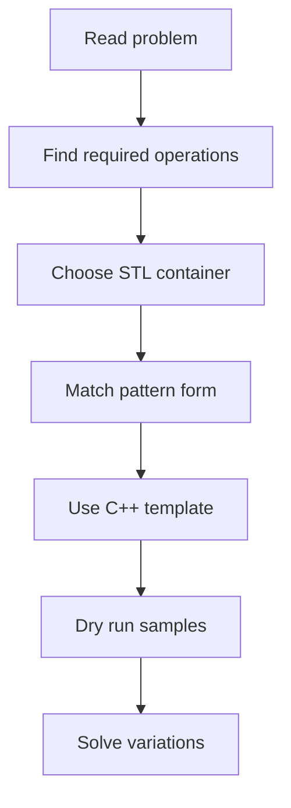
```mermaid
flowchart TD
    A["Read problem"] --> B["Find required operations"]
    B --> C["Choose STL container"]
    C --> D["Match pattern form"]
    D --> E["Use C++ template"]
    E --> F["Dry run samples"]
    F --> G["Solve variations"]
```

---

# 1. STL Design Philosophy

STL is built around four connected ideas:

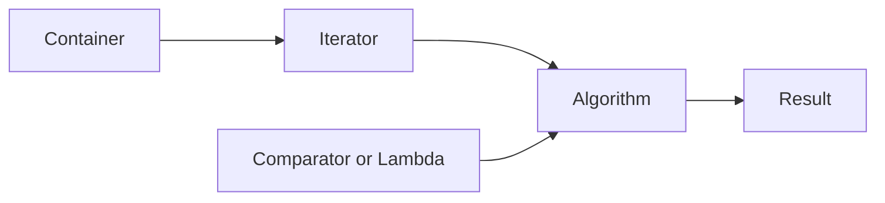
```mermaid
flowchart LR
    A["Container"] --> B["Iterator"]
    B --> C["Algorithm"]
    C --> D["Result"]
    E["Comparator or Lambda"] --> C
```

| Component | Meaning | Examples |
|---|---|---|
| Container | Stores data | `vector`, `set`, `map`, `queue` |
| Iterator | Pointer-like access | `begin`, `end`, `lower_bound` |
| Algorithm | Operates on ranges | `sort`, `reverse`, `unique` |
| Comparator | Defines custom order | lambda, struct comparator |

## Design mental model

```text
Problem gives operations.
Operations choose data structure.
Data structure gives complexity.
Complexity decides if solution passes.
```

## STL operation design table

| Need | Best STL | Time | Reason |
|---|---|---:|---|
| Fast indexed access | `vector` | `O(1)` | contiguous array |
| Add/remove back | `vector` | `O(1)` amortized | dynamic array |
| LIFO | `stack` | `O(1)` | last in first out |
| FIFO | `queue` | `O(1)` | first in first out |
| Front and back operations | `deque` | `O(1)` | double-ended queue |
| Current max/min | `priority_queue` | `O(log n)` push/pop | heap |
| Sorted unique values | `set` | `O(log n)` | balanced BST |
| Sorted duplicates | `multiset` | `O(log n)` | balanced BST with duplicates |
| Key to value | `map` | `O(log n)` | sorted keys |
| Fast average key lookup | `unordered_map` | average `O(1)` | hash table |
| Fixed bit vector | `bitset` | fast bit ops | compressed bits |
| Order statistics | PBDS | `O(log n)` | indexed ordered set |

---

# 2. Master STL Thinking Flow

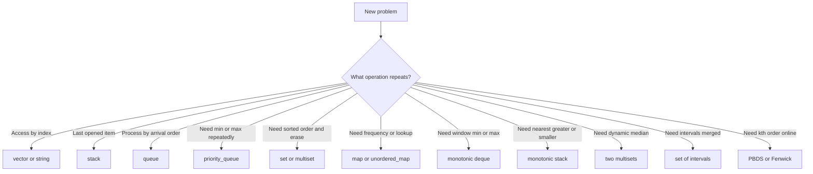
```mermaid
flowchart TD
    A["New problem"] --> B{"What operation repeats?"}

    B -->|"Access by index"| C["vector or string"]
    B -->|"Last opened item"| D["stack"]
    B -->|"Process by arrival order"| E["queue"]
    B -->|"Need min or max repeatedly"| F["priority_queue"]
    B -->|"Need sorted order and erase"| G["set or multiset"]
    B -->|"Need frequency or lookup"| H["map or unordered_map"]
    B -->|"Need window min or max"| I["monotonic deque"]
    B -->|"Need nearest greater or smaller"| J["monotonic stack"]
    B -->|"Need dynamic median"| K["two multisets"]
    B -->|"Need intervals merged"| L["set of intervals"]
    B -->|"Need kth order online"| M["PBDS or Fenwick"]
```

## FAANG thinking flow

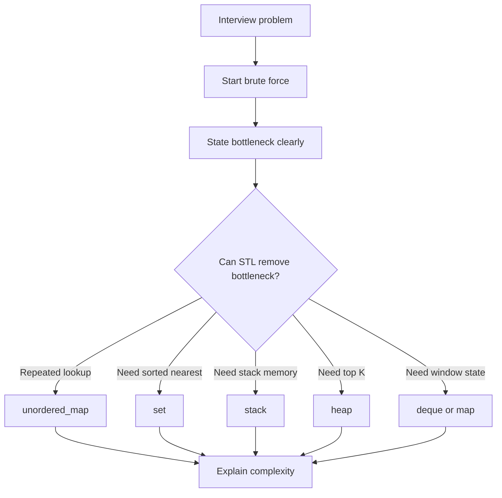
```mermaid
flowchart TD
    A["Interview problem"] --> B["Start brute force"]
    B --> C["State bottleneck clearly"]
    C --> D{"Can STL remove bottleneck?"}
    D -->|"Repeated lookup"| E["unordered_map"]
    D -->|"Need sorted nearest"| F["set"]
    D -->|"Need stack memory"| G["stack"]
    D -->|"Need top K"| H["heap"]
    D -->|"Need window state"| I["deque or map"]
    E --> J["Explain complexity"]
    F --> J
    G --> J
    H --> J
    I --> J
```

## CM thinking flow

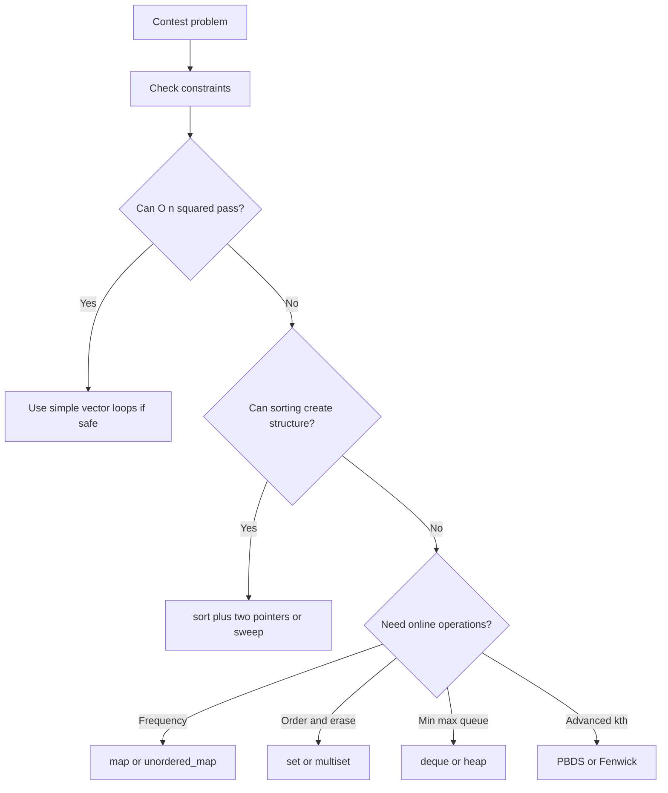
```mermaid
flowchart TD
    A["Contest problem"] --> B["Check constraints"]
    B --> C{"Can O n squared pass?"}
    C -->|"Yes"| D["Use simple vector loops if safe"]
    C -->|"No"| E{"Can sorting create structure?"}
    E -->|"Yes"| F["sort plus two pointers or sweep"]
    E -->|"No"| G{"Need online operations?"}
    G -->|"Frequency"| H["map or unordered_map"]
    G -->|"Order and erase"| I["set or multiset"]
    G -->|"Min max queue"| J["deque or heap"]
    G -->|"Advanced kth"| K["PBDS or Fenwick"]
```

---

# 3. STL Decision System

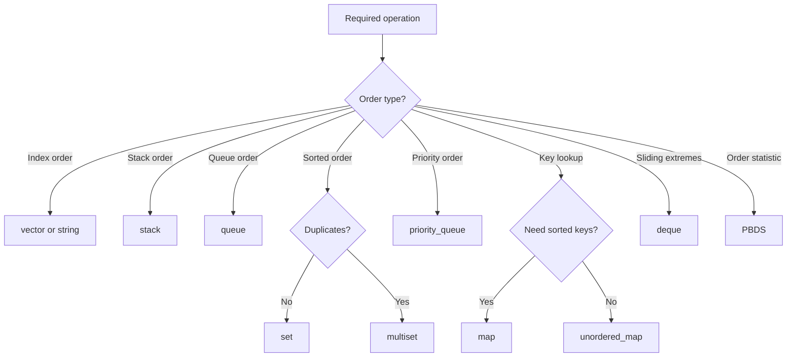
```mermaid
flowchart TB
    A["Required operation"] --> B{"Order type?"}
    B -->|"Index order"| C["vector or string"]
    B -->|"Stack order"| D["stack"]
    B -->|"Queue order"| E["queue"]
    B -->|"Sorted order"| F{"Duplicates?"}
    F -->|"No"| G["set"]
    F -->|"Yes"| H["multiset"]
    B -->|"Priority order"| I["priority_queue"]
    B -->|"Key lookup"| J{"Need sorted keys?"}
    J -->|"Yes"| K["map"]
    J -->|"No"| L["unordered_map"]
    B -->|"Sliding extremes"| M["deque"]
    B -->|"Order statistic"| N["PBDS"]
```

---

# 4. Pattern to STL Mapping Table

| Problem clue | Form | STL | Pattern | Tactic | Intuition |
|---|---|---|---|---|---|
| Matching brackets | Nested parsing | `stack` | Push open, pop close | Detect invalid early | Last opened closes first |
| Next greater | Nearest element | `stack` | Monotonic stack | Pop useless elements | Keep candidates only |
| BFS level | Graph traversal | `queue` | FIFO expansion | Push unseen neighbours | Shortest by layers |
| Sliding max | Window extreme | `deque` | Monotonic deque | Pop smaller from back | Front is best answer |
| Top K | Repeated best | `priority_queue` | Heap | Keep k elements | Remove worst candidate |
| Median stream | Dynamic median | `multiset` / heaps | Two halves | Balance sizes | Median is boundary |
| Frequency count | Counting | `unordered_map` | Hash counting | Increment and query | Same key groups answers |
| Sorted nearest | Search by value | `set` | Lower bound | Check neighbours | BST gives nearest |
| Merge intervals | Coverage | `sort`, `vector` | Sweep merge | Sort by start | Active overlap extends range |
| Custom ranking | Sorting | `sort` + lambda | Comparator | Define strict order | Sort creates greedy order |
| Kth smallest online | Order stats | PBDS | indexed set | `find_by_order` | BST with subtree size |

---

# 5. Core C++ Setup

```cpp
#include <bits/stdc++.h>
using namespace std;

using ll = long long;
using pii = pair<int,int>;
using pll = pair<long long,long long>;

#define all(x) (x).begin(), (x).end()

int main() {
    ios::sync_with_stdio(false);
    cin.tie(nullptr);

    return 0;
}
```

---

# 6. Vector and Array Patterns

## Form

Use `vector` when you need ordered storage, index access, sorting, prefix-like scans, or dynamic push back.

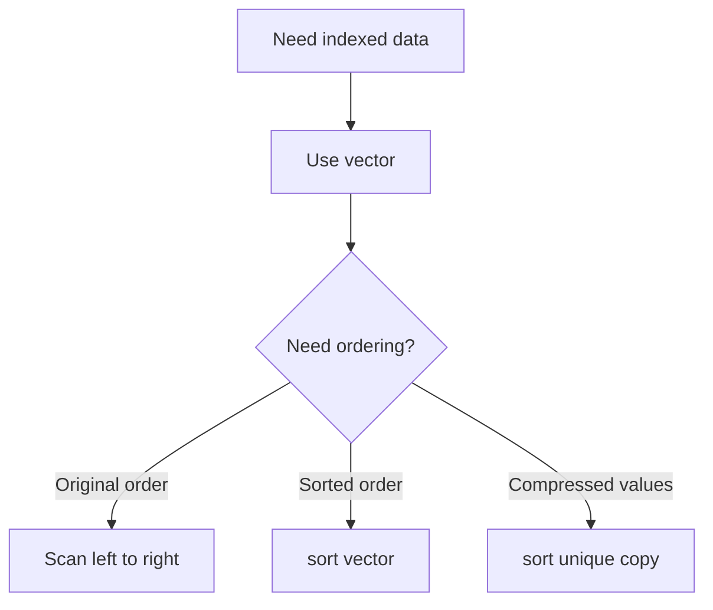
```mermaid
flowchart TD
    A["Need indexed data"] --> B["Use vector"]
    B --> C{"Need ordering?"}
    C -->|"Original order"| D["Scan left to right"]
    C -->|"Sorted order"| E["sort vector"]
    C -->|"Compressed values"| F["sort unique copy"]
```

## Tactics

| Tactic | When | C++ idea |
|---|---|---|
| Sort first | pair/sum/interval/order problem | `sort(all(a))` |
| Store index | answer original positions | `vector<pair<int,int>>` |
| Reverse scan | need suffix info | `for (int i=n-1; i>=0; i--)` |
| Use sentinel | simplify boundaries | add fake `-INF` or `INF` |
| Compress values | values huge but count small | sort unique |

## Template: vector input and sort

```cpp
vector<int> readVector(int n) {
    vector<int> a(n);
    for (int &x : a) cin >> x;
    return a;
}

void sortVector(vector<int>& a) {
    sort(a.begin(), a.end());
}
```

## Template: coordinate compression

```cpp
vector<int> compressValues(vector<int> a) {
    vector<int> vals = a;
    sort(vals.begin(), vals.end());
    vals.erase(unique(vals.begin(), vals.end()), vals.end());

    vector<int> comp;
    for (int x : a) {
        int id = lower_bound(vals.begin(), vals.end(), x) - vals.begin();
        comp.push_back(id);
    }
    return comp;
}
```

## Problems

| Difficulty | Problem | Platform | Form | Pattern | Tactic | Intuition |
|---|---|---|---|---|---|---|
| Easy | [Contains Duplicate](https://leetcode.com/problems/contains-duplicate/) | LeetCode | duplicates | sort or set | sort and compare neighbours | duplicates become adjacent |
| Easy | [Merge Sorted Array](https://leetcode.com/problems/merge-sorted-array/) | LeetCode | merge arrays | two pointers | fill from back | largest final position is safe |
| Easy | [Move Zeroes](https://leetcode.com/problems/move-zeroes/) | LeetCode | stable partition | write pointer | overwrite nonzero | keep order with one pass |
| Easy | [Remove Duplicates from Sorted Array](https://leetcode.com/problems/remove-duplicates-from-sorted-array/) | LeetCode | compact sorted array | slow-fast pointer | write unique | sorted duplicates are grouped |
| Medium | [Sort Colors](https://leetcode.com/problems/sort-colors/) | LeetCode | 3-way partition | Dutch flag | low mid high | place each color region |
| Medium | [Next Permutation](https://leetcode.com/problems/next-permutation/) | LeetCode | permutation | STL algorithm logic | pivot suffix reverse | next lexicographic order changes suffix |
| Medium | [Merge Intervals](https://leetcode.com/problems/merge-intervals/) | LeetCode | intervals | sort and merge | compare start with current end | overlap extends interval |
| Medium | [Product of Array Except Self](https://leetcode.com/problems/product-of-array-except-self/) | LeetCode | array scan | prefix suffix | two passes | answer is left product times right product |
| Hard | [First Missing Positive](https://leetcode.com/problems/first-missing-positive/) | LeetCode | index placement | cyclic sort | put x at x minus one | array index acts as hash |
| Hard | [Trapping Rain Water](https://leetcode.com/problems/trapping-rain-water/) | LeetCode | boundary arrays | two pointers or prefix max | left max right max | water depends on smaller wall |
| CM | [CSES Collecting Numbers](https://cses.fi/problemset/task/2216) | CSES | permutation order | positions array | count breaks | new round starts when position decreases |
| CM | [CSES Josephus Problem I](https://cses.fi/problemset/task/2162) | CSES | simulation | queue/vector | rotate remove | circular process needs efficient order |

---

# 7. String Patterns

## Form

Strings are vectors of characters with extra operations.

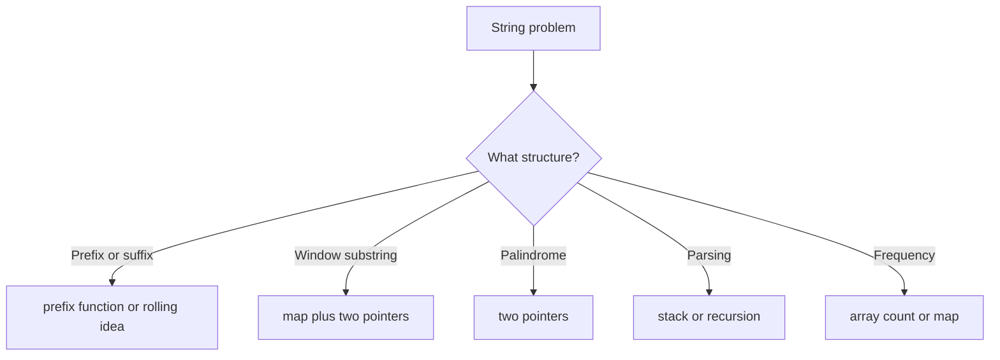
```mermaid
flowchart TD
    A["String problem"] --> B{"What structure?"}
    B -->|"Prefix or suffix"| C["prefix function or rolling idea"]
    B -->|"Window substring"| D["map plus two pointers"]
    B -->|"Palindrome"| E["two pointers"]
    B -->|"Parsing"| F["stack or recursion"]
    B -->|"Frequency"| G["array count or map"]
```

## Template: character frequency

```cpp
array<int, 256> freqString(const string& s) {
    array<int, 256> cnt{};
    for (char c : s) cnt[(unsigned char)c]++;
    return cnt;
}
```

## Template: valid palindrome

```cpp
bool isPalindrome(string s) {
    int l = 0, r = (int)s.size() - 1;
    while (l < r) {
        if (s[l] != s[r]) return false;
        l++;
        r--;
    }
    return true;
}
```

## Problems

| Difficulty | Problem | Platform | Form | Pattern | Tactic | Intuition |
|---|---|---|---|---|---|---|
| Easy | [Valid Anagram](https://leetcode.com/problems/valid-anagram/) | LeetCode | frequency | count array | compare counts | same letters means same count vector |
| Easy | [Valid Palindrome](https://leetcode.com/problems/valid-palindrome/) | LeetCode | palindrome | two pointers | skip non-alnum | compare mirrored valid chars |
| Easy | [Ransom Note](https://leetcode.com/problems/ransom-note/) | LeetCode | frequency need | count chars | decrement available | magazine supplies letters |
| Medium | [Group Anagrams](https://leetcode.com/problems/group-anagrams/) | LeetCode | grouping | map by key | sorted string as key | anagrams share canonical form |
| Medium | [Longest Substring Without Repeating Characters](https://leetcode.com/problems/longest-substring-without-repeating-characters/) | LeetCode | window | sliding set/map | move left past duplicate | window invariant has unique chars |
| Medium | [Minimum Window Substring](https://leetcode.com/problems/minimum-window-substring/) | LeetCode | covering window | map counts | expand then shrink | smallest valid window after coverage |
| Medium | [Decode String](https://leetcode.com/problems/decode-string/) | LeetCode | nested parsing | stack | save previous state | brackets nest last-in-first-out |
| Hard | [Text Justification](https://leetcode.com/problems/text-justification/) | LeetCode | formatting | vector group | distribute spaces | each line is greedy group |
| Hard | [Substring with Concatenation of All Words](https://leetcode.com/problems/substring-with-concatenation-of-all-words/) | LeetCode | fixed word window | hash map | scan by offset | words align by length |
| CM | [CSES String Matching](https://cses.fi/problemset/task/1753) | CSES | pattern search | string algorithm | prefix/hash | repeated pattern matching needs linear scan |

---

# 8. Stack Patterns

## Form

Use stack when the most recent unresolved object is solved first.

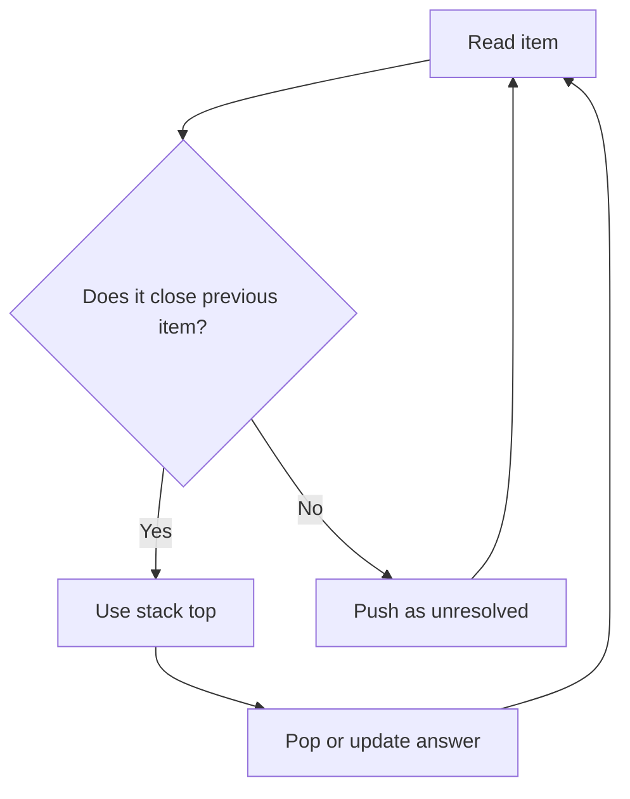
```mermaid
flowchart TD
    A["Read item"] --> B{"Does it close previous item?"}
    B -->|"Yes"| C["Use stack top"]
    B -->|"No"| D["Push as unresolved"]
    C --> E["Pop or update answer"]
    D --> A
    E --> A
```

## Template: balanced brackets

```cpp
bool isValidBrackets(const string& s) {
    stack<char> st;

    auto match = [](char open, char close) {
        return (open == '(' && close == ')') ||
               (open == '[' && close == ']') ||
               (open == '{' && close == '}');
    };

    for (char c : s) {
        if (c == '(' || c == '[' || c == '{') {
            st.push(c);
        } else {
            if (st.empty() || !match(st.top(), c)) return false;
            st.pop();
        }
    }

    return st.empty();
}
```

## Template: remove adjacent duplicates

```cpp
string removeAdjacentDuplicates(const string& s) {
    string st;
    for (char c : s) {
        if (!st.empty() && st.back() == c) st.pop_back();
        else st.push_back(c);
    }
    return st;
}
```

## Problems

| Difficulty | Problem | Platform | Form | Pattern | Tactic | Intuition |
|---|---|---|---|---|---|---|
| Easy | [Valid Parentheses](https://leetcode.com/problems/valid-parentheses/) | LeetCode | bracket matching | stack | push open pop close | latest open must close first |
| Easy | [Baseball Game](https://leetcode.com/problems/baseball-game/) | LeetCode | operation history | stack/vector | store scores | operations reference previous scores |
| Easy | [Remove All Adjacent Duplicates In String](https://leetcode.com/problems/remove-all-adjacent-duplicates-in-string/) | LeetCode | cancellation | stack string | pop equal top | adjacent equal cancels latest |
| Medium | [Min Stack](https://leetcode.com/problems/min-stack/) | LeetCode | stack with min | auxiliary stack | store current min | min must rollback with pop |
| Medium | [Evaluate Reverse Polish Notation](https://leetcode.com/problems/evaluate-reverse-polish-notation/) | LeetCode | expression eval | stack | apply operator to top two | postfix puts operands before operator |
| Medium | [Decode String](https://leetcode.com/problems/decode-string/) | LeetCode | nested expression | stack | save count and string | inner expression resolves first |
| Medium | [Daily Temperatures](https://leetcode.com/problems/daily-temperatures/) | LeetCode | next greater | monotonic stack | store indices | warmer day resolves colder days |
| Hard | [Basic Calculator](https://leetcode.com/problems/basic-calculator/) | LeetCode | expression parsing | stack/sign | push context at parenthesis | parentheses change sign context |
| Hard | [Largest Rectangle in Histogram](https://leetcode.com/problems/largest-rectangle-in-histogram/) | LeetCode | nearest smaller | monotonic stack | pop when height drops | popped bar finds maximal width |
| CM | [CSES Nearest Smaller Values](https://cses.fi/problemset/task/1645) | CSES | nearest smaller | monotonic stack | remove bigger candidates | remaining top is nearest smaller |

---

# 9. Queue and Deque Patterns

## Queue form

Use queue when processing happens in arrival order or BFS layers.

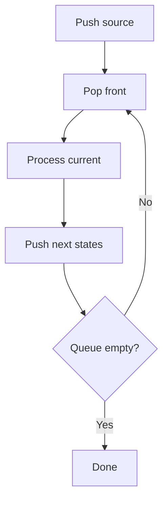
```mermaid
flowchart TD
    A["Push source"] --> B["Pop front"]
    B --> C["Process current"]
    C --> D["Push next states"]
    D --> E{"Queue empty?"}
    E -->|"No"| B
    E -->|"Yes"| F["Done"]
```

## C++ BFS template

```cpp
vector<int> bfs(int n, vector<vector<int>>& g, int src) {
    vector<int> dist(n + 1, -1);
    queue<int> q;

    dist[src] = 0;
    q.push(src);

    while (!q.empty()) {
        int u = q.front();
        q.pop();

        for (int v : g[u]) {
            if (dist[v] == -1) {
                dist[v] = dist[u] + 1;
                q.push(v);
            }
        }
    }

    return dist;
}
```

## Deque form

Use deque when you need to push/pop both ends.

```cpp
deque<int> dq;
dq.push_back(5);
dq.push_front(3);
dq.pop_back();
dq.pop_front();
```

## Problems

| Difficulty | Problem | Platform | Form | Pattern | Tactic | Intuition |
|---|---|---|---|---|---|---|
| Easy | [Implement Queue using Stacks](https://leetcode.com/problems/implement-queue-using-stacks/) | LeetCode | data structure design | two stacks | move only when needed | reverse stack gives FIFO |
| Easy | [Number of Recent Calls](https://leetcode.com/problems/number-of-recent-calls/) | LeetCode | time window | queue | pop old calls | queue holds valid recent calls |
| Medium | [Rotting Oranges](https://leetcode.com/problems/rotting-oranges/) | LeetCode | grid BFS | multi-source queue | start all rotten | infection spreads by layers |
| Medium | [Number of Islands](https://leetcode.com/problems/number-of-islands/) | LeetCode | flood fill | BFS/DFS queue | mark visited | each BFS consumes one island |
| Medium | [Open the Lock](https://leetcode.com/problems/open-the-lock/) | LeetCode | state BFS | queue states | generate neighbours | shortest moves in unweighted state graph |
| Hard | [Sliding Puzzle](https://leetcode.com/problems/sliding-puzzle/) | LeetCode | state BFS | queue + set | encode board string | each move is one edge |
| CM | [CSES Labyrinth](https://cses.fi/problemset/task/1193) | CSES | grid shortest path | BFS queue | parent reconstruction | BFS gives shortest path |
| CM | [CSES Monsters](https://cses.fi/problemset/task/1194) | CSES | multi-source escape | BFS twice | compare monster time | escape only if player arrives earlier |

---

# 10. Priority Queue Patterns

## Form

Use heap when only the current best or worst matters.

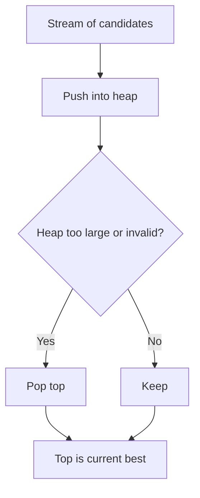
```mermaid
flowchart TD
    A["Stream of candidates"] --> B["Push into heap"]
    B --> C{"Heap too large or invalid?"}
    C -->|"Yes"| D["Pop top"]
    C -->|"No"| E["Keep"]
    D --> F["Top is current best"]
    E --> F
```

## C++ max heap and min heap

```cpp
priority_queue<int> maxHeap;

priority_queue<int, vector<int>, greater<int>> minHeap;
```

## Template: top K largest

```cpp
vector<int> topKLargest(vector<int>& a, int k) {
    priority_queue<int, vector<int>, greater<int>> pq;

    for (int x : a) {
        pq.push(x);
        if ((int)pq.size() > k) pq.pop();
    }

    vector<int> ans;
    while (!pq.empty()) {
        ans.push_back(pq.top());
        pq.pop();
    }
    sort(ans.rbegin(), ans.rend());
    return ans;
}
```

## Template: custom heap

```cpp
struct Node {
    int value;
    int index;
};

struct Compare {
    bool operator()(const Node& a, const Node& b) const {
        return a.value > b.value; // min heap by value
    }
};

priority_queue<Node, vector<Node>, Compare> pq;
```

## Problems

| Difficulty | Problem | Platform | Form | Pattern | Tactic | Intuition |
|---|---|---|---|---|---|---|
| Easy | [Last Stone Weight](https://leetcode.com/problems/last-stone-weight/) | LeetCode | repeated max | max heap | smash two largest | only largest stones matter |
| Easy | [Kth Largest Element in a Stream](https://leetcode.com/problems/kth-largest-element-in-a-stream/) | LeetCode | stream kth | min heap size k | pop smaller extras | heap stores top k |
| Medium | [Kth Largest Element in an Array](https://leetcode.com/problems/kth-largest-element-in-an-array/) | LeetCode | kth largest | heap/quickselect | keep k largest | kth is min of top k |
| Medium | [Top K Frequent Elements](https://leetcode.com/problems/top-k-frequent-elements/) | LeetCode | frequency top k | map + heap | heap by count | frequency decides rank |
| Medium | [K Closest Points to Origin](https://leetcode.com/problems/k-closest-points-to-origin/) | LeetCode | top k by distance | heap | compare squared distance | no need sqrt |
| Medium | [Task Scheduler](https://leetcode.com/problems/task-scheduler/) | LeetCode | greedy scheduling | max heap + cooldown | always use most frequent | reduce future bottleneck |
| Hard | [Find Median from Data Stream](https://leetcode.com/problems/find-median-from-data-stream/) | LeetCode | dynamic median | two heaps | balance sizes | median lies between halves |
| Hard | [Merge k Sorted Lists](https://leetcode.com/problems/merge-k-sorted-lists/) | LeetCode | k-way merge | min heap | push next from same list | smallest head is next answer |
| Hard | [IPO](https://leetcode.com/problems/ipo/) | LeetCode | greedy selection | sort + max heap | add affordable profits | choose best available project |
| CM | [CSES Flight Discount](https://cses.fi/problemset/task/1195) | CSES | shortest path state | priority queue | Dijkstra with used coupon state | heap picks shortest state |

---

# 11. Set and Multiset Patterns

## Form

Use set or multiset when you need sorted order plus insertion, deletion, and neighbour queries.

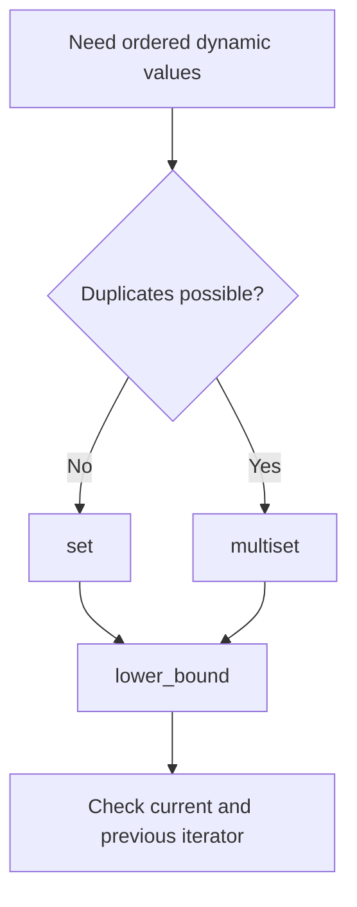
```mermaid
flowchart TD
    A["Need ordered dynamic values"] --> B{"Duplicates possible?"}
    B -->|"No"| C["set"]
    B -->|"Yes"| D["multiset"]
    C --> E["lower_bound"]
    D --> E
    E --> F["Check current and previous iterator"]
```

## C++ set lower_bound template

```cpp
int nearestValue(set<int>& s, int x) {
    auto it = s.lower_bound(x);
    int ans = INT_MAX;

    if (it != s.end()) ans = min(ans, abs(*it - x));
    if (it != s.begin()) {
        --it;
        ans = min(ans, abs(*it - x));
    }

    return ans;
}
```

## C++ erase one copy from multiset

```cpp
void eraseOne(multiset<int>& ms, int x) {
    auto it = ms.find(x);
    if (it != ms.end()) ms.erase(it);
}
```

## Problems

| Difficulty | Problem | Platform | Form | Pattern | Tactic | Intuition |
|---|---|---|---|---|---|---|
| Easy | [Contains Duplicate III](https://leetcode.com/problems/contains-duplicate-iii/) | LeetCode | nearby value | set window | lower_bound x minus t | closest candidate is around lower bound |
| Medium | [My Calendar I](https://leetcode.com/problems/my-calendar-i/) | LeetCode | interval booking | set ordered intervals | check prev and next | only neighbours can overlap |
| Medium | [Exam Room](https://leetcode.com/problems/exam-room/) | LeetCode | dynamic gaps | set | maintain occupied seats | best seat depends on gaps |
| Medium | [Time Based Key-Value Store](https://leetcode.com/problems/time-based-key-value-store/) | LeetCode | ordered versions | map/vector | upper_bound timestamp | latest previous value is answer |
| Hard | [Contains Duplicate III](https://leetcode.com/problems/contains-duplicate-iii/) | LeetCode | balanced BST window | set | maintain size k | sorted window finds close values |
| Hard | [My Calendar III](https://leetcode.com/problems/my-calendar-iii/) | LeetCode | sweep events | map ordered events | active count scan | maximum overlap is prefix of events |
| CM | [CSES Traffic Lights](https://cses.fi/problemset/task/1163) | CSES | dynamic intervals | set + multiset | split segment | longest gap after each insertion |
| CM | [CSES Room Allocation](https://cses.fi/problemset/task/1164) | CSES | interval resources | set/heap | reuse earliest finishing room | sorted endings choose available room |
| CM | [CSES Sliding Median](https://cses.fi/problemset/task/1076) | CSES | window median | two multisets | balance halves | median is max of lower half |

---

# 12. Map and Unordered Map Patterns

## Form

Use maps for grouping, counting, indexing, and prefix relationships.

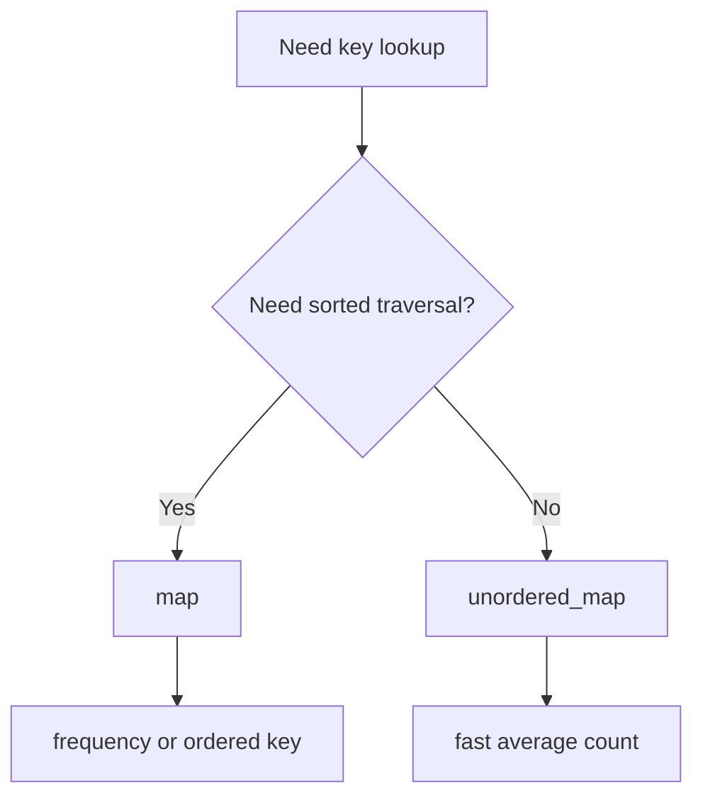
```mermaid
flowchart TD
    A["Need key lookup"] --> B{"Need sorted traversal?"}
    B -->|"Yes"| C["map"]
    B -->|"No"| D["unordered_map"]
    C --> E["frequency or ordered key"]
    D --> F["fast average count"]
```

## Template: frequency map

```cpp
unordered_map<int,int> frequency(vector<int>& a) {
    unordered_map<int,int> freq;
    for (int x : a) freq[x]++;
    return freq;
}
```

## Template: group anagrams

```cpp
vector<vector<string>> groupAnagrams(vector<string>& strs) {
    unordered_map<string, vector<string>> mp;

    for (string s : strs) {
        string key = s;
        sort(key.begin(), key.end());
        mp[key].push_back(s);
    }

    vector<vector<string>> ans;
    for (auto &p : mp) ans.push_back(p.second);
    return ans;
}
```

## Template: prefix sum with map

```cpp
long long countSubarraySumK(vector<int>& a, long long k) {
    unordered_map<long long,long long> freq;
    freq[0] = 1;

    long long pref = 0, ans = 0;
    for (int x : a) {
        pref += x;
        ans += freq[pref - k];
        freq[pref]++;
    }
    return ans;
}
```

## Problems

| Difficulty | Problem | Platform | Form | Pattern | Tactic | Intuition |
|---|---|---|---|---|---|---|
| Easy | [Two Sum](https://leetcode.com/problems/two-sum/) | LeetCode | complement lookup | unordered_map | store seen value index | target needs previous complement |
| Easy | [Majority Element](https://leetcode.com/problems/majority-element/) | LeetCode | frequency | map/count | count occurrences | majority crosses n/2 |
| Easy | [First Unique Character in a String](https://leetcode.com/problems/first-unique-character-in-a-string/) | LeetCode | frequency | count array/map | two passes | unique means count one |
| Medium | [Subarray Sum Equals K](https://leetcode.com/problems/subarray-sum-equals-k/) | LeetCode | prefix equality | map frequency | count previous prefix | equal difference gives sum k |
| Medium | [Longest Consecutive Sequence](https://leetcode.com/problems/longest-consecutive-sequence/) | LeetCode | set lookup | unordered_set | start only at sequence beginning | each number processed once |
| Medium | [Group Anagrams](https://leetcode.com/problems/group-anagrams/) | LeetCode | grouping | map key | sorted key | anagrams share sorted form |
| Medium | [LRU Cache](https://leetcode.com/problems/lru-cache/) | LeetCode | design | list + unordered_map | map key to list iterator | O(1) move to front |
| Hard | [Minimum Window Substring](https://leetcode.com/problems/minimum-window-substring/) | LeetCode | cover counts | unordered_map | maintain need/have | shrink while valid |
| Hard | [All O one Data Structure](https://leetcode.com/problems/all-oone-data-structure/) | LeetCode | design counts | list + map | buckets by frequency | O(1) min and max buckets |
| CM | [CSES Sum of Four Values](https://cses.fi/problemset/task/1642) | CSES | pair sum lookup | map pairs | store earlier pairs | two pairs form target |
| CM | [CSES Subarray Sums II](https://cses.fi/problemset/task/1661) | CSES | prefix count | map frequency | count prefix minus x | every old prefix creates subarray |

---

# 13. Pair, Tuple, and Custom Sort Patterns

## Form

Use pair/tuple when each item has multiple fields and sorting order matters.

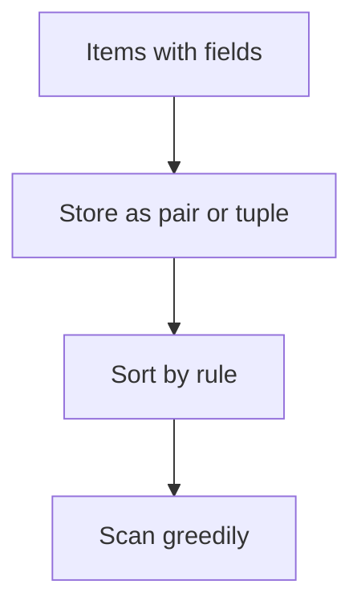
```mermaid
flowchart TD
    A["Items with fields"] --> B["Store as pair or tuple"]
    B --> C["Sort by rule"]
    C --> D["Scan greedily"]
```

## Template: custom sort lambda

```cpp
sort(v.begin(), v.end(), [](const auto& a, const auto& b) {
    if (a.first != b.first) return a.first < b.first;
    return a.second > b.second;
});
```

## Template: struct comparator

```cpp
struct Job {
    int start, end, profit;
};

sort(jobs.begin(), jobs.end(), [](const Job& a, const Job& b) {
    return a.end < b.end;
});
```

## Problems

| Difficulty | Problem | Platform | Form | Pattern | Tactic | Intuition |
|---|---|---|---|---|---|---|
| Easy | [Meeting Rooms](https://leetcode.com/problems/meeting-rooms/) | LeetCode | intervals | sort by start | compare previous end | overlap violates room |
| Medium | [Non-overlapping Intervals](https://leetcode.com/problems/non-overlapping-intervals/) | LeetCode | interval removal | greedy sort by end | keep earliest ending | more space for future intervals |
| Medium | [Minimum Number of Arrows to Burst Balloons](https://leetcode.com/problems/minimum-number-of-arrows-to-burst-balloons/) | LeetCode | interval stabbing | sort by end | shoot at end | one arrow covers all overlapping intervals |
| Medium | [Queue Reconstruction by Height](https://leetcode.com/problems/queue-reconstruction-by-height/) | LeetCode | custom sorting | sort + insert | tall first | shorter people do not affect taller count |
| Medium | [Largest Number](https://leetcode.com/problems/largest-number/) | LeetCode | comparator | custom string sort | compare ab vs ba | best concatenation order |
| Hard | [Russian Doll Envelopes](https://leetcode.com/problems/russian-doll-envelopes/) | LeetCode | 2D sorting | sort + LIS | width asc height desc | avoid equal width nesting |
| Hard | [Maximum Profit in Job Scheduling](https://leetcode.com/problems/maximum-profit-in-job-scheduling/) | LeetCode | weighted intervals | sort + DP + binary search | previous compatible job | choose job or skip |
| CM | [CSES Movie Festival](https://cses.fi/problemset/task/1629) | CSES | activity selection | sort by end | take earliest finishing | greedy maximizes remaining time |
| CM | [CSES Tasks and Deadlines](https://cses.fi/problemset/task/1630) | CSES | scheduling | sort by duration | process shortest duration first? | minimize accumulated finish effect |

---

# 14. STL Algorithms Patterns

## Key algorithms

| Algorithm | Use | C++ |
|---|---|---|
| sort | ordering | `sort(all(v))` |
| reverse | reverse range | `reverse(all(v))` |
| unique | remove adjacent duplicates | `v.erase(unique(all(v)), v.end())` |
| lower_bound | first `>= x` | `lower_bound(all(v), x)` |
| upper_bound | first `> x` | `upper_bound(all(v), x)` |
| next_permutation | next lexicographic permutation | `next_permutation(all(v))` |
| accumulate | sum | `accumulate(all(v), 0LL)` |
| nth_element | kth unordered | `nth_element` |

## Template: sort unique

```cpp
void sortUnique(vector<int>& v) {
    sort(v.begin(), v.end());
    v.erase(unique(v.begin(), v.end()), v.end());
}
```

## Template: kth element with nth_element

```cpp
int kthSmallest(vector<int> a, int k) {
    nth_element(a.begin(), a.begin() + k, a.end());
    return a[k]; // zero-indexed
}
```

## Problems

| Difficulty | Problem | Platform | Form | Pattern | Tactic | Intuition |
|---|---|---|---|---|---|---|
| Easy | [Squares of a Sorted Array](https://leetcode.com/problems/squares-of-a-sorted-array/) | LeetCode | sorted transform | two pointers | fill from back | largest square at ends |
| Easy | [Intersection of Two Arrays](https://leetcode.com/problems/intersection-of-two-arrays/) | LeetCode | set operations | sort unique | two pointers | sorted arrays reveal equal values |
| Medium | [3Sum](https://leetcode.com/problems/3sum/) | LeetCode | sorted triples | sort + two pointers | skip duplicates | fixing one reduces to two sum |
| Medium | [4Sum](https://leetcode.com/problems/4sum/) | LeetCode | sorted quadruples | nested fix + two pointers | skip duplicates | reduce dimension stepwise |
| Medium | [Find K Closest Elements](https://leetcode.com/problems/find-k-closest-elements/) | LeetCode | sorted window | lower_bound or binary | choose window | answer is contiguous around x |
| Hard | [Median of Two Sorted Arrays](https://leetcode.com/problems/median-of-two-sorted-arrays/) | LeetCode | partition | binary search | partition smaller array | left half must be <= right half |
| CM | [CSES Sum of Two Values](https://cses.fi/problemset/task/1640) | CSES | pair sum | sort pairs | two pointers | sorted sum moves predictably |
| CM | [CSES Sum of Three Values](https://cses.fi/problemset/task/1641) | CSES | triple sum | sort + two pointers | fix one | remaining pair is two sum |

---

# 15. Iterator and Binary Search STL Patterns

## Form

Use `lower_bound` and `upper_bound` when the data is sorted or ordered.

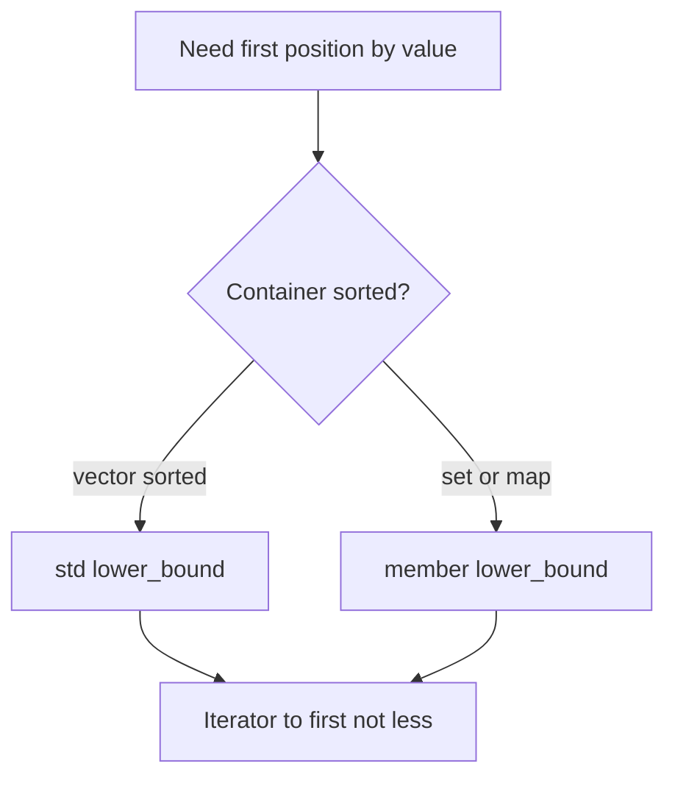
```mermaid
flowchart TD
    A["Need first position by value"] --> B{"Container sorted?"}
    B -->|"vector sorted"| C["std lower_bound"]
    B -->|"set or map"| D["member lower_bound"]
    C --> E["Iterator to first not less"]
    D --> E
```

## Template: count in sorted vector range

```cpp
int countInRange(vector<int>& a, int L, int R) {
    auto lo = lower_bound(a.begin(), a.end(), L);
    auto hi = upper_bound(a.begin(), a.end(), R);
    return hi - lo;
}
```

## Template: map lower_bound

```cpp
auto it = mp.lower_bound(key);
if (it != mp.end()) {
    // first key >= target
}
```

## Problems

| Difficulty | Problem | Platform | Form | Pattern | Tactic | Intuition |
|---|---|---|---|---|---|---|
| Easy | [Binary Search](https://leetcode.com/problems/binary-search/) | LeetCode | sorted search | lower_bound | compare mid | sorted halves eliminate |
| Easy | [Search Insert Position](https://leetcode.com/problems/search-insert-position/) | LeetCode | insertion index | lower_bound | first not less | insert before first bigger/equal |
| Medium | [Find First and Last Position of Element in Sorted Array](https://leetcode.com/problems/find-first-and-last-position-of-element-in-sorted-array/) | LeetCode | range equal | lower and upper bound | endpoints | equal block is contiguous |
| Medium | [Search a 2D Matrix](https://leetcode.com/problems/search-a-2d-matrix/) | LeetCode | flattened search | binary search | index mapping | matrix acts like sorted array |
| Medium | [Successful Pairs of Spells and Potions](https://leetcode.com/problems/successful-pairs-of-spells-and-potions/) | LeetCode | count threshold | sort + lower_bound | need ceil(success/spell) | all later potions work |
| Hard | [Count of Smaller Numbers After Self](https://leetcode.com/problems/count-of-smaller-numbers-after-self/) | LeetCode | order count | Fenwick/PBDS | insert from right | count previously inserted smaller |
| CM | [CSES Factory Machines](https://cses.fi/problemset/task/1620) | CSES | answer search | binary search | check products by time | time feasibility monotonic |
| CM | [CSES Subarray Sums I](https://cses.fi/problemset/task/1660) | CSES | positive window | two pointers | monotonic sum | positive values allow moving left |

---

# 16. Monotonic Stack Patterns

## Form

Use monotonic stack for nearest greater/smaller and rectangle spans.

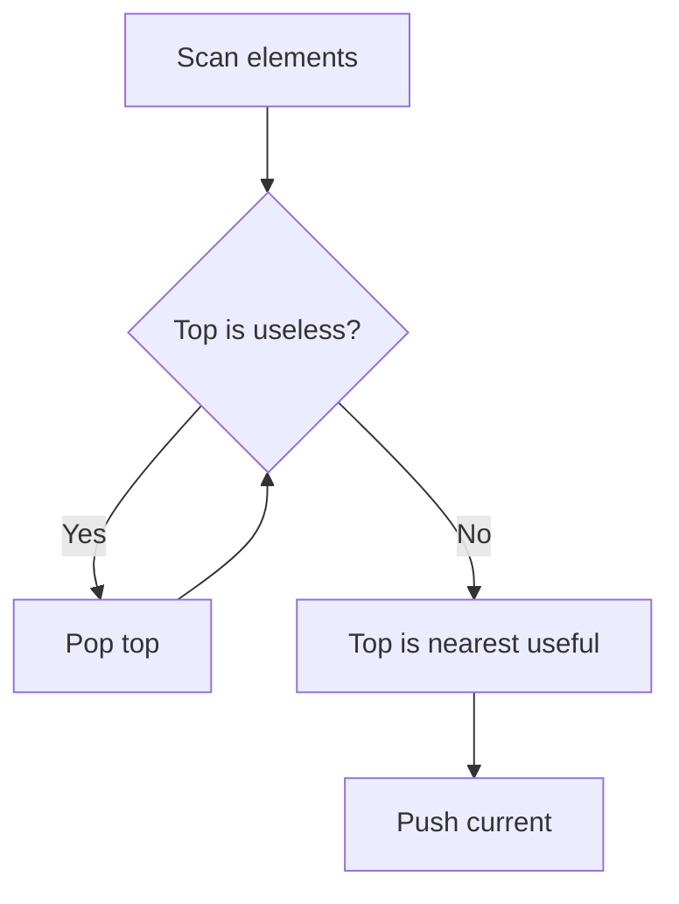
```mermaid
flowchart TD
    A["Scan elements"] --> B{"Top is useless?"}
    B -->|"Yes"| C["Pop top"]
    C --> B
    B -->|"No"| D["Top is nearest useful"]
    D --> E["Push current"]
```

## Template: next greater element to right

```cpp
vector<int> nextGreaterRight(vector<int>& a) {
    int n = a.size();
    vector<int> ans(n, -1);
    stack<int> st; // indices

    for (int i = 0; i < n; i++) {
        while (!st.empty() && a[st.top()] < a[i]) {
            ans[st.top()] = a[i];
            st.pop();
        }
        st.push(i);
    }

    return ans;
}
```

## Template: previous smaller index

```cpp
vector<int> prevSmallerIndex(vector<int>& a) {
    int n = a.size();
    vector<int> ans(n, -1);
    stack<int> st;

    for (int i = 0; i < n; i++) {
        while (!st.empty() && a[st.top()] >= a[i]) st.pop();
        if (!st.empty()) ans[i] = st.top();
        st.push(i);
    }

    return ans;
}
```

## Problems

| Difficulty | Problem | Platform | Form | Pattern | Tactic | Intuition |
|---|---|---|---|---|---|---|
| Easy | [Next Greater Element I](https://leetcode.com/problems/next-greater-element-i/) | LeetCode | next greater | monotonic stack + map | precompute next greater | decreasing stack waits for greater |
| Medium | [Daily Temperatures](https://leetcode.com/problems/daily-temperatures/) | LeetCode | next warmer | monotonic stack | store indices | warmer day resolves stack |
| Medium | [Online Stock Span](https://leetcode.com/problems/online-stock-span/) | LeetCode | previous greater | compressed stack | store price and span | merge weaker previous days |
| Medium | [Sum of Subarray Minimums](https://leetcode.com/problems/sum-of-subarray-minimums/) | LeetCode | contribution | prev/next smaller | count span | each value contributes as minimum |
| Hard | [Largest Rectangle in Histogram](https://leetcode.com/problems/largest-rectangle-in-histogram/) | LeetCode | max rectangle | monotonic stack | sentinel zero | popped bar knows boundaries |
| Hard | [Maximal Rectangle](https://leetcode.com/problems/maximal-rectangle/) | LeetCode | matrix histogram | stack per row | heights build histogram | each row becomes histogram problem |
| CM | [CSES Nearest Smaller Values](https://cses.fi/problemset/task/1645) | CSES | previous smaller | monotonic stack | pop greater/equal | closest valid smaller remains top |

---

# 17. Monotonic Deque Patterns

## Form

Use deque for sliding window min/max in `O(n)`.

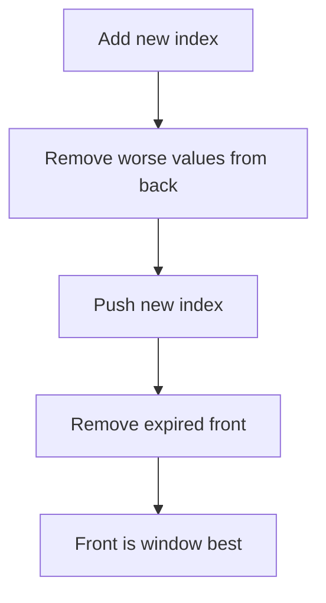
```mermaid
flowchart TD
    A["Add new index"] --> B["Remove worse values from back"]
    B --> C["Push new index"]
    C --> D["Remove expired front"]
    D --> E["Front is window best"]
```

## Template: sliding window maximum

```cpp
vector<int> maxSlidingWindow(vector<int>& a, int k) {
    deque<int> dq;
    vector<int> ans;

    for (int i = 0; i < (int)a.size(); i++) {
        while (!dq.empty() && a[dq.back()] <= a[i]) dq.pop_back();
        dq.push_back(i);

        if (dq.front() <= i - k) dq.pop_front();

        if (i >= k - 1) ans.push_back(a[dq.front()]);
    }

    return ans;
}
```

## Template: shortest subarray with sum at least K

```cpp
int shortestSubarray(vector<int>& nums, int k) {
    int n = nums.size();
    vector<long long> pref(n + 1, 0);

    for (int i = 0; i < n; i++) pref[i + 1] = pref[i] + nums[i];

    deque<int> dq;
    int ans = n + 1;

    for (int i = 0; i <= n; i++) {
        while (!dq.empty() && pref[i] - pref[dq.front()] >= k) {
            ans = min(ans, i - dq.front());
            dq.pop_front();
        }

        while (!dq.empty() && pref[dq.back()] >= pref[i]) {
            dq.pop_back();
        }

        dq.push_back(i);
    }

    return ans == n + 1 ? -1 : ans;
}
```

## Problems

| Difficulty | Problem | Platform | Form | Pattern | Tactic | Intuition |
|---|---|---|---|---|---|---|
| Medium | [Sliding Window Maximum](https://leetcode.com/problems/sliding-window-maximum/) | LeetCode | window max | monotonic deque | remove weaker old values | front always best |
| Medium | [Longest Continuous Subarray With Absolute Diff Less Than or Equal to Limit](https://leetcode.com/problems/longest-continuous-subarray-with-absolute-diff-less-than-or-equal-to-limit/) | LeetCode | window min max | two deques | maintain max-min | valid window bounded by extremes |
| Medium | [Constrained Subsequence Sum](https://leetcode.com/problems/constrained-subsequence-sum/) | LeetCode | DP window max | monotonic deque | keep best dp in range | transition needs max previous |
| Hard | [Shortest Subarray with Sum at Least K](https://leetcode.com/problems/shortest-subarray-with-sum-at-least-k/) | LeetCode | prefix deque | increasing prefix deque | discard dominated prefixes | smaller earlier prefix is better |
| CM | [CSES Sliding Window Minimum](https://cses.fi/problemset/task/3221) | CSES | window min | monotonic deque | same as max reversed | front is minimum candidate |

---

# 18. Two Multisets Patterns

## Form

Use two multisets when you need median or top K with arbitrary deletions.

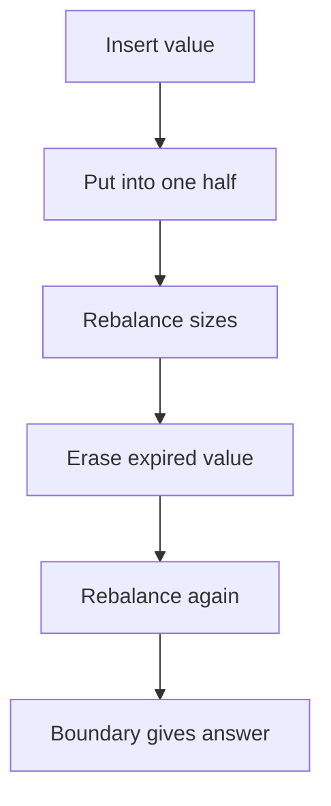
```mermaid
flowchart TD
    A["Insert value"] --> B["Put into one half"]
    B --> C["Rebalance sizes"]
    C --> D["Erase expired value"]
    D --> E["Rebalance again"]
    E --> F["Boundary gives answer"]
```

## Template: sliding median

```cpp
struct SlidingMedian {
    multiset<int> low, high; // low has smaller half

    void rebalance() {
        while (low.size() > high.size() + 1) {
            auto it = prev(low.end());
            high.insert(*it);
            low.erase(it);
        }
        while (low.size() < high.size()) {
            auto it = high.begin();
            low.insert(*it);
            high.erase(it);
        }
    }

    void add(int x) {
        if (low.empty() || x <= *prev(low.end())) low.insert(x);
        else high.insert(x);
        rebalance();
    }

    void remove(int x) {
        auto it = low.find(x);
        if (it != low.end()) low.erase(it);
        else {
            it = high.find(x);
            if (it != high.end()) high.erase(it);
        }
        rebalance();
    }

    int median() {
        return *prev(low.end());
    }
};
```

## Problems

| Difficulty | Problem | Platform | Form | Pattern | Tactic | Intuition |
|---|---|---|---|---|---|---|
| Hard | [Sliding Window Median](https://leetcode.com/problems/sliding-window-median/) | LeetCode | dynamic median | two multisets/heaps | insert erase balance | median is boundary of halves |
| Hard | [Find Median from Data Stream](https://leetcode.com/problems/find-median-from-data-stream/) | LeetCode | streaming median | two heaps/multisets | balance halves | lower and upper halves split numbers |
| CM | [CSES Sliding Median](https://cses.fi/problemset/task/1076) | CSES | window median | two multisets | erase outgoing | arbitrary deletion needs multiset |
| CM | [CSES Sliding Cost](https://cses.fi/problemset/task/1077) | CSES | median cost | two multisets + sums | maintain sums | median minimizes absolute deviation |

---

# 19. Interval and Sweep Line STL Patterns

## Form

Use intervals when ranges overlap, cover, merge, allocate rooms, or count active objects.

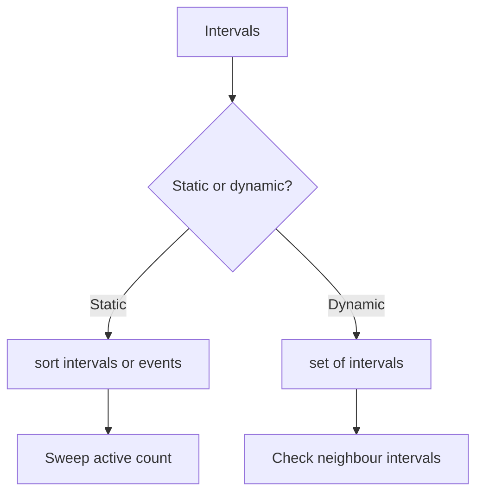
```mermaid
flowchart TD
    A["Intervals"] --> B{"Static or dynamic?"}
    B -->|"Static"| C["sort intervals or events"]
    B -->|"Dynamic"| D["set of intervals"]
    C --> E["Sweep active count"]
    D --> F["Check neighbour intervals"]
```

## Template: merge intervals

```cpp
vector<vector<int>> mergeIntervals(vector<vector<int>>& intervals) {
    sort(intervals.begin(), intervals.end());

    vector<vector<int>> ans;
    for (auto cur : intervals) {
        if (ans.empty() || ans.back()[1] < cur[0]) {
            ans.push_back(cur);
        } else {
            ans.back()[1] = max(ans.back()[1], cur[1]);
        }
    }
    return ans;
}
```

## Template: sweep line overlap

```cpp
int maxOverlap(vector<pair<int,int>>& intervals) {
    vector<pair<int,int>> events;

    for (auto [l, r] : intervals) {
        events.push_back({l, +1});
        events.push_back({r, -1});
    }

    sort(events.begin(), events.end());

    int active = 0, best = 0;
    for (auto [x, delta] : events) {
        active += delta;
        best = max(best, active);
    }

    return best;
}
```

## Problems

| Difficulty | Problem | Platform | Form | Pattern | Tactic | Intuition |
|---|---|---|---|---|---|---|
| Easy | [Meeting Rooms](https://leetcode.com/problems/meeting-rooms/) | LeetCode | interval conflict | sort | compare previous end | sorted starts reveal overlap |
| Medium | [Merge Intervals](https://leetcode.com/problems/merge-intervals/) | LeetCode | merging | sort scan | extend current | overlap chain becomes one interval |
| Medium | [Insert Interval](https://leetcode.com/problems/insert-interval/) | LeetCode | insert merge | three phases | before overlap after | only overlap group changes |
| Medium | [Meeting Rooms II](https://leetcode.com/problems/meeting-rooms-ii/) | LeetCode | room count | min heap or sweep | active meetings | max simultaneous rooms needed |
| Medium | [Car Pooling](https://leetcode.com/problems/car-pooling/) | LeetCode | range events | sweep/difference | passenger delta | active passengers must fit capacity |
| Hard | [Employee Free Time](https://leetcode.com/problems/employee-free-time/) | LeetCode | interval union | merge all | gaps after merge | free time is complement of busy union |
| Hard | [My Calendar III](https://leetcode.com/problems/my-calendar-iii/) | LeetCode | dynamic overlap | map sweep | ordered events | max active after each booking |
| CM | [CSES Restaurant Customers](https://cses.fi/problemset/task/1619) | CSES | active count | events sort | arrival +1 leave -1 | maximum active customers |
| CM | [CSES Room Allocation](https://cses.fi/problemset/task/1164) | CSES | resource allocation | heap by end | reuse earliest free | room available if end < start |
| CM | [CSES Traffic Lights](https://cses.fi/problemset/task/1163) | CSES | dynamic gaps | set + multiset | split interval | max segment tracked by multiset |

---

# 20. Lazy Deletion Heap Patterns

## Form

Use lazy deletion when heap cannot delete arbitrary old elements directly.

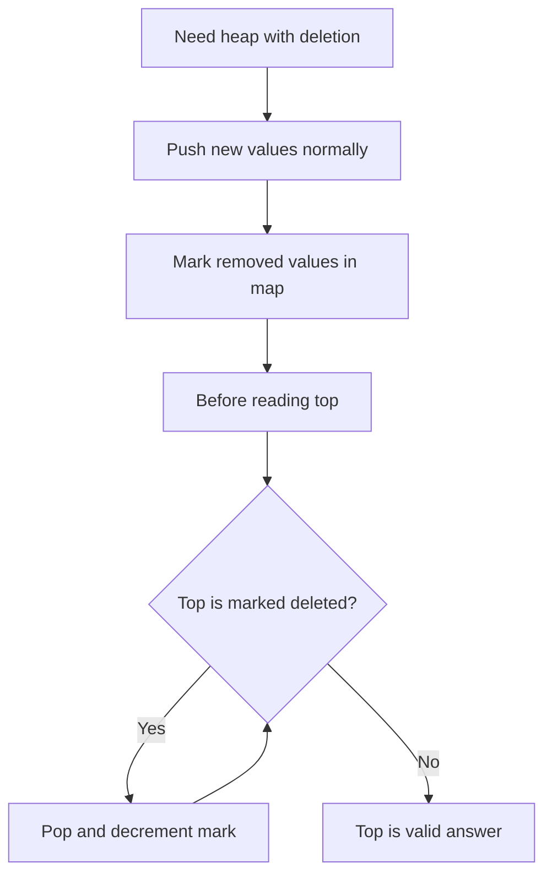
```mermaid
flowchart TD
    A["Need heap with deletion"] --> B["Push new values normally"]
    B --> C["Mark removed values in map"]
    C --> D["Before reading top"]
    D --> E{"Top is marked deleted?"}
    E -->|"Yes"| F["Pop and decrement mark"]
    F --> E
    E -->|"No"| G["Top is valid answer"]
```

## Template: lazy heap cleanup

```cpp
void clean(priority_queue<int>& pq, unordered_map<int,int>& delayed) {
    while (!pq.empty()) {
        int x = pq.top();
        if (!delayed.count(x) || delayed[x] == 0) break;

        delayed[x]--;
        if (delayed[x] == 0) delayed.erase(x);
        pq.pop();
    }
}
```

## Problems

| Difficulty | Problem | Platform | Form | Pattern | Tactic | Intuition |
|---|---|---|---|---|---|---|
| Medium | [Sliding Window Maximum](https://leetcode.com/problems/sliding-window-maximum/) | LeetCode | heap window | lazy deletion | remove expired top | heap top may be stale |
| Hard | [Sliding Window Median](https://leetcode.com/problems/sliding-window-median/) | LeetCode | two heaps | lazy deletion | delayed maps | heaps cannot erase arbitrary values |
| Hard | [Maximum Performance of a Team](https://leetcode.com/problems/maximum-performance-of-a-team/) | LeetCode | top k with sorted factor | min heap | remove smallest speed | efficiency fixed by sorted order |
| CM | [CSES Concert Tickets](https://cses.fi/problemset/task/1091) | CSES | sorted ticket allocation | multiset | upper_bound budget | assign most expensive affordable ticket |

---

# 21. Coordinate Compression Patterns

## Form

Use compression when values are huge but relative order or equality matters.

```mermaid
flowchart TD
    A["Huge values"] --> B["Copy values"]
    B --> C["Sort unique"]
    C --> D["Replace each value by lower_bound index"]
    D --> E["Use vector Fenwick or counts"]
```

## Template

```cpp
struct Compressor {
    vector<int> vals;

    Compressor(vector<int> a) {
        vals = a;
        sort(vals.begin(), vals.end());
        vals.erase(unique(vals.begin(), vals.end()), vals.end());
    }

    int get(int x) {
        return lower_bound(vals.begin(), vals.end(), x) - vals.begin();
    }

    int size() const {
        return vals.size();
    }
};
```

## Problems

| Difficulty | Problem | Platform | Form | Pattern | Tactic | Intuition |
|---|---|---|---|---|---|---|
| Medium | [Count of Smaller Numbers After Self](https://leetcode.com/problems/count-of-smaller-numbers-after-self/) | LeetCode | order count | compression + Fenwick | map values to ranks | only ordering matters |
| Medium | [Reverse Pairs](https://leetcode.com/problems/reverse-pairs/) | LeetCode | pair count | merge/Fenwick | compress values and doubled values | count previous bigger than twice |
| Hard | [Create Sorted Array through Instructions](https://leetcode.com/problems/create-sorted-array-through-instructions/) | LeetCode | dynamic rank count | Fenwick + compression | count less and greater | insertion cost from ranks |
| CM | [CSES Nested Ranges Count](https://cses.fi/problemset/task/2169) | CSES | intervals contain count | sort + Fenwick | compress right endpoints | containment becomes rank query |
| CM | [CSES Salary Queries](https://cses.fi/problemset/task/1144) | CSES | dynamic range count | compression + Fenwick | update old new salary | query count in salary range |

---

# 22. Bitset STL Patterns

## Form

Use `bitset` when states are boolean and many transitions can be done by shifting bits.

```mermaid
flowchart TD
    A["Boolean DP states"] --> B["Represent as bitset"]
    B --> C["Shift by value"]
    C --> D["OR into current states"]
    D --> E["Many states update in machine words"]
```

## Template: subset sum bitset

```cpp
const int MAXS = 100000;
bitset<MAXS + 1> possible;

void subsetSum(vector<int>& a) {
    possible[0] = 1;
    for (int x : a) {
        possible |= (possible << x);
    }
}
```

## Problems

| Difficulty | Problem | Platform | Form | Pattern | Tactic | Intuition |
|---|---|---|---|---|---|---|
| Medium | [Partition Equal Subset Sum](https://leetcode.com/problems/partition-equal-subset-sum/) | LeetCode | subset sum | bitset DP | shift by number | possible sums move by x |
| Medium | [Last Stone Weight II](https://leetcode.com/problems/last-stone-weight-ii/) | LeetCode | subset balance | bitset DP | find closest half | split stones into two groups |
| CM | [CSES Money Sums](https://cses.fi/problemset/task/1745) | CSES | possible sums | bitset/vector DP | shift states | every coin creates new sums |
| CM | [CSES School Excursion](https://cses.fi/problemset/task/1706) | CSES | component sizes | DSU + bitset DP | shift by component size | choose connected group sizes |

---

# 23. PBDS and Order Statistics

## Form

PBDS gives ordered set with kth element and count less than x.

```cpp
#include <ext/pb_ds/assoc_container.hpp>
#include <ext/pb_ds/tree_policy.hpp>
using namespace __gnu_pbds;

template<class T>
using ordered_set = tree<
    T,
    null_type,
    less<T>,
    rb_tree_tag,
    tree_order_statistics_node_update
>;
```

## Operations

```cpp
ordered_set<int> os;
os.insert(10);
os.insert(20);

int countLessThan20 = os.order_of_key(20); // 1
int kth0 = *os.find_by_order(0);           // 10
```

## Duplicate trick

```cpp
ordered_set<pair<int,int>> os;
int timerId = 0;

os.insert({value, timerId++});
```

## Problems

| Difficulty | Problem | Platform | Form | Pattern | Tactic | Intuition |
|---|---|---|---|---|---|---|
| Hard | [Count of Smaller Numbers After Self](https://leetcode.com/problems/count-of-smaller-numbers-after-self/) | LeetCode | dynamic order | PBDS | insert from right | count less than current among right side |
| Hard | [Reverse Pairs](https://leetcode.com/problems/reverse-pairs/) | LeetCode | pair count | PBDS/Fenwick | count greater than 2x | ordered structure counts ranks |
| CM | [CSES List Removals](https://cses.fi/problemset/task/1749) | CSES | kth alive removal | PBDS/Fenwick | find kth alive index | order structure simulates deletion |
| CM | [CSES Josephus Problem II](https://cses.fi/problemset/task/2163) | CSES | cyclic kth removal | PBDS | find by order and erase | dynamic circle needs kth alive |

---

# 24. FAANG STL Pattern Roadmap

FAANG interviews usually test clean data structure choice, explanation, and edge cases.

| Phase | Pattern | STL | Must solve |
|---|---|---|---|
| Beginner | hash lookup | `unordered_map` | Two Sum, Valid Anagram |
| Beginner | stack matching | `stack` | Valid Parentheses |
| Beginner | heap top K | `priority_queue` | Kth Largest, Top K Frequent |
| Medium | sliding window | `unordered_map`, `deque` | Longest Substring, Sliding Window Maximum |
| Medium | interval sorting | `vector`, `sort`, `heap` | Merge Intervals, Meeting Rooms II |
| Medium | custom data design | `list`, `unordered_map` | LRU Cache |
| Hard | streaming median | two heaps | Median from Data Stream |
| Hard | nested parser | stack/recursion + map | Basic Calculator, Decode String |
| Hard | monotonic stack | `stack` | Largest Rectangle, Sum of Subarray Minimums |

## FAANG explanation template

```text
Brute force:
    Describe simple approach and cost.

Bottleneck:
    What repeated operation is expensive?

STL choice:
    Which container improves it?

Invariant:
    What does the container always store?

Complexity:
    Time and space.
```

---

# 25. CM STL Pattern Roadmap

CM problems often mix STL with math, greedy, graph, or offline tricks.

| Phase | Pattern | STL | CM skill |
|---|---|---|---|
| Specialist | sorting + two pointers | `vector`, `sort` | pair/triple sums |
| Specialist | sweep line | `vector events`, `map` | overlaps, rooms |
| Expert | dynamic intervals | `set`, `multiset` | gaps, traffic lights |
| Expert | sliding median/cost | two multisets | arbitrary deletion |
| Expert | offline queries | sort events + Fenwick | process by threshold |
| CM | order statistics | PBDS/Fenwick | kth alive, ranks |
| CM | lazy deletion | heaps + maps | dynamic top K |
| CM | stateful greedy | heap + sort | scheduling, project selection |

## CM escalation flow

```mermaid
flowchart TD
    A["Basic STL accepted?"] --> B{"Need faster than O n log n?"}
    B -->|"No"| C["Use clean STL"]
    B -->|"Yes"| D{"Can process offline?"}
    D -->|"Yes"| E["Sort queries plus Fenwick or DSU"]
    D -->|"No"| F{"Need kth or rank?"}
    F -->|"Yes"| G["PBDS or Fenwick"]
    F -->|"No"| H{"Need dynamic ranges?"}
    H -->|"Yes"| I["set plus multiset"]
    H -->|"No"| J["Consider segment tree or custom DS"]
```

---

# 26. Master Problem Set Sorted by Difficulty

## Easy

| Difficulty | Problem | Platform | Form | Pattern | Tactic | Intuition |
|---|---|---|---|---|---|---|
| Easy | [Two Sum](https://leetcode.com/problems/two-sum/) | LeetCode | complement lookup | unordered_map | store seen | one pass finds previous complement |
| Easy | [Valid Parentheses](https://leetcode.com/problems/valid-parentheses/) | LeetCode | brackets | stack | push pop | last opened closes first |
| Easy | [Contains Duplicate](https://leetcode.com/problems/contains-duplicate/) | LeetCode | duplicates | set/sort | insert check | duplicate repeats key |
| Easy | [Valid Anagram](https://leetcode.com/problems/valid-anagram/) | LeetCode | frequency | array/map | count chars | same chars same counts |
| Easy | [Merge Sorted Array](https://leetcode.com/problems/merge-sorted-array/) | LeetCode | merge | two pointers | fill back | avoids overwrite |
| Easy | [Last Stone Weight](https://leetcode.com/problems/last-stone-weight/) | LeetCode | repeated max | priority_queue | pop top two | only largest matter |
| Easy | [Search Insert Position](https://leetcode.com/problems/search-insert-position/) | LeetCode | sorted index | lower_bound | first not less | answer is insertion point |
| Easy | [Baseball Game](https://leetcode.com/problems/baseball-game/) | LeetCode | history ops | vector stack | store valid scores | operations refer to previous |
| Easy | [Intersection of Two Arrays](https://leetcode.com/problems/intersection-of-two-arrays/) | LeetCode | set intersection | set/sort | unique common | sorted or set removes duplicates |
| Easy | [CSES Weird Algorithm](https://cses.fi/problemset/task/1068) | CSES | simulation | vector output | while loop | direct process |

## Medium

| Difficulty | Problem | Platform | Form | Pattern | Tactic | Intuition |
|---|---|---|---|---|---|---|
| Medium | [3Sum](https://leetcode.com/problems/3sum/) | LeetCode | triples | sort + two pointers | skip duplicates | fix one reduce to pair |
| Medium | [Top K Frequent Elements](https://leetcode.com/problems/top-k-frequent-elements/) | LeetCode | top k | map + heap | heap by frequency | best frequencies matter |
| Medium | [Group Anagrams](https://leetcode.com/problems/group-anagrams/) | LeetCode | grouping | map key | sort key | anagrams share key |
| Medium | [LRU Cache](https://leetcode.com/problems/lru-cache/) | LeetCode | design | list + unordered_map | move to front | list supports O(1) recency |
| Medium | [Merge Intervals](https://leetcode.com/problems/merge-intervals/) | LeetCode | intervals | sort merge | extend end | overlapping intervals combine |
| Medium | [Meeting Rooms II](https://leetcode.com/problems/meeting-rooms-ii/) | LeetCode | resources | heap/sweep | active endings | max active = rooms |
| Medium | [Subarray Sum Equals K](https://leetcode.com/problems/subarray-sum-equals-k/) | LeetCode | prefix map | unordered_map | count previous prefix | difference k forms subarray |
| Medium | [Daily Temperatures](https://leetcode.com/problems/daily-temperatures/) | LeetCode | next greater | monotonic stack | store unresolved | warmer resolves colder |
| Medium | [Sliding Window Maximum](https://leetcode.com/problems/sliding-window-maximum/) | LeetCode | window max | monotonic deque | remove weaker | front is maximum |
| Medium | [Time Based Key-Value Store](https://leetcode.com/problems/time-based-key-value-store/) | LeetCode | versioned map | map/vector + binary search | upper_bound time | latest not after timestamp |

## Hard

| Difficulty | Problem | Platform | Form | Pattern | Tactic | Intuition |
|---|---|---|---|---|---|---|
| Hard | [Median of Two Sorted Arrays](https://leetcode.com/problems/median-of-two-sorted-arrays/) | LeetCode | partition | binary search | split arrays | valid partition gives median |
| Hard | [Find Median from Data Stream](https://leetcode.com/problems/find-median-from-data-stream/) | LeetCode | dynamic median | two heaps | balance halves | median boundary |
| Hard | [Sliding Window Median](https://leetcode.com/problems/sliding-window-median/) | LeetCode | dynamic window | two multisets/heaps | arbitrary erase | window median needs delete |
| Hard | [Largest Rectangle in Histogram](https://leetcode.com/problems/largest-rectangle-in-histogram/) | LeetCode | histogram | monotonic stack | pop on smaller | popped height finds width |
| Hard | [Minimum Window Substring](https://leetcode.com/problems/minimum-window-substring/) | LeetCode | cover window | map + two pointers | shrink valid | shortest valid cover |
| Hard | [Merge k Sorted Lists](https://leetcode.com/problems/merge-k-sorted-lists/) | LeetCode | k-way merge | min heap | push next | smallest head chosen each step |
| Hard | [Basic Calculator](https://leetcode.com/problems/basic-calculator/) | LeetCode | parser | stack | sign context | parentheses need saved state |
| Hard | [My Calendar III](https://leetcode.com/problems/my-calendar-iii/) | LeetCode | dynamic sweep | map events | scan active | maximum overlap |
| Hard | [Count of Smaller Numbers After Self](https://leetcode.com/problems/count-of-smaller-numbers-after-self/) | LeetCode | rank counting | PBDS/Fenwick | scan right | count inserted smaller |
| Hard | [All O one Data Structure](https://leetcode.com/problems/all-oone-data-structure/) | LeetCode | design | list + maps | frequency buckets | O(1) min max count |

## CM

| Difficulty | Problem | Platform | Form | Pattern | Tactic | Intuition |
|---|---|---|---|---|---|---|
| CM | [CSES Sum of Two Values](https://cses.fi/problemset/task/1640) | CSES | pair sum | sort + two pointers | keep indices | sorted sums guide movement |
| CM | [CSES Sum of Three Values](https://cses.fi/problemset/task/1641) | CSES | triple sum | fix + two pointers | skip same index | reduce to pair |
| CM | [CSES Sum of Four Values](https://cses.fi/problemset/task/1642) | CSES | four sum | pair map | non-overlap pairs | two pair sums form target |
| CM | [CSES Sliding Median](https://cses.fi/problemset/task/1076) | CSES | window median | two multisets | erase outgoing | dynamic median with deletion |
| CM | [CSES Sliding Cost](https://cses.fi/problemset/task/1077) | CSES | absolute cost | two multisets + sums | median minimizes cost | sum difference around median |
| CM | [CSES Traffic Lights](https://cses.fi/problemset/task/1163) | CSES | dynamic gaps | set + multiset | split segment | track max gap after insertion |
| CM | [CSES Room Allocation](https://cses.fi/problemset/task/1164) | CSES | interval resources | heap/set | earliest free room | reuse room if possible |
| CM | [CSES Restaurant Customers](https://cses.fi/problemset/task/1619) | CSES | sweep line | events sort | active counter | max overlap |
| CM | [CSES Nested Ranges Check](https://cses.fi/problemset/task/2168) | CSES | interval containment | sort + scan | max right min right | containment becomes ordered check |
| CM | [CSES Nested Ranges Count](https://cses.fi/problemset/task/2169) | CSES | interval count | sort + Fenwick | compressed endpoints | count contained by right rank |
| CM | [CSES Concert Tickets](https://cses.fi/problemset/task/1091) | CSES | allocation | multiset | upper_bound budget | choose best affordable |
| CM | [CSES List Removals](https://cses.fi/problemset/task/1749) | CSES | kth alive | Fenwick/PBDS | remove by rank | dynamic array needs order statistics |
| CM | [CSES Josephus Problem II](https://cses.fi/problemset/task/2163) | CSES | cyclic deletion | PBDS | kth alive erase | order statistic simulates circle |
| CM | [CSES Movie Festival II](https://cses.fi/problemset/task/1632) | CSES | k resources | multiset endings | assign latest possible watcher | preserve earlier watchers |
| CM | [CSES Collecting Numbers II](https://cses.fi/problemset/task/2217) | CSES | permutation updates | set of breaks | update local neighbours | swap changes only local rounds |

---

# 27. Final Revision Flow

```mermaid
flowchart TD
    A["New STL problem"] --> B{"Subarray or window?"}
    B -->|"Fixed window"| C["Sliding window or deque"]
    B -->|"Variable valid window"| D["Two pointers plus map"]
    A --> E{"Nearest greater or smaller?"}
    E -->|"Yes"| F["Monotonic stack"]
    A --> G{"Need dynamic min max median?"}
    G -->|"Top only"| H["priority_queue"]
    G -->|"Median"| I["two heaps or two multisets"]
    A --> J{"Intervals?"}
    J -->|"Static"| K["sort and sweep"]
    J -->|"Dynamic"| L["set plus multiset"]
    A --> M{"Frequency or grouping?"}
    M -->|"Yes"| N["unordered_map or map"]
    A --> O{"Need kth or rank?"}
    O -->|"Yes"| P["PBDS or Fenwick"]
```

---

# 28. Debugging Checklist

| STL | Common bug | Fix |
|---|---|---|
| `vector` | out of bounds | check `0 <= i < n` |
| `stack` | calling `top` when empty | check `empty` first |
| `queue` | forgetting mark visited before push | mark immediately |
| `priority_queue` | stale top | lazy delete or validate |
| `set` | decrementing `begin` | check `it != begin` |
| `multiset` | `erase(value)` removes all copies | erase iterator |
| `unordered_map` | worst-case hash collision | use `map` or custom hash in CF |
| `sort` comparator | invalid strict ordering | never return true for equal |
| `lower_bound` | vector not sorted | sort first |
| PBDS duplicates | duplicate values ignored | store pair value and id |

## Final memory hooks

```text
Need fast lookup -> unordered_map
Need sorted lookup -> set or map
Need duplicates sorted -> multiset
Need latest unresolved -> stack
Need BFS order -> queue
Need best top -> priority_queue
Need window best -> deque
Need median -> two multisets or two heaps
Need interval gaps -> set plus multiset
Need kth alive -> PBDS or Fenwick
```
