# Ultimate Two Pointers + Sliding Window Guide  
## C++ Pattern Playbook for Newbie → Candidate Master + LC/FAANG

> Goal: recognize two-pointer and sliding-window forms, connect each form to pattern, tactic, intuition, implementation approach, and practice through difficulty-sorted problems.

---

# Clickable Index

- [0. How to Use This Guide](#0-how-to-use-this-guide)
- [1. Master Thinking Flow](#1-master-thinking-flow)
- [2. Difficulty Roadmap](#2-difficulty-roadmap)
- [3. Master Pattern Map](#3-master-pattern-map)
- [4. C++ Template Pack](#4-c-template-pack)
- [5. Form A: Opposite Ends](#5-form-a-opposite-ends)
- [6. Form B: Fixed Size Sliding Window](#6-form-b-fixed-size-sliding-window)
- [7. Form C: Variable Size Expand-Shrink Window](#7-form-c-variable-size-expand-shrink-window)
- [8. Form D: Count Subarrays With At Most K](#8-form-d-count-subarrays-with-at-most-k)
- [9. Form E: Exactly K via At Most K](#9-form-e-exactly-k-via-at-most-k)
- [10. Form F: Minimum Window / Cover Pattern](#10-form-f-minimum-window--cover-pattern)
- [11. Form G: Multi-List Traversal](#11-form-g-multi-list-traversal)
- [12. Form H: Sort + Fix + Two Pointers](#12-form-h-sort--fix--two-pointers)
- [13. Form I: Monotonic Deque Window](#13-form-i-monotonic-deque-window)
- [14. Form J: Dynamic Window With Multiset](#14-form-j-dynamic-window-with-multiset)
- [15. When Sliding Window Fails](#15-when-sliding-window-fails)
- [16. LC/FAANG Pattern Table](#16-lcfaang-pattern-table)
- [17. Candidate Master Escalation Patterns](#17-candidate-master-escalation-patterns)
- [18. Difficulty-Sorted Problem Set](#18-difficulty-sorted-problem-set)
- [19. Final Revision Checklist](#19-final-revision-checklist)

---

# 0. How to Use This Guide

For every new problem:

```text
Read statement
→ check constraints
→ ask if order matters
→ ask if subarray/substring must be contiguous
→ identify window or pointer form
→ define invariant
→ choose state data structure
→ write add/remove/update functions
→ dry run on sample
```

## Core Matching Table

| Signal in Problem | Form | Pattern | Tactic | Intuition | C++ Structure |
|---|---|---|---|---|---|
| sorted array pair target | opposite ends | two sum sorted | move side based on sum | discard impossible side | `while (l < r)` |
| palindrome | opposite ends | inward comparison | compare chars | mismatch breaks | `l++`, `r--` |
| max area between bars | opposite ends | limiting side | move shorter wall | width decreases, need taller wall | two pointers |
| fixed length `k` subarray | fixed window | add incoming, remove outgoing | maintain sum/freq | each window differs by two elements | for loop |
| longest valid subarray | variable window | expand right, shrink invalid | maintain invariant | once invalid, move left | `while (bad)` |
| shortest valid subarray | variable window | shrink while valid | minimize length | valid window can be tightened | inner while |
| count valid subarrays | at-most window | add window length | all suffix starts valid | monotonic validity | `ans += r-l+1` |
| exactly K distinct/odd/zeros | exact via at-most | `atMost(K)-atMost(K-1)` | easier count | exact split from cumulative counts | helper function |
| minimum cover substring | cover window | need/have counts | shrink while covered | keep all required chars | freq arrays/maps |
| sorted lists | multi-list traversal | merge/intersection | move smaller pointer | sorted order tells what to discard | two indices |
| 3Sum / 4Sum | sort + fix | reduce to 2Sum | skip duplicates | fix one, search remaining | recursion/two pointers |
| sliding max/min | monotonic deque | keep useful candidates | pop worse elements | front is best candidate | `deque<int>` |
| window median/cost | dynamic multiset | balanced sets | insert/remove/rebalance | maintain lower and upper halves | `multiset` |

---

# 1. Master Thinking Flow

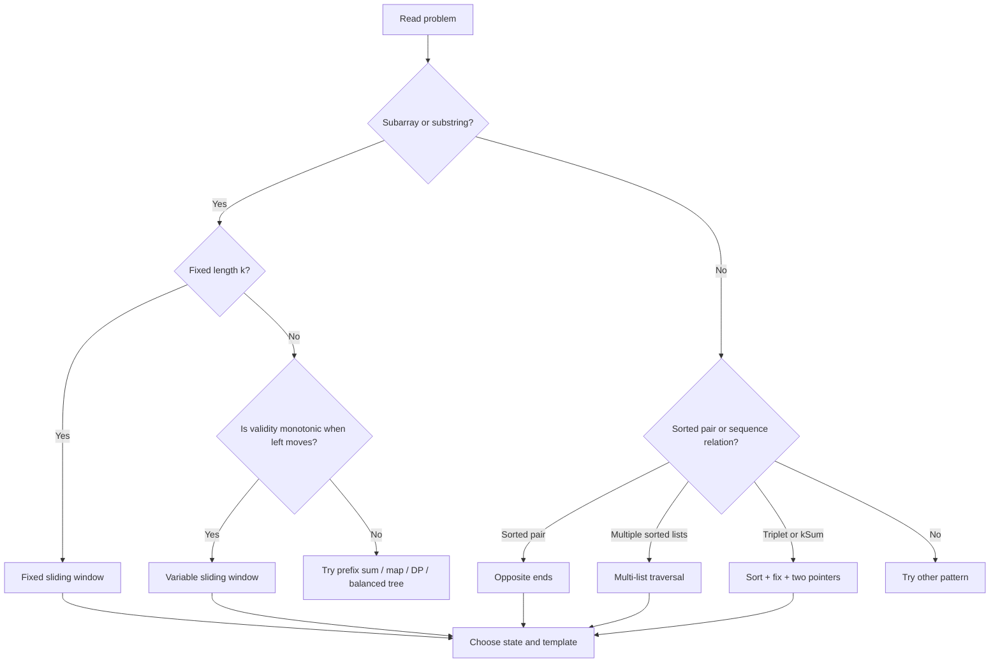
```mermaid
flowchart TD
    A["Read problem"] --> B{"Subarray or substring?"}
    B -->|Yes| C{"Fixed length k?"}
    B -->|No| D{"Sorted pair or sequence relation?"}

    C -->|Yes| E["Fixed sliding window"]
    C -->|No| F{"Is validity monotonic when left moves?"}

    F -->|Yes| G["Variable sliding window"]
    F -->|No| H["Try prefix sum / map / DP / balanced tree"]

    D -->|Sorted pair| I["Opposite ends"]
    D -->|Multiple sorted lists| J["Multi-list traversal"]
    D -->|Triplet or kSum| K["Sort + fix + two pointers"]
    D -->|No| L["Try other pattern"]

    E --> M["Choose state and template"]
    G --> M
    I --> M
    J --> M
    K --> M
```

## CM Thinking Flow

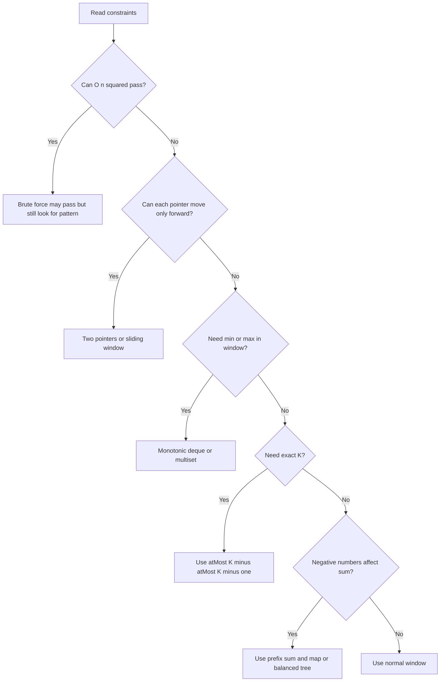
```mermaid
flowchart TD
    A["Read constraints"] --> B{"Can O n squared pass?"}
    B -->|Yes| C["Brute force may pass but still look for pattern"]
    B -->|No| D{"Can each pointer move only forward?"}
    D -->|Yes| E["Two pointers or sliding window"]
    D -->|No| F{"Need min or max in window?"}
    F -->|Yes| G["Monotonic deque or multiset"]
    F -->|No| H{"Need exact K?"}
    H -->|Yes| I["Use atMost K minus atMost K minus one"]
    H -->|No| J{"Negative numbers affect sum?"}
    J -->|Yes| K["Use prefix sum and map or balanced tree"]
    J -->|No| L["Use normal window"]
```

## FAANG Thinking Flow

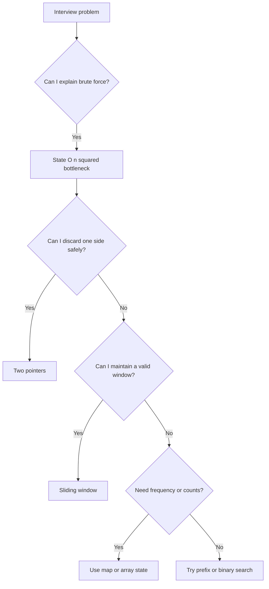
```mermaid
flowchart TD
    A["Interview problem"] --> B{"Can I explain brute force?"}
    B -->|Yes| C["State O n squared bottleneck"]
    C --> D{"Can I discard one side safely?"}
    D -->|Yes| E["Two pointers"]
    D -->|No| F{"Can I maintain a valid window?"}
    F -->|Yes| G["Sliding window"]
    F -->|No| H{"Need frequency or counts?"}
    H -->|Yes| I["Use map or array state"]
    H -->|No| J["Try prefix or binary search"]
```

---

# 2. Difficulty Roadmap

| Level | Target | Must Master |
|---|---|---|
| Newbie | understand pointer movement | palindrome, sorted 2Sum, fixed window sum |
| Pupil | common window patterns | longest at most K, minimum subarray, count subarrays |
| Specialist | exact K and string windows | exactly K distinct, min window substring, anagrams |
| Expert | optimized window DS | monotonic deque, multiset median, kSum |
| Candidate Master | advanced CP windows | two multisets, contribution with two pointers, offline/sorted compression |
| LC/FAANG | interview fluency | explain invariant, choose state, handle edge cases |

---

# 3. Master Pattern Map

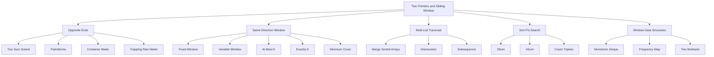
```mermaid
flowchart TD
    A["Two Pointers and Sliding Window"] --> B["Opposite Ends"]
    A --> C["Same Direction Window"]
    A --> D["Multi-List Traversal"]
    A --> E["Sort Fix Search"]
    A --> F["Window Data Structures"]

    B --> B1["Two Sum Sorted"]
    B --> B2["Palindrome"]
    B --> B3["Container Water"]
    B --> B4["Trapping Rain Water"]

    C --> C1["Fixed Window"]
    C --> C2["Variable Window"]
    C --> C3["At Most K"]
    C --> C4["Exactly K"]
    C --> C5["Minimum Cover"]

    D --> D1["Merge Sorted Arrays"]
    D --> D2["Intersection"]
    D --> D3["Subsequence"]

    E --> E1["3Sum"]
    E --> E2["4Sum"]
    E --> E3["Count Triplets"]

    F --> F1["Monotonic Deque"]
    F --> F2["Frequency Map"]
    F --> F3["Two Multisets"]
```

---

# 4. C++ Template Pack

## 4.1 Minimal Setup

```cpp
#include <bits/stdc++.h>
using namespace std;

using ll = long long;

int main() {
    ios::sync_with_stdio(false);
    cin.tie(nullptr);

    return 0;
}
```

## 4.2 Opposite Ends Skeleton

```cpp
while (left < right) {
    // inspect a[left] and a[right]

    if (condition_found) {
        // answer
    } else if (need_smaller) {
        right--;
    } else {
        left++;
    }
}
```

## 4.3 Fixed Window Skeleton

```cpp
long long window = 0;

for (int right = 0; right < n; right++) {
    window += a[right];

    if (right >= k) {
        window -= a[right - k];
    }

    if (right >= k - 1) {
        // answer current window
    }
}
```

## 4.4 Variable Window Skeleton

```cpp
int left = 0;

for (int right = 0; right < n; right++) {
    add(a[right]);

    while (invalid()) {
        remove(a[left]);
        left++;
    }

    updateAnswer(left, right);
}
```

## 4.5 At Most K Skeleton

```cpp
long long atMostK(vector<int>& a, int k) {
    if (k < 0) return 0;

    int left = 0;
    long long ans = 0;

    for (int right = 0; right < (int)a.size(); right++) {
        add(a[right]);

        while (bad(k)) {
            remove(a[left]);
            left++;
        }

        ans += right - left + 1;
    }

    return ans;
}
```

## 4.6 Exact K Skeleton

```cpp
long long exactlyK(vector<int>& a, int k) {
    return atMostK(a, k) - atMostK(a, k - 1);
}
```

## 4.7 Monotonic Deque Skeleton

```cpp
deque<int> dq;

for (int i = 0; i < n; i++) {
    while (!dq.empty() && dq.front() <= i - k) {
        dq.pop_front();
    }

    while (!dq.empty() && a[dq.back()] <= a[i]) {
        dq.pop_back();
    }

    dq.push_back(i);

    if (i >= k - 1) {
        int maximum = a[dq.front()];
    }
}
```

---

# 5. Form A: Opposite Ends

## Pattern

Pointers start at both ends and move inward.

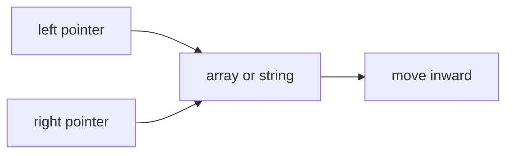
```mermaid
flowchart LR
    A["left pointer"] --> B["array or string"]
    C["right pointer"] --> B
    B --> D["move inward"]
```

## Use When

| Problem Signal | Why Opposite Ends Works |
|---|---|
| sorted array pair sum | sum changes predictably |
| palindrome | compare symmetric positions |
| max container | width decreases, move limiting side |
| trapping rain water | lower side determines water |
| partition by condition | move misplaced values inward |

---

## A1. Two Sum in Sorted Array

### Intuition

If current sum is too small, only increasing the left value can help.  
If current sum is too large, only decreasing the right value can help.

### Simulation

```text
a = [2, 7, 11, 15, 19]
target = 18

left = 2, right = 19, sum = 21 -> too large -> right--
left = 2, right = 15, sum = 17 -> too small -> left++
left = 7, right = 11, sum = 18 -> found
```

### Flowchart

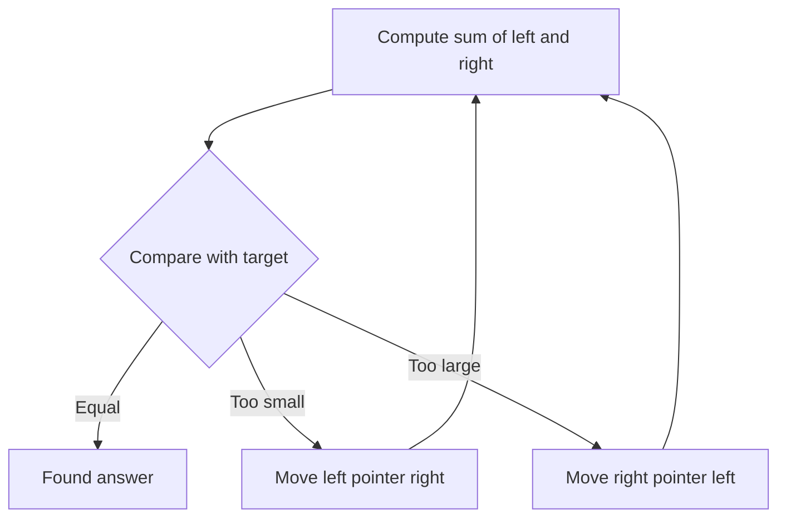
```mermaid
flowchart TD
    A["Compute sum of left and right"] --> B{"Compare with target"}
    B -->|Equal| C["Found answer"]
    B -->|Too small| D["Move left pointer right"]
    B -->|Too large| E["Move right pointer left"]
    D --> A
    E --> A
```

### C++

```cpp
bool twoSumSorted(vector<int>& a, int target) {
    int left = 0;
    int right = (int)a.size() - 1;

    while (left < right) {
        int sum = a[left] + a[right];

        if (sum == target) return true;
        if (sum < target) left++;
        else right--;
    }

    return false;
}
```

---

## A2. Palindrome Check

### Intuition

A palindrome reads the same from both sides.

### Flowchart

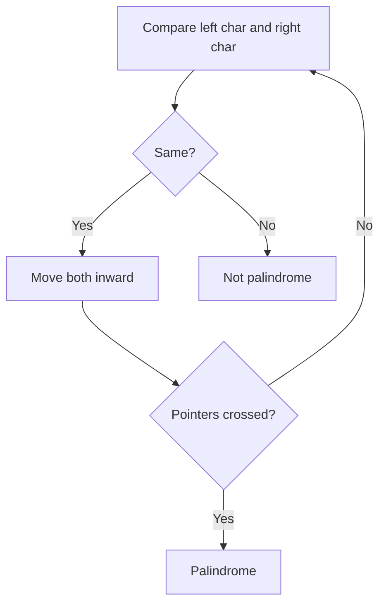
```mermaid
flowchart TD
    A["Compare left char and right char"] --> B{"Same?"}
    B -->|Yes| C["Move both inward"]
    B -->|No| D["Not palindrome"]
    C --> E{"Pointers crossed?"}
    E -->|No| A
    E -->|Yes| F["Palindrome"]
```

### C++

```cpp
bool isPalindrome(const string& s) {
    int left = 0;
    int right = (int)s.size() - 1;

    while (left < right) {
        if (s[left] != s[right]) return false;
        left++;
        right--;
    }

    return true;
}
```

---

## A3. Container With Most Water

### Intuition

Area is limited by the shorter wall.  
Moving the taller wall cannot improve the minimum height while width decreases.

### Flowchart

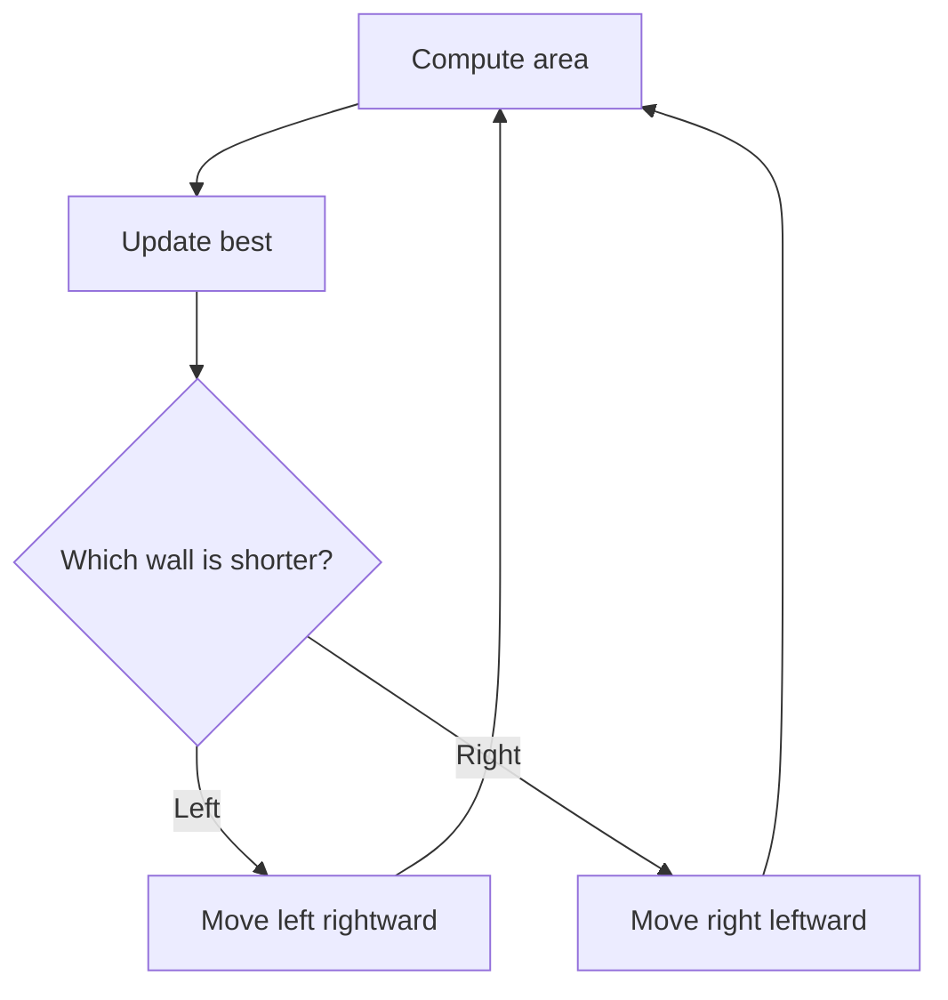
```mermaid
flowchart TD
    A["Compute area"] --> B["Update best"]
    B --> C{"Which wall is shorter?"}
    C -->|Left| D["Move left rightward"]
    C -->|Right| E["Move right leftward"]
    D --> A
    E --> A
```

### C++

```cpp
int maxArea(vector<int>& height) {
    int left = 0;
    int right = (int)height.size() - 1;
    int best = 0;

    while (left < right) {
        int width = right - left;
        int h = min(height[left], height[right]);
        best = max(best, width * h);

        if (height[left] < height[right]) left++;
        else right--;
    }

    return best;
}
```

---

# 6. Form B: Fixed Size Sliding Window

## Pattern

Window size is exactly `k`.

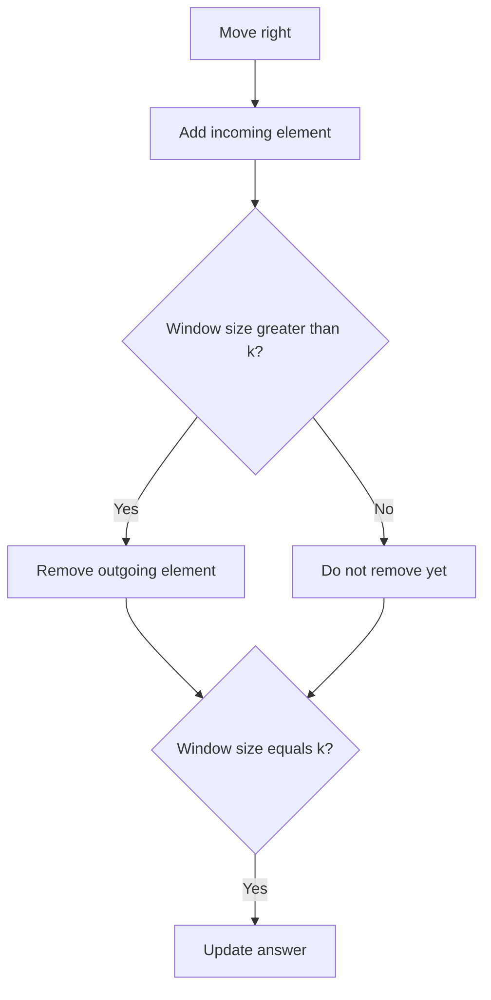
```mermaid
flowchart TD
    A["Move right"] --> B["Add incoming element"]
    B --> C{"Window size greater than k?"}
    C -->|Yes| D["Remove outgoing element"]
    C -->|No| E["Do not remove yet"]
    D --> F{"Window size equals k?"}
    E --> F
    F -->|Yes| G["Update answer"]
```

## Use When

| Signal | State |
|---|---|
| max sum of size k | sum |
| average of size k | sum |
| anagrams length k | frequency |
| distinct in every size k window | frequency map |
| max/min in every size k window | monotonic deque |
| median in every size k window | two multisets |

---

## B1. Maximum Sum Subarray of Size K

### Simulation

```text
a = [2, 1, 5, 1, 3, 2], k = 3

window [2,1,5] sum = 8
window [1,5,1] sum = 7
window [5,1,3] sum = 9
window [1,3,2] sum = 6

answer = 9
```

### C++

```cpp
long long maxSumSizeK(vector<int>& a, int k) {
    long long sum = 0;
    long long best = LLONG_MIN;

    for (int right = 0; right < (int)a.size(); right++) {
        sum += a[right];

        if (right >= k) {
            sum -= a[right - k];
        }

        if (right >= k - 1) {
            best = max(best, sum);
        }
    }

    return best;
}
```

---

## B2. Count Distinct in Every Window

### C++

```cpp
vector<int> distinctInWindows(vector<int>& a, int k) {
    unordered_map<int, int> freq;
    vector<int> ans;

    for (int right = 0; right < (int)a.size(); right++) {
        freq[a[right]]++;

        if (right >= k) {
            int out = a[right - k];
            freq[out]--;
            if (freq[out] == 0) freq.erase(out);
        }

        if (right >= k - 1) {
            ans.push_back((int)freq.size());
        }
    }

    return ans;
}
```

---

# 7. Form C: Variable Size Expand-Shrink Window

## Pattern

Expand right, and whenever invalid, shrink left.

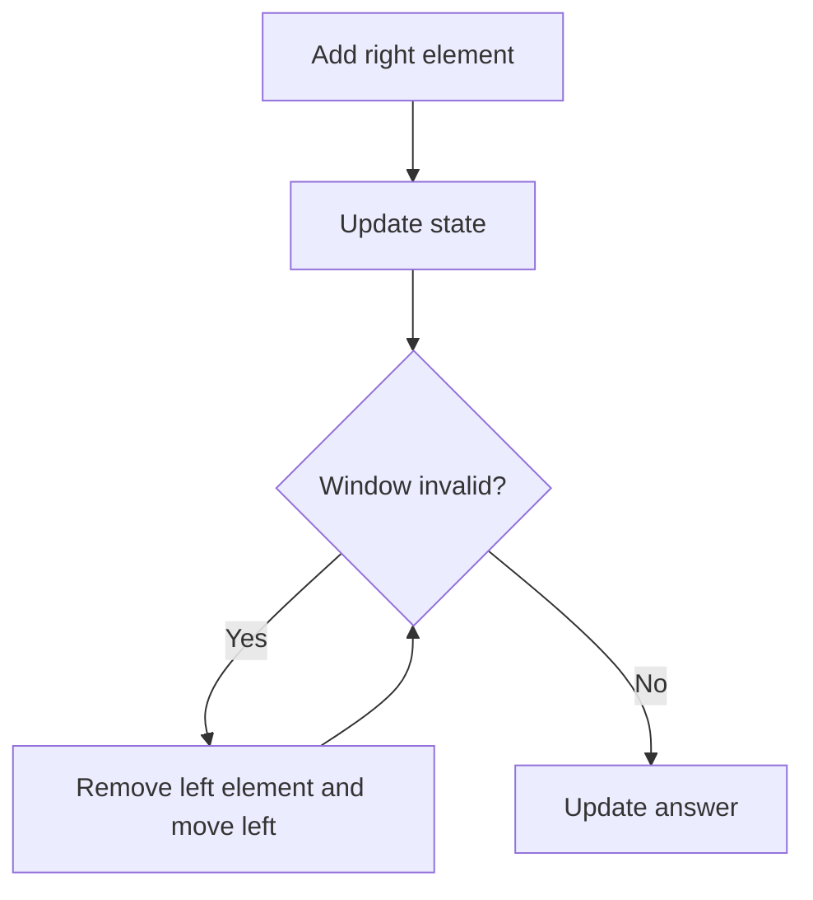
```mermaid
flowchart TD
    A["Add right element"] --> B["Update state"]
    B --> C{"Window invalid?"}
    C -->|Yes| D["Remove left element and move left"]
    D --> C
    C -->|No| E["Update answer"]
```

## Use When

| Goal | Update Logic |
|---|---|
| longest valid window | shrink until valid, maximize length |
| shortest valid window | expand until valid, shrink while valid |
| count valid windows | add current window length |
| substring constraints | maintain frequency |
| binary array flips | maintain zero count |

---

## C1. Longest Subarray With At Most K Zeros

### Intuition

Maintain a window where zero count is at most `k`.

### Simulation

```text
a = [1, 1, 0, 0, 1, 1, 1, 0]
k = 2

expand until zeros = 3 at last 0
then move left until zeros <= 2 again
best length found before/after shrinking
```

### C++

```cpp
int longestOnes(vector<int>& a, int k) {
    int left = 0;
    int zeros = 0;
    int best = 0;

    for (int right = 0; right < (int)a.size(); right++) {
        if (a[right] == 0) zeros++;

        while (zeros > k) {
            if (a[left] == 0) zeros--;
            left++;
        }

        best = max(best, right - left + 1);
    }

    return best;
}
```

---

## C2. Minimum Size Subarray Sum With Positive Numbers

### Important

This standard window works when all numbers are positive.  
If negative numbers exist, use prefix sum plus deque or balanced tree.

### Flowchart

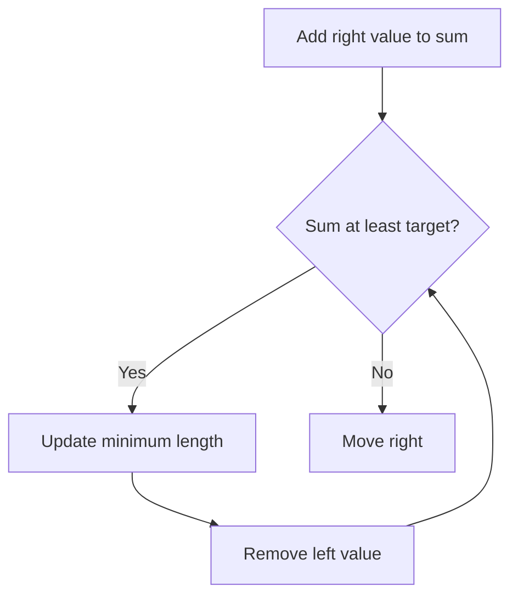
```mermaid
flowchart TD
    A["Add right value to sum"] --> B{"Sum at least target?"}
    B -->|Yes| C["Update minimum length"]
    C --> D["Remove left value"]
    D --> B
    B -->|No| E["Move right"]
```

### C++

```cpp
int minSubArrayLen(int target, vector<int>& a) {
    int left = 0;
    long long sum = 0;
    int ans = INT_MAX;

    for (int right = 0; right < (int)a.size(); right++) {
        sum += a[right];

        while (sum >= target) {
            ans = min(ans, right - left + 1);
            sum -= a[left];
            left++;
        }
    }

    return ans == INT_MAX ? 0 : ans;
}
```

---

# 8. Form D: Count Subarrays With At Most K

## Pattern

If `[left, right]` is valid and validity is monotonic, then all subarrays ending at `right` and starting from `left` to `right` are valid.

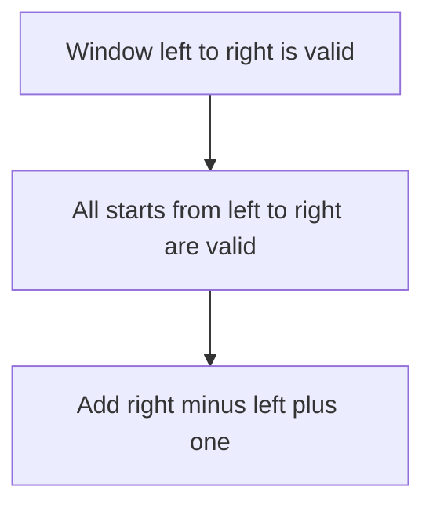
```mermaid
flowchart TD
    A["Window left to right is valid"] --> B["All starts from left to right are valid"]
    B --> C["Add right minus left plus one"]
```

## D1. Count Subarrays With Sum Less Than K for Positive Numbers

### C++

```cpp
long long countSubarraysSumLessThanK(vector<int>& a, long long k) {
    if (k <= 0) return 0;

    int left = 0;
    long long sum = 0;
    long long ans = 0;

    for (int right = 0; right < (int)a.size(); right++) {
        sum += a[right];

        while (sum >= k) {
            sum -= a[left];
            left++;
        }

        ans += right - left + 1;
    }

    return ans;
}
```

---

## D2. Count Subarrays With At Most K Distinct

### C++

```cpp
long long atMostKDistinct(vector<int>& a, int k) {
    if (k < 0) return 0;

    unordered_map<int, int> freq;
    int left = 0;
    long long ans = 0;

    for (int right = 0; right < (int)a.size(); right++) {
        freq[a[right]]++;

        while ((int)freq.size() > k) {
            int x = a[left];
            freq[x]--;
            if (freq[x] == 0) freq.erase(x);
            left++;
        }

        ans += right - left + 1;
    }

    return ans;
}
```

---

# 9. Form E: Exactly K via At Most K

## Pattern

```text
exactly K = atMost(K) - atMost(K - 1)
```

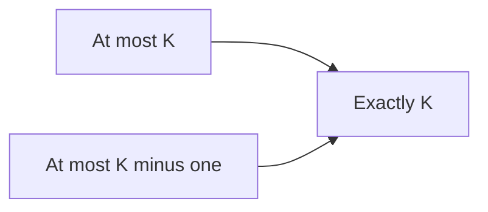
```mermaid
flowchart LR
    A["At most K"] --> C["Exactly K"]
    B["At most K minus one"] --> C
```

## Use Cases

| Exact Requirement | Helper State |
|---|---|
| exactly K distinct | frequency map |
| exactly K odd numbers | odd count |
| exactly K zeros | zero count |
| exactly K consonants | consonant count |
| binary subarrays with sum S | atMost sum for nonnegative array |

---

## E1. Subarrays With Exactly K Distinct

```cpp
long long subarraysWithKDistinct(vector<int>& a, int k) {
    return atMostKDistinct(a, k) - atMostKDistinct(a, k - 1);
}
```

---

## E2. Number of Nice Subarrays

```cpp
long long atMostKOdds(vector<int>& a, int k) {
    if (k < 0) return 0;

    int left = 0;
    int odds = 0;
    long long ans = 0;

    for (int right = 0; right < (int)a.size(); right++) {
        if (a[right] % 2 != 0) odds++;

        while (odds > k) {
            if (a[left] % 2 != 0) odds--;
            left++;
        }

        ans += right - left + 1;
    }

    return ans;
}

long long numberOfSubarrays(vector<int>& a, int k) {
    return atMostKOdds(a, k) - atMostKOdds(a, k - 1);
}
```

---

# 10. Form F: Minimum Window / Cover Pattern

## Pattern

Need a window that covers required characters/items.

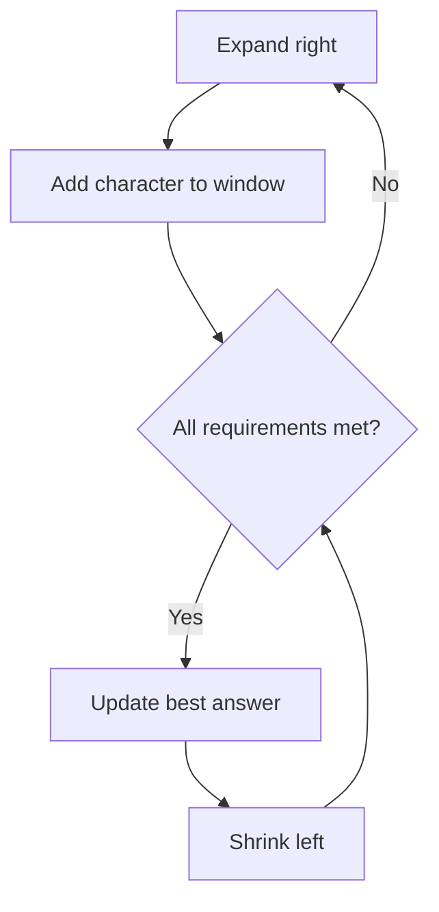
```mermaid
flowchart TD
    A["Expand right"] --> B["Add character to window"]
    B --> C{"All requirements met?"}
    C -->|No| A
    C -->|Yes| D["Update best answer"]
    D --> E["Shrink left"]
    E --> C
```

## F1. Minimum Window Substring

### Intuition

Keep expanding until all required characters are present.  
Then shrink left while still valid to minimize.

### C++

```cpp
string minWindow(string s, string t) {
    vector<int> need(128, 0);
    vector<int> have(128, 0);

    for (char c : t) need[c]++;

    int required = 0;
    for (int x : need) {
        if (x > 0) required++;
    }

    int formed = 0;
    int left = 0;
    int bestLen = INT_MAX;
    int bestStart = 0;

    for (int right = 0; right < (int)s.size(); right++) {
        char c = s[right];
        have[c]++;

        if (need[c] > 0 && have[c] == need[c]) {
            formed++;
        }

        while (formed == required) {
            int len = right - left + 1;
            if (len < bestLen) {
                bestLen = len;
                bestStart = left;
            }

            char out = s[left];
            have[out]--;

            if (need[out] > 0 && have[out] < need[out]) {
                formed--;
            }

            left++;
        }
    }

    if (bestLen == INT_MAX) return "";
    return s.substr(bestStart, bestLen);
}
```

---

# 11. Form G: Multi-List Traversal

## Pattern

One pointer per sorted list/string.

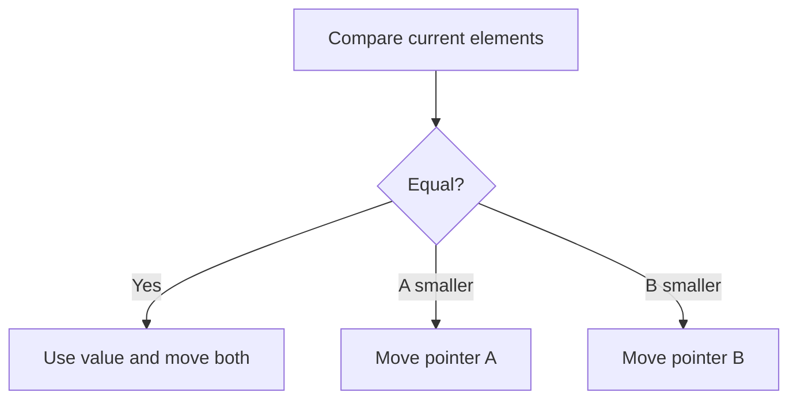
```mermaid
flowchart TD
    A["Compare current elements"] --> B{"Equal?"}
    B -->|Yes| C["Use value and move both"]
    B -->|A smaller| D["Move pointer A"]
    B -->|B smaller| E["Move pointer B"]
```

## G1. Merge Two Sorted Arrays

```cpp
vector<int> mergeSorted(vector<int>& a, vector<int>& b) {
    int i = 0;
    int j = 0;
    vector<int> res;

    while (i < (int)a.size() && j < (int)b.size()) {
        if (a[i] <= b[j]) {
            res.push_back(a[i]);
            i++;
        } else {
            res.push_back(b[j]);
            j++;
        }
    }

    while (i < (int)a.size()) res.push_back(a[i++]);
    while (j < (int)b.size()) res.push_back(b[j++]);

    return res;
}
```

## G2. Is Subsequence

```cpp
bool isSubsequence(string s, string t) {
    int i = 0;

    for (char c : t) {
        if (i < (int)s.size() && s[i] == c) {
            i++;
        }
    }

    return i == (int)s.size();
}
```

---

# 12. Form H: Sort + Fix + Two Pointers

## Pattern

For 3Sum and kSum:

```text
sort
fix one or more values
solve remaining pair problem with two pointers
skip duplicates
```

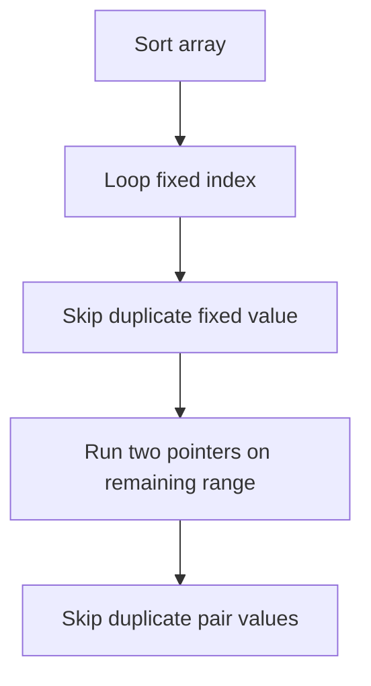
```mermaid
flowchart TD
    A["Sort array"] --> B["Loop fixed index"]
    B --> C["Skip duplicate fixed value"]
    C --> D["Run two pointers on remaining range"]
    D --> E["Skip duplicate pair values"]
```

## H1. 3Sum

```cpp
vector<vector<int>> threeSum(vector<int>& nums) {
    sort(nums.begin(), nums.end());
    vector<vector<int>> ans;
    int n = nums.size();

    for (int i = 0; i < n; i++) {
        if (i > 0 && nums[i] == nums[i - 1]) continue;

        int left = i + 1;
        int right = n - 1;

        while (left < right) {
            long long sum = 1LL * nums[i] + nums[left] + nums[right];

            if (sum == 0) {
                ans.push_back({nums[i], nums[left], nums[right]});

                int lv = nums[left];
                int rv = nums[right];

                while (left < right && nums[left] == lv) left++;
                while (left < right && nums[right] == rv) right--;
            } else if (sum < 0) {
                left++;
            } else {
                right--;
            }
        }
    }

    return ans;
}
```

---

# 13. Form I: Monotonic Deque Window

## Pattern

Keep only useful candidates for max/min.

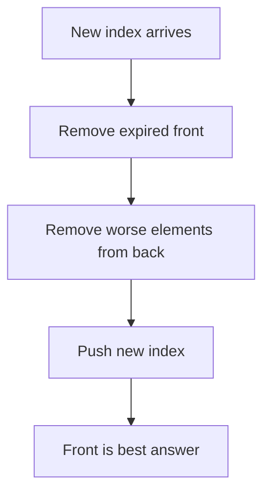
```mermaid
flowchart TD
    A["New index arrives"] --> B["Remove expired front"]
    B --> C["Remove worse elements from back"]
    C --> D["Push new index"]
    D --> E["Front is best answer"]
```

## I1. Sliding Window Maximum

```cpp
vector<int> maxSlidingWindow(vector<int>& a, int k) {
    deque<int> dq;
    vector<int> ans;

    for (int i = 0; i < (int)a.size(); i++) {
        while (!dq.empty() && dq.front() <= i - k) {
            dq.pop_front();
        }

        while (!dq.empty() && a[dq.back()] <= a[i]) {
            dq.pop_back();
        }

        dq.push_back(i);

        if (i >= k - 1) {
            ans.push_back(a[dq.front()]);
        }
    }

    return ans;
}
```

---

# 14. Form J: Dynamic Window With Multiset

## Use When

| Need | Structure |
|---|---|
| max/min in dynamic window | `multiset` |
| median in fixed window | two `multiset`s |
| cost to equalize window to median | two sets + sums |
| max-min <= limit | two deques or multiset |
| sliding window median | two multisets |

## J1. Longest Continuous Subarray With Absolute Diff Less Than Limit

```cpp
int longestSubarray(vector<int>& nums, int limit) {
    multiset<int> ms;
    int left = 0;
    int best = 0;

    for (int right = 0; right < (int)nums.size(); right++) {
        ms.insert(nums[right]);

        while (*ms.rbegin() - *ms.begin() > limit) {
            auto it = ms.find(nums[left]);
            ms.erase(it);
            left++;
        }

        best = max(best, right - left + 1);
    }

    return best;
}
```

---

# 15. When Sliding Window Fails

## Key Rule

Sliding window works when validity is monotonic.  
If adding right breaks validity, moving left should eventually fix it.

| Failure Signal | Better Pattern |
|---|---|
| sum target with negative numbers | prefix sum + map |
| shortest subarray with negative numbers | prefix sum + monotonic deque |
| arbitrary updates and queries | Fenwick / segment tree |
| non-contiguous subsequence | DP / greedy |
| no safe pointer discard | binary search / sorting / graph |
| window state needs global optimum | heap / multiset / DP |

## Failure Flow

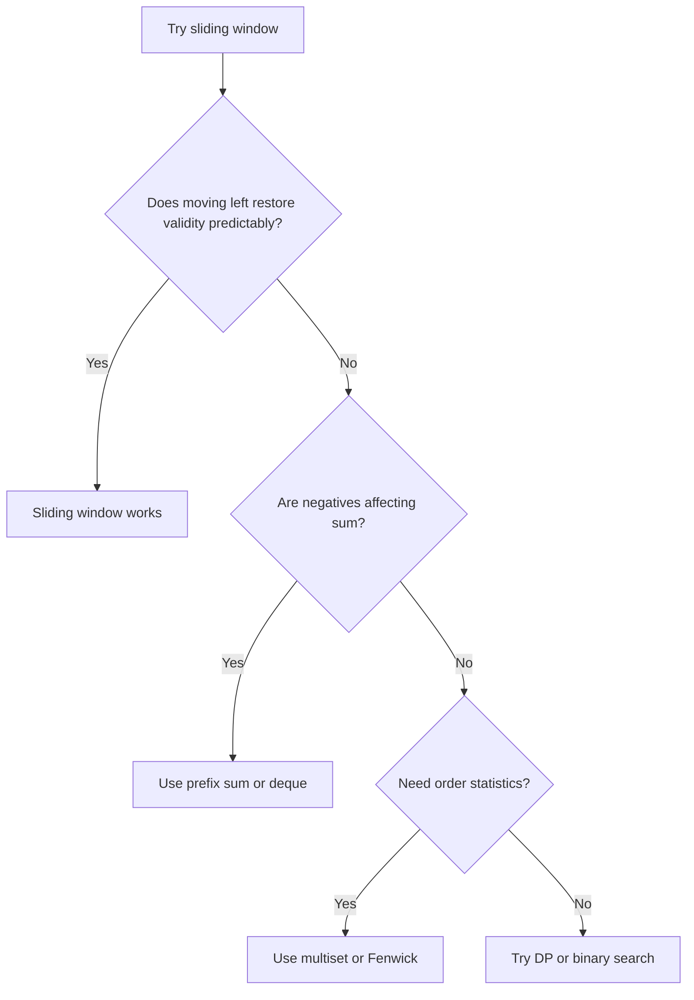
```mermaid
flowchart TD
    A["Try sliding window"] --> B{"Does moving left restore validity predictably?"}
    B -->|Yes| C["Sliding window works"]
    B -->|No| D{"Are negatives affecting sum?"}
    D -->|Yes| E["Use prefix sum or deque"]
    D -->|No| F{"Need order statistics?"}
    F -->|Yes| G["Use multiset or Fenwick"]
    F -->|No| H["Try DP or binary search"]
```

---

# 16. LC/FAANG Pattern Table

| Pattern | Recognition Signal | Tactic | Problems |
|---|---|---|---|
| sorted pair | sorted array + target | opposite ends | Two Sum II |
| palindrome | symmetric string | inward pointers | Valid Palindrome |
| variable longest | longest substring/subarray satisfying condition | expand/shrink | Longest Substring Without Repeating |
| min cover | smallest substring containing all chars | need/have counts | Minimum Window Substring |
| exact K | exactly K distinct/odds | atMost difference | Subarrays with K Distinct |
| fixed window freq | anagram/permutation in string | frequency arrays | Find All Anagrams |
| max/min window | every window max/min | monotonic deque | Sliding Window Maximum |
| kSum | triplets/quadruplets | sort + fix + two pointers | 3Sum, 4Sum |
| diff limit window | max-min <= limit | multiset/deques | Longest Continuous Subarray |
| sorted merge | two sorted arrays/lists | move smaller | Merge Sorted Array |

---

# 17. Candidate Master Escalation Patterns

| CM Pattern | Basic Version | Advanced Version | Tactic |
|---|---|---|---|
| count pairs by sum | 2Sum sorted | count duplicate blocks | block counting |
| count triplets | 3Sum existence | count triplets under condition | sort + contribution |
| windows with max/min | recompute max | monotonic deque | keep candidates |
| median/cost windows | sort each window | two multisets + sums | maintain lower/upper halves |
| exact K subarrays | brute force | atMost difference | monotonic counting |
| product/sum constraints | nested loops | sliding window if positive | monotonic validity |
| negative numbers | normal window fails | prefix + deque / tree | transform state |
| many values large | map overhead | coordinate compression + Fenwick | compression |
| circular window | duplicate array or modulo | two passes | careful bounds |
| string cover | brute substrings | frequency + formed count | cover invariant |

---

# 18. Difficulty-Sorted Problem Set

> The tables include LC/FAANG and CP/CM-style practice. Some Codeforces links use search URLs because problem titles can move across mirrors.

---

## 18.1 Newbie Problems

| # | Problem | Platform | Link | Form | Pattern | Tactic | Intuition | Implementation |
|---:|---|---|---|---|---|---|---|---|
| 1 | Two Sum II | LeetCode | https://leetcode.com/problems/two-sum-ii-input-array-is-sorted/ | opposite ends | sorted pair | move by sum | sorted order tells which side to discard | `l,r` |
| 2 | Valid Palindrome | LeetCode | https://leetcode.com/problems/valid-palindrome/ | opposite ends | palindrome | skip non-alnum | compare symmetric chars | two pointers |
| 3 | Reverse String | LeetCode | https://leetcode.com/problems/reverse-string/ | opposite ends | swap inward | move both | symmetric swap | two pointers |
| 4 | Move Zeroes | LeetCode | https://leetcode.com/problems/move-zeroes/ | same direction | slow/fast | place nonzero | slow marks next write | two pointers |
| 5 | Remove Duplicates from Sorted Array | LeetCode | https://leetcode.com/problems/remove-duplicates-from-sorted-array/ | same direction | write pointer | keep unique | sorted duplicates adjacent | slow/fast |
| 6 | Merge Sorted Array | LeetCode | https://leetcode.com/problems/merge-sorted-array/ | multi-list | merge from end | avoid overwrite | largest elements placed backward | three pointers |
| 7 | Squares of a Sorted Array | LeetCode | https://leetcode.com/problems/squares-of-a-sorted-array/ | opposite ends | bigger abs first | fill from end | max square at either end | two pointers |
| 8 | Maximum Average Subarray I | LeetCode | https://leetcode.com/problems/maximum-average-subarray-i/ | fixed window | sum size k | add/remove | every window size k differs by one in/out | running sum |
| 9 | Find Pivot Index | LeetCode | https://leetcode.com/problems/find-pivot-index/ | prefix relation | left/right sum | total sum | not pure window, good contrast | prefix |
| 10 | Is Subsequence | LeetCode | https://leetcode.com/problems/is-subsequence/ | multi-list | scan target | move s pointer on match | preserve order | two pointers |

### Newbie Logic Flow

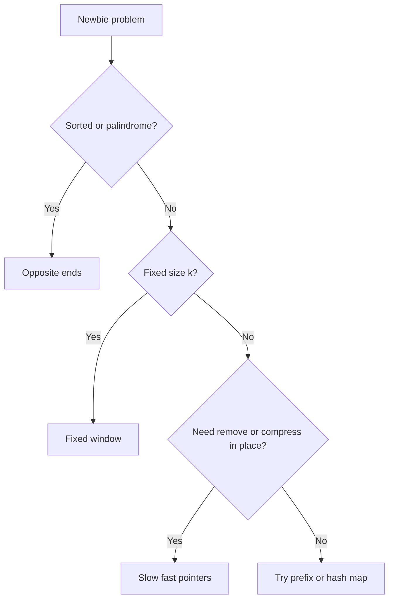
```mermaid
flowchart TD
    A["Newbie problem"] --> B{"Sorted or palindrome?"}
    B -->|Yes| C["Opposite ends"]
    B -->|No| D{"Fixed size k?"}
    D -->|Yes| E["Fixed window"]
    D -->|No| F{"Need remove or compress in place?"}
    F -->|Yes| G["Slow fast pointers"]
    F -->|No| H["Try prefix or hash map"]
```

---

## 18.2 Easy to Medium Problems

| # | Problem | Platform | Link | Form | Pattern | Tactic | Intuition | Implementation |
|---:|---|---|---|---|---|---|---|---|
| 1 | Container With Most Water | LeetCode | https://leetcode.com/problems/container-with-most-water/ | opposite ends | limiting side | move shorter wall | only taller wall can improve height | two pointers |
| 2 | Minimum Size Subarray Sum | LeetCode | https://leetcode.com/problems/minimum-size-subarray-sum/ | variable window | shrink while valid | positive sum | valid window can be tightened | sum window |
| 3 | Longest Substring Without Repeating Characters | LeetCode | https://leetcode.com/problems/longest-substring-without-repeating-characters/ | variable string | unique window | freq/last index | remove until duplicate gone | map/array |
| 4 | Permutation in String | LeetCode | https://leetcode.com/problems/permutation-in-string/ | fixed window freq | anagram | char counts | same length and same frequency | arrays |
| 5 | Find All Anagrams in a String | LeetCode | https://leetcode.com/problems/find-all-anagrams-in-a-string/ | fixed window freq | anagram list | maintain count | each length p window checked | arrays |
| 6 | Max Consecutive Ones III | LeetCode | https://leetcode.com/problems/max-consecutive-ones-iii/ | variable window | at most K zeros | shrink zeros | flip at most K zeroes | zero count |
| 7 | Fruit Into Baskets | LeetCode | https://leetcode.com/problems/fruit-into-baskets/ | variable window | at most 2 distinct | freq map | basket type limit | map |
| 8 | Longest Repeating Character Replacement | LeetCode | https://leetcode.com/problems/longest-repeating-character-replacement/ | variable window | replace non-majority | max frequency | window valid if len - maxFreq <= k | freq array |
| 9 | Number of Subarrays of Size K and Average Greater Than Threshold | LeetCode | https://leetcode.com/problems/number-of-sub-arrays-of-size-k-and-average-greater-than-or-equal-to-threshold/ | fixed window | sum size k | compare sum | avoid floating average | running sum |
| 10 | Grumpy Bookstore Owner | LeetCode | https://leetcode.com/problems/grumpy-bookstore-owner/ | fixed window gain | maximize extra satisfied | window gain | base always satisfied + best technique gain | sliding sum |
| 11 | Maximize Number of Vowels in a Substring | LeetCode | https://leetcode.com/problems/maximum-number-of-vowels-in-a-substring-of-given-length/ | fixed window | count vowels | add/remove | maintain vowel count | window count |
| 12 | Subarray Product Less Than K | LeetCode | https://leetcode.com/problems/subarray-product-less-than-k/ | variable window | product positive | shrink product | product monotonic for positives | multiply/divide |
| 13 | Binary Subarrays With Sum | LeetCode | https://leetcode.com/problems/binary-subarrays-with-sum/ | exact K | atMost sum | exact via difference | binary nonnegative allows window | helper |
| 14 | Count Number of Nice Subarrays | LeetCode | https://leetcode.com/problems/count-number-of-nice-subarrays/ | exact K | atMost odds | odd count | exactly k odds from atMost | helper |
| 15 | Boats to Save People | LeetCode | https://leetcode.com/problems/boats-to-save-people/ | opposite ends | greedy pair | lightest + heaviest | if they fit, pair; else heaviest alone | sort + two pointers |

### Easy-Medium Logic Flow

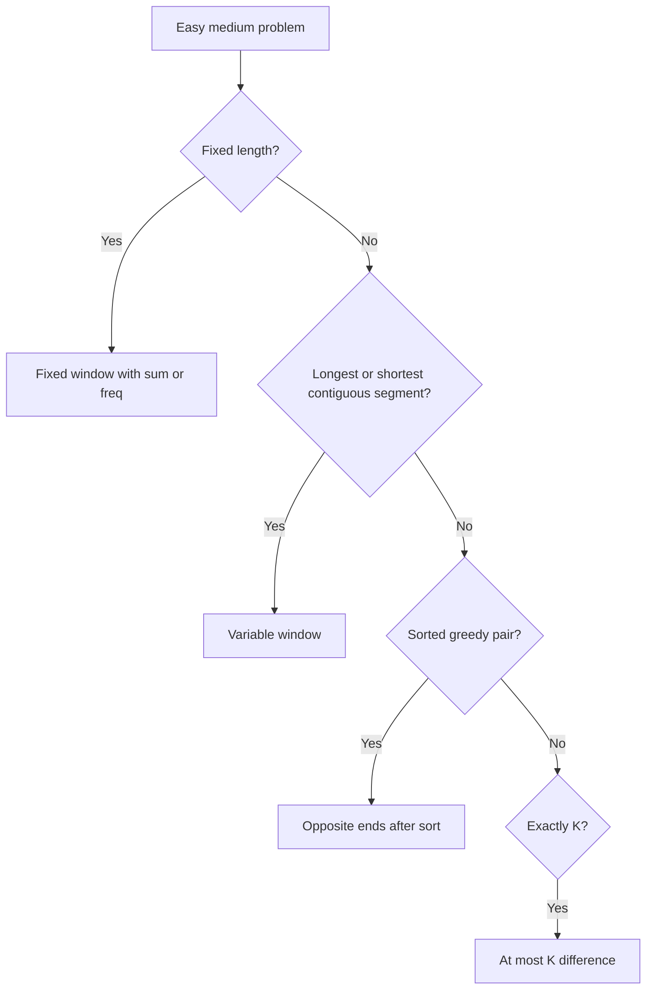
```mermaid
flowchart TD
    A["Easy medium problem"] --> B{"Fixed length?"}
    B -->|Yes| C["Fixed window with sum or freq"]
    B -->|No| D{"Longest or shortest contiguous segment?"}
    D -->|Yes| E["Variable window"]
    D -->|No| F{"Sorted greedy pair?"}
    F -->|Yes| G["Opposite ends after sort"]
    F -->|No| H{"Exactly K?"}
    H -->|Yes| I["At most K difference"]
```

---

## 18.3 Medium Problems

| # | Problem | Platform | Link | Form | Pattern | Tactic | Intuition | Implementation |
|---:|---|---|---|---|---|---|---|---|
| 1 | 3Sum | LeetCode | https://leetcode.com/problems/3sum/ | sort fix search | 3Sum | skip duplicates | fixed first value reduces to 2Sum | sort + two pointers |
| 2 | 3Sum Closest | LeetCode | https://leetcode.com/problems/3sum-closest/ | sort fix search | closest sum | move by comparison | sorted movement gets closer | two pointers |
| 3 | 4Sum | LeetCode | https://leetcode.com/problems/4sum/ | kSum | recursive fix | skip duplicates | reduce kSum to 2Sum | recursion + two pointers |
| 4 | Subarrays with K Different Integers | LeetCode | https://leetcode.com/problems/subarrays-with-k-different-integers/ | exact K | atMost distinct | freq map | exact from cumulative | map |
| 5 | Minimum Window Substring | LeetCode | https://leetcode.com/problems/minimum-window-substring/ | cover window | need/have | shrink while covered | minimize valid cover | freq arrays |
| 6 | Sliding Window Maximum | LeetCode | https://leetcode.com/problems/sliding-window-maximum/ | monotonic deque | max window | remove worse | front is max | deque |
| 7 | Longest Continuous Subarray With Absolute Diff Less Than or Equal to Limit | LeetCode | https://leetcode.com/problems/longest-continuous-subarray-with-absolute-diff-less-than-or-equal-to-limit/ | max-min window | deque or multiset | maintain extremes | invalid if max-min too large | two deques |
| 8 | Get Equal Substrings Within Budget | LeetCode | https://leetcode.com/problems/get-equal-substrings-within-budget/ | variable window | cost budget | shrink cost | each char change has cost | running sum |
| 9 | Maximize the Confusion of an Exam | LeetCode | https://leetcode.com/problems/maximize-the-confusion-of-an-exam/ | at most K flips | try target char | two passes | convert T to F or F to T | window |
| 10 | Frequency of the Most Frequent Element | LeetCode | https://leetcode.com/problems/frequency-of-the-most-frequent-element/ | sorted window | equalization cost | sort + prefix/window | raise smaller to current | sum window |
| 11 | Count Complete Subarrays in an Array | LeetCode | https://leetcode.com/problems/count-complete-subarrays-in-an-array/ | at least all distinct | complement/window | shrink while complete | count starts once complete | freq map |
| 12 | Number of Substrings Containing All Three Characters | LeetCode | https://leetcode.com/problems/number-of-substrings-containing-all-three-characters/ | cover count | last seen or window | count substrings | once have all, many endings valid | last index/window |
| 13 | Replace the Substring for Balanced String | LeetCode | https://leetcode.com/problems/replace-the-substring-for-balanced-string/ | min replace window | outside counts valid | shrink | choose window to replace so outside balanced | freq |
| 14 | Longest Subarray of 1s After Deleting One Element | LeetCode | https://leetcode.com/problems/longest-subarray-of-1s-after-deleting-one-element/ | at most one zero | window | answer len minus one | delete one element | zero count |
| 15 | Count Subarrays Where Max Element Appears at Least K Times | LeetCode | https://leetcode.com/problems/count-subarrays-where-max-element-appears-at-least-k-times/ | at least K | count valid suffixes | shrink/count | once K max exists, extensions valid | window |

### Medium Logic Flow

```mermaid
flowchart TD
    A["Medium problem"] --> B{"Need unique answer list?"}
    B -->|Yes| C["Sort and skip duplicates"]
    B -->|No| D{"Need min or max of every window?"}
    D -->|Yes| E["Monotonic deque"]
    D -->|No| F{"Need minimum covering substring?"}
    F -->|Yes| G["Need have frequency window"]
    F -->|No| H{"Need count exact K?"}
    H -->|Yes| I["At most difference"]
```

---

## 18.4 Hard / FAANG-Hard Problems

| # | Problem | Platform | Link | Form | Pattern | Tactic | Intuition | Implementation |
|---:|---|---|---|---|---|---|---|---|
| 1 | Sliding Window Median | LeetCode | https://leetcode.com/problems/sliding-window-median/ | dynamic statistic | two multisets | rebalance | lower half and upper half | multiset |
| 2 | Minimum Window Subsequence | LeetCode | https://leetcode.com/problems/minimum-window-subsequence/ | subsequence window | forward match + backtrack | not normal substring | need ordered subsequence | two scans |
| 3 | Shortest Subarray With Sum at Least K | LeetCode | https://leetcode.com/problems/shortest-subarray-with-sum-at-least-k/ | prefix + deque | monotonic prefix | negatives break normal window | maintain increasing prefix | deque |
| 4 | Minimum Size Subarray in Infinite Array | LeetCode | https://leetcode.com/problems/minimum-size-subarray-in-infinite-array/ | circular/infinite | modulo total sum | reduce by cycles | full array repeats | prefix/window |
| 5 | Count Subarrays With Fixed Bounds | LeetCode | https://leetcode.com/problems/count-subarrays-with-fixed-bounds/ | bounded window | last invalid + min/max positions | contribution | each right counts valid starts | last indices |
| 6 | Substring With Concatenation of All Words | LeetCode | https://leetcode.com/problems/substring-with-concatenation-of-all-words/ | fixed chunk window | word frequency | scan by offset | window advances in word-size steps | map |
| 7 | Minimum Operations to Reduce X to Zero | LeetCode | https://leetcode.com/problems/minimum-operations-to-reduce-x-to-zero/ | complement window | longest subarray sum total-x | reduce removals to kept middle | positive window | sliding sum |
| 8 | Max Value of Equation | LeetCode | https://leetcode.com/problems/max-value-of-equation/ | monotonic deque | transformed pair | keep best candidate | split equation by i and j | deque |
| 9 | Constrained Subsequence Sum | LeetCode | https://leetcode.com/problems/constrained-subsequence-sum/ | DP window max | monotonic deque | best previous dp in range | deque stores max dp | deque |
| 10 | Count Subarrays With Median K | LeetCode | https://leetcode.com/problems/count-subarrays-with-median-k/ | prefix balance | not pure window | count signs around k | median relation becomes balance | prefix map |

### Hard Logic Flow

```mermaid
flowchart TD
    A["Hard problem"] --> B{"Does normal window fail due to negatives?"}
    B -->|Yes| C["Prefix plus monotonic deque"]
    B -->|No| D{"Need median or order statistic?"}
    D -->|Yes| E["Two multisets or Fenwick"]
    D -->|No| F{"Need fixed chunk words?"}
    F -->|Yes| G["Offset scan window"]
    F -->|No| H{"Need contribution by last positions?"}
    H -->|Yes| I["Track last invalid and last required positions"]
```

---

## 18.5 Candidate Master / CP Escalation Problems

| # | Problem | Platform | Link | Form | Pattern | Tactic | Intuition | Implementation |
|---:|---|---|---|---|---|---|---|---|
| 1 | Sum of Two Values | CSES | https://cses.fi/problemset/task/1640 | pair sum | sort + two pointers/hash | output indices | sorted pair movement or hash | pair index |
| 2 | Sum of Three Values | CSES | https://cses.fi/problemset/task/1641 | 3Sum | fix one + 2Sum | preserve indices | reduce to pair target | sort pairs |
| 3 | Sum of Four Values | CSES | https://cses.fi/problemset/task/1642 | 4Sum | pair sums / kSum | avoid same index | two-pair matching | sort/hash |
| 4 | Subarray Sums I | CSES | https://cses.fi/problemset/task/1660 | positive sum | sliding window | shrink sum | positives give monotonicity | two pointers |
| 5 | Subarray Divisibility | CSES | https://cses.fi/problemset/task/1662 | prefix modulo | not window | remainder freq | included as fail-case contrast | prefix |
| 6 | Sliding Median | CSES | https://cses.fi/problemset/task/1076 | window median | two multisets | rebalance | maintain median dynamically | multiset |
| 7 | Sliding Cost | CSES | https://cses.fi/problemset/task/1077 | median cost | two multisets + sums | cost to median | median minimizes absolute deviation | multiset |
| 8 | Playlist | CSES | https://cses.fi/problemset/task/1141 | unique window | last seen/freq | longest distinct | shrink duplicates | map |
| 9 | Traffic Lights | CSES | https://cses.fi/problemset/task/1163 | dynamic intervals | not normal window | set + multiset | included as DS contrast | sets |
| 10 | Ferris Wheel | CSES | https://cses.fi/problemset/task/1090 | greedy pair | opposite ends | pair lightest and heaviest | if fit, pair; else heavy alone | sort |
| 11 | Apartments | CSES | https://cses.fi/problemset/task/1084 | two sorted lists | greedy matching | move smaller | match closest acceptable | two pointers |
| 12 | Restaurant Customers | CSES | https://cses.fi/problemset/task/1619 | sweep line | event pointers | arrivals/departures | active count over sorted events | sort |
| 13 | USACO Paired Up | USACO | https://usaco.org/index.php?page=viewproblem2&cpid=738 | greedy pair | opposite ends | pair extremes | minimize max pair time | sorted |
| 14 | Codeforces Books | Codeforces | https://codeforces.com/problemset/problem/279/B | variable window | max books under time | positives sum | longest segment under budget | sum window |
| 15 | Codeforces They Are Everywhere | Codeforces | https://codeforces.com/problemset/problem/701/C | cover window | all chars | min covering substring | need all unique chars | freq |
| 16 | Codeforces Cellular Network | Codeforces | https://codeforces.com/problemset/problem/702/C | two pointers/binary | nearest tower | move tower pointer | closest sorted station | pointer |
| 17 | Codeforces Number of Ways | Codeforces | https://codeforces.com/problemset/problem/466/C | prefix/count | not pure window | split sums | contrast with prefix pattern | prefix |
| 18 | AtCoder ABC 032 C | AtCoder | https://atcoder.jp/contests/abc032/tasks/abc032_c | product window | positive product | shrink product | product monotonic | sliding window |
| 19 | AtCoder ABC 381 D | AtCoder | https://atcoder.jp/contests/abc381/tasks/abc381_d | advanced window | pair uniqueness | state constraints | maintain structured window | two pointers |
| 20 | AtCoder ABC 334 F | AtCoder | https://atcoder.jp/contests/abc334/tasks/abc334_f | DP + deque | window optimization | monotonic queue | CM escalation beyond basic window | DP deque |

### CM Problem Logic Flow

```mermaid
flowchart TD
    A["CP problem"] --> B{"Values positive and contiguous sum/product?"}
    B -->|Yes| C["Sliding window"]
    B -->|No| D{"Sorted pairing possible?"}
    D -->|Yes| E["Sort and two pointers"]
    D -->|No| F{"Window statistic median/cost?"}
    F -->|Yes| G["Two multisets with sums"]
    F -->|No| H{"Need max/min over moving range?"}
    H -->|Yes| I["Monotonic deque"]
    H -->|No| J{"Window fails?"}
    J -->|Yes| K["Prefix / Fenwick / DP"]
```

---

# 19. Final Revision Checklist

## Pattern Recognition

- [ ] Fixed size `k` means fixed sliding window.
- [ ] Longest valid contiguous segment usually means expand-shrink.
- [ ] Shortest valid segment means shrink while valid.
- [ ] Count at-most subarrays means add `right - left + 1`.
- [ ] Exactly K usually equals atMost K minus atMost K minus one.
- [ ] Sorted pair target means opposite ends.
- [ ] 3Sum/4Sum means sort, fix, two pointers.
- [ ] Window max/min means monotonic deque.
- [ ] Window median/cost means two multisets.
- [ ] Negative sums often break normal sliding window.

## Implementation

- [ ] Define window as inclusive `[left, right]`.
- [ ] Write add/remove logic clearly.
- [ ] Update answer after restoring invariant.
- [ ] Use `long long` for counts and sums.
- [ ] Erase one copy from `multiset` using iterator.
- [ ] Skip duplicates in kSum.
- [ ] Test empty, single element, all same, all invalid, all valid.
- [ ] For string windows, prefer `vector<int>(128)` or `vector<int>(26)` when possible.
- [ ] For CP, prove each pointer moves at most `n` times.

## When Unsure

```text
Can I safely discard one side?
    yes -> two pointers

Can I keep a valid contiguous range?
    yes -> sliding window

Does negative number break monotonicity?
    yes -> prefix / deque / tree

Do I need current max/min?
    yes -> monotonic deque

Do I need median/cost?
    yes -> two multisets
```

---

# Appendix A: Problem-to-Form Quick Lookup

| Problem Type | Form | Template |
|---|---|---|
| sorted pair sum | Opposite ends | `twoSumSorted` |
| palindrome | Opposite ends | `isPalindrome` |
| max area | Opposite ends | `maxArea` |
| max sum size k | Fixed window | `maxSumSizeK` |
| distinct count size k | Fixed window + map | `distinctInWindows` |
| longest at most K zeros | Variable window | `longestOnes` |
| count at most K distinct | At most K | `atMostKDistinct` |
| exactly K distinct | Exact K | `atMostK - atMostKMinusOne` |
| min cover substring | Cover window | `minWindow` |
| merge sorted lists | Multi-list | `mergeSorted` |
| 3Sum | Sort fix search | `threeSum` |
| sliding max | Monotonic deque | `maxSlidingWindow` |
| abs diff <= limit | Multiset/deques | `longestSubarray` |
| shortest sum with negatives | Prefix deque | not normal window |

---

# Appendix B: GitHub-Safe Mermaid Rules

- Use quoted labels like `A["text"]`.
- Do not put raw square brackets inside labels.
- Keep one arrow statement per line.
- Avoid dense math notation in node labels.
- Use simple words instead of symbols when possible.
