# Ultimate Bitwise / Bit Manipulation Guide  
## C++ Pattern Playbook for Newbie → Candidate Master + LC/FAANG

> Goal: recognize bitwise forms, connect each problem to pattern, tactic, intuition, implementation approach, and practice in difficulty order.

---

# Clickable Index

- [0. How to Use This Guide](#0-how-to-use-this-guide)
- [1. Master Thinking Flow](#1-master-thinking-flow)
- [2. Difficulty Roadmap](#2-difficulty-roadmap)
- [3. Master Pattern Map](#3-master-pattern-map)
- [4. C++ Bitwise Template Pack](#4-c-bitwise-template-pack)
- [5. Form A: Basic Bit Operations](#5-form-a-basic-bit-operations)
- [6. Form B: Power of Two and Bit Counts](#6-form-b-power-of-two-and-bit-counts)
- [7. Form C: XOR Cancellation](#7-form-c-xor-cancellation)
- [8. Form D: Bitmask as Set](#8-form-d-bitmask-as-set)
- [9. Form E: Subsets and Submasks](#9-form-e-subsets-and-submasks)
- [10. Form F: Prefix XOR](#10-form-f-prefix-xor)
- [11. Form G: Bit Contribution](#11-form-g-bit-contribution)
- [12. Form H: Cyclic Bit Counting](#12-form-h-cyclic-bit-counting)
- [13. Form I: Greedy High Bit to Low Bit](#13-form-i-greedy-high-bit-to-low-bit)
- [14. Form J: Binary Trie for XOR](#14-form-j-binary-trie-for-xor)
- [15. Form K: Bitmask DP](#15-form-k-bitmask-dp)
- [16. Form L: Operation Decoding and Invariants](#16-form-l-operation-decoding-and-invariants)
- [17. LC/FAANG Pattern Table](#17-lcfaang-pattern-table)
- [18. Candidate Master Escalation Patterns](#18-candidate-master-escalation-patterns)
- [19. Difficulty-Sorted Problem Set](#19-difficulty-sorted-problem-set)
- [20. Final Revision Checklist](#20-final-revision-checklist)

---

# 0. How to Use This Guide

For every bitwise problem:

```text
Read statement
→ check constraints
→ convert values to binary thinking
→ ask which bit positions matter independently
→ identify form
→ choose tactic
→ write helper functions
→ dry run on small numbers
→ handle overflow and signed shifts
```

## Core Matching Table

| Signal in Problem | Form | Pattern | Tactic | Intuition | C++ Tool |
|---|---|---|---|---|---|
| check/set/clear/toggle bit | basic operations | mask one bit | `1LL << i` | isolate one position | helper functions |
| power of two | bit count | one set bit | `x & (x-1)` | power of two has one `1` | bit trick |
| one number appears once | XOR cancellation | same numbers cancel | XOR all | `a ^ a = 0` | `xorAll` |
| subset of small `n` | bitmask set | mask represents chosen items | loop masks | bit means selected | `for mask` |
| enumerate all submasks | submask loop | nested masks | `(sub-1)&mask` | jump through valid subsets | loop |
| subarray XOR | prefix XOR | XOR range difference | map prefix XOR | same idea as prefix sum | hashmap |
| sum of pair XOR | bit contribution | count set/unset per bit | independent bits | each bit contributes separately | loop bits |
| max XOR pair | binary trie | choose opposite bit | greedy bits | opposite bit maximizes XOR | trie |
| maximize AND/OR/XOR | high-to-low greedy | test candidate bit | build answer | higher bit dominates | greedy |
| assignment/TSP small n | bitmask DP | state compression | DP over masks | set of used items | `dp[mask]` |
| operation rules on bits | invariant | conservation/parity | inspect each bit | operation may preserve something | bit reasoning |

---

# 1. Master Thinking Flow

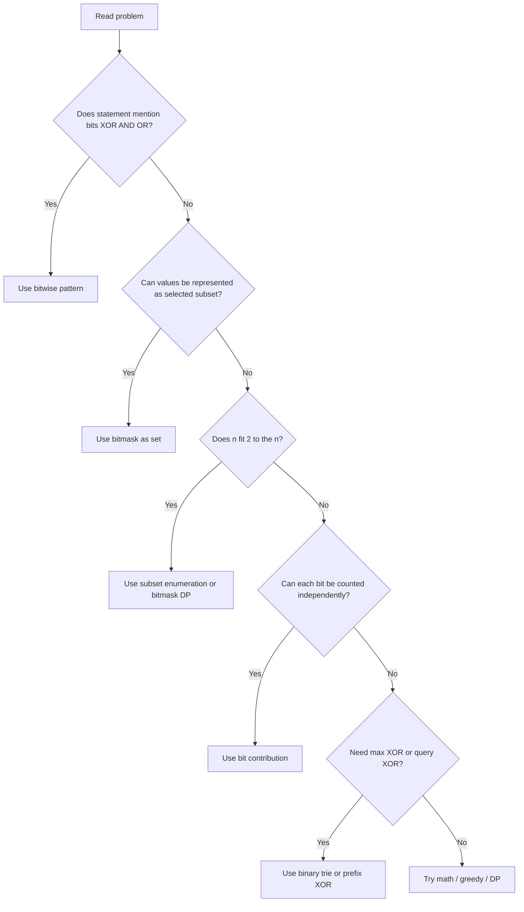
```mermaid
flowchart TD
    A["Read problem"] --> B{"Does statement mention bits XOR AND OR?"}
    B -->|Yes| C["Use bitwise pattern"]
    B -->|No| D{"Can values be represented as selected subset?"}
    D -->|Yes| E["Use bitmask as set"]
    D -->|No| F{"Does n fit 2 to the n?"}
    F -->|Yes| G["Use subset enumeration or bitmask DP"]
    F -->|No| H{"Can each bit be counted independently?"}
    H -->|Yes| I["Use bit contribution"]
    H -->|No| J{"Need max XOR or query XOR?"}
    J -->|Yes| K["Use binary trie or prefix XOR"]
    J -->|No| L["Try math / greedy / DP"]
```

## CM Thinking Flow

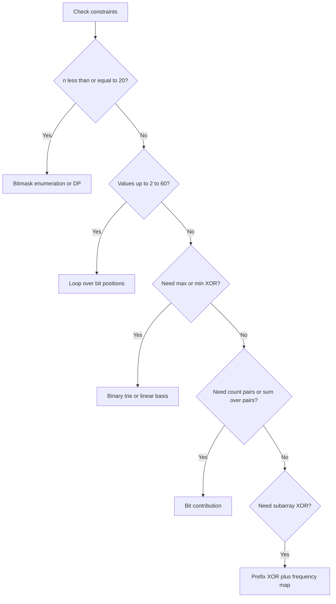
```mermaid
flowchart TD
    A["Check constraints"] --> B{"n less than or equal to 20?"}
    B -->|Yes| C["Bitmask enumeration or DP"]
    B -->|No| D{"Values up to 2 to 60?"}
    D -->|Yes| E["Loop over bit positions"]
    D -->|No| F{"Need max or min XOR?"}
    F -->|Yes| G["Binary trie or linear basis"]
    F -->|No| H{"Need count pairs or sum over pairs?"}
    H -->|Yes| I["Bit contribution"]
    H -->|No| J{"Need subarray XOR?"}
    J -->|Yes| K["Prefix XOR plus frequency map"]
```

## FAANG Thinking Flow

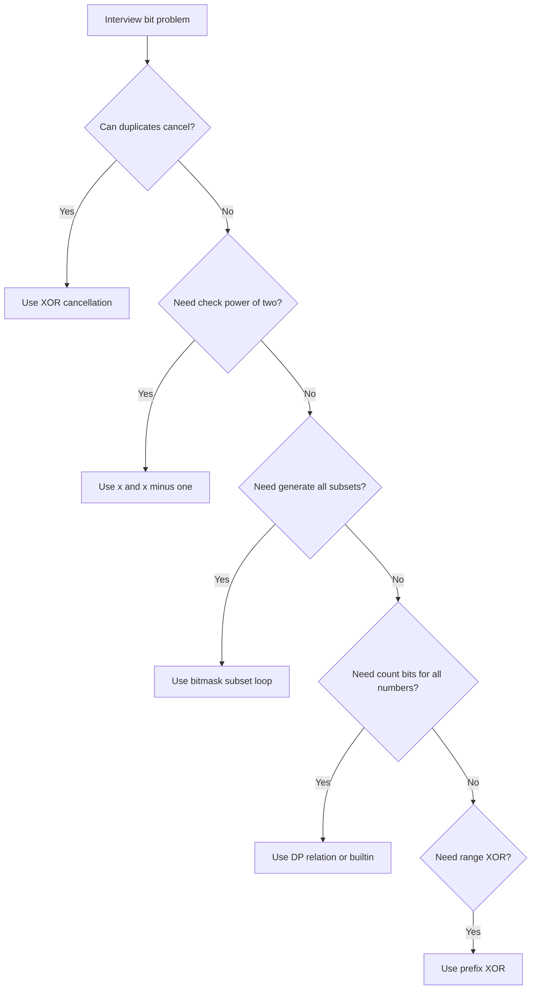
```mermaid
flowchart TD
    A["Interview bit problem"] --> B{"Can duplicates cancel?"}
    B -->|Yes| C["Use XOR cancellation"]
    B -->|No| D{"Need check power of two?"}
    D -->|Yes| E["Use x and x minus one"]
    D -->|No| F{"Need generate all subsets?"}
    F -->|Yes| G["Use bitmask subset loop"]
    F -->|No| H{"Need count bits for all numbers?"}
    H -->|Yes| I["Use DP relation or builtin"]
    H -->|No| J{"Need range XOR?"}
    J -->|Yes| K["Use prefix XOR"]
```

---

# 2. Difficulty Roadmap

| Level | Target | Must Master |
|---|---|---|
| Newbie | understand bit operations | binary, shifts, check/set/clear/toggle, power of two |
| Pupil | common XOR tricks | single number, missing number, subsets, prefix XOR |
| Specialist | contribution and greedy bits | pair XOR/AND/OR contribution, high-bit greedy |
| Expert | advanced structures | binary trie, submask enumeration, bitmask DP |
| Candidate Master | advanced CP bitwise | linear basis, SOS DP, digit-bit counting, XOR MST ideas |
| LC/FAANG | interview fluency | explain XOR cancellation, subset generation, prefix XOR, bit counts |

---

# 3. Master Pattern Map


```mermaid
flowchart TD
    A["Bitwise Problem"] --> B["Basic Bit Operations"]
    A --> C["XOR Patterns"]
    A --> D["Bitmask Sets"]
    A --> E["Bit Contribution"]
    A --> F["Greedy by Bits"]
    A --> G["Data Structures"]
    A --> H["DP Over Masks"]

    B --> B1["Check Set Clear Toggle"]
    B --> B2["Power of Two"]
    B --> B3["Count Bits"]

    C --> C1["XOR Cancellation"]
    C --> C2["Prefix XOR"]
    C --> C3["Range XOR"]

    D --> D1["Generate Subsets"]
    D --> D2["Submask Enumeration"]
    D --> D3["Permission or State Encoding"]

    E --> E1["Pair XOR Sum"]
    E --> E2["Pair AND Sum"]
    E --> E3["Pair OR Sum"]

    F --> F1["Max AND"]
    F --> F2["Max XOR"]
    F --> F3["Build Answer Bit by Bit"]

    G --> G1["Binary Trie"]
    G --> G2["Linear Basis"]

    H --> H1["Assignment DP"]
    H --> H2["TSP DP"]
    H --> H3["SOS DP"]
```

---

# 4. C++ Bitwise Template Pack

## 4.1 Basic Setup

```cpp
#include <bits/stdc++.h>
using namespace std;

using ll = long long;
```

## 4.2 Basic Bit Helpers

```cpp
bool isSet(long long x, int i) {
    return ((x >> i) & 1LL) != 0;
}

long long setBit(long long x, int i) {
    return x | (1LL << i);
}

long long clearBit(long long x, int i) {
    return x & ~(1LL << i);
}

long long toggleBit(long long x, int i) {
    return x ^ (1LL << i);
}

long long lowbit(long long x) {
    return x & -x;
}

bool isPowerOfTwo(long long x) {
    return x > 0 && (x & (x - 1)) == 0;
}
```

## 4.3 Count Bits

```cpp
int countBits(long long x) {
    return __builtin_popcountll(x);
}
```

## 4.4 Iterate Set Bits

```cpp
void iterateSetBits(long long mask) {
    while (mask > 0) {
        int bit = __builtin_ctzll(mask);
        // use bit
        mask &= (mask - 1);
    }
}
```

## 4.5 Submask Enumeration

```cpp
for (int sub = mask; sub > 0; sub = (sub - 1) & mask) {
    // sub is a non-empty submask of mask
}

// include zero if needed
for (int sub = mask; ; sub = (sub - 1) & mask) {
    // use sub
    if (sub == 0) break;
}
```

---

# 5. Form A: Basic Bit Operations

## Pattern

A mask isolates or modifies one bit.

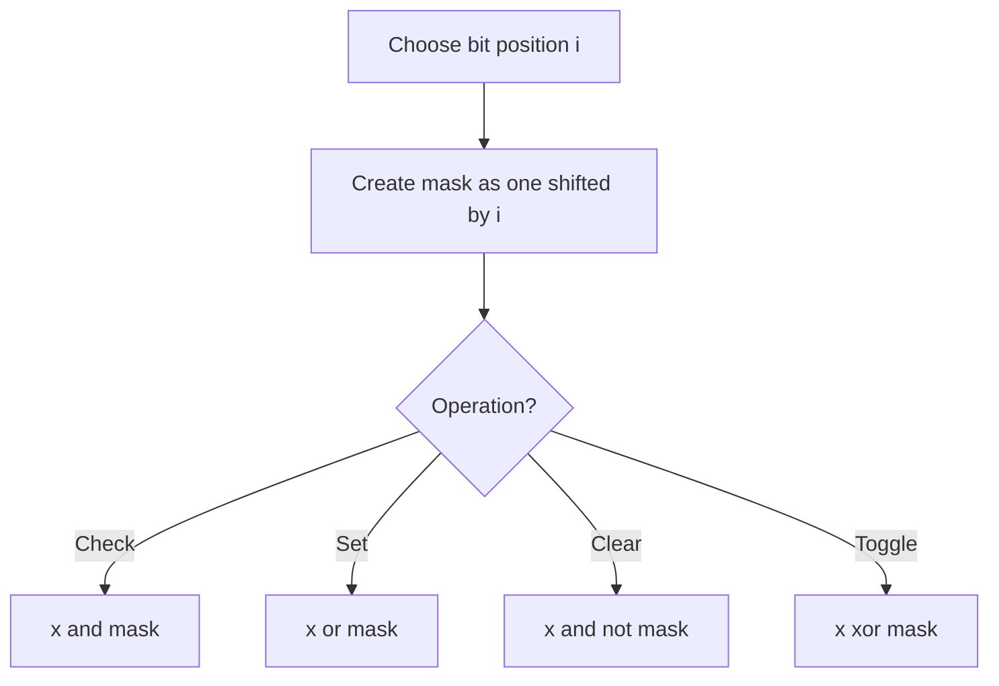
```mermaid
flowchart TD
    A["Choose bit position i"] --> B["Create mask as one shifted by i"]
    B --> C{"Operation?"}
    C -->|Check| D["x and mask"]
    C -->|Set| E["x or mask"]
    C -->|Clear| F["x and not mask"]
    C -->|Toggle| G["x xor mask"]
```

## Simulation

```text
x = 13 = 1101 binary
i = 2
mask = 0100

check: 1101 & 0100 = 0100 -> set
clear: 1101 & 1011 = 1001
toggle: 1101 ^ 0100 = 1001
set bit 1: 1101 | 0010 = 1111
```

## C++

```cpp
void demoBasicBits() {
    long long x = 13;

    cout << isSet(x, 2) << "\n";
    cout << setBit(x, 1) << "\n";
    cout << clearBit(x, 2) << "\n";
    cout << toggleBit(x, 2) << "\n";
}
```

---

# 6. Form B: Power of Two and Bit Counts

## B1. Power of Two

### Intuition

A power of two has exactly one set bit.

```text
8 = 1000
7 = 0111
8 & 7 = 0000
```

### Flowchart

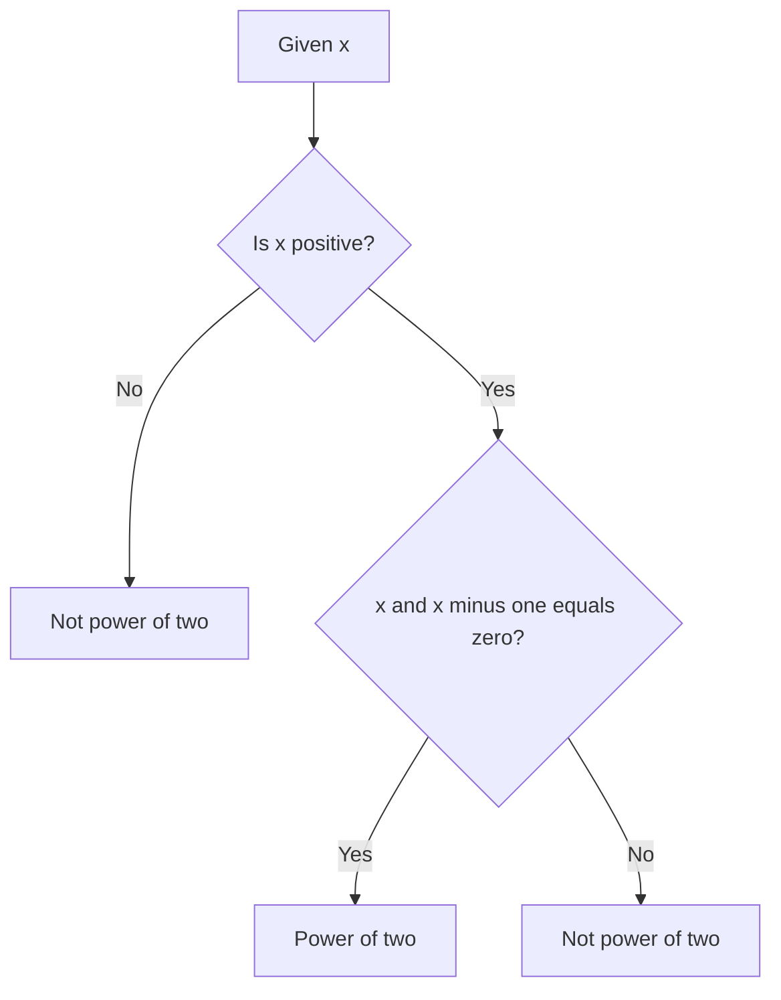
```mermaid
flowchart TD
    A["Given x"] --> B{"Is x positive?"}
    B -->|No| C["Not power of two"]
    B -->|Yes| D{"x and x minus one equals zero?"}
    D -->|Yes| E["Power of two"]
    D -->|No| F["Not power of two"]
```

### C++

```cpp
bool isPowerOfTwo(long long x) {
    return x > 0 && (x & (x - 1)) == 0;
}
```

---

## B2. Count Set Bits From 0 to N

### Intuition

Bits follow cycles.

For bit `b`, pattern length is `2^(b+1)`:

```text
bit 0: 0 1 0 1 0 1
bit 1: 0 0 1 1 0 0 1 1
bit 2: 0 0 0 0 1 1 1 1
```

### Flowchart

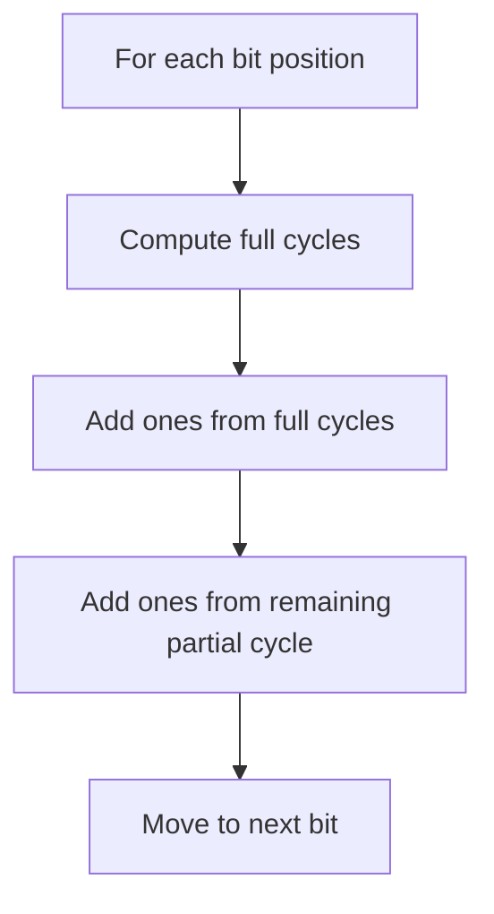
```mermaid
flowchart TD
    A["For each bit position"] --> B["Compute full cycles"]
    B --> C["Add ones from full cycles"]
    C --> D["Add ones from remaining partial cycle"]
    D --> E["Move to next bit"]
```

### C++

```cpp
long long countSetBitsFrom0ToN(long long n) {
    long long ans = 0;

    for (int b = 0; b < 63; b++) {
        long long len = 1LL << (b + 1);
        long long half = 1LL << b;

        if (b == 62) break;

        long long total = n + 1;
        long long fullCycles = total / len;
        long long rem = total % len;

        ans += fullCycles * half;
        ans += max(0LL, rem - half);
    }

    return ans;
}
```

---

# 7. Form C: XOR Cancellation

## Core Rules

```text
x xor x = 0
x xor 0 = x
xor is commutative and associative
```

## Pattern

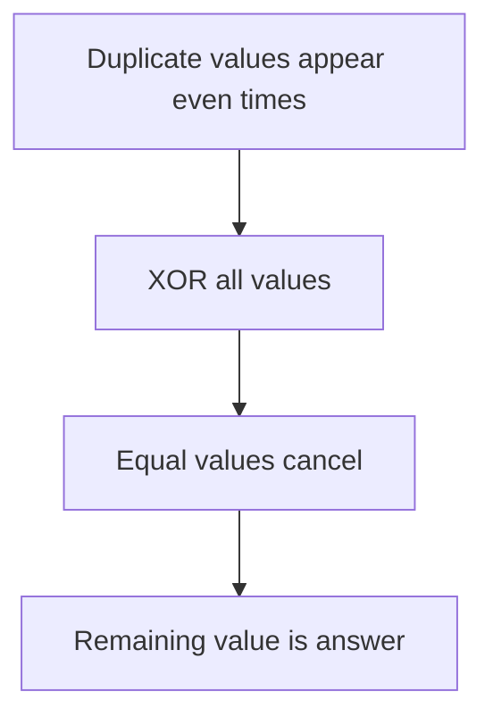
```mermaid
flowchart TD
    A["Duplicate values appear even times"] --> B["XOR all values"]
    B --> C["Equal values cancel"]
    C --> D["Remaining value is answer"]
```

## Simulation

```text
a = [4, 1, 2, 1, 2]

4 ^ 1 ^ 2 ^ 1 ^ 2
= 4 ^ (1 ^ 1) ^ (2 ^ 2)
= 4 ^ 0 ^ 0
= 4
```

## C++

```cpp
int singleNumber(vector<int>& nums) {
    int x = 0;

    for (int v : nums) {
        x ^= v;
    }

    return x;
}
```

## C2. Two Unique Numbers

### Intuition

If two numbers are unique, XOR all gives:

```text
xorAll = a xor b
```

Find one set bit in `xorAll`. That bit separates `a` and `b`.

### Flowchart

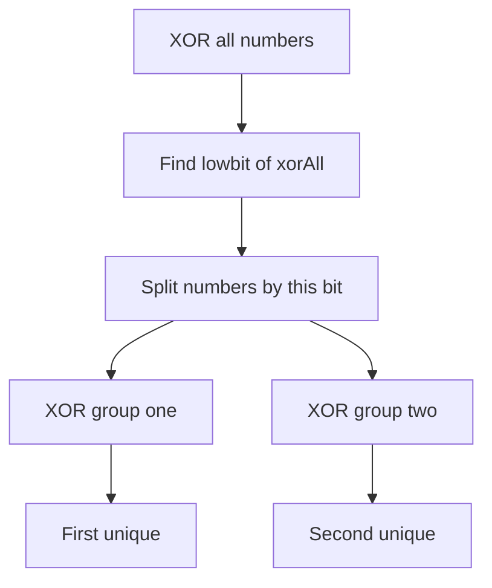
```mermaid
flowchart TD
    A["XOR all numbers"] --> B["Find lowbit of xorAll"]
    B --> C["Split numbers by this bit"]
    C --> D["XOR group one"]
    C --> E["XOR group two"]
    D --> F["First unique"]
    E --> G["Second unique"]
```

### C++

```cpp
vector<int> twoSingleNumbers(vector<int>& nums) {
    int xr = 0;
    for (int x : nums) xr ^= x;

    int bit = xr & -xr;
    int a = 0;
    int b = 0;

    for (int x : nums) {
        if (x & bit) a ^= x;
        else b ^= x;
    }

    return {a, b};
}
```

---

# 8. Form D: Bitmask as Set

## Pattern

A bitmask stores a subset.

```text
mask = 10110
bit 1 selected
bit 2 selected
bit 4 selected
```

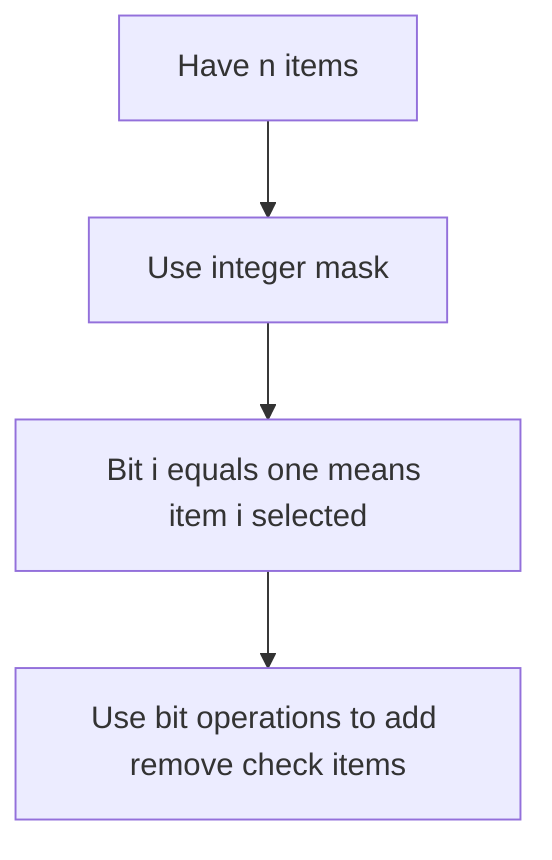
```mermaid
flowchart TD
    A["Have n items"] --> B["Use integer mask"]
    B --> C["Bit i equals one means item i selected"]
    C --> D["Use bit operations to add remove check items"]
```

## Operations

| Set Operation | Bitmask Code |
|---|---|
| contains item `i` | `(mask >> i) & 1` |
| add item `i` | `mask | (1 << i)` |
| remove item `i` | `mask & ~(1 << i)` |
| toggle item `i` | `mask ^ (1 << i)` |
| union | `a | b` |
| intersection | `a & b` |
| difference | `a & ~b` |

## C++

```cpp
bool contains(int mask, int i) {
    return (mask >> i) & 1;
}

int addItem(int mask, int i) {
    return mask | (1 << i);
}

int removeItem(int mask, int i) {
    return mask & ~(1 << i);
}
```

---

# 9. Form E: Subsets and Submasks

## E1. Generate All Subsets

### Simulation

For `n = 3`, masks from `0` to `7`:

```text
000 -> {}
001 -> {0}
010 -> {1}
011 -> {0,1}
100 -> {2}
101 -> {0,2}
110 -> {1,2}
111 -> {0,1,2}
```

### Flowchart

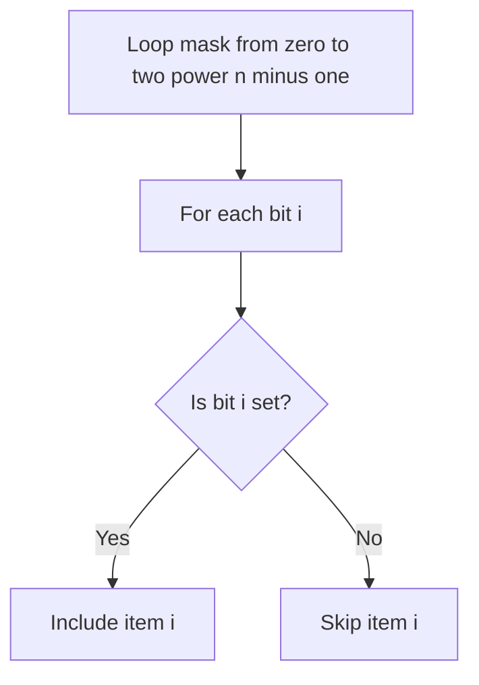
```mermaid
flowchart TD
    A["Loop mask from zero to two power n minus one"] --> B["For each bit i"]
    B --> C{"Is bit i set?"}
    C -->|Yes| D["Include item i"]
    C -->|No| E["Skip item i"]
```

### C++

```cpp
vector<vector<int>> subsets(vector<int>& nums) {
    int n = nums.size();
    vector<vector<int>> ans;

    for (int mask = 0; mask < (1 << n); mask++) {
        vector<int> cur;

        for (int i = 0; i < n; i++) {
            if ((mask >> i) & 1) {
                cur.push_back(nums[i]);
            }
        }

        ans.push_back(cur);
    }

    return ans;
}
```

---

## E2. Enumerate Submasks

### Use When

- DP over subsets
- split a set into two parts
- SOS DP
- iterate all valid subsets of a given mask

### Flowchart

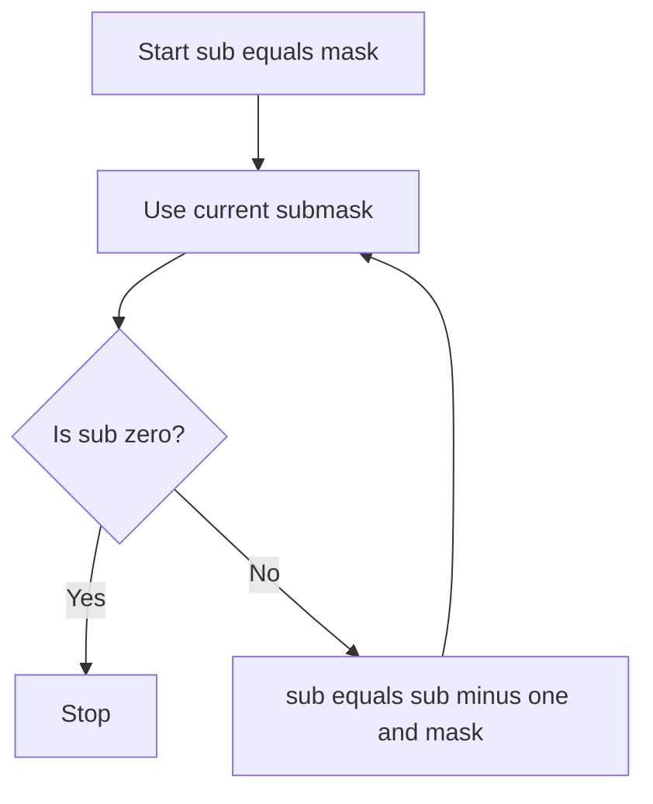
```mermaid
flowchart TD
    A["Start sub equals mask"] --> B["Use current submask"]
    B --> C{"Is sub zero?"}
    C -->|Yes| D["Stop"]
    C -->|No| E["sub equals sub minus one and mask"]
    E --> B
```

### C++

```cpp
void enumerateSubmasks(int mask) {
    for (int sub = mask; sub > 0; sub = (sub - 1) & mask) {
        // use sub
    }
}
```

---

# 10. Form F: Prefix XOR

## Pattern

Same as prefix sum, but operation is XOR.

```text
px[0] = 0
px[i + 1] = px[i] xor a[i]
xor(l, r) = px[r + 1] xor px[l]
```

## Flowchart

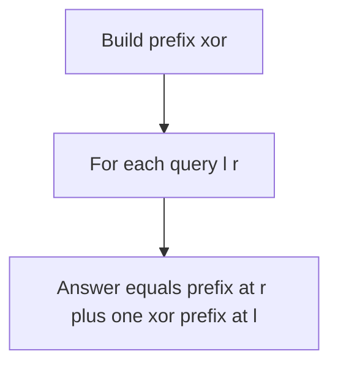
```mermaid
flowchart TD
    A["Build prefix xor"] --> B["For each query l r"]
    B --> C["Answer equals prefix at r plus one xor prefix at l"]
```

## F1. Range XOR Query

```cpp
vector<int> buildPrefixXor(vector<int>& a) {
    int n = a.size();
    vector<int> px(n + 1, 0);

    for (int i = 0; i < n; i++) {
        px[i + 1] = px[i] ^ a[i];
    }

    return px;
}

int rangeXor(vector<int>& px, int l, int r) {
    return px[r + 1] ^ px[l];
}
```

## F2. Count Subarrays With XOR K

### Intuition

Need:

```text
prefixRight xor prefixLeft = K
prefixLeft = prefixRight xor K
```

### Flowchart

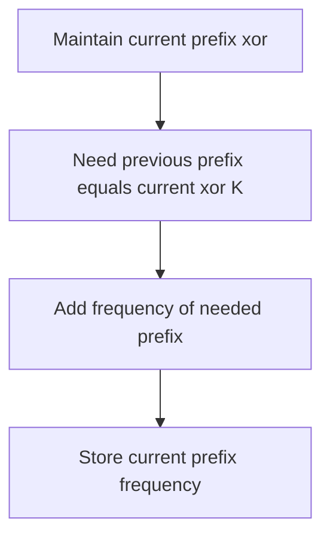
```mermaid
flowchart TD
    A["Maintain current prefix xor"] --> B["Need previous prefix equals current xor K"]
    B --> C["Add frequency of needed prefix"]
    C --> D["Store current prefix frequency"]
```

### C++

```cpp
long long countSubarraysXorK(vector<int>& a, int k) {
    unordered_map<int, long long> freq;
    freq[0] = 1;

    int xr = 0;
    long long ans = 0;

    for (int x : a) {
        xr ^= x;
        ans += freq[xr ^ k];
        freq[xr]++;
    }

    return ans;
}
```

---

# 11. Form G: Bit Contribution

## Pattern

Count contribution bit-by-bit instead of pair-by-pair.

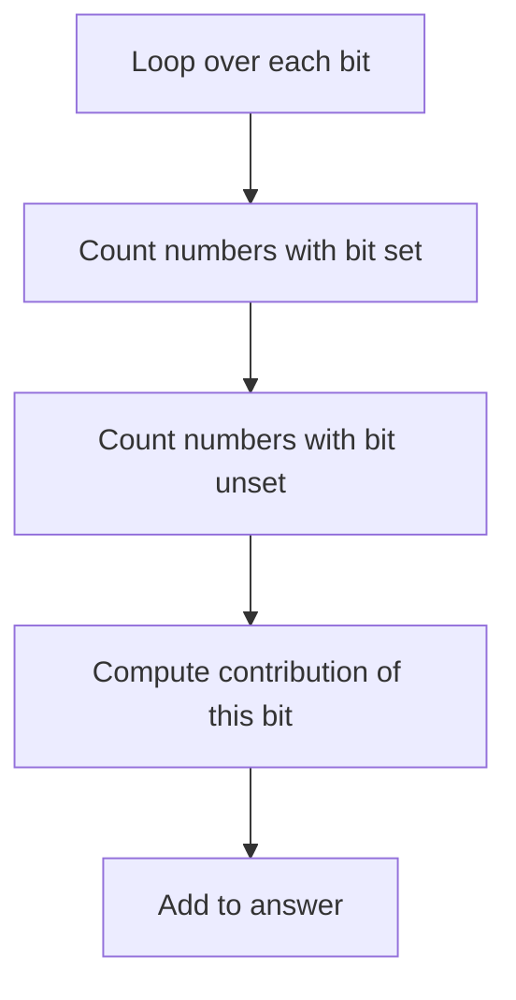
```mermaid
flowchart TD
    A["Loop over each bit"] --> B["Count numbers with bit set"]
    B --> C["Count numbers with bit unset"]
    C --> D["Compute contribution of this bit"]
    D --> E["Add to answer"]
```

## G1. Sum of Pair XOR

### Intuition

For a bit to contribute to XOR, one number must have `0` and the other must have `1`.

```text
pairs contributing at bit b = countOne * countZero
value contributed = pairs * 2^b
```

### C++

```cpp
long long sumPairXor(vector<int>& a) {
    int n = a.size();
    long long ans = 0;

    for (int b = 0; b < 31; b++) {
        long long ones = 0;

        for (int x : a) {
            if ((x >> b) & 1) ones++;
        }

        long long zeros = n - ones;
        ans += ones * zeros * (1LL << b);
    }

    return ans;
}
```

## G2. Sum of Pair AND

### Intuition

For a bit to contribute to AND, both numbers must have `1`.

```text
C(countOne, 2) * 2^b
```

### C++

```cpp
long long sumPairAnd(vector<int>& a) {
    long long ans = 0;

    for (int b = 0; b < 31; b++) {
        long long ones = 0;

        for (int x : a) {
            if ((x >> b) & 1) ones++;
        }

        ans += ones * (ones - 1) / 2 * (1LL << b);
    }

    return ans;
}
```

## G3. Sum of Pair OR

### Intuition

For OR, bit contributes unless both numbers have `0`.

```text
total pairs - pairs both zero
```

### C++

```cpp
long long sumPairOr(vector<int>& a) {
    int n = a.size();
    long long totalPairs = 1LL * n * (n - 1) / 2;
    long long ans = 0;

    for (int b = 0; b < 31; b++) {
        long long ones = 0;

        for (int x : a) {
            if ((x >> b) & 1) ones++;
        }

        long long zeros = n - ones;
        long long contributingPairs = totalPairs - zeros * (zeros - 1) / 2;
        ans += contributingPairs * (1LL << b);
    }

    return ans;
}
```

---

# 12. Form H: Cyclic Bit Counting

## Pattern

Bits repeat in cycles.

| Bit | Pattern |
|---:|---|
| 0 | `0 1 0 1` |
| 1 | `0 0 1 1` |
| 2 | `0 0 0 0 1 1 1 1` |

## Flowchart

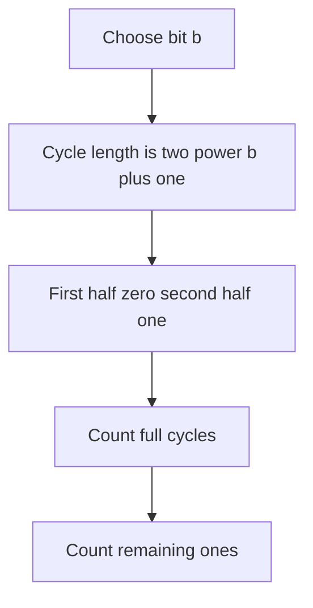
```mermaid
flowchart TD
    A["Choose bit b"] --> B["Cycle length is two power b plus one"]
    B --> C["First half zero second half one"]
    C --> D["Count full cycles"]
    D --> E["Count remaining ones"]
```

## C++

```cpp
long long countOnesAtBitFrom0ToN(long long n, int b) {
    long long total = n + 1;
    long long half = 1LL << b;
    long long cycle = 1LL << (b + 1);

    long long full = total / cycle;
    long long rem = total % cycle;

    return full * half + max(0LL, rem - half);
}
```

---

# 13. Form I: Greedy High Bit to Low Bit

## Pattern

Higher bits dominate lower bits. Build answer from MSB to LSB.

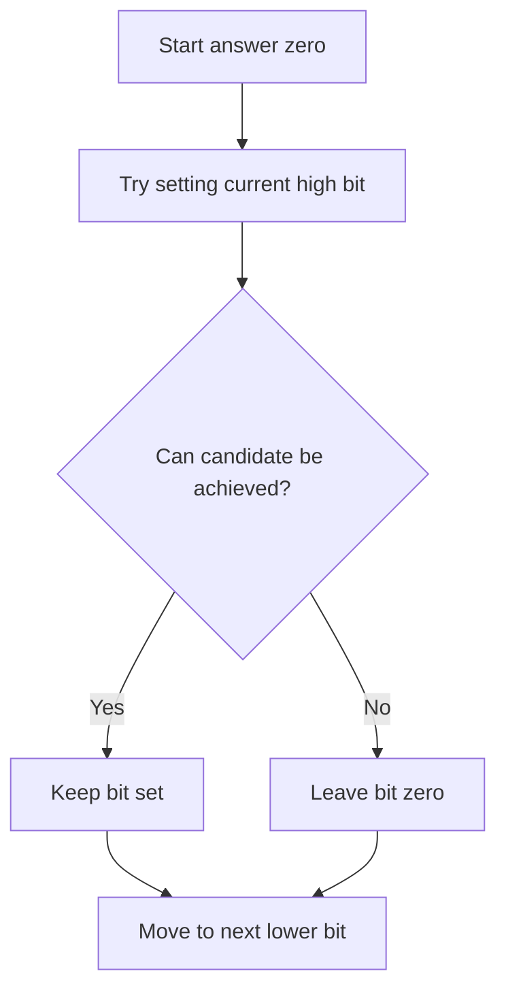
```mermaid
flowchart TD
    A["Start answer zero"] --> B["Try setting current high bit"]
    B --> C{"Can candidate be achieved?"}
    C -->|Yes| D["Keep bit set"]
    C -->|No| E["Leave bit zero"]
    D --> F["Move to next lower bit"]
    E --> F
```

## I1. Maximum AND of Any Pair

### Intuition

To maximize AND, try to keep as many numbers as possible that contain the candidate bits.

### C++

```cpp
int maxAndPair(vector<int>& a) {
    int ans = 0;

    for (int b = 30; b >= 0; b--) {
        int candidate = ans | (1 << b);
        int count = 0;

        for (int x : a) {
            if ((x & candidate) == candidate) {
                count++;
            }
        }

        if (count >= 2) ans = candidate;
    }

    return ans;
}
```

---

# 14. Form J: Binary Trie for XOR

## Use When

- maximum XOR pair
- maximum XOR with queries
- count XOR less than K
- online insert + query

## Flowchart

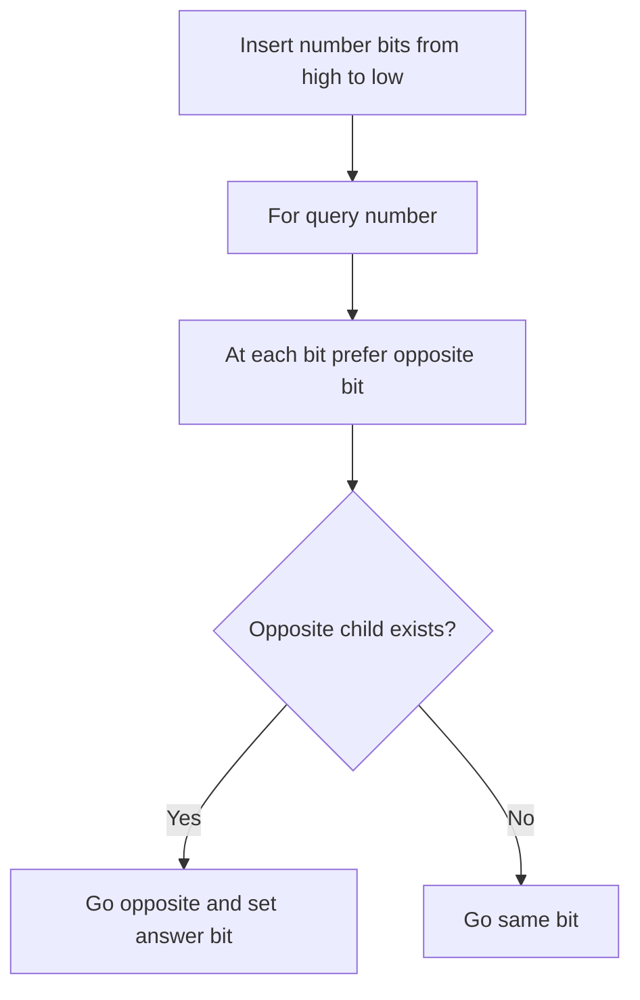
```mermaid
flowchart TD
    A["Insert number bits from high to low"] --> B["For query number"]
    B --> C["At each bit prefer opposite bit"]
    C --> D{"Opposite child exists?"}
    D -->|Yes| E["Go opposite and set answer bit"]
    D -->|No| F["Go same bit"]
```

## C++

```cpp
struct BinaryTrie {
    struct Node {
        int child[2];

        Node() {
            child[0] = child[1] = -1;
        }
    };

    vector<Node> trie;

    BinaryTrie() {
        trie.push_back(Node());
    }

    void insert(int x) {
        int node = 0;

        for (int b = 30; b >= 0; b--) {
            int bit = (x >> b) & 1;

            if (trie[node].child[bit] == -1) {
                trie[node].child[bit] = trie.size();
                trie.push_back(Node());
            }

            node = trie[node].child[bit];
        }
    }

    int maxXor(int x) {
        int node = 0;
        int ans = 0;

        for (int b = 30; b >= 0; b--) {
            int bit = (x >> b) & 1;
            int want = bit ^ 1;

            if (trie[node].child[want] != -1) {
                ans |= (1 << b);
                node = trie[node].child[want];
            } else {
                node = trie[node].child[bit];
            }
        }

        return ans;
    }
};

int findMaximumXOR(vector<int>& nums) {
    BinaryTrie bt;

    for (int x : nums) {
        bt.insert(x);
    }

    int best = 0;
    for (int x : nums) {
        best = max(best, bt.maxXor(x));
    }

    return best;
}
```

---

# 15. Form K: Bitmask DP

## Pattern

State is a subset.

```text
dp[mask] = best answer after using items represented by mask
```

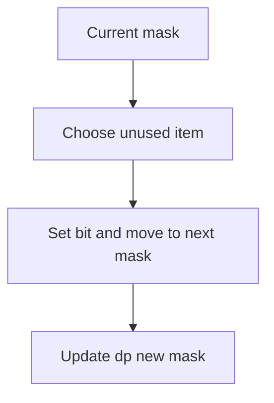
```mermaid
flowchart TD
    A["Current mask"] --> B["Choose unused item"]
    B --> C["Set bit and move to next mask"]
    C --> D["Update dp new mask"]
```

## K1. Assignment DP

### Problem Form

Assign `n` workers to `n` jobs with min/max cost.

### C++

```cpp
int assignmentMinCost(vector<vector<int>>& cost) {
    int n = cost.size();
    int total = 1 << n;
    const int INF = 1e9;

    vector<int> dp(total, INF);
    dp[0] = 0;

    for (int mask = 0; mask < total; mask++) {
        int worker = __builtin_popcount((unsigned)mask);

        if (worker >= n) continue;

        for (int job = 0; job < n; job++) {
            if (((mask >> job) & 1) == 0) {
                int newMask = mask | (1 << job);
                dp[newMask] = min(dp[newMask], dp[mask] + cost[worker][job]);
            }
        }
    }

    return dp[total - 1];
}
```

---

# 16. Form L: Operation Decoding and Invariants

## Pattern

Some operations preserve bit properties.

Examples:

| Operation | Possible Invariant |
|---|---|
| XOR all by x | pairwise XOR unchanged? |
| add/remove pairs | parity of frequency |
| split/merge bits | total set-bit count |
| OR operations | bits only turn on |
| AND operations | bits only turn off |
| XOR operations | parity flips |

## Flowchart

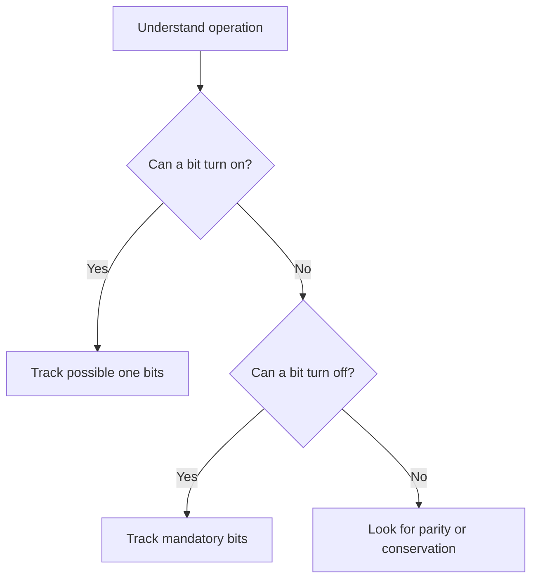
```mermaid
flowchart TD
    A["Understand operation"] --> B{"Can a bit turn on?"}
    B -->|Yes| C["Track possible one bits"]
    B -->|No| D{"Can a bit turn off?"}
    D -->|Yes| E["Track mandatory bits"]
    D -->|No| F["Look for parity or conservation"]
```

---

# 17. LC/FAANG Pattern Table

| Pattern | Recognition Signal | Tactic | Example Problems |
|---|---|---|---|
| one unique number | duplicates appear twice | XOR all | Single Number |
| two unique numbers | exactly two singles | split by lowbit | Single Number III |
| missing number | range `0..n` | XOR index and value | Missing Number |
| power of two | one set bit | `x & (x-1)` | Power of Two |
| count bits | bits for every number | DP relation | Counting Bits |
| reverse bits | bit manipulation | shift answer | Reverse Bits |
| hamming distance | differing bits | XOR then popcount | Hamming Distance |
| subsets | all combinations | bitmask enumeration | Subsets |
| range XOR | repeated XOR queries | prefix XOR | XOR Queries |
| max XOR | maximize pair XOR | trie or greedy set | Maximum XOR of Two Numbers |
| bitwise AND range | common prefix | shift until equal | Bitwise AND of Numbers Range |
| UTF validation | inspect leading bits | masks | UTF-8 Validation |

---

# 18. Candidate Master Escalation Patterns

| CM Pattern | Basic Version | Advanced Version | Tactic |
|---|---|---|---|
| XOR cancellation | single number | parity grouping | XOR by groups |
| prefix XOR | range XOR | count subarrays XOR K | prefix frequency |
| max XOR pair | brute pair | binary trie | opposite-bit greedy |
| max subset XOR | try all subsets | linear basis | Gaussian elimination over XOR |
| subset enumeration | all masks | submask DP | `(sub-1)&mask` |
| bit contribution | pair XOR sum | subarray bit contribution | count set/unset |
| bitmask DP | assignment | TSP / Hamiltonian paths | DP over masks |
| SOS DP | subset loops | sum over all submasks | DP over bits |
| OR/AND constraints | direct search | high-bit feasibility | greedy candidate |
| cyclic bit count | brute count | formula per bit | cycle decomposition |

---

# 19. Difficulty-Sorted Problem Set

---

## 19.1 Newbie Problems

| # | Problem | Platform | Link | Form | Pattern | Tactic | Intuition | Implementation |
|---:|---|---|---|---|---|---|---|---|
| 1 | Power of Two | LeetCode | https://leetcode.com/problems/power-of-two/ | bit count | one set bit | `x & x-1` | power of two has only one one-bit | helper |
| 2 | Number of 1 Bits | LeetCode | https://leetcode.com/problems/number-of-1-bits/ | count bits | popcount | builtin or loop | count set bits | `__builtin_popcount` |
| 3 | Hamming Distance | LeetCode | https://leetcode.com/problems/hamming-distance/ | XOR diff | differing bits | XOR then count | XOR marks different positions | popcount |
| 4 | Single Number | LeetCode | https://leetcode.com/problems/single-number/ | XOR cancellation | duplicate cancel | XOR all | pairs vanish | loop |
| 5 | Missing Number | LeetCode | https://leetcode.com/problems/missing-number/ | XOR cancellation | index xor value | XOR all indices and nums | equal values cancel | loop |
| 6 | Add Binary | LeetCode | https://leetcode.com/problems/add-binary/ | binary simulation | carry | process from right | same as decimal addition | string |
| 7 | Reverse Bits | LeetCode | https://leetcode.com/problems/reverse-bits/ | bit simulation | shift answer | move bits one by one | build reversed binary | loop 32 |
| 8 | Complement of Base 10 Integer | LeetCode | https://leetcode.com/problems/complement-of-base-10-integer/ | mask | flip active bits | create all-one mask | complement only significant bits | mask |
| 9 | Binary Number with Alternating Bits | LeetCode | https://leetcode.com/problems/binary-number-with-alternating-bits/ | bit pattern | compare adjacent | shift xor | alternating means xor with shifted all ones | trick |
| 10 | Convert a Number to Hexadecimal | LeetCode | https://leetcode.com/problems/convert-a-number-to-hexadecimal/ | base conversion | four-bit chunks | mask with 15 | hex digit is 4 bits | loop |

### Newbie Flow

```mermaid
flowchart TD
    A["Newbie bit problem"] --> B{"Need count ones?"}
    B -->|Yes| C["Use popcount"]
    B -->|No| D{"Duplicates cancel?"}
    D -->|Yes| E["Use XOR"]
    D -->|No| F{"Need one bit operation?"}
    F -->|Yes| G["Create mask with shift"]
```

---

## 19.2 Easy to Medium Problems

| # | Problem | Platform | Link | Form | Pattern | Tactic | Intuition | Implementation |
|---:|---|---|---|---|---|---|---|---|
| 1 | Counting Bits | LeetCode | https://leetcode.com/problems/counting-bits/ | bit DP | remove lowbit | `dp[i]=dp[i>>1]+bit` | reuse smaller number | DP |
| 2 | Sum of Two Integers | LeetCode | https://leetcode.com/problems/sum-of-two-integers/ | bit addition | carry via AND | xor sum, and carry | binary addition without plus | loop |
| 3 | Single Number II | LeetCode | https://leetcode.com/problems/single-number-ii/ | bit count mod | count each bit | mod 3 | repeated numbers contribute multiples of 3 | bit loop |
| 4 | Single Number III | LeetCode | https://leetcode.com/problems/single-number-iii/ | XOR split | lowbit partition | split groups | unique numbers differ in one bit | two XORs |
| 5 | Subsets | LeetCode | https://leetcode.com/problems/subsets/ | bitmask set | all masks | include set bits | every mask is a subset | mask loop |
| 6 | Subsets II | LeetCode | https://leetcode.com/problems/subsets-ii/ | subsets duplicate | sort/backtrack better | skip duplicates | bitmask needs duplicate handling | backtrack |
| 7 | Bitwise AND of Numbers Range | LeetCode | https://leetcode.com/problems/bitwise-and-of-numbers-range/ | common prefix | shift until equal | remove changing suffix | AND keeps common high prefix | shift |
| 8 | XOR Queries of a Subarray | LeetCode | https://leetcode.com/problems/xor-queries-of-a-subarray/ | prefix XOR | range XOR | prefix difference | XOR cancels middle | prefix |
| 9 | Decode XORed Array | LeetCode | https://leetcode.com/problems/decode-xored-array/ | XOR inverse | `a xor b = encoded` | recover next | XOR is reversible | loop |
| 10 | Minimum Flips to Make a OR b Equal to c | LeetCode | https://leetcode.com/problems/minimum-flips-to-make-a-or-b-equal-to-c/ | bit inspection | per-bit cases | count flips | each bit independent | loop |
| 11 | Find the Difference | LeetCode | https://leetcode.com/problems/find-the-difference/ | XOR cancellation | extra char | XOR all chars | common chars cancel | loop |
| 12 | Prime Number of Set Bits | LeetCode | https://leetcode.com/problems/prime-number-of-set-bits-in-binary-representation/ | popcount | prime lookup | count bits | max bits small | set |
| 13 | Sort Integers by Number of 1 Bits | LeetCode | https://leetcode.com/problems/sort-integers-by-the-number-of-1-bits/ | popcount sort | custom comparator | sort by count then value | derived key | sort |
| 14 | Maximum Product of Word Lengths | LeetCode | https://leetcode.com/problems/maximum-product-of-word-lengths/ | bitmask letters | intersection check | word mask | no common letters if mask AND zero | masks |
| 15 | UTF-8 Validation | LeetCode | https://leetcode.com/problems/utf-8-validation/ | masks | leading bits | validate byte form | UTF pattern encoded by high bits | bit checks |

### Easy-Medium Flow

```mermaid
flowchart TD
    A["Easy medium bit problem"] --> B{"Range XOR query?"}
    B -->|Yes| C["Prefix XOR"]
    B -->|No| D{"Repeated numbers with special frequency?"}
    D -->|Yes| E["Bit count modulo frequency"]
    D -->|No| F{"Set of letters or items?"}
    F -->|Yes| G["Bitmask as set"]
    F -->|No| H{"Per bit independent?"}
    H -->|Yes| I["Loop over bits"]
```

---

## 19.3 Medium Problems

| # | Problem | Platform | Link | Form | Pattern | Tactic | Intuition | Implementation |
|---:|---|---|---|---|---|---|---|---|
| 1 | Maximum XOR of Two Numbers in an Array | LeetCode | https://leetcode.com/problems/maximum-xor-of-two-numbers-in-an-array/ | max XOR | binary trie / greedy set | choose opposite bit | higher XOR bit dominates | trie |
| 2 | Maximum XOR for Each Query | LeetCode | https://leetcode.com/problems/maximum-xor-for-each-query/ | XOR mask | complement under bit limit | prefix XOR | best k is xor with all ones | loop |
| 3 | Count Triplets That Can Form Two Arrays of Equal XOR | LeetCode | https://leetcode.com/problems/count-triplets-that-can-form-two-arrays-of-equal-xor/ | prefix XOR | equal prefix | count intervals | xor i..k zero creates choices | prefix |
| 4 | Bitwise ORs of Subarrays | LeetCode | https://leetcode.com/problems/bitwise-ors-of-subarrays/ | OR states | compress current ORs | set of OR values | OR only gains bits so states limited | set |
| 5 | Minimum Number of Flips to Convert Binary Matrix to Zero Matrix | LeetCode | https://leetcode.com/problems/minimum-number-of-flips-to-convert-binary-matrix-to-zero-matrix/ | bitmask BFS | state graph | flip transitions | matrix state fits bitmask | BFS |
| 6 | Smallest Sufficient Team | LeetCode | https://leetcode.com/problems/smallest-sufficient-team/ | bitmask DP | skills mask | min team for mask | people cover skill bits | DP |
| 7 | Maximum Product of the Length of Two Palindromic Subsequences | LeetCode | https://leetcode.com/problems/maximum-product-of-the-length-of-two-palindromic-subsequences/ | subset masks | disjoint masks | precompute palindrome masks | disjoint subsets via AND zero | masks |
| 8 | Beautiful Arrangement | LeetCode | https://leetcode.com/problems/beautiful-arrangement/ | bitmask DP | assignment | choose unused number | position and mask define state | memo |
| 9 | Partition to K Equal Sum Subsets | LeetCode | https://leetcode.com/problems/partition-to-k-equal-sum-subsets/ | bitmask DP/backtrack | subset fill | used mask | choose elements into buckets | memo |
| 10 | Maximum Compatibility Score Sum | LeetCode | https://leetcode.com/problems/maximum-compatibility-score-sum/ | assignment DP | bitmask matching | assign mentors | mask stores used mentors | DP |
| 11 | Count Number of Maximum Bitwise OR Subsets | LeetCode | https://leetcode.com/problems/count-number-of-maximum-bitwise-or-subsets/ | subsets | enumerate OR | count target OR | OR accumulates selected bits | DFS/mask |
| 12 | Find Kth Bit in Nth Binary String | LeetCode | https://leetcode.com/problems/find-kth-bit-in-nth-binary-string/ | recursion bits | symmetry | invert around middle | string has recursive mirror | recursion |
| 13 | Circular Permutation in Binary Representation | LeetCode | https://leetcode.com/problems/circular-permutation-in-binary-representation/ | gray code | xor with shifted | rotate sequence | adjacent values differ one bit | formula |
| 14 | Gray Code | LeetCode | https://leetcode.com/problems/gray-code/ | gray code | `i xor i shifted` | construct sequence | adjacent masks differ one bit | loop |
| 15 | Minimum One Bit Operations to Make Integers Zero | LeetCode | https://leetcode.com/problems/minimum-one-bit-operations-to-make-integers-zero/ | gray code inverse | recursive/gray | transform relation | operation order follows gray code | recursion |

### Medium Logic Flow

```mermaid
flowchart TD
    A["Medium bit problem"] --> B{"Need max XOR?"}
    B -->|Yes| C["Binary trie or greedy prefixes"]
    B -->|No| D{"Small n subset state?"}
    D -->|Yes| E["Bitmask DP"]
    D -->|No| F{"Subarray XOR or OR?"}
    F -->|XOR| G["Prefix XOR"]
    F -->|OR| H["Compressed OR state set"]
    F -->|No| I{"Matrix or grid state small?"}
    I -->|Yes| J["Bitmask BFS"]
```

---

## 19.4 Hard / FAANG-Hard Problems

| # | Problem | Platform | Link | Form | Pattern | Tactic | Intuition | Implementation |
|---:|---|---|---|---|---|---|---|---|
| 1 | Maximum Genetic Difference Query | LeetCode | https://leetcode.com/problems/maximum-genetic-difference-query/ | trie on tree | online insert/remove | DFS path trie | query max XOR with ancestors | trie + DFS |
| 2 | Count Pairs With XOR in a Range | LeetCode | https://leetcode.com/problems/count-pairs-with-xor-in-a-range/ | trie counting | count less than K | bitwise trie counts | answer high minus low minus one | trie |
| 3 | Minimum XOR Sum of Two Arrays | LeetCode | https://leetcode.com/problems/minimum-xor-sum-of-two-arrays/ | bitmask DP | assignment | pair each index | mask stores used nums2 | DP |
| 4 | Shortest Path Visiting All Nodes | LeetCode | https://leetcode.com/problems/shortest-path-visiting-all-nodes/ | graph + bitmask | BFS state | node plus visited mask | shortest over state graph | BFS |
| 5 | Number of Ways to Wear Different Hats to Each Other | LeetCode | https://leetcode.com/problems/number-of-ways-to-wear-different-hats-to-each-other/ | bitmask DP | assign hats to people | DP by hats | people small, hats many | DP |
| 6 | Maximize Grid Happiness | LeetCode | https://leetcode.com/problems/maximize-grid-happiness/ | profile DP | row mask states | transition rows | grid width small | DP |
| 7 | Find XOR Sum of All Pairs Bitwise AND | LeetCode | https://leetcode.com/problems/find-xor-sum-of-all-pairs-bitwise-and/ | algebraic bits | distributive identity | `(xor arr1) AND (xor arr2)` | XOR over all pair AND factors | formula |
| 8 | Maximum Students Taking Exam | LeetCode | https://leetcode.com/problems/maximum-students-taking-exam/ | profile DP | row masks | valid row compatibility | no adjacent cheating | DP masks |
| 9 | Parallel Courses II | LeetCode | https://leetcode.com/problems/parallel-courses-ii/ | bitmask DP | prerequisites masks | choose subset of available | state is completed courses | DP |
| 10 | Can I Win | LeetCode | https://leetcode.com/problems/can-i-win/ | game bitmask DP | minimax with mask | used numbers state | winning if opponent loses | memo |

### Hard Flow

```mermaid
flowchart TD
    A["Hard bit problem"] --> B{"Tree path XOR queries?"}
    B -->|Yes| C["DFS with insert remove trie"]
    B -->|No| D{"Count pairs by XOR range?"}
    D -->|Yes| E["Trie count less than K"]
    D -->|No| F{"State includes visited subset?"}
    F -->|Yes| G["Bitmask BFS or DP"]
    F -->|No| H{"Grid width small?"}
    H -->|Yes| I["Profile DP with masks"]
```

---

## 19.5 Candidate Master / CP Escalation Problems

| # | Problem | Platform | Link | Form | Pattern | Tactic | Intuition | Implementation |
|---:|---|---|---|---|---|---|---|---|
| 1 | XOR Queries | CSES | https://cses.fi/problemset/task/1650 | prefix XOR | range query | prefix xor | range XOR by cancellation | prefix |
| 2 | Subarray XOR Queries | CSES | https://cses.fi/problemset/task/1650 | prefix XOR | static query | prefix array | same as range XOR | prefix |
| 3 | Hamiltonian Flights | CSES | https://cses.fi/problemset/task/1690 | bitmask DP | paths over subsets | DP mask node | count paths visiting subset | DP |
| 4 | Elevator Rides | CSES | https://cses.fi/problemset/task/1653 | bitmask DP | optimize rides | pair rides weight | subset state stores best pair | DP |
| 5 | Codeforces Xor of 3 | Codeforces | https://codeforces.com/problemset/problem/1572/B | XOR invariant | operation decoding | parity/invariant | operations preserve XOR relation | constructive |
| 6 | Codeforces Prefix Flip | Codeforces | https://codeforces.com/problemset/problem/1381/A1 | bit operations | lazy flip direction | simulate ends | avoid actual full flips | deque logic |
| 7 | Codeforces And Matching | Codeforces | https://codeforces.com/problemset/problem/1631/C | AND construction | pairing by bits | handle special k | construct pairs with target AND | constructive |
| 8 | Codeforces Bitwise Formula | Codeforces | https://codeforces.com/problemset/problem/778/B | bit expression | per-bit evaluation | evaluate zero/one variable | each bit independent | simulation |
| 9 | Codeforces Vasya and a Tree | Codeforces | https://codeforces.com/problemset/problem/1076/E | bit not core | tree contrast | not bitwise | included as avoid false match | tree |
| 10 | AtCoder ABC 147 D Xor Sum 4 | AtCoder | https://atcoder.jp/contests/abc147/tasks/abc147_d | pair XOR sum | bit contribution | count ones zeros | each bit independent | contribution |
| 11 | AtCoder ABC 117 D XXOR | AtCoder | https://atcoder.jp/contests/abc117/tasks/abc117_d | greedy bit DP | maximize sum xor | digit DP under K | choose X bits with limit | bit DP |
| 12 | AtCoder ABC 281 F Xor Minimization | AtCoder | https://atcoder.jp/contests/abc281/tasks/abc281_f | recursive bits | divide by high bit | minimize max XOR | split by current bit | recursion |
| 13 | AtCoder DP O Matching | AtCoder | https://atcoder.jp/contests/dp/tasks/dp_o | bitmask DP | assignment count | DP mask | assigned men count is popcount | DP |
| 14 | AtCoder DP U Grouping | AtCoder | https://atcoder.jp/contests/dp/tasks/dp_u | submask DP | group partition | enumerate submasks | split set into groups | DP |
| 15 | SPOJ XOR Maximization | SPOJ | https://www.spoj.com/problems/XMAX/ | linear basis | max subset XOR | insert basis vector | XOR Gaussian elimination | basis |
| 16 | Codeforces The Child and Sequence | Codeforces | https://codeforces.com/problemset/problem/438/D | segment tree + modulo | not pure bit | range update contrast | know when not bitwise | segtree |
| 17 | Codeforces Interesting Array | Codeforces | https://codeforces.com/problemset/problem/482/B | AND constraints | bit/range | difference per bit or segtree | constraints per bit | segtree |
| 18 | Codeforces Powerful Array | Codeforces | https://codeforces.com/problemset/problem/86/D | Mo algorithm | not bitwise | contrast | advanced query pattern | Mo |
| 19 | AtCoder ABC 236 F Spices | AtCoder | https://atcoder.jp/contests/abc236/tasks/abc236_f | linear basis MST | XOR basis | greedy by cost | independent XOR vectors | basis |
| 20 | CSES Counting Tilings | CSES | https://cses.fi/problemset/task/2181 | profile DP | bitmask transitions | row mask | width small, height large | DP masks |

### CM Problem Logic Flow

```mermaid
flowchart TD
    A["CP bitwise problem"] --> B{"Subset size small?"}
    B -->|Yes| C["Bitmask DP or submask DP"]
    B -->|No| D{"Need max subset XOR?"}
    D -->|Yes| E["Linear basis"]
    D -->|No| F{"Need pair XOR count or max?"}
    F -->|Count| G["Binary trie with counts"]
    F -->|Max| H["Binary trie or greedy basis"]
    F -->|No| I{"AND OR XOR constraints by range?"}
    I -->|Yes| J["Process each bit or use segment tree"]
```

---

# 20. Final Revision Checklist

## Basics

- [ ] `1 << i` is int; use `1LL << i` for large bits.
- [ ] Avoid shifting by 64 or more.
- [ ] Be careful with signed right shift for negative numbers.
- [ ] Use `__builtin_popcountll` for long long.
- [ ] Parentheses matter: write `(x & mask) != 0`.

## XOR

- [ ] Equal values cancel.
- [ ] XOR is reversible.
- [ ] Prefix XOR range query uses `px[r+1] ^ px[l]`.
- [ ] Subarray XOR K needs previous prefix `current ^ K`.

## Masks

- [ ] `mask` represents a set.
- [ ] Check selected item with `(mask >> i) & 1`.
- [ ] Add selected item with `mask | (1 << i)`.
- [ ] Remove selected item with `mask & ~(1 << i)`.
- [ ] Enumerate submasks with `(sub - 1) & mask`.

## Contribution

- [ ] For XOR pair sum, count one-zero pairs.
- [ ] For AND pair sum, count one-one pairs.
- [ ] For OR pair sum, subtract zero-zero pairs.
- [ ] Each bit can often be solved independently.

## Advanced

- [ ] Max XOR pair uses opposite bits.
- [ ] Bitmask DP works when `n <= 20` usually.
- [ ] SOS DP and submask DP are for subset aggregate transitions.
- [ ] Linear basis is for maximum subset XOR and XOR independence.
- [ ] Profile DP is for small grid width.

---

# Appendix A: Problem-to-Form Quick Lookup

| Problem Type | Form | Template |
|---|---|---|
| check bit | Basic operations | `isSet` |
| power of two | Bit count | `x & (x - 1)` |
| single unique | XOR cancellation | XOR all |
| two unique | XOR split | lowbit partition |
| all subsets | Bitmask as set | mask loop |
| submasks | Submask enumeration | `(sub - 1) & mask` |
| range XOR | Prefix XOR | `px[r+1] ^ px[l]` |
| subarray XOR K | Prefix XOR map | `freq[xr ^ k]` |
| pair XOR sum | Bit contribution | ones times zeros |
| max AND pair | High-bit greedy | test candidate |
| max XOR pair | Binary trie | opposite bit |
| assignment | Bitmask DP | `dp[mask]` |
| grid profile | Profile DP | row masks |
| max subset XOR | Linear basis | basis insert |

---

# Appendix B: GitHub-Safe Mermaid Rules

- Use quoted labels like `A["text"]`.
- Do not put raw square brackets inside labels.
- Keep one arrow statement per line.
- Avoid dense math notation in node labels.
- Use simple words instead of symbols where possible.
