# Ultimate Recursion + Backtracking Guide  
## LCCM C++ Pattern Playbook for Newbie → Candidate Master + LC/FAANG

> Goal: recognize recursion/backtracking forms, apply LCCM, simulate recursion trees, choose implementation style, and practice problems by difficulty.

---

# Clickable Index

- [0. How to Use This Guide](#0-how-to-use-this-guide)
- [1. LCCM Master Framework](#1-lccm-master-framework)
- [2. Master Thinking Flow](#2-master-thinking-flow)
- [3. Difficulty Roadmap](#3-difficulty-roadmap)
- [4. Master Pattern Map](#4-master-pattern-map)
- [5. C++ Template Pack](#5-c-template-pack)
- [6. Form A: Basic Recursion](#6-form-a-basic-recursion)
- [7. Form B: Generate All Answers](#7-form-b-generate-all-answers)
- [8. Form C: Include Exclude](#8-form-c-include-exclude)
- [9. Form D: Permutations](#9-form-d-permutations)
- [10. Form E: Combination and Pick From Start](#10-form-e-combination-and-pick-from-start)
- [11. Form F: Partition and Cut](#11-form-f-partition-and-cut)
- [12. Form G: Constraint Backtracking](#12-form-g-constraint-backtracking)
- [13. Form H: Board Placement](#13-form-h-board-placement)
- [14. Form I: Grid DFS Backtracking](#14-form-i-grid-dfs-backtracking)
- [15. Form J: Aggregation Recursion](#15-form-j-aggregation-recursion)
- [16. Form K: Memoized Recursion](#16-form-k-memoized-recursion)
- [17. Form L: Meet-in-the-Middle Recursion](#17-form-l-meet-in-the-middle-recursion)
- [18. LC/FAANG Pattern Table](#18-lcfaang-pattern-table)
- [19. Candidate Master Escalation Patterns](#19-candidate-master-escalation-patterns)
- [20. Difficulty-Sorted Problem Set](#20-difficulty-sorted-problem-set)
- [21. Final Revision Checklist](#21-final-revision-checklist)

---

# 0. How to Use This Guide

For every recursion/backtracking problem:

```text
Read statement
→ identify what one recursion call means
→ apply LCCM
→ write base case
→ write choices
→ write validity check
→ apply choice
→ recurse
→ undo choice
→ test with small simulation
```

## Core Matching Table

| Signal in Problem | Form | Pattern | Tactic | Intuition | C++ Structure |
|---|---|---|---|---|---|
| compute factorial/fibonacci/tree height | basic recursion | smaller subproblem | base + recursive case | solve using smaller answer | return function |
| generate all subsets | include/exclude | take or skip | branch two ways | every element has two choices | `dfs(index)` |
| generate all permutations | permutation | choose unused | visited array | each level chooses next item | `used[i]` |
| choose k numbers | combination | pick from start | increasing index | avoid duplicate order | `dfs(start)` |
| split string into valid parts | partition/cut | choose next cut | validate segment | each level chooses next substring | `dfs(pos)` |
| N Queens / Sudoku | constraint placement | try valid candidates | prune early | invalid choices never recurse | `isValid` |
| word search / paths | grid backtracking | move four directions | mark visited, undo | path cannot reuse cell | grid DFS |
| count ways | aggregation | sum child results | return count | answer is sum of branches | `long long dfs` |
| possible or not | boolean aggregation | OR child results | early return | one valid branch enough | `bool dfs` |
| maximize/minimize | optimization recursion | max/min child | pruning | compare all choices | `int dfs` |
| overlapping states | memoized recursion | cache state | DP from recursion | repeated subproblems | `memo` |
| n around 40 | meet-in-middle | split recursion | combine halves | reduce `2^n` to `2^(n/2)` | two generated lists |

---

# 1. LCCM Master Framework

LCCM is the core checklist:

| Letter | Meaning | Question |
|---|---|---|
| L | Level | What does one recursion call represent? |
| C | Choice | What choices can I try from this state? |
| C | Check | Is the choice valid? Can I prune? |
| M | Move | Apply choice, recurse, undo choice |

## LCCM Flowchart

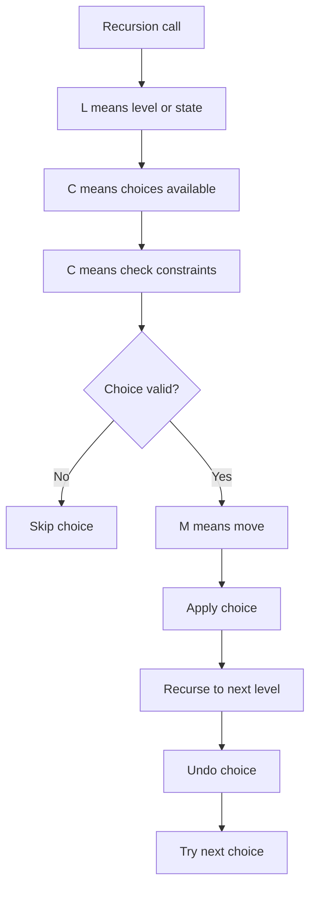
```mermaid
flowchart TD
    A["Recursion call"] --> B["L means level or state"]
    B --> C["C means choices available"]
    C --> D["C means check constraints"]
    D --> E{"Choice valid?"}
    E -->|No| F["Skip choice"]
    E -->|Yes| G["M means move"]
    G --> H["Apply choice"]
    H --> I["Recurse to next level"]
    I --> J["Undo choice"]
    J --> K["Try next choice"]
```

## Universal Backtracking Template

```cpp
void dfs(int level) {
    if (baseCase(level)) {
        saveAnswer();
        return;
    }

    for (auto choice : choices(level)) {
        if (!valid(choice)) continue;

        apply(choice);
        dfs(nextLevel(level, choice));
        undo(choice);
    }
}
```

## LCCM Example: Generate Subsets

| LCCM | Meaning |
|---|---|
| Level | current index `idx` |
| Choice | take `nums[idx]` or skip it |
| Check | index must be within bounds |
| Move | push, recurse, pop |

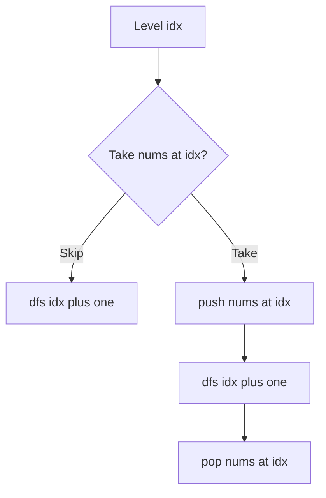
```mermaid
flowchart TD
    A["Level idx"] --> B{"Take nums at idx?"}
    B -->|Skip| C["dfs idx plus one"]
    B -->|Take| D["push nums at idx"]
    D --> E["dfs idx plus one"]
    E --> F["pop nums at idx"]
```

---

# 2. Master Thinking Flow

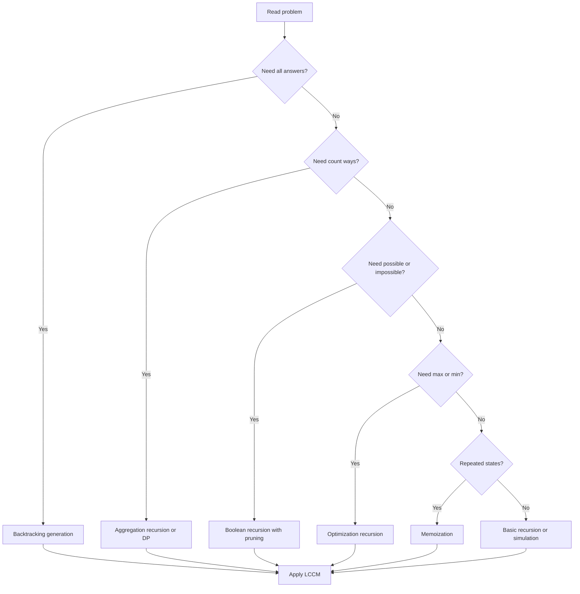
```mermaid
flowchart TD
    A["Read problem"] --> B{"Need all answers?"}
    B -->|Yes| C["Backtracking generation"]
    B -->|No| D{"Need count ways?"}
    D -->|Yes| E["Aggregation recursion or DP"]
    D -->|No| F{"Need possible or impossible?"}
    F -->|Yes| G["Boolean recursion with pruning"]
    F -->|No| H{"Need max or min?"}
    H -->|Yes| I["Optimization recursion"]
    H -->|No| J{"Repeated states?"}
    J -->|Yes| K["Memoization"]
    J -->|No| L["Basic recursion or simulation"]

    C --> M["Apply LCCM"]
    E --> M
    G --> M
    I --> M
    K --> M
    L --> M
```

## CM Thinking Flow

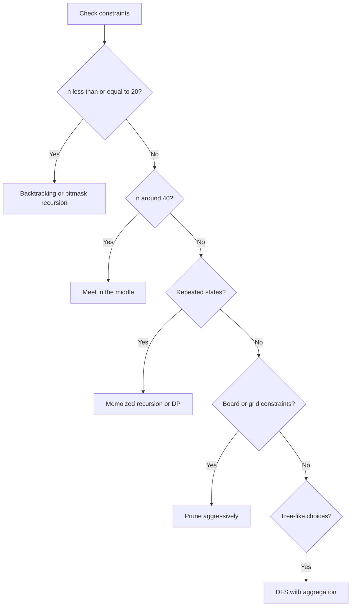
```mermaid
flowchart TD
    A["Check constraints"] --> B{"n less than or equal to 20?"}
    B -->|Yes| C["Backtracking or bitmask recursion"]
    B -->|No| D{"n around 40?"}
    D -->|Yes| E["Meet in the middle"]
    D -->|No| F{"Repeated states?"}
    F -->|Yes| G["Memoized recursion or DP"]
    F -->|No| H{"Board or grid constraints?"}
    H -->|Yes| I["Prune aggressively"]
    H -->|No| J{"Tree-like choices?"}
    J -->|Yes| K["DFS with aggregation"]
```

## FAANG Thinking Flow

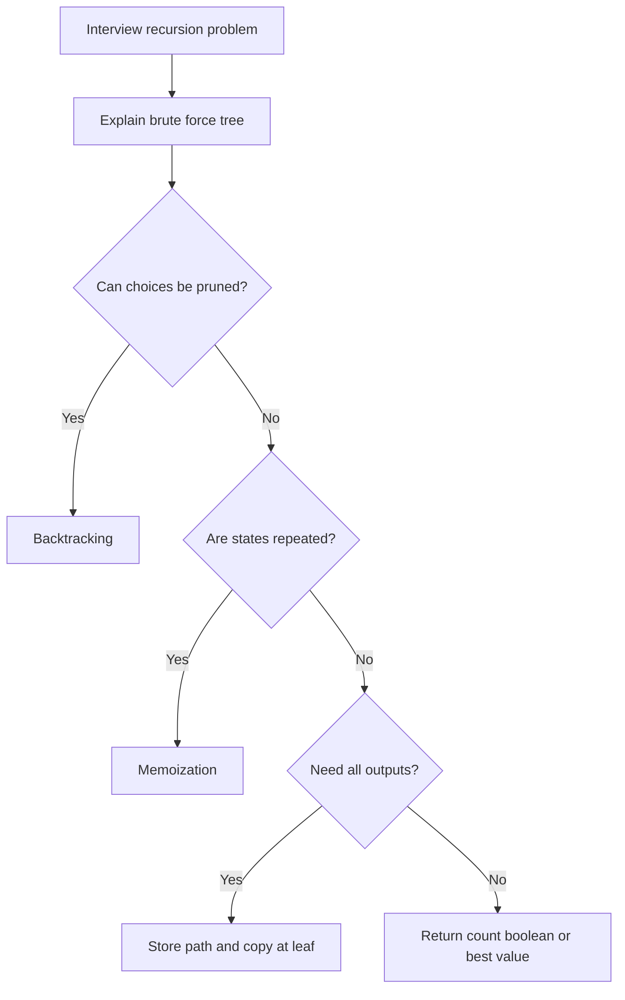
```mermaid
flowchart TD
    A["Interview recursion problem"] --> B["Explain brute force tree"]
    B --> C{"Can choices be pruned?"}
    C -->|Yes| D["Backtracking"]
    C -->|No| E{"Are states repeated?"}
    E -->|Yes| F["Memoization"]
    E -->|No| G{"Need all outputs?"}
    G -->|Yes| H["Store path and copy at leaf"]
    G -->|No| I["Return count boolean or best value"]
```

---

# 3. Difficulty Roadmap

| Level | Target | Must Master |
|---|---|---|
| Newbie | recursive thinking | base case, recursive case, call stack |
| Pupil | generate answers | subsets, permutations, combinations |
| Specialist | constraints and pruning | combination sum, palindrome partition, word search |
| Expert | board and memo recursion | N Queens, Sudoku, word break, decode ways |
| Candidate Master | exponential optimization | meet-in-middle, bitmask recursion, branch and bound |
| LC/FAANG | interview fluency | explain recursion tree, prune, memoize, code cleanly |

---

# 4. Master Pattern Map


```mermaid
flowchart TD
    A["Recursion and Backtracking"] --> B["Basic Recursion"]
    A --> C["Generate All Answers"]
    A --> D["Decision Recursion"]
    A --> E["Constraint Backtracking"]
    A --> F["Grid and Board"]
    A --> G["Aggregation"]
    A --> H["Memoization"]
    A --> I["Advanced Search"]

    B --> B1["Factorial"]
    B --> B2["Fibonacci"]
    B --> B3["Tree DFS"]

    C --> C1["Subsets"]
    C --> C2["Permutations"]
    C --> C3["Combinations"]

    D --> D1["Include Exclude"]
    D --> D2["Partition Cut"]

    E --> E1["Combination Sum"]
    E --> E2["N Queens"]
    E --> E3["Sudoku"]

    F --> F1["Word Search"]
    F --> F2["Maze Paths"]
    F --> F3["Island DFS"]

    G --> G1["Count Ways"]
    G --> G2["Boolean Possible"]
    G --> G3["Max Min"]

    H --> H1["Word Break"]
    H --> H2["Decode Ways"]
    H --> H3["Game Recursion"]

    I --> I1["Meet in Middle"]
    I --> I2["Branch and Bound"]
    I --> I3["Iterative Deepening"]
```

---

# 5. C++ Template Pack

## 5.1 Minimal Setup

```cpp
#include <bits/stdc++.h>
using namespace std;

using ll = long long;
```

## 5.2 Void Backtracking Template

```cpp
vector<vector<int>> answers;
vector<int> path;

void dfs(int level) {
    if (base_case) {
        answers.push_back(path);
        return;
    }

    for (int choice = 0; choice < number_of_choices; choice++) {
        if (!valid(choice)) continue;

        path.push_back(choice);
        dfs(level + 1);
        path.pop_back();
    }
}
```

## 5.3 Count Recursion Template

```cpp
long long dfs(int state) {
    if (base_case) return 1;

    long long ways = 0;

    for (auto choice : choices) {
        if (!valid(choice)) continue;
        ways += dfs(next_state);
    }

    return ways;
}
```

## 5.4 Boolean Recursion Template

```cpp
bool dfs(int state) {
    if (goal_reached) return true;

    for (auto choice : choices) {
        if (!valid(choice)) continue;

        apply(choice);

        if (dfs(next_state)) return true;

        undo(choice);
    }

    return false;
}
```

## 5.5 Memoized Recursion Template

```cpp
vector<int> memo;

int dfs(int state) {
    if (base_case) return base_value;

    if (memo[state] != -1) return memo[state];

    int ans = 0;

    for (auto choice : choices) {
        ans = combine(ans, dfs(next_state));
    }

    return memo[state] = ans;
}
```

---

# 6. Form A: Basic Recursion

## Pattern

A function calls itself on a smaller input.

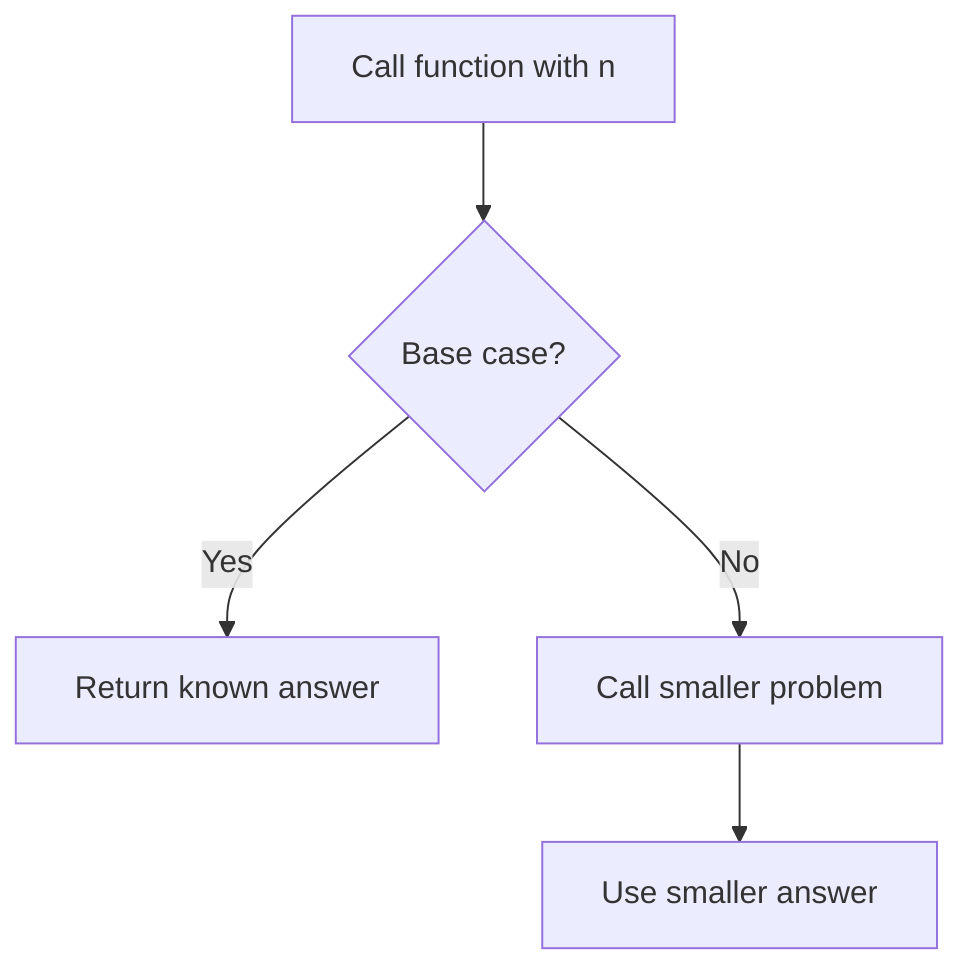
```mermaid
flowchart TD
    A["Call function with n"] --> B{"Base case?"}
    B -->|Yes| C["Return known answer"]
    B -->|No| D["Call smaller problem"]
    D --> E["Use smaller answer"]
```

## A1. Factorial

### LCCM

| Part | Meaning |
|---|---|
| Level | value `n` |
| Choice | no branching, only go to `n - 1` |
| Check | if `n == 0` |
| Move | return `n * fact(n - 1)` |

### Simulation

```text
fact(4)
= 4 * fact(3)
= 4 * 3 * fact(2)
= 4 * 3 * 2 * fact(1)
= 4 * 3 * 2 * 1 * fact(0)
= 24
```

### C++

```cpp
long long fact(int n) {
    if (n == 0) return 1;
    return 1LL * n * fact(n - 1);
}
```

---

## A2. Fibonacci

### Warning

Plain Fibonacci recursion repeats states. Use it only to learn recursion. For real constraints, use DP.

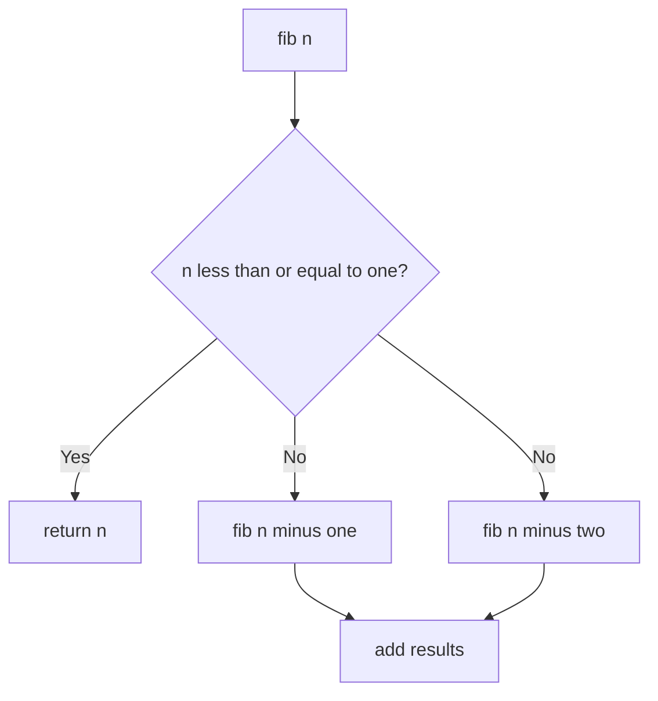
```mermaid
flowchart TD
    A["fib n"] --> B{"n less than or equal to one?"}
    B -->|Yes| C["return n"]
    B -->|No| D["fib n minus one"]
    B -->|No| E["fib n minus two"]
    D --> F["add results"]
    E --> F
```

### C++

```cpp
long long fib(int n) {
    if (n <= 1) return n;
    return fib(n - 1) + fib(n - 2);
}
```

---

# 7. Form B: Generate All Answers

## Pattern

Maintain a `path`. At each leaf, copy path into answers.

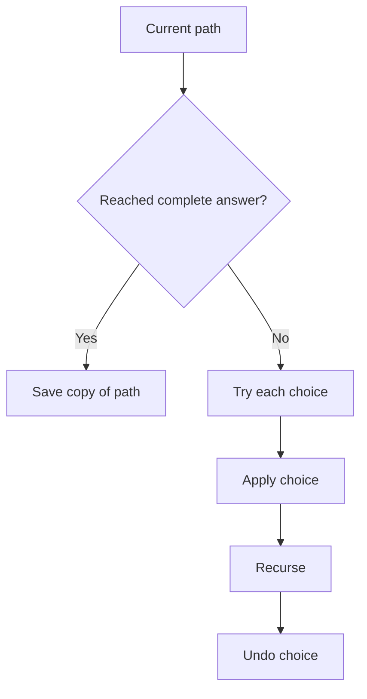
```mermaid
flowchart TD
    A["Current path"] --> B{"Reached complete answer?"}
    B -->|Yes| C["Save copy of path"]
    B -->|No| D["Try each choice"]
    D --> E["Apply choice"]
    E --> F["Recurse"]
    F --> G["Undo choice"]
```

## B1. Generate Binary Strings of Length N

### LCCM

| Part | Meaning |
|---|---|
| Level | current position |
| Choice | put `0` or `1` |
| Check | position less than n |
| Move | push char, recurse, pop |

### Simulation for `n = 2`

```text
""
├── "0"
│   ├── "00"
│   └── "01"
└── "1"
    ├── "10"
    └── "11"
```

### C++

```cpp
vector<string> generateBinaryStrings(int n) {
    vector<string> ans;
    string path;

    function<void(int)> dfs = [&](int pos) {
        if (pos == n) {
            ans.push_back(path);
            return;
        }

        path.push_back('0');
        dfs(pos + 1);
        path.pop_back();

        path.push_back('1');
        dfs(pos + 1);
        path.pop_back();
    };

    dfs(0);
    return ans;
}
```

---

# 8. Form C: Include Exclude

## Pattern

For each item, decide take or skip.

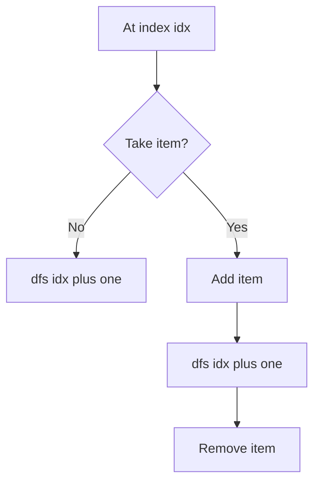
```mermaid
flowchart TD
    A["At index idx"] --> B{"Take item?"}
    B -->|No| C["dfs idx plus one"]
    B -->|Yes| D["Add item"]
    D --> E["dfs idx plus one"]
    E --> F["Remove item"]
```

## C1. Subsets

### LCCM

| Part | Meaning |
|---|---|
| Level | index `idx` |
| Choice | skip or take current element |
| Check | if `idx == n`, save path |
| Move | push/pop element |

### C++

```cpp
vector<vector<int>> subsets(vector<int>& nums) {
    vector<vector<int>> ans;
    vector<int> path;
    int n = nums.size();

    function<void(int)> dfs = [&](int idx) {
        if (idx == n) {
            ans.push_back(path);
            return;
        }

        dfs(idx + 1);

        path.push_back(nums[idx]);
        dfs(idx + 1);
        path.pop_back();
    };

    dfs(0);
    return ans;
}
```

## C2. Subsets With Duplicates

### Tactic

Sort first and skip duplicate choices at the same recursion level.

```cpp
vector<vector<int>> subsetsWithDup(vector<int>& nums) {
    sort(nums.begin(), nums.end());

    vector<vector<int>> ans;
    vector<int> path;

    function<void(int)> dfs = [&](int start) {
        ans.push_back(path);

        for (int i = start; i < (int)nums.size(); i++) {
            if (i > start && nums[i] == nums[i - 1]) continue;

            path.push_back(nums[i]);
            dfs(i + 1);
            path.pop_back();
        }
    };

    dfs(0);
    return ans;
}
```

---

# 9. Form D: Permutations

## Pattern

At each level, choose one unused element.

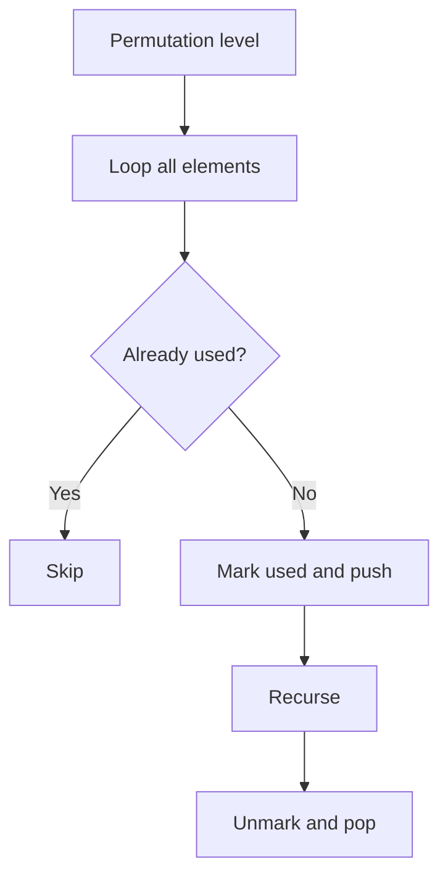
```mermaid
flowchart TD
    A["Permutation level"] --> B["Loop all elements"]
    B --> C{"Already used?"}
    C -->|Yes| D["Skip"]
    C -->|No| E["Mark used and push"]
    E --> F["Recurse"]
    F --> G["Unmark and pop"]
```

## D1. Permutations

### LCCM

| Part | Meaning |
|---|---|
| Level | length of current permutation |
| Choice | any unused number |
| Check | `used[i] == false` |
| Move | mark, push, recurse, pop, unmark |

### Simulation for `[1,2,3]`

```text
[]
├── [1]
│   ├── [1,2,3]
│   └── [1,3,2]
├── [2]
│   ├── [2,1,3]
│   └── [2,3,1]
└── [3]
    ├── [3,1,2]
    └── [3,2,1]
```

### C++

```cpp
vector<vector<int>> permute(vector<int>& nums) {
    int n = nums.size();
    vector<vector<int>> ans;
    vector<int> path;
    vector<int> used(n, 0);

    function<void()> dfs = [&]() {
        if ((int)path.size() == n) {
            ans.push_back(path);
            return;
        }

        for (int i = 0; i < n; i++) {
            if (used[i]) continue;

            used[i] = 1;
            path.push_back(nums[i]);

            dfs();

            path.pop_back();
            used[i] = 0;
        }
    };

    dfs();
    return ans;
}
```

## D2. Unique Permutations

```cpp
vector<vector<int>> permuteUnique(vector<int>& nums) {
    sort(nums.begin(), nums.end());

    int n = nums.size();
    vector<vector<int>> ans;
    vector<int> path;
    vector<int> used(n, 0);

    function<void()> dfs = [&]() {
        if ((int)path.size() == n) {
            ans.push_back(path);
            return;
        }

        for (int i = 0; i < n; i++) {
            if (used[i]) continue;
            if (i > 0 && nums[i] == nums[i - 1] && !used[i - 1]) continue;

            used[i] = 1;
            path.push_back(nums[i]);

            dfs();

            path.pop_back();
            used[i] = 0;
        }
    };

    dfs();
    return ans;
}
```

---

# 10. Form E: Combination and Pick From Start

## Pattern

Use a `start` index so combinations do not repeat in different order.

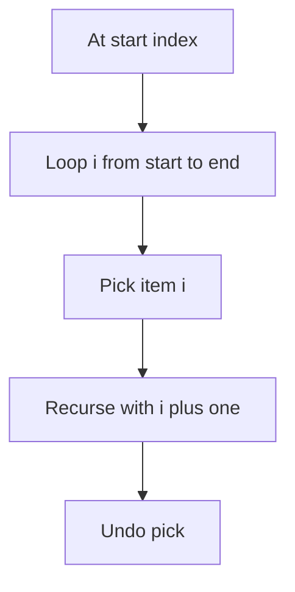
```mermaid
flowchart TD
    A["At start index"] --> B["Loop i from start to end"]
    B --> C["Pick item i"]
    C --> D["Recurse with i plus one"]
    D --> E["Undo pick"]
```

## E1. Combinations Choose K

### C++

```cpp
vector<vector<int>> combine(int n, int k) {
    vector<vector<int>> ans;
    vector<int> path;

    function<void(int)> dfs = [&](int start) {
        if ((int)path.size() == k) {
            ans.push_back(path);
            return;
        }

        for (int x = start; x <= n; x++) {
            path.push_back(x);
            dfs(x + 1);
            path.pop_back();
        }
    };

    dfs(1);
    return ans;
}
```

## E2. Combination Sum

### Intuition

Same number can be reused, so recurse with `i`, not `i + 1`.

```cpp
vector<vector<int>> combinationSum(vector<int>& candidates, int target) {
    sort(candidates.begin(), candidates.end());

    vector<vector<int>> ans;
    vector<int> path;

    function<void(int, int)> dfs = [&](int start, int rem) {
        if (rem == 0) {
            ans.push_back(path);
            return;
        }

        for (int i = start; i < (int)candidates.size(); i++) {
            if (candidates[i] > rem) break;

            path.push_back(candidates[i]);
            dfs(i, rem - candidates[i]);
            path.pop_back();
        }
    };

    dfs(0, target);
    return ans;
}
```

## E3. Combination Sum II

### Tactic

No reuse and skip duplicates at same level.

```cpp
vector<vector<int>> combinationSum2(vector<int>& candidates, int target) {
    sort(candidates.begin(), candidates.end());

    vector<vector<int>> ans;
    vector<int> path;

    function<void(int, int)> dfs = [&](int start, int rem) {
        if (rem == 0) {
            ans.push_back(path);
            return;
        }

        for (int i = start; i < (int)candidates.size(); i++) {
            if (i > start && candidates[i] == candidates[i - 1]) continue;
            if (candidates[i] > rem) break;

            path.push_back(candidates[i]);
            dfs(i + 1, rem - candidates[i]);
            path.pop_back();
        }
    };

    dfs(0, target);
    return ans;
}
```

---

# 11. Form F: Partition and Cut

## Pattern

At position `pos`, choose where the next cut ends.

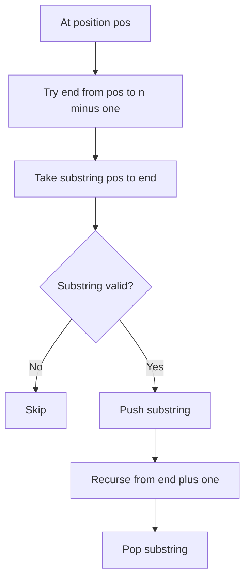
```mermaid
flowchart TD
    A["At position pos"] --> B["Try end from pos to n minus one"]
    B --> C["Take substring pos to end"]
    C --> D{"Substring valid?"}
    D -->|No| E["Skip"]
    D -->|Yes| F["Push substring"]
    F --> G["Recurse from end plus one"]
    G --> H["Pop substring"]
```

## F1. Palindrome Partitioning

### C++

```cpp
bool isPal(const string& s, int l, int r) {
    while (l < r) {
        if (s[l] != s[r]) return false;
        l++;
        r--;
    }
    return true;
}

vector<vector<string>> partition(string s) {
    vector<vector<string>> ans;
    vector<string> path;
    int n = s.size();

    function<void(int)> dfs = [&](int pos) {
        if (pos == n) {
            ans.push_back(path);
            return;
        }

        for (int end = pos; end < n; end++) {
            if (!isPal(s, pos, end)) continue;

            path.push_back(s.substr(pos, end - pos + 1));
            dfs(end + 1);
            path.pop_back();
        }
    };

    dfs(0);
    return ans;
}
```

## F2. Restore IP Addresses

### C++

```cpp
vector<string> restoreIpAddresses(string s) {
    vector<string> ans;
    vector<string> parts;

    auto valid = [&](string part) {
        if (part.empty() || part.size() > 3) return false;
        if (part.size() > 1 && part[0] == '0') return false;
        int val = stoi(part);
        return val <= 255;
    };

    function<void(int)> dfs = [&](int pos) {
        if ((int)parts.size() == 4) {
            if (pos == (int)s.size()) {
                ans.push_back(parts[0] + "." + parts[1] + "." + parts[2] + "." + parts[3]);
            }
            return;
        }

        for (int len = 1; len <= 3 && pos + len <= (int)s.size(); len++) {
            string part = s.substr(pos, len);
            if (!valid(part)) continue;

            parts.push_back(part);
            dfs(pos + len);
            parts.pop_back();
        }
    };

    dfs(0);
    return ans;
}
```

---

# 12. Form G: Constraint Backtracking

## Pattern

Try choices, but prune invalid ones immediately.

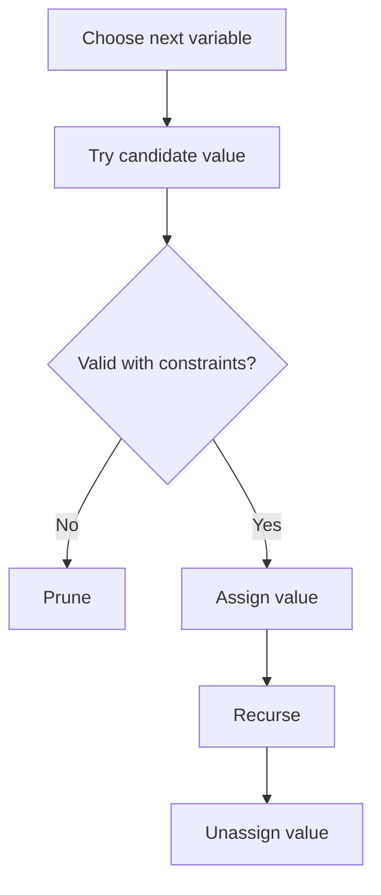
```mermaid
flowchart TD
    A["Choose next variable"] --> B["Try candidate value"]
    B --> C{"Valid with constraints?"}
    C -->|No| D["Prune"]
    C -->|Yes| E["Assign value"]
    E --> F["Recurse"]
    F --> G["Unassign value"]
```

## G1. Generate Parentheses

### LCCM

| Part | Meaning |
|---|---|
| Level | current string length |
| Choice | add open or close |
| Check | open count < n, close count < open count |
| Move | push char, recurse, pop |

### C++

```cpp
vector<string> generateParenthesis(int n) {
    vector<string> ans;
    string path;

    function<void(int, int)> dfs = [&](int open, int close) {
        if ((int)path.size() == 2 * n) {
            ans.push_back(path);
            return;
        }

        if (open < n) {
            path.push_back('(');
            dfs(open + 1, close);
            path.pop_back();
        }

        if (close < open) {
            path.push_back(')');
            dfs(open, close + 1);
            path.pop_back();
        }
    };

    dfs(0, 0);
    return ans;
}
```

## G2. Letter Combinations of Phone Number

```cpp
vector<string> letterCombinations(string digits) {
    if (digits.empty()) return {};

    vector<string> mp = {
        "", "", "abc", "def", "ghi", "jkl",
        "mno", "pqrs", "tuv", "wxyz"
    };

    vector<string> ans;
    string path;

    function<void(int)> dfs = [&](int idx) {
        if (idx == (int)digits.size()) {
            ans.push_back(path);
            return;
        }

        for (char c : mp[digits[idx] - '0']) {
            path.push_back(c);
            dfs(idx + 1);
            path.pop_back();
        }
    };

    dfs(0);
    return ans;
}
```

---

# 13. Form H: Board Placement

## Pattern

Place one object per row/position and check conflicts.

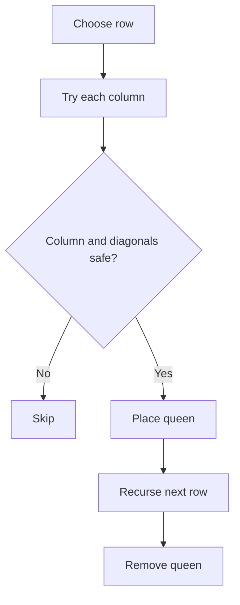
```mermaid
flowchart TD
    A["Choose row"] --> B["Try each column"]
    B --> C{"Column and diagonals safe?"}
    C -->|No| D["Skip"]
    C -->|Yes| E["Place queen"]
    E --> F["Recurse next row"]
    F --> G["Remove queen"]
```

## H1. N Queens

### Intuition

One queen per row. Track used columns and diagonals.

### C++

```cpp
vector<vector<string>> solveNQueens(int n) {
    vector<vector<string>> ans;
    vector<string> board(n, string(n, '.'));

    vector<int> col(n, 0);
    vector<int> diag1(2 * n, 0);
    vector<int> diag2(2 * n, 0);

    function<void(int)> dfs = [&](int row) {
        if (row == n) {
            ans.push_back(board);
            return;
        }

        for (int c = 0; c < n; c++) {
            int d1 = row - c + n;
            int d2 = row + c;

            if (col[c] || diag1[d1] || diag2[d2]) continue;

            col[c] = diag1[d1] = diag2[d2] = 1;
            board[row][c] = 'Q';

            dfs(row + 1);

            board[row][c] = '.';
            col[c] = diag1[d1] = diag2[d2] = 0;
        }
    };

    dfs(0);
    return ans;
}
```

## H2. Sudoku Solver

### C++

```cpp
class SudokuSolver {
public:
    bool solveSudokuBoard(vector<vector<char>>& board) {
        return dfs(board);
    }

private:
    bool dfs(vector<vector<char>>& board) {
        for (int r = 0; r < 9; r++) {
            for (int c = 0; c < 9; c++) {
                if (board[r][c] != '.') continue;

                for (char ch = '1'; ch <= '9'; ch++) {
                    if (!valid(board, r, c, ch)) continue;

                    board[r][c] = ch;

                    if (dfs(board)) return true;

                    board[r][c] = '.';
                }

                return false;
            }
        }

        return true;
    }

    bool valid(vector<vector<char>>& board, int r, int c, char ch) {
        for (int i = 0; i < 9; i++) {
            if (board[r][i] == ch) return false;
            if (board[i][c] == ch) return false;

            int br = 3 * (r / 3) + i / 3;
            int bc = 3 * (c / 3) + i % 3;

            if (board[br][bc] == ch) return false;
        }

        return true;
    }
};
```

---

# 14. Form I: Grid DFS Backtracking

## Pattern

Move in directions, mark visited, undo when backtracking.

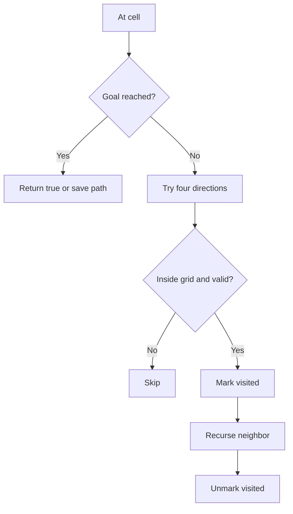
```mermaid
flowchart TD
    A["At cell"] --> B{"Goal reached?"}
    B -->|Yes| C["Return true or save path"]
    B -->|No| D["Try four directions"]
    D --> E{"Inside grid and valid?"}
    E -->|No| F["Skip"]
    E -->|Yes| G["Mark visited"]
    G --> H["Recurse neighbor"]
    H --> I["Unmark visited"]
```

## I1. Word Search

### C++

```cpp
bool exist(vector<vector<char>>& board, string word) {
    int n = board.size();
    int m = board[0].size();

    function<bool(int, int, int)> dfs = [&](int r, int c, int idx) {
        if (idx == (int)word.size()) return true;

        if (r < 0 || r >= n || c < 0 || c >= m) return false;
        if (board[r][c] != word[idx]) return false;

        char saved = board[r][c];
        board[r][c] = '#';

        bool ok =
            dfs(r + 1, c, idx + 1) ||
            dfs(r - 1, c, idx + 1) ||
            dfs(r, c + 1, idx + 1) ||
            dfs(r, c - 1, idx + 1);

        board[r][c] = saved;
        return ok;
    };

    for (int r = 0; r < n; r++) {
        for (int c = 0; c < m; c++) {
            if (dfs(r, c, 0)) return true;
        }
    }

    return false;
}
```

---

# 15. Form J: Aggregation Recursion

## Pattern

Return value from children and combine.

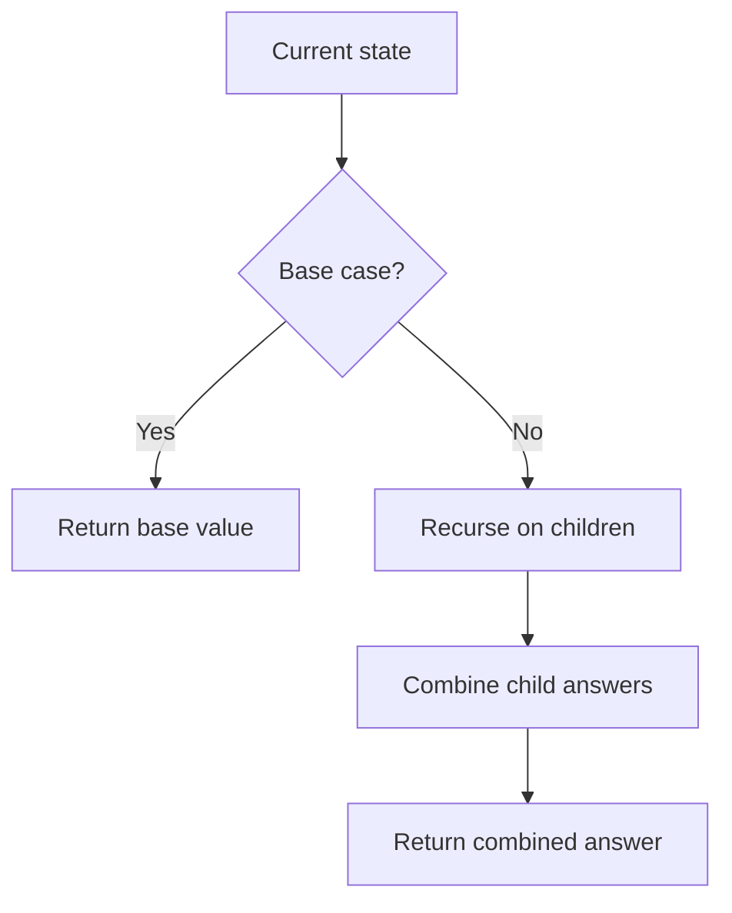
```mermaid
flowchart TD
    A["Current state"] --> B{"Base case?"}
    B -->|Yes| C["Return base value"]
    B -->|No| D["Recurse on children"]
    D --> E["Combine child answers"]
    E --> F["Return combined answer"]
```

## J1. Count Ways

```cpp
long long countPaths(int idx, int n) {
    if (idx == n) return 1;
    if (idx > n) return 0;

    return countPaths(idx + 1, n) + countPaths(idx + 2, n);
}
```

## J2. Boolean Possible

```cpp
bool canReachTarget(vector<int>& a, int idx, int sum, int target) {
    if (sum == target) return true;
    if (idx == (int)a.size()) return false;

    if (canReachTarget(a, idx + 1, sum + a[idx], target)) return true;
    if (canReachTarget(a, idx + 1, sum, target)) return true;

    return false;
}
```

## J3. Max/Min

```cpp
int maxSubsetSum(vector<int>& a, int idx) {
    if (idx == (int)a.size()) return 0;

    int skip = maxSubsetSum(a, idx + 1);
    int take = a[idx] + maxSubsetSum(a, idx + 1);

    return max(skip, take);
}
```

---

# 16. Form K: Memoized Recursion

## Pattern

If same state repeats, cache it.

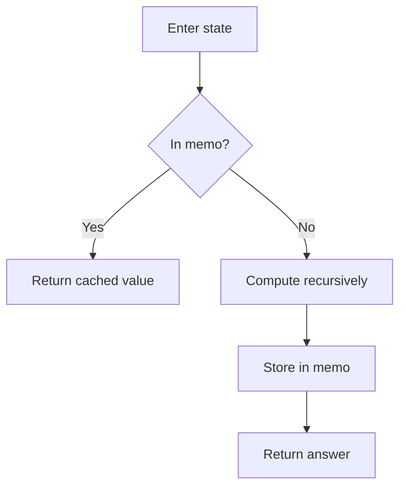
```mermaid
flowchart TD
    A["Enter state"] --> B{"In memo?"}
    B -->|Yes| C["Return cached value"]
    B -->|No| D["Compute recursively"]
    D --> E["Store in memo"]
    E --> F["Return answer"]
```

## K1. Decode Ways

```cpp
int numDecodings(string s) {
    int n = s.size();
    vector<int> memo(n + 1, -1);

    function<int(int)> dfs = [&](int idx) {
        if (idx == n) return 1;
        if (s[idx] == '0') return 0;

        if (memo[idx] != -1) return memo[idx];

        int ways = dfs(idx + 1);

        if (idx + 1 < n) {
            int val = (s[idx] - '0') * 10 + (s[idx + 1] - '0');
            if (val <= 26) {
                ways += dfs(idx + 2);
            }
        }

        return memo[idx] = ways;
    };

    return dfs(0);
}
```

## K2. Word Break

```cpp
bool wordBreak(string s, vector<string>& wordDict) {
    unordered_set<string> dict(wordDict.begin(), wordDict.end());
    int n = s.size();
    vector<int> memo(n + 1, -1);

    function<bool(int)> dfs = [&](int pos) {
        if (pos == n) return true;
        if (memo[pos] != -1) return memo[pos] == 1;

        for (int end = pos; end < n; end++) {
            string word = s.substr(pos, end - pos + 1);

            if (dict.count(word) && dfs(end + 1)) {
                memo[pos] = 1;
                return true;
            }
        }

        memo[pos] = 0;
        return false;
    };

    return dfs(0);
}
```

---

# 17. Form L: Meet-in-the-Middle Recursion

## Use When

`n` is too large for `2^n`, but around `30` to `44`.

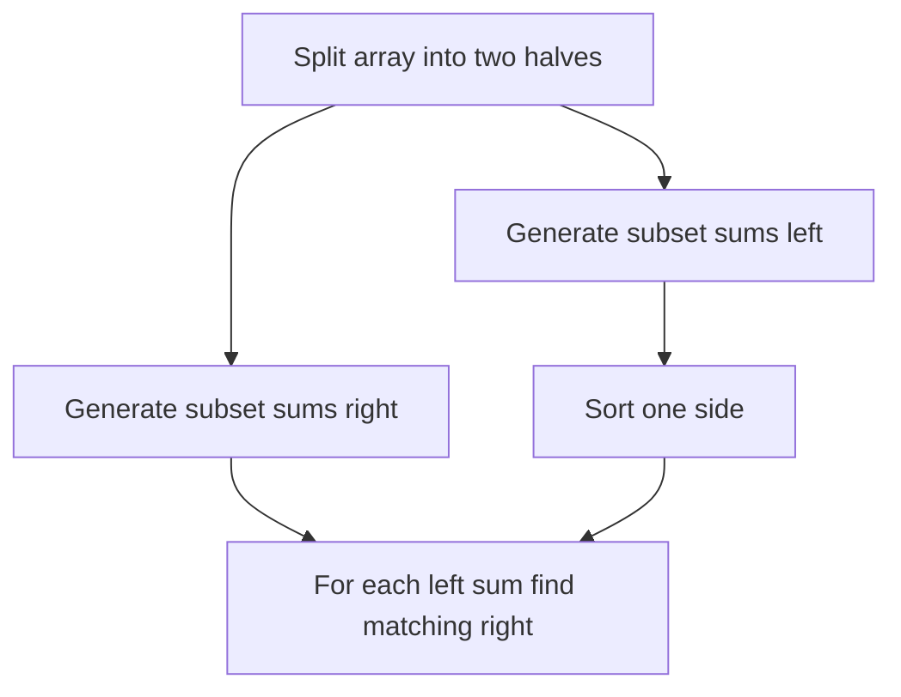
```mermaid
flowchart TD
    A["Split array into two halves"] --> B["Generate subset sums left"]
    A --> C["Generate subset sums right"]
    B --> D["Sort one side"]
    C --> E["For each left sum find matching right"]
    D --> E
```

## L1. Subset Sum Count With Meet in the Middle

```cpp
void genSums(vector<long long>& a, int idx, int end, long long sum, vector<long long>& res) {
    if (idx == end) {
        res.push_back(sum);
        return;
    }

    genSums(a, idx + 1, end, sum, res);
    genSums(a, idx + 1, end, sum + a[idx], res);
}

long long countSubsetSum(vector<long long>& a, long long target) {
    int n = a.size();
    int mid = n / 2;

    vector<long long> left, right;

    genSums(a, 0, mid, 0, left);
    genSums(a, mid, n, 0, right);

    sort(right.begin(), right.end());

    long long ans = 0;

    for (long long x : left) {
        auto range = equal_range(right.begin(), right.end(), target - x);
        ans += range.second - range.first;
    }

    return ans;
}
```

---

# 18. LC/FAANG Pattern Table

| Pattern | Recognition Signal | Tactic | Example Problems |
|---|---|---|---|
| subsets | all possible groups | include/exclude | Subsets, Subsets II |
| permutations | all orderings | used array | Permutations, Unique Permutations |
| combinations | choose k | start index | Combinations |
| sum combinations | choose numbers adding target | sort + prune | Combination Sum |
| valid parentheses | balanced generation | open/close counts | Generate Parentheses |
| string partition | all valid splits | cut position | Palindrome Partitioning |
| board constraints | place pieces | used columns/boxes | N Queens, Sudoku |
| grid path | search adjacent cells | mark visited | Word Search |
| possible segmentation | repeated state | memo | Word Break |
| decoding count | count choices | memo/DP | Decode Ways |
| game recursion | current mask/state | memo minimax | Can I Win |
| expression building | choose operator | DFS with state | Expression Add Operators |

---

# 19. Candidate Master Escalation Patterns

| CM Pattern | Basic Version | Advanced Version | Tactic |
|---|---|---|---|
| generate subsets | `2^n` recursion | meet-in-middle | split halves |
| brute permutations | all permutations | pruning / branch bound | cut impossible branches |
| board placement | N Queens | bitmask optimized N Queens | columns and diagonals as bits |
| subset sum | recursion | bitset DP / MITM | choose by constraints |
| repeated recursion | memo | DP transformation | state compression |
| tree recursion | DFS | rerooting / tree DP | aggregate children |
| game recursion | minimax | Sprague-Grundy | game theory |
| exhaustive search | plain DFS | iterative deepening | depth limit |
| grid DFS | simple path | connected component/backtracking | mark/unmark |
| assignment | permutations | bitmask DP | `dp[mask]` |

---

# 20. Difficulty-Sorted Problem Set

---

## 20.1 Newbie Problems

| # | Problem | Platform | Link | Form | Pattern | Tactic | Intuition | Implementation |
|---:|---|---|---|---|---|---|---|---|
| 1 | Fibonacci Number | LeetCode | https://leetcode.com/problems/fibonacci-number/ | basic recursion | smaller states | base case | fib depends on previous two | recursion/DP |
| 2 | Power of Three | LeetCode | https://leetcode.com/problems/power-of-three/ | recursion/math | divide by 3 | shrink number | keep dividing | recursive check |
| 3 | Reverse String | LeetCode | https://leetcode.com/problems/reverse-string/ | recursion/two pointer | swap ends | recurse inward | symmetric reduction | recursion |
| 4 | Merge Two Binary Trees | LeetCode | https://leetcode.com/problems/merge-two-binary-trees/ | tree recursion | combine nodes | recurse children | tree naturally recursive | DFS |
| 5 | Maximum Depth of Binary Tree | LeetCode | https://leetcode.com/problems/maximum-depth-of-binary-tree/ | tree recursion | max child depth | return value | height is one plus max child | DFS |
| 6 | Same Tree | LeetCode | https://leetcode.com/problems/same-tree/ | tree recursion | compare nodes | both children same | trees equal if roots and children equal | DFS |
| 7 | Symmetric Tree | LeetCode | https://leetcode.com/problems/symmetric-tree/ | tree recursion | mirror compare | compare outside/inside | symmetry is recursive | DFS |
| 8 | Climbing Stairs | LeetCode | https://leetcode.com/problems/climbing-stairs/ | count recursion | choices 1 or 2 | memoize | ways from step depend on next choices | memo |
| 9 | Pascal Triangle | LeetCode | https://leetcode.com/problems/pascals-triangle/ | recursion/DP | build from previous row | combine neighbors | each row from previous | iterative |
| 10 | Binary Tree Paths | LeetCode | https://leetcode.com/problems/binary-tree-paths/ | path recursion | maintain path | push/pop | root-to-leaf path | DFS |

### Newbie Logic Flow

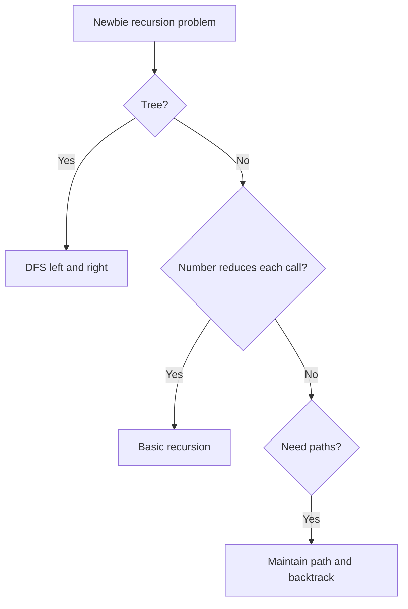
```mermaid
flowchart TD
    A["Newbie recursion problem"] --> B{"Tree?"}
    B -->|Yes| C["DFS left and right"]
    B -->|No| D{"Number reduces each call?"}
    D -->|Yes| E["Basic recursion"]
    D -->|No| F{"Need paths?"}
    F -->|Yes| G["Maintain path and backtrack"]
```

---

## 20.2 Easy to Medium Problems

| # | Problem | Platform | Link | Form | Pattern | Tactic | Intuition | Implementation |
|---:|---|---|---|---|---|---|---|---|
| 1 | Subsets | LeetCode | https://leetcode.com/problems/subsets/ | include exclude | generate all subsets | take/skip | every item has two choices | DFS |
| 2 | Subsets II | LeetCode | https://leetcode.com/problems/subsets-ii/ | subsets duplicates | skip same level duplicates | sort first | avoid duplicate branches | DFS |
| 3 | Permutations | LeetCode | https://leetcode.com/problems/permutations/ | permutation | choose unused | used array | each level picks one remaining | DFS |
| 4 | Permutations II | LeetCode | https://leetcode.com/problems/permutations-ii/ | unique permutation | skip duplicate candidate | sort + used rule | duplicate values need ordering rule | DFS |
| 5 | Combinations | LeetCode | https://leetcode.com/problems/combinations/ | combination | start index | choose increasing | avoid reorder duplicates | DFS |
| 6 | Combination Sum | LeetCode | https://leetcode.com/problems/combination-sum/ | combination reuse | pick from start | recurse same i | candidates reusable | DFS |
| 7 | Combination Sum II | LeetCode | https://leetcode.com/problems/combination-sum-ii/ | combination no reuse | skip duplicates | recurse i plus one | use each number once | DFS |
| 8 | Letter Combinations of Phone Number | LeetCode | https://leetcode.com/problems/letter-combinations-of-a-phone-number/ | cartesian product | choose char per digit | path string | each digit contributes choices | DFS |
| 9 | Generate Parentheses | LeetCode | https://leetcode.com/problems/generate-parentheses/ | constraint generation | open/close counts | prune invalid close | close cannot exceed open | DFS |
| 10 | Palindrome Partitioning | LeetCode | https://leetcode.com/problems/palindrome-partitioning/ | partition cut | choose pal substring | validate segment | each cut must be palindrome | DFS |
| 11 | Restore IP Addresses | LeetCode | https://leetcode.com/problems/restore-ip-addresses/ | partition cut | four valid parts | length 1 to 3 | IP has four bounded chunks | DFS |
| 12 | Word Search | LeetCode | https://leetcode.com/problems/word-search/ | grid backtracking | mark visited | four directions | path cannot reuse cell | DFS |
| 13 | Path Sum II | LeetCode | https://leetcode.com/problems/path-sum-ii/ | tree backtracking | root-to-leaf path | push/pop | collect paths matching target | DFS |
| 14 | Sum Root to Leaf Numbers | LeetCode | https://leetcode.com/problems/sum-root-to-leaf-numbers/ | tree aggregation | carry number | return sum | path digits form number | DFS |
| 15 | Count Good Nodes in Binary Tree | LeetCode | https://leetcode.com/problems/count-good-nodes-in-binary-tree/ | tree recursion | carry max | count valid | node good if >= path max | DFS |

### Easy-Medium Logic Flow

```mermaid
flowchart TD
    A["Easy medium recursion"] --> B{"All subsets or combinations?"}
    B -->|Yes| C["Use start index or include exclude"]
    B -->|No| D{"All permutations?"}
    D -->|Yes| E["Use used array"]
    D -->|No| F{"String split?"}
    F -->|Yes| G["Partition cut"]
    F -->|No| H{"Grid path?"}
    H -->|Yes| I["Mark visited and undo"]
```

---

## 20.3 Medium Problems

| # | Problem | Platform | Link | Form | Pattern | Tactic | Intuition | Implementation |
|---:|---|---|---|---|---|---|---|---|
| 1 | N Queens | LeetCode | https://leetcode.com/problems/n-queens/ | board placement | one queen per row | columns and diagonals | row choice reduces conflicts | DFS |
| 2 | N Queens II | LeetCode | https://leetcode.com/problems/n-queens-ii/ | count board placements | same constraints | count leaves | no need board output | DFS |
| 3 | Sudoku Solver | LeetCode | https://leetcode.com/problems/sudoku-solver/ | constraint fill | choose empty cell | valid digit | prune invalid digits | DFS |
| 4 | Word Break | LeetCode | https://leetcode.com/problems/word-break/ | memo recursion | cut word | memo position | same suffix repeats | DFS memo |
| 5 | Decode Ways | LeetCode | https://leetcode.com/problems/decode-ways/ | count recursion | one or two digit | memo | each position has decoding choices | memo |
| 6 | Target Sum | LeetCode | https://leetcode.com/problems/target-sum/ | include signs | plus/minus choice | memo or DP | each number chooses sign | DFS memo |
| 7 | Partition to K Equal Sum Subsets | LeetCode | https://leetcode.com/problems/partition-to-k-equal-sum-subsets/ | constraint grouping | fill buckets | sort + prune | assign each number to a bucket | backtracking |
| 8 | Matchsticks to Square | LeetCode | https://leetcode.com/problems/matchsticks-to-square/ | bucket backtracking | four sides | sort descending | fill equal sides | DFS |
| 9 | Letter Tile Possibilities | LeetCode | https://leetcode.com/problems/letter-tile-possibilities/ | permutation count | freq choices | choose char count | avoid duplicate permutations | DFS |
| 10 | All Paths From Source to Target | LeetCode | https://leetcode.com/problems/all-paths-from-source-to-target/ | graph DFS | path generation | push/pop | DAG paths from source | DFS |
| 11 | Iterator for Combination | LeetCode | https://leetcode.com/problems/iterator-for-combination/ | generation | next combination | precompute/backtrack | combinations in lexicographic order | DFS |
| 12 | Beautiful Arrangement | LeetCode | https://leetcode.com/problems/beautiful-arrangement/ | permutation constraint | valid placement | used mask | number must divide position or reverse | DFS |
| 13 | Different Ways to Add Parentheses | LeetCode | https://leetcode.com/problems/different-ways-to-add-parentheses/ | divide recursion | split by operator | combine left right | expression tree choices | memo |
| 14 | Shopping Offers | LeetCode | https://leetcode.com/problems/shopping-offers/ | memo recursion | choose offer | state needs vector | repeated needs states | memo map |
| 15 | Can I Win | LeetCode | https://leetcode.com/problems/can-i-win/ | game recursion | used mask | memo win/lose | current wins if any move makes opponent lose | minimax |

### Medium Logic Flow

```mermaid
flowchart TD
    A["Medium recursion"] --> B{"Constraints board or placement?"}
    B -->|Yes| C["Constraint backtracking"]
    B -->|No| D{"Same state repeats?"}
    D -->|Yes| E["Memoized recursion"]
    D -->|No| F{"Need grouping into buckets?"}
    F -->|Yes| G["Sort descending and prune"]
    F -->|No| H{"Expression split?"}
    H -->|Yes| I["Divide and combine"]
```

---

## 20.4 Hard / FAANG-Hard Problems

| # | Problem | Platform | Link | Form | Pattern | Tactic | Intuition | Implementation |
|---:|---|---|---|---|---|---|---|---|
| 1 | Expression Add Operators | LeetCode | https://leetcode.com/problems/expression-add-operators/ | expression DFS | choose operator and operand | carry last value | multiplication needs previous term | DFS |
| 2 | Word Search II | LeetCode | https://leetcode.com/problems/word-search-ii/ | trie + grid backtracking | prefix pruning | trie children | abandon paths with no word prefix | trie DFS |
| 3 | Remove Invalid Parentheses | LeetCode | https://leetcode.com/problems/remove-invalid-parentheses/ | BFS/backtracking | minimal removals | prune counts | remove only necessary invalid chars | DFS/BFS |
| 4 | Concatenated Words | LeetCode | https://leetcode.com/problems/concatenated-words/ | word break recursion | trie/memo | split words | word can be made from smaller words | memo |
| 5 | Regular Expression Matching | LeetCode | https://leetcode.com/problems/regular-expression-matching/ | recursive DP | pattern states | memo i j | star creates choices | memo |
| 6 | Wildcard Matching | LeetCode | https://leetcode.com/problems/wildcard-matching/ | recursive DP | wildcard states | memo/greedy | star matches zero or more | DP |
| 7 | Scramble String | LeetCode | https://leetcode.com/problems/scramble-string/ | recursive partition | split and swap | memo strings | compare recursive partitions | memo |
| 8 | Palindrome Partitioning III | LeetCode | https://leetcode.com/problems/palindrome-partitioning-iii/ | recursion DP | partition with cost | memo pos k | choose cuts and minimize changes | DP |
| 9 | Number of Squareful Arrays | LeetCode | https://leetcode.com/problems/number-of-squareful-arrays/ | permutation graph | choose valid next | duplicate pruning | edge if sum is square | DFS memo |
| 10 | Optimal Account Balancing | LeetCode | https://leetcode.com/problems/optimal-account-balancing/ | backtracking optimization | settle debts | skip zeros | pair opposite debts | DFS prune |
| 11 | Stickers to Spell Word | LeetCode | https://leetcode.com/problems/stickers-to-spell-word/ | memo recursion | reduce target | choose useful sticker | state is remaining letters | memo |
| 12 | Zuma Game | LeetCode | https://leetcode.com/problems/zuma-game/ | search pruning | try insertions | reduce board | brute force with pruning | DFS memo |
| 13 | Frog Jump | LeetCode | https://leetcode.com/problems/frog-jump/ | memo recursion | state stone and jump | set lookup | same position jump repeats | memo |
| 14 | Burst Balloons | LeetCode | https://leetcode.com/problems/burst-balloons/ | interval recursion | choose last balloon | memo l r | last choice splits interval | DP memo |
| 15 | Cherry Pickup | LeetCode | https://leetcode.com/problems/cherry-pickup/ | memo recursion | two walkers | state compression | two paths simultaneously | DP memo |

### Hard Logic Flow

```mermaid
flowchart TD
    A["Hard recursion"] --> B{"Can prefix prune search?"}
    B -->|Yes| C["Trie or validity pruning"]
    B -->|No| D{"Expression or interval split?"}
    D -->|Yes| E["Divide recursion with memo"]
    D -->|No| F{"State complex but repeated?"}
    F -->|Yes| G["Memo with encoded state"]
    F -->|No| H{"Need minimum search depth?"}
    H -->|Yes| I["BFS or iterative deepening"]
```

---

## 20.5 Candidate Master / CP Escalation Problems

| # | Problem | Platform | Link | Form | Pattern | Tactic | Intuition | Implementation |
|---:|---|---|---|---|---|---|---|---|
| 1 | Creating Strings | CSES | https://cses.fi/problemset/task/1622 | permutations | duplicate handling | sort + next permutation/backtrack | generate unique strings | backtracking |
| 2 | Apple Division | CSES | https://cses.fi/problemset/task/1623 | subset recursion | include/exclude | minimize difference | choose group for each apple | DFS |
| 3 | Chessboard and Queens | CSES | https://cses.fi/problemset/task/1624 | N Queens variant | blocked cells | row placement | queens plus forbidden cells | DFS |
| 4 | Grid Paths | CSES | https://cses.fi/problemset/task/1625 | grid backtracking | prune dead paths | path string constraints | avoid trapping unvisited cells | DFS prune |
| 5 | Meet in the Middle | CSES | https://cses.fi/problemset/task/1628 | MITM | subset sums | split halves | count target sums for n up to 40 | recursion |
| 6 | Hamiltonian Flights | CSES | https://cses.fi/problemset/task/1690 | bitmask recursion | DP over masks | memo state | count paths visiting subset | DP |
| 7 | Elevator Rides | CSES | https://cses.fi/problemset/task/1653 | bitmask DP | subset state | optimize pair | exponential DP with compressed state | DP |
| 8 | Codeforces Meet in the Middle Search | Codeforces | https://codeforces.com/problemset | MITM | split choices | combine sorted lists | reduce exponential | MITM |
| 9 | AtCoder DP O Matching | AtCoder | https://atcoder.jp/contests/dp/tasks/dp_o | bitmask recursion | assignment DP | mask of used women | recursion converted to DP | memo |
| 10 | AtCoder DP U Grouping | AtCoder | https://atcoder.jp/contests/dp/tasks/dp_u | submask recursion | partition set | enumerate submasks | recursively split groups | DP |
| 11 | AtCoder ABC 326 D ABC Puzzle | AtCoder | https://atcoder.jp/contests/abc326/tasks/abc326_d | grid backtracking | constraints | row permutations | search possible grid | DFS |
| 12 | AtCoder ABC 322 D Polyomino | AtCoder | https://atcoder.jp/contests/abc322/tasks/abc322_d | shape backtracking | rotations/translations | try placements | cover board exactly | DFS |
| 13 | Codeforces DZY Loves Chessboard | Codeforces | https://codeforces.com/problemset/problem/445/A | grid DFS | coloring | alternate colors | DFS grid constraints | DFS |
| 14 | SPOJ MKTHNUM Contrast | SPOJ | https://www.spoj.com/problems/MKTHNUM/ | not backtracking | persistent segtree | know when not DFS | avoid exponential | contrast |
| 15 | UVA 524 Prime Ring Problem | Online Judge | https://onlinejudge.org/external/5/524.pdf | permutation constraint | prime adjacency | used numbers | ring sequence with prime sums | DFS |
| 16 | UVA 750 8 Queens Chess Problem | Online Judge | https://onlinejudge.org/external/7/750.pdf | N Queens | fixed queen | precompute all boards | classic backtracking | DFS |
| 17 | Kattis CD | Kattis | https://open.kattis.com/problems/cd | contrast | set/two pointers | not recursion | know simpler pattern | set |
| 18 | Codeforces Generate a String | Codeforces | https://codeforces.com/problemset/problem/710/E | recursion to DP | cost states | memo/DP | recursive choices optimized | DP |
| 19 | AtCoder Typical Contest recursive search | AtCoder | https://atcoder.jp/contests/typical90 | search | constraints | prune | broad CP backtracking practice | DFS |
| 20 | USACO Wormhole | USACO | https://usaco.org/index.php?page=viewproblem2&cpid=360 | pairing recursion | generate matchings | cycle check | pair objects then test cycle | DFS |

### CM Problem Logic Flow

```mermaid
flowchart TD
    A["CP recursion problem"] --> B{"n around 8 to 12 with permutations?"}
    B -->|Yes| C["Permutation backtracking with pruning"]
    B -->|No| D{"n around 20?"}
    D -->|Yes| E["Bitmask recursion or DP"]
    D -->|No| F{"n around 40?"}
    F -->|Yes| G["Meet in the middle"]
    F -->|No| H{"Grid path with constraints?"}
    H -->|Yes| I["Backtracking with dead-end pruning"]
    H -->|No| J{"Repeated states?"}
    J -->|Yes| K["Memoize or convert to DP"]
```

---

# 21. Final Revision Checklist

## LCCM

- [ ] Level: what does one call represent?
- [ ] Choice: what can I try?
- [ ] Check: what makes a choice invalid?
- [ ] Move: how do I apply, recurse, and undo?

## Base Case

- [ ] Did I stop at the correct index/level?
- [ ] Did I save a copy of path, not reference?
- [ ] Did I return correct count/boolean/value?

## Backtracking

- [ ] Push before recursion.
- [ ] Pop after recursion.
- [ ] Mark before recursion.
- [ ] Unmark after recursion.
- [ ] Skip duplicates only at the same level.
- [ ] Sort when duplicate pruning or early break helps.

## Pruning

- [ ] Stop if remaining target becomes negative.
- [ ] Break loop when sorted candidate exceeds target.
- [ ] Skip invalid board/grid moves.
- [ ] Use frequency counts to avoid duplicate permutations.
- [ ] Use memoization when states repeat.

## Complexity

- [ ] Subsets are `O(2^n)`.
- [ ] Permutations are `O(n!)`.
- [ ] Combination search depends on branching and pruning.
- [ ] Board search can be exponential.
- [ ] Memoization changes recursion tree into state graph.
- [ ] MITM reduces `2^n` into about `2^(n/2)`.

## Interview Explanation

```text
I define one recursion state.
At each state I list choices.
I reject invalid choices early.
For valid choices, I apply, recurse, then undo.
If states repeat, I memoize.
```

---

# Appendix A: Problem-to-Form Quick Lookup

| Problem Type | Form | Template |
|---|---|---|
| factorial | Basic recursion | `fact` |
| generate binary strings | Generate all | path DFS |
| subsets | Include exclude | `dfs(idx)` |
| permutations | Choose unused | `used[i]` |
| combinations | Pick from start | `dfs(start)` |
| combination sum | Pick from start with target | sorted + prune |
| palindrome partition | Partition cut | `dfs(pos)` |
| generate parentheses | Constraint generation | open/close counts |
| N Queens | Board placement | cols and diagonals |
| Sudoku | Constraint fill | valid digit check |
| Word Search | Grid backtracking | mark visited |
| count ways | Aggregation count | return sum |
| possible | Boolean aggregation | early return |
| repeated state | Memoized recursion | `memo[state]` |
| n around 40 subset | Meet in middle | split halves |

---

# Appendix B: GitHub-Safe Mermaid Rules

- Use quoted labels like `A["text"]`.
- Do not put raw square brackets inside labels.
- Keep one arrow statement per line.
- Avoid dense math notation in node labels.
- Use simple words instead of symbols where possible.
