# Ultimate Greedy Algorithms Guide
## Exchange Argument + C++ Pattern Playbook for Newbie → Candidate Master + LC/FAANG

> Goal: learn when greedy works, how to prove it using exchange argument, how to recognize standard and non-standard greedy patterns, and how to practice from beginner to CM level.

---

# Clickable Index

- [0. Greedy Core Idea](#0-greedy-core-idea)
- [1. How to Use This Guide](#1-how-to-use-this-guide)
- [2. Greedy Thinking Flow](#2-greedy-thinking-flow)
- [3. Standard vs Non-Standard Greedy](#3-standard-vs-non-standard-greedy)
- [4. Exchange Argument From Basics](#4-exchange-argument-from-basics)
- [5. Difficulty Roadmap](#5-difficulty-roadmap)
- [6. Master Pattern Map](#6-master-pattern-map)
- [7. C++ Greedy Template Pack](#7-c-greedy-template-pack)
- [8. Form A: Sort and Pick Smallest or Largest](#8-form-a-sort-and-pick-smallest-or-largest)
- [9. Form B: Earliest Finish Interval Greedy](#9-form-b-earliest-finish-interval-greedy)
- [10. Form C: Greedy With Min or Max So Far](#10-form-c-greedy-with-min-or-max-so-far)
- [11. Form D: Forward Reachability Greedy](#11-form-d-forward-reachability-greedy)
- [12. Form E: Greedy With Intervals](#12-form-e-greedy-with-intervals)
- [13. Form F: Greedy With Heap](#13-form-f-greedy-with-heap)
- [14. Form G: Greedy With Two Pointers](#14-form-g-greedy-with-two-pointers)
- [15. Form H: Greedy With Stack](#15-form-h-greedy-with-stack)
- [16. Form I: Greedy With DSU](#16-form-i-greedy-with-dsu)
- [17. Form J: Graph Greedy and MST](#17-form-j-graph-greedy-and-mst)
- [18. Form K: Greedy With Binary Search Check](#18-form-k-greedy-with-binary-search-check)
- [19. Form L: Huffman and Merge Cost Greedy](#19-form-l-huffman-and-merge-cost-greedy)
- [20. Form M: Scheduling and Deadlines](#20-form-m-scheduling-and-deadlines)
- [21. When Greedy Fails](#21-when-greedy-fails)
- [22. LC/FAANG Greedy Pattern Table](#22-lcfaang-greedy-pattern-table)
- [23. Candidate Master Escalation Patterns](#23-candidate-master-escalation-patterns)
- [24. Difficulty-Sorted Problem Set](#24-difficulty-sorted-problem-set)
- [25. Final Revision Checklist](#25-final-revision-checklist)

---

# 0. Greedy Core Idea

Greedy means:

```text
Always pick the best choice right now.
Do not go back and change previous decisions.
```

Greedy works only when:

```text
Local best choice leads to global best answer.
```

If you cannot prove the local choice is safe, it may be DP, graph, binary search, backtracking, or flow.

---

# 1. How to Use This Guide

For every greedy problem:

```text
Read problem
→ find what must be optimized
→ identify possible greedy choice
→ test small counterexamples
→ prove choice using exchange argument
→ choose data structure
→ implement
→ test edge cases
```

## Core Matching Table

| Signal in Problem | Greedy Form | Pattern | Tactic | Intuition | C++ Tool |
|---|---|---|---|---|---|
| choose max count of non-overlapping intervals | intervals | earliest finish | sort by end | finishing early leaves more space | sort |
| assign resources to demands | matching | smallest sufficient | sort both | save bigger resource for harder demand | sort + two pointers |
| maximize profit once | min so far | track best past | update minimum | best sell uses cheapest previous buy | one pass |
| can reach end | reachability | farthest reach | update max reachable | reachable index extends range | loop |
| dynamic best choice changes | heap greedy | priority queue | pick current best | choices appear over time | heap |
| connect all nodes cheaply | MST | Kruskal | sort edges + DSU | cheapest safe edge | DSU |
| minimize merge cost | Huffman | merge two smallest | min heap | small weights should be merged early | priority queue |
| job deadlines | scheduling | profit with deadline | sort profit, DSU/heap | valuable job gets latest possible slot | DSU/heap |
| minimize maximum | answer check | binary search + greedy | greedy feasibility | check monotonic possibility | binary search |
| remove digits/letters | monotonic stack | pop worse previous | stack | earlier larger char blocks smaller answer | stack |

---

# 2. Greedy Thinking Flow

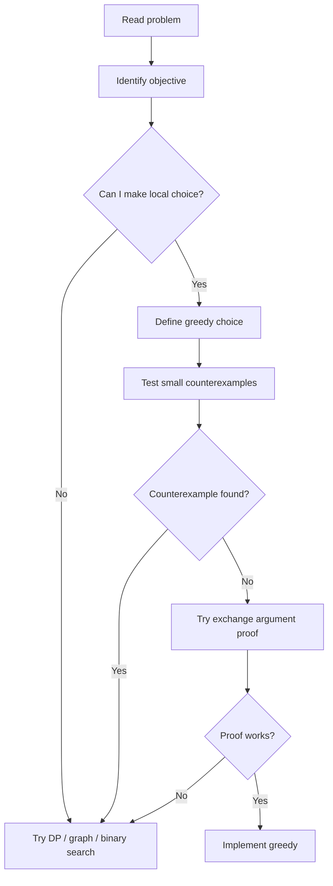
```mermaid
flowchart TD
    A["Read problem"] --> B["Identify objective"]
    B --> C{"Can I make local choice?"}
    C -->|No| D["Try DP / graph / binary search"]
    C -->|Yes| E["Define greedy choice"]
    E --> F["Test small counterexamples"]
    F --> G{"Counterexample found?"}
    G -->|Yes| D
    G -->|No| H["Try exchange argument proof"]
    H --> I{"Proof works?"}
    I -->|Yes| J["Implement greedy"]
    I -->|No| D
```

## FAANG Thinking Flow

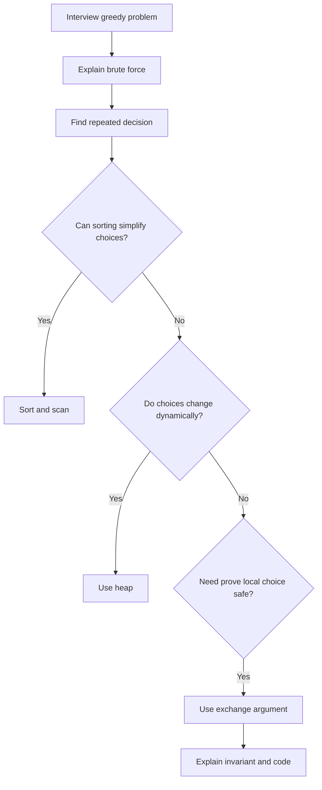
```mermaid
flowchart TD
    A["Interview greedy problem"] --> B["Explain brute force"]
    B --> C["Find repeated decision"]
    C --> D{"Can sorting simplify choices?"}
    D -->|Yes| E["Sort and scan"]
    D -->|No| F{"Do choices change dynamically?"}
    F -->|Yes| G["Use heap"]
    F -->|No| H{"Need prove local choice safe?"}
    H -->|Yes| I["Use exchange argument"]
    I --> J["Explain invariant and code"]
```

## CM Thinking Flow

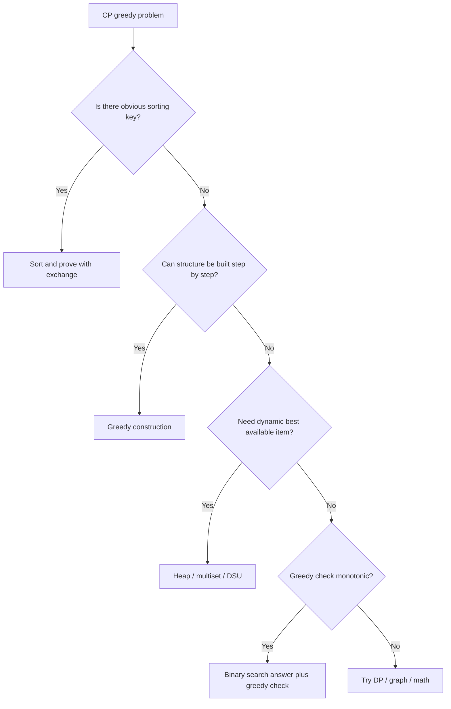
```mermaid
flowchart TD
    A["CP greedy problem"] --> B{"Is there obvious sorting key?"}
    B -->|Yes| C["Sort and prove with exchange"]
    B -->|No| D{"Can structure be built step by step?"}
    D -->|Yes| E["Greedy construction"]
    D -->|No| F{"Need dynamic best available item?"}
    F -->|Yes| G["Heap / multiset / DSU"]
    F -->|No| H{"Greedy check monotonic?"}
    H -->|Yes| I["Binary search answer plus greedy check"]
    H -->|No| J["Try DP / graph / math"]
```

---

# 3. Standard vs Non-Standard Greedy

## Standard Greedy

| Standard Pattern | Common Sorting Key | Example |
|---|---|---|
| activity selection | end time ascending | maximum non-overlapping meetings |
| interval covering | start ascending, extend farthest end | minimum intervals to cover range |
| assign cookies | size ascending | smallest cookie for smallest child |
| MST | edge weight ascending | Kruskal |
| Huffman | two smallest first | optimal merge pattern |
| job sequencing | profit descending or deadline ascending | max profit by deadlines |
| jump game | farthest reachable | can reach end |

## Non-Standard Greedy

| Non-Standard Signal | Hidden Greedy |
|---|---|
| construct lexicographically smallest string | monotonic stack |
| maximize minimum distance | binary search + greedy placement |
| rearrange characters | heap by frequency |
| remove overlaps | choose interval with earliest end |
| split array into subsequences | greedily extend existing sequence |
| minimize cost with swaps/choices | exchange argument on order |

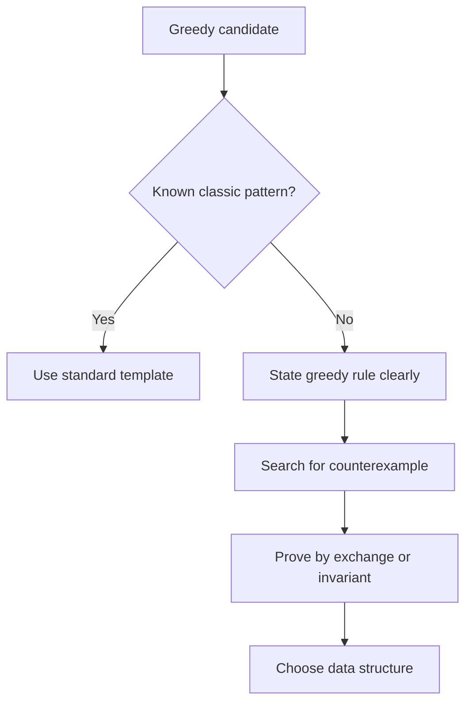
```mermaid
flowchart TD
    A["Greedy candidate"] --> B{"Known classic pattern?"}
    B -->|Yes| C["Use standard template"]
    B -->|No| D["State greedy rule clearly"]
    D --> E["Search for counterexample"]
    E --> F["Prove by exchange or invariant"]
    F --> G["Choose data structure"]
```

---

# 4. Exchange Argument From Basics

Exchange argument proves a greedy choice is safe.

```text
Take any optimal solution.
If it does not use the greedy choice,
replace part of it with the greedy choice.
The solution stays valid and not worse.
Therefore, some optimal solution includes the greedy choice.
Repeat this step.
```

## Exchange Argument Template

```text
1. Let G be the greedy choice.
2. Let OPT be any optimal solution.
3. If OPT already uses G, fine.
4. Otherwise, find the first place where OPT differs from greedy.
5. Replace OPT's choice with G.
6. Show the new solution is still valid.
7. Show the new solution is no worse.
8. Therefore greedy choice is safe.
```

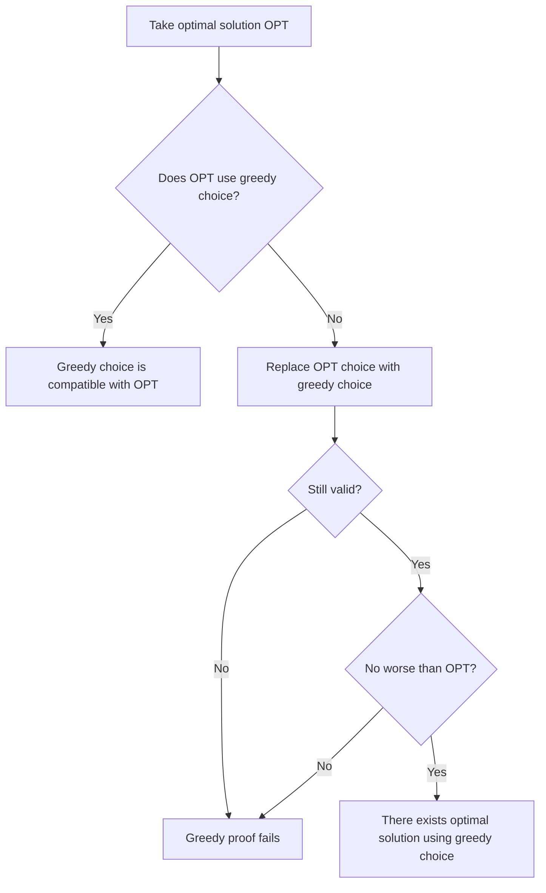
```mermaid
flowchart TD
    A["Take optimal solution OPT"] --> B{"Does OPT use greedy choice?"}
    B -->|Yes| C["Greedy choice is compatible with OPT"]
    B -->|No| D["Replace OPT choice with greedy choice"]
    D --> E{"Still valid?"}
    E -->|No| F["Greedy proof fails"]
    E -->|Yes| G{"No worse than OPT?"}
    G -->|No| F
    G -->|Yes| H["There exists optimal solution using greedy choice"]
```

## Example Proof: Activity Selection

Greedy rule:

```text
Always pick the interval with earliest finishing time.
```

Step-by-step proof:

```text
1. Let G be the interval that finishes earliest.
2. Let OPT be an optimal solution.
3. If OPT contains G, fine.
4. Otherwise, let A be the first interval chosen by OPT.
5. Since G finishes no later than A, replacing A with G keeps the schedule valid.
6. The number of intervals stays the same.
7. Therefore there is an optimal solution that starts with G.
8. Repeat for remaining intervals.
```

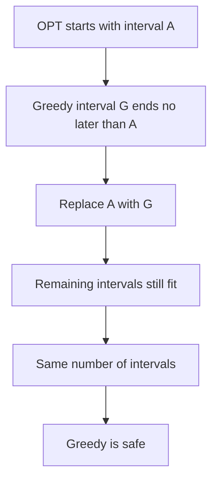
```mermaid
flowchart TD
    A["OPT starts with interval A"] --> B["Greedy interval G ends no later than A"]
    B --> C["Replace A with G"]
    C --> D["Remaining intervals still fit"]
    D --> E["Same number of intervals"]
    E --> F["Greedy is safe"]
```

## Example Proof: Assign Cookies

Greedy rule:

```text
Give the smallest cookie that can satisfy the least greedy unsatisfied child.
```

Proof:

```text
If the least greedy child can be satisfied by a small cookie,
using a bigger cookie is never better.
Swap the bigger cookie with the smaller cookie.
The child remains satisfied.
The bigger cookie is saved for a harder child.
```

## Example Proof: Huffman Coding

Greedy rule:

```text
Merge the two smallest frequencies first.
```

Intuition:

```text
The deepest leaves should have smallest frequencies.
If a larger frequency is deeper than a smaller frequency,
swap them and cost does not increase.
Therefore two smallest can be siblings at deepest level.
Merge them and solve smaller problem.
```

---

# 5. Difficulty Roadmap

| Level | Target | Must Master |
|---|---|---|
| Newbie | local choice basics | sort, pick min/max, one-pass greedy |
| Pupil | common interview greedy | intervals, jump game, stock, assign resources |
| Specialist | heap and interval greedy | meeting rooms, task scheduling, partition labels |
| Expert | proof-based greedy | exchange argument, MST, Huffman, deadlines |
| Candidate Master | non-standard greedy | constructive greedy, DSU greedy, greedy + binary search |
| FAANG | explanation clarity | brute force → greedy insight → proof → edge cases |

---

# 6. Master Pattern Map


```mermaid
flowchart TD
    A["Greedy Algorithms"] --> B["Sort and Pick"]
    A --> C["Intervals"]
    A --> D["One Pass Tracking"]
    A --> E["Heap Greedy"]
    A --> F["Graph Greedy"]
    A --> G["Binary Search Check"]
    A --> H["Constructive Greedy"]
    A --> I["Stack Greedy"]
    A --> J["DSU Greedy"]

    B --> B1["Smallest Sufficient"]
    B --> B2["Largest First"]
    B --> B3["Sort by Ratio"]

    C --> C1["Earliest Finish"]
    C --> C2["Merge Intervals"]
    C --> C3["Cover Range"]
    C --> C4["Remove Overlaps"]

    D --> D1["Min So Far"]
    D --> D2["Max Reach"]
    D --> D3["Balance Counters"]

    E --> E1["Dynamic Best Choice"]
    E --> E2["Top K"]
    E --> E3["Scheduling"]

    F --> F1["Kruskal MST"]
    F --> F2["Prim MST"]
    F --> F3["Dijkstra Greedy"]

    G --> G1["Aggressive Cows"]
    G --> G2["Minimize Maximum"]
    G --> G3["Feasibility Check"]

    H --> H1["Build Answer"]
    H --> H2["Lexicographic Greedy"]
    H --> H3["Invariant Construction"]

    I --> I1["Remove K Digits"]
    I --> I2["Smallest Subsequence"]

    J --> J1["Job Deadlines"]
    J --> J2["Kruskal"]
```

---

# 7. C++ Greedy Template Pack

```cpp
#include <bits/stdc++.h>
using namespace std;

using ll = long long;
```

## Sort and Scan

```cpp
sort(a.begin(), a.end());

long long ans = 0;

for (auto x : a) {
    if (canTake(x)) {
        take(x);
        update(ans);
    }
}
```

## Interval Sort by End

```cpp
sort(intervals.begin(), intervals.end(), [](auto& x, auto& y) {
    if (x[1] != y[1]) return x[1] < y[1];
    return x[0] < y[0];
});
```

## Heap Greedy

```cpp
priority_queue<int> pq;

for (auto event : events) {
    addAvailableChoices(event, pq);

    if (!pq.empty()) {
        int best = pq.top();
        pq.pop();
        use(best);
    }
}
```

## DSU

```cpp
struct DSU {
    vector<int> parent, size;

    DSU(int n) {
        parent.resize(n + 1);
        size.assign(n + 1, 1);
        iota(parent.begin(), parent.end(), 0);
    }

    int find(int x) {
        if (parent[x] == x) return x;
        return parent[x] = find(parent[x]);
    }

    bool unite(int a, int b) {
        a = find(a);
        b = find(b);

        if (a == b) return false;

        if (size[a] < size[b]) swap(a, b);

        parent[b] = a;
        size[a] += size[b];
        return true;
    }
};
```


# 8. Form A: Sort and Pick Smallest or Largest

## Pattern

Sort to make the best current choice obvious.

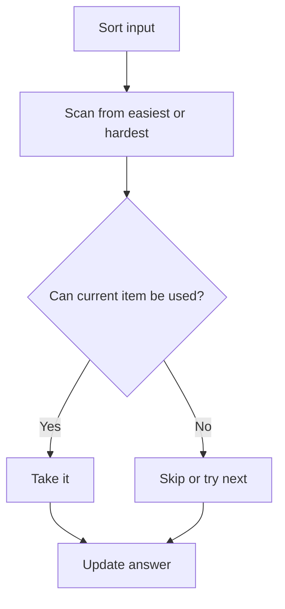
```mermaid
flowchart TD
    A["Sort input"] --> B["Scan from easiest or hardest"]
    B --> C{"Can current item be used?"}
    C -->|Yes| D["Take it"]
    C -->|No| E["Skip or try next"]
    D --> F["Update answer"]
    E --> F
```

## A1. Assign Cookies

### Intuition

Use the smallest cookie that satisfies the least greedy child.

### Simulation

```text
children = 1 2 3
cookies  = 1 1

child 1 gets cookie 1
child 2 cannot get cookie 1
answer = 1
```

### C++

```cpp
int findContentChildren(vector<int>& g, vector<int>& s) {
    sort(g.begin(), g.end());
    sort(s.begin(), s.end());

    int child = 0;
    int cookie = 0;

    while (child < (int)g.size() && cookie < (int)s.size()) {
        if (s[cookie] >= g[child]) {
            child++;
        }
        cookie++;
    }

    return child;
}
```

## A2. Boats to Save People

```cpp
int numRescueBoats(vector<int>& people, int limit) {
    sort(people.begin(), people.end());

    int left = 0;
    int right = (int)people.size() - 1;
    int boats = 0;

    while (left <= right) {
        if (people[left] + people[right] <= limit) {
            left++;
        }

        right--;
        boats++;
    }

    return boats;
}
```

---

# 9. Form B: Earliest Finish Interval Greedy

## Pattern

For maximum non-overlapping intervals:

```text
Sort by ending time.
Pick interval if start is after previous end.
```

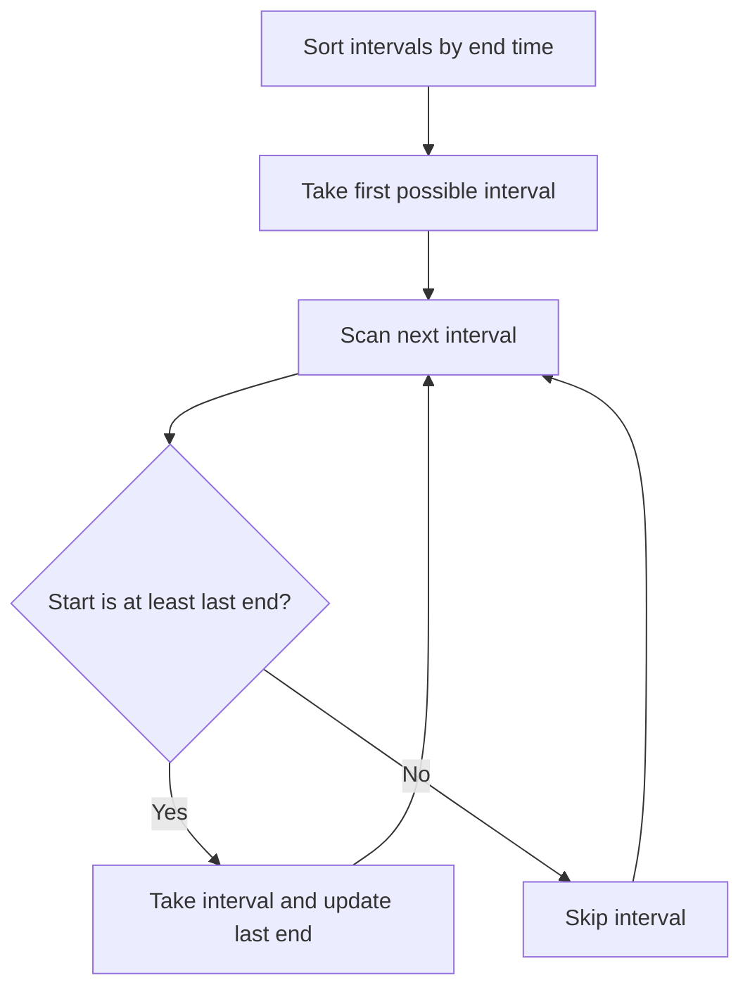
```mermaid
flowchart TD
    A["Sort intervals by end time"] --> B["Take first possible interval"]
    B --> C["Scan next interval"]
    C --> D{"Start is at least last end?"}
    D -->|Yes| E["Take interval and update last end"]
    D -->|No| F["Skip interval"]
    E --> C
    F --> C
```

## B1. Activity Selection

### Simulation

```text
intervals:
1-3, 2-5, 4-7, 6-9, 8-10

sort by end:
1-3, 2-5, 4-7, 6-9, 8-10

take 1-3
skip 2-5
take 4-7
skip 6-9
take 8-10
answer = 3
```

### C++

```cpp
int maxNonOverlapping(vector<vector<int>>& intervals) {
    sort(intervals.begin(), intervals.end(), [](auto& a, auto& b) {
        return a[1] < b[1];
    });

    int count = 0;
    int lastEnd = INT_MIN;

    for (auto& in : intervals) {
        if (in[0] >= lastEnd) {
            count++;
            lastEnd = in[1];
        }
    }

    return count;
}
```

## B2. Non-overlapping Intervals

```cpp
int eraseOverlapIntervals(vector<vector<int>>& intervals) {
    sort(intervals.begin(), intervals.end(), [](auto& a, auto& b) {
        return a[1] < b[1];
    });

    int keep = 0;
    int lastEnd = INT_MIN;

    for (auto& in : intervals) {
        if (in[0] >= lastEnd) {
            keep++;
            lastEnd = in[1];
        }
    }

    return (int)intervals.size() - keep;
}
```

---

# 10. Form C: Greedy With Min or Max So Far

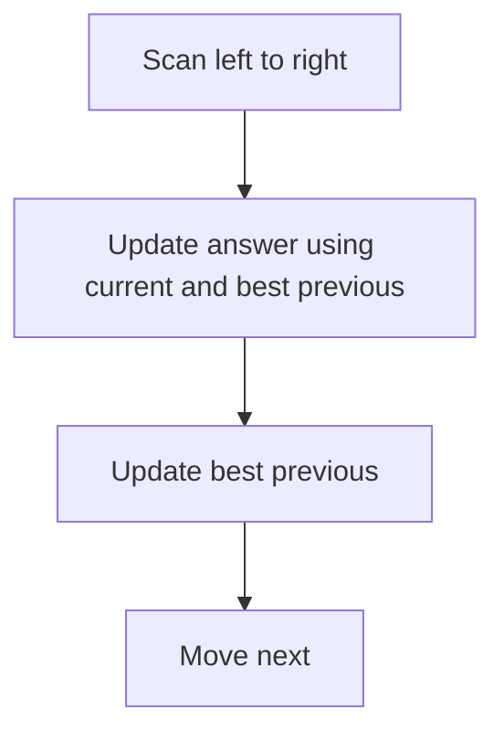
```mermaid
flowchart TD
    A["Scan left to right"] --> B["Update answer using current and best previous"]
    B --> C["Update best previous"]
    C --> D["Move next"]
```

## C1. Best Time to Buy and Sell Stock

```cpp
int maxProfit(vector<int>& prices) {
    int minPrice = INT_MAX;
    int best = 0;

    for (int price : prices) {
        best = max(best, price - minPrice);
        minPrice = min(minPrice, price);
    }

    return best;
}
```

## C2. Maximum Subarray as Greedy Kadane

```cpp
int maxSubArray(vector<int>& nums) {
    int cur = nums[0];
    int best = nums[0];

    for (int i = 1; i < (int)nums.size(); i++) {
        cur = max(nums[i], cur + nums[i]);
        best = max(best, cur);
    }

    return best;
}
```

---

# 11. Form D: Forward Reachability Greedy

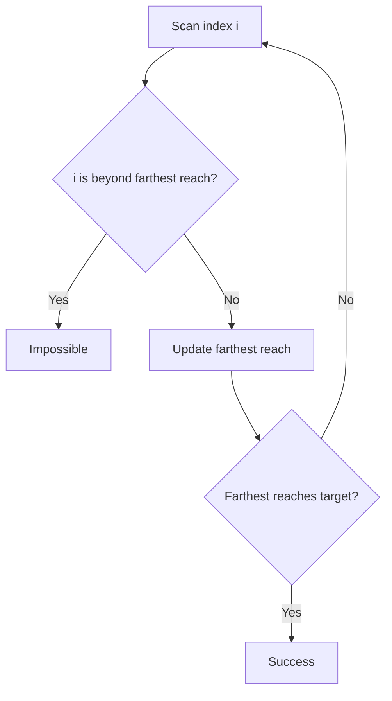
```mermaid
flowchart TD
    A["Scan index i"] --> B{"i is beyond farthest reach?"}
    B -->|Yes| C["Impossible"]
    B -->|No| D["Update farthest reach"]
    D --> E{"Farthest reaches target?"}
    E -->|Yes| F["Success"]
    E -->|No| A
```

## D1. Jump Game

```cpp
bool canJump(vector<int>& nums) {
    int farthest = 0;

    for (int i = 0; i < (int)nums.size(); i++) {
        if (i > farthest) return false;

        farthest = max(farthest, i + nums[i]);

        if (farthest >= (int)nums.size() - 1) return true;
    }

    return true;
}
```

## D2. Jump Game II

```cpp
int jump(vector<int>& nums) {
    int jumps = 0;
    int currentEnd = 0;
    int farthest = 0;

    for (int i = 0; i < (int)nums.size() - 1; i++) {
        farthest = max(farthest, i + nums[i]);

        if (i == currentEnd) {
            jumps++;
            currentEnd = farthest;
        }
    }

    return jumps;
}
```

---

# 12. Form E: Greedy With Intervals

| Goal | Sort Key | Greedy Choice |
|---|---|---|
| max non-overlap | end ascending | take earliest ending |
| remove overlaps | end ascending | keep earliest ending |
| merge intervals | start ascending | extend current end |
| minimum arrows | end ascending | shoot at earliest end |
| cover target range | start ascending | among available choose farthest end |
| meeting rooms | start/end events | track active meetings |

## E1. Minimum Number of Arrows to Burst Balloons

```cpp
int findMinArrowShots(vector<vector<int>>& points) {
    sort(points.begin(), points.end(), [](auto& a, auto& b) {
        return a[1] < b[1];
    });

    int arrows = 0;
    long long lastArrow = LLONG_MIN;

    for (auto& p : points) {
        if (p[0] > lastArrow) {
            arrows++;
            lastArrow = p[1];
        }
    }

    return arrows;
}
```

## E2. Merge Intervals

```cpp
vector<vector<int>> merge(vector<vector<int>>& intervals) {
    sort(intervals.begin(), intervals.end());

    vector<vector<int>> ans;

    for (auto& in : intervals) {
        if (ans.empty() || ans.back()[1] < in[0]) {
            ans.push_back(in);
        } else {
            ans.back()[1] = max(ans.back()[1], in[1]);
        }
    }

    return ans;
}
```

---

# 13. Form F: Greedy With Heap

Use heap when the best available choice changes dynamically.

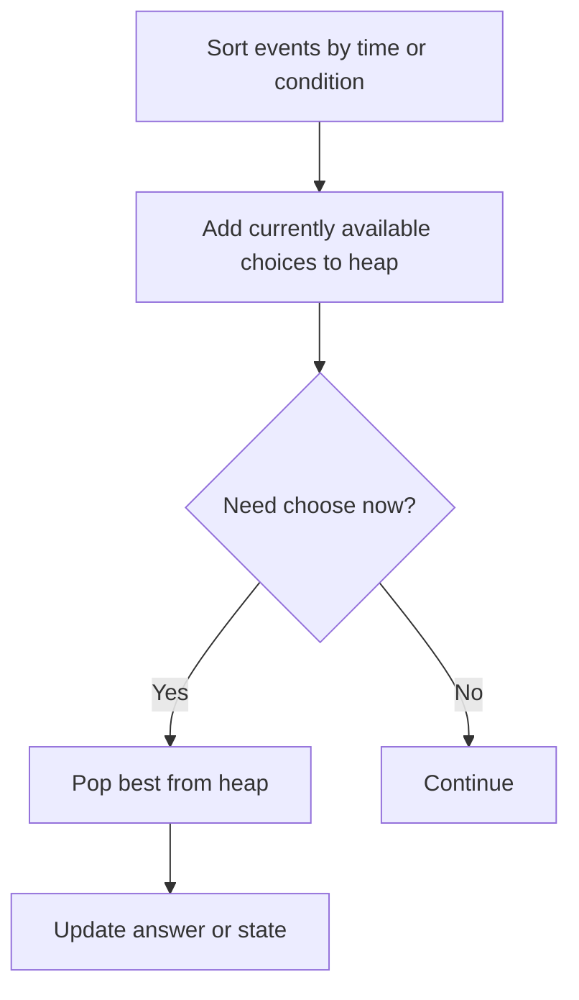
```mermaid
flowchart TD
    A["Sort events by time or condition"] --> B["Add currently available choices to heap"]
    B --> C{"Need choose now?"}
    C -->|Yes| D["Pop best from heap"]
    C -->|No| E["Continue"]
    D --> F["Update answer or state"]
```

## F1. Meeting Rooms II

```cpp
int minMeetingRooms(vector<vector<int>>& intervals) {
    sort(intervals.begin(), intervals.end());

    priority_queue<int, vector<int>, greater<int>> pq;

    for (auto& in : intervals) {
        if (!pq.empty() && pq.top() <= in[0]) {
            pq.pop();
        }

        pq.push(in[1]);
    }

    return pq.size();
}
```

## F2. Course Schedule III

Exchange proof:

```text
When total time exceeds current deadline, one chosen course must be removed.
Removing the longest course frees maximum time.
This cannot be worse than removing any shorter course.
```

```cpp
int scheduleCourse(vector<vector<int>>& courses) {
    sort(courses.begin(), courses.end(), [](auto& a, auto& b) {
        return a[1] < b[1];
    });

    priority_queue<int> maxHeap;
    int total = 0;

    for (auto& c : courses) {
        int duration = c[0];
        int deadline = c[1];

        total += duration;
        maxHeap.push(duration);

        if (total > deadline) {
            total -= maxHeap.top();
            maxHeap.pop();
        }
    }

    return maxHeap.size();
}
```

---

# 14. Form G: Greedy With Two Pointers

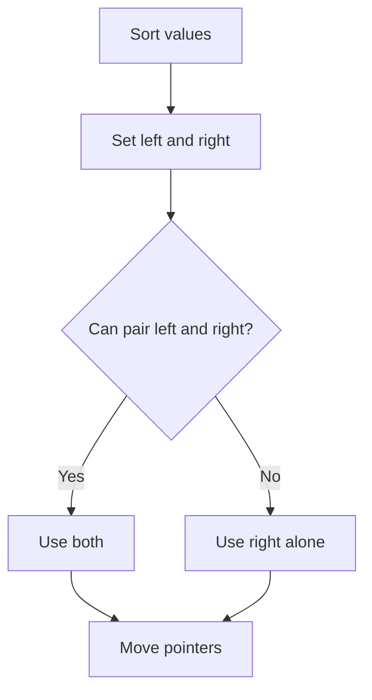
```mermaid
flowchart TD
    A["Sort values"] --> B["Set left and right"]
    B --> C{"Can pair left and right?"}
    C -->|Yes| D["Use both"]
    C -->|No| E["Use right alone"]
    D --> F["Move pointers"]
    E --> F
```

## G1. Bag of Tokens

```cpp
int bagOfTokensScore(vector<int>& tokens, int power) {
    sort(tokens.begin(), tokens.end());

    int left = 0;
    int right = (int)tokens.size() - 1;
    int score = 0;
    int best = 0;

    while (left <= right) {
        if (power >= tokens[left]) {
            power -= tokens[left];
            score++;
            best = max(best, score);
            left++;
        } else if (score > 0) {
            power += tokens[right];
            score--;
            right--;
        } else {
            break;
        }
    }

    return best;
}
```

---

# 15. Form H: Greedy With Stack

Maintain a monotonic stack and remove worse previous choices.

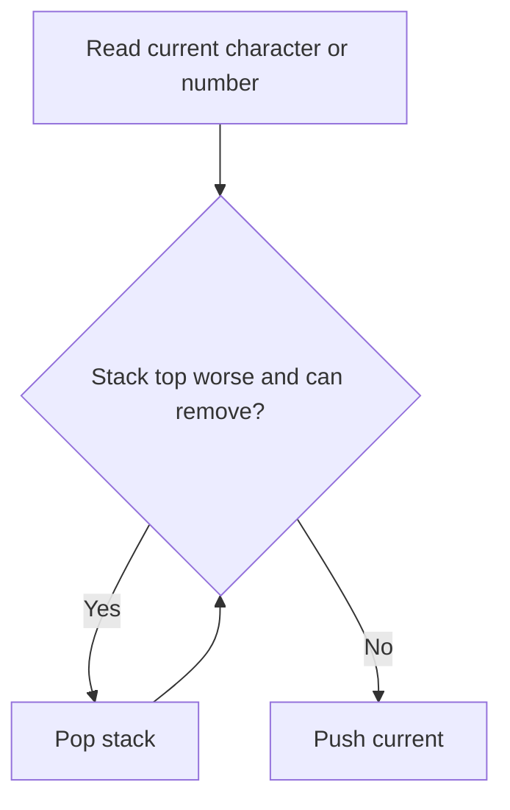
```mermaid
flowchart TD
    A["Read current character or number"] --> B{"Stack top worse and can remove?"}
    B -->|Yes| C["Pop stack"]
    C --> B
    B -->|No| D["Push current"]
```

## H1. Remove K Digits

```cpp
string removeKdigits(string num, int k) {
    string st;

    for (char c : num) {
        while (!st.empty() && k > 0 && st.back() > c) {
            st.pop_back();
            k--;
        }

        st.push_back(c);
    }

    while (k > 0 && !st.empty()) {
        st.pop_back();
        k--;
    }

    int pos = 0;
    while (pos < (int)st.size() && st[pos] == '0') pos++;

    string ans = st.substr(pos);
    return ans.empty() ? "0" : ans;
}
```

## H2. Smallest Subsequence of Distinct Characters

```cpp
string smallestSubsequence(string s) {
    vector<int> last(26, -1);
    vector<int> used(26, 0);

    for (int i = 0; i < (int)s.size(); i++) {
        last[s[i] - 'a'] = i;
    }

    string st;

    for (int i = 0; i < (int)s.size(); i++) {
        int x = s[i] - 'a';

        if (used[x]) continue;

        while (!st.empty() && st.back() > s[i] && last[st.back() - 'a'] > i) {
            used[st.back() - 'a'] = 0;
            st.pop_back();
        }

        st.push_back(s[i]);
        used[x] = 1;
    }

    return st;
}
```


# 16. Form I: Greedy With DSU

DSU helps greedily occupy the latest available slot or merge components.

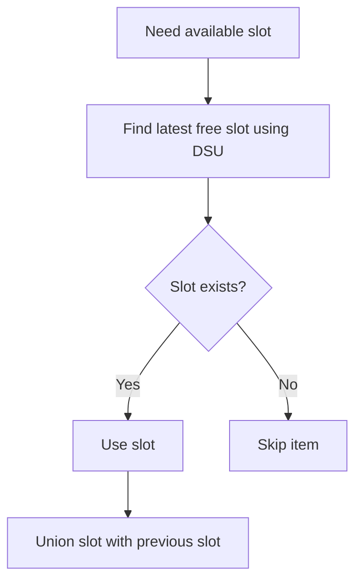
```mermaid
flowchart TD
    A["Need available slot"] --> B["Find latest free slot using DSU"]
    B --> C{"Slot exists?"}
    C -->|Yes| D["Use slot"]
    D --> E["Union slot with previous slot"]
    C -->|No| F["Skip item"]
```

## I1. Job Sequencing With Deadlines

Greedy rule:

```text
Sort jobs by profit descending.
Put each job in the latest free slot before its deadline.
```

```cpp
struct DeadlineDSU {
    vector<int> parent;

    DeadlineDSU(int n) {
        parent.resize(n + 1);
        iota(parent.begin(), parent.end(), 0);
    }

    int find(int x) {
        if (parent[x] == x) return x;
        return parent[x] = find(parent[x]);
    }

    void occupy(int x) {
        parent[x] = find(x - 1);
    }
};

int jobScheduling(vector<pair<int,int>>& jobs) {
    // jobs: {deadline, profit}
    sort(jobs.begin(), jobs.end(), [](auto& a, auto& b) {
        return a.second > b.second;
    });

    int maxDeadline = 0;
    for (auto& j : jobs) maxDeadline = max(maxDeadline, j.first);

    DeadlineDSU dsu(maxDeadline);

    int profit = 0;

    for (auto& job : jobs) {
        int deadline = job.first;
        int p = job.second;

        int slot = dsu.find(deadline);

        if (slot > 0) {
            profit += p;
            dsu.occupy(slot);
        }
    }

    return profit;
}
```

---

# 17. Form J: Graph Greedy and MST

## J1. Kruskal MST

Greedy rule:

```text
Pick the smallest edge that does not create a cycle.
```

Exchange proof:

```text
Take the smallest edge crossing some cut.
Any MST must connect the two sides.
If MST uses a heavier edge across this cut,
replace it with the smaller edge.
The graph remains connected and cost does not increase.
```

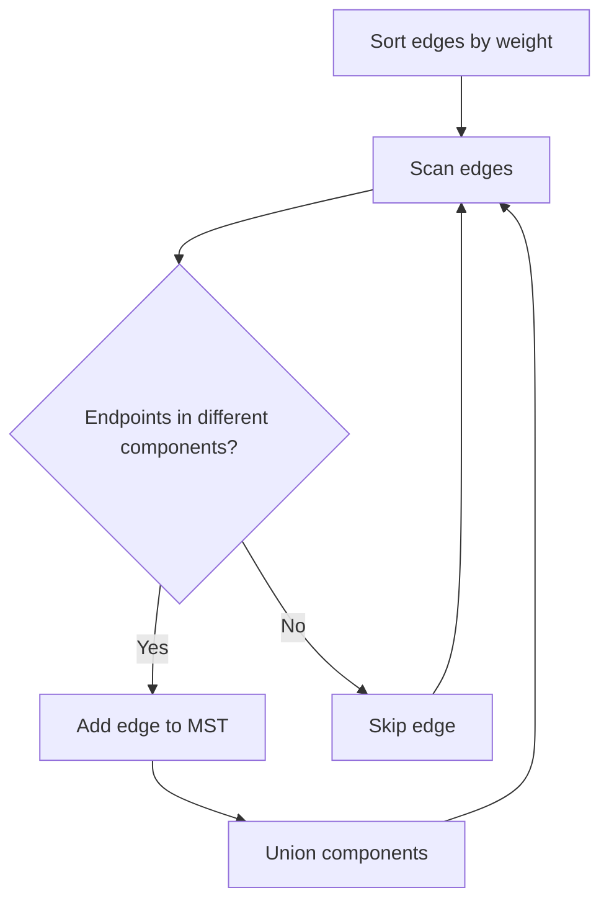
```mermaid
flowchart TD
    A["Sort edges by weight"] --> B["Scan edges"]
    B --> C{"Endpoints in different components?"}
    C -->|Yes| D["Add edge to MST"]
    D --> E["Union components"]
    C -->|No| F["Skip edge"]
    E --> B
    F --> B
```

```cpp
struct Edge {
    int u, v;
    int w;
};

long long kruskal(int n, vector<Edge>& edges) {
    sort(edges.begin(), edges.end(), [](const Edge& a, const Edge& b) {
        return a.w < b.w;
    });

    DSU dsu(n);
    long long cost = 0;
    int used = 0;

    for (auto& e : edges) {
        if (dsu.unite(e.u, e.v)) {
            cost += e.w;
            used++;
        }
    }

    if (used != n - 1) return -1;
    return cost;
}
```

---

# 18. Form K: Greedy With Binary Search Check

Binary search answer, use greedy to check feasibility.

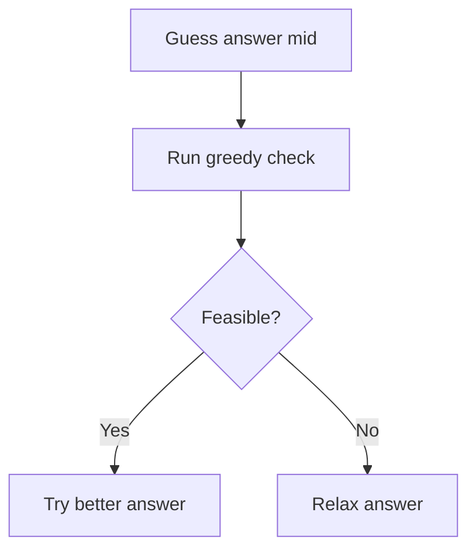
```mermaid
flowchart TD
    A["Guess answer mid"] --> B["Run greedy check"]
    B --> C{"Feasible?"}
    C -->|Yes| D["Try better answer"]
    C -->|No| E["Relax answer"]
```

## K1. Aggressive Cows / Maximize Minimum Distance

```cpp
bool canPlace(vector<int>& pos, int cows, int dist) {
    int count = 1;
    int last = pos[0];

    for (int i = 1; i < (int)pos.size(); i++) {
        if (pos[i] - last >= dist) {
            count++;
            last = pos[i];

            if (count >= cows) return true;
        }
    }

    return false;
}

int largestMinDistance(vector<int>& pos, int cows) {
    sort(pos.begin(), pos.end());

    int lo = 0;
    int hi = pos.back() - pos.front();
    int ans = 0;

    while (lo <= hi) {
        int mid = lo + (hi - lo) / 2;

        if (canPlace(pos, cows, mid)) {
            ans = mid;
            lo = mid + 1;
        } else {
            hi = mid - 1;
        }
    }

    return ans;
}
```

---

# 19. Form L: Huffman and Merge Cost Greedy

Always merge two smallest items.

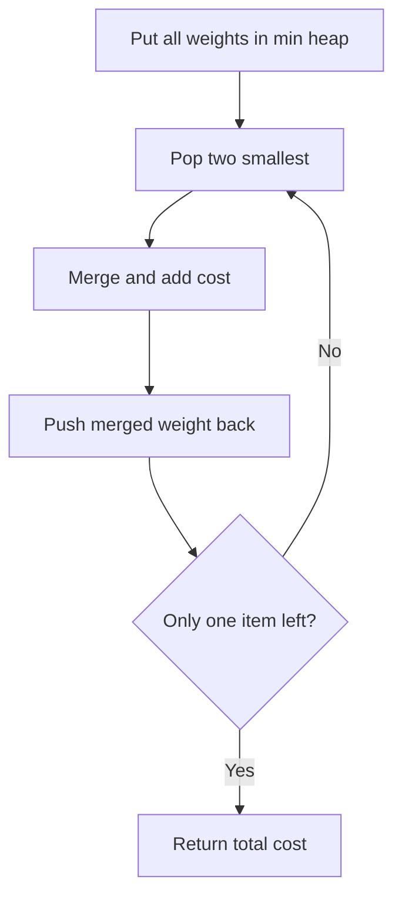
```mermaid
flowchart TD
    A["Put all weights in min heap"] --> B["Pop two smallest"]
    B --> C["Merge and add cost"]
    C --> D["Push merged weight back"]
    D --> E{"Only one item left?"}
    E -->|No| B
    E -->|Yes| F["Return total cost"]
```

## L1. Minimum Cost to Connect Sticks

```cpp
int connectSticks(vector<int>& sticks) {
    priority_queue<int, vector<int>, greater<int>> pq;

    for (int x : sticks) pq.push(x);

    int cost = 0;

    while (pq.size() > 1) {
        int a = pq.top();
        pq.pop();

        int b = pq.top();
        pq.pop();

        cost += a + b;
        pq.push(a + b);
    }

    return cost;
}
```

---

# 20. Form M: Scheduling and Deadlines

| Problem | Greedy |
|---|---|
| max jobs by deadline | sort by end/deadline |
| max profit with deadlines | profit descending + latest free slot |
| course schedule | deadline ascending + remove longest |
| CPU task scheduling | heap by frequency |
| meeting rooms | min heap of end times |

## M1. Task Scheduler

```cpp
int leastInterval(vector<char>& tasks, int n) {
    vector<int> freq(26, 0);

    for (char c : tasks) freq[c - 'A']++;

    int mx = *max_element(freq.begin(), freq.end());
    int cntMx = count(freq.begin(), freq.end(), mx);

    int frame = (mx - 1) * (n + 1) + cntMx;

    return max((int)tasks.size(), frame);
}
```

---

# 21. When Greedy Fails

| Signal | Better Pattern |
|---|---|
| choice affects future in complex way | DP |
| need try both take and skip | recursion/DP |
| local best blocks better global result | DP/search |
| shortest path with arbitrary weights | Dijkstra/Bellman-Ford |
| constraints are global not local | flow/matching/DP |
| cannot prove exchange/invariant | likely not greedy |

Failure example:

```text
coins = 1, 3, 4
amount = 6

Greedy largest coin:
4 + 1 + 1 = 3 coins

Optimal:
3 + 3 = 2 coins
```

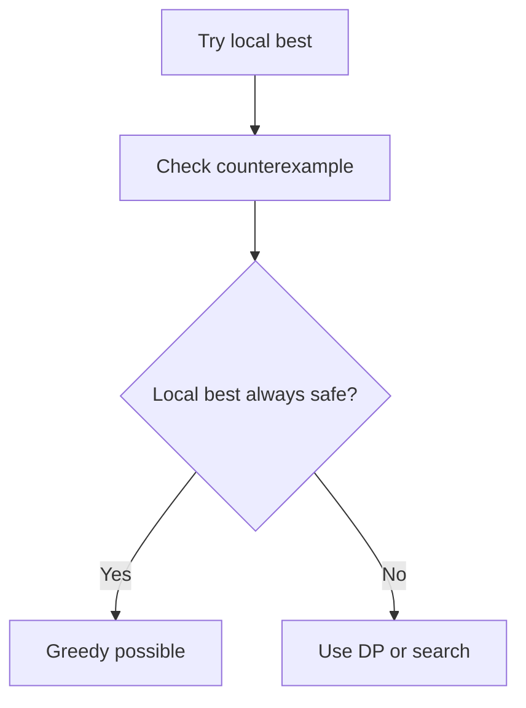
```mermaid
flowchart TD
    A["Try local best"] --> B["Check counterexample"]
    B --> C{"Local best always safe?"}
    C -->|Yes| D["Greedy possible"]
    C -->|No| E["Use DP or search"]
```

---

# 22. LC/FAANG Greedy Pattern Table

| Pattern | Recognition Signal | Greedy Tactic | Problems |
|---|---|---|---|
| assign smallest sufficient | resource allocation | sort both arrays | Assign Cookies |
| buy/sell once | max difference in order | track min so far | Best Time to Buy and Sell Stock |
| reach end | jumps/ranges | farthest reach | Jump Game |
| min jumps | range levels | current end and farthest | Jump Game II |
| gas station | circular deficit | reset start when tank negative | Gas Station |
| intervals | non-overlap/merge | sort by end/start | Merge Intervals, Non-overlap |
| partition string | last occurrence | close segment at max last | Partition Labels |
| dynamic scheduling | changing choices | heap | Meeting Rooms II, Course Schedule III |
| remove digits | lexicographic smallest | monotonic stack | Remove K Digits |
| frequency rearrange | most frequent first | heap | Reorganize String |
| MST | connect all cheaply | DSU + sort edges | Min Cost to Connect Points |
| binary search check | maximize minimum | greedy feasibility | Magnetic Force Between Balls |

---

# 23. Candidate Master Escalation Patterns

| CM Pattern | Basic Version | Advanced Version | Tactic |
|---|---|---|---|
| sort by key | simple sort | custom exchange proof | prove order |
| interval greedy | activity selection | covering/stabbing intervals | choose farthest/earliest |
| heap greedy | meeting rooms | deadlines/courses/top choices | dynamic best |
| DSU greedy | Kruskal | deadline slot allocation | latest available slot |
| MST | simple Kruskal | variants with constraints | cut property |
| binary search + greedy | placement | minimize max partition | monotonic check |
| constructive greedy | build answer | maintain invariant | prove possible |
| stack greedy | remove digits | lexicographic subsequence | pop while safe |
| two pointer greedy | pair people | pair extremes | exchange proof |
| scheduling | one machine | multiple constraints | profit/deadline heap |

---

# 24. Difficulty-Sorted Problem Set

## 24.1 Newbie Problems

| # | Problem | Platform | Link | Form | Pattern | Tactic | Intuition | Implementation |
|---:|---|---|---|---|---|---|---|---|
| 1 | Assign Cookies | LeetCode | https://leetcode.com/problems/assign-cookies/ | sort pick | smallest sufficient | sort both | save large cookies for harder children | two pointers |
| 2 | Best Time to Buy and Sell Stock | LeetCode | https://leetcode.com/problems/best-time-to-buy-and-sell-stock/ | one pass | min so far | track minimum | best sell uses cheapest previous buy | loop |
| 3 | Lemonade Change | LeetCode | https://leetcode.com/problems/lemonade-change/ | simulation greedy | give largest change first | keep bills | preserve small bills | counters |
| 4 | Can Place Flowers | LeetCode | https://leetcode.com/problems/can-place-flowers/ | local placement | place when possible | scan | placing early does not hurt | loop |
| 5 | Maximum Units on a Truck | LeetCode | https://leetcode.com/problems/maximum-units-on-a-truck/ | sort largest | value density | sort units desc | take most valuable boxes first | sort |
| 6 | Last Stone Weight | LeetCode | https://leetcode.com/problems/last-stone-weight/ | heap | two largest | max heap | operation always uses largest stones | heap |
| 7 | Minimum Cost to Move Chips | LeetCode | https://leetcode.com/problems/minimum-cost-to-move-chips-to-the-same-position/ | parity greedy | choose cheaper parity | count parity | same parity movement free | count |
| 8 | DI String Match | LeetCode | https://leetcode.com/problems/di-string-match/ | constructive | low/high pick | use smallest for I | satisfy inequality greedily | two pointers |
| 9 | Split a String in Balanced Strings | LeetCode | https://leetcode.com/problems/split-a-string-in-balanced-strings/ | balance counter | cut at zero | track balance | zero balance forms segment | loop |
| 10 | Ferris Wheel | CSES | https://cses.fi/problemset/task/1090 | pair extremes | two pointers | pair light and heavy | if pair fits, use both | sort |

## 24.2 Pupil / Easy-Medium Problems

| # | Problem | Platform | Link | Form | Pattern | Tactic | Intuition | Implementation |
|---:|---|---|---|---|---|---|---|---|
| 1 | Jump Game | LeetCode | https://leetcode.com/problems/jump-game/ | reachability | farthest reach | scan | reachable index can extend range | loop |
| 2 | Jump Game II | LeetCode | https://leetcode.com/problems/jump-game-ii/ | reachability | range layers | current end | each jump covers next range | loop |
| 3 | Gas Station | LeetCode | https://leetcode.com/problems/gas-station/ | circular greedy | reset bad prefix | tank balance | if start fails at i, earlier starts fail | loop |
| 4 | Partition Labels | LeetCode | https://leetcode.com/problems/partition-labels/ | interval string | last occurrence | close at max last | segment valid when all chars end inside | scan |
| 5 | Merge Intervals | LeetCode | https://leetcode.com/problems/merge-intervals/ | intervals | sort by start | extend end | overlapping intervals combine | sort |
| 6 | Non-overlapping Intervals | LeetCode | https://leetcode.com/problems/non-overlapping-intervals/ | intervals | earliest finish | keep max count | earliest end leaves more room | sort |
| 7 | Minimum Number of Arrows | LeetCode | https://leetcode.com/problems/minimum-number-of-arrows-to-burst-balloons/ | intervals | earliest shot | shoot at end | one arrow covers overlapping balloons | sort |
| 8 | Queue Reconstruction by Height | LeetCode | https://leetcode.com/problems/queue-reconstruction-by-height/ | constructive | tall first insert | sort height desc | shorter people do not affect taller counts | vector insert |
| 9 | Boats to Save People | LeetCode | https://leetcode.com/problems/boats-to-save-people/ | two pointers | pair extremes | heaviest decision | heaviest must go now | sort |
| 10 | Apartments | CSES | https://cses.fi/problemset/task/1084 | matching | sorted lists | move smaller | match closest acceptable | two pointers |
| 11 | Movie Festival | CSES | https://cses.fi/problemset/task/1629 | intervals | earliest finish | activity selection | finish early gives future options | sort |
| 12 | Books | Codeforces | https://codeforces.com/problemset/problem/279/B | greedy window | max under budget | two pointers | positive time gives monotonic window | sliding window |

## 24.3 Specialist / Medium Problems

| # | Problem | Platform | Link | Form | Pattern | Tactic | Intuition | Implementation |
|---:|---|---|---|---|---|---|---|---|
| 1 | Meeting Rooms II | LeetCode | https://leetcode.com/problems/meeting-rooms-ii/ | heap intervals | earliest ending room | min heap | reuse room that frees earliest | heap |
| 2 | Task Scheduler | LeetCode | https://leetcode.com/problems/task-scheduler/ | scheduling | frequency formula | max frequency | most frequent task creates frame | formula |
| 3 | Reorganize String | LeetCode | https://leetcode.com/problems/reorganize-string/ | heap | most frequent first | max heap | avoid same adjacent by delaying previous | heap |
| 4 | Hand of Straights | LeetCode | https://leetcode.com/problems/hand-of-straights/ | ordered greedy | start smallest group | map counts | smallest card must start a group | map |
| 5 | Divide Array in Sets of K Consecutive Numbers | LeetCode | https://leetcode.com/problems/divide-array-in-sets-of-k-consecutive-numbers/ | ordered greedy | smallest starts group | map | cannot be placed earlier | map |
| 6 | Car Pooling | LeetCode | https://leetcode.com/problems/car-pooling/ | sweep greedy | capacity over time | diff/events | passenger count never exceeds capacity | sort/diff |
| 7 | Candy | LeetCode | https://leetcode.com/problems/candy/ | two pass greedy | local rating constraints | left/right passes | each side constraint handled separately | arrays |
| 8 | Wiggle Subsequence | LeetCode | https://leetcode.com/problems/wiggle-subsequence/ | sequence greedy | count sign changes | track direction | only peaks and valleys matter | loop |
| 9 | Increasing Triplet Subsequence | LeetCode | https://leetcode.com/problems/increasing-triplet-subsequence/ | min values | first and second smallest | replace greedily | keep best candidates | loop |
| 10 | Remove K Digits | LeetCode | https://leetcode.com/problems/remove-k-digits/ | stack greedy | pop larger previous | monotonic stack | earlier larger digit hurts smaller number | stack |
| 11 | Smallest Subsequence | LeetCode | https://leetcode.com/problems/smallest-subsequence-of-distinct-characters/ | stack greedy | pop if appears later | monotonic stack | improve lexicographic order safely | stack |
| 12 | Tasks and Deadlines | CSES | https://cses.fi/problemset/task/1630 | scheduling | shortest processing first | sort duration | earlier completion increases reward | sort |
| 13 | 2D Plane 2N Points | AtCoder | https://atcoder.jp/contests/abc091/tasks/arc092_a | matching greedy | sort red/blue | choose best y | pair constraints | sort |
| 14 | Woodcutters | Codeforces | https://codeforces.com/problemset/problem/545/C | local greedy | cut left if possible | scan | choose left first to preserve right space | loop |
| 15 | Same Differences | Codeforces | https://codeforces.com/problemset/problem/1520/D | contrast | not greedy | map | recognize non-greedy grouping | hash |

## 24.4 Expert / Hard Problems

| # | Problem | Platform | Link | Form | Pattern | Tactic | Intuition | Implementation |
|---:|---|---|---|---|---|---|---|---|
| 1 | Course Schedule III | LeetCode | https://leetcode.com/problems/course-schedule-iii/ | deadline heap | remove longest | max heap | if over deadline, drop most expensive time | heap |
| 2 | Minimum Cost to Connect Sticks | LeetCode | https://leetcode.com/problems/minimum-cost-to-connect-sticks/ | Huffman | merge two smallest | min heap | small weights should be deep | heap |
| 3 | IPO | LeetCode | https://leetcode.com/problems/ipo/ | heap greedy | unlock by capital | max profit heap | among affordable choose highest profit | sort + heap |
| 4 | Maximum Performance of a Team | LeetCode | https://leetcode.com/problems/maximum-performance-of-a-team/ | sort + heap | fix min efficiency | keep top speeds | current efficiency is bottleneck | sort + heap |
| 5 | Minimum Number of Refueling Stops | LeetCode | https://leetcode.com/problems/minimum-number-of-refueling-stops/ | reach + heap | take largest previous fuel | max heap | when stuck, use best passed station | heap |
| 6 | Create Maximum Number | LeetCode | https://leetcode.com/problems/create-maximum-number/ | stack greedy | pick max subsequence | monotonic stack | choose lexicographically best digits | stack |
| 7 | Patching Array | LeetCode | https://leetcode.com/problems/patching-array/ | coverage greedy | maintain cover range | add missing cover | if cover up to x, add x plus one | loop |
| 8 | Split Array into Consecutive Subsequences | LeetCode | https://leetcode.com/problems/split-array-into-consecutive-subsequences/ | sequence greedy | extend existing first | maps | better to extend than start new | freq + need |
| 9 | Min Deletions for Unique Frequencies | LeetCode | https://leetcode.com/problems/minimum-deletions-to-make-character-frequencies-unique/ | frequency greedy | reduce duplicates | used set | decrease freq until unique | set |
| 10 | Minimize Deviation in Array | LeetCode | https://leetcode.com/problems/minimize-deviation-in-array/ | heap greedy | normalize then reduce max | max heap | only max even can decrease | heap |
| 11 | Road Reparation | CSES | https://cses.fi/problemset/task/1675 | MST | Kruskal | DSU | cheapest safe edges | sort edges |
| 12 | Stick Divisions | CSES | https://cses.fi/problemset/task/1161 | Huffman | merge smallest | min heap | optimal merge pattern | heap |
| 13 | Summer Vacation | AtCoder | https://atcoder.jp/contests/abc137/tasks/abc137_d | jobs heap | available jobs by day | max heap | each day choose best reward | heap |
| 14 | Complete the Projects | Codeforces | https://codeforces.com/problemset/problem/1203/F1 | scheduling | positive first, negative careful | sort | maintain rating feasibility | greedy |
| 15 | Salary Changing | Codeforces | https://codeforces.com/problemset/problem/1251/D | binary + greedy | median feasibility | check salary budget | greedy check candidate median | binary search |

## 24.5 Candidate Master / Advanced CP Problems

| # | Problem | Platform | Link | Form | Pattern | Tactic | Intuition | Implementation |
|---:|---|---|---|---|---|---|---|---|
| 1 | Road Reparation | CSES | https://cses.fi/problemset/task/1675 | MST | Kruskal | DSU | cut property | DSU |
| 2 | Flight Discount | CSES | https://cses.fi/problemset/task/1195 | graph greedy contrast | Dijkstra state | shortest path | not pure greedy, but greedy PQ proof | Dijkstra |
| 3 | Stick Divisions | CSES | https://cses.fi/problemset/task/1161 | Huffman | merge two smallest | min heap | exchange proof | heap |
| 4 | Movie Festival II | CSES | https://cses.fi/problemset/task/1632 | interval multiset | latest ending watcher | multiset | use watcher finishing closest before start | multiset |
| 5 | Towers | CSES | https://cses.fi/problemset/task/1073 | patience greedy | upper bound pile | multiset | place cube on smallest possible larger top | multiset |
| 6 | Binary String Reconstruction | Codeforces | https://codeforces.com/problemset/problem/1400/C | constructive greedy | force zeros | verify | build candidate then check | construction |
| 7 | Reading Books | Codeforces | https://codeforces.com/problemset/problem/1374/E1 | sorting categories | choose cheapest pairs | combine types | compare both-like vs pair of singles | sorting |
| 8 | Even-Odd Game | Codeforces | https://codeforces.com/problemset/problem/1472/D | game greedy | pick largest | parity scoring | largest remaining dominates | sort |
| 9 | Robot Collisions | Codeforces | https://codeforces.com/problemset/problem/1525/C | non-standard greedy | parity groups + stack | pair collisions | same parity positions interact | stack |
| 10 | Binary String To Subsequences | Codeforces | https://codeforces.com/problemset/problem/1399/D | constructive greedy | reuse opposite-ending sequence | sets | assign char to sequence needing it | sets |
| 11 | Printing Machine | AtCoder | https://atcoder.jp/contests/abc325/tasks/abc325_d | scheduling heap | earliest deadline active | min heap | choose expiring job first | heap |
| 12 | Cans and Openers | AtCoder | https://atcoder.jp/contests/abc312/tasks/abc312_f | selection greedy | sort categories | prefix best | combine choices efficiently | sorting |
| 13 | Packing Under Range Regulations | AtCoder | https://atcoder.jp/contests/abc214/tasks/abc214_e | interval scheduling | earliest deadline active | heap | assign each point to interval ending soonest | heap |
| 14 | Built? | AtCoder | https://atcoder.jp/contests/arc076/tasks/arc076_b | MST trick | sort by coordinates | candidate edges | only nearby coordinate edges matter | Kruskal |
| 15 | Megalomania | AtCoder | https://atcoder.jp/contests/abc131/tasks/abc131_d | deadlines | earliest deadline first | sort deadline | feasible schedule with EDD | sorting |
| 16 | Expedition | SPOJ | https://www.spoj.com/problems/EXPEDI/ | refuel heap | largest passed fuel | max heap | when stuck use best previous station | heap |
| 17 | Interval Scheduling | Kattis | https://open.kattis.com/problems/intervalscheduling | intervals | earliest finish | sort by end | classic activity selection | sort |
| 18 | Convention II | USACO | https://usaco.org/index.php?page=viewproblem2&cpid=859 | simulation heap | priority by seniority | events | dynamic scheduling with waiting | heap |
| 19 | Permutation Restoration | Codeforces | https://codeforces.com/problemset/problem/1701/D | constructive greedy | smallest available | deadlines | choose tightest deadline | heap |
| 20 | Tree Infection | Codeforces | https://codeforces.com/problemset/problem/1665/C | non-standard greedy | sort infection sizes | binary/greedy | reduce largest groups | proof |

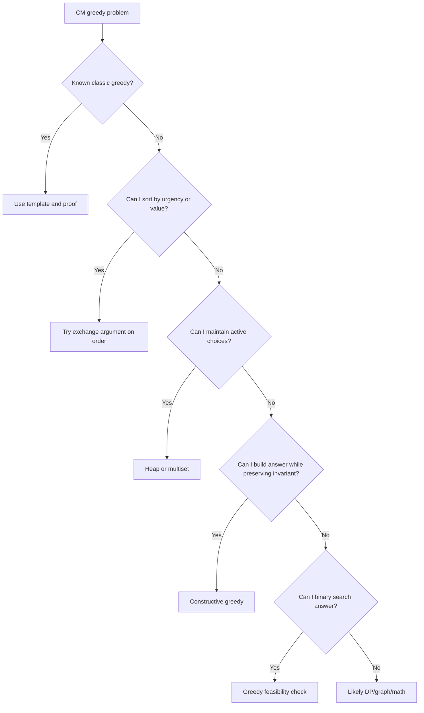
```mermaid
flowchart TD
    A["CM greedy problem"] --> B{"Known classic greedy?"}
    B -->|Yes| C["Use template and proof"]
    B -->|No| D{"Can I sort by urgency or value?"}
    D -->|Yes| E["Try exchange argument on order"]
    D -->|No| F{"Can I maintain active choices?"}
    F -->|Yes| G["Heap or multiset"]
    F -->|No| H{"Can I build answer while preserving invariant?"}
    H -->|Yes| I["Constructive greedy"]
    H -->|No| J{"Can I binary search answer?"}
    J -->|Yes| K["Greedy feasibility check"]
    J -->|No| L["Likely DP/graph/math"]
```

---

# 25. Final Revision Checklist

## Greedy Recognition

- [ ] Is there a natural local choice?
- [ ] Can sorting make decisions easier?
- [ ] Can I prove the sorting key?
- [ ] Does the local choice block a better future?
- [ ] Can I find a counterexample?
- [ ] Is a heap needed because choices change dynamically?
- [ ] Is DSU needed to find latest available slot?
- [ ] Is binary search needed because answer is monotonic?

## Exchange Argument

- [ ] Define greedy choice clearly.
- [ ] Take any optimal solution.
- [ ] If optimal differs, swap in greedy choice.
- [ ] Prove validity remains.
- [ ] Prove answer is not worse.
- [ ] Repeat recursively or inductively.

## Implementation

- [ ] Sort with correct comparator.
- [ ] Use `long long` for sums and costs.
- [ ] Choose min heap or max heap correctly.
- [ ] For intervals, check endpoint convention.
- [ ] For DSU deadlines, occupy latest possible slot.
- [ ] For stack greedy, pop only if future occurrence exists or removals remain.
- [ ] Test empty, one item, all equal, impossible case.

## When Greedy Fails

```text
If local choice has hidden future dependency, try DP.
If all choices must be explored, try recursion/backtracking.
If shortest path, use graph algorithms.
If feasibility is monotonic, try binary search + greedy check.
If no proof, do not blindly trust greedy.
```

---

# Appendix A: Problem-to-Form Quick Lookup

| Problem Type | Form | Template |
|---|---|---|
| assign resources | Sort and pick | two pointers |
| max meetings | Earliest finish | sort by end |
| merge intervals | Interval merge | sort by start |
| stock profit | Min so far | one pass |
| jump reach | Forward reach | farthest |
| dynamic best | Heap greedy | priority queue |
| lexicographic remove | Stack greedy | monotonic stack |
| job deadlines | DSU greedy | latest slot |
| MST | Kruskal | DSU |
| merge cost | Huffman | min heap |
| maximize minimum | Binary search check | greedy feasible |
| construct answer | Constructive greedy | invariant |

---

# Appendix B: GitHub-Safe Mermaid Rules

- Use quoted labels like `A["text"]`.
- Do not put raw square brackets inside labels.
- Keep one arrow statement per line.
- Avoid dense math notation in node labels.
- Use simple words instead of symbols where possible.
