# 📘 Constructive Algorithms — Visual Handbook Like Prefix Sum
## Newbie → FAANG/OA → Codeforces Master
> Focus: visual learning, clickable index, Mermaid flowcharts, tables, C++ code, dry runs, and problem ladder.

# 📑 Clickable Index

## Core
- [1. What Is Constructive Algorithms?](#1-what-is-constructive-algorithms)
- [2. Recognition Signals](#2-recognition-signals)
- [3. Master Framework](#3-master-framework)
- [4. Constructive vs Greedy vs DP vs Brute Force](#4-constructive-vs-greedy-vs-dp-vs-brute-force)
- [5. Framework Map: Concept → Forms → Tactics → Implementation](#5-framework-map-concept--forms--tactics--implementation)

## Beginner Frameworks
- [6. Framework A: Direct Construction](#6-framework-a-direct-construction)
- [7. Framework B: Fill Array With Constraints](#7-framework-b-fill-array-with-constraints)
- [8. Framework C: Permutation Construction](#8-framework-c-permutation-construction)
- [9. Framework D: Alternating High-Low Construction](#9-framework-d-alternating-high-low-construction)
- [10. Framework E: Left-to-Right Valid Building](#10-framework-e-left-to-right-valid-building)

## FAANG / OA Frameworks
- [11. Framework F: Frequency-Based Construction](#11-framework-f-frequency-based-construction)
- [12. Framework G: Heap-Based Construction](#12-framework-g-heap-based-construction)
- [13. Framework H: Prefix-Valid Construction](#13-framework-h-prefix-valid-construction)
- [14. Framework I: Simulation Construction](#14-framework-i-simulation-construction)
- [15. Framework J: Segment / Interval Construction](#15-framework-j-segment--interval-construction)

## Advanced CP Frameworks
- [16. Framework K: Math Construction](#16-framework-k-math-construction)
- [17. Framework L: Number Theory Construction](#17-framework-l-number-theory-construction)
- [18. Framework M: Bitwise Construction](#18-framework-m-bitwise-construction)
- [19. Framework N: Graph Construction](#19-framework-n-graph-construction)
- [20. Framework O: Reverse Construction](#20-framework-o-reverse-construction)
- [21. Framework P: Transformation Construction](#21-framework-p-transformation-construction)
- [22. Framework Q: Binary Search + Constructive Check](#22-framework-q-binary-search--constructive-check)

## Problem Ladder
- [23. Difficulty-Sorted Problem Ladder](#23-difficulty-sorted-problem-ladder)
- [24. Problems Grouped by Framework](#24-problems-grouped-by-framework)
- [25. Contest Proof Templates](#25-contest-proof-templates)
- [26. Master C++ Templates](#26-master-c-templates)
- [27. Final Revision Cheat Sheet](#27-final-revision-cheat-sheet)

---

# 1. What Is Constructive Algorithms?

A constructive algorithm builds **one valid answer** step by step.

It is not always trying to find the maximum or minimum answer. Many times the problem says:

```text
Print any valid answer.
```

That means you need a **construction rule**.

## Core Concept Table

| Idea | Simple Meaning |
|---|---|
| Build answer | create array/string/graph/matrix/operations |
| Maintain rule | every step should not break constraints |
| Use observation | find pattern hidden in problem |
| Avoid brute force | no need to try all possibilities |
| Often mixed with greedy | choose a safe next element |

## Visual Mental Model

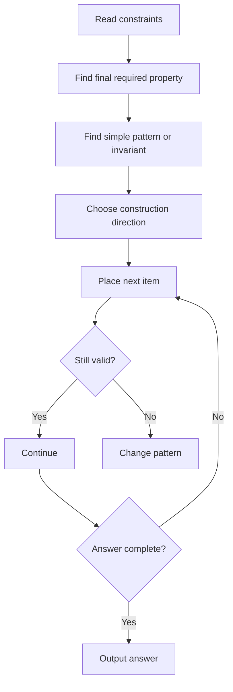

---

# 2. Recognition Signals

| Signal in Problem | Meaning |
|---|---|
| construct any | one valid answer is enough |
| find any valid | many answers accepted |
| output one possible | not optimization |
| rearrange | permutation/string construction |
| build sequence | array construction |
| print graph/tree | graph construction |
| print operations | transformation construction |
| if impossible print -1 | feasibility + construction |

## Recognition Flowchart

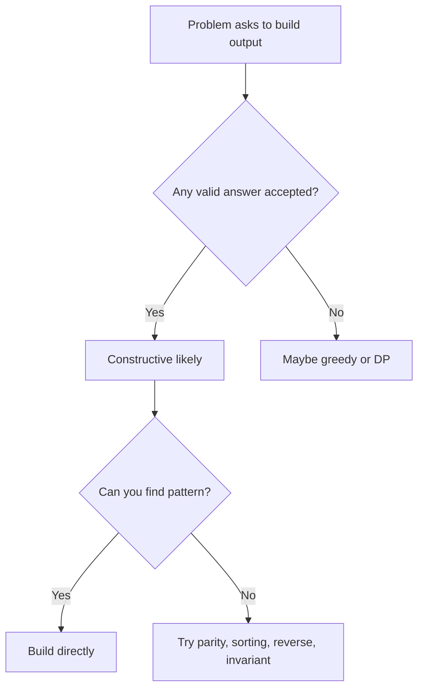

---

# 3. Master Framework

Use this for any constructive problem.

| Step | Question |
|---|---|
| 1 | What must final answer satisfy? |
| 2 | What cases are impossible? |
| 3 | What is the simplest valid base? |
| 4 | What direction should I build? |
| 5 | What invariant must never break? |
| 6 | Can I dry run small cases? |
| 7 | Can I prove it? |

## Master Flowchart

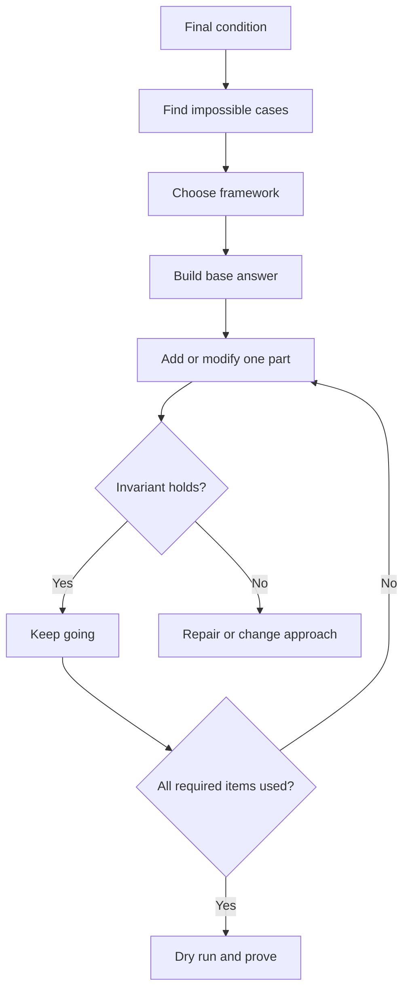

---

# 4. Constructive vs Greedy vs DP vs Brute Force

| Approach | Main Question | Example |
|---|---|---|
| Constructive | Can I build any valid answer? | print permutation |
| Greedy | Is local best always safe? | interval scheduling |
| DP | Does current choice affect future many ways? | knapsack |
| Brute Force | Are constraints tiny? | n <= 10 |

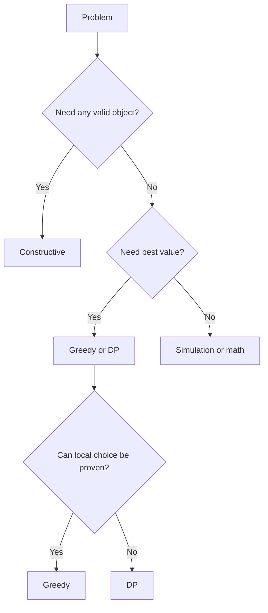

---

# 5. Framework Map: Concept → Forms → Tactics → Implementation

| Framework | Concept | Forms | Tactics | Implementation |
|---|---|---|---|---|
| Direct | formula/pattern answer | increasing, decreasing, fixed block | start from obvious | loops |
| Fill constraints | satisfy sum/range/count | min fill, max fill, balanced | feasibility first | vector + remaining |
| Permutation | reorder 1..n | parity, rotate, swap | avoid duplicates | used array / loop |
| Alternating | use extremes/parity | low-high, odd-even | two pointers | l/r pointers |
| Left-to-right | prefix always valid | strings, arrays, parentheses | choose safe next | loop / stack |
| Frequency | counts drive construction | bucket, map, sorted counts | count first | map/unordered_map |
| Heap | dynamic best choice | max freq, min available | pop best candidates | priority_queue |
| Prefix-valid | every prefix obeys rule | balance, prefix sum | never let prefix fail | counters |
| Simulation | apply rules exactly | grid, spiral, robot | maintain state | boundaries/queue |
| Segment | build blocks | intervals, partitions | extend block until safe | last occurrence |
| Math | formula gives answer | parity, sum, modulo | derive condition | arithmetic |
| Number theory | gcd/mod/prime | multiples, coprime, residues | use property | gcd/sieve |
| Bitwise | bit identity | xor pairs, powers of two | bits independent | xor/and/or |
| Graph | construct edges | chain, star, bipartite | base graph then add | edge list |
| Reverse | target to source | divide/subtract undo | reverse operations | stack/vector ops |
| Transformation | start valid then change | rotate/swap/repair | local repair | swaps/maps |
| BS + check | construct under limit | capacity check | monotonic possible | binary search |

---

# 6. Framework A: Direct Construction

## Concept

Use the simplest formula or pattern directly.

| Category | Notes |
|---|---|
| Forms | Increasing sequence, decreasing sequence, repeated pattern, fixed formula. |
| Tactics | Do not overthink. Try the obvious pattern first. |
| Example Problem | [CSES Weird Algorithm](https://cses.fi/problemset/task/1068) |
| Intuition | Construct the Collatz sequence until reaching 1. |

## Pattern Flowchart

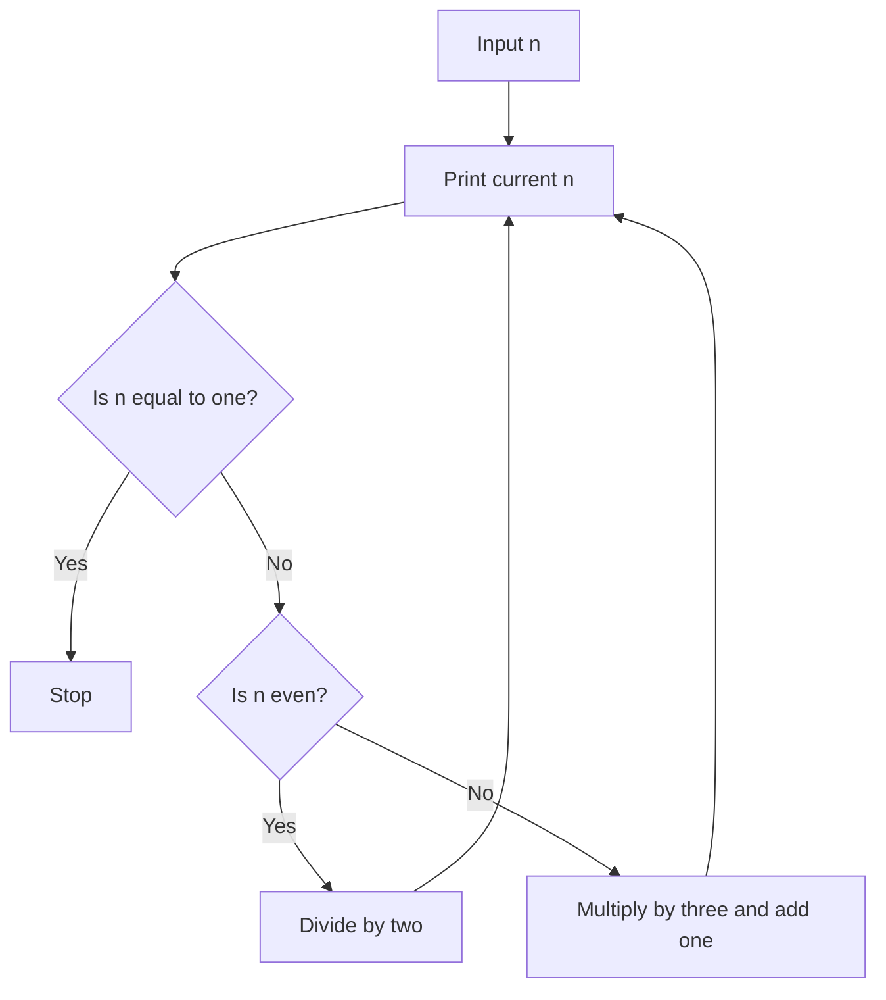

## C++ Implementation

```cpp
#include <bits/stdc++.h>
using namespace std;

int main() {
    long long n;
    cin >> n;

    while (true) {
        cout << n << " ";
        if (n == 1) break;

        if (n % 2 == 0) n /= 2;
        else n = 3 * n + 1;
    }
}
```

## Step-by-Step Simulation

| Step | State | Result |
|---|---|---|
| Start | `n=7` | `print 7` |
| Odd | `3*7+1=22` | `print 22` |
| Even | `22/2=11` | `print 11` |
| Odd | `3*11+1=34` | `print 34` |
| Continue | `...` | `reaches 1` |

## Proof Intuition

- State the invariant.
- Show every step keeps the invariant true.
- Show final answer uses the required number of elements/items.
- Handle impossible cases separately.

---

# 7. Framework B: Fill Array With Constraints

## Concept

Fill positions while satisfying sum, range, count, or capacity.

| Category | Notes |
|---|---|
| Forms | Start min then distribute, start max then reduce, balanced fill. |
| Tactics | Always check min possible and max possible first. |
| Example Problem | [Bounded Sum Array](#) |
| Intuition | Build n numbers in [L,R] with total sum S. |

## Pattern Flowchart

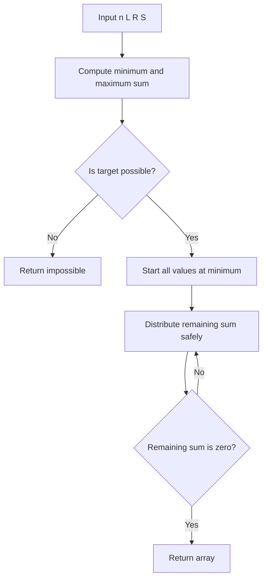

## C++ Implementation

```cpp
#include <bits/stdc++.h>
using namespace std;

vector<int> constructBoundedSum(int n, int L, int R, int S) {
    long long minSum = 1LL * n * L;
    long long maxSum = 1LL * n * R;

    if (S < minSum || S > maxSum) return {};

    vector<int> ans(n, L);
    int remaining = S - minSum;

    for (int i = 0; i < n; i++) {
        int add = min(remaining, R - L);
        ans[i] += add;
        remaining -= add;
    }

    return ans;
}
```

## Step-by-Step Simulation

| Step | State | Result |
|---|---|---|
| Initial | `n=4 L=1 R=10 S=23` | `[1,1,1,1], rem=19` |
| i=0 | `add 9` | `[10,1,1,1], rem=10` |
| i=1 | `add 9` | `[10,10,1,1], rem=1` |
| i=2 | `add 1` | `[10,10,2,1], rem=0` |

## Proof Intuition

- State the invariant.
- Show every step keeps the invariant true.
- Show final answer uses the required number of elements/items.
- Handle impossible cases separately.

---

# 8. Framework C: Permutation Construction

## Concept

Reorder numbers 1..n to satisfy a rule.

| Category | Notes |
|---|---|
| Forms | Parity grouping, rotation, adjacent swaps, extremes. |
| Tactics | Use all numbers exactly once; test n=1,2,3. |
| Example Problem | [CSES Permutations](https://cses.fi/problemset/task/1070) |
| Intuition | Print permutation where adjacent difference is never 1. |

## Pattern Flowchart

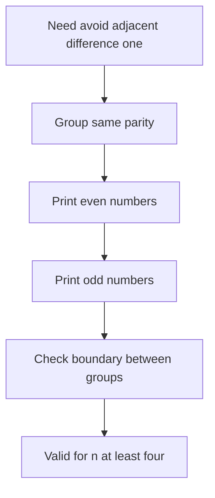

## C++ Implementation

```cpp
#include <bits/stdc++.h>
using namespace std;

int main() {
    int n;
    cin >> n;

    if (n == 1) {
        cout << 1 << "\n";
        return 0;
    }

    if (n <= 3) {
        cout << "NO SOLUTION\n";
        return 0;
    }

    for (int x = 2; x <= n; x += 2) cout << x << " ";
    for (int x = 1; x <= n; x += 2) cout << x << " ";
}
```

## Step-by-Step Simulation

| Step | State | Result |
|---|---|---|
| Evens | `2 4` | `[2,4]` |
| Odds | `1 3 5` | `[2,4,1,3,5]` |
| Check | `diffs 2,3,2,2` | `valid` |

## Proof Intuition

- State the invariant.
- Show every step keeps the invariant true.
- Show final answer uses the required number of elements/items.
- Handle impossible cases separately.

---

# 9. Framework D: Alternating High-Low Construction

## Concept

Use low and high values alternately.

| Category | Notes |
|---|---|
| Forms | low-high, high-low, odd-even, extremes pair. |
| Tactics | Good when you need large differences or wave shape. |
| Example Problem | [Wiggle Style Permutation](#) |
| Intuition | Construct low-high-low-high order. |

## Pattern Flowchart

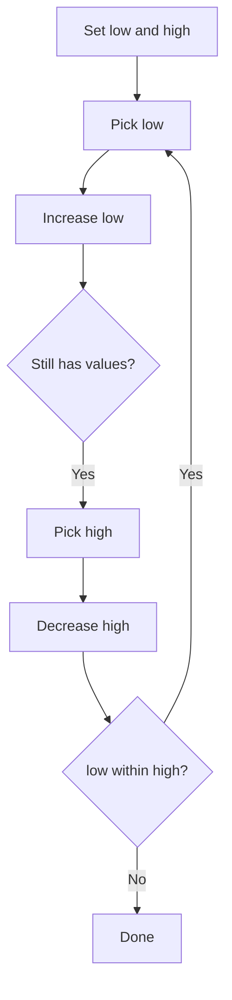

## C++ Implementation

```cpp
#include <bits/stdc++.h>
using namespace std;

vector<int> alternatingHighLow(int n) {
    int low = 1, high = n;
    vector<int> ans;

    while (low <= high) {
        ans.push_back(low++);
        if (low <= high) ans.push_back(high--);
    }

    return ans;
}
```

## Step-by-Step Simulation

| Step | State | Result |
|---|---|---|
| Step 1 | `pick 1` | `[1]` |
| Step 2 | `pick 7` | `[1,7]` |
| Step 3 | `pick 2` | `[1,7,2]` |
| Step 4 | `pick 6` | `[1,7,2,6]` |

## Proof Intuition

- State the invariant.
- Show every step keeps the invariant true.
- Show final answer uses the required number of elements/items.
- Handle impossible cases separately.

---

# 10. Framework E: Left-to-Right Valid Building

## Concept

Build each next position while keeping prefix valid.

| Category | Notes |
|---|---|
| Forms | Strings, parentheses, prefix sums, choose smallest safe. |
| Tactics | Think: what must be true after this prefix? |
| Example Problem | [Generate Parentheses](https://leetcode.com/problems/generate-parentheses/) |
| Intuition | Build valid parentheses using balance rules. |

## Pattern Flowchart

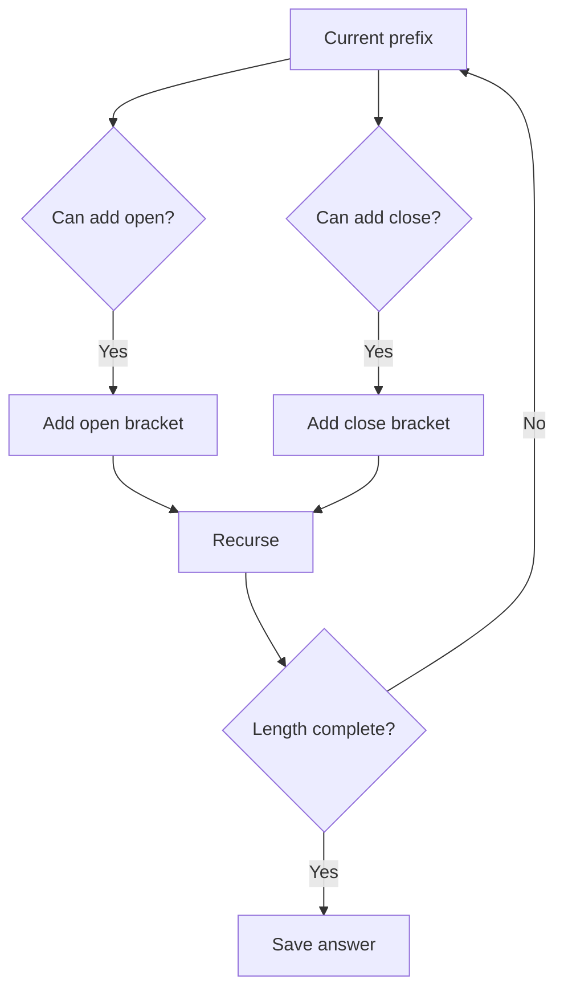

## C++ Implementation

```cpp
#include <bits/stdc++.h>
using namespace std;

void dfs(int open, int close, int n, string cur, vector<string>& ans) {
    if ((int)cur.size() == 2 * n) {
        ans.push_back(cur);
        return;
    }

    if (open < n) dfs(open + 1, close, n, cur + "(", ans);
    if (close < open) dfs(open, close + 1, n, cur + ")", ans);
}

vector<string> generateParenthesis(int n) {
    vector<string> ans;
    dfs(0, 0, n, "", ans);
    return ans;
}
```

## Step-by-Step Simulation

| Step | State | Result |
|---|---|---|
| Start | `open=0 close=0` | `` |
| Add open | `open=1` | `(` |
| Add open | `open=2` | `((` |
| Add close | `close=1` | `(()` |
| Rule | `close never exceeds open` | `prefix valid` |

## Proof Intuition

- State the invariant.
- Show every step keeps the invariant true.
- Show final answer uses the required number of elements/items.
- Handle impossible cases separately.

---

# 11. Framework F: Frequency-Based Construction

## Concept

Count items first, then construct using counts.

| Category | Notes |
|---|---|
| Forms | Buckets, maps, sorted frequencies, grouped output. |
| Tactics | Frequency tells what is possible and what order to build. |
| Example Problem | [Sort Characters By Frequency](https://leetcode.com/problems/sort-characters-by-frequency/) |
| Intuition | Build string with most frequent characters first. |

## Pattern Flowchart

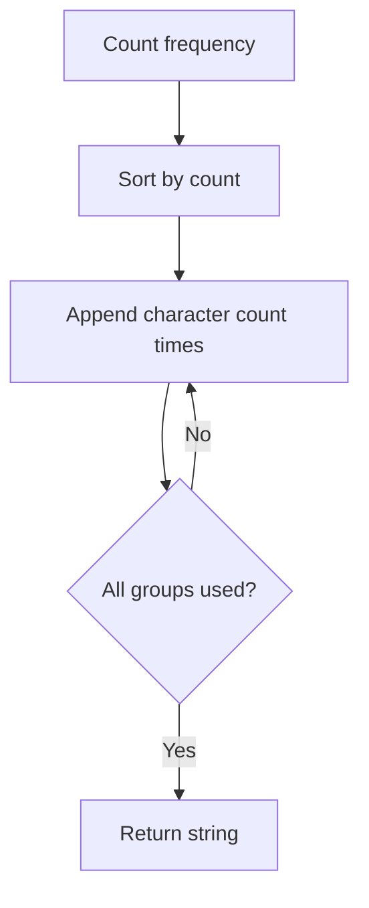

## C++ Implementation

```cpp
#include <bits/stdc++.h>
using namespace std;

string frequencySort(string s) {
    unordered_map<char,int> freq;
    for (char c : s) freq[c]++;

    vector<pair<int,char>> v;
    for (auto [ch, cnt] : freq) v.push_back({cnt, ch});

    sort(v.rbegin(), v.rend());

    string ans;
    for (auto [cnt, ch] : v) {
        ans += string(cnt, ch);
    }

    return ans;
}
```

## Step-by-Step Simulation

| Step | State | Result |
|---|---|---|
| Count | `tree` | `t:1 r:1 e:2` |
| Sort | `e first` | `e:2 t:1 r:1` |
| Build | `ee + t + r` | `eetr` |

## Proof Intuition

- State the invariant.
- Show every step keeps the invariant true.
- Show final answer uses the required number of elements/items.
- Handle impossible cases separately.

---

# 12. Framework G: Heap-Based Construction

## Concept

Use priority queue when the best available choice changes after every step.

| Category | Notes |
|---|---|
| Forms | Max heap for most frequent, min heap for smallest available, heap plus queue for cooldown. |
| Tactics | Pop safe candidates, update count, push back. |
| Example Problem | [Reorganize String](https://leetcode.com/problems/reorganize-string/) |
| Intuition | Rearrange so no adjacent characters are equal. |

## Pattern Flowchart

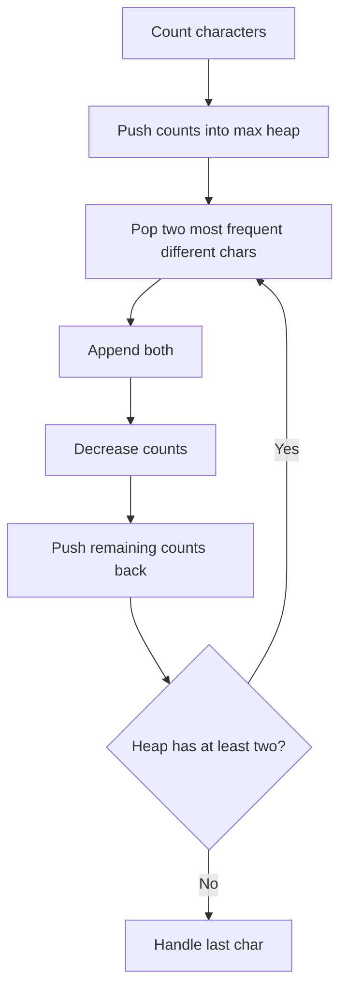

## C++ Implementation

```cpp
#include <bits/stdc++.h>
using namespace std;

string reorganizeString(string s) {
    unordered_map<char,int> freq;
    for (char c : s) freq[c]++;

    priority_queue<pair<int,char>> pq;
    for (auto [ch,cnt] : freq) pq.push({cnt,ch});

    string ans;

    while (pq.size() >= 2) {
        auto a = pq.top(); pq.pop();
        auto b = pq.top(); pq.pop();

        ans += a.second;
        ans += b.second;

        a.first--;
        b.first--;

        if (a.first > 0) pq.push(a);
        if (b.first > 0) pq.push(b);
    }

    if (!pq.empty()) {
        auto last = pq.top(); pq.pop();
        if (last.first > 1) return "";
        if (!ans.empty() && ans.back() == last.second) return "";
        ans += last.second;
    }

    return ans;
}
```

## Step-by-Step Simulation

| Step | State | Result |
|---|---|---|
| Count | `aaabbc` | `a:3 b:2 c:1` |
| Pick | `a and b` | `ab` |
| Pick | `a and c` | `abac` |
| Pick | `b and a` | `abacba` |

## Proof Intuition

- State the invariant.
- Show every step keeps the invariant true.
- Show final answer uses the required number of elements/items.
- Handle impossible cases separately.

---

# 13. Framework H: Prefix-Valid Construction

## Concept

Every prefix must obey the rule.

| Category | Notes |
|---|---|
| Forms | Balance, nonnegative prefix sum, valid parenthesis, lexicographic valid. |
| Tactics | Never allow prefix to become invalid. |
| Example Problem | [Minimum Remove to Make Valid Parentheses](https://leetcode.com/problems/minimum-remove-to-make-valid-parentheses/) |
| Intuition | Remove invalid parentheses so remaining string is valid. |

## Pattern Flowchart

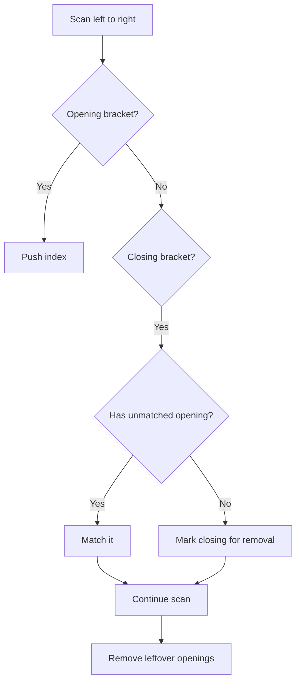

## C++ Implementation

```cpp
#include <bits/stdc++.h>
using namespace std;

string minRemoveToMakeValid(string s) {
    stack<int> st;
    vector<int> remove(s.size(), 0);

    for (int i = 0; i < (int)s.size(); i++) {
        if (s[i] == '(') st.push(i);
        else if (s[i] == ')') {
            if (!st.empty()) st.pop();
            else remove[i] = 1;
        }
    }

    while (!st.empty()) {
        remove[st.top()] = 1;
        st.pop();
    }

    string ans;
    for (int i = 0; i < (int)s.size(); i++) {
        if (!remove[i]) ans += s[i];
    }
    return ans;
}
```

## Step-by-Step Simulation

| Step | State | Result |
|---|---|---|
| Scan | `a)b(c)d` | `bad ) at index 1` |
| Stack | `push ( index 3` | `matched by ) index 5` |
| Remove | `index 1` | `ab(c)d` |

## Proof Intuition

- State the invariant.
- Show every step keeps the invariant true.
- Show final answer uses the required number of elements/items.
- Handle impossible cases separately.

---

# 14. Framework I: Simulation Construction

## Concept

Follow process rules while building output.

| Category | Notes |
|---|---|
| Forms | Matrix spiral, robot path, queue process, state machine. |
| Tactics | Keep state variables clean. |
| Example Problem | [Spiral Matrix II](https://leetcode.com/problems/spiral-matrix-ii/) |
| Intuition | Fill n by n matrix in spiral order. |

## Pattern Flowchart

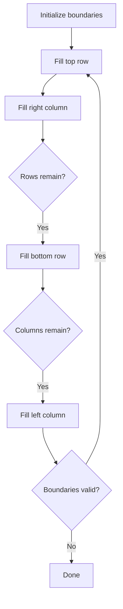

## C++ Implementation

```cpp
#include <bits/stdc++.h>
using namespace std;

vector<vector<int>> generateMatrix(int n) {
    vector<vector<int>> a(n, vector<int>(n));
    int top = 0, bottom = n - 1;
    int left = 0, right = n - 1;
    int value = 1;

    while (top <= bottom && left <= right) {
        for (int c = left; c <= right; c++) a[top][c] = value++;
        top++;

        for (int r = top; r <= bottom; r++) a[r][right] = value++;
        right--;

        if (top <= bottom) {
            for (int c = right; c >= left; c--) a[bottom][c] = value++;
            bottom--;
        }

        if (left <= right) {
            for (int r = bottom; r >= top; r--) a[r][left] = value++;
            left++;
        }
    }

    return a;
}
```

## Step-by-Step Simulation

| Step | State | Result |
|---|---|---|
| Top row | `1 2 3` | `top moves down` |
| Right col | `4 5` | `right moves left` |
| Bottom row | `7 6` | `bottom moves up` |
| Left col | `8` | `left moves right` |
| Center | `9` | `done` |

## Proof Intuition

- State the invariant.
- Show every step keeps the invariant true.
- Show final answer uses the required number of elements/items.
- Handle impossible cases separately.

---

# 15. Framework J: Segment / Interval Construction

## Concept

Build answer in blocks or partitions.

| Category | Notes |
|---|---|
| Forms | String segments, intervals, chunks, ranges. |
| Tactics | Find segment end, then cut when safe. |
| Example Problem | [Partition Labels](https://leetcode.com/problems/partition-labels/) |
| Intuition | Partition string so each character appears in one part. |

## Pattern Flowchart

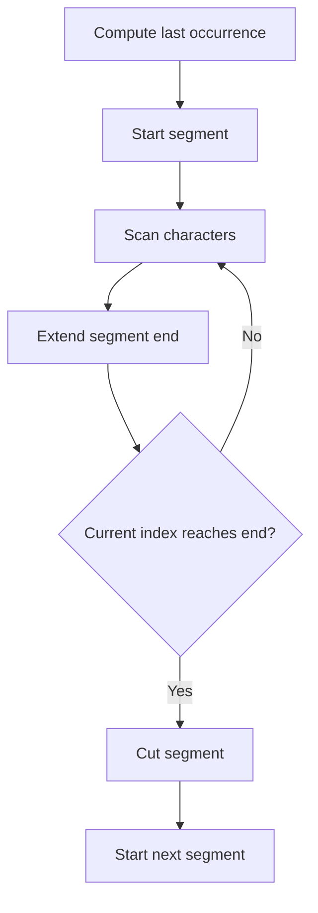

## C++ Implementation

```cpp
#include <bits/stdc++.h>
using namespace std;

vector<int> partitionLabels(string s) {
    vector<int> last(26);
    for (int i = 0; i < (int)s.size(); i++) {
        last[s[i] - 'a'] = i;
    }

    vector<int> ans;
    int start = 0, end = 0;

    for (int i = 0; i < (int)s.size(); i++) {
        end = max(end, last[s[i] - 'a']);

        if (i == end) {
            ans.push_back(end - start + 1);
            start = i + 1;
        }
    }

    return ans;
}
```

## Step-by-Step Simulation

| Step | State | Result |
|---|---|---|
| Start | `ababcbaca` | `end last(a)=8` |
| Scan | `b extends to 5` | `end stays 8` |
| Scan | `c extends to 7` | `end stays 8` |
| Cut | `i reaches 8` | `segment length 9` |

## Proof Intuition

- State the invariant.
- Show every step keeps the invariant true.
- Show final answer uses the required number of elements/items.
- Handle impossible cases separately.

---

# 16. Framework K: Math Construction

## Concept

Formula, parity, sum, modulo decide construction.

| Category | Notes |
|---|---|
| Forms | Sum formula, parity split, modulo adjustment, equal sets. |
| Tactics | First derive condition, then build. |
| Example Problem | [CSES Two Sets](https://cses.fi/problemset/task/1092) |
| Intuition | Split 1..n into two sets with equal sum. |

## Pattern Flowchart

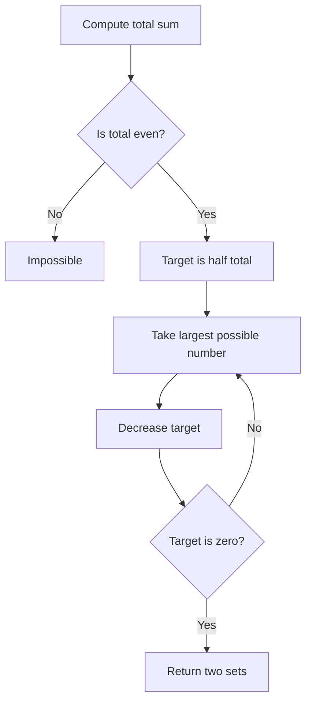

## C++ Implementation

```cpp
#include <bits/stdc++.h>
using namespace std;

int main() {
    int n;
    cin >> n;

    long long total = 1LL * n * (n + 1) / 2;
    if (total % 2) {
        cout << "NO\n";
        return 0;
    }

    vector<int> a, b;
    vector<int> used(n + 1, 0);
    long long target = total / 2;

    for (int x = n; x >= 1; x--) {
        if (x <= target) {
            a.push_back(x);
            used[x] = 1;
            target -= x;
        }
    }

    for (int x = 1; x <= n; x++) {
        if (!used[x]) b.push_back(x);
    }

    cout << "YES\n";
    cout << a.size() << "\n";
    for (int x : a) cout << x << " ";
    cout << "\n" << b.size() << "\n";
    for (int x : b) cout << x << " ";
}
```

## Step-by-Step Simulation

| Step | State | Result |
|---|---|---|
| Total | `n=7 gives 28` | `target 14` |
| Take | `7` | `target 7` |
| Take | `6` | `target 1` |
| Skip | `5 4 3 2` | `too large` |
| Take | `1` | `target 0` |

## Proof Intuition

- State the invariant.
- Show every step keeps the invariant true.
- Show final answer uses the required number of elements/items.
- Handle impossible cases separately.

---

# 17. Framework L: Number Theory Construction

## Concept

Use gcd, lcm, primes, divisibility, residues.

| Category | Notes |
|---|---|
| Forms | Multiples, coprime numbers, modulo classes, prime squares. |
| Tactics | Construct numbers that share or avoid factors. |
| Example Problem | [Build Array With GCD Greater Than One](#) |
| Intuition | Construct n positive numbers whose gcd is at least 2. |

## Pattern Flowchart

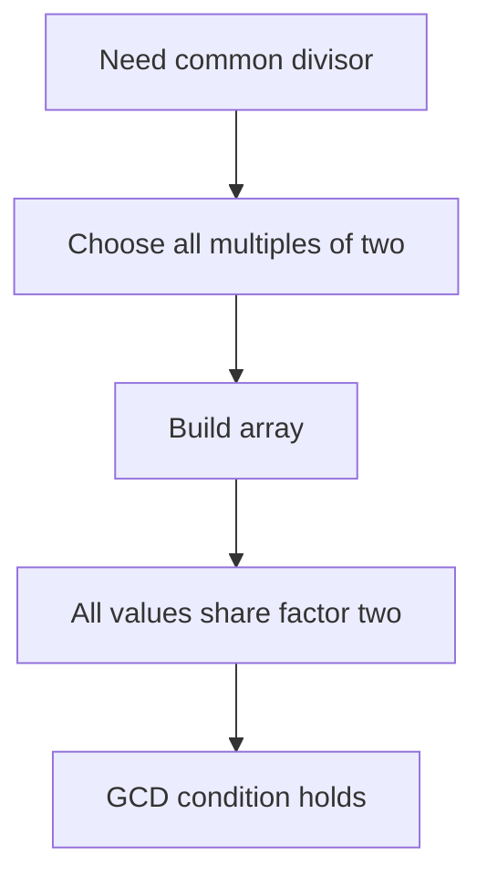

## C++ Implementation

```cpp
#include <bits/stdc++.h>
using namespace std;

vector<int> gcdGreaterThanOne(int n) {
    vector<int> ans;
    for (int i = 1; i <= n; i++) {
        ans.push_back(2 * i);
    }
    return ans;
}
```

## Step-by-Step Simulation

| Step | State | Result |
|---|---|---|
| n=5 | `choose evens` | `[2,4,6,8,10]` |
| GCD | `all divisible by 2` | `gcd at least 2` |

## Proof Intuition

- State the invariant.
- Show every step keeps the invariant true.
- Show final answer uses the required number of elements/items.
- Handle impossible cases separately.

---

# 18. Framework M: Bitwise Construction

## Concept

Use bit identities to build values.

| Category | Notes |
|---|---|
| Forms | XOR pairs, powers of two, common set bit, masks. |
| Tactics | Bits are independent; pair cancellation is powerful. |
| Example Problem | [XOR Zero Array](#) |
| Intuition | Construct array of size n with xor equal to zero. |

## Pattern Flowchart

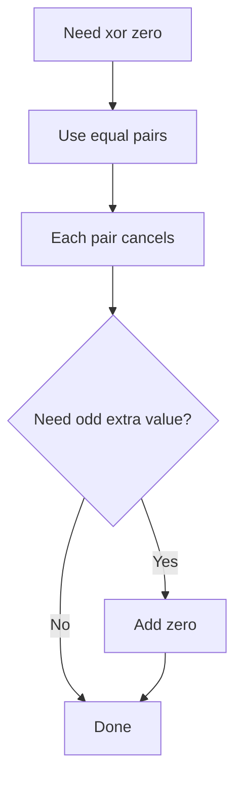

## C++ Implementation

```cpp
#include <bits/stdc++.h>
using namespace std;

vector<int> xorZeroArray(int n) {
    vector<int> ans;

    for (int x = 1; (int)ans.size() + 1 < n; x++) {
        ans.push_back(x);
        ans.push_back(x);
    }

    if ((int)ans.size() < n) ans.push_back(0);

    return ans;
}
```

## Step-by-Step Simulation

| Step | State | Result |
|---|---|---|
| Add | `1 and 1` | `xor becomes 0` |
| Add | `2 and 2` | `xor becomes 0` |
| Odd size | `add 0` | `xor stays 0` |

## Proof Intuition

- State the invariant.
- Show every step keeps the invariant true.
- Show final answer uses the required number of elements/items.
- Handle impossible cases separately.

---

# 19. Framework N: Graph Construction

## Concept

Build nodes and edges satisfying graph property.

| Category | Notes |
|---|---|
| Forms | Chain, star, complete graph, bipartite, cycle, tree then add edges. |
| Tactics | Start from minimal structure that satisfies main property. |
| Example Problem | [Connected Graph With n Nodes and m Edges](#) |
| Intuition | Build connected simple graph with exactly m edges. |

## Pattern Flowchart

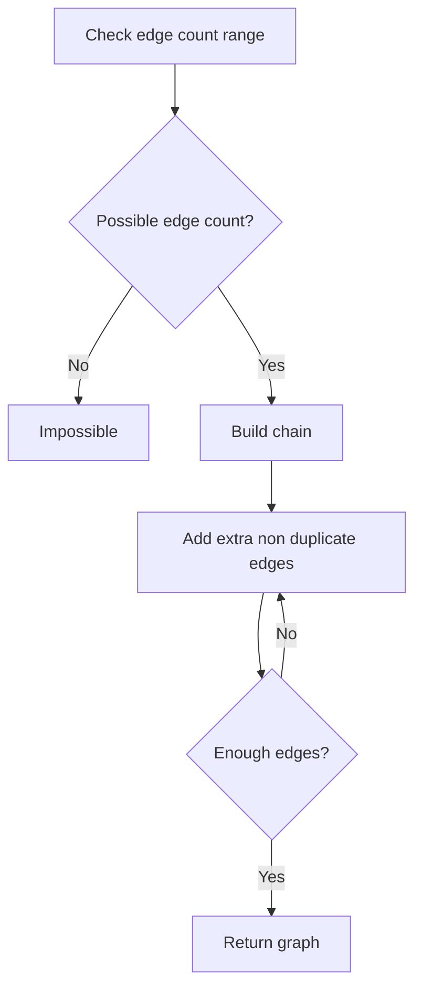

## C++ Implementation

```cpp
#include <bits/stdc++.h>
using namespace std;

vector<pair<int,int>> connectedGraph(int n, int m) {
    int maxEdges = n * (n - 1) / 2;
    if (m < n - 1 || m > maxEdges) return {};

    vector<pair<int,int>> edges;
    set<pair<int,int>> used;

    for (int i = 1; i < n; i++) {
        edges.push_back({i, i + 1});
        used.insert({i, i + 1});
    }

    int extra = m - (n - 1);

    for (int u = 1; u <= n && extra > 0; u++) {
        for (int v = u + 1; v <= n && extra > 0; v++) {
            if (!used.count({u, v})) {
                edges.push_back({u, v});
                used.insert({u, v});
                extra--;
            }
        }
    }

    return edges;
}
```

## Step-by-Step Simulation

| Step | State | Result |
|---|---|---|
| Need connected | `build chain` | `1-2,2-3,3-4` |
| Need m=5 | `extra=2` | `add 1-3,1-4` |
| Final | `5 edges connected` | `valid` |

## Proof Intuition

- State the invariant.
- Show every step keeps the invariant true.
- Show final answer uses the required number of elements/items.
- Handle impossible cases separately.

---

# 20. Framework O: Reverse Construction

## Concept

Build backwards from target when forward is hard.

| Category | Notes |
|---|---|
| Forms | Target to source, reverse operations, undo process. |
| Tactics | Reverse often makes greedy obvious. |
| Example Problem | [Broken Calculator](https://leetcode.com/problems/broken-calculator/) |
| Intuition | Reach target from start using double and decrement; solve reverse. |

## Pattern Flowchart

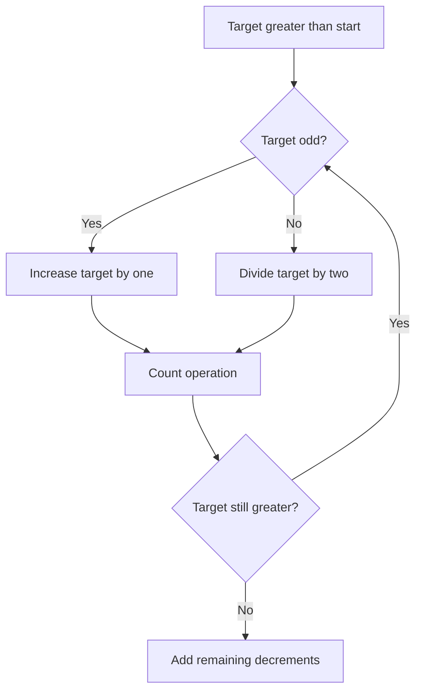

## C++ Implementation

```cpp
#include <bits/stdc++.h>
using namespace std;

int brokenCalc(int startValue, int target) {
    int ops = 0;

    while (target > startValue) {
        if (target % 2 == 1) target++;
        else target /= 2;
        ops++;
    }

    return ops + (startValue - target);
}
```

## Step-by-Step Simulation

| Step | State | Result |
|---|---|---|
| Start reverse | `target=10 start=3` | `10 even -> 5` |
| Odd | `5 -> 6` | `one op` |
| Even | `6 -> 3` | `one op` |
| Reached | `3` | `total 3 ops` |

## Proof Intuition

- State the invariant.
- Show every step keeps the invariant true.
- Show final answer uses the required number of elements/items.
- Handle impossible cases separately.

---

# 21. Framework P: Transformation Construction

## Concept

Start with easy object and transform it safely.

| Category | Notes |
|---|---|
| Forms | Rotate, swap, repair, map replacement, local changes. |
| Tactics | Each transformation must preserve or improve validity. |
| Example Problem | [Derangement by Rotation](#) |
| Intuition | Construct permutation with no fixed point. |

## Pattern Flowchart

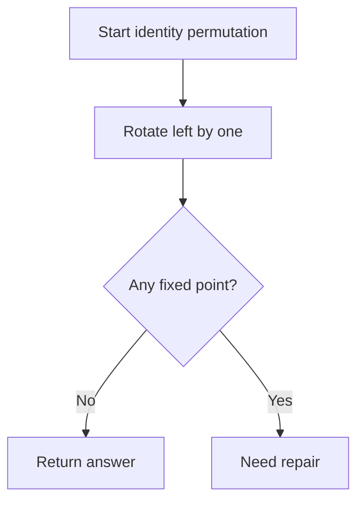

## C++ Implementation

```cpp
#include <bits/stdc++.h>
using namespace std;

vector<int> derangement(int n) {
    if (n == 1) return {};

    vector<int> p(n);
    iota(p.begin(), p.end(), 1);

    rotate(p.begin(), p.begin() + 1, p.end());
    return p;
}
```

## Step-by-Step Simulation

| Step | State | Result |
|---|---|---|
| Identity | `1 2 3 4 5` | `bad fixed points` |
| Rotate | `2 3 4 5 1` | `no p[i]=i` |
| Check | `all moved` | `valid` |

## Proof Intuition

- State the invariant.
- Show every step keeps the invariant true.
- Show final answer uses the required number of elements/items.
- Handle impossible cases separately.

---

# 22. Framework Q: Binary Search + Constructive Check

## Concept

Find min or max answer, but check feasibility by constructing under candidate limit.

| Category | Notes |
|---|---|
| Forms | capacity, partitioning, packing, scheduling. |
| Tactics | If possible for X, usually possible for larger X. |
| Example Problem | [Split Array Largest Sum](https://leetcode.com/problems/split-array-largest-sum/) |
| Intuition | Minimize largest segment sum. |

## Pattern Flowchart

```mermaid
flowchart TD
    A["Choose candidate limit"] --> B["Greedily build parts"]
    B --> C{"Parts within k?"}
    C -->|Yes| D["Candidate possible"]
    C -->|No| E["Candidate too small"]
    D --> F["Search smaller"]
    E --> G["Search larger"]
```

## C++ Implementation

```cpp
#include <bits/stdc++.h>
using namespace std;

bool canSplit(vector<int>& a, int k, long long limit) {
    int parts = 1;
    long long sum = 0;

    for (int x : a) {
        if (x > limit) return false;

        if (sum + x <= limit) {
            sum += x;
        } else {
            parts++;
            sum = x;
        }
    }

    return parts <= k;
}

long long splitArray(vector<int>& a, int k) {
    long long low = *max_element(a.begin(), a.end());
    long long high = accumulate(a.begin(), a.end(), 0LL);
    long long ans = high;

    while (low <= high) {
        long long mid = (low + high) / 2;

        if (canSplit(a, k, mid)) {
            ans = mid;
            high = mid - 1;
        } else {
            low = mid + 1;
        }
    }

    return ans;
}
```

## Step-by-Step Simulation

| Step | State | Result |
|---|---|---|
| Try limit | `18` | `[7,2,5] and [10,8]` |
| Parts | `2` | `possible` |
| Try smaller | `17` | `needs 3 parts` |
| Answer | `18` | `minimum possible` |

## Proof Intuition

- State the invariant.
- Show every step keeps the invariant true.
- Show final answer uses the required number of elements/items.
- Handle impossible cases separately.

---

# 23. Difficulty-Sorted Problem Ladder

| Difficulty | Framework | Platform | Problem | Link | Intuition | Implementation Approach |
|---|---|---|---|---|---|---|
| Easy | Direct Construction | Codeforces | A. I Wanna Be the Guy | [Open](https://codeforces.com/problemset/problem/469/A) | collect all levels | Set / boolean mark |
| Easy | Direct Construction | CSES | Weird Algorithm | [Open](https://cses.fi/problemset/task/1068) | simulate Collatz sequence | Simulation |
| Easy | Permutation Construction | CSES | Permutations | [Open](https://cses.fi/problemset/task/1070) | beautiful permutation | Parity grouping |
| Easy | Fill Array With Constraints | Codeforces | A. Sum of Round Numbers | [Open](https://codeforces.com/problemset/problem/1352/A) | split number into round parts | Digit construction |
| Easy | Alternating High-Low | LeetCode | Wiggle Sort | [Open](https://leetcode.com/problems/wiggle-sort/) | rearrange wave | Sort / swap local |
| Easy | Left-to-Right Valid Building | LeetCode | Generate Parentheses | [Open](https://leetcode.com/problems/generate-parentheses/) | prefix-valid strings | Backtracking constructive |
| Easy | Math Construction | Codeforces | A. Required Remainder | [Open](https://codeforces.com/problemset/problem/1374/A) | largest number <= n with modulo y | Formula |
| Easy | Transformation Construction | Codeforces | A. Replacing Elements | [Open](https://codeforces.com/problemset/problem/1473/A) | check replace feasibility | Sort + condition |
| Medium | Frequency-Based Construction | LeetCode | Sort Characters By Frequency | [Open](https://leetcode.com/problems/sort-characters-by-frequency/) | frequency ordering | Bucket / heap |
| Medium | Heap-Based Construction | LeetCode | Reorganize String | [Open](https://leetcode.com/problems/reorganize-string/) | no adjacent equal | Max heap |
| Medium | Prefix-Valid Construction | LeetCode | Minimum Remove to Make Valid Parentheses | [Open](https://leetcode.com/problems/minimum-remove-to-make-valid-parentheses/) | repair invalid prefix | Stack / two pass |
| Medium | Simulation Construction | LeetCode | Spiral Matrix II | [Open](https://leetcode.com/problems/spiral-matrix-ii/) | fill matrix spiral | Boundary simulation |
| Medium | Segment / Interval Construction | LeetCode | Partition Labels | [Open](https://leetcode.com/problems/partition-labels/) | split string into valid blocks | last occurrence |
| Medium | Math Construction | CSES | Two Sets | [Open](https://cses.fi/problemset/task/1092) | split 1..n equal sum | Greedy math |
| Medium | Number Theory Construction | Codeforces | B. T-primes | [Open](https://codeforces.com/problemset/problem/230/B) | detect square of prime | Number theory check |
| Medium | Bitwise Construction | Codeforces | A. XORwice | [Open](https://codeforces.com/problemset/problem/1421/A) | bitwise expression | XOR identity |
| Medium | Reverse Construction | LeetCode | Broken Calculator | [Open](https://leetcode.com/problems/broken-calculator/) | target to source | Reverse greedy |
| Medium | Binary Search + Check | LeetCode | Split Array Largest Sum | [Open](https://leetcode.com/problems/split-array-largest-sum/) | minimize max partition sum | BS + greedy construct |
| Hard | Graph Construction | Codeforces | C. Road Construction | [Open](https://codeforces.com/problemset/problem/330/B) | construct star avoiding forbidden edges | Graph observation |
| Hard | Heap-Based Construction | LeetCode | Task Scheduler | [Open](https://leetcode.com/problems/task-scheduler/) | schedule with cooldown | Max heap + queue |
| Hard | Transformation Construction | Codeforces | B. Permutation Swap | [Open](https://codeforces.com/problemset/problem/1828/B) | fix permutation by gcd of distances | GCD transformation |
| Hard | Bitwise Construction | Codeforces | C. Binary String Reconstruction | [Open](https://codeforces.com/problemset/problem/1400/C) | reconstruct original binary string | Constraint propagation |
| Hard | Segment Construction | LeetCode | Queue Reconstruction by Height | [Open](https://leetcode.com/problems/queue-reconstruction-by-height/) | construct queue with constraints | Sort + insert |
| Hard | Math Construction | Codeforces | C. Phoenix and Distribution | [Open](https://codeforces.com/problemset/problem/1348/C) | lexicographic distribution | String math |
| Hard | Binary Search + Constructive Check | Codeforces | Packing Rectangles | [Open](https://codeforces.com/edu/course/2/lesson/6/1/practice/contest/283911/problem/A) | minimum square size | BS answer |
| CM | Advanced Math Construction | CSES | Gray Code | [Open](https://cses.fi/problemset/task/2205) | construct n-bit Gray code | Recursive / bit construction |
| CM | Graph Construction | CSES | De Bruijn Sequence | [Open](https://cses.fi/problemset/task/1692) | construct binary De Bruijn sequence | Euler path |
| CM | Number Theory Construction | Codeforces | D. Same GCDs | [Open](https://codeforces.com/problemset/problem/1295/D) | count valid x with gcd property | Euler phi after reduction |
| CM | Bitwise Construction | Codeforces | D. The Beatles | [Open](https://codeforces.com/problemset/problem/1143/D) | construct min/max gcd-like cycle length | Modular construction |
| CM | Reverse/Transformation | Codeforces | E. Replace the Numbers | [Open](https://codeforces.com/problemset/problem/1620/E) | process replacement queries | Reverse DSU/map |

---

# 24. Problems Grouped by Framework


## Advanced Math Construction

| Difficulty | Problem | Link | Pattern | Tactic | Proof Idea |
|---|---|---|---|---|---|
| CM | CSES: Gray Code | [Open](https://cses.fi/problemset/task/2205) | Recursive / bit construction | prefix 0 + reversed prefix 1 | one-bit transition invariant |

## Alternating High-Low

| Difficulty | Problem | Link | Pattern | Tactic | Proof Idea |
|---|---|---|---|---|---|
| Easy | LeetCode: Wiggle Sort | [Open](https://leetcode.com/problems/wiggle-sort/) | Sort / swap local | ensure <= >= alternating | local pair repair |

## Binary Search + Check

| Difficulty | Problem | Link | Pattern | Tactic | Proof Idea |
|---|---|---|---|---|---|
| Medium | LeetCode: Split Array Largest Sum | [Open](https://leetcode.com/problems/split-array-largest-sum/) | BS + greedy construct | check number of parts | monotonic feasibility |

## Binary Search + Constructive Check

| Difficulty | Problem | Link | Pattern | Tactic | Proof Idea |
|---|---|---|---|---|---|
| Hard | Codeforces: Packing Rectangles | [Open](https://codeforces.com/edu/course/2/lesson/6/1/practice/contest/283911/problem/A) | BS answer | check floor(x/w)*floor(x/h) | monotonic construction capacity |

## Bitwise Construction

| Difficulty | Problem | Link | Pattern | Tactic | Proof Idea |
|---|---|---|---|---|---|
| Medium | Codeforces: A. XORwice | [Open](https://codeforces.com/problemset/problem/1421/A) | XOR identity | answer a xor b | bits independent |
| Hard | Codeforces: C. Binary String Reconstruction | [Open](https://codeforces.com/problemset/problem/1400/C) | Constraint propagation | force zeros then verify | reverse property |
| CM | Codeforces: D. The Beatles | [Open](https://codeforces.com/problemset/problem/1143/D) | Modular construction | check positions mod n | cyclic distance |

## Direct Construction

| Difficulty | Problem | Link | Pattern | Tactic | Proof Idea |
|---|---|---|---|---|---|
| Easy | Codeforces: A. I Wanna Be the Guy | [Open](https://codeforces.com/problemset/problem/469/A) | Set / boolean mark | mark seen levels, check all | direct validity |
| Easy | CSES: Weird Algorithm | [Open](https://cses.fi/problemset/task/1068) | Simulation | apply rule until 1 | rule-based construction |

## Fill Array With Constraints

| Difficulty | Problem | Link | Pattern | Tactic | Proof Idea |
|---|---|---|---|---|---|
| Easy | Codeforces: A. Sum of Round Numbers | [Open](https://codeforces.com/problemset/problem/1352/A) | Digit construction | take each nonzero digit place | decompose by place value |

## Frequency-Based Construction

| Difficulty | Problem | Link | Pattern | Tactic | Proof Idea |
|---|---|---|---|---|---|
| Medium | LeetCode: Sort Characters By Frequency | [Open](https://leetcode.com/problems/sort-characters-by-frequency/) | Bucket / heap | count and output groups | build by counts |

## Graph Construction

| Difficulty | Problem | Link | Pattern | Tactic | Proof Idea |
|---|---|---|---|---|---|
| Hard | Codeforces: C. Road Construction | [Open](https://codeforces.com/problemset/problem/330/B) | Graph observation | choose unused center | star always connected |
| CM | CSES: De Bruijn Sequence | [Open](https://cses.fi/problemset/task/1692) | Euler path | build graph of states | edge covers every substring |

## Heap-Based Construction

| Difficulty | Problem | Link | Pattern | Tactic | Proof Idea |
|---|---|---|---|---|---|
| Medium | LeetCode: Reorganize String | [Open](https://leetcode.com/problems/reorganize-string/) | Max heap | pop two most frequent | avoid same neighbor |
| Hard | LeetCode: Task Scheduler | [Open](https://leetcode.com/problems/task-scheduler/) | Max heap + queue | process time slots | cooldown invariant |

## Left-to-Right Valid Building

| Difficulty | Problem | Link | Pattern | Tactic | Proof Idea |
|---|---|---|---|---|---|
| Easy | LeetCode: Generate Parentheses | [Open](https://leetcode.com/problems/generate-parentheses/) | Backtracking constructive | place open/close if valid | balance invariant |

## Math Construction

| Difficulty | Problem | Link | Pattern | Tactic | Proof Idea |
|---|---|---|---|---|---|
| Easy | Codeforces: A. Required Remainder | [Open](https://codeforces.com/problemset/problem/1374/A) | Formula | n - ((n-y)%x) | modular adjustment |
| Medium | CSES: Two Sets | [Open](https://cses.fi/problemset/task/1092) | Greedy math | target half, take large | sum parity |
| Hard | Codeforces: C. Phoenix and Distribution | [Open](https://codeforces.com/problemset/problem/1348/C) | String math | sort and reason by groups | positions determine answer |

## Number Theory Construction

| Difficulty | Problem | Link | Pattern | Tactic | Proof Idea |
|---|---|---|---|---|---|
| Medium | Codeforces: B. T-primes | [Open](https://codeforces.com/problemset/problem/230/B) | Number theory check | sqrt and prime | property construction/check |
| CM | Codeforces: D. Same GCDs | [Open](https://codeforces.com/problemset/problem/1295/D) | Euler phi after reduction | reduce by gcd | number theory invariant |

## Permutation Construction

| Difficulty | Problem | Link | Pattern | Tactic | Proof Idea |
|---|---|---|---|---|---|
| Easy | CSES: Permutations | [Open](https://cses.fi/problemset/task/1070) | Parity grouping | print evens then odds | same parity avoids diff 1 |

## Prefix-Valid Construction

| Difficulty | Problem | Link | Pattern | Tactic | Proof Idea |
|---|---|---|---|---|---|
| Medium | LeetCode: Minimum Remove to Make Valid Parentheses | [Open](https://leetcode.com/problems/minimum-remove-to-make-valid-parentheses/) | Stack / two pass | remove bad parentheses | prefix balance |

## Reverse Construction

| Difficulty | Problem | Link | Pattern | Tactic | Proof Idea |
|---|---|---|---|---|---|
| Medium | LeetCode: Broken Calculator | [Open](https://leetcode.com/problems/broken-calculator/) | Reverse greedy | if target odd add one else divide | reverse operations easier |

## Reverse/Transformation

| Difficulty | Problem | Link | Pattern | Tactic | Proof Idea |
|---|---|---|---|---|---|
| CM | Codeforces: E. Replace the Numbers | [Open](https://codeforces.com/problemset/problem/1620/E) | Reverse DSU/map | process backward or union labels | value identity transformation |

## Segment / Interval Construction

| Difficulty | Problem | Link | Pattern | Tactic | Proof Idea |
|---|---|---|---|---|---|
| Medium | LeetCode: Partition Labels | [Open](https://leetcode.com/problems/partition-labels/) | last occurrence | extend segment end | segment invariant |

## Segment Construction

| Difficulty | Problem | Link | Pattern | Tactic | Proof Idea |
|---|---|---|---|---|---|
| Hard | LeetCode: Queue Reconstruction by Height | [Open](https://leetcode.com/problems/queue-reconstruction-by-height/) | Sort + insert | tall first, insert by k | previous taller invariant |

## Simulation Construction

| Difficulty | Problem | Link | Pattern | Tactic | Proof Idea |
|---|---|---|---|---|---|
| Medium | LeetCode: Spiral Matrix II | [Open](https://leetcode.com/problems/spiral-matrix-ii/) | Boundary simulation | shrink borders | layer construction |

## Transformation Construction

| Difficulty | Problem | Link | Pattern | Tactic | Proof Idea |
|---|---|---|---|---|---|
| Easy | Codeforces: A. Replacing Elements | [Open](https://codeforces.com/problemset/problem/1473/A) | Sort + condition | smallest two help | existence via min pair |
| Hard | Codeforces: B. Permutation Swap | [Open](https://codeforces.com/problemset/problem/1828/B) | GCD transformation | gcd of misplaced distances | operation distance invariant |

---

# 25. Contest Proof Templates

## Template A: Invariant Proof

```text
Construction:
    Describe how answer is built.

Invariant:
    State property that remains true after every step.

Initialization:
    Show invariant is true before construction starts.

Maintenance:
    Show adding next element keeps invariant true.

Termination:
    Show final answer satisfies all constraints.
```

## Template B: Feasibility Proof

```text
Impossible:
    If condition X fails, no answer can exist.

Possible:
    If condition X holds, our construction builds valid answer.

Why:
    Every step stays inside constraints and finishes exactly.
```

## Template C: Greedy Exchange Inside Constructive

```text
Greedy choice:
    We choose G.

Assume:
    Some valid solution chooses X instead.

Exchange:
    Replace X by G.

Validity:
    Show constraints remain true.

Conclusion:
    Greedy choice is safe.
```

## Proof Flowchart

```mermaid
flowchart TD
    A["State construction"] --> B["Define invariant"]
    B --> C["Prove start is valid"]
    C --> D["Prove each step preserves invariant"]
    D --> E["Prove final output satisfies goal"]
    E --> F["Explain impossible cases"]
```

---

# 26. Master C++ Templates

## Print Vector

```cpp
template <class T>
void printVector(const vector<T>& a) {
    for (T x : a) cout << x << ' ';
    cout << '\n';
}
```

## Check Permutation

```cpp
bool isPermutation(const vector<int>& p) {
    int n = p.size();
    vector<int> seen(n + 1, 0);

    for (int x : p) {
        if (x < 1 || x > n) return false;
        if (seen[x]) return false;
        seen[x] = 1;
    }

    return true;
}
```

## Check No Adjacent Equal

```cpp
bool noAdjacentEqual(const string& s) {
    for (int i = 1; i < (int)s.size(); i++) {
        if (s[i] == s[i - 1]) return false;
    }
    return true;
}
```

## Check No Adjacent Difference One

```cpp
bool noAdjacentDiffOne(const vector<int>& a) {
    for (int i = 1; i < (int)a.size(); i++) {
        if (abs(a[i] - a[i - 1]) == 1) return false;
    }
    return true;
}
```

## Generic Binary Search on Answer

```cpp
long long binarySearchAnswer(long long low, long long high) {
    long long ans = high;

    while (low <= high) {
        long long mid = (low + high) / 2;

        if (can(mid)) {
            ans = mid;
            high = mid - 1;
        } else {
            low = mid + 1;
        }
    }

    return ans;
}
```

---

# 27. Final Revision Cheat Sheet

| If You See | Try |
|---|---|
| any valid answer | constructive |
| sum/range | feasibility then fill |
| permutation | parity, rotate, swap |
| no adjacent equal | frequency or heap |
| valid prefix | balance invariant |
| matrix/grid | checkerboard, spiral, diagonals |
| graph connected | chain or star |
| exact edges | base graph then add |
| xor/and/or | bit identities |
| gcd/mod | number theory |
| target operations | reverse construction |
| minimize maximum | binary search + constructive check |

## Final Flowchart

```mermaid
flowchart TD
    A["Constructive problem"] --> B["Find final property"]
    B --> C["Find impossible cases"]
    C --> D["Pick framework"]
    D --> E["Build with invariant"]
    E --> F["Dry run small cases"]
    F --> G["Write proof"]
    G --> H["Submit"]
```

---

# One-Line Memory Hook

```text
Constructive = Observe pattern + Build safely + Prove invariant.
```
