# LLD Visual Java Reference With Mermaid Class Diagrams and Full Java Implementations

A visual-first Low-Level Design reference for common interview problems.

> **Render-safe note:** Mermaid diagrams are wrapped inside collapsed `<details>` blocks. Open only the diagram you need. This reduces heavy rendering and helps avoid repeated **Unable to render rich display** issues in Markdown viewers.


**Upgraded version:** every problem now has an Interview Upgrade Pack with requirement definition, render-safe Mermaid flows, entity fields and methods, pattern rationale, relationship-building steps, class-diagram evolution, runnable main-method demos, and short improvement notes.


This version includes:

- Mermaid **class diagrams** with entities, fields, methods, relationships, and cardinality.

- Clear requirements, core flows, design-pattern explanations, edge cases, and full compact Java implementations.

- All Java sections are full compact implementations with no placeholder markers.

## Clickable Index

### Games & Puzzles
- [Design Tic Tac Toe](#design-tic-tac-toe)
- [Design Chess Game](#design-chess-game)

### Data Structures & Search
- [Design LRU Cache](#design-lru-cache)
- [Design Search Autocomplete System](#design-search-autocomplete-system)

### Managing States
- [Design ATM](#design-atm)
- [Design Elevator System](#design-elevator-system)

### Management Systems
- [Design Parking Lot](#design-parking-lot)
- [Design Inventory Management System](#design-inventory-management-system)

### Social & Content Platforms
- [Design a Social Network](#design-a-social-network)
- [Design Spotify](#design-spotify)

### Communication & Messaging
- [Design Pub Sub System](#design-pub-sub-system)
- [Design Chat Application](#design-chat-application)

### Financial & Payment Systems
- [Design Payment Gateway](#design-payment-gateway)
- [Design Splitwise](#design-splitwise)

### E-commerce & Booking Systems
- [Design Amazon](#design-amazon)
- [Design Ride Hailing Service](#design-ride-hailing-service)

### Developer Tools & Infrastructure
- [Design URL Shortener](#design-url-shortener)
- [Design Rate Limiter](#design-rate-limiter)
- [Design Version Control System](#design-version-control-system)

---

## Design Tic Tac Toe

**Category:** Games & Puzzles


### Interview Upgrade Pack

#### A. Requirement Definition

| ID | Requirement | Type | Priority |
|---|---|---|---|
| R1 | Support a 3x3 board with two players using X and O. | Functional | Must have |
| R2 | Reject invalid moves such as occupied cells or out-of-bound positions. | Functional | Must have |
| R3 | Detect row, column, diagonal wins and draw state. | Functional | Must have |
| R4 | Keep the game logic independent from display and scoring. | Functional | Must have |
| NF1 | Keep operations predictable and easy to test | Non-functional | Should have |
| NF2 | Protect shared mutable state where concurrent calls are possible | Non-functional | Should have |
| OOS1 | Distributed persistence, external APIs, UI, and analytics are out of scope unless interviewer asks | Out of scope | Explicit |

#### B. Requirement Flow Visualization

<details>
<summary>📌 Open Flow diagram 1</summary>

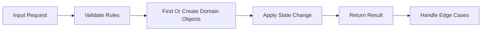

</details>

#### C. Entities From Simple to Complete

| Entity | Core Fields | Core Methods | Why It Exists |
|---|---|---|---|
| `TicTacToeGame` | `tictactoegameId`, state/data fields | create/update/query methods | Orchestrates turns, moves, status, and win checks. |
| `Board` | `boardId`, state/data fields | create/update/query methods | Owns the grid of cells. |
| `Cell` | `cellId`, state/data fields | create/update/query methods | Stores one symbol. |
| `Player` | `playerId`, state/data fields | create/update/query methods | Stores name and assigned symbol. |
| `WinningStrategy` | `winningstrategyId`, state/data fields | create/update/query methods | Defines win-checking behavior. |

#### D. Possible Design Patterns: Why and Where

| Pattern | Where To Use | Why It Helps |
|---|---|---|
| Strategy | Rules that may change, such as matching, pricing, validation, ranking, or allocation | Adds new behavior without changing orchestration code |
| State | Objects with lifecycle transitions such as active, completed, failed, authenticated, or expired | Prevents invalid operations in the wrong state |
| Facade / Service Layer | Public API class such as `TicTacToeGame` | Hides internal entities and gives interviewer a clean entry point |
| Composition | Parent owns child entities | Makes ownership and cardinality easy to explain |

**Best-fit patterns for this problem:** Strategy for win rules, Facade style game API, Single Responsibility for board and player separation.

#### E. Relationships Step by Step

1. Start from `TicTacToeGame` and connect it to `Board` because it needs that object to complete the use case.
2. Start from `TicTacToeGame` and connect it to `Cell` because it needs that object to complete the use case.
3. Start from `TicTacToeGame` and connect it to `Player` because it needs that object to complete the use case.
4. Start from `TicTacToeGame` and connect it to `WinningStrategy` because it needs that object to complete the use case.

#### F. Build the Class Diagram Step by Step

**Step 1: Start with the main context and one core entity.**

<details>
<summary>📌 Open Class diagram 2</summary>

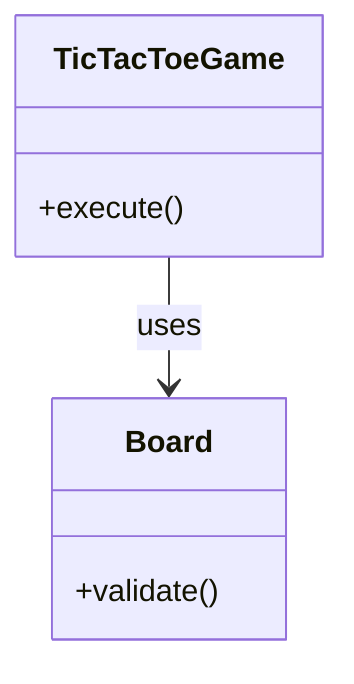

</details>

**Step 2: Add state, validation, and collaborating entities.**

<details>
<summary>📌 Open Class diagram 3</summary>

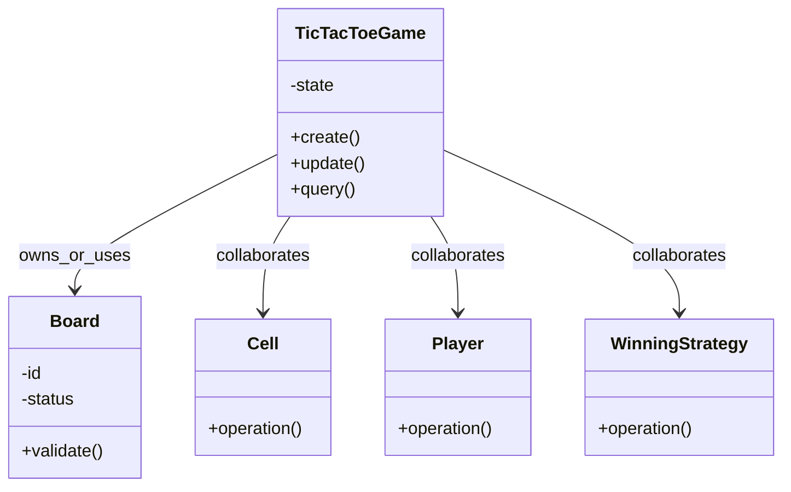

</details>

**Step 3: Use the final class diagram below as the complete interview answer.**

The original final diagram in this section remains the target design. Use Step 1 and Step 2 only to explain how you reached it during the interview.

### 1. Requirements

- Support a 3x3 board with two players using X and O.
- Reject invalid moves such as occupied cells or out-of-bound positions.
- Detect row, column, diagonal wins and draw state.
- Keep the game logic independent from display and scoring.

### 2. Core Use Cases

- Player chooses cell
- Game validates cell
- Board marks symbol
- Game checks win or draw

### 3. Entities + Responsibilities

| Entity | Responsibility |
|---|---|
| `TicTacToeGame` | Orchestrates turns, moves, status, and win checks. |
| `Board` | Owns the grid of cells. |
| `Cell` | Stores one symbol. |
| `Player` | Stores name and assigned symbol. |
| `WinningStrategy` | Defines win-checking behavior. |

### 4. System Visualization Diagram

<details>
<summary>📌 Open Class diagram 4</summary>

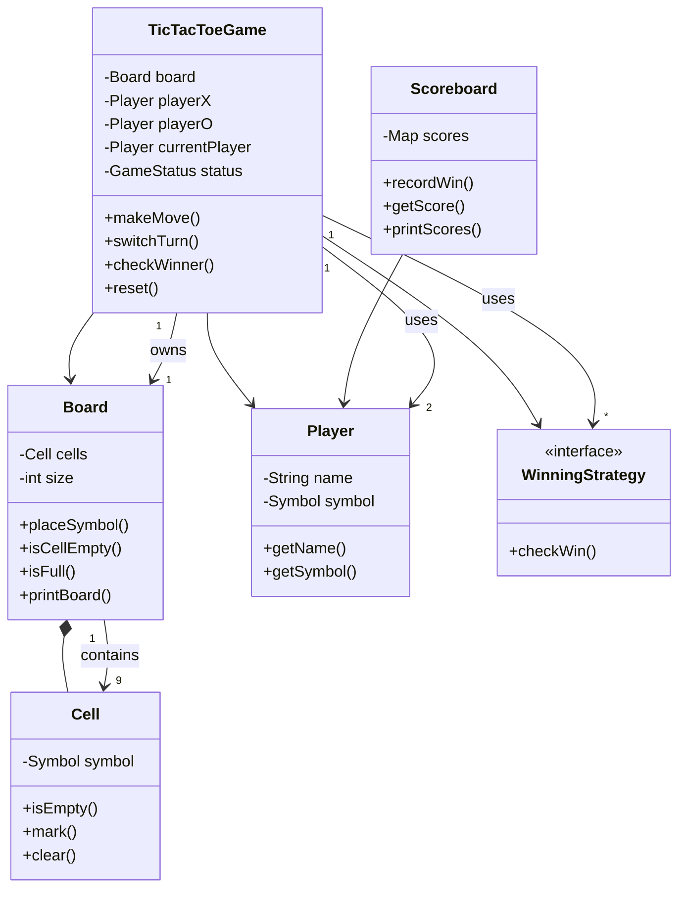

</details>

### 5. Relationships and Cardinality

| From | Cardinality | To | Cardinality | Relationship |
|---|---:|---|---:|---|
| `TicTacToeGame` | 1 | `Board` | 1 | owns |
| `Board` | 1 | `Cell` | 9 | contains |
| `TicTacToeGame` | 1 | `Player` | 2 | uses |
| `TicTacToeGame` | 1 | `WinningStrategy` | * | uses |

### 6. Core Flow

```text
Core Flow:
1. Player chooses cell ->
2. Game validates cell ->
3. Board marks symbol ->
4. Game checks win or draw ->
5. Game switches turn or ends
```

### 7. Design Patterns Used

- **Strategy:** Win detection is separated into row, column, and diagonal strategies. Adding a new win rule does not change the game orchestration.
- **Single Responsibility:** Board manages cells, Game manages gameplay, Player stores identity.

### 8. Full Java Implementation

```java
import java.util.*;

enum Symbol { X, O, EMPTY }
enum GameStatus { IN_PROGRESS, X_WON, O_WON, DRAW }

class Player {
    private final String name;
    private final Symbol symbol;

    public Player(String name, Symbol symbol) {
        if (symbol == Symbol.EMPTY) throw new IllegalArgumentException("Player cannot use EMPTY symbol");
        this.name = name;
        this.symbol = symbol;
    }

    public String getName() { return name; }
    public Symbol getSymbol() { return symbol; }
}

class Cell {
    private Symbol symbol = Symbol.EMPTY;

    public boolean isEmpty() { return symbol == Symbol.EMPTY; }

    public void mark(Symbol symbol) {
        if (!isEmpty()) throw new IllegalStateException("Cell already occupied");
        this.symbol = symbol;
    }

    public Symbol getSymbol() { return symbol; }
    public void clear() { symbol = Symbol.EMPTY; }
}

class Board {
    private final Cell[][] cells;
    private final int size;

    public Board(int size) {
        this.size = size;
        this.cells = new Cell[size][size];
        for (int r = 0; r < size; r++)
            for (int c = 0; c < size; c++)
                cells[r][c] = new Cell();
    }

    public int getSize() { return size; }

    public Cell getCell(int row, int col) {
        validate(row, col);
        return cells[row][col];
    }

    public void placeSymbol(int row, int col, Symbol symbol) {
        getCell(row, col).mark(symbol);
    }

    public boolean isCellEmpty(int row, int col) {
        return getCell(row, col).isEmpty();
    }

    public boolean isFull() {
        for (Cell[] row : cells)
            for (Cell cell : row)
                if (cell.isEmpty()) return false;
        return true;
    }

    private void validate(int row, int col) {
        if (row < 0 || row >= size || col < 0 || col >= size)
            throw new IllegalArgumentException("Invalid board position");
    }

    public void printBoard() {
        for (Cell[] row : cells) {
            for (Cell cell : row) {
                System.out.print((cell.getSymbol() == Symbol.EMPTY ? "_" : cell.getSymbol()) + " ");
            }
            System.out.println();
        }
    }
}

interface WinningStrategy {
    boolean checkWin(Board board, Symbol symbol);
}

class RowWinningStrategy implements WinningStrategy {
    public boolean checkWin(Board board, Symbol symbol) {
        for (int r = 0; r < board.getSize(); r++) {
            boolean win = true;
            for (int c = 0; c < board.getSize(); c++)
                win &= board.getCell(r, c).getSymbol() == symbol;
            if (win) return true;
        }
        return false;
    }
}

class ColumnWinningStrategy implements WinningStrategy {
    public boolean checkWin(Board board, Symbol symbol) {
        for (int c = 0; c < board.getSize(); c++) {
            boolean win = true;
            for (int r = 0; r < board.getSize(); r++)
                win &= board.getCell(r, c).getSymbol() == symbol;
            if (win) return true;
        }
        return false;
    }
}

class DiagonalWinningStrategy implements WinningStrategy {
    public boolean checkWin(Board board, Symbol symbol) {
        boolean d1 = true, d2 = true;
        int n = board.getSize();
        for (int i = 0; i < n; i++) {
            d1 &= board.getCell(i, i).getSymbol() == symbol;
            d2 &= board.getCell(i, n - 1 - i).getSymbol() == symbol;
        }
        return d1 || d2;
    }
}

class Scoreboard {
    private final Map<String, Integer> scores = new HashMap<>();

    public void recordWin(Player player) {
        scores.put(player.getName(), getScore(player.getName()) + 1);
    }

    public int getScore(String playerName) {
        return scores.getOrDefault(playerName, 0);
    }

    public void printScores() {
        scores.forEach((name, score) -> System.out.println(name + ": " + score));
    }
}

class TicTacToeGame {
    private final Board board;
    private final Player playerX;
    private final Player playerO;
    private Player currentPlayer;
    private GameStatus status = GameStatus.IN_PROGRESS;
    private final List<WinningStrategy> strategies = List.of(
            new RowWinningStrategy(),
            new ColumnWinningStrategy(),
            new DiagonalWinningStrategy()
    );

    public TicTacToeGame(Player playerX, Player playerO) {
        this.board = new Board(3);
        this.playerX = playerX;
        this.playerO = playerO;
        this.currentPlayer = playerX;
    }

    public void makeMove(int row, int col) {
        if (status != GameStatus.IN_PROGRESS) throw new IllegalStateException("Game already over");
        board.placeSymbol(row, col, currentPlayer.getSymbol());

        if (isWinner(currentPlayer.getSymbol())) {
            status = currentPlayer.getSymbol() == Symbol.X ? GameStatus.X_WON : GameStatus.O_WON;
        } else if (board.isFull()) {
            status = GameStatus.DRAW;
        } else {
            switchTurn();
        }
    }

    private boolean isWinner(Symbol symbol) {
        for (WinningStrategy strategy : strategies)
            if (strategy.checkWin(board, symbol)) return true;
        return false;
    }

    private void switchTurn() {
        currentPlayer = currentPlayer == playerX ? playerO : playerX;
    }

    public GameStatus getStatus() { return status; }
    public void printBoard() { board.printBoard(); }
}
```

### 8.1 Main Method Demo

Add this `Main` class at the bottom of the same Java file when practicing locally.

```java
class Main {
    public static void main(String[] args) {
        Player alice = new Player("Alice", Symbol.X);
        Player bob = new Player("Bob", Symbol.O);
        TicTacToeGame game = new TicTacToeGame(alice, bob);
        game.makeMove(0, 0);
        game.makeMove(1, 0);
        game.makeMove(0, 1);
        game.makeMove(1, 1);
        game.makeMove(0, 2);
        game.printBoard();
        System.out.println("Status = " + game.getStatus());
    }
}
```

### 9. Edge Cases

- Move outside board
- Occupied cell
- Move after game over
- Draw after final move

---

### 10. Short Final Improvement Notes

- Start with the simplest working domain model, then add strategies only for rules that change.
- Keep entities small: state belongs inside entities, orchestration belongs inside service/context classes.
- Mention thread safety only around shared mutable structures, not everywhere.
- For production, add persistence, logging, metrics, idempotency, and tests around edge cases.

## Design Chess Game

**Category:** Games & Puzzles


### Interview Upgrade Pack

#### A. Requirement Definition

| ID | Requirement | Type | Priority |
|---|---|---|---|
| R1 | Represent an 8x8 board, players, cells, and chess pieces. | Functional | Must have |
| R2 | Validate moves based on each piece type. | Functional | Must have |
| R3 | Support capturing opponent pieces. | Functional | Must have |
| R4 | Maintain current player and game status. | Functional | Must have |
| NF1 | Keep operations predictable and easy to test | Non-functional | Should have |
| NF2 | Protect shared mutable state where concurrent calls are possible | Non-functional | Should have |
| OOS1 | Distributed persistence, external APIs, UI, and analytics are out of scope unless interviewer asks | Out of scope | Explicit |

#### B. Requirement Flow Visualization

<details>
<summary>📌 Open Flow diagram 5</summary>


</details>

#### C. Entities From Simple to Complete

| Entity | Core Fields | Core Methods | Why It Exists |
|---|---|---|---|
| `ChessGame` | `chessgameId`, state/data fields | create/update/query methods | Coordinates players, board, moves, and status. |
| `Board` | `boardId`, state/data fields | create/update/query methods | Owns all chess cells. |
| `Cell` | `cellId`, state/data fields | create/update/query methods | Stores position and optional piece. |
| `Piece` | `pieceId`, state/data fields | create/update/query methods | Base abstraction for chess pieces. |
| `Move` | `moveId`, state/data fields | create/update/query methods | Represents a source-to-target move. |

#### D. Possible Design Patterns: Why and Where

| Pattern | Where To Use | Why It Helps |
|---|---|---|
| Strategy | Rules that may change, such as matching, pricing, validation, ranking, or allocation | Adds new behavior without changing orchestration code |
| State | Objects with lifecycle transitions such as active, completed, failed, authenticated, or expired | Prevents invalid operations in the wrong state |
| Facade / Service Layer | Public API class such as `ChessGame` | Hides internal entities and gives interviewer a clean entry point |
| Composition | Parent owns child entities | Makes ownership and cardinality easy to explain |

**Best-fit patterns for this problem:** Polymorphism for piece movement, State for game status, Template-ready validation pipeline.

#### E. Relationships Step by Step

1. Start from `ChessGame` and connect it to `Board` because it needs that object to complete the use case.
2. Start from `ChessGame` and connect it to `Cell` because it needs that object to complete the use case.
3. Start from `ChessGame` and connect it to `Piece` because it needs that object to complete the use case.
4. Start from `ChessGame` and connect it to `Move` because it needs that object to complete the use case.

#### F. Build the Class Diagram Step by Step

**Step 1: Start with the main context and one core entity.**

<details>
<summary>📌 Open Class diagram 6</summary>

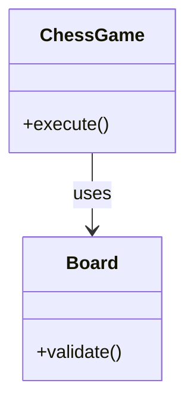

</details>

**Step 2: Add state, validation, and collaborating entities.**

<details>
<summary>📌 Open Class diagram 7</summary>

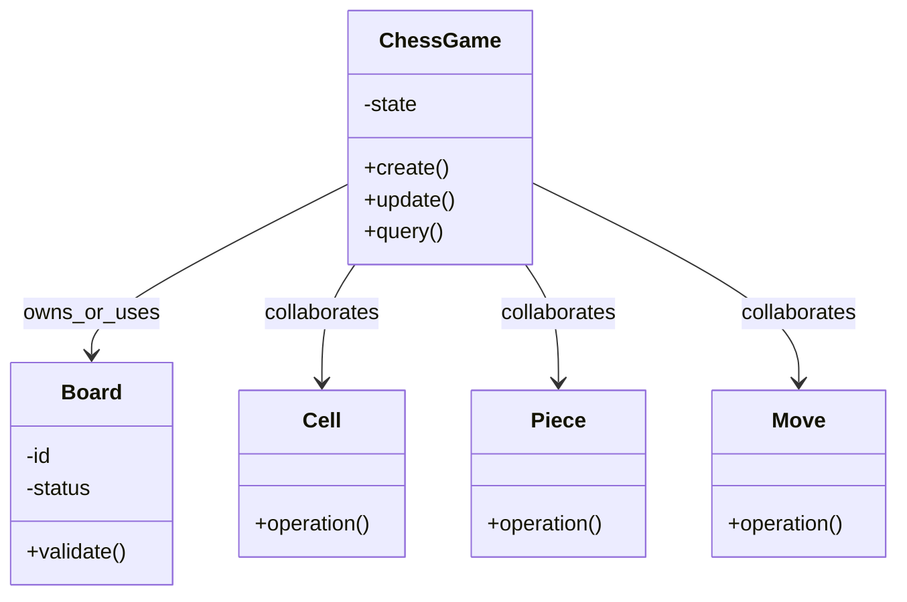

</details>

**Step 3: Use the final class diagram below as the complete interview answer.**

The original final diagram in this section remains the target design. Use Step 1 and Step 2 only to explain how you reached it during the interview.

### 1. Requirements

- Represent an 8x8 board, players, cells, and chess pieces.
- Validate moves based on each piece type.
- Support capturing opponent pieces.
- Maintain current player and game status.

### 2. Core Use Cases

- Player selects source and target
- Game validates ownership
- Piece validates movement
- Board moves or captures

### 3. Entities + Responsibilities

| Entity | Responsibility |
|---|---|
| `ChessGame` | Coordinates players, board, moves, and status. |
| `Board` | Owns all chess cells. |
| `Cell` | Stores position and optional piece. |
| `Piece` | Base abstraction for chess pieces. |
| `Move` | Represents a source-to-target move. |

### 4. System Visualization Diagram

<details>
<summary>📌 Open Class diagram 8</summary>

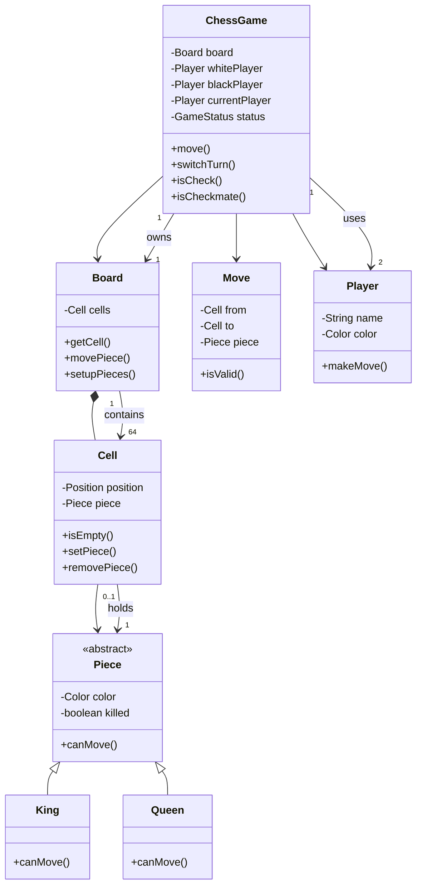

</details>

### 5. Relationships and Cardinality

| From | Cardinality | To | Cardinality | Relationship |
|---|---:|---|---:|---|
| `ChessGame` | 1 | `Board` | 1 | owns |
| `Board` | 1 | `Cell` | 64 | contains |
| `Cell` | 0..1 | `Piece` | 1 | holds |
| `ChessGame` | 1 | `Player` | 2 | uses |

### 6. Core Flow

```text
Core Flow:
1. Player selects source and target ->
2. Game validates ownership ->
3. Piece validates movement ->
4. Board moves or captures ->
5. Game switches turn
```

### 7. Design Patterns Used

- **Polymorphism:** Each Piece subclass owns its movement rule through canMove.
- **State:** GameStatus tracks active, check, checkmate, and stalemate states.

### 8. Full Java Implementation

```java
import java.util.*;

enum Color { WHITE, BLACK }
enum GameStatus { ACTIVE, CHECK, CHECKMATE, STALEMATE }

class Position {
    final int row;
    final int col;
    Position(int row, int col) { this.row = row; this.col = col; }
}

abstract class Piece {
    protected final Color color;
    protected boolean killed;

    protected Piece(Color color) { this.color = color; }

    public Color getColor() { return color; }
    public boolean isKilled() { return killed; }
    public void kill() { killed = true; }

    public abstract boolean canMove(Board board, Cell from, Cell to);

    protected boolean isOpponent(Cell to) {
        return !to.isEmpty() && to.getPiece().getColor() != color;
    }
}

class King extends Piece {
    King(Color color) { super(color); }

    public boolean canMove(Board board, Cell from, Cell to) {
        int dr = Math.abs(from.getPosition().row - to.getPosition().row);
        int dc = Math.abs(from.getPosition().col - to.getPosition().col);
        return dr <= 1 && dc <= 1 && (to.isEmpty() || isOpponent(to));
    }
}

class Queen extends Piece {
    Queen(Color color) { super(color); }

    public boolean canMove(Board board, Cell from, Cell to) {
        int dr = Math.abs(from.getPosition().row - to.getPosition().row);
        int dc = Math.abs(from.getPosition().col - to.getPosition().col);
        boolean straight = dr == 0 || dc == 0;
        boolean diagonal = dr == dc;
        return (straight || diagonal) && board.isPathClear(from, to) && (to.isEmpty() || isOpponent(to));
    }
}

class Rook extends Piece {
    Rook(Color color) { super(color); }

    public boolean canMove(Board board, Cell from, Cell to) {
        boolean straight = from.getPosition().row == to.getPosition().row ||
                           from.getPosition().col == to.getPosition().col;
        return straight && board.isPathClear(from, to) && (to.isEmpty() || isOpponent(to));
    }
}

class Cell {
    private final Position position;
    private Piece piece;

    Cell(int row, int col) { this.position = new Position(row, col); }

    public Position getPosition() { return position; }
    public boolean isEmpty() { return piece == null; }
    public Piece getPiece() { return piece; }
    public void setPiece(Piece piece) { this.piece = piece; }

    public Piece removePiece() {
        Piece removed = piece;
        piece = null;
        return removed;
    }
}

class Board {
    private final Cell[][] cells = new Cell[8][8];

    Board() {
        for (int r = 0; r < 8; r++)
            for (int c = 0; c < 8; c++)
                cells[r][c] = new Cell(r, c);
        setupPieces();
    }

    public Cell getCell(Position position) {
        if (position.row < 0 || position.row >= 8 || position.col < 0 || position.col >= 8)
            throw new IllegalArgumentException("Invalid chess position");
        return cells[position.row][position.col];
    }

    public void setupPieces() {
        cells[0][4].setPiece(new King(Color.BLACK));
        cells[7][4].setPiece(new King(Color.WHITE));
        cells[0][3].setPiece(new Queen(Color.BLACK));
        cells[7][3].setPiece(new Queen(Color.WHITE));
        cells[0][0].setPiece(new Rook(Color.BLACK));
        cells[0][7].setPiece(new Rook(Color.BLACK));
        cells[7][0].setPiece(new Rook(Color.WHITE));
        cells[7][7].setPiece(new Rook(Color.WHITE));
    }

    public boolean isPathClear(Cell from, Cell to) {
        int r1 = from.getPosition().row, c1 = from.getPosition().col;
        int r2 = to.getPosition().row, c2 = to.getPosition().col;
        int dr = Integer.compare(r2, r1);
        int dc = Integer.compare(c2, c1);

        int r = r1 + dr, c = c1 + dc;
        while (r != r2 || c != c2) {
            if (!cells[r][c].isEmpty()) return false;
            r += dr;
            c += dc;
        }
        return true;
    }

    public void movePiece(Cell from, Cell to) {
        Piece piece = from.getPiece();
        if (piece == null) throw new IllegalArgumentException("No piece at source");
        if (!piece.canMove(this, from, to)) throw new IllegalArgumentException("Illegal move");

        if (!to.isEmpty()) to.getPiece().kill();
        to.setPiece(from.removePiece());
    }
}

class Player {
    private final String name;
    private final Color color;

    Player(String name, Color color) {
        this.name = name;
        this.color = color;
    }

    public Color getColor() { return color; }
    public String getName() { return name; }
}

class Move {
    private final Cell from;
    private final Cell to;
    private final Piece piece;

    Move(Cell from, Cell to) {
        this.from = from;
        this.to = to;
        this.piece = from.getPiece();
    }

    public boolean isValid(Board board) {
        return piece != null && piece.canMove(board, from, to);
    }
}

class ChessGame {
    private final Board board = new Board();
    private final Player whitePlayer;
    private final Player blackPlayer;
    private Player currentPlayer;
    private GameStatus status = GameStatus.ACTIVE;

    ChessGame(Player whitePlayer, Player blackPlayer) {
        this.whitePlayer = whitePlayer;
        this.blackPlayer = blackPlayer;
        this.currentPlayer = whitePlayer;
    }

    public void move(Position fromPos, Position toPos) {
        if (status == GameStatus.CHECKMATE || status == GameStatus.STALEMATE)
            throw new IllegalStateException("Game already ended");

        Cell from = board.getCell(fromPos);
        Cell to = board.getCell(toPos);

        if (from.isEmpty()) throw new IllegalArgumentException("No piece selected");
        if (from.getPiece().getColor() != currentPlayer.getColor())
            throw new IllegalArgumentException("Not current player's piece");

        board.movePiece(from, to);
        switchTurn();
    }

    private void switchTurn() {
        currentPlayer = currentPlayer == whitePlayer ? blackPlayer : whitePlayer;
    }

    public GameStatus getStatus() { return status; }
}
```

### 8.1 Main Method Demo

Add this `Main` class at the bottom of the same Java file when practicing locally.

```java
class Main {
    public static void main(String[] args) {
        Player white = new Player("White", Color.WHITE);
        Player black = new Player("Black", Color.BLACK);
        ChessGame game = new ChessGame(white, black);
        game.move(new Position(7, 3), new Position(5, 3));
        System.out.println("Status = " + game.getStatus());
    }
}
```

### 9. Edge Cases

- Invalid input should fail fast with a clear exception.
- Duplicate or repeated operation should not corrupt state.
- Boundary conditions should be tested.
- Concurrent access should be protected where shared mutable state exists.

---

### 10. Short Final Improvement Notes

- Start with the simplest working domain model, then add strategies only for rules that change.
- Keep entities small: state belongs inside entities, orchestration belongs inside service/context classes.
- Mention thread safety only around shared mutable structures, not everywhere.
- For production, add persistence, logging, metrics, idempotency, and tests around edge cases.

## Design LRU Cache

**Category:** Data Structures & Search


### Interview Upgrade Pack

#### A. Requirement Definition

| ID | Requirement | Type | Priority |
|---|---|---|---|
| R1 | Support get and put in O(1) average time. | Functional | Must have |
| R2 | Evict the least recently used item when capacity is full. | Functional | Must have |
| R3 | Update recency on both get and put. | Functional | Must have |
| R4 | Keep cache storage and recency tracking consistent. | Functional | Must have |
| NF1 | Keep operations predictable and easy to test | Non-functional | Should have |
| NF2 | Protect shared mutable state where concurrent calls are possible | Non-functional | Should have |
| OOS1 | Distributed persistence, external APIs, UI, and analytics are out of scope unless interviewer asks | Out of scope | Explicit |

#### B. Requirement Flow Visualization

<details>
<summary>📌 Open Flow diagram 9</summary>


</details>

#### C. Entities From Simple to Complete

| Entity | Core Fields | Core Methods | Why It Exists |
|---|---|---|---|
| `LRUCache` | `lrucacheId`, state/data fields | create/update/query methods | Coordinates HashMap and linked list. |
| `Node` | `nodeId`, state/data fields | create/update/query methods | Stores key/value and list pointers. |

#### D. Possible Design Patterns: Why and Where

| Pattern | Where To Use | Why It Helps |
|---|---|---|
| Strategy | Rules that may change, such as matching, pricing, validation, ranking, or allocation | Adds new behavior without changing orchestration code |
| State | Objects with lifecycle transitions such as active, completed, failed, authenticated, or expired | Prevents invalid operations in the wrong state |
| Facade / Service Layer | Public API class such as `LRUCache` | Hides internal entities and gives interviewer a clean entry point |
| Composition | Parent owns child entities | Makes ownership and cardinality easy to explain |

**Best-fit patterns for this problem:** Data-structure composition, Sentinel nodes, Encapsulation around list mutation.

#### E. Relationships Step by Step

1. Start from `LRUCache` and connect it to `Node` because it needs that object to complete the use case.

#### F. Build the Class Diagram Step by Step

**Step 1: Start with the main context and one core entity.**

<details>
<summary>📌 Open Class diagram 10</summary>

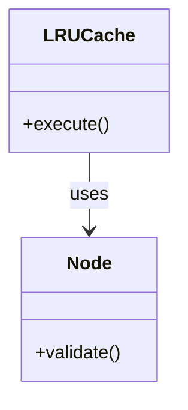

</details>

**Step 2: Add state, validation, and collaborating entities.**

<details>
<summary>📌 Open Class diagram 11</summary>

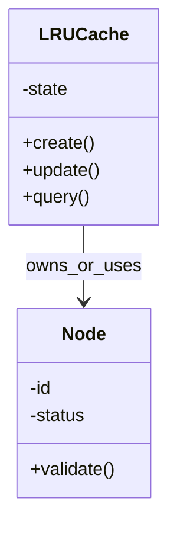

</details>

**Step 3: Use the final class diagram below as the complete interview answer.**

The original final diagram in this section remains the target design. Use Step 1 and Step 2 only to explain how you reached it during the interview.

### 1. Requirements

- Support get and put in O(1) average time.
- Evict the least recently used item when capacity is full.
- Update recency on both get and put.
- Keep cache storage and recency tracking consistent.

### 2. Core Use Cases

- get/put called
- Map locates node
- Node moves to front
- If capacity exceeded remove tail node

### 3. Entities + Responsibilities

| Entity | Responsibility |
|---|---|
| `LRUCache` | Coordinates HashMap and linked list. |
| `Node` | Stores key/value and list pointers. |

### 4. System Visualization Diagram

<details>
<summary>📌 Open Class diagram 12</summary>

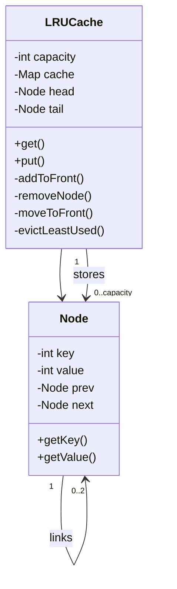

</details>

### 5. Relationships and Cardinality

| From | Cardinality | To | Cardinality | Relationship |
|---|---:|---|---:|---|
| `LRUCache` | 1 | `Node` | 0..capacity | stores |
| `Node` | 1 | `Node` | 0..2 | links |

### 6. Core Flow

```text
Core Flow:
1. get/put called ->
2. Map locates node ->
3. Node moves to front ->
4. If capacity exceeded remove tail node ->
5. Map and list stay synchronized
```

### 7. Design Patterns Used

- **Data Structure Composition:** HashMap gives O(1) lookup and doubly linked list gives O(1) recency updates.
- **Sentinel Nodes:** Dummy head and tail simplify insert/remove edge cases.

### 8. Full Java Implementation

```java
import java.util.*;

class Node {
    int key;
    int value;
    Node prev;
    Node next;

    Node(int key, int value) {
        this.key = key;
        this.value = value;
    }
}

class LRUCache {
    private final int capacity;
    private final Map<Integer, Node> cache = new HashMap<>();
    private final Node head = new Node(0, 0);
    private final Node tail = new Node(0, 0);

    public LRUCache(int capacity) {
        if (capacity <= 0) throw new IllegalArgumentException("Capacity must be positive");
        this.capacity = capacity;
        head.next = tail;
        tail.prev = head;
    }

    public int get(int key) {
        Node node = cache.get(key);
        if (node == null) return -1;
        moveToFront(node);
        return node.value;
    }

    public void put(int key, int value) {
        Node node = cache.get(key);
        if (node != null) {
            node.value = value;
            moveToFront(node);
            return;
        }

        if (cache.size() == capacity) evictLeastUsed();

        Node newNode = new Node(key, value);
        cache.put(key, newNode);
        addToFront(newNode);
    }

    private void addToFront(Node node) {
        node.next = head.next;
        node.prev = head;
        head.next.prev = node;
        head.next = node;
    }

    private void removeNode(Node node) {
        node.prev.next = node.next;
        node.next.prev = node.prev;
    }

    private void moveToFront(Node node) {
        removeNode(node);
        addToFront(node);
    }

    private void evictLeastUsed() {
        Node lru = tail.prev;
        removeNode(lru);
        cache.remove(lru.key);
    }
}
```

### 8.1 Main Method Demo

Add this `Main` class at the bottom of the same Java file when practicing locally.

```java
class Main {
    public static void main(String[] args) {
        LRUCache cache = new LRUCache(2);
        cache.put(1, 10);
        cache.put(2, 20);
        System.out.println(cache.get(1));
        cache.put(3, 30);
        System.out.println(cache.get(2));
        System.out.println(cache.get(3));
    }
}
```

### 9. Edge Cases

- Capacity full
- Update existing key
- Read missing key
- Capacity must be positive

---

### 10. Short Final Improvement Notes

- Start with the simplest working domain model, then add strategies only for rules that change.
- Keep entities small: state belongs inside entities, orchestration belongs inside service/context classes.
- Mention thread safety only around shared mutable structures, not everywhere.
- For production, add persistence, logging, metrics, idempotency, and tests around edge cases.

## Design Search Autocomplete System

**Category:** Data Structures & Search


### Interview Upgrade Pack

#### A. Requirement Definition

| ID | Requirement | Type | Priority |
|---|---|---|---|
| R1 | Insert searchable words or sentences. | Functional | Must have |
| R2 | Return suggestions for a prefix. | Functional | Must have |
| R3 | Keep suggestions sorted and limited. | Functional | Must have |
| R4 | Use a Trie for efficient prefix lookup. | Functional | Must have |
| NF1 | Keep operations predictable and easy to test | Non-functional | Should have |
| NF2 | Protect shared mutable state where concurrent calls are possible | Non-functional | Should have |
| OOS1 | Distributed persistence, external APIs, UI, and analytics are out of scope unless interviewer asks | Out of scope | Explicit |

#### B. Requirement Flow Visualization

<details>
<summary>📌 Open Flow diagram 13</summary>


</details>

#### C. Entities From Simple to Complete

| Entity | Core Fields | Core Methods | Why It Exists |
|---|---|---|---|
| `AutocompleteSystem` | `autocompletesystemId`, state/data fields | create/update/query methods | Exposes insert and prefix search. |
| `TrieNode` | `trienodeId`, state/data fields | create/update/query methods | Stores children and prefix suggestions. |

#### D. Possible Design Patterns: Why and Where

| Pattern | Where To Use | Why It Helps |
|---|---|---|
| Strategy | Rules that may change, such as matching, pricing, validation, ranking, or allocation | Adds new behavior without changing orchestration code |
| State | Objects with lifecycle transitions such as active, completed, failed, authenticated, or expired | Prevents invalid operations in the wrong state |
| Facade / Service Layer | Public API class such as `AutocompleteSystem` | Hides internal entities and gives interviewer a clean entry point |
| Composition | Parent owns child entities | Makes ownership and cardinality easy to explain |

**Best-fit patterns for this problem:** Trie, Precomputed suggestions, Strategy-ready ranking.

#### E. Relationships Step by Step

1. Start from `AutocompleteSystem` and connect it to `TrieNode` because it needs that object to complete the use case.

#### F. Build the Class Diagram Step by Step

**Step 1: Start with the main context and one core entity.**

<details>
<summary>📌 Open Class diagram 14</summary>

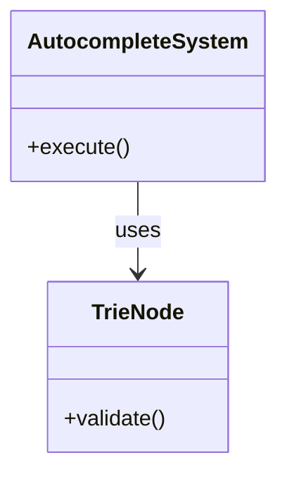

</details>

**Step 2: Add state, validation, and collaborating entities.**

<details>
<summary>📌 Open Class diagram 15</summary>

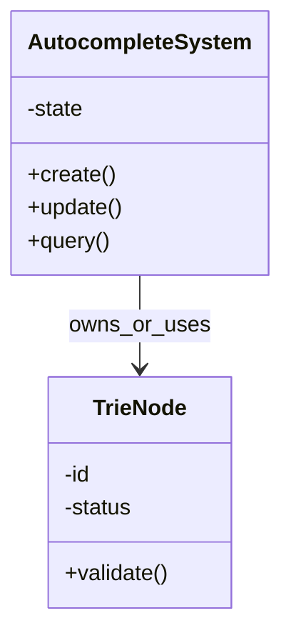

</details>

**Step 3: Use the final class diagram below as the complete interview answer.**

The original final diagram in this section remains the target design. Use Step 1 and Step 2 only to explain how you reached it during the interview.

### 1. Requirements

- Insert searchable words or sentences.
- Return suggestions for a prefix.
- Keep suggestions sorted and limited.
- Use a Trie for efficient prefix lookup.

### 2. Core Use Cases

- Insert word into Trie
- Update suggestions along prefix path
- Search walks prefix nodes
- Return stored suggestions

### 3. Entities + Responsibilities

| Entity | Responsibility |
|---|---|
| `AutocompleteSystem` | Exposes insert and prefix search. |
| `TrieNode` | Stores children and prefix suggestions. |

### 4. System Visualization Diagram

<details>
<summary>📌 Open Class diagram 16</summary>

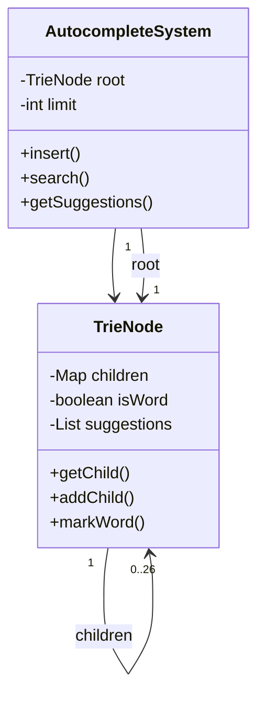

</details>

### 5. Relationships and Cardinality

| From | Cardinality | To | Cardinality | Relationship |
|---|---:|---|---:|---|
| `AutocompleteSystem` | 1 | `TrieNode` | 1 | root |
| `TrieNode` | 1 | `TrieNode` | 0..26 | children |

### 6. Core Flow

```text
Core Flow:
1. Insert word into Trie ->
2. Update suggestions along prefix path ->
3. Search walks prefix nodes ->
4. Return stored suggestions
```

### 7. Design Patterns Used

- **Trie:** Each prefix maps to a node, making prefix search efficient.
- **Precomputed Suggestions:** Suggestions are stored along the path to make lookup fast.

### 8. Full Java Implementation

```java
import java.util.*;

class TrieNode {
    Map<Character, TrieNode> children = new HashMap<>();
    boolean isWord;
    List<String> suggestions = new ArrayList<>();
}

class AutocompleteSystem {
    private final TrieNode root = new TrieNode();
    private final int limit;

    public AutocompleteSystem(int limit) {
        this.limit = limit;
    }

    public void insert(String word) {
        TrieNode current = root;
        for (char ch : word.toCharArray()) {
            current.children.putIfAbsent(ch, new TrieNode());
            current = current.children.get(ch);
            addSuggestion(current.suggestions, word);
        }
        current.isWord = true;
    }

    private void addSuggestion(List<String> suggestions, String word) {
        if (!suggestions.contains(word)) suggestions.add(word);
        Collections.sort(suggestions);
        if (suggestions.size() > limit) suggestions.remove(suggestions.size() - 1);
    }

    public List<String> search(String prefix) {
        TrieNode node = findNode(prefix);
        return node == null ? List.of() : new ArrayList<>(node.suggestions);
    }

    public List<String> getSuggestions(String prefix) {
        return search(prefix);
    }

    private TrieNode findNode(String prefix) {
        TrieNode current = root;
        for (char ch : prefix.toCharArray()) {
            current = current.children.get(ch);
            if (current == null) return null;
        }
        return current;
    }
}
```

### 8.1 Main Method Demo

Add this `Main` class at the bottom of the same Java file when practicing locally.

```java
class Main {
    public static void main(String[] args) {
        AutocompleteSystem ac = new AutocompleteSystem(3);
        ac.insert("apple");
        ac.insert("app");
        ac.insert("april");
        ac.insert("banana");
        System.out.println(ac.search("ap"));
    }
}
```

### 9. Edge Cases

- Invalid input should fail fast with a clear exception.
- Duplicate or repeated operation should not corrupt state.
- Boundary conditions should be tested.
- Concurrent access should be protected where shared mutable state exists.

---

### 10. Short Final Improvement Notes

- Start with the simplest working domain model, then add strategies only for rules that change.
- Keep entities small: state belongs inside entities, orchestration belongs inside service/context classes.
- Mention thread safety only around shared mutable structures, not everywhere.
- For production, add persistence, logging, metrics, idempotency, and tests around edge cases.

## Design ATM

**Category:** Managing States


### Interview Upgrade Pack

#### A. Requirement Definition

| ID | Requirement | Type | Priority |
|---|---|---|---|
| R1 | Support card insertion, PIN validation, cash withdrawal, and card ejection. | Functional | Must have |
| R2 | Prevent invalid operations based on current ATM state. | Functional | Must have |
| R3 | Validate balance and ATM cash before dispensing. | Functional | Must have |
| R4 | Separate bank validation from ATM state handling. | Functional | Must have |
| NF1 | Keep operations predictable and easy to test | Non-functional | Should have |
| NF2 | Protect shared mutable state where concurrent calls are possible | Non-functional | Should have |
| OOS1 | Distributed persistence, external APIs, UI, and analytics are out of scope unless interviewer asks | Out of scope | Explicit |

#### B. Requirement Flow Visualization

<details>
<summary>📌 Open Flow diagram 17</summary>


</details>

#### C. Entities From Simple to Complete

| Entity | Core Fields | Core Methods | Why It Exists |
|---|---|---|---|
| `ATM` | `atmId`, state/data fields | create/update/query methods | Context object delegating actions to current state. |
| `ATMState` | `atmstateId`, state/data fields | create/update/query methods | State behavior contract. |
| `CashDispenser` | `cashdispenserId`, state/data fields | create/update/query methods | Tracks and dispenses cash. |
| `BankService` | `bankserviceId`, state/data fields | create/update/query methods | Validates PIN and debits account. |
| `Card` | `cardId`, state/data fields | create/update/query methods | Represents customer card/account. |

#### D. Possible Design Patterns: Why and Where

| Pattern | Where To Use | Why It Helps |
|---|---|---|
| Strategy | Rules that may change, such as matching, pricing, validation, ranking, or allocation | Adds new behavior without changing orchestration code |
| State | Objects with lifecycle transitions such as active, completed, failed, authenticated, or expired | Prevents invalid operations in the wrong state |
| Facade / Service Layer | Public API class such as `ATM` | Hides internal entities and gives interviewer a clean entry point |
| Composition | Parent owns child entities | Makes ownership and cardinality easy to explain |

**Best-fit patterns for this problem:** State pattern for allowed actions, Service Layer for bank operations, Composition for dispenser.

#### E. Relationships Step by Step

1. Start from `ATM` and connect it to `ATMState` because it needs that object to complete the use case.
2. Start from `ATM` and connect it to `CashDispenser` because it needs that object to complete the use case.
3. Start from `ATM` and connect it to `BankService` because it needs that object to complete the use case.
4. Start from `ATM` and connect it to `Card` because it needs that object to complete the use case.

#### F. Build the Class Diagram Step by Step

**Step 1: Start with the main context and one core entity.**

<details>
<summary>📌 Open Class diagram 18</summary>

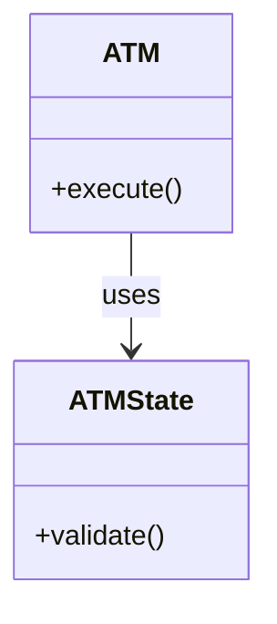

</details>

**Step 2: Add state, validation, and collaborating entities.**

<details>
<summary>📌 Open Class diagram 19</summary>

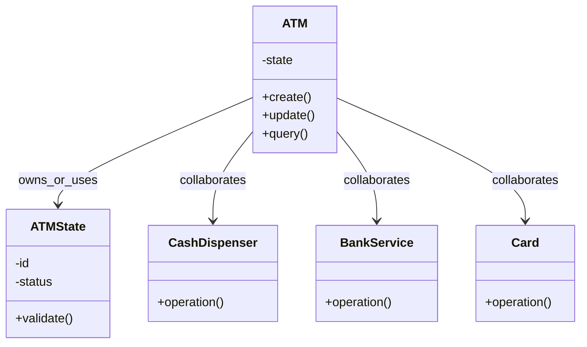

</details>

**Step 3: Use the final class diagram below as the complete interview answer.**

The original final diagram in this section remains the target design. Use Step 1 and Step 2 only to explain how you reached it during the interview.

### 1. Requirements

- Support card insertion, PIN validation, cash withdrawal, and card ejection.
- Prevent invalid operations based on current ATM state.
- Validate balance and ATM cash before dispensing.
- Separate bank validation from ATM state handling.

### 2. Core Use Cases

- Insert card
- Enter PIN
- Bank validates PIN
- Withdraw requested

### 3. Entities + Responsibilities

| Entity | Responsibility |
|---|---|
| `ATM` | Context object delegating actions to current state. |
| `ATMState` | State behavior contract. |
| `CashDispenser` | Tracks and dispenses cash. |
| `BankService` | Validates PIN and debits account. |
| `Card` | Represents customer card/account. |

### 4. System Visualization Diagram

<details>
<summary>📌 Open Class diagram 20</summary>

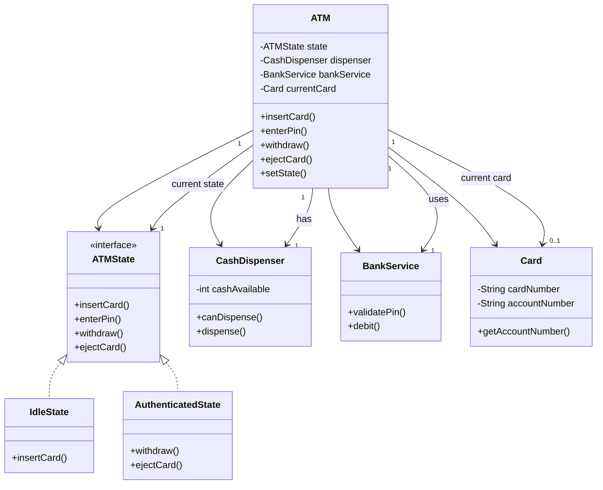

</details>

### 5. Relationships and Cardinality

| From | Cardinality | To | Cardinality | Relationship |
|---|---:|---|---:|---|
| `ATM` | 1 | `ATMState` | 1 | current state |
| `ATM` | 1 | `Card` | 0..1 | current card |
| `ATM` | 1 | `CashDispenser` | 1 | has |
| `ATM` | 1 | `BankService` | 1 | uses |

### 6. Core Flow

```text
Core Flow:
1. Insert card ->
2. Enter PIN ->
3. Bank validates PIN ->
4. Withdraw requested ->
5. ATM debits account and dispenses cash
```

### 7. Design Patterns Used

- **State:** ATM behavior changes depending on Idle, CardInserted, and Authenticated states.
- **Separation of Concerns:** BankService validates account rules while CashDispenser handles cash.

### 8. Full Java Implementation

```java
interface ATMState {
    void insertCard(ATM atm, Card card);
    void enterPin(ATM atm, String pin);
    void withdraw(ATM atm, double amount);
    void ejectCard(ATM atm);
}

class IdleState implements ATMState {
    public void insertCard(ATM atm, Card card) {
        atm.setCurrentCard(card);
        atm.setState(new CardInsertedState());
    }

    public void enterPin(ATM atm, String pin) {
        throw new IllegalStateException("Insert card first");
    }

    public void withdraw(ATM atm, double amount) {
        throw new IllegalStateException("Insert card first");
    }

    public void ejectCard(ATM atm) {
        System.out.println("No card inserted");
    }
}

class CardInsertedState implements ATMState {
    public void insertCard(ATM atm, Card card) {
        throw new IllegalStateException("Card already inserted");
    }

    public void enterPin(ATM atm, String pin) {
        if (atm.getBankService().validatePin(atm.getCurrentCard(), pin)) {
            atm.setState(new AuthenticatedState());
        } else {
            atm.setCurrentCard(null);
            atm.setState(new IdleState());
            throw new IllegalArgumentException("Invalid PIN");
        }
    }

    public void withdraw(ATM atm, double amount) {
        throw new IllegalStateException("Authenticate first");
    }

    public void ejectCard(ATM atm) {
        atm.setCurrentCard(null);
        atm.setState(new IdleState());
    }
}

class AuthenticatedState implements ATMState {
    public void insertCard(ATM atm, Card card) {
        throw new IllegalStateException("Card already inserted");
    }

    public void enterPin(ATM atm, String pin) {
        System.out.println("Already authenticated");
    }

    public void withdraw(ATM atm, double amount) {
        Card card = atm.getCurrentCard();
        if (!atm.getDispenser().canDispense(amount)) throw new IllegalStateException("ATM has insufficient cash");
        if (!atm.getBankService().debit(card.getAccountNumber(), amount)) throw new IllegalStateException("Insufficient balance");

        atm.getDispenser().dispense(amount);
        atm.setCurrentCard(null);
        atm.setState(new IdleState());
    }

    public void ejectCard(ATM atm) {
        atm.setCurrentCard(null);
        atm.setState(new IdleState());
    }
}

class Card {
    private final String cardNumber;
    private final String accountNumber;
    private final String pin;

    public Card(String cardNumber, String accountNumber, String pin) {
        this.cardNumber = cardNumber;
        this.accountNumber = accountNumber;
        this.pin = pin;
    }

    public String getAccountNumber() { return accountNumber; }
    public boolean validatePin(String inputPin) { return pin.equals(inputPin); }
}

class CashDispenser {
    private double cashAvailable;

    public CashDispenser(double cashAvailable) {
        this.cashAvailable = cashAvailable;
    }

    public boolean canDispense(double amount) {
        return amount > 0 && cashAvailable >= amount;
    }

    public void dispense(double amount) {
        if (!canDispense(amount)) throw new IllegalStateException("Cannot dispense");
        cashAvailable -= amount;
        System.out.println("Dispensed: " + amount);
    }
}

class BankService {
    private final java.util.Map<String, Double> balances = new java.util.HashMap<>();

    public void addAccount(String accountNumber, double balance) {
        balances.put(accountNumber, balance);
    }

    public boolean validatePin(Card card, String pin) {
        return card.validatePin(pin);
    }

    public boolean debit(String accountNumber, double amount) {
        double balance = balances.getOrDefault(accountNumber, 0.0);
        if (balance < amount) return false;
        balances.put(accountNumber, balance - amount);
        return true;
    }
}

class ATM {
    private ATMState state = new IdleState();
    private final CashDispenser dispenser;
    private final BankService bankService;
    private Card currentCard;

    public ATM(CashDispenser dispenser, BankService bankService) {
        this.dispenser = dispenser;
        this.bankService = bankService;
    }

    public void insertCard(Card card) { state.insertCard(this, card); }
    public void enterPin(String pin) { state.enterPin(this, pin); }
    public void withdraw(double amount) { state.withdraw(this, amount); }
    public void ejectCard() { state.ejectCard(this); }

    public void setState(ATMState state) { this.state = state; }
    public Card getCurrentCard() { return currentCard; }
    public void setCurrentCard(Card card) { this.currentCard = card; }
    public CashDispenser getDispenser() { return dispenser; }
    public BankService getBankService() { return bankService; }
}
```

### 8.1 Main Method Demo

Add this `Main` class at the bottom of the same Java file when practicing locally.

```java
class Main {
    public static void main(String[] args) {
        BankService bank = new BankService();
        bank.addAccount("ACC1", 1000);
        ATM atm = new ATM(new CashDispenser(5000), bank);
        Card card = new Card("CARD1", "ACC1", "1234");
        atm.insertCard(card);
        atm.enterPin("1234");
        atm.withdraw(250);
    }
}
```

### 9. Edge Cases

- Wrong PIN
- Insufficient account balance
- Insufficient ATM cash
- Withdraw before authentication

---

### 10. Short Final Improvement Notes

- Start with the simplest working domain model, then add strategies only for rules that change.
- Keep entities small: state belongs inside entities, orchestration belongs inside service/context classes.
- Mention thread safety only around shared mutable structures, not everywhere.
- For production, add persistence, logging, metrics, idempotency, and tests around edge cases.

## Design Elevator System

**Category:** Managing States


### Interview Upgrade Pack

#### A. Requirement Definition

| ID | Requirement | Type | Priority |
|---|---|---|---|
| R1 | Support multiple elevators and passenger requests. | Functional | Must have |
| R2 | Assign the best elevator using a dispatcher. | Functional | Must have |
| R3 | Move elevator step by step toward pickup/drop floors. | Functional | Must have |
| R4 | Track elevator direction and state. | Functional | Must have |
| NF1 | Keep operations predictable and easy to test | Non-functional | Should have |
| NF2 | Protect shared mutable state where concurrent calls are possible | Non-functional | Should have |
| OOS1 | Distributed persistence, external APIs, UI, and analytics are out of scope unless interviewer asks | Out of scope | Explicit |

#### B. Requirement Flow Visualization

<details>
<summary>📌 Open Flow diagram 21</summary>

```mermaid
flowchart LR
  A[Input Request] --> B[Validate Rules]
  B --> C[Find Or Create Domain Objects]
  C --> D[Apply State Change]
  D --> E[Return Result]
  E --> F[Handle Edge Cases]
```

</details>

#### C. Entities From Simple to Complete

| Entity | Core Fields | Core Methods | Why It Exists |
|---|---|---|---|
| `ElevatorSystem` | `elevatorsystemId`, state/data fields | create/update/query methods | Entry point for elevator requests. |
| `Dispatcher` | `dispatcherId`, state/data fields | create/update/query methods | Chooses elevator for request. |
| `Elevator` | `elevatorId`, state/data fields | create/update/query methods | Tracks floor, state, direction, and queue. |
| `Request` | `requestId`, state/data fields | create/update/query methods | Represents pickup and destination. |

#### D. Possible Design Patterns: Why and Where

| Pattern | Where To Use | Why It Helps |
|---|---|---|
| Strategy | Rules that may change, such as matching, pricing, validation, ranking, or allocation | Adds new behavior without changing orchestration code |
| State | Objects with lifecycle transitions such as active, completed, failed, authenticated, or expired | Prevents invalid operations in the wrong state |
| Facade / Service Layer | Public API class such as `ElevatorSystem` | Hides internal entities and gives interviewer a clean entry point |
| Composition | Parent owns child entities | Makes ownership and cardinality easy to explain |

**Best-fit patterns for this problem:** Strategy for dispatching, Command-like request object, Queue processing.

#### E. Relationships Step by Step

1. Start from `ElevatorSystem` and connect it to `Dispatcher` because it needs that object to complete the use case.
2. Start from `ElevatorSystem` and connect it to `Elevator` because it needs that object to complete the use case.
3. Start from `ElevatorSystem` and connect it to `Request` because it needs that object to complete the use case.

#### F. Build the Class Diagram Step by Step

**Step 1: Start with the main context and one core entity.**

<details>
<summary>📌 Open Class diagram 22</summary>

```mermaid
classDiagram
  class ElevatorSystem {
    +execute()
  }
  class Dispatcher {
    +validate()
  }
  ElevatorSystem --> Dispatcher : uses
```

</details>

**Step 2: Add state, validation, and collaborating entities.**

<details>
<summary>📌 Open Class diagram 23</summary>

```mermaid
classDiagram
  class ElevatorSystem {
    -state
    +create()
    +update()
    +query()
  }
  class Dispatcher {
    -id
    -status
    +validate()
  }
  class Elevator {
    +operation()
  }
  class Request {
    +operation()
  }
  ElevatorSystem --> Dispatcher : owns_or_uses
  ElevatorSystem --> Elevator : collaborates
  ElevatorSystem --> Request : collaborates
```

</details>

**Step 3: Use the final class diagram below as the complete interview answer.**

The original final diagram in this section remains the target design. Use Step 1 and Step 2 only to explain how you reached it during the interview.

### 1. Requirements

- Support multiple elevators and passenger requests.
- Assign the best elevator using a dispatcher.
- Move elevator step by step toward pickup/drop floors.
- Track elevator direction and state.

### 2. Core Use Cases

- Request submitted
- Dispatcher selects nearest elevator
- Elevator queues request
- Elevator moves to pickup

### 3. Entities + Responsibilities

| Entity | Responsibility |
|---|---|
| `ElevatorSystem` | Entry point for elevator requests. |
| `Dispatcher` | Chooses elevator for request. |
| `Elevator` | Tracks floor, state, direction, and queue. |
| `Request` | Represents pickup and destination. |

### 4. System Visualization Diagram

<details>
<summary>📌 Open Class diagram 24</summary>

```mermaid
classDiagram
  class ElevatorSystem {
    -List elevators
    -Dispatcher dispatcher
    +requestElevator()
    +step()
  }
  class Elevator {
    -int id
    -int currentFloor
    -Direction direction
    -ElevatorState state
    -Queue requests
    +addRequest()
    +move()
    +openDoor()
    +closeDoor()
  }
  class Dispatcher {
    +assignElevator()
  }
  class Request {
    -int sourceFloor
    -int destinationFloor
    -Direction direction
    +isUp()
  }
  ElevatorSystem --> Dispatcher
  ElevatorSystem --> Elevator
  Elevator --> Request
  %% Cardinality relationships
  ElevatorSystem "1" --> "*" Elevator : manages
  ElevatorSystem "1" --> "1" Dispatcher : uses
  Elevator "1" --> "*" Request : queues
```

</details>

### 5. Relationships and Cardinality

| From | Cardinality | To | Cardinality | Relationship |
|---|---:|---|---:|---|
| `ElevatorSystem` | 1 | `Elevator` | * | manages |
| `ElevatorSystem` | 1 | `Dispatcher` | 1 | uses |
| `Elevator` | 1 | `Request` | * | queues |

### 6. Core Flow

```text
Core Flow:
1. Request submitted ->
2. Dispatcher selects nearest elevator ->
3. Elevator queues request ->
4. Elevator moves to pickup ->
5. Elevator moves to destination
```

### 7. Design Patterns Used

- **Strategy:** Dispatcher can be replaced with nearest, least-loaded, or zone-based assignment.
- **Queue:** Each elevator stores requests and processes them step by step.

### 8. Full Java Implementation

```java
import java.util.*;

enum Direction { UP, DOWN, IDLE }
enum ElevatorState { MOVING, IDLE, DOOR_OPEN }

class Request {
    final int sourceFloor;
    final int destinationFloor;
    final Direction direction;

    Request(int sourceFloor, int destinationFloor) {
        this.sourceFloor = sourceFloor;
        this.destinationFloor = destinationFloor;
        this.direction = destinationFloor > sourceFloor ? Direction.UP : Direction.DOWN;
    }

    public boolean isUp() { return direction == Direction.UP; }
}

class Elevator {
    private final int id;
    private int currentFloor;
    private Direction direction = Direction.IDLE;
    private ElevatorState state = ElevatorState.IDLE;
    private final Queue<Request> requests = new LinkedList<>();

    Elevator(int id, int startFloor) {
        this.id = id;
        this.currentFloor = startFloor;
    }

    public void addRequest(Request request) {
        requests.offer(request);
    }

    public void move() {
        Request request = requests.peek();
        if (request == null) {
            direction = Direction.IDLE;
            state = ElevatorState.IDLE;
            return;
        }

        int target = currentFloor == request.sourceFloor ? request.destinationFloor : request.sourceFloor;
        if (currentFloor < target) {
            currentFloor++;
            direction = Direction.UP;
        } else if (currentFloor > target) {
            currentFloor--;
            direction = Direction.DOWN;
        } else {
            openDoor();
            if (currentFloor == request.destinationFloor) requests.poll();
            closeDoor();
        }
        state = requests.isEmpty() ? ElevatorState.IDLE : ElevatorState.MOVING;
    }

    public void openDoor() { state = ElevatorState.DOOR_OPEN; }
    public void closeDoor() { state = ElevatorState.IDLE; }

    public int distanceFrom(int floor) { return Math.abs(currentFloor - floor); }
    public int getCurrentFloor() { return currentFloor; }
    public int getId() { return id; }
}

class Dispatcher {
    public Elevator assignElevator(Request request, List<Elevator> elevators) {
        if (elevators.isEmpty()) throw new IllegalStateException("No elevators configured");

        Elevator best = elevators.get(0);
        for (Elevator elevator : elevators) {
            if (elevator.distanceFrom(request.sourceFloor) < best.distanceFrom(request.sourceFloor)) {
                best = elevator;
            }
        }
        best.addRequest(request);
        return best;
    }
}

class ElevatorSystem {
    private final List<Elevator> elevators = new ArrayList<>();
    private final Dispatcher dispatcher = new Dispatcher();

    ElevatorSystem(int elevatorCount) {
        for (int i = 1; i <= elevatorCount; i++) elevators.add(new Elevator(i, 0));
    }

    public Elevator requestElevator(int source, int destination) {
        if (source == destination) throw new IllegalArgumentException("Source and destination are same");
        return dispatcher.assignElevator(new Request(source, destination), elevators);
    }

    public void step() {
        for (Elevator elevator : elevators) elevator.move();
    }
}
```

### 8.1 Main Method Demo

Add this `Main` class at the bottom of the same Java file when practicing locally.

```java
class Main {
    public static void main(String[] args) {
        ElevatorSystem system = new ElevatorSystem(2);
        Elevator assigned = system.requestElevator(0, 5);
        for (int i = 0; i < 7; i++) system.step();
        System.out.println("Assigned elevator = " + assigned.getId());
    }
}
```

### 9. Edge Cases

- Invalid input should fail fast with a clear exception.
- Duplicate or repeated operation should not corrupt state.
- Boundary conditions should be tested.
- Concurrent access should be protected where shared mutable state exists.

---

### 10. Short Final Improvement Notes

- Start with the simplest working domain model, then add strategies only for rules that change.
- Keep entities small: state belongs inside entities, orchestration belongs inside service/context classes.
- Mention thread safety only around shared mutable structures, not everywhere.
- For production, add persistence, logging, metrics, idempotency, and tests around edge cases.

## Design Parking Lot

**Category:** Management Systems


### Interview Upgrade Pack

#### A. Requirement Definition

| ID | Requirement | Type | Priority |
|---|---|---|---|
| R1 | Support multiple floors and different vehicle/spot sizes. | Functional | Must have |
| R2 | Allocate compatible available spots automatically. | Functional | Must have |
| R3 | Issue parking tickets and calculate fees on exit. | Functional | Must have |
| R4 | Handle concurrent parking operations safely. | Functional | Must have |
| NF1 | Keep operations predictable and easy to test | Non-functional | Should have |
| NF2 | Protect shared mutable state where concurrent calls are possible | Non-functional | Should have |
| OOS1 | Distributed persistence, external APIs, UI, and analytics are out of scope unless interviewer asks | Out of scope | Explicit |

#### B. Requirement Flow Visualization

<details>
<summary>📌 Open Flow diagram 25</summary>

```mermaid
flowchart LR
  A[Input Request] --> B[Validate Rules]
  B --> C[Find Or Create Domain Objects]
  C --> D[Apply State Change]
  D --> E[Return Result]
  E --> F[Handle Edge Cases]
```

</details>

#### C. Entities From Simple to Complete

| Entity | Core Fields | Core Methods | Why It Exists |
|---|---|---|---|
| `ParkingLot` | `parkinglotId`, state/data fields | create/update/query methods | Facade for park/unpark operations. |
| `ParkingFloor` | `parkingfloorId`, state/data fields | create/update/query methods | Groups parking spots. |
| `ParkingSpot` | `parkingspotId`, state/data fields | create/update/query methods | Stores spot size and parked vehicle. |
| `Vehicle` | `vehicleId`, state/data fields | create/update/query methods | Base type for Bike, Car, Truck. |
| `ParkingTicket` | `parkingticketId`, state/data fields | create/update/query methods | Tracks vehicle, spot, and time. |

#### D. Possible Design Patterns: Why and Where

| Pattern | Where To Use | Why It Helps |
|---|---|---|
| Strategy | Rules that may change, such as matching, pricing, validation, ranking, or allocation | Adds new behavior without changing orchestration code |
| State | Objects with lifecycle transitions such as active, completed, failed, authenticated, or expired | Prevents invalid operations in the wrong state |
| Facade / Service Layer | Public API class such as `ParkingLot` | Hides internal entities and gives interviewer a clean entry point |
| Composition | Parent owns child entities | Makes ownership and cardinality easy to explain |

**Best-fit patterns for this problem:** Facade, Strategy for allocation and fee, Composition for floor and spots.

#### E. Relationships Step by Step

1. Start from `ParkingLot` and connect it to `ParkingFloor` because it needs that object to complete the use case.
2. Start from `ParkingLot` and connect it to `ParkingSpot` because it needs that object to complete the use case.
3. Start from `ParkingLot` and connect it to `Vehicle` because it needs that object to complete the use case.
4. Start from `ParkingLot` and connect it to `ParkingTicket` because it needs that object to complete the use case.

#### F. Build the Class Diagram Step by Step

**Step 1: Start with the main context and one core entity.**

<details>
<summary>📌 Open Class diagram 26</summary>

```mermaid
classDiagram
  class ParkingLot {
    +execute()
  }
  class ParkingFloor {
    +validate()
  }
  ParkingLot --> ParkingFloor : uses
```

</details>

**Step 2: Add state, validation, and collaborating entities.**

<details>
<summary>📌 Open Class diagram 27</summary>

```mermaid
classDiagram
  class ParkingLot {
    -state
    +create()
    +update()
    +query()
  }
  class ParkingFloor {
    -id
    -status
    +validate()
  }
  class ParkingSpot {
    +operation()
  }
  class Vehicle {
    +operation()
  }
  class ParkingTicket {
    +operation()
  }
  ParkingLot --> ParkingFloor : owns_or_uses
  ParkingLot --> ParkingSpot : collaborates
  ParkingLot --> Vehicle : collaborates
  ParkingLot --> ParkingTicket : collaborates
```

</details>

**Step 3: Use the final class diagram below as the complete interview answer.**

The original final diagram in this section remains the target design. Use Step 1 and Step 2 only to explain how you reached it during the interview.

### 1. Requirements

- Support multiple floors and different vehicle/spot sizes.
- Allocate compatible available spots automatically.
- Issue parking tickets and calculate fees on exit.
- Handle concurrent parking operations safely.

### 2. Core Use Cases

- Vehicle enters
- Allocation strategy finds spot
- Spot parks vehicle
- Ticket is issued

### 3. Entities + Responsibilities

| Entity | Responsibility |
|---|---|
| `ParkingLot` | Facade for park/unpark operations. |
| `ParkingFloor` | Groups parking spots. |
| `ParkingSpot` | Stores spot size and parked vehicle. |
| `Vehicle` | Base type for Bike, Car, Truck. |
| `ParkingTicket` | Tracks vehicle, spot, and time. |

### 4. System Visualization Diagram

<details>
<summary>📌 Open Class diagram 28</summary>

```mermaid
classDiagram
  class ParkingLot {
    -List floors
    -Map activeTickets
    -FeeStrategy feeStrategy
    -SpotAllocationStrategy allocationStrategy
    +parkVehicle()
    +unparkVehicle()
    +displayAvailability()
  }
  class ParkingFloor {
    -int floorNumber
    -List spots
    +findAvailableSpot()
    +getAvailableCount()
  }
  class ParkingSpot {
    -String spotId
    -VehicleSize size
    -Vehicle parkedVehicle
    +isAvailable()
    +canFitVehicle()
    +parkVehicle()
    +unparkVehicle()
  }
  class Vehicle {
    <<abstract>>
    -String licensePlate
    -VehicleSize size
    +getLicensePlate()
    +getSize()
  }
  class ParkingTicket {
    -String ticketId
    -Vehicle vehicle
    -ParkingSpot spot
    -LocalDateTime entryTime
    -LocalDateTime exitTime
    +close()
    +getDurationHours()
  }
  class FeeStrategy {
    <<interface>>
    +calculateFee()
  }
  class SpotAllocationStrategy {
    <<interface>>
    +findSpot()
  }
  ParkingLot *-- ParkingFloor
  ParkingFloor *-- ParkingSpot
  ParkingSpot --> Vehicle
  ParkingTicket --> Vehicle
  ParkingTicket --> ParkingSpot
  ParkingLot --> FeeStrategy
  ParkingLot --> SpotAllocationStrategy
  %% Cardinality relationships
  ParkingLot "1" --> "*" ParkingFloor : contains
  ParkingFloor "1" --> "*" ParkingSpot : contains
  ParkingSpot "1" --> "0..1" Vehicle : parks
  ParkingTicket "1" --> "1" Vehicle : references
  ParkingTicket "1" --> "1" ParkingSpot : references
```

</details>

### 5. Relationships and Cardinality

| From | Cardinality | To | Cardinality | Relationship |
|---|---:|---|---:|---|
| `ParkingLot` | 1 | `ParkingFloor` | * | contains |
| `ParkingFloor` | 1 | `ParkingSpot` | * | contains |
| `ParkingSpot` | 1 | `Vehicle` | 0..1 | parks |
| `ParkingTicket` | 1 | `Vehicle` | 1 | references |
| `ParkingTicket` | 1 | `ParkingSpot` | 1 | references |

### 6. Core Flow

```text
Core Flow:
1. Vehicle enters ->
2. Allocation strategy finds spot ->
3. Spot parks vehicle ->
4. Ticket is issued ->
5. On exit fee is calculated and spot freed
```

### 7. Design Patterns Used

- **Strategy:** Spot allocation and fee calculation are interchangeable.
- **Facade:** ParkingLot exposes simple park/unpark methods while hiding floors/spots internals.

### 8. Full Java Implementation

```java
import java.time.*;
import java.util.*;
import java.util.concurrent.*;

enum VehicleSize { SMALL, MEDIUM, LARGE }

abstract class Vehicle {
    private final String licensePlate;
    private final VehicleSize size;

    protected Vehicle(String licensePlate, VehicleSize size) {
        this.licensePlate = licensePlate;
        this.size = size;
    }

    public String getLicensePlate() { return licensePlate; }
    public VehicleSize getSize() { return size; }
}

class Bike extends Vehicle { public Bike(String plate) { super(plate, VehicleSize.SMALL); } }
class Car extends Vehicle { public Car(String plate) { super(plate, VehicleSize.MEDIUM); } }
class Truck extends Vehicle { public Truck(String plate) { super(plate, VehicleSize.LARGE); } }

class ParkingSpot {
    private final String spotId;
    private final VehicleSize size;
    private Vehicle parkedVehicle;

    public ParkingSpot(String spotId, VehicleSize size) {
        this.spotId = spotId;
        this.size = size;
    }

    public String getSpotId() { return spotId; }
    public VehicleSize getSize() { return size; }
    public boolean isAvailable() { return parkedVehicle == null; }

    public boolean canFitVehicle(Vehicle vehicle) {
        return isAvailable() && size.ordinal() >= vehicle.getSize().ordinal();
    }

    public synchronized void parkVehicle(Vehicle vehicle) {
        if (!canFitVehicle(vehicle)) throw new IllegalStateException("Spot unavailable or incompatible");
        parkedVehicle = vehicle;
    }

    public synchronized Vehicle unparkVehicle() {
        if (parkedVehicle == null) throw new IllegalStateException("Spot already empty");
        Vehicle vehicle = parkedVehicle;
        parkedVehicle = null;
        return vehicle;
    }
}

class ParkingFloor {
    private final int floorNumber;
    private final List<ParkingSpot> spots = new ArrayList<>();

    public ParkingFloor(int floorNumber, Map<VehicleSize, Integer> spotCounts) {
        this.floorNumber = floorNumber;
        int seq = 1;
        for (Map.Entry<VehicleSize, Integer> entry : spotCounts.entrySet()) {
            for (int i = 0; i < entry.getValue(); i++) {
                spots.add(new ParkingSpot("F" + floorNumber + "-" + seq++, entry.getKey()));
            }
        }
    }

    public ParkingSpot findAvailableSpot(Vehicle vehicle) {
        for (ParkingSpot spot : spots)
            if (spot.canFitVehicle(vehicle)) return spot;
        return null;
    }

    public int getAvailableCount(VehicleSize size) {
        int count = 0;
        for (ParkingSpot spot : spots)
            if (spot.isAvailable() && spot.getSize() == size) count++;
        return count;
    }

    public int getFloorNumber() { return floorNumber; }
    public List<ParkingSpot> getSpots() { return spots; }
}

class ParkingTicket {
    private final String ticketId;
    private final Vehicle vehicle;
    private final ParkingSpot spot;
    private final LocalDateTime entryTime;
    private LocalDateTime exitTime;

    public ParkingTicket(String ticketId, Vehicle vehicle, ParkingSpot spot) {
        this.ticketId = ticketId;
        this.vehicle = vehicle;
        this.spot = spot;
        this.entryTime = LocalDateTime.now();
    }

    public String getTicketId() { return ticketId; }
    public Vehicle getVehicle() { return vehicle; }
    public ParkingSpot getSpot() { return spot; }
    public LocalDateTime getEntryTime() { return entryTime; }

    public void close() { this.exitTime = LocalDateTime.now(); }

    public long getDurationHours() {
        LocalDateTime end = exitTime == null ? LocalDateTime.now() : exitTime;
        long minutes = Duration.between(entryTime, end).toMinutes();
        return Math.max(1, (long) Math.ceil(minutes / 60.0));
    }
}

interface FeeStrategy {
    double calculateFee(ParkingTicket ticket);
}

class HourlyFeeStrategy implements FeeStrategy {
    private final double hourlyRate;

    public HourlyFeeStrategy(double hourlyRate) {
        this.hourlyRate = hourlyRate;
    }

    public double calculateFee(ParkingTicket ticket) {
        return ticket.getDurationHours() * hourlyRate;
    }
}

interface SpotAllocationStrategy {
    ParkingSpot findSpot(List<ParkingFloor> floors, Vehicle vehicle);
}

class NearestFirstAllocationStrategy implements SpotAllocationStrategy {
    public ParkingSpot findSpot(List<ParkingFloor> floors, Vehicle vehicle) {
        for (ParkingFloor floor : floors) {
            ParkingSpot spot = floor.findAvailableSpot(vehicle);
            if (spot != null) return spot;
        }
        return null;
    }
}

class ParkingLot {
    private final List<ParkingFloor> floors;
    private final Map<String, ParkingTicket> activeTickets = new ConcurrentHashMap<>();
    private final FeeStrategy feeStrategy;
    private final SpotAllocationStrategy allocationStrategy;

    public ParkingLot(List<ParkingFloor> floors, FeeStrategy feeStrategy, SpotAllocationStrategy allocationStrategy) {
        this.floors = floors;
        this.feeStrategy = feeStrategy;
        this.allocationStrategy = allocationStrategy;
    }

    public synchronized ParkingTicket parkVehicle(Vehicle vehicle) {
        ParkingSpot spot = allocationStrategy.findSpot(floors, vehicle);
        if (spot == null) throw new IllegalStateException("No compatible spot available");

        spot.parkVehicle(vehicle);
        ParkingTicket ticket = new ParkingTicket(UUID.randomUUID().toString(), vehicle, spot);
        activeTickets.put(ticket.getTicketId(), ticket);
        return ticket;
    }

    public synchronized double unparkVehicle(String ticketId) {
        ParkingTicket ticket = activeTickets.remove(ticketId);
        if (ticket == null) throw new IllegalArgumentException("Invalid ticket");

        ticket.close();
        ticket.getSpot().unparkVehicle();
        return feeStrategy.calculateFee(ticket);
    }

    public void displayAvailability() {
        for (ParkingFloor floor : floors) {
            System.out.println("Floor " + floor.getFloorNumber());
            for (VehicleSize size : VehicleSize.values()) {
                System.out.println(size + ": " + floor.getAvailableCount(size));
            }
        }
    }
}
```

### 8.1 Main Method Demo

Add this `Main` class at the bottom of the same Java file when practicing locally.

```java
class Main {
    public static void main(String[] args) {
        java.util.Map<VehicleSize, Integer> counts = new java.util.EnumMap<>(VehicleSize.class);
        counts.put(VehicleSize.SMALL, 2);
        counts.put(VehicleSize.MEDIUM, 2);
        counts.put(VehicleSize.LARGE, 1);
        ParkingFloor floor = new ParkingFloor(1, counts);
        ParkingLot lot = new ParkingLot(java.util.List.of(floor), new HourlyFeeStrategy(10), new NearestFirstAllocationStrategy());
        ParkingTicket ticket = lot.parkVehicle(new Car("B-100"));
        double fee = lot.unparkVehicle(ticket.getTicketId());
        System.out.println("Fee = " + fee);
    }
}
```

### 9. Edge Cases

- No compatible spot
- Invalid ticket
- Unpark already free spot
- Concurrent entry lanes

---

### 10. Short Final Improvement Notes

- Start with the simplest working domain model, then add strategies only for rules that change.
- Keep entities small: state belongs inside entities, orchestration belongs inside service/context classes.
- Mention thread safety only around shared mutable structures, not everywhere.
- For production, add persistence, logging, metrics, idempotency, and tests around edge cases.

## Design Inventory Management System

**Category:** Management Systems


### Interview Upgrade Pack

#### A. Requirement Definition

| ID | Requirement | Type | Priority |
|---|---|---|---|
| R1 | Track products across warehouses. | Functional | Must have |
| R2 | Support stock addition, reservation, release, and sale. | Functional | Must have |
| R3 | Prevent overselling and invalid quantities. | Functional | Must have |
| R4 | Expose availability across warehouses. | Functional | Must have |
| NF1 | Keep operations predictable and easy to test | Non-functional | Should have |
| NF2 | Protect shared mutable state where concurrent calls are possible | Non-functional | Should have |
| OOS1 | Distributed persistence, external APIs, UI, and analytics are out of scope unless interviewer asks | Out of scope | Explicit |

#### B. Requirement Flow Visualization

<details>
<summary>📌 Open Flow diagram 29</summary>

```mermaid
flowchart LR
  A[Input Request] --> B[Validate Rules]
  B --> C[Find Or Create Domain Objects]
  C --> D[Apply State Change]
  D --> E[Return Result]
  E --> F[Handle Edge Cases]
```

</details>

#### C. Entities From Simple to Complete

| Entity | Core Fields | Core Methods | Why It Exists |
|---|---|---|---|
| `InventoryService` | `inventoryserviceId`, state/data fields | create/update/query methods | Coordinates warehouses. |
| `Warehouse` | `warehouseId`, state/data fields | create/update/query methods | Stores inventory items. |
| `InventoryItem` | `inventoryitemId`, state/data fields | create/update/query methods | Tracks available and reserved stock. |
| `Product` | `productId`, state/data fields | create/update/query methods | Product identity and metadata. |

#### D. Possible Design Patterns: Why and Where

| Pattern | Where To Use | Why It Helps |
|---|---|---|
| Strategy | Rules that may change, such as matching, pricing, validation, ranking, or allocation | Adds new behavior without changing orchestration code |
| State | Objects with lifecycle transitions such as active, completed, failed, authenticated, or expired | Prevents invalid operations in the wrong state |
| Facade / Service Layer | Public API class such as `InventoryService` | Hides internal entities and gives interviewer a clean entry point |
| Composition | Parent owns child entities | Makes ownership and cardinality easy to explain |

**Best-fit patterns for this problem:** Service Layer, Repository Map, Encapsulation for stock transitions.

#### E. Relationships Step by Step

1. Start from `InventoryService` and connect it to `Warehouse` because it needs that object to complete the use case.
2. Start from `InventoryService` and connect it to `InventoryItem` because it needs that object to complete the use case.
3. Start from `InventoryService` and connect it to `Product` because it needs that object to complete the use case.

#### F. Build the Class Diagram Step by Step

**Step 1: Start with the main context and one core entity.**

<details>
<summary>📌 Open Class diagram 30</summary>

```mermaid
classDiagram
  class InventoryService {
    +execute()
  }
  class Warehouse {
    +validate()
  }
  InventoryService --> Warehouse : uses
```

</details>

**Step 2: Add state, validation, and collaborating entities.**

<details>
<summary>📌 Open Class diagram 31</summary>

```mermaid
classDiagram
  class InventoryService {
    -state
    +create()
    +update()
    +query()
  }
  class Warehouse {
    -id
    -status
    +validate()
  }
  class InventoryItem {
    +operation()
  }
  class Product {
    +operation()
  }
  InventoryService --> Warehouse : owns_or_uses
  InventoryService --> InventoryItem : collaborates
  InventoryService --> Product : collaborates
```

</details>

**Step 3: Use the final class diagram below as the complete interview answer.**

The original final diagram in this section remains the target design. Use Step 1 and Step 2 only to explain how you reached it during the interview.

### 1. Requirements

- Track products across warehouses.
- Support stock addition, reservation, release, and sale.
- Prevent overselling and invalid quantities.
- Expose availability across warehouses.

### 2. Core Use Cases

- Stock is added
- Order reserves quantity
- Reserved stock is sold or released
- Availability is updated

### 3. Entities + Responsibilities

| Entity | Responsibility |
|---|---|
| `InventoryService` | Coordinates warehouses. |
| `Warehouse` | Stores inventory items. |
| `InventoryItem` | Tracks available and reserved stock. |
| `Product` | Product identity and metadata. |

### 4. System Visualization Diagram

<details>
<summary>📌 Open Class diagram 32</summary>

```mermaid
classDiagram
  class InventoryService {
    -List warehouses
    +addStock()
    +reserve()
    +release()
    +sell()
    +checkAvailability()
  }
  class Warehouse {
    -String warehouseId
    -Map items
    +addItem()
    +getItem()
    +removeItem()
  }
  class InventoryItem {
    -Product product
    -int availableQuantity
    -int reservedQuantity
    +reserve()
    +release()
    +sell()
    +getAvailableQuantity()
  }
  class Product {
    -String productId
    -String name
    -String category
    +getProductId()
    +getName()
  }
  InventoryService --> Warehouse
  Warehouse *-- InventoryItem
  InventoryItem --> Product
  %% Cardinality relationships
  InventoryService "1" --> "*" Warehouse : manages
  Warehouse "1" --> "*" InventoryItem : contains
  InventoryItem "1" --> "1" Product : references
```

</details>

### 5. Relationships and Cardinality

| From | Cardinality | To | Cardinality | Relationship |
|---|---:|---|---:|---|
| `InventoryService` | 1 | `Warehouse` | * | manages |
| `Warehouse` | 1 | `InventoryItem` | * | contains |
| `InventoryItem` | 1 | `Product` | 1 | references |

### 6. Core Flow

```text
Core Flow:
1. Stock is added ->
2. Order reserves quantity ->
3. Reserved stock is sold or released ->
4. Availability is updated
```

### 7. Design Patterns Used

- **Service Layer:** InventoryService coordinates stock operations across warehouses.
- **Encapsulation:** InventoryItem protects available/reserved quantity updates.

### 8. Full Java Implementation

```java
import java.util.*;

class Product {
    private final String productId;
    private final String name;
    private final String category;

    Product(String productId, String name, String category) {
        this.productId = productId;
        this.name = name;
        this.category = category;
    }

    public String getProductId() { return productId; }
    public String getName() { return name; }
    public String getCategory() { return category; }
}

class InventoryItem {
    private final Product product;
    private int availableQuantity;
    private int reservedQuantity;

    InventoryItem(Product product, int quantity) {
        this.product = product;
        this.availableQuantity = quantity;
    }

    public synchronized void addStock(int qty) {
        validateQty(qty);
        availableQuantity += qty;
    }

    public synchronized void reserve(int qty) {
        validateQty(qty);
        if (availableQuantity < qty) throw new IllegalStateException("Insufficient stock");
        availableQuantity -= qty;
        reservedQuantity += qty;
    }

    public synchronized void release(int qty) {
        validateQty(qty);
        if (reservedQuantity < qty) throw new IllegalStateException("Insufficient reserved stock");
        reservedQuantity -= qty;
        availableQuantity += qty;
    }

    public synchronized void sell(int qty) {
        validateQty(qty);
        if (reservedQuantity < qty) throw new IllegalStateException("Reserve before selling");
        reservedQuantity -= qty;
    }

    public int getAvailableQuantity() { return availableQuantity; }
    public Product getProduct() { return product; }

    private void validateQty(int qty) {
        if (qty <= 0) throw new IllegalArgumentException("Quantity must be positive");
    }
}

class Warehouse {
    private final String warehouseId;
    private final Map<String, InventoryItem> items = new HashMap<>();

    Warehouse(String warehouseId) {
        this.warehouseId = warehouseId;
    }

    public void addItem(Product product, int qty) {
        items.compute(product.getProductId(), (id, item) -> {
            if (item == null) return new InventoryItem(product, qty);
            item.addStock(qty);
            return item;
        });
    }

    public InventoryItem getItem(String productId) {
        return items.get(productId);
    }

    public String getWarehouseId() { return warehouseId; }
}

class InventoryService {
    private final List<Warehouse> warehouses = new ArrayList<>();

    public void addWarehouse(Warehouse warehouse) {
        warehouses.add(warehouse);
    }

    public void addStock(String warehouseId, Product product, int qty) {
        Warehouse warehouse = findWarehouse(warehouseId);
        warehouse.addItem(product, qty);
    }

    public boolean reserve(Product product, int qty) {
        for (Warehouse warehouse : warehouses) {
            InventoryItem item = warehouse.getItem(product.getProductId());
            if (item != null && item.getAvailableQuantity() >= qty) {
                item.reserve(qty);
                return true;
            }
        }
        return false;
    }

    public void release(Product product, int qty) {
        for (Warehouse warehouse : warehouses) {
            InventoryItem item = warehouse.getItem(product.getProductId());
            if (item != null) {
                item.release(qty);
                return;
            }
        }
        throw new IllegalArgumentException("Product not found");
    }

    public void sell(Product product, int qty) {
        for (Warehouse warehouse : warehouses) {
            InventoryItem item = warehouse.getItem(product.getProductId());
            if (item != null) {
                item.sell(qty);
                return;
            }
        }
        throw new IllegalArgumentException("Product not found");
    }

    public int checkAvailability(Product product) {
        int total = 0;
        for (Warehouse warehouse : warehouses) {
            InventoryItem item = warehouse.getItem(product.getProductId());
            if (item != null) total += item.getAvailableQuantity();
        }
        return total;
    }

    private Warehouse findWarehouse(String warehouseId) {
        return warehouses.stream()
                .filter(w -> w.getWarehouseId().equals(warehouseId))
                .findFirst()
                .orElseThrow(() -> new IllegalArgumentException("Warehouse not found"));
    }
}
```

### 8.1 Main Method Demo

Add this `Main` class at the bottom of the same Java file when practicing locally.

```java
class Main {
    public static void main(String[] args) {
        Product phone = new Product("P1", "Phone", "Electronics");
        Warehouse wh = new Warehouse("WH1");
        InventoryService service = new InventoryService();
        service.addWarehouse(wh);
        service.addStock("WH1", phone, 10);
        System.out.println(service.checkAvailability(phone));
        service.reserve(phone, 2);
        service.sell(phone, 2);
        System.out.println(service.checkAvailability(phone));
    }
}
```

### 9. Edge Cases

- Invalid input should fail fast with a clear exception.
- Duplicate or repeated operation should not corrupt state.
- Boundary conditions should be tested.
- Concurrent access should be protected where shared mutable state exists.

---

### 10. Short Final Improvement Notes

- Start with the simplest working domain model, then add strategies only for rules that change.
- Keep entities small: state belongs inside entities, orchestration belongs inside service/context classes.
- Mention thread safety only around shared mutable structures, not everywhere.
- For production, add persistence, logging, metrics, idempotency, and tests around edge cases.

## Design a Social Network

**Category:** Social & Content Platforms


### Interview Upgrade Pack

#### A. Requirement Definition

| ID | Requirement | Type | Priority |
|---|---|---|---|
| R1 | Create users, posts, comments, likes, and follow relationships. | Functional | Must have |
| R2 | Generate a user feed from followed users. | Functional | Must have |
| R3 | Prevent invalid relationships such as self-follow. | Functional | Must have |
| R4 | Keep feed generation separate from user/post storage. | Functional | Must have |
| NF1 | Keep operations predictable and easy to test | Non-functional | Should have |
| NF2 | Protect shared mutable state where concurrent calls are possible | Non-functional | Should have |
| OOS1 | Distributed persistence, external APIs, UI, and analytics are out of scope unless interviewer asks | Out of scope | Explicit |

#### B. Requirement Flow Visualization

<details>
<summary>📌 Open Flow diagram 33</summary>

```mermaid
flowchart LR
  A[Input Request] --> B[Validate Rules]
  B --> C[Find Or Create Domain Objects]
  C --> D[Apply State Change]
  D --> E[Return Result]
  E --> F[Handle Edge Cases]
```

</details>

#### C. Entities From Simple to Complete

| Entity | Core Fields | Core Methods | Why It Exists |
|---|---|---|---|
| `SocialNetworkService` | `socialnetworkserviceId`, state/data fields | create/update/query methods | Creates users, posts, and relationships. |
| `User` | `userId`, state/data fields | create/update/query methods | Stores profile, posts, and followings. |
| `Post` | `postId`, state/data fields | create/update/query methods | Stores content, comments, likes. |
| `Comment` | `commentId`, state/data fields | create/update/query methods | Stores comment author and text. |
| `FeedService` | `feedserviceId`, state/data fields | create/update/query methods | Builds feed for a user. |

#### D. Possible Design Patterns: Why and Where

| Pattern | Where To Use | Why It Helps |
|---|---|---|
| Strategy | Rules that may change, such as matching, pricing, validation, ranking, or allocation | Adds new behavior without changing orchestration code |
| State | Objects with lifecycle transitions such as active, completed, failed, authenticated, or expired | Prevents invalid operations in the wrong state |
| Facade / Service Layer | Public API class such as `SocialNetworkService` | Hides internal entities and gives interviewer a clean entry point |
| Composition | Parent owns child entities | Makes ownership and cardinality easy to explain |

**Best-fit patterns for this problem:** Service Layer, Strategy-ready feed generation, Aggregates for user and post.

#### E. Relationships Step by Step

1. Start from `SocialNetworkService` and connect it to `User` because it needs that object to complete the use case.
2. Start from `SocialNetworkService` and connect it to `Post` because it needs that object to complete the use case.
3. Start from `SocialNetworkService` and connect it to `Comment` because it needs that object to complete the use case.
4. Start from `SocialNetworkService` and connect it to `FeedService` because it needs that object to complete the use case.

#### F. Build the Class Diagram Step by Step

**Step 1: Start with the main context and one core entity.**

<details>
<summary>📌 Open Class diagram 34</summary>

```mermaid
classDiagram
  class SocialNetworkService {
    +execute()
  }
  class User {
    +validate()
  }
  SocialNetworkService --> User : uses
```

</details>

**Step 2: Add state, validation, and collaborating entities.**

<details>
<summary>📌 Open Class diagram 35</summary>

```mermaid
classDiagram
  class SocialNetworkService {
    -state
    +create()
    +update()
    +query()
  }
  class User {
    -id
    -status
    +validate()
  }
  class Post {
    +operation()
  }
  class Comment {
    +operation()
  }
  class FeedService {
    +operation()
  }
  SocialNetworkService --> User : owns_or_uses
  SocialNetworkService --> Post : collaborates
  SocialNetworkService --> Comment : collaborates
  SocialNetworkService --> FeedService : collaborates
```

</details>

**Step 3: Use the final class diagram below as the complete interview answer.**

The original final diagram in this section remains the target design. Use Step 1 and Step 2 only to explain how you reached it during the interview.

### 1. Requirements

- Create users, posts, comments, likes, and follow relationships.
- Generate a user feed from followed users.
- Prevent invalid relationships such as self-follow.
- Keep feed generation separate from user/post storage.

### 2. Core Use Cases

- User creates post
- Other users follow author
- Feed service collects followed posts
- Posts are sorted by time

### 3. Entities + Responsibilities

| Entity | Responsibility |
|---|---|
| `SocialNetworkService` | Creates users, posts, and relationships. |
| `User` | Stores profile, posts, and followings. |
| `Post` | Stores content, comments, likes. |
| `Comment` | Stores comment author and text. |
| `FeedService` | Builds feed for a user. |

### 4. System Visualization Diagram

<details>
<summary>📌 Open Class diagram 36</summary>

```mermaid
classDiagram
  class SocialNetworkService {
    -Map users
    -FeedService feedService
    +createUser()
    +createPost()
    +follow()
    +unfollow()
    +getFeed()
  }
  class User {
    -String userId
    -String name
    -Set following
    +follow()
    +unfollow()
  }
  class Post {
    -String postId
    -User author
    -String content
    -List comments
    +like()
    +comment()
  }
  class Comment {
    -String commentId
    -User author
    -String text
    +edit()
  }
  class FeedService {
    +generateFeed()
  }
  SocialNetworkService --> User
  SocialNetworkService --> FeedService
  User --> Post
  Post --> Comment
  %% Cardinality relationships
  SocialNetworkService "1" --> "*" User : manages
  User "1" --> "*" Post : creates
  Post "1" --> "*" Comment : contains
  User "*" --> "*" User : follows
```

</details>

### 5. Relationships and Cardinality

| From | Cardinality | To | Cardinality | Relationship |
|---|---:|---|---:|---|
| `SocialNetworkService` | 1 | `User` | * | manages |
| `User` | 1 | `Post` | * | creates |
| `Post` | 1 | `Comment` | * | contains |
| `User` | * | `User` | * | follows |

### 6. Core Flow

```text
Core Flow:
1. User creates post ->
2. Other users follow author ->
3. Feed service collects followed posts ->
4. Posts are sorted by time
```

### 7. Design Patterns Used

- **Service Layer:** SocialNetworkService coordinates users, posts, and relationships.
- **Strategy-ready Feed:** FeedService can later support ranking, pagination, or ML-based feeds.

### 8. Full Java Implementation

```java
import java.time.*;
import java.util.*;

class User {
    private final String userId;
    private final String name;
    private final Set<User> following = new HashSet<>();
    private final List<Post> posts = new ArrayList<>();

    User(String userId, String name) {
        this.userId = userId;
        this.name = name;
    }

    public void follow(User user) {
        if (user == this) throw new IllegalArgumentException("Cannot follow yourself");
        following.add(user);
    }

    public void unfollow(User user) { following.remove(user); }
    public Set<User> getFollowing() { return following; }
    public List<Post> getPosts() { return posts; }
    public String getUserId() { return userId; }
    public String getName() { return name; }
}

class Comment {
    private final String commentId;
    private final User author;
    private String text;

    Comment(String commentId, User author, String text) {
        this.commentId = commentId;
        this.author = author;
        this.text = text;
    }

    public void edit(String text) { this.text = text; }
}

class Post {
    private final String postId;
    private final User author;
    private final String content;
    private final LocalDateTime createdAt = LocalDateTime.now();
    private final Set<User> likes = new HashSet<>();
    private final List<Comment> comments = new ArrayList<>();

    Post(String postId, User author, String content) {
        this.postId = postId;
        this.author = author;
        this.content = content;
    }

    public void like(User user) { likes.add(user); }
    public void comment(Comment comment) { comments.add(comment); }
    public LocalDateTime getCreatedAt() { return createdAt; }
    public User getAuthor() { return author; }
    public String getContent() { return content; }
}

class FeedService {
    public List<Post> generateFeed(User user) {
        List<Post> feed = new ArrayList<>();
        for (User followed : user.getFollowing()) feed.addAll(followed.getPosts());
        feed.sort((a, b) -> b.getCreatedAt().compareTo(a.getCreatedAt()));
        return feed;
    }
}

class SocialNetworkService {
    private final Map<String, User> users = new HashMap<>();
    private final FeedService feedService = new FeedService();

    public User createUser(String name) {
        String id = UUID.randomUUID().toString();
        User user = new User(id, name);
        users.put(id, user);
        return user;
    }

    public Post createPost(User user, String content) {
        Post post = new Post(UUID.randomUUID().toString(), user, content);
        user.getPosts().add(post);
        return post;
    }

    public void follow(User user, User target) { user.follow(target); }
    public void unfollow(User user, User target) { user.unfollow(target); }
    public List<Post> getFeed(User user) { return feedService.generateFeed(user); }
}
```

### 8.1 Main Method Demo

Add this `Main` class at the bottom of the same Java file when practicing locally.

```java
class Main {
    public static void main(String[] args) {
        SocialNetworkService service = new SocialNetworkService();
        User alice = service.createUser("Alice");
        User bob = service.createUser("Bob");
        service.createPost(bob, "Hello LLD");
        service.follow(alice, bob);
        System.out.println(service.getFeed(alice).size());
    }
}
```

### 9. Edge Cases

- Invalid input should fail fast with a clear exception.
- Duplicate or repeated operation should not corrupt state.
- Boundary conditions should be tested.
- Concurrent access should be protected where shared mutable state exists.

---

### 10. Short Final Improvement Notes

- Start with the simplest working domain model, then add strategies only for rules that change.
- Keep entities small: state belongs inside entities, orchestration belongs inside service/context classes.
- Mention thread safety only around shared mutable structures, not everywhere.
- For production, add persistence, logging, metrics, idempotency, and tests around edge cases.

## Design Spotify

**Category:** Social & Content Platforms


### Interview Upgrade Pack

#### A. Requirement Definition

| ID | Requirement | Type | Priority |
|---|---|---|---|
| R1 | Manage songs, playlists, playback queue, and player state. | Functional | Must have |
| R2 | Support search by title or artist. | Functional | Must have |
| R3 | Support play, pause, and next operations. | Functional | Must have |
| R4 | Separate catalog management from player behavior. | Functional | Must have |
| NF1 | Keep operations predictable and easy to test | Non-functional | Should have |
| NF2 | Protect shared mutable state where concurrent calls are possible | Non-functional | Should have |
| OOS1 | Distributed persistence, external APIs, UI, and analytics are out of scope unless interviewer asks | Out of scope | Explicit |

#### B. Requirement Flow Visualization

<details>
<summary>📌 Open Flow diagram 37</summary>

```mermaid
flowchart LR
  A[Input Request] --> B[Validate Rules]
  B --> C[Find Or Create Domain Objects]
  C --> D[Apply State Change]
  D --> E[Return Result]
  E --> F[Handle Edge Cases]
```

</details>

#### C. Entities From Simple to Complete

| Entity | Core Fields | Core Methods | Why It Exists |
|---|---|---|---|
| `MusicService` | `musicserviceId`, state/data fields | create/update/query methods | Catalog and playlist entry point. |
| `Song` | `songId`, state/data fields | create/update/query methods | Song metadata. |
| `Playlist` | `playlistId`, state/data fields | create/update/query methods | Collection of songs. |
| `Player` | `playerId`, state/data fields | create/update/query methods | Playback state machine. |
| `PlayQueue` | `playqueueId`, state/data fields | create/update/query methods | Upcoming songs. |

#### D. Possible Design Patterns: Why and Where

| Pattern | Where To Use | Why It Helps |
|---|---|---|
| Strategy | Rules that may change, such as matching, pricing, validation, ranking, or allocation | Adds new behavior without changing orchestration code |
| State | Objects with lifecycle transitions such as active, completed, failed, authenticated, or expired | Prevents invalid operations in the wrong state |
| Facade / Service Layer | Public API class such as `MusicService` | Hides internal entities and gives interviewer a clean entry point |
| Composition | Parent owns child entities | Makes ownership and cardinality easy to explain |

**Best-fit patterns for this problem:** State for player, Queue for playback, Service Layer for catalog.

#### E. Relationships Step by Step

1. Start from `MusicService` and connect it to `Song` because it needs that object to complete the use case.
2. Start from `MusicService` and connect it to `Playlist` because it needs that object to complete the use case.
3. Start from `MusicService` and connect it to `Player` because it needs that object to complete the use case.
4. Start from `MusicService` and connect it to `PlayQueue` because it needs that object to complete the use case.

#### F. Build the Class Diagram Step by Step

**Step 1: Start with the main context and one core entity.**

<details>
<summary>📌 Open Class diagram 38</summary>

```mermaid
classDiagram
  class MusicService {
    +execute()
  }
  class Song {
    +validate()
  }
  MusicService --> Song : uses
```

</details>

**Step 2: Add state, validation, and collaborating entities.**

<details>
<summary>📌 Open Class diagram 39</summary>

```mermaid
classDiagram
  class MusicService {
    -state
    +create()
    +update()
    +query()
  }
  class Song {
    -id
    -status
    +validate()
  }
  class Playlist {
    +operation()
  }
  class Player {
    +operation()
  }
  class PlayQueue {
    +operation()
  }
  MusicService --> Song : owns_or_uses
  MusicService --> Playlist : collaborates
  MusicService --> Player : collaborates
  MusicService --> PlayQueue : collaborates
```

</details>

**Step 3: Use the final class diagram below as the complete interview answer.**

The original final diagram in this section remains the target design. Use Step 1 and Step 2 only to explain how you reached it during the interview.

### 1. Requirements

- Manage songs, playlists, playback queue, and player state.
- Support search by title or artist.
- Support play, pause, and next operations.
- Separate catalog management from player behavior.

### 2. Core Use Cases

- Song added to catalog
- User searches or creates playlist
- Song added to queue
- Player plays, pauses, or skips

### 3. Entities + Responsibilities

| Entity | Responsibility |
|---|---|
| `MusicService` | Catalog and playlist entry point. |
| `Song` | Song metadata. |
| `Playlist` | Collection of songs. |
| `Player` | Playback state machine. |
| `PlayQueue` | Upcoming songs. |

### 4. System Visualization Diagram

<details>
<summary>📌 Open Class diagram 40</summary>

```mermaid
classDiagram
  class MusicService {
    -Map songs
    -Map playlists
    -Player player
    +searchSong()
    +createPlaylist()
    +playSong()
  }
  class Song {
    -String songId
    -String title
    -String artist
    -int duration
    +getTitle()
    +getArtist()
  }
  class Playlist {
    -String playlistId
    -String name
    -List songs
    +addSong()
    +removeSong()
  }
  class Player {
    -PlayQueue queue
    -PlayerState state
    +play()
    +pause()
    +next()
  }
  class PlayQueue {
    -Queue songs
    +add()
    +next()
  }
  MusicService --> Song
  MusicService --> Playlist
  MusicService --> Player
  Playlist --> Song
  Player --> PlayQueue
  %% Cardinality relationships
  MusicService "1" --> "*" Song : catalog
  MusicService "1" --> "*" Playlist : manages
  Playlist "1" --> "*" Song : contains
  Player "1" --> "1" PlayQueue : uses
```

</details>

### 5. Relationships and Cardinality

| From | Cardinality | To | Cardinality | Relationship |
|---|---:|---|---:|---|
| `MusicService` | 1 | `Song` | * | catalog |
| `MusicService` | 1 | `Playlist` | * | manages |
| `Playlist` | 1 | `Song` | * | contains |
| `Player` | 1 | `PlayQueue` | 1 | uses |

### 6. Core Flow

```text
Core Flow:
1. Song added to catalog ->
2. User searches or creates playlist ->
3. Song added to queue ->
4. Player plays, pauses, or skips
```

### 7. Design Patterns Used

- **State:** PlayerState tracks playing, paused, and stopped.
- **Queue:** PlayQueue isolates ordering of upcoming songs.

### 8. Full Java Implementation

```java
import java.util.*;

enum PlayerState { PLAYING, PAUSED, STOPPED }

class Song {
    private final String songId;
    private final String title;
    private final String artist;
    private final int durationSeconds;

    Song(String songId, String title, String artist, int durationSeconds) {
        this.songId = songId;
        this.title = title;
        this.artist = artist;
        this.durationSeconds = durationSeconds;
    }

    public String getSongId() { return songId; }
    public String getTitle() { return title; }
    public String getArtist() { return artist; }
}

class Playlist {
    private final String playlistId;
    private final String name;
    private final List<Song> songs = new ArrayList<>();

    Playlist(String playlistId, String name) {
        this.playlistId = playlistId;
        this.name = name;
    }

    public void addSong(Song song) { songs.add(song); }
    public void removeSong(Song song) { songs.remove(song); }
    public List<Song> getSongs() { return songs; }
}

class PlayQueue {
    private final Queue<Song> songs = new LinkedList<>();

    public void add(Song song) { songs.offer(song); }
    public void addAll(Collection<Song> collection) { songs.addAll(collection); }
    public Song next() { return songs.poll(); }
    public boolean isEmpty() { return songs.isEmpty(); }
}

class Player {
    private final PlayQueue queue = new PlayQueue();
    private PlayerState state = PlayerState.STOPPED;
    private Song currentSong;

    public void addToQueue(Song song) { queue.add(song); }

    public Song play() {
        if (currentSong == null) currentSong = queue.next();
        if (currentSong == null) throw new IllegalStateException("Queue is empty");
        state = PlayerState.PLAYING;
        return currentSong;
    }

    public void pause() { state = PlayerState.PAUSED; }

    public Song next() {
        currentSong = queue.next();
        state = currentSong == null ? PlayerState.STOPPED : PlayerState.PLAYING;
        return currentSong;
    }

    public PlayerState getState() { return state; }
}

class MusicService {
    private final Map<String, Song> songs = new HashMap<>();
    private final Map<String, Playlist> playlists = new HashMap<>();
    private final Player player = new Player();

    public void addSong(Song song) { songs.put(song.getSongId(), song); }

    public List<Song> searchSong(String query) {
        String q = query.toLowerCase();
        List<Song> result = new ArrayList<>();
        for (Song song : songs.values()) {
            if (song.getTitle().toLowerCase().contains(q) || song.getArtist().toLowerCase().contains(q)) {
                result.add(song);
            }
        }
        return result;
    }

    public Playlist createPlaylist(String name) {
        Playlist playlist = new Playlist(UUID.randomUUID().toString(), name);
        playlists.put(name, playlist);
        return playlist;
    }

    public Song playSong(Song song) {
        player.addToQueue(song);
        return player.play();
    }
}
```

### 8.1 Main Method Demo

Add this `Main` class at the bottom of the same Java file when practicing locally.

```java
class Main {
    public static void main(String[] args) {
        MusicService service = new MusicService();
        Song song = new Song("S1", "Track One", "Artist A", 180);
        service.addSong(song);
        System.out.println(service.searchSong("track").size());
        System.out.println(service.playSong(song).getTitle());
    }
}
```

### 9. Edge Cases

- Invalid input should fail fast with a clear exception.
- Duplicate or repeated operation should not corrupt state.
- Boundary conditions should be tested.
- Concurrent access should be protected where shared mutable state exists.

---

### 10. Short Final Improvement Notes

- Start with the simplest working domain model, then add strategies only for rules that change.
- Keep entities small: state belongs inside entities, orchestration belongs inside service/context classes.
- Mention thread safety only around shared mutable structures, not everywhere.
- For production, add persistence, logging, metrics, idempotency, and tests around edge cases.

## Design Pub Sub System

**Category:** Communication & Messaging


### Interview Upgrade Pack

#### A. Requirement Definition

| ID | Requirement | Type | Priority |
|---|---|---|---|
| R1 | Create topics and allow subscribers to subscribe. | Functional | Must have |
| R2 | Publish messages to a topic. | Functional | Must have |
| R3 | Deliver messages to all subscribers of the topic. | Functional | Must have |
| R4 | Keep publishers decoupled from subscribers. | Functional | Must have |
| NF1 | Keep operations predictable and easy to test | Non-functional | Should have |
| NF2 | Protect shared mutable state where concurrent calls are possible | Non-functional | Should have |
| OOS1 | Distributed persistence, external APIs, UI, and analytics are out of scope unless interviewer asks | Out of scope | Explicit |

#### B. Requirement Flow Visualization

<details>
<summary>📌 Open Flow diagram 41</summary>

```mermaid
flowchart LR
  A[Input Request] --> B[Validate Rules]
  B --> C[Find Or Create Domain Objects]
  C --> D[Apply State Change]
  D --> E[Return Result]
  E --> F[Handle Edge Cases]
```

</details>

#### C. Entities From Simple to Complete

| Entity | Core Fields | Core Methods | Why It Exists |
|---|---|---|---|
| `Broker` | `brokerId`, state/data fields | create/update/query methods | Manages topics. |
| `Topic` | `topicId`, state/data fields | create/update/query methods | Stores subscribers and messages. |
| `Subscriber` | `subscriberId`, state/data fields | create/update/query methods | Consumes messages. |
| `Message` | `messageId`, state/data fields | create/update/query methods | Payload plus metadata. |

#### D. Possible Design Patterns: Why and Where

| Pattern | Where To Use | Why It Helps |
|---|---|---|
| Strategy | Rules that may change, such as matching, pricing, validation, ranking, or allocation | Adds new behavior without changing orchestration code |
| State | Objects with lifecycle transitions such as active, completed, failed, authenticated, or expired | Prevents invalid operations in the wrong state |
| Facade / Service Layer | Public API class such as `Broker` | Hides internal entities and gives interviewer a clean entry point |
| Composition | Parent owns child entities | Makes ownership and cardinality easy to explain |

**Best-fit patterns for this problem:** Observer/Pub-Sub, Broker, Message object.

#### E. Relationships Step by Step

1. Start from `Broker` and connect it to `Topic` because it needs that object to complete the use case.
2. Start from `Broker` and connect it to `Subscriber` because it needs that object to complete the use case.
3. Start from `Broker` and connect it to `Message` because it needs that object to complete the use case.

#### F. Build the Class Diagram Step by Step

**Step 1: Start with the main context and one core entity.**

<details>
<summary>📌 Open Class diagram 42</summary>

```mermaid
classDiagram
  class Broker {
    +execute()
  }
  class Topic {
    +validate()
  }
  Broker --> Topic : uses
```

</details>

**Step 2: Add state, validation, and collaborating entities.**

<details>
<summary>📌 Open Class diagram 43</summary>

```mermaid
classDiagram
  class Broker {
    -state
    +create()
    +update()
    +query()
  }
  class Topic {
    -id
    -status
    +validate()
  }
  class Subscriber {
    +operation()
  }
  class Message {
    +operation()
  }
  Broker --> Topic : owns_or_uses
  Broker --> Subscriber : collaborates
  Broker --> Message : collaborates
```

</details>

**Step 3: Use the final class diagram below as the complete interview answer.**

The original final diagram in this section remains the target design. Use Step 1 and Step 2 only to explain how you reached it during the interview.

### 1. Requirements

- Create topics and allow subscribers to subscribe.
- Publish messages to a topic.
- Deliver messages to all subscribers of the topic.
- Keep publishers decoupled from subscribers.

### 2. Core Use Cases

- Subscriber subscribes to topic
- Publisher publishes message
- Topic stores message
- Topic notifies subscribers

### 3. Entities + Responsibilities

| Entity | Responsibility |
|---|---|
| `Broker` | Manages topics. |
| `Topic` | Stores subscribers and messages. |
| `Subscriber` | Consumes messages. |
| `Message` | Payload plus metadata. |

### 4. System Visualization Diagram

<details>
<summary>📌 Open Class diagram 44</summary>

```mermaid
classDiagram
  class Broker {
    -Map topics
    +createTopic()
    +publish()
    +subscribe()
  }
  class Topic {
    -String name
    -List subscribers
    -Queue messages
    +addSubscriber()
    +publish()
    +notifySubscribers()
  }
  class Subscriber {
    <<interface>>
    +consume()
  }
  class Message {
    -String messageId
    -String payload
    -long timestamp
    +getPayload()
  }
  Broker --> Topic
  Topic --> Subscriber
  Topic --> Message
  %% Cardinality relationships
  Broker "1" --> "*" Topic : manages
  Topic "1" --> "*" Subscriber : notifies
  Topic "1" --> "*" Message : receives
```

</details>

### 5. Relationships and Cardinality

| From | Cardinality | To | Cardinality | Relationship |
|---|---:|---|---:|---|
| `Broker` | 1 | `Topic` | * | manages |
| `Topic` | 1 | `Subscriber` | * | notifies |
| `Topic` | 1 | `Message` | * | receives |

### 6. Core Flow

```text
Core Flow:
1. Subscriber subscribes to topic ->
2. Publisher publishes message ->
3. Topic stores message ->
4. Topic notifies subscribers
```

### 7. Design Patterns Used

- **Observer / Pub-Sub:** Topic notifies all subscribers without publisher knowing subscriber details.
- **Broker:** Broker centralizes topic management.

### 8. Full Java Implementation

```java
import java.time.*;
import java.util.*;

class Message {
    private final String messageId;
    private final String payload;
    private final long timestamp;

    Message(String payload) {
        this.messageId = UUID.randomUUID().toString();
        this.payload = payload;
        this.timestamp = Instant.now().toEpochMilli();
    }

    public String getPayload() { return payload; }
    public String getMessageId() { return messageId; }
    public long getTimestamp() { return timestamp; }
}

interface Subscriber {
    void consume(Message message);
}

class PrintSubscriber implements Subscriber {
    private final String name;

    PrintSubscriber(String name) { this.name = name; }

    public void consume(Message message) {
        System.out.println(name + " received: " + message.getPayload());
    }
}

class Topic {
    private final String name;
    private final List<Subscriber> subscribers = new ArrayList<>();
    private final Queue<Message> messages = new LinkedList<>();

    Topic(String name) { this.name = name; }

    public void addSubscriber(Subscriber subscriber) {
        subscribers.add(subscriber);
    }

    public void publish(Message message) {
        messages.offer(message);
        notifySubscribers(message);
    }

    private void notifySubscribers(Message message) {
        for (Subscriber subscriber : subscribers) subscriber.consume(message);
    }

    public String getName() { return name; }
}

class Broker {
    private final Map<String, Topic> topics = new HashMap<>();

    public Topic createTopic(String name) {
        return topics.computeIfAbsent(name, Topic::new);
    }

    public void publish(String topicName, Message message) {
        Topic topic = topics.get(topicName);
        if (topic == null) throw new IllegalArgumentException("Topic not found");
        topic.publish(message);
    }

    public void subscribe(String topicName, Subscriber subscriber) {
        createTopic(topicName).addSubscriber(subscriber);
    }
}
```

### 8.1 Main Method Demo

Add this `Main` class at the bottom of the same Java file when practicing locally.

```java
class Main {
    public static void main(String[] args) {
        Broker broker = new Broker();
        broker.createTopic("orders");
        broker.subscribe("orders", new PrintSubscriber("worker-1"));
        broker.publish("orders", new Message("order-created"));
    }
}
```

### 9. Edge Cases

- Invalid input should fail fast with a clear exception.
- Duplicate or repeated operation should not corrupt state.
- Boundary conditions should be tested.
- Concurrent access should be protected where shared mutable state exists.

---

### 10. Short Final Improvement Notes

- Start with the simplest working domain model, then add strategies only for rules that change.
- Keep entities small: state belongs inside entities, orchestration belongs inside service/context classes.
- Mention thread safety only around shared mutable structures, not everywhere.
- For production, add persistence, logging, metrics, idempotency, and tests around edge cases.

## Design Chat Application

**Category:** Communication & Messaging


### Interview Upgrade Pack

#### A. Requirement Definition

| ID | Requirement | Type | Priority |
|---|---|---|---|
| R1 | Create users and conversations. | Functional | Must have |
| R2 | Allow members to send messages. | Functional | Must have |
| R3 | Track message status such as sent, delivered, and read. | Functional | Must have |
| R4 | Reject messages from non-members. | Functional | Must have |
| NF1 | Keep operations predictable and easy to test | Non-functional | Should have |
| NF2 | Protect shared mutable state where concurrent calls are possible | Non-functional | Should have |
| OOS1 | Distributed persistence, external APIs, UI, and analytics are out of scope unless interviewer asks | Out of scope | Explicit |

#### B. Requirement Flow Visualization

<details>
<summary>📌 Open Flow diagram 45</summary>

```mermaid
flowchart LR
  A[Input Request] --> B[Validate Rules]
  B --> C[Find Or Create Domain Objects]
  C --> D[Apply State Change]
  D --> E[Return Result]
  E --> F[Handle Edge Cases]
```

</details>

#### C. Entities From Simple to Complete

| Entity | Core Fields | Core Methods | Why It Exists |
|---|---|---|---|
| `ChatService` | `chatserviceId`, state/data fields | create/update/query methods | Creates users, conversations, messages. |
| `Conversation` | `conversationId`, state/data fields | create/update/query methods | Stores members and messages. |
| `Message` | `messageId`, state/data fields | create/update/query methods | Stores sender, content, and status. |
| `User` | `userId`, state/data fields | create/update/query methods | Chat participant. |

#### D. Possible Design Patterns: Why and Where

| Pattern | Where To Use | Why It Helps |
|---|---|---|
| Strategy | Rules that may change, such as matching, pricing, validation, ranking, or allocation | Adds new behavior without changing orchestration code |
| State | Objects with lifecycle transitions such as active, completed, failed, authenticated, or expired | Prevents invalid operations in the wrong state |
| Facade / Service Layer | Public API class such as `ChatService` | Hides internal entities and gives interviewer a clean entry point |
| Composition | Parent owns child entities | Makes ownership and cardinality easy to explain |

**Best-fit patterns for this problem:** Service Layer, Conversation aggregate, Status enum.

#### E. Relationships Step by Step

1. Start from `ChatService` and connect it to `Conversation` because it needs that object to complete the use case.
2. Start from `ChatService` and connect it to `Message` because it needs that object to complete the use case.
3. Start from `ChatService` and connect it to `User` because it needs that object to complete the use case.

#### F. Build the Class Diagram Step by Step

**Step 1: Start with the main context and one core entity.**

<details>
<summary>📌 Open Class diagram 46</summary>

```mermaid
classDiagram
  class ChatService {
    +execute()
  }
  class Conversation {
    +validate()
  }
  ChatService --> Conversation : uses
```

</details>

**Step 2: Add state, validation, and collaborating entities.**

<details>
<summary>📌 Open Class diagram 47</summary>

```mermaid
classDiagram
  class ChatService {
    -state
    +create()
    +update()
    +query()
  }
  class Conversation {
    -id
    -status
    +validate()
  }
  class Message {
    +operation()
  }
  class User {
    +operation()
  }
  ChatService --> Conversation : owns_or_uses
  ChatService --> Message : collaborates
  ChatService --> User : collaborates
```

</details>

**Step 3: Use the final class diagram below as the complete interview answer.**

The original final diagram in this section remains the target design. Use Step 1 and Step 2 only to explain how you reached it during the interview.

### 1. Requirements

- Create users and conversations.
- Allow members to send messages.
- Track message status such as sent, delivered, and read.
- Reject messages from non-members.

### 2. Core Use Cases

- Conversation created
- Member sends message
- Conversation stores message
- Status changes to delivered/read

### 3. Entities + Responsibilities

| Entity | Responsibility |
|---|---|
| `ChatService` | Creates users, conversations, messages. |
| `Conversation` | Stores members and messages. |
| `Message` | Stores sender, content, and status. |
| `User` | Chat participant. |

### 4. System Visualization Diagram

<details>
<summary>📌 Open Class diagram 48</summary>

```mermaid
classDiagram
  class ChatService {
    -Map users
    -Map conversations
    +createUser()
    +createConversation()
    +sendMessage()
    +markRead()
  }
  class User {
    -String userId
    -String name
    -UserStatus status
    +goOnline()
    +goOffline()
  }
  class Conversation {
    -String conversationId
    -List members
    -List messages
    +addMember()
    +addMessage()
  }
  class Message {
    -String messageId
    -User sender
    -String content
    -MessageStatus status
    +markDelivered()
    +markRead()
  }
  ChatService --> User
  ChatService --> Conversation
  Conversation --> User
  Conversation --> Message
  %% Cardinality relationships
  ChatService "1" --> "*" User : manages
  ChatService "1" --> "*" Conversation : manages
  Conversation "1" --> "2..*" User : members
  Conversation "1" --> "*" Message : contains
```

</details>

### 5. Relationships and Cardinality

| From | Cardinality | To | Cardinality | Relationship |
|---|---:|---|---:|---|
| `ChatService` | 1 | `User` | * | manages |
| `ChatService` | 1 | `Conversation` | * | manages |
| `Conversation` | 1 | `User` | 2..* | members |
| `Conversation` | 1 | `Message` | * | contains |

### 6. Core Flow

```text
Core Flow:
1. Conversation created ->
2. Member sends message ->
3. Conversation stores message ->
4. Status changes to delivered/read
```

### 7. Design Patterns Used

- **State:** MessageStatus tracks sent, delivered, and read.
- **Aggregate:** Conversation owns the message list and validates members.

### 8. Full Java Implementation

```java
import java.time.*;
import java.util.*;

enum UserStatus { ONLINE, OFFLINE }
enum MessageStatus { SENT, DELIVERED, READ }

class User {
    private final String userId;
    private final String name;
    private UserStatus status = UserStatus.OFFLINE;

    User(String userId, String name) {
        this.userId = userId;
        this.name = name;
    }

    public void goOnline() { status = UserStatus.ONLINE; }
    public void goOffline() { status = UserStatus.OFFLINE; }
    public String getUserId() { return userId; }
    public String getName() { return name; }
}

class Message {
    private final String messageId;
    private final User sender;
    private final String content;
    private final LocalDateTime sentAt = LocalDateTime.now();
    private MessageStatus status = MessageStatus.SENT;

    Message(String messageId, User sender, String content) {
        if (content == null || content.isBlank()) throw new IllegalArgumentException("Message cannot be empty");
        this.messageId = messageId;
        this.sender = sender;
        this.content = content;
    }

    public void markDelivered() { status = MessageStatus.DELIVERED; }
    public void markRead() { status = MessageStatus.READ; }
    public MessageStatus getStatus() { return status; }
}

class Conversation {
    private final String conversationId;
    private final List<User> members = new ArrayList<>();
    private final List<Message> messages = new ArrayList<>();

    Conversation(String conversationId, List<User> members) {
        this.conversationId = conversationId;
        this.members.addAll(members);
    }

    public void addMember(User user) { members.add(user); }

    public void addMessage(Message message, User sender) {
        if (!members.contains(sender)) throw new IllegalArgumentException("Sender is not a conversation member");
        messages.add(message);
    }

    public List<Message> getMessages() { return messages; }
}

class ChatService {
    private final Map<String, User> users = new HashMap<>();
    private final Map<String, Conversation> conversations = new HashMap<>();

    public User createUser(String name) {
        User user = new User(UUID.randomUUID().toString(), name);
        users.put(user.getUserId(), user);
        return user;
    }

    public Conversation createConversation(List<User> members) {
        Conversation conversation = new Conversation(UUID.randomUUID().toString(), members);
        conversations.put(UUID.randomUUID().toString(), conversation);
        return conversation;
    }

    public Message sendMessage(Conversation conversation, User sender, String text) {
        Message message = new Message(UUID.randomUUID().toString(), sender, text);
        conversation.addMessage(message, sender);
        message.markDelivered();
        return message;
    }

    public void markRead(Message message) {
        message.markRead();
    }
}
```

### 8.1 Main Method Demo

Add this `Main` class at the bottom of the same Java file when practicing locally.

```java
class Main {
    public static void main(String[] args) {
        ChatService chat = new ChatService();
        User alice = chat.createUser("Alice");
        User bob = chat.createUser("Bob");
        Conversation conversation = chat.createConversation(java.util.List.of(alice, bob));
        Message message = chat.sendMessage(conversation, alice, "Hi Bob");
        System.out.println(message.getStatus());
    }
}
```

### 9. Edge Cases

- Invalid input should fail fast with a clear exception.
- Duplicate or repeated operation should not corrupt state.
- Boundary conditions should be tested.
- Concurrent access should be protected where shared mutable state exists.

---

### 10. Short Final Improvement Notes

- Start with the simplest working domain model, then add strategies only for rules that change.
- Keep entities small: state belongs inside entities, orchestration belongs inside service/context classes.
- Mention thread safety only around shared mutable structures, not everywhere.
- For production, add persistence, logging, metrics, idempotency, and tests around edge cases.

## Design Payment Gateway

**Category:** Financial & Payment Systems


### Interview Upgrade Pack

#### A. Requirement Definition

| ID | Requirement | Type | Priority |
|---|---|---|---|
| R1 | Initiate, process, and refund payments. | Functional | Must have |
| R2 | Validate payment method and amount. | Functional | Must have |
| R3 | Use pluggable payment processors. | Functional | Must have |
| R4 | Track payment lifecycle status. | Functional | Must have |
| NF1 | Keep operations predictable and easy to test | Non-functional | Should have |
| NF2 | Protect shared mutable state where concurrent calls are possible | Non-functional | Should have |
| OOS1 | Distributed persistence, external APIs, UI, and analytics are out of scope unless interviewer asks | Out of scope | Explicit |

#### B. Requirement Flow Visualization

<details>
<summary>📌 Open Flow diagram 49</summary>

```mermaid
flowchart LR
  A[Input Request] --> B[Validate Rules]
  B --> C[Find Or Create Domain Objects]
  C --> D[Apply State Change]
  D --> E[Return Result]
  E --> F[Handle Edge Cases]
```

</details>

#### C. Entities From Simple to Complete

| Entity | Core Fields | Core Methods | Why It Exists |
|---|---|---|---|
| `PaymentGateway` | `paymentgatewayId`, state/data fields | create/update/query methods | Coordinates payment processing. |
| `Payment` | `paymentId`, state/data fields | create/update/query methods | Payment amount, method, and status. |
| `PaymentMethod` | `paymentmethodId`, state/data fields | create/update/query methods | Tokenized payment method. |
| `PaymentProcessor` | `paymentprocessorId`, state/data fields | create/update/query methods | Processor abstraction. |

#### D. Possible Design Patterns: Why and Where

| Pattern | Where To Use | Why It Helps |
|---|---|---|
| Strategy | Rules that may change, such as matching, pricing, validation, ranking, or allocation | Adds new behavior without changing orchestration code |
| State | Objects with lifecycle transitions such as active, completed, failed, authenticated, or expired | Prevents invalid operations in the wrong state |
| Facade / Service Layer | Public API class such as `PaymentGateway` | Hides internal entities and gives interviewer a clean entry point |
| Composition | Parent owns child entities | Makes ownership and cardinality easy to explain |

**Best-fit patterns for this problem:** Strategy for processors, Adapter-ready external gateway, State for payment status.

#### E. Relationships Step by Step

1. Start from `PaymentGateway` and connect it to `Payment` because it needs that object to complete the use case.
2. Start from `PaymentGateway` and connect it to `PaymentMethod` because it needs that object to complete the use case.
3. Start from `PaymentGateway` and connect it to `PaymentProcessor` because it needs that object to complete the use case.

#### F. Build the Class Diagram Step by Step

**Step 1: Start with the main context and one core entity.**

<details>
<summary>📌 Open Class diagram 50</summary>

```mermaid
classDiagram
  class PaymentGateway {
    +execute()
  }
  class Payment {
    +validate()
  }
  PaymentGateway --> Payment : uses
```

</details>

**Step 2: Add state, validation, and collaborating entities.**

<details>
<summary>📌 Open Class diagram 51</summary>

```mermaid
classDiagram
  class PaymentGateway {
    -state
    +create()
    +update()
    +query()
  }
  class Payment {
    -id
    -status
    +validate()
  }
  class PaymentMethod {
    +operation()
  }
  class PaymentProcessor {
    +operation()
  }
  PaymentGateway --> Payment : owns_or_uses
  PaymentGateway --> PaymentMethod : collaborates
  PaymentGateway --> PaymentProcessor : collaborates
```

</details>

**Step 3: Use the final class diagram below as the complete interview answer.**

The original final diagram in this section remains the target design. Use Step 1 and Step 2 only to explain how you reached it during the interview.

### 1. Requirements

- Initiate, process, and refund payments.
- Validate payment method and amount.
- Use pluggable payment processors.
- Track payment lifecycle status.

### 2. Core Use Cases

- Payment initiated
- Processor charges method
- Payment status updated
- Refund can reverse successful payment

### 3. Entities + Responsibilities

| Entity | Responsibility |
|---|---|
| `PaymentGateway` | Coordinates payment processing. |
| `Payment` | Payment amount, method, and status. |
| `PaymentMethod` | Tokenized payment method. |
| `PaymentProcessor` | Processor abstraction. |

### 4. System Visualization Diagram

<details>
<summary>📌 Open Class diagram 52</summary>

```mermaid
classDiagram
  class PaymentGateway {
    -PaymentProcessor processor
    -Map payments
    +initiatePayment()
    +processPayment()
    +refund()
  }
  class Payment {
    -String paymentId
    -double amount
    -PaymentStatus status
    -PaymentMethod method
    +markSuccess()
    +markFailed()
  }
  class PaymentMethod {
    -String type
    -String token
    +isValid()
  }
  class PaymentProcessor {
    <<interface>>
    +charge()
    +refund()
  }
  class StripeProcessor {
    +charge()
    +refund()
  }
  PaymentGateway --> Payment
  PaymentGateway --> PaymentProcessor
  Payment --> PaymentMethod
  PaymentProcessor <|.. StripeProcessor
  %% Cardinality relationships
  PaymentGateway "1" --> "*" Payment : tracks
  Payment "1" --> "1" PaymentMethod : uses
  PaymentGateway "1" --> "1" PaymentProcessor : delegates
```

</details>

### 5. Relationships and Cardinality

| From | Cardinality | To | Cardinality | Relationship |
|---|---:|---|---:|---|
| `PaymentGateway` | 1 | `Payment` | * | tracks |
| `Payment` | 1 | `PaymentMethod` | 1 | uses |
| `PaymentGateway` | 1 | `PaymentProcessor` | 1 | delegates |

### 6. Core Flow

```text
Core Flow:
1. Payment initiated ->
2. Processor charges method ->
3. Payment status updated ->
4. Refund can reverse successful payment
```

### 7. Design Patterns Used

- **Strategy:** PaymentProcessor can be Stripe, Razorpay, PayPal, etc.
- **State:** PaymentStatus protects lifecycle transitions.

### 8. Full Java Implementation

```java
import java.util.*;

enum PaymentStatus { INITIATED, SUCCESS, FAILED, REFUNDED }

class PaymentMethod {
    private final String type;
    private final String token;

    PaymentMethod(String type, String token) {
        this.type = type;
        this.token = token;
    }

    public boolean isValid() {
        return type != null && !type.isBlank() && token != null && !token.isBlank();
    }
}

class Payment {
    private final String paymentId;
    private final double amount;
    private PaymentStatus status = PaymentStatus.INITIATED;
    private final PaymentMethod method;

    Payment(String paymentId, double amount, PaymentMethod method) {
        if (amount <= 0) throw new IllegalArgumentException("Amount must be positive");
        if (!method.isValid()) throw new IllegalArgumentException("Invalid payment method");
        this.paymentId = paymentId;
        this.amount = amount;
        this.method = method;
    }

    public void markSuccess() { status = PaymentStatus.SUCCESS; }
    public void markFailed() { status = PaymentStatus.FAILED; }
    public void markRefunded() { status = PaymentStatus.REFUNDED; }
    public PaymentStatus getStatus() { return status; }
    public String getPaymentId() { return paymentId; }
    public double getAmount() { return amount; }
}

interface PaymentProcessor {
    boolean charge(Payment payment);
    boolean refund(Payment payment);
}

class StripeProcessor implements PaymentProcessor {
    public boolean charge(Payment payment) { return true; }
    public boolean refund(Payment payment) { return payment.getStatus() == PaymentStatus.SUCCESS; }
}

class PaymentGateway {
    private final PaymentProcessor processor;
    private final Map<String, Payment> payments = new HashMap<>();

    PaymentGateway(PaymentProcessor processor) {
        this.processor = processor;
    }

    public Payment initiatePayment(double amount, PaymentMethod method) {
        Payment payment = new Payment(UUID.randomUUID().toString(), amount, method);
        payments.put(payment.getPaymentId(), payment);
        return payment;
    }

    public boolean processPayment(String paymentId) {
        Payment payment = getPayment(paymentId);
        boolean success = processor.charge(payment);
        if (success) payment.markSuccess();
        else payment.markFailed();
        return success;
    }

    public boolean refund(String paymentId) {
        Payment payment = getPayment(paymentId);
        boolean success = processor.refund(payment);
        if (success) payment.markRefunded();
        return success;
    }

    private Payment getPayment(String paymentId) {
        Payment payment = payments.get(paymentId);
        if (payment == null) throw new IllegalArgumentException("Payment not found");
        return payment;
    }
}
```

### 8.1 Main Method Demo

Add this `Main` class at the bottom of the same Java file when practicing locally.

```java
class Main {
    public static void main(String[] args) {
        PaymentGateway gateway = new PaymentGateway(new StripeProcessor());
        Payment payment = gateway.initiatePayment(99.0, new PaymentMethod("CARD", "tok_123"));
        gateway.processPayment(payment.getPaymentId());
        System.out.println(payment.getStatus());
    }
}
```

### 9. Edge Cases

- Invalid input should fail fast with a clear exception.
- Duplicate or repeated operation should not corrupt state.
- Boundary conditions should be tested.
- Concurrent access should be protected where shared mutable state exists.

---

### 10. Short Final Improvement Notes

- Start with the simplest working domain model, then add strategies only for rules that change.
- Keep entities small: state belongs inside entities, orchestration belongs inside service/context classes.
- Mention thread safety only around shared mutable structures, not everywhere.
- For production, add persistence, logging, metrics, idempotency, and tests around edge cases.

## Design Splitwise

**Category:** Financial & Payment Systems


### Interview Upgrade Pack

#### A. Requirement Definition

| ID | Requirement | Type | Priority |
|---|---|---|---|
| R1 | Create groups, members, expenses, and balances. | Functional | Must have |
| R2 | Split expenses using configurable split strategies. | Functional | Must have |
| R3 | Track who owes whom. | Functional | Must have |
| R4 | Support settlements between users. | Functional | Must have |
| NF1 | Keep operations predictable and easy to test | Non-functional | Should have |
| NF2 | Protect shared mutable state where concurrent calls are possible | Non-functional | Should have |
| OOS1 | Distributed persistence, external APIs, UI, and analytics are out of scope unless interviewer asks | Out of scope | Explicit |

#### B. Requirement Flow Visualization

<details>
<summary>📌 Open Flow diagram 53</summary>

```mermaid
flowchart LR
  A[Input Request] --> B[Validate Rules]
  B --> C[Find Or Create Domain Objects]
  C --> D[Apply State Change]
  D --> E[Return Result]
  E --> F[Handle Edge Cases]
```

</details>

#### C. Entities From Simple to Complete

| Entity | Core Fields | Core Methods | Why It Exists |
|---|---|---|---|
| `SplitwiseService` | `splitwiseserviceId`, state/data fields | create/update/query methods | Coordinates expenses and settlements. |
| `Group` | `groupId`, state/data fields | create/update/query methods | Members and expenses. |
| `Expense` | `expenseId`, state/data fields | create/update/query methods | Amount, payer, strategy. |
| `SplitStrategy` | `splitstrategyId`, state/data fields | create/update/query methods | Defines split calculation. |
| `BalanceSheet` | `balancesheetId`, state/data fields | create/update/query methods | Tracks user-to-user balances. |

#### D. Possible Design Patterns: Why and Where

| Pattern | Where To Use | Why It Helps |
|---|---|---|
| Strategy | Rules that may change, such as matching, pricing, validation, ranking, or allocation | Adds new behavior without changing orchestration code |
| State | Objects with lifecycle transitions such as active, completed, failed, authenticated, or expired | Prevents invalid operations in the wrong state |
| Facade / Service Layer | Public API class such as `SplitwiseService` | Hides internal entities and gives interviewer a clean entry point |
| Composition | Parent owns child entities | Makes ownership and cardinality easy to explain |

**Best-fit patterns for this problem:** Strategy for split calculation, Service Layer, Balance ledger.

#### E. Relationships Step by Step

1. Start from `SplitwiseService` and connect it to `Group` because it needs that object to complete the use case.
2. Start from `SplitwiseService` and connect it to `Expense` because it needs that object to complete the use case.
3. Start from `SplitwiseService` and connect it to `SplitStrategy` because it needs that object to complete the use case.
4. Start from `SplitwiseService` and connect it to `BalanceSheet` because it needs that object to complete the use case.

#### F. Build the Class Diagram Step by Step

**Step 1: Start with the main context and one core entity.**

<details>
<summary>📌 Open Class diagram 54</summary>

```mermaid
classDiagram
  class SplitwiseService {
    +execute()
  }
  class Group {
    +validate()
  }
  SplitwiseService --> Group : uses
```

</details>

**Step 2: Add state, validation, and collaborating entities.**

<details>
<summary>📌 Open Class diagram 55</summary>

```mermaid
classDiagram
  class SplitwiseService {
    -state
    +create()
    +update()
    +query()
  }
  class Group {
    -id
    -status
    +validate()
  }
  class Expense {
    +operation()
  }
  class SplitStrategy {
    +operation()
  }
  class BalanceSheet {
    +operation()
  }
  SplitwiseService --> Group : owns_or_uses
  SplitwiseService --> Expense : collaborates
  SplitwiseService --> SplitStrategy : collaborates
  SplitwiseService --> BalanceSheet : collaborates
```

</details>

**Step 3: Use the final class diagram below as the complete interview answer.**

The original final diagram in this section remains the target design. Use Step 1 and Step 2 only to explain how you reached it during the interview.

### 1. Requirements

- Create groups, members, expenses, and balances.
- Split expenses using configurable split strategies.
- Track who owes whom.
- Support settlements between users.

### 2. Core Use Cases

- Expense is created
- Split strategy calculates shares
- Balance sheet records debts
- Settlement reduces balance

### 3. Entities + Responsibilities

| Entity | Responsibility |
|---|---|
| `SplitwiseService` | Coordinates expenses and settlements. |
| `Group` | Members and expenses. |
| `Expense` | Amount, payer, strategy. |
| `SplitStrategy` | Defines split calculation. |
| `BalanceSheet` | Tracks user-to-user balances. |

### 4. System Visualization Diagram

<details>
<summary>📌 Open Class diagram 56</summary>

```mermaid
classDiagram
  class SplitwiseService {
    -Map users
    -Map groups
    -BalanceSheet balanceSheet
    +addExpense()
    +settleUp()
    +getBalances()
  }
  class Group {
    -String groupId
    -List members
    -List expenses
    +addMember()
    +addExpense()
  }
  class User {
    -String userId
    -String name
    +getName()
  }
  class Expense {
    -User paidBy
    -double amount
    -SplitStrategy strategy
    +calculateSplits()
  }
  class SplitStrategy {
    <<interface>>
    +split()
  }
  class BalanceSheet {
    -Map balances
    +updateBalance()
    +getBalance()
  }
  SplitwiseService --> Group
  SplitwiseService --> BalanceSheet
  Group --> User
  Group --> Expense
  Expense --> SplitStrategy
  %% Cardinality relationships
  SplitwiseService "1" --> "*" Group : manages
  Group "1" --> "*" User : members
  Group "1" --> "*" Expense : contains
  Expense "1" --> "1" SplitStrategy : uses
  SplitwiseService "1" --> "1" BalanceSheet : updates
```

</details>

### 5. Relationships and Cardinality

| From | Cardinality | To | Cardinality | Relationship |
|---|---:|---|---:|---|
| `SplitwiseService` | 1 | `Group` | * | manages |
| `Group` | 1 | `User` | * | members |
| `Group` | 1 | `Expense` | * | contains |
| `Expense` | 1 | `SplitStrategy` | 1 | uses |
| `SplitwiseService` | 1 | `BalanceSheet` | 1 | updates |

### 6. Core Flow

```text
Core Flow:
1. Expense is created ->
2. Split strategy calculates shares ->
3. Balance sheet records debts ->
4. Settlement reduces balance
```

### 7. Design Patterns Used

- **Strategy:** SplitStrategy supports equal, exact, percentage, or custom splits.
- **Balance Sheet:** Central structure records who owes whom.

### 8. Full Java Implementation

```java
import java.util.*;

class User {
    private final String userId;
    private final String name;

    User(String userId, String name) {
        this.userId = userId;
        this.name = name;
    }

    public String getUserId() { return userId; }
    public String getName() { return name; }
}

class Split {
    final User user;
    final double amount;

    Split(User user, double amount) {
        this.user = user;
        this.amount = amount;
    }
}

interface SplitStrategy {
    List<Split> split(double amount, List<User> users);
}

class EqualSplitStrategy implements SplitStrategy {
    public List<Split> split(double amount, List<User> users) {
        if (users.isEmpty()) throw new IllegalArgumentException("No users to split");
        double share = amount / users.size();
        List<Split> splits = new ArrayList<>();
        for (User user : users) splits.add(new Split(user, share));
        return splits;
    }
}

class Expense {
    private final User paidBy;
    private final double amount;
    private final SplitStrategy strategy;

    Expense(User paidBy, double amount, SplitStrategy strategy) {
        this.paidBy = paidBy;
        this.amount = amount;
        this.strategy = strategy;
    }

    public List<Split> calculateSplits(List<User> users) {
        return strategy.split(amount, users);
    }

    public User getPaidBy() { return paidBy; }
}

class Group {
    private final String groupId;
    private final List<User> members = new ArrayList<>();
    private final List<Expense> expenses = new ArrayList<>();

    Group(String groupId) { this.groupId = groupId; }

    public void addMember(User user) { members.add(user); }
    public void addExpense(Expense expense) { expenses.add(expense); }
    public List<User> getMembers() { return members; }
}

class BalanceSheet {
    private final Map<String, Double> balances = new HashMap<>();

    private String key(User from, User to) {
        return from.getUserId() + "->" + to.getUserId();
    }

    public void updateBalance(User from, User to, double amount) {
        balances.put(key(from, to), balances.getOrDefault(key(from, to), 0.0) + amount);
    }

    public double getBalance(User from, User to) {
        return balances.getOrDefault(key(from, to), 0.0);
    }

    public Map<String, Double> getAllBalances() { return balances; }
}

class SplitwiseService {
    private final BalanceSheet balanceSheet = new BalanceSheet();

    public void addExpense(Group group, Expense expense) {
        group.addExpense(expense);
        for (Split split : expense.calculateSplits(group.getMembers())) {
            if (split.user != expense.getPaidBy()) {
                balanceSheet.updateBalance(split.user, expense.getPaidBy(), split.amount);
            }
        }
    }

    public void settleUp(User payer, User payee, double amount) {
        balanceSheet.updateBalance(payer, payee, -amount);
    }

    public double getBalance(User from, User to) {
        return balanceSheet.getBalance(from, to);
    }
}
```

### 8.1 Main Method Demo

Add this `Main` class at the bottom of the same Java file when practicing locally.

```java
class Main {
    public static void main(String[] args) {
        SplitwiseService service = new SplitwiseService();
        User alice = new User("U1", "Alice");
        User bob = new User("U2", "Bob");
        Group group = new Group("G1");
        group.addMember(alice);
        group.addMember(bob);
        service.addExpense(group, new Expense(alice, 100, new EqualSplitStrategy()));
        System.out.println(service.getBalance(bob, alice));
    }
}
```

### 9. Edge Cases

- Invalid input should fail fast with a clear exception.
- Duplicate or repeated operation should not corrupt state.
- Boundary conditions should be tested.
- Concurrent access should be protected where shared mutable state exists.

---

### 10. Short Final Improvement Notes

- Start with the simplest working domain model, then add strategies only for rules that change.
- Keep entities small: state belongs inside entities, orchestration belongs inside service/context classes.
- Mention thread safety only around shared mutable structures, not everywhere.
- For production, add persistence, logging, metrics, idempotency, and tests around edge cases.

## Design Amazon

**Category:** E-commerce & Booking Systems


### Interview Upgrade Pack

#### A. Requirement Definition

| ID | Requirement | Type | Priority |
|---|---|---|---|
| R1 | Search products, manage cart, reserve inventory, and place orders. | Functional | Must have |
| R2 | Prevent checkout when inventory is insufficient. | Functional | Must have |
| R3 | Process payment before order placement. | Functional | Must have |
| R4 | Separate product, cart, inventory, order, and payment responsibilities. | Functional | Must have |
| NF1 | Keep operations predictable and easy to test | Non-functional | Should have |
| NF2 | Protect shared mutable state where concurrent calls are possible | Non-functional | Should have |
| OOS1 | Distributed persistence, external APIs, UI, and analytics are out of scope unless interviewer asks | Out of scope | Explicit |

#### B. Requirement Flow Visualization

<details>
<summary>📌 Open Flow diagram 57</summary>

```mermaid
flowchart LR
  A[Input Request] --> B[Validate Rules]
  B --> C[Find Or Create Domain Objects]
  C --> D[Apply State Change]
  D --> E[Return Result]
  E --> F[Handle Edge Cases]
```

</details>

#### C. Entities From Simple to Complete

| Entity | Core Fields | Core Methods | Why It Exists |
|---|---|---|---|
| `EcommerceService` | `ecommerceserviceId`, state/data fields | create/update/query methods | Coordinates product search and checkout. |
| `Product` | `productId`, state/data fields | create/update/query methods | Product metadata and price. |
| `Cart` | `cartId`, state/data fields | create/update/query methods | User cart. |
| `Inventory` | `inventoryId`, state/data fields | create/update/query methods | Stock reservation and release. |
| `Order` | `orderId`, state/data fields | create/update/query methods | Order lifecycle. |
| `Payment` | `paymentId`, state/data fields | create/update/query methods | Payment execution. |

#### D. Possible Design Patterns: Why and Where

| Pattern | Where To Use | Why It Helps |
|---|---|---|
| Strategy | Rules that may change, such as matching, pricing, validation, ranking, or allocation | Adds new behavior without changing orchestration code |
| State | Objects with lifecycle transitions such as active, completed, failed, authenticated, or expired | Prevents invalid operations in the wrong state |
| Facade / Service Layer | Public API class such as `EcommerceService` | Hides internal entities and gives interviewer a clean entry point |
| Composition | Parent owns child entities | Makes ownership and cardinality easy to explain |

**Best-fit patterns for this problem:** Facade/service orchestration, Cart aggregate, Inventory protection.

#### E. Relationships Step by Step

1. Start from `EcommerceService` and connect it to `Product` because it needs that object to complete the use case.
2. Start from `EcommerceService` and connect it to `Cart` because it needs that object to complete the use case.
3. Start from `EcommerceService` and connect it to `Inventory` because it needs that object to complete the use case.
4. Start from `EcommerceService` and connect it to `Order` because it needs that object to complete the use case.

#### F. Build the Class Diagram Step by Step

**Step 1: Start with the main context and one core entity.**

<details>
<summary>📌 Open Class diagram 58</summary>

```mermaid
classDiagram
  class EcommerceService {
    +execute()
  }
  class Product {
    +validate()
  }
  EcommerceService --> Product : uses
```

</details>

**Step 2: Add state, validation, and collaborating entities.**

<details>
<summary>📌 Open Class diagram 59</summary>

```mermaid
classDiagram
  class EcommerceService {
    -state
    +create()
    +update()
    +query()
  }
  class Product {
    -id
    -status
    +validate()
  }
  class Cart {
    +operation()
  }
  class Inventory {
    +operation()
  }
  class Order {
    +operation()
  }
  EcommerceService --> Product : owns_or_uses
  EcommerceService --> Cart : collaborates
  EcommerceService --> Inventory : collaborates
  EcommerceService --> Order : collaborates
```

</details>

**Step 3: Use the final class diagram below as the complete interview answer.**

The original final diagram in this section remains the target design. Use Step 1 and Step 2 only to explain how you reached it during the interview.

### 1. Requirements

- Search products, manage cart, reserve inventory, and place orders.
- Prevent checkout when inventory is insufficient.
- Process payment before order placement.
- Separate product, cart, inventory, order, and payment responsibilities.

### 2. Core Use Cases

- User searches product
- Product added to cart
- Inventory reserved
- Payment succeeds

### 3. Entities + Responsibilities

| Entity | Responsibility |
|---|---|
| `EcommerceService` | Coordinates product search and checkout. |
| `Product` | Product metadata and price. |
| `Cart` | User cart. |
| `Inventory` | Stock reservation and release. |
| `Order` | Order lifecycle. |
| `Payment` | Payment execution. |

### 4. System Visualization Diagram

<details>
<summary>📌 Open Class diagram 60</summary>

```mermaid
classDiagram
  class EcommerceService {
    -Catalog catalog
    -Inventory inventory
    -OrderService orderService
    +searchProducts()
    +addToCart()
    +checkout()
  }
  class Product {
    -String productId
    -String name
    -double price
    +getPrice()
  }
  class Cart {
    -User user
    -List items
    +addItem()
    +removeItem()
    +total()
  }
  class Order {
    -String orderId
    -OrderStatus status
    -Payment payment
    +place()
    +cancel()
  }
  class Inventory {
    -Map stock
    +reserve()
    +release()
  }
  class Payment {
    -String paymentId
    -double amount
    +pay()
  }
  EcommerceService --> Product
  EcommerceService --> Cart
  EcommerceService --> Order
  EcommerceService --> Inventory
  Order --> Payment
  %% Cardinality relationships
  EcommerceService "1" --> "*" Product : catalog
  Cart "1" --> "*" CartItem : contains
  Order "1" --> "1" Payment : requires
  EcommerceService "1" --> "1" Inventory : uses
```

</details>

### 5. Relationships and Cardinality

| From | Cardinality | To | Cardinality | Relationship |
|---|---:|---|---:|---|
| `EcommerceService` | 1 | `Product` | * | catalog |
| `Cart` | 1 | `CartItem` | * | contains |
| `Order` | 1 | `Payment` | 1 | requires |
| `EcommerceService` | 1 | `Inventory` | 1 | uses |

### 6. Core Flow

```text
Core Flow:
1. User searches product ->
2. Product added to cart ->
3. Inventory reserved ->
4. Payment succeeds ->
5. Order is placed
```

### 7. Design Patterns Used

- **Facade:** EcommerceService hides catalog, inventory, cart, order, and payment details.
- **Transaction Boundary:** Checkout reserves inventory before creating the order.

### 8. Full Java Implementation

```java
import java.util.*;

enum OrderStatus { CREATED, PLACED, CANCELLED, SHIPPED, DELIVERED }

class Product {
    private final String productId;
    private final String name;
    private final double price;

    Product(String productId, String name, double price) {
        this.productId = productId;
        this.name = name;
        this.price = price;
    }

    public String getProductId() { return productId; }
    public String getName() { return name; }
    public double getPrice() { return price; }
}

class User {
    private final String userId;
    private final String name;

    User(String userId, String name) {
        this.userId = userId;
        this.name = name;
    }
}

class CartItem {
    final Product product;
    int quantity;

    CartItem(Product product, int quantity) {
        this.product = product;
        this.quantity = quantity;
    }
}

class Cart {
    private final User user;
    private final List<CartItem> items = new ArrayList<>();

    Cart(User user) { this.user = user; }

    public void addItem(Product product, int qty) {
        for (CartItem item : items) {
            if (item.product.getProductId().equals(product.getProductId())) {
                item.quantity += qty;
                return;
            }
        }
        items.add(new CartItem(product, qty));
    }

    public void removeItem(Product product) {
        items.removeIf(i -> i.product.getProductId().equals(product.getProductId()));
    }

    public double total() {
        double sum = 0;
        for (CartItem item : items) sum += item.product.getPrice() * item.quantity;
        return sum;
    }

    public List<CartItem> getItems() { return items; }
}

class Inventory {
    private final Map<String, Integer> stock = new HashMap<>();

    public void addStock(Product product, int qty) {
        stock.put(product.getProductId(), stock.getOrDefault(product.getProductId(), 0) + qty);
    }

    public boolean reserve(Product product, int qty) {
        int available = stock.getOrDefault(product.getProductId(), 0);
        if (available < qty) return false;
        stock.put(product.getProductId(), available - qty);
        return true;
    }

    public void release(Product product, int qty) {
        addStock(product, qty);
    }
}

class Payment {
    private final String paymentId;
    private final double amount;
    private boolean paid;

    Payment(double amount) {
        this.paymentId = UUID.randomUUID().toString();
        this.amount = amount;
    }

    public boolean pay() {
        paid = true;
        return true;
    }
}

class Order {
    private final String orderId;
    private OrderStatus status = OrderStatus.CREATED;
    private final Payment payment;

    Order(double amount) {
        this.orderId = UUID.randomUUID().toString();
        this.payment = new Payment(amount);
    }

    public void place() {
        if (!payment.pay()) throw new IllegalStateException("Payment failed");
        status = OrderStatus.PLACED;
    }

    public void cancel() { status = OrderStatus.CANCELLED; }
    public OrderStatus getStatus() { return status; }
}

class EcommerceService {
    private final List<Product> products = new ArrayList<>();
    private final Inventory inventory = new Inventory();

    public void addProduct(Product product, int qty) {
        products.add(product);
        inventory.addStock(product, qty);
    }

    public List<Product> searchProducts(String query) {
        List<Product> result = new ArrayList<>();
        String q = query.toLowerCase();
        for (Product product : products)
            if (product.getName().toLowerCase().contains(q)) result.add(product);
        return result;
    }

    public Order checkout(Cart cart) {
        for (CartItem item : cart.getItems())
            if (!inventory.reserve(item.product, item.quantity))
                throw new IllegalStateException("Out of stock: " + item.product.getName());

        Order order = new Order(cart.total());
        order.place();
        return order;
    }
}
```

### 8.1 Main Method Demo

Add this `Main` class at the bottom of the same Java file when practicing locally.

```java
class Main {
    public static void main(String[] args) {
        EcommerceService service = new EcommerceService();
        Product laptop = new Product("P1", "Laptop", 1000);
        service.addProduct(laptop, 5);
        User user = new User("U1", "Alice");
        Cart cart = new Cart(user);
        cart.addItem(laptop, 1);
        Order order = service.checkout(cart);
        System.out.println(order.getStatus());
    }
}
```

### 9. Edge Cases

- Invalid input should fail fast with a clear exception.
- Duplicate or repeated operation should not corrupt state.
- Boundary conditions should be tested.
- Concurrent access should be protected where shared mutable state exists.

---

### 10. Short Final Improvement Notes

- Start with the simplest working domain model, then add strategies only for rules that change.
- Keep entities small: state belongs inside entities, orchestration belongs inside service/context classes.
- Mention thread safety only around shared mutable structures, not everywhere.
- For production, add persistence, logging, metrics, idempotency, and tests around edge cases.

## Design Ride Hailing Service

**Category:** E-commerce & Booking Systems


### Interview Upgrade Pack

#### A. Requirement Definition

| ID | Requirement | Type | Priority |
|---|---|---|---|
| R1 | Allow riders to request rides. | Functional | Must have |
| R2 | Match riders with available drivers. | Functional | Must have |
| R3 | Track ride status from request to completion. | Functional | Must have |
| R4 | Calculate fare using a configurable strategy. | Functional | Must have |
| NF1 | Keep operations predictable and easy to test | Non-functional | Should have |
| NF2 | Protect shared mutable state where concurrent calls are possible | Non-functional | Should have |
| OOS1 | Distributed persistence, external APIs, UI, and analytics are out of scope unless interviewer asks | Out of scope | Explicit |

#### B. Requirement Flow Visualization

<details>
<summary>📌 Open Flow diagram 61</summary>

```mermaid
flowchart LR
  A[Input Request] --> B[Validate Rules]
  B --> C[Find Or Create Domain Objects]
  C --> D[Apply State Change]
  D --> E[Return Result]
  E --> F[Handle Edge Cases]
```

</details>

#### C. Entities From Simple to Complete

| Entity | Core Fields | Core Methods | Why It Exists |
|---|---|---|---|
| `RideService` | `rideserviceId`, state/data fields | create/update/query methods | Coordinates ride request and completion. |
| `Rider` | `riderId`, state/data fields | create/update/query methods | Customer requesting ride. |
| `Driver` | `driverId`, state/data fields | create/update/query methods | Available driver with location. |
| `Ride` | `rideId`, state/data fields | create/update/query methods | Ride lifecycle. |
| `MatchingStrategy` | `matchingstrategyId`, state/data fields | create/update/query methods | Driver matching algorithm. |
| `FareStrategy` | `farestrategyId`, state/data fields | create/update/query methods | Fare calculation algorithm. |

#### D. Possible Design Patterns: Why and Where

| Pattern | Where To Use | Why It Helps |
|---|---|---|
| Strategy | Rules that may change, such as matching, pricing, validation, ranking, or allocation | Adds new behavior without changing orchestration code |
| State | Objects with lifecycle transitions such as active, completed, failed, authenticated, or expired | Prevents invalid operations in the wrong state |
| Facade / Service Layer | Public API class such as `RideService` | Hides internal entities and gives interviewer a clean entry point |
| Composition | Parent owns child entities | Makes ownership and cardinality easy to explain |

**Best-fit patterns for this problem:** Strategy for matching and fare, State for ride lifecycle, Service orchestration.

#### E. Relationships Step by Step

1. Start from `RideService` and connect it to `Rider` because it needs that object to complete the use case.
2. Start from `RideService` and connect it to `Driver` because it needs that object to complete the use case.
3. Start from `RideService` and connect it to `Ride` because it needs that object to complete the use case.
4. Start from `RideService` and connect it to `MatchingStrategy` because it needs that object to complete the use case.

#### F. Build the Class Diagram Step by Step

**Step 1: Start with the main context and one core entity.**

<details>
<summary>📌 Open Class diagram 62</summary>

```mermaid
classDiagram
  class RideService {
    +execute()
  }
  class Rider {
    +validate()
  }
  RideService --> Rider : uses
```

</details>

**Step 2: Add state, validation, and collaborating entities.**

<details>
<summary>📌 Open Class diagram 63</summary>

```mermaid
classDiagram
  class RideService {
    -state
    +create()
    +update()
    +query()
  }
  class Rider {
    -id
    -status
    +validate()
  }
  class Driver {
    +operation()
  }
  class Ride {
    +operation()
  }
  class MatchingStrategy {
    +operation()
  }
  RideService --> Rider : owns_or_uses
  RideService --> Driver : collaborates
  RideService --> Ride : collaborates
  RideService --> MatchingStrategy : collaborates
```

</details>

**Step 3: Use the final class diagram below as the complete interview answer.**

The original final diagram in this section remains the target design. Use Step 1 and Step 2 only to explain how you reached it during the interview.

### 1. Requirements

- Allow riders to request rides.
- Match riders with available drivers.
- Track ride status from request to completion.
- Calculate fare using a configurable strategy.

### 2. Core Use Cases

- Rider requests ride
- Matching strategy selects driver
- Driver accepts
- Ride starts

### 3. Entities + Responsibilities

| Entity | Responsibility |
|---|---|
| `RideService` | Coordinates ride request and completion. |
| `Rider` | Customer requesting ride. |
| `Driver` | Available driver with location. |
| `Ride` | Ride lifecycle. |
| `MatchingStrategy` | Driver matching algorithm. |
| `FareStrategy` | Fare calculation algorithm. |

### 4. System Visualization Diagram

<details>
<summary>📌 Open Class diagram 64</summary>

```mermaid
classDiagram
  class RideService {
    -MatchingStrategy matchingStrategy
    -FareStrategy fareStrategy
    -Map rides
    +requestRide()
    +acceptRide()
    +startRide()
    +completeRide()
  }
  class Rider {
    -String riderId
    -String name
    +requestRide()
  }
  class Driver {
    -String driverId
    -String name
    -Location location
    -boolean available
    +acceptRide()
    +setAvailable()
  }
  class Ride {
    -Rider rider
    -Driver driver
    -Location pickup
    -Location drop
    -RideStatus status
    +start()
    +complete()
    +cancel()
  }
  class MatchingStrategy {
    <<interface>>
    +findDriver()
  }
  class FareStrategy {
    <<interface>>
    +calculateFare()
  }
  RideService --> Rider
  RideService --> Driver
  RideService --> Ride
  RideService --> MatchingStrategy
  RideService --> FareStrategy
  %% Cardinality relationships
  RideService "1" --> "*" Ride : tracks
  Ride "1" --> "1" Rider : has
  Ride "1" --> "0..1" Driver : assigned
  RideService "1" --> "1" MatchingStrategy : uses
  RideService "1" --> "1" FareStrategy : uses
```

</details>

### 5. Relationships and Cardinality

| From | Cardinality | To | Cardinality | Relationship |
|---|---:|---|---:|---|
| `RideService` | 1 | `Ride` | * | tracks |
| `Ride` | 1 | `Rider` | 1 | has |
| `Ride` | 1 | `Driver` | 0..1 | assigned |
| `RideService` | 1 | `MatchingStrategy` | 1 | uses |
| `RideService` | 1 | `FareStrategy` | 1 | uses |

### 6. Core Flow

```text
Core Flow:
1. Rider requests ride ->
2. Matching strategy selects driver ->
3. Driver accepts ->
4. Ride starts ->
5. Fare calculated on completion
```

### 7. Design Patterns Used

- **Strategy:** MatchingStrategy and FareStrategy are replaceable.
- **State:** RideStatus tracks request, accepted, started, completed, cancelled.

### 8. Full Java Implementation

```java
import java.util.*;

enum RideStatus { REQUESTED, ACCEPTED, STARTED, COMPLETED, CANCELLED }

class Location {
    final double latitude;
    final double longitude;

    Location(double latitude, double longitude) {
        this.latitude = latitude;
        this.longitude = longitude;
    }

    public double distanceTo(Location other) {
        double dx = latitude - other.latitude;
        double dy = longitude - other.longitude;
        return Math.sqrt(dx * dx + dy * dy);
    }
}

class Rider {
    private final String riderId;
    private final String name;

    Rider(String riderId, String name) {
        this.riderId = riderId;
        this.name = name;
    }
}

class Driver {
    private final String driverId;
    private final String name;
    private Location location;
    private boolean available = true;

    Driver(String driverId, String name, Location location) {
        this.driverId = driverId;
        this.name = name;
        this.location = location;
    }

    public Location getLocation() { return location; }
    public boolean isAvailable() { return available; }
    public void setAvailable(boolean available) { this.available = available; }
}

class Ride {
    private final String rideId;
    private final Rider rider;
    private Driver driver;
    private final Location pickup;
    private final Location drop;
    private RideStatus status = RideStatus.REQUESTED;

    Ride(Rider rider, Location pickup, Location drop) {
        this.rideId = UUID.randomUUID().toString();
        this.rider = rider;
        this.pickup = pickup;
        this.drop = drop;
    }

    public void assignDriver(Driver driver) {
        this.driver = driver;
        this.status = RideStatus.ACCEPTED;
    }

    public void start() { status = RideStatus.STARTED; }
    public void complete() { status = RideStatus.COMPLETED; if (driver != null) driver.setAvailable(true); }
    public void cancel() { status = RideStatus.CANCELLED; if (driver != null) driver.setAvailable(true); }

    public Location getPickup() { return pickup; }
    public Location getDrop() { return drop; }
}

interface MatchingStrategy {
    Driver findDriver(Rider rider, Location pickup, List<Driver> drivers);
}

class NearestDriverStrategy implements MatchingStrategy {
    public Driver findDriver(Rider rider, Location pickup, List<Driver> drivers) {
        Driver best = null;
        double bestDistance = Double.MAX_VALUE;
        for (Driver driver : drivers) {
            if (driver.isAvailable()) {
                double d = driver.getLocation().distanceTo(pickup);
                if (d < bestDistance) {
                    best = driver;
                    bestDistance = d;
                }
            }
        }
        return best;
    }
}

interface FareStrategy {
    double calculateFare(Ride ride);
}

class DistanceFareStrategy implements FareStrategy {
    public double calculateFare(Ride ride) {
        return 5.0 + ride.getPickup().distanceTo(ride.getDrop()) * 10.0;
    }
}

class RideService {
    private final MatchingStrategy matchingStrategy;
    private final FareStrategy fareStrategy;
    private final List<Driver> drivers = new ArrayList<>();
    private final Map<String, Ride> rides = new HashMap<>();

    RideService(MatchingStrategy matchingStrategy, FareStrategy fareStrategy) {
        this.matchingStrategy = matchingStrategy;
        this.fareStrategy = fareStrategy;
    }

    public void addDriver(Driver driver) { drivers.add(driver); }

    public Ride requestRide(Rider rider, Location pickup, Location drop) {
        Ride ride = new Ride(rider, pickup, drop);
        Driver driver = matchingStrategy.findDriver(rider, pickup, drivers);
        if (driver == null) throw new IllegalStateException("No drivers available");
        driver.setAvailable(false);
        ride.assignDriver(driver);
        rides.put(UUID.randomUUID().toString(), ride);
        return ride;
    }

    public void startRide(Ride ride) { ride.start(); }
    public double completeRide(Ride ride) {
        ride.complete();
        return fareStrategy.calculateFare(ride);
    }
}
```

### 8.1 Main Method Demo

Add this `Main` class at the bottom of the same Java file when practicing locally.

```java
class Main {
    public static void main(String[] args) {
        RideService service = new RideService(new NearestDriverStrategy(), new DistanceFareStrategy());
        service.addDriver(new Driver("D1", "Driver One", new Location(0, 0)));
        Rider rider = new Rider("R1", "Alice");
        Ride ride = service.requestRide(rider, new Location(1, 1), new Location(5, 5));
        service.startRide(ride);
        System.out.println(service.completeRide(ride));
    }
}
```

### 9. Edge Cases

- Invalid input should fail fast with a clear exception.
- Duplicate or repeated operation should not corrupt state.
- Boundary conditions should be tested.
- Concurrent access should be protected where shared mutable state exists.

---

### 10. Short Final Improvement Notes

- Start with the simplest working domain model, then add strategies only for rules that change.
- Keep entities small: state belongs inside entities, orchestration belongs inside service/context classes.
- Mention thread safety only around shared mutable structures, not everywhere.
- For production, add persistence, logging, metrics, idempotency, and tests around edge cases.

## Design URL Shortener

**Category:** Developer Tools & Infrastructure


### Interview Upgrade Pack

#### A. Requirement Definition

| ID | Requirement | Type | Priority |
|---|---|---|---|
| R1 | Create short codes for long URLs. | Functional | Must have |
| R2 | Redirect short code to original URL. | Functional | Must have |
| R3 | Support link expiration. | Functional | Must have |
| R4 | Ensure generated codes are unique. | Functional | Must have |
| NF1 | Keep operations predictable and easy to test | Non-functional | Should have |
| NF2 | Protect shared mutable state where concurrent calls are possible | Non-functional | Should have |
| OOS1 | Distributed persistence, external APIs, UI, and analytics are out of scope unless interviewer asks | Out of scope | Explicit |

#### B. Requirement Flow Visualization

<details>
<summary>📌 Open Flow diagram 65</summary>

```mermaid
flowchart LR
  A[Input Request] --> B[Validate Rules]
  B --> C[Find Or Create Domain Objects]
  C --> D[Apply State Change]
  D --> E[Return Result]
  E --> F[Handle Edge Cases]
```

</details>

#### C. Entities From Simple to Complete

| Entity | Core Fields | Core Methods | Why It Exists |
|---|---|---|---|
| `UrlShortenerService` | `urlshortenerserviceId`, state/data fields | create/update/query methods | Creates and resolves short URLs. |
| `UrlMapping` | `urlmappingId`, state/data fields | create/update/query methods | Code to long URL mapping. |
| `CodeGenerator` | `codegeneratorId`, state/data fields | create/update/query methods | Short-code generation strategy. |

#### D. Possible Design Patterns: Why and Where

| Pattern | Where To Use | Why It Helps |
|---|---|---|
| Strategy | Rules that may change, such as matching, pricing, validation, ranking, or allocation | Adds new behavior without changing orchestration code |
| State | Objects with lifecycle transitions such as active, completed, failed, authenticated, or expired | Prevents invalid operations in the wrong state |
| Facade / Service Layer | Public API class such as `UrlShortenerService` | Hides internal entities and gives interviewer a clean entry point |
| Composition | Parent owns child entities | Makes ownership and cardinality easy to explain |

**Best-fit patterns for this problem:** Strategy for code generation, Repository Map, Expiration state.

#### E. Relationships Step by Step

1. Start from `UrlShortenerService` and connect it to `UrlMapping` because it needs that object to complete the use case.
2. Start from `UrlShortenerService` and connect it to `CodeGenerator` because it needs that object to complete the use case.

#### F. Build the Class Diagram Step by Step

**Step 1: Start with the main context and one core entity.**

<details>
<summary>📌 Open Class diagram 66</summary>

```mermaid
classDiagram
  class UrlShortenerService {
    +execute()
  }
  class UrlMapping {
    +validate()
  }
  UrlShortenerService --> UrlMapping : uses
```

</details>

**Step 2: Add state, validation, and collaborating entities.**

<details>
<summary>📌 Open Class diagram 67</summary>

```mermaid
classDiagram
  class UrlShortenerService {
    -state
    +create()
    +update()
    +query()
  }
  class UrlMapping {
    -id
    -status
    +validate()
  }
  class CodeGenerator {
    +operation()
  }
  UrlShortenerService --> UrlMapping : owns_or_uses
  UrlShortenerService --> CodeGenerator : collaborates
```

</details>

**Step 3: Use the final class diagram below as the complete interview answer.**

The original final diagram in this section remains the target design. Use Step 1 and Step 2 only to explain how you reached it during the interview.

### 1. Requirements

- Create short codes for long URLs.
- Redirect short code to original URL.
- Support link expiration.
- Ensure generated codes are unique.

### 2. Core Use Cases

- Long URL submitted
- Code generator creates code
- Mapping stored
- Redirect resolves code

### 3. Entities + Responsibilities

| Entity | Responsibility |
|---|---|
| `UrlShortenerService` | Creates and resolves short URLs. |
| `UrlMapping` | Code to long URL mapping. |
| `CodeGenerator` | Short-code generation strategy. |

### 4. System Visualization Diagram

<details>
<summary>📌 Open Class diagram 68</summary>

```mermaid
classDiagram
  class UrlShortenerService {
    -Map mappings
    -CodeGenerator codeGenerator
    +shorten()
    +redirect()
    +expire()
  }
  class UrlMapping {
    -String code
    -String longUrl
    -LocalDateTime createdAt
    -boolean active
    +isActive()
    +expire()
  }
  class CodeGenerator {
    <<interface>>
    +generate()
  }
  class RandomCodeGenerator {
    +generate()
  }
  UrlShortenerService --> UrlMapping
  UrlShortenerService --> CodeGenerator
  CodeGenerator <|.. RandomCodeGenerator
  %% Cardinality relationships
  UrlShortenerService "1" --> "*" UrlMapping : stores
  UrlShortenerService "1" --> "1" CodeGenerator : uses
```

</details>

### 5. Relationships and Cardinality

| From | Cardinality | To | Cardinality | Relationship |
|---|---:|---|---:|---|
| `UrlShortenerService` | 1 | `UrlMapping` | * | stores |
| `UrlShortenerService` | 1 | `CodeGenerator` | 1 | uses |

### 6. Core Flow

```text
Core Flow:
1. Long URL submitted ->
2. Code generator creates code ->
3. Mapping stored ->
4. Redirect resolves code ->
5. Expired code is rejected
```

### 7. Design Patterns Used

- **Strategy:** CodeGenerator can use random, base62 counter, or hash-based generation.
- **Repository Map:** UrlShortenerService stores and resolves mappings.

### 8. Full Java Implementation

```java
import java.time.*;
import java.util.*;

class UrlMapping {
    private final String code;
    private final String longUrl;
    private final LocalDateTime createdAt = LocalDateTime.now();
    private boolean active = true;

    UrlMapping(String code, String longUrl) {
        this.code = code;
        this.longUrl = longUrl;
    }

    public String getCode() { return code; }
    public String getLongUrl() { return longUrl; }
    public boolean isActive() { return active; }
    public void expire() { active = false; }
}

interface CodeGenerator {
    String generate(String longUrl);
}

class RandomCodeGenerator implements CodeGenerator {
    private static final String CHARS = "abcdefghijklmnopqrstuvwxyzABCDEFGHIJKLMNOPQRSTUVWXYZ0123456789";
    private final Random random = new Random();

    public String generate(String longUrl) {
        StringBuilder sb = new StringBuilder();
        for (int i = 0; i < 6; i++) sb.append(CHARS.charAt(random.nextInt(CHARS.length())));
        return sb.toString();
    }
}

class UrlShortenerService {
    private final Map<String, UrlMapping> mappings = new HashMap<>();
    private final CodeGenerator codeGenerator;

    UrlShortenerService(CodeGenerator codeGenerator) {
        this.codeGenerator = codeGenerator;
    }

    public String shorten(String longUrl) {
        if (longUrl == null || longUrl.isBlank()) throw new IllegalArgumentException("Invalid URL");

        String code;
        do {
            code = codeGenerator.generate(longUrl);
        } while (mappings.containsKey(code));

        mappings.put(code, new UrlMapping(code, longUrl));
        return code;
    }

    public String redirect(String code) {
        UrlMapping mapping = mappings.get(code);
        if (mapping == null || !mapping.isActive()) throw new IllegalArgumentException("Invalid or expired short URL");
        return mapping.getLongUrl();
    }

    public void expire(String code) {
        UrlMapping mapping = mappings.get(code);
        if (mapping != null) mapping.expire();
    }
}
```

### 8.1 Main Method Demo

Add this `Main` class at the bottom of the same Java file when practicing locally.

```java
class Main {
    public static void main(String[] args) {
        UrlShortenerService service = new UrlShortenerService(new RandomCodeGenerator());
        String code = service.shorten("https://example.com/very/long/url");
        System.out.println(code);
        System.out.println(service.redirect(code));
    }
}
```

### 9. Edge Cases

- Invalid input should fail fast with a clear exception.
- Duplicate or repeated operation should not corrupt state.
- Boundary conditions should be tested.
- Concurrent access should be protected where shared mutable state exists.

---

### 10. Short Final Improvement Notes

- Start with the simplest working domain model, then add strategies only for rules that change.
- Keep entities small: state belongs inside entities, orchestration belongs inside service/context classes.
- Mention thread safety only around shared mutable structures, not everywhere.
- For production, add persistence, logging, metrics, idempotency, and tests around edge cases.

## Design Rate Limiter

**Category:** Developer Tools & Infrastructure


### Interview Upgrade Pack

#### A. Requirement Definition

| ID | Requirement | Type | Priority |
|---|---|---|---|
| R1 | Allow or reject requests based on client quota. | Functional | Must have |
| R2 | Refill quota over time. | Functional | Must have |
| R3 | Support per-client buckets. | Functional | Must have |
| R4 | Keep algorithm pluggable. | Functional | Must have |
| NF1 | Keep operations predictable and easy to test | Non-functional | Should have |
| NF2 | Protect shared mutable state where concurrent calls are possible | Non-functional | Should have |
| OOS1 | Distributed persistence, external APIs, UI, and analytics are out of scope unless interviewer asks | Out of scope | Explicit |

#### B. Requirement Flow Visualization

<details>
<summary>📌 Open Flow diagram 69</summary>

```mermaid
flowchart LR
  A[Input Request] --> B[Validate Rules]
  B --> C[Find Or Create Domain Objects]
  C --> D[Apply State Change]
  D --> E[Return Result]
  E --> F[Handle Edge Cases]
```

</details>

#### C. Entities From Simple to Complete

| Entity | Core Fields | Core Methods | Why It Exists |
|---|---|---|---|
| `RateLimiterService` | `ratelimiterserviceId`, state/data fields | create/update/query methods | Public entry point. |
| `RateLimiter` | `ratelimiterId`, state/data fields | create/update/query methods | Algorithm abstraction. |
| `TokenBucketRateLimiter` | `tokenbucketratelimiterId`, state/data fields | create/update/query methods | Token bucket implementation. |
| `Bucket` | `bucketId`, state/data fields | create/update/query methods | Per-client token bucket. |

#### D. Possible Design Patterns: Why and Where

| Pattern | Where To Use | Why It Helps |
|---|---|---|
| Strategy | Rules that may change, such as matching, pricing, validation, ranking, or allocation | Adds new behavior without changing orchestration code |
| State | Objects with lifecycle transitions such as active, completed, failed, authenticated, or expired | Prevents invalid operations in the wrong state |
| Facade / Service Layer | Public API class such as `RateLimiterService` | Hides internal entities and gives interviewer a clean entry point |
| Composition | Parent owns child entities | Makes ownership and cardinality easy to explain |

**Best-fit patterns for this problem:** Strategy interface, Token bucket, Per-client bucket repository.

#### E. Relationships Step by Step

1. Start from `RateLimiterService` and connect it to `RateLimiter` because it needs that object to complete the use case.
2. Start from `RateLimiterService` and connect it to `TokenBucketRateLimiter` because it needs that object to complete the use case.
3. Start from `RateLimiterService` and connect it to `Bucket` because it needs that object to complete the use case.

#### F. Build the Class Diagram Step by Step

**Step 1: Start with the main context and one core entity.**

<details>
<summary>📌 Open Class diagram 70</summary>

```mermaid
classDiagram
  class RateLimiterService {
    +execute()
  }
  class RateLimiter {
    +validate()
  }
  RateLimiterService --> RateLimiter : uses
```

</details>

**Step 2: Add state, validation, and collaborating entities.**

<details>
<summary>📌 Open Class diagram 71</summary>

```mermaid
classDiagram
  class RateLimiterService {
    -state
    +create()
    +update()
    +query()
  }
  class RateLimiter {
    -id
    -status
    +validate()
  }
  class TokenBucketRateLimiter {
    +operation()
  }
  class Bucket {
    +operation()
  }
  RateLimiterService --> RateLimiter : owns_or_uses
  RateLimiterService --> TokenBucketRateLimiter : collaborates
  RateLimiterService --> Bucket : collaborates
```

</details>

**Step 3: Use the final class diagram below as the complete interview answer.**

The original final diagram in this section remains the target design. Use Step 1 and Step 2 only to explain how you reached it during the interview.

### 1. Requirements

- Allow or reject requests based on client quota.
- Refill quota over time.
- Support per-client buckets.
- Keep algorithm pluggable.

### 2. Core Use Cases

- Request arrives
- Client bucket is loaded
- Bucket refills by time
- Token consumed if available

### 3. Entities + Responsibilities

| Entity | Responsibility |
|---|---|
| `RateLimiterService` | Public entry point. |
| `RateLimiter` | Algorithm abstraction. |
| `TokenBucketRateLimiter` | Token bucket implementation. |
| `Bucket` | Per-client token bucket. |

### 4. System Visualization Diagram

<details>
<summary>📌 Open Class diagram 72</summary>

```mermaid
classDiagram
  class RateLimiterService {
    -RateLimiter limiter
    +allowRequest()
  }
  class RateLimiter {
    <<interface>>
    +allow()
  }
  class TokenBucketRateLimiter {
    -Map buckets
    +allow()
    -getBucket()
  }
  class Bucket {
    -int capacity
    -int tokens
    -long lastRefillTime
    +tryConsume()
    +refill()
  }
  RateLimiterService --> RateLimiter
  RateLimiter <|.. TokenBucketRateLimiter
  TokenBucketRateLimiter --> Bucket
  %% Cardinality relationships
  RateLimiterService "1" --> "1" RateLimiter : uses
  TokenBucketRateLimiter "1" --> "*" Bucket : per client
```

</details>

### 5. Relationships and Cardinality

| From | Cardinality | To | Cardinality | Relationship |
|---|---:|---|---:|---|
| `RateLimiterService` | 1 | `RateLimiter` | 1 | uses |
| `TokenBucketRateLimiter` | 1 | `Bucket` | * | per client |

### 6. Core Flow

```text
Core Flow:
1. Request arrives ->
2. Client bucket is loaded ->
3. Bucket refills by time ->
4. Token consumed if available ->
5. Request allowed or rejected
```

### 7. Design Patterns Used

- **Strategy:** RateLimiter interface allows token bucket, leaky bucket, fixed window, or sliding window.
- **Token Bucket:** Bucket refills over time and consumes one token per request.

### 8. Full Java Implementation

```java
import java.util.concurrent.*;

interface RateLimiter {
    boolean allow(String clientId);
}

class Bucket {
    private final int capacity;
    private final int refillTokens;
    private final long refillIntervalMillis;
    private int tokens;
    private long lastRefillTime;

    Bucket(int capacity, int refillTokens, long refillIntervalMillis) {
        this.capacity = capacity;
        this.refillTokens = refillTokens;
        this.refillIntervalMillis = refillIntervalMillis;
        this.tokens = capacity;
        this.lastRefillTime = System.currentTimeMillis();
    }

    public synchronized boolean tryConsume() {
        refill();
        if (tokens <= 0) return false;
        tokens--;
        return true;
    }

    public synchronized void refill() {
        long now = System.currentTimeMillis();
        long intervals = (now - lastRefillTime) / refillIntervalMillis;
        if (intervals > 0) {
            tokens = Math.min(capacity, tokens + (int) intervals * refillTokens);
            lastRefillTime += intervals * refillIntervalMillis;
        }
    }
}

class TokenBucketRateLimiter implements RateLimiter {
    private final ConcurrentHashMap<String, Bucket> buckets = new ConcurrentHashMap<>();
    private final int capacity;
    private final int refillTokens;
    private final long refillIntervalMillis;

    TokenBucketRateLimiter(int capacity, int refillTokens, long refillIntervalMillis) {
        this.capacity = capacity;
        this.refillTokens = refillTokens;
        this.refillIntervalMillis = refillIntervalMillis;
    }

    public boolean allow(String clientId) {
        return getBucket(clientId).tryConsume();
    }

    private Bucket getBucket(String clientId) {
        return buckets.computeIfAbsent(clientId, id -> new Bucket(capacity, refillTokens, refillIntervalMillis));
    }
}

class RateLimiterService {
    private final RateLimiter limiter;

    RateLimiterService(RateLimiter limiter) {
        this.limiter = limiter;
    }

    public boolean allowRequest(String clientId) {
        return limiter.allow(clientId);
    }
}
```

### 8.1 Main Method Demo

Add this `Main` class at the bottom of the same Java file when practicing locally.

```java
class Main {
    public static void main(String[] args) throws Exception {
        RateLimiterService service = new RateLimiterService(new TokenBucketRateLimiter(2, 1, 1000));
        System.out.println(service.allowRequest("user-1"));
        System.out.println(service.allowRequest("user-1"));
        System.out.println(service.allowRequest("user-1"));
    }
}
```

### 9. Edge Cases

- Unknown client
- Burst traffic
- Refill timing
- Multiple requests at same time

---

### 10. Short Final Improvement Notes

- Start with the simplest working domain model, then add strategies only for rules that change.
- Keep entities small: state belongs inside entities, orchestration belongs inside service/context classes.
- Mention thread safety only around shared mutable structures, not everywhere.
- For production, add persistence, logging, metrics, idempotency, and tests around edge cases.

## Design Version Control System

**Category:** Developer Tools & Infrastructure


### Interview Upgrade Pack

#### A. Requirement Definition

| ID | Requirement | Type | Priority |
|---|---|---|---|
| R1 | Track working tree, staging area, commits, and branches. | Functional | Must have |
| R2 | Commit staged file snapshots. | Functional | Must have |
| R3 | Create and checkout branches. | Functional | Must have |
| R4 | Restore working tree from branch head. | Functional | Must have |
| NF1 | Keep operations predictable and easy to test | Non-functional | Should have |
| NF2 | Protect shared mutable state where concurrent calls are possible | Non-functional | Should have |
| OOS1 | Distributed persistence, external APIs, UI, and analytics are out of scope unless interviewer asks | Out of scope | Explicit |

#### B. Requirement Flow Visualization

<details>
<summary>📌 Open Flow diagram 73</summary>

```mermaid
flowchart LR
  A[Input Request] --> B[Validate Rules]
  B --> C[Find Or Create Domain Objects]
  C --> D[Apply State Change]
  D --> E[Return Result]
  E --> F[Handle Edge Cases]
```

</details>

#### C. Entities From Simple to Complete

| Entity | Core Fields | Core Methods | Why It Exists |
|---|---|---|---|
| `Repository` | `repositoryId`, state/data fields | create/update/query methods | Coordinates working tree, staging, commits, branches. |
| `Commit` | `commitId`, state/data fields | create/update/query methods | Immutable snapshot node. |
| `Blob` | `blobId`, state/data fields | create/update/query methods | File content object. |
| `Branch` | `branchId`, state/data fields | create/update/query methods | Named pointer to a commit. |

#### D. Possible Design Patterns: Why and Where

| Pattern | Where To Use | Why It Helps |
|---|---|---|
| Strategy | Rules that may change, such as matching, pricing, validation, ranking, or allocation | Adds new behavior without changing orchestration code |
| State | Objects with lifecycle transitions such as active, completed, failed, authenticated, or expired | Prevents invalid operations in the wrong state |
| Facade / Service Layer | Public API class such as `Repository` | Hides internal entities and gives interviewer a clean entry point |
| Composition | Parent owns child entities | Makes ownership and cardinality easy to explain |

**Best-fit patterns for this problem:** Composite-like commit graph, Repository aggregate, Snapshot objects.

#### E. Relationships Step by Step

1. Start from `Repository` and connect it to `Commit` because it needs that object to complete the use case.
2. Start from `Repository` and connect it to `Blob` because it needs that object to complete the use case.
3. Start from `Repository` and connect it to `Branch` because it needs that object to complete the use case.

#### F. Build the Class Diagram Step by Step

**Step 1: Start with the main context and one core entity.**

<details>
<summary>📌 Open Class diagram 74</summary>

```mermaid
classDiagram
  class Repository {
    +execute()
  }
  class Commit {
    +validate()
  }
  Repository --> Commit : uses
```

</details>

**Step 2: Add state, validation, and collaborating entities.**

<details>
<summary>📌 Open Class diagram 75</summary>

```mermaid
classDiagram
  class Repository {
    -state
    +create()
    +update()
    +query()
  }
  class Commit {
    -id
    -status
    +validate()
  }
  class Blob {
    +operation()
  }
  class Branch {
    +operation()
  }
  Repository --> Commit : owns_or_uses
  Repository --> Blob : collaborates
  Repository --> Branch : collaborates
```

</details>

**Step 3: Use the final class diagram below as the complete interview answer.**

The original final diagram in this section remains the target design. Use Step 1 and Step 2 only to explain how you reached it during the interview.

### 1. Requirements

- Track working tree, staging area, commits, and branches.
- Commit staged file snapshots.
- Create and checkout branches.
- Restore working tree from branch head.

### 2. Core Use Cases

- File added to working tree
- File staged
- Commit creates snapshot
- Branch head moves

### 3. Entities + Responsibilities

| Entity | Responsibility |
|---|---|
| `Repository` | Coordinates working tree, staging, commits, branches. |
| `Commit` | Immutable snapshot node. |
| `Blob` | File content object. |
| `Branch` | Named pointer to a commit. |

### 4. System Visualization Diagram

<details>
<summary>📌 Open Class diagram 76</summary>

```mermaid
classDiagram
  class Repository {
    -Map commits
    -Map branches
    -Branch currentBranch
    +commit()
    +checkout()
    +createBranch()
  }
  class Commit {
    -String commitId
    -String message
    -Commit parent
    -List blobs
    +getSnapshot()
  }
  class Blob {
    -String path
    -String contentHash
    +getContent()
  }
  class Branch {
    -String name
    -Commit head
    +moveHead()
  }
  Repository --> Commit
  Repository --> Branch
  Commit --> Blob
  Branch --> Commit
  %% Cardinality relationships
  Repository "1" --> "*" Branch : manages
  Repository "1" --> "*" Commit : stores
  Branch "1" --> "1" Commit : head
  Commit "1" --> "*" Blob : snapshot
```

</details>

### 5. Relationships and Cardinality

| From | Cardinality | To | Cardinality | Relationship |
|---|---:|---|---:|---|
| `Repository` | 1 | `Branch` | * | manages |
| `Repository` | 1 | `Commit` | * | stores |
| `Branch` | 1 | `Commit` | 1 | head |
| `Commit` | 1 | `Blob` | * | snapshot |

### 6. Core Flow

```text
Core Flow:
1. File added to working tree ->
2. File staged ->
3. Commit creates snapshot ->
4. Branch head moves ->
5. Checkout restores snapshot
```

### 7. Design Patterns Used

- **Snapshot:** Commit stores a file snapshot through blobs.
- **Graph Model:** Branches point to commits; commits link to parents.

### 8. Full Java Implementation

```java
import java.util.*;

class Blob {
    private final String path;
    private final String contentHash;
    private final String content;

    Blob(String path, String content) {
        this.path = path;
        this.content = content;
        this.contentHash = Integer.toHexString(Objects.hash(path, content));
    }

    public String getPath() { return path; }
    public String getContentHash() { return contentHash; }
    public String getContent() { return content; }
}

class Commit {
    private final String commitId;
    private final String message;
    private final Commit parent;
    private final Map<String, Blob> snapshot;

    Commit(String message, Commit parent, Map<String, Blob> snapshot) {
        this.commitId = UUID.randomUUID().toString();
        this.message = message;
        this.parent = parent;
        this.snapshot = new HashMap<>(snapshot);
    }

    public String getCommitId() { return commitId; }
    public Map<String, Blob> getSnapshot() { return new HashMap<>(snapshot); }
}

class Branch {
    private final String name;
    private Commit head;

    Branch(String name, Commit head) {
        this.name = name;
        this.head = head;
    }

    public void moveHead(Commit commit) { this.head = commit; }
    public Commit getHead() { return head; }
    public String getName() { return name; }
}

class Repository {
    private final Map<String, Commit> commits = new HashMap<>();
    private final Map<String, Branch> branches = new HashMap<>();
    private final Map<String, Blob> workingTree = new HashMap<>();
    private final Map<String, Blob> stagingArea = new HashMap<>();
    private Branch currentBranch;

    Repository() {
        Commit initial = new Commit("initial commit", null, Map.of());
        commits.put(initial.getCommitId(), initial);
        currentBranch = new Branch("main", initial);
        branches.put("main", currentBranch);
    }

    public void addFile(String path, String content) {
        workingTree.put(path, new Blob(path, content));
    }

    public void stage(String path) {
        Blob blob = workingTree.get(path);
        if (blob == null) throw new IllegalArgumentException("File not found");
        stagingArea.put(path, blob);
    }

    public Commit commit(String message) {
        if (stagingArea.isEmpty()) throw new IllegalStateException("Nothing to commit");

        Map<String, Blob> snapshot = currentBranch.getHead().getSnapshot();
        snapshot.putAll(stagingArea);

        Commit commit = new Commit(message, currentBranch.getHead(), snapshot);
        commits.put(commit.getCommitId(), commit);
        currentBranch.moveHead(commit);
        stagingArea.clear();
        return commit;
    }

    public Branch createBranch(String name) {
        if (branches.containsKey(name)) throw new IllegalArgumentException("Branch already exists");
        Branch branch = new Branch(name, currentBranch.getHead());
        branches.put(name, branch);
        return branch;
    }

    public void checkout(String branchName) {
        Branch branch = branches.get(branchName);
        if (branch == null) throw new IllegalArgumentException("Branch not found");
        currentBranch = branch;
        workingTree.clear();
        workingTree.putAll(branch.getHead().getSnapshot());
    }
}
```

### 8.1 Main Method Demo

Add this `Main` class at the bottom of the same Java file when practicing locally.

```java
class Main {
    public static void main(String[] args) {
        Repository repo = new Repository();
        repo.addFile("app.txt", "v1");
        repo.stage("app.txt");
        Commit first = repo.commit("initial commit");
        repo.createBranch("feature");
        System.out.println(first.getCommitId());
    }
}
```

### 9. Edge Cases

- Invalid input should fail fast with a clear exception.
- Duplicate or repeated operation should not corrupt state.
- Boundary conditions should be tested.
- Concurrent access should be protected where shared mutable state exists.

---

### 10. Short Final Improvement Notes

- Start with the simplest working domain model, then add strategies only for rules that change.
- Keep entities small: state belongs inside entities, orchestration belongs inside service/context classes.
- Mention thread safety only around shared mutable structures, not everywhere.
- For production, add persistence, logging, metrics, idempotency, and tests around edge cases.

