# 001 — Tic Tac Toe LLD

# Clickable Index

- [1. Problem](#1-problem)
- [2. Requirements](#2-requirements)
- [3. Visual Game Flow](#3-visual-game-flow)
- [4. Object Discovery From Requirements](#4-object-discovery-from-requirements)
- [5. Bottom-Up Object Design](#5-bottom-up-object-design)
  - [5.1 Symbol](#51-symbol)
  - [5.2 GameStatus](#52-gamestatus)
  - [5.3 Cell](#53-cell)
  - [5.4 Board](#54-board)
  - [5.5 Player](#55-player)
  - [5.6 Move](#56-move)
  - [5.7 WinningStrategy](#57-winningstrategy)
  - [5.8 TicTacToeGame](#58-tictactoegame)
- [6. Relationship Build Step-by-Step](#6-relationship-build-step-by-step)
- [7. Final Class Diagram](#7-final-class-diagram)
- [8. Design Patterns](#8-design-patterns)
- [9. Horizontal Activity Diagram](#9-horizontal-activity-diagram)
- [10. Sequence Diagram](#10-sequence-diagram)
- [11. Java Code Bottom-Up](#11-java-code-bottom-up)
- [12. Interview Explanation](#12-interview-explanation)
- [13. Extension Ideas](#13-extension-ideas)

---

# 1. Problem

Design a **Tic Tac Toe** game using Low Level Design.

The design should support:

- 2 players
- 3x3 board
- Turn-based play
- Valid move checking
- Winner detection
- Draw detection
- Extensible winner logic using Strategy Pattern

---

# 2. Requirements

## Functional Requirements

1. Game has a board.
2. Board has cells.
3. Each cell can be empty or occupied by a symbol.
4. There are two players.
5. Each player has one symbol.
6. Players take turns.
7. Player can place symbol only on an empty cell.
8. Game checks winner after every valid move.
9. Game ends if:
   - row is completed by same symbol
   - column is completed by same symbol
   - main diagonal is completed by same symbol
   - anti diagonal is completed by same symbol
   - board is full

## Non-Functional Requirements

1. Code should be readable.
2. Code should be extensible.
3. Winner checking should be replaceable.
4. Board size should be configurable.
5. Game flow should be separated from board logic.

---

# 3. Visual Game Flow

```text
Start Game
   |
Create Board
   |
Create Players
   |
Choose Current Player
   |
Take Move Input
   |
Validate Move
   |
Place Symbol
   |
Check Winner
   |
Check Draw
   |
Switch Player
   |
Repeat
```

---

# 4. Object Discovery From Requirements

## Nouns from requirements

```text
Game
Board
Cell
Player
Symbol
Move
Winner
Status
```

## Convert nouns to classes

| Noun | LLD Object |
|---|---|
| Game | TicTacToeGame |
| Board | Board |
| Cell | Cell |
| Player | Player |
| Symbol | Symbol enum |
| Move | Move |
| Winner logic | WinningStrategy |
| Status | GameStatus enum |

---

# 5. Bottom-Up Object Design

---

## 5.1 Symbol

### Why Symbol?

Each player uses a symbol.

```text
Player 1 -> X
Player 2 -> O
Empty cell -> EMPTY
```

### Mermaid Class Diagram

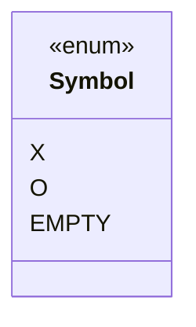

### Responsibility

| Object | Responsibility |
|---|---|
| Symbol | Represents what is inside a cell |

---

## 5.2 GameStatus

### Why GameStatus?

Game can be running, won, or draw.

```text
IN_PROGRESS
WON
DRAW
```

### Mermaid Class Diagram

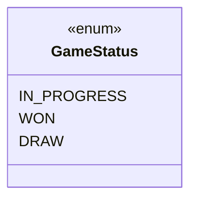

### Responsibility

| Object | Responsibility |
|---|---|
| GameStatus | Represents current game state |

---

## 5.3 Cell

### Why Cell?

Board is made of cells. Each cell has:

```text
row
col
symbol
```

### Relationship

```text
Cell HAS-A Symbol
```

### Mermaid Class Diagram

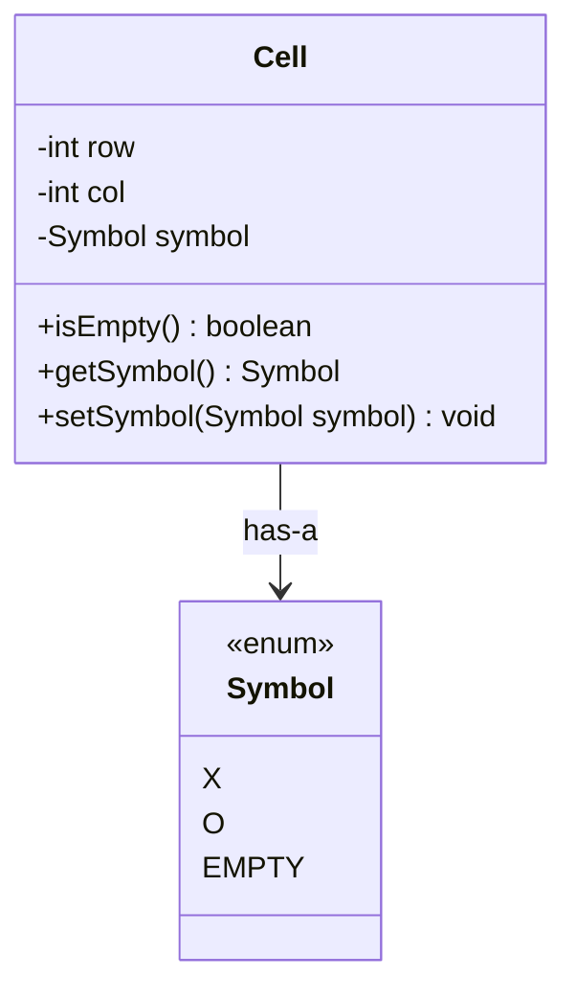

### Responsibility

| Object | Responsibility |
|---|---|
| Cell | Stores position and symbol |

---

## 5.4 Board

### Why Board?

Board contains many cells.

```text
3 x 3 board = 9 cells
```

### Relationship

```text
Board HAS-MANY Cells
```

### Mermaid Class Diagram

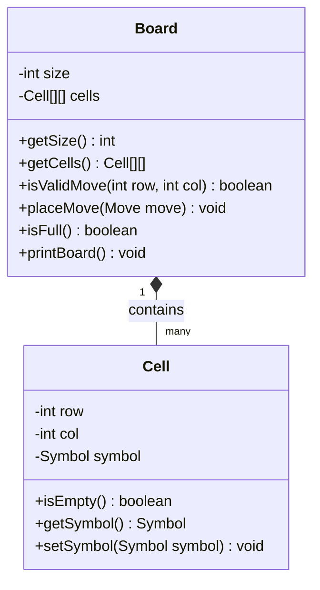

### Responsibility

| Object | Responsibility |
|---|---|
| Board | Manages cells and move placement |

---

## 5.5 Player

### Why Player?

Each player has:

```text
name
symbol
```

### Relationship

```text
Player HAS-A Symbol
```

### Mermaid Class Diagram

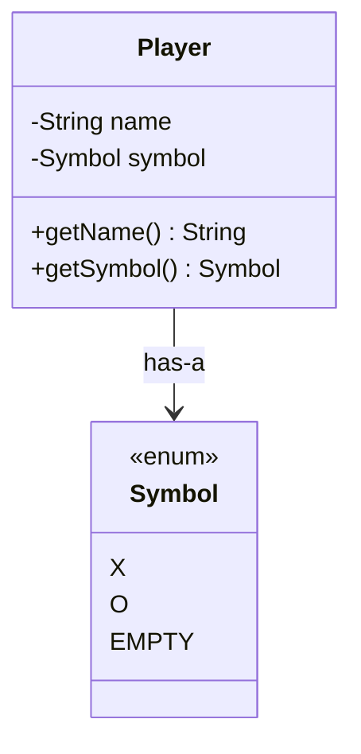

### Responsibility

| Object | Responsibility |
|---|---|
| Player | Stores player name and symbol |

---

## 5.6 Move

### Why Move?

Move represents one action by a player.

```text
Move = Player + row + col
```

### Relationship

```text
Move HAS-A Player
Move points to one board position
```

### Mermaid Class Diagram

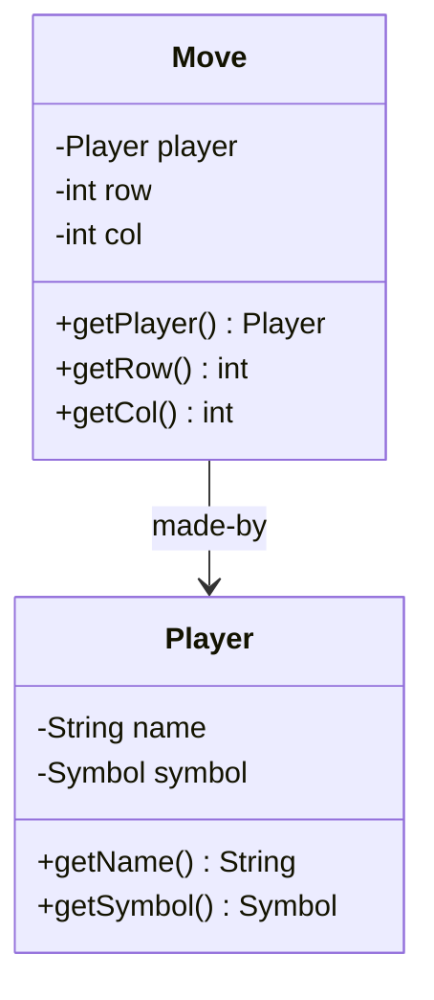

### Responsibility

| Object | Responsibility |
|---|---|
| Move | Stores one player's move |

---

## 5.7 WinningStrategy

### Why WinningStrategy?

Winner checking can change.

Current rule:

```text
Same symbol in row / column / diagonal
```

Future rules:

```text
4x4 board
5x5 board
Connect-K
AI variation
Custom tournament rules
```

### Relationship

```text
SimpleWinningStrategy IMPLEMENTS WinningStrategy
```

### Mermaid Class Diagram

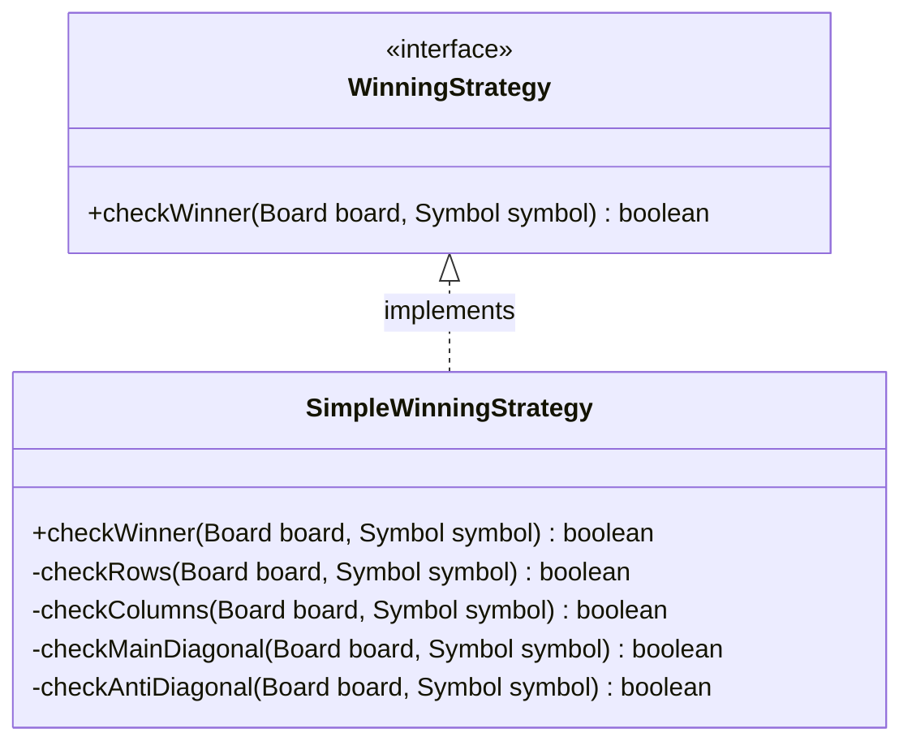

### Responsibility

| Object | Responsibility |
|---|---|
| WinningStrategy | Defines winner checking contract |
| SimpleWinningStrategy | Checks row, column, and diagonals |

---

## 5.8 TicTacToeGame

### Why TicTacToeGame?

Game controls the full flow.

It owns:

```text
Board
Players
Current turn
Game status
Winning strategy
```

### Relationship

```text
TicTacToeGame HAS-A Board
TicTacToeGame HAS-MANY Players
TicTacToeGame HAS-A GameStatus
TicTacToeGame USES WinningStrategy
```

### Mermaid Class Diagram

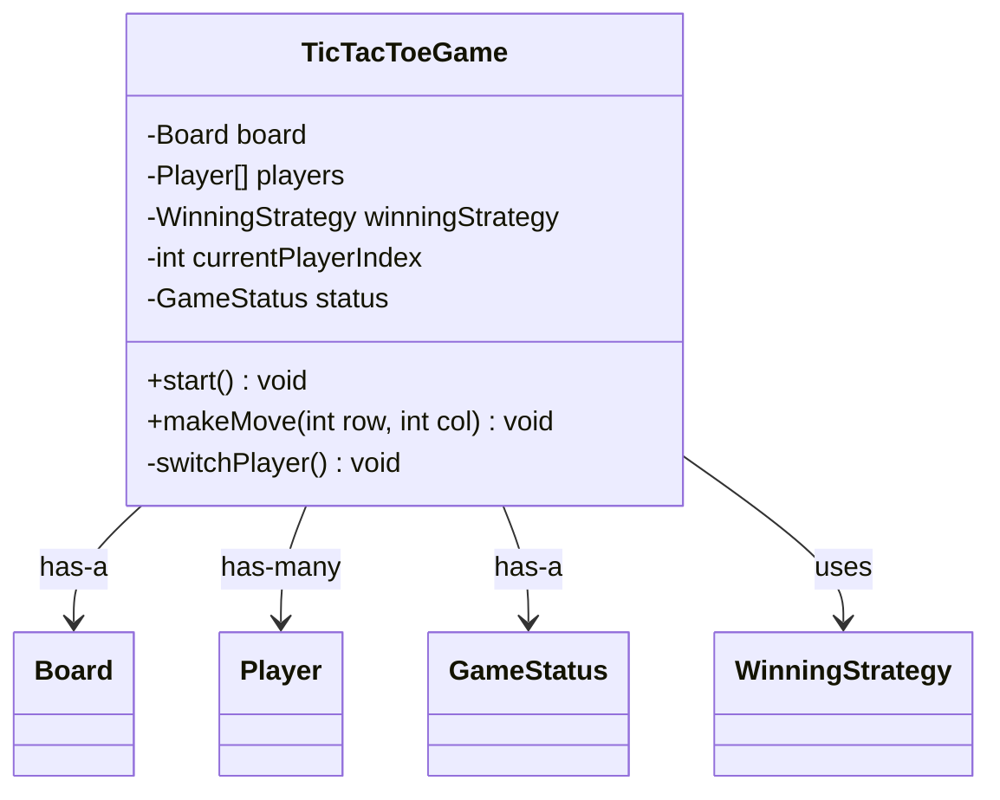

### Responsibility

| Object | Responsibility |
|---|---|
| TicTacToeGame | Controls game loop, turns, status, and orchestration |

---

# 6. Relationship Build Step-by-Step

## Step 1

```text
Symbol
```


---

## Step 2

```text
Cell uses Symbol
```

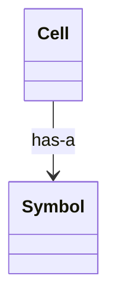

---

## Step 3

```text
Board contains Cells
```

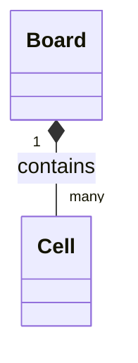

---

## Step 4

```text
Player owns Symbol
```

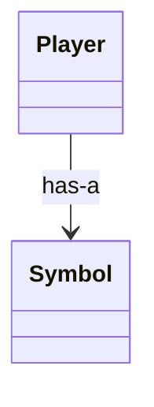

---

## Step 5

```text
Move contains Player + position
```

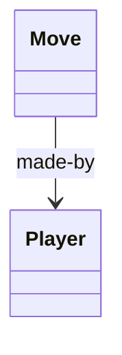

---

## Step 6

```text
Board accepts Move
```

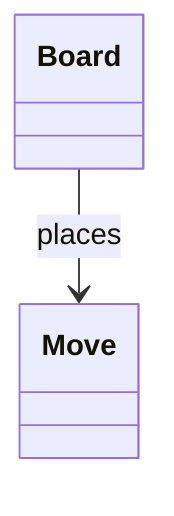

---

## Step 7

```text
TicTacToeGame controls Board, Players, Status, and Strategy
```

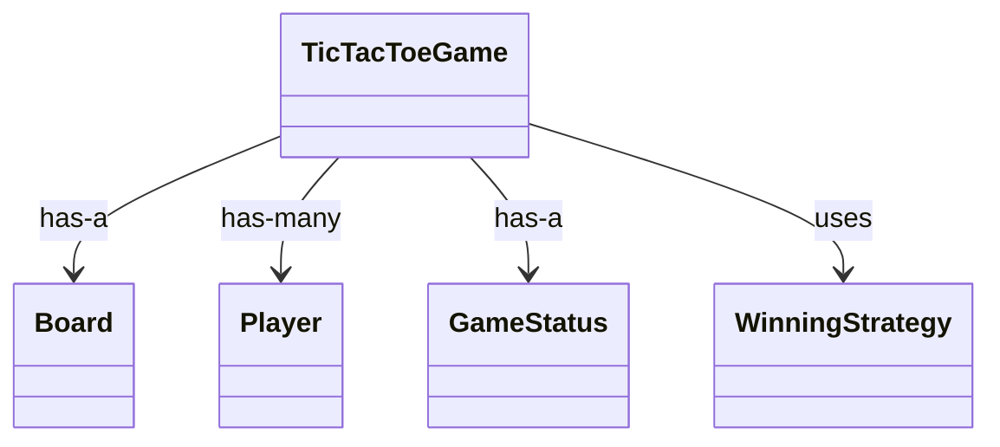

---

## Complete Bottom-Up Chain

```text
Symbol
  ↓
Cell has Symbol
  ↓
Board contains Cells
  ↓
Player has Symbol
  ↓
Move has Player + row + col
  ↓
Board places Move
  ↓
WinningStrategy checks Board
  ↓
TicTacToeGame controls everything
```

---

# 7. Final Class Diagram

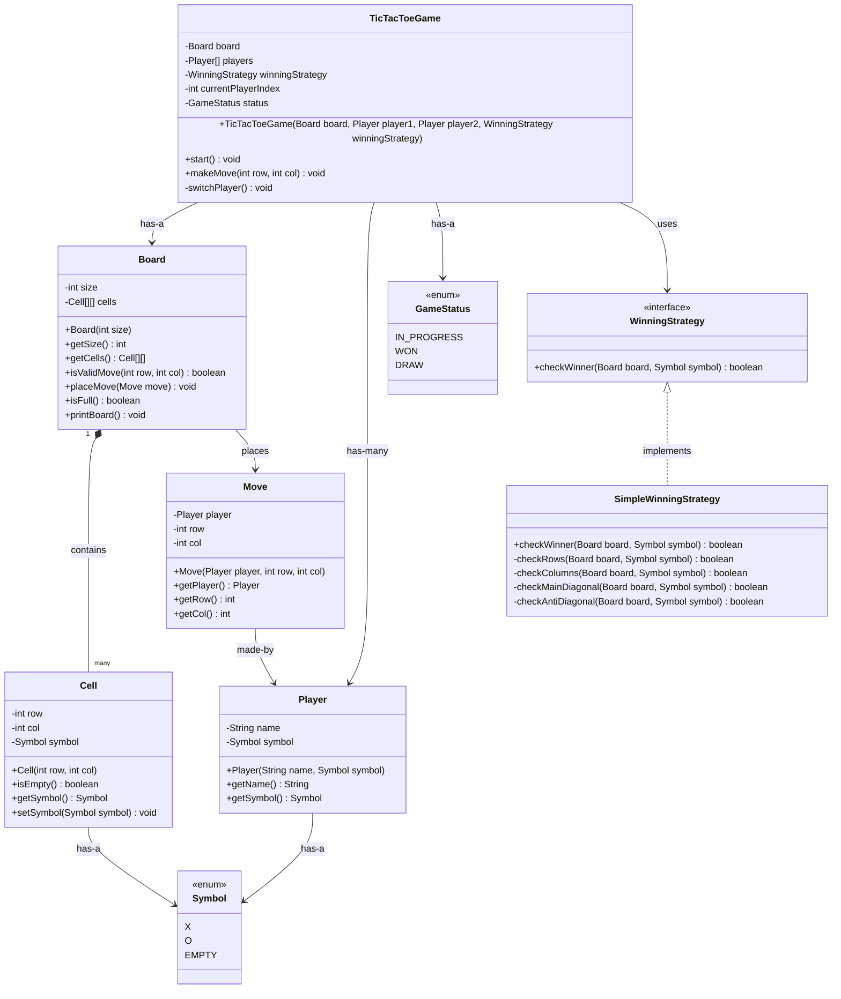

---

# 8. Design Patterns

## 8.1 Strategy Pattern

### Used For

```text
Winner checking logic
```

### Classes

```text
WinningStrategy
SimpleWinningStrategy
```

### Diagram

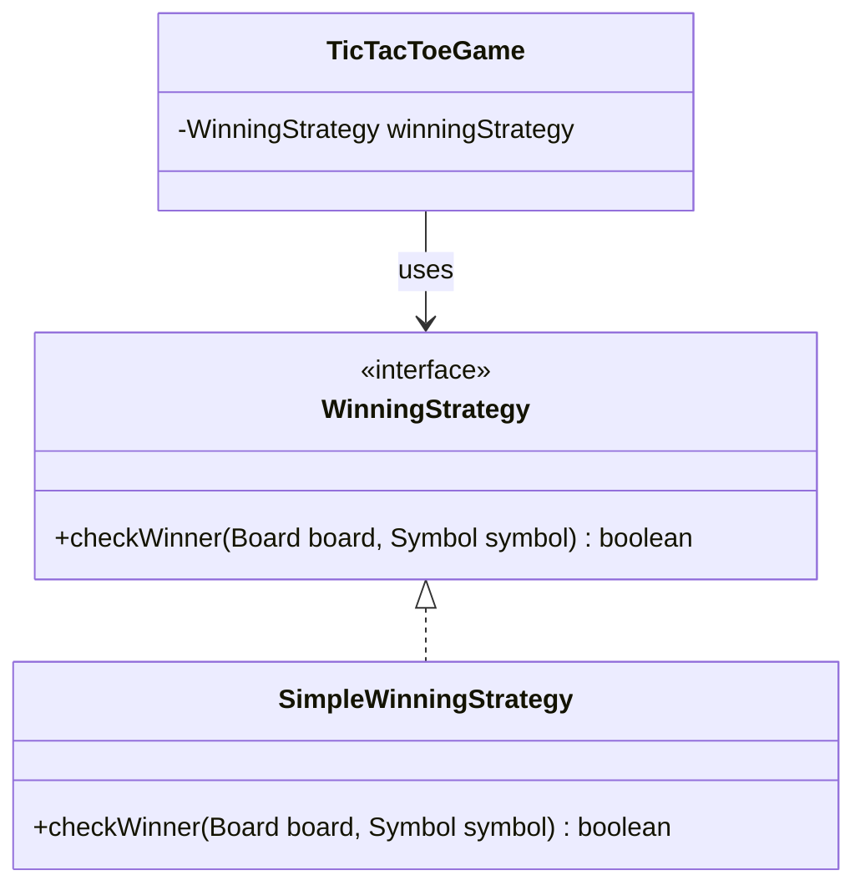

### Why?

Without Strategy Pattern:

```text
TicTacToeGame directly checks row, column, diagonal
```

Problem:

```text
Game class becomes fat
Hard to add new rules
Violates Open/Closed Principle
```

With Strategy Pattern:

```text
Game asks strategy:
"Is this player winner?"
```

Benefit:

```text
Add new winner strategy without changing TicTacToeGame
```

---

## 8.2 Encapsulation

Each class hides its data.

```text
Cell hides symbol
Board hides cells
Player hides player data
Game hides turn logic
```

---

## 8.3 Single Responsibility Principle

| Class | Single Responsibility |
|---|---|
| Symbol | Represents mark |
| GameStatus | Represents game state |
| Cell | Stores cell state |
| Board | Manages cells |
| Player | Stores player info |
| Move | Represents one action |
| WinningStrategy | Winner rule contract |
| SimpleWinningStrategy | Simple winner checking |
| TicTacToeGame | Orchestrates game flow |

---

# 9. Horizontal Activity Diagram

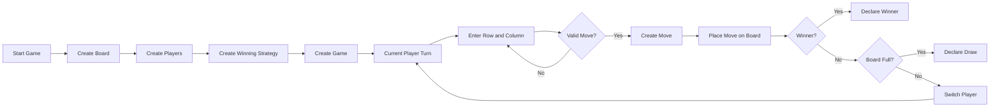

---

# 10. Sequence Diagram

## One Valid Move Flow

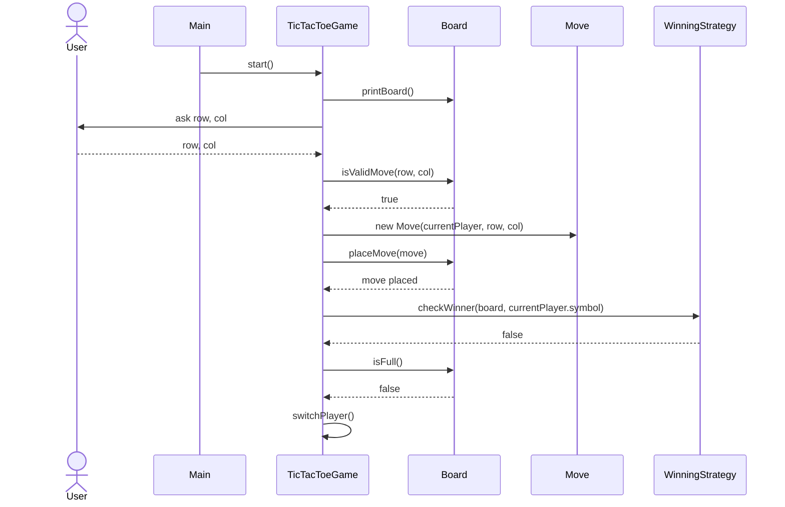

## Invalid Move Flow

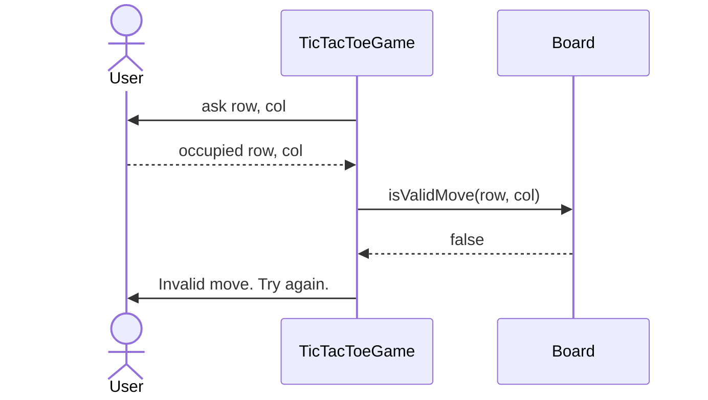

## Winner Flow

```mermaid
sequenceDiagram
    actor User
    participant Game as TicTacToeGame
    participant Board
    participant Move
    participant Strategy as WinningStrategy

    User-->>Game: row, col
    Game->>Board: isValidMove(row, col)
    Board-->>Game: true
    Game->>Move: new Move(currentPlayer, row, col)
    Game->>Board: placeMove(move)
    Game->>Strategy: checkWinner(board, symbol)
    Strategy-->>Game: true
    Game->>Game: status = WON
    Game->>User: declare winner
```

---

# 11. Java Code Bottom-Up

## 11.1 Symbol

```java
enum Symbol {
    X, O, EMPTY
}
```

---

## 11.2 GameStatus

```java
enum GameStatus {
    IN_PROGRESS,
    WON,
    DRAW
}
```

---

## 11.3 Cell

```java
class Cell {
    private final int row;
    private final int col;
    private Symbol symbol;

    public Cell(int row, int col) {
        this.row = row;
        this.col = col;
        this.symbol = Symbol.EMPTY;
    }

    public boolean isEmpty() {
        return symbol == Symbol.EMPTY;
    }

    public Symbol getSymbol() {
        return symbol;
    }

    public void setSymbol(Symbol symbol) {
        this.symbol = symbol;
    }
}
```

---

## 11.4 Player

```java
class Player {
    private final String name;
    private final Symbol symbol;

    public Player(String name, Symbol symbol) {
        this.name = name;
        this.symbol = symbol;
    }

    public String getName() {
        return name;
    }

    public Symbol getSymbol() {
        return symbol;
    }
}
```

---

## 11.5 Move

```java
class Move {
    private final Player player;
    private final int row;
    private final int col;

    public Move(Player player, int row, int col) {
        this.player = player;
        this.row = row;
        this.col = col;
    }

    public Player getPlayer() {
        return player;
    }

    public int getRow() {
        return row;
    }

    public int getCol() {
        return col;
    }
}
```

---

## 11.6 Board

```java
class Board {
    private final int size;
    private final Cell[][] cells;

    public Board(int size) {
        this.size = size;
        this.cells = new Cell[size][size];

        for (int row = 0; row < size; row++) {
            for (int col = 0; col < size; col++) {
                cells[row][col] = new Cell(row, col);
            }
        }
    }

    public int getSize() {
        return size;
    }

    public Cell[][] getCells() {
        return cells;
    }

    public boolean isValidMove(int row, int col) {
        return row >= 0 &&
               row < size &&
               col >= 0 &&
               col < size &&
               cells[row][col].isEmpty();
    }

    public void placeMove(Move move) {
        int row = move.getRow();
        int col = move.getCol();
        Symbol symbol = move.getPlayer().getSymbol();

        cells[row][col].setSymbol(symbol);
    }

    public boolean isFull() {
        for (int row = 0; row < size; row++) {
            for (int col = 0; col < size; col++) {
                if (cells[row][col].isEmpty()) {
                    return false;
                }
            }
        }

        return true;
    }

    public void printBoard() {
        System.out.println();

        for (int row = 0; row < size; row++) {
            for (int col = 0; col < size; col++) {
                Symbol symbol = cells[row][col].getSymbol();

                if (symbol == Symbol.EMPTY) {
                    System.out.print("- ");
                } else {
                    System.out.print(symbol + " ");
                }
            }
            System.out.println();
        }

        System.out.println();
    }
}
```

---

## 11.7 WinningStrategy

```java
interface WinningStrategy {
    boolean checkWinner(Board board, Symbol symbol);
}
```

---

## 11.8 SimpleWinningStrategy

```java
class SimpleWinningStrategy implements WinningStrategy {

    @Override
    public boolean checkWinner(Board board, Symbol symbol) {
        return checkRows(board, symbol)
            || checkColumns(board, symbol)
            || checkMainDiagonal(board, symbol)
            || checkAntiDiagonal(board, symbol);
    }

    private boolean checkRows(Board board, Symbol symbol) {
        int size = board.getSize();
        Cell[][] cells = board.getCells();

        for (int row = 0; row < size; row++) {
            boolean rowMatch = true;

            for (int col = 0; col < size; col++) {
                if (cells[row][col].getSymbol() != symbol) {
                    rowMatch = false;
                    break;
                }
            }

            if (rowMatch) {
                return true;
            }
        }

        return false;
    }

    private boolean checkColumns(Board board, Symbol symbol) {
        int size = board.getSize();
        Cell[][] cells = board.getCells();

        for (int col = 0; col < size; col++) {
            boolean colMatch = true;

            for (int row = 0; row < size; row++) {
                if (cells[row][col].getSymbol() != symbol) {
                    colMatch = false;
                    break;
                }
            }

            if (colMatch) {
                return true;
            }
        }

        return false;
    }

    private boolean checkMainDiagonal(Board board, Symbol symbol) {
        int size = board.getSize();
        Cell[][] cells = board.getCells();

        for (int i = 0; i < size; i++) {
            if (cells[i][i].getSymbol() != symbol) {
                return false;
            }
        }

        return true;
    }

    private boolean checkAntiDiagonal(Board board, Symbol symbol) {
        int size = board.getSize();
        Cell[][] cells = board.getCells();

        for (int i = 0; i < size; i++) {
            if (cells[i][size - 1 - i].getSymbol() != symbol) {
                return false;
            }
        }

        return true;
    }
}
```

---

## 11.9 TicTacToeGame

```java
import java.util.Scanner;

class TicTacToeGame {
    private final Board board;
    private final Player[] players;
    private final WinningStrategy winningStrategy;

    private int currentPlayerIndex;
    private GameStatus status;

    public TicTacToeGame(
            Board board,
            Player player1,
            Player player2,
            WinningStrategy winningStrategy
    ) {
        this.board = board;
        this.players = new Player[]{player1, player2};
        this.winningStrategy = winningStrategy;
        this.currentPlayerIndex = 0;
        this.status = GameStatus.IN_PROGRESS;
    }

    public void start() {
        Scanner scanner = new Scanner(System.in);

        while (status == GameStatus.IN_PROGRESS) {
            board.printBoard();

            Player currentPlayer = players[currentPlayerIndex];

            System.out.println(currentPlayer.getName() + "'s turn: " + currentPlayer.getSymbol());
            System.out.print("Enter row and col: ");

            int row = scanner.nextInt();
            int col = scanner.nextInt();

            makeMove(row, col);
        }

        board.printBoard();
    }

    public void makeMove(int row, int col) {
        Player currentPlayer = players[currentPlayerIndex];

        if (!board.isValidMove(row, col)) {
            System.out.println("Invalid move. Try again.");
            return;
        }

        Move move = new Move(currentPlayer, row, col);
        board.placeMove(move);

        if (winningStrategy.checkWinner(board, currentPlayer.getSymbol())) {
            status = GameStatus.WON;
            System.out.println(currentPlayer.getName() + " won!");
            return;
        }

        if (board.isFull()) {
            status = GameStatus.DRAW;
            System.out.println("Game draw!");
            return;
        }

        switchPlayer();
    }

    private void switchPlayer() {
        currentPlayerIndex = 1 - currentPlayerIndex;
    }
}
```

---

## 11.10 Main

```java
public class Main {
    public static void main(String[] args) {
        Board board = new Board(3);

        Player player1 = new Player("Player 1", Symbol.X);
        Player player2 = new Player("Player 2", Symbol.O);

        WinningStrategy winningStrategy = new SimpleWinningStrategy();

        TicTacToeGame game = new TicTacToeGame(
                board,
                player1,
                player2,
                winningStrategy
        );

        game.start();
    }
}
```

---

# 12. Interview Explanation

Use this explanation:

```text
I designed Tic Tac Toe bottom-up.

First, I created Symbol because every cell and player needs a symbol.

Then I created Cell, which contains row, column, and symbol.

Then I created Board, which contains many cells and handles move validation and placement.

Then I created Player, which owns a symbol.

Then I created Move, which represents one player's action.

Then I extracted winner checking into WinningStrategy so the game can support different winning rules later.

Finally, TicTacToeGame controls the complete flow: current player, move, validation, winner check, draw check, and switching turns.
```

---

# 13. Extension Ideas

## Add Bot Player

Add:

```text
BotPlayer extends Player
MoveStrategy interface
RandomMoveStrategy
SmartMoveStrategy
```

## Add Undo

Add:

```text
Stack<Move> moveHistory
undoMove()
```

## Add Leaderboard

Add:

```text
GameResult
ScoreBoard
PlayerStats
```

## Add Custom Board Size

Already partially supported:

```java
new Board(4);
new Board(5);
```

But winner strategy may need modification for connect-k style games.

## Add Connect-K Rule

Add new strategy:

```java
class ConnectKWinningStrategy implements WinningStrategy
```

Then inject it:

```java
WinningStrategy strategy = new ConnectKWinningStrategy(4);
```
