# 002 — Chess Game LLD

# Clickable Index

- [1. Problem](#1-problem)
- [2. Requirements](#2-requirements)
- [3. Visual Game Flow](#3-visual-game-flow)
- [4. Object Discovery From Requirements](#4-object-discovery-from-requirements)
- [5. Bottom-Up Object Design](#5-bottom-up-object-design)
  - [5.1 Color](#51-color)
  - [5.2 GameStatus](#52-gamestatus)
  - [5.3 PieceType](#53-piecetype)
  - [5.4 Position](#54-position)
  - [5.5 Move](#55-move)
  - [5.6 Piece](#56-piece)
  - [5.7 Concrete Pieces](#57-concrete-pieces)
  - [5.8 Cell](#58-cell)
  - [5.9 Board](#59-board)
  - [5.10 Player](#510-player)
  - [5.11 MoveValidator](#511-movevalidator)
  - [5.12 ChessGame](#512-chessgame)
- [6. Relationship Build Step-by-Step](#6-relationship-build-step-by-step)
- [7. Final Class Diagram](#7-final-class-diagram)
- [8. Design Patterns](#8-design-patterns)
- [9. Horizontal Activity Diagram](#9-horizontal-activity-diagram)
- [10. Sequence Diagram](#10-sequence-diagram)
- [11. Java Code Bottom-Up](#11-java-code-bottom-up)
- [12. Interview Explanation](#12-interview-explanation)
- [13. Extension Ideas](#13-extension-ideas)

---

# 1. Problem

Design a **Chess Game** using Low Level Design.

The design should support:

- 2 players
- 8x8 chess board
- Chess pieces
- Piece movement validation
- Turn-based play
- Capturing opponent pieces
- Checkmate / stalemate extension points
- Extensible movement rules

---

# 2. Requirements

## Functional Requirements

1. Chess board has 8 rows and 8 columns.
2. Game has two players:
   - White player
   - Black player
3. Each player has pieces.
4. Each piece has:
   - color
   - type
   - movement rule
5. Players take turns.
6. White starts first.
7. A move has source and destination.
8. Move is valid only if:
   - source contains current player's piece
   - destination is inside board
   - destination does not contain same-color piece
   - piece movement rule allows the move
   - path is clear for sliding pieces
9. If destination has opponent piece, it is captured.
10. Game can end by:
   - checkmate
   - stalemate
   - resignation
   - draw

## Non-Functional Requirements

1. Code should be readable.
2. Design should be extensible.
3. Each piece movement should be isolated.
4. Board logic should be separate from game flow.
5. Validation should be separated from player input.

---

# 3. Visual Game Flow

```text
Start Game
   |
Create Board
   |
Place Pieces
   |
Create Players
   |
White Turn
   |
Player Chooses Move
   |
Validate Move
   |
If Invalid -> Ask Again
   |
If Valid -> Move Piece
   |
Capture If Needed
   |
Check Game End
   |
Switch Turn
   |
Repeat
```

---

# 4. Object Discovery From Requirements

## Nouns from requirements

```text
Game
Board
Cell
Player
Piece
Move
Position
Color
PieceType
MoveValidator
GameStatus
```

## Convert nouns to classes

| Noun | LLD Object |
|---|---|
| Game | ChessGame |
| Board | Board |
| Cell/Square | Cell |
| Player | Player |
| Piece | Piece abstract class |
| King / Queen / Rook / Bishop / Knight / Pawn | Concrete Piece classes |
| Move | Move |
| Position | Position |
| Color | Color enum |
| PieceType | PieceType enum |
| Validator | MoveValidator |
| Status | GameStatus enum |

---

# 5. Bottom-Up Object Design

---

## 5.1 Color

### Why Color?

Each player and each piece has a color.

```text
WHITE
BLACK
```

### Mermaid Class Diagram

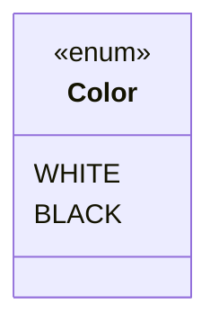

### Responsibility

| Object | Responsibility |
|---|---|
| Color | Represents piece/player side |

---

## 5.2 GameStatus

### Why GameStatus?

Game needs to track current state.

```text
IN_PROGRESS
WHITE_WON
BLACK_WON
DRAW
STALEMATE
RESIGNED
```

### Mermaid Class Diagram

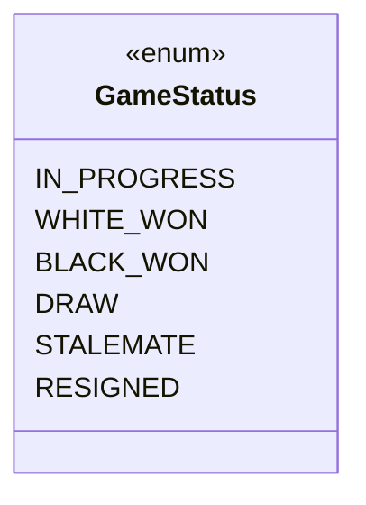

### Responsibility

| Object | Responsibility |
|---|---|
| GameStatus | Represents game state |

---

## 5.3 PieceType

### Why PieceType?

Every piece has a type.

```text
KING
QUEEN
ROOK
BISHOP
KNIGHT
PAWN
```

### Mermaid Class Diagram

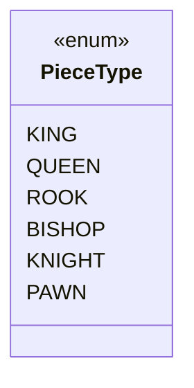

### Responsibility

| Object | Responsibility |
|---|---|
| PieceType | Identifies piece kind |

---

## 5.4 Position

### Why Position?

Board location should be represented as value object.

```text
row
col
```

### Mermaid Class Diagram

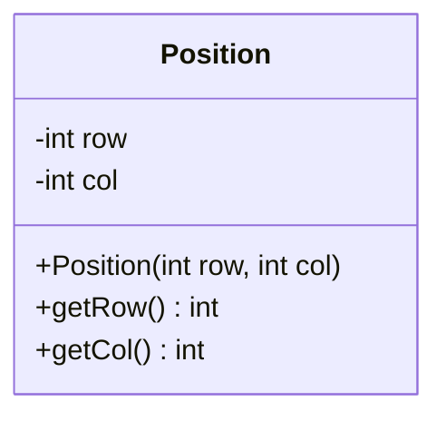

### Responsibility

| Object | Responsibility |
|---|---|
| Position | Stores board coordinate |

---

## 5.5 Move

### Why Move?

Move represents one action.

```text
Move = from position + to position + player
```

### Relationship

```text
Move HAS-A Position from
Move HAS-A Position to
```

### Mermaid Class Diagram

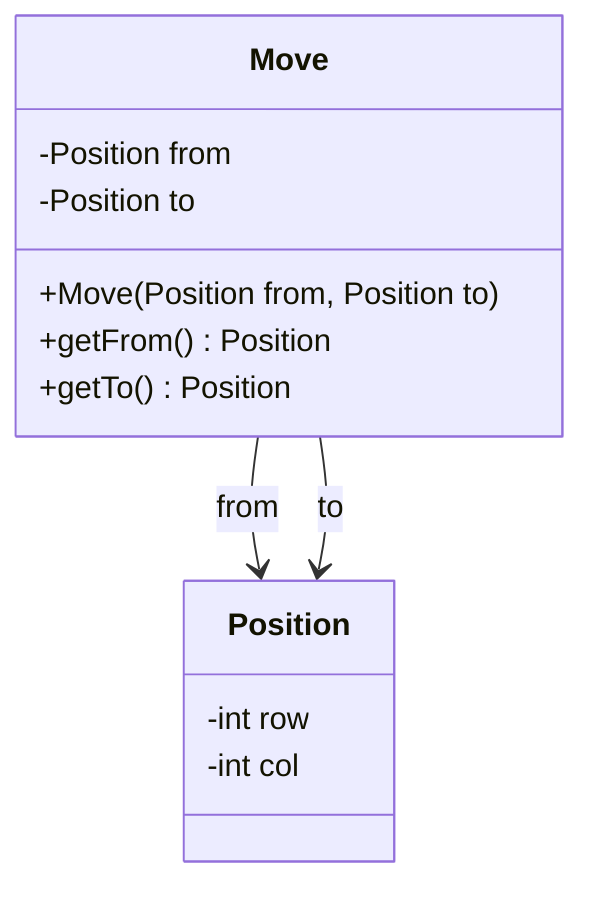

### Responsibility

| Object | Responsibility |
|---|---|
| Move | Stores source and destination |

---

## 5.6 Piece

### Why Piece?

Every chess piece shares common fields.

```text
color
pieceType
killed
```

### Relationship

```text
Piece HAS-A Color
Piece HAS-A PieceType
```

### Mermaid Class Diagram

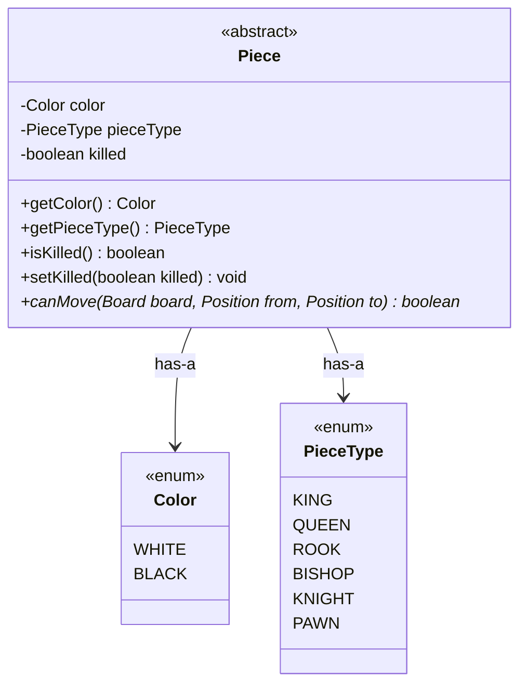

### Responsibility

| Object | Responsibility |
|---|---|
| Piece | Common base for all pieces |

---

## 5.7 Concrete Pieces

### Why Concrete Pieces?

Each piece has different movement.

```text
King   -> one step any direction
Queen  -> row/col/diagonal
Rook   -> row/col
Bishop -> diagonal
Knight -> L shape
Pawn   -> forward movement
```

### Relationship

```text
King EXTENDS Piece
Queen EXTENDS Piece
Rook EXTENDS Piece
Bishop EXTENDS Piece
Knight EXTENDS Piece
Pawn EXTENDS Piece
```

### Mermaid Class Diagram

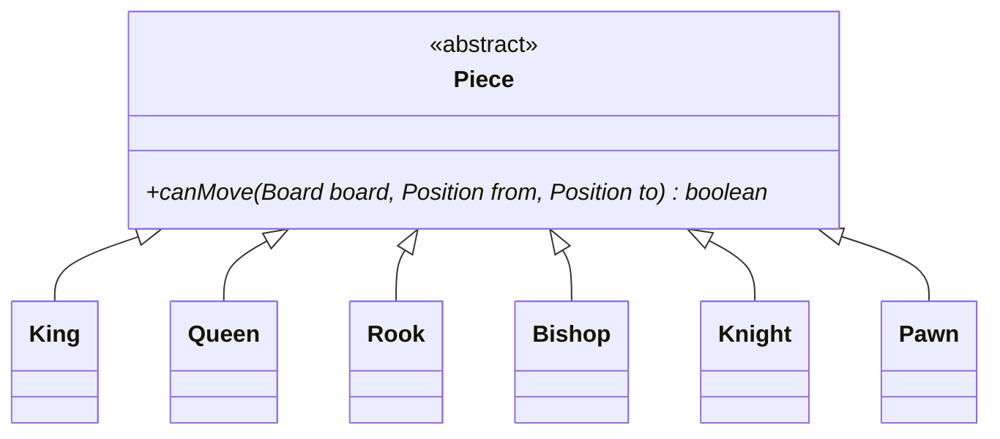

### Responsibility

| Object | Responsibility |
|---|---|
| King | King movement |
| Queen | Queen movement |
| Rook | Rook movement |
| Bishop | Bishop movement |
| Knight | Knight movement |
| Pawn | Pawn movement |

---

## 5.8 Cell

### Why Cell?

Board is made of cells.  
Each cell may have a piece.

### Relationship

```text
Cell HAS-A Position
Cell MAY-HAVE Piece
```

### Mermaid Class Diagram

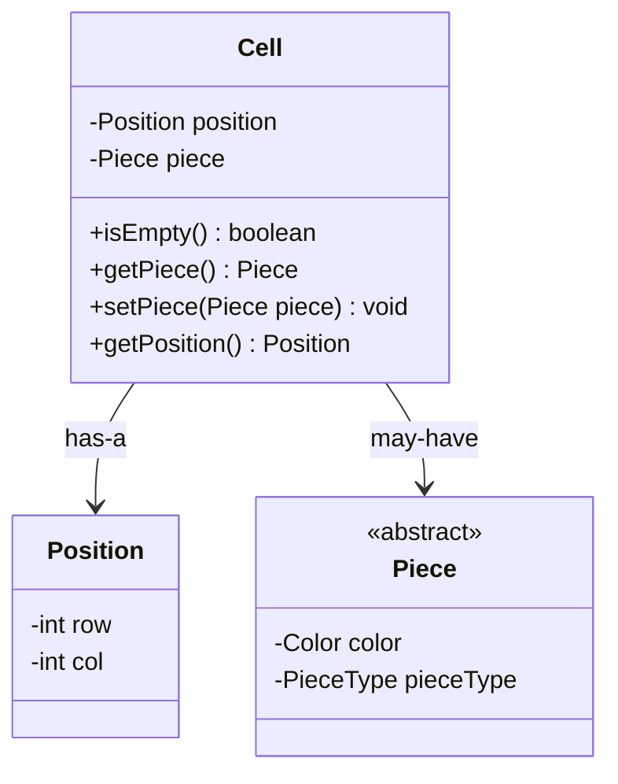

### Responsibility

| Object | Responsibility |
|---|---|
| Cell | Stores board square state |

---

## 5.9 Board

### Why Board?

Board contains cells and manages piece placement.

### Relationship

```text
Board HAS-MANY Cells
Board can return Cell by Position
```

### Mermaid Class Diagram

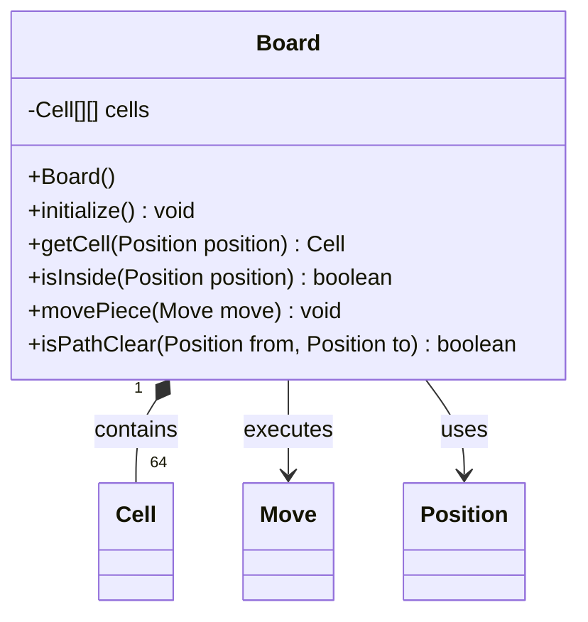

### Responsibility

| Object | Responsibility |
|---|---|
| Board | Manages cells, piece placement, path checking |

---

## 5.10 Player

### Why Player?

Player has name and color.

### Relationship

```text
Player HAS-A Color
```

### Mermaid Class Diagram

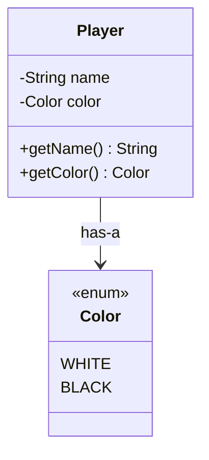

### Responsibility

| Object | Responsibility |
|---|---|
| Player | Stores player identity and side |

---

## 5.11 MoveValidator

### Why MoveValidator?

Move validation should not stay inside `ChessGame`.

### Relationship

```text
MoveValidator USES Board
MoveValidator USES Move
MoveValidator USES Player
```

### Mermaid Class Diagram

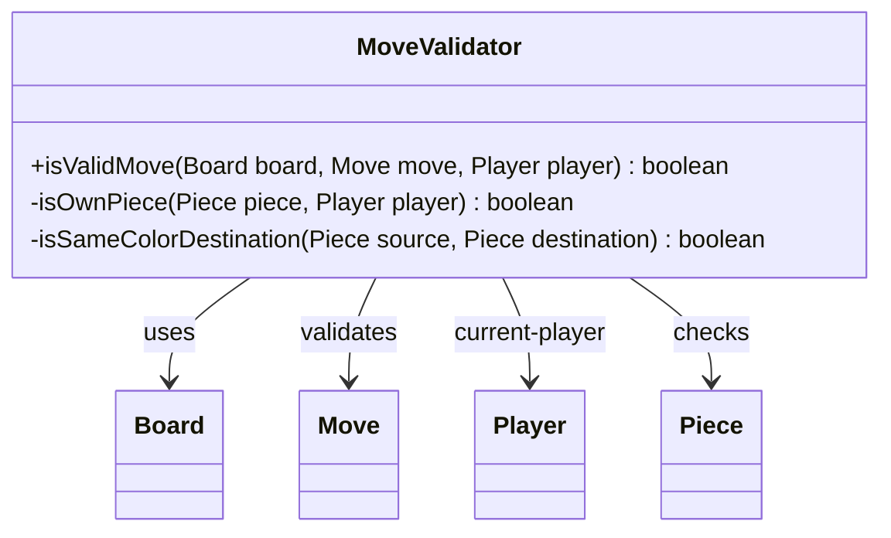

### Responsibility

| Object | Responsibility |
|---|---|
| MoveValidator | Validates move legality |

---

## 5.12 ChessGame

### Why ChessGame?

ChessGame controls full game flow.

It owns:

```text
Board
Players
Current player
Game status
Move validator
```

### Mermaid Class Diagram

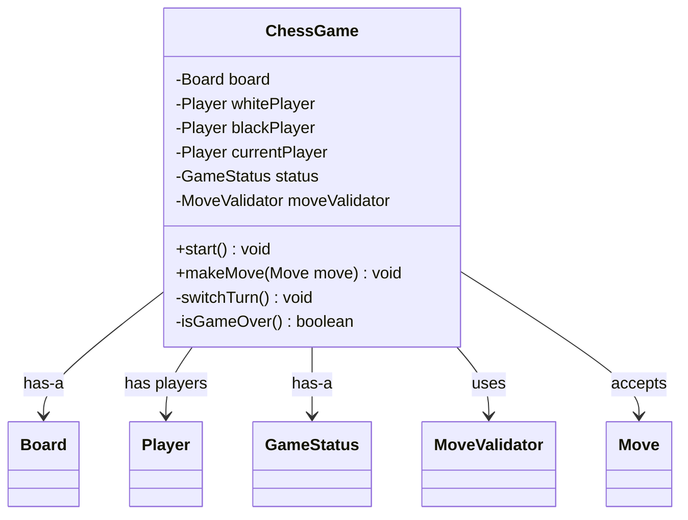

### Responsibility

| Object | Responsibility |
|---|---|
| ChessGame | Orchestrates game flow |

---

# 6. Relationship Build Step-by-Step

## Step 1

```text
Color
```


---

## Step 2

```text
PieceType
```


---

## Step 3

```text
Piece has Color and PieceType
```

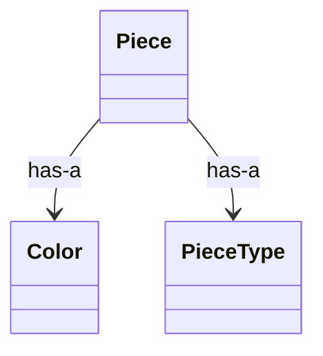

---

## Step 4

```text
Concrete pieces extend Piece
```

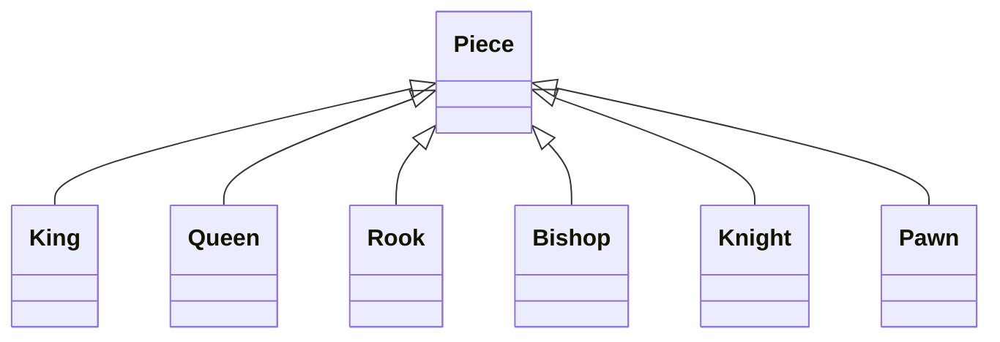

---

## Step 5

```text
Position represents row and col
```

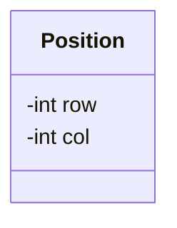

---

## Step 6

```text
Cell has Position and may have Piece
```

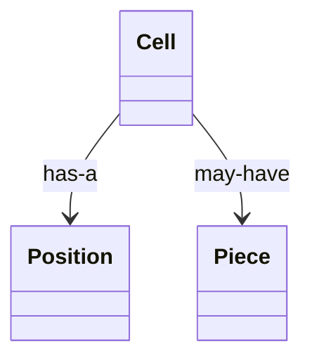

---

## Step 7

```text
Board contains Cells
```

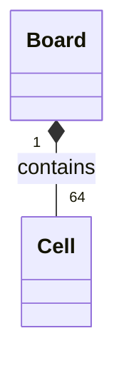

---

## Step 8

```text
Move has from and to Positions
```

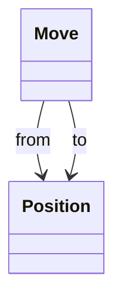

---

## Step 9

```text
Player has Color
```

```mermaid
classDiagram
    class Player
    class Color

    Player --> Color : has-a
```

---

## Step 10

```text
MoveValidator validates Board + Move + Player
```

```mermaid
classDiagram
    class MoveValidator
    class Board
    class Move
    class Player

    MoveValidator --> Board : uses
    MoveValidator --> Move : validates
    MoveValidator --> Player : current-player
```

---

## Step 11

```text
ChessGame controls everything
```

```mermaid
classDiagram
    class ChessGame
    class Board
    class Player
    class MoveValidator
    class GameStatus

    ChessGame --> Board : has-a
    ChessGame --> Player : has players
    ChessGame --> MoveValidator : uses
    ChessGame --> GameStatus : has status
```

---

## Complete Bottom-Up Chain

```text
Color + PieceType
  ↓
Piece
  ↓
King / Queen / Rook / Bishop / Knight / Pawn
  ↓
Cell has Piece
  ↓
Board contains Cells
  ↓
Move uses Positions
  ↓
Player has Color
  ↓
MoveValidator validates Move on Board
  ↓
ChessGame controls players, board, turns, status
```

---

# 7. Final Class Diagram

```mermaid
classDiagram
    class Color {
        <<enum>>
        WHITE
        BLACK
    }

    class GameStatus {
        <<enum>>
        IN_PROGRESS
        WHITE_WON
        BLACK_WON
        DRAW
        STALEMATE
        RESIGNED
    }

    class PieceType {
        <<enum>>
        KING
        QUEEN
        ROOK
        BISHOP
        KNIGHT
        PAWN
    }

    class Position {
        -int row
        -int col
        +Position(int row, int col)
        +getRow() int
        +getCol() int
    }

    class Move {
        -Position from
        -Position to
        +Move(Position from, Position to)
        +getFrom() Position
        +getTo() Position
    }

    class Piece {
        <<abstract>>
        -Color color
        -PieceType pieceType
        -boolean killed
        +Piece(Color color, PieceType pieceType)
        +getColor() Color
        +getPieceType() PieceType
        +isKilled() boolean
        +setKilled(boolean killed) void
        +canMove(Board board, Position from, Position to) boolean*
    }

    class King {
        +King(Color color)
        +canMove(Board board, Position from, Position to) boolean
    }

    class Queen {
        +Queen(Color color)
        +canMove(Board board, Position from, Position to) boolean
    }

    class Rook {
        +Rook(Color color)
        +canMove(Board board, Position from, Position to) boolean
    }

    class Bishop {
        +Bishop(Color color)
        +canMove(Board board, Position from, Position to) boolean
    }

    class Knight {
        +Knight(Color color)
        +canMove(Board board, Position from, Position to) boolean
    }

    class Pawn {
        +Pawn(Color color)
        +canMove(Board board, Position from, Position to) boolean
    }

    class Cell {
        -Position position
        -Piece piece
        +Cell(Position position)
        +isEmpty() boolean
        +getPiece() Piece
        +setPiece(Piece piece) void
        +getPosition() Position
    }

    class Board {
        -Cell[][] cells
        +Board()
        +initialize() void
        +getCell(Position position) Cell
        +isInside(Position position) boolean
        +movePiece(Move move) void
        +isPathClear(Position from, Position to) boolean
        +printBoard() void
    }

    class Player {
        -String name
        -Color color
        +Player(String name, Color color)
        +getName() String
        +getColor() Color
    }

    class MoveValidator {
        +isValidMove(Board board, Move move, Player player) boolean
        -isOwnPiece(Piece piece, Player player) boolean
        -isSameColorDestination(Piece source, Piece destination) boolean
    }

    class ChessGame {
        -Board board
        -Player whitePlayer
        -Player blackPlayer
        -Player currentPlayer
        -GameStatus status
        -MoveValidator moveValidator
        +ChessGame(Player whitePlayer, Player blackPlayer)
        +start() void
        +makeMove(Move move) void
        -switchTurn() void
        -isGameOver() boolean
    }

    Piece --> Color : has-a
    Piece --> PieceType : has-a

    Piece <|-- King
    Piece <|-- Queen
    Piece <|-- Rook
    Piece <|-- Bishop
    Piece <|-- Knight
    Piece <|-- Pawn

    Cell --> Position : has-a
    Cell --> Piece : may-have
    Board "1" *-- "64" Cell : contains
    Board --> Move : executes
    Board --> Position : uses

    Move --> Position : from
    Move --> Position : to

    Player --> Color : has-a

    MoveValidator --> Board : uses
    MoveValidator --> Move : validates
    MoveValidator --> Player : current-player
    MoveValidator --> Piece : checks

    ChessGame --> Board : has-a
    ChessGame --> Player : has players
    ChessGame --> GameStatus : has status
    ChessGame --> MoveValidator : uses
    ChessGame --> Move : accepts
```

---

# 8. Design Patterns

## 8.1 Template Method / Polymorphism

### Used For

```text
Piece movement
```

### Classes

```text
Piece
King
Queen
Rook
Bishop
Knight
Pawn
```

### Diagram

```mermaid
classDiagram
    class Piece {
        <<abstract>>
        +canMove(Board board, Position from, Position to) boolean*
    }

    class King
    class Queen
    class Rook
    class Bishop
    class Knight
    class Pawn

    Piece <|-- King
    Piece <|-- Queen
    Piece <|-- Rook
    Piece <|-- Bishop
    Piece <|-- Knight
    Piece <|-- Pawn
```

### Why?

Without polymorphism:

```text
if piece == KING
if piece == QUEEN
if piece == ROOK
...
```

Problem:

```text
MoveValidator becomes fat
Hard to add new pieces
Violates Open/Closed Principle
```

With polymorphism:

```text
piece.canMove(board, from, to)
```

---

## 8.2 Strategy-Like Validation

### Used For

```text
Move validation
```

### Classes

```text
MoveValidator
Piece.canMove()
```

### Why?

`ChessGame` does not validate every rule itself.

```text
ChessGame -> MoveValidator -> Piece movement rule
```

---

## 8.3 Encapsulation

```text
Board hides cells
Cell hides piece
Piece hides movement rule
Game hides turn flow
```

---

## 8.4 Single Responsibility Principle

| Class | Single Responsibility |
|---|---|
| Color | Represents side |
| GameStatus | Represents game state |
| PieceType | Represents piece kind |
| Position | Represents coordinate |
| Move | Represents source and destination |
| Piece | Common piece abstraction |
| Concrete Piece | Own movement logic |
| Cell | Stores square state |
| Board | Manages cells and piece movement |
| Player | Stores player data |
| MoveValidator | Validates moves |
| ChessGame | Orchestrates game flow |

---

# 9. Horizontal Activity Diagram

```mermaid
flowchart LR
    A[Start Game] --> B[Create Board]
    B --> C[Initialize Pieces]
    C --> D[Create Players]
    D --> E[White Player Turn]
    E --> F[Enter Source and Destination]
    F --> G[Create Move]
    G --> H{Valid Move?}
    H -- No --> F
    H -- Yes --> I[Move Piece]
    I --> J{Captured Piece?}
    J -- Yes --> K[Mark Captured]
    J -- No --> L[Continue]
    K --> M{Game Over?}
    L --> M{Game Over?}
    M -- Yes --> N[Declare Result]
    M -- No --> O[Switch Turn]
    O --> F
```

---

# 10. Sequence Diagram

## One Valid Move

```mermaid
sequenceDiagram
    actor User
    participant Main
    participant Game as ChessGame
    participant Validator as MoveValidator
    participant Board
    participant Cell
    participant Piece

    User->>Main: enter from and to
    Main->>Game: makeMove(move)
    Game->>Validator: isValidMove(board, move, currentPlayer)
    Validator->>Board: isInside(from)
    Board-->>Validator: true
    Validator->>Board: isInside(to)
    Board-->>Validator: true
    Validator->>Board: getCell(from)
    Board-->>Validator: sourceCell
    Validator->>Cell: getPiece()
    Cell-->>Validator: sourcePiece
    Validator->>Board: getCell(to)
    Board-->>Validator: destinationCell
    Validator->>Cell: getPiece()
    Cell-->>Validator: destinationPiece/null
    Validator->>Piece: canMove(board, from, to)
    Piece-->>Validator: true
    Validator-->>Game: true
    Game->>Board: movePiece(move)
    Board->>Cell: setPiece(sourcePiece)
    Board->>Cell: setPiece(null)
    Game->>Game: switchTurn()
```

## Invalid Move

```mermaid
sequenceDiagram
    actor User
    participant Game as ChessGame
    participant Validator as MoveValidator
    participant Board

    User->>Game: makeMove(move)
    Game->>Validator: isValidMove(board, move, currentPlayer)
    Validator->>Board: validate source/destination
    Board-->>Validator: invalid
    Validator-->>Game: false
    Game-->>User: Invalid move
```

---

# 11. Java Code Bottom-Up

## 11.1 Color

```java
enum Color {
    WHITE,
    BLACK
}
```

---

## 11.2 GameStatus

```java
enum GameStatus {
    IN_PROGRESS,
    WHITE_WON,
    BLACK_WON,
    DRAW,
    STALEMATE,
    RESIGNED
}
```

---

## 11.3 PieceType

```java
enum PieceType {
    KING,
    QUEEN,
    ROOK,
    BISHOP,
    KNIGHT,
    PAWN
}
```

---

## 11.4 Position

```java
class Position {
    private final int row;
    private final int col;

    public Position(int row, int col) {
        this.row = row;
        this.col = col;
    }

    public int getRow() {
        return row;
    }

    public int getCol() {
        return col;
    }
}
```

---

## 11.5 Move

```java
class Move {
    private final Position from;
    private final Position to;

    public Move(Position from, Position to) {
        this.from = from;
        this.to = to;
    }

    public Position getFrom() {
        return from;
    }

    public Position getTo() {
        return to;
    }
}
```

---

## 11.6 Piece

```java
abstract class Piece {
    private final Color color;
    private final PieceType pieceType;
    private boolean killed;

    public Piece(Color color, PieceType pieceType) {
        this.color = color;
        this.pieceType = pieceType;
        this.killed = false;
    }

    public Color getColor() {
        return color;
    }

    public PieceType getPieceType() {
        return pieceType;
    }

    public boolean isKilled() {
        return killed;
    }

    public void setKilled(boolean killed) {
        this.killed = killed;
    }

    public abstract boolean canMove(Board board, Position from, Position to);
}
```

---

## 11.7 King

```java
class King extends Piece {

    public King(Color color) {
        super(color, PieceType.KING);
    }

    @Override
    public boolean canMove(Board board, Position from, Position to) {
        int rowDiff = Math.abs(from.getRow() - to.getRow());
        int colDiff = Math.abs(from.getCol() - to.getCol());

        return rowDiff <= 1 && colDiff <= 1;
    }
}
```

---

## 11.8 Queen

```java
class Queen extends Piece {

    public Queen(Color color) {
        super(color, PieceType.QUEEN);
    }

    @Override
    public boolean canMove(Board board, Position from, Position to) {
        int rowDiff = Math.abs(from.getRow() - to.getRow());
        int colDiff = Math.abs(from.getCol() - to.getCol());

        boolean sameRow = from.getRow() == to.getRow();
        boolean sameCol = from.getCol() == to.getCol();
        boolean diagonal = rowDiff == colDiff;

        return (sameRow || sameCol || diagonal) && board.isPathClear(from, to);
    }
}
```

---

## 11.9 Rook

```java
class Rook extends Piece {

    public Rook(Color color) {
        super(color, PieceType.ROOK);
    }

    @Override
    public boolean canMove(Board board, Position from, Position to) {
        boolean sameRow = from.getRow() == to.getRow();
        boolean sameCol = from.getCol() == to.getCol();

        return (sameRow || sameCol) && board.isPathClear(from, to);
    }
}
```

---

## 11.10 Bishop

```java
class Bishop extends Piece {

    public Bishop(Color color) {
        super(color, PieceType.BISHOP);
    }

    @Override
    public boolean canMove(Board board, Position from, Position to) {
        int rowDiff = Math.abs(from.getRow() - to.getRow());
        int colDiff = Math.abs(from.getCol() - to.getCol());

        return rowDiff == colDiff && board.isPathClear(from, to);
    }
}
```

---

## 11.11 Knight

```java
class Knight extends Piece {

    public Knight(Color color) {
        super(color, PieceType.KNIGHT);
    }

    @Override
    public boolean canMove(Board board, Position from, Position to) {
        int rowDiff = Math.abs(from.getRow() - to.getRow());
        int colDiff = Math.abs(from.getCol() - to.getCol());

        return (rowDiff == 2 && colDiff == 1)
            || (rowDiff == 1 && colDiff == 2);
    }
}
```

---

## 11.12 Pawn

```java
class Pawn extends Piece {

    public Pawn(Color color) {
        super(color, PieceType.PAWN);
    }

    @Override
    public boolean canMove(Board board, Position from, Position to) {
        int direction = getColor() == Color.WHITE ? -1 : 1;

        int rowDiff = to.getRow() - from.getRow();
        int colDiff = Math.abs(to.getCol() - from.getCol());

        Cell destinationCell = board.getCell(to);
        boolean destinationEmpty = destinationCell.isEmpty();

        // Normal one-step forward move
        if (colDiff == 0 && rowDiff == direction && destinationEmpty) {
            return true;
        }

        // Capture diagonally
        if (colDiff == 1 && rowDiff == direction && !destinationEmpty) {
            return destinationCell.getPiece().getColor() != getColor();
        }

        return false;
    }
}
```

---

## 11.13 Cell

```java
class Cell {
    private final Position position;
    private Piece piece;

    public Cell(Position position) {
        this.position = position;
    }

    public boolean isEmpty() {
        return piece == null;
    }

    public Piece getPiece() {
        return piece;
    }

    public void setPiece(Piece piece) {
        this.piece = piece;
    }

    public Position getPosition() {
        return position;
    }
}
```

---

## 11.14 Board

```java
class Board {
    private static final int SIZE = 8;

    private final Cell[][] cells;

    public Board() {
        this.cells = new Cell[SIZE][SIZE];

        for (int row = 0; row < SIZE; row++) {
            for (int col = 0; col < SIZE; col++) {
                cells[row][col] = new Cell(new Position(row, col));
            }
        }

        initialize();
    }

    public void initialize() {
        // Black pieces
        cells[0][0].setPiece(new Rook(Color.BLACK));
        cells[0][1].setPiece(new Knight(Color.BLACK));
        cells[0][2].setPiece(new Bishop(Color.BLACK));
        cells[0][3].setPiece(new Queen(Color.BLACK));
        cells[0][4].setPiece(new King(Color.BLACK));
        cells[0][5].setPiece(new Bishop(Color.BLACK));
        cells[0][6].setPiece(new Knight(Color.BLACK));
        cells[0][7].setPiece(new Rook(Color.BLACK));

        for (int col = 0; col < SIZE; col++) {
            cells[1][col].setPiece(new Pawn(Color.BLACK));
        }

        // White pieces
        cells[7][0].setPiece(new Rook(Color.WHITE));
        cells[7][1].setPiece(new Knight(Color.WHITE));
        cells[7][2].setPiece(new Bishop(Color.WHITE));
        cells[7][3].setPiece(new Queen(Color.WHITE));
        cells[7][4].setPiece(new King(Color.WHITE));
        cells[7][5].setPiece(new Bishop(Color.WHITE));
        cells[7][6].setPiece(new Knight(Color.WHITE));
        cells[7][7].setPiece(new Rook(Color.WHITE));

        for (int col = 0; col < SIZE; col++) {
            cells[6][col].setPiece(new Pawn(Color.WHITE));
        }
    }

    public boolean isInside(Position position) {
        int row = position.getRow();
        int col = position.getCol();

        return row >= 0 && row < SIZE && col >= 0 && col < SIZE;
    }

    public Cell getCell(Position position) {
        return cells[position.getRow()][position.getCol()];
    }

    public void movePiece(Move move) {
        Cell sourceCell = getCell(move.getFrom());
        Cell destinationCell = getCell(move.getTo());

        Piece sourcePiece = sourceCell.getPiece();
        Piece destinationPiece = destinationCell.getPiece();

        if (destinationPiece != null) {
            destinationPiece.setKilled(true);
        }

        destinationCell.setPiece(sourcePiece);
        sourceCell.setPiece(null);
    }

    public boolean isPathClear(Position from, Position to) {
        int rowDiff = Integer.compare(to.getRow(), from.getRow());
        int colDiff = Integer.compare(to.getCol(), from.getCol());

        int currentRow = from.getRow() + rowDiff;
        int currentCol = from.getCol() + colDiff;

        while (currentRow != to.getRow() || currentCol != to.getCol()) {
            if (!cells[currentRow][currentCol].isEmpty()) {
                return false;
            }

            currentRow += rowDiff;
            currentCol += colDiff;
        }

        return true;
    }

    public void printBoard() {
        System.out.println();

        for (int row = 0; row < SIZE; row++) {
            for (int col = 0; col < SIZE; col++) {
                Piece piece = cells[row][col].getPiece();

                if (piece == null) {
                    System.out.print("-- ");
                } else {
                    String colorPrefix = piece.getColor() == Color.WHITE ? "W" : "B";
                    String pieceName = piece.getPieceType().name().substring(0, 1);
                    System.out.print(colorPrefix + pieceName + " ");
                }
            }
            System.out.println();
        }

        System.out.println();
    }
}
```

---

## 11.15 Player

```java
class Player {
    private final String name;
    private final Color color;

    public Player(String name, Color color) {
        this.name = name;
        this.color = color;
    }

    public String getName() {
        return name;
    }

    public Color getColor() {
        return color;
    }
}
```

---

## 11.16 MoveValidator

```java
class MoveValidator {

    public boolean isValidMove(Board board, Move move, Player player) {
        Position from = move.getFrom();
        Position to = move.getTo();

        if (!board.isInside(from) || !board.isInside(to)) {
            return false;
        }

        Cell sourceCell = board.getCell(from);
        Cell destinationCell = board.getCell(to);

        if (sourceCell.isEmpty()) {
            return false;
        }

        Piece sourcePiece = sourceCell.getPiece();
        Piece destinationPiece = destinationCell.getPiece();

        if (!isOwnPiece(sourcePiece, player)) {
            return false;
        }

        if (isSameColorDestination(sourcePiece, destinationPiece)) {
            return false;
        }

        return sourcePiece.canMove(board, from, to);
    }

    private boolean isOwnPiece(Piece piece, Player player) {
        return piece.getColor() == player.getColor();
    }

    private boolean isSameColorDestination(Piece sourcePiece, Piece destinationPiece) {
        return destinationPiece != null &&
               sourcePiece.getColor() == destinationPiece.getColor();
    }
}
```

---

## 11.17 ChessGame

```java
import java.util.Scanner;

class ChessGame {
    private final Board board;
    private final Player whitePlayer;
    private final Player blackPlayer;
    private final MoveValidator moveValidator;

    private Player currentPlayer;
    private GameStatus status;

    public ChessGame(Player whitePlayer, Player blackPlayer) {
        this.board = new Board();
        this.whitePlayer = whitePlayer;
        this.blackPlayer = blackPlayer;
        this.currentPlayer = whitePlayer;
        this.status = GameStatus.IN_PROGRESS;
        this.moveValidator = new MoveValidator();
    }

    public void start() {
        Scanner scanner = new Scanner(System.in);

        while (!isGameOver()) {
            board.printBoard();

            System.out.println(currentPlayer.getName() + "'s turn: " + currentPlayer.getColor());
            System.out.print("Enter fromRow fromCol toRow toCol: ");

            int fromRow = scanner.nextInt();
            int fromCol = scanner.nextInt();
            int toRow = scanner.nextInt();
            int toCol = scanner.nextInt();

            Move move = new Move(
                    new Position(fromRow, fromCol),
                    new Position(toRow, toCol)
            );

            makeMove(move);
        }
    }

    public void makeMove(Move move) {
        if (!moveValidator.isValidMove(board, move, currentPlayer)) {
            System.out.println("Invalid move. Try again.");
            return;
        }

        board.movePiece(move);

        // Simplified.
        // Real chess needs check, checkmate, stalemate validation.
        switchTurn();
    }

    private void switchTurn() {
        currentPlayer = currentPlayer == whitePlayer ? blackPlayer : whitePlayer;
    }

    private boolean isGameOver() {
        return status != GameStatus.IN_PROGRESS;
    }
}
```

---

## 11.18 Main

```java
public class Main {
    public static void main(String[] args) {
        Player whitePlayer = new Player("White Player", Color.WHITE);
        Player blackPlayer = new Player("Black Player", Color.BLACK);

        ChessGame game = new ChessGame(whitePlayer, blackPlayer);

        game.start();
    }
}
```

---

# 12. Interview Explanation

Use this explanation:

```text
I designed Chess bottom-up.

First, I created basic enums like Color, GameStatus, and PieceType.

Then I created Position because every board cell and move needs coordinates.

Then I created Move as source and destination.

Then I created Piece as an abstract class because all pieces share color, type, and killed state, but movement differs.

Then each concrete piece implements its own canMove logic.

Then I created Cell, which stores position and optional piece.

Then Board contains 64 cells and provides utility methods like getCell, isInside, movePiece, and isPathClear.

Then Player stores name and color.

MoveValidator validates whether the current player can make a move.

Finally, ChessGame orchestrates board, players, current turn, status, and move execution.
```

---

# 13. Extension Ideas

## Add Check Detection

Add:

```text
KingSafetyService
isKingInCheck(Player player)
```

## Add Checkmate Detection

Add:

```text
CheckmateDetector
hasAnyLegalMove(Player player)
```

## Add Castling

Add fields:

```text
Piece.hasMoved
King.hasMoved
Rook.hasMoved
```

Add validator:

```text
CastlingMoveValidator
```

## Add En Passant

Track:

```text
lastMove
```

Add pawn-specific validation.

## Add Pawn Promotion

Add:

```text
PromotionService
promotePawn(Pawn pawn, PieceType targetType)
```

## Add Move History

Add:

```text
List<Move> moveHistory
```

## Add Undo

Add:

```text
MoveHistory
CapturedPieceInfo
undoMove()
```

## Add Timer

Add:

```text
ChessClock
PlayerTimer
```

## Add Online Multiplayer

Add:

```text
GameSession
User
WebSocketGateway
MoveCommand
```
