# System Design Patterns Visual Reference

> Visual-first reference with diagrams, comparison tables, detailed explanations, and small Java snippets.

This file is designed for fast interview revision. Each pattern follows the same structure: problem, requirements, visual diagram, comparison table, approach explanations, flow, Java reference, and checklist.

## Clickable Index


### Communication & Real-Time
- [Real-Time Updates](#real-time-updates)
- [Fanout System](#fanout-system)

### Read & Write Scaling
- [High Read Traffic](#high-read-traffic)
- [High Write Traffic](#high-write-traffic)

### Traffic & Hotspot Handling
- [Hot Keys](#hot-keys)
- [Traffic Spikes](#traffic-spikes)

### Storage & Media
- [Large File Handling](#large-file-handling)
- [Media Streaming](#media-streaming)

### Geo & Identity
- [Geospatial Search](#geospatial-search)
- [Unique ID Generation](#unique-id-generation)

### Counters & Coordination
- [Distributed Counting](#distributed-counting)
- [Leader Election](#leader-election)
- [Failure Detection and Heartbeats](#failure-detection-and-heartbeats)

### Resilience & Consistency
- [Resilient Systems Failure Handling](#resilient-systems-failure-handling)
- [Distributed Transactions](#distributed-transactions)
- [Single Point of Failure](#single-point-of-failure)

---

## Master Quick Comparison Table

| Pattern | Main Problem | First Approach To Consider | When To Upgrade | Core Trade-off |
|---|---|---|---|---|
| [Real-Time Updates](#real-time-updates) | How should a server deliver updates to clients when data changes after the normal HTTP response has already closed? | SSE for one-way push; WebSocket for bidirectional | When scale/failure mode proves simple design is insufficient | Simplicity vs scale/correctness |
| [Fanout System](#fanout-system) | How should one event, such as a user post, reach many recipients without making writes or reads too slow? | Fanout-on-write for normal users | When scale/failure mode proves simple design is insufficient | Simplicity vs scale/correctness |
| [High Read Traffic](#high-read-traffic) | How do you scale systems where reads are much higher than writes? | Cache first | When scale/failure mode proves simple design is insufficient | Simplicity vs scale/correctness |
| [High Write Traffic](#high-write-traffic) | How do you absorb and persist huge write volumes when writes cannot simply be cached away? | Batch then queue | When scale/failure mode proves simple design is insufficient | Simplicity vs scale/correctness |
| [Hot Keys](#hot-keys) | How do you handle one key receiving far more traffic than the rest of the cluster? | Local cache for read hot keys | When scale/failure mode proves simple design is insufficient | Simplicity vs scale/correctness |
| [Traffic Spikes](#traffic-spikes) | How do you keep a system alive when traffic suddenly jumps far above normal capacity? | Rate limit + queue + autoscale | When scale/failure mode proves simple design is insufficient | Simplicity vs scale/correctness |
| [Large File Handling](#large-file-handling) | How do you upload, download, and store large files without timeouts, memory spikes, or failed full restarts? | Chunked upload + pre-signed URL | When scale/failure mode proves simple design is insufficient | Simplicity vs scale/correctness |
| [Media Streaming](#media-streaming) | How do you deliver video/audio at scale while handling huge bandwidth, strict timing, and unstable networks? | HLS/DASH + CDN | When scale/failure mode proves simple design is insufficient | Simplicity vs scale/correctness |
| [Geospatial Search](#geospatial-search) | How do you find nearby entities like drivers, stores, or restaurants quickly without scanning all locations? | PostGIS or Redis Geo depending update rate | When scale/failure mode proves simple design is insufficient | Simplicity vs scale/correctness |
| [Unique ID Generation](#unique-id-generation) | How do distributed services generate unique IDs without collisions, bottlenecks, or poor database index behavior? | UUID v7/ULID or Snowflake | When scale/failure mode proves simple design is insufficient | Simplicity vs scale/correctness |
| [Distributed Counting](#distributed-counting) | How do you count likes, views, requests, or unique users when one counter can become a hot write bottleneck? | Single counter until hot, then shard | When scale/failure mode proves simple design is insufficient | Simplicity vs scale/correctness |
| [Leader Election](#leader-election) | How does a distributed system choose exactly one coordinator without split-brain? | Raft/lease with fencing | When scale/failure mode proves simple design is insufficient | Simplicity vs scale/correctness |
| [Failure Detection and Heartbeats](#failure-detection-and-heartbeats) | How do nodes decide whether another node is alive, slow, overloaded, or failed? | Fixed timeout first, phi/gossip later | When scale/failure mode proves simple design is insufficient | Simplicity vs scale/correctness |
| [Resilient Systems Failure Handling](#resilient-systems-failure-handling) | How do you prevent partial service failures from becoming full system outages? | Timeout + retry + circuit breaker | When scale/failure mode proves simple design is insufficient | Simplicity vs scale/correctness |
| [Distributed Transactions](#distributed-transactions) | How do you maintain correctness when one business operation spans multiple services or databases? | Avoid if possible; Saga/Outbox for microservices | When scale/failure mode proves simple design is insufficient | Simplicity vs scale/correctness |
| [Single Point of Failure](#single-point-of-failure) | How do you identify and remove components whose failure can take down the whole system? | Redundancy + failover | When scale/failure mode proves simple design is insufficient | Simplicity vs scale/correctness |

---

## Real-Time Updates

**Category:** Communication & Real-Time

**Core problem:** How should a server deliver updates to clients when data changes after the normal HTTP response has already closed?

### Requirements

- Support fast client updates for chat, notifications, live scores, dashboards, and collaboration.
- Choose the simplest approach that satisfies latency and scale needs.
- Balance server load, client battery, bidirectional communication, and infrastructure complexity.

### Visual Diagram

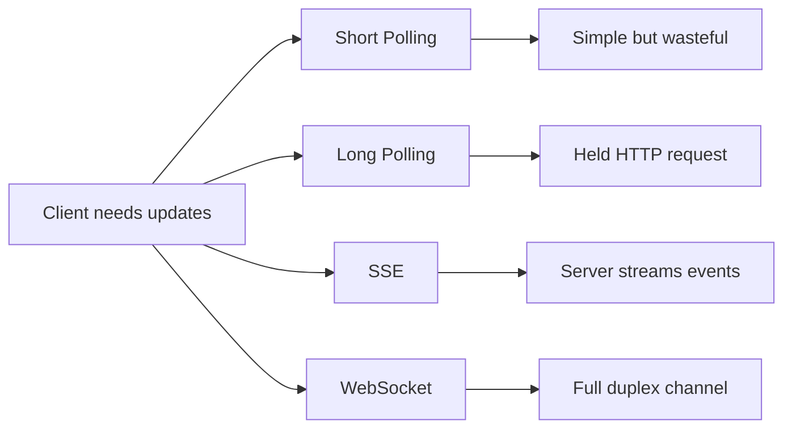

### Quick Comparison Table

| Approach | How it works | Best for | Strength | Weakness | Complexity |
|---|---|---|---|---|---|
| Short Polling | Client sends repeated HTTP requests every N seconds. Server replies immediately with data or empty response. | Simple dashboards, inbox refresh, low urgency updates | Very simple, stateless, works everywhere | Wasteful empty requests and latency depends on interval | Low |
| Long Polling | Client sends request and server holds it until new data arrives or timeout occurs. Client immediately opens next request. | Notifications, moderate real-time needs, legacy environments | Fewer empty responses than short polling | Consumes open connections and reconnect logic is needed | Medium |
| Server-Sent Events | Browser opens one HTTP connection and server streams one-way events to client. | Live feeds, notifications, dashboards, stock tickers | Simple server-to-client push over HTTP | One-way only; client still needs normal HTTP for writes | Medium |
| WebSockets | Client and server keep a persistent full-duplex TCP connection through an HTTP upgrade. | Chat, games, collaborative editing, trading, live presence | True bidirectional low-latency communication | Harder scaling, connection management, load balancing | High |

### Approach Explanation

#### Short Polling
- **How it works:** Client sends repeated HTTP requests every N seconds. Server replies immediately with data or empty response.
- **Use when:** Simple dashboards, inbox refresh, low urgency updates.
- **Why it helps:** Very simple, stateless, works everywhere.
- **Trade-off:** Wasteful empty requests and latency depends on interval.
- **Complexity:** Low.

#### Long Polling
- **How it works:** Client sends request and server holds it until new data arrives or timeout occurs. Client immediately opens next request.
- **Use when:** Notifications, moderate real-time needs, legacy environments.
- **Why it helps:** Fewer empty responses than short polling.
- **Trade-off:** Consumes open connections and reconnect logic is needed.
- **Complexity:** Medium.

#### Server-Sent Events
- **How it works:** Browser opens one HTTP connection and server streams one-way events to client.
- **Use when:** Live feeds, notifications, dashboards, stock tickers.
- **Why it helps:** Simple server-to-client push over HTTP.
- **Trade-off:** One-way only; client still needs normal HTTP for writes.
- **Complexity:** Medium.

#### WebSockets
- **How it works:** Client and server keep a persistent full-duplex TCP connection through an HTTP upgrade.
- **Use when:** Chat, games, collaborative editing, trading, live presence.
- **Why it helps:** True bidirectional low-latency communication.
- **Trade-off:** Harder scaling, connection management, load balancing.
- **Complexity:** High.

### Core Flow

```text
1. Client connects or polls ->
2. Server detects new event ->
3. Update is returned or pushed ->
4. Client updates UI ->
5. Client reconnects or keeps channel open
```

### Small Java Reference

```java
import java.util.*;

interface UpdateChannel {
    void send(String userId, String message);
}

class PollingChannel implements UpdateChannel {
    private final Map<String, Queue<String>> inbox = new HashMap<>();

    public void send(String userId, String message) {
        inbox.computeIfAbsent(userId, k -> new LinkedList<>()).offer(message);
    }

    public List<String> poll(String userId) {
        Queue<String> q = inbox.getOrDefault(userId, new LinkedList<>());
        List<String> out = new ArrayList<>();
        while (!q.isEmpty()) out.add(q.poll());
        return out;
    }
}

class WebSocketChannel implements UpdateChannel {
    private final Map<String, ClientConnection> connections = new HashMap<>();

    public void connect(String userId, ClientConnection connection) {
        connections.put(userId, connection);
    }

    public void send(String userId, String message) {
        ClientConnection connection = connections.get(userId);
        if (connection != null) connection.write(message);
    }
}

interface ClientConnection {
    void write(String message);
}
```

### Interview Checklist

- What is the bottleneck: read, write, latency, coordination, or failure recovery?
- What consistency level is required: strong, eventual, approximate, or best-effort?
- What happens during retries, duplicates, timeouts, and partial failures?
- What metric proves the design is working?
- What is the simplest version you would start with, and when would you upgrade?

---

## Fanout System

**Category:** Communication & Real-Time

**Core problem:** How should one event, such as a user post, reach many recipients without making writes or reads too slow?

### Requirements

- Support one-to-many delivery for feeds, notifications, and subscriptions.
- Handle normal users and celebrity/high-follower users differently if needed.
- Optimize based on whether reads or writes dominate.

### Visual Diagram

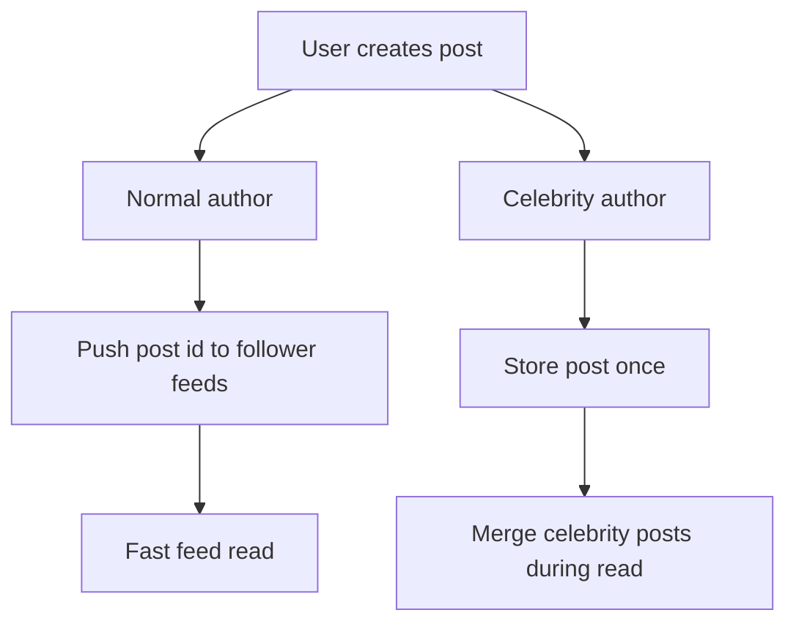

### Quick Comparison Table

| Approach | How it works | Best for | Strength | Weakness | Complexity |
|---|---|---|---|---|---|
| Fanout-on-Write | When a user posts, immediately write the post ID into each follower feed cache. | Read-heavy feeds with normal follower counts | Very fast reads and simple read path | Expensive writes and celebrity problem | Medium |
| Fanout-on-Read | Store post once. When follower opens feed, fetch followed users' posts and merge at read time. | Celebrities, write-heavy systems, inactive users | Cheap writes and less duplicate storage | Slower reads and complex ranking/merge | Medium |
| Hybrid Fanout | Push normal users to feeds, pull celebrity posts at read time. | Production social feeds | Balances write cost and read latency | Requires classification and two read paths | High |

### Approach Explanation

#### Fanout-on-Write
- **How it works:** When a user posts, immediately write the post ID into each follower feed cache.
- **Use when:** Read-heavy feeds with normal follower counts.
- **Why it helps:** Very fast reads and simple read path.
- **Trade-off:** Expensive writes and celebrity problem.
- **Complexity:** Medium.

#### Fanout-on-Read
- **How it works:** Store post once. When follower opens feed, fetch followed users' posts and merge at read time.
- **Use when:** Celebrities, write-heavy systems, inactive users.
- **Why it helps:** Cheap writes and less duplicate storage.
- **Trade-off:** Slower reads and complex ranking/merge.
- **Complexity:** Medium.

#### Hybrid Fanout
- **How it works:** Push normal users to feeds, pull celebrity posts at read time.
- **Use when:** Production social feeds.
- **Why it helps:** Balances write cost and read latency.
- **Trade-off:** Requires classification and two read paths.
- **Complexity:** High.

### Core Flow

```text
1. Post is created ->
2. System checks author fanout size ->
3. Normal user posts are pushed to follower feed caches ->
4. Celebrity posts are stored once ->
5. Feed read merges cached feed plus celebrity posts
```

### Small Java Reference

```java
import java.util.*;

class Post {
    final String id;
    final String authorId;
    final String text;

    Post(String id, String authorId, String text) {
        this.id = id;
        this.authorId = authorId;
        this.text = text;
    }
}

interface FanoutStrategy {
    void publish(Post post, List<String> followers, FeedStore feedStore);
}

class FanoutOnWrite implements FanoutStrategy {
    public void publish(Post post, List<String> followers, FeedStore feedStore) {
        for (String follower : followers) {
            feedStore.addToFeed(follower, post.id);
        }
    }
}

class FanoutOnRead implements FanoutStrategy {
    public void publish(Post post, List<String> followers, FeedStore feedStore) {
        feedStore.savePostOnly(post);
    }
}

class HybridFanout {
    private final FanoutStrategy push = new FanoutOnWrite();
    private final FanoutStrategy pull = new FanoutOnRead();
    private final int celebrityThreshold = 100_000;

    public void publish(Post post, List<String> followers, FeedStore store) {
        if (followers.size() > celebrityThreshold) pull.publish(post, followers, store);
        else push.publish(post, followers, store);
    }
}

class FeedStore {
    void addToFeed(String userId, String postId) {}
    void savePostOnly(Post post) {}
}
```

### Interview Checklist

- What is the bottleneck: read, write, latency, coordination, or failure recovery?
- What consistency level is required: strong, eventual, approximate, or best-effort?
- What happens during retries, duplicates, timeouts, and partial failures?
- What metric proves the design is working?
- What is the simplest version you would start with, and when would you upgrade?

---

## High Read Traffic

**Category:** Read & Write Scaling

**Core problem:** How do you scale systems where reads are much higher than writes?

### Requirements

- Reduce database load and latency.
- Keep frequently accessed data close to users.
- Handle stale data consciously through TTLs or invalidation.

### Visual Diagram


### Quick Comparison Table

| Approach | How it works | Best for | Strength | Weakness | Complexity |
|---|---|---|---|---|---|
| Cache | Store frequently read data in Redis or in-memory cache before hitting DB. | Hot objects, profiles, product pages, feeds | Largest DB load reduction | Stale data and invalidation complexity | Medium |
| CDN | Cache static assets or cacheable API responses at edge locations. | Images, videos, public pages, static APIs | Huge latency reduction | Not suitable for personalized highly dynamic data | Low |
| Read Replicas | Primary handles writes; replicas handle reads asynchronously. | Read-heavy relational workloads | Scales reads without changing app model much | Replica lag and read-after-write issues | Medium |
| Precomputation | Compute expensive views ahead of time and serve materialized result. | Analytics, dashboards, rankings | Very fast reads | Delayed freshness and extra storage | Medium |

### Approach Explanation

#### Cache
- **How it works:** Store frequently read data in Redis or in-memory cache before hitting DB.
- **Use when:** Hot objects, profiles, product pages, feeds.
- **Why it helps:** Largest DB load reduction.
- **Trade-off:** Stale data and invalidation complexity.
- **Complexity:** Medium.

#### CDN
- **How it works:** Cache static assets or cacheable API responses at edge locations.
- **Use when:** Images, videos, public pages, static APIs.
- **Why it helps:** Huge latency reduction.
- **Trade-off:** Not suitable for personalized highly dynamic data.
- **Complexity:** Low.

#### Read Replicas
- **How it works:** Primary handles writes; replicas handle reads asynchronously.
- **Use when:** Read-heavy relational workloads.
- **Why it helps:** Scales reads without changing app model much.
- **Trade-off:** Replica lag and read-after-write issues.
- **Complexity:** Medium.

#### Precomputation
- **How it works:** Compute expensive views ahead of time and serve materialized result.
- **Use when:** Analytics, dashboards, rankings.
- **Why it helps:** Very fast reads.
- **Trade-off:** Delayed freshness and extra storage.
- **Complexity:** Medium.

### Core Flow

```text
1. Request first checks CDN ->
2. App checks cache ->
3. If miss, read replica is queried ->
4. Expensive aggregates come from precomputed views ->
5. Primary database is protected from read overload
```

### Small Java Reference

```java
import java.time.*;
import java.util.*;

class CacheEntry<V> {
    final V value;
    final long expiresAt;

    CacheEntry(V value, long ttlMillis) {
        this.value = value;
        this.expiresAt = System.currentTimeMillis() + ttlMillis;
    }

    boolean expired() {
        return System.currentTimeMillis() > expiresAt;
    }
}

class ReadThroughCache<K, V> {
    private final Map<K, CacheEntry<V>> cache = new HashMap<>();
    private final Repository<K, V> repository;
    private final long ttlMillis;

    ReadThroughCache(Repository<K, V> repository, long ttlMillis) {
        this.repository = repository;
        this.ttlMillis = ttlMillis;
    }

    public V get(K key) {
        CacheEntry<V> entry = cache.get(key);
        if (entry != null && !entry.expired()) return entry.value;

        V value = repository.load(key);
        cache.put(key, new CacheEntry<>(value, ttlMillis));
        return value;
    }
}

interface Repository<K, V> {
    V load(K key);
}
```

### Interview Checklist

- What is the bottleneck: read, write, latency, coordination, or failure recovery?
- What consistency level is required: strong, eventual, approximate, or best-effort?
- What happens during retries, duplicates, timeouts, and partial failures?
- What metric proves the design is working?
- What is the simplest version you would start with, and when would you upgrade?

---

## High Write Traffic

**Category:** Read & Write Scaling

**Core problem:** How do you absorb and persist huge write volumes when writes cannot simply be cached away?

### Requirements

- Accept writes quickly without losing durability.
- Smooth spikes with queues and batching.
- Scale persistence horizontally and protect the system with backpressure.

### Visual Diagram

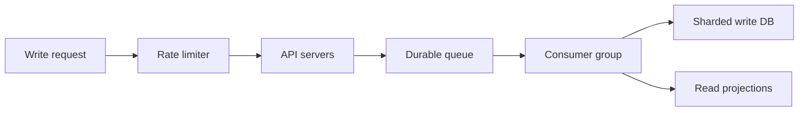

### Quick Comparison Table

| Approach | How it works | Best for | Strength | Weakness | Complexity |
|---|---|---|---|---|---|
| Batching | Group many writes into one bulk operation to reduce per-write overhead. | Logs, metrics, analytics, inserts | Immediate throughput improvement | Adds small delay and retry complexity | Low |
| Queue | Accept write into Kafka/SQS/RabbitMQ, process asynchronously with consumers. | Spiky write systems, event ingestion | Decouples ingestion from persistence | Eventual consistency and queue operations | Medium |
| Sharding | Route writes across multiple DB partitions using a shard key. | Very high write volume | Horizontal write scale | Hot shard risk and cross-shard complexity | High |
| CQRS/Event Sourcing | Store append-only events and build read projections separately. | Audit-heavy systems, different read/write needs | Fast writes and replayable history | More moving parts and eventual consistency | High |
| Backpressure | Signal or reject upstream work when capacity is exceeded. | Overload protection | Prevents collapse | Some requests are delayed or rejected | Medium |

### Approach Explanation

#### Batching
- **How it works:** Group many writes into one bulk operation to reduce per-write overhead.
- **Use when:** Logs, metrics, analytics, inserts.
- **Why it helps:** Immediate throughput improvement.
- **Trade-off:** Adds small delay and retry complexity.
- **Complexity:** Low.

#### Queue
- **How it works:** Accept write into Kafka/SQS/RabbitMQ, process asynchronously with consumers.
- **Use when:** Spiky write systems, event ingestion.
- **Why it helps:** Decouples ingestion from persistence.
- **Trade-off:** Eventual consistency and queue operations.
- **Complexity:** Medium.

#### Sharding
- **How it works:** Route writes across multiple DB partitions using a shard key.
- **Use when:** Very high write volume.
- **Why it helps:** Horizontal write scale.
- **Trade-off:** Hot shard risk and cross-shard complexity.
- **Complexity:** High.

#### CQRS/Event Sourcing
- **How it works:** Store append-only events and build read projections separately.
- **Use when:** Audit-heavy systems, different read/write needs.
- **Why it helps:** Fast writes and replayable history.
- **Trade-off:** More moving parts and eventual consistency.
- **Complexity:** High.

#### Backpressure
- **How it works:** Signal or reject upstream work when capacity is exceeded.
- **Use when:** Overload protection.
- **Why it helps:** Prevents collapse.
- **Trade-off:** Some requests are delayed or rejected.
- **Complexity:** Medium.

### Core Flow

```text
1. API validates and accepts write ->
2. Write is placed on durable queue ->
3. Consumers batch events ->
4. Data is persisted to sharded storage ->
5. Read projections are updated asynchronously
```

### Small Java Reference

```java
import java.util.*;

class WriteBuffer<T> {
    private final List<T> buffer = new ArrayList<>();
    private final int maxSize;
    private final BulkWriter<T> writer;

    WriteBuffer(int maxSize, BulkWriter<T> writer) {
        this.maxSize = maxSize;
        this.writer = writer;
    }

    public synchronized void add(T event) {
        buffer.add(event);
        if (buffer.size() >= maxSize) flush();
    }

    public synchronized void flush() {
        if (buffer.isEmpty()) return;
        List<T> batch = new ArrayList<>(buffer);
        buffer.clear();
        writer.writeBatch(batch);
    }
}

interface BulkWriter<T> {
    void writeBatch(List<T> batch);
}

class QueueConsumer<T> {
    private final WriteBuffer<T> buffer;

    QueueConsumer(WriteBuffer<T> buffer) {
        this.buffer = buffer;
    }

    public void consume(T event) {
        buffer.add(event);
    }
}
```

### Interview Checklist

- What is the bottleneck: read, write, latency, coordination, or failure recovery?
- What consistency level is required: strong, eventual, approximate, or best-effort?
- What happens during retries, duplicates, timeouts, and partial failures?
- What metric proves the design is working?
- What is the simplest version you would start with, and when would you upgrade?

---

## Hot Keys

**Category:** Traffic & Hotspot Handling

**Core problem:** How do you handle one key receiving far more traffic than the rest of the cluster?

### Requirements

- Detect key-level traffic imbalance.
- Scale read-heavy and write-heavy hot keys differently.
- Prevent stampedes and protect backend systems.

### Visual Diagram

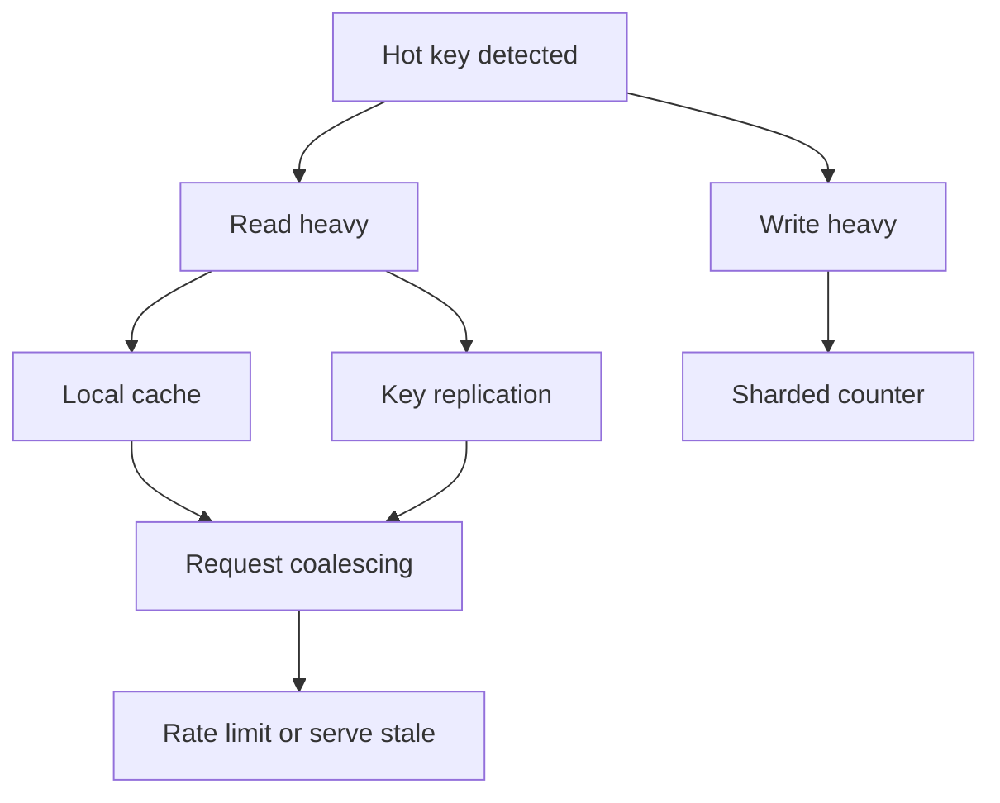

### Quick Comparison Table

| Approach | How it works | Best for | Strength | Weakness | Complexity |
|---|---|---|---|---|---|
| Local Cache | Cache hot key in each app server memory with short TTL. | Read-heavy hot objects with tolerable staleness | Huge reduction in Redis/DB load | Stale and inconsistent across app servers | Low |
| Key Replication | Store multiple replicas of same hot key and randomly read one. | High-read low-write hot keys | Spreads reads across cache nodes | Write amplification and invalidation complexity | Medium |
| Key Splitting | Split one logical hot counter into many physical shards. | Write-heavy counters | Spreads writes horizontally | Reads must aggregate shards | Medium |
| Request Coalescing | Only one request recomputes a missing hot key; others wait. | Cache stampede prevention | Protects DB during cache miss | Requires locking/waiting logic | Medium |
| Serve Stale | Return expired value while refresh happens in background. | Availability-first systems | Smooth user experience under pressure | May show old data | Low |

### Approach Explanation

#### Local Cache
- **How it works:** Cache hot key in each app server memory with short TTL.
- **Use when:** Read-heavy hot objects with tolerable staleness.
- **Why it helps:** Huge reduction in Redis/DB load.
- **Trade-off:** Stale and inconsistent across app servers.
- **Complexity:** Low.

#### Key Replication
- **How it works:** Store multiple replicas of same hot key and randomly read one.
- **Use when:** High-read low-write hot keys.
- **Why it helps:** Spreads reads across cache nodes.
- **Trade-off:** Write amplification and invalidation complexity.
- **Complexity:** Medium.

#### Key Splitting
- **How it works:** Split one logical hot counter into many physical shards.
- **Use when:** Write-heavy counters.
- **Why it helps:** Spreads writes horizontally.
- **Trade-off:** Reads must aggregate shards.
- **Complexity:** Medium.

#### Request Coalescing
- **How it works:** Only one request recomputes a missing hot key; others wait.
- **Use when:** Cache stampede prevention.
- **Why it helps:** Protects DB during cache miss.
- **Trade-off:** Requires locking/waiting logic.
- **Complexity:** Medium.

#### Serve Stale
- **How it works:** Return expired value while refresh happens in background.
- **Use when:** Availability-first systems.
- **Why it helps:** Smooth user experience under pressure.
- **Trade-off:** May show old data.
- **Complexity:** Low.

### Core Flow

```text
1. Detect node imbalance or top key frequency ->
2. Classify hot key as read-heavy or write-heavy ->
3. Apply local cache/replication for reads ->
4. Apply key splitting for writes ->
5. Add coalescing and graceful degradation
```

### Small Java Reference

```java
import java.util.*;
import java.util.concurrent.*;

class HotKeyCache {
    private final Map<String, String> localCache = new ConcurrentHashMap<>();
    private final Set<String> refreshLocks = ConcurrentHashMap.newKeySet();
    private final RemoteStore remoteStore;

    HotKeyCache(RemoteStore remoteStore) {
        this.remoteStore = remoteStore;
    }

    public String get(String key) {
        String cached = localCache.get(key);
        if (cached != null) return cached;

        if (refreshLocks.add(key)) {
            try {
                String value = remoteStore.get(key);
                localCache.put(key, value);
                return value;
            } finally {
                refreshLocks.remove(key);
            }
        }

        return "STALE_OR_RETRY_LATER";
    }
}

interface RemoteStore {
    String get(String key);
}
```

### Interview Checklist

- What is the bottleneck: read, write, latency, coordination, or failure recovery?
- What consistency level is required: strong, eventual, approximate, or best-effort?
- What happens during retries, duplicates, timeouts, and partial failures?
- What metric proves the design is working?
- What is the simplest version you would start with, and when would you upgrade?

---

## Traffic Spikes

**Category:** Traffic & Hotspot Handling

**Core problem:** How do you keep a system alive when traffic suddenly jumps far above normal capacity?

### Requirements

- Survive predictable, unpredictable, and self-inflicted spikes.
- Protect critical paths before optional features.
- Avoid retry storms and cascading failures.

### Visual Diagram

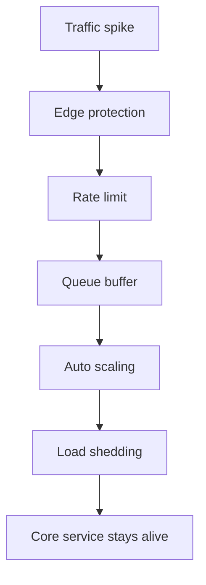

### Quick Comparison Table

| Approach | How it works | Best for | Strength | Weakness | Complexity |
|---|---|---|---|---|---|
| Scheduled Scaling | Add capacity before known events. | Flash sales, launches, sports finals | Best for predictable spikes | Does not help unexpected spikes | Low |
| Auto Scaling | Add/remove servers based on CPU, latency, or queue depth. | General variable traffic | Cost efficient and automatic | Scaling lag during sudden spikes | Medium |
| Rate Limiting | Reject excess traffic before backend overload. | Public APIs, user-level quotas | Protects system capacity | Some users rejected | Medium |
| Load Shedding | Drop low-priority work intentionally under overload. | Critical systems under pressure | Prevents full outage | Partial functionality loss | Medium |
| Queue Buffering | Absorb spike into durable queue and process at safe rate. | Writes/events/background work | Smooths bursts | Adds delay and backlog risk | Medium |

### Approach Explanation

#### Scheduled Scaling
- **How it works:** Add capacity before known events.
- **Use when:** Flash sales, launches, sports finals.
- **Why it helps:** Best for predictable spikes.
- **Trade-off:** Does not help unexpected spikes.
- **Complexity:** Low.

#### Auto Scaling
- **How it works:** Add/remove servers based on CPU, latency, or queue depth.
- **Use when:** General variable traffic.
- **Why it helps:** Cost efficient and automatic.
- **Trade-off:** Scaling lag during sudden spikes.
- **Complexity:** Medium.

#### Rate Limiting
- **How it works:** Reject excess traffic before backend overload.
- **Use when:** Public APIs, user-level quotas.
- **Why it helps:** Protects system capacity.
- **Trade-off:** Some users rejected.
- **Complexity:** Medium.

#### Load Shedding
- **How it works:** Drop low-priority work intentionally under overload.
- **Use when:** Critical systems under pressure.
- **Why it helps:** Prevents full outage.
- **Trade-off:** Partial functionality loss.
- **Complexity:** Medium.

#### Queue Buffering
- **How it works:** Absorb spike into durable queue and process at safe rate.
- **Use when:** Writes/events/background work.
- **Why it helps:** Smooths bursts.
- **Trade-off:** Adds delay and backlog risk.
- **Complexity:** Medium.

### Core Flow

```text
1. Spike arrives at edge ->
2. Rate limiter rejects excess ->
3. Queue absorbs accepted work ->
4. Auto scaling adds capacity ->
5. Load shedding drops optional work if still overloaded
```

### Small Java Reference

```java
class TokenBucket {
    private final int capacity;
    private final double refillPerSecond;
    private double tokens;
    private long lastRefillNanos;

    TokenBucket(int capacity, double refillPerSecond) {
        this.capacity = capacity;
        this.refillPerSecond = refillPerSecond;
        this.tokens = capacity;
        this.lastRefillNanos = System.nanoTime();
    }

    public synchronized boolean allow() {
        refill();
        if (tokens >= 1) {
            tokens -= 1;
            return true;
        }
        return false;
    }

    private void refill() {
        long now = System.nanoTime();
        double seconds = (now - lastRefillNanos) / 1_000_000_000.0;
        tokens = Math.min(capacity, tokens + seconds * refillPerSecond);
        lastRefillNanos = now;
    }
}
```

### Interview Checklist

- What is the bottleneck: read, write, latency, coordination, or failure recovery?
- What consistency level is required: strong, eventual, approximate, or best-effort?
- What happens during retries, duplicates, timeouts, and partial failures?
- What metric proves the design is working?
- What is the simplest version you would start with, and when would you upgrade?

---

## Large File Handling

**Category:** Storage & Media

**Core problem:** How do you upload, download, and store large files without timeouts, memory spikes, or failed full restarts?

### Requirements

- Avoid buffering entire files in app servers.
- Support resumable uploads and retry only failed chunks.
- Offload heavy bytes to object storage when possible.

### Visual Diagram

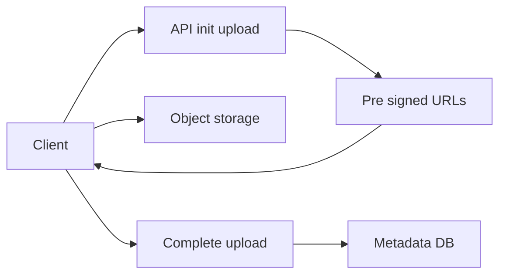

### Quick Comparison Table

| Approach | How it works | Best for | Strength | Weakness | Complexity |
|---|---|---|---|---|---|
| Chunked Upload | Split file into chunks and upload each chunk independently. | Large files, unstable networks | Resume failed uploads cheaply | More metadata and assembly logic | Medium |
| Pre-Signed URL | Server signs limited storage URLs; client uploads directly to object storage. | S3/GCS/Azure uploads | Removes app server bandwidth bottleneck | Requires storage security and expiry management | Medium |
| Multipart Upload | Object storage tracks uploaded parts and completes them into one object. | Very large files | Parallel upload and retry per part | Client must track part numbers and ETags | Medium |
| Range Download | Client downloads byte ranges and resumes partial downloads. | Video, large downloads, CDN | Efficient resume and seeking | Requires range support | Low |

### Approach Explanation

#### Chunked Upload
- **How it works:** Split file into chunks and upload each chunk independently.
- **Use when:** Large files, unstable networks.
- **Why it helps:** Resume failed uploads cheaply.
- **Trade-off:** More metadata and assembly logic.
- **Complexity:** Medium.

#### Pre-Signed URL
- **How it works:** Server signs limited storage URLs; client uploads directly to object storage.
- **Use when:** S3/GCS/Azure uploads.
- **Why it helps:** Removes app server bandwidth bottleneck.
- **Trade-off:** Requires storage security and expiry management.
- **Complexity:** Medium.

#### Multipart Upload
- **How it works:** Object storage tracks uploaded parts and completes them into one object.
- **Use when:** Very large files.
- **Why it helps:** Parallel upload and retry per part.
- **Trade-off:** Client must track part numbers and ETags.
- **Complexity:** Medium.

#### Range Download
- **How it works:** Client downloads byte ranges and resumes partial downloads.
- **Use when:** Video, large downloads, CDN.
- **Why it helps:** Efficient resume and seeking.
- **Trade-off:** Requires range support.
- **Complexity:** Low.

### Core Flow

```text
1. Client initializes upload ->
2. API returns upload ID and pre-signed part URLs ->
3. Client uploads chunks directly to storage ->
4. Client sends uploaded part metadata ->
5. Server completes upload and stores metadata
```

### Small Java Reference

```java
import java.util.*;

record UploadSession(String uploadId, String objectKey, int chunkSize, int totalChunks) {}

class LargeFileUploadService {
    private static final int CHUNK_SIZE = 16 * 1024 * 1024;

    public UploadSession init(String fileName, long fileSize) {
        String uploadId = UUID.randomUUID().toString();
        String objectKey = "uploads/" + uploadId + "/" + fileName;
        int totalChunks = (int) Math.ceil((double) fileSize / CHUNK_SIZE);
        return new UploadSession(uploadId, objectKey, CHUNK_SIZE, totalChunks);
    }

    public String createPresignedUrl(String objectKey, int partNumber) {
        return "https://storage.example.com/" + objectKey + "?part=" + partNumber + "&signature=demo";
    }

    public void complete(String uploadId, List<String> partEtags) {
        if (partEtags.isEmpty()) throw new IllegalArgumentException("No parts uploaded");
        System.out.println("Complete upload " + uploadId);
    }
}
```

### Interview Checklist

- What is the bottleneck: read, write, latency, coordination, or failure recovery?
- What consistency level is required: strong, eventual, approximate, or best-effort?
- What happens during retries, duplicates, timeouts, and partial failures?
- What metric proves the design is working?
- What is the simplest version you would start with, and when would you upgrade?

---

## Media Streaming

**Category:** Storage & Media

**Core problem:** How do you deliver video/audio at scale while handling huge bandwidth, strict timing, and unstable networks?

### Requirements

- Compress and segment media for efficient delivery.
- Use CDN-friendly protocols for large scale.
- Adapt bitrate based on network conditions.

### Visual Diagram


### Quick Comparison Table

| Approach | How it works | Best for | Strength | Weakness | Complexity |
|---|---|---|---|---|---|
| HLS/DASH | Split media into segments and serve playlist plus chunks over HTTP. | VOD and large live broadcasts | CDN friendly and scalable | Higher latency than real-time protocols | Medium |
| LL-HLS/LL-DASH | Use smaller partial segments and optimized delivery. | Lower latency broadcasts | 2 to 5 second latency possible | More complex player/CDN tuning | High |
| WebRTC | Peer/media server based real-time protocol. | Video calls, interactive live, gaming | Sub-second latency | Hard to scale to millions through CDN | High |
| Adaptive Bitrate | Encode multiple quality levels and switch based on bandwidth. | Most streaming platforms | Reduces buffering | Requires transcoding ladder | Medium |

### Approach Explanation

#### HLS/DASH
- **How it works:** Split media into segments and serve playlist plus chunks over HTTP.
- **Use when:** VOD and large live broadcasts.
- **Why it helps:** CDN friendly and scalable.
- **Trade-off:** Higher latency than real-time protocols.
- **Complexity:** Medium.

#### LL-HLS/LL-DASH
- **How it works:** Use smaller partial segments and optimized delivery.
- **Use when:** Lower latency broadcasts.
- **Why it helps:** 2 to 5 second latency possible.
- **Trade-off:** More complex player/CDN tuning.
- **Complexity:** High.

#### WebRTC
- **How it works:** Peer/media server based real-time protocol.
- **Use when:** Video calls, interactive live, gaming.
- **Why it helps:** Sub-second latency.
- **Trade-off:** Hard to scale to millions through CDN.
- **Complexity:** High.

#### Adaptive Bitrate
- **How it works:** Encode multiple quality levels and switch based on bandwidth.
- **Use when:** Most streaming platforms.
- **Why it helps:** Reduces buffering.
- **Trade-off:** Requires transcoding ladder.
- **Complexity:** Medium.

### Core Flow

```text
1. Source video is ingested ->
2. Transcoder creates multiple bitrates ->
3. Segments and manifests are generated ->
4. Origin stores media ->
5. CDN serves segments ->
6. Player switches quality using ABR
```

### Small Java Reference

```java
import java.util.*;

class Variant {
    final int bitrateKbps;
    final String playlistUrl;

    Variant(int bitrateKbps, String playlistUrl) {
        this.bitrateKbps = bitrateKbps;
        this.playlistUrl = playlistUrl;
    }
}

class AdaptiveBitrateSelector {
    public Variant choose(List<Variant> variants, int measuredBandwidthKbps) {
        variants.sort(Comparator.comparingInt(v -> v.bitrateKbps));
        Variant chosen = variants.get(0);
        for (Variant variant : variants) {
            if (variant.bitrateKbps * 1.3 < measuredBandwidthKbps) {
                chosen = variant;
            }
        }
        return chosen;
    }
}
```

### Interview Checklist

- What is the bottleneck: read, write, latency, coordination, or failure recovery?
- What consistency level is required: strong, eventual, approximate, or best-effort?
- What happens during retries, duplicates, timeouts, and partial failures?
- What metric proves the design is working?
- What is the simplest version you would start with, and when would you upgrade?

---

## Geospatial Search

**Category:** Geo & Identity

**Core problem:** How do you find nearby entities like drivers, stores, or restaurants quickly without scanning all locations?

### Requirements

- Support proximity queries under low latency.
- Handle frequent location updates for moving entities.
- Use spatial indexes and precise distance filtering.

### Visual Diagram

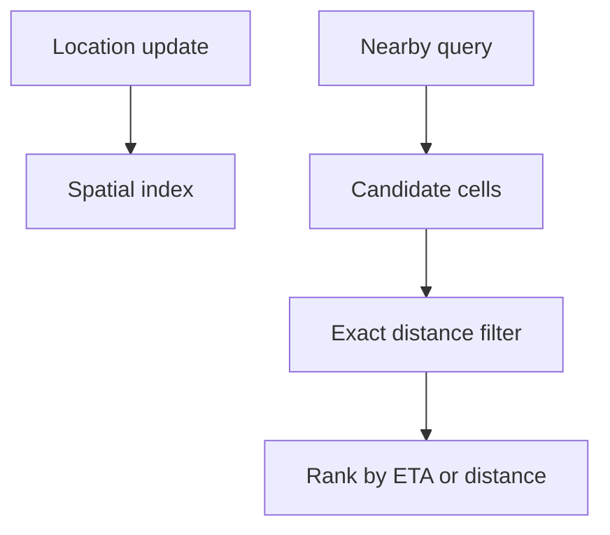

### Quick Comparison Table

| Approach | How it works | Best for | Strength | Weakness | Complexity |
|---|---|---|---|---|---|
| PostGIS | Use database spatial indexes and geographic distance queries. | Accurate search, moderate scale, complex GIS | Correct and feature rich | May struggle with very high update rates | Medium |
| Redis Geo | Store active moving entities in Redis geo sets. | Nearby drivers, live locations | Fast in-memory proximity search | Memory bound and needs persistence strategy | Medium |
| Geohash | Encode lat/lon into sortable string prefixes and query nearby cells. | Simple DB-backed nearby search | Works with normal indexes | Must query neighbor cells and filter edges | Medium |
| H3/S2 | Map Earth into hierarchical cells. | Large-scale geo analytics, heatmaps, zones | Great for aggregation and regional logic | More conceptual complexity | High |

### Approach Explanation

#### PostGIS
- **How it works:** Use database spatial indexes and geographic distance queries.
- **Use when:** Accurate search, moderate scale, complex GIS.
- **Why it helps:** Correct and feature rich.
- **Trade-off:** May struggle with very high update rates.
- **Complexity:** Medium.

#### Redis Geo
- **How it works:** Store active moving entities in Redis geo sets.
- **Use when:** Nearby drivers, live locations.
- **Why it helps:** Fast in-memory proximity search.
- **Trade-off:** Memory bound and needs persistence strategy.
- **Complexity:** Medium.

#### Geohash
- **How it works:** Encode lat/lon into sortable string prefixes and query nearby cells.
- **Use when:** Simple DB-backed nearby search.
- **Why it helps:** Works with normal indexes.
- **Trade-off:** Must query neighbor cells and filter edges.
- **Complexity:** Medium.

#### H3/S2
- **How it works:** Map Earth into hierarchical cells.
- **Use when:** Large-scale geo analytics, heatmaps, zones.
- **Why it helps:** Great for aggregation and regional logic.
- **Trade-off:** More conceptual complexity.
- **Complexity:** High.

### Core Flow

```text
1. Entity location is updated in spatial index ->
2. Query asks for nearby candidates ->
3. Index returns nearby cells or radius candidates ->
4. Exact distance calculation filters false positives ->
5. Results are ranked
```

### Small Java Reference

```java
import java.util.*;

record Location(double lat, double lon) {}

class GeoService {
    private final Map<String, Location> locations = new HashMap<>();

    public void update(String id, double lat, double lon) {
        locations.put(id, new Location(lat, lon));
    }

    public List<String> nearby(double lat, double lon, double radiusKm) {
        List<String> result = new ArrayList<>();
        Location center = new Location(lat, lon);
        for (Map.Entry<String, Location> e : locations.entrySet()) {
            if (distanceKm(center, e.getValue()) <= radiusKm) result.add(e.getKey());
        }
        return result;
    }

    private double distanceKm(Location a, Location b) {
        double r = 6371.0;
        double dLat = Math.toRadians(b.lat() - a.lat());
        double dLon = Math.toRadians(b.lon() - a.lon());
        double x = Math.sin(dLat / 2) * Math.sin(dLat / 2)
                + Math.cos(Math.toRadians(a.lat())) * Math.cos(Math.toRadians(b.lat()))
                * Math.sin(dLon / 2) * Math.sin(dLon / 2);
        return 2 * r * Math.asin(Math.sqrt(x));
    }
}
```

### Interview Checklist

- What is the bottleneck: read, write, latency, coordination, or failure recovery?
- What consistency level is required: strong, eventual, approximate, or best-effort?
- What happens during retries, duplicates, timeouts, and partial failures?
- What metric proves the design is working?
- What is the simplest version you would start with, and when would you upgrade?

---

## Unique ID Generation

**Category:** Geo & Identity

**Core problem:** How do distributed services generate unique IDs without collisions, bottlenecks, or poor database index behavior?

### Requirements

- Guarantee uniqueness across multiple nodes.
- Choose whether IDs must be sortable, compact, or unpredictable.
- Avoid per-request central coordination at high scale.

### Visual Diagram

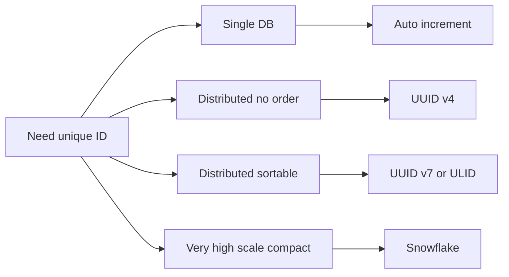

### Quick Comparison Table

| Approach | How it works | Best for | Strength | Weakness | Complexity |
|---|---|---|---|---|---|
| Auto Increment | Database atomically increments one counter. | Single DB apps, internal IDs | Simple, compact, sortable | DB bottleneck and predictable | Low |
| UUID v4 | Generate random 128-bit identifier. | Distributed systems where order does not matter | No coordination | Large and bad for B-tree locality | Low |
| UUID v7 / ULID | Timestamp prefix plus randomness. | Sortable distributed IDs | No coordination and time ordered | Clock behavior matters | Medium |
| Snowflake | Timestamp, machine ID, and per-ms sequence into 64-bit ID. | High-scale services needing sortable compact IDs | Very high throughput | Machine ID and clock drift management | Medium |
| Ticket Server | Central service allocates ID ranges to workers. | Sequential IDs with lower coordination | Compact and sortable | Ticket service is critical dependency | Medium |

### Approach Explanation

#### Auto Increment
- **How it works:** Database atomically increments one counter.
- **Use when:** Single DB apps, internal IDs.
- **Why it helps:** Simple, compact, sortable.
- **Trade-off:** DB bottleneck and predictable.
- **Complexity:** Low.

#### UUID v4
- **How it works:** Generate random 128-bit identifier.
- **Use when:** Distributed systems where order does not matter.
- **Why it helps:** No coordination.
- **Trade-off:** Large and bad for B-tree locality.
- **Complexity:** Low.

#### UUID v7 / ULID
- **How it works:** Timestamp prefix plus randomness.
- **Use when:** Sortable distributed IDs.
- **Why it helps:** No coordination and time ordered.
- **Trade-off:** Clock behavior matters.
- **Complexity:** Medium.

#### Snowflake
- **How it works:** Timestamp, machine ID, and per-ms sequence into 64-bit ID.
- **Use when:** High-scale services needing sortable compact IDs.
- **Why it helps:** Very high throughput.
- **Trade-off:** Machine ID and clock drift management.
- **Complexity:** Medium.

#### Ticket Server
- **How it works:** Central service allocates ID ranges to workers.
- **Use when:** Sequential IDs with lower coordination.
- **Why it helps:** Compact and sortable.
- **Trade-off:** Ticket service is critical dependency.
- **Complexity:** Medium.

### Core Flow

```text
1. Define ID properties ->
2. Pick coordination level ->
3. Generate ID ->
4. Enforce unique constraint as safety net ->
5. Monitor collisions or clock drift
```

### Small Java Reference

```java
class SnowflakeIdGenerator {
    private final long epoch = 1700000000000L;
    private final long machineId;
    private long lastTimestamp = -1L;
    private long sequence = 0L;

    SnowflakeIdGenerator(long machineId) {
        if (machineId < 0 || machineId > 1023) throw new IllegalArgumentException("machineId must fit 10 bits");
        this.machineId = machineId;
    }

    public synchronized long nextId() {
        long now = System.currentTimeMillis();
        if (now < lastTimestamp) throw new IllegalStateException("Clock moved backward");

        if (now == lastTimestamp) {
            sequence = (sequence + 1) & 4095;
            if (sequence == 0) {
                while ((now = System.currentTimeMillis()) <= lastTimestamp) {}
            }
        } else {
            sequence = 0;
        }

        lastTimestamp = now;
        return ((now - epoch) << 22) | (machineId << 12) | sequence;
    }
}
```

### Interview Checklist

- What is the bottleneck: read, write, latency, coordination, or failure recovery?
- What consistency level is required: strong, eventual, approximate, or best-effort?
- What happens during retries, duplicates, timeouts, and partial failures?
- What metric proves the design is working?
- What is the simplest version you would start with, and when would you upgrade?

---

## Distributed Counting

**Category:** Counters & Coordination

**Core problem:** How do you count likes, views, requests, or unique users when one counter can become a hot write bottleneck?

### Requirements

- Choose between exact, approximate, real-time, and delayed counts.
- Support high write throughput without corrupting counts.
- Handle idempotency and decrement behavior carefully.

### Visual Diagram

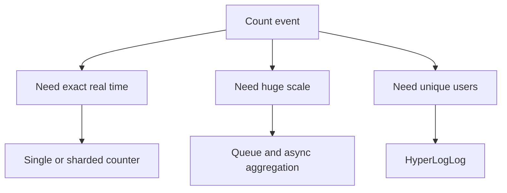

### Quick Comparison Table

| Approach | How it works | Best for | Strength | Weakness | Complexity |
|---|---|---|---|---|---|
| Single Counter | One row/key updated atomically. | Small/medium exact counts | Simple and exact | Hot row bottleneck | Low |
| Sharded Counter | Split logical counter into many shards and sum on read. | Viral likes, hot counters | Scales exact writes | Reads aggregate many shards | Medium |
| Async Aggregation | Queue events and batch update counters later. | Very high scale views/likes | Massive throughput | Delayed freshness | Medium |
| Count-Min Sketch | Approximate counts with hash tables. | Heavy hitters, top keys | Tiny memory and fast updates | Overestimates and approximate only | Medium |
| HyperLogLog | Approximate unique count using probabilistic registers. | Unique visitors/users | Very small memory | Approximate and not for exact membership | Low |

### Approach Explanation

#### Single Counter
- **How it works:** One row/key updated atomically.
- **Use when:** Small/medium exact counts.
- **Why it helps:** Simple and exact.
- **Trade-off:** Hot row bottleneck.
- **Complexity:** Low.

#### Sharded Counter
- **How it works:** Split logical counter into many shards and sum on read.
- **Use when:** Viral likes, hot counters.
- **Why it helps:** Scales exact writes.
- **Trade-off:** Reads aggregate many shards.
- **Complexity:** Medium.

#### Async Aggregation
- **How it works:** Queue events and batch update counters later.
- **Use when:** Very high scale views/likes.
- **Why it helps:** Massive throughput.
- **Trade-off:** Delayed freshness.
- **Complexity:** Medium.

#### Count-Min Sketch
- **How it works:** Approximate counts with hash tables.
- **Use when:** Heavy hitters, top keys.
- **Why it helps:** Tiny memory and fast updates.
- **Trade-off:** Overestimates and approximate only.
- **Complexity:** Medium.

#### HyperLogLog
- **How it works:** Approximate unique count using probabilistic registers.
- **Use when:** Unique visitors/users.
- **Why it helps:** Very small memory.
- **Trade-off:** Approximate and not for exact membership.
- **Complexity:** Low.

### Core Flow

```text
1. Receive event with event ID ->
2. Deduplicate event if needed ->
3. Update exact shard or enqueue aggregation ->
4. Read sums shards or reads aggregate ->
5. Repair and monitor anomalies
```

### Small Java Reference

```java
import java.util.*;
import java.util.concurrent.*;

class ShardedCounter {
    private final int shards;
    private final ConcurrentHashMap<Integer, Long> counts = new ConcurrentHashMap<>();
    private final Random random = new Random();

    ShardedCounter(int shards) {
        this.shards = shards;
        for (int i = 0; i < shards; i++) counts.put(i, 0L);
    }

    public void increment() {
        int shard = random.nextInt(shards);
        counts.compute(shard, (k, v) -> v + 1);
    }

    public long getTotal() {
        long total = 0;
        for (long value : counts.values()) total += value;
        return total;
    }
}
```

### Interview Checklist

- What is the bottleneck: read, write, latency, coordination, or failure recovery?
- What consistency level is required: strong, eventual, approximate, or best-effort?
- What happens during retries, duplicates, timeouts, and partial failures?
- What metric proves the design is working?
- What is the simplest version you would start with, and when would you upgrade?

---

## Leader Election

**Category:** Counters & Coordination

**Core problem:** How does a distributed system choose exactly one coordinator without split-brain?

### Requirements

- Ensure at most one leader at a time.
- Elect a new leader when current leader fails.
- Prevent stale leaders from continuing critical writes.

### Visual Diagram

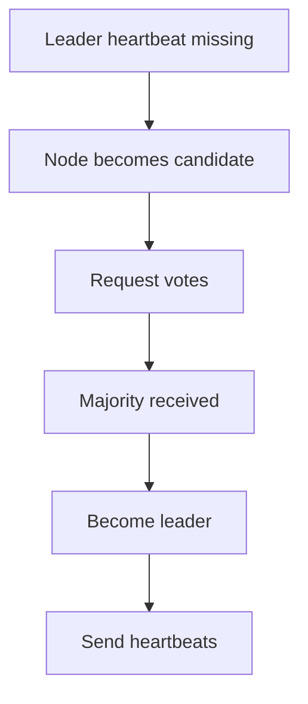

### Quick Comparison Table

| Approach | How it works | Best for | Strength | Weakness | Complexity |
|---|---|---|---|---|---|
| Bully Algorithm | Highest node ID wins after election messages. | Learning/simple controlled systems | Easy to explain | Weak under partitions and O(n²) | Low |
| Ring Algorithm | Election message circulates and highest ID wins. | Simple logical clusters | O(n) style flow | Slow and fragile with failed ring nodes | Medium |
| Raft | Candidate needs majority votes in a term to become leader. | Production replicated systems | Strong split-brain protection with quorum | Complex implementation | High |
| Lease with Fencing | Node acquires renewable lease and fencing token; writes include token. | Kubernetes/DB-based leader jobs | Practical for app-level leadership | Lease alone is unsafe without fencing | Medium |

### Approach Explanation

#### Bully Algorithm
- **How it works:** Highest node ID wins after election messages.
- **Use when:** Learning/simple controlled systems.
- **Why it helps:** Easy to explain.
- **Trade-off:** Weak under partitions and O(n²).
- **Complexity:** Low.

#### Ring Algorithm
- **How it works:** Election message circulates and highest ID wins.
- **Use when:** Simple logical clusters.
- **Why it helps:** O(n) style flow.
- **Trade-off:** Slow and fragile with failed ring nodes.
- **Complexity:** Medium.

#### Raft
- **How it works:** Candidate needs majority votes in a term to become leader.
- **Use when:** Production replicated systems.
- **Why it helps:** Strong split-brain protection with quorum.
- **Trade-off:** Complex implementation.
- **Complexity:** High.

#### Lease with Fencing
- **How it works:** Node acquires renewable lease and fencing token; writes include token.
- **Use when:** Kubernetes/DB-based leader jobs.
- **Why it helps:** Practical for app-level leadership.
- **Trade-off:** Lease alone is unsafe without fencing.
- **Complexity:** Medium.

### Core Flow

```text
1. Follower misses heartbeat ->
2. It starts election ->
3. Peers vote once per term ->
4. Majority winner becomes leader ->
5. Leader sends heartbeats and uses fencing tokens for writes
```

### Small Java Reference

```java
class Lease {
    String ownerId;
    long expiresAtMillis;
    long fencingToken;
}

class LeaseManager {
    private final Lease lease = new Lease();

    public synchronized long tryAcquire(String nodeId, long ttlMillis) {
        long now = System.currentTimeMillis();
        if (lease.ownerId == null || lease.expiresAtMillis < now || lease.ownerId.equals(nodeId)) {
            lease.ownerId = nodeId;
            lease.expiresAtMillis = now + ttlMillis;
            lease.fencingToken++;
            return lease.fencingToken;
        }
        return -1;
    }

    public synchronized boolean isLeader(String nodeId) {
        return nodeId.equals(lease.ownerId) && lease.expiresAtMillis >= System.currentTimeMillis();
    }
}
```

### Interview Checklist

- What is the bottleneck: read, write, latency, coordination, or failure recovery?
- What consistency level is required: strong, eventual, approximate, or best-effort?
- What happens during retries, duplicates, timeouts, and partial failures?
- What metric proves the design is working?
- What is the simplest version you would start with, and when would you upgrade?

---

## Failure Detection and Heartbeats

**Category:** Counters & Coordination

**Core problem:** How do nodes decide whether another node is alive, slow, overloaded, or failed?

### Requirements

- Detect failures quickly without too many false positives.
- Handle network delays, pauses, and partitions.
- Feed detection results into failover, routing, or leader election.

### Visual Diagram

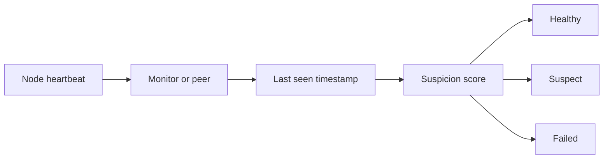

### Quick Comparison Table

| Approach | How it works | Best for | Strength | Weakness | Complexity |
|---|---|---|---|---|---|
| Fixed Timeout | Mark node failed if no heartbeat within fixed duration. | Simple internal systems | Easy and predictable | Bad under variable latency | Low |
| Adaptive Timeout | Timeout changes based on observed latency distribution. | Variable production networks | Fewer false positives | Needs stats and warm-up | Medium |
| Phi Accrual | Compute suspicion score instead of binary alive/dead. | Large distributed clusters | Adaptive and expressive | More math and threshold tuning | High |
| Gossip/SWIM | Nodes randomly exchange membership and suspicion state. | Large decentralized clusters | No central monitor bottleneck | Eventually consistent and harder debugging | High |

### Approach Explanation

#### Fixed Timeout
- **How it works:** Mark node failed if no heartbeat within fixed duration.
- **Use when:** Simple internal systems.
- **Why it helps:** Easy and predictable.
- **Trade-off:** Bad under variable latency.
- **Complexity:** Low.

#### Adaptive Timeout
- **How it works:** Timeout changes based on observed latency distribution.
- **Use when:** Variable production networks.
- **Why it helps:** Fewer false positives.
- **Trade-off:** Needs stats and warm-up.
- **Complexity:** Medium.

#### Phi Accrual
- **How it works:** Compute suspicion score instead of binary alive/dead.
- **Use when:** Large distributed clusters.
- **Why it helps:** Adaptive and expressive.
- **Trade-off:** More math and threshold tuning.
- **Complexity:** High.

#### Gossip/SWIM
- **How it works:** Nodes randomly exchange membership and suspicion state.
- **Use when:** Large decentralized clusters.
- **Why it helps:** No central monitor bottleneck.
- **Trade-off:** Eventually consistent and harder debugging.
- **Complexity:** High.

### Core Flow

```text
1. Node sends heartbeat ->
2. Receiver records last seen and health metadata ->
3. Detector computes timeout or suspicion ->
4. Node is marked healthy, suspect, or failed ->
5. Failover/routing responds
```

### Small Java Reference

```java
import java.util.*;

enum NodeState { HEALTHY, SUSPECT, FAILED }

class HeartbeatMonitor {
    private final Map<String, Long> lastSeen = new HashMap<>();
    private final long suspectAfterMillis;
    private final long failedAfterMillis;

    HeartbeatMonitor(long suspectAfterMillis, long failedAfterMillis) {
        this.suspectAfterMillis = suspectAfterMillis;
        this.failedAfterMillis = failedAfterMillis;
    }

    public void heartbeat(String nodeId) {
        lastSeen.put(nodeId, System.currentTimeMillis());
    }

    public NodeState status(String nodeId) {
        Long ts = lastSeen.get(nodeId);
        if (ts == null) return NodeState.FAILED;

        long age = System.currentTimeMillis() - ts;
        if (age > failedAfterMillis) return NodeState.FAILED;
        if (age > suspectAfterMillis) return NodeState.SUSPECT;
        return NodeState.HEALTHY;
    }
}
```

### Interview Checklist

- What is the bottleneck: read, write, latency, coordination, or failure recovery?
- What consistency level is required: strong, eventual, approximate, or best-effort?
- What happens during retries, duplicates, timeouts, and partial failures?
- What metric proves the design is working?
- What is the simplest version you would start with, and when would you upgrade?

---

## Resilient Systems Failure Handling

**Category:** Resilience & Consistency

**Core problem:** How do you prevent partial service failures from becoming full system outages?

### Requirements

- Use timeouts, retries, circuit breakers, bulkheads, fallbacks, and idempotency together.
- Fail fast instead of letting threads block forever.
- Degrade non-critical features before core flows fail.

### Visual Diagram


### Quick Comparison Table

| Approach | How it works | Best for | Strength | Weakness | Complexity |
|---|---|---|---|---|---|
| Timeout | Stop waiting after a bounded time. | Every remote call | Prevents resource exhaustion | Too short causes false failures | Low |
| Retry with Backoff | Retry transient failures with increasing delay and jitter. | Network glitches, 503/504 | Improves success rate | Can amplify load if uncontrolled | Medium |
| Circuit Breaker | Open after repeated failures and fail fast for a cooldown period. | Unhealthy downstream services | Stops cascading failures | Needs thresholds and fallback | Medium |
| Bulkhead | Separate thread/connection pools per dependency. | Critical multi-dependency services | Failure isolation | Capacity planning complexity | Medium |
| Fallback | Serve cache/default/degraded response when dependency fails. | User-facing reliability | Better than outage | May be stale or incomplete | Low |
| Idempotency | Make repeated commands safe using request IDs. | Payments, orders, retries | Prevents duplicate side effects | Requires storage and design discipline | Medium |

### Approach Explanation

#### Timeout
- **How it works:** Stop waiting after a bounded time.
- **Use when:** Every remote call.
- **Why it helps:** Prevents resource exhaustion.
- **Trade-off:** Too short causes false failures.
- **Complexity:** Low.

#### Retry with Backoff
- **How it works:** Retry transient failures with increasing delay and jitter.
- **Use when:** Network glitches, 503/504.
- **Why it helps:** Improves success rate.
- **Trade-off:** Can amplify load if uncontrolled.
- **Complexity:** Medium.

#### Circuit Breaker
- **How it works:** Open after repeated failures and fail fast for a cooldown period.
- **Use when:** Unhealthy downstream services.
- **Why it helps:** Stops cascading failures.
- **Trade-off:** Needs thresholds and fallback.
- **Complexity:** Medium.

#### Bulkhead
- **How it works:** Separate thread/connection pools per dependency.
- **Use when:** Critical multi-dependency services.
- **Why it helps:** Failure isolation.
- **Trade-off:** Capacity planning complexity.
- **Complexity:** Medium.

#### Fallback
- **How it works:** Serve cache/default/degraded response when dependency fails.
- **Use when:** User-facing reliability.
- **Why it helps:** Better than outage.
- **Trade-off:** May be stale or incomplete.
- **Complexity:** Low.

#### Idempotency
- **How it works:** Make repeated commands safe using request IDs.
- **Use when:** Payments, orders, retries.
- **Why it helps:** Prevents duplicate side effects.
- **Trade-off:** Requires storage and design discipline.
- **Complexity:** Medium.

### Core Flow

```text
1. Set timeout on every call ->
2. Retry only transient failures ->
3. Circuit opens if failures continue ->
4. Bulkheads isolate pools ->
5. Fallback returns degraded response
```

### Small Java Reference

```java
import java.util.function.*;

class CircuitBreaker {
    private int failures = 0;
    private long openUntil = 0;
    private final int threshold;
    private final long cooldownMillis;

    CircuitBreaker(int threshold, long cooldownMillis) {
        this.threshold = threshold;
        this.cooldownMillis = cooldownMillis;
    }

    public synchronized <T> T call(Supplier<T> action, Supplier<T> fallback) {
        long now = System.currentTimeMillis();
        if (now < openUntil) return fallback.get();

        try {
            T result = action.get();
            failures = 0;
            return result;
        } catch (RuntimeException ex) {
            failures++;
            if (failures >= threshold) openUntil = now + cooldownMillis;
            return fallback.get();
        }
    }
}
```

### Interview Checklist

- What is the bottleneck: read, write, latency, coordination, or failure recovery?
- What consistency level is required: strong, eventual, approximate, or best-effort?
- What happens during retries, duplicates, timeouts, and partial failures?
- What metric proves the design is working?
- What is the simplest version you would start with, and when would you upgrade?

---

## Distributed Transactions

**Category:** Resilience & Consistency

**Core problem:** How do you maintain correctness when one business operation spans multiple services or databases?

### Requirements

- Handle partial failure between services.
- Choose strong consistency or eventual consistency consciously.
- Use idempotency, timeouts, compensation, and workflow state.

### Visual Diagram

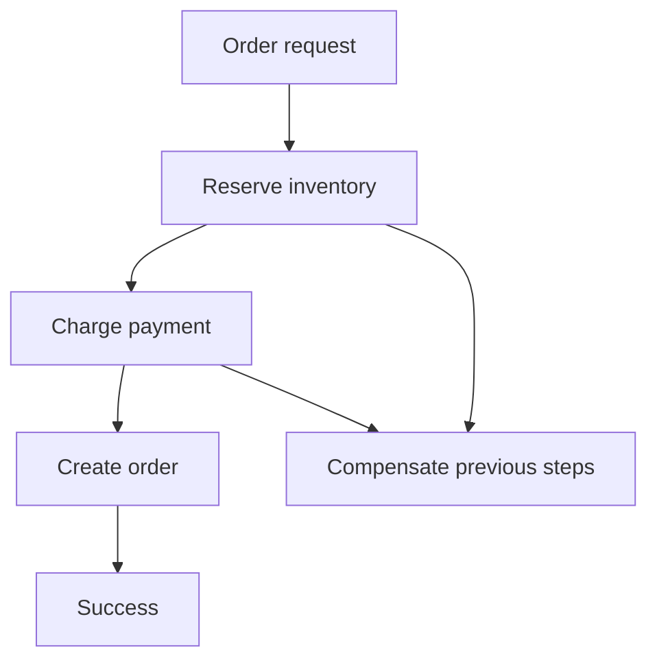

### Quick Comparison Table

| Approach | How it works | Best for | Strength | Weakness | Complexity |
|---|---|---|---|---|---|
| 2PC | Coordinator asks all participants to prepare, then commit or abort. | Strong consistency across controlled participants | Atomic commit semantics | Blocking and poor availability under failures | High |
| 3PC | Adds pre-commit phase to reduce blocking. | Mostly theoretical discussions | Less blocking than 2PC | Still complex and uncommon | High |
| Saga Orchestration | Central orchestrator executes local transactions and compensates on failure. | Microservice workflows | Clear visibility and control | Compensation can fail | High |
| Saga Choreography | Services react to events and publish next events. | Event-driven systems | Loose coupling | Harder to trace and debug | High |
| TCC | Try reserves resources, Confirm commits, Cancel releases. | Reservation-style workflows | Explicit control over resources | Each service must implement three operations | High |
| Outbox | Write DB change and event into same local transaction; publisher later sends event. | Reliable event publishing | Prevents lost events | Requires relay and idempotent consumers | Medium |

### Approach Explanation

#### 2PC
- **How it works:** Coordinator asks all participants to prepare, then commit or abort.
- **Use when:** Strong consistency across controlled participants.
- **Why it helps:** Atomic commit semantics.
- **Trade-off:** Blocking and poor availability under failures.
- **Complexity:** High.

#### 3PC
- **How it works:** Adds pre-commit phase to reduce blocking.
- **Use when:** Mostly theoretical discussions.
- **Why it helps:** Less blocking than 2PC.
- **Trade-off:** Still complex and uncommon.
- **Complexity:** High.

#### Saga Orchestration
- **How it works:** Central orchestrator executes local transactions and compensates on failure.
- **Use when:** Microservice workflows.
- **Why it helps:** Clear visibility and control.
- **Trade-off:** Compensation can fail.
- **Complexity:** High.

#### Saga Choreography
- **How it works:** Services react to events and publish next events.
- **Use when:** Event-driven systems.
- **Why it helps:** Loose coupling.
- **Trade-off:** Harder to trace and debug.
- **Complexity:** High.

#### TCC
- **How it works:** Try reserves resources, Confirm commits, Cancel releases.
- **Use when:** Reservation-style workflows.
- **Why it helps:** Explicit control over resources.
- **Trade-off:** Each service must implement three operations.
- **Complexity:** High.

#### Outbox
- **How it works:** Write DB change and event into same local transaction; publisher later sends event.
- **Use when:** Reliable event publishing.
- **Why it helps:** Prevents lost events.
- **Trade-off:** Requires relay and idempotent consumers.
- **Complexity:** Medium.

### Core Flow

```text
1. Start workflow ->
2. Execute local transaction in each service ->
3. Persist workflow state ->
4. On failure run compensating actions ->
5. Use idempotency for retries and duplicate messages
```

### Small Java Reference

```java
import java.util.*;

enum SagaStatus { STARTED, COMPLETED, COMPENSATING, FAILED }

interface SagaStep {
    void execute();
    void compensate();
}

class SagaOrchestrator {
    private final List<SagaStep> steps = new ArrayList<>();
    private SagaStatus status = SagaStatus.STARTED;

    public void addStep(SagaStep step) {
        steps.add(step);
    }

    public void run() {
        List<SagaStep> completed = new ArrayList<>();
        try {
            for (SagaStep step : steps) {
                step.execute();
                completed.add(step);
            }
            status = SagaStatus.COMPLETED;
        } catch (RuntimeException ex) {
            status = SagaStatus.COMPENSATING;
            Collections.reverse(completed);
            for (SagaStep step : completed) step.compensate();
            status = SagaStatus.FAILED;
        }
    }

    public SagaStatus getStatus() {
        return status;
    }
}
```

### Interview Checklist

- What is the bottleneck: read, write, latency, coordination, or failure recovery?
- What consistency level is required: strong, eventual, approximate, or best-effort?
- What happens during retries, duplicates, timeouts, and partial failures?
- What metric proves the design is working?
- What is the simplest version you would start with, and when would you upgrade?

---

## Single Point of Failure

**Category:** Resilience & Consistency

**Core problem:** How do you identify and remove components whose failure can take down the whole system?

### Requirements

- Walk the critical path and ask what happens if each component fails.
- Add redundancy and automatic failover where needed.
- Watch for hidden shared dependencies.

### Visual Diagram

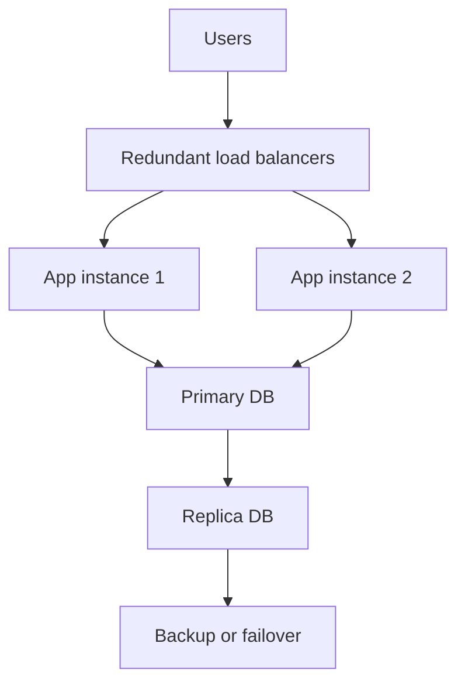

### Quick Comparison Table

| Approach | How it works | Best for | Strength | Weakness | Complexity |
|---|---|---|---|---|---|
| Active-Passive | One primary handles traffic; standby takes over on failure. | Databases, critical services | Simple failover model | Failover delay and unused capacity | Medium |
| Active-Active | Multiple instances serve traffic at the same time. | Stateless services, multi-region systems | High availability and capacity | Consistency and routing complexity | High |
| Replication | Maintain copies of data across nodes or regions. | Databases, storage | Survives node loss | Lag and conflict handling | Medium |
| Load Balancing | Distribute traffic across healthy instances. | API/app layer | Removes single app node dependency | LB itself must be redundant | Low |
| Multi-AZ/Region | Deploy across failure domains. | Mission critical systems | Survives datacenter issues | Cost and data consistency complexity | High |

### Approach Explanation

#### Active-Passive
- **How it works:** One primary handles traffic; standby takes over on failure.
- **Use when:** Databases, critical services.
- **Why it helps:** Simple failover model.
- **Trade-off:** Failover delay and unused capacity.
- **Complexity:** Medium.

#### Active-Active
- **How it works:** Multiple instances serve traffic at the same time.
- **Use when:** Stateless services, multi-region systems.
- **Why it helps:** High availability and capacity.
- **Trade-off:** Consistency and routing complexity.
- **Complexity:** High.

#### Replication
- **How it works:** Maintain copies of data across nodes or regions.
- **Use when:** Databases, storage.
- **Why it helps:** Survives node loss.
- **Trade-off:** Lag and conflict handling.
- **Complexity:** Medium.

#### Load Balancing
- **How it works:** Distribute traffic across healthy instances.
- **Use when:** API/app layer.
- **Why it helps:** Removes single app node dependency.
- **Trade-off:** LB itself must be redundant.
- **Complexity:** Low.

#### Multi-AZ/Region
- **How it works:** Deploy across failure domains.
- **Use when:** Mission critical systems.
- **Why it helps:** Survives datacenter issues.
- **Trade-off:** Cost and data consistency complexity.
- **Complexity:** High.

### Core Flow

```text
1. Identify critical path ->
2. Ask what fails if each component dies ->
3. Add redundancy/failover ->
4. Test failover regularly ->
5. Monitor hidden shared dependencies
```

### Small Java Reference

```java
import java.util.*;

class HealthAwareLoadBalancer {
    private final List<ServiceInstance> instances = new ArrayList<>();
    private int index = 0;

    public void register(ServiceInstance instance) {
        instances.add(instance);
    }

    public ServiceInstance choose() {
        for (int i = 0; i < instances.size(); i++) {
            ServiceInstance instance = instances.get(index);
            index = (index + 1) % instances.size();
            if (instance.healthy()) return instance;
        }
        throw new IllegalStateException("No healthy instance available");
    }
}

interface ServiceInstance {
    boolean healthy();
    String call(String request);
}
```

### Interview Checklist

- What is the bottleneck: read, write, latency, coordination, or failure recovery?
- What consistency level is required: strong, eventual, approximate, or best-effort?
- What happens during retries, duplicates, timeouts, and partial failures?
- What metric proves the design is working?
- What is the simplest version you would start with, and when would you upgrade?

---

## Final Pattern Selection Cheat Sheet

| Situation | Pick This First | Upgrade To |
|---|---|---|
| Need server-to-client updates | SSE | WebSocket for bidirectional/live collaboration |
| One event reaches many users | Fanout-on-write | Hybrid fanout for celebrities |
| Reads overload DB | Cache | CDN + replicas + precomputation |
| Writes overload DB | Batch writes | Queue + shard + CQRS |
| One key overloads one shard | Local cache | Key replication or key splitting |
| Sudden traffic surge | Rate limit | Queue + load shedding + autoscaling |
| Large upload fails often | Chunked upload | Multipart direct-to-storage upload |
| Video delivery at scale | HLS/DASH | LL-HLS or WebRTC for lower latency |
| Nearby search | PostGIS | Redis Geo/H3 for real-time/high scale |
| Distributed IDs | UUID v7/ULID | Snowflake for compact sortable 64-bit IDs |
| Hot counter | Single counter | Sharded counter or async aggregation |
| Need one coordinator | Lease with fencing | Raft/quorum-based election |
| Need detect failed nodes | Fixed timeout | Phi accrual or gossip/SWIM |
| Remote services fail | Timeout + retry | Circuit breaker + bulkhead + fallback |
| Multi-service transaction | Outbox/Saga | 2PC only for tightly controlled strong consistency |
| Critical component can fail | Redundancy | Active-active multi-AZ/region |