# System Design Patterns Visual Reference

A visual-first Markdown guide for common system design patterns. It uses simple diagrams, tables, plain explanations, and small Java snippets for quick revision.

> Tip: If your Markdown viewer has trouble rendering Mermaid, the tables and explanations are still complete and readable.

## Clickable Index


### Realtime and Feeds
- [Real-Time Updates](#real-time-updates)
- [Fanout System](#fanout-system)

### Traffic Scaling
- [High Read Traffic](#high-read-traffic)
- [High Write Traffic](#high-write-traffic)
- [Hot Keys](#hot-keys)
- [Traffic Spikes](#traffic-spikes)

### Storage and Media
- [Large File Handling](#large-file-handling)
- [Media Streaming](#media-streaming)
- [Geospatial Systems](#geospatial-systems)

### Identifiers and Counters
- [Unique ID Generation](#unique-id-generation)
- [Distributed Counting](#distributed-counting)

### Coordination and Failure
- [Leader Election](#leader-election)
- [Failure Detection and Heartbeats](#failure-detection-and-heartbeats)
- [Resilient Systems and Failure Handling](#resilient-systems-and-failure-handling)
- [Distributed Transactions](#distributed-transactions)
- [Single Point of Failure](#single-point-of-failure)

---

## Quick Pattern Map

| Situation | First Pattern to Think About |
|---|---|
| Need instant UI updates | SSE or WebSocket |
| One event reaches many users | Fanout |
| Reads dominate writes | Cache, CDN, replicas |
| Writes dominate reads | Batch, queue, shard |
| One key overloads one node | Hot key mitigation |
| Sudden load surge | Rate limit, queue, load shedding |
| Large upload/download | Chunking and pre-signed URLs |
| Video delivery | Transcoding, segments, CDN, ABR |
| Nearby search | Geohash/H3 + exact distance |
| Distributed IDs | UUID or Snowflake |
| Massive counters | Sharded counters / async aggregation |
| One coordinator needed | Leader election |
| Detect dead nodes | Heartbeats/failure detection |
| Dependency failure protection | Timeout, retry, circuit breaker |
| Cross-service business workflow | Saga and Outbox |
| Remove weak links | SPOF elimination |

---

## Real-Time Updates

**Category:** Realtime and Feeds  

**Best mental model:** Use when clients must see server-side changes quickly: chat, notifications, live scores, stock prices, driver tracking, collaboration.

### Visual Diagram

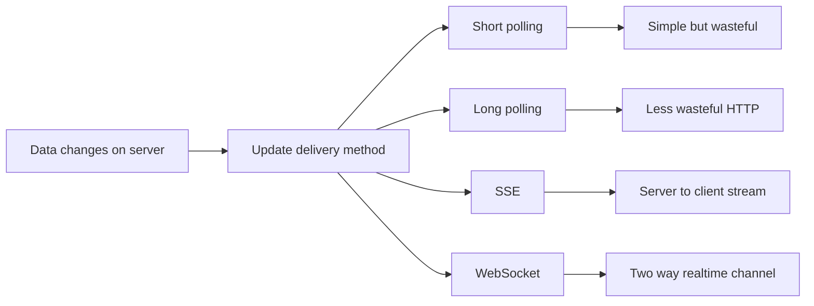

### Approaches and Trade-offs

| Approach | Direction | Best For | Avoid When |
|---|---|---|---|
| Short Polling | Client pulls repeatedly | Simple dashboards, status checks | Low latency chat/trading |
| Long Polling | Client waits, server responds later | Notifications, lightweight realtime | Massive fanout with many held connections |
| SSE | Server -> Client | Feeds, live notifications, price updates | Need client -> server realtime messages |
| WebSocket | Both directions | Chat, games, collaboration, live tracking | Simple one-way updates |

### Simple Explanation

The core question is: does the server need to push updates, or is periodic refresh enough?

Start with polling when simplicity matters. Move to long polling when you want fewer empty responses. Use SSE when the server pushes one-way updates over HTTP. Use WebSocket when both client and server need to send messages continuously.

Interview shortcut: polling is simplest, SSE is great for one-way streaming, WebSocket is the most flexible but operationally heavier.

### How to Choose

- Start with the simplest approach that satisfies correctness.
- Move to the advanced approach only when the bottleneck is clear.
- Always mention trade-offs: latency, consistency, cost, complexity, and operations.
- In interviews, explain the failure mode and how your pattern prevents it.

### Small Java Reference

```java
import java.util.concurrent.*;

class ShortPollingClient {
    private final ScheduledExecutorService scheduler = Executors.newSingleThreadScheduledExecutor();

    public void startPolling() {
        scheduler.scheduleAtFixedRate(this::fetchUpdates, 0, 5, TimeUnit.SECONDS);
    }

    private void fetchUpdates() {
        System.out.println("GET /updates -> render new data if present");
    }
}

interface RealtimeChannel {
    void connect(String userId);
    void send(String userId, String message);
    void disconnect(String userId);
}

class WebSocketChannel implements RealtimeChannel {
    public void connect(String userId) {
        System.out.println(userId + " connected");
    }

    public void send(String userId, String message) {
        System.out.println("push to " + userId + ": " + message);
    }

    public void disconnect(String userId) {
        System.out.println(userId + " disconnected");
    }
}
```

---

## Fanout System

**Category:** Realtime and Feeds  

**Best mental model:** Use when one event must reach many users: social feeds, notifications, subscriptions, email alerts.

### Visual Diagram

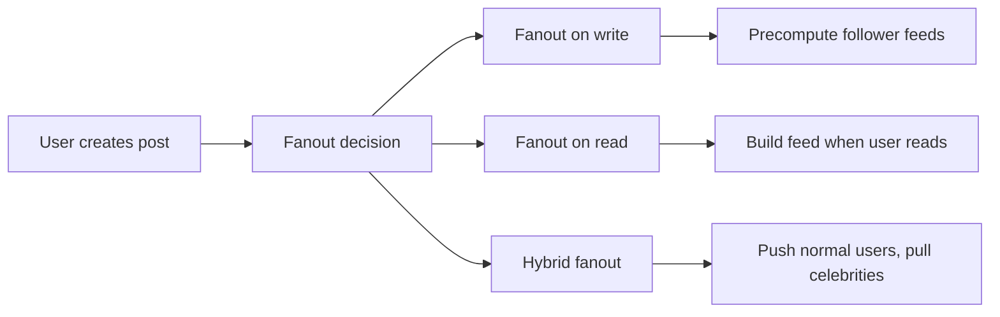

### Approaches and Trade-offs

| Approach | Write Cost | Read Cost | Best For |
|---|---|---|---|
| Fanout on Write | High | Low | Read-heavy feeds |
| Fanout on Read | Low | High | Celebrity accounts, write-heavy systems |
| Hybrid | Balanced | Balanced | Production social feeds |

### Simple Explanation

Fanout is about expanding one event into many downstream deliveries.

Fanout-on-write pushes a post into followers' feeds immediately, so reads are very fast. The downside is the celebrity problem: one post can cause millions of writes.

Fanout-on-read stores the post once and builds feed at read time. Writes are cheap, but reads are slower.

Hybrid is usually the best real-world answer: push normal users and pull celebrities.

### How to Choose

- Start with the simplest approach that satisfies correctness.
- Move to the advanced approach only when the bottleneck is clear.
- Always mention trade-offs: latency, consistency, cost, complexity, and operations.
- In interviews, explain the failure mode and how your pattern prevents it.

### Small Java Reference

```java
import java.util.*;

class Post {
    final String postId;
    final String authorId;

    Post(String postId, String authorId) {
        this.postId = postId;
        this.authorId = authorId;
    }
}

interface FanoutStrategy {
    void fanout(Post post, List<String> followers);
}

class FanoutOnWrite implements FanoutStrategy {
    private final Map<String, List<String>> feedCache = new HashMap<>();

    public void fanout(Post post, List<String> followers) {
        for (String follower : followers) {
            feedCache.computeIfAbsent(follower, k -> new ArrayList<>()).add(post.postId);
        }
    }
}

class HybridFanout implements FanoutStrategy {
    private final FanoutOnWrite push = new FanoutOnWrite();

    public void fanout(Post post, List<String> followers) {
        if (followers.size() > 1_000_000) {
            System.out.println("Celebrity post stored once; pull on read");
        } else {
            push.fanout(post, followers);
        }
    }
}
```

---

## High Read Traffic

**Category:** Traffic Scaling  

**Best mental model:** Use when reads dominate writes, such as product pages, feeds, profiles, dashboards, and article pages.

### Visual Diagram

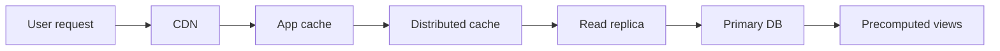

### Approaches and Trade-offs

| Technique | Benefit | Tradeoff |
|---|---|---|
| CDN | Low latency at edge | Staleness and invalidation |
| Cache | Big DB load reduction | Invalidation complexity |
| Read Replicas | Scale DB reads | Replica lag |
| Indexes | Faster queries | Write overhead |
| Precomputation | Fast expensive reads | Delayed freshness |

### Simple Explanation

For read-heavy systems, optimize the path from nearest and cheapest layer to most expensive layer.

The usual order is CDN, local/app cache, distributed cache, read replicas, then primary DB. If queries are expensive, precompute materialized views or projections.

Interview shortcut: cache first, then CDN, replicas, indexes, and precomputed views.

### How to Choose

- Start with the simplest approach that satisfies correctness.
- Move to the advanced approach only when the bottleneck is clear.
- Always mention trade-offs: latency, consistency, cost, complexity, and operations.
- In interviews, explain the failure mode and how your pattern prevents it.

### Small Java Reference

```java
import java.util.*;

class ReadThroughCache<K, V> {
    private final Map<K, V> cache = new HashMap<>();
    private final DataSource<K, V> source;

    ReadThroughCache(DataSource<K, V> source) {
        this.source = source;
    }

    public V get(K key) {
        if (cache.containsKey(key)) return cache.get(key);
        V value = source.load(key);
        cache.put(key, value);
        return value;
    }
}

interface DataSource<K, V> {
    V load(K key);
}
```

---

## High Write Traffic

**Category:** Traffic Scaling  

**Best mental model:** Use when many events must be persisted: logs, analytics, metrics, location updates, clickstream, IoT.

### Visual Diagram

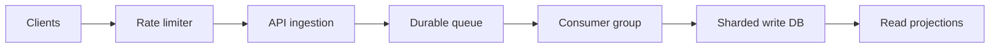

### Approaches and Trade-offs

| Approach | Purpose | Tradeoff |
|---|---|---|
| Batching | Reduce per-write overhead | Slight delay |
| Queue | Absorb spikes | Eventual consistency |
| Sharding | Horizontal write scale | Shard-key complexity |
| Write-optimized DB | High ingestion throughput | Query tradeoffs |
| Backpressure | Prevent overload | Rejects or delays work |

### Simple Explanation

Writes cannot be cached away; they must eventually hit durable storage.

Start with batching. Then decouple ingestion using a durable queue. Scale consumers horizontally. If storage is still hot, shard writes and use write-optimized storage. Protect the system with rate limiting, backpressure, and graceful degradation.

### How to Choose

- Start with the simplest approach that satisfies correctness.
- Move to the advanced approach only when the bottleneck is clear.
- Always mention trade-offs: latency, consistency, cost, complexity, and operations.
- In interviews, explain the failure mode and how your pattern prevents it.

### Small Java Reference

```java
import java.util.*;

class WriteBuffer<T> {
    private final List<T> buffer = new ArrayList<>();
    private final int maxSize;
    private final BulkWriter<T> writer;

    WriteBuffer(int maxSize, BulkWriter<T> writer) {
        this.maxSize = maxSize;
        this.writer = writer;
    }

    public synchronized void add(T item) {
        buffer.add(item);
        if (buffer.size() >= maxSize) flush();
    }

    public synchronized void flush() {
        if (buffer.isEmpty()) return;
        writer.writeBatch(new ArrayList<>(buffer));
        buffer.clear();
    }
}

interface BulkWriter<T> {
    void writeBatch(List<T> batch);
}
```

---

## Hot Keys

**Category:** Traffic Scaling  

**Best mental model:** Use when one key gets disproportionate traffic: viral posts, flash-sale products, trending topics, celebrity profiles.

### Visual Diagram

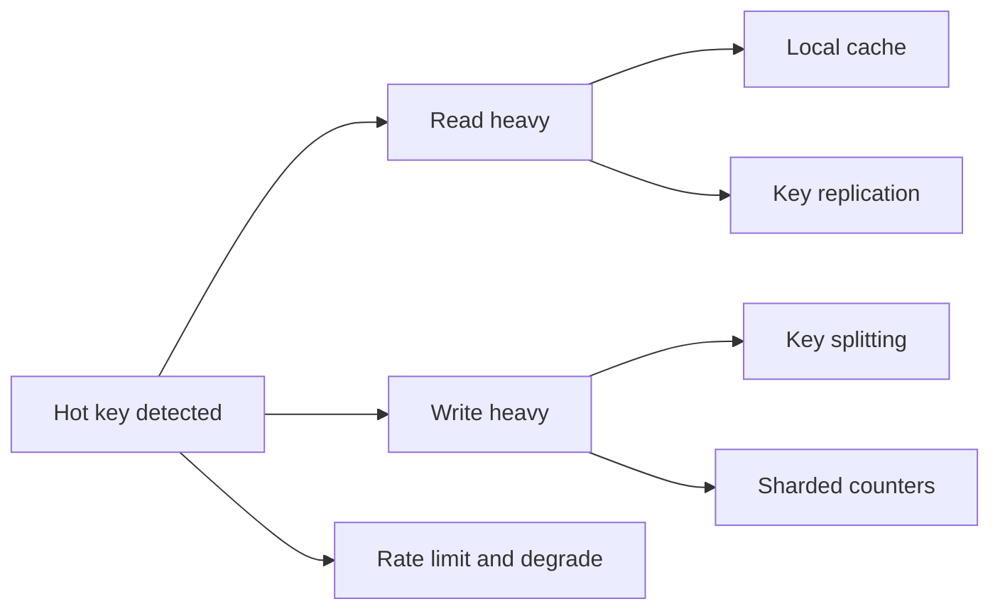

### Approaches and Trade-offs

| Problem | Solution | Tradeoff |
|---|---|---|
| Read-heavy hot key | Local cache | May be stale |
| Fresh read-heavy key | Replicate key | Write amplification |
| Write-heavy counter | Shard key | Read aggregation cost |
| Cache stampede | Request coalescing | More coordination |
| Overload | Rate limit/degrade | Partial user impact |

### Simple Explanation

A hot key defeats horizontal scaling because all traffic lands on one shard or node.

For read-heavy keys, first use short-TTL local caching. If freshness matters, replicate the key across cache nodes. For write-heavy counters, split one logical key into many physical shards and aggregate on read.

### How to Choose

- Start with the simplest approach that satisfies correctness.
- Move to the advanced approach only when the bottleneck is clear.
- Always mention trade-offs: latency, consistency, cost, complexity, and operations.
- In interviews, explain the failure mode and how your pattern prevents it.

### Small Java Reference

```java
import java.util.*;
import java.util.concurrent.atomic.AtomicLong;

class ShardedCounter {
    private final List<AtomicLong> shards = new ArrayList<>();
    private final Random random = new Random();

    ShardedCounter(int shardCount) {
        for (int i = 0; i < shardCount; i++) shards.add(new AtomicLong());
    }

    public void increment() {
        int shard = random.nextInt(shards.size());
        shards.get(shard).incrementAndGet();
    }

    public long getTotal() {
        long total = 0;
        for (AtomicLong shard : shards) total += shard.get();
        return total;
    }
}
```

---

## Traffic Spikes

**Category:** Traffic Scaling  

**Best mental model:** Use for flash sales, viral events, product launches, Black Friday, live sports, breaking news.

### Visual Diagram

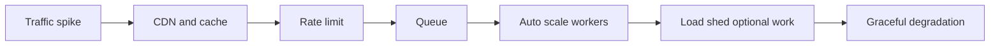

### Approaches and Trade-offs

| Spike Type | Examples | Best Defense |
|---|---|---|
| Predictable | Flash sale, launch | Scheduled scaling, pre-warm cache |
| Unpredictable | Viral post | Autoscale, rate limit, queue |
| Self-inflicted | Retry storm, cache expiry | Jitter, backoff, staggered TTL |

### Simple Explanation

Spikes expose bottlenecks and amplify failures. Autoscaling helps, but it reacts slowly, so it is not your first defense.

Use CDN/cache to absorb reads, queues to smooth writes, rate limits to reject excess, and load shedding to protect the core path.

### How to Choose

- Start with the simplest approach that satisfies correctness.
- Move to the advanced approach only when the bottleneck is clear.
- Always mention trade-offs: latency, consistency, cost, complexity, and operations.
- In interviews, explain the failure mode and how your pattern prevents it.

### Small Java Reference

```java
class LoadShedder {
    private final int maxQueueDepth;

    LoadShedder(int maxQueueDepth) {
        this.maxQueueDepth = maxQueueDepth;
    }

    public boolean allow(int currentQueueDepth, RequestPriority priority) {
        if (currentQueueDepth < maxQueueDepth) return true;
        return priority == RequestPriority.CRITICAL;
    }
}

enum RequestPriority {
    CRITICAL, NORMAL, OPTIONAL
}
```

---

## Large File Handling

**Category:** Storage and Media  

**Best mental model:** Use for uploads/downloads of videos, backups, documents, datasets, and media files.

### Visual Diagram

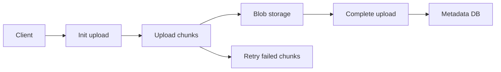

### Approaches and Trade-offs

| Approach | Use When | Benefit |
|---|---|---|
| Chunked Upload | Large unstable uploads | Retry only failed chunks |
| Pre-signed URL | Blob storage available | Bypass app servers |
| Checksum | Need correctness | Detect corruption |
| Resume Status | Mobile/slow networks | Continue from uploaded chunks |

### Simple Explanation

Do not treat large files as one atomic upload. Split them into chunks, upload chunks independently, retry failures, and complete the upload after all chunks arrive.

For scale, send bytes directly to object storage with pre-signed URLs while app servers handle only metadata.

### How to Choose

- Start with the simplest approach that satisfies correctness.
- Move to the advanced approach only when the bottleneck is clear.
- Always mention trade-offs: latency, consistency, cost, complexity, and operations.
- In interviews, explain the failure mode and how your pattern prevents it.

### Small Java Reference

```java
import java.util.*;

record InitUploadResponse(String uploadId, int chunkSize, int totalChunks) {}

class LargeFileUploadService {
    private static final int CHUNK_SIZE = 16 * 1024 * 1024;

    public InitUploadResponse init(long fileSizeBytes) {
        int totalChunks = (int) Math.ceil((double) fileSizeBytes / CHUNK_SIZE);
        return new InitUploadResponse(UUID.randomUUID().toString(), CHUNK_SIZE, totalChunks);
    }

    public boolean isComplete(Set<Integer> receivedChunks, int totalChunks) {
        for (int i = 0; i < totalChunks; i++) {
            if (!receivedChunks.contains(i)) return false;
        }
        return true;
    }
}
```

---

## Media Streaming

**Category:** Storage and Media  

**Best mental model:** Use for Netflix, YouTube, Twitch, video calls, live streams, and video-on-demand.

### Visual Diagram

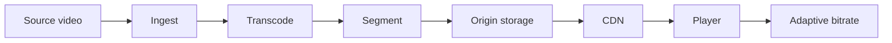

### Approaches and Trade-offs

| Protocol | Latency | Scale | Best For |
|---|---|---|---|
| HLS/DASH | Higher | Very high | VOD, large live broadcasts |
| LL-HLS | Low | High | Low-latency live |
| WebRTC | Sub-second | Harder | Calls, interactive live |
| RTMP | Low-medium | Ingest focused | Streamer to platform |

### Simple Explanation

Streaming is hard because video is huge, timing is strict, and networks are unstable.

The standard delivery model is transcode into multiple bitrates, split into segments, serve via CDN, and let the player switch quality using adaptive bitrate.

### How to Choose

- Start with the simplest approach that satisfies correctness.
- Move to the advanced approach only when the bottleneck is clear.
- Always mention trade-offs: latency, consistency, cost, complexity, and operations.
- In interviews, explain the failure mode and how your pattern prevents it.

### Small Java Reference

```java
import java.util.*;

class AdaptiveBitrateSelector {
    private final List<Integer> bitratesKbps = List.of(300, 800, 1500, 3000, 6000);

    public int selectBitrate(int measuredBandwidthKbps) {
        int safeBandwidth = (int) (measuredBandwidthKbps * 0.8);
        int selected = bitratesKbps.get(0);

        for (int bitrate : bitratesKbps) {
            if (bitrate <= safeBandwidth) selected = bitrate;
        }
        return selected;
    }
}
```

---

## Geospatial Systems

**Category:** Storage and Media  

**Best mental model:** Use for nearest drivers, restaurants nearby, maps, delivery, dating, real-estate search.

### Visual Diagram

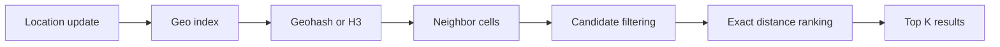

### Approaches and Trade-offs

| Approach | Best For | Tradeoff |
|---|---|---|
| Lat/Lon scan | Tiny datasets | Does not scale |
| Geohash | Simple proximity search | Edge-neighbor problem |
| H3 | Heatmaps, zones, matching | More complex |
| PostGIS | Rich geo queries | DB scaling limits |
| Redis Geo | Realtime nearby lookup | Memory and durability tradeoff |

### Simple Explanation

Location is two-dimensional, so normal indexes are not enough for nearest-neighbor queries.

A common approach is to map coordinates into cells using Geohash or H3, query nearby cells, then run exact distance calculation only on candidates.

### How to Choose

- Start with the simplest approach that satisfies correctness.
- Move to the advanced approach only when the bottleneck is clear.
- Always mention trade-offs: latency, consistency, cost, complexity, and operations.
- In interviews, explain the failure mode and how your pattern prevents it.

### Small Java Reference

```java
class Location {
    final double lat;
    final double lon;

    Location(double lat, double lon) {
        this.lat = lat;
        this.lon = lon;
    }

    public double distanceKm(Location other) {
        double r = 6371.0;
        double dLat = Math.toRadians(other.lat - lat);
        double dLon = Math.toRadians(other.lon - lon);
        double a = Math.sin(dLat / 2) * Math.sin(dLat / 2)
                + Math.cos(Math.toRadians(lat)) * Math.cos(Math.toRadians(other.lat))
                * Math.sin(dLon / 2) * Math.sin(dLon / 2);
        return 2 * r * Math.asin(Math.sqrt(a));
    }
}
```

---

## Unique ID Generation

**Category:** Identifiers and Counters  

**Best mental model:** Use when many services must create unique IDs without collisions.

### Visual Diagram

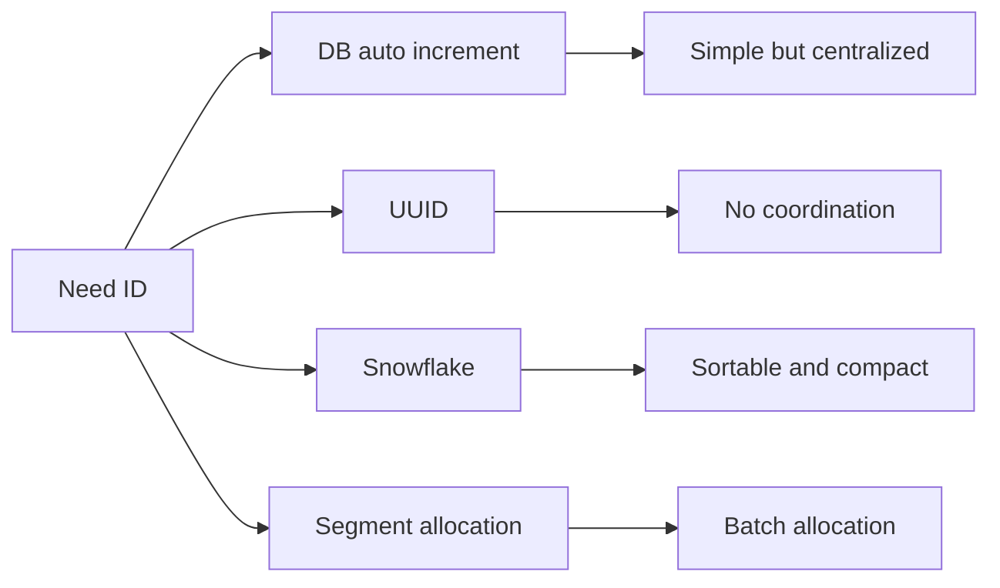

### Approaches and Trade-offs

| Approach | Pros | Cons | Best For |
|---|---|---|---|
| DB Auto Increment | Simple, ordered | Central bottleneck | Small systems |
| UUID | No coordination | Large, random index cost | Distributed systems |
| Snowflake | 64-bit, sortable | Clock and machine ID issues | Feeds/logs/events |
| Range Allocation | Fewer DB calls | Range waste possible | High throughput services |

### Simple Explanation

ID generation is a tradeoff between uniqueness, sortability, compactness, predictability, and coordination.

Snowflake-style IDs are popular because each machine can generate sortable 64-bit IDs independently using timestamp, machine ID, and sequence.

### How to Choose

- Start with the simplest approach that satisfies correctness.
- Move to the advanced approach only when the bottleneck is clear.
- Always mention trade-offs: latency, consistency, cost, complexity, and operations.
- In interviews, explain the failure mode and how your pattern prevents it.

### Small Java Reference

```java
class SnowflakeIdGenerator {
    private final long epoch = 1700000000000L;
    private final long machineId;
    private long lastMillis = -1;
    private long sequence = 0;

    SnowflakeIdGenerator(long machineId) {
        if (machineId < 0 || machineId > 1023) throw new IllegalArgumentException("machineId 0..1023");
        this.machineId = machineId;
    }

    public synchronized long nextId() {
        long now = System.currentTimeMillis();
        if (now == lastMillis) {
            sequence = (sequence + 1) & 4095;
            if (sequence == 0) while (System.currentTimeMillis() <= now) {}
        } else {
            sequence = 0;
        }
        lastMillis = System.currentTimeMillis();
        return ((lastMillis - epoch) << 22) | (machineId << 12) | sequence;
    }
}
```

---

## Distributed Counting

**Category:** Identifiers and Counters  

**Best mental model:** Use for likes, views, unique users, rate counters, metrics, and heavy hitters.

### Visual Diagram

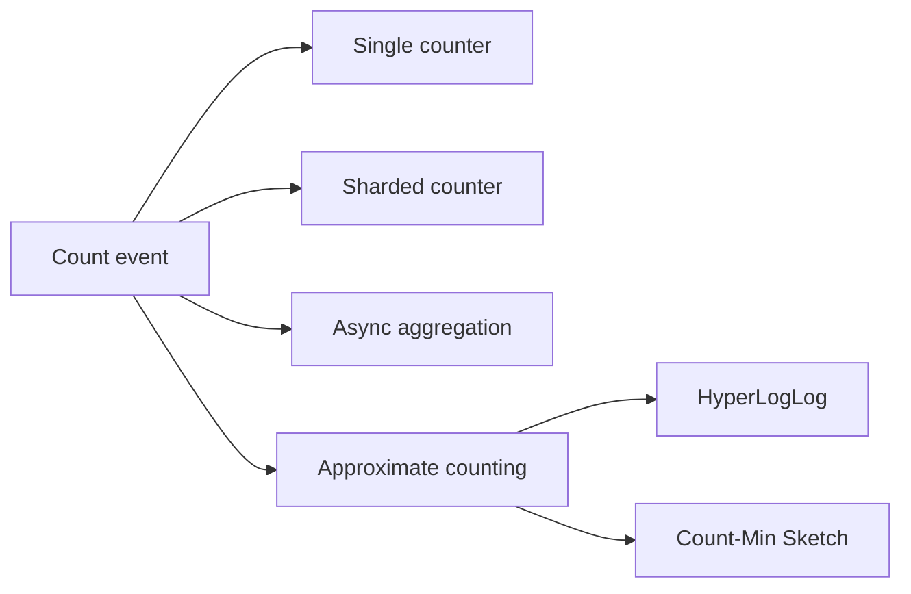

### Approaches and Trade-offs

| Approach | Accuracy | Freshness | Best For |
|---|---|---|---|
| Single Counter | Exact | Realtime | Small/medium |
| Sharded Counter | Exact | Near realtime | Hot counters |
| Async Aggregation | Exact delayed | Seconds | Very high scale |
| HyperLogLog | Approx unique | Realtime | Unique visitors |
| Count-Min Sketch | Approx | Realtime | Heavy hitters |

### Simple Explanation

Counting breaks at scale because many writers update the same logical value.

Start with atomic single counters. Move to sharded counters for hot keys. Use async aggregation when a few seconds of delay is acceptable. Use approximate structures when exactness is not required.

### How to Choose

- Start with the simplest approach that satisfies correctness.
- Move to the advanced approach only when the bottleneck is clear.
- Always mention trade-offs: latency, consistency, cost, complexity, and operations.
- In interviews, explain the failure mode and how your pattern prevents it.

### Small Java Reference

```java
import java.util.*;
import java.util.concurrent.atomic.AtomicLong;

class DistributedCounter {
    private final List<AtomicLong> shards = new ArrayList<>();
    private final Random random = new Random();

    DistributedCounter(int shardCount) {
        for (int i = 0; i < shardCount; i++) shards.add(new AtomicLong());
    }

    public void increment() {
        shards.get(random.nextInt(shards.size())).incrementAndGet();
    }

    public long value() {
        long total = 0;
        for (AtomicLong shard : shards) total += shard.get();
        return total;
    }
}
```

---

## Leader Election

**Category:** Coordination and Failure  

**Best mental model:** Use when exactly one node should coordinate writes, scheduling, partition ownership, or cluster decisions.

### Visual Diagram

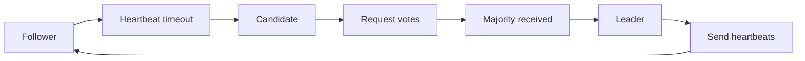

### Approaches and Trade-offs

| Approach | Idea | Best For | Concern |
|---|---|---|---|
| Bully | Highest ID wins | Teaching/simple clusters | Weak under partitions |
| Ring | Election circulates ring | Controlled networks | Slow/failure handling |
| Raft | Majority vote per term | Production consensus | More complex |
| ZooKeeper/etcd | External coordinator | Practical systems | Dependency |

### Simple Explanation

Leader election must provide safety and liveness: at most one leader at a time, and eventually a new leader after failure.

The main danger is split-brain, where two nodes think they are leader. Quorum-based systems like Raft prevent this by requiring majority votes.

### How to Choose

- Start with the simplest approach that satisfies correctness.
- Move to the advanced approach only when the bottleneck is clear.
- Always mention trade-offs: latency, consistency, cost, complexity, and operations.
- In interviews, explain the failure mode and how your pattern prevents it.

### Small Java Reference

```java
enum NodeRole { FOLLOWER, CANDIDATE, LEADER }

class RaftNode {
    private final int nodeId;
    private int currentTerm = 0;
    private NodeRole role = NodeRole.FOLLOWER;
    private int votes = 0;

    RaftNode(int nodeId) {
        this.nodeId = nodeId;
    }

    public void onHeartbeatTimeout() {
        role = NodeRole.CANDIDATE;
        currentTerm++;
        votes = 1;
    }

    public void receiveVote(int clusterSize) {
        votes++;
        if (votes > clusterSize / 2) role = NodeRole.LEADER;
    }

    public NodeRole getRole() { return role; }
}
```

---

## Failure Detection and Heartbeats

**Category:** Coordination and Failure  

**Best mental model:** Use for failover, cluster membership, load balancer health, worker monitoring, and service readiness.

### Visual Diagram

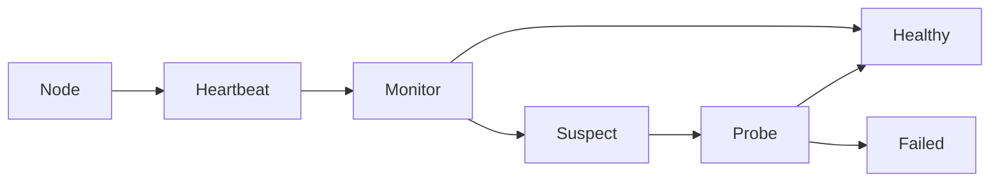

### Approaches and Trade-offs

| Technique | How It Works | Tradeoff |
|---|---|---|
| Fixed Timeout | Miss heartbeat for N seconds | Simple but false positives |
| Adaptive Timeout | Timeout changes with latency | More complex |
| Phi Accrual | Suspicion score | Good for variable networks |
| Gossip/SWIM | Peers probe peers | Scales better |

### Simple Explanation

No response does not prove a node is dead; it only means unknown. Practical systems mark nodes as suspected before failed.

Timeout tuning is the key tradeoff: shorter timeout gives faster failover but more false positives.

### How to Choose

- Start with the simplest approach that satisfies correctness.
- Move to the advanced approach only when the bottleneck is clear.
- Always mention trade-offs: latency, consistency, cost, complexity, and operations.
- In interviews, explain the failure mode and how your pattern prevents it.

### Small Java Reference

```java
import java.util.*;

enum HealthState { HEALTHY, SUSPECT, FAILED }

class HeartbeatMonitor {
    private final Map<String, Long> lastSeen = new HashMap<>();
    private final long timeoutMs;

    HeartbeatMonitor(long timeoutMs) {
        this.timeoutMs = timeoutMs;
    }

    public void heartbeat(String nodeId) {
        lastSeen.put(nodeId, System.currentTimeMillis());
    }

    public HealthState status(String nodeId) {
        long age = System.currentTimeMillis() - lastSeen.getOrDefault(nodeId, 0L);
        if (age > timeoutMs * 2) return HealthState.FAILED;
        if (age > timeoutMs) return HealthState.SUSPECT;
        return HealthState.HEALTHY;
    }
}
```

---

## Resilient Systems and Failure Handling

**Category:** Coordination and Failure  

**Best mental model:** Use to prevent small dependency failures from becoming full system outages.

### Visual Diagram

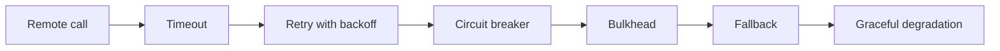

### Approaches and Trade-offs

| Pattern | Purpose | Mistake to Avoid |
|---|---|---|
| Timeout | Never wait forever | Timeout too high |
| Retry | Recover transient failure | Retry storm |
| Circuit Breaker | Fail fast after repeated failures | No fallback |
| Bulkhead | Isolate resources | Shared thread pool for all |
| Fallback | Return degraded result | Hiding critical failures |
| Idempotency | Safe retries | Duplicate side effects |

### Simple Explanation

Resilience is layered. A remote call should not wait forever, retry blindly, or consume all shared resources.

The standard chain is timeout, retry with backoff and jitter, circuit breaker, bulkhead isolation, fallback, and idempotency for side-effecting operations.

### How to Choose

- Start with the simplest approach that satisfies correctness.
- Move to the advanced approach only when the bottleneck is clear.
- Always mention trade-offs: latency, consistency, cost, complexity, and operations.
- In interviews, explain the failure mode and how your pattern prevents it.

### Small Java Reference

```java
class SimpleCircuitBreaker {
    private int failures = 0;
    private final int threshold;
    private boolean open = false;

    SimpleCircuitBreaker(int threshold) {
        this.threshold = threshold;
    }

    public String call(ExternalService service) {
        if (open) return "fallback";

        try {
            String result = service.call();
            failures = 0;
            return result;
        } catch (Exception ex) {
            failures++;
            if (failures >= threshold) open = true;
            return "fallback";
        }
    }
}

interface ExternalService {
    String call();
}
```

---

## Distributed Transactions

**Category:** Coordination and Failure  

**Best mental model:** Use when a business workflow spans multiple services or databases: order, inventory, payment, shipping.

### Visual Diagram

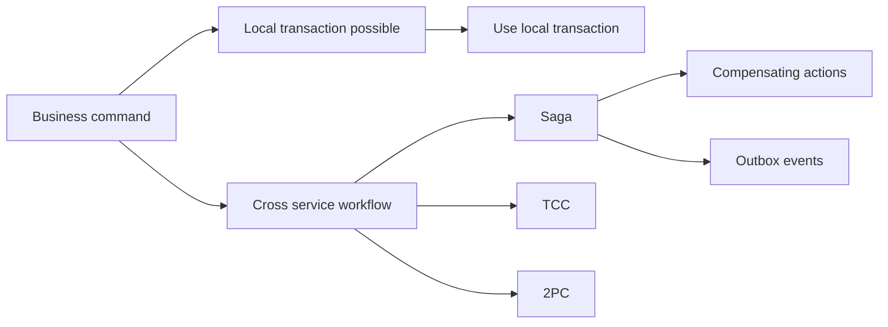

### Approaches and Trade-offs

| Approach | Consistency | Availability | Best For |
|---|---|---|---|
| Local Transaction | Strong | High | Same DB/bounded context |
| 2PC | Strong | Lower | Rare critical consistency |
| Saga | Eventual | High | Business workflows |
| TCC | Strong-ish reservation | Medium | Inventory/reservation |
| Outbox | Reliable event publish | High | DB + message broker |

### Simple Explanation

The best distributed transaction is the one you avoid. First ask if data can live in one bounded context.

If not, use Saga for long business workflows, Outbox for reliable event publishing, and TCC when you need reservation-style try-confirm-cancel.

### How to Choose

- Start with the simplest approach that satisfies correctness.
- Move to the advanced approach only when the bottleneck is clear.
- Always mention trade-offs: latency, consistency, cost, complexity, and operations.
- In interviews, explain the failure mode and how your pattern prevents it.

### Small Java Reference

```java
class OrderSaga {
    private final InventoryClient inventory;
    private final PaymentClient payment;

    OrderSaga(InventoryClient inventory, PaymentClient payment) {
        this.inventory = inventory;
        this.payment = payment;
    }

    public void createOrder(String orderId, String sku, double amount) {
        boolean reserved = false;
        boolean charged = false;

        try {
            inventory.reserve(sku);
            reserved = true;

            payment.charge(orderId, amount);
            charged = true;

            System.out.println("Order confirmed: " + orderId);
        } catch (Exception ex) {
            if (charged) payment.refund(orderId);
            if (reserved) inventory.release(sku);
            System.out.println("Order cancelled: " + orderId);
        }
    }
}

interface InventoryClient {
    void reserve(String sku);
    void release(String sku);
}

interface PaymentClient {
    void charge(String orderId, double amount);
    void refund(String orderId);
}
```

---

## Single Point of Failure

**Category:** Coordination and Failure  

**Best mental model:** Use when checking if one failing component can bring down the whole system.

### Visual Diagram

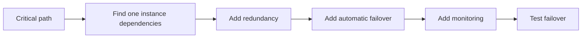

### Approaches and Trade-offs

| Layer | Typical SPOF | Fix |
|---|---|---|
| DNS | One provider | Multiple DNS providers |
| Load Balancer | Single LB | Managed/redundant LB |
| Application | One instance | Multiple stateless instances |
| Cache | Single Redis | Redis Cluster/Sentinel |
| Database | Single primary only | Replicas and failover |
| Queue | Single broker | Cluster and replication |
| People | One expert | Runbooks and cross-training |

### Simple Explanation

A SPOF is anything that can stop the system if it fails.

Do the what-if-this-fails exercise for every critical component. Add redundancy, automatic failover, health checks, monitoring, runbooks, and chaos tests.

### How to Choose

- Start with the simplest approach that satisfies correctness.
- Move to the advanced approach only when the bottleneck is clear.
- Always mention trade-offs: latency, consistency, cost, complexity, and operations.
- In interviews, explain the failure mode and how your pattern prevents it.

### Small Java Reference

```java
import java.util.*;

class HealthBasedRouter {
    private final List<ServiceInstance> instances;

    HealthBasedRouter(List<ServiceInstance> instances) {
        this.instances = instances;
    }

    public ServiceInstance chooseHealthy() {
        return instances.stream()
                .filter(ServiceInstance::healthy)
                .findFirst()
                .orElseThrow(() -> new IllegalStateException("No healthy instances"));
    }
}

record ServiceInstance(String id, boolean healthy) {}
```

---

## Final Interview Shortcut

```text
Read-heavy -> Cache/CDN/Replicas
Write-heavy -> Batch/Queue/Shard
Realtime -> SSE/WebSocket
Fanout -> Push/Pull/Hybrid
Hot key -> Detect/Cache/Replicate/Split/Protect
Spikes -> Pre-warm/Queue/Rate-limit/Shed
Large files -> Chunk/Resume/Pre-signed URL
Streaming -> Transcode/Segment/CDN/ABR
Geo -> Cell index + exact distance
IDs -> UUID/Snowflake
Counting -> Single/Sharded/Async/Approx
Coordination -> Leader election + heartbeats
Resilience -> Timeout/Retry/Circuit breaker/Bulkhead/Fallback
Transactions -> Avoid if possible, else Saga/Outbox/TCC
SPOF -> Redundancy + failover + testing
```

## Source Notes Used

1. `001_Real_time_updates.md`
2. `002_Fanout_system.md`
3. `003_high_read_traffic_system_design.md`
4. `004_high_write_traffic_last_minute.md`
5. `005_hot_keys_system_design_last_minute_notes.md`
6. `006_traffic_spikes_system_design_last_minute_notes.md`
7. `007_large_file_handling_system_design_last_minute_notes.md`
8. `008_media_streaming_system_design_last_minute_notes.md`
9. `009_geospatial_system_design_last_minute_notes.md`
10. `010_unique_id_generation_system_design_last_minute_notes.md`
11. `011_distributed_counting_system_design_reference.md`
12. `012_leader_election_system_design_reference.md`
13. `013_failure_detection_heartbeats_system_design_reference.md`
14. `014_resilient_systems_failure_handling.md`
15. `015_distributed_transactions_complete_reference.md`
16. `016_spof_complete_guide.md`