# Spring Boot + Docker + Kubernetes DIY Production Guide

A beginner-to-advanced hands-on guide for building, containerizing, deploying, scaling, securing, and observing a Spring Boot application on Kubernetes.

> **Example project:** `order-service` — a REST API that creates and reads orders, connects to PostgreSQL, exposes health checks, exports Prometheus metrics, and runs safely in Kubernetes.

---

## Table of Contents

1. [Big Picture Architecture](#1-big-picture-architecture)
2. [Prerequisites](#2-prerequisites)
3. [Create the Spring Boot App](#3-create-the-spring-boot-app)
4. [Build the REST API](#4-build-the-rest-api)
5. [Add Production Spring Boot Configuration](#5-add-production-spring-boot-configuration)
6. [Add Health Checks and Metrics](#6-add-health-checks-and-metrics)
7. [Build and Run Locally](#7-build-and-run-locally)
8. [Dockerize the Application](#8-dockerize-the-application)
9. [Create a Production Dockerfile](#9-create-a-production-dockerfile)
10. [Understand Docker Layers](#10-understand-docker-layers)
11. [Push Image to a Registry](#11-push-image-to-a-registry)
12. [Kubernetes Core Concepts](#12-kubernetes-core-concepts)
13. [Create Kubernetes Namespace](#13-create-kubernetes-namespace)
14. [Create ConfigMap](#14-create-configmap)
15. [Create Secret](#15-create-secret)
16. [Create Deployment](#16-create-deployment)
17. [Create Service](#17-create-service)
18. [Create Ingress](#18-create-ingress)
19. [Deploy to Kubernetes](#19-deploy-to-kubernetes)
20. [Production Scaling](#20-production-scaling)
21. [JVM and Container Memory Tuning](#21-jvm-and-container-memory-tuning)
22. [Horizontal Pod Autoscaler](#22-horizontal-pod-autoscaler)
23. [PodDisruptionBudget](#23-poddisruptionbudget)
24. [Topology Spread](#24-topology-spread)
25. [Database Production Setup](#25-database-production-setup)
26. [Observability](#26-observability)
27. [Logging](#27-logging)
28. [Tracing](#28-tracing)
29. [Security Hardening](#29-security-hardening)
30. [NetworkPolicy](#30-networkpolicy)
31. [RBAC](#31-rbac)
32. [CI/CD Pipeline](#32-cicd-pipeline)
33. [GitOps Deployment](#33-gitops-deployment)
34. [Advanced Deployment Strategies](#34-advanced-deployment-strategies)
35. [Production Checklist](#35-production-checklist)
36. [Troubleshooting Guide](#36-troubleshooting-guide)

---

# 1. Big Picture Architecture

Before writing code, understand the full path from source code to production traffic.

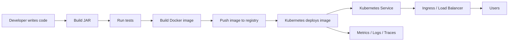

## What each layer does

| Layer | Purpose | Example |
|---|---|---|
| Spring Boot | Runs business logic and HTTP API | Order API |
| Docker | Packages app and runtime into one image | `order-service:1.0.0` |
| Registry | Stores images | GHCR, Docker Hub, ECR, GCR, ACR |
| Kubernetes | Runs containers reliably | Deployment, Service, Ingress |
| Observability | Shows app behavior | Prometheus, Grafana, logs, traces |
| Security | Reduces attack surface | RBAC, NetworkPolicy, non-root containers |
| CI/CD | Automates build and release | GitHub Actions, GitLab CI, Argo CD |

---

# 2. Prerequisites

Install these tools:

| Tool | Why needed |
|---|---|
| Java 21 | Runs modern Spring Boot apps. |
| Maven | Builds and tests the project. |
| Docker | Builds and runs container images. |
| kubectl | Talks to Kubernetes. |
| Kubernetes cluster | Runs the production-like deployment. |
| Helm | Optional but useful for installing platform tools. |
| PostgreSQL | Database for the example app. |

Check versions:

```bash
java -version
mvn -version
docker version
kubectl version --client
```

For local Kubernetes, use one of:

```bash
minikube start
# or
kind create cluster
# or
k3d cluster create demo
```

---

# 3. Create the Spring Boot App

## Step 3.1: Create project

Use Spring Initializr or your IDE.

Recommended dependencies:

- Spring Web
- Spring Boot Actuator
- Validation
- Spring Data JPA
- PostgreSQL Driver
- Micrometer Prometheus Registry
- Spring Security, for real public APIs
- Testcontainers, for integration tests

## Step 3.2: Maven configuration

Create `pom.xml`:

```xml
<project>
  <modelVersion>4.0.0</modelVersion>

  <parent>
    <groupId>org.springframework.boot</groupId>
    <artifactId>spring-boot-starter-parent</artifactId>
    <version>3.4.5</version>
    <relativePath/>
  </parent>

  <groupId>com.example</groupId>
  <artifactId>order-service</artifactId>
  <version>1.0.0</version>

  <properties>
    <java.version>21</java.version>
  </properties>

  <dependencies>
    <dependency>
      <groupId>org.springframework.boot</groupId>
      <artifactId>spring-boot-starter-web</artifactId>
    </dependency>

    <dependency>
      <groupId>org.springframework.boot</groupId>
      <artifactId>spring-boot-starter-actuator</artifactId>
    </dependency>

    <dependency>
      <groupId>org.springframework.boot</groupId>
      <artifactId>spring-boot-starter-validation</artifactId>
    </dependency>

    <dependency>
      <groupId>org.springframework.boot</groupId>
      <artifactId>spring-boot-starter-data-jpa</artifactId>
    </dependency>

    <dependency>
      <groupId>org.postgresql</groupId>
      <artifactId>postgresql</artifactId>
      <scope>runtime</scope>
    </dependency>

    <dependency>
      <groupId>io.micrometer</groupId>
      <artifactId>micrometer-registry-prometheus</artifactId>
    </dependency>

    <dependency>
      <groupId>org.springframework.boot</groupId>
      <artifactId>spring-boot-starter-test</artifactId>
      <scope>test</scope>
    </dependency>
  </dependencies>

  <build>
    <plugins>
      <plugin>
        <groupId>org.springframework.boot</groupId>
        <artifactId>spring-boot-maven-plugin</artifactId>
      </plugin>
    </plugins>
  </build>
</project>
```

## Why each setting is needed

| Setting | Explanation |
|---|---|
| `spring-boot-starter-parent` | Provides dependency management and plugin defaults. |
| `java.version=21` | Uses Java 21 LTS for modern production deployments. |
| `spring-boot-starter-web` | Adds REST API support and embedded server. |
| `spring-boot-starter-actuator` | Adds health, readiness, metrics, and operational endpoints. |
| `spring-boot-starter-validation` | Enables request validation. |
| `spring-boot-starter-data-jpa` | Adds ORM/database abstraction. |
| `postgresql` | Allows the app to connect to PostgreSQL. |
| `micrometer-registry-prometheus` | Exposes metrics in Prometheus format. |
| `spring-boot-maven-plugin` | Builds executable Spring Boot JARs. |

---

# 4. Build the REST API

Create `src/main/java/com/example/orders/OrderController.java`:

```java
package com.example.orders;

import jakarta.validation.Valid;
import jakarta.validation.constraints.DecimalMin;
import jakarta.validation.constraints.NotBlank;
import org.springframework.http.HttpStatus;
import org.springframework.web.bind.annotation.*;

import java.math.BigDecimal;
import java.time.Instant;
import java.util.Map;
import java.util.UUID;

@RestController
@RequestMapping("/api/orders")
public class OrderController {

    @PostMapping
    @ResponseStatus(HttpStatus.CREATED)
    public Map<String, Object> create(@Valid @RequestBody CreateOrderRequest request) {
        String id = UUID.randomUUID().toString();

        return Map.of(
            "id", id,
            "customerId", request.customerId(),
            "amount", request.amount(),
            "status", "CREATED",
            "createdAt", Instant.now().toString()
        );
    }

    @GetMapping("/{id}")
    public Map<String, Object> get(@PathVariable String id) {
        return Map.of(
            "id", id,
            "status", "CREATED"
        );
    }
}

record CreateOrderRequest(
    @NotBlank String customerId,
    @DecimalMin("0.01") BigDecimal amount
) {}
```

## Explanation

| Code | Why needed |
|---|---|
| `@RestController` | Makes the class a JSON REST controller. |
| `@RequestMapping("/api/orders")` | Defines the base URL. |
| `@PostMapping` | Handles order creation. |
| `@GetMapping` | Handles order lookup. |
| `@Valid` | Triggers validation annotations. |
| `@RequestBody` | Converts JSON request body into Java object. |
| `@PathVariable` | Reads URL path parameters. |
| `record CreateOrderRequest` | Simple immutable DTO. |
| `@NotBlank` | Prevents empty customer IDs. |
| `@DecimalMin("0.01")` | Prevents zero or negative orders. |

---

# 5. Add Production Spring Boot Configuration

Create `src/main/resources/application.yml`:

```yaml
server:
  port: 8080
  shutdown: graceful

spring:
  application:
    name: order-service
  lifecycle:
    timeout-per-shutdown-phase: 30s
  datasource:
    url: ${DATABASE_URL:jdbc:postgresql://localhost:5432/orders}
    username: ${DATABASE_USERNAME:orders}
    password: ${DATABASE_PASSWORD:orders}
    hikari:
      maximum-pool-size: ${DB_POOL_MAX:20}
      minimum-idle: ${DB_POOL_MIN_IDLE:5}
      connection-timeout: 3000
      validation-timeout: 1000
      idle-timeout: 600000
      max-lifetime: 1800000
  jpa:
    open-in-view: false
    hibernate:
      ddl-auto: validate
    properties:
      hibernate:
        jdbc:
          time_zone: UTC

management:
  server:
    port: 8081
  endpoints:
    web:
      exposure:
        include: health,info,prometheus,metrics
  endpoint:
    health:
      probes:
        enabled: true
      show-details: never
  metrics:
    tags:
      application: ${spring.application.name}

logging:
  level:
    root: INFO
    com.example.orders: INFO
```

## Detailed explanation

| Setting | Why needed |
|---|---|
| `server.port: 8080` | Main application traffic port. |
| `server.shutdown: graceful` | Allows in-flight requests to complete during shutdown. |
| `timeout-per-shutdown-phase: 30s` | Gives Spring beans time to stop cleanly. |
| `spring.application.name` | Adds service name to logs, metrics, traces. |
| `${DATABASE_URL:...}` | Uses environment variable in production and default locally. |
| `hikari.maximum-pool-size` | Limits database connections per pod. |
| `hikari.minimum-idle` | Keeps warm connections ready. |
| `connection-timeout` | Fails fast when DB is unavailable. |
| `validation-timeout` | Limits time spent validating DB connections. |
| `idle-timeout` | Closes unused DB connections. |
| `max-lifetime` | Recycles connections before network/database closes them. |
| `open-in-view: false` | Avoids lazy database calls while rendering HTTP responses. |
| `ddl-auto: validate` | App validates schema but does not modify production schema. |
| `time_zone: UTC` | Makes timestamps consistent across regions. |
| `management.server.port: 8081` | Separates operational endpoints from user-facing API. |
| `health.probes.enabled` | Enables Kubernetes-ready health endpoints. |
| `show-details: never` | Avoids leaking internals from health endpoints. |
| `prometheus` | Exposes metrics for Prometheus scraping. |

---

# 6. Add Health Checks and Metrics

Spring Boot Actuator gives these endpoints:

| Endpoint | Purpose |
|---|---|
| `/actuator/health` | General health. |
| `/actuator/health/liveness` | Used by Kubernetes to know if app should be restarted. |
| `/actuator/health/readiness` | Used by Kubernetes to know if app can receive traffic. |
| `/actuator/prometheus` | Metrics endpoint for Prometheus. |
| `/actuator/metrics` | Lists metric names. |

## Important production rule

Do not put every dependency in the liveness check.

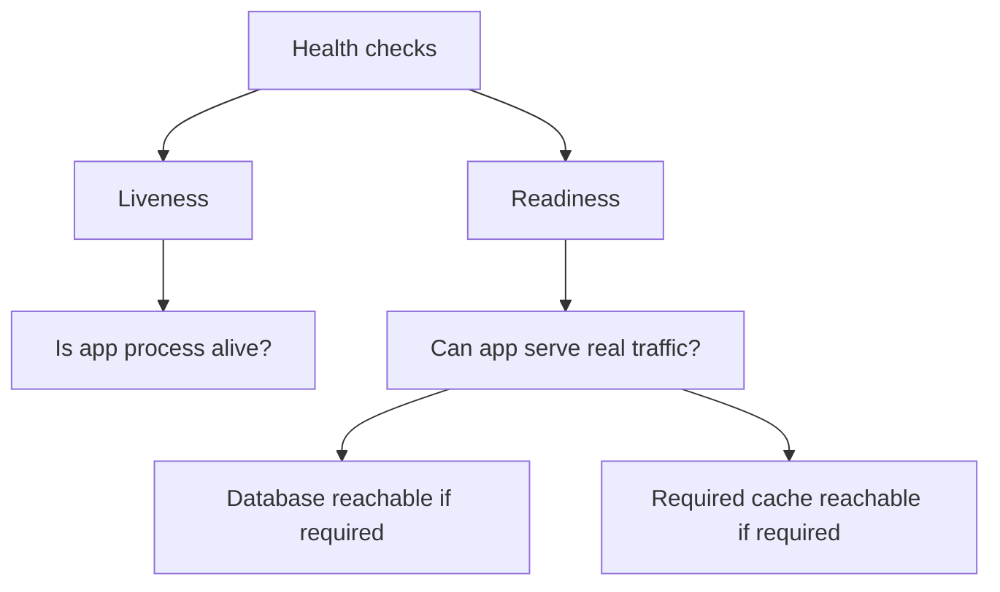

Use liveness for deadlocks and broken JVM state. Use readiness for traffic safety.

---

# 7. Build and Run Locally

## Step 7.1: Build

```bash
mvn clean test
mvn clean package
```

## Step 7.2: Run

```bash
java -jar target/order-service-1.0.0.jar
```

## Step 7.3: Test health

```bash
curl http://localhost:8081/actuator/health
```

## Step 7.4: Test API

```bash
curl -X POST http://localhost:8080/api/orders \
  -H 'Content-Type: application/json' \
  -d '{"customerId":"c-1","amount":100}'
```

## Why this step matters

Never containerize an app until it works locally. Docker and Kubernetes add complexity. First confirm the application itself is healthy.

---

# 8. Dockerize the Application

## Simple Dockerfile

Create `Dockerfile`:

```dockerfile
FROM eclipse-temurin:21-jre
WORKDIR /app
COPY target/order-service-1.0.0.jar app.jar
EXPOSE 8080 8081
ENTRYPOINT ["java", "-jar", "/app/app.jar"]
```

## Explanation

| Line | Why needed |
|---|---|
| `FROM eclipse-temurin:21-jre` | Uses Java runtime image. |
| `WORKDIR /app` | Sets container working directory. |
| `COPY ... app.jar` | Copies built app into image. |
| `EXPOSE 8080 8081` | Documents app and management ports. |
| `ENTRYPOINT` | Starts app when container runs. |

## Build image

```bash
mvn clean package
docker build -t order-service:1.0.0 .
```

## Run container

```bash
docker run --rm \
  -p 8080:8080 \
  -p 8081:8081 \
  order-service:1.0.0
```

---

# 9. Create a Production Dockerfile

The simple Dockerfile works, but production needs better security, caching, and smaller images.

```dockerfile
# syntax=docker/dockerfile:1.7

FROM eclipse-temurin:21-jdk AS builder
WORKDIR /workspace

COPY mvnw pom.xml ./
COPY .mvn .mvn
RUN ./mvnw -q -DskipTests dependency:go-offline

COPY src src
RUN ./mvnw -q -DskipTests package

FROM eclipse-temurin:21-jre AS runtime

RUN groupadd --system spring && useradd --system --gid spring spring

WORKDIR /app
COPY --from=builder /workspace/target/order-service-1.0.0.jar /app/app.jar

USER spring:spring

EXPOSE 8080 8081

ENV JAVA_OPTS="-XX:MaxRAMPercentage=75 -XX:InitialRAMPercentage=50 -XX:+ExitOnOutOfMemoryError"

ENTRYPOINT ["sh", "-c", "java $JAVA_OPTS -jar /app/app.jar"]
```

## Explanation

| Setting | Why needed |
|---|---|
| `builder` stage | Builds the app with JDK and Maven wrapper. |
| `runtime` stage | Final image contains only runtime pieces. |
| `dependency:go-offline` | Improves Docker cache reuse. |
| `groupadd/useradd` | Creates a non-root user. |
| `USER spring:spring` | Runs app as non-root. |
| `MaxRAMPercentage=75` | Prevents JVM heap from exceeding container memory. |
| `InitialRAMPercentage=50` | Starts with a practical initial heap size. |
| `ExitOnOutOfMemoryError` | Forces pod restart on unrecoverable memory failure. |

---

# 10. Understand Docker Layers

Spring Boot apps can use layered JARs. This makes rebuilds faster because dependencies change less often than source code.

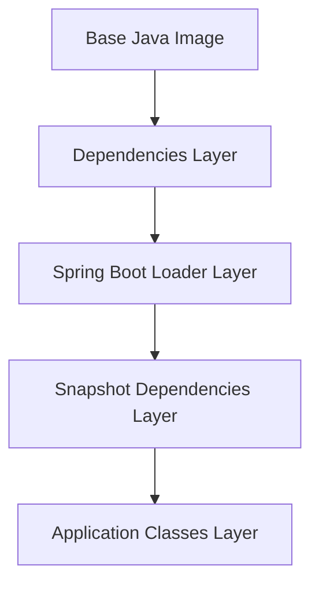

## Layered Dockerfile

```dockerfile
FROM eclipse-temurin:21-jdk AS builder
WORKDIR /workspace
COPY . .
RUN ./mvnw -q -DskipTests package
RUN java -Djarmode=tools -jar target/order-service-1.0.0.jar extract --layers --destination extracted

FROM eclipse-temurin:21-jre
RUN groupadd --system spring && useradd --system --gid spring spring
WORKDIR /app

COPY --from=builder /workspace/extracted/dependencies/ ./
COPY --from=builder /workspace/extracted/spring-boot-loader/ ./
COPY --from=builder /workspace/extracted/snapshot-dependencies/ ./
COPY --from=builder /workspace/extracted/application/ ./

USER spring:spring
EXPOSE 8080 8081
ENV JAVA_OPTS="-XX:MaxRAMPercentage=75 -XX:+ExitOnOutOfMemoryError"
ENTRYPOINT ["sh", "-c", "java $JAVA_OPTS org.springframework.boot.loader.launch.JarLauncher"]
```

---

# 11. Push Image to a Registry

## Build with registry name

```bash
docker build -t ghcr.io/acme/order-service:1.0.0 .
```

## Login

```bash
docker login ghcr.io
```

## Push

```bash
docker push ghcr.io/acme/order-service:1.0.0
```

## Image tagging strategy

| Tag | Example | Production use |
|---|---|---|
| Semantic version | `1.0.0` | Good for releases. |
| Git SHA | `git-a1b2c3d` | Best for traceability. |
| Environment tag | `staging` | Useful as moving pointer. |
| `latest` | `latest` | Avoid in production. |

---

# 12. Kubernetes Core Concepts

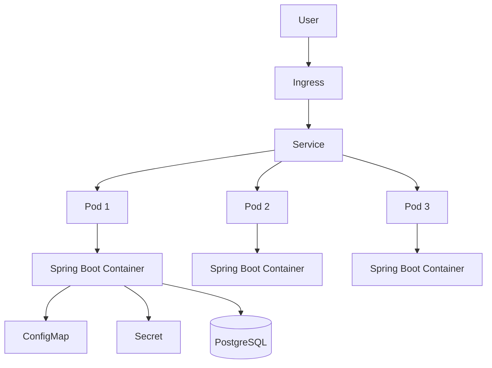

| Object | Purpose |
|---|---|
| Namespace | Logical grouping. |
| Pod | Runs containers. |
| Deployment | Manages replicas and rollouts. |
| Service | Stable internal network endpoint. |
| Ingress | External HTTP routing. |
| ConfigMap | Non-secret config. |
| Secret | Sensitive config. |
| HPA | Autoscaling. |
| PDB | Availability during maintenance. |
| NetworkPolicy | Network traffic rules. |

---

# 13. Create Kubernetes Namespace

Create `k8s/namespace.yaml`:

```yaml
apiVersion: v1
kind: Namespace
metadata:
  name: orders
```

## Why needed

Namespaces isolate resources. A common production pattern is:

```text
orders-dev
orders-staging
orders-prod
```

Apply:

```bash
kubectl apply -f k8s/namespace.yaml
```

---

# 14. Create ConfigMap

Create `k8s/configmap.yaml`:

```yaml
apiVersion: v1
kind: ConfigMap
metadata:
  name: order-service-config
  namespace: orders
data:
  SPRING_PROFILES_ACTIVE: prod
  DB_POOL_MAX: "30"
  DB_POOL_MIN_IDLE: "5"
```

## Explanation

| Setting | Why needed |
|---|---|
| `SPRING_PROFILES_ACTIVE` | Selects production Spring profile. |
| `DB_POOL_MAX` | Controls max DB connections per pod. |
| `DB_POOL_MIN_IDLE` | Keeps idle DB connections ready. |

Apply:

```bash
kubectl apply -f k8s/configmap.yaml
```

---

# 15. Create Secret

Create `k8s/secret.yaml`:

```yaml
apiVersion: v1
kind: Secret
metadata:
  name: order-service-secret
  namespace: orders
type: Opaque
stringData:
  DATABASE_URL: jdbc:postgresql://postgres.orders.svc.cluster.local:5432/orders
  DATABASE_USERNAME: orders_app
  DATABASE_PASSWORD: change-me
```

## Explanation

| Setting | Why needed |
|---|---|
| `DATABASE_URL` | Tells app where PostgreSQL is. |
| `DATABASE_USERNAME` | Database login user. |
| `DATABASE_PASSWORD` | Database login password. |
| `stringData` | Lets you write plain strings; Kubernetes encodes them. |

## Production warning

Kubernetes Secrets are not enough by themselves for serious production secret management. Prefer:

- External Secrets Operator
- Sealed Secrets
- HashiCorp Vault
- AWS Secrets Manager
- Google Secret Manager
- Azure Key Vault
- SOPS with GitOps

---

# 16. Create Deployment

Create `k8s/deployment.yaml`:

```yaml
apiVersion: apps/v1
kind: Deployment
metadata:
  name: order-service
  namespace: orders
  labels:
    app: order-service
spec:
  replicas: 3
  revisionHistoryLimit: 5
  strategy:
    type: RollingUpdate
    rollingUpdate:
      maxSurge: 1
      maxUnavailable: 0
  selector:
    matchLabels:
      app: order-service
  template:
    metadata:
      labels:
        app: order-service
    spec:
      terminationGracePeriodSeconds: 45
      securityContext:
        runAsNonRoot: true
        seccompProfile:
          type: RuntimeDefault
      containers:
        - name: order-service
          image: ghcr.io/acme/order-service:1.0.0
          imagePullPolicy: IfNotPresent
          ports:
            - name: http
              containerPort: 8080
            - name: management
              containerPort: 8081
          envFrom:
            - configMapRef:
                name: order-service-config
            - secretRef:
                name: order-service-secret
          resources:
            requests:
              cpu: "250m"
              memory: "512Mi"
            limits:
              cpu: "1000m"
              memory: "1Gi"
          startupProbe:
            httpGet:
              path: /actuator/health/liveness
              port: management
            failureThreshold: 30
            periodSeconds: 5
          readinessProbe:
            httpGet:
              path: /actuator/health/readiness
              port: management
            initialDelaySeconds: 10
            periodSeconds: 5
            timeoutSeconds: 2
            failureThreshold: 3
          livenessProbe:
            httpGet:
              path: /actuator/health/liveness
              port: management
            initialDelaySeconds: 30
            periodSeconds: 10
            timeoutSeconds: 2
            failureThreshold: 3
          securityContext:
            allowPrivilegeEscalation: false
            readOnlyRootFilesystem: true
            capabilities:
              drop:
                - ALL
```

## Detailed explanation

| Setting | Why needed |
|---|---|
| `replicas: 3` | Keeps app available if one pod fails. |
| `revisionHistoryLimit: 5` | Keeps rollback history. |
| `RollingUpdate` | Updates app gradually. |
| `maxSurge: 1` | Allows one extra pod during rollout. |
| `maxUnavailable: 0` | Keeps all current capacity available during rollout. |
| `selector.matchLabels` | Connects Deployment to its Pods. |
| `terminationGracePeriodSeconds` | Gives Spring Boot time to shut down gracefully. |
| `runAsNonRoot` | Prevents root execution. |
| `seccompProfile` | Uses safer default Linux syscall profile. |
| `image` | Container image to run. |
| `imagePullPolicy` | Controls image pull behavior. |
| `containerPort` | Documents ports exposed by container. |
| `envFrom.configMapRef` | Loads non-secret config. |
| `envFrom.secretRef` | Loads secret config. |
| `resources.requests.cpu` | CPU Kubernetes reserves for scheduling. |
| `resources.requests.memory` | Memory Kubernetes reserves for scheduling. |
| `resources.limits.cpu` | Max CPU burst allowed. |
| `resources.limits.memory` | Max memory before pod may be killed. |
| `startupProbe` | Protects slow-starting app from premature liveness failures. |
| `readinessProbe` | Controls whether pod receives traffic. |
| `livenessProbe` | Restarts unhealthy app. |
| `allowPrivilegeEscalation: false` | Blocks privilege escalation. |
| `readOnlyRootFilesystem: true` | Prevents writing to root filesystem. |
| `capabilities.drop: ALL` | Removes unnecessary Linux privileges. |

---

# 17. Create Service

Create `k8s/service.yaml`:

```yaml
apiVersion: v1
kind: Service
metadata:
  name: order-service
  namespace: orders
  labels:
    app: order-service
spec:
  type: ClusterIP
  selector:
    app: order-service
  ports:
    - name: http
      port: 80
      targetPort: http
    - name: management
      port: 8081
      targetPort: management
```

## Explanation

| Setting | Why needed |
|---|---|
| `ClusterIP` | Internal-only stable address. |
| `selector` | Finds pods with matching labels. |
| `port: 80` | Service port other apps use. |
| `targetPort: http` | Routes to container port named `http`. |
| `management` | Allows metrics and health scraping internally. |

---

# 18. Create Ingress

Create `k8s/ingress.yaml`:

```yaml
apiVersion: networking.k8s.io/v1
kind: Ingress
metadata:
  name: order-service
  namespace: orders
  annotations:
    nginx.ingress.kubernetes.io/proxy-read-timeout: "30"
    nginx.ingress.kubernetes.io/proxy-send-timeout: "30"
spec:
  ingressClassName: nginx
  rules:
    - host: orders.example.com
      http:
        paths:
          - path: /
            pathType: Prefix
            backend:
              service:
                name: order-service
                port:
                  name: http
  tls:
    - hosts:
        - orders.example.com
      secretName: order-service-tls
```

## Explanation

| Setting | Why needed |
|---|---|
| `ingressClassName` | Chooses ingress controller. |
| `host` | Public domain for the API. |
| `path: /` | Routes root and subpaths. |
| `pathType: Prefix` | Matches all paths under `/`. |
| `backend.service.name` | Sends traffic to the Service. |
| `tls.secretName` | Enables HTTPS. |
| timeout annotations | Prevents hanging connections. |

---

# 19. Deploy to Kubernetes

Apply all resources:

```bash
kubectl apply -f k8s/namespace.yaml
kubectl apply -f k8s/configmap.yaml
kubectl apply -f k8s/secret.yaml
kubectl apply -f k8s/deployment.yaml
kubectl apply -f k8s/service.yaml
kubectl apply -f k8s/ingress.yaml
```

Check status:

```bash
kubectl -n orders get pods
kubectl -n orders get deployment
kubectl -n orders get svc
kubectl -n orders get ingress
```

View logs:

```bash
kubectl -n orders logs -l app=order-service --tail=100
```

Debug pod:

```bash
kubectl -n orders describe pod -l app=order-service
```

Port-forward locally:

```bash
kubectl -n orders port-forward svc/order-service 8080:80
curl http://localhost:8080/api/orders/test-id
```

---

# 20. Production Scaling

Scaling requires three things:

1. Enough app replicas.
2. Enough database capacity.
3. Autoscaling rules that avoid overload.

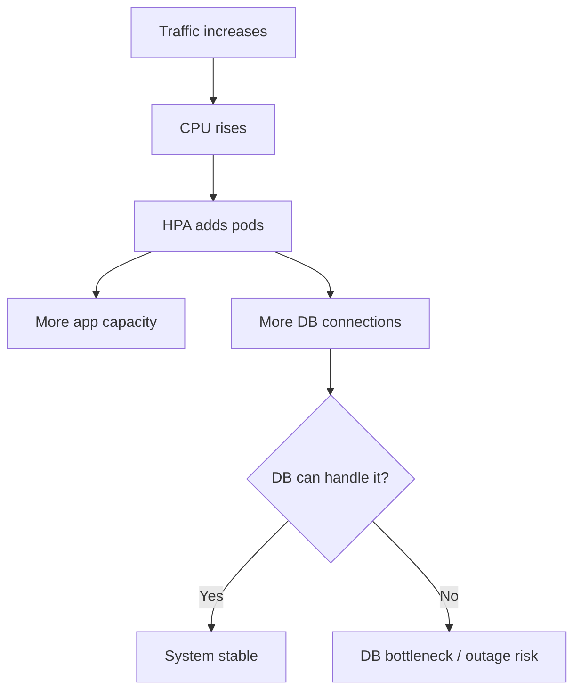

## Starting resource sizes

| Workload | CPU request | Memory request | CPU limit | Memory limit |
|---|---:|---:|---:|---:|
| Small API | 100m | 256Mi | 500m | 512Mi |
| Medium API | 250m | 512Mi | 1000m | 1Gi |
| Heavy API | 500m | 1Gi | 2000m | 2Gi |

## Why requests and limits matter

| Field | Meaning |
|---|---|
| CPU request | Minimum CPU reserved by scheduler. |
| Memory request | Minimum memory reserved by scheduler. |
| CPU limit | Max CPU the container can use. |
| Memory limit | Max memory before container can be killed. |

---

# 21. JVM and Container Memory Tuning

Recommended JVM config:

```yaml
env:
  - name: JAVA_OPTS
    value: >-
      -XX:MaxRAMPercentage=75
      -XX:InitialRAMPercentage=50
      -XX:+ExitOnOutOfMemoryError
      -XX:+UseG1GC
```

## Explanation

| Option | Why needed |
|---|---|
| `MaxRAMPercentage=75` | Keeps heap below container memory limit. |
| `InitialRAMPercentage=50` | Starts with a useful initial heap. |
| `ExitOnOutOfMemoryError` | Lets Kubernetes restart the pod after OOM. |
| `UseG1GC` | Good default GC for many services. |

Do not set JVM heap to 100% of container memory. The JVM also needs memory for:

- Metaspace
- Thread stacks
- Direct buffers
- Native memory
- Garbage collector structures

---

# 22. Horizontal Pod Autoscaler

Create `k8s/hpa.yaml`:

```yaml
apiVersion: autoscaling/v2
kind: HorizontalPodAutoscaler
metadata:
  name: order-service
  namespace: orders
spec:
  scaleTargetRef:
    apiVersion: apps/v1
    kind: Deployment
    name: order-service
  minReplicas: 3
  maxReplicas: 20
  metrics:
    - type: Resource
      resource:
        name: cpu
        target:
          type: Utilization
          averageUtilization: 70
  behavior:
    scaleUp:
      stabilizationWindowSeconds: 60
      policies:
        - type: Percent
          value: 100
          periodSeconds: 60
    scaleDown:
      stabilizationWindowSeconds: 300
      policies:
        - type: Percent
          value: 50
          periodSeconds: 60
```

Apply:

```bash
kubectl apply -f k8s/hpa.yaml
```

## Explanation

| Setting | Why needed |
|---|---|
| `minReplicas: 3` | Always keep baseline availability. |
| `maxReplicas: 20` | Prevent uncontrolled scaling. |
| `averageUtilization: 70` | Scale when CPU is high. |
| `scaleUp.stabilizationWindowSeconds` | Smooths scale-up decisions. |
| `scaleDown.stabilizationWindowSeconds` | Prevents quick scale down after spikes. |
| `value: 100` scale up | Allows pods to double per minute. |
| `value: 50` scale down | Reduces capacity gradually. |

## Example scaling charts

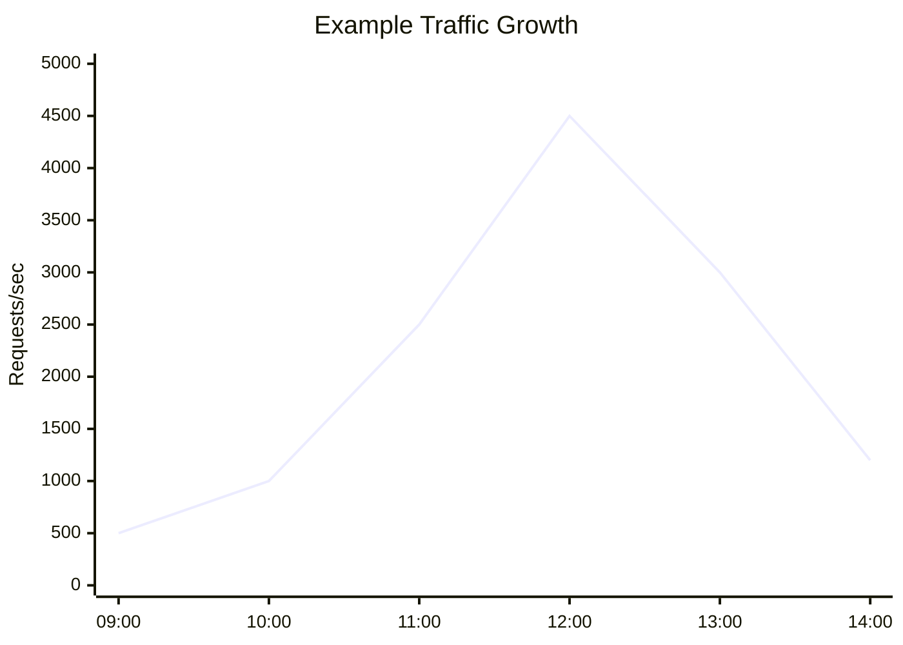

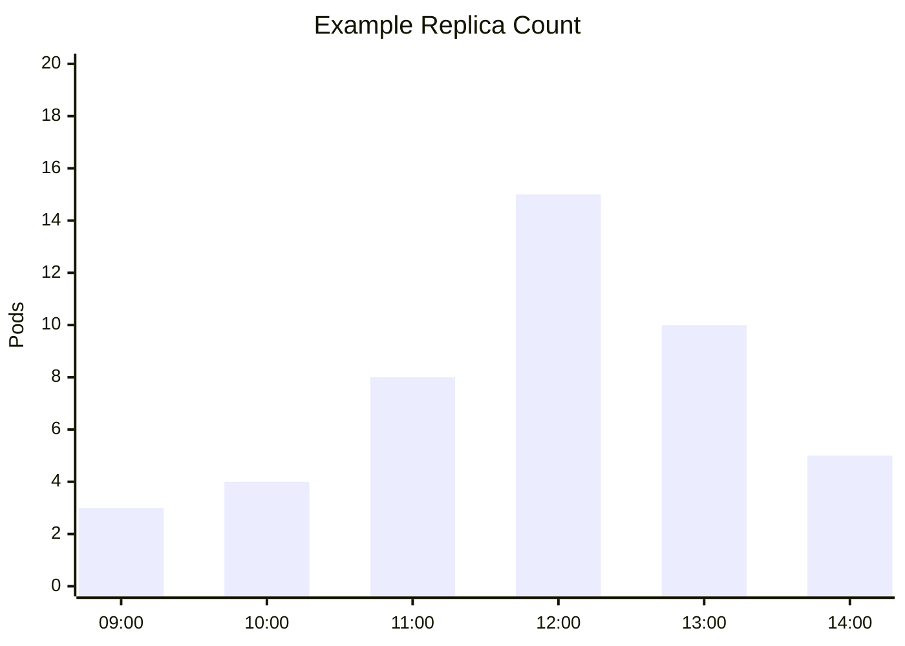

---

# 23. PodDisruptionBudget

Create `k8s/pdb.yaml`:

```yaml
apiVersion: policy/v1
kind: PodDisruptionBudget
metadata:
  name: order-service
  namespace: orders
spec:
  minAvailable: 2
  selector:
    matchLabels:
      app: order-service
```

## Why needed

A PDB protects the app during voluntary disruptions such as:

- Node upgrades
- Cluster maintenance
- Node drains
- Autoscaler node removal

If you run 3 replicas, `minAvailable: 2` means Kubernetes should not voluntarily evict pods if fewer than 2 would remain available.

---

# 24. Topology Spread

Add this under `spec.template.spec` in the Deployment:

```yaml
topologySpreadConstraints:
  - maxSkew: 1
    topologyKey: kubernetes.io/hostname
    whenUnsatisfiable: ScheduleAnyway
    labelSelector:
      matchLabels:
        app: order-service
```

## Explanation

| Setting | Why needed |
|---|---|
| `maxSkew: 1` | Keeps pods evenly distributed. |
| `topologyKey` | Spreads across nodes. |
| `ScheduleAnyway` | Prefer spreading but do not block scheduling forever. |
| `labelSelector` | Applies rule to this app only. |

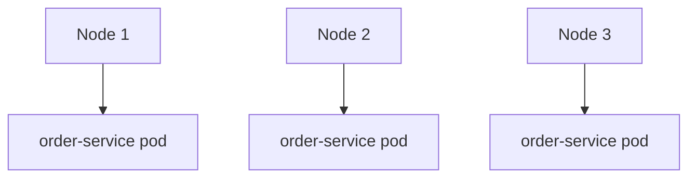

---

# 25. Database Production Setup

## Connection pool sizing

Formula:

```text
Total possible DB connections = pod count × maximumPoolSize
```

Example:

```text
20 pods × 30 connections = 600 possible DB connections
```

If PostgreSQL allows only 500 connections, the app can overload the DB during autoscaling.

## Safer sizing table

| Environment | Pods | Pool per pod | Max possible connections |
|---|---:|---:|---:|
| Dev | 1 | 5 | 5 |
| Staging | 2 | 10 | 20 |
| Production start | 3 | 20 | 60 |
| Production peak | 20 | 20 | 400 |

## Use Flyway migrations

Add dependencies:

```xml
<dependency>
  <groupId>org.flywaydb</groupId>
  <artifactId>flyway-core</artifactId>
</dependency>
<dependency>
  <groupId>org.flywaydb</groupId>
  <artifactId>flyway-database-postgresql</artifactId>
</dependency>
```

Create migration file:

```sql
-- src/main/resources/db/migration/V1__create_orders.sql
CREATE TABLE orders (
    id UUID PRIMARY KEY,
    customer_id TEXT NOT NULL,
    amount NUMERIC(19,2) NOT NULL,
    status TEXT NOT NULL,
    created_at TIMESTAMPTZ NOT NULL DEFAULT now()
);
```

## Zero-downtime migration pattern

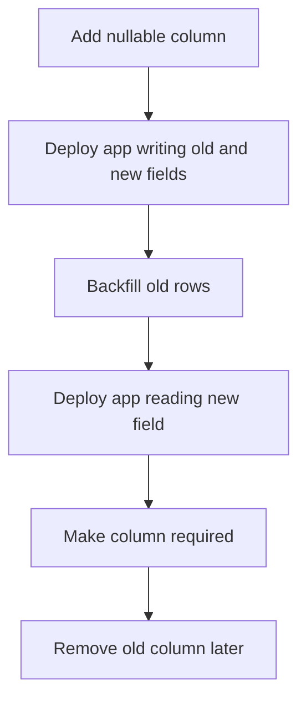

---

# 26. Observability

## Metrics architecture

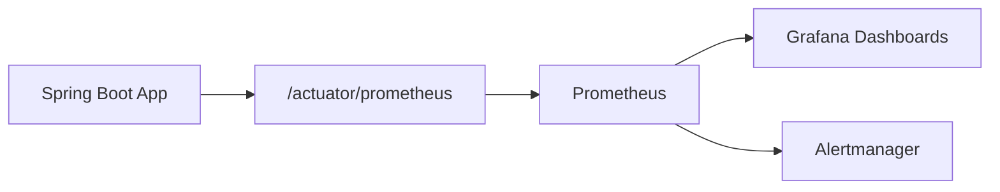

## ServiceMonitor

If you use Prometheus Operator, create:

```yaml
apiVersion: monitoring.coreos.com/v1
kind: ServiceMonitor
metadata:
  name: order-service
  namespace: orders
spec:
  selector:
    matchLabels:
      app: order-service
  endpoints:
    - port: management
      path: /actuator/prometheus
      interval: 30s
```

## Golden signals

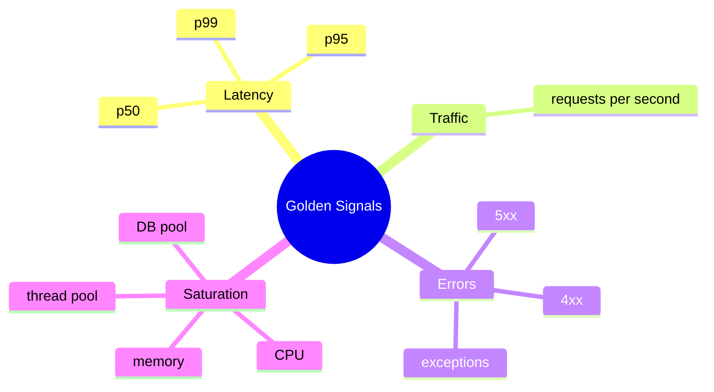

## Useful alerts

| Alert | Example condition |
|---|---|
| High error rate | 5xx > 2% for 5 minutes. |
| High latency | p95 > 500ms for 10 minutes. |
| Crash looping | Pod restarts increasing. |
| Memory pressure | Memory > 85% for 10 minutes. |
| DB pool exhaustion | Hikari active connections near max. |
| No ready pods | Ready replicas = 0. |

---

# 27. Logging

Kubernetes expects logs on stdout/stderr.

## Production logging rules

| Rule | Why needed |
|---|---|
| Log to stdout | Kubernetes collects container logs. |
| Use JSON | Easier search and indexing. |
| Include trace ID | Connect logs to traces. |
| Do not log secrets | Prevents credential leaks. |
| Avoid DEBUG in production | Reduces cost and noise. |

## Example JSON logging dependency

```xml
<dependency>
  <groupId>net.logstash.logback</groupId>
  <artifactId>logstash-logback-encoder</artifactId>
  <version>8.0</version>
</dependency>
```

## Example `logback-spring.xml`

```xml
<configuration>
  <appender name="JSON" class="ch.qos.logback.core.ConsoleAppender">
    <encoder class="net.logstash.logback.encoder.LogstashEncoder"/>
  </appender>

  <root level="INFO">
    <appender-ref ref="JSON"/>
  </root>
</configuration>
```

---

# 28. Tracing

Tracing shows the path of a request across services.

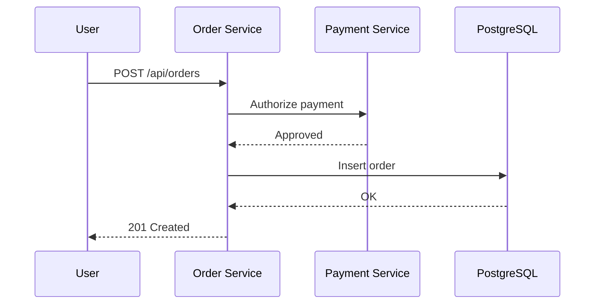

## OpenTelemetry environment variables

```yaml
env:
  - name: OTEL_SERVICE_NAME
    value: order-service
  - name: OTEL_EXPORTER_OTLP_ENDPOINT
    value: http://otel-collector.observability.svc.cluster.local:4318
  - name: OTEL_TRACES_EXPORTER
    value: otlp
```

---

# 29. Security Hardening

## Container security checklist

| Control | Why needed |
|---|---|
| Non-root user | Reduces damage if app is compromised. |
| Read-only root filesystem | Prevents runtime file tampering. |
| Drop Linux capabilities | Removes unnecessary privileges. |
| Minimal base image | Reduces CVE surface. |
| Image scanning | Finds vulnerable packages. |
| Signed images | Verifies image source. |
| SBOM | Tracks software components. |

## Secure pod settings

```yaml
securityContext:
  runAsNonRoot: true
  seccompProfile:
    type: RuntimeDefault
containers:
  - name: order-service
    securityContext:
      allowPrivilegeEscalation: false
      readOnlyRootFilesystem: true
      capabilities:
        drop:
          - ALL
```

---

# 30. NetworkPolicy

Create `k8s/networkpolicy.yaml`:

```yaml
apiVersion: networking.k8s.io/v1
kind: NetworkPolicy
metadata:
  name: order-service-network-policy
  namespace: orders
spec:
  podSelector:
    matchLabels:
      app: order-service
  policyTypes:
    - Ingress
    - Egress
  ingress:
    - from:
        - namespaceSelector:
            matchLabels:
              kubernetes.io/metadata.name: ingress-nginx
      ports:
        - protocol: TCP
          port: 8080
  egress:
    - to:
        - podSelector:
            matchLabels:
              app: postgres
      ports:
        - protocol: TCP
          port: 5432
    - to:
        - namespaceSelector:
            matchLabels:
              kubernetes.io/metadata.name: kube-system
      ports:
        - protocol: UDP
          port: 53
```

## Explanation

| Setting | Why needed |
|---|---|
| `podSelector` | Applies policy to order-service pods. |
| `Ingress` | Restricts incoming traffic. |
| `Egress` | Restricts outgoing traffic. |
| Ingress from ingress namespace | Only ingress controller can call app. |
| Egress to PostgreSQL | App can reach database. |
| Egress to DNS | App can resolve service names. |

---

# 31. RBAC

Create a dedicated ServiceAccount:

```yaml
apiVersion: v1
kind: ServiceAccount
metadata:
  name: order-service
  namespace: orders
```

Optional Role:

```yaml
apiVersion: rbac.authorization.k8s.io/v1
kind: Role
metadata:
  name: order-service-read-config
  namespace: orders
rules:
  - apiGroups: [""]
    resources: ["configmaps"]
    verbs: ["get", "list"]
```

Bind Role:

```yaml
apiVersion: rbac.authorization.k8s.io/v1
kind: RoleBinding
metadata:
  name: order-service-read-config
  namespace: orders
subjects:
  - kind: ServiceAccount
    name: order-service
    namespace: orders
roleRef:
  kind: Role
  name: order-service-read-config
  apiGroup: rbac.authorization.k8s.io
```

Use it in Deployment:

```yaml
spec:
  template:
    spec:
      serviceAccountName: order-service
```

## Why needed

Apps should not run with broad Kubernetes API permissions. Give each workload only the access it needs.

---

# 32. CI/CD Pipeline

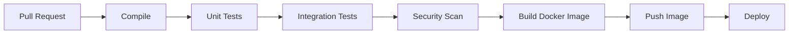

## GitHub Actions example

```yaml
name: build

on:
  push:
    branches: [main]
  pull_request:

jobs:
  build:
    runs-on: ubuntu-latest
    permissions:
      contents: read
      packages: write
    steps:
      - uses: actions/checkout@v4

      - uses: actions/setup-java@v4
        with:
          distribution: temurin
          java-version: 21
          cache: maven

      - name: Test
        run: ./mvnw clean verify

      - name: Build image
        run: docker build -t ghcr.io/acme/order-service:${{ github.sha }} .

      - name: Login to GHCR
        run: echo "${{ secrets.GITHUB_TOKEN }}" | docker login ghcr.io -u ${{ github.actor }} --password-stdin

      - name: Push image
        run: docker push ghcr.io/acme/order-service:${{ github.sha }}
```

## Explanation

| Step | Why needed |
|---|---|
| checkout | Pulls source code. |
| setup-java | Installs Java and caches Maven dependencies. |
| Test | Prevents broken code from shipping. |
| Build image | Creates deployable artifact. |
| Login | Authenticates to registry. |
| Push | Makes image available to Kubernetes. |

---

# 33. GitOps Deployment

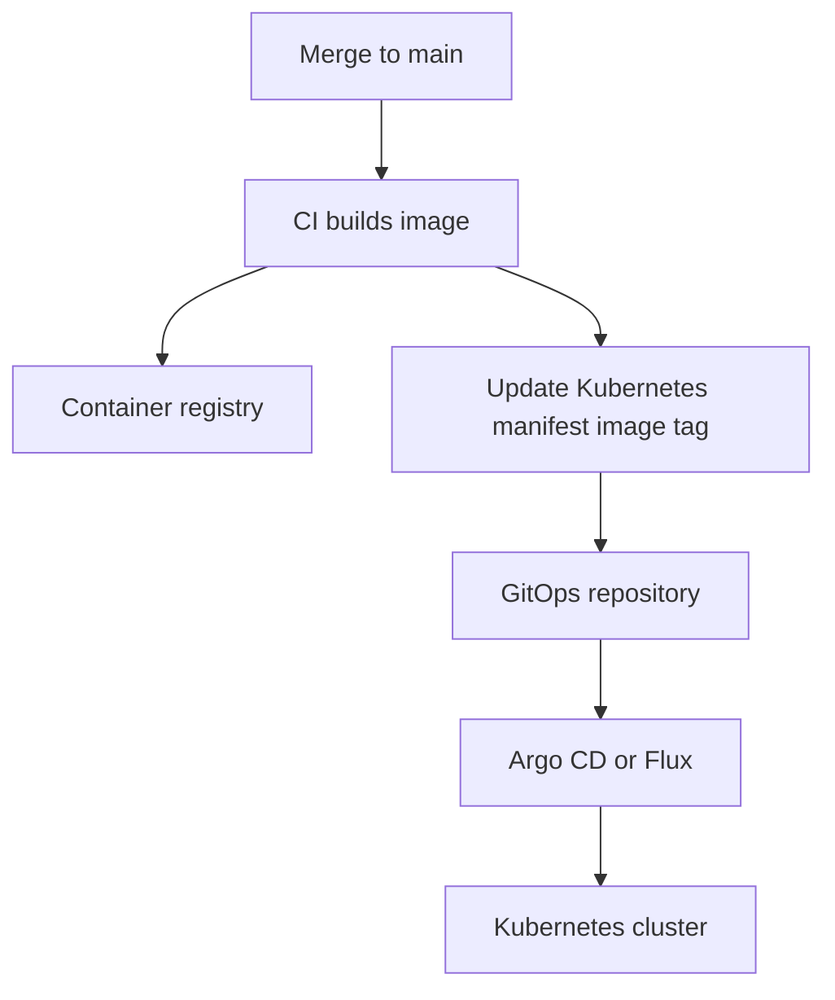

## Why GitOps helps

| Benefit | Explanation |
|---|---|
| Audit trail | Every deployment is a Git commit. |
| Rollback | Revert a manifest commit. |
| Drift detection | Detects manual changes in cluster. |
| Separation | CI builds; GitOps deploys. |

---

# 34. Advanced Deployment Strategies

## Rolling update

Default Kubernetes strategy.

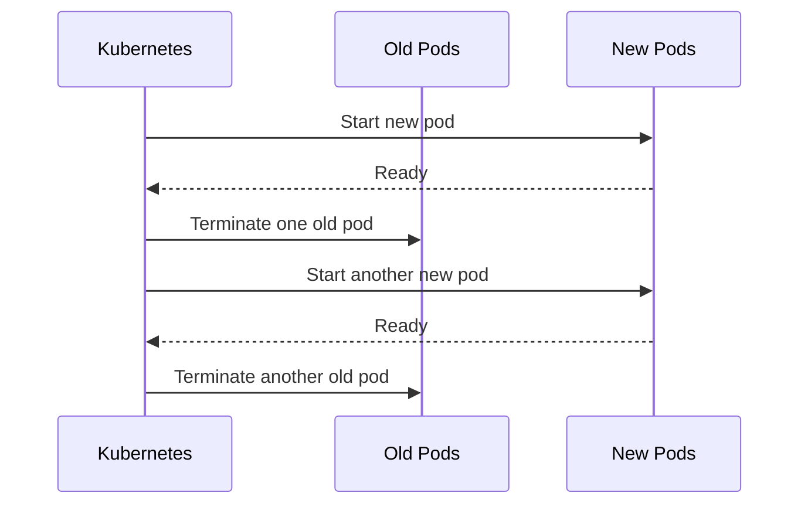

Best for most services.

## Blue-green deployment

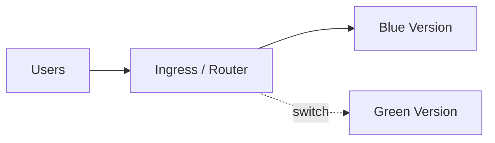

Best when you need instant rollback.

## Canary deployment

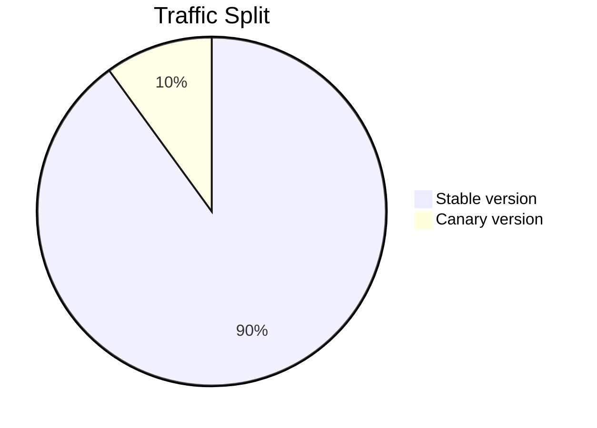

Best when you want to test new versions with a small percentage of users.

---

# 35. Production Checklist

## Application

- [ ] Request validation enabled.
- [ ] Global exception handling added.
- [ ] Health endpoints configured.
- [ ] Metrics exported.
- [ ] Logs are structured JSON.
- [ ] Secrets are not logged.
- [ ] Database migrations are versioned.
- [ ] `ddl-auto` is not set to `update` in production.

## Docker

- [ ] Uses non-root user.
- [ ] Uses minimal runtime image.
- [ ] Image uses immutable tag.
- [ ] `.dockerignore` exists.
- [ ] Image is scanned for vulnerabilities.
- [ ] JVM memory respects container limits.

## Kubernetes

- [ ] Deployment has at least 2-3 replicas.
- [ ] Requests and limits are set.
- [ ] Readiness probe is configured.
- [ ] Liveness probe is configured.
- [ ] Startup probe is configured for slower apps.
- [ ] Rolling update strategy is safe.
- [ ] PDB is configured.
- [ ] HPA is configured.
- [ ] NetworkPolicy is configured.
- [ ] RBAC uses least privilege.
- [ ] Secrets come from a real secret manager.

## Observability

- [ ] Prometheus scraping works.
- [ ] Grafana dashboard exists.
- [ ] Error-rate alert exists.
- [ ] Latency alert exists.
- [ ] CrashLoopBackOff alert exists.
- [ ] DB pool alert exists.
- [ ] Trace IDs appear in logs.

---

# 36. Troubleshooting Guide

## Pod not starting

```bash
kubectl -n orders get pods
kubectl -n orders describe pod <pod-name>
kubectl -n orders logs <pod-name>
```

Common causes:

| Symptom | Likely cause |
|---|---|
| `ImagePullBackOff` | Wrong image name, tag, or registry auth. |
| `CrashLoopBackOff` | App starts then crashes. Check logs. |
| `CreateContainerConfigError` | Bad ConfigMap or Secret reference. |
| `OOMKilled` | Memory limit too low or memory leak. |
| Readiness failing | App cannot serve traffic or dependency unavailable. |

## Service not routing

```bash
kubectl -n orders get endpoints order-service
kubectl -n orders describe svc order-service
```

Check:

- Pod labels match Service selector.
- Pods are Ready.
- Target port name exists in Deployment.

## Ingress not working

```bash
kubectl -n orders describe ingress order-service
kubectl get ingressclass
```

Check:

- DNS points to ingress load balancer.
- TLS secret exists.
- Ingress controller is installed.
- `ingressClassName` matches controller.

## App cannot connect to DB

Check environment variables:

```bash
kubectl -n orders exec deploy/order-service -- env | grep DATABASE
```

Check DNS:

```bash
kubectl -n orders exec deploy/order-service -- nslookup postgres.orders.svc.cluster.local
```

Check DB connection limits:

```sql
SHOW max_connections;
SELECT count(*) FROM pg_stat_activity;
```

---

# Final Recommended Production Architecture

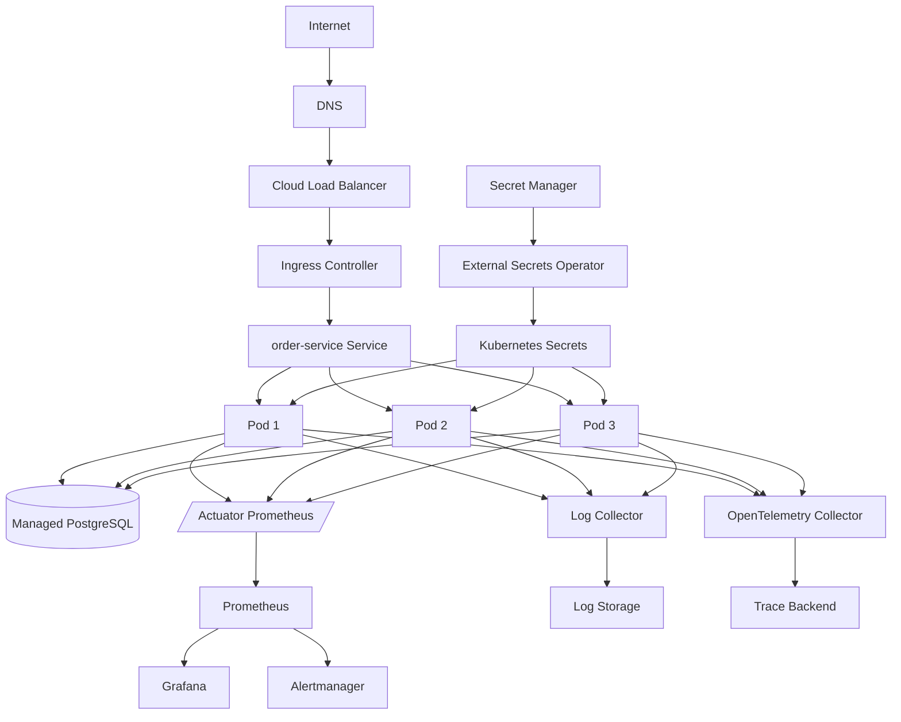

---

## Suggested learning path

1. Run the Spring Boot app locally.
2. Add Actuator health endpoints.
3. Build a basic Docker image.
4. Run the container locally.
5. Create Kubernetes Namespace, ConfigMap, Secret, Deployment, and Service.
6. Add Ingress.
7. Add resource requests and limits.
8. Add readiness, liveness, and startup probes.
9. Add HPA and PDB.
10. Add metrics, logs, and tracing.
11. Harden container security.
12. Add NetworkPolicy and RBAC.
13. Automate with CI/CD.
14. Move toward GitOps.
15. Practice rolling, blue-green, and canary deployments.

