# Kafka + Spring Boot: Newbie to Production-Ready Pro

A complete chapter-wise Markdown handbook for learning Apache Kafka with Spring Boot from first principles to production deployment.

> Target reader: Java/Spring developer who is new to Kafka.
>
> Target result: You can build, test, secure, monitor, and deploy Kafka-based Spring Boot services in production.

---

## Table of Contents

1. [Kafka Basics](#chapter-1-kafka-basics)
2. [Local Setup](#chapter-2-local-setup)
3. [Spring Boot Producer](#chapter-3-spring-boot-producer)
4. [Spring Boot Consumer](#chapter-4-spring-boot-consumer)
5. [Partitions and Consumer Groups](#chapter-5-partitions-and-consumer-groups)
6. [Retry and Dead-Letter Topic](#chapter-6-retry-and-dead-letter-topic)
7. [Manual Acknowledgment](#chapter-7-manual-acknowledgment)
8. [Testing](#chapter-8-testing)
9. [Transactions](#chapter-9-transactions)
10. [Schema Registry](#chapter-10-schema-registry)
11. [Security](#chapter-11-security)
12. [Production Deployment](#chapter-12-production-deployment)

---

# Chapter 1: Kafka Basics

## 1.1 What Kafka is

Apache Kafka is a distributed event streaming platform. In simple words, Kafka is a durable, scalable, high-throughput system for moving events between applications.

An event is something that happened:

```json
{
  "eventType": "OrderCreated",
  "orderId": "ORD-1001",
  "customerId": "CUS-77",
  "amount": 149.99,
  "createdAt": "2026-04-29T10:15:00Z"
}
```

Traditional request/response communication looks like this:

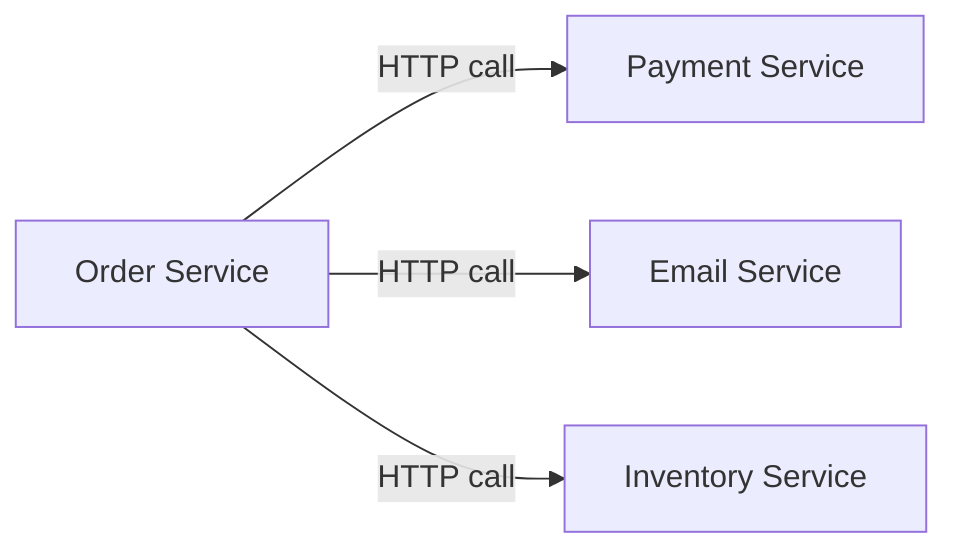

Kafka-based event communication looks like this:

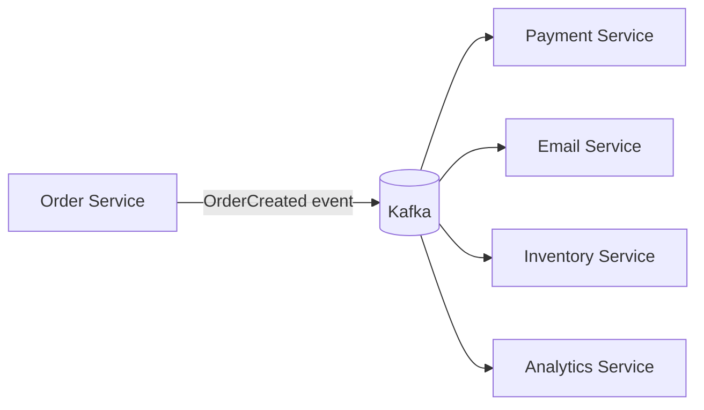

The key benefit is decoupling. The Order Service does not need to know how many other services care about the order event.

## 1.2 Core Kafka terms

### Broker

A broker is a Kafka server. A Kafka cluster has one or more brokers.

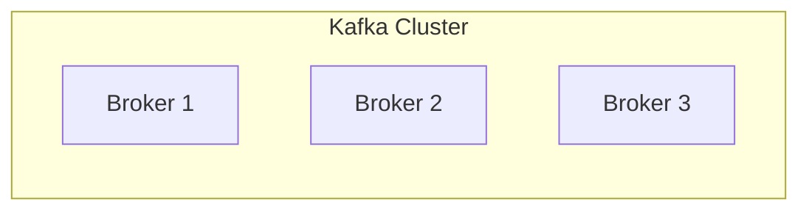

### Topic

A topic is a named stream of events.

Examples:

- `orders.created`
- `payments.authorized`
- `inventory.reserved`
- `emails.requested`

A topic is like an append-only log.

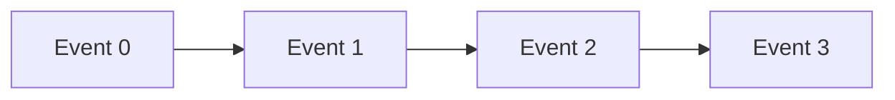

### Partition

A topic is split into partitions. Partitions allow Kafka to scale horizontally.

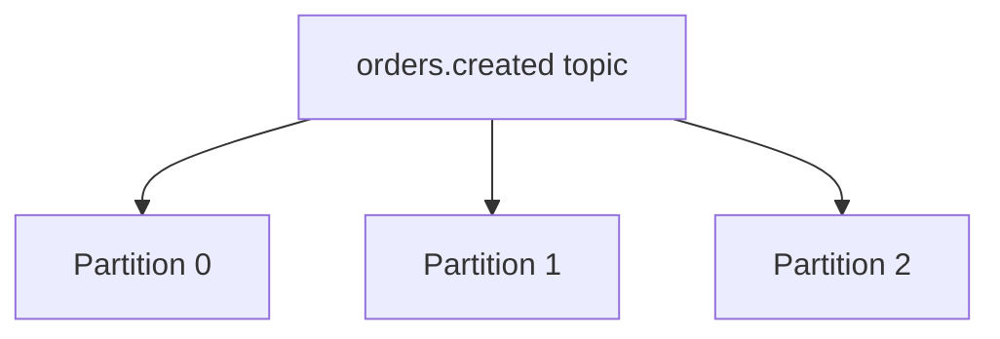

Each partition is ordered internally.

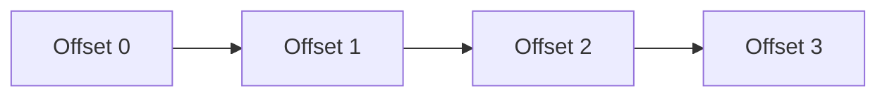

Important rule:

> Kafka guarantees ordering only within a single partition, not across the whole topic.

### Offset

An offset is the position of a record inside a partition.

Example:

```text
orders.created partition 0
offset 0 -> event A
offset 1 -> event B
offset 2 -> event C
```

A consumer tracks which offsets it has processed.

### Producer

A producer writes records to Kafka.

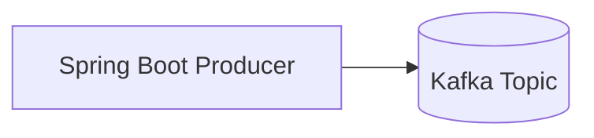

### Consumer

A consumer reads records from Kafka.

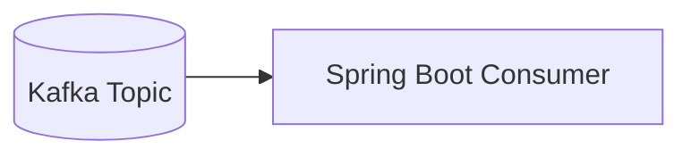

### Consumer Group

A consumer group is a set of consumers that share work.

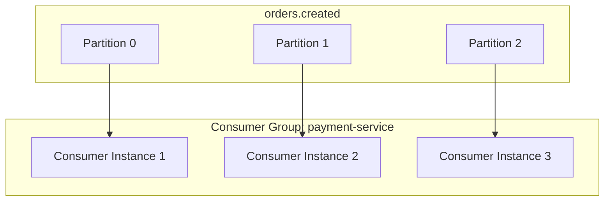

Within one group, a partition is consumed by only one consumer instance at a time.

## 1.3 Kafka record anatomy

A Kafka record usually has:

```text
key
value
headers
timestamp
topic
partition
offset
```

Example:

```text
topic: orders.created
key: ORD-1001
value: {"orderId":"ORD-1001","amount":149.99}
header: eventType=OrderCreated
partition: 2
offset: 581
```

### Why the key matters

Kafka uses the key to choose a partition. Records with the same key usually go to the same partition.

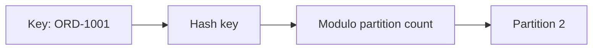

This is why order-related events should usually use `orderId` as the key.

```text
OrderCreated(orderId=ORD-1001)
OrderPaid(orderId=ORD-1001)
OrderShipped(orderId=ORD-1001)
```

All can go to the same partition, preserving order for that order.

## 1.4 Kafka is not just a queue

A queue often removes messages once consumed. Kafka keeps events for a configured retention period.

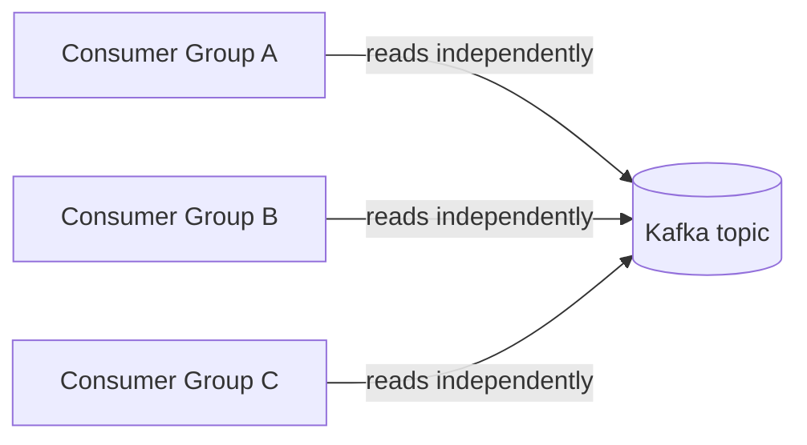

Multiple consumer groups can read the same events independently.

Example:

- `payment-service` consumes orders.
- `email-service` consumes orders.
- `analytics-service` consumes orders.

They do not steal events from each other because they use different group IDs.

## 1.5 Delivery guarantees

### At-most-once

The consumer commits offset before processing.

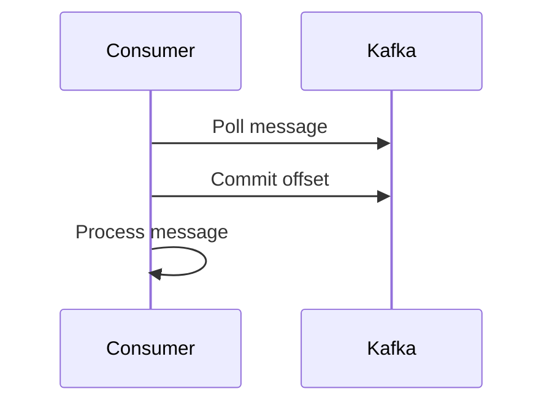

If processing fails after commit, the message is lost.

### At-least-once

The consumer processes first, then commits offset.

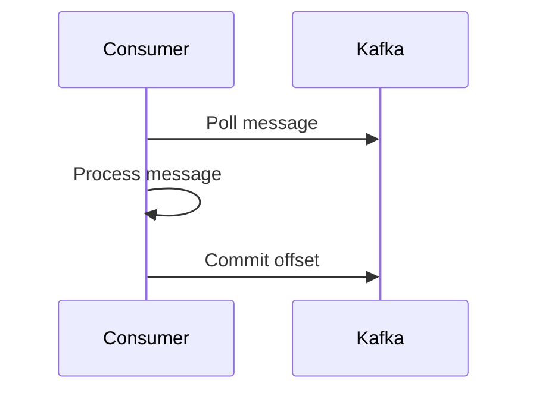

If the app crashes after processing but before commit, the message may be processed again. This is common and acceptable if consumers are idempotent.

### Exactly-once

Exactly-once is possible in constrained Kafka workflows using idempotent producers and transactions, especially consume-process-produce pipelines. In real business systems, you still usually need idempotency at the database/business level.

## 1.6 Beginner mental model

Think of Kafka as:

```text
durable + partitioned + append-only + replayable event log
```

Not simply:

```text
temporary queue
```

## 1.7 Common beginner mistakes

| Mistake | Why it hurts | Better approach |
|---|---|---|
| No message key | Ordering becomes unpredictable | Use a business key |
| One partition forever | Cannot scale consumers | Pick partition count intentionally |
| Treat Kafka as RPC | Tight coupling comes back | Publish facts/events |
| No idempotency | Duplicates cause bugs | Store processed event IDs |
| No DLT | Poison messages block progress | Use retry and dead-letter topics |

## 1.8 Mini exercise

Design Kafka topics for an e-commerce app.

Suggested answer:

```text
orders.created
payments.authorized
payments.failed
inventory.reserved
shipments.created
notifications.requested
```

Suggested keys:

```text
orderId for order lifecycle events
paymentId for payment-only events
customerId for customer profile events
```

---

# Chapter 2: Local Setup

## 2.1 Goal

By the end of this chapter you will:

- Run Kafka locally.
- Create topics.
- Produce messages from CLI.
- Consume messages from CLI.
- Understand what each command does.

## 2.2 KRaft vs ZooKeeper

Older Kafka setups used ZooKeeper. Modern Kafka supports KRaft mode, where Kafka manages metadata internally through controllers.

Local development can run a combined broker/controller process.

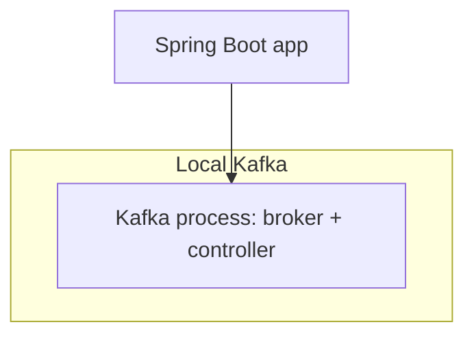

In production, controllers and brokers are often separated.

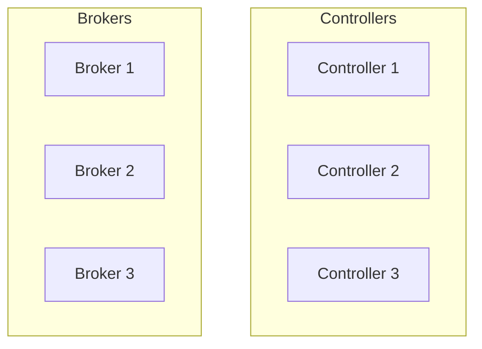

## 2.3 Docker Compose for local Kafka

Create `docker-compose.yml`:

```yaml
services:
  kafka:
    image: apache/kafka:latest
    container_name: kafka-local
    ports:
      - "9092:9092"
    environment:
      KAFKA_NODE_ID: 1
      KAFKA_PROCESS_ROLES: broker,controller
      KAFKA_LISTENERS: PLAINTEXT://:9092,CONTROLLER://:9093
      KAFKA_ADVERTISED_LISTENERS: PLAINTEXT://localhost:9092
      KAFKA_CONTROLLER_LISTENER_NAMES: CONTROLLER
      KAFKA_LISTENER_SECURITY_PROTOCOL_MAP: CONTROLLER:PLAINTEXT,PLAINTEXT:PLAINTEXT
      KAFKA_CONTROLLER_QUORUM_VOTERS: 1@localhost:9093
      KAFKA_OFFSETS_TOPIC_REPLICATION_FACTOR: 1
      KAFKA_TRANSACTION_STATE_LOG_REPLICATION_FACTOR: 1
      KAFKA_TRANSACTION_STATE_LOG_MIN_ISR: 1
```

Run:

```bash
docker compose up -d
```

Check logs:

```bash
docker logs -f kafka-local
```

Stop:

```bash
docker compose down
```

## 2.4 Understand the Docker config

| Property | Meaning |
|---|---|
| `KAFKA_NODE_ID` | Unique node ID in the cluster |
| `KAFKA_PROCESS_ROLES` | This local node is both broker and controller |
| `KAFKA_LISTENERS` | Interfaces Kafka listens on |
| `KAFKA_ADVERTISED_LISTENERS` | Address clients use to connect |
| `KAFKA_CONTROLLER_QUORUM_VOTERS` | Controller quorum config |
| `KAFKA_OFFSETS_TOPIC_REPLICATION_FACTOR` | Replication for internal consumer offset topic |

For local development, replication factor 1 is fine. In production, use replication factor 3 or more.

## 2.5 Create a topic

```bash
docker exec -it kafka-local /opt/kafka/bin/kafka-topics.sh \
  --bootstrap-server localhost:9092 \
  --create \
  --topic orders.created \
  --partitions 3 \
  --replication-factor 1
```

List topics:

```bash
docker exec -it kafka-local /opt/kafka/bin/kafka-topics.sh \
  --bootstrap-server localhost:9092 \
  --list
```

Describe topic:

```bash
docker exec -it kafka-local /opt/kafka/bin/kafka-topics.sh \
  --bootstrap-server localhost:9092 \
  --describe \
  --topic orders.created
```

## 2.6 Produce messages from CLI

```bash
docker exec -it kafka-local /opt/kafka/bin/kafka-console-producer.sh \
  --bootstrap-server localhost:9092 \
  --topic orders.created \
  --property parse.key=true \
  --property key.separator=:
```

Now type:

```text
ORD-1:{"orderId":"ORD-1","amount":100}
ORD-2:{"orderId":"ORD-2","amount":200}
ORD-1:{"orderId":"ORD-1","amount":150}
```

Notice that `ORD-1` appears twice. It should go to the same partition because it uses the same key.

## 2.7 Consume messages from CLI

```bash
docker exec -it kafka-local /opt/kafka/bin/kafka-console-consumer.sh \
  --bootstrap-server localhost:9092 \
  --topic orders.created \
  --from-beginning \
  --property print.key=true \
  --property key.separator=" -> "
```

Expected output:

```text
ORD-1 -> {"orderId":"ORD-1","amount":100}
ORD-2 -> {"orderId":"ORD-2","amount":200}
ORD-1 -> {"orderId":"ORD-1","amount":150}
```

## 2.8 Consumer groups from CLI

Start consumer with group ID:

```bash
docker exec -it kafka-local /opt/kafka/bin/kafka-console-consumer.sh \
  --bootstrap-server localhost:9092 \
  --topic orders.created \
  --group order-debugger
```

Check group:

```bash
docker exec -it kafka-local /opt/kafka/bin/kafka-consumer-groups.sh \
  --bootstrap-server localhost:9092 \
  --describe \
  --group order-debugger
```

You will see current offset, log end offset, and lag.

## 2.9 What consumer lag means

Consumer lag means:

```text
lag = latest offset in partition - committed consumer offset
```

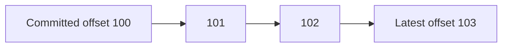

If committed offset is 100 and latest is 103, lag is 3.

Lag means the consumer is behind.

## 2.10 Local setup troubleshooting

| Problem | Cause | Fix |
|---|---|---|
| App cannot connect | Wrong advertised listener | Use `localhost:9092` for local host apps |
| Topic not found | Auto creation disabled or typo | Create topic explicitly |
| Consumer sees no records | Offsets already committed | Use new group ID or reset offset |
| Same records repeat | Offset not committed | Check consumer config |
| Docker port conflict | 9092 already used | Stop old Kafka or change port |

---

# Chapter 3: Spring Boot Producer

## 3.1 Goal

You will build:

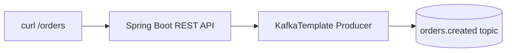

## 3.2 Project dependencies

Use Spring Initializr or create a Maven project.

Recommended dependencies:

```xml
<dependencies>
    <dependency>
        <groupId>org.springframework.boot</groupId>
        <artifactId>spring-boot-starter-web</artifactId>
    </dependency>

    <dependency>
        <groupId>org.springframework.kafka</groupId>
        <artifactId>spring-kafka</artifactId>
    </dependency>

    <dependency>
        <groupId>org.springframework.boot</groupId>
        <artifactId>spring-boot-starter-validation</artifactId>
    </dependency>

    <dependency>
        <groupId>org.springframework.boot</groupId>
        <artifactId>spring-boot-starter-actuator</artifactId>
    </dependency>

    <dependency>
        <groupId>org.springframework.kafka</groupId>
        <artifactId>spring-kafka-test</artifactId>
        <scope>test</scope>
    </dependency>
</dependencies>
```

## 3.3 Package structure

```text
src/main/java/com/example/orders
├── OrderApplication.java
├── api
│   └── OrderController.java
├── event
│   └── OrderCreatedEvent.java
├── kafka
│   ├── OrderEventProducer.java
│   └── KafkaTopicConfig.java
└── service
    └── OrderService.java
```

## 3.4 Application configuration

Create `src/main/resources/application.yml`:

```yaml
spring:
  application:
    name: order-service

  kafka:
    bootstrap-servers: localhost:9092

    producer:
      key-serializer: org.apache.kafka.common.serialization.StringSerializer
      value-serializer: org.springframework.kafka.support.serializer.JsonSerializer
      properties:
        acks: all
        enable.idempotence: true
        retries: 10
        delivery.timeout.ms: 120000
        request.timeout.ms: 30000
        linger.ms: 5
        compression.type: snappy

    admin:
      auto-create: true

server:
  port: 8080

management:
  endpoints:
    web:
      exposure:
        include: health,info,metrics,prometheus
```

Explanation:

| Property | Why it matters |
|---|---|
| `bootstrap-servers` | Initial Kafka broker addresses |
| `key-serializer` | Converts Java key to bytes |
| `value-serializer` | Converts Java event object to JSON bytes |
| `acks=all` | Wait for strongest broker acknowledgment |
| `enable.idempotence=true` | Helps avoid duplicates from producer retries |
| `compression.type=snappy` | Reduces network usage |
| `linger.ms=5` | Allows small batching delay for throughput |

## 3.5 Event class

```java
package com.example.orders.event;

import java.math.BigDecimal;
import java.time.Instant;

public record OrderCreatedEvent(
        String eventId,
        String orderId,
        String customerId,
        BigDecimal amount,
        String currency,
        Instant occurredAt,
        int eventVersion
) {}
```

### Why include `eventId`

`eventId` helps consumers detect duplicate processing.

### Why include `eventVersion`

Events evolve. Versioning allows consumers to support multiple event shapes.

## 3.6 Request DTO

```java
package com.example.orders.api;

import jakarta.validation.constraints.DecimalMin;
import jakarta.validation.constraints.NotBlank;
import java.math.BigDecimal;

public record CreateOrderRequest(
        @NotBlank String customerId,
        @DecimalMin("0.01") BigDecimal amount,
        @NotBlank String currency
) {}
```

## 3.7 Topic configuration

```java
package com.example.orders.kafka;

import org.apache.kafka.clients.admin.NewTopic;
import org.springframework.context.annotation.Bean;
import org.springframework.context.annotation.Configuration;
import org.springframework.kafka.config.TopicBuilder;

@Configuration
public class KafkaTopicConfig {

    public static final String ORDERS_CREATED_TOPIC = "orders.created";

    @Bean
    public NewTopic ordersCreatedTopic() {
        return TopicBuilder.name(ORDERS_CREATED_TOPIC)
                .partitions(3)
                .replicas(1)
                .config("retention.ms", String.valueOf(7L * 24 * 60 * 60 * 1000))
                .build();
    }
}
```

Production note:

```text
local replicas = 1
production replicas = usually 3
```

## 3.8 Producer service

```java
package com.example.orders.kafka;

import com.example.orders.event.OrderCreatedEvent;
import org.slf4j.Logger;
import org.slf4j.LoggerFactory;
import org.springframework.kafka.core.KafkaTemplate;
import org.springframework.stereotype.Service;

@Service
public class OrderEventProducer {

    private static final Logger log = LoggerFactory.getLogger(OrderEventProducer.class);

    private final KafkaTemplate<String, OrderCreatedEvent> kafkaTemplate;

    public OrderEventProducer(KafkaTemplate<String, OrderCreatedEvent> kafkaTemplate) {
        this.kafkaTemplate = kafkaTemplate;
    }

    public void publishOrderCreated(OrderCreatedEvent event) {
        kafkaTemplate.send(KafkaTopicConfig.ORDERS_CREATED_TOPIC, event.orderId(), event)
                .whenComplete((result, exception) -> {
                    if (exception != null) {
                        log.error("Failed to publish OrderCreated eventId={} orderId={}",
                                event.eventId(), event.orderId(), exception);
                        return;
                    }

                    var metadata = result.getRecordMetadata();
                    log.info("Published OrderCreated eventId={} orderId={} topic={} partition={} offset={}",
                            event.eventId(),
                            event.orderId(),
                            metadata.topic(),
                            metadata.partition(),
                            metadata.offset());
                });
    }
}
```

## 3.9 Business service

```java
package com.example.orders.service;

import com.example.orders.api.CreateOrderRequest;
import com.example.orders.event.OrderCreatedEvent;
import com.example.orders.kafka.OrderEventProducer;
import org.springframework.stereotype.Service;

import java.time.Instant;
import java.util.UUID;

@Service
public class OrderService {

    private final OrderEventProducer producer;

    public OrderService(OrderEventProducer producer) {
        this.producer = producer;
    }

    public String createOrder(CreateOrderRequest request) {
        String orderId = "ORD-" + UUID.randomUUID();
        String eventId = "EVT-" + UUID.randomUUID();

        OrderCreatedEvent event = new OrderCreatedEvent(
                eventId,
                orderId,
                request.customerId(),
                request.amount(),
                request.currency(),
                Instant.now(),
                1
        );

        producer.publishOrderCreated(event);
        return orderId;
    }
}
```

## 3.10 REST controller

```java
package com.example.orders.api;

import com.example.orders.service.OrderService;
import jakarta.validation.Valid;
import org.springframework.http.HttpStatus;
import org.springframework.web.bind.annotation.*;

@RestController
@RequestMapping("/orders")
public class OrderController {

    private final OrderService service;

    public OrderController(OrderService service) {
        this.service = service;
    }

    @PostMapping
    @ResponseStatus(HttpStatus.ACCEPTED)
    public CreateOrderResponse create(@Valid @RequestBody CreateOrderRequest request) {
        String orderId = service.createOrder(request);
        return new CreateOrderResponse(orderId, "Order accepted");
    }

    public record CreateOrderResponse(String orderId, String status) {}
}
```

## 3.11 Test the producer

Start Kafka:

```bash
docker compose up -d
```

Start Spring Boot:

```bash
./mvnw spring-boot:run
```

Call API:

```bash
curl -X POST http://localhost:8080/orders \
  -H "Content-Type: application/json" \
  -d '{"customerId":"CUS-1","amount":99.99,"currency":"USD"}'
```

Consume:

```bash
docker exec -it kafka-local /opt/kafka/bin/kafka-console-consumer.sh \
  --bootstrap-server localhost:9092 \
  --topic orders.created \
  --from-beginning \
  --property print.key=true
```

## 3.12 Common producer mistakes

| Mistake | Symptom | Fix |
|---|---|---|
| Ignoring `send()` failure | Silent data loss | Add callback/logging |
| No key | Ordering issues | Use business key |
| Huge messages | Poor performance | Store large payload elsewhere |
| Publishing inside DB transaction incorrectly | Event says something happened but DB rolled back | Use outbox pattern |
| No event version | Breaking consumers | Add `eventVersion` |

---

# Chapter 4: Spring Boot Consumer

## 4.1 Goal

Build:

```mermaid
flowchart LR
    Kafka[(orders.created)] --> Listener[@KafkaListener]
    Listener --> Handler[Business Logic]
    Handler --> DB[(Database)]
```

## 4.2 Consumer configuration

Add to `application.yml`:

```yaml
spring:
  kafka:
    consumer:
      group-id: notification-service
      auto-offset-reset: earliest
      enable-auto-commit: false
      key-deserializer: org.apache.kafka.common.serialization.StringDeserializer
      value-deserializer: org.springframework.kafka.support.serializer.JsonDeserializer
      properties:
        spring.json.trusted.packages: "com.example.orders.event"
        spring.json.value.default.type: "com.example.orders.event.OrderCreatedEvent"

    listener:
      concurrency: 3
      ack-mode: record
```

Explanation:

| Property | Meaning |
|---|---|
| `group-id` | Consumer group name |
| `auto-offset-reset` | What to do when no offset exists |
| `enable-auto-commit=false` | Spring listener controls commits |
| `trusted.packages` | Security guard for JSON deserialization |
| `concurrency=3` | Three listener threads |
| `ack-mode=record` | Commit after each record is processed |

## 4.3 Consumer class

```java
package com.example.orders.kafka;

import com.example.orders.event.OrderCreatedEvent;
import org.slf4j.Logger;
import org.slf4j.LoggerFactory;
import org.springframework.kafka.annotation.KafkaListener;
import org.springframework.stereotype.Component;

@Component
public class OrderCreatedListener {

    private static final Logger log = LoggerFactory.getLogger(OrderCreatedListener.class);

    @KafkaListener(
            topics = KafkaTopicConfig.ORDERS_CREATED_TOPIC,
            groupId = "notification-service"
    )
    public void onOrderCreated(OrderCreatedEvent event) {
        log.info("Received OrderCreated eventId={} orderId={} amount={} {}",
                event.eventId(),
                event.orderId(),
                event.amount(),
                event.currency());

        // Business logic:
        // 1. Send email
        // 2. Update read model
        // 3. Call downstream service
    }
}
```

## 4.4 Consumer with metadata

```java
@KafkaListener(topics = "orders.created", groupId = "notification-service")
public void onOrderCreated(
        OrderCreatedEvent event,
        @org.springframework.messaging.handler.annotation.Header(
                org.springframework.kafka.support.KafkaHeaders.RECEIVED_TOPIC
        ) String topic,
        @org.springframework.messaging.handler.annotation.Header(
                org.springframework.kafka.support.KafkaHeaders.RECEIVED_PARTITION
        ) int partition,
        @org.springframework.messaging.handler.annotation.Header(
                org.springframework.kafka.support.KafkaHeaders.OFFSET
        ) long offset
) {
    log.info("Received eventId={} from topic={} partition={} offset={}",
            event.eventId(), topic, partition, offset);
}
```

## 4.5 What happens internally

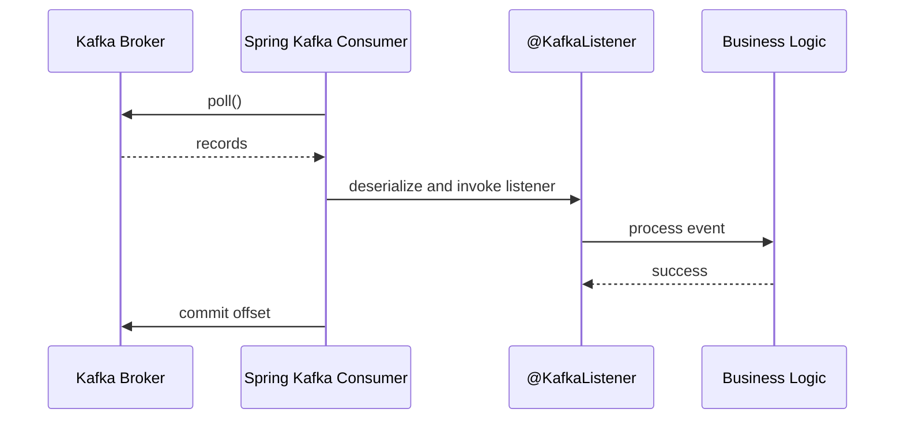

## 4.6 Consumer idempotency

Kafka consumers should be idempotent because records can be delivered more than once.

Create table:

```sql
CREATE TABLE processed_event (
    event_id VARCHAR(100) PRIMARY KEY,
    processed_at TIMESTAMP NOT NULL
);
```

Pseudo-code:

```java
@Transactional
public void handle(OrderCreatedEvent event) {
    if (processedEventRepository.existsById(event.eventId())) {
        log.info("Skipping duplicate eventId={}", event.eventId());
        return;
    }

    sendNotification(event);

    processedEventRepository.save(new ProcessedEvent(event.eventId(), Instant.now()));
}
```

## 4.7 Common consumer mistakes

| Mistake | Result | Fix |
|---|---|---|
| Not idempotent | Duplicate emails/payments | Store processed event ID |
| Slow processing | Consumer lag | Optimize or scale |
| One group ID reused by unrelated apps | Apps steal work | Give each app its own group ID |
| Deserialization failures ignored | Consumer stuck | Use error handling |
| Blocking external calls without timeout | Thread starvation | Use timeouts and retries |

---

# Chapter 5: Partitions and Consumer Groups

## 5.1 Why partitions exist

Partitions provide:

1. Parallelism
2. Scalability
3. Distribution across brokers
4. Ordering per key

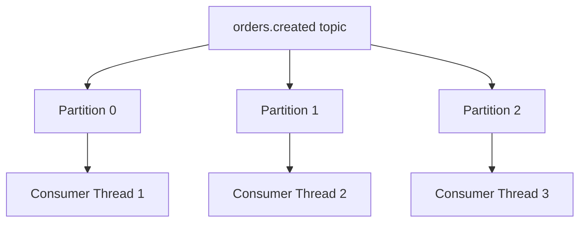

## 5.2 Partition assignment rule

Within a consumer group:

```text
one partition can be assigned to only one consumer instance
```

But one consumer can own multiple partitions.

### Example: 3 partitions, 1 consumer

```mermaid
flowchart LR
    P0 --> C1
    P1 --> C1
    P2 --> C1
```

### Example: 3 partitions, 3 consumers

```mermaid
flowchart LR
    P0 --> C1
    P1 --> C2
    P2 --> C3
```

### Example: 3 partitions, 5 consumers

```mermaid
flowchart LR
    P0 --> C1
    P1 --> C2
    P2 --> C3
    C4[Consumer 4 idle]
    C5[Consumer 5 idle]
```

Extra consumers are idle.

## 5.3 Choosing partition count

Questions to ask:

1. How much throughput do we need?
2. How many consumers might we need?
3. What ordering guarantees are required?
4. How many keys will exist?
5. What is the expected future growth?

Practical starting points:

| System size | Suggested partitions |
|---|---:|
| Learning/local | 1-3 |
| Small production topic | 3-6 |
| Medium high-throughput topic | 12-24 |
| Large high-throughput topic | 48+ after testing |

Do not blindly create hundreds of partitions. More partitions increase operational overhead.

## 5.4 Key design

Good keys:

```text
orderId
customerId
paymentId
shipmentId
accountId
```

Bad keys:

```text
random UUID when order matters
constant key for all records
null key when order matters
```

### Hot partition problem

If too many records use the same key, one partition becomes overloaded.

```mermaid
flowchart TB
    K1[customerId=VIP-CUSTOMER] --> P0[Partition 0 overloaded]
    K2[customerId=CUS-2] --> P1[Partition 1]
    K3[customerId=CUS-3] --> P2[Partition 2]
```

Fixes:

- Use a more distributed key.
- Split topic by workload.
- Use key bucketing when ordering can be relaxed.

## 5.5 Rebalancing

Rebalancing happens when consumers join or leave a group.

```mermaid
sequenceDiagram
    participant C1 as Consumer 1
    participant C2 as Consumer 2
    participant K as Kafka Group Coordinator

    C2->>K: Join group
    K->>C1: Revoke partitions
    K->>C1: Assign new partitions
    K->>C2: Assign partitions
```

During rebalance, processing may pause briefly.

Reduce rebalance pain by:

- Avoiding long blocking processing in listener threads.
- Setting reasonable poll and session configs.
- Using static membership for stable deployments.
- Scaling carefully.

## 5.6 Consumer lag

Lag is one of the most important production metrics.

```text
lag = latest produced offset - committed consumed offset
```

High lag can mean:

- Consumer is too slow.
- Too few partitions.
- External dependency is slow.
- Consumer is repeatedly failing.
- Rebalances are frequent.

## 5.7 Scaling strategy

```mermaid
flowchart TD
    A[Lag increasing?] --> B{CPU high?}
    B -->|Yes| C[Add instances up to partition count]
    B -->|No| D{External calls slow?}
    D -->|Yes| E[Add timeouts, bulkheads, async handoff]
    D -->|No| F{Failures/retries?}
    F -->|Yes| G[Inspect retry and DLT]
    F -->|No| H[Increase partitions after testing]
```

---

# Chapter 6: Retry and Dead-Letter Topic

## 6.1 Why error handling matters

Without error handling, one bad message can repeatedly fail and block progress.

Example poison message:

```json
{
  "eventId": "EVT-1",
  "orderId": null
}
```

If your code requires `orderId`, this record fails every time.

## 6.2 Failure types

| Failure type | Example | Retry? |
|---|---|---|
| Transient | HTTP timeout | Yes |
| Temporary infrastructure | DB connection unavailable | Yes |
| Data problem | Missing required field | No |
| Code bug | NullPointerException | Usually no until fixed |
| Downstream rate limit | 429 response | Yes, with backoff |

## 6.3 Retry flow

```mermaid
flowchart TD
    A[Consume record] --> B{Processing succeeds?}
    B -->|Yes| C[Commit offset]
    B -->|No| D[Retry with backoff]
    D --> E{Retries exhausted?}
    E -->|No| A
    E -->|Yes| F[Publish to DLT]
    F --> G[Commit original offset]
```

## 6.4 Create DLT topic

```java
@Bean
public NewTopic ordersCreatedDltTopic() {
    return TopicBuilder.name("orders.created.DLT")
            .partitions(3)
            .replicas(1)
            .build();
}
```

Use the same partition count as the original topic where possible.

## 6.5 Configure `DefaultErrorHandler`

```java
package com.example.orders.kafka;

import com.example.orders.event.OrderCreatedEvent;
import org.apache.kafka.common.TopicPartition;
import org.springframework.context.annotation.Bean;
import org.springframework.context.annotation.Configuration;
import org.springframework.kafka.core.KafkaTemplate;
import org.springframework.kafka.listener.DefaultErrorHandler;
import org.springframework.kafka.listener.DeadLetterPublishingRecoverer;
import org.springframework.util.backoff.ExponentialBackOffWithMaxRetries;

@Configuration
public class KafkaErrorHandlingConfig {

    @Bean
    public DefaultErrorHandler defaultErrorHandler(
            KafkaTemplate<String, OrderCreatedEvent> kafkaTemplate
    ) {
        DeadLetterPublishingRecoverer recoverer =
                new DeadLetterPublishingRecoverer(
                        kafkaTemplate,
                        (record, exception) ->
                                new TopicPartition(record.topic() + ".DLT", record.partition())
                );

        ExponentialBackOffWithMaxRetries backOff = new ExponentialBackOffWithMaxRetries(3);
        backOff.setInitialInterval(1_000L);
        backOff.setMultiplier(2.0);
        backOff.setMaxInterval(10_000L);

        DefaultErrorHandler errorHandler = new DefaultErrorHandler(recoverer, backOff);

        errorHandler.addNotRetryableExceptions(
                IllegalArgumentException.class
        );

        return errorHandler;
    }
}
```

## 6.6 Explanation

This config means:

```text
Try original processing
If it fails, retry 3 times
Wait 1s, then 2s, then 4s
If still failing, publish record to originalTopic.DLT
```

## 6.7 DLT listener

```java
package com.example.orders.kafka;

import com.example.orders.event.OrderCreatedEvent;
import org.slf4j.Logger;
import org.slf4j.LoggerFactory;
import org.springframework.kafka.annotation.KafkaListener;
import org.springframework.stereotype.Component;

@Component
public class OrderCreatedDltListener {

    private static final Logger log = LoggerFactory.getLogger(OrderCreatedDltListener.class);

    @KafkaListener(topics = "orders.created.DLT", groupId = "order-dlt-monitor")
    public void onDlt(OrderCreatedEvent event) {
        log.error("Received event in DLT eventId={} orderId={}",
                event.eventId(), event.orderId());

        // Production options:
        // 1. Alert support team
        // 2. Store in DB for replay
        // 3. Send to incident queue
        // 4. Trigger manual review
    }
}
```

## 6.8 DLT operations

A DLT is not a trash can. It is an operational queue.

Production DLT process:

```mermaid
flowchart LR
    DLT[(orders.created.DLT)] --> Inspect[Inspect error]
    Inspect --> FixData[Fix data]
    Inspect --> FixCode[Fix code]
    FixData --> Replay[Replay event]
    FixCode --> Replay
    Replay --> Original[(orders.created)]
```

## 6.9 What to alert on

Alert when:

- DLT count > 0 for critical topics.
- DLT count spikes.
- Retry rate spikes.
- Consumer lag increases during retries.
- Same event repeatedly fails after replay.

## 6.10 Common retry mistakes

| Mistake | Result | Fix |
|---|---|---|
| Infinite retries | Consumer stuck forever | Limit retries |
| Retrying bad data | Wastes resources | Mark non-retryable exceptions |
| No DLT monitoring | Failures hidden | Alert on DLT |
| Long blocking retries | Lag grows | Use non-blocking retry or separate retry topics |
| Replaying without fixing | Same failure repeats | Diagnose first |

---

# Chapter 7: Manual Acknowledgment

## 7.1 What acknowledgment means

Acknowledgment controls when Kafka offset is committed.

A committed offset says:

```text
This consumer group has successfully processed records up to this position.
```

## 7.2 Automatic vs manual acknowledgment

Automatic style:

```text
Spring commits after listener returns successfully.
```

Manual style:

```text
Your code explicitly calls ack.acknowledge().
```

Manual ack is useful when:

- You need strict control.
- You process records in multiple steps.
- You write to a database and only commit Kafka offset after DB success.
- You hand off work carefully.

## 7.3 Configure manual ack

```yaml
spring:
  kafka:
    listener:
      ack-mode: manual
```

## 7.4 Listener with manual ack

```java
package com.example.orders.kafka;

import com.example.orders.event.OrderCreatedEvent;
import org.springframework.kafka.annotation.KafkaListener;
import org.springframework.kafka.support.Acknowledgment;
import org.springframework.stereotype.Component;

@Component
public class ManualAckOrderListener {

    @KafkaListener(topics = "orders.created", groupId = "manual-ack-service")
    public void onMessage(OrderCreatedEvent event, Acknowledgment ack) {
        process(event);
        ack.acknowledge();
    }

    private void process(OrderCreatedEvent event) {
        // database write
        // external call
        // business validation
    }
}
```

## 7.5 Correct manual ack flow

```mermaid
sequenceDiagram
    participant K as Kafka
    participant C as Consumer
    participant DB as Database

    C->>K: Poll event
    C->>DB: Save business result
    DB-->>C: Commit success
    C->>K: Acknowledge offset
```

## 7.6 Wrong manual ack flow

```mermaid
sequenceDiagram
    participant K as Kafka
    participant C as Consumer
    participant DB as Database

    C->>K: Poll event
    C->>K: Acknowledge offset
    C->>DB: Save business result
    DB-->>C: Failure
```

This can lose data because Kafka thinks the record was processed.

## 7.7 Manual ack with transaction boundary

```java
@Transactional
public void processAndAck(OrderCreatedEvent event, Acknowledgment ack) {
    orderReadModelRepository.save(...);
    processedEventRepository.save(...);
    ack.acknowledge();
}
```

Be careful: Kafka offset commit is not automatically part of your database transaction unless you configure transaction synchronization carefully. For most systems, idempotency is still required.

## 7.8 When not to use manual ack

Avoid manual ack if:

- You do not need the control.
- Your team is new to Kafka.
- You might forget to ack.
- Standard record ack mode is sufficient.

Manual ack gives power but increases responsibility.

---

# Chapter 8: Testing

## 8.1 Testing pyramid

```mermaid
flowchart TB
    E2E[End-to-end tests: few]
    IT[Integration tests: some]
    Unit[Unit tests: many]

    E2E --> IT
    IT --> Unit
```

You need:

1. Unit tests for producer/consumer logic.
2. Integration tests with Kafka.
3. Contract/schema tests for event compatibility.
4. Optional end-to-end tests in staging.

## 8.2 Unit test producer

```java
package com.example.orders.kafka;

import com.example.orders.event.OrderCreatedEvent;
import org.junit.jupiter.api.Test;
import org.mockito.Mockito;
import org.springframework.kafka.core.KafkaTemplate;

import java.math.BigDecimal;
import java.time.Instant;

class OrderEventProducerTest {

    @Test
    void publishesOrderCreatedWithOrderIdAsKey() {
        KafkaTemplate<String, OrderCreatedEvent> kafkaTemplate = Mockito.mock(KafkaTemplate.class);
        OrderEventProducer producer = new OrderEventProducer(kafkaTemplate);

        OrderCreatedEvent event = new OrderCreatedEvent(
                "EVT-1",
                "ORD-1",
                "CUS-1",
                BigDecimal.TEN,
                "USD",
                Instant.now(),
                1
        );

        producer.publishOrderCreated(event);

        Mockito.verify(kafkaTemplate)
                .send("orders.created", "ORD-1", event);
    }
}
```

## 8.3 Unit test consumer business logic

Do not put too much logic directly in the listener. Delegate to a service.

```java
@Component
public class OrderCreatedListener {

    private final OrderNotificationService service;

    public OrderCreatedListener(OrderNotificationService service) {
        this.service = service;
    }

    @KafkaListener(topics = "orders.created")
    public void onOrderCreated(OrderCreatedEvent event) {
        service.handle(event);
    }
}
```

Then test the service without Kafka.

## 8.4 Integration test with Embedded Kafka

```java
@SpringBootTest
@org.springframework.kafka.test.context.EmbeddedKafka(
        partitions = 3,
        topics = {"orders.created"}
)
class OrderKafkaIntegrationTest {

    @Autowired
    private OrderEventProducer producer;

    @Test
    void publishesEventToKafka() {
        OrderCreatedEvent event = new OrderCreatedEvent(
                "EVT-1",
                "ORD-1",
                "CUS-1",
                BigDecimal.valueOf(50),
                "USD",
                Instant.now(),
                1
        );

        producer.publishOrderCreated(event);

        // In a real test, use KafkaTestUtils to consume and assert.
    }
}
```

## 8.5 Integration test with Testcontainers

Testcontainers is closer to production than Embedded Kafka.

```java
@Testcontainers
@SpringBootTest
class KafkaContainerIntegrationTest {

    @Container
    static KafkaContainer kafka = new KafkaContainer(
            DockerImageName.parse("apache/kafka:latest")
    );

    @DynamicPropertySource
    static void kafkaProperties(DynamicPropertyRegistry registry) {
        registry.add("spring.kafka.bootstrap-servers", kafka::getBootstrapServers);
    }

    @Test
    void contextLoads() {
    }
}
```

## 8.6 What to test

Producer tests:

- Correct topic.
- Correct key.
- Correct event fields.
- Failure callback behavior.
- Serialization.

Consumer tests:

- Valid event processed.
- Duplicate event ignored.
- Invalid event sent to DLT.
- Retryable exception retried.
- Non-retryable exception not retried.
- Offset committed after success.

Schema tests:

- New schema is backward compatible.
- Required fields are not removed.
- Defaults exist for new fields.

## 8.7 Testing DLT behavior

```mermaid
flowchart LR
    Test[Test sends bad event] --> Topic[(orders.created)]
    Topic --> Consumer[Consumer throws]
    Consumer --> DLT[(orders.created.DLT)]
    DLT --> Assert[Test asserts record exists]
```

## 8.8 Common testing mistakes

| Mistake | Problem |
|---|---|
| Only unit tests | Miss serialization/config problems |
| Only end-to-end tests | Slow and fragile |
| No DLT tests | Failure path untested |
| No duplicate tests | Idempotency bugs in production |
| No schema tests | Consumers break unexpectedly |

---

# Chapter 9: Transactions

## 9.1 Why transactions exist

Kafka transactions help when you need atomic write behavior across Kafka records, or consume-process-produce workflows.

Example:

```text
consume orders.created
produce payments.requested
produce audit.logged
commit consumed offset
```

You want all or nothing.

## 9.2 Enable transactional producer

```yaml
spring:
  kafka:
    producer:
      transaction-id-prefix: order-tx-
```

## 9.3 Transactional send

```java
@Service
public class TransactionalPublisher {

    private final KafkaTemplate<String, Object> kafkaTemplate;

    public TransactionalPublisher(KafkaTemplate<String, Object> kafkaTemplate) {
        this.kafkaTemplate = kafkaTemplate;
    }

    public void publishTwoEvents(String key, Object event1, Object event2) {
        kafkaTemplate.executeInTransaction(operations -> {
            operations.send("orders.created", key, event1);
            operations.send("audit.events", key, event2);
            return true;
        });
    }
}
```

## 9.4 Consume-process-produce flow

```mermaid
sequenceDiagram
    participant K1 as orders.created
    participant C as Consumer
    participant K2 as payments.requested
    participant K3 as audit.events

    C->>K1: consume event
    C->>K2: produce payment command
    C->>K3: produce audit event
    C->>K1: commit consumed offset transactionally
```

## 9.5 Database + Kafka problem

A common problem:

```java
@Transactional
public void createOrder() {
    database.save(order);
    kafkaTemplate.send("orders.created", event);
}
```

What if database commits but Kafka publish fails?

Or Kafka publish succeeds but database rolls back?

## 9.6 Outbox pattern

The outbox pattern solves DB + Kafka consistency.

```mermaid
flowchart LR
    API[Order API] --> TX[Database Transaction]
    TX --> Orders[(orders table)]
    TX --> Outbox[(outbox table)]
    Outbox --> Relay[Outbox Relay]
    Relay --> Kafka[(Kafka)]
```

In one database transaction:

1. Save order.
2. Save outbox event.

Then a separate relay publishes outbox rows to Kafka.

## 9.7 Outbox table

```sql
CREATE TABLE outbox_event (
    id VARCHAR(100) PRIMARY KEY,
    aggregate_type VARCHAR(100) NOT NULL,
    aggregate_id VARCHAR(100) NOT NULL,
    event_type VARCHAR(100) NOT NULL,
    payload JSON NOT NULL,
    status VARCHAR(30) NOT NULL,
    created_at TIMESTAMP NOT NULL,
    published_at TIMESTAMP NULL
);
```

## 9.8 Outbox write

```java
@Transactional
public String createOrder(CreateOrderRequest request) {
    Order order = orderRepository.save(...);

    OutboxEvent outbox = new OutboxEvent(
            UUID.randomUUID().toString(),
            "Order",
            order.getId(),
            "OrderCreated",
            jsonPayload,
            "NEW",
            Instant.now(),
            null
    );

    outboxRepository.save(outbox);

    return order.getId();
}
```

## 9.9 Outbox relay

```java
@Scheduled(fixedDelay = 1000)
public void publishOutboxEvents() {
    List<OutboxEvent> events = outboxRepository.findTop100ByStatusOrderByCreatedAt("NEW");

    for (OutboxEvent event : events) {
        kafkaTemplate.send("orders.created", event.getAggregateId(), event.getPayload())
                .whenComplete((result, exception) -> {
                    if (exception == null) {
                        markPublished(event);
                    }
                });
    }
}
```

Production improvement:

- Use row locking.
- Use batching.
- Use Debezium CDC instead of polling.
- Make relay idempotent.
- Monitor unpublished outbox rows.

## 9.10 Transactions vs outbox

| Use case | Recommended pattern |
|---|---|
| Kafka to Kafka atomicity | Kafka transactions |
| Database + Kafka consistency | Outbox pattern |
| Payment charging | Idempotent external API + DB state |
| Microservice orchestration | Saga + idempotency |

---

# Chapter 10: Schema Registry

## 10.1 Why schema management matters

JSON without schema is easy at first but dangerous later.

Producer v1 sends:

```json
{
  "orderId": "ORD-1",
  "amount": 100
}
```

Producer v2 changes to:

```json
{
  "id": "ORD-1",
  "totalAmount": 100
}
```

Old consumers break.

Schema Registry helps manage event contracts.

## 10.2 Supported schema formats

Common options:

- Avro
- Protobuf
- JSON Schema

Avro is very common in Kafka ecosystems.

## 10.3 Schema Registry architecture

```mermaid
flowchart LR
    Producer --> SR[Schema Registry]
    Producer --> Kafka[(Kafka)]
    Consumer --> SR
    Kafka --> Consumer
```

Producer registers schema or fetches schema ID. Consumer uses schema ID to deserialize.

## 10.4 Local Docker Compose with Schema Registry

Example using Confluent images:

```yaml
services:
  kafka:
    image: apache/kafka:latest
    container_name: kafka-local
    ports:
      - "9092:9092"
    environment:
      KAFKA_NODE_ID: 1
      KAFKA_PROCESS_ROLES: broker,controller
      KAFKA_LISTENERS: PLAINTEXT://:9092,CONTROLLER://:9093
      KAFKA_ADVERTISED_LISTENERS: PLAINTEXT://kafka:9092
      KAFKA_CONTROLLER_LISTENER_NAMES: CONTROLLER
      KAFKA_LISTENER_SECURITY_PROTOCOL_MAP: CONTROLLER:PLAINTEXT,PLAINTEXT:PLAINTEXT
      KAFKA_CONTROLLER_QUORUM_VOTERS: 1@kafka:9093

  schema-registry:
    image: confluentinc/cp-schema-registry:latest
    depends_on:
      - kafka
    ports:
      - "8081:8081"
    environment:
      SCHEMA_REGISTRY_HOST_NAME: schema-registry
      SCHEMA_REGISTRY_KAFKASTORE_BOOTSTRAP_SERVERS: PLAINTEXT://kafka:9092
```

If your Spring Boot app runs on your host machine, adjust advertised listeners carefully.

## 10.5 Avro schema example

`src/main/avro/order-created.avsc`:

```json
{
  "type": "record",
  "name": "OrderCreated",
  "namespace": "com.example.orders.avro",
  "fields": [
    {"name": "eventId", "type": "string"},
    {"name": "orderId", "type": "string"},
    {"name": "customerId", "type": "string"},
    {"name": "amount", "type": "double"},
    {"name": "currency", "type": "string"},
    {"name": "occurredAt", "type": "string"},
    {"name": "eventVersion", "type": "int", "default": 1}
  ]
}
```

## 10.6 Maven Avro plugin

```xml
<plugin>
    <groupId>org.apache.avro</groupId>
    <artifactId>avro-maven-plugin</artifactId>
    <version>1.11.3</version>
    <executions>
        <execution>
            <phase>generate-sources</phase>
            <goals>
                <goal>schema</goal>
            </goals>
            <configuration>
                <sourceDirectory>${project.basedir}/src/main/avro</sourceDirectory>
                <outputDirectory>${project.basedir}/target/generated-sources/avro</outputDirectory>
            </configuration>
        </execution>
    </executions>
</plugin>
```

## 10.7 Producer config with Avro

```yaml
spring:
  kafka:
    producer:
      key-serializer: org.apache.kafka.common.serialization.StringSerializer
      value-serializer: io.confluent.kafka.serializers.KafkaAvroSerializer
      properties:
        schema.registry.url: http://localhost:8081
```

## 10.8 Consumer config with Avro

```yaml
spring:
  kafka:
    consumer:
      key-deserializer: org.apache.kafka.common.serialization.StringDeserializer
      value-deserializer: io.confluent.kafka.serializers.KafkaAvroDeserializer
      properties:
        schema.registry.url: http://localhost:8081
        specific.avro.reader: true
```

## 10.9 Compatibility rules

Important compatibility ideas:

| Compatibility | Meaning |
|---|---|
| Backward | New consumers can read old data |
| Forward | Old consumers can read new data |
| Full | Both backward and forward |
| None | No compatibility checks |

Common safe Avro evolution:

- Add optional field with default.
- Do not remove required fields used by consumers.
- Do not change field type carelessly.
- Do not rename fields without aliases.

## 10.10 Example safe schema evolution

V1:

```json
{"name": "currency", "type": "string"}
```

V2 adding field safely:

```json
{"name": "country", "type": "string", "default": "UNKNOWN"}
```

## 10.11 Schema design checklist

- Use business event names.
- Include event ID.
- Include occurred timestamp.
- Use clear field names.
- Avoid ambiguous generic fields like `data`.
- Add defaults for new fields.
- Use compatibility checks in CI/CD.
- Version intentionally.

---

# Chapter 11: Security

## 11.1 Security goals

Kafka security includes:

1. Authentication: who are you?
2. Authorization: what can you access?
3. Encryption: can others read traffic?
4. Auditing: who did what?

```mermaid
flowchart LR
    App[Spring Boot App] -->|TLS encrypted| Kafka[(Kafka)]
    App -->|SASL auth| Kafka
    Kafka --> ACL[ACL authorization]
```

## 11.2 Local vs production security

Local development often uses plaintext:

```yaml
spring:
  kafka:
    bootstrap-servers: localhost:9092
```

Production should usually use TLS/SASL:

```yaml
spring:
  kafka:
    bootstrap-servers: kafka1:9093,kafka2:9093,kafka3:9093
    properties:
      security.protocol: SASL_SSL
      sasl.mechanism: SCRAM-SHA-512
```

## 11.3 SASL/SCRAM example

```yaml
spring:
  kafka:
    properties:
      security.protocol: SASL_SSL
      sasl.mechanism: SCRAM-SHA-512
      sasl.jaas.config: >
        org.apache.kafka.common.security.scram.ScramLoginModule required
        username="${KAFKA_USERNAME}"
        password="${KAFKA_PASSWORD}";
```

## 11.4 TLS truststore example

```yaml
spring:
  kafka:
    ssl:
      trust-store-location: file:/etc/secrets/kafka.truststore.jks
      trust-store-password: ${KAFKA_TRUSTSTORE_PASSWORD}
    properties:
      security.protocol: SSL
```

## 11.5 mTLS keystore example

```yaml
spring:
  kafka:
    ssl:
      trust-store-location: file:/etc/secrets/kafka.truststore.jks
      trust-store-password: ${KAFKA_TRUSTSTORE_PASSWORD}
      key-store-location: file:/etc/secrets/kafka.keystore.jks
      key-store-password: ${KAFKA_KEYSTORE_PASSWORD}
      key-password: ${KAFKA_KEY_PASSWORD}
    properties:
      security.protocol: SSL
```

## 11.6 ACL design

Give each service the minimum required permissions.

Example service: `order-service`

Needs:

- Write to `orders.created`
- Maybe read from `payments.authorized`
- Access its consumer group

Avoid broad permissions like:

```text
User:* can Read/Write Topic:*
```

## 11.7 Secret management

Never hardcode secrets in `application.yml`.

Use:

- Kubernetes Secrets
- HashiCorp Vault
- AWS Secrets Manager
- Azure Key Vault
- GCP Secret Manager
- CI/CD secret injection

Bad:

```yaml
password: super-secret-password
```

Better:

```yaml
password: ${KAFKA_PASSWORD}
```

## 11.8 Data privacy

Kafka events often contain sensitive data.

Rules:

- Do not put passwords in Kafka.
- Avoid full card numbers.
- Minimize personally identifiable information.
- Encrypt sensitive payload fields if needed.
- Define retention carefully.
- Control who can consume topics.

## 11.9 Security checklist

- TLS enabled.
- SASL or mTLS enabled.
- ACLs applied.
- Secrets externalized.
- Topic access reviewed.
- No sensitive data unless required.
- Audit logs enabled.
- Schema Registry secured.
- Monitoring secured.

---

# Chapter 12: Production Deployment

## 12.1 Production architecture

```mermaid
flowchart TB
    subgraph Apps
        A1[order-service pod 1]
        A2[order-service pod 2]
        A3[order-service pod 3]
    end

    subgraph Kafka Cluster
        B1[Broker 1]
        B2[Broker 2]
        B3[Broker 3]
    end

    subgraph Observability
        P[Prometheus]
        G[Grafana]
        L[Logs]
        A[Alerts]
    end

    A1 --> B1
    A2 --> B2
    A3 --> B3
    B1 --> P
    B2 --> P
    B3 --> P
    P --> G
    P --> A
    A1 --> L
    A2 --> L
    A3 --> L
```

## 12.2 Topic production settings

Example:

```bash
kafka-topics.sh \
  --bootstrap-server kafka1:9092 \
  --create \
  --topic orders.created \
  --partitions 12 \
  --replication-factor 3 \
  --config min.insync.replicas=2 \
  --config retention.ms=604800000
```

Recommended:

| Setting | Typical production value |
|---|---|
| replication factor | 3 |
| min.insync.replicas | 2 |
| producer acks | all |
| retention | based on business need |
| partitions | based on throughput and scale testing |

## 12.3 Producer production config

```yaml
spring:
  kafka:
    producer:
      properties:
        acks: all
        enable.idempotence: true
        retries: 2147483647
        max.in.flight.requests.per.connection: 5
        delivery.timeout.ms: 120000
        request.timeout.ms: 30000
        linger.ms: 10
        batch.size: 32768
        compression.type: snappy
```

Explanation:

| Property | Purpose |
|---|---|
| `acks=all` | Wait for all in-sync replicas |
| `enable.idempotence=true` | Prevent duplicate sends from retries |
| `retries` | Retry transient failures |
| `linger.ms` | Improve batching |
| `batch.size` | Improve throughput |
| `compression.type` | Reduce network and storage |

## 12.4 Consumer production config

```yaml
spring:
  kafka:
    consumer:
      enable-auto-commit: false
      auto-offset-reset: earliest
      max-poll-records: 100
      properties:
        session.timeout.ms: 45000
        heartbeat.interval.ms: 15000
        max.poll.interval.ms: 300000
        partition.assignment.strategy: org.apache.kafka.clients.consumer.CooperativeStickyAssignor

    listener:
      concurrency: 6
      ack-mode: record
```

## 12.5 Kubernetes deployment

Example `Deployment`:

```yaml
apiVersion: apps/v1
kind: Deployment
metadata:
  name: order-service
spec:
  replicas: 3
  selector:
    matchLabels:
      app: order-service
  template:
    metadata:
      labels:
        app: order-service
    spec:
      containers:
        - name: order-service
          image: registry.example.com/order-service:1.0.0
          ports:
            - containerPort: 8080
          env:
            - name: SPRING_KAFKA_BOOTSTRAP_SERVERS
              value: kafka-1:9093,kafka-2:9093,kafka-3:9093
            - name: KAFKA_USERNAME
              valueFrom:
                secretKeyRef:
                  name: kafka-secret
                  key: username
            - name: KAFKA_PASSWORD
              valueFrom:
                secretKeyRef:
                  name: kafka-secret
                  key: password
          readinessProbe:
            httpGet:
              path: /actuator/health/readiness
              port: 8080
          livenessProbe:
            httpGet:
              path: /actuator/health/liveness
              port: 8080
```

## 12.6 Horizontal scaling

Scale consumers up to partition count.

```mermaid
flowchart TD
    P[12 partitions] --> C[Up to 12 active consumer threads per group]
```

If you run:

```text
3 pods × concurrency 4 = 12 consumer threads
```

That matches 12 partitions.

If you run:

```text
6 pods × concurrency 4 = 24 consumer threads
```

Only 12 can be active for that topic/group. The rest will be idle.

## 12.7 Observability

Monitor producer:

- Send rate
- Error rate
- Request latency
- Record retry rate
- Batch size
- Compression ratio

Monitor consumer:

- Lag
- Processing latency
- Error rate
- Retry count
- DLT count
- Rebalance count
- Poll duration

Monitor broker:

- Under-replicated partitions
- Offline partitions
- Disk usage
- Network usage
- Controller health
- Request latency

## 12.8 Prometheus actuator config

```yaml
management:
  endpoints:
    web:
      exposure:
        include: health,info,metrics,prometheus
  endpoint:
    health:
      probes:
        enabled: true
```

## 12.9 Logging best practices

Log:

- eventId
- topic
- partition
- offset
- key
- consumer group
- correlation ID

Example:

```java
log.info("Processed eventId={} key={} topic={} partition={} offset={}",
        event.eventId(), key, topic, partition, offset);
```

Do not log:

- passwords
- tokens
- full payment details
- unnecessary PII

## 12.10 Alert examples

| Alert | Why |
|---|---|
| Consumer lag high for 10 min | Consumer cannot keep up |
| DLT count > 0 | Messages failing permanently |
| Producer error rate > threshold | Publish failures |
| Under-replicated partitions > 0 | Kafka durability risk |
| Outbox unpublished rows growing | Kafka publishing pipeline broken |
| Rebalance rate high | Consumer instability |

## 12.11 Deployment strategy

Recommended:

1. Deploy backward-compatible consumers first.
2. Deploy producers with new optional fields.
3. Monitor DLT and lag.
4. Remove old fields only after all consumers are updated.
5. Use canary deployment for risky changes.

```mermaid
flowchart LR
    C1[Deploy compatible consumers] --> P1[Deploy new producer]
    P1 --> M[Monitor]
    M --> C2[Remove old compatibility later]
```

## 12.12 Production readiness checklist

### Kafka topic

- [ ] Replication factor >= 3
- [ ] `min.insync.replicas` configured
- [ ] Retention configured
- [ ] Partition count chosen intentionally
- [ ] Naming convention followed
- [ ] Ownership documented

### Producer

- [ ] Uses business key
- [ ] `acks=all`
- [ ] Idempotence enabled
- [ ] Send failures logged
- [ ] Metrics monitored
- [ ] Schema compatibility enforced
- [ ] Outbox used when DB consistency is needed

### Consumer

- [ ] Idempotent processing
- [ ] Retry configured
- [ ] DLT configured
- [ ] DLT monitored
- [ ] Offset commit strategy understood
- [ ] Lag monitored
- [ ] Timeouts on external calls
- [ ] Duplicate event tests exist

### Security

- [ ] TLS/SASL enabled
- [ ] ACLs configured
- [ ] Secrets externalized
- [ ] PII minimized
- [ ] Schema Registry secured

### Operations

- [ ] Dashboards exist
- [ ] Alerts exist
- [ ] Runbooks exist
- [ ] Replay process documented
- [ ] Load test completed
- [ ] Disaster recovery plan exists

---

# Appendix A: Full Example `application.yml`

```yaml
spring:
  application:
    name: order-service

  kafka:
    bootstrap-servers: ${KAFKA_BOOTSTRAP_SERVERS:localhost:9092}

    producer:
      key-serializer: org.apache.kafka.common.serialization.StringSerializer
      value-serializer: org.springframework.kafka.support.serializer.JsonSerializer
      properties:
        acks: all
        enable.idempotence: true
        retries: 10
        delivery.timeout.ms: 120000
        request.timeout.ms: 30000
        linger.ms: 5
        batch.size: 32768
        compression.type: snappy

    consumer:
      group-id: ${KAFKA_CONSUMER_GROUP:order-service}
      enable-auto-commit: false
      auto-offset-reset: earliest
      key-deserializer: org.apache.kafka.common.serialization.StringDeserializer
      value-deserializer: org.springframework.kafka.support.serializer.JsonDeserializer
      properties:
        spring.json.trusted.packages: "com.example.orders.event"

    listener:
      concurrency: ${KAFKA_LISTENER_CONCURRENCY:3}
      ack-mode: record

management:
  endpoints:
    web:
      exposure:
        include: health,info,metrics,prometheus
  endpoint:
    health:
      probes:
        enabled: true
```

---

# Appendix B: Common CLI Commands

Create topic:

```bash
kafka-topics.sh --bootstrap-server localhost:9092 \
  --create --topic orders.created --partitions 3 --replication-factor 1
```

List topics:

```bash
kafka-topics.sh --bootstrap-server localhost:9092 --list
```

Describe topic:

```bash
kafka-topics.sh --bootstrap-server localhost:9092 \
  --describe --topic orders.created
```

Produce:

```bash
kafka-console-producer.sh --bootstrap-server localhost:9092 \
  --topic orders.created \
  --property parse.key=true \
  --property key.separator=:
```

Consume:

```bash
kafka-console-consumer.sh --bootstrap-server localhost:9092 \
  --topic orders.created \
  --from-beginning \
  --property print.key=true
```

Describe consumer group:

```bash
kafka-consumer-groups.sh --bootstrap-server localhost:9092 \
  --describe --group order-service
```

Reset offset carefully:

```bash
kafka-consumer-groups.sh --bootstrap-server localhost:9092 \
  --group order-service \
  --topic orders.created \
  --reset-offsets \
  --to-earliest \
  --execute
```

---

# Appendix C: Runbooks

## C.1 Consumer lag incident

1. Check lag by topic/group.
2. Check app logs for errors.
3. Check DLT count.
4. Check downstream dependencies.
5. Check CPU/memory.
6. Scale consumers if partitions allow.
7. If partitions are insufficient, plan partition increase carefully.
8. After recovery, review root cause.

## C.2 DLT incident

1. Inspect DLT event.
2. Identify exception type.
3. Decide if data issue or code issue.
4. Fix data/code.
5. Replay to original topic or special replay topic.
6. Monitor for repeated failure.
7. Document incident.

## C.3 Producer failure incident

1. Check broker availability.
2. Check authentication/authorization.
3. Check topic existence.
4. Check producer timeout/retry metrics.
5. Check network/DNS.
6. Check message size.
7. Use outbox to avoid business data loss.

---

# Appendix D: Interview-Level Questions

## What is a Kafka partition?

A partition is an ordered append-only log within a topic. Kafka scales topics by splitting them into partitions.

## Why does Kafka need keys?

Keys determine partition placement. Same key usually maps to same partition, preserving order for that key.

## What is consumer lag?

Consumer lag is the difference between latest produced offset and committed consumed offset.

## What is a DLT?

A dead-letter topic stores records that could not be processed after retries.

## Why must consumers be idempotent?

Kafka can deliver records more than once. Idempotent consumers prevent duplicate business effects.

## When should you use the outbox pattern?

Use outbox when a service must update a database and publish a Kafka event consistently.

## What does `acks=all` do?

It tells the producer to wait until all in-sync replicas acknowledge the write.

## What is Schema Registry for?

It stores and validates schemas so producers and consumers can evolve safely.

---

# References

- Apache Kafka Quickstart: https://kafka.apache.org/quickstart/
- Apache Kafka Documentation: https://kafka.apache.org/documentation/
- Spring Boot Kafka Reference: https://docs.spring.io/spring-boot/reference/messaging/kafka.html
- Spring for Apache Kafka Reference: https://docs.spring.io/spring-kafka/reference/
- Spring Kafka Error Handling: https://docs.spring.io/spring-kafka/reference/kafka/annotation-error-handling.html
- Confluent Schema Registry: https://docs.confluent.io/platform/current/schema-registry/
- Schema Evolution and Compatibility: https://docs.confluent.io/platform/current/schema-registry/fundamentals/schema-evolution.html

---

# Final Learning Path

1. Run Kafka locally.
2. Produce and consume from CLI.
3. Build Spring Boot producer.
4. Build Spring Boot consumer.
5. Add partitions and consumer groups.
6. Add retries and DLT.
7. Add idempotency.
8. Add tests.
9. Add transactions/outbox.
10. Add Schema Registry.
11. Add security.
12. Deploy with monitoring and runbooks.

You are production-ready when you can explain and operate every item in the production checklist.

---

# Chapter 1 Practice Lab: Kafka Basics

## Lab objective

Apply the chapter concepts in a small hands-on exercise.

## Tasks

1. Read the chapter again and identify the main production risk.
2. Write down the configuration or code that controls that risk.
3. Run a small experiment locally.
4. Record expected behavior and actual behavior.
5. Add one automated test if code is involved.

## Questions to answer

- What fails if this part is misconfigured?
- How would you detect that failure in production?
- What metric or log line proves it is working?
- How would you roll back a bad change?
- What runbook step would you create for your team?

## Completion checklist

- [ ] I can explain the concept without reading notes.
- [ ] I can show a working command or code sample.
- [ ] I know one common failure mode.
- [ ] I know one production metric to monitor.
- [ ] I know how to test this behavior.


---

# Chapter 2 Practice Lab: Local Setup

## Lab objective

Apply the chapter concepts in a small hands-on exercise.

## Tasks

1. Read the chapter again and identify the main production risk.
2. Write down the configuration or code that controls that risk.
3. Run a small experiment locally.
4. Record expected behavior and actual behavior.
5. Add one automated test if code is involved.

## Questions to answer

- What fails if this part is misconfigured?
- How would you detect that failure in production?
- What metric or log line proves it is working?
- How would you roll back a bad change?
- What runbook step would you create for your team?

## Completion checklist

- [ ] I can explain the concept without reading notes.
- [ ] I can show a working command or code sample.
- [ ] I know one common failure mode.
- [ ] I know one production metric to monitor.
- [ ] I know how to test this behavior.


---

# Chapter 3 Practice Lab: Spring Boot Producer

## Lab objective

Apply the chapter concepts in a small hands-on exercise.

## Tasks

1. Read the chapter again and identify the main production risk.
2. Write down the configuration or code that controls that risk.
3. Run a small experiment locally.
4. Record expected behavior and actual behavior.
5. Add one automated test if code is involved.

## Questions to answer

- What fails if this part is misconfigured?
- How would you detect that failure in production?
- What metric or log line proves it is working?
- How would you roll back a bad change?
- What runbook step would you create for your team?

## Completion checklist

- [ ] I can explain the concept without reading notes.
- [ ] I can show a working command or code sample.
- [ ] I know one common failure mode.
- [ ] I know one production metric to monitor.
- [ ] I know how to test this behavior.


---

# Chapter 4 Practice Lab: Spring Boot Consumer

## Lab objective

Apply the chapter concepts in a small hands-on exercise.

## Tasks

1. Read the chapter again and identify the main production risk.
2. Write down the configuration or code that controls that risk.
3. Run a small experiment locally.
4. Record expected behavior and actual behavior.
5. Add one automated test if code is involved.

## Questions to answer

- What fails if this part is misconfigured?
- How would you detect that failure in production?
- What metric or log line proves it is working?
- How would you roll back a bad change?
- What runbook step would you create for your team?

## Completion checklist

- [ ] I can explain the concept without reading notes.
- [ ] I can show a working command or code sample.
- [ ] I know one common failure mode.
- [ ] I know one production metric to monitor.
- [ ] I know how to test this behavior.


---

# Chapter 5 Practice Lab: Partitions and Consumer Groups

## Lab objective

Apply the chapter concepts in a small hands-on exercise.

## Tasks

1. Read the chapter again and identify the main production risk.
2. Write down the configuration or code that controls that risk.
3. Run a small experiment locally.
4. Record expected behavior and actual behavior.
5. Add one automated test if code is involved.

## Questions to answer

- What fails if this part is misconfigured?
- How would you detect that failure in production?
- What metric or log line proves it is working?
- How would you roll back a bad change?
- What runbook step would you create for your team?

## Completion checklist

- [ ] I can explain the concept without reading notes.
- [ ] I can show a working command or code sample.
- [ ] I know one common failure mode.
- [ ] I know one production metric to monitor.
- [ ] I know how to test this behavior.


---

# Chapter 6 Practice Lab: Retry and Dead-Letter Topic

## Lab objective

Apply the chapter concepts in a small hands-on exercise.

## Tasks

1. Read the chapter again and identify the main production risk.
2. Write down the configuration or code that controls that risk.
3. Run a small experiment locally.
4. Record expected behavior and actual behavior.
5. Add one automated test if code is involved.

## Questions to answer

- What fails if this part is misconfigured?
- How would you detect that failure in production?
- What metric or log line proves it is working?
- How would you roll back a bad change?
- What runbook step would you create for your team?

## Completion checklist

- [ ] I can explain the concept without reading notes.
- [ ] I can show a working command or code sample.
- [ ] I know one common failure mode.
- [ ] I know one production metric to monitor.
- [ ] I know how to test this behavior.


---

# Chapter 7 Practice Lab: Manual Acknowledgment

## Lab objective

Apply the chapter concepts in a small hands-on exercise.

## Tasks

1. Read the chapter again and identify the main production risk.
2. Write down the configuration or code that controls that risk.
3. Run a small experiment locally.
4. Record expected behavior and actual behavior.
5. Add one automated test if code is involved.

## Questions to answer

- What fails if this part is misconfigured?
- How would you detect that failure in production?
- What metric or log line proves it is working?
- How would you roll back a bad change?
- What runbook step would you create for your team?

## Completion checklist

- [ ] I can explain the concept without reading notes.
- [ ] I can show a working command or code sample.
- [ ] I know one common failure mode.
- [ ] I know one production metric to monitor.
- [ ] I know how to test this behavior.


---

# Chapter 8 Practice Lab: Testing

## Lab objective

Apply the chapter concepts in a small hands-on exercise.

## Tasks

1. Read the chapter again and identify the main production risk.
2. Write down the configuration or code that controls that risk.
3. Run a small experiment locally.
4. Record expected behavior and actual behavior.
5. Add one automated test if code is involved.

## Questions to answer

- What fails if this part is misconfigured?
- How would you detect that failure in production?
- What metric or log line proves it is working?
- How would you roll back a bad change?
- What runbook step would you create for your team?

## Completion checklist

- [ ] I can explain the concept without reading notes.
- [ ] I can show a working command or code sample.
- [ ] I know one common failure mode.
- [ ] I know one production metric to monitor.
- [ ] I know how to test this behavior.


---

# Chapter 9 Practice Lab: Transactions

## Lab objective

Apply the chapter concepts in a small hands-on exercise.

## Tasks

1. Read the chapter again and identify the main production risk.
2. Write down the configuration or code that controls that risk.
3. Run a small experiment locally.
4. Record expected behavior and actual behavior.
5. Add one automated test if code is involved.

## Questions to answer

- What fails if this part is misconfigured?
- How would you detect that failure in production?
- What metric or log line proves it is working?
- How would you roll back a bad change?
- What runbook step would you create for your team?

## Completion checklist

- [ ] I can explain the concept without reading notes.
- [ ] I can show a working command or code sample.
- [ ] I know one common failure mode.
- [ ] I know one production metric to monitor.
- [ ] I know how to test this behavior.


---

# Chapter 10 Practice Lab: Schema Registry

## Lab objective

Apply the chapter concepts in a small hands-on exercise.

## Tasks

1. Read the chapter again and identify the main production risk.
2. Write down the configuration or code that controls that risk.
3. Run a small experiment locally.
4. Record expected behavior and actual behavior.
5. Add one automated test if code is involved.

## Questions to answer

- What fails if this part is misconfigured?
- How would you detect that failure in production?
- What metric or log line proves it is working?
- How would you roll back a bad change?
- What runbook step would you create for your team?

## Completion checklist

- [ ] I can explain the concept without reading notes.
- [ ] I can show a working command or code sample.
- [ ] I know one common failure mode.
- [ ] I know one production metric to monitor.
- [ ] I know how to test this behavior.


---

# Chapter 11 Practice Lab: Security

## Lab objective

Apply the chapter concepts in a small hands-on exercise.

## Tasks

1. Read the chapter again and identify the main production risk.
2. Write down the configuration or code that controls that risk.
3. Run a small experiment locally.
4. Record expected behavior and actual behavior.
5. Add one automated test if code is involved.

## Questions to answer

- What fails if this part is misconfigured?
- How would you detect that failure in production?
- What metric or log line proves it is working?
- How would you roll back a bad change?
- What runbook step would you create for your team?

## Completion checklist

- [ ] I can explain the concept without reading notes.
- [ ] I can show a working command or code sample.
- [ ] I know one common failure mode.
- [ ] I know one production metric to monitor.
- [ ] I know how to test this behavior.


---

# Chapter 12 Practice Lab: Production Deployment

## Lab objective

Apply the chapter concepts in a small hands-on exercise.

## Tasks

1. Read the chapter again and identify the main production risk.
2. Write down the configuration or code that controls that risk.
3. Run a small experiment locally.
4. Record expected behavior and actual behavior.
5. Add one automated test if code is involved.

## Questions to answer

- What fails if this part is misconfigured?
- How would you detect that failure in production?
- What metric or log line proves it is working?
- How would you roll back a bad change?
- What runbook step would you create for your team?

## Completion checklist

- [ ] I can explain the concept without reading notes.
- [ ] I can show a working command or code sample.
- [ ] I know one common failure mode.
- [ ] I know one production metric to monitor.
- [ ] I know how to test this behavior.
