# RabbitMQ with Spring Boot — Visual Step-by-Step Reference

> Visual learning guide with small Java snippets, Mermaid diagrams, and practical use cases from basics to advanced.

---

## Clickable Index

- [1. What is RabbitMQ?](#1-what-is-rabbitmq)
- [2. Mental Model](#2-mental-model)
- [3. When to Use RabbitMQ](#3-when-to-use-rabbitmq)
- [4. Project Setup from Scratch](#4-project-setup-from-scratch)
- [5. Run RabbitMQ with Docker](#5-run-rabbitmq-with-docker)
- [6. Spring Boot Configuration](#6-spring-boot-configuration)
- [7. Way 1: Simple Queue](#7-way-1-simple-queue)
- [8. Way 2: Work Queue](#8-way-2-work-queue)
- [9. Way 3: Fanout Exchange](#9-way-3-fanout-exchange)
- [10. Way 4: Direct Exchange](#10-way-4-direct-exchange)
- [11. Way 5: Topic Exchange](#11-way-5-topic-exchange)
- [12. Way 6: Headers Exchange](#12-way-6-headers-exchange)
- [13. Real Use Case: Order Processing](#13-real-use-case-order-processing)
- [14. Retry Pattern](#14-retry-pattern)
- [15. Dead Letter Queue Pattern](#15-dead-letter-queue-pattern)
- [16. Delayed Message Pattern](#16-delayed-message-pattern)
- [17. Request-Reply / RPC Pattern](#17-request-reply--rpc-pattern)
- [18. JSON Message DTOs](#18-json-message-dtos)
- [19. Manual Acknowledgement](#19-manual-acknowledgement)
- [20. Idempotent Consumer](#20-idempotent-consumer)
- [21. Publisher Confirm](#21-publisher-confirm)
- [22. Monitoring RabbitMQ](#22-monitoring-rabbitmq)
- [23. Testing RabbitMQ](#23-testing-rabbitmq)
- [24. Production Checklist](#24-production-checklist)
- [25. Pattern Selection Cheat Sheet](#25-pattern-selection-cheat-sheet)

---

## 1. What is RabbitMQ?

RabbitMQ is a **message broker**.

It helps services talk asynchronously.

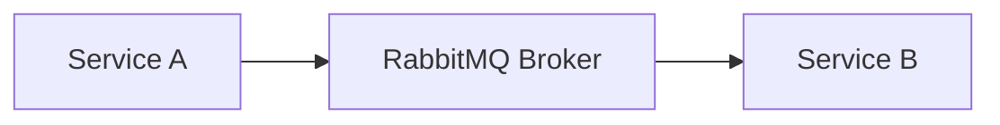

Instead of this:

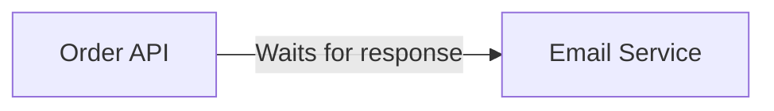

Use this:

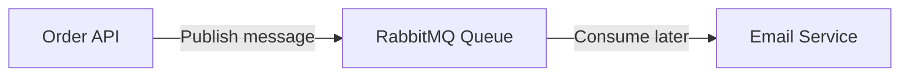

### Simple idea

| Concept | Meaning |
|---|---|
| Producer | Sends message |
| Exchange | Routes message |
| Queue | Stores message |
| Consumer | Reads message |
| Routing key | Address used for routing |
| Binding | Rule connecting exchange to queue |

---

## 2. Mental Model

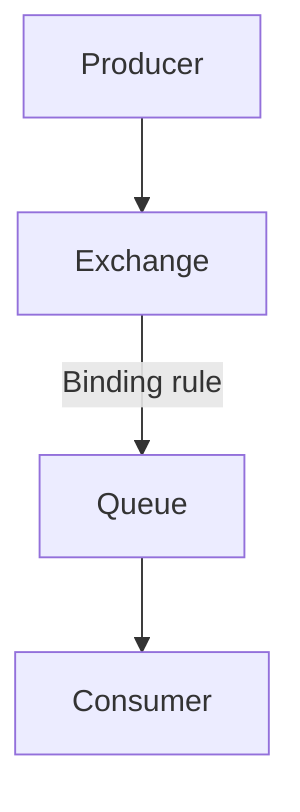

Think of it like a post office:

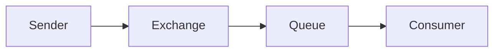

---

## 3. When to Use RabbitMQ

Good for:

- Sending emails after signup
- Processing orders in background
- Generating reports
- Image/video processing
- Retry failed tasks
- Decoupling microservices
- Event-driven systems

Avoid RabbitMQ when:

- You need immediate synchronous response only
- You need long-term analytics storage
- You need high-volume event streaming like Kafka use cases

---

## 4. Project Setup from Scratch

### Step 1: Create Spring Boot project

Use Spring Initializr with:

- Spring Web
- Spring AMQP
- Spring Boot Actuator
- Lombok optional

### Maven `pom.xml`

```xml
<dependencies>
    <dependency>
        <groupId>org.springframework.boot</groupId>
        <artifactId>spring-boot-starter-web</artifactId>
    </dependency>

    <dependency>
        <groupId>org.springframework.boot</groupId>
        <artifactId>spring-boot-starter-amqp</artifactId>
    </dependency>

    <dependency>
        <groupId>org.springframework.boot</groupId>
        <artifactId>spring-boot-starter-actuator</artifactId>
    </dependency>

    <dependency>
        <groupId>org.springframework.boot</groupId>
        <artifactId>spring-boot-starter-test</artifactId>
        <scope>test</scope>
    </dependency>

    <dependency>
        <groupId>org.springframework.amqp</groupId>
        <artifactId>spring-rabbit-test</artifactId>
        <scope>test</scope>
    </dependency>
</dependencies>
```

### Project structure

```text
rabbitmq-demo/
 └── src/main/java/com/example/rabbitmqdemo/
     ├── RabbitmqDemoApplication.java
     ├── config/
     │   └── RabbitConfig.java
     ├── controller/
     │   └── MessageController.java
     ├── producer/
     │   └── MessageProducer.java
     ├── consumer/
     │   └── MessageConsumer.java
     └── dto/
         └── OrderEvent.java
```

---

## 5. Run RabbitMQ with Docker

### `docker-compose.yml`

```yaml
version: "3.9"

services:
  rabbitmq:
    image: rabbitmq:3-management
    container_name: rabbitmq
    ports:
      - "5672:5672"
      - "15672:15672"
    environment:
      RABBITMQ_DEFAULT_USER: guest
      RABBITMQ_DEFAULT_PASS: guest
```

### Start RabbitMQ

```bash
docker compose up -d
```

### RabbitMQ UI

Open:

```text
http://localhost:15672
```

Login:

```text
username: guest
password: guest
```

---

## 6. Spring Boot Configuration

### `application.yml`

```yaml
spring:
  rabbitmq:
    host: localhost
    port: 5672
    username: guest
    password: guest

management:
  endpoints:
    web:
      exposure:
        include: health,info,metrics
```

---

## 7. Way 1: Simple Queue

### Flow

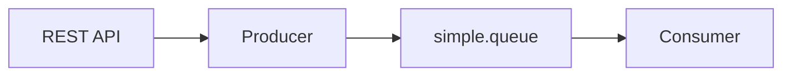

### Config

```java
@Configuration
public class RabbitConfig {

    public static final String SIMPLE_QUEUE = "simple.queue";

    @Bean
    public Queue simpleQueue() {
        return QueueBuilder.durable(SIMPLE_QUEUE).build();
    }
}
```

### Producer

```java
@Service
public class MessageProducer {

    private final RabbitTemplate rabbitTemplate;

    public MessageProducer(RabbitTemplate rabbitTemplate) {
        this.rabbitTemplate = rabbitTemplate;
    }

    public void send(String message) {
        rabbitTemplate.convertAndSend(RabbitConfig.SIMPLE_QUEUE, message);
    }
}
```

### Consumer

```java
@Component
public class MessageConsumer {

    @RabbitListener(queues = RabbitConfig.SIMPLE_QUEUE)
    public void consume(String message) {
        System.out.println("Received: " + message);
    }
}
```

### REST Controller

```java
@RestController
@RequestMapping("/messages")
public class MessageController {

    private final MessageProducer producer;

    public MessageController(MessageProducer producer) {
        this.producer = producer;
    }

    @PostMapping
    public String send(@RequestBody String message) {
        producer.send(message);
        return "Message sent";
    }
}
```

### Test with curl

```bash
curl -X POST http://localhost:8080/messages \
  -H "Content-Type: text/plain" \
  -d "Hello RabbitMQ"
```

---

## 8. Way 2: Work Queue

Use when many workers process tasks from one queue.

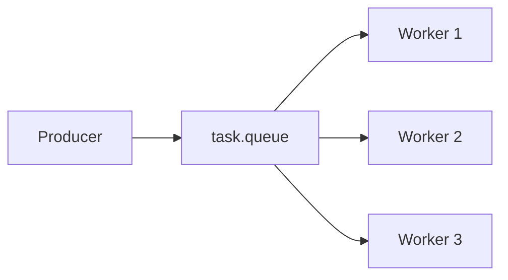

### Use case

- PDF generation
- Email sending
- Image resize
- Background jobs

### Config

```java
@Bean
public Queue taskQueue() {
    return QueueBuilder.durable("task.queue").build();
}
```

### Consumer

```java
@Component
public class TaskWorker {

    @RabbitListener(queues = "task.queue", concurrency = "3")
    public void process(String task) throws InterruptedException {
        System.out.println("Processing: " + task);
        Thread.sleep(1000);
        System.out.println("Done: " + task);
    }
}
```

### Producer

```java
public void sendTask(String task) {
    rabbitTemplate.convertAndSend("task.queue", task);
}
```

---

## 9. Way 3: Fanout Exchange

Fanout sends the same message to all bound queues.

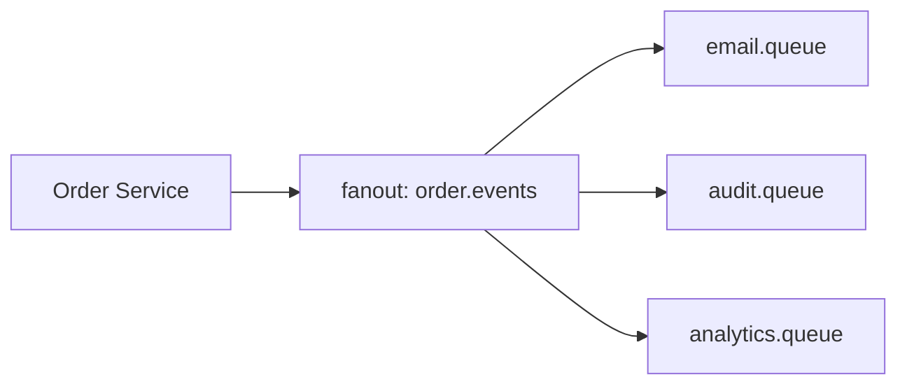

### Use case

When one event should notify many systems.

Example: `ORDER_CREATED`

- Email service sends confirmation
- Audit service stores event
- Analytics service updates dashboard

### Config

```java
@Configuration
public class FanoutConfig {

    public static final String EXCHANGE = "order.events";

    @Bean
    FanoutExchange orderFanoutExchange() {
        return new FanoutExchange(EXCHANGE);
    }

    @Bean
    Queue emailQueue() {
        return QueueBuilder.durable("email.queue").build();
    }

    @Bean
    Queue auditQueue() {
        return QueueBuilder.durable("audit.queue").build();
    }

    @Bean
    Binding emailBinding() {
        return BindingBuilder.bind(emailQueue()).to(orderFanoutExchange());
    }

    @Bean
    Binding auditBinding() {
        return BindingBuilder.bind(auditQueue()).to(orderFanoutExchange());
    }
}
```

### Publish

```java
rabbitTemplate.convertAndSend("order.events", "", "ORDER_CREATED:1001");
```

### Consumers

```java
@RabbitListener(queues = "email.queue")
public void email(String event) {
    System.out.println("Email event: " + event);
}

@RabbitListener(queues = "audit.queue")
public void audit(String event) {
    System.out.println("Audit event: " + event);
}
```

---

## 10. Way 4: Direct Exchange

Direct exchange routes by exact routing key.

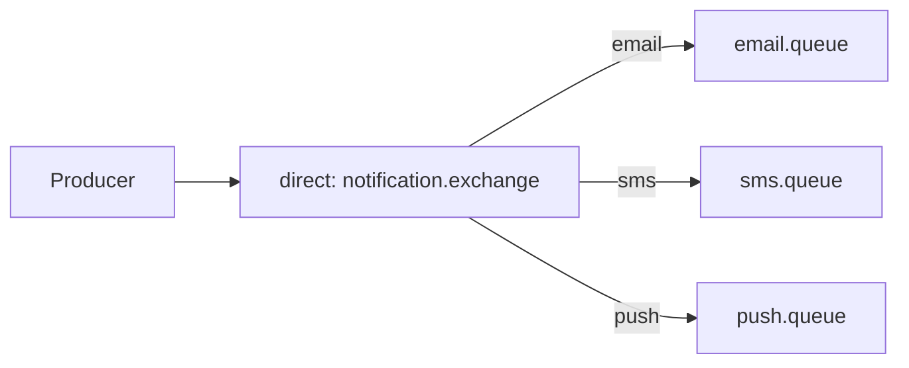

### Config

```java
@Bean
DirectExchange notificationExchange() {
    return new DirectExchange("notification.exchange");
}

@Bean
Queue smsQueue() {
    return QueueBuilder.durable("sms.queue").build();
}

@Bean
Binding smsBinding() {
    return BindingBuilder
            .bind(smsQueue())
            .to(notificationExchange())
            .with("sms");
}
```

### Send by routing key

```java
rabbitTemplate.convertAndSend(
        "notification.exchange",
        "sms",
        "Your OTP is 123456"
);
```

---

## 11. Way 5: Topic Exchange

Topic exchange routes by pattern.

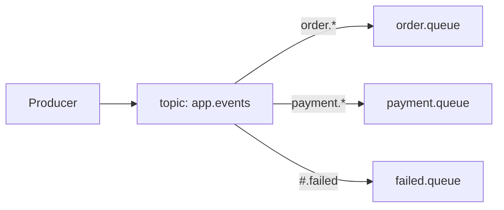

### Routing examples

| Routing key | Meaning |
|---|---|
| `order.created` | New order |
| `order.cancelled` | Cancelled order |
| `payment.completed` | Payment success |
| `payment.failed` | Payment failed |

### Pattern rules

| Symbol | Meaning |
|---|---|
| `*` | One word |
| `#` | Zero or more words |

### Config

```java
@Bean
TopicExchange appEventsExchange() {
    return new TopicExchange("app.events");
}

@Bean
Queue orderQueue() {
    return QueueBuilder.durable("order.queue").build();
}

@Bean
Binding orderBinding() {
    return BindingBuilder
            .bind(orderQueue())
            .to(appEventsExchange())
            .with("order.*");
}
```

### Publish

```java
rabbitTemplate.convertAndSend("app.events", "order.created", "Order 1001 created");
rabbitTemplate.convertAndSend("app.events", "payment.failed", "Payment failed");
```

---

## 12. Way 6: Headers Exchange

Routes using message headers instead of routing key.

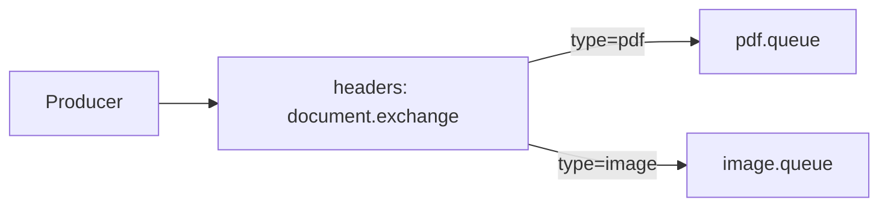

### Config

```java
@Bean
HeadersExchange documentExchange() {
    return new HeadersExchange("document.exchange");
}

@Bean
Queue pdfQueue() {
    return QueueBuilder.durable("pdf.queue").build();
}

@Bean
Binding pdfBinding() {
    return BindingBuilder
            .bind(pdfQueue())
            .to(documentExchange())
            .where("type")
            .matches("pdf");
}
```

### Publish with headers

```java
MessageProperties properties = new MessageProperties();
properties.setHeader("type", "pdf");
properties.setContentType("text/plain");

Message message = new Message("Generate PDF".getBytes(), properties);
rabbitTemplate.send("document.exchange", "", message);
```

---

## 13. Real Use Case: Order Processing

### Goal

When user places an order:

1. REST API accepts order
2. Order service saves order
3. Publishes event
4. Payment service processes payment
5. Email service sends confirmation
6. Audit service records event

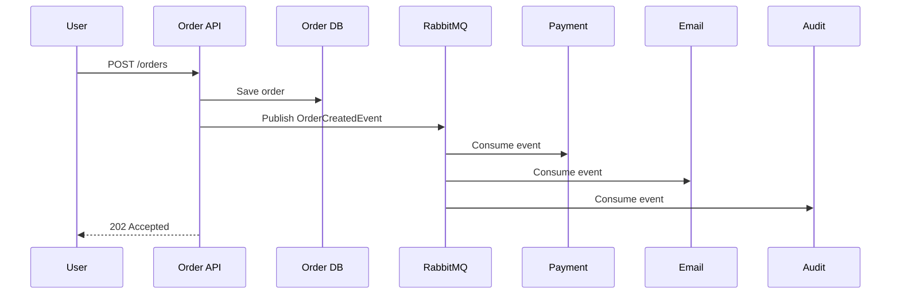

### DTO

```java
public record OrderCreatedEvent(
        Long orderId,
        Long userId,
        BigDecimal amount,
        String status
) {}
```

### JSON converter

```java
@Configuration
public class JsonRabbitConfig {

    @Bean
    public MessageConverter messageConverter() {
        return new Jackson2JsonMessageConverter();
    }

    @Bean
    public RabbitTemplate rabbitTemplate(
            ConnectionFactory connectionFactory,
            MessageConverter messageConverter
    ) {
        RabbitTemplate template = new RabbitTemplate(connectionFactory);
        template.setMessageConverter(messageConverter);
        return template;
    }
}
```

### Publish order event

```java
@Service
public class OrderEventPublisher {

    private final RabbitTemplate rabbitTemplate;

    public OrderEventPublisher(RabbitTemplate rabbitTemplate) {
        this.rabbitTemplate = rabbitTemplate;
    }

    public void publish(OrderCreatedEvent event) {
        rabbitTemplate.convertAndSend(
                "order.events",
                "order.created",
                event
        );
    }
}
```

### Consume order event

```java
@Component
public class PaymentConsumer {

    @RabbitListener(queues = "payment.queue")
    public void handle(OrderCreatedEvent event) {
        System.out.println("Processing payment for order " + event.orderId());
    }
}
```

---

## 14. Retry Pattern

Use retry when failures are temporary.

Examples:

- Payment gateway timeout
- Email provider unavailable
- Network error

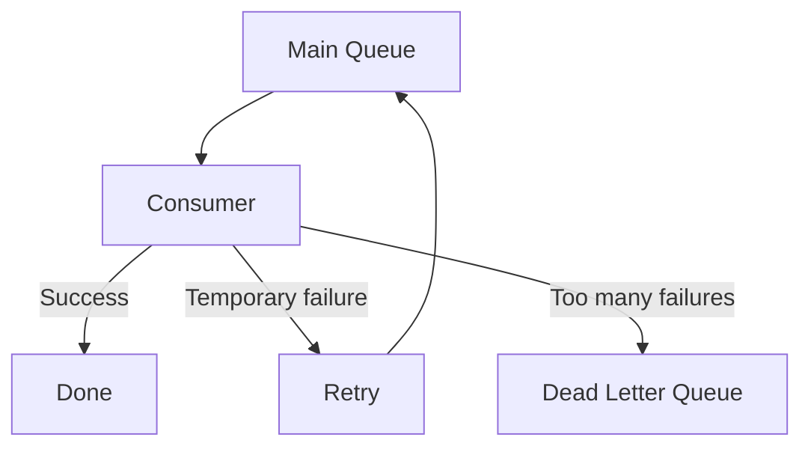

### `application.yml`

```yaml
spring:
  rabbitmq:
    listener:
      simple:
        retry:
          enabled: true
          initial-interval: 2s
          max-attempts: 3
          multiplier: 2
          max-interval: 10s
```

### Consumer throwing error

```java
@RabbitListener(queues = "payment.queue")
public void processPayment(OrderCreatedEvent event) {
    if (event.amount().signum() <= 0) {
        throw new IllegalArgumentException("Invalid amount");
    }

    System.out.println("Payment processed");
}
```

---

## 15. Dead Letter Queue Pattern

DLQ stores messages that cannot be processed.

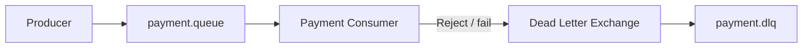

### Config

```java
@Configuration
public class DeadLetterConfig {

    @Bean
    DirectExchange paymentExchange() {
        return new DirectExchange("payment.exchange");
    }

    @Bean
    DirectExchange deadLetterExchange() {
        return new DirectExchange("payment.dlx");
    }

    @Bean
    Queue paymentQueue() {
        return QueueBuilder.durable("payment.queue")
                .withArgument("x-dead-letter-exchange", "payment.dlx")
                .withArgument("x-dead-letter-routing-key", "payment.failed")
                .build();
    }

    @Bean
    Queue paymentDlq() {
        return QueueBuilder.durable("payment.dlq").build();
    }

    @Bean
    Binding paymentBinding() {
        return BindingBuilder.bind(paymentQueue())
                .to(paymentExchange())
                .with("payment.process");
    }

    @Bean
    Binding paymentDlqBinding() {
        return BindingBuilder.bind(paymentDlq())
                .to(deadLetterExchange())
                .with("payment.failed");
    }
}
```

### DLQ consumer

```java
@Component
public class PaymentDlqConsumer {

    @RabbitListener(queues = "payment.dlq")
    public void handleFailedMessage(OrderCreatedEvent event) {
        System.out.println("Moved to DLQ: " + event);
    }
}
```

---

## 16. Delayed Message Pattern

Use when you need delayed processing.

Examples:

- Cancel unpaid order after 15 minutes
- Send reminder email tomorrow
- Retry later without blocking worker

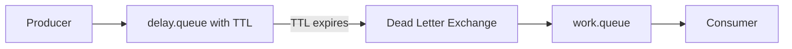

### Delay queue config using TTL

```java
@Bean
Queue orderDelayQueue() {
    return QueueBuilder.durable("order.delay.queue")
            .withArgument("x-message-ttl", 900000)
            .withArgument("x-dead-letter-exchange", "order.exchange")
            .withArgument("x-dead-letter-routing-key", "order.timeout")
            .build();
}
```

### Timeout queue

```java
@Bean
Queue orderTimeoutQueue() {
    return QueueBuilder.durable("order.timeout.queue").build();
}

@Bean
Binding orderTimeoutBinding() {
    return BindingBuilder.bind(orderTimeoutQueue())
            .to(new DirectExchange("order.exchange"))
            .with("order.timeout");
}
```

### Consumer

```java
@RabbitListener(queues = "order.timeout.queue")
public void cancelUnpaidOrder(String orderId) {
    System.out.println("Cancel unpaid order: " + orderId);
}
```

---

## 17. Request-Reply / RPC Pattern

Use when service needs a response through RabbitMQ.

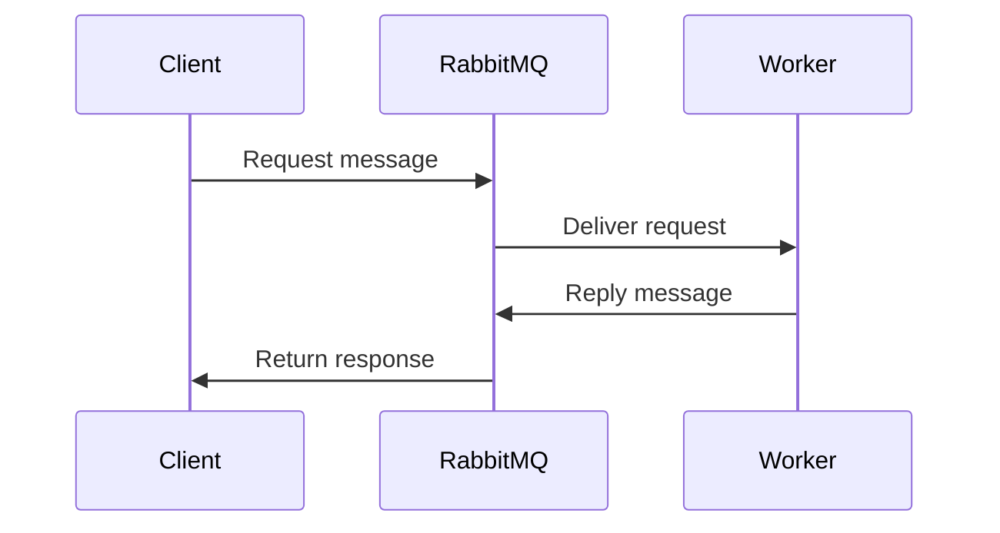

### Server side

```java
@RabbitListener(queues = "price.request.queue")
public BigDecimal calculatePrice(String productId) {
    return new BigDecimal("99.99");
}
```

### Client side

```java
public BigDecimal requestPrice(String productId) {
    Object response = rabbitTemplate.convertSendAndReceive(
            "price.request.queue",
            productId
    );

    return new BigDecimal(response.toString());
}
```

Use RPC carefully. For normal REST request-response, REST is simpler.

---

## 18. JSON Message DTOs

Prefer DTOs over raw strings.

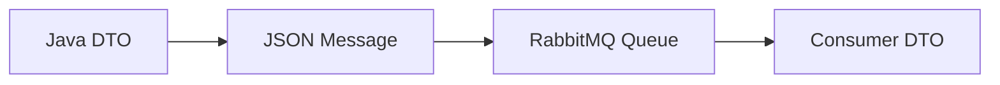

### DTO

```java
public record UserRegisteredEvent(
        Long userId,
        String email,
        Instant registeredAt
) {}
```

### Producer

```java
public void publishUserRegistered(UserRegisteredEvent event) {
    rabbitTemplate.convertAndSend(
            "user.events",
            "user.registered",
            event
    );
}
```

### Consumer

```java
@RabbitListener(queues = "welcome.email.queue")
public void sendWelcomeEmail(UserRegisteredEvent event) {
    System.out.println("Send welcome email to " + event.email());
}
```

---

## 19. Manual Acknowledgement

Default mode auto-acks when listener succeeds.

Manual ack gives more control.

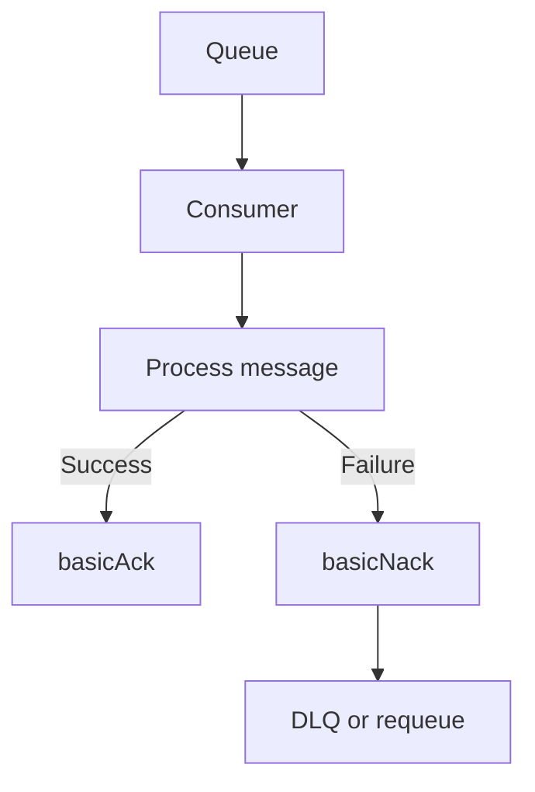

### `application.yml`

```yaml
spring:
  rabbitmq:
    listener:
      simple:
        acknowledge-mode: manual
```

### Consumer

```java
@RabbitListener(queues = "payment.queue")
public void consume(
        OrderCreatedEvent event,
        Channel channel,
        Message message
) throws IOException {
    long tag = message.getMessageProperties().getDeliveryTag();

    try {
        System.out.println("Processing " + event.orderId());
        channel.basicAck(tag, false);
    } catch (Exception ex) {
        channel.basicNack(tag, false, false);
    }
}
```

### Ack choices

| Method | Meaning |
|---|---|
| `basicAck` | Message processed successfully |
| `basicNack(..., true)` | Failed, requeue |
| `basicNack(..., false)` | Failed, do not requeue |
| `basicReject` | Reject one message |

---

## 20. Idempotent Consumer

A message can be delivered more than once.

Your consumer should be safe to run twice.

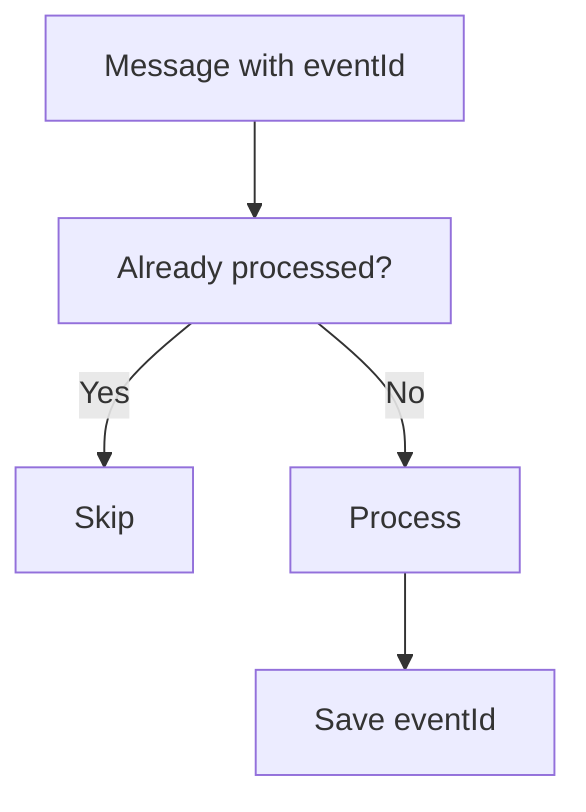

### Event with ID

```java
public record PaymentEvent(
        UUID eventId,
        Long orderId,
        BigDecimal amount
) {}
```

### Consumer idea

```java
@Service
public class PaymentEventHandler {

    private final Set<UUID> processedEvents = ConcurrentHashMap.newKeySet();

    public void handle(PaymentEvent event) {
        if (!processedEvents.add(event.eventId())) {
            System.out.println("Duplicate ignored: " + event.eventId());
            return;
        }

        System.out.println("Process payment: " + event.orderId());
    }
}
```

In production, store processed event IDs in a database table.

---

## 21. Publisher Confirm

Publisher confirm tells producer if RabbitMQ received the message.

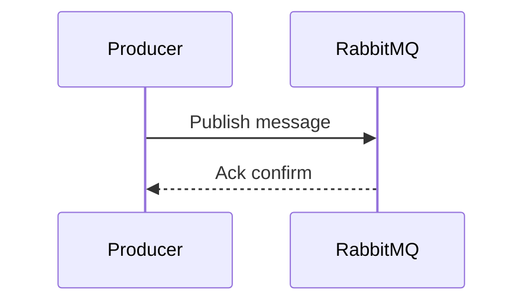

### `application.yml`

```yaml
spring:
  rabbitmq:
    publisher-confirm-type: correlated
    publisher-returns: true
```

### Configure callback

```java
@PostConstruct
public void setupConfirmCallback() {
    rabbitTemplate.setConfirmCallback((correlation, ack, cause) -> {
        if (ack) {
            System.out.println("Message confirmed");
        } else {
            System.out.println("Message failed: " + cause);
        }
    });
}
```

---

## 22. Monitoring RabbitMQ

### RabbitMQ Management UI

```text
http://localhost:15672
```

Watch:

- Queue depth
- Message publish rate
- Consumer count
- Unacked messages
- Memory usage
- Disk usage
- Connection count

```mermaid
flowchart LR
    App["Spring Boot App"] --> Rabbit["RabbitMQ"]
    Rabbit --> UI["Management UI"]
    Rabbit --> Metrics["Metrics"]
    Metrics --> Prometheus["Prometheus"]
    Prometheus --> Grafana["Grafana Dashboard"]
```

### Useful Actuator endpoint

```bash
curl http://localhost:8080/actuator/health
```

---

## 23. Testing RabbitMQ

### Testcontainers setup

```xml
<dependency>
    <groupId>org.testcontainers</groupId>
    <artifactId>rabbitmq</artifactId>
    <scope>test</scope>
</dependency>
```

### Integration test

```java
@SpringBootTest
@Testcontainers
class RabbitIntegrationTest {

    @Container
    static RabbitMQContainer rabbit = new RabbitMQContainer("rabbitmq:3-management");

    @DynamicPropertySource
    static void rabbitProperties(DynamicPropertyRegistry registry) {
        registry.add("spring.rabbitmq.host", rabbit::getHost);
        registry.add("spring.rabbitmq.port", rabbit::getAmqpPort);
        registry.add("spring.rabbitmq.username", rabbit::getAdminUsername);
        registry.add("spring.rabbitmq.password", rabbit::getAdminPassword);
    }

    @Autowired
    RabbitTemplate rabbitTemplate;

    @Test
    void shouldSendMessage() {
        rabbitTemplate.convertAndSend("simple.queue", "hello");
    }
}
```

---

## 24. Production Checklist

```mermaid
flowchart TD
    Durable["Durable queues"] --> Persistent["Persistent messages"]
    Persistent --> Retry["Retry policy"]
    Retry --> DLQ["Dead letter queue"]
    DLQ --> Idempotency["Idempotent consumers"]
    Idempotency --> Monitoring["Monitoring and alerts"]
    Monitoring --> Security["TLS and credentials"]
```

### Checklist

- Use durable queues
- Use persistent messages
- Add DLQ for failed messages
- Add retry with backoff
- Make consumers idempotent
- Monitor queue depth
- Monitor unacked messages
- Use separate users per application
- Avoid default `guest/guest` in production
- Use TLS for external connections
- Set prefetch count
- Use publisher confirms for important messages

### Prefetch example

```yaml
spring:
  rabbitmq:
    listener:
      simple:
        prefetch: 10
```

---

## 25. Pattern Selection Cheat Sheet

| Need | RabbitMQ Pattern |
|---|---|
| One producer, one consumer | Simple queue |
| Many workers sharing jobs | Work queue |
| Send same event to many services | Fanout exchange |
| Route by exact type | Direct exchange |
| Route by pattern | Topic exchange |
| Route by metadata | Headers exchange |
| Failed message handling | DLQ |
| Temporary failure handling | Retry |
| Process later | Delayed queue / TTL |
| Need response through MQ | RPC |
| Avoid duplicate effects | Idempotent consumer |
| Confirm broker received message | Publisher confirm |

---

# Complete Mini Project Flow

## Use case: Order notification system

```mermaid
flowchart TD
    Client["Client"] --> API["POST /orders"]
    API --> OrderService["OrderService"]
    OrderService --> DB["Save order"]
    OrderService --> Rabbit["Publish order.created"]
    Rabbit --> Email["Email Consumer"]
    Rabbit --> Payment["Payment Consumer"]
    Rabbit --> Audit["Audit Consumer"]
```

## Step 1: Order request

```java
public record CreateOrderRequest(
        Long userId,
        BigDecimal amount
) {}
```

## Step 2: Order controller

```java
@RestController
@RequestMapping("/orders")
public class OrderController {

    private final OrderService orderService;

    public OrderController(OrderService orderService) {
        this.orderService = orderService;
    }

    @PostMapping
    public ResponseEntity<String> create(@RequestBody CreateOrderRequest request) {
        Long orderId = orderService.createOrder(request);
        return ResponseEntity.accepted().body("Order accepted: " + orderId);
    }
}
```

## Step 3: Order service

```java
@Service
public class OrderService {

    private final OrderEventPublisher publisher;

    public OrderService(OrderEventPublisher publisher) {
        this.publisher = publisher;
    }

    public Long createOrder(CreateOrderRequest request) {
        Long orderId = System.currentTimeMillis();

        OrderCreatedEvent event = new OrderCreatedEvent(
                orderId,
                request.userId(),
                request.amount(),
                "CREATED"
        );

        publisher.publish(event);
        return orderId;
    }
}
```

## Step 4: RabbitMQ topic config

```java
@Configuration
public class OrderRabbitConfig {

    @Bean
    TopicExchange orderEventsExchange() {
        return new TopicExchange("order.events");
    }

    @Bean
    Queue paymentQueue() {
        return QueueBuilder.durable("payment.queue").build();
    }

    @Bean
    Queue emailQueue() {
        return QueueBuilder.durable("email.queue").build();
    }

    @Bean
    Queue auditQueue() {
        return QueueBuilder.durable("audit.queue").build();
    }

    @Bean
    Binding paymentQueueBinding() {
        return BindingBuilder.bind(paymentQueue())
                .to(orderEventsExchange())
                .with("order.created");
    }

    @Bean
    Binding emailQueueBinding() {
        return BindingBuilder.bind(emailQueue())
                .to(orderEventsExchange())
                .with("order.created");
    }

    @Bean
    Binding auditQueueBinding() {
        return BindingBuilder.bind(auditQueue())
                .to(orderEventsExchange())
                .with("order.*");
    }
}
```

## Step 5: Consumers

```java
@Component
public class OrderConsumers {

    @RabbitListener(queues = "payment.queue")
    public void payment(OrderCreatedEvent event) {
        System.out.println("Payment started for order " + event.orderId());
    }

    @RabbitListener(queues = "email.queue")
    public void email(OrderCreatedEvent event) {
        System.out.println("Email sent for order " + event.orderId());
    }

    @RabbitListener(queues = "audit.queue")
    public void audit(OrderCreatedEvent event) {
        System.out.println("Audit saved for order " + event.orderId());
    }
}
```

## Step 6: Test the project

```bash
curl -X POST http://localhost:8080/orders \
  -H "Content-Type: application/json" \
  -d '{"userId": 10, "amount": 99.99}'
```

Expected logs:

```text
Payment started for order 123456789
Email sent for order 123456789
Audit saved for order 123456789
```

---

# Final Learning Path

```mermaid
flowchart TD
    A["Simple Queue"] --> B["Work Queue"]
    B --> C["Fanout Exchange"]
    C --> D["Direct Exchange"]
    D --> E["Topic Exchange"]
    E --> F["JSON DTO Events"]
    F --> G["Retry and DLQ"]
    G --> H["Delayed Messages"]
    H --> I["Manual Ack"]
    I --> J["Idempotency"]
    J --> K["Publisher Confirms"]
    K --> L["Monitoring and Production"]
```

