# Java Concurrency Visual Reference

Visual-first notes for classic Java concurrency interview/design problems.

> Mermaid diagrams are written in safe syntax: no parentheses in node labels, no raw `<br>`, and quoted labels where useful.

## Clickable Index

### Synchronization Problems
| # | Problem | Core Construct | Link |
|---:|---|---|---|
| 1 | Print Foo Bar Alternately | `Semaphore` | [Open](#1-print-foo-bar-alternately) |
| 2 | Print Zero Even Odd | `Semaphore` | [Open](#2-print-zero-even-odd) |
| 3 | Fizz Buzz Multithreaded | `synchronized`, `wait`, `notifyAll` | [Open](#3-fizz-buzz-multithreaded) |
| 4 | Building H2O Molecule | `Semaphore`, `CyclicBarrier` | [Open](#4-building-h2o-molecule) |
| 5 | Readers-Writers Problem | `ReentrantReadWriteLock` | [Open](#5-readers-writers-problem) |
| 6 | Unisex Bathroom | `Semaphore`, `Lock`, `Condition` | [Open](#6-unisex-bathroom) |
| 7 | Bounded Buffer | `ReentrantLock`, `Condition` | [Open](#7-bounded-buffer) |
| 8 | Sleeping Barber | `Semaphore`, `Queue` | [Open](#8-sleeping-barber) |
| 9 | Dining Philosophers | `Semaphore`, ordered locks | [Open](#9-dining-philosophers) |
| 10 | Cigarette Smokers Problem | `Semaphore` | [Open](#10-cigarette-smokers-problem) |
| 11 | Santa Claus Problem | `Lock`, `Condition` | [Open](#11-santa-claus-problem) |

### Concurrency Design Problems
| # | Problem | Core Construct | Link |
|---:|---|---|---|
| 12 | Thread-Safe Cache with TTL | `ConcurrentHashMap`, cleaner | [Open](#12-design-thread-safe-cache-with-ttl) |
| 13 | Thread-Safe Rate Limiter | `ConcurrentHashMap`, synchronized bucket | [Open](#13-design-thread-safe-rate-limiter) |
| 14 | Deferred Callback Executor | `PriorityBlockingQueue` | [Open](#14-design-deferred-callback-executor) |
| 15 | Ticket Booking System | per-seat lock | [Open](#15-design-ticket-booking-system) |
| 16 | Multithreaded Web Crawler | `BlockingQueue`, visited set | [Open](#16-design-multithreaded-web-crawler) |
| 17 | Multithreaded Pub-Sub System | `BlockingQueue`, subscribers | [Open](#17-design-multithreaded-pub-sub-system) |
| 18 | Task Scheduler with Dependencies | DAG, ready queue | [Open](#18-design-task-scheduler-with-dependencies) |

### Concurrent Data Structures
| # | Problem | Core Construct | Link |
|---:|---|---|---|
| 19 | Concurrent HashMap | lock striping | [Open](#19-design-concurrent-hashmap) |
| 20 | Blocking Queue | `Lock`, two conditions | [Open](#20-design-thread-safe-blocking-queue) |
| 21 | Concurrent Bloom Filter | `AtomicLongArray` | [Open](#21-design-concurrent-bloom-filter) |
| 22 | Lock-Free Queue | CAS linked nodes | [Open](#22-design-lock-free-queue) |
| 23 | Concurrent Priority Queue | heap lock | [Open](#23-design-concurrent-priority-queue) |
| 24 | Thread-Safe Trie | node locks | [Open](#24-design-thread-safe-trie) |

### Multi-threaded Algorithms
| # | Problem | Core Construct | Link |
|---:|---|---|---|
| 25 | Merge Sort | `ForkJoinPool` | [Open](#25-multi-threaded-merge-sort) |
| 26 | Word Frequency Counter | `ExecutorService`, merge maps | [Open](#26-multi-threaded-word-frequency-counter) |
| 27 | BFS DFS Graph Traversal | concurrent visited set | [Open](#27-concurrent-bfs-dfs-graph-traversal) |

---

## Legend

| Symbol | Meaning |
|---|---|
| Permit | A token that allows a thread to continue |
| Lock | One-at-a-time critical section guard |
| Condition | A waiting room attached to a lock |
| Atomic | CPU-level compare-and-swap style update |
| Blocking queue | Queue that waits when empty or full |

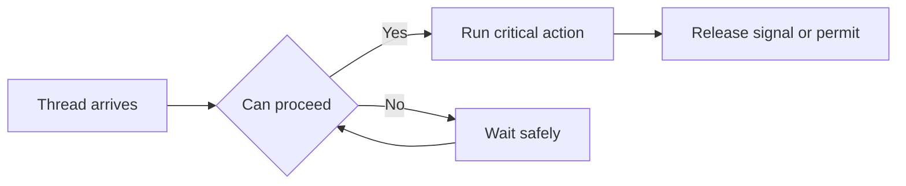

---

# Synchronization Problems

## 1. Print Foo Bar Alternately

### Goal
Print `foo bar foo bar ...` exactly `n` times.

### Visual flow
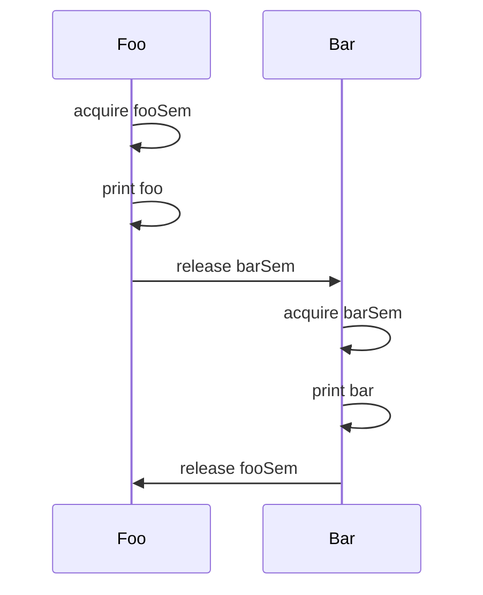

### Construct choice
| Construct | Why used |
|---|---|
| `Semaphore fooSem = 1` | Lets `foo` start first |
| `Semaphore barSem = 0` | Blocks `bar` until `foo` prints |

### Internal idea
A semaphore holds permits. `acquire()` decreases a permit or blocks. `release()` increases a permit and wakes one waiting thread.

```java
import java.util.concurrent.Semaphore;

class FooBar {
    private final int n;
    private final Semaphore fooSem = new Semaphore(1);
    private final Semaphore barSem = new Semaphore(0);

    FooBar(int n) { this.n = n; }

    public void foo(Runnable printFoo) throws InterruptedException {
        for (int i = 0; i < n; i++) {
            fooSem.acquire();
            printFoo.run();
            barSem.release();
        }
    }

    public void bar(Runnable printBar) throws InterruptedException {
        for (int i = 0; i < n; i++) {
            barSem.acquire();
            printBar.run();
            fooSem.release();
        }
    }
}
```

---

## 2. Print Zero Even Odd

### Goal
For `n = 5`, print `0102030405`.

### Visual flow
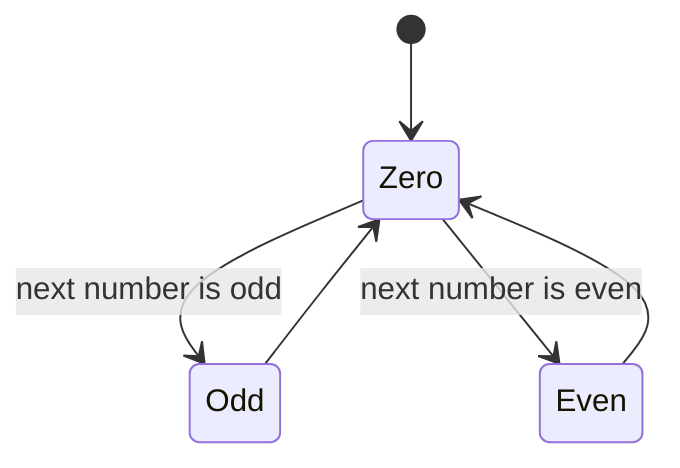

### Construct choice
| Semaphore | Initial | Purpose |
|---|---:|---|
| `zeroSem` | 1 | zero prints first and between numbers |
| `oddSem` | 0 | odd waits for zero |
| `evenSem` | 0 | even waits for zero |

```java
import java.util.concurrent.Semaphore;
import java.util.function.IntConsumer;

class ZeroEvenOdd {
    private final int n;
    private final Semaphore zeroSem = new Semaphore(1);
    private final Semaphore oddSem = new Semaphore(0);
    private final Semaphore evenSem = new Semaphore(0);

    ZeroEvenOdd(int n) { this.n = n; }

    public void zero(IntConsumer printNumber) throws InterruptedException {
        for (int i = 1; i <= n; i++) {
            zeroSem.acquire();
            printNumber.accept(0);
            if (i % 2 == 1) oddSem.release();
            else evenSem.release();
        }
    }

    public void odd(IntConsumer printNumber) throws InterruptedException {
        for (int i = 1; i <= n; i += 2) {
            oddSem.acquire();
            printNumber.accept(i);
            zeroSem.release();
        }
    }

    public void even(IntConsumer printNumber) throws InterruptedException {
        for (int i = 2; i <= n; i += 2) {
            evenSem.acquire();
            printNumber.accept(i);
            zeroSem.release();
        }
    }
}
```

---

## 3. Fizz Buzz Multithreaded

### Goal
Four threads print `fizz`, `buzz`, `fizzbuzz`, or number.

### Visual rule table
| Number condition | Thread allowed |
|---|---|
| divisible by 3 and not 5 | fizz |
| divisible by 5 and not 3 | buzz |
| divisible by 15 | fizzbuzz |
| otherwise | number |

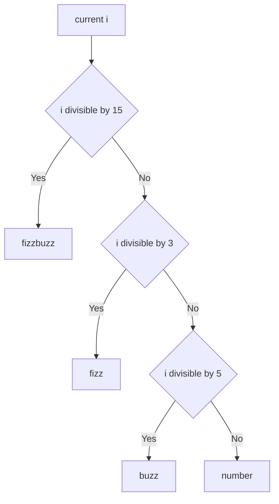

### Construct choice
| Construct | Why used |
|---|---|
| `synchronized` | Protects shared counter `i` |
| `wait()` | Thread sleeps when rule does not match |
| `notifyAll()` | Counter changed, all rule-checking threads recheck |

```java
import java.util.function.IntConsumer;

class FizzBuzz {
    private final int n;
    private int i = 1;

    FizzBuzz(int n) { this.n = n; }

    private synchronized void runWhen(Runnable action, java.util.function.IntPredicate ok)
            throws InterruptedException {
        while (i <= n) {
            while (i <= n && !ok.test(i)) wait();
            if (i > n) break;
            action.run();
            i++;
            notifyAll();
        }
        notifyAll();
    }

    public void fizz(Runnable printFizz) throws InterruptedException {
        runWhen(printFizz, x -> x % 3 == 0 && x % 5 != 0);
    }

    public void buzz(Runnable printBuzz) throws InterruptedException {
        runWhen(printBuzz, x -> x % 5 == 0 && x % 3 != 0);
    }

    public void fizzbuzz(Runnable printFizzBuzz) throws InterruptedException {
        runWhen(printFizzBuzz, x -> x % 15 == 0);
    }

    public void number(IntConsumer printNumber) throws InterruptedException {
        runWhen(() -> printNumber.accept(i), x -> x % 3 != 0 && x % 5 != 0);
    }
}
```

---

## 4. Building H2O Molecule

### Goal
Print exactly two `H` and one `O` per molecule.

### Visual gate
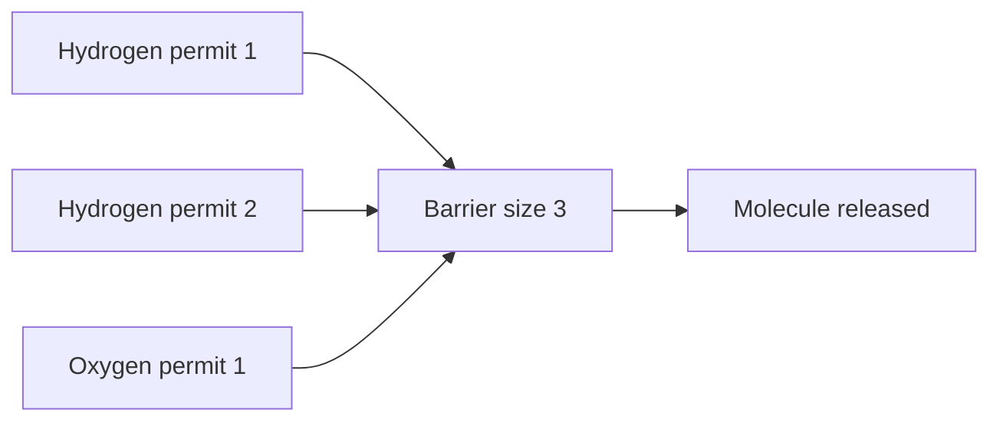

### Construct choice
| Construct | Why used |
|---|---|
| `Semaphore h = 2` | At most two H per group |
| `Semaphore o = 1` | At most one O per group |
| `CyclicBarrier(3)` | Releases only when all three atoms arrive |

```java
import java.util.concurrent.CyclicBarrier;
import java.util.concurrent.Semaphore;

class H2O {
    private final Semaphore h = new Semaphore(2);
    private final Semaphore o = new Semaphore(1);
    private final CyclicBarrier barrier = new CyclicBarrier(3, () -> {
        h.release(2);
        o.release(1);
    });

    public void hydrogen(Runnable releaseHydrogen) throws Exception {
        h.acquire();
        releaseHydrogen.run();
        barrier.await();
    }

    public void oxygen(Runnable releaseOxygen) throws Exception {
        o.acquire();
        releaseOxygen.run();
        barrier.await();
    }
}
```

---

## 5. Readers-Writers Problem

### Goal
Many readers can read together. Writers need exclusive access.

### Visual
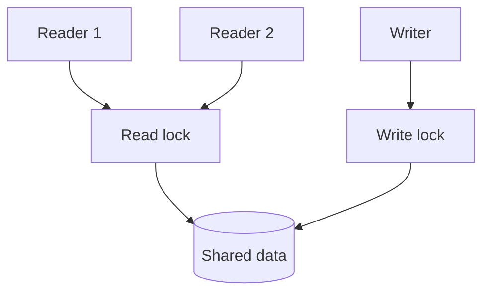

### Construct choice
| Construct | Why used |
|---|---|
| `readLock()` | Allows multiple concurrent readers |
| `writeLock()` | Allows one writer and blocks readers |

```java
import java.util.concurrent.locks.ReentrantReadWriteLock;

class SafeDocument {
    private String text = "";
    private final ReentrantReadWriteLock rw = new ReentrantReadWriteLock(true);

    public String read() {
        rw.readLock().lock();
        try {
            return text;
        } finally {
            rw.readLock().unlock();
        }
    }

    public void write(String newText) {
        rw.writeLock().lock();
        try {
            text = newText;
        } finally {
            rw.writeLock().unlock();
        }
    }
}
```

---

## 6. Unisex Bathroom

### Goal
Bathroom can hold limited people, but never mix genders at the same time.

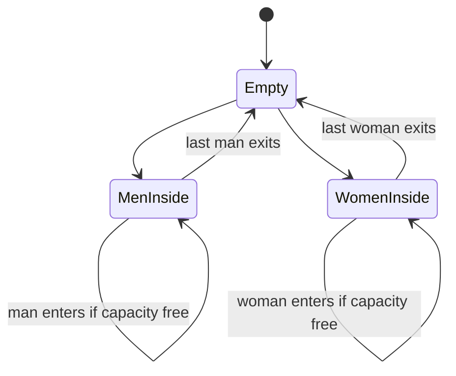

### Construct choice
| Construct | Why used |
|---|---|
| `Lock` | Protects gender and count state |
| `Condition` | Wait until bathroom is compatible |
| `Semaphore` | Enforces capacity |

```java
import java.util.concurrent.Semaphore;
import java.util.concurrent.locks.*;

class UnisexBathroom {
    enum Gender { NONE, MALE, FEMALE }

    private final int capacity;
    private final Semaphore stalls;
    private final Lock lock = new ReentrantLock(true);
    private final Condition canEnter = lock.newCondition();
    private Gender current = Gender.NONE;
    private int inside = 0;

    UnisexBathroom(int capacity) {
        this.capacity = capacity;
        this.stalls = new Semaphore(capacity, true);
    }

    public void enter(Gender g) throws InterruptedException {
        lock.lock();
        try {
            while (current != Gender.NONE && current != g) canEnter.await();
            current = g;
            inside++;
        } finally {
            lock.unlock();
        }
        stalls.acquire();
    }

    public void leave() {
        stalls.release();
        lock.lock();
        try {
            inside--;
            if (inside == 0) {
                current = Gender.NONE;
                canEnter.signalAll();
            }
        } finally {
            lock.unlock();
        }
    }
}
```

---

## 7. Bounded Buffer

### Goal
Producer waits when full. Consumer waits when empty.

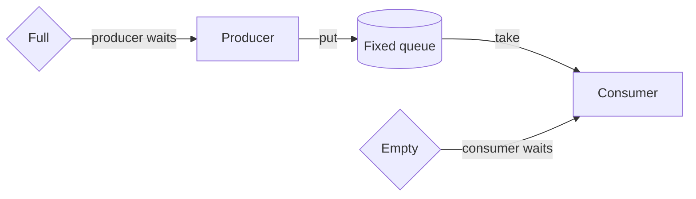

### Construct choice
| Construct | Why used |
|---|---|
| `ReentrantLock` | Protects queue mutation |
| `notFull` | Producers wait here |
| `notEmpty` | Consumers wait here |

```java
import java.util.*;
import java.util.concurrent.locks.*;

class BoundedBuffer<T> {
    private final Queue<T> q = new ArrayDeque<>();
    private final int capacity;
    private final Lock lock = new ReentrantLock();
    private final Condition notFull = lock.newCondition();
    private final Condition notEmpty = lock.newCondition();

    BoundedBuffer(int capacity) { this.capacity = capacity; }

    public void put(T item) throws InterruptedException {
        lock.lock();
        try {
            while (q.size() == capacity) notFull.await();
            q.add(item);
            notEmpty.signal();
        } finally {
            lock.unlock();
        }
    }

    public T take() throws InterruptedException {
        lock.lock();
        try {
            while (q.isEmpty()) notEmpty.await();
            T item = q.remove();
            notFull.signal();
            return item;
        } finally {
            lock.unlock();
        }
    }
}
```

---

## 8. Sleeping Barber

### Goal
Barber sleeps when no customers. Customers wait only if chairs are free.

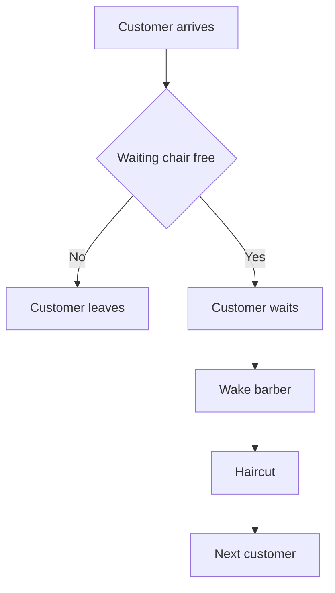

### Construct choice
| Construct | Why used |
|---|---|
| `Semaphore customers` | Counts waiting customers |
| `Semaphore barberReady` | Lets selected customer sit |
| `mutex` | Protects waiting count |

```java
import java.util.concurrent.Semaphore;

class SleepingBarber {
    private final int chairs;
    private int waiting = 0;
    private final Semaphore mutex = new Semaphore(1);
    private final Semaphore customers = new Semaphore(0);
    private final Semaphore barberReady = new Semaphore(0);

    SleepingBarber(int chairs) { this.chairs = chairs; }

    public boolean customer() throws InterruptedException {
        mutex.acquire();
        if (waiting == chairs) {
            mutex.release();
            return false;
        }
        waiting++;
        customers.release();
        mutex.release();

        barberReady.acquire();
        return true;
    }

    public void barberLoop(Runnable cutHair) throws InterruptedException {
        while (true) {
            customers.acquire();
            mutex.acquire();
            waiting--;
            barberReady.release();
            mutex.release();
            cutHair.run();
        }
    }
}
```

---

## 9. Dining Philosophers

### Goal
Avoid deadlock when philosophers need two forks.

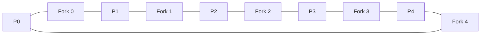

### Construct choice
| Strategy | Why used |
|---|---|
| Pick lower-numbered fork first | Breaks circular wait |
| `ReentrantLock` per fork | Represents exclusive fork ownership |

```java
import java.util.concurrent.locks.ReentrantLock;

class DiningPhilosophers {
    private final ReentrantLock[] forks = new ReentrantLock[5];

    DiningPhilosophers() {
        for (int i = 0; i < 5; i++) forks[i] = new ReentrantLock();
    }

    public void wantsToEat(int p, Runnable pickLeft, Runnable pickRight,
                           Runnable eat, Runnable putLeft, Runnable putRight) {
        int left = p;
        int right = (p + 1) % 5;
        int first = Math.min(left, right);
        int second = Math.max(left, right);

        forks[first].lock();
        forks[second].lock();
        try {
            if (first == left) { pickLeft.run(); pickRight.run(); }
            else { pickRight.run(); pickLeft.run(); }
            eat.run();
            putLeft.run();
            putRight.run();
        } finally {
            forks[second].unlock();
            forks[first].unlock();
        }
    }
}
```

---

## 10. Cigarette Smokers Problem

### Goal
Agent places two ingredients. Smoker with the third ingredient smokes.

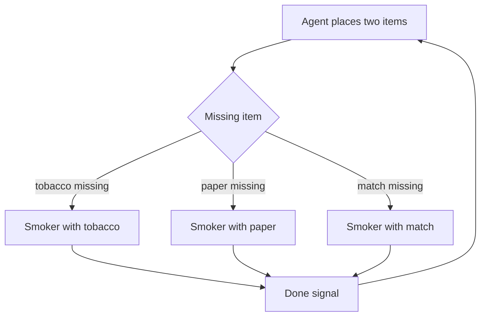

```java
import java.util.concurrent.Semaphore;

class CigaretteSmokers {
    private final Semaphore agent = new Semaphore(1);
    private final Semaphore tobacco = new Semaphore(0);
    private final Semaphore paper = new Semaphore(0);
    private final Semaphore match = new Semaphore(0);

    public void agentPaperMatch() throws InterruptedException {
        agent.acquire();
        tobacco.release();
    }

    public void agentTobaccoMatch() throws InterruptedException {
        agent.acquire();
        paper.release();
    }

    public void agentTobaccoPaper() throws InterruptedException {
        agent.acquire();
        match.release();
    }

    public void smokerWithTobacco(Runnable smoke) throws InterruptedException {
        tobacco.acquire();
        smoke.run();
        agent.release();
    }

    public void smokerWithPaper(Runnable smoke) throws InterruptedException {
        paper.acquire();
        smoke.run();
        agent.release();
    }

    public void smokerWithMatch(Runnable smoke) throws InterruptedException {
        match.acquire();
        smoke.run();
        agent.release();
    }
}
```

---

## 11. Santa Claus Problem

### Goal
Santa wakes when either 9 reindeer arrive or 3 elves need help. Reindeer usually have priority.

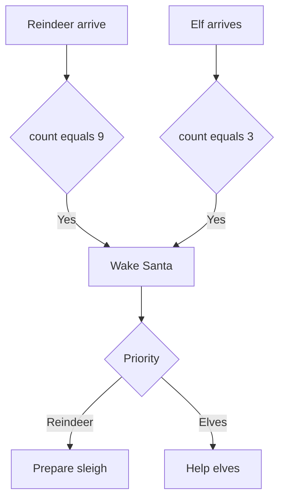

```java
import java.util.concurrent.locks.*;

class SantaClaus {
    private final Lock lock = new ReentrantLock();
    private final Condition santa = lock.newCondition();
    private final Condition reindeerDone = lock.newCondition();
    private final Condition elfDone = lock.newCondition();
    private int reindeer = 0;
    private int elves = 0;

    public void reindeerArrives() throws InterruptedException {
        lock.lock();
        try {
            reindeer++;
            if (reindeer == 9) santa.signal();
            while (reindeer > 0) reindeerDone.await();
        } finally { lock.unlock(); }
    }

    public void elfNeedsHelp() throws InterruptedException {
        lock.lock();
        try {
            while (elves == 3) elfDone.await();
            elves++;
            if (elves == 3) santa.signal();
            while (elves > 0) elfDone.await();
        } finally { lock.unlock(); }
    }

    public void santaLoop(Runnable prepareSleigh, Runnable helpElves) throws InterruptedException {
        while (true) {
            lock.lock();
            try {
                while (reindeer < 9 && elves < 3) santa.await();
                if (reindeer == 9) {
                    prepareSleigh.run();
                    reindeer = 0;
                    reindeerDone.signalAll();
                } else {
                    helpElves.run();
                    elves = 0;
                    elfDone.signalAll();
                }
            } finally { lock.unlock(); }
        }
    }
}
```

---

# Concurrency Design Problems

## 12. Design Thread-Safe Cache with TTL

### Shape
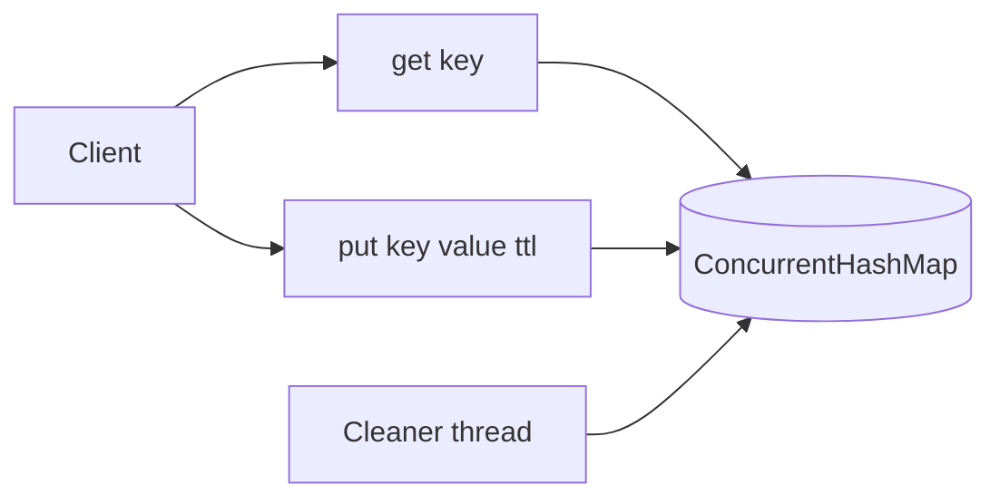

### Why constructs are used
| Construct | Why |
|---|---|
| `ConcurrentHashMap` | Thread-safe reads and writes without one global lock |
| expiry timestamp | Simple TTL decision at read time |
| cleaner thread | Removes expired entries eventually |

```java
import java.util.concurrent.*;

class TtlCache<K, V> {
    private static class Entry<V> {
        final V value;
        final long expiresAt;
        Entry(V value, long expiresAt) { this.value = value; this.expiresAt = expiresAt; }
    }

    private final ConcurrentHashMap<K, Entry<V>> map = new ConcurrentHashMap<>();

    public void put(K key, V value, long ttlMillis) {
        map.put(key, new Entry<>(value, System.currentTimeMillis() + ttlMillis));
    }

    public V get(K key) {
        Entry<V> e = map.get(key);
        if (e == null) return null;
        if (System.currentTimeMillis() > e.expiresAt) {
            map.remove(key, e);
            return null;
        }
        return e.value;
    }

    public void cleanup() {
        long now = System.currentTimeMillis();
        map.entrySet().removeIf(x -> x.getValue().expiresAt < now);
    }
}
```

---

## 13. Design Thread-Safe Rate Limiter

### Token bucket visual
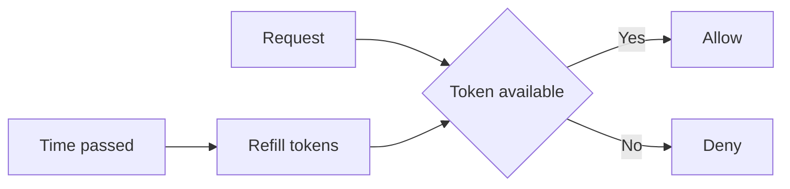

```java
import java.util.concurrent.ConcurrentHashMap;

class RateLimiter {
    private static class Bucket {
        double tokens;
        long lastRefill;
        Bucket(double tokens, long now) { this.tokens = tokens; this.lastRefill = now; }
    }

    private final int capacity;
    private final double refillPerSecond;
    private final ConcurrentHashMap<String, Bucket> buckets = new ConcurrentHashMap<>();

    RateLimiter(int capacity, double refillPerSecond) {
        this.capacity = capacity;
        this.refillPerSecond = refillPerSecond;
    }

    public boolean allow(String userId) {
        long now = System.nanoTime();
        Bucket b = buckets.computeIfAbsent(userId, k -> new Bucket(capacity, now));
        synchronized (b) {
            double elapsedSeconds = (now - b.lastRefill) / 1_000_000_000.0;
            b.tokens = Math.min(capacity, b.tokens + elapsedSeconds * refillPerSecond);
            b.lastRefill = now;
            if (b.tokens >= 1) {
                b.tokens -= 1;
                return true;
            }
            return false;
        }
    }
}
```

---

## 14. Design Deferred Callback Executor

### Goal
Run callbacks at or after their scheduled time.

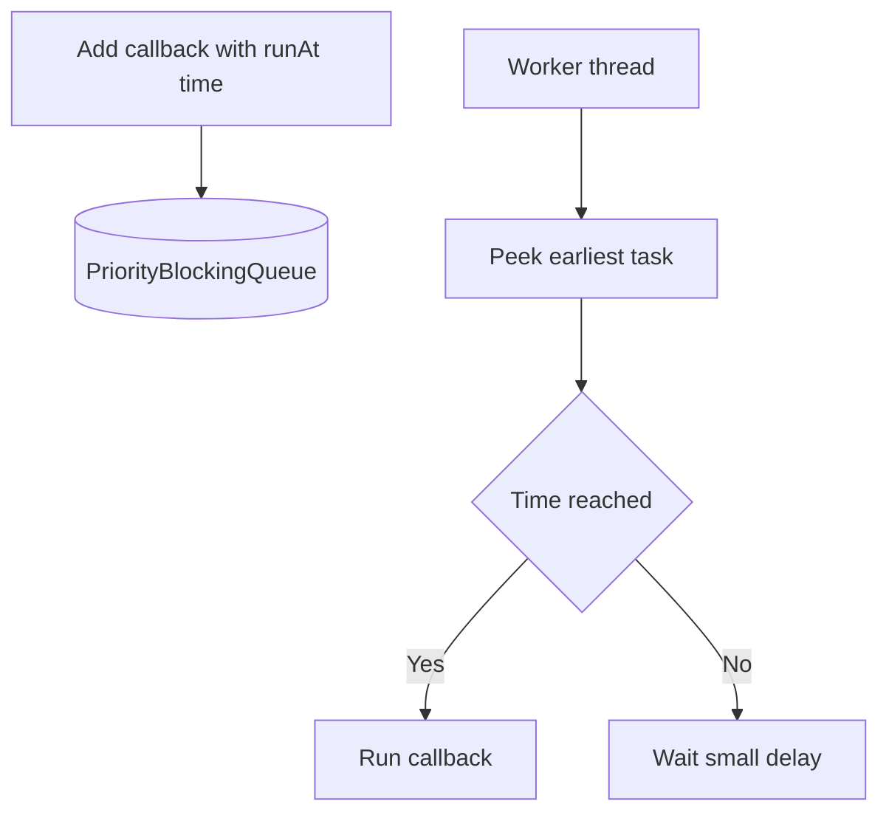

```java
import java.util.concurrent.*;

class DeferredExecutor {
    private static class Task implements Comparable<Task> {
        final long runAt;
        final Runnable job;
        Task(long runAt, Runnable job) { this.runAt = runAt; this.job = job; }
        public int compareTo(Task other) { return Long.compare(this.runAt, other.runAt); }
    }

    private final PriorityBlockingQueue<Task> pq = new PriorityBlockingQueue<>();

    public void schedule(Runnable job, long delayMillis) {
        pq.add(new Task(System.currentTimeMillis() + delayMillis, job));
    }

    public void start() {
        Thread worker = new Thread(() -> {
            while (!Thread.currentThread().isInterrupted()) {
                try {
                    Task t = pq.peek();
                    if (t == null) { Thread.sleep(10); continue; }
                    long wait = t.runAt - System.currentTimeMillis();
                    if (wait > 0) { Thread.sleep(Math.min(wait, 10)); continue; }
                    pq.poll().job.run();
                } catch (InterruptedException e) {
                    Thread.currentThread().interrupt();
                }
            }
        });
        worker.start();
    }
}
```

---

## 15. Design Ticket Booking System

### Visual
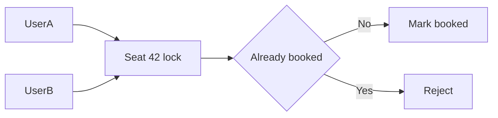

```java
import java.util.concurrent.locks.ReentrantLock;

class TicketSystem {
    static class Seat {
        final ReentrantLock lock = new ReentrantLock();
        boolean booked = false;
    }

    private final Seat[] seats;

    TicketSystem(int n) {
        seats = new Seat[n];
        for (int i = 0; i < n; i++) seats[i] = new Seat();
    }

    public boolean book(int seatId) {
        Seat s = seats[seatId];
        s.lock.lock();
        try {
            if (s.booked) return false;
            s.booked = true;
            return true;
        } finally {
            s.lock.unlock();
        }
    }
}
```

---

## 16. Design Multithreaded Web Crawler

### Visual
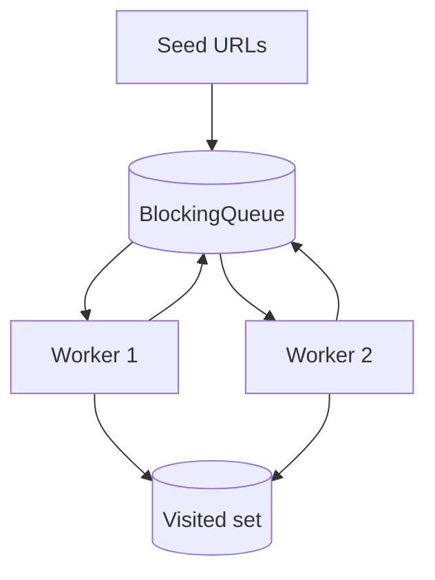

```java
import java.util.*;
import java.util.concurrent.*;

class WebCrawler {
    private final BlockingQueue<String> queue = new LinkedBlockingQueue<>();
    private final Set<String> visited = ConcurrentHashMap.newKeySet();
    private final ExecutorService pool = Executors.newFixedThreadPool(8);

    interface HtmlParser { List<String> getUrls(String url); }

    public void crawl(String startUrl, HtmlParser parser) {
        visited.add(startUrl);
        queue.add(startUrl);
        for (int i = 0; i < 8; i++) {
            pool.submit(() -> {
                while (!Thread.currentThread().isInterrupted()) {
                    try {
                        String url = queue.poll(1, TimeUnit.SECONDS);
                        if (url == null) return;
                        for (String next : parser.getUrls(url)) {
                            if (visited.add(next)) queue.add(next);
                        }
                    } catch (InterruptedException e) {
                        Thread.currentThread().interrupt();
                    }
                }
            });
        }
    }
}
```

---

## 17. Design Multithreaded Pub-Sub System

### Visual
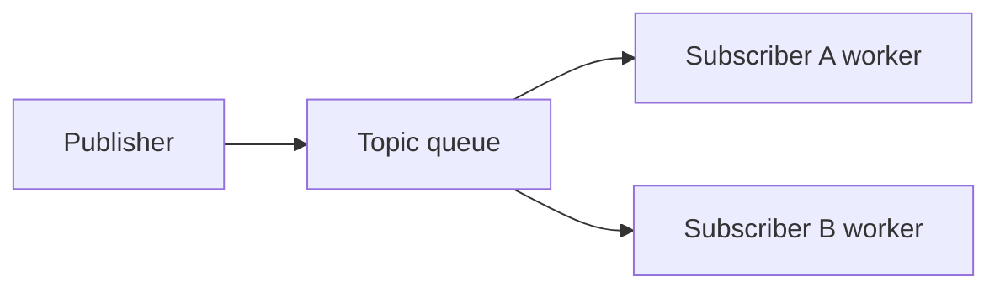

```java
import java.util.*;
import java.util.concurrent.*;
import java.util.function.Consumer;

class PubSub {
    private final ConcurrentHashMap<String, CopyOnWriteArrayList<Consumer<String>>> subs = new ConcurrentHashMap<>();
    private final ExecutorService pool = Executors.newCachedThreadPool();

    public void subscribe(String topic, Consumer<String> handler) {
        subs.computeIfAbsent(topic, k -> new CopyOnWriteArrayList<>()).add(handler);
    }

    public void publish(String topic, String message) {
        for (Consumer<String> handler : subs.getOrDefault(topic, new CopyOnWriteArrayList<>())) {
            pool.submit(() -> handler.accept(message));
        }
    }
}
```

---

## 18. Design Task Scheduler with Dependencies

### Visual
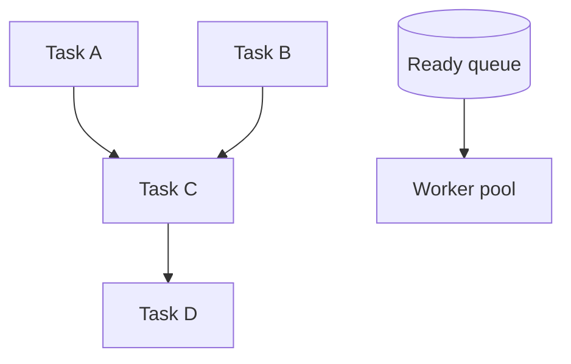

```java
import java.util.*;
import java.util.concurrent.*;
import java.util.concurrent.atomic.AtomicInteger;

class DependencyScheduler {
    static class Task {
        final String id;
        final Runnable job;
        final List<Task> next = new ArrayList<>();
        final AtomicInteger indegree = new AtomicInteger();
        Task(String id, Runnable job) { this.id = id; this.job = job; }
    }

    private final ExecutorService pool = Executors.newFixedThreadPool(4);
    private final BlockingQueue<Task> ready = new LinkedBlockingQueue<>();

    public void addDependency(Task before, Task after) {
        before.next.add(after);
        after.indegree.incrementAndGet();
    }

    public void runAll(List<Task> tasks) {
        for (Task t : tasks) if (t.indegree.get() == 0) ready.add(t);
        for (int i = 0; i < 4; i++) {
            pool.submit(() -> {
                while (true) {
                    Task t = ready.poll(1, TimeUnit.SECONDS);
                    if (t == null) return;
                    t.job.run();
                    for (Task child : t.next) {
                        if (child.indegree.decrementAndGet() == 0) ready.add(child);
                    }
                }
            });
        }
    }
}
```

---

# Concurrent Data Structures

## 19. Design Concurrent HashMap

### Visual lock striping
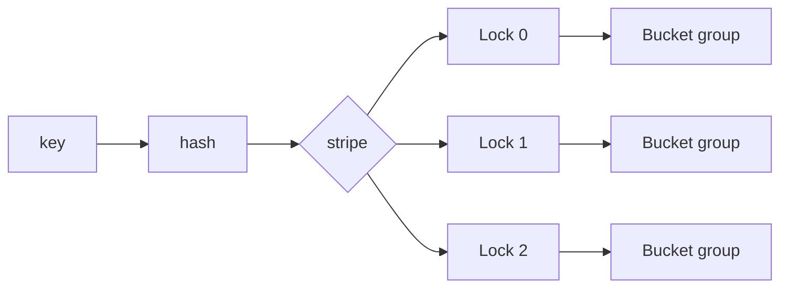

```java
import java.util.*;
import java.util.concurrent.locks.ReentrantLock;

class StripedMap<K, V> {
    private final Map<K, V>[] buckets;
    private final ReentrantLock[] locks;

    @SuppressWarnings("unchecked")
    StripedMap(int stripes) {
        buckets = new Map[stripes];
        locks = new ReentrantLock[stripes];
        for (int i = 0; i < stripes; i++) {
            buckets[i] = new HashMap<>();
            locks[i] = new ReentrantLock();
        }
    }

    private int idx(Object key) { return Math.abs(key.hashCode() % buckets.length); }

    public V get(K key) {
        int i = idx(key);
        locks[i].lock();
        try { return buckets[i].get(key); }
        finally { locks[i].unlock(); }
    }

    public void put(K key, V value) {
        int i = idx(key);
        locks[i].lock();
        try { buckets[i].put(key, value); }
        finally { locks[i].unlock(); }
    }
}
```

---

## 20. Design Thread-Safe Blocking Queue

### Same pattern as bounded buffer
```mermaid
flowchart LR
    Put[put item] --> Full{full}
    Full -- Yes --> WaitFull[wait notFull]
    Full -- No --> Enq[enqueue]
    Take[take item] --> Empty{empty}
    Empty -- Yes --> WaitEmpty[wait notEmpty]
    Empty -- No --> Deq[dequeue]
```

```java
import java.util.*;
import java.util.concurrent.locks.*;

class BlockingQueueLite<T> {
    private final Queue<T> q = new ArrayDeque<>();
    private final int cap;
    private final Lock lock = new ReentrantLock();
    private final Condition notEmpty = lock.newCondition();
    private final Condition notFull = lock.newCondition();

    BlockingQueueLite(int cap) { this.cap = cap; }

    public void put(T x) throws InterruptedException {
        lock.lock();
        try {
            while (q.size() == cap) notFull.await();
            q.add(x);
            notEmpty.signal();
        } finally { lock.unlock(); }
    }

    public T take() throws InterruptedException {
        lock.lock();
        try {
            while (q.isEmpty()) notEmpty.await();
            T x = q.remove();
            notFull.signal();
            return x;
        } finally { lock.unlock(); }
    }
}
```

---

## 21. Design Concurrent Bloom Filter

### Visual
```mermaid
flowchart LR
    Item --> H1[hash 1]
    Item --> H2[hash 2]
    Item --> H3[hash 3]
    H1 --> Bits[(Atomic bit array)]
    H2 --> Bits
    H3 --> Bits
```

```java
import java.util.concurrent.atomic.AtomicLongArray;

class ConcurrentBloomFilter {
    private final AtomicLongArray bits;
    private final int size;

    ConcurrentBloomFilter(int bitSize) {
        this.size = bitSize;
        this.bits = new AtomicLongArray((bitSize + 63) / 64);
    }

    public void add(String s) {
        for (int h : hashes(s)) setBit(Math.floorMod(h, size));
    }

    public boolean mightContain(String s) {
        for (int h : hashes(s)) if (!getBit(Math.floorMod(h, size))) return false;
        return true;
    }

    private int[] hashes(String s) {
        int h1 = s.hashCode();
        int h2 = h1 * 31 + 17;
        int h3 = h1 * 131 + 7;
        return new int[]{h1, h2, h3};
    }

    private void setBit(int bit) {
        int i = bit / 64;
        long mask = 1L << (bit % 64);
        long old;
        do {
            old = bits.get(i);
        } while (!bits.compareAndSet(i, old, old | mask));
    }

    private boolean getBit(int bit) {
        return (bits.get(bit / 64) & (1L << (bit % 64))) != 0;
    }
}
```

---

## 22. Design Lock-Free Queue

### Michael Scott queue idea
```mermaid
flowchart LR
    Head --> Dummy[Dummy node]
    Dummy --> A[Node A]
    A --> B[Node B]
    Tail --> B
```

| Construct | Why |
|---|---|
| `AtomicReference` | Updates pointer with CAS |
| dummy node | Simplifies empty queue logic |
| CAS retry loop | Another thread may win first |

```java
import java.util.concurrent.atomic.AtomicReference;

class LockFreeQueue<T> {
    private static class Node<T> {
        final T value;
        final AtomicReference<Node<T>> next = new AtomicReference<>();
        Node(T value) { this.value = value; }
    }

    private final AtomicReference<Node<T>> head;
    private final AtomicReference<Node<T>> tail;

    LockFreeQueue() {
        Node<T> dummy = new Node<>(null);
        head = new AtomicReference<>(dummy);
        tail = new AtomicReference<>(dummy);
    }

    public void offer(T value) {
        Node<T> node = new Node<>(value);
        while (true) {
            Node<T> t = tail.get();
            Node<T> next = t.next.get();
            if (next == null) {
                if (t.next.compareAndSet(null, node)) {
                    tail.compareAndSet(t, node);
                    return;
                }
            } else {
                tail.compareAndSet(t, next);
            }
        }
    }

    public T poll() {
        while (true) {
            Node<T> h = head.get();
            Node<T> t = tail.get();
            Node<T> next = h.next.get();
            if (next == null) return null;
            if (h == t) tail.compareAndSet(t, next);
            else if (head.compareAndSet(h, next)) return next.value;
        }
    }
}
```

---

## 23. Design Concurrent Priority Queue

### Visual
```mermaid
flowchart TD
    Add[offer item] --> Lock[heap lock]
    Poll[poll min] --> Lock
    Lock --> Heap[(Binary heap)]
```

```java
import java.util.*;
import java.util.concurrent.locks.ReentrantLock;

class ConcurrentPriorityQueue<T> {
    private final PriorityQueue<T> heap;
    private final ReentrantLock lock = new ReentrantLock();

    ConcurrentPriorityQueue(Comparator<T> cmp) {
        this.heap = new PriorityQueue<>(cmp);
    }

    public void offer(T x) {
        lock.lock();
        try { heap.offer(x); }
        finally { lock.unlock(); }
    }

    public T poll() {
        lock.lock();
        try { return heap.poll(); }
        finally { lock.unlock(); }
    }
}
```

---

## 24. Design Thread-Safe Trie

### Visual
```mermaid
flowchart TD
    Root[root] --> C[c]
    C --> A[a]
    A --> T[t end]
    A --> R[r end]
```

```java
import java.util.concurrent.ConcurrentHashMap;
import java.util.concurrent.atomic.AtomicBoolean;

class ConcurrentTrie {
    static class Node {
        final ConcurrentHashMap<Character, Node> child = new ConcurrentHashMap<>();
        final AtomicBoolean end = new AtomicBoolean(false);
    }

    private final Node root = new Node();

    public void insert(String word) {
        Node cur = root;
        for (char c : word.toCharArray()) {
            cur = cur.child.computeIfAbsent(c, k -> new Node());
        }
        cur.end.set(true);
    }

    public boolean search(String word) {
        Node cur = root;
        for (char c : word.toCharArray()) {
            cur = cur.child.get(c);
            if (cur == null) return false;
        }
        return cur.end.get();
    }
}
```

---

# Multi-threaded Algorithms

## 25. Multi-threaded Merge Sort

### Visual
```mermaid
flowchart TD
    A[Array] --> L[Left half]
    A --> R[Right half]
    L --> LS[Sort left]
    R --> RS[Sort right]
    LS --> M[Merge]
    RS --> M
```

```java
import java.util.concurrent.*;

class ParallelMergeSort extends RecursiveAction {
    private final int[] a, tmp;
    private final int lo, hi;
    private static final int THRESHOLD = 1024;

    ParallelMergeSort(int[] a, int[] tmp, int lo, int hi) {
        this.a = a; this.tmp = tmp; this.lo = lo; this.hi = hi;
    }

    protected void compute() {
        if (hi - lo <= THRESHOLD) {
            java.util.Arrays.sort(a, lo, hi);
            return;
        }
        int mid = (lo + hi) >>> 1;
        invokeAll(new ParallelMergeSort(a, tmp, lo, mid),
                  new ParallelMergeSort(a, tmp, mid, hi));
        merge(mid);
    }

    private void merge(int mid) {
        int i = lo, j = mid, k = lo;
        while (i < mid && j < hi) tmp[k++] = a[i] <= a[j] ? a[i++] : a[j++];
        while (i < mid) tmp[k++] = a[i++];
        while (j < hi) tmp[k++] = a[j++];
        System.arraycopy(tmp, lo, a, lo, hi - lo);
    }

    static void sort(int[] a) {
        ForkJoinPool.commonPool().invoke(new ParallelMergeSort(a, new int[a.length], 0, a.length));
    }
}
```

---

## 26. Multi-threaded Word Frequency Counter

### Visual
```mermaid
flowchart TD
    Text[Input lines] --> Split[Split into chunks]
    Split --> W1[Worker map 1]
    Split --> W2[Worker map 2]
    Split --> W3[Worker map 3]
    W1 --> Merge[Merge maps]
    W2 --> Merge
    W3 --> Merge
```

```java
import java.util.*;
import java.util.concurrent.*;

class WordCounter {
    public Map<String, Integer> count(List<String> lines) throws Exception {
        ExecutorService pool = Executors.newFixedThreadPool(4);
        List<Future<Map<String, Integer>>> futures = new ArrayList<>();

        int chunk = Math.max(1, lines.size() / 4);
        for (int i = 0; i < lines.size(); i += chunk) {
            List<String> part = lines.subList(i, Math.min(lines.size(), i + chunk));
            futures.add(pool.submit(() -> localCount(part)));
        }

        Map<String, Integer> result = new HashMap<>();
        for (Future<Map<String, Integer>> f : futures) {
            f.get().forEach((word, count) -> result.merge(word, count, Integer::sum));
        }
        pool.shutdown();
        return result;
    }

    private Map<String, Integer> localCount(List<String> lines) {
        Map<String, Integer> m = new HashMap<>();
        for (String line : lines) {
            for (String w : line.toLowerCase().split("\\W+")) {
                if (!w.isEmpty()) m.merge(w, 1, Integer::sum);
            }
        }
        return m;
    }
}
```

---

## 27. Concurrent BFS DFS Graph Traversal

### BFS visual
```mermaid
flowchart LR
    Start --> Q[(Frontier queue)]
    Q --> W1[Worker 1]
    Q --> W2[Worker 2]
    W1 --> V[(Visited set)]
    W2 --> V
    W1 --> Q
    W2 --> Q
```

### Why constructs are used
| Construct | Why |
|---|---|
| `ConcurrentLinkedQueue` | Many workers can push and poll nodes |
| `ConcurrentHashMap.newKeySet()` | Atomic visited check with `add` |
| `ExecutorService` | Fixed number of graph workers |

```java
import java.util.*;
import java.util.concurrent.*;
import java.util.function.Consumer;

class ConcurrentGraphTraversal {
    public void bfs(int start, Map<Integer, List<Integer>> graph, Consumer<Integer> visit)
            throws InterruptedException {
        Queue<Integer> q = new ConcurrentLinkedQueue<>();
        Set<Integer> seen = ConcurrentHashMap.newKeySet();
        ExecutorService pool = Executors.newFixedThreadPool(4);

        seen.add(start);
        q.add(start);

        CountDownLatch done = new CountDownLatch(4);
        for (int i = 0; i < 4; i++) {
            pool.submit(() -> {
                try {
                    while (true) {
                        Integer node = q.poll();
                        if (node == null) break;
                        visit.accept(node);
                        for (int nei : graph.getOrDefault(node, List.of())) {
                            if (seen.add(nei)) q.add(nei);
                        }
                    }
                } finally {
                    done.countDown();
                }
            });
        }
        done.await();
        pool.shutdown();
    }
}
```

---

# Common Patterns Cheat Sheet

| Pattern | Best for | Java construct |
|---|---|---|
| Alternate two actions | foo/bar | `Semaphore` pair |
| Wait for condition | bounded queue, bathroom | `Lock` plus `Condition` |
| Many readers, one writer | cache or document reads | `ReadWriteLock` |
| Work pool | crawler, scheduler | `ExecutorService` |
| Independent worker results | word count | local maps then merge |
| Lock-free pointer update | queue stack | `AtomicReference` CAS |

## Safe waiting rule

Always wait inside a `while`, not `if`.

```java
lock.lock();
try {
    while (!conditionIsTrue()) {
        condition.await();
    }
    // do protected work
} finally {
    lock.unlock();
}
```

Why: Java threads can wake up without the condition being true, also called a spurious wakeup. Another thread may also consume the resource before this thread resumes.

## Choosing the right construct

```mermaid
flowchart TD
    A[Need concurrency control] --> B{Counting permits}
    B -- Yes --> S[Semaphore]
    B -- No --> C{Shared state condition}
    C -- Yes --> L[Lock and Condition]
    C -- No --> D{Many reads few writes}
    D -- Yes --> RW[ReadWriteLock]
    D -- No --> E{Background workers}
    E -- Yes --> EX[ExecutorService]
    E -- No --> AT[Atomic or synchronized]
```

