# Java Design Patterns Guide  
## Simple implementations with Mermaid diagrams and easy Java code

> This guide explains common design patterns in simple language with small Java examples.

---

## Table of Contents

1. [What Are Design Patterns?](#1-what-are-design-patterns)
2. [Pattern Categories](#2-pattern-categories)
3. [Creational Patterns](#3-creational-patterns)
   - Singleton
   - Factory Method
   - Abstract Factory
   - Builder
   - Prototype
4. [Structural Patterns](#4-structural-patterns)
   - Adapter
   - Decorator
   - Facade
   - Proxy
   - Composite
   - Bridge
   - Flyweight
5. [Behavioral Patterns](#5-behavioral-patterns)
   - Strategy
   - Observer
   - Command
   - Template Method
   - Chain of Responsibility
   - State
   - Iterator
   - Mediator
   - Memento
   - Visitor
6. [Quick Pattern Selection Guide](#6-quick-pattern-selection-guide)

---

# 1. What Are Design Patterns?

Design patterns are reusable solutions to common software design problems.

They help you write code that is:

- Easier to maintain
- Easier to test
- Easier to extend
- Less duplicated
- More flexible

---

# 2. Pattern Categories

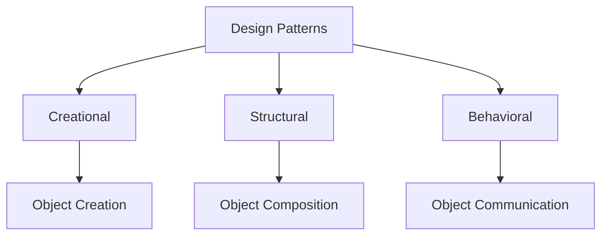

| Category | Purpose |
|---|---|
| Creational | How objects are created |
| Structural | How classes/objects are combined |
| Behavioral | How objects communicate |

---

# 3. Creational Patterns

Creational patterns focus on object creation.

---

## 3.1 Singleton Pattern

### Purpose

Use Singleton when you need only one object of a class in the entire application.

### Real Examples

- Logger
- Configuration manager
- Application settings
- Database connection manager

### Diagram

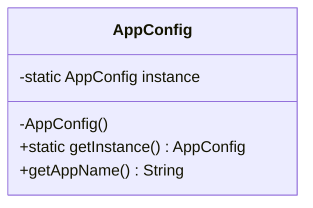

### Java Code

```java
public class AppConfig {

    private static AppConfig instance;

    private AppConfig() {
        // private constructor prevents object creation from outside
    }

    public static AppConfig getInstance() {
        if (instance == null) {
            instance = new AppConfig();
        }
        return instance;
    }

    public String getAppName() {
        return "Loan Application";
    }
}
```

### Usage

```java
public class Main {
    public static void main(String[] args) {
        AppConfig config1 = AppConfig.getInstance();
        AppConfig config2 = AppConfig.getInstance();

        System.out.println(config1.getAppName());
        System.out.println(config1 == config2); // true
    }
}
```

### Thread-Safe Singleton

```java
public class ThreadSafeAppConfig {

    private static final ThreadSafeAppConfig INSTANCE = new ThreadSafeAppConfig();

    private ThreadSafeAppConfig() {
    }

    public static ThreadSafeAppConfig getInstance() {
        return INSTANCE;
    }
}
```

---

## 3.2 Factory Method Pattern

### Purpose

Use Factory Method when object creation logic should be centralized.

### Real Examples

- Payment gateway creation
- Notification sender creation
- Report generator creation

### Diagram

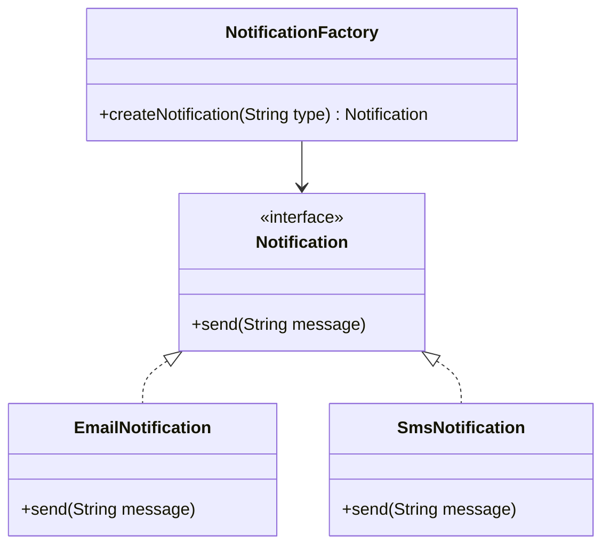

### Java Code

```java
interface Notification {
    void send(String message);
}

class EmailNotification implements Notification {
    public void send(String message) {
        System.out.println("Sending email: " + message);
    }
}

class SmsNotification implements Notification {
    public void send(String message) {
        System.out.println("Sending SMS: " + message);
    }
}

class NotificationFactory {

    public static Notification createNotification(String type) {
        if ("EMAIL".equalsIgnoreCase(type)) {
            return new EmailNotification();
        }

        if ("SMS".equalsIgnoreCase(type)) {
            return new SmsNotification();
        }

        throw new IllegalArgumentException("Unknown notification type: " + type);
    }
}
```

### Usage

```java
public class Main {
    public static void main(String[] args) {
        Notification notification = NotificationFactory.createNotification("EMAIL");
        notification.send("Your loan application is received");
    }
}
```

---

## 3.3 Abstract Factory Pattern

### Purpose

Use Abstract Factory when you need to create families of related objects.

### Real Example

Different UI components for different platforms:

- Windows button + Windows checkbox
- Mac button + Mac checkbox

### Diagram

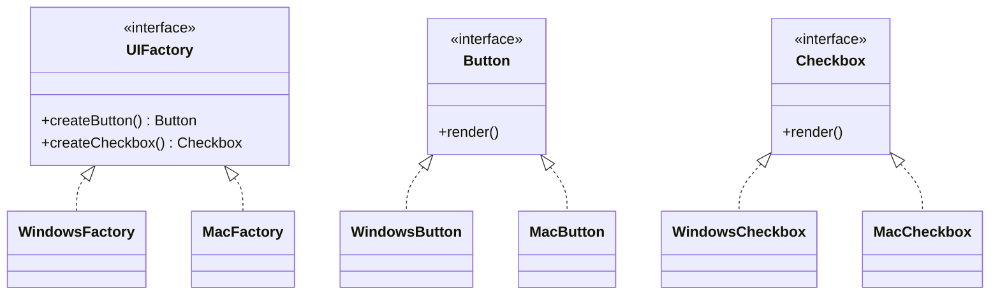

### Java Code

```java
interface Button {
    void render();
}

interface Checkbox {
    void render();
}

class WindowsButton implements Button {
    public void render() {
        System.out.println("Rendering Windows button");
    }
}

class MacButton implements Button {
    public void render() {
        System.out.println("Rendering Mac button");
    }
}

class WindowsCheckbox implements Checkbox {
    public void render() {
        System.out.println("Rendering Windows checkbox");
    }
}

class MacCheckbox implements Checkbox {
    public void render() {
        System.out.println("Rendering Mac checkbox");
    }
}

interface UIFactory {
    Button createButton();
    Checkbox createCheckbox();
}

class WindowsFactory implements UIFactory {
    public Button createButton() {
        return new WindowsButton();
    }

    public Checkbox createCheckbox() {
        return new WindowsCheckbox();
    }
}

class MacFactory implements UIFactory {
    public Button createButton() {
        return new MacButton();
    }

    public Checkbox createCheckbox() {
        return new MacCheckbox();
    }
}
```

### Usage

```java
public class Main {
    public static void main(String[] args) {
        UIFactory factory = new WindowsFactory();

        Button button = factory.createButton();
        Checkbox checkbox = factory.createCheckbox();

        button.render();
        checkbox.render();
    }
}
```

---

## 3.4 Builder Pattern

### Purpose

Use Builder when an object has many fields and object creation becomes complex.

### Real Examples

- User profile
- Loan application
- HTTP request
- Complex DTO

### Diagram

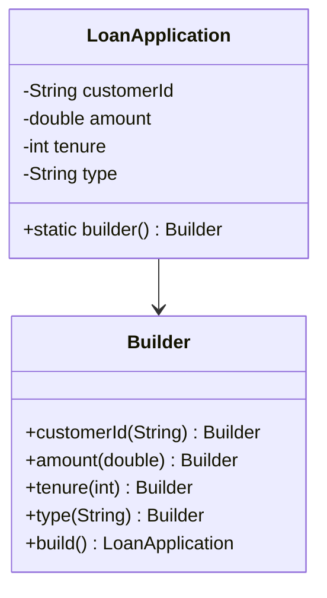

### Java Code

```java
public class LoanApplication {

    private String customerId;
    private double amount;
    private int tenureMonths;
    private String loanType;

    private LoanApplication(Builder builder) {
        this.customerId = builder.customerId;
        this.amount = builder.amount;
        this.tenureMonths = builder.tenureMonths;
        this.loanType = builder.loanType;
    }

    public static Builder builder() {
        return new Builder();
    }

    public static class Builder {
        private String customerId;
        private double amount;
        private int tenureMonths;
        private String loanType;

        public Builder customerId(String customerId) {
            this.customerId = customerId;
            return this;
        }

        public Builder amount(double amount) {
            this.amount = amount;
            return this;
        }

        public Builder tenureMonths(int tenureMonths) {
            this.tenureMonths = tenureMonths;
            return this;
        }

        public Builder loanType(String loanType) {
            this.loanType = loanType;
            return this;
        }

        public LoanApplication build() {
            return new LoanApplication(this);
        }
    }

    public String toString() {
        return "LoanApplication{customerId='" + customerId + "', amount=" + amount + "}";
    }
}
```

### Usage

```java
public class Main {
    public static void main(String[] args) {
        LoanApplication application = LoanApplication.builder()
            .customerId("CUST-101")
            .amount(500000)
            .tenureMonths(60)
            .loanType("HOME")
            .build();

        System.out.println(application);
    }
}
```

---

## 3.5 Prototype Pattern

### Purpose

Use Prototype when object creation is expensive and you want to clone existing objects.

### Diagram

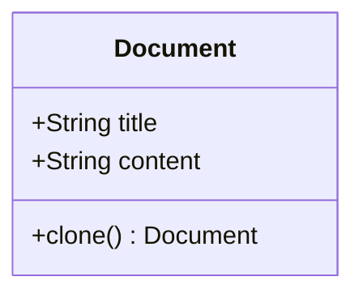

### Java Code

```java
class Document implements Cloneable {
    private String title;
    private String content;

    public Document(String title, String content) {
        this.title = title;
        this.content = content;
    }

    public Document clone() {
        return new Document(this.title, this.content);
    }

    public void setTitle(String title) {
        this.title = title;
    }

    public void print() {
        System.out.println(title + ": " + content);
    }
}
```

### Usage

```java
public class Main {
    public static void main(String[] args) {
        Document original = new Document("Loan Template", "Default loan document content");

        Document copy = original.clone();
        copy.setTitle("Home Loan Document");

        original.print();
        copy.print();
    }
}
```

---

# 4. Structural Patterns

Structural patterns help combine classes and objects.

---

## 4.1 Adapter Pattern

### Purpose

Use Adapter when two incompatible interfaces need to work together.

### Real Example

Your app expects `PaymentProcessor`, but a third-party library provides `ExternalPaymentGateway`.

### Diagram

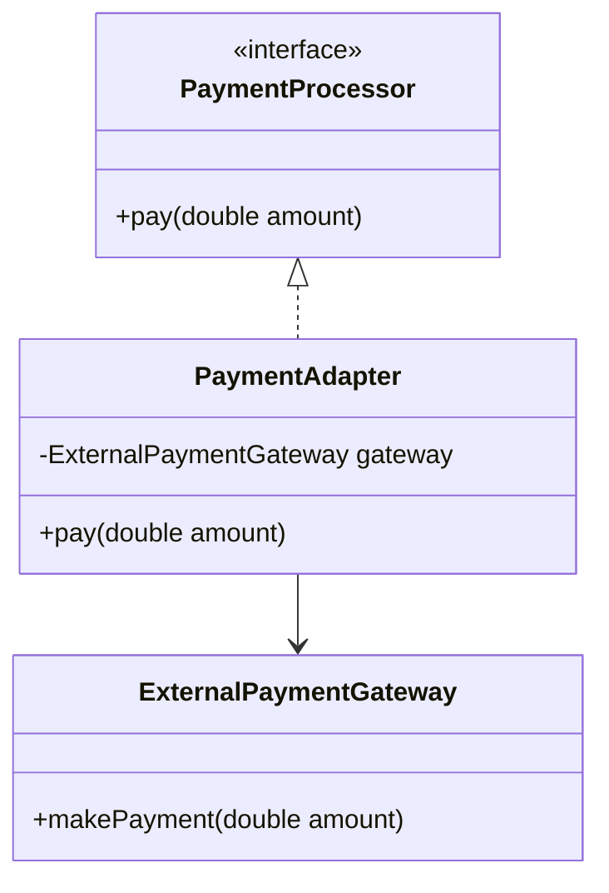

### Java Code

```java
interface PaymentProcessor {
    void pay(double amount);
}

class ExternalPaymentGateway {
    public void makePayment(double amount) {
        System.out.println("Paid using external gateway: " + amount);
    }
}

class PaymentAdapter implements PaymentProcessor {

    private ExternalPaymentGateway gateway;

    public PaymentAdapter(ExternalPaymentGateway gateway) {
        this.gateway = gateway;
    }

    public void pay(double amount) {
        gateway.makePayment(amount);
    }
}
```

### Usage

```java
public class Main {
    public static void main(String[] args) {
        ExternalPaymentGateway gateway = new ExternalPaymentGateway();
        PaymentProcessor processor = new PaymentAdapter(gateway);

        processor.pay(1000);
    }
}
```

---

## 4.2 Decorator Pattern

### Purpose

Use Decorator when you want to add extra behavior without changing the original class.

### Real Examples

- Add logging
- Add validation
- Add compression
- Add encryption

### Diagram

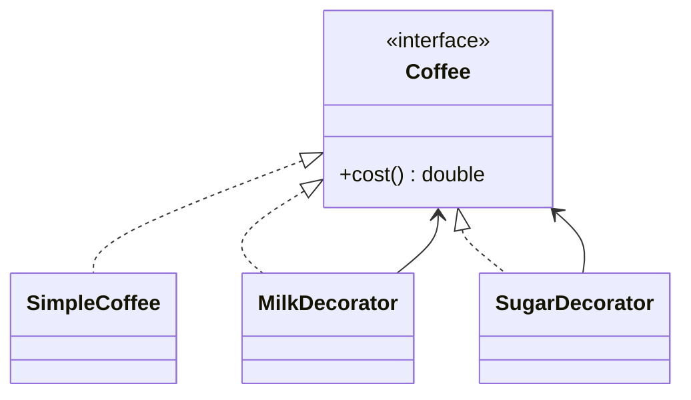

### Java Code

```java
interface Coffee {
    double cost();
}

class SimpleCoffee implements Coffee {
    public double cost() {
        return 50;
    }
}

class MilkDecorator implements Coffee {
    private Coffee coffee;

    public MilkDecorator(Coffee coffee) {
        this.coffee = coffee;
    }

    public double cost() {
        return coffee.cost() + 10;
    }
}

class SugarDecorator implements Coffee {
    private Coffee coffee;

    public SugarDecorator(Coffee coffee) {
        this.coffee = coffee;
    }

    public double cost() {
        return coffee.cost() + 5;
    }
}
```

### Usage

```java
public class Main {
    public static void main(String[] args) {
        Coffee coffee = new SimpleCoffee();
        coffee = new MilkDecorator(coffee);
        coffee = new SugarDecorator(coffee);

        System.out.println("Total cost: " + coffee.cost());
    }
}
```

---

## 4.3 Facade Pattern

### Purpose

Use Facade to provide a simple interface over a complex system.

### Real Example

Loan processing involves credit score, eligibility, and document verification. Facade hides complexity.

### Diagram

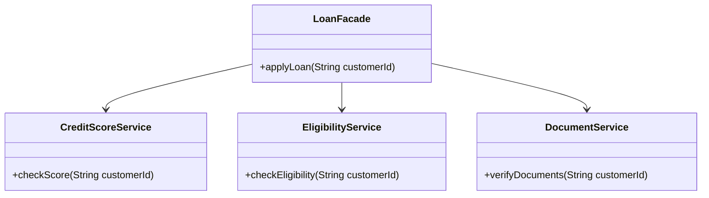

### Java Code

```java
class CreditScoreService {
    public boolean checkScore(String customerId) {
        System.out.println("Checking credit score");
        return true;
    }
}

class EligibilityService {
    public boolean checkEligibility(String customerId) {
        System.out.println("Checking eligibility");
        return true;
    }
}

class DocumentService {
    public boolean verifyDocuments(String customerId) {
        System.out.println("Verifying documents");
        return true;
    }
}

class LoanFacade {

    private CreditScoreService creditScoreService = new CreditScoreService();
    private EligibilityService eligibilityService = new EligibilityService();
    private DocumentService documentService = new DocumentService();

    public boolean applyLoan(String customerId) {
        return creditScoreService.checkScore(customerId)
            && eligibilityService.checkEligibility(customerId)
            && documentService.verifyDocuments(customerId);
    }
}
```

### Usage

```java
public class Main {
    public static void main(String[] args) {
        LoanFacade loanFacade = new LoanFacade();

        boolean approved = loanFacade.applyLoan("CUST-101");

        System.out.println("Loan approved: " + approved);
    }
}
```

---

## 4.4 Proxy Pattern

### Purpose

Use Proxy to control access to another object.

### Real Examples

- Security proxy
- Lazy loading proxy
- Logging proxy
- Remote service proxy

### Diagram

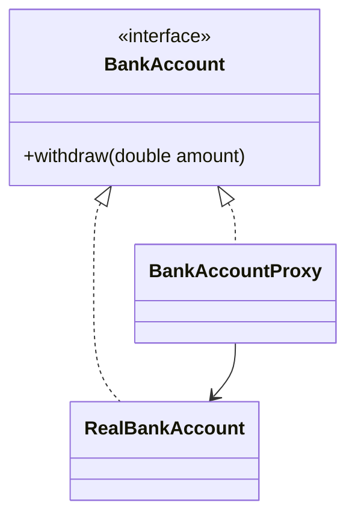

### Java Code

```java
interface BankAccount {
    void withdraw(double amount);
}

class RealBankAccount implements BankAccount {
    public void withdraw(double amount) {
        System.out.println("Withdrawn: " + amount);
    }
}

class BankAccountProxy implements BankAccount {

    private RealBankAccount realAccount;
    private boolean authenticated;

    public BankAccountProxy(boolean authenticated) {
        this.realAccount = new RealBankAccount();
        this.authenticated = authenticated;
    }

    public void withdraw(double amount) {
        if (!authenticated) {
            System.out.println("Access denied");
            return;
        }

        realAccount.withdraw(amount);
    }
}
```

### Usage

```java
public class Main {
    public static void main(String[] args) {
        BankAccount account = new BankAccountProxy(true);
        account.withdraw(5000);

        BankAccount blockedAccount = new BankAccountProxy(false);
        blockedAccount.withdraw(5000);
    }
}
```

---

## 4.5 Composite Pattern

### Purpose

Use Composite when you want to treat individual objects and groups of objects the same way.

### Real Examples

- File system
- Organization hierarchy
- Menu and submenu

### Diagram

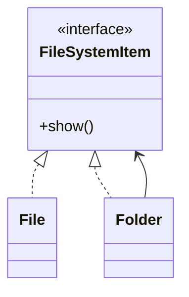

### Java Code

```java
import java.util.ArrayList;
import java.util.List;

interface FileSystemItem {
    void show();
}

class FileItem implements FileSystemItem {
    private String name;

    public FileItem(String name) {
        this.name = name;
    }

    public void show() {
        System.out.println("File: " + name);
    }
}

class Folder implements FileSystemItem {
    private String name;
    private List<FileSystemItem> items = new ArrayList<>();

    public Folder(String name) {
        this.name = name;
    }

    public void add(FileSystemItem item) {
        items.add(item);
    }

    public void show() {
        System.out.println("Folder: " + name);

        for (FileSystemItem item : items) {
            item.show();
        }
    }
}
```

### Usage

```java
public class Main {
    public static void main(String[] args) {
        Folder root = new Folder("root");
        root.add(new FileItem("loan.pdf"));
        root.add(new FileItem("customer.txt"));

        Folder reports = new Folder("reports");
        reports.add(new FileItem("monthly-report.xlsx"));

        root.add(reports);

        root.show();
    }
}
```

---

## 4.6 Bridge Pattern

### Purpose

Use Bridge to separate abstraction from implementation.

### Real Example

Different notification types can use different sending channels.

### Diagram

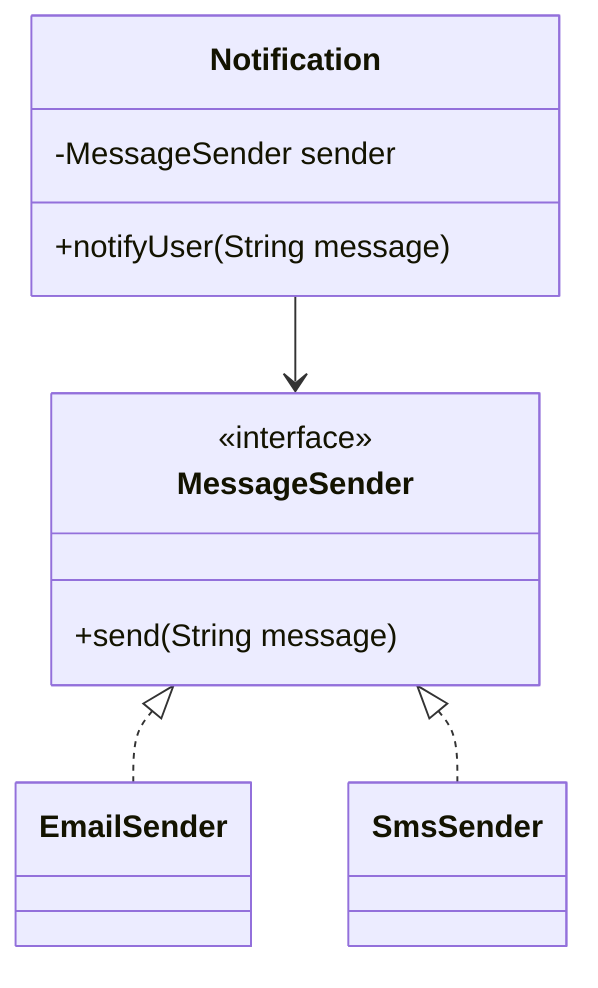

### Java Code

```java
interface MessageSender {
    void send(String message);
}

class EmailSender implements MessageSender {
    public void send(String message) {
        System.out.println("Email sent: " + message);
    }
}

class SmsSender implements MessageSender {
    public void send(String message) {
        System.out.println("SMS sent: " + message);
    }
}

class Notification {
    protected MessageSender sender;

    public Notification(MessageSender sender) {
        this.sender = sender;
    }

    public void notifyUser(String message) {
        sender.send(message);
    }
}
```

### Usage

```java
public class Main {
    public static void main(String[] args) {
        Notification emailNotification = new Notification(new EmailSender());
        emailNotification.notifyUser("Loan approved");

        Notification smsNotification = new Notification(new SmsSender());
        smsNotification.notifyUser("Loan approved");
    }
}
```

---

## 4.7 Flyweight Pattern

### Purpose

Use Flyweight to reuse objects and reduce memory usage.

### Real Example

Reusing shared icon/style objects.

### Diagram

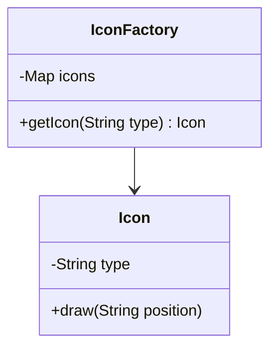

### Java Code

```java
import java.util.HashMap;
import java.util.Map;

class Icon {
    private String type;

    public Icon(String type) {
        this.type = type;
    }

    public void draw(String position) {
        System.out.println("Drawing " + type + " icon at " + position);
    }
}

class IconFactory {
    private Map<String, Icon> icons = new HashMap<>();

    public Icon getIcon(String type) {
        if (!icons.containsKey(type)) {
            icons.put(type, new Icon(type));
        }

        return icons.get(type);
    }
}
```

### Usage

```java
public class Main {
    public static void main(String[] args) {
        IconFactory factory = new IconFactory();

        Icon home1 = factory.getIcon("HOME");
        Icon home2 = factory.getIcon("HOME");

        home1.draw("top-left");
        home2.draw("bottom-right");

        System.out.println(home1 == home2); // true
    }
}
```

---

# 5. Behavioral Patterns

Behavioral patterns focus on communication between objects.

---

## 5.1 Strategy Pattern

### Purpose

Use Strategy when you want to switch algorithms at runtime.

### Real Examples

- Payment strategy
- Discount strategy
- Sorting strategy
- Loan interest calculation

### Diagram

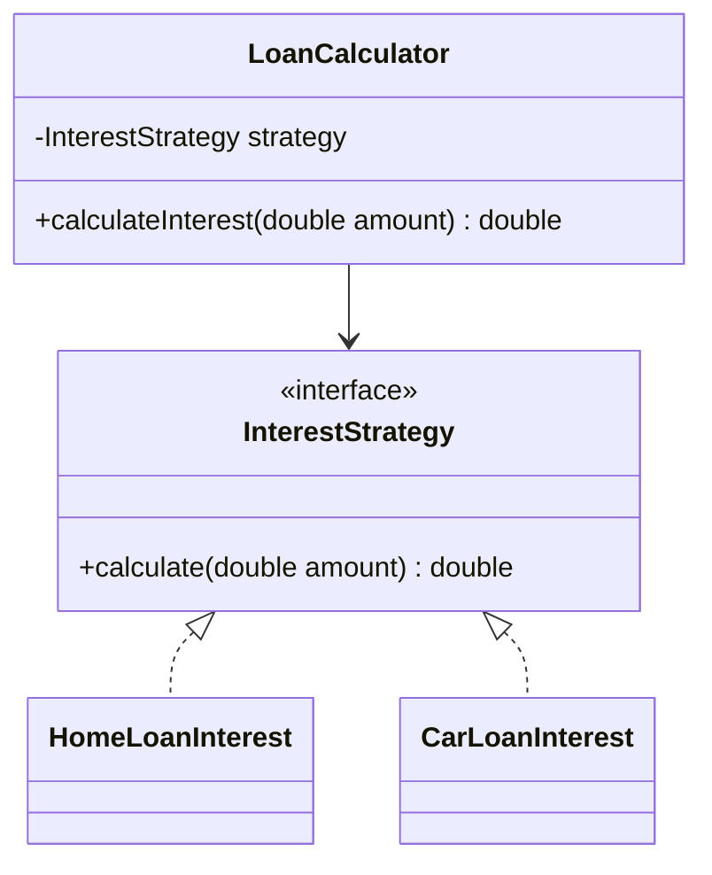

### Java Code

```java
interface InterestStrategy {
    double calculate(double amount);
}

class HomeLoanInterest implements InterestStrategy {
    public double calculate(double amount) {
        return amount * 0.07;
    }
}

class CarLoanInterest implements InterestStrategy {
    public double calculate(double amount) {
        return amount * 0.09;
    }
}

class LoanCalculator {
    private InterestStrategy strategy;

    public LoanCalculator(InterestStrategy strategy) {
        this.strategy = strategy;
    }

    public double calculateInterest(double amount) {
        return strategy.calculate(amount);
    }
}
```

### Usage

```java
public class Main {
    public static void main(String[] args) {
        LoanCalculator homeLoan = new LoanCalculator(new HomeLoanInterest());
        System.out.println(homeLoan.calculateInterest(100000));

        LoanCalculator carLoan = new LoanCalculator(new CarLoanInterest());
        System.out.println(carLoan.calculateInterest(100000));
    }
}
```

---

## 5.2 Observer Pattern

### Purpose

Use Observer when multiple objects need to be notified when something changes.

### Real Examples

- Event listeners
- Notification systems
- Stock price updates
- Spring events

### Diagram

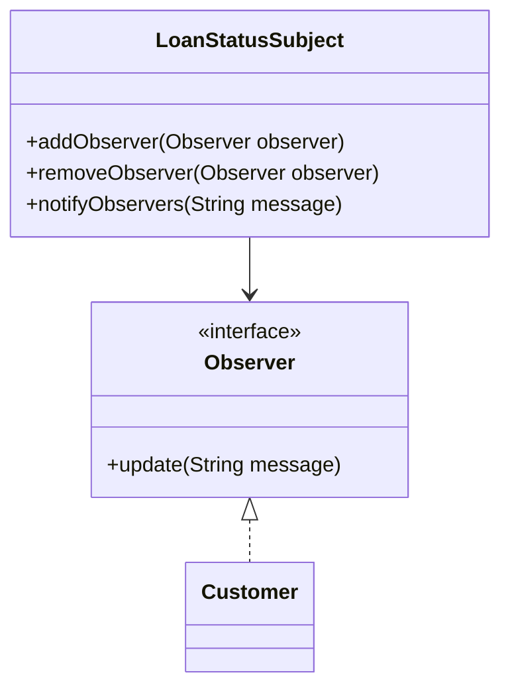

### Java Code

```java
import java.util.ArrayList;
import java.util.List;

interface Observer {
    void update(String message);
}

class Customer implements Observer {
    private String name;

    public Customer(String name) {
        this.name = name;
    }

    public void update(String message) {
        System.out.println(name + " received: " + message);
    }
}

class LoanStatusSubject {
    private List<Observer> observers = new ArrayList<>();

    public void addObserver(Observer observer) {
        observers.add(observer);
    }

    public void removeObserver(Observer observer) {
        observers.remove(observer);
    }

    public void notifyObservers(String message) {
        for (Observer observer : observers) {
            observer.update(message);
        }
    }
}
```

### Usage

```java
public class Main {
    public static void main(String[] args) {
        LoanStatusSubject subject = new LoanStatusSubject();

        subject.addObserver(new Customer("Alice"));
        subject.addObserver(new Customer("Bob"));

        subject.notifyObservers("Loan approved");
    }
}
```

---

## 5.3 Command Pattern

### Purpose

Use Command to convert a request into an object.

### Real Examples

- Undo/redo
- Task queue
- Button actions
- Job execution

### Diagram

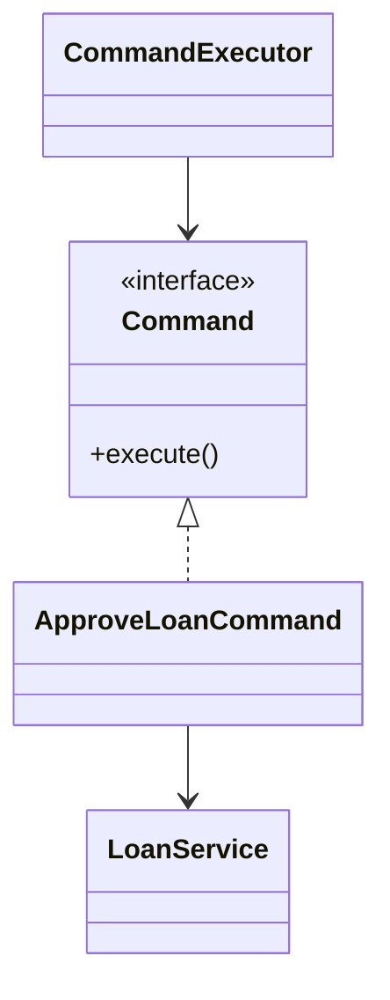

### Java Code

```java
interface Command {
    void execute();
}

class LoanService {
    public void approveLoan(String loanId) {
        System.out.println("Loan approved: " + loanId);
    }
}

class ApproveLoanCommand implements Command {
    private LoanService loanService;
    private String loanId;

    public ApproveLoanCommand(LoanService loanService, String loanId) {
        this.loanService = loanService;
        this.loanId = loanId;
    }

    public void execute() {
        loanService.approveLoan(loanId);
    }
}

class CommandExecutor {
    public void run(Command command) {
        command.execute();
    }
}
```

### Usage

```java
public class Main {
    public static void main(String[] args) {
        LoanService loanService = new LoanService();
        Command command = new ApproveLoanCommand(loanService, "LN-101");

        CommandExecutor executor = new CommandExecutor();
        executor.run(command);
    }
}
```

---

## 5.4 Template Method Pattern

### Purpose

Use Template Method when an algorithm has fixed steps, but some steps can change.

### Real Example

Loan processing steps:

1. Validate customer
2. Check credit score
3. Calculate offer
4. Approve/reject

### Diagram

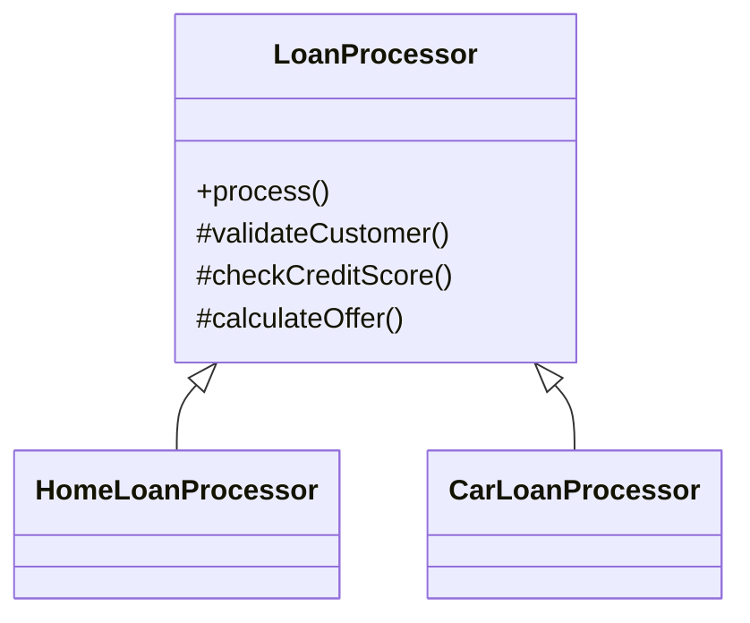

### Java Code

```java
abstract class LoanProcessor {

    public final void process() {
        validateCustomer();
        checkCreditScore();
        calculateOffer();
        System.out.println("Loan process completed");
    }

    protected void validateCustomer() {
        System.out.println("Validating customer");
    }

    protected abstract void checkCreditScore();

    protected abstract void calculateOffer();
}

class HomeLoanProcessor extends LoanProcessor {
    protected void checkCreditScore() {
        System.out.println("Checking credit score for home loan");
    }

    protected void calculateOffer() {
        System.out.println("Calculating home loan offer");
    }
}

class CarLoanProcessor extends LoanProcessor {
    protected void checkCreditScore() {
        System.out.println("Checking credit score for car loan");
    }

    protected void calculateOffer() {
        System.out.println("Calculating car loan offer");
    }
}
```

### Usage

```java
public class Main {
    public static void main(String[] args) {
        LoanProcessor processor = new HomeLoanProcessor();
        processor.process();
    }
}
```

---

## 5.5 Chain of Responsibility Pattern

### Purpose

Use Chain of Responsibility when a request should pass through multiple handlers.

### Real Examples

- Authentication filters
- Validation pipeline
- Approval workflow

### Diagram

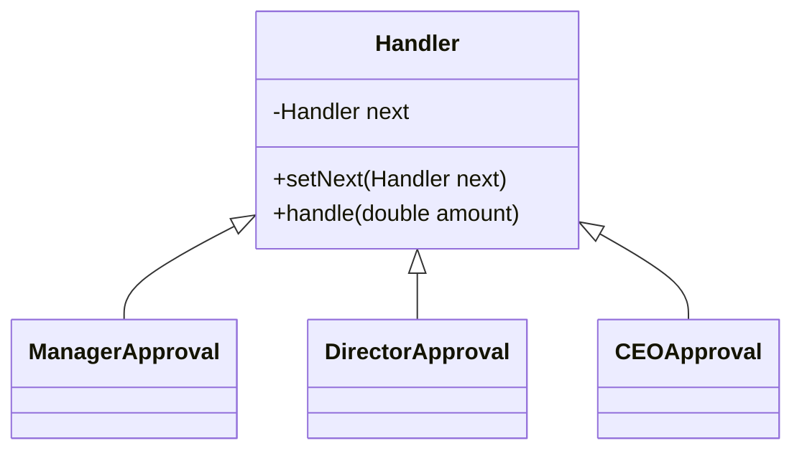

### Java Code

```java
abstract class ApprovalHandler {

    protected ApprovalHandler next;

    public void setNext(ApprovalHandler next) {
        this.next = next;
    }

    public abstract void approve(double amount);
}

class ManagerApproval extends ApprovalHandler {
    public void approve(double amount) {
        if (amount <= 10000) {
            System.out.println("Approved by Manager");
        } else if (next != null) {
            next.approve(amount);
        }
    }
}

class DirectorApproval extends ApprovalHandler {
    public void approve(double amount) {
        if (amount <= 100000) {
            System.out.println("Approved by Director");
        } else if (next != null) {
            next.approve(amount);
        }
    }
}

class CEOApproval extends ApprovalHandler {
    public void approve(double amount) {
        System.out.println("Approved by CEO");
    }
}
```

### Usage

```java
public class Main {
    public static void main(String[] args) {
        ApprovalHandler manager = new ManagerApproval();
        ApprovalHandler director = new DirectorApproval();
        ApprovalHandler ceo = new CEOApproval();

        manager.setNext(director);
        director.setNext(ceo);

        manager.approve(500000);
    }
}
```

---

## 5.6 State Pattern

### Purpose

Use State when an object changes behavior based on its internal state.

### Real Example

Loan application states:

- Submitted
- Under Review
- Approved
- Rejected

### Diagram

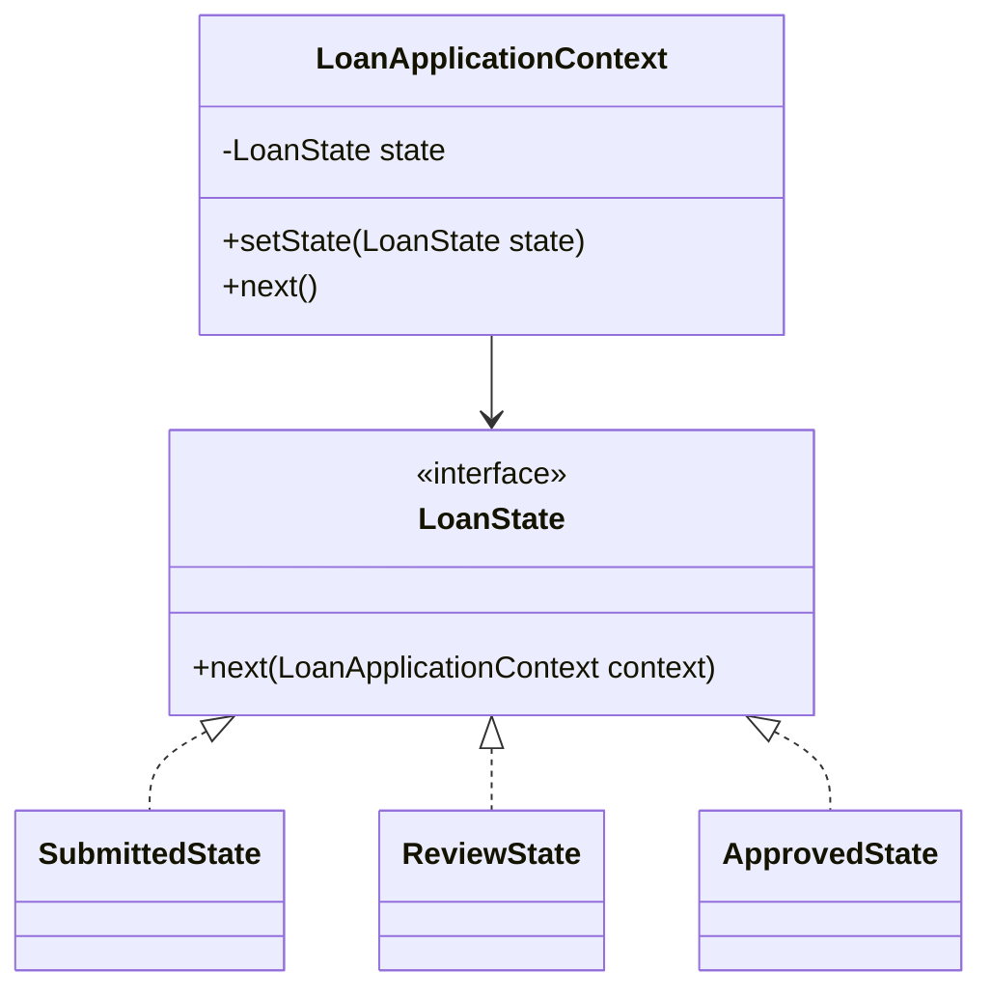

### Java Code

```java
interface LoanState {
    void next(LoanApplicationContext context);
}

class SubmittedState implements LoanState {
    public void next(LoanApplicationContext context) {
        System.out.println("Moving from Submitted to Review");
        context.setState(new ReviewState());
    }
}

class ReviewState implements LoanState {
    public void next(LoanApplicationContext context) {
        System.out.println("Moving from Review to Approved");
        context.setState(new ApprovedState());
    }
}

class ApprovedState implements LoanState {
    public void next(LoanApplicationContext context) {
        System.out.println("Loan is already approved");
    }
}

class LoanApplicationContext {
    private LoanState state;

    public LoanApplicationContext() {
        this.state = new SubmittedState();
    }

    public void setState(LoanState state) {
        this.state = state;
    }

    public void next() {
        state.next(this);
    }
}
```

### Usage

```java
public class Main {
    public static void main(String[] args) {
        LoanApplicationContext context = new LoanApplicationContext();

        context.next();
        context.next();
        context.next();
    }
}
```

---

## 5.7 Iterator Pattern

### Purpose

Use Iterator to access elements one by one without exposing internal collection details.

### Diagram

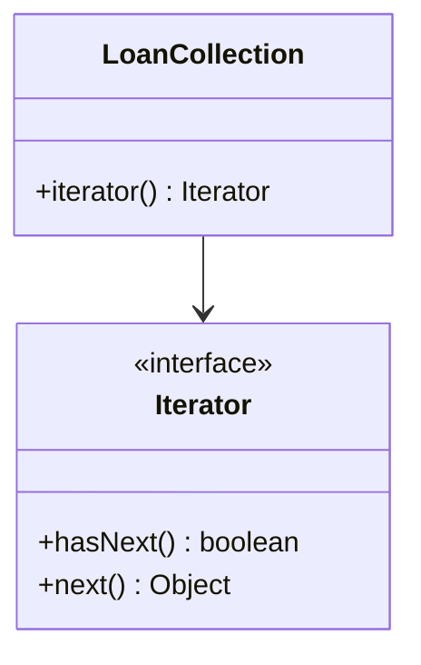

### Java Code

```java
import java.util.Arrays;
import java.util.Iterator;
import java.util.List;

class LoanCollection {
    private List<String> loans = Arrays.asList("LN-1", "LN-2", "LN-3");

    public Iterator<String> iterator() {
        return loans.iterator();
    }
}
```

### Usage

```java
import java.util.Iterator;

public class Main {
    public static void main(String[] args) {
        LoanCollection collection = new LoanCollection();

        Iterator<String> iterator = collection.iterator();

        while (iterator.hasNext()) {
            System.out.println(iterator.next());
        }
    }
}
```

---

## 5.8 Mediator Pattern

### Purpose

Use Mediator when many objects communicate with each other and communication becomes complex.

### Real Example

Chat room, where users send messages through a central mediator.

### Diagram

```mermaid
classDiagram
    class ChatMediator {
        +sendMessage(String message, User user)
        +addUser(User user)
    }

    class ChatRoom
    class User

    ChatMediator <|.. ChatRoom
    ChatRoom --> User
    User --> ChatMediator
```

### Java Code

```java
import java.util.ArrayList;
import java.util.List;

interface ChatMediator {
    void sendMessage(String message, User user);
    void addUser(User user);
}

class ChatRoom implements ChatMediator {

    private List<User> users = new ArrayList<>();

    public void addUser(User user) {
        users.add(user);
    }

    public void sendMessage(String message, User sender) {
        for (User user : users) {
            if (user != sender) {
                user.receive(message);
            }
        }
    }
}

class User {
    private String name;
    private ChatMediator mediator;

    public User(String name, ChatMediator mediator) {
        this.name = name;
        this.mediator = mediator;
    }

    public void send(String message) {
        System.out.println(name + " sends: " + message);
        mediator.sendMessage(message, this);
    }

    public void receive(String message) {
        System.out.println(name + " received: " + message);
    }
}
```

### Usage

```java
public class Main {
    public static void main(String[] args) {
        ChatMediator chatRoom = new ChatRoom();

        User alice = new User("Alice", chatRoom);
        User bob = new User("Bob", chatRoom);

        chatRoom.addUser(alice);
        chatRoom.addUser(bob);

        alice.send("Hello Bob");
    }
}
```

---

## 5.9 Memento Pattern

### Purpose

Use Memento to save and restore an object's previous state.

### Real Examples

- Undo feature
- Editor history
- Game save

### Diagram

```mermaid
classDiagram
    class Editor {
        -String content
        +write(String content)
        +save() EditorMemento
        +restore(EditorMemento memento)
    }

    class EditorMemento {
        -String content
        +getContent() String
    }

    Editor --> EditorMemento
```

### Java Code

```java
class EditorMemento {
    private String content;

    public EditorMemento(String content) {
        this.content = content;
    }

    public String getContent() {
        return content;
    }
}

class Editor {
    private String content;

    public void write(String content) {
        this.content = content;
    }

    public EditorMemento save() {
        return new EditorMemento(content);
    }

    public void restore(EditorMemento memento) {
        this.content = memento.getContent();
    }

    public void print() {
        System.out.println(content);
    }
}
```

### Usage

```java
public class Main {
    public static void main(String[] args) {
        Editor editor = new Editor();

        editor.write("Version 1");
        EditorMemento saved = editor.save();

        editor.write("Version 2");
        editor.print();

        editor.restore(saved);
        editor.print();
    }
}
```

---

## 5.10 Visitor Pattern

### Purpose

Use Visitor when you want to add new operations to existing classes without changing those classes.

### Real Example

Different reports for loan and customer objects.

### Diagram

```mermaid
classDiagram
    class Visitor {
        <<interface>>
        +visitLoan(Loan loan)
        +visitCustomer(Customer customer)
    }

    class Element {
        <<interface>>
        +accept(Visitor visitor)
    }

    class Loan
    class Customer
    class ReportVisitor

    Element <|.. Loan
    Element <|.. Customer
    Visitor <|.. ReportVisitor
    Loan --> Visitor
    Customer --> Visitor
```

### Java Code

```java
interface Visitor {
    void visitLoan(Loan loan);
    void visitCustomer(Customer customer);
}

interface Element {
    void accept(Visitor visitor);
}

class Loan implements Element {
    private String loanId;

    public Loan(String loanId) {
        this.loanId = loanId;
    }

    public String getLoanId() {
        return loanId;
    }

    public void accept(Visitor visitor) {
        visitor.visitLoan(this);
    }
}

class Customer implements Element {
    private String name;

    public Customer(String name) {
        this.name = name;
    }

    public String getName() {
        return name;
    }

    public void accept(Visitor visitor) {
        visitor.visitCustomer(this);
    }
}

class ReportVisitor implements Visitor {
    public void visitLoan(Loan loan) {
        System.out.println("Loan report for: " + loan.getLoanId());
    }

    public void visitCustomer(Customer customer) {
        System.out.println("Customer report for: " + customer.getName());
    }
}
```

### Usage

```java
public class Main {
    public static void main(String[] args) {
        Visitor reportVisitor = new ReportVisitor();

        Element loan = new Loan("LN-101");
        Element customer = new Customer("Alice");

        loan.accept(reportVisitor);
        customer.accept(reportVisitor);
    }
}
```

---

# 6. Quick Pattern Selection Guide

```mermaid
flowchart TD
    A[Problem] --> B{Object Creation Problem?}
    B -->|Yes| C[Creational Pattern]
    B -->|No| D{Structure Problem?}

    D -->|Yes| E[Structural Pattern]
    D -->|No| F{Communication Problem?}

    F -->|Yes| G[Behavioral Pattern]
    F -->|No| H[Maybe no pattern needed]
```

## Which Pattern Should I Use?

| Problem | Pattern |
|---|---|
| Need only one instance | Singleton |
| Object creation logic is complex | Factory Method |
| Need family of related objects | Abstract Factory |
| Object has many constructor parameters | Builder |
| Need to clone objects | Prototype |
| Incompatible interfaces | Adapter |
| Add behavior dynamically | Decorator |
| Hide complex subsystem | Facade |
| Control access to object | Proxy |
| Tree-like structure | Composite |
| Separate abstraction from implementation | Bridge |
| Reuse many small objects | Flyweight |
| Switch algorithm at runtime | Strategy |
| Notify many objects about change | Observer |
| Encapsulate request as object | Command |
| Fixed algorithm with customizable steps | Template Method |
| Pass request through handlers | Chain of Responsibility |
| Behavior changes by state | State |
| Traverse collection | Iterator |
| Centralize object communication | Mediator |
| Save and restore state | Memento |
| Add operation without modifying classes | Visitor |

---

# Final Advice

Design patterns are tools, not rules.

Use a pattern when it makes code:

- Simpler
- Cleaner
- Easier to extend
- Easier to test

Avoid using patterns just to make code look advanced.

Start with simple code. Add patterns when the need becomes clear.
