# Java Collections Visual Reference

> Visual-first guide for Java Collections: what to use, when to use, data structure behind it, time complexity, and small code snippets.

---

## Clickable Index

1. [Big Picture](#1-big-picture)
2. [Collection vs Collections](#2-collection-vs-collections)
3. [List](#3-list)
   - [ArrayList](#31-arraylist)
   - [LinkedList](#32-linkedlist)
4. [Set](#4-set)
   - [HashSet](#41-hashset)
   - [LinkedHashSet](#42-linkedhashset)
   - [TreeSet](#43-treeset)
5. [Queue and Deque](#5-queue-and-deque)
   - [ArrayDeque](#51-arraydeque)
   - [PriorityQueue](#52-priorityqueue)
6. [Map](#6-map)
   - [HashMap](#61-hashmap)
   - [LinkedHashMap](#62-linkedhashmap)
   - [TreeMap](#63-treemap)
   - [ConcurrentHashMap](#64-concurrenthashmap)
7. [Stack-like Use Cases](#7-stack-like-use-cases)
8. [Sorting and Comparators](#8-sorting-and-comparators)
9. [Streams with Collections](#9-streams-with-collections)
10. [Common Real Use Cases](#10-common-real-use-cases)
11. [Time Complexity Cheat Sheet](#11-time-complexity-cheat-sheet)
12. [Decision Guide](#12-decision-guide)
13. [Practice Problems](#13-practice-problems)

---

# 1. Big Picture

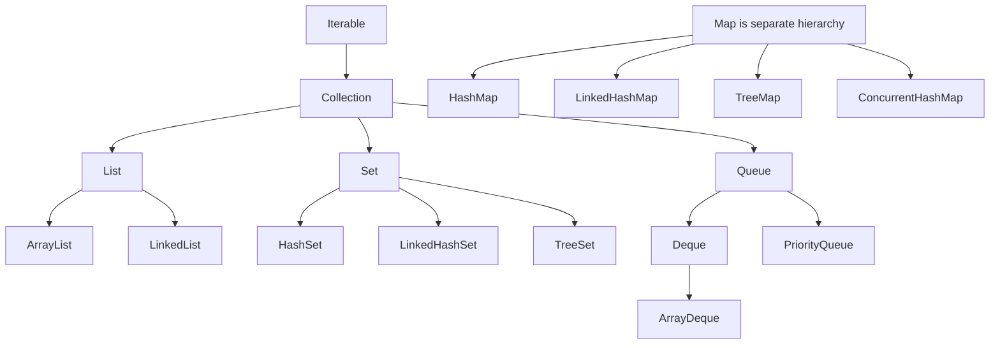

## Mental Model

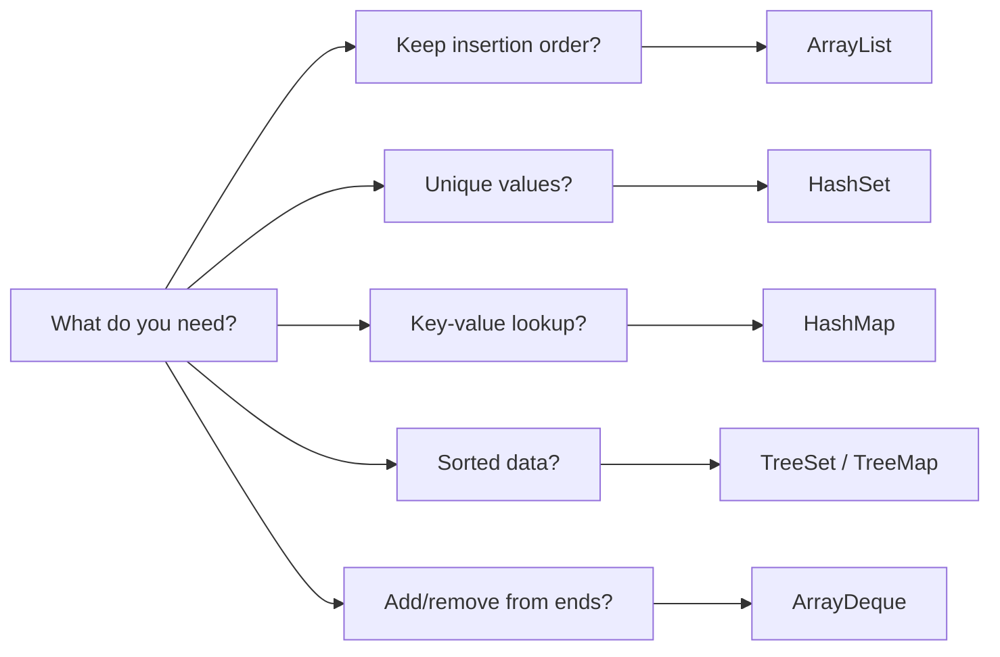

---

# 2. Collection vs Collections

| Name | Meaning | Example |
|---|---|---|
| `Collection` | Interface root for List, Set, Queue | `Collection<String> names` |
| `Collections` | Utility class | `Collections.sort(list)` |

```java
import java.util.*;

public class CollectionVsCollections {
    public static void main(String[] args) {
        Collection<String> names = new ArrayList<>();
        names.add("Asha");
        names.add("Ravi");

        List<String> list = new ArrayList<>(names);
        Collections.sort(list);

        System.out.println(list);
    }
}
```

---

# 3. List

Use `List` when:

- Duplicate values are allowed.
- Index access matters.
- Order matters.

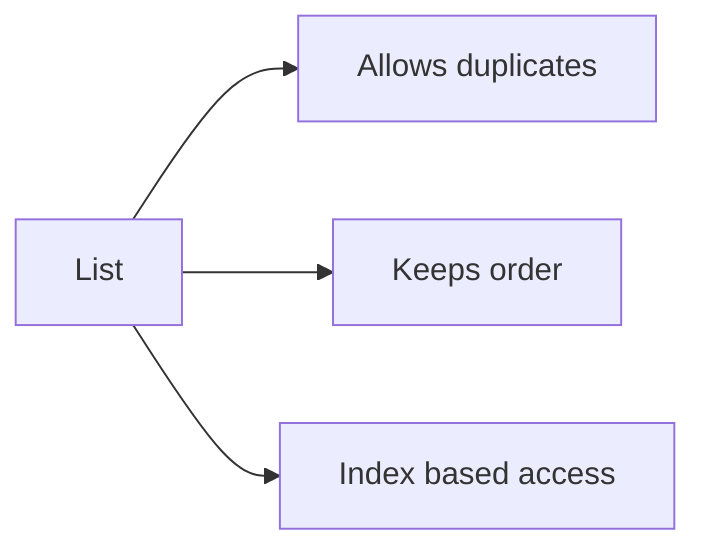

---

## 3.1 ArrayList

### Behind the scenes

`ArrayList` uses a **dynamic array**.

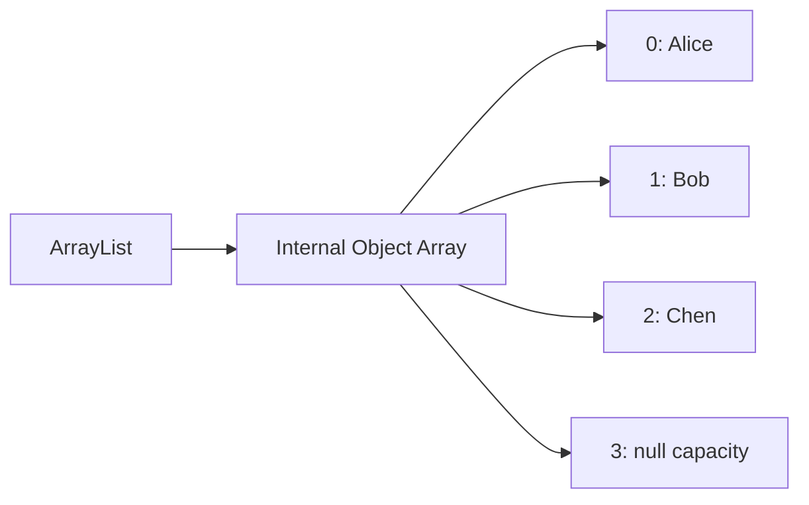

### Best for

- Fast read by index.
- Most common list choice.
- Append-heavy list.

### Time complexity

| Operation | Complexity |
|---|---:|
| Get by index | `O(1)` |
| Add at end | `O(1)` amortized |
| Add/remove in middle | `O(n)` |
| Search by value | `O(n)` |

### Code

```java
import java.util.*;

public class ArrayListExample {
    public static void main(String[] args) {
        List<String> users = new ArrayList<>();

        users.add("Alice");
        users.add("Bob");
        users.add("Chen");

        System.out.println(users.get(1)); // Bob

        users.remove("Alice");

        for (String user : users) {
            System.out.println(user);
        }
    }
}
```

### Use case: Store feed posts

```java
List<String> feed = new ArrayList<>();
feed.add("Post 1");
feed.add("Post 2");
feed.add("Post 3");

System.out.println(feed.get(0)); // first post
```

---

## 3.2 LinkedList

### Behind the scenes

`LinkedList` uses a **doubly linked list**.

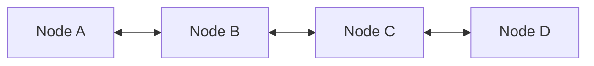

Each node stores:

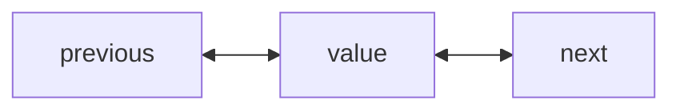

### Best for

- Adding/removing from beginning or end.
- Queue/deque behavior.

### Time complexity

| Operation | Complexity |
|---|---:|
| Get by index | `O(n)` |
| Add/remove first | `O(1)` |
| Add/remove last | `O(1)` |
| Search | `O(n)` |

### Code

```java
import java.util.*;

public class LinkedListExample {
    public static void main(String[] args) {
        LinkedList<String> tasks = new LinkedList<>();

        tasks.addLast("Login");
        tasks.addLast("Load profile");
        tasks.addFirst("Start app");

        System.out.println(tasks.removeFirst()); // Start app
        System.out.println(tasks.removeLast());  // Load profile
    }
}
```

---

# 4. Set

Use `Set` when:

- Duplicates are not allowed.
- You need membership checking.

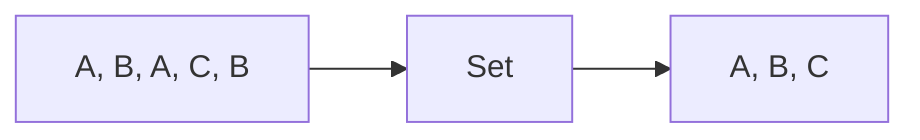

---

## 4.1 HashSet

### Behind the scenes

`HashSet` internally uses a **HashMap**.

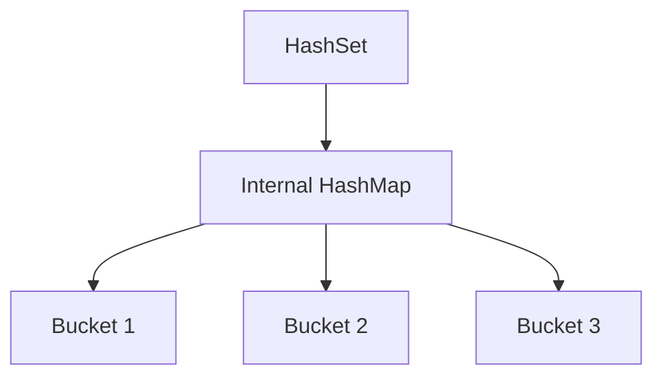

### Best for

- Fast duplicate removal.
- Fast `contains()` check.
- No order required.

### Time complexity

| Operation | Average | Worst case |
|---|---:|---:|
| Add | `O(1)` | `O(n)` |
| Remove | `O(1)` | `O(n)` |
| Contains | `O(1)` | `O(n)` |

### Code

```java
import java.util.*;

public class HashSetExample {
    public static void main(String[] args) {
        Set<String> emails = new HashSet<>();

        emails.add("a@mail.com");
        emails.add("b@mail.com");
        emails.add("a@mail.com");

        System.out.println(emails); // duplicate removed
        System.out.println(emails.contains("b@mail.com"));
    }
}
```

### Use case: Remove duplicate user IDs

```java
List<Long> userIds = List.of(10L, 20L, 10L, 30L);
Set<Long> uniqueUserIds = new HashSet<>(userIds);
System.out.println(uniqueUserIds);
```

---

## 4.2 LinkedHashSet

### Behind the scenes

`LinkedHashSet` uses a **hash table + linked list**.

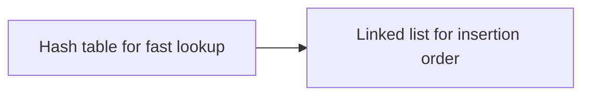

### Best for

- Unique values.
- Keep insertion order.

### Time complexity

| Operation | Complexity |
|---|---:|
| Add | `O(1)` average |
| Remove | `O(1)` average |
| Contains | `O(1)` average |
| Iteration | In insertion order |

### Code

```java
import java.util.*;

public class LinkedHashSetExample {
    public static void main(String[] args) {
        Set<String> pages = new LinkedHashSet<>();

        pages.add("Home");
        pages.add("Profile");
        pages.add("Home");
        pages.add("Settings");

        System.out.println(pages); // [Home, Profile, Settings]
    }
}
```

---

## 4.3 TreeSet

### Behind the scenes

`TreeSet` uses a **Red-Black Tree**.

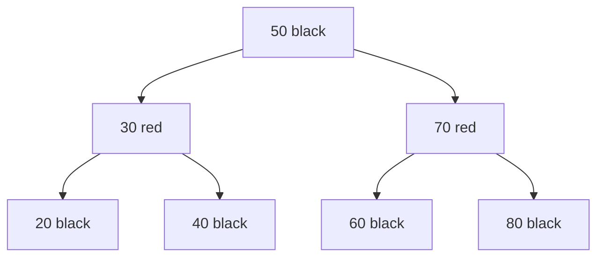

### Best for

- Unique values.
- Sorted order.
- Range queries.

### Time complexity

| Operation | Complexity |
|---|---:|
| Add | `O(log n)` |
| Remove | `O(log n)` |
| Contains | `O(log n)` |
| First/last | `O(log n)` |

### Code

```java
import java.util.*;

public class TreeSetExample {
    public static void main(String[] args) {
        TreeSet<Integer> scores = new TreeSet<>();

        scores.add(80);
        scores.add(95);
        scores.add(70);
        scores.add(80);

        System.out.println(scores);        // [70, 80, 95]
        System.out.println(scores.first()); // 70
        System.out.println(scores.last());  // 95
    }
}
```

### Use case: Leaderboard score levels

```java
TreeSet<Integer> scores = new TreeSet<>(List.of(100, 50, 70, 90));
System.out.println(scores.ceiling(75)); // 90
System.out.println(scores.floor(75));   // 70
```

---

# 5. Queue and Deque

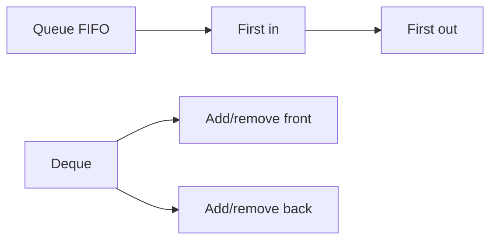

---

## 5.1 ArrayDeque

### Behind the scenes

`ArrayDeque` uses a **resizable circular array**.

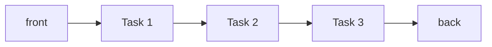

### Best for

- Queue behavior.
- Stack behavior.
- Faster than `Stack` and often faster than `LinkedList`.

### Time complexity

| Operation | Complexity |
|---|---:|
| Add first/last | `O(1)` amortized |
| Remove first/last | `O(1)` |
| Peek first/last | `O(1)` |
| Search | `O(n)` |

### Queue code

```java
import java.util.*;

public class QueueExample {
    public static void main(String[] args) {
        Queue<String> queue = new ArrayDeque<>();

        queue.offer("Order-1");
        queue.offer("Order-2");
        queue.offer("Order-3");

        System.out.println(queue.poll()); // Order-1
        System.out.println(queue.peek()); // Order-2
    }
}
```

### Stack code

```java
import java.util.*;

public class StackUsingDeque {
    public static void main(String[] args) {
        Deque<String> stack = new ArrayDeque<>();

        stack.push("Page A");
        stack.push("Page B");
        stack.push("Page C");

        System.out.println(stack.pop()); // Page C
    }
}
```

---

## 5.2 PriorityQueue

### Behind the scenes

`PriorityQueue` uses a **binary heap**.

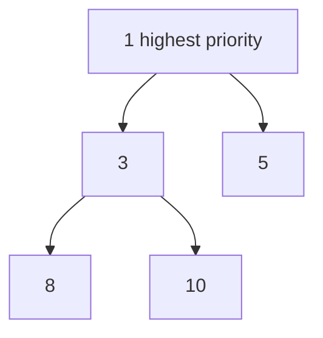

### Best for

- Always process smallest/largest item first.
- Scheduling.
- Top K problems.

### Time complexity

| Operation | Complexity |
|---|---:|
| Offer/add | `O(log n)` |
| Poll/remove top | `O(log n)` |
| Peek top | `O(1)` |
| Search | `O(n)` |

### Min-heap code

```java
import java.util.*;

public class PriorityQueueExample {
    public static void main(String[] args) {
        PriorityQueue<Integer> pq = new PriorityQueue<>();

        pq.offer(30);
        pq.offer(10);
        pq.offer(20);

        System.out.println(pq.poll()); // 10
        System.out.println(pq.poll()); // 20
    }
}
```

### Max-heap code

```java
PriorityQueue<Integer> maxHeap = new PriorityQueue<>(Comparator.reverseOrder());
maxHeap.offer(30);
maxHeap.offer(10);
maxHeap.offer(20);

System.out.println(maxHeap.poll()); // 30
```

### Use case: Top 3 highest scores

```java
import java.util.*;

public class TopKExample {
    public static void main(String[] args) {
        int[] scores = {90, 50, 70, 100, 85};
        int k = 3;

        PriorityQueue<Integer> minHeap = new PriorityQueue<>();

        for (int score : scores) {
            minHeap.offer(score);
            if (minHeap.size() > k) {
                minHeap.poll();
            }
        }

        System.out.println(minHeap); // top 3, order not guaranteed
    }
}
```

---

# 6. Map

Use `Map` when:

- You need key-value lookup.
- You want fast access by ID, username, email, etc.

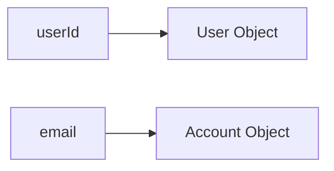

---

## 6.1 HashMap

### Behind the scenes

`HashMap` uses an **array of buckets**. Each bucket can contain nodes. In modern Java, large collision chains may become trees.

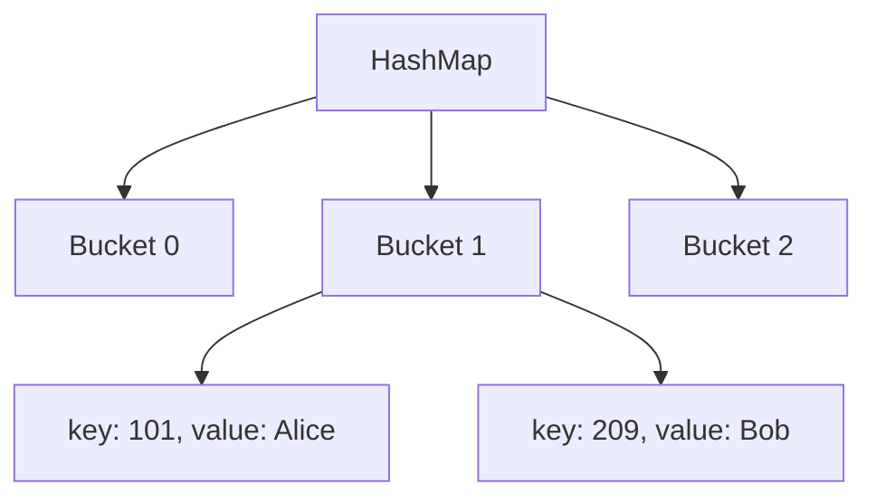

### Best for

- Fast lookup by key.
- Counting frequency.
- Grouping data.

### Time complexity

| Operation | Average | Worst case |
|---|---:|---:|
| Put | `O(1)` | `O(n)` |
| Get | `O(1)` | `O(n)` |
| Remove | `O(1)` | `O(n)` |
| Contains key | `O(1)` | `O(n)` |

### Code

```java
import java.util.*;

public class HashMapExample {
    public static void main(String[] args) {
        Map<Long, String> users = new HashMap<>();

        users.put(1L, "Alice");
        users.put(2L, "Bob");

        System.out.println(users.get(1L));
        System.out.println(users.containsKey(2L));
    }
}
```

### Use case: Count words

```java
import java.util.*;

public class WordCount {
    public static void main(String[] args) {
        List<String> words = List.of("java", "spring", "java", "sql");
        Map<String, Integer> count = new HashMap<>();

        for (String word : words) {
            count.put(word, count.getOrDefault(word, 0) + 1);
        }

        System.out.println(count); // {java=2, spring=1, sql=1}
    }
}
```

---

## 6.2 LinkedHashMap

### Behind the scenes

`LinkedHashMap` uses a **HashMap + doubly linked list**.

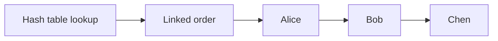

### Best for

- Fast lookup.
- Maintain insertion order.
- LRU cache pattern.

### Time complexity

| Operation | Complexity |
|---|---:|
| Put | `O(1)` average |
| Get | `O(1)` average |
| Remove | `O(1)` average |
| Iteration | In insertion/access order |

### Code

```java
import java.util.*;

public class LinkedHashMapExample {
    public static void main(String[] args) {
        Map<Integer, String> map = new LinkedHashMap<>();

        map.put(3, "C");
        map.put(1, "A");
        map.put(2, "B");

        System.out.println(map); // {3=C, 1=A, 2=B}
    }
}
```

### LRU cache mini example

```java
import java.util.*;

class LruCache<K, V> extends LinkedHashMap<K, V> {
    private final int capacity;

    LruCache(int capacity) {
        super(capacity, 0.75f, true); // true = access order
        this.capacity = capacity;
    }

    @Override
    protected boolean removeEldestEntry(Map.Entry<K, V> eldest) {
        return size() > capacity;
    }
}

public class LruExample {
    public static void main(String[] args) {
        Map<Integer, String> cache = new LruCache<>(2);
        cache.put(1, "A");
        cache.put(2, "B");
        cache.get(1);
        cache.put(3, "C");

        System.out.println(cache); // key 2 removed
    }
}
```

---

## 6.3 TreeMap

### Behind the scenes

`TreeMap` uses a **Red-Black Tree**.

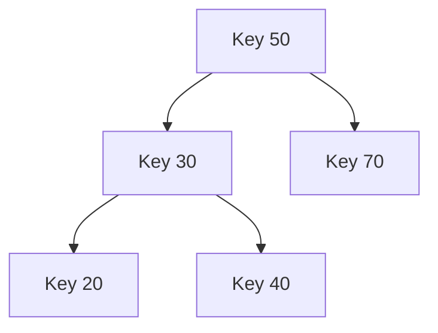

### Best for

- Sorted keys.
- Range queries by key.
- `floorKey`, `ceilingKey`, `firstKey`, `lastKey`.

### Time complexity

| Operation | Complexity |
|---|---:|
| Put | `O(log n)` |
| Get | `O(log n)` |
| Remove | `O(log n)` |
| Range query | `O(log n + result size)` |

### Code

```java
import java.util.*;

public class TreeMapExample {
    public static void main(String[] args) {
        TreeMap<Integer, String> events = new TreeMap<>();

        events.put(900, "Login");
        events.put(1100, "Payment");
        events.put(1000, "Search");

        System.out.println(events); // sorted by key
        System.out.println(events.ceilingKey(950)); // 1000
    }
}
```

---

## 6.4 ConcurrentHashMap

### Behind the scenes

`ConcurrentHashMap` is a **thread-safe hash table** optimized for concurrent reads and updates.

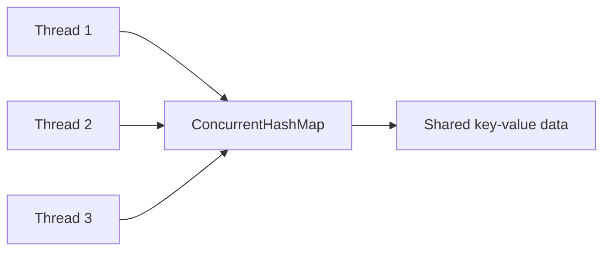

### Best for

- Multi-threaded applications.
- Shared counters.
- Caches.

### Time complexity

| Operation | Average |
|---|---:|
| Put | `O(1)` |
| Get | `O(1)` |
| Remove | `O(1)` |

### Code

```java
import java.util.concurrent.*;

public class ConcurrentHashMapExample {
    public static void main(String[] args) {
        ConcurrentHashMap<String, Integer> visits = new ConcurrentHashMap<>();

        visits.merge("/home", 1, Integer::sum);
        visits.merge("/home", 1, Integer::sum);

        System.out.println(visits); // {/home=2}
    }
}
```

---

# 7. Stack-like Use Cases

Avoid old `Stack` class for new code. Prefer `ArrayDeque`.

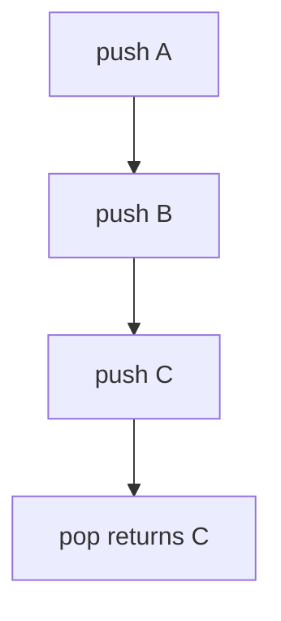

### Use case: Valid parentheses

```java
import java.util.*;

public class ValidParentheses {
    public static boolean isValid(String text) {
        Deque<Character> stack = new ArrayDeque<>();

        for (char ch : text.toCharArray()) {
            if (ch == '(' || ch == '[' || ch == '{') {
                stack.push(ch);
            } else if (ch == ')' || ch == ']' || ch == '}') {
                if (stack.isEmpty()) return false;

                char open = stack.pop();
                if (ch == ')' && open != '(') return false;
                if (ch == ']' && open != '[') return false;
                if (ch == '}' && open != '{') return false;
            }
        }
        return stack.isEmpty();
    }

    public static void main(String[] args) {
        System.out.println(isValid("{[()]}") ); // true
        System.out.println(isValid("{[(])}") ); // false
    }
}
```

---

# 8. Sorting and Comparators

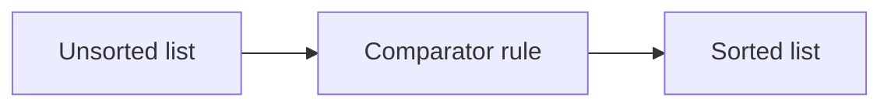

### Sort numbers

```java
List<Integer> nums = new ArrayList<>(List.of(5, 2, 9, 1));
Collections.sort(nums);
System.out.println(nums); // [1, 2, 5, 9]
```

### Sort objects

```java
import java.util.*;

class User {
    String name;
    int age;

    User(String name, int age) {
        this.name = name;
        this.age = age;
    }

    public String toString() {
        return name + ":" + age;
    }
}

public class ComparatorExample {
    public static void main(String[] args) {
        List<User> users = new ArrayList<>();
        users.add(new User("Alice", 30));
        users.add(new User("Bob", 20));
        users.add(new User("Chen", 25));

        users.sort(Comparator.comparingInt(user -> user.age));

        System.out.println(users);
    }
}
```

### Sort by multiple fields

```java
users.sort(
    Comparator.comparingInt((User user) -> user.age)
              .thenComparing(user -> user.name)
);
```

---

# 9. Streams with Collections

Streams are useful for readable transformations.

```mermaid
flowchart LR
    Source[List] --> Filter[filter]
    Filter --> Map[map]
    Map --> Collect[collect]
```

### Filter and collect

```java
import java.util.*;
import java.util.stream.*;

public class StreamExample {
    public static void main(String[] args) {
        List<String> names = List.of("Alice", "Bob", "Andrew", "Chen");

        List<String> result = names.stream()
            .filter(name -> name.startsWith("A"))
            .map(String::toUpperCase)
            .collect(Collectors.toList());

        System.out.println(result); // [ALICE, ANDREW]
    }
}
```

### Group by value

```java
import java.util.*;
import java.util.stream.*;

public class GroupingExample {
    public static void main(String[] args) {
        List<String> words = List.of("java", "spring", "sql", "react");

        Map<Integer, List<String>> byLength = words.stream()
            .collect(Collectors.groupingBy(String::length));

        System.out.println(byLength);
    }
}
```

---

# 10. Common Real Use Cases

## Use Case 1: Remove duplicate emails but keep first-seen order

Use `LinkedHashSet`.

```mermaid
flowchart LR
    Input[a,b,a,c] --> LinkedHashSet[LinkedHashSet]
    LinkedHashSet --> Output[a,b,c]
```

```java
List<String> emails = List.of("a@mail.com", "b@mail.com", "a@mail.com", "c@mail.com");
Set<String> unique = new LinkedHashSet<>(emails);
System.out.println(unique);
```

---

## Use Case 2: Fast user lookup by ID

Use `HashMap`.

```java
Map<Long, String> userById = new HashMap<>();
userById.put(101L, "Alice");
userById.put(102L, "Bob");

System.out.println(userById.get(101L));
```

---

## Use Case 3: Process orders first-in-first-out

Use `ArrayDeque` as `Queue`.

```java
Queue<String> orders = new ArrayDeque<>();
orders.offer("Order-1");
orders.offer("Order-2");

while (!orders.isEmpty()) {
    System.out.println("Processing " + orders.poll());
}
```

---

## Use Case 4: Find top 2 expensive products

Use `PriorityQueue`.

```java
import java.util.*;

class Product {
    String name;
    int price;

    Product(String name, int price) {
        this.name = name;
        this.price = price;
    }

    public String toString() {
        return name + ":" + price;
    }
}

public class TopProducts {
    public static void main(String[] args) {
        List<Product> products = List.of(
            new Product("Phone", 800),
            new Product("Mouse", 30),
            new Product("Laptop", 1500),
            new Product("Keyboard", 100)
        );

        PriorityQueue<Product> heap = new PriorityQueue<>(Comparator.comparingInt(p -> p.price));

        for (Product product : products) {
            heap.offer(product);
            if (heap.size() > 2) {
                heap.poll();
            }
        }

        System.out.println(heap);
    }
}
```

---

## Use Case 5: Sorted event timeline

Use `TreeMap`.

```java
TreeMap<Integer, String> timeline = new TreeMap<>();
timeline.put(930, "Login");
timeline.put(945, "Search");
timeline.put(1000, "Checkout");

System.out.println(timeline.subMap(930, true, 950, true));
```

---

## Use Case 6: Frequency counter

Use `HashMap`.

```mermaid
flowchart LR
    Words[java java sql] --> CountMap[HashMap word to count]
    CountMap --> Result[java=2 sql=1]
```

```java
String text = "java spring java sql java";
Map<String, Integer> frequency = new HashMap<>();

for (String word : text.split(" ")) {
    frequency.merge(word, 1, Integer::sum);
}

System.out.println(frequency);
```

---

# 11. Time Complexity Cheat Sheet

## List

| Collection | Data structure | Get | Add end | Add/remove middle | Contains |
|---|---|---:|---:|---:|---:|
| `ArrayList` | Dynamic array | `O(1)` | `O(1)` amortized | `O(n)` | `O(n)` |
| `LinkedList` | Doubly linked list | `O(n)` | `O(1)` | `O(n)` | `O(n)` |

## Set

| Collection | Data structure | Add | Remove | Contains | Order |
|---|---|---:|---:|---:|---|
| `HashSet` | Hash table | `O(1)` avg | `O(1)` avg | `O(1)` avg | No guarantee |
| `LinkedHashSet` | Hash table + linked list | `O(1)` avg | `O(1)` avg | `O(1)` avg | Insertion order |
| `TreeSet` | Red-black tree | `O(log n)` | `O(log n)` | `O(log n)` | Sorted |

## Queue / Deque

| Collection | Data structure | Add | Remove | Peek | Special use |
|---|---|---:|---:|---:|---|
| `ArrayDeque` | Circular array | `O(1)` amortized | `O(1)` | `O(1)` | Queue/stack |
| `PriorityQueue` | Binary heap | `O(log n)` | `O(log n)` | `O(1)` | Priority processing |

## Map

| Collection | Data structure | Put | Get | Remove | Order |
|---|---|---:|---:|---:|---|
| `HashMap` | Hash table | `O(1)` avg | `O(1)` avg | `O(1)` avg | No guarantee |
| `LinkedHashMap` | Hash table + linked list | `O(1)` avg | `O(1)` avg | `O(1)` avg | Insertion/access order |
| `TreeMap` | Red-black tree | `O(log n)` | `O(log n)` | `O(log n)` | Sorted keys |
| `ConcurrentHashMap` | Concurrent hash table | `O(1)` avg | `O(1)` avg | `O(1)` avg | No guarantee |

---

# 12. Decision Guide

```mermaid
flowchart TD
    Start[Choose collection] --> NeedKeyValue{Need key-value?}
    NeedKeyValue -->|Yes| NeedSortedKeys{Need sorted keys?}
    NeedSortedKeys -->|Yes| TreeMap[TreeMap]
    NeedSortedKeys -->|No| NeedOrderMap{Need insertion order?}
    NeedOrderMap -->|Yes| LinkedHashMap[LinkedHashMap]
    NeedOrderMap -->|No| HashMap[HashMap]

    NeedKeyValue -->|No| NeedUnique{Need unique values?}
    NeedUnique -->|Yes| NeedSortedSet{Need sorted values?}
    NeedSortedSet -->|Yes| TreeSet[TreeSet]
    NeedSortedSet -->|No| NeedInsertionOrderSet{Need insertion order?}
    NeedInsertionOrderSet -->|Yes| LinkedHashSet[LinkedHashSet]
    NeedInsertionOrderSet -->|No| HashSet[HashSet]

    NeedUnique -->|No| NeedIndex{Need index access?}
    NeedIndex -->|Yes| ArrayList[ArrayList]
    NeedIndex -->|No| NeedPriority{Need priority order?}
    NeedPriority -->|Yes| PriorityQueue[PriorityQueue]
    NeedPriority -->|No| ArrayDeque[ArrayDeque]
```

---

# 13. Practice Problems

## Easy

### 1. Remove duplicate numbers

Use: `HashSet`

```java
List<Integer> nums = List.of(1, 2, 2, 3, 1);
Set<Integer> unique = new HashSet<>(nums);
System.out.println(unique);
```

### 2. Count characters

Use: `HashMap`

```java
String s = "banana";
Map<Character, Integer> count = new HashMap<>();

for (char ch : s.toCharArray()) {
    count.merge(ch, 1, Integer::sum);
}

System.out.println(count);
```

---

## Medium

### 3. First non-repeating character

Use: `LinkedHashMap`

```java
String s = "swiss";
Map<Character, Integer> count = new LinkedHashMap<>();

for (char ch : s.toCharArray()) {
    count.merge(ch, 1, Integer::sum);
}

for (Map.Entry<Character, Integer> entry : count.entrySet()) {
    if (entry.getValue() == 1) {
        System.out.println(entry.getKey());
        break;
    }
}
```

### 4. Top K numbers

Use: `PriorityQueue`

```java
int[] nums = {5, 1, 9, 3, 7};
int k = 2;
PriorityQueue<Integer> heap = new PriorityQueue<>();

for (int num : nums) {
    heap.offer(num);
    if (heap.size() > k) heap.poll();
}

System.out.println(heap);
```

---

## Hard

### 5. LRU cache

Use: `LinkedHashMap`

```java
class LRUCache extends LinkedHashMap<Integer, Integer> {
    private final int capacity;

    LRUCache(int capacity) {
        super(capacity, 0.75f, true);
        this.capacity = capacity;
    }

    @Override
    protected boolean removeEldestEntry(Map.Entry<Integer, Integer> eldest) {
        return size() > capacity;
    }
}
```

### 6. Sliding window unique characters

Use: `HashSet`

```java
public class LongestUniqueSubstring {
    public static int lengthOfLongestSubstring(String s) {
        Set<Character> window = new HashSet<>();
        int left = 0;
        int best = 0;

        for (int right = 0; right < s.length(); right++) {
            while (window.contains(s.charAt(right))) {
                window.remove(s.charAt(left));
                left++;
            }
            window.add(s.charAt(right));
            best = Math.max(best, right - left + 1);
        }

        return best;
    }

    public static void main(String[] args) {
        System.out.println(lengthOfLongestSubstring("abcabcbb")); // 3
    }
}
```

---

# Final Memory Map

```mermaid
mindmap
  root((Java Collections))
    List
      ArrayList
        Dynamic array
        Fast get
      LinkedList
        Doubly linked list
        Fast ends
    Set
      HashSet
        Unique
        Fast contains
      LinkedHashSet
        Unique
        Insertion order
      TreeSet
        Unique
        Sorted
    Queue
      ArrayDeque
        FIFO
        Stack
      PriorityQueue
        Heap
        Top K
    Map
      HashMap
        Fast lookup
      LinkedHashMap
        Ordered map
        LRU
      TreeMap
        Sorted keys
      ConcurrentHashMap
        Thread safe
```

