# Comprehensive JVM & Performance Tuning Guide for High-Scale Java Projects

**Audience:** Java engineers building, operating, and troubleshooting high-scale backend systems.  
**Java focus:** Java 8+ concepts, with notes for newer JVMs where useful.  
**Goal:** Give you a practical reference to diagnose and fix CPU, memory, GC, latency, throughput, thread, database, network, container, and production stability issues.

---

## Table of Contents

1. [Performance Mindset](#1-performance-mindset)
2. [JVM Architecture Basics](#2-jvm-architecture-basics)
3. [JVM Memory Areas](#3-jvm-memory-areas)
4. [Heap Generations and Object Lifecycle](#4-heap-generations-and-object-lifecycle)
5. [Garbage Collection Basics](#5-garbage-collection-basics)
6. [Choosing the Right GC](#6-choosing-the-right-gc)
7. [Core JVM Flags](#7-core-jvm-flags)
8. [GC Logging](#8-gc-logging)
9. [Heap Tuning](#9-heap-tuning)
10. [Thread and Stack Tuning](#10-thread-and-stack-tuning)
11. [Native Memory and Metaspace](#11-native-memory-and-metaspace)
12. [JIT Compiler and Warmup](#12-jit-compiler-and-warmup)
13. [CPU Performance Tuning](#13-cpu-performance-tuning)
14. [Memory Leak Troubleshooting](#14-memory-leak-troubleshooting)
15. [GC Pause Troubleshooting](#15-gc-pause-troubleshooting)
16. [Thread Dump Analysis](#16-thread-dump-analysis)
17. [Database and I/O Performance](#17-database-and-io-performance)
18. [Spring Boot Performance](#18-spring-boot-performance)
19. [Kubernetes and Container JVM Tuning](#19-kubernetes-and-container-jvm-tuning)
20. [Observability Metrics](#20-observability-metrics)
21. [Profiling Tools](#21-profiling-tools)
22. [Production Incident Playbooks](#22-production-incident-playbooks)
23. [Benchmarking Correctly](#23-benchmarking-correctly)
24. [High-Scale Architecture Patterns](#24-high-scale-architecture-patterns)
25. [Anti-Patterns](#25-anti-patterns)
26. [Command Cheat Sheet](#26-command-cheat-sheet)
27. [Final Production Checklist](#27-final-production-checklist)

---

# 1. Performance Mindset

Performance tuning is not guessing. It is a loop:

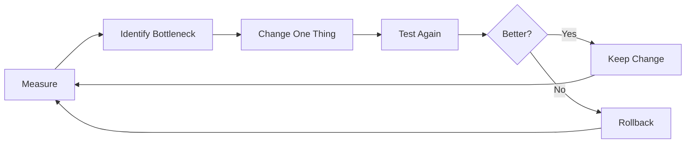

## Golden Rules

1. **Measure before tuning.**
2. **Change one variable at a time.**
3. **Optimize for your actual workload.**
4. **Track latency percentiles, not only averages.**
5. **Understand whether you need throughput, low latency, or low memory.**
6. **Do not blindly copy JVM flags from another service.**

## Key Performance Terms

| Term | Meaning |
|---|---|
| Latency | Time for one request to complete |
| Throughput | Number of requests processed per second |
| P50 | Median latency |
| P95 | 95% of requests are faster than this |
| P99 | 99% of requests are faster than this |
| Saturation | System is near resource limit |
| Allocation rate | How fast objects are created |
| GC pause | Application stop time due to garbage collection |

---

# 2. JVM Architecture Basics

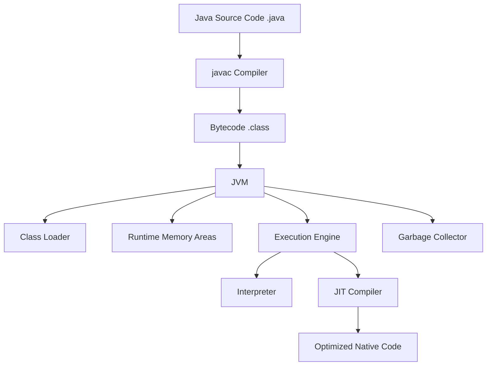

## JVM Main Components

| Component | Responsibility |
|---|---|
| Class Loader | Loads class files into memory |
| Runtime Data Areas | Heap, stack, metaspace, code cache |
| Execution Engine | Interprets and compiles bytecode |
| JIT Compiler | Optimizes hot code |
| Garbage Collector | Frees unused heap objects |

---

# 3. JVM Memory Areas

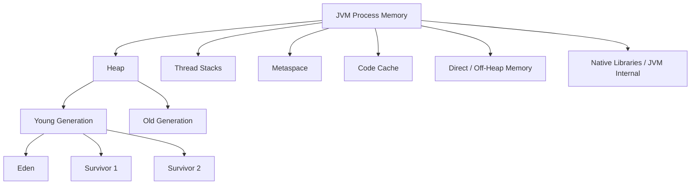

## Important Memory Areas

| Area | Stores | Common Issue |
|---|---|---|
| Heap | Java objects | `OutOfMemoryError: Java heap space` |
| Stack | Method calls and local variables per thread | `StackOverflowError`, too many threads |
| Metaspace | Class metadata | classloader leaks |
| Code Cache | JIT compiled code | JIT stops compiling if full |
| Direct Memory | NIO buffers, Netty, off-heap caches | native OOM |
| Native Memory | JVM internals, libc, threads | container memory kill |

---

# 4. Heap Generations and Object Lifecycle

Most objects die young. The JVM uses this behavior to make GC efficient.

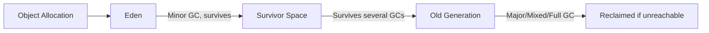

## Object Lifecycle

1. Object is allocated in Eden.
2. Minor GC removes dead young objects.
3. Surviving objects move to Survivor.
4. Long-lived objects are promoted to Old Generation.
5. Old Generation is collected less often.

## Practical Example

```java
public class AllocationExample {
    public static void main(String[] args) {
        for (int i = 0; i < 1_000_000; i++) {
            String value = "user-" + i; // many short-lived objects
        }
    }
}
```

Most `String` objects become unreachable quickly and are cleaned by young GC.

---

# 5. Garbage Collection Basics

Garbage Collection finds unreachable objects and frees memory.

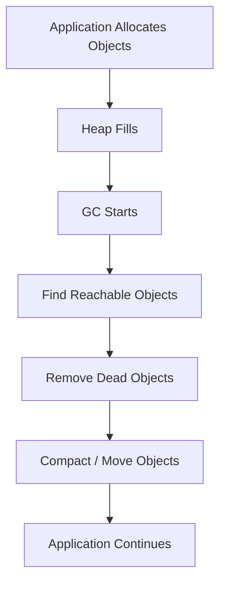

## Types of GC Events

| Event | Meaning |
|---|---|
| Minor GC | Cleans Young Generation |
| Major GC | Cleans Old Generation |
| Mixed GC | G1 cleans young plus selected old regions |
| Full GC | Expensive stop-the-world cleanup |
| Concurrent GC | GC work runs alongside application threads |

## Stop-The-World

During a stop-the-world pause, application threads stop.

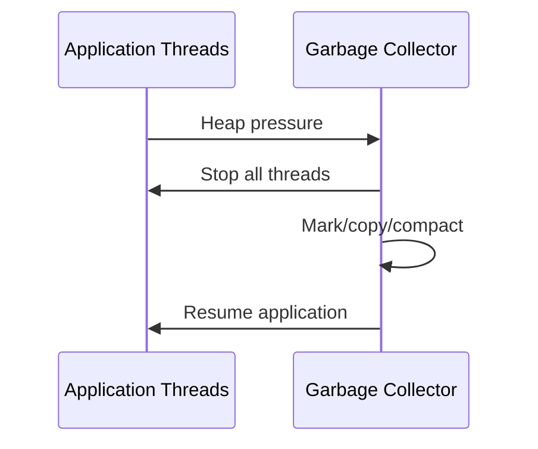

---

# 6. Choosing the Right GC

## GC Selection Table

| Use Case | Recommended GC |
|---|---|
| Small CLI app | Serial GC |
| Batch throughput | Parallel GC |
| General server apps | G1 GC |
| Large heap, low latency | ZGC or Shenandoah |
| Java 8 production backend | Usually G1 GC |
| Very old Java 8 app | CMS may exist but avoid for new setups |

## Java 8 Common Recommendation

```bash
-XX:+UseG1GC
-XX:MaxGCPauseMillis=200
```

## G1 GC Concept

G1 splits heap into regions instead of fixed young/old spaces.

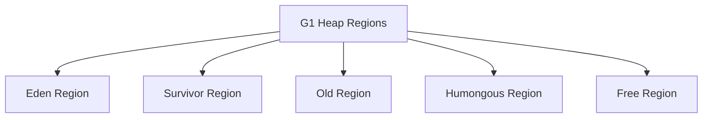

## G1 Strengths

- Good default for services
- Predictable pause target
- Handles medium to large heaps well
- Performs mixed collections

## G1 Weaknesses

- Not magic
- Bad if allocation rate is too high
- Humongous objects can cause fragmentation
- Pause target is a goal, not a guarantee

---

# 7. Core JVM Flags

## Basic Production Flags

```bash
-Xms4g
-Xmx4g
-XX:+UseG1GC
-XX:MaxGCPauseMillis=200
-XX:+HeapDumpOnOutOfMemoryError
-XX:HeapDumpPath=/var/log/app/heapdump.hprof
```

## Why Set `Xms` Equal to `Xmx`?

For high-scale services, fixed heap often gives more predictable performance.

```bash
-Xms4g -Xmx4g
```

Benefits:
- Avoids heap resizing overhead
- More predictable GC behavior
- Better for production latency

## Common Java 8 Flags

```bash
-server
-Xms4g
-Xmx4g
-XX:+UseG1GC
-XX:MaxGCPauseMillis=200
-XX:InitiatingHeapOccupancyPercent=45
-XX:+ParallelRefProcEnabled
-XX:+HeapDumpOnOutOfMemoryError
-XX:HeapDumpPath=/var/log/app
-XX:+PrintGCDetails
-XX:+PrintGCDateStamps
-Xloggc:/var/log/app/gc.log
```

## Common Java 11+ Flags

```bash
-server
-Xms4g
-Xmx4g
-XX:+UseG1GC
-XX:MaxGCPauseMillis=200
-XX:+HeapDumpOnOutOfMemoryError
-XX:HeapDumpPath=/var/log/app
-Xlog:gc*,safepoint:file=/var/log/app/gc.log:time,uptime,level,tags:filecount=5,filesize=100M
```

---

# 8. GC Logging

GC logs are one of the most important tools.

## Java 8 GC Logging

```bash
-XX:+PrintGCDetails
-XX:+PrintGCDateStamps
-XX:+PrintGCTimeStamps
-Xloggc:/var/log/app/gc.log
```

## Java 11+ GC Logging

```bash
-Xlog:gc*,safepoint:file=/var/log/app/gc.log:time,uptime,level,tags:filecount=5,filesize=100M
```

## What to Look For

| Signal | Possible Meaning |
|---|---|
| Frequent young GC | High allocation rate |
| Long young GC | Large young gen or slow references |
| Full GC | Memory pressure, fragmentation, metadata issue |
| Old gen keeps growing | Memory leak or insufficient heap |
| Promotion failure | Objects surviving too fast |
| Humongous allocation | Large arrays/strings/buffers |

## GC Troubleshooting Flow

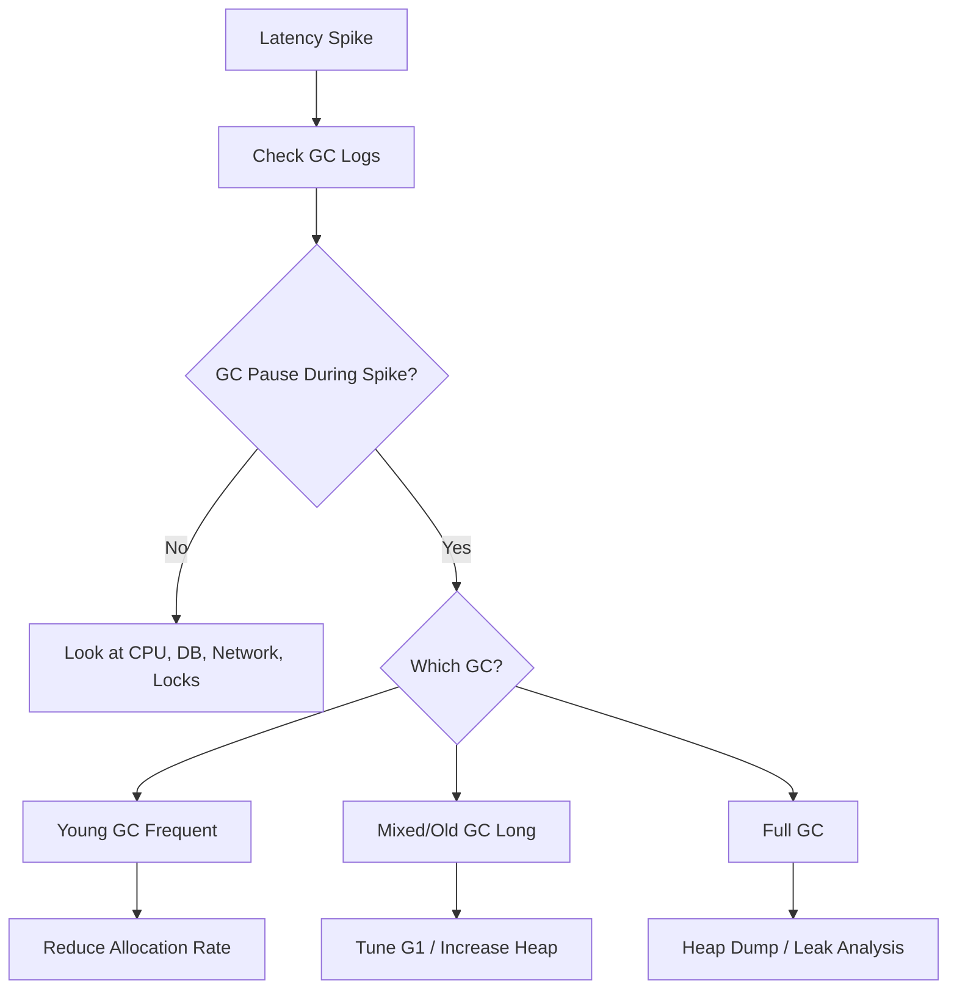

---

# 9. Heap Tuning

## Starting Point

Use enough heap to avoid frequent GC, but not so much that pauses become huge.

```bash
-Xms4g -Xmx4g
```

## Heap Sizing Rule of Thumb

| Service Type | Heap Guidance |
|---|---|
| Small API | 512 MB - 2 GB |
| Medium API | 2 GB - 8 GB |
| Large cache-heavy service | 8 GB - 32 GB |
| Very large heap | Consider ZGC/Shenandoah where available |

## Signs Heap Is Too Small

- Frequent GC
- Old Gen near max
- Full GCs
- `OutOfMemoryError`
- High CPU spent in GC

## Signs Heap Is Too Large

- Long GC pauses
- Wasteful memory usage
- Container OOM due to native memory ignored
- Slower heap dumps and analysis

## Allocation Rate

High allocation rate means the application creates too many objects too quickly.

Bad:

```java
public String buildMessage(User user) {
    return new String("Hello " + user.getName());
}
```

Better:

```java
public String buildMessage(User user) {
    return "Hello " + user.getName();
}
```

## Avoid Unnecessary Temporary Objects

Bad:

```java
List<String> names = users.stream()
    .map(User::getName)
    .collect(Collectors.toList());

return names.size();
```

Better:

```java
return users.size();
```

---

# 10. Thread and Stack Tuning

Each Java thread consumes stack memory.

```bash
-Xss1m
```

If you create 1000 threads with `-Xss1m`, stack reservation can be around 1 GB.

## Thread Pool Rule

Do not create unlimited threads.

Bad:

```java
while (true) {
    new Thread(() -> process()).start();
}
```

Better:

```java
ExecutorService pool = Executors.newFixedThreadPool(32);

pool.submit(() -> process());
```

## CPU-Bound Pool Size

```text
threads = number_of_cpu_cores
```

## I/O-Bound Pool Size

```text
threads = cores * (1 + wait_time / compute_time)
```

## Thread Pool Diagram

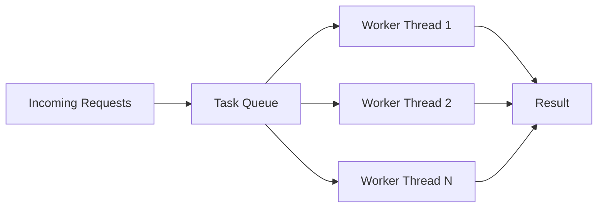

## Watch These Metrics

| Metric | Bad Signal |
|---|---|
| Thread count | Keeps increasing |
| Blocked threads | Lock contention |
| Waiting threads | External dependency bottleneck |
| Runnable threads | CPU pressure |
| Queue size | Pool saturation |

---

# 11. Native Memory and Metaspace

Heap is not total memory.

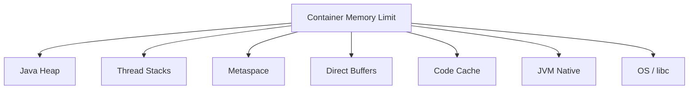

## Common Native Memory Issues

| Error | Possible Cause |
|---|---|
| Container killed with exit 137 | Total process memory exceeded limit |
| `OutOfMemoryError: Direct buffer memory` | Direct memory too small/leaking |
| `OutOfMemoryError: Metaspace` | Classloader leak |
| Cannot create native thread | Too many threads or memory limit |

## Useful Flags

```bash
-XX:MaxMetaspaceSize=256m
-XX:MaxDirectMemorySize=512m
-XX:NativeMemoryTracking=summary
```

## Check Native Memory

```bash
jcmd <pid> VM.native_memory summary
```

---

# 12. JIT Compiler and Warmup

Java performance improves after warmup because hot code gets compiled.

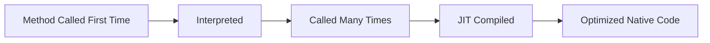

## JIT Optimizations

| Optimization | Meaning |
|---|---|
| Inlining | Replace method call with method body |
| Escape analysis | Allocate object on stack or remove allocation |
| Loop optimization | Improve hot loops |
| Dead code elimination | Remove unused code |
| Lock elimination | Remove unnecessary synchronization |

## Warmup Problem

First requests after deploy can be slower.

Solutions:
- Health check warmup
- Preload caches carefully
- Avoid measuring cold-start only
- Use rolling deployments

---

# 13. CPU Performance Tuning

## Common CPU Causes

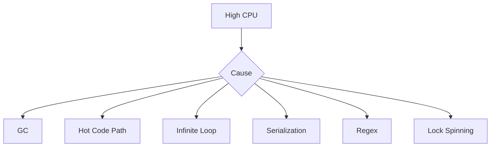

## Steps to Diagnose High CPU

1. Check CPU usage by process.
2. Capture thread dump.
3. Map OS thread ID to Java thread.
4. Use profiler/JFR.
5. Fix hot method.

## Linux Commands

```bash
top -H -p <pid>
jstack <pid> > threads.txt
```

Convert native thread ID to hex:

```bash
printf "%x\n" <thread_id>
```

Search in thread dump:

```bash
grep -i nid=0xHEX threads.txt
```

## Common CPU Fixes

| Cause | Fix |
|---|---|
| Expensive JSON serialization | Reduce fields, use faster mapper, cache where safe |
| Bad regex | Precompile, simplify pattern |
| High allocation | Reuse buffers carefully, reduce temporary objects |
| GC CPU | Reduce allocation or increase heap |
| Lock contention | Reduce synchronized section |

---

# 14. Memory Leak Troubleshooting

A memory leak means objects remain reachable but are no longer useful.

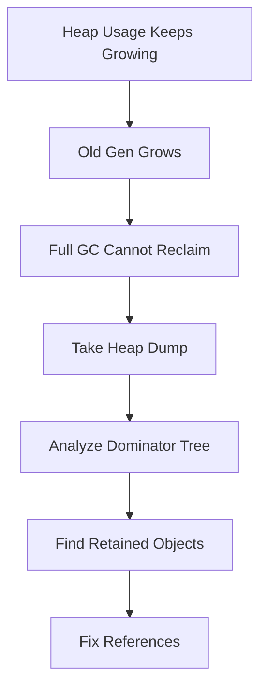

## Common Leak Sources

| Source | Example |
|---|---|
| Static collections | `static Map` grows forever |
| Caches without eviction | unbounded cache |
| ThreadLocals | value not removed |
| Listeners | not deregistered |
| Classloaders | app redeploy leak |
| Queues | producers faster than consumers |

## Bad Static Map

```java
public class UserCache {
    private static final Map<String, User> USERS = new HashMap<>();

    public static void add(User user) {
        USERS.put(user.getId(), user);
    }
}
```

Better with bounded cache:

```java
Cache<String, User> cache = Caffeine.newBuilder()
    .maximumSize(10_000)
    .expireAfterWrite(Duration.ofMinutes(30))
    .build();
```

## ThreadLocal Leak

Bad:

```java
private static final ThreadLocal<UserContext> CTX = new ThreadLocal<>();

public void handle(UserContext context) {
    CTX.set(context);
    process();
}
```

Better:

```java
public void handle(UserContext context) {
    try {
        CTX.set(context);
        process();
    } finally {
        CTX.remove();
    }
}
```

## Heap Dump Commands

```bash
jmap -dump:live,format=b,file=/tmp/heap.hprof <pid>
```

or:

```bash
jcmd <pid> GC.heap_dump /tmp/heap.hprof
```

---

# 15. GC Pause Troubleshooting

## Long GC Pause Decision Tree

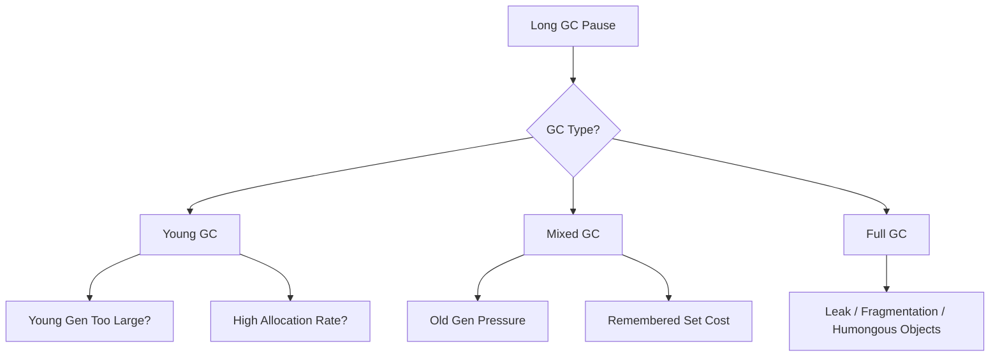

## Fix Frequent Young GC

- Reduce object allocation
- Increase heap
- Review serialization/deserialization
- Avoid unnecessary streams in hot paths
- Avoid creating many temporary collections

## Fix Long Mixed GC

- Increase heap
- Tune G1 pause goal
- Reduce old-gen live set
- Break large objects
- Avoid huge caches on heap

## Fix Full GC

- Take heap dump
- Check old gen occupancy
- Check metaspace
- Check humongous objects
- Check native memory

## Useful G1 Flags

```bash
-XX:+UseG1GC
-XX:MaxGCPauseMillis=200
-XX:InitiatingHeapOccupancyPercent=45
-XX:+ParallelRefProcEnabled
```

Do not over-tune G1 unless you have GC log evidence.

---

# 16. Thread Dump Analysis

Thread dumps show what every Java thread is doing.

## Thread States

| State | Meaning |
|---|---|
| RUNNABLE | Running or ready to run |
| BLOCKED | Waiting for monitor lock |
| WAITING | Waiting indefinitely |
| TIMED_WAITING | Sleeping or waiting with timeout |
| NEW | Created but not started |
| TERMINATED | Finished |

## Deadlock Example

```java
Object lock1 = new Object();
Object lock2 = new Object();

new Thread(() -> {
    synchronized (lock1) {
        synchronized (lock2) {
            System.out.println("A");
        }
    }
}).start();

new Thread(() -> {
    synchronized (lock2) {
        synchronized (lock1) {
            System.out.println("B");
        }
    }
}).start();
```

## Deadlock Diagram

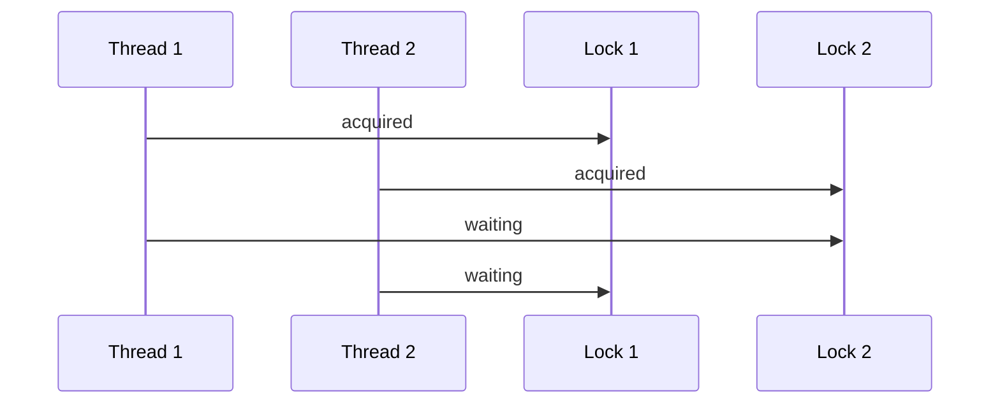

## Commands

```bash
jstack -l <pid> > thread-dump.txt
```

Capture multiple dumps:

```bash
for i in 1 2 3; do
  jstack -l <pid> > thread-$i.txt
  sleep 10
done
```

## What to Look For

- Many threads blocked on same lock
- Thread pool fully busy
- Deadlock section at bottom
- Long-running database calls
- Many waiting HTTP client threads
- Too many created threads

---

# 17. Database and I/O Performance

Often the JVM is not the real bottleneck.

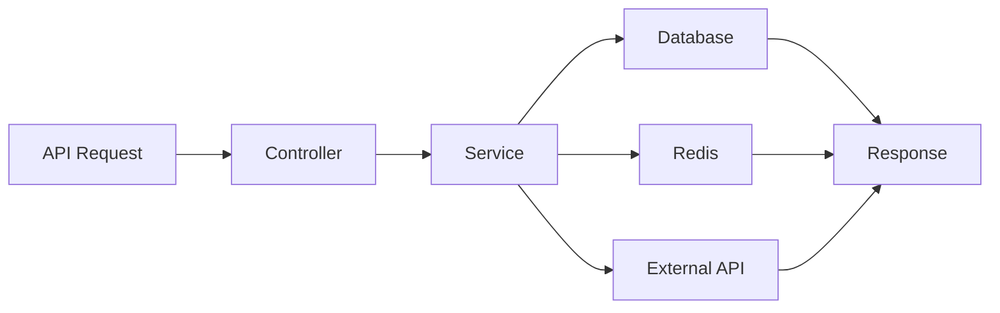

## Database Bottleneck Signals

| Symptom | Possible Cause |
|---|---|
| High request latency | slow query |
| Connection pool exhausted | too many concurrent DB calls |
| CPU low, threads waiting | blocked on I/O |
| DB CPU high | missing index or bad query |
| Timeouts | dependency saturation |

## Connection Pool Tuning

For HikariCP:

```properties
spring.datasource.hikari.maximum-pool-size=20
spring.datasource.hikari.minimum-idle=10
spring.datasource.hikari.connection-timeout=30000
spring.datasource.hikari.idle-timeout=600000
spring.datasource.hikari.max-lifetime=1800000
```

## Important Rule

Bigger DB pool is not always better. Too many connections can overload the database.

## I/O Best Practices

- Use timeouts everywhere
- Use retries with backoff
- Use circuit breakers
- Avoid synchronous fan-out
- Cache stable data
- Limit payload size

---

# 18. Spring Boot Performance

## Startup and Runtime Basics

| Area | Recommendation |
|---|---|
| Beans | Avoid unnecessary auto-configuration |
| Logging | Avoid debug logging in hot paths |
| JSON | Avoid returning huge DTOs |
| DB | Use pagination |
| Caching | Cache read-heavy stable data |
| Actuator | Enable useful metrics |
| Async | Use bounded executors |

## Spring Boot Production Properties

```properties
server.tomcat.threads.max=200
server.tomcat.threads.min-spare=20
server.tomcat.accept-count=100

spring.datasource.hikari.maximum-pool-size=20
spring.jpa.open-in-view=false

management.endpoints.web.exposure.include=health,info,metrics,prometheus
management.metrics.tags.application=my-service
```

## Tomcat Thread Model

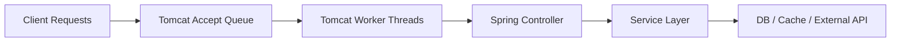

## Common Spring Issues

| Issue | Fix |
|---|---|
| `OpenEntityManagerInView` causes hidden DB access | Disable `spring.jpa.open-in-view` |
| Large REST responses | Pagination and DTO projection |
| Blocking calls in request threads | Async or queue |
| N+1 queries | Fetch join, batch size, entity graph |
| Too much logging | Reduce log level and avoid string concat |

## Logging Performance

Bad:

```java
log.debug("User object: " + expensiveToString(user));
```

Better:

```java
if (log.isDebugEnabled()) {
    log.debug("User object: {}", expensiveToString(user));
}
```

---

# 19. Kubernetes and Container JVM Tuning

Container memory limit is not just heap.

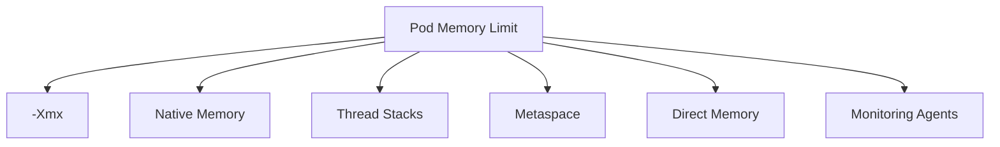

## Safe Container Memory Planning

Example pod limit: `2Gi`

Approximate planning:

| Area | Size |
|---|---|
| Heap | 1200m |
| Metaspace | 200m |
| Direct memory | 128m |
| Thread stacks | 200m |
| Code/JVM/native/agents | 300m |

Example:

```bash
-Xms1200m
-Xmx1200m
-XX:MaxMetaspaceSize=200m
-XX:MaxDirectMemorySize=128m
-Xss512k
```

## Kubernetes YAML Example

```yaml
resources:
  requests:
    cpu: "500m"
    memory: "2Gi"
  limits:
    cpu: "2"
    memory: "2Gi"
```

## Avoid This

```bash
-Xmx2g
```

inside a container with:

```yaml
memory: "2Gi"
```

This leaves no room for native memory and can cause OOMKilled.

## Container Troubleshooting

| Symptom | Check |
|---|---|
| Exit code 137 | Pod memory limit exceeded |
| JVM OOM but pod alive | Java heap/direct/metaspace OOM |
| CPU throttling | CPU limit too low |
| Latency spikes | CPU throttling or GC |
| Restarts | liveness probe too aggressive |

---

# 20. Observability Metrics

## JVM Metrics to Monitor

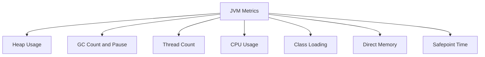

## Key Metrics

| Metric | Why It Matters |
|---|---|
| Heap used after GC | Shows live set |
| Allocation rate | Shows object churn |
| GC pause P95/P99 | User latency impact |
| CPU usage | Saturation |
| Thread count | Thread leaks |
| Runnable threads | CPU contention |
| Blocked threads | Lock contention |
| DB pool active | DB pressure |
| HTTP client pool active | external dependency pressure |

## Recommended Dashboard Panels

1. Request rate
2. Error rate
3. P50/P95/P99 latency
4. CPU usage
5. Heap usage
6. GC pause duration
7. GC count
8. Thread states
9. DB pool usage
10. External call latency
11. Container memory
12. CPU throttling

---

# 21. Profiling Tools

## Tool Comparison

| Tool | Use For |
|---|---|
| JFR | Low-overhead production profiling |
| Java Mission Control | Analyze JFR |
| async-profiler | CPU/allocation/lock profiling |
| VisualVM | Local profiling |
| Eclipse MAT | Heap dump analysis |
| GCViewer / GCeasy | GC log analysis |
| jstack | Thread dumps |
| jmap / jcmd | Heap and JVM diagnostics |

## Java Flight Recorder

Start recording:

```bash
jcmd <pid> JFR.start name=profile duration=120s filename=/tmp/profile.jfr settings=profile
```

Stop recording:

```bash
jcmd <pid> JFR.stop name=profile filename=/tmp/profile.jfr
```

## async-profiler Example

CPU profile:

```bash
./profiler.sh -d 60 -e cpu -f /tmp/cpu.html <pid>
```

Allocation profile:

```bash
./profiler.sh -d 60 -e alloc -f /tmp/alloc.html <pid>
```

Lock profile:

```bash
./profiler.sh -d 60 -e lock -f /tmp/lock.html <pid>
```

---

# 22. Production Incident Playbooks

## A. High Latency

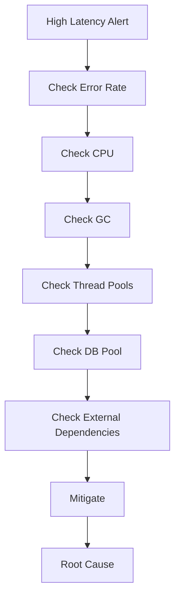

Checklist:

```text
[ ] Is CPU high?
[ ] Is GC pause high?
[ ] Are request threads exhausted?
[ ] Is DB pool exhausted?
[ ] Is downstream latency high?
[ ] Is error rate increasing?
[ ] Did deployment/config change recently?
[ ] Is traffic higher than normal?
```

## B. High CPU

```text
1. top -H -p <pid>
2. jstack <pid>
3. Convert native thread ID to hex
4. Find hot Java thread
5. Capture JFR/async-profiler
6. Fix hot method, GC churn, or lock spinning
```

## C. Memory Leak

```text
1. Check heap after GC trend
2. Capture heap dump
3. Analyze dominator tree
4. Find largest retained objects
5. Identify reference chain
6. Fix cache/listener/static/threadlocal/queue issue
```

## D. Pod OOMKilled

```text
1. Check kubectl describe pod
2. Confirm exit code 137
3. Compare memory limit vs heap
4. Check direct/metaspace/thread/native memory
5. Reduce Xmx or increase pod limit
6. Add Native Memory Tracking if needed
```

## E. DB Pool Exhaustion

```text
1. Check active and pending connections
2. Check slow queries
3. Check transaction duration
4. Check thread dumps for DB calls
5. Add indexes or reduce concurrency
6. Tune pool only after DB capacity is known
```

---

# 23. Benchmarking Correctly

## Avoid Naive Benchmarks

Bad:

```java
long start = System.nanoTime();
myMethod();
long end = System.nanoTime();
System.out.println(end - start);
```

Problems:
- No warmup
- Dead code elimination
- JIT not stable
- Too few iterations

## Use JMH

```java
@Benchmark
public String testConcat() {
    return "hello" + "world";
}
```

## Benchmark Rules

| Rule | Reason |
|---|---|
| Warm up first | JIT needs time |
| Use enough iterations | Reduce noise |
| Isolate benchmark | Avoid external impact |
| Use realistic data | Avoid fake wins |
| Measure allocation | CPU is not everything |
| Compare P95/P99 | Average hides pain |

---

# 24. High-Scale Architecture Patterns

## Request Flow

```mermaid
flowchart LR
    Client --> LB[Load Balancer]
    LB --> API1[Service Instance 1]
    LB --> API2[Service Instance 2]
    LB --> API3[Service Instance 3]
    API1 --> Cache[Redis Cache]
    API2 --> Cache
    API3 --> Cache
    API1 --> DB[(Database)]
    API2 --> DB
    API3 --> DB
    API1 --> MQ[Kafka / Queue]
```

## Patterns

| Pattern | Benefit |
|---|---|
| Horizontal scaling | More capacity |
| Caching | Lower latency and DB load |
| Async messaging | Smooth traffic spikes |
| Bulkheads | Isolate failures |
| Circuit breakers | Stop cascading failures |
| Rate limiting | Protect systems |
| Backpressure | Avoid overload |
| Pagination | Avoid huge memory usage |
| Idempotency | Safe retries |

## Backpressure Diagram

```mermaid
flowchart TD
    A[Incoming Traffic] --> B{Can Service Handle?}
    B -->|Yes| C[Process]
    B -->|No| D[Reject / Queue / Slow Down]
    D --> E[Protect JVM and DB]
```

---

# 25. Anti-Patterns

## JVM Anti-Patterns

| Anti-Pattern | Problem |
|---|---|
| Blindly increasing heap | Hides leaks and may increase pauses |
| Unlimited thread pools | Native memory and context switching |
| Unbounded queues | Memory leaks and latency spikes |
| Huge caches on heap | GC pressure |
| Ignoring GC logs | No evidence for tuning |
| No timeouts | Thread starvation |
| Too many retries | Retry storm |
| Logging huge objects | CPU and memory waste |
| Large payloads | Serialization and network cost |
| Running with no dashboards | Slow incident response |

## Code Anti-Patterns

Bad:

```java
ExecutorService executor = Executors.newCachedThreadPool();
```

Better:

```java
ThreadPoolExecutor executor = new ThreadPoolExecutor(
    20,
    20,
    30,
    TimeUnit.SECONDS,
    new ArrayBlockingQueue<>(1000),
    new ThreadPoolExecutor.CallerRunsPolicy()
);
```

Bad unbounded queue:

```java
BlockingQueue<Task> queue = new LinkedBlockingQueue<>();
```

Better bounded queue:

```java
BlockingQueue<Task> queue = new ArrayBlockingQueue<>(10_000);
```

---

# 26. Command Cheat Sheet

## Process

```bash
jps -l
ps -ef | grep java
top -p <pid>
top -H -p <pid>
```

## JVM Flags

```bash
jcmd <pid> VM.flags
jcmd <pid> VM.system_properties
jcmd <pid> VM.command_line
```

## Heap

```bash
jcmd <pid> GC.heap_info
jcmd <pid> GC.class_histogram
jcmd <pid> GC.heap_dump /tmp/heap.hprof
jmap -dump:live,format=b,file=/tmp/heap.hprof <pid>
```

## Threads

```bash
jstack -l <pid> > thread-dump.txt
jcmd <pid> Thread.print > thread-dump.txt
```

## GC

```bash
jstat -gcutil <pid> 1000
jstat -gccause <pid> 1000
```

## Native Memory

```bash
jcmd <pid> VM.native_memory summary
```

## JFR

```bash
jcmd <pid> JFR.start name=profile duration=120s filename=/tmp/profile.jfr settings=profile
jcmd <pid> JFR.stop name=profile filename=/tmp/profile.jfr
```

## Kubernetes

```bash
kubectl top pod <pod>
kubectl describe pod <pod>
kubectl logs <pod>
kubectl logs <pod> --previous
kubectl exec -it <pod> -- sh
```

---

# 27. Final Production Checklist

## JVM

```text
[ ] Xms and Xmx intentionally configured
[ ] GC selected intentionally
[ ] GC logging enabled
[ ] Heap dump on OOM enabled
[ ] Native memory accounted for
[ ] Thread stack size reviewed
[ ] Container memory limit leaves room beyond heap
```

## Application

```text
[ ] Timeouts configured
[ ] Retries have backoff and limits
[ ] Circuit breakers configured
[ ] Thread pools bounded
[ ] Queues bounded
[ ] Caches have max size / TTL
[ ] Large endpoints use pagination
[ ] Logging is not excessive
```

## Observability

```text
[ ] Request rate dashboard
[ ] Error rate dashboard
[ ] Latency percentiles dashboard
[ ] JVM heap dashboard
[ ] GC dashboard
[ ] Thread dashboard
[ ] DB pool dashboard
[ ] External dependency dashboard
[ ] Alerts have runbooks
```

## Incident Readiness

```text
[ ] Can capture thread dump
[ ] Can capture heap dump
[ ] Can capture JFR
[ ] GC logs retained
[ ] Pod previous logs available
[ ] Rollback process tested
[ ] Load test baseline available
```

---

# Practical Default JVM Configs

## Java 8, Spring Boot, 2 GB Container

```bash
-server
-Xms1200m
-Xmx1200m
-Xss512k
-XX:+UseG1GC
-XX:MaxGCPauseMillis=200
-XX:InitiatingHeapOccupancyPercent=45
-XX:MaxMetaspaceSize=256m
-XX:MaxDirectMemorySize=128m
-XX:+ParallelRefProcEnabled
-XX:+HeapDumpOnOutOfMemoryError
-XX:HeapDumpPath=/var/log/app
-XX:+PrintGCDetails
-XX:+PrintGCDateStamps
-Xloggc:/var/log/app/gc.log
```

## Java 11+, Spring Boot, 2 GB Container

```bash
-server
-Xms1200m
-Xmx1200m
-Xss512k
-XX:+UseG1GC
-XX:MaxGCPauseMillis=200
-XX:InitiatingHeapOccupancyPercent=45
-XX:MaxMetaspaceSize=256m
-XX:MaxDirectMemorySize=128m
-XX:+ParallelRefProcEnabled
-XX:+HeapDumpOnOutOfMemoryError
-XX:HeapDumpPath=/var/log/app
-Xlog:gc*,safepoint:file=/var/log/app/gc.log:time,uptime,level,tags:filecount=5,filesize=100M
```

---

# Troubleshooting Matrix

| Symptom | First Check | Likely Causes | Useful Tools |
|---|---|---|---|
| High latency | APM trace | DB, GC, downstream, locks | JFR, metrics, traces |
| High CPU | top threads | hot loop, GC, serialization | async-profiler, JFR |
| Memory OOM | heap/native split | leak, direct memory, too much heap | heap dump, NMT |
| Full GC | GC logs | old gen full, leak | GC log analyzer, MAT |
| Pod OOMKilled | pod events | container limit exceeded | kubectl, NMT |
| Thread starvation | thread dump | blocked I/O, pool exhausted | jstack, metrics |
| DB pool exhausted | pool metrics | slow query, too much concurrency | DB metrics, traces |
| Slow startup | startup logs | classpath, bean init, warmup | JFR, Spring actuator |
| Random spikes | safepoints/GC/CPU throttling | container CPU limit, GC | JFR, kube metrics |

---

# Learning Path

```mermaid
flowchart TD
    A[Learn JVM Memory] --> B[Learn GC Logs]
    B --> C[Learn Thread Dumps]
    C --> D[Learn Heap Dumps]
    D --> E[Learn JFR]
    E --> F[Learn Kubernetes Limits]
    F --> G[Learn Load Testing]
    G --> H[Production Tuning]
```

## Suggested Practice

1. Write a small app that allocates many objects.
2. Enable GC logs.
3. Change heap size and observe GC behavior.
4. Create a memory leak using a static map.
5. Capture heap dump and inspect it.
6. Create a deadlock.
7. Capture thread dump and identify it.
8. Run JFR on a CPU-heavy method.
9. Deploy in a container with limited memory.
10. Tune heap to avoid OOMKilled.

---

# Mini Lab 1: Create Allocation Pressure

```java
import java.util.*;

public class AllocationPressure {
    public static void main(String[] args) throws Exception {
        List<byte[]> list = new ArrayList<>();

        while (true) {
            byte[] data = new byte[1024 * 1024]; // 1 MB
            list.add(data);

            if (list.size() > 100) {
                list.clear();
            }

            Thread.sleep(50);
        }
    }
}
```

Run:

```bash
javac AllocationPressure.java
java -Xms128m -Xmx128m -XX:+UseG1GC -XX:+PrintGCDetails AllocationPressure
```

Observe GC logs.

---

# Mini Lab 2: Create Memory Leak

```java
import java.util.*;

public class MemoryLeakDemo {
    private static final List<byte[]> LEAK = new ArrayList<>();

    public static void main(String[] args) {
        while (true) {
            LEAK.add(new byte[1024 * 1024]);
        }
    }
}
```

Run:

```bash
javac MemoryLeakDemo.java
java -Xms128m -Xmx128m -XX:+HeapDumpOnOutOfMemoryError MemoryLeakDemo
```

Then analyze heap dump in Eclipse MAT.

---

# Mini Lab 3: Create Thread Deadlock

```java
public class DeadlockDemo {
    public static void main(String[] args) {
        Object a = new Object();
        Object b = new Object();

        Thread t1 = new Thread(() -> {
            synchronized (a) {
                sleep();
                synchronized (b) {
                    System.out.println("t1 done");
                }
            }
        });

        Thread t2 = new Thread(() -> {
            synchronized (b) {
                sleep();
                synchronized (a) {
                    System.out.println("t2 done");
                }
            }
        });

        t1.start();
        t2.start();
    }

    private static void sleep() {
        try {
            Thread.sleep(100);
        } catch (InterruptedException ignored) {}
    }
}
```

Run:

```bash
javac DeadlockDemo.java
java DeadlockDemo
jstack <pid>
```

Look for deadlock section.

---

# Closing Notes

Performance tuning is a discipline. The best production engineers do not memorize random flags. They understand the system, measure carefully, isolate bottlenecks, and validate every change.

Use this guide as a checklist and troubleshooting map during development, load testing, and production incidents.
