# Java Multithreading Guide  
## Basics to Advanced with Atomic Classes, Barriers, Java Code Examples, and Mermaid Diagrams

> This guide is a step-by-step reference for Java multithreading. It starts from basic thread creation and moves to advanced topics like locks, atomics, barriers, latches, semaphores, thread pools, CompletableFuture, ForkJoin, deadlocks, and production best practices.

---

## Table of Contents

1. [What is Multithreading?](#1-what-is-multithreading)
2. [Process vs Thread](#2-process-vs-thread)
3. [Thread Lifecycle](#3-thread-lifecycle)
4. [Creating Threads](#4-creating-threads)
5. [Runnable vs Thread vs Callable](#5-runnable-vs-thread-vs-callable)
6. [Thread Sleep and Join](#6-thread-sleep-and-join)
7. [Race Conditions](#7-race-conditions)
8. [synchronized Keyword](#8-synchronized-keyword)
9. [Object Lock vs Class Lock](#9-object-lock-vs-class-lock)
10. [volatile Keyword](#10-volatile-keyword)
11. [Atomic Variables](#11-atomic-variables)
12. [Compare-And-Swap CAS](#12-compare-and-swap-cas)
13. [ReentrantLock](#13-reentrantlock)
14. [ReadWriteLock](#14-readwritelock)
15. [StampedLock](#15-stampedlock)
16. [wait, notify, notifyAll](#16-wait-notify-notifyall)
17. [BlockingQueue](#17-blockingqueue)
18. [Producer Consumer Pattern](#18-producer-consumer-pattern)
19. [ExecutorService](#19-executorservice)
20. [ThreadPoolExecutor](#20-threadpoolexecutor)
21. [ScheduledExecutorService](#21-scheduledexecutorservice)
22. [Future and Callable](#22-future-and-callable)
23. [CompletableFuture](#23-completablefuture)
24. [CountDownLatch](#24-countdownlatch)
25. [CyclicBarrier](#25-cyclicbarrier)
26. [Phaser](#26-phaser)
27. [Semaphore](#27-semaphore)
28. [Exchanger](#28-exchanger)
29. [ForkJoinPool](#29-forkjoinpool)
30. [ThreadLocal](#30-threadlocal)
31. [Concurrent Collections](#31-concurrent-collections)
32. [Deadlock, Livelock, Starvation](#32-deadlock-livelock-starvation)
33. [Interrupting Threads](#33-interrupting-threads)
34. [Daemon Threads](#34-daemon-threads)
35. [Java Memory Model Basics](#35-java-memory-model-basics)
36. [Performance Best Practices](#36-performance-best-practices)
37. [Troubleshooting Multithreading Issues](#37-troubleshooting-multithreading-issues)
38. [Interview and Production Cheat Sheet](#38-interview-and-production-cheat-sheet)

---

# 1. What is Multithreading?

Multithreading means running multiple threads inside one program.

A thread is a small unit of execution.

## Why Use Multithreading?

- Improve application responsiveness
- Run tasks in parallel
- Use CPU cores better
- Handle many requests at the same time
- Perform background jobs
- Process async tasks

## Simple Example

```java
public class Main {
    public static void main(String[] args) {
        System.out.println("Main thread: " + Thread.currentThread().getName());
    }
}
```

Output:

```text
Main thread: main
```

---

# 2. Process vs Thread

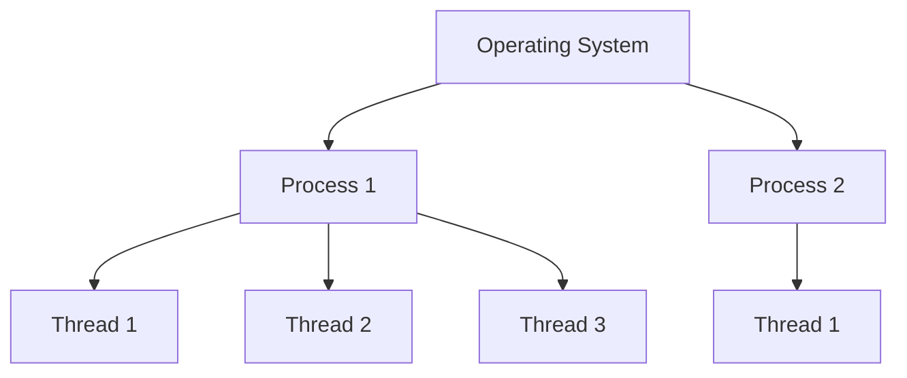

| Concept | Meaning |
|---|---|
| Process | Independent running program |
| Thread | Lightweight execution unit inside process |
| Process memory | Separate |
| Thread memory | Shares process memory |
| Communication | Processes communicate slower |
| Threads communicate | Faster because memory is shared |

---

# 3. Thread Lifecycle

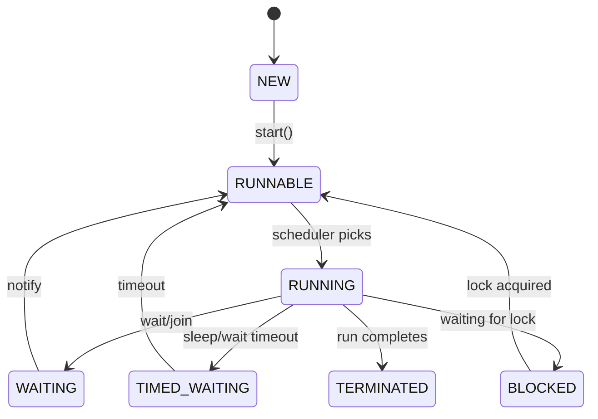

## Thread States

| State | Meaning |
|---|---|
| NEW | Thread object created but not started |
| RUNNABLE | Ready to run |
| RUNNING | Actually running on CPU |
| BLOCKED | Waiting for monitor lock |
| WAITING | Waiting indefinitely |
| TIMED_WAITING | Waiting for fixed time |
| TERMINATED | Finished execution |

---

# 4. Creating Threads

## Method 1: Extend Thread

```java
class MyThread extends Thread {
    public void run() {
        System.out.println("Running in: " + Thread.currentThread().getName());
    }
}

public class Main {
    public static void main(String[] args) {
        MyThread thread = new MyThread();
        thread.start();
    }
}
```

## Important

Do not call `run()` directly.

```java
thread.run();   // wrong: runs in current thread
thread.start(); // correct: starts new thread
```

---

## Method 2: Implement Runnable

```java
class MyTask implements Runnable {
    public void run() {
        System.out.println("Task running in: " + Thread.currentThread().getName());
    }
}

public class Main {
    public static void main(String[] args) {
        Thread thread = new Thread(new MyTask());
        thread.start();
    }
}
```

---

## Method 3: Lambda Runnable

```java
public class Main {
    public static void main(String[] args) {
        Thread thread = new Thread(() -> {
            System.out.println("Lambda thread: " + Thread.currentThread().getName());
        });

        thread.start();
    }
}
```

---

# 5. Runnable vs Thread vs Callable

| Feature | Thread | Runnable | Callable |
|---|---|---|---|
| Returns value | No | No | Yes |
| Throws checked exception | No | No | Yes |
| Used with ExecutorService | Not preferred | Yes | Yes |
| Best use | Simple demo | Fire-and-forget task | Task with result |

## Callable Example

```java
import java.util.concurrent.Callable;

class SumTask implements Callable<Integer> {
    public Integer call() {
        return 10 + 20;
    }
}
```

---

# 6. Thread Sleep and Join

## sleep()

`sleep()` pauses the current thread.

```java
public class SleepExample {
    public static void main(String[] args) throws InterruptedException {
        System.out.println("Start");

        Thread.sleep(2000);

        System.out.println("End after 2 seconds");
    }
}
```

## join()

`join()` makes one thread wait for another thread to finish.

```java
public class JoinExample {
    public static void main(String[] args) throws InterruptedException {
        Thread worker = new Thread(() -> {
            System.out.println("Worker started");
            try {
                Thread.sleep(1000);
            } catch (InterruptedException e) {
                Thread.currentThread().interrupt();
            }
            System.out.println("Worker finished");
        });

        worker.start();
        worker.join();

        System.out.println("Main continues after worker finishes");
    }
}
```

## Join Diagram

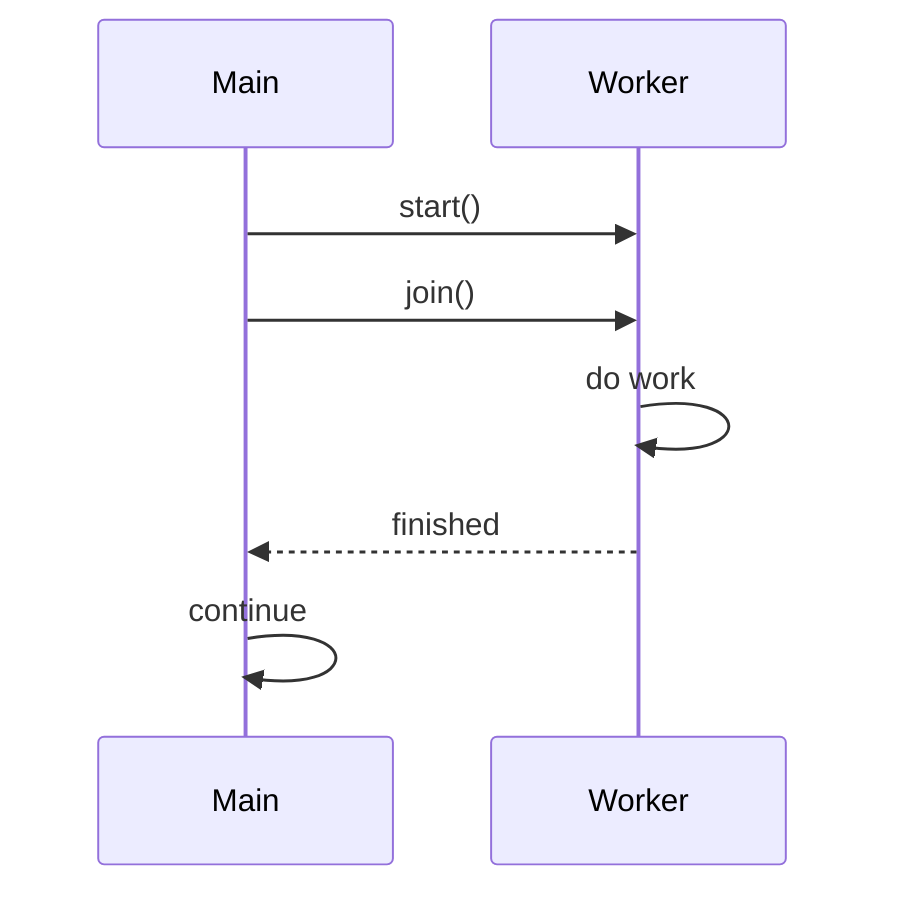

---

# 7. Race Conditions

A race condition happens when multiple threads access shared data at the same time and final result depends on timing.

## Bad Example

```java
class Counter {
    private int count = 0;

    public void increment() {
        count++;
    }

    public int getCount() {
        return count;
    }
}

public class RaceConditionExample {
    public static void main(String[] args) throws InterruptedException {
        Counter counter = new Counter();

        Runnable task = () -> {
            for (int i = 0; i < 10000; i++) {
                counter.increment();
            }
        };

        Thread t1 = new Thread(task);
        Thread t2 = new Thread(task);

        t1.start();
        t2.start();

        t1.join();
        t2.join();

        System.out.println(counter.getCount());
    }
}
```

Expected:

```text
20000
```

But actual may be less because `count++` is not atomic.

## Why count++ is unsafe

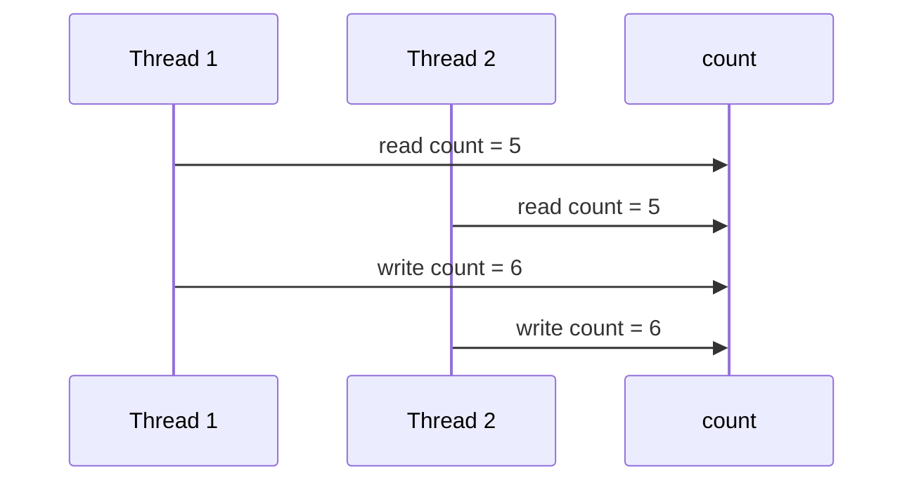

Two increments happened, but result increased only by one.

---

# 8. synchronized Keyword

`synchronized` allows only one thread to enter a critical section at a time.

## Fixed Counter

```java
class SafeCounter {
    private int count = 0;

    public synchronized void increment() {
        count++;
    }

    public synchronized int getCount() {
        return count;
    }
}
```

## Full Example

```java
public class SynchronizedExample {
    public static void main(String[] args) throws InterruptedException {
        SafeCounter counter = new SafeCounter();

        Runnable task = () -> {
            for (int i = 0; i < 10000; i++) {
                counter.increment();
            }
        };

        Thread t1 = new Thread(task);
        Thread t2 = new Thread(task);

        t1.start();
        t2.start();

        t1.join();
        t2.join();

        System.out.println(counter.getCount());
    }
}
```

## synchronized Flow

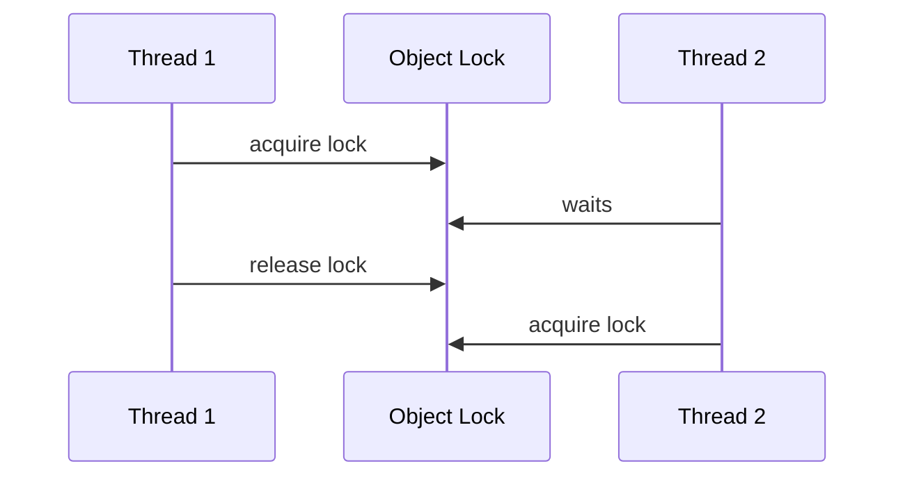

---

# 9. Object Lock vs Class Lock

## Object Lock

Instance synchronized methods lock the current object.

```java
class Account {
    public synchronized void withdraw() {
        System.out.println("Object lock");
    }
}
```

Two different objects have two different locks.

## Class Lock

Static synchronized methods lock the class object.

```java
class Account {
    public static synchronized void globalOperation() {
        System.out.println("Class lock");
    }
}
```

## Diagram

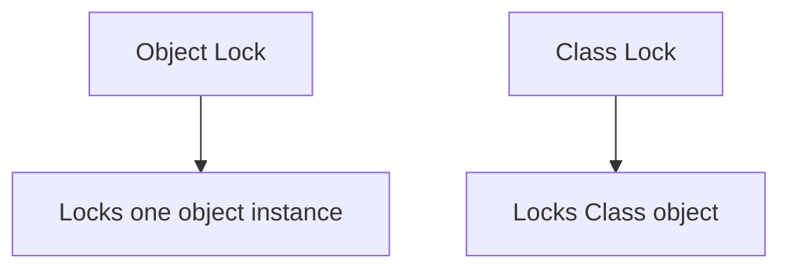

---

# 10. volatile Keyword

`volatile` ensures visibility of changes between threads.

It does not make compound operations atomic.

## Good Use Case: Stop Flag

```java
class Worker extends Thread {
    private volatile boolean running = true;

    public void run() {
        while (running) {
            // keep working
        }

        System.out.println("Worker stopped");
    }

    public void shutdown() {
        running = false;
    }
}

public class VolatileExample {
    public static void main(String[] args) throws InterruptedException {
        Worker worker = new Worker();
        worker.start();

        Thread.sleep(1000);
        worker.shutdown();
    }
}
```

## volatile Diagram

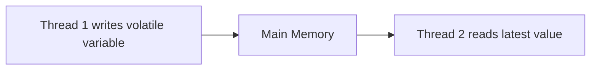

## volatile is not enough for increment

Bad:

```java
private volatile int count = 0;

public void increment() {
    count++; // still not atomic
}
```

Use `AtomicInteger` for atomic increment.

---

# 11. Atomic Variables

Atomic classes provide lock-free thread-safe operations.

Common classes:

- `AtomicInteger`
- `AtomicLong`
- `AtomicBoolean`
- `AtomicReference`
- `LongAdder`
- `LongAccumulator`

## AtomicInteger Example

```java
import java.util.concurrent.atomic.AtomicInteger;

class AtomicCounter {
    private AtomicInteger count = new AtomicInteger(0);

    public void increment() {
        count.incrementAndGet();
    }

    public int getCount() {
        return count.get();
    }
}
```

## Full Example

```java
import java.util.concurrent.atomic.AtomicInteger;

public class AtomicIntegerExample {
    public static void main(String[] args) throws InterruptedException {
        AtomicInteger count = new AtomicInteger(0);

        Runnable task = () -> {
            for (int i = 0; i < 10000; i++) {
                count.incrementAndGet();
            }
        };

        Thread t1 = new Thread(task);
        Thread t2 = new Thread(task);

        t1.start();
        t2.start();

        t1.join();
        t2.join();

        System.out.println(count.get());
    }
}
```

## Atomic Operations

| Method | Meaning |
|---|---|
| `get()` | Get value |
| `set(value)` | Set value |
| `incrementAndGet()` | Increment then return |
| `getAndIncrement()` | Return then increment |
| `decrementAndGet()` | Decrement then return |
| `addAndGet(value)` | Add and return |
| `compareAndSet(expected, newValue)` | CAS operation |

---

## AtomicBoolean Example

```java
import java.util.concurrent.atomic.AtomicBoolean;

public class AtomicBooleanExample {
    public static void main(String[] args) {
        AtomicBoolean started = new AtomicBoolean(false);

        if (started.compareAndSet(false, true)) {
            System.out.println("Started first time");
        }

        if (!started.compareAndSet(false, true)) {
            System.out.println("Already started");
        }
    }
}
```

---

## AtomicReference Example

```java
import java.util.concurrent.atomic.AtomicReference;

class User {
    private final String name;

    public User(String name) {
        this.name = name;
    }

    public String toString() {
        return name;
    }
}

public class AtomicReferenceExample {
    public static void main(String[] args) {
        AtomicReference<User> userRef = new AtomicReference<>(new User("Alice"));

        userRef.compareAndSet(new User("Alice"), new User("Bob"));

        System.out.println(userRef.get());
    }
}
```

Important: `compareAndSet` compares object references, not object values.

---

## LongAdder

`LongAdder` performs better than `AtomicLong` under high contention.

```java
import java.util.concurrent.atomic.LongAdder;

public class LongAdderExample {
    public static void main(String[] args) {
        LongAdder counter = new LongAdder();

        counter.increment();
        counter.add(10);

        System.out.println(counter.sum());
    }
}
```

Use `LongAdder` for high-throughput counters like metrics.

---

# 12. Compare-And-Swap CAS

CAS is the idea behind many atomic classes.

It means:

```text
If current value == expected value,
then update to new value.
Otherwise fail.
```

## CAS Diagram

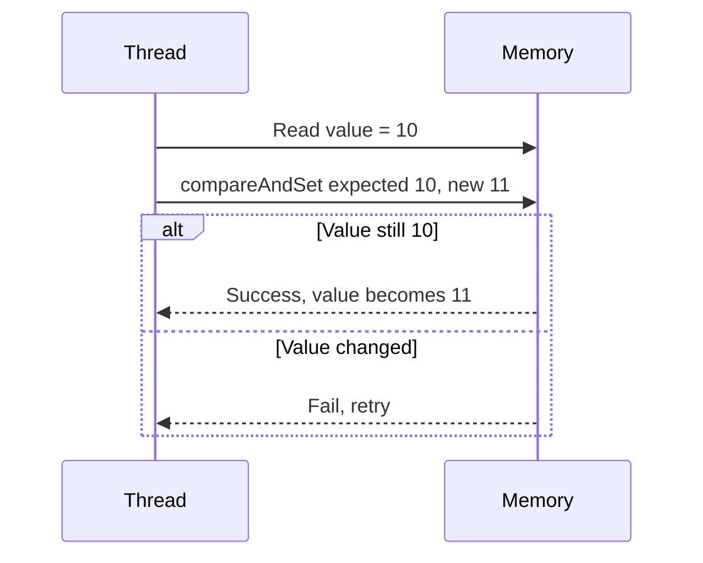

## CAS Example

```java
import java.util.concurrent.atomic.AtomicInteger;

public class CasExample {
    public static void main(String[] args) {
        AtomicInteger number = new AtomicInteger(10);

        boolean success = number.compareAndSet(10, 20);

        System.out.println("Updated: " + success);
        System.out.println("Value: " + number.get());
    }
}
```

---

# 13. ReentrantLock

`ReentrantLock` gives more control than `synchronized`.

Features:

- explicit lock/unlock
- tryLock
- interruptible locking
- fairness option
- multiple conditions

## Basic Example

```java
import java.util.concurrent.locks.ReentrantLock;

class LockCounter {
    private int count = 0;
    private final ReentrantLock lock = new ReentrantLock();

    public void increment() {
        lock.lock();

        try {
            count++;
        } finally {
            lock.unlock();
        }
    }

    public int getCount() {
        return count;
    }
}
```

## tryLock Example

```java
import java.util.concurrent.TimeUnit;
import java.util.concurrent.locks.ReentrantLock;

public class TryLockExample {
    public static void main(String[] args) throws InterruptedException {
        ReentrantLock lock = new ReentrantLock();

        if (lock.tryLock(1, TimeUnit.SECONDS)) {
            try {
                System.out.println("Lock acquired");
            } finally {
                lock.unlock();
            }
        } else {
            System.out.println("Could not acquire lock");
        }
    }
}
```

## Always Unlock in finally

```java
lock.lock();
try {
    // critical section
} finally {
    lock.unlock();
}
```

---

# 14. ReadWriteLock

`ReadWriteLock` allows:

- many readers at the same time
- only one writer at a time

Good for read-heavy systems.

## Diagram

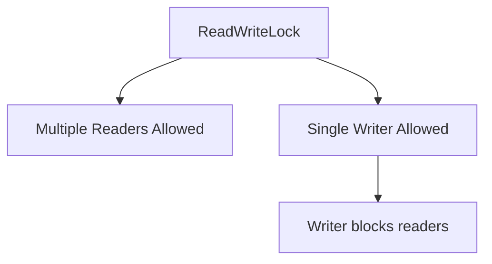

## Example

```java
import java.util.HashMap;
import java.util.Map;
import java.util.concurrent.locks.*;

class Cache {
    private final Map<String, String> data = new HashMap<>();
    private final ReadWriteLock lock = new ReentrantReadWriteLock();

    public String get(String key) {
        lock.readLock().lock();

        try {
            return data.get(key);
        } finally {
            lock.readLock().unlock();
        }
    }

    public void put(String key, String value) {
        lock.writeLock().lock();

        try {
            data.put(key, value);
        } finally {
            lock.writeLock().unlock();
        }
    }
}
```

---

# 15. StampedLock

`StampedLock` supports optimistic reads.

Good for advanced read-heavy use cases.

## Example

```java
import java.util.concurrent.locks.StampedLock;

class Point {
    private double x;
    private double y;
    private final StampedLock lock = new StampedLock();

    public void move(double newX, double newY) {
        long stamp = lock.writeLock();

        try {
            x = newX;
            y = newY;
        } finally {
            lock.unlockWrite(stamp);
        }
    }

    public double distanceFromOrigin() {
        long stamp = lock.tryOptimisticRead();

        double currentX = x;
        double currentY = y;

        if (!lock.validate(stamp)) {
            stamp = lock.readLock();
            try {
                currentX = x;
                currentY = y;
            } finally {
                lock.unlockRead(stamp);
            }
        }

        return Math.sqrt(currentX * currentX + currentY * currentY);
    }
}
```

---

# 16. wait, notify, notifyAll

These are used for thread communication.

Rules:

- Must be called inside synchronized block
- `wait()` releases lock
- `notify()` wakes one waiting thread
- `notifyAll()` wakes all waiting threads

## Diagram

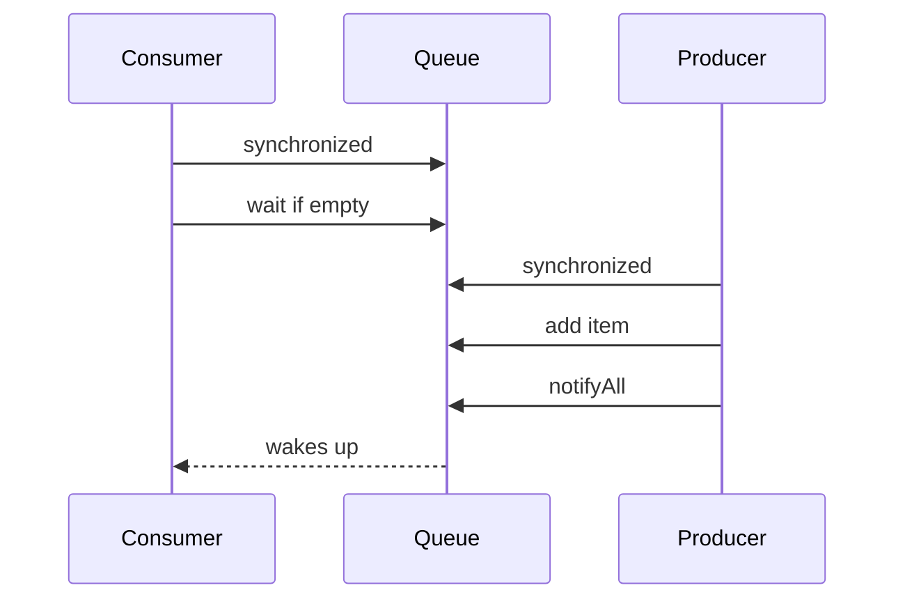

## Example

```java
class SharedBox {
    private String item;
    private boolean available = false;

    public synchronized void put(String item) throws InterruptedException {
        while (available) {
            wait();
        }

        this.item = item;
        available = true;
        notifyAll();
    }

    public synchronized String take() throws InterruptedException {
        while (!available) {
            wait();
        }

        String result = item;
        available = false;
        notifyAll();

        return result;
    }
}
```

## Usage

```java
public class WaitNotifyExample {
    public static void main(String[] args) {
        SharedBox box = new SharedBox();

        Thread producer = new Thread(() -> {
            try {
                box.put("Data");
                System.out.println("Produced Data");
            } catch (InterruptedException e) {
                Thread.currentThread().interrupt();
            }
        });

        Thread consumer = new Thread(() -> {
            try {
                String data = box.take();
                System.out.println("Consumed " + data);
            } catch (InterruptedException e) {
                Thread.currentThread().interrupt();
            }
        });

        consumer.start();
        producer.start();
    }
}
```

---

# 17. BlockingQueue

`BlockingQueue` is better than manual wait/notify for producer-consumer problems.

Common implementations:

- `ArrayBlockingQueue`
- `LinkedBlockingQueue`
- `PriorityBlockingQueue`
- `DelayQueue`
- `SynchronousQueue`

## Example

```java
import java.util.concurrent.BlockingQueue;
import java.util.concurrent.ArrayBlockingQueue;

public class BlockingQueueExample {
    public static void main(String[] args) throws InterruptedException {
        BlockingQueue<String> queue = new ArrayBlockingQueue<>(10);

        queue.put("Task 1");

        String task = queue.take();

        System.out.println(task);
    }
}
```

---

# 18. Producer Consumer Pattern

## Diagram

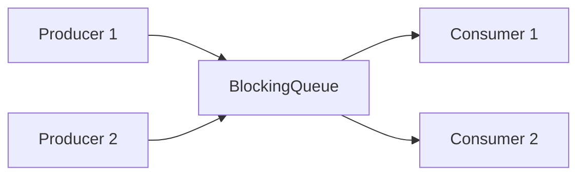

## Code

```java
import java.util.concurrent.ArrayBlockingQueue;
import java.util.concurrent.BlockingQueue;

public class ProducerConsumerExample {
    public static void main(String[] args) {
        BlockingQueue<Integer> queue = new ArrayBlockingQueue<>(5);

        Runnable producer = () -> {
            try {
                for (int i = 1; i <= 10; i++) {
                    queue.put(i);
                    System.out.println("Produced: " + i);
                }
            } catch (InterruptedException e) {
                Thread.currentThread().interrupt();
            }
        };

        Runnable consumer = () -> {
            try {
                for (int i = 1; i <= 10; i++) {
                    Integer value = queue.take();
                    System.out.println("Consumed: " + value);
                }
            } catch (InterruptedException e) {
                Thread.currentThread().interrupt();
            }
        };

        new Thread(producer).start();
        new Thread(consumer).start();
    }
}
```

---

# 19. ExecutorService

Creating raw threads manually is not recommended for production.

Use `ExecutorService`.

## Why?

- Reuses threads
- Controls concurrency
- Manages task queue
- Provides shutdown
- Supports Callable/Future

## Diagram

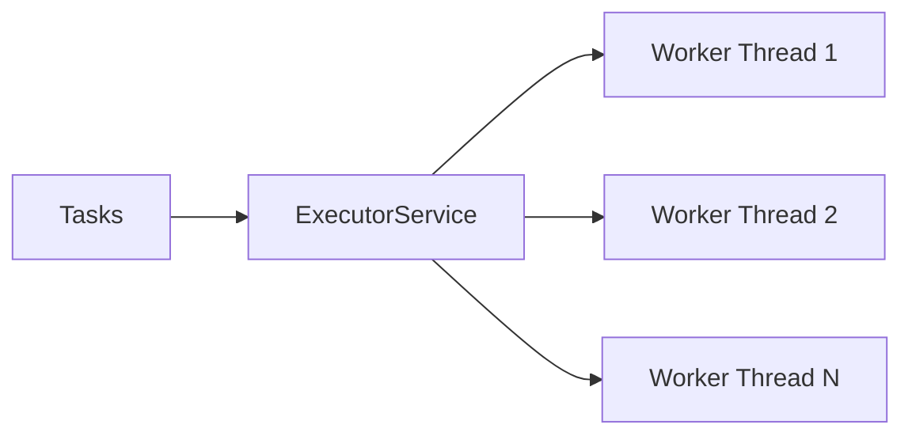

## Fixed Thread Pool

```java
import java.util.concurrent.ExecutorService;
import java.util.concurrent.Executors;

public class ExecutorServiceExample {
    public static void main(String[] args) {
        ExecutorService executor = Executors.newFixedThreadPool(3);

        for (int i = 1; i <= 5; i++) {
            int taskId = i;

            executor.submit(() -> {
                System.out.println("Task " + taskId +
                        " running in " + Thread.currentThread().getName());
            });
        }

        executor.shutdown();
    }
}
```

## Common Executors

| Executor | Use Case |
|---|---|
| `newFixedThreadPool` | Fixed number of workers |
| `newSingleThreadExecutor` | One background worker |
| `newCachedThreadPool` | Many short-lived async tasks, use carefully |
| `newScheduledThreadPool` | Scheduled tasks |
| `newWorkStealingPool` | ForkJoin-style parallelism |

---

# 20. ThreadPoolExecutor

For production, prefer explicit `ThreadPoolExecutor`.

## Why Avoid Unbounded Queues?

Unbounded queues can cause memory issues.

Bad:

```java
Executors.newFixedThreadPool(10);
```

Internally uses an unbounded queue.

## Better Production Example

```java
import java.util.concurrent.*;

public class CustomThreadPoolExample {
    public static void main(String[] args) {
        ThreadPoolExecutor executor = new ThreadPoolExecutor(
                5,
                10,
                60,
                TimeUnit.SECONDS,
                new ArrayBlockingQueue<>(100),
                new ThreadPoolExecutor.CallerRunsPolicy()
        );

        for (int i = 1; i <= 200; i++) {
            int taskId = i;

            executor.submit(() -> {
                System.out.println("Processing task " + taskId);
            });
        }

        executor.shutdown();
    }
}
```

## Thread Pool Parameters

| Parameter | Meaning |
|---|---|
| corePoolSize | Minimum active threads |
| maximumPoolSize | Maximum threads |
| keepAliveTime | Extra idle thread lifetime |
| workQueue | Queue for waiting tasks |
| rejectionHandler | What happens when full |

## Rejection Policies

| Policy | Behavior |
|---|---|
| AbortPolicy | Throws exception |
| CallerRunsPolicy | Caller thread runs task |
| DiscardPolicy | Silently discards task |
| DiscardOldestPolicy | Removes oldest queued task |

---

# 21. ScheduledExecutorService

Use for delayed and repeated tasks.

## Run After Delay

```java
import java.util.concurrent.*;

public class ScheduledExample {
    public static void main(String[] args) {
        ScheduledExecutorService scheduler =
                Executors.newScheduledThreadPool(2);

        scheduler.schedule(() -> {
            System.out.println("Runs after 2 seconds");
        }, 2, TimeUnit.SECONDS);

        scheduler.shutdown();
    }
}
```

## Run Repeatedly

```java
ScheduledExecutorService scheduler =
        Executors.newScheduledThreadPool(1);

scheduler.scheduleAtFixedRate(() -> {
    System.out.println("Runs every 1 second");
}, 0, 1, TimeUnit.SECONDS);
```

---

# 22. Future and Callable

`Future` represents result of an async task.

## Example

```java
import java.util.concurrent.*;

public class FutureExample {
    public static void main(String[] args) throws Exception {
        ExecutorService executor = Executors.newSingleThreadExecutor();

        Callable<Integer> task = () -> {
            Thread.sleep(1000);
            return 100;
        };

        Future<Integer> future = executor.submit(task);

        System.out.println("Doing other work");

        Integer result = future.get();

        System.out.println("Result: " + result);

        executor.shutdown();
    }
}
```

## Future Limitations

- `get()` blocks
- hard to chain tasks
- hard to combine multiple futures
- limited exception handling

Use `CompletableFuture` for advanced async programming.

---

# 23. CompletableFuture

`CompletableFuture` supports async pipelines.

## Basic Example

```java
import java.util.concurrent.CompletableFuture;

public class CompletableFutureExample {
    public static void main(String[] args) {
        CompletableFuture<String> future =
                CompletableFuture.supplyAsync(() -> "Hello");

        future.thenAccept(result -> System.out.println(result));

        future.join();
    }
}
```

## Chaining

```java
import java.util.concurrent.CompletableFuture;

public class CompletableFutureChainExample {
    public static void main(String[] args) {
        CompletableFuture<String> future =
                CompletableFuture.supplyAsync(() -> "loan")
                        .thenApply(String::toUpperCase)
                        .thenApply(value -> value + "-APPROVED");

        System.out.println(future.join());
    }
}
```

## Combining Futures

```java
import java.util.concurrent.CompletableFuture;

public class CompletableFutureCombineExample {
    public static void main(String[] args) {
        CompletableFuture<String> customerFuture =
                CompletableFuture.supplyAsync(() -> "Customer");

        CompletableFuture<String> loanFuture =
                CompletableFuture.supplyAsync(() -> "Loan");

        CompletableFuture<String> result =
                customerFuture.thenCombine(loanFuture,
                        (customer, loan) -> customer + " + " + loan);

        System.out.println(result.join());
    }
}
```

## allOf

```java
import java.util.concurrent.CompletableFuture;

public class CompletableFutureAllOfExample {
    public static void main(String[] args) {
        CompletableFuture<Void> all =
                CompletableFuture.allOf(
                        CompletableFuture.runAsync(() -> System.out.println("Task 1")),
                        CompletableFuture.runAsync(() -> System.out.println("Task 2")),
                        CompletableFuture.runAsync(() -> System.out.println("Task 3"))
                );

        all.join();

        System.out.println("All tasks completed");
    }
}
```

## Exception Handling

```java
CompletableFuture<String> future =
        CompletableFuture.supplyAsync(() -> {
            if (true) {
                throw new RuntimeException("Failed");
            }
            return "Success";
        }).exceptionally(ex -> "Fallback value");

System.out.println(future.join());
```

## CompletableFuture Flow


---

# 24. CountDownLatch

`CountDownLatch` allows one or more threads to wait until other tasks complete.

It cannot be reused.

## Use Cases

- Wait for services to start
- Wait for multiple workers to finish
- Start multiple threads at same time

## Diagram

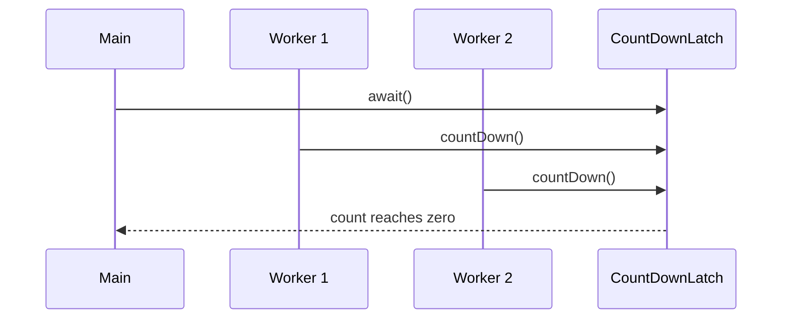

## Example

```java
import java.util.concurrent.CountDownLatch;

public class CountDownLatchExample {
    public static void main(String[] args) throws InterruptedException {
        int workers = 3;
        CountDownLatch latch = new CountDownLatch(workers);

        for (int i = 1; i <= workers; i++) {
            int workerId = i;

            new Thread(() -> {
                System.out.println("Worker " + workerId + " started");

                try {
                    Thread.sleep(1000);
                } catch (InterruptedException e) {
                    Thread.currentThread().interrupt();
                }

                System.out.println("Worker " + workerId + " finished");
                latch.countDown();
            }).start();
        }

        latch.await();

        System.out.println("All workers finished");
    }
}
```

---

# 25. CyclicBarrier

`CyclicBarrier` allows multiple threads to wait for each other at a common point.

It can be reused.

## Use Cases

- Parallel computation phases
- Batch processing
- Multi-player game start
- Simulations

## Diagram

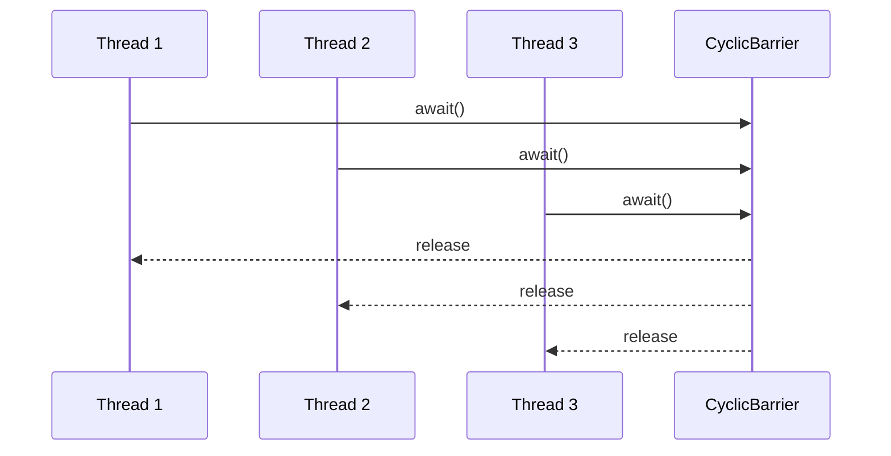

## Example

```java
import java.util.concurrent.CyclicBarrier;

public class CyclicBarrierExample {
    public static void main(String[] args) {
        int parties = 3;

        CyclicBarrier barrier = new CyclicBarrier(parties, () -> {
            System.out.println("All threads reached barrier. Continue together.");
        });

        for (int i = 1; i <= parties; i++) {
            int workerId = i;

            new Thread(() -> {
                try {
                    System.out.println("Worker " + workerId + " doing phase 1");
                    Thread.sleep(1000 * workerId);

                    System.out.println("Worker " + workerId + " waiting at barrier");
                    barrier.await();

                    System.out.println("Worker " + workerId + " doing phase 2");
                } catch (Exception e) {
                    e.printStackTrace();
                }
            }).start();
        }
    }
}
```

## CountDownLatch vs CyclicBarrier

| Feature | CountDownLatch | CyclicBarrier |
|---|---|---|
| Reusable | No | Yes |
| Main purpose | Wait until count reaches zero | Threads wait for each other |
| Count decreases by | `countDown()` | `await()` |
| Barrier action | No | Yes |
| Common use | Wait for workers | Multi-phase processing |

---

# 26. Phaser

`Phaser` is a flexible synchronization barrier.

It supports:

- dynamic registration
- multiple phases
- arrival and waiting
- deregistration

## Use Cases

- Multi-step batch processing
- Dynamic number of tasks
- Reusable phased workflows

## Diagram

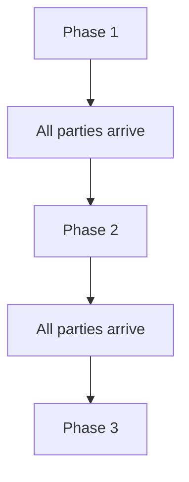

## Example

```java
import java.util.concurrent.Phaser;

public class PhaserExample {
    public static void main(String[] args) {
        Phaser phaser = new Phaser(1); // main thread registered

        for (int i = 1; i <= 3; i++) {
            phaser.register();
            int workerId = i;

            new Thread(() -> {
                System.out.println("Worker " + workerId + " phase 1");
                phaser.arriveAndAwaitAdvance();

                System.out.println("Worker " + workerId + " phase 2");
                phaser.arriveAndAwaitAdvance();

                System.out.println("Worker " + workerId + " done");
                phaser.arriveAndDeregister();
            }).start();
        }

        phaser.arriveAndAwaitAdvance();
        System.out.println("Main: phase 1 completed");

        phaser.arriveAndAwaitAdvance();
        System.out.println("Main: phase 2 completed");

        phaser.arriveAndDeregister();
    }
}
```

## CountDownLatch vs CyclicBarrier vs Phaser

| Tool | Best For |
|---|---|
| CountDownLatch | One-time waiting |
| CyclicBarrier | Fixed number of threads meeting repeatedly |
| Phaser | Dynamic parties and multiple phases |

---

# 27. Semaphore

`Semaphore` limits access to a resource.

## Use Cases

- Limit database connections
- Limit API calls
- Limit file downloads
- Limit concurrent users

## Diagram

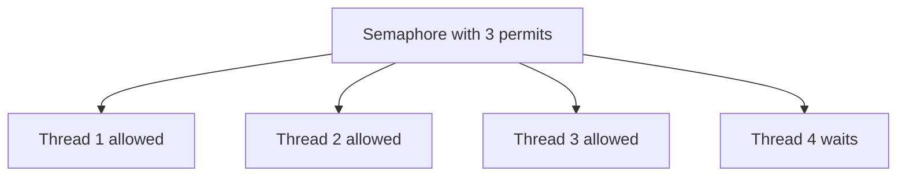

## Example

```java
import java.util.concurrent.Semaphore;

public class SemaphoreExample {
    public static void main(String[] args) {
        Semaphore semaphore = new Semaphore(2);

        Runnable task = () -> {
            try {
                semaphore.acquire();

                System.out.println(Thread.currentThread().getName() + " acquired permit");
                Thread.sleep(2000);

            } catch (InterruptedException e) {
                Thread.currentThread().interrupt();
            } finally {
                System.out.println(Thread.currentThread().getName() + " released permit");
                semaphore.release();
            }
        };

        for (int i = 1; i <= 5; i++) {
            new Thread(task, "Thread-" + i).start();
        }
    }
}
```

---

# 28. Exchanger

`Exchanger` allows two threads to exchange data.

## Use Cases

- Two-stage pipeline
- Buffer swap
- Producer and consumer pair

## Diagram

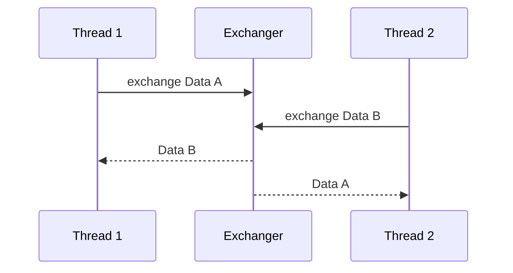

## Example

```java
import java.util.concurrent.Exchanger;

public class ExchangerExample {
    public static void main(String[] args) {
        Exchanger<String> exchanger = new Exchanger<>();

        new Thread(() -> {
            try {
                String received = exchanger.exchange("Data from Thread A");
                System.out.println("Thread A received: " + received);
            } catch (InterruptedException e) {
                Thread.currentThread().interrupt();
            }
        }).start();

        new Thread(() -> {
            try {
                String received = exchanger.exchange("Data from Thread B");
                System.out.println("Thread B received: " + received);
            } catch (InterruptedException e) {
                Thread.currentThread().interrupt();
            }
        }).start();
    }
}
```

---

# 29. ForkJoinPool

ForkJoinPool is used for parallel divide-and-conquer tasks.

## Use Cases

- Recursive computation
- Parallel array processing
- CPU-bound tasks

## Diagram

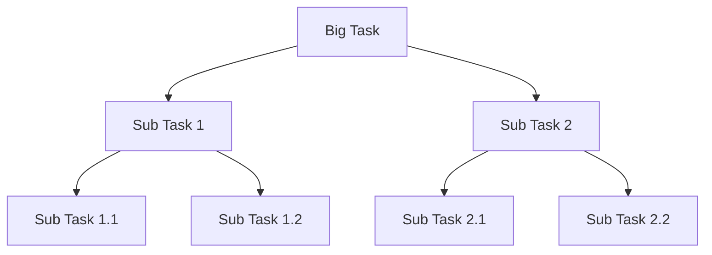

## RecursiveTask Example

```java
import java.util.concurrent.RecursiveTask;
import java.util.concurrent.ForkJoinPool;

class SumTask extends RecursiveTask<Long> {
    private int[] numbers;
    private int start;
    private int end;

    private static final int THRESHOLD = 5;

    public SumTask(int[] numbers, int start, int end) {
        this.numbers = numbers;
        this.start = start;
        this.end = end;
    }

    protected Long compute() {
        if (end - start <= THRESHOLD) {
            long sum = 0;

            for (int i = start; i < end; i++) {
                sum += numbers[i];
            }

            return sum;
        }

        int middle = (start + end) / 2;

        SumTask left = new SumTask(numbers, start, middle);
        SumTask right = new SumTask(numbers, middle, end);

        left.fork();
        long rightResult = right.compute();
        long leftResult = left.join();

        return leftResult + rightResult;
    }
}

public class ForkJoinExample {
    public static void main(String[] args) {
        int[] numbers = {1,2,3,4,5,6,7,8,9,10};

        ForkJoinPool pool = new ForkJoinPool();

        long result = pool.invoke(new SumTask(numbers, 0, numbers.length));

        System.out.println(result);
    }
}
```

---

# 30. ThreadLocal

`ThreadLocal` stores data separately for each thread.

## Use Cases

- User context
- Request ID
- Date formatter before Java 8
- Transaction context

## Diagram

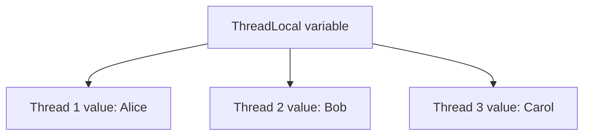

## Example

```java
public class ThreadLocalExample {
    private static final ThreadLocal<String> userContext = new ThreadLocal<>();

    public static void main(String[] args) {
        Runnable task = () -> {
            userContext.set(Thread.currentThread().getName());

            System.out.println("User context: " + userContext.get());

            userContext.remove();
        };

        new Thread(task, "Alice").start();
        new Thread(task, "Bob").start();
    }
}
```

## Important

Always call `remove()` in thread pools to avoid memory leaks.

```java
try {
    threadLocal.set(value);
} finally {
    threadLocal.remove();
}
```

---

# 31. Concurrent Collections

Java provides thread-safe collections.

## Common Collections

| Collection | Use Case |
|---|---|
| ConcurrentHashMap | Thread-safe map |
| CopyOnWriteArrayList | Read-heavy list |
| BlockingQueue | Producer-consumer |
| ConcurrentLinkedQueue | Non-blocking queue |
| ConcurrentSkipListMap | Sorted concurrent map |
| ConcurrentSkipListSet | Sorted concurrent set |

## ConcurrentHashMap Example

```java
import java.util.concurrent.ConcurrentHashMap;

public class ConcurrentHashMapExample {
    public static void main(String[] args) {
        ConcurrentHashMap<String, Integer> map = new ConcurrentHashMap<>();

        map.put("A", 1);
        map.put("B", 2);

        map.compute("A", (key, value) -> value == null ? 1 : value + 1);

        System.out.println(map);
    }
}
```

## CopyOnWriteArrayList Example

```java
import java.util.concurrent.CopyOnWriteArrayList;

public class CopyOnWriteExample {
    public static void main(String[] args) {
        CopyOnWriteArrayList<String> list = new CopyOnWriteArrayList<>();

        list.add("A");
        list.add("B");

        for (String item : list) {
            list.add("C");
            System.out.println(item);
        }

        System.out.println(list);
    }
}
```

Use `CopyOnWriteArrayList` only when reads are much more frequent than writes.

---

# 32. Deadlock, Livelock, Starvation

## Deadlock

Deadlock happens when threads wait forever for each other.

## Deadlock Diagram

```mermaid
sequenceDiagram
    participant T1 as Thread 1
    participant T2 as Thread 2
    participant L1 as Lock 1
    participant L2 as Lock 2

    T1->>L1: acquire
    T2->>L2: acquire
    T1->>L2: wait
    T2->>L1: wait
```

## Deadlock Code

```java
public class DeadlockExample {
    public static void main(String[] args) {
        Object lock1 = new Object();
        Object lock2 = new Object();

        Thread t1 = new Thread(() -> {
            synchronized (lock1) {
                System.out.println("Thread 1 locked lock1");

                try {
                    Thread.sleep(100);
                } catch (InterruptedException e) {
                    Thread.currentThread().interrupt();
                }

                synchronized (lock2) {
                    System.out.println("Thread 1 locked lock2");
                }
            }
        });

        Thread t2 = new Thread(() -> {
            synchronized (lock2) {
                System.out.println("Thread 2 locked lock2");

                try {
                    Thread.sleep(100);
                } catch (InterruptedException e) {
                    Thread.currentThread().interrupt();
                }

                synchronized (lock1) {
                    System.out.println("Thread 2 locked lock1");
                }
            }
        });

        t1.start();
        t2.start();
    }
}
```

## How to Avoid Deadlock

- Always acquire locks in same order
- Use `tryLock`
- Avoid nested locks
- Keep synchronized blocks small
- Use timeout-based locking

## Fixed Lock Ordering

```java
synchronized (lock1) {
    synchronized (lock2) {
        // safe if all threads use same order
    }
}
```

---

## Livelock

Threads are active but cannot make progress.

Example: two people repeatedly moving aside in the same direction.

## Starvation

A thread waits forever because other threads keep getting priority.

Causes:

- unfair locks
- high-priority threads
- poor scheduling
- resource monopolization

---

# 33. Interrupting Threads

Interrupt is a polite request to stop.

## Example

```java
public class InterruptExample {
    public static void main(String[] args) throws InterruptedException {
        Thread worker = new Thread(() -> {
            while (!Thread.currentThread().isInterrupted()) {
                System.out.println("Working");

                try {
                    Thread.sleep(500);
                } catch (InterruptedException e) {
                    Thread.currentThread().interrupt();
                }
            }

            System.out.println("Stopped");
        });

        worker.start();

        Thread.sleep(2000);

        worker.interrupt();
    }
}
```

## Best Practice

When catching `InterruptedException`, restore interrupt status:

```java
catch (InterruptedException e) {
    Thread.currentThread().interrupt();
}
```

---

# 34. Daemon Threads

Daemon threads run in background and do not prevent JVM shutdown.

## Example

```java
public class DaemonThreadExample {
    public static void main(String[] args) throws InterruptedException {
        Thread daemon = new Thread(() -> {
            while (true) {
                System.out.println("Background task running");

                try {
                    Thread.sleep(500);
                } catch (InterruptedException e) {
                    Thread.currentThread().interrupt();
                    break;
                }
            }
        });

        daemon.setDaemon(true);
        daemon.start();

        Thread.sleep(1500);

        System.out.println("Main finished");
    }
}
```

When main thread exits, daemon thread stops automatically.

---

# 35. Java Memory Model Basics

The Java Memory Model defines how threads interact through memory.

## Key Ideas

- Threads may cache variables locally
- Without synchronization, changes may not be visible
- `synchronized`, `volatile`, and atomic classes create visibility guarantees

## Visibility Diagram

```mermaid
flowchart LR
    A[Thread 1 Local Cache] --> B[Main Memory]
    B --> C[Thread 2 Local Cache]
```

## Happens-Before

Happens-before means one action is visible to another.

Examples:

| Rule | Meaning |
|---|---|
| Unlock happens-before later lock | synchronized visibility |
| Volatile write happens-before volatile read | latest value visible |
| Thread start happens-before actions in started thread | start visibility |
| Thread actions happen-before successful join | join visibility |

---

# 36. Performance Best Practices

## Thread Pool Sizing

### CPU-Bound Tasks

```text
threads = number of CPU cores
```

### I/O-Bound Tasks

```text
threads = cores × (1 + wait time / compute time)
```

## Best Practices

```text
[ ] Use ExecutorService instead of manually creating many threads
[ ] Keep lock scope small
[ ] Avoid blocking inside synchronized blocks
[ ] Use BlockingQueue for producer-consumer
[ ] Use AtomicInteger/LongAdder for counters
[ ] Use ReadWriteLock for read-heavy data
[ ] Always shutdown executors
[ ] Always handle InterruptedException properly
[ ] Avoid unbounded queues in production
[ ] Monitor thread count and blocked threads
```

## Common Mistakes

| Mistake | Problem |
|---|---|
| Creating unlimited threads | Memory and context switching |
| Ignoring interrupts | Slow shutdown |
| Holding lock during I/O | Thread contention |
| Using volatile for count++ | Race condition |
| Forgetting ThreadLocal remove | Memory leak |
| Using parallel streams blindly | Common pool contention |
| Unbounded executor queue | OOM risk |

---

# 37. Troubleshooting Multithreading Issues

## Thread Dump

Use:

```bash
jstack <pid> > thread-dump.txt
```

or:

```bash
jcmd <pid> Thread.print > thread-dump.txt
```

## What to Look For

| Symptom | Thread Dump Signal |
|---|---|
| Deadlock | Deadlock section |
| Lock contention | Many BLOCKED threads |
| Thread pool exhausted | Many WAITING queued tasks |
| High CPU | RUNNABLE threads stuck in same method |
| Slow DB/API | Threads waiting in socket/read calls |

## High CPU Investigation

```mermaid
flowchart TD
    A[High CPU] --> B[top -H -p pid]
    B --> C[Find hot thread id]
    C --> D[Convert to hex]
    D --> E[Search nid in jstack]
    E --> F[Find hot method]
```

Commands:

```bash
top -H -p <pid>
printf "%x\n" <thread_id>
grep -i "nid=0xHEX" thread-dump.txt
```

---

# 38. Interview and Production Cheat Sheet

## Quick Selection Guide

```mermaid
flowchart TD
    A[Need concurrency tool] --> B{Need simple counter?}
    B -->|Yes| C[AtomicInteger or LongAdder]
    B -->|No| D{Need mutual exclusion?}
    D -->|Yes| E[synchronized or ReentrantLock]
    D -->|No| F{Need producer-consumer?}
    F -->|Yes| G[BlockingQueue]
    F -->|No| H{Need wait for tasks?}
    H -->|Yes| I[CountDownLatch]
    H -->|No| J{Need threads meet repeatedly?}
    J -->|Yes| K[CyclicBarrier or Phaser]
    J -->|No| L{Need limit access?}
    L -->|Yes| M[Semaphore]
    L -->|No| N{Need async pipeline?}
    N -->|Yes| O[CompletableFuture]
    N -->|No| P[ExecutorService]
```

## Tool Comparison

| Tool | Purpose |
|---|---|
| synchronized | Simple locking |
| volatile | Visibility |
| AtomicInteger | Atomic counter |
| LongAdder | High-contention counter |
| ReentrantLock | Advanced locking |
| ReadWriteLock | Many readers, few writers |
| StampedLock | Optimistic read |
| BlockingQueue | Producer-consumer |
| ExecutorService | Thread pool |
| Future | Async result |
| CompletableFuture | Async pipeline |
| CountDownLatch | Wait once |
| CyclicBarrier | Reusable barrier |
| Phaser | Flexible multi-phase barrier |
| Semaphore | Limit concurrent access |
| ThreadLocal | Per-thread value |
| ForkJoinPool | Divide-and-conquer |

---

# Final Learning Path

```mermaid
flowchart TD
    A[Thread and Runnable] --> B[Race Condition]
    B --> C[synchronized]
    C --> D[volatile]
    D --> E[Atomic Classes]
    E --> F[Locks]
    F --> G[BlockingQueue]
    G --> H[ExecutorService]
    H --> I[Future and CompletableFuture]
    I --> J[Latch Barrier Phaser Semaphore]
    J --> K[Concurrent Collections]
    K --> L[Deadlock Troubleshooting]
    L --> M[Production Best Practices]
```

## Practice Plan

1. Create two threads.
2. Create a race condition.
3. Fix it with synchronized.
4. Fix it with AtomicInteger.
5. Build producer-consumer with BlockingQueue.
6. Replace manual threads with ExecutorService.
7. Use Callable and Future.
8. Build async pipeline with CompletableFuture.
9. Use CountDownLatch to wait for workers.
10. Use CyclicBarrier for phase synchronization.
11. Use Semaphore to limit concurrent access.
12. Create and detect deadlock with jstack.

---

# Final Advice

Multithreading is powerful but dangerous when shared state is not controlled.

Remember:

```text
Prefer immutability.
Prefer thread pools over raw threads.
Prefer concurrent utilities over wait/notify.
Prefer simple designs over clever locking.
Measure before optimizing.
Always test under real concurrency.
```
