# 🐳 Docker Mastery Guide — Newbie to Production Pro

> A chapter-wise, hands-on Docker guide with Mermaid diagrams for visual learning.
>
> Goal: Learn Docker deeply enough to build, debug, secure, and deploy production-ready applications.

---

# Table of Contents

1. [Docker Fundamentals](#chapter-1--docker-fundamentals-production-level)
2. [Installation and First Containers](#chapter-2--installation-and-first-containers)
3. [Docker Images Deep Dive](#chapter-3--docker-images-deep-dive)
4. [Dockerfiles and Production Builds](#chapter-4--dockerfiles-and-production-builds)
5. [Volumes and Data Management](#chapter-5--volumes-and-data-management)
6. [Docker Networking](#chapter-6--docker-networking)
7. [Docker Compose](#chapter-7--docker-compose)
8. [Dockerizing a Spring Boot Application](#chapter-8--dockerizing-a-spring-boot-application)
9. [Spring Boot + PostgreSQL with Docker Compose](#chapter-9--spring-boot--postgresql-with-docker-compose)
10. [Debugging and Troubleshooting](#chapter-10--debugging-and-troubleshooting)
11. [Image Optimization](#chapter-11--image-optimization)
12. [Docker Security](#chapter-12--docker-security)
13. [Docker Registries](#chapter-13--docker-registries)
14. [CI/CD with Docker](#chapter-14--cicd-with-docker)
15. [Production Deployment with Docker Compose](#chapter-15--production-deployment-with-docker-compose)
16. [Observability and Health Checks](#chapter-16--observability-and-health-checks)
17. [Performance and Resource Limits](#chapter-17--performance-and-resource-limits)
18. [Production Patterns](#chapter-18--production-patterns)
19. [Docker to Kubernetes Bridge](#chapter-19--docker-to-kubernetes-bridge)
20. [Final Production Project](#chapter-20--final-production-project)

---

# Chapter 1 — Docker Fundamentals Production Level

## 1.1 What is Docker?

Docker is a containerization platform that packages an application with its runtime, libraries, environment variables, and configuration into a portable unit called a container.

The biggest problem Docker solves is environment inconsistency.

Without Docker:

```text
Developer machine works
QA machine fails
Production behaves differently
```

With Docker:

```text
Same image runs in dev, test, staging, and production
```

## 1.2 Container Mental Model

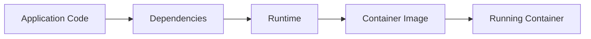

## 1.3 Containers vs Virtual Machines

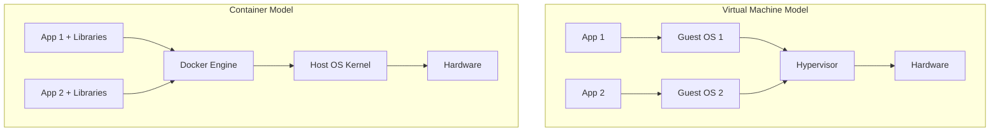

| Feature | Containers | Virtual Machines |
|---|---|---|
| OS | Share host kernel | Each VM has its own OS |
| Startup | Seconds | Minutes |
| Size | MBs to hundreds of MBs | GBs |
| Isolation | Process-level | Full OS-level |
| Performance | Near native | More overhead |

## 1.4 Core Docker Objects

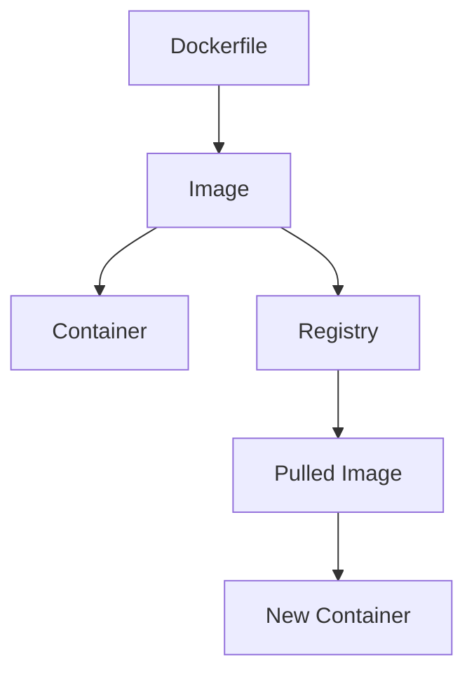

### Image

An image is a read-only blueprint.

Example:

```bash
docker pull nginx:1.27
```

### Container

A container is a running instance of an image.

```bash
docker run nginx:1.27
```

### Registry

A registry stores images.

Examples:

```text
Docker Hub
GitHub Container Registry
Amazon ECR
Google Artifact Registry
Azure Container Registry
```

## 1.5 Docker Architecture

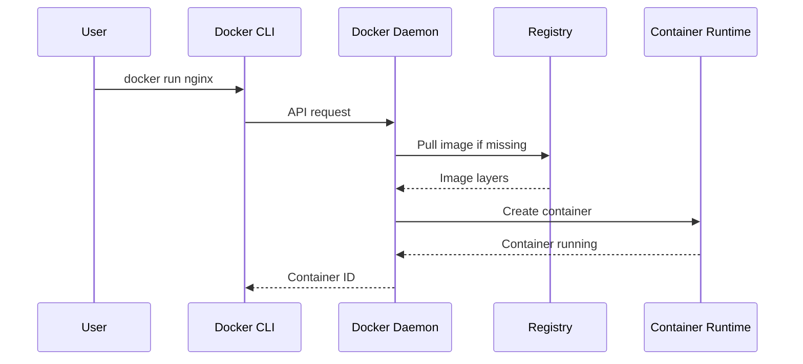

## 1.6 Under the Hood

Docker uses Linux kernel features:

| Feature | Purpose |
|---|---|
| Namespaces | Isolate process, network, users, mounts |
| Cgroups | Limit CPU, memory, and IO |
| OverlayFS | Layered filesystem |
| Capabilities | Fine-grained privileges |

## 1.7 Production Mindset

Production Docker is not just about running containers. It requires:

- Small images
- Secure images
- Non-root users
- Explicit versions
- Health checks
- Logs to stdout/stderr
- Resource limits
- Automated builds
- Vulnerability scanning

## 1.8 Common Mistakes

Bad:

```bash
docker run nginx
```

Better:

```bash
docker run nginx:1.27
```

Why? Because `latest` is unstable and may change unexpectedly.

## 1.9 Mini Exercise

Run:

```bash
docker run -d --name web -p 8080:80 nginx:1.27
docker ps
curl http://localhost:8080
docker stop web
docker rm web
```

---

# Chapter 2 — Installation and First Containers

## 2.1 Install Docker

Install Docker Desktop on:

- Windows
- macOS

Install Docker Engine on Linux servers.

Verify:

```bash
docker version
docker info
```

## 2.2 First Container

```bash
docker run hello-world
```

What happens:

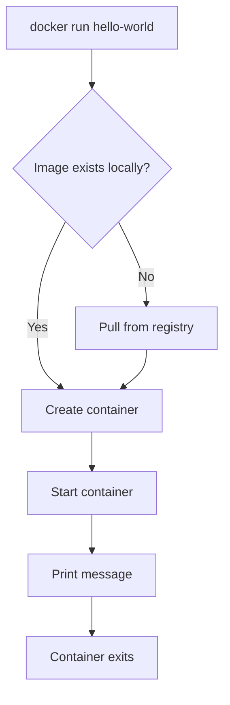

## 2.3 Run Nginx

```bash
docker run -d --name nginx-demo -p 8080:80 nginx:1.27
```

Open:

```text
http://localhost:8080
```

## 2.4 Important CLI Commands

```bash
docker ps
docker ps -a
docker stop nginx-demo
docker start nginx-demo
docker restart nginx-demo
docker rm nginx-demo
docker logs nginx-demo
docker inspect nginx-demo
```

## 2.5 Foreground vs Detached Mode

Foreground:

```bash
docker run nginx:1.27
```

Detached:

```bash
docker run -d nginx:1.27
```

## 2.6 Port Mapping

```bash
docker run -p 8080:80 nginx:1.27
```

Meaning:

```text
Host port 8080 → Container port 80
```


## 2.7 Container Lifecycle

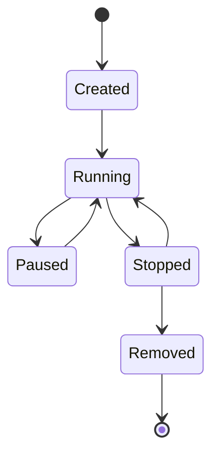

## 2.8 Exercise

Run two Nginx containers:

```bash
docker run -d --name web1 -p 8081:80 nginx:1.27
docker run -d --name web2 -p 8082:80 nginx:1.27
```

Visit both:

```text
http://localhost:8081
http://localhost:8082
```

---

# Chapter 3 — Docker Images Deep Dive

## 3.1 What is an Image?

An image is a stack of filesystem layers plus metadata.

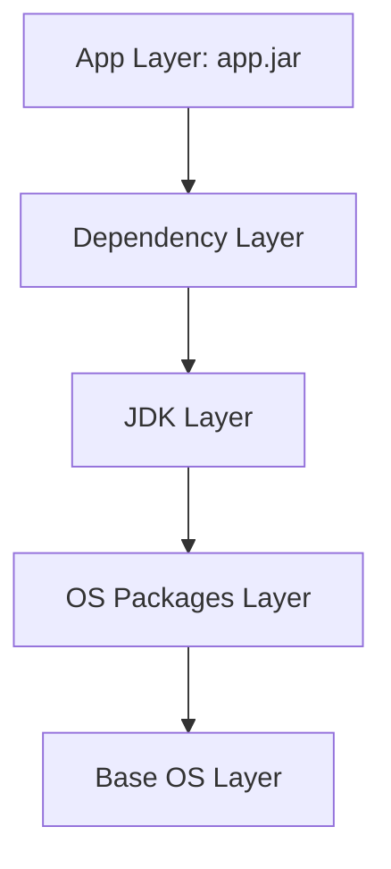

## 3.2 Image Tags

```bash
docker pull postgres:16
docker pull postgres:16.3
docker pull postgres:latest
```

Production rule:

```text
Avoid latest in production.
Use explicit versions.
```

## 3.3 Inspect Images

```bash
docker images
docker image inspect nginx:1.27
docker history nginx:1.27
```

## 3.4 Image Layers and Cache

Docker reuses cached layers if the instruction and context do not change.

Bad Dockerfile:

```dockerfile
COPY . .
RUN mvn package
```

Better Dockerfile:

```dockerfile
COPY pom.xml .
RUN mvn dependency:go-offline
COPY src ./src
RUN mvn package
```

Why? Dependencies change less frequently than source code.

## 3.5 Image Naming

Format:

```text
registry/namespace/repository:tag
```

Example:

```text
ghcr.io/my-org/order-service:1.0.0
```

## 3.6 Production Tagging Strategy

Good tags:

```text
1.0.0
1.0.0-20260501
git-sha-abc123
```

Bad tags:

```text
latest
final
new
test
```

## 3.7 Exercise

```bash
docker pull alpine:3.20
docker history alpine:3.20
docker image inspect alpine:3.20
```

---

# Chapter 4 — Dockerfiles and Production Builds

## 4.1 What is a Dockerfile?

A Dockerfile is a recipe for building an image.

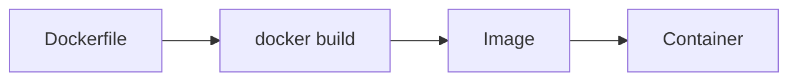

## 4.2 Basic Dockerfile for Spring Boot

```dockerfile
FROM eclipse-temurin:21-jre
WORKDIR /app
COPY target/order-service.jar app.jar
ENTRYPOINT ["java", "-jar", "app.jar"]
```

Build:

```bash
docker build -t order-service:1.0.0 .
```

Run:

```bash
docker run -p 8080:8080 order-service:1.0.0
```

## 4.3 Production Multi-Stage Dockerfile

```dockerfile
# Build stage
FROM maven:3.9.9-eclipse-temurin-21 AS build
WORKDIR /workspace

COPY pom.xml .
RUN mvn dependency:go-offline

COPY src ./src
RUN mvn clean package -DskipTests

# Runtime stage
FROM eclipse-temurin:21-jre
WORKDIR /app

RUN groupadd -r spring && useradd -r -g spring spring
USER spring

COPY --from=build /workspace/target/*.jar app.jar

EXPOSE 8080

ENTRYPOINT ["java", "-jar", "app.jar"]
```

## 4.4 Why Multi-Stage Builds Matter

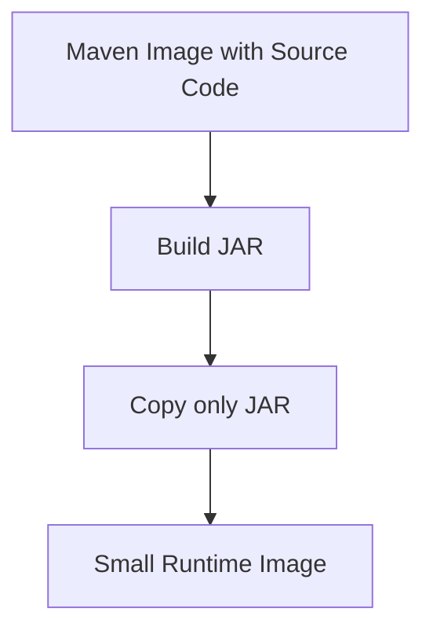

Benefits:

- Smaller final image
- No build tools in production
- Smaller attack surface
- Faster deployment

## 4.5 Dockerfile Instructions

| Instruction | Purpose |
|---|---|
| FROM | Base image |
| WORKDIR | Set working directory |
| COPY | Copy files |
| RUN | Execute command during build |
| ENV | Set environment variable |
| EXPOSE | Document container port |
| USER | Run as specific user |
| ENTRYPOINT | Main command |

## 4.6 `.dockerignore`

Create `.dockerignore`:

```text
target/
.git/
.idea/
*.log
.env
```

Why? Prevent unnecessary or sensitive files from being copied into the image context.

## 4.7 ENTRYPOINT vs CMD

```dockerfile
ENTRYPOINT ["java", "-jar", "app.jar"]
CMD ["--spring.profiles.active=prod"]
```

Runtime override:

```bash
docker run order-service:1.0.0 --spring.profiles.active=dev
```

## 4.8 Exercise

Create:

```text
order-service/
  Dockerfile
  .dockerignore
  pom.xml
  src/
```

Build and run it.

---

# Chapter 5 — Volumes and Data Management

## 5.1 Why Volumes Matter

Containers are ephemeral. If a container is deleted, its writable layer is deleted too.

Bad idea:

```text
Store database data only inside container writable layer.
```

Good idea:

```text
Use Docker volumes for persistent data.
```

## 5.2 Writable Layer vs Volume

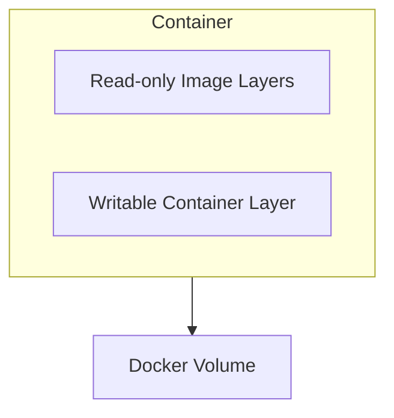

## 5.3 Volume Types

| Type | Example | Use Case |
|---|---|---|
| Named volume | `pgdata:/var/lib/postgresql/data` | Databases |
| Bind mount | `./src:/app/src` | Local development |
| tmpfs | In-memory storage | Temporary sensitive data |

## 5.4 Named Volume Example

```bash
docker volume create pgdata
docker run -d \
  --name postgres \
  -e POSTGRES_PASSWORD=secret \
  -v pgdata:/var/lib/postgresql/data \
  postgres:16
```

## 5.5 Bind Mount Example

```bash
docker run -v "$(pwd)":/app node:22
```

## 5.6 Backup a Volume

```bash
docker run --rm \
  -v pgdata:/data \
  -v "$(pwd)":/backup \
  alpine:3.20 \
  tar czf /backup/pgdata-backup.tar.gz /data
```

## 5.7 Restore a Volume

```bash
docker run --rm \
  -v pgdata:/data \
  -v "$(pwd)":/backup \
  alpine:3.20 \
  tar xzf /backup/pgdata-backup.tar.gz -C /
```

## 5.8 Production Rule

Use managed databases in serious production unless you know exactly how to handle:

- Backups
- Replication
- Disaster recovery
- Storage encryption
- Monitoring
- Failover

## 5.9 Exercise

Run PostgreSQL with a named volume, delete the container, recreate it, and verify data persists.

---

# Chapter 6 — Docker Networking

## 6.1 Why Networking Matters

Containers need to communicate with:

- Host machine
- Other containers
- External internet
- Databases
- Message brokers

## 6.2 Default Bridge Network

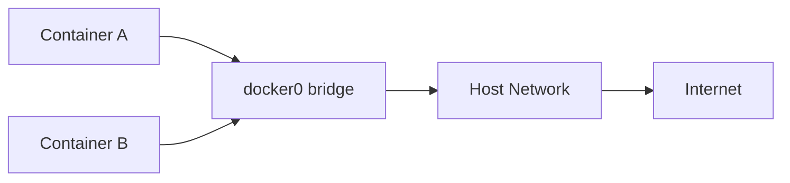

## 6.3 List Networks

```bash
docker network ls
```

## 6.4 Create Custom Network

```bash
docker network create app-net
```

Run PostgreSQL:

```bash
docker run -d \
  --name postgres \
  --network app-net \
  -e POSTGRES_PASSWORD=secret \
  postgres:16
```

Run app:

```bash
docker run -d \
  --name app \
  --network app-net \
  -e SPRING_DATASOURCE_URL=jdbc:postgresql://postgres:5432/postgres \
  order-service:1.0.0
```

## 6.5 Container DNS

Inside a custom network, containers can resolve each other by name.

```text
postgres → resolves to PostgreSQL container IP
```

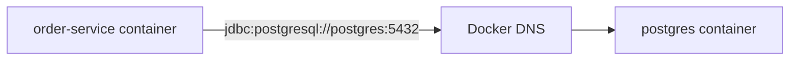

## 6.6 Port Publishing

```bash
-p 8080:8080
```

Means:

```text
host:8080 → container:8080
```

## 6.7 Network Modes

| Mode | Use Case |
|---|---|
| bridge | Default local container networking |
| host | Linux-only, high performance, less isolation |
| none | No network |
| overlay | Multi-host networking, swarm/Kubernetes-style |

## 6.8 Common Networking Mistake

Wrong:

```text
Inside container: localhost means the container itself.
```

Correct:

```text
Use service/container name on Docker network.
```

## 6.9 Exercise

Create two containers on a custom network and ping one from the other.

```bash
docker network create lab-net
docker run -dit --name box1 --network lab-net alpine:3.20 sh
docker run -dit --name box2 --network lab-net alpine:3.20 sh
docker exec box1 ping box2
```

---

# Chapter 7 — Docker Compose

## 7.1 What is Docker Compose?

Docker Compose manages multi-container applications using a YAML file.

Instead of running many `docker run` commands, you define services.

## 7.2 Compose Architecture

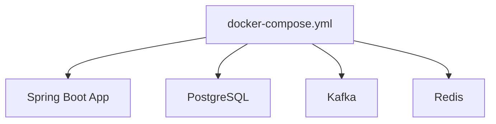

## 7.3 Basic Compose File

```yaml
services:
  app:
    image: nginx:1.27
    ports:
      - "8080:80"
```

Run:

```bash
docker compose up -d
```

Stop:

```bash
docker compose down
```

## 7.4 Compose with PostgreSQL

```yaml
services:
  postgres:
    image: postgres:16
    container_name: postgres
    environment:
      POSTGRES_DB: orders
      POSTGRES_USER: orders_user
      POSTGRES_PASSWORD: orders_password
    ports:
      - "5432:5432"
    volumes:
      - pgdata:/var/lib/postgresql/data

volumes:
  pgdata:
```

## 7.5 Compose Networks

Compose automatically creates a network. Services can reach each other by service name.

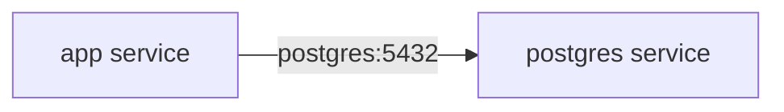

## 7.6 depends_on

```yaml
depends_on:
  - postgres
```

Important:

```text
depends_on controls start order, not application readiness.
```

For real readiness, use health checks.

## 7.7 Health Check Example

```yaml
services:
  postgres:
    image: postgres:16
    environment:
      POSTGRES_PASSWORD: secret
    healthcheck:
      test: ["CMD-SHELL", "pg_isready -U postgres"]
      interval: 10s
      timeout: 5s
      retries: 5
```

## 7.8 Production Compose Structure

```text
docker-compose.yml
docker-compose.override.yml
docker-compose.prod.yml
.env
```

## 7.9 Exercise

Create a Compose file with:

- app
- postgres
- named volume
- health check

---

# Chapter 8 — Dockerizing a Spring Boot Application

## 8.1 Project Goal

Build and containerize a Spring Boot REST API.

Project:

```text
order-service
```

Endpoint:

```text
GET /health-check
POST /orders
```

## 8.2 Spring Boot Controller

```java
@RestController
@RequestMapping("/orders")
public class OrderController {

    @PostMapping
    public ResponseEntity<String> createOrder() {
        return ResponseEntity.ok("order-created");
    }

    @GetMapping("/health-check")
    public ResponseEntity<String> health() {
        return ResponseEntity.ok("ok");
    }
}
```

## 8.3 Build JAR

```bash
mvn clean package
```

## 8.4 Dockerfile

```dockerfile
FROM eclipse-temurin:21-jre
WORKDIR /app

RUN groupadd -r app && useradd -r -g app app
USER app

COPY target/*.jar app.jar

EXPOSE 8080

ENTRYPOINT ["java", "-jar", "app.jar"]
```

## 8.5 Build Image

```bash
docker build -t order-service:1.0.0 .
```

## 8.6 Run Container

```bash
docker run -d \
  --name order-service \
  -p 8080:8080 \
  order-service:1.0.0
```

## 8.7 Runtime Configuration

Do not bake environment config into the image.

Use environment variables:

```bash
docker run -e SPRING_PROFILES_ACTIVE=prod order-service:1.0.0
```

## 8.8 Spring Boot Config Example

```yaml
server:
  port: ${SERVER_PORT:8080}

spring:
  application:
    name: order-service
```

## 8.9 Production Container Flow

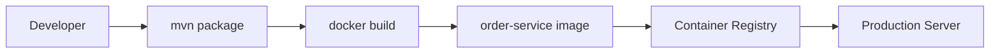

## 8.10 Exercise

Add:

- `/orders`
- Dockerfile
- `.dockerignore`
- non-root user
- environment variable support

---

# Chapter 9 — Spring Boot + PostgreSQL with Docker Compose

## 9.1 Architecture

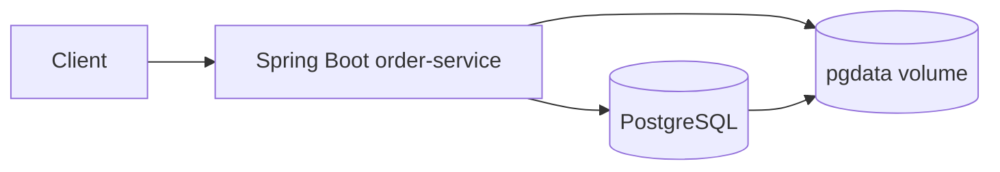

## 9.2 Compose File

```yaml
services:
  order-service:
    build:
      context: .
      dockerfile: Dockerfile
    image: order-service:1.0.0
    ports:
      - "8080:8080"
    environment:
      SPRING_DATASOURCE_URL: jdbc:postgresql://postgres:5432/orders
      SPRING_DATASOURCE_USERNAME: orders_user
      SPRING_DATASOURCE_PASSWORD: orders_password
    depends_on:
      postgres:
        condition: service_healthy

  postgres:
    image: postgres:16
    environment:
      POSTGRES_DB: orders
      POSTGRES_USER: orders_user
      POSTGRES_PASSWORD: orders_password
    ports:
      - "5432:5432"
    volumes:
      - pgdata:/var/lib/postgresql/data
    healthcheck:
      test: ["CMD-SHELL", "pg_isready -U orders_user -d orders"]
      interval: 10s
      timeout: 5s
      retries: 5

volumes:
  pgdata:
```

## 9.3 Application YAML

```yaml
spring:
  datasource:
    url: ${SPRING_DATASOURCE_URL:jdbc:postgresql://localhost:5432/orders}
    username: ${SPRING_DATASOURCE_USERNAME:orders_user}
    password: ${SPRING_DATASOURCE_PASSWORD:orders_password}
  jpa:
    hibernate:
      ddl-auto: validate
```

## 9.4 Why Use Environment Variables?

Because the same image should run in:

```text
dev
test
staging
production
```

Only configuration changes.

## 9.5 Common Mistake

Wrong inside Docker:

```yaml
SPRING_DATASOURCE_URL: jdbc:postgresql://localhost:5432/orders
```

Correct:

```yaml
SPRING_DATASOURCE_URL: jdbc:postgresql://postgres:5432/orders
```

Because `localhost` inside the app container refers to the app container itself.

## 9.6 Exercise

Create:

- `Order` entity
- `OrderRepository`
- `POST /orders`
- Save order to PostgreSQL
- Run everything with Compose

---

# Chapter 10 — Debugging and Troubleshooting

## 10.1 Production Debugging Mindset

When something fails, ask:

```text
Is the container running?
Is the app healthy?
Are logs clean?
Is networking correct?
Are environment variables correct?
Is storage mounted?
```

## 10.2 Debug Flow

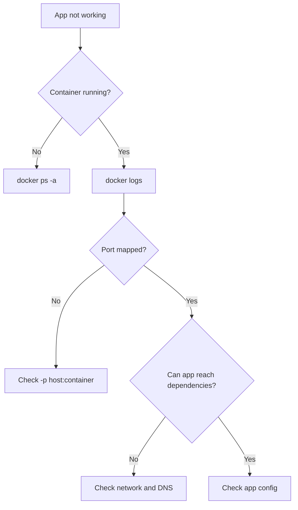

## 10.3 Useful Commands

```bash
docker ps
docker ps -a
docker logs <container>
docker logs -f <container>
docker exec -it <container> sh
docker inspect <container>
docker stats
docker top <container>
```

## 10.4 Inspect Environment Variables

```bash
docker exec <container> env
```

## 10.5 Inspect Network

```bash
docker network ls
docker network inspect <network-name>
```

## 10.6 Test Connectivity

```bash
docker exec -it app sh
wget -qO- http://postgres:5432
```

For PostgreSQL, use:

```bash
docker exec -it postgres psql -U orders_user -d orders
```

## 10.7 Common Errors

### Port already allocated

```text
Bind for 0.0.0.0:8080 failed: port is already allocated
```

Fix:

```bash
docker ps
docker stop <container>
```

### Cannot connect to database

Possible causes:

- Wrong hostname
- Database not ready
- Wrong password
- Missing network
- Firewall issue

### Permission denied

Usually caused by:

- Non-root user cannot write to path
- Volume owned by different UID/GID

## 10.8 Exercise

Intentionally break:

- database hostname
- port mapping
- environment variable

Then debug and fix.

---

# Chapter 11 — Image Optimization

## 11.1 Why Optimize Images?

Large images cause:

- Slow builds
- Slow deployments
- More vulnerabilities
- More storage cost

## 11.2 Optimization Flow

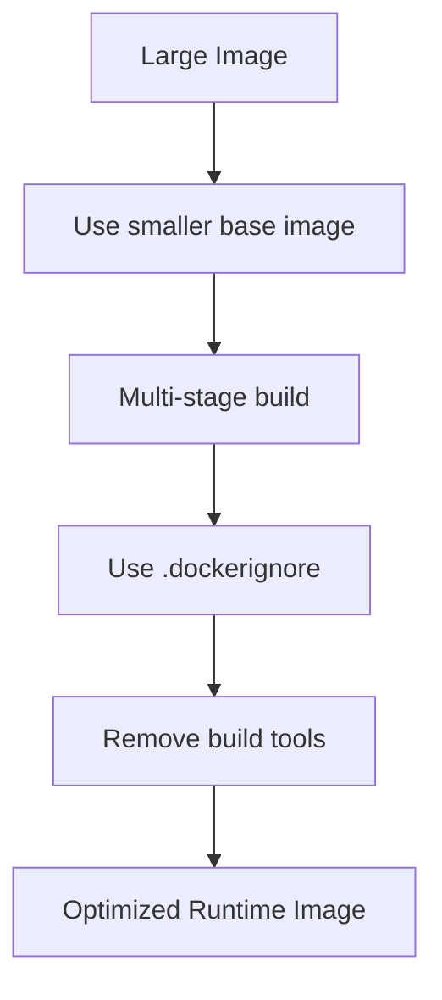

## 11.3 Bad Dockerfile

```dockerfile
FROM maven:3.9.9-eclipse-temurin-21
WORKDIR /app
COPY . .
RUN mvn package
CMD ["java", "-jar", "target/app.jar"]
```

Problem:

```text
Final image contains Maven, source code, test files, and build cache.
```

## 11.4 Better Dockerfile

```dockerfile
FROM maven:3.9.9-eclipse-temurin-21 AS build
WORKDIR /workspace
COPY pom.xml .
RUN mvn dependency:go-offline
COPY src ./src
RUN mvn clean package -DskipTests

FROM eclipse-temurin:21-jre
WORKDIR /app
COPY --from=build /workspace/target/*.jar app.jar
ENTRYPOINT ["java", "-jar", "app.jar"]
```

## 11.5 Best Practices

- Use multi-stage builds
- Use `.dockerignore`
- Avoid unnecessary packages
- Use explicit base image versions
- Prefer slim runtime images
- Keep one process per container
- Do not store secrets in layers

## 11.6 Check Image Size

```bash
docker images
docker history order-service:1.0.0
```

## 11.7 Exercise

Build a bad image and optimized image. Compare sizes.

---

# Chapter 12 — Docker Security

## 12.1 Production Security Principles

Docker security is about reducing blast radius.

If a container is compromised, it should not compromise the host.

## 12.2 Security Layers

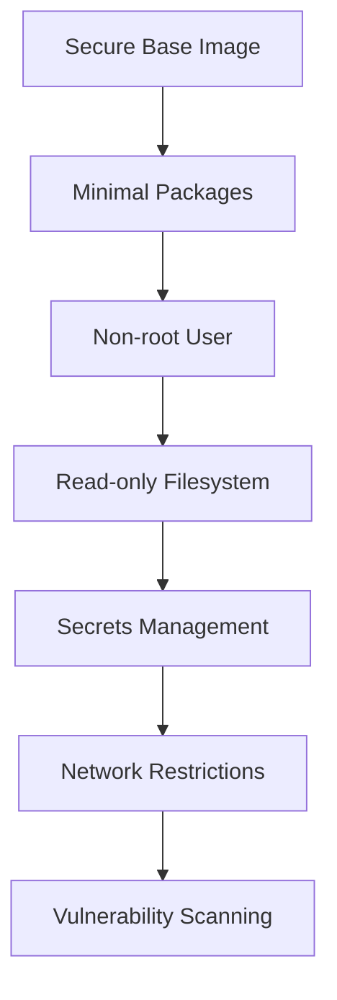

## 12.3 Run as Non-Root

Bad:

```dockerfile
FROM eclipse-temurin:21-jre
COPY app.jar app.jar
ENTRYPOINT ["java", "-jar", "app.jar"]
```

Better:

```dockerfile
FROM eclipse-temurin:21-jre
WORKDIR /app
RUN groupadd -r app && useradd -r -g app app
COPY app.jar app.jar
USER app
ENTRYPOINT ["java", "-jar", "app.jar"]
```

## 12.4 Avoid Privileged Containers

Bad:

```bash
docker run --privileged app
```

Avoid unless absolutely necessary.

## 12.5 Read-Only Filesystem

```bash
docker run --read-only order-service:1.0.0
```

If the app needs temp files:

```bash
docker run --read-only --tmpfs /tmp order-service:1.0.0
```

## 12.6 Secrets

Bad:

```dockerfile
ENV DB_PASSWORD=my-secret-password
```

Better:

```bash
docker run -e DB_PASSWORD_FILE=/run/secrets/db_password
```

In Compose:

```yaml
secrets:
  db_password:
    file: ./secrets/db_password.txt
```

## 12.7 Scan Images

Common tools:

```text
docker scout
trivy
grype
snyk
```

Example:

```bash
docker scout quickview order-service:1.0.0
```

## 12.8 Security Checklist

- Non-root user
- No secrets in image
- Minimal base image
- Explicit image tags
- Scan vulnerabilities
- Drop unnecessary capabilities
- Use read-only filesystem where possible
- Limit network exposure

## 12.9 Exercise

Harden your Spring Boot image:

- Non-root user
- No hardcoded secrets
- `.dockerignore`
- Scan image

---

# Chapter 13 — Docker Registries

## 13.1 What is a Registry?

A registry stores and distributes Docker images.

```mermaid
sequenceDiagram
    participant Dev
    participant Registry
    participant Server

    Dev->>Registry: docker push image:tag
    Server->>Registry: docker pull image:tag
    Server->>Server: docker run image:tag
```

## 13.2 Login

```bash
docker login
```

## 13.3 Tag Image

```bash
docker tag order-service:1.0.0 username/order-service:1.0.0
```

## 13.4 Push Image

```bash
docker push username/order-service:1.0.0
```

## 13.5 Pull Image

```bash
docker pull username/order-service:1.0.0
```

## 13.6 Production Registry Options

| Registry | Common Use |
|---|---|
| Docker Hub | Public/private general use |
| GitHub Container Registry | GitHub projects |
| AWS ECR | AWS deployments |
| GCP Artifact Registry | GCP deployments |
| Azure Container Registry | Azure deployments |

## 13.7 Tagging Strategy

Recommended:

```text
order-service:1.2.0
order-service:1.2.0-20260501
order-service:sha-abc123
```

Avoid:

```text
order-service:latest
order-service:final
```

## 13.8 Exercise

Push your image to a registry.

---

# Chapter 14 — CI/CD with Docker

## 14.1 CI/CD Goal

Every code change should automatically:

```text
build → test → build image → scan image → push image → deploy
```

## 14.2 Pipeline Diagram

```mermaid
flowchart LR
    Dev[Git Push] --> CI[CI Pipeline]
    CI --> Test[Run Tests]
    Test --> Build[Build Docker Image]
    Build --> Scan[Security Scan]
    Scan --> Push[Push to Registry]
    Push --> Deploy[Deploy to Server]
```

## 14.3 GitHub Actions Example

```yaml
name: Build Docker Image

on:
  push:
    branches: [ "main" ]

jobs:
  docker:
    runs-on: ubuntu-latest

    steps:
      - uses: actions/checkout@v4

      - name: Set up Java
        uses: actions/setup-java@v4
        with:
          java-version: '21'
          distribution: 'temurin'

      - name: Build JAR
        run: mvn clean package -DskipTests

      - name: Build Docker image
        run: docker build -t order-service:${{ github.sha }} .

      - name: Login to Docker Hub
        run: echo "${{ secrets.DOCKER_PASSWORD }}" | docker login -u "${{ secrets.DOCKER_USERNAME }}" --password-stdin

      - name: Tag image
        run: docker tag order-service:${{ github.sha }} ${{ secrets.DOCKER_USERNAME }}/order-service:${{ github.sha }}

      - name: Push image
        run: docker push ${{ secrets.DOCKER_USERNAME }}/order-service:${{ github.sha }}
```

## 14.4 Production CI/CD Rules

- Never push untested images
- Never deploy `latest`
- Tag images with Git SHA
- Scan before deployment
- Keep secrets in CI secret store
- Store build artifacts
- Use promotion: dev → staging → prod

## 14.5 Exercise

Create GitHub Actions pipeline for your Spring Boot Docker image.

---

# Chapter 15 — Production Deployment with Docker Compose

## 15.1 Production Architecture

```mermaid
flowchart LR
    User --> Nginx[Nginx Reverse Proxy]
    Nginx --> App1[order-service instance 1]
    Nginx --> App2[order-service instance 2]
    App1 --> DB[(PostgreSQL)]
    App2 --> DB
```

## 15.2 Compose Production File

```yaml
services:
  nginx:
    image: nginx:1.27
    ports:
      - "80:80"
    volumes:
      - ./nginx.conf:/etc/nginx/nginx.conf:ro
    depends_on:
      - order-service

  order-service:
    image: username/order-service:1.0.0
    environment:
      SPRING_PROFILES_ACTIVE: prod
      SPRING_DATASOURCE_URL: jdbc:postgresql://postgres:5432/orders
      SPRING_DATASOURCE_USERNAME: orders_user
      SPRING_DATASOURCE_PASSWORD: ${DB_PASSWORD}
    deploy:
      replicas: 2

  postgres:
    image: postgres:16
    environment:
      POSTGRES_DB: orders
      POSTGRES_USER: orders_user
      POSTGRES_PASSWORD: ${DB_PASSWORD}
    volumes:
      - pgdata:/var/lib/postgresql/data

volumes:
  pgdata:
```

Note:

```text
The deploy.replicas field is mainly Swarm-oriented. For plain Compose, scale with:
docker compose up -d --scale order-service=2
```

## 15.3 Nginx Config

```nginx
events {}

http {
    upstream order_service {
        server order-service:8080;
    }

    server {
        listen 80;

        location / {
            proxy_pass http://order_service;
            proxy_set_header Host $host;
            proxy_set_header X-Real-IP $remote_addr;
        }
    }
}
```

## 15.4 Zero-Downtime Deployment Concept

```mermaid
sequenceDiagram
    participant User
    participant Proxy
    participant Old as Old App
    participant New as New App

    User->>Proxy: Request
    Proxy->>Old: Route traffic
    New->>New: Start new version
    New-->>Proxy: Healthy
    Proxy->>New: Route new traffic
    Old->>Old: Stop old version
```

## 15.5 Production Warning

Docker Compose is useful for small deployments, internal tools, demos, and simple servers. For large-scale production, use an orchestrator like Kubernetes, Nomad, ECS, or Docker Swarm.

## 15.6 Exercise

Deploy:

- Nginx
- Spring Boot app
- PostgreSQL
- Environment file
- Health checks

---

# Chapter 16 — Observability and Health Checks

## 16.1 Observability Pillars

```mermaid
flowchart TD
    Observability --> Logs
    Observability --> Metrics
    Observability --> Traces
    Observability --> HealthChecks[Health Checks]
```

## 16.2 Logs

Containers should write logs to stdout/stderr.

View logs:

```bash
docker logs order-service
docker logs -f order-service
```

Bad:

```text
Only logging to file inside container.
```

Good:

```text
Log to stdout/stderr and collect externally.
```

## 16.3 Health Checks

Dockerfile:

```dockerfile
HEALTHCHECK --interval=30s --timeout=5s --retries=3 \
  CMD wget -qO- http://localhost:8080/actuator/health || exit 1
```

Compose:

```yaml
healthcheck:
  test: ["CMD", "wget", "-qO-", "http://localhost:8080/actuator/health"]
  interval: 30s
  timeout: 5s
  retries: 3
```

## 16.4 Spring Boot Actuator

Add dependency:

```xml
<dependency>
    <groupId>org.springframework.boot</groupId>
    <artifactId>spring-boot-starter-actuator</artifactId>
</dependency>
```

Config:

```yaml
management:
  endpoints:
    web:
      exposure:
        include: health,info,metrics,prometheus
```

## 16.5 Metrics Stack

```mermaid
flowchart LR
    App[Spring Boot App] --> Prometheus[Prometheus]
    Prometheus --> Grafana[Grafana Dashboard]
    App --> Logs[Log Collector]
```

## 16.6 What to Monitor

- Container restarts
- CPU usage
- Memory usage
- Disk usage
- App health
- HTTP latency
- Error rates
- Database connections
- JVM memory
- Thread count

## 16.7 Exercise

Add Actuator and Docker health check to your service.

---

# Chapter 17 — Performance and Resource Limits

## 17.1 Why Resource Limits Matter

Without limits, one container can consume too much CPU or memory and harm the host.

## 17.2 CPU Limit

```bash
docker run --cpus="1.5" order-service:1.0.0
```

## 17.3 Memory Limit

```bash
docker run --memory="512m" order-service:1.0.0
```

## 17.4 Compose Resource Example

```yaml
services:
  order-service:
    image: order-service:1.0.0
    mem_limit: 512m
    cpus: 1.0
```

## 17.5 JVM in Containers

Modern JVMs understand container limits, but you should still configure memory intentionally.

Example:

```bash
JAVA_TOOL_OPTIONS="-XX:MaxRAMPercentage=75"
```

## 17.6 Performance Diagram

```mermaid
flowchart TD
    Traffic[Incoming Traffic] --> App[Container]
    App --> CPU{CPU Limit}
    App --> Memory{Memory Limit}
    CPU --> Host[Host Resources]
    Memory --> Host
```

## 17.7 Useful Commands

```bash
docker stats
docker top <container>
```

## 17.8 Production Guidelines

- Set memory limits
- Set CPU limits
- Tune JVM heap
- Monitor GC
- Avoid unlimited containers
- Load test before production

## 17.9 Exercise

Run your app with memory limit and observe behavior.

---

# Chapter 18 — Production Patterns

## 18.1 One Process Per Container

Good:

```text
One container = one main process
```

Bad:

```text
App + database + cron + nginx in one container
```

## 18.2 Sidecar Pattern

```mermaid
flowchart LR
    App[Main App Container] --> Sidecar[Sidecar Container]
    Sidecar --> Logs[Log/Proxy/Agent]
```

Common sidecars:

- log shipper
- proxy
- metrics exporter
- security agent

## 18.3 Blue-Green Deployment

```mermaid
flowchart LR
    User --> Router
    Router --> Blue[Blue Version]
    Router -. switch .-> Green[Green Version]
```

Flow:

```text
Run blue
Deploy green
Test green
Switch traffic to green
Keep blue as rollback
```

## 18.4 Canary Deployment

```mermaid
pie title Traffic Split
    "Old Version" : 90
    "New Version" : 10
```

Canary means slowly shifting traffic to the new version.

## 18.5 Configuration Externalization

Image should be immutable.

Bad:

```text
Build separate image for dev, staging, prod.
```

Good:

```text
Same image, different environment variables.
```

## 18.6 Backup Pattern

For stateful services:

- Scheduled backups
- Restore testing
- Offsite storage
- Encryption
- Retention policy

## 18.7 Exercise

Design blue-green deployment for your app using two Compose project names:

```bash
docker compose -p app-blue up -d
docker compose -p app-green up -d
```

---

# Chapter 19 — Docker to Kubernetes Bridge

## 19.1 Why Docker Alone Is Not Enough

Docker runs containers. Kubernetes orchestrates containers.

Kubernetes adds:

- Scheduling
- Self-healing
- Auto-scaling
- Rolling deployments
- Service discovery
- Secrets/config management

## 19.2 Mapping Concepts

| Docker | Kubernetes |
|---|---|
| Container | Container |
| Docker Compose service | Deployment |
| Compose network | Service networking |
| Volume | PersistentVolume |
| Environment variables | ConfigMap / Secret |
| Health check | Readiness / Liveness probe |

## 19.3 Docker Compose vs Kubernetes

```mermaid
flowchart LR
    Compose[Docker Compose] --> SingleHost[Mostly Single Host]
    Kubernetes[Kubernetes] --> Cluster[Multi-node Cluster]
    Kubernetes --> SelfHealing[Self Healing]
    Kubernetes --> Scaling[Auto Scaling]
```

## 19.4 Kubernetes Object Flow

```mermaid
flowchart TD
    Deployment --> ReplicaSet
    ReplicaSet --> Pod
    Pod --> Container
    Service --> Pod
    Ingress --> Service
```

## 19.5 What to Learn Next

After Docker:

- Kubernetes pods
- Deployments
- Services
- ConfigMaps
- Secrets
- Ingress
- Helm
- Observability
- GitOps

## 19.6 Exercise

Convert this Docker Compose app into Kubernetes manifests.

---

# Chapter 20 — Final Production Project

## 20.1 Project Goal

Build a production-style Dockerized system:

```text
Client → Nginx → Spring Boot Order Service → PostgreSQL
```

Optional extensions:

```text
Kafka
Redis
Prometheus
Grafana
```

## 20.2 Final Architecture

```mermaid
flowchart LR
    Client --> Nginx[Nginx Reverse Proxy]
    Nginx --> Order[Order Service]
    Order --> Postgres[(PostgreSQL)]
    Order --> Kafka[(Kafka Optional)]
    Prometheus --> Order
    Grafana --> Prometheus
```

## 20.3 Repository Structure

```text
docker-production-project/
  order-service/
    Dockerfile
    .dockerignore
    pom.xml
    src/
  deploy/
    docker-compose.yml
    docker-compose.prod.yml
    nginx.conf
    .env.example
  docs/
    runbook.md
    troubleshooting.md
```

## 20.4 Production Dockerfile

```dockerfile
FROM maven:3.9.9-eclipse-temurin-21 AS build
WORKDIR /workspace
COPY pom.xml .
RUN mvn dependency:go-offline
COPY src ./src
RUN mvn clean package -DskipTests

FROM eclipse-temurin:21-jre
WORKDIR /app

RUN groupadd -r app && useradd -r -g app app

COPY --from=build /workspace/target/*.jar app.jar

USER app

EXPOSE 8080

HEALTHCHECK --interval=30s --timeout=5s --retries=3 \
  CMD wget -qO- http://localhost:8080/actuator/health || exit 1

ENTRYPOINT ["java", "-jar", "app.jar"]
```

## 20.5 Production Compose

```yaml
services:
  nginx:
    image: nginx:1.27
    ports:
      - "80:80"
    volumes:
      - ./nginx.conf:/etc/nginx/nginx.conf:ro
    depends_on:
      order-service:
        condition: service_healthy

  order-service:
    image: your-registry/order-service:1.0.0
    environment:
      SPRING_PROFILES_ACTIVE: prod
      SPRING_DATASOURCE_URL: jdbc:postgresql://postgres:5432/orders
      SPRING_DATASOURCE_USERNAME: orders_user
      SPRING_DATASOURCE_PASSWORD: ${DB_PASSWORD}
      JAVA_TOOL_OPTIONS: -XX:MaxRAMPercentage=75
    mem_limit: 512m
    cpus: 1.0
    depends_on:
      postgres:
        condition: service_healthy
    healthcheck:
      test: ["CMD", "wget", "-qO-", "http://localhost:8080/actuator/health"]
      interval: 30s
      timeout: 5s
      retries: 3

  postgres:
    image: postgres:16
    environment:
      POSTGRES_DB: orders
      POSTGRES_USER: orders_user
      POSTGRES_PASSWORD: ${DB_PASSWORD}
    volumes:
      - pgdata:/var/lib/postgresql/data
    healthcheck:
      test: ["CMD-SHELL", "pg_isready -U orders_user -d orders"]
      interval: 10s
      timeout: 5s
      retries: 5

volumes:
  pgdata:
```

## 20.6 Runbook

Start:

```bash
docker compose up -d
```

Check status:

```bash
docker compose ps
```

Logs:

```bash
docker compose logs -f order-service
```

Restart app:

```bash
docker compose restart order-service
```

Backup database:

```bash
docker run --rm \
  -v deploy_pgdata:/data \
  -v "$(pwd)":/backup \
  alpine:3.20 \
  tar czf /backup/pgdata-backup.tar.gz /data
```

## 20.7 Final Production Checklist

### Image

- Explicit base image tag
- Multi-stage build
- Small runtime image
- Non-root user
- `.dockerignore`
- No secrets in image
- Vulnerability scanned

### Container

- Health check
- Resource limits
- Logs to stdout/stderr
- Environment-based config
- No privileged mode
- Minimal exposed ports

### Deployment

- Reverse proxy
- TLS termination
- Backups
- Monitoring
- Alerting
- Rollback strategy
- CI/CD pipeline

### Database

- Persistent volume
- Backup strategy
- Restore tested
- Credentials externalized

## 20.8 Final Exercises

1. Build Spring Boot image.
2. Run app + PostgreSQL with Compose.
3. Add Nginx reverse proxy.
4. Add health checks.
5. Add memory limits.
6. Push image to registry.
7. Build GitHub Actions pipeline.
8. Deploy to a Linux VM.
9. Simulate database failure.
10. Restore from backup.

---

# Appendix A — Essential Docker Commands

```bash
docker version
docker info

docker pull nginx:1.27
docker images
docker image inspect nginx:1.27
docker history nginx:1.27

docker run -d --name web -p 8080:80 nginx:1.27
docker ps
docker ps -a
docker logs web
docker exec -it web sh
docker stop web
docker rm web

docker build -t app:1.0.0 .
docker tag app:1.0.0 username/app:1.0.0
docker push username/app:1.0.0

docker volume ls
docker volume inspect pgdata

docker network ls
docker network inspect app-net

docker compose up -d
docker compose down
docker compose logs -f
docker compose ps
```

---

# Appendix B — Docker Production Anti-Patterns

Avoid:

- Using `latest` in production
- Running containers as root
- Storing secrets in Dockerfile
- Baking environment config into image
- No health checks
- No resource limits
- No logs/metrics
- No backup strategy
- Huge images
- Installing unnecessary packages
- Running database in production without backup/restore plan

---

# Appendix C — Learning Path After This Guide

Next topics:

1. Kubernetes
2. Helm
3. GitHub Actions advanced pipelines
4. Terraform
5. Observability with Prometheus and Grafana
6. Security scanning with Trivy
7. GitOps with Argo CD
8. Cloud registries: ECR, ACR, Artifact Registry

---

# End of Guide
