# JMeter + Spring Boot Load Testing Guide  
## Step-by-step path from 100 RPS to 100K RPS

> Goal: Learn how to test a Spring Boot API using Apache JMeter, analyze bottlenecks, and scale safely from **100 requests/second** to **100,000 requests/second**.

---

## Table of Contents

1. [What You Are Testing](#1-what-you-are-testing)
2. [High-Level Architecture](#2-high-level-architecture)
3. [Load Testing Concepts](#3-load-testing-concepts)
4. [Spring Boot Sample API](#4-spring-boot-sample-api)
5. [Spring Boot Production Readiness Settings](#5-spring-boot-production-readiness-settings)
6. [Install JMeter](#6-install-jmeter)
7. [Create First JMeter Test Plan](#7-create-first-jmeter-test-plan)
8. [JMeter GUI Screenshot Guide](#8-jmeter-gui-screenshot-guide)
9. [Run First 100 RPS Test](#9-run-first-100-rps-test)
10. [Run JMeter in CLI Mode](#10-run-jmeter-in-cli-mode)
11. [Understand JMeter Results](#11-understand-jmeter-results)
12. [Spring Boot Monitoring During Test](#12-spring-boot-monitoring-during-test)
13. [Scaling Test Stages: 100 RPS to 100K RPS](#13-scaling-test-stages-100-rps-to-100k-rps)
14. [Distributed JMeter Setup](#14-distributed-jmeter-setup)
15. [Kubernetes-Based Load Testing](#15-kubernetes-based-load-testing)
16. [Spring Boot Scaling Strategy](#16-spring-boot-scaling-strategy)
17. [Database Scaling Strategy](#17-database-scaling-strategy)
18. [Cache Scaling Strategy](#18-cache-scaling-strategy)
19. [Message Queue Strategy](#19-message-queue-strategy)
20. [Common Bottlenecks and Fixes](#20-common-bottlenecks-and-fixes)
21. [Troubleshooting Playbooks](#21-troubleshooting-playbooks)
22. [Final Checklist](#22-final-checklist)

---

# 1. What You Are Testing

Example business case:

```text
Loan Application API
POST /api/loans/apply
GET  /api/loans/{id}
GET  /api/loans/customer/{customerId}
POST /api/loans/{id}/approve
```

You are testing:

- API latency
- Throughput
- Error rate
- JVM memory
- Garbage collection
- CPU usage
- Database performance
- Connection pool saturation
- Horizontal scalability

---

# 2. High-Level Architecture

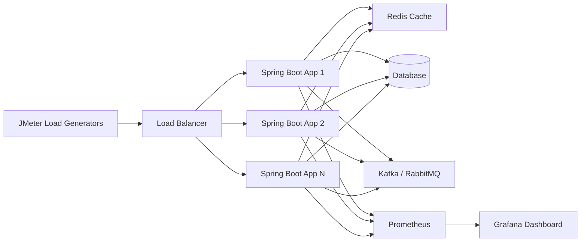

---

# 3. Load Testing Concepts

## RPS vs Users

| Term | Meaning |
|---|---|
| RPS | Requests per second |
| Concurrent users | Users active at same time |
| Ramp-up | Time to gradually increase load |
| Think time | Delay between user actions |
| P95 latency | 95% of requests are faster than this |
| P99 latency | 99% of requests are faster than this |
| Error rate | Failed requests percentage |

## Important Formula

```text
Concurrent Users = RPS × Average Response Time in seconds
```

Example:

```text
100 RPS with 200 ms latency
Concurrent users = 100 × 0.2 = 20 users
```

```text
10,000 RPS with 100 ms latency
Concurrent users = 10,000 × 0.1 = 1,000 users
```

---

# 4. Spring Boot Sample API

## Maven Dependencies

```xml
<dependencies>
    <dependency>
        <groupId>org.springframework.boot</groupId>
        <artifactId>spring-boot-starter-web</artifactId>
    </dependency>

    <dependency>
        <groupId>org.springframework.boot</groupId>
        <artifactId>spring-boot-starter-actuator</artifactId>
    </dependency>

    <dependency>
        <groupId>io.micrometer</groupId>
        <artifactId>micrometer-registry-prometheus</artifactId>
    </dependency>
</dependencies>
```

## Loan Request DTO

```java
public class LoanRequest {
    private String customerId;
    private double amount;
    private int tenureMonths;
    private String loanType;

    public String getCustomerId() {
        return customerId;
    }

    public void setCustomerId(String customerId) {
        this.customerId = customerId;
    }

    public double getAmount() {
        return amount;
    }

    public void setAmount(double amount) {
        this.amount = amount;
    }

    public int getTenureMonths() {
        return tenureMonths;
    }

    public void setTenureMonths(int tenureMonths) {
        this.tenureMonths = tenureMonths;
    }

    public String getLoanType() {
        return loanType;
    }

    public void setLoanType(String loanType) {
        this.loanType = loanType;
    }
}
```

## Loan Response DTO

```java
public class LoanResponse {
    private String loanId;
    private String status;
    private String message;

    public LoanResponse(String loanId, String status, String message) {
        this.loanId = loanId;
        this.status = status;
        this.message = message;
    }

    public String getLoanId() {
        return loanId;
    }

    public String getStatus() {
        return status;
    }

    public String getMessage() {
        return message;
    }
}
```

## Controller

```java
import org.springframework.web.bind.annotation.*;
import java.util.UUID;

@RestController
@RequestMapping("/api/loans")
public class LoanController {

    @PostMapping("/apply")
    public LoanResponse applyLoan(@RequestBody LoanRequest request) {
        String loanId = UUID.randomUUID().toString();

        return new LoanResponse(
            loanId,
            "RECEIVED",
            "Loan application received for customer " + request.getCustomerId()
        );
    }

    @GetMapping("/{loanId}")
    public LoanResponse getLoan(@PathVariable String loanId) {
        return new LoanResponse(
            loanId,
            "APPROVED",
            "Loan details fetched successfully"
        );
    }
}
```

## application.properties

```properties
server.port=8080

management.endpoints.web.exposure.include=health,info,metrics,prometheus
management.endpoint.health.show-details=always

server.tomcat.threads.max=200
server.tomcat.threads.min-spare=20
server.tomcat.accept-count=100

logging.level.root=INFO
```

---

# 5. Spring Boot Production Readiness Settings

## Basic JVM Options

For a 2 GB container:

```bash
-Xms1200m
-Xmx1200m
-Xss512k
-XX:+UseG1GC
-XX:MaxGCPauseMillis=200
-XX:+HeapDumpOnOutOfMemoryError
-XX:HeapDumpPath=/var/log/app
```

## Tomcat Settings

```properties
server.tomcat.threads.max=300
server.tomcat.threads.min-spare=50
server.tomcat.accept-count=500
server.tomcat.max-connections=10000
```

## HikariCP Settings

```properties
spring.datasource.hikari.maximum-pool-size=30
spring.datasource.hikari.minimum-idle=10
spring.datasource.hikari.connection-timeout=30000
spring.datasource.hikari.idle-timeout=600000
spring.datasource.hikari.max-lifetime=1800000
```

> Do not blindly increase DB pool size. The database must be able to handle the total connections from all application instances.

---

# 6. Install JMeter

## Download

Download Apache JMeter and unzip it.

Folder structure:

```text
apache-jmeter/
  bin/
    jmeter
    jmeter.bat
  lib/
  extras/
```

## Start JMeter GUI

Linux/macOS:

```bash
cd apache-jmeter/bin
./jmeter
```

Windows:

```bat
cd apache-jmeter\bin
jmeter.bat
```

---

# 7. Create First JMeter Test Plan

## Test Plan Structure

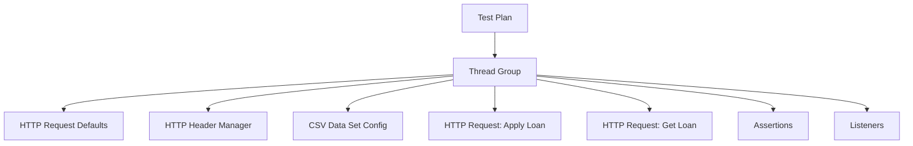

## Step 1: Add Thread Group

Right-click:

```text
Test Plan
  Add
    Threads Users
      Thread Group
```

Initial values:

```text
Number of Threads: 20
Ramp-up Period: 60 seconds
Loop Count: Forever or fixed count
```

## Step 2: Add HTTP Request Defaults

Right-click Thread Group:

```text
Add
  Config Element
    HTTP Request Defaults
```

Set:

```text
Protocol: http
Server Name: localhost
Port Number: 8080
```

## Step 3: Add HTTP Header Manager

Right-click Thread Group:

```text
Add
  Config Element
    HTTP Header Manager
```

Add:

```text
Content-Type: application/json
Accept: application/json
```

## Step 4: Add HTTP Request for Loan Apply

Right-click Thread Group:

```text
Add
  Sampler
    HTTP Request
```

Set:

```text
Name: POST Apply Loan
Method: POST
Path: /api/loans/apply
```

Body Data:

```json
{
  "customerId": "CUST-${__Random(1000,9999)}",
  "amount": ${__Random(10000,500000)},
  "tenureMonths": ${__Random(12,84)},
  "loanType": "HOME"
}
```

## Step 5: Add Response Assertion

Right-click HTTP Request:

```text
Add
  Assertions
    Response Assertion
```

Check:

```text
Response Code = 200
Response Body contains RECEIVED
```

## Step 6: Add Listener

For local debugging only:

```text
Add
  Listener
    View Results Tree
```

For summary:

```text
Add
  Listener
    Summary Report
```

> Do not use heavy GUI listeners during real high-load tests.

---

# 8. JMeter GUI Screenshot Guide

Use this section as a screenshot checklist. Capture these screens from your machine and paste them into this guide if needed.

## Screenshot 1: Thread Group

```text
Expected screen:
JMeter left panel:
Test Plan
  Thread Group

Right panel:
Number of Threads
Ramp-up Period
Loop Count
Scheduler
```

Markdown image placeholder:

```md

```

## Screenshot 2: HTTP Request Defaults

```text
Expected fields:
Protocol = http
Server Name = localhost or load balancer DNS
Port = 8080 or 80/443
```

Markdown image placeholder:

```md

```

## Screenshot 3: HTTP Request Body

```text
Expected fields:
Method = POST
Path = /api/loans/apply
Body Data = JSON request
```

Markdown image placeholder:

```md

```

## Screenshot 4: Summary Report

```text
Important columns:
Samples
Average
Min
Max
Std Dev
Error %
Throughput
Received KB/sec
Sent KB/sec
```

Markdown image placeholder:

```md

```

---

# 9. Run First 100 RPS Test

## Recommended Plugin

Use **Throughput Shaping Timer** or **Constant Throughput Timer**.

Simple setup:

```text
Target Throughput: 6000 samples per minute
```

Because:

```text
100 RPS × 60 = 6000 requests/minute
```

## 100 RPS Test Plan

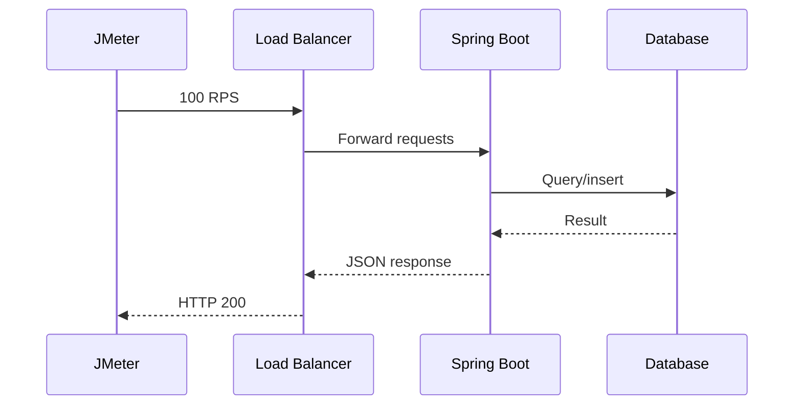

## Initial Test Settings

```text
Threads: 50
Ramp-up: 60 seconds
Target throughput: 100 RPS
Duration: 10 minutes
```

## Pass Criteria

```text
Error rate < 1%
P95 latency < 300 ms
CPU < 70%
Heap stable after GC
No Full GC
DB pool not exhausted
```

---

# 10. Run JMeter in CLI Mode

GUI is only for test creation and debugging.

## Save Test Plan

Save as:

```text
loan-api-test.jmx
```

## Run CLI Test

```bash
jmeter -n \
  -t loan-api-test.jmx \
  -l results-100rps.jtl \
  -e \
  -o report-100rps
```

## CLI Parameters

| Option | Meaning |
|---|---|
| `-n` | Non-GUI mode |
| `-t` | Test plan file |
| `-l` | Result JTL file |
| `-e` | Generate HTML report |
| `-o` | Output report directory |

## Generate Report Later

```bash
jmeter -g results-100rps.jtl -o report-100rps
```

---

# 11. Understand JMeter Results

## Important Metrics

| Metric | Good Target |
|---|---|
| Error % | Less than 1% |
| Average latency | Useful but not enough |
| P90 | Should be stable |
| P95 | Main SLO candidate |
| P99 | Important for high-scale systems |
| Throughput | Must match target RPS |
| Connect time | Network/load balancer issue |
| Latency | Time to first byte |
| Elapsed time | Full request duration |

## Result Interpretation Flow

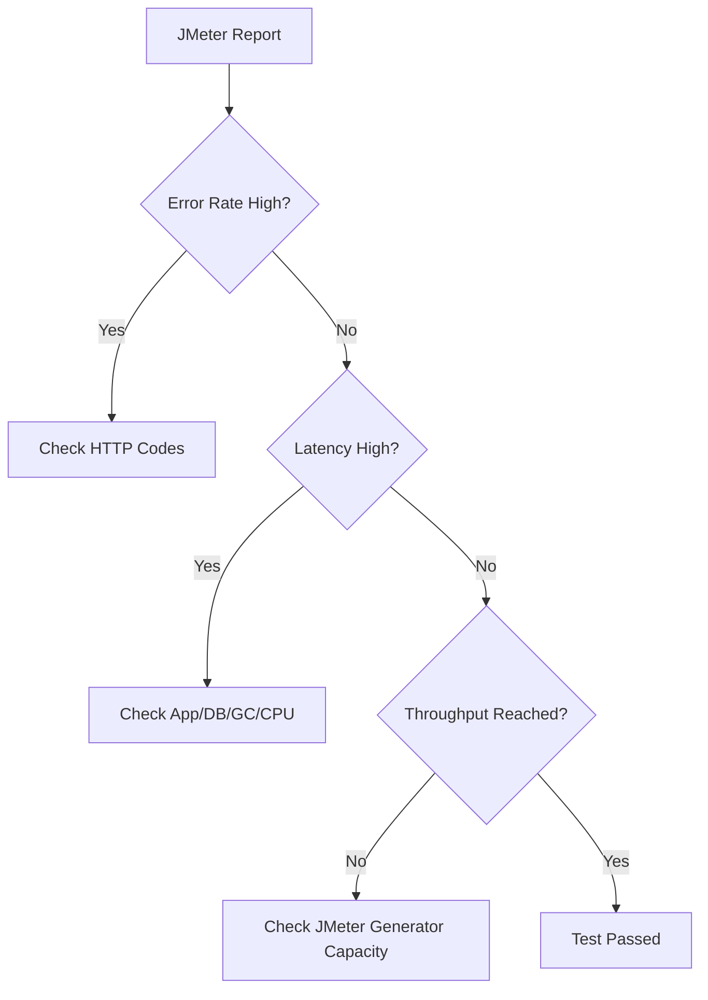

---

# 12. Spring Boot Monitoring During Test

## Actuator Endpoints

```text
/actuator/health
/actuator/metrics
/actuator/prometheus
```

## Useful Metrics

```text
jvm.memory.used
jvm.gc.pause
jvm.threads.live
jvm.threads.states
process.cpu.usage
system.cpu.usage
http.server.requests
hikaricp.connections.active
hikaricp.connections.pending
tomcat.threads.current
tomcat.threads.busy
```

## Monitoring Flow

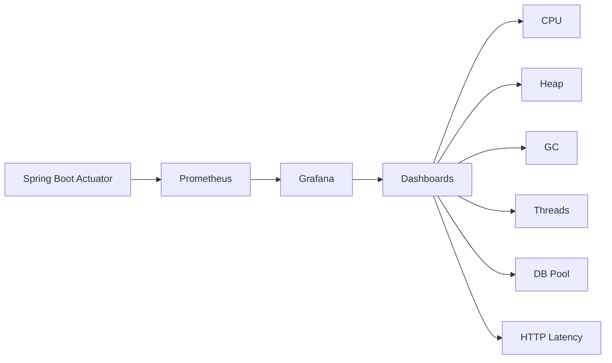

---

# 13. Scaling Test Stages: 100 RPS to 100K RPS

Do not jump from 100 to 100K directly. Scale gradually.

## Stage Plan

| Stage | Target RPS | Duration | Goal |
|---|---:|---:|---|
| Stage 1 | 100 | 10 min | Baseline |
| Stage 2 | 500 | 15 min | Check app threads |
| Stage 3 | 1,000 | 20 min | Check DB/cache |
| Stage 4 | 5,000 | 30 min | Check horizontal scale |
| Stage 5 | 10,000 | 45 min | Validate infra |
| Stage 6 | 25,000 | 60 min | Stress test |
| Stage 7 | 50,000 | 60 min | Capacity test |
| Stage 8 | 100,000 | 60+ min | Peak scale validation |

## Scaling Diagram

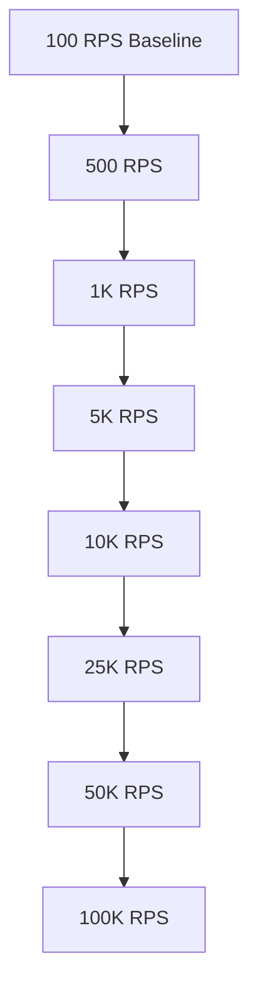

## Rule Before Moving to Next Stage

Move to the next stage only if:

```text
[ ] Error rate is acceptable
[ ] P95/P99 latency is acceptable
[ ] CPU has headroom
[ ] Heap is stable
[ ] No Full GC
[ ] DB pool is not saturated
[ ] Load generator is not saturated
[ ] Network bandwidth is sufficient
```

---

# 14. Distributed JMeter Setup

A single JMeter machine usually cannot generate 100K RPS.

Use distributed load generators.

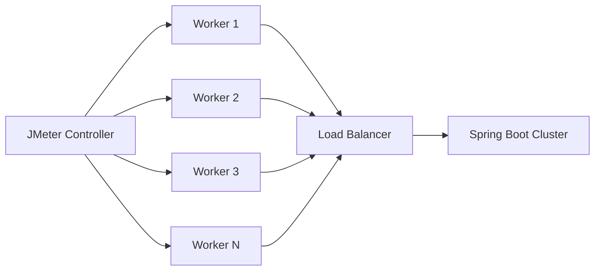

## Example Capacity Planning

Assume one JMeter worker can generate 5,000 RPS safely.

| Target RPS | Workers Needed |
|---:|---:|
| 10,000 | 2 workers |
| 25,000 | 5 workers |
| 50,000 | 10 workers |
| 100,000 | 20 workers |

Add buffer:

```text
Required workers = target RPS / safe worker RPS × 1.2
```

For 100K RPS:

```text
100000 / 5000 × 1.2 = 24 workers
```

## JMeter Remote Setup

On worker nodes, edit `jmeter.properties`:

```properties
server.rmi.ssl.disable=true
```

Start worker:

```bash
jmeter-server
```

On controller:

```bash
jmeter -n \
  -t loan-api-test.jmx \
  -R worker1,worker2,worker3 \
  -l results.jtl \
  -e \
  -o report
```

## Better Option at Very High Scale

For 50K+ RPS, prefer:

- Kubernetes-based JMeter workers
- Cloud load testing infrastructure
- k6 distributed
- Gatling Enterprise
- Locust distributed
- Managed cloud load testing tools

JMeter can reach high scale, but controller/worker tuning becomes important.

---

# 15. Kubernetes-Based Load Testing

## JMeter Worker Deployment Concept

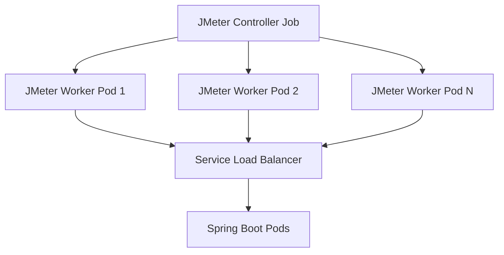

## Kubernetes Job Example

```yaml
apiVersion: batch/v1
kind: Job
metadata:
  name: jmeter-load-test
spec:
  template:
    spec:
      containers:
        - name: jmeter
          image: justb4/jmeter:latest
          command: ["jmeter"]
          args:
            [
              "-n",
              "-t",
              "/tests/loan-api-test.jmx",
              "-l",
              "/results/results.jtl",
              "-e",
              "-o",
              "/results/report"
            ]
          volumeMounts:
            - name: test-plan
              mountPath: /tests
            - name: results
              mountPath: /results
      restartPolicy: Never
      volumes:
        - name: test-plan
          configMap:
            name: jmeter-test-plan
        - name: results
          emptyDir: {}
```

---

# 16. Spring Boot Scaling Strategy

## Horizontal Scaling

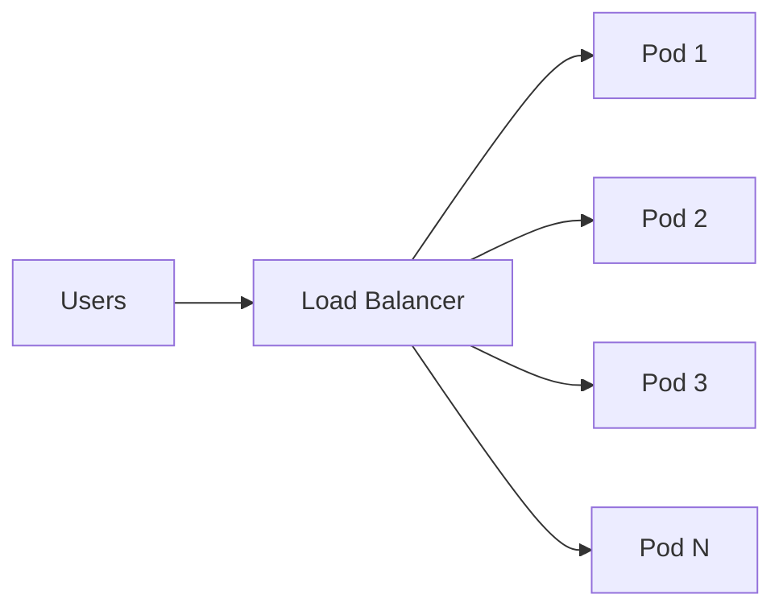

## Example Pod Sizing

| RPS Target | App Pods | RPS per Pod |
|---:|---:|---:|
| 100 | 1 | 100 |
| 1,000 | 4 | 250 |
| 10,000 | 40 | 250 |
| 100,000 | 400 | 250 |

This is only an example. Actual numbers depend on:

- CPU per pod
- request complexity
- DB calls
- cache hit rate
- payload size
- network cost
- JVM tuning

## Kubernetes HPA Example

```yaml
apiVersion: autoscaling/v2
kind: HorizontalPodAutoscaler
metadata:
  name: loan-api-hpa
spec:
  scaleTargetRef:
    apiVersion: apps/v1
    kind: Deployment
    name: loan-api
  minReplicas: 4
  maxReplicas: 400
  metrics:
    - type: Resource
      resource:
        name: cpu
        target:
          type: Utilization
          averageUtilization: 60
```

## Spring Boot Deployment Example

```yaml
apiVersion: apps/v1
kind: Deployment
metadata:
  name: loan-api
spec:
  replicas: 4
  selector:
    matchLabels:
      app: loan-api
  template:
    metadata:
      labels:
        app: loan-api
    spec:
      containers:
        - name: loan-api
          image: loan-api:1.0.0
          ports:
            - containerPort: 8080
          env:
            - name: JAVA_TOOL_OPTIONS
              value: >-
                -Xms1200m
                -Xmx1200m
                -Xss512k
                -XX:+UseG1GC
                -XX:MaxGCPauseMillis=200
          resources:
            requests:
              cpu: "1"
              memory: "2Gi"
            limits:
              cpu: "2"
              memory: "2Gi"
```

---

# 17. Database Scaling Strategy

At high RPS, the database is usually the bottleneck.

## Database Bottleneck Diagram

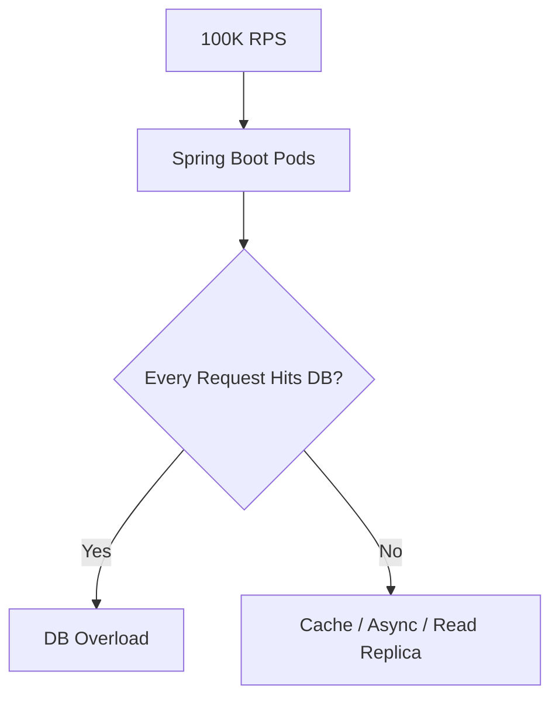

## DB Rules

1. Avoid DB call for every request if possible.
2. Use cache for read-heavy data.
3. Use read replicas for read scaling.
4. Use async processing for slow writes.
5. Use pagination.
6. Add indexes.
7. Avoid N+1 queries.
8. Keep transactions short.
9. Use connection pool carefully.

## Connection Pool Calculation

If:

```text
40 app pods
30 DB connections per pod
```

Then:

```text
Total DB connections = 40 × 30 = 1200
```

This may kill your database.

Better:

```text
40 pods × 10 connections = 400 total DB connections
```

Or use:

- PgBouncer
- ProxySQL
- read replicas
- caching
- async writes

---

# 18. Cache Scaling Strategy

## Redis Cache Pattern

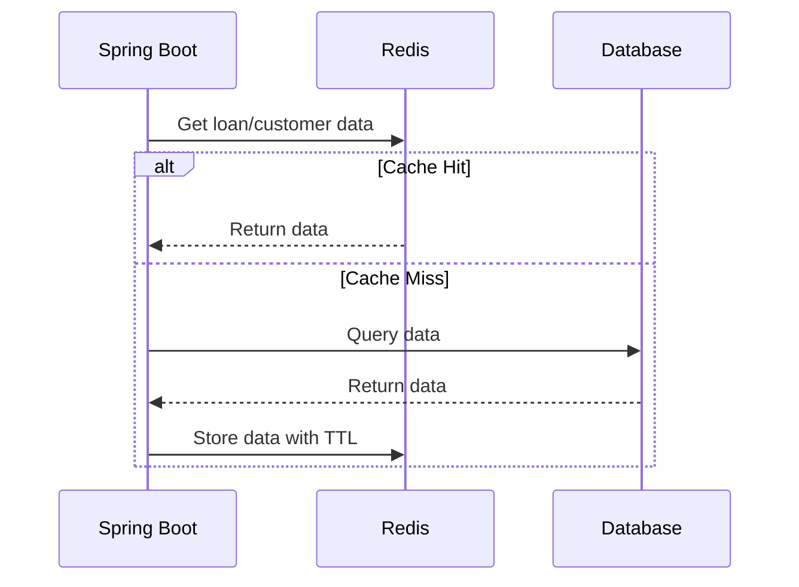

## Cache Rules

| Rule | Reason |
|---|---|
| Use TTL | Avoid stale data |
| Limit object size | Avoid Redis memory pressure |
| Cache read-heavy data | Reduce DB load |
| Avoid caching everything | Prevent complexity |
| Protect against stampede | Use locks or request coalescing |

---

# 19. Message Queue Strategy

For loan applications, not every step must be synchronous.

## Async Loan Processing

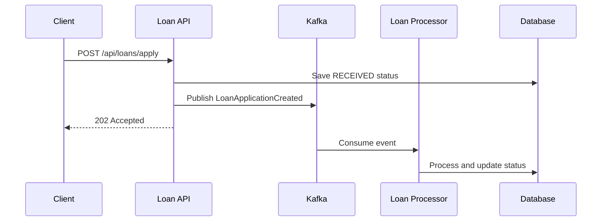

## Benefits

- Faster API response
- Better spike handling
- Decoupled processing
- Retry capability
- Backpressure

---

# 20. Common Bottlenecks and Fixes

| Bottleneck | Symptom | Fix |
|---|---|---|
| JMeter overloaded | Target RPS not reached | Add workers |
| App CPU high | High latency, CPU > 85% | Add pods, optimize code |
| GC pauses | Latency spikes | Reduce allocation, tune heap |
| DB slow | Threads waiting | Indexes, cache, read replicas |
| DB pool exhausted | Pending connections | Tune queries, reduce concurrency |
| Tomcat threads exhausted | Busy threads near max | Fix downstream latency |
| Redis overloaded | Cache latency high | Scale Redis, reduce payload |
| Network saturated | High connect time | More load generators, better network |
| Logging overhead | CPU/I/O high | Reduce logs |
| Large JSON | High CPU and bandwidth | Reduce payload, pagination |

---

# 21. Troubleshooting Playbooks

## High Error Rate

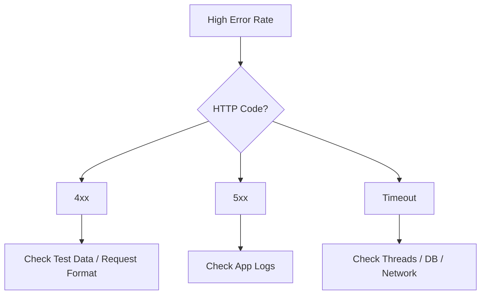

Checklist:

```text
[ ] Are requests valid?
[ ] Is test data unique?
[ ] Is authentication working?
[ ] Are rate limits triggered?
[ ] Is app throwing exceptions?
[ ] Are DB connections exhausted?
[ ] Are downstream services timing out?
```

## Target RPS Not Reached

```text
[ ] Check JMeter machine CPU
[ ] Check JMeter memory
[ ] Disable GUI listeners
[ ] Use CLI mode
[ ] Add JMeter workers
[ ] Check network bandwidth
[ ] Check DNS/load balancer limits
[ ] Check app rejecting connections
```

## High Latency

```text
[ ] Check P95/P99 latency
[ ] Check app CPU
[ ] Check GC pause
[ ] Check Tomcat busy threads
[ ] Check DB pool active/pending
[ ] Check slow query log
[ ] Check Redis latency
[ ] Check external service latency
```

## App OOM During Test

```text
[ ] Capture heap dump
[ ] Check old gen after GC
[ ] Check allocation rate
[ ] Check unbounded queues
[ ] Check cache size
[ ] Check large request/response payloads
[ ] Check ThreadLocal usage
```

---

# 22. Final Checklist

## Before Test

```text
[ ] Test environment matches production as closely as possible
[ ] JMeter runs in CLI mode
[ ] Heavy listeners disabled
[ ] Test data prepared
[ ] Monitoring dashboards ready
[ ] Logs are not too verbose
[ ] GC logs enabled
[ ] App version/config recorded
[ ] DB baseline recorded
```

## During Test

```text
[ ] Watch RPS
[ ] Watch error rate
[ ] Watch P95/P99 latency
[ ] Watch CPU
[ ] Watch heap and GC
[ ] Watch DB pool
[ ] Watch DB CPU
[ ] Watch network
[ ] Watch load generator CPU
```

## After Test

```text
[ ] Save JMeter HTML report
[ ] Save JTL file
[ ] Save app logs
[ ] Save GC logs
[ ] Save dashboard screenshots
[ ] Record bottlenecks
[ ] Record tuning changes
[ ] Compare with previous run
```

---

# Practical Scale Plan Summary

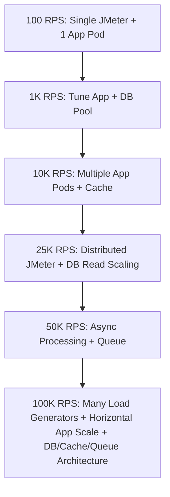

## Final Reality Check

To reach 100K RPS, you usually need:

```text
[ ] Multiple JMeter/load generator machines
[ ] Load balancer capacity
[ ] Many Spring Boot instances
[ ] Very efficient API code
[ ] Minimal synchronous DB calls
[ ] Strong caching strategy
[ ] Async processing for heavy workflows
[ ] Proper JVM tuning
[ ] Kubernetes autoscaling
[ ] Production-grade observability
```

---

# Recommended First Experiment

Start with:

```text
Target: 100 RPS
Duration: 10 minutes
Threads: 50
Ramp-up: 60 seconds
Endpoint: POST /api/loans/apply
Success condition:
  Error % < 1
  P95 < 300 ms
  CPU < 70%
  No Full GC
```

Then increase one stage at a time.

---

# Appendix A: Example JMeter Properties for High Load

```properties
jmeter.save.saveservice.output_format=csv
jmeter.save.saveservice.response_data=false
jmeter.save.saveservice.samplerData=false
jmeter.save.saveservice.requestHeaders=false
jmeter.save.saveservice.responseHeaders=false
jmeter.save.saveservice.url=false
jmeter.save.saveservice.filename=false
jmeter.save.saveservice.hostname=true
jmeter.save.saveservice.thread_counts=true
jmeter.save.saveservice.assertion_results_failure_message=true
```

---

# Appendix B: Example Spring Boot High Load Properties

```properties
server.tomcat.threads.max=300
server.tomcat.threads.min-spare=50
server.tomcat.accept-count=500
server.tomcat.max-connections=10000

spring.datasource.hikari.maximum-pool-size=20
spring.datasource.hikari.connection-timeout=30000

management.endpoints.web.exposure.include=health,info,metrics,prometheus

logging.level.root=INFO
```

---

# Appendix C: Example JVM Options

```bash
-Xms1200m
-Xmx1200m
-Xss512k
-XX:+UseG1GC
-XX:MaxGCPauseMillis=200
-XX:+ParallelRefProcEnabled
-XX:+HeapDumpOnOutOfMemoryError
-XX:HeapDumpPath=/var/log/app
-Xlog:gc*,safepoint:file=/var/log/app/gc.log:time,uptime,level,tags:filecount=5,filesize=100M
```

For Java 8 GC logging:

```bash
-XX:+PrintGCDetails
-XX:+PrintGCDateStamps
-Xloggc:/var/log/app/gc.log
```
