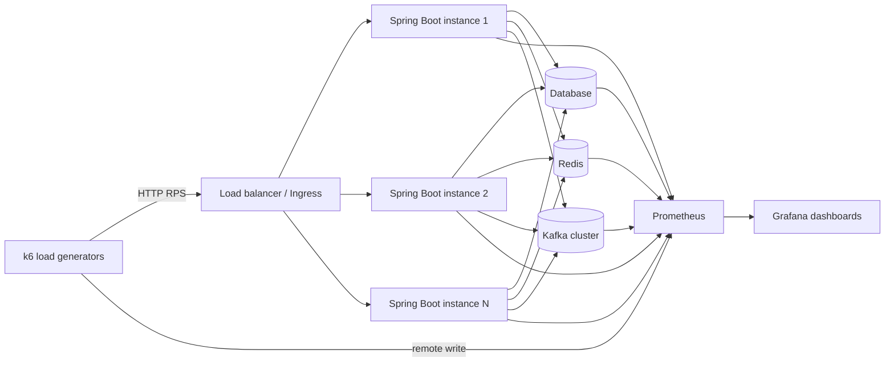
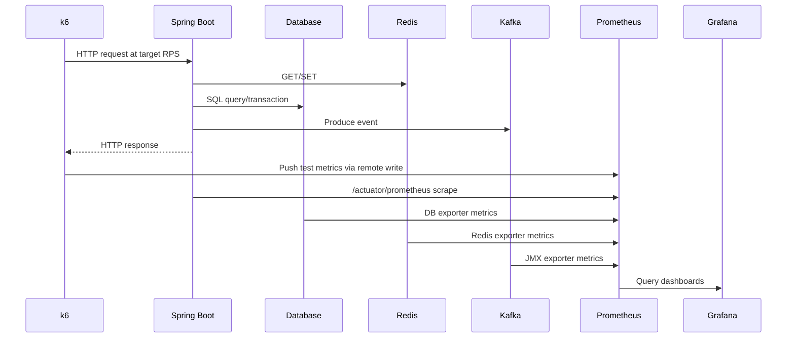
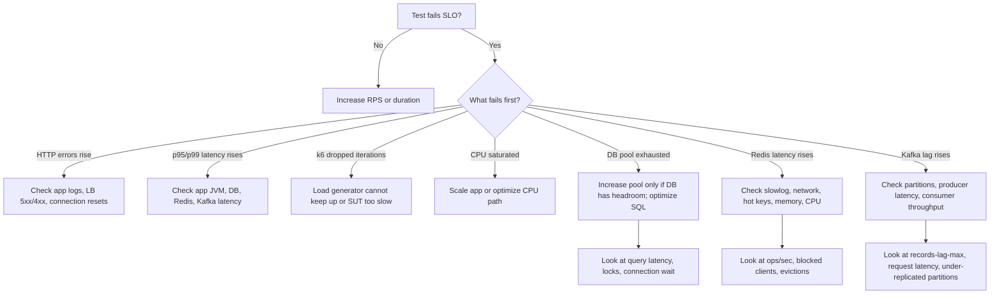
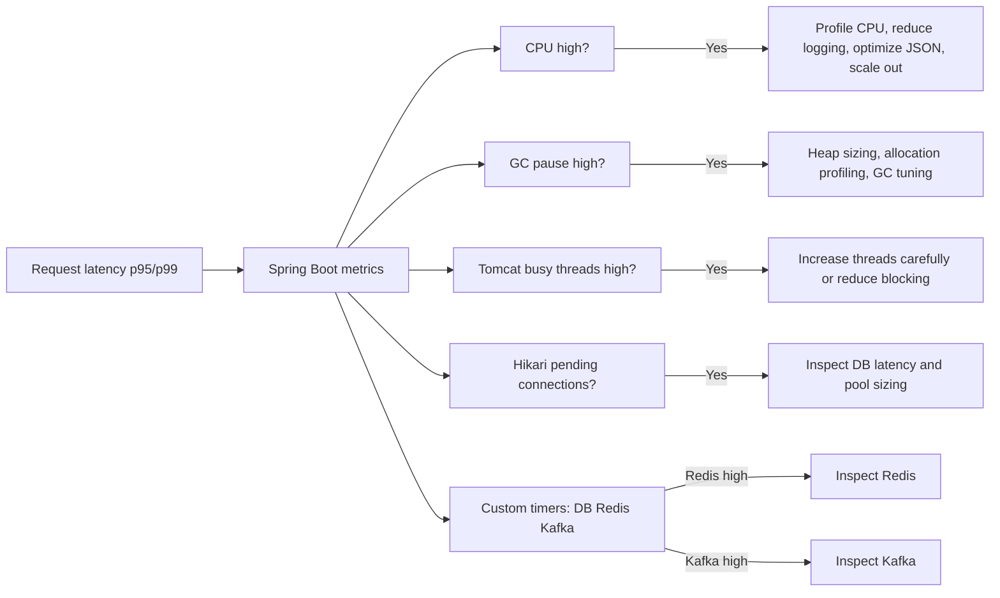
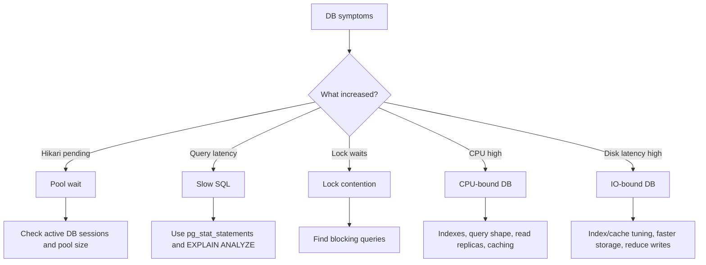
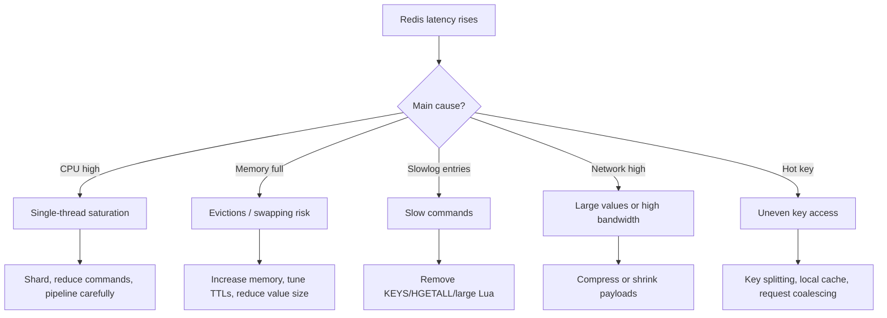
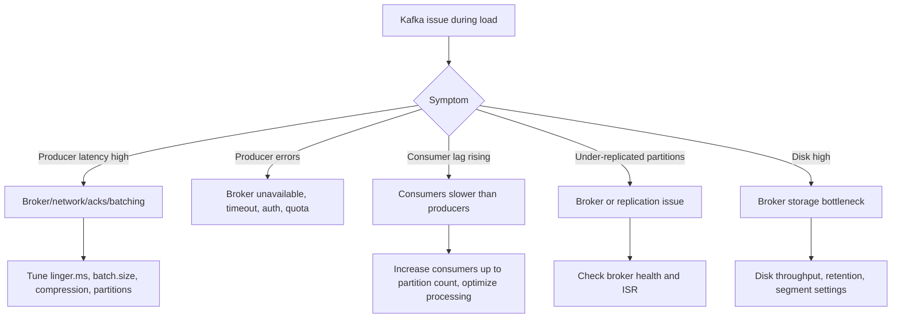

# k6 + Spring Boot Load Testing Guide: 1k, 10k, 20k, 50k, and 100k RPS

> Goal: run controlled k6 tests against a Spring Boot service, target increasingly higher request rates, and identify bottlenecks in the application, database, Redis, and Kafka.

_Last updated: 2026-04-29_

## Sources and assumptions

This guide uses current public documentation for the core tooling:

- k6 `constant-arrival-rate` is an open-model executor that starts iterations independently of response time, which makes it suitable for RPS-style tests.
- k6 thresholds can fail a test based on metrics such as `http_req_failed` and `http_req_duration`.
- k6 can export results to Prometheus remote write for Grafana dashboards.
- Spring Boot Actuator auto-configures Micrometer metrics and supports Prometheus exposure.
- Kafka exposes broker and client metrics through JMX; consumer lag metrics such as `records-lag`, `records-lag-avg`, and `records-lag-max` are available on consumer fetch manager metrics.

References:

- Grafana k6 constant-arrival-rate: https://grafana.com/docs/k6/latest/using-k6/scenarios/executors/constant-arrival-rate/
- Grafana k6 thresholds: https://grafana.com/docs/k6/latest/using-k6/thresholds/
- Grafana k6 Prometheus remote write: https://grafana.com/docs/k6/latest/results-output/real-time/prometheus-remote-write/
- Spring Boot Actuator metrics: https://docs.spring.io/spring-boot/reference/actuator/metrics.html
- Micrometer Prometheus registry: https://docs.micrometer.io/micrometer/reference/implementations/prometheus.html
- Apache Kafka monitoring: https://kafka.apache.org/41/operations/monitoring/
- Kafka consumer metrics: https://kafka.apache.org/30/generated/consumer_metrics.html

---

## 1. Architecture



Recommended test path:

1. Prove the endpoint works at 100 RPS.
2. Run 1k RPS.
3. Run 10k RPS.
4. Run 20k RPS.
5. Run 50k RPS.
6. Run 100k RPS only with distributed generators, tuned networking, and confirmed backend capacity.

Do not jump directly to 100k RPS. You need baselines at each tier to isolate where saturation begins.

---

## 2. What “RPS” means in k6

For RPS-style testing, use `constant-arrival-rate` or `ramping-arrival-rate`, not only VU-based executors.

Important concepts:

- `rate`: number of iterations per `timeUnit`.
- `timeUnit`: normally `1s` for RPS.
- `duration`: how long to hold that rate.
- `preAllocatedVUs`: initial pool of virtual users.
- `maxVUs`: upper limit k6 can allocate when responses slow down.

One k6 iteration should equal one request if you want `rate = requests per second`. If an iteration sends 3 HTTP calls, then `rate: 1000` means about 3000 HTTP requests per second.

---

## 3. Spring Boot example service

### 3.1 Maven dependencies

Add Actuator, Prometheus registry, web, JDBC/JPA, Redis, and Kafka dependencies as needed.

```xml
<dependencies>
    <dependency>
        <groupId>org.springframework.boot</groupId>
        <artifactId>spring-boot-starter-web</artifactId>
    </dependency>

    <dependency>
        <groupId>org.springframework.boot</groupId>
        <artifactId>spring-boot-starter-actuator</artifactId>
    </dependency>

    <dependency>
        <groupId>io.micrometer</groupId>
        <artifactId>micrometer-registry-prometheus</artifactId>
    </dependency>

    <dependency>
        <groupId>org.springframework.boot</groupId>
        <artifactId>spring-boot-starter-data-redis</artifactId>
    </dependency>

    <dependency>
        <groupId>org.springframework.kafka</groupId>
        <artifactId>spring-kafka</artifactId>
    </dependency>

    <dependency>
        <groupId>org.springframework.boot</groupId>
        <artifactId>spring-boot-starter-jdbc</artifactId>
    </dependency>

    <dependency>
        <groupId>org.postgresql</groupId>
        <artifactId>postgresql</artifactId>
        <scope>runtime</scope>
    </dependency>
</dependencies>
```

### 3.2 Actuator configuration

`src/main/resources/application.yml`:

```yaml
server:
  port: 8080
  tomcat:
    threads:
      max: 400
      min-spare: 50
    accept-count: 1000

management:
  endpoints:
    web:
      exposure:
        include: health,info,metrics,prometheus,threaddump,heapdump
  endpoint:
    health:
      show-details: always
  metrics:
    tags:
      application: k6-spring-demo

spring:
  datasource:
    url: jdbc:postgresql://localhost:5432/appdb
    username: app
    password: app
    hikari:
      maximum-pool-size: 100
      minimum-idle: 20
      connection-timeout: 1000
      validation-timeout: 1000
      max-lifetime: 1800000
  data:
    redis:
      host: localhost
      port: 6379
      lettuce:
        pool:
          max-active: 200
          max-idle: 100
          min-idle: 20
  kafka:
    bootstrap-servers: localhost:9092
    producer:
      acks: 1
      batch-size: 32768
      linger-ms: 5
      compression-type: lz4
    consumer:
      group-id: k6-demo-consumer
      auto-offset-reset: earliest
```

### 3.3 Example controller with DB, Redis, and Kafka timers

```java
package com.example.demo;

import io.micrometer.core.instrument.MeterRegistry;
import io.micrometer.core.instrument.Timer;
import org.springframework.data.redis.core.StringRedisTemplate;
import org.springframework.jdbc.core.JdbcTemplate;
import org.springframework.kafka.core.KafkaTemplate;
import org.springframework.web.bind.annotation.GetMapping;
import org.springframework.web.bind.annotation.RequestParam;
import org.springframework.web.bind.annotation.RestController;

import java.time.Duration;
import java.util.Map;
import java.util.UUID;

@RestController
public class LoadController {
    private final JdbcTemplate jdbcTemplate;
    private final StringRedisTemplate redisTemplate;
    private final KafkaTemplate<String, String> kafkaTemplate;
    private final MeterRegistry registry;

    public LoadController(
            JdbcTemplate jdbcTemplate,
            StringRedisTemplate redisTemplate,
            KafkaTemplate<String, String> kafkaTemplate,
            MeterRegistry registry
    ) {
        this.jdbcTemplate = jdbcTemplate;
        this.redisTemplate = redisTemplate;
        this.kafkaTemplate = kafkaTemplate;
        this.registry = registry;
    }

    @GetMapping("/api/load")
    public Map<String, Object> load(@RequestParam(defaultValue = "default") String key) {
        String requestId = UUID.randomUUID().toString();

        String redisValue = Timer
                .builder("app.redis.get")
                .description("Redis GET latency")
                .register(registry)
                .record(() -> redisTemplate.opsForValue().get(key));

        if (redisValue == null) {
            Integer dbValue = Timer
                    .builder("app.db.query")
                    .description("DB query latency")
                    .register(registry)
                    .record(() -> jdbcTemplate.queryForObject("select 1", Integer.class));

            Timer.builder("app.redis.set")
                    .description("Redis SET latency")
                    .register(registry)
                    .record(() -> redisTemplate.opsForValue().set(key, String.valueOf(dbValue), Duration.ofSeconds(60)));
        }

        Timer.builder("app.kafka.produce")
                .description("Kafka producer send enqueue latency")
                .register(registry)
                .record(() -> kafkaTemplate.send("load-events", requestId, "{\"id\":\"" + requestId + "\"}"));

        return Map.of("ok", true, "id", requestId);
    }
}
```

Notes:

- `kafkaTemplate.send()` is asynchronous. The timer above measures enqueue time, not full broker acknowledgment latency.
- For full Kafka produce latency, attach a callback or use producer metrics from JMX/Micrometer.
- Keep `/actuator/prometheus` protected outside test networks.

---

## 4. k6 script for RPS testing

Create `load-test.js`:

```javascript
import http from 'k6/http';
import { check, sleep } from 'k6';
import exec from 'k6/execution';

const TARGET = Number(__ENV.TARGET_RPS || '1000');
const BASE_URL = __ENV.BASE_URL || 'http://localhost:8080';
const DURATION = __ENV.DURATION || '10m';
const PRE_VUS = Number(__ENV.PRE_VUS || Math.ceil(TARGET / 10));
const MAX_VUS = Number(__ENV.MAX_VUS || Math.ceil(TARGET / 2));

export const options = {
  scenarios: {
    constant_rps: {
      executor: 'constant-arrival-rate',
      rate: TARGET,
      timeUnit: '1s',
      duration: DURATION,
      preAllocatedVUs: PRE_VUS,
      maxVUs: MAX_VUS,
    },
  },
  thresholds: {
    http_req_failed: ['rate<0.01'],
    http_req_duration: ['p(95)<500', 'p(99)<1000'],
    checks: ['rate>0.99'],
  },
};

export default function () {
  const id = exec.scenario.iterationInTest;
  const key = `k6-key-${id % 100000}`;

  const res = http.get(`${BASE_URL}/api/load?key=${key}`, {
    tags: {
      endpoint: '/api/load',
      target_rps: String(TARGET),
    },
    timeout: '5s',
  });

  check(res, {
    'status is 200': (r) => r.status === 200,
    'body ok': (r) => r.body && r.body.includes('true'),
  });
}
```

### Why the VU numbers are only starting points

`preAllocatedVUs` and `maxVUs` depend on latency.

Approximate formula:

```text
needed VUs ~= target RPS × average iteration duration in seconds
```

Examples:

| Target RPS | Avg response time | Approx VUs needed | Suggested maxVUs |
|---:|---:|---:|---:|
| 1,000 | 50 ms | 50 | 500 |
| 10,000 | 50 ms | 500 | 5,000 |
| 20,000 | 50 ms | 1,000 | 10,000 |
| 50,000 | 50 ms | 2,500 | 25,000 |
| 100,000 | 50 ms | 5,000 | 50,000 |
| 100,000 | 200 ms | 20,000 | 100,000+ |

At high RPS, a single k6 machine often becomes the bottleneck. Use distributed load generation.

---

## 5. Run commands for each target

### 5.1 Local smoke test

```bash
BASE_URL=http://localhost:8080 TARGET_RPS=100 DURATION=2m PRE_VUS=50 MAX_VUS=500 k6 run load-test.js
```

### 5.2 1k RPS

```bash
BASE_URL=http://app.example.com TARGET_RPS=1000 DURATION=10m PRE_VUS=200 MAX_VUS=1000 k6 run load-test.js
```

### 5.3 10k RPS

```bash
BASE_URL=http://app.example.com TARGET_RPS=10000 DURATION=15m PRE_VUS=1000 MAX_VUS=10000 k6 run load-test.js
```

### 5.4 20k RPS

```bash
BASE_URL=http://app.example.com TARGET_RPS=20000 DURATION=20m PRE_VUS=2000 MAX_VUS=20000 k6 run load-test.js
```

### 5.5 50k RPS

Use multiple generators.

Example: 5 generators × 10k RPS each.

```bash
BASE_URL=http://app.example.com TARGET_RPS=10000 DURATION=20m PRE_VUS=1000 MAX_VUS=10000 k6 run load-test.js
```

Run the same command on 5 separate load-generator nodes.

### 5.6 100k RPS

Use distributed generation.

Example: 10 generators × 10k RPS each, or 20 generators × 5k RPS each.

```bash
BASE_URL=http://app.example.com TARGET_RPS=10000 DURATION=30m PRE_VUS=1000 MAX_VUS=10000 k6 run load-test.js
```

Run on 10 machines at the same time.

---

## 6. k6 ramping plan from 1k to 100k RPS

Create `ramp-rps.js`:

```javascript
import http from 'k6/http';
import { check } from 'k6';

const BASE_URL = __ENV.BASE_URL || 'http://localhost:8080';

export const options = {
  scenarios: {
    ramping_rps: {
      executor: 'ramping-arrival-rate',
      startRate: 1000,
      timeUnit: '1s',
      preAllocatedVUs: Number(__ENV.PRE_VUS || 5000),
      maxVUs: Number(__ENV.MAX_VUS || 100000),
      stages: [
        { target: 1000, duration: '5m' },
        { target: 10000, duration: '10m' },
        { target: 20000, duration: '10m' },
        { target: 50000, duration: '15m' },
        { target: 100000, duration: '20m' },
        { target: 0, duration: '2m' },
      ],
    },
  },
  thresholds: {
    http_req_failed: ['rate<0.01'],
    http_req_duration: ['p(95)<500', 'p(99)<1000'],
  },
};

export default function () {
  const res = http.get(`${BASE_URL}/api/load?key=k6-${Math.floor(Math.random() * 100000)}`);
  check(res, { '200': (r) => r.status === 200 });
}
```

Run:

```bash
BASE_URL=http://app.example.com PRE_VUS=10000 MAX_VUS=100000 k6 run ramp-rps.js
```

Use this ramp only after isolated tests are stable. For root-cause analysis, constant single-level tests are easier to interpret.

---

## 7. Observability stack

### 7.1 Prometheus scrape config

`prometheus.yml`:

```yaml
global:
  scrape_interval: 5s
  evaluation_interval: 5s

scrape_configs:
  - job_name: spring-boot
    metrics_path: /actuator/prometheus
    static_configs:
      - targets:
          - app-1:8080
          - app-2:8080
          - app-3:8080

  - job_name: node-exporter
    static_configs:
      - targets:
          - app-1:9100
          - db-1:9100
          - redis-1:9100
          - kafka-1:9100

  - job_name: postgres-exporter
    static_configs:
      - targets: ['postgres-exporter:9187']

  - job_name: redis-exporter
    static_configs:
      - targets: ['redis-exporter:9121']

  - job_name: kafka-jmx
    static_configs:
      - targets:
          - kafka-1:9404
          - kafka-2:9404
          - kafka-3:9404
```

### 7.2 Send k6 metrics to Prometheus remote write

Example:

```bash
K6_PROMETHEUS_RW_SERVER_URL=http://prometheus:9090/api/v1/write \
K6_PROMETHEUS_RW_TREND_STATS='p(50),p(90),p(95),p(99),min,max,avg' \
k6 run -o experimental-prometheus-rw load-test.js
```

Depending on your k6 version, the Prometheus remote write output name may be `experimental-prometheus-rw`. Check your installed k6 documentation/version before production use.

---

## 8. Measurement flow



---

## 9. Bottleneck decision tree



---

## 10. Golden signals to capture

### 10.1 k6 metrics

| Metric | Meaning | Bottleneck clue |
|---|---|---|
| `http_reqs` | Requests completed | Actual achieved throughput |
| `http_req_duration` | Full request duration | User-facing latency |
| `http_req_waiting` | Time to first byte | Backend processing delay |
| `http_req_failed` | Failed request rate | SLO failure / errors |
| `dropped_iterations` | k6 could not start scheduled iterations | k6 generator or system under test cannot keep up |
| `vus` / `vus_max` | Active and max VUs | Whether k6 had enough execution capacity |

### 10.2 Spring Boot / JVM metrics

| Metric family | Watch for |
|---|---|
| `http_server_requests_seconds_*` | Endpoint latency, count, error tags |
| `jvm_memory_used_bytes` | Heap pressure |
| `jvm_gc_pause_seconds_*` | GC pause spikes |
| `jvm_threads_live_threads` | Thread growth / exhaustion |
| `tomcat_threads_busy_threads` | Servlet thread saturation |
| `tomcat_threads_current_threads` | Thread pool growth |
| `hikaricp_connections_active` | DB connections in use |
| `hikaricp_connections_pending` | Requests waiting for DB connection |
| `hikaricp_connections_timeout_total` | DB pool exhaustion |
| Custom `app.db.query` | DB call latency |
| Custom `app.redis.get` / `app.redis.set` | Redis call latency |
| Custom `app.kafka.produce` | Kafka enqueue/send path latency |

### 10.3 Database metrics

For PostgreSQL, watch:

| Metric / query | Watch for |
|---|---|
| Active connections | Connection saturation |
| Waiting queries / locks | Lock contention |
| Query p95/p99 | Slow SQL |
| CPU | Compute saturation |
| Disk IOPS / latency | Storage bottleneck |
| Buffer cache hit ratio | Memory/cache efficiency |
| Dead tuples / vacuum lag | Table bloat |
| `pg_stat_statements` | Top slow and frequent queries |

Useful SQL:

```sql
-- Active queries
select state, count(*)
from pg_stat_activity
group by state;

-- Long-running queries
select now() - query_start as age, state, wait_event_type, wait_event, query
from pg_stat_activity
where state <> 'idle'
order by age desc
limit 20;

-- Lock waits
select blocked_locks.pid as blocked_pid,
       blocked_activity.query as blocked_query,
       blocking_locks.pid as blocking_pid,
       blocking_activity.query as blocking_query
from pg_catalog.pg_locks blocked_locks
join pg_catalog.pg_stat_activity blocked_activity on blocked_activity.pid = blocked_locks.pid
join pg_catalog.pg_locks blocking_locks
  on blocking_locks.locktype = blocked_locks.locktype
 and blocking_locks.database is not distinct from blocked_locks.database
 and blocking_locks.relation is not distinct from blocked_locks.relation
 and blocking_locks.page is not distinct from blocked_locks.page
 and blocking_locks.tuple is not distinct from blocked_locks.tuple
 and blocking_locks.virtualxid is not distinct from blocked_locks.virtualxid
 and blocking_locks.transactionid is not distinct from blocked_locks.transactionid
 and blocking_locks.classid is not distinct from blocked_locks.classid
 and blocking_locks.objid is not distinct from blocked_locks.objid
 and blocking_locks.objsubid is not distinct from blocked_locks.objsubid
 and blocking_locks.pid != blocked_locks.pid
join pg_catalog.pg_stat_activity blocking_activity on blocking_activity.pid = blocking_locks.pid
where not blocked_locks.granted;

-- Top queries if pg_stat_statements is enabled
select query,
       calls,
       mean_exec_time,
       p95_exec_time,
       rows
from pg_stat_statements
order by mean_exec_time desc
limit 20;
```

### 10.4 Redis metrics

| Metric | Bottleneck clue |
|---|---|
| `instantaneous_ops_per_sec` | Throughput trend |
| `used_memory` / `maxmemory` | Memory pressure |
| `evicted_keys` | Cache is too small or policy is wrong |
| `connected_clients` | Client pressure |
| `blocked_clients` | Blocking commands or slow operations |
| `keyspace_hits` / `keyspace_misses` | Cache effectiveness |
| `latency latest` | Latency spikes |
| `slowlog get` | Slow commands |
| CPU | Single-thread saturation |

Commands:

```bash
redis-cli INFO
redis-cli INFO stats
redis-cli INFO commandstats
redis-cli LATENCY LATEST
redis-cli SLOWLOG GET 20
redis-cli CLIENT LIST
```

Common Redis bottlenecks:

- Hot key receiving too much traffic.
- Large values causing network and serialization cost.
- Expensive commands such as `KEYS`, large `HGETALL`, large `SMEMBERS`, or huge Lua scripts.
- Memory eviction causing low cache hit ratio.
- Too many connections.
- Redis CPU saturated on a single core.

### 10.5 Kafka metrics

| Metric | Bottleneck clue |
|---|---|
| Producer `request-latency-avg/max` | Broker/network produce latency |
| Producer `record-send-rate` | Producer throughput |
| Producer `record-error-rate` | Produce failures |
| Producer `buffer-available-bytes` | Producer buffering pressure |
| Broker `BytesInPerSec` / `BytesOutPerSec` | Broker IO throughput |
| Broker request handler idle percent | Broker request processing saturation |
| Under-replicated partitions | Replication health issue |
| Consumer `records-lag-max` | Consumer is falling behind |
| Consumer `records-consumed-rate` | Consumer processing throughput |
| Consumer `fetch-latency-avg/max` | Fetch latency |

Kafka commands:

```bash
# Consumer group lag
kafka-consumer-groups.sh \
  --bootstrap-server kafka-1:9092 \
  --describe \
  --group k6-demo-consumer

# Topic partition count
kafka-topics.sh \
  --bootstrap-server kafka-1:9092 \
  --describe \
  --topic load-events

# Broker API versions / connectivity
kafka-broker-api-versions.sh \
  --bootstrap-server kafka-1:9092
```

Common Kafka bottlenecks:

- Too few partitions for target producer/consumer parallelism.
- Consumer lag increasing because processing is slower than production.
- Broker disk or network saturated.
- Producer batching too small.
- Producer `acks=all` and replication settings increasing latency.
- Message size too large.
- Consumer `max.poll.records` and processing thread pool not tuned.

---

## 11. PromQL examples

### 11.1 k6 throughput and latency

```promql
sum(rate(k6_http_reqs_total[1m]))
```

```promql
histogram_quantile(0.95, sum(rate(k6_http_req_duration_seconds_bucket[1m])) by (le))
```

```promql
sum(rate(k6_http_req_failed_total[1m])) / sum(rate(k6_http_reqs_total[1m]))
```

### 11.2 Spring endpoint latency

```promql
histogram_quantile(
  0.95,
  sum(rate(http_server_requests_seconds_bucket{uri="/api/load"}[1m])) by (le)
)
```

```promql
sum(rate(http_server_requests_seconds_count{uri="/api/load",status=~"5.."}[1m]))
```

### 11.3 JVM and Tomcat

```promql
sum(jvm_memory_used_bytes{area="heap"}) by (application)
```

```promql
histogram_quantile(0.99, sum(rate(jvm_gc_pause_seconds_bucket[5m])) by (le))
```

```promql
tomcat_threads_busy_threads / tomcat_threads_config_max_threads
```

### 11.4 HikariCP DB pool

```promql
hikaricp_connections_active / hikaricp_connections_max
```

```promql
hikaricp_connections_pending
```

```promql
increase(hikaricp_connections_timeout_total[5m])
```

### 11.5 Custom DB/Redis/Kafka timers

```promql
histogram_quantile(0.95, sum(rate(app_db_query_seconds_bucket[1m])) by (le))
```

```promql
histogram_quantile(0.95, sum(rate(app_redis_get_seconds_bucket[1m])) by (le))
```

```promql
histogram_quantile(0.95, sum(rate(app_kafka_produce_seconds_bucket[1m])) by (le))
```

### 11.6 Redis

Metric names depend on your Redis exporter. Common examples:

```promql
rate(redis_commands_processed_total[1m])
```

```promql
redis_memory_used_bytes / redis_memory_max_bytes
```

```promql
increase(redis_evicted_keys_total[5m])
```

```promql
rate(redis_keyspace_hits_total[1m]) / (rate(redis_keyspace_hits_total[1m]) + rate(redis_keyspace_misses_total[1m]))
```

### 11.7 Kafka

Metric names depend on JMX exporter mapping. Common concepts:

```promql
sum(kafka_server_replicamanager_underreplicatedpartitions)
```

```promql
sum(rate(kafka_server_brokertopicmetrics_bytesin_total[1m]))
```

```promql
sum(rate(kafka_server_brokertopicmetrics_messagesin_total[1m]))
```

For consumer lag, use your exporter’s lag metric, for example:

```promql
max(kafka_consumergroup_lag) by (consumergroup, topic)
```

---

## 12. Step-by-step test procedure

### Step 1: Define SLOs

Example SLOs:

```text
Availability: error rate < 1%
Latency: p95 < 500 ms, p99 < 1000 ms
Throughput: sustain target RPS for at least 10 minutes
Kafka: consumer lag must return to baseline after test
Redis: no evictions during test unless expected
DB: no connection timeouts and no severe lock waits
```

### Step 2: Establish idle baseline

Record metrics for 10 minutes without load:

- CPU, memory, disk, network.
- JVM heap and GC.
- DB active connections and slow queries.
- Redis memory and ops/sec.
- Kafka broker health and consumer lag.

### Step 3: Run 100 RPS smoke test

Purpose: validate scripts, dashboards, and logs.

```bash
TARGET_RPS=100 DURATION=2m k6 run load-test.js
```

### Step 4: Run 1k RPS

```bash
TARGET_RPS=1000 DURATION=10m PRE_VUS=200 MAX_VUS=1000 k6 run load-test.js
```

Collect:

- k6 p95/p99.
- App p95/p99.
- JVM CPU/GC.
- Hikari active/pending connections.
- DB top queries.
- Redis latency and hit ratio.
- Kafka producer latency and consumer lag.

### Step 5: Run 10k RPS

```bash
TARGET_RPS=10000 DURATION=15m PRE_VUS=1000 MAX_VUS=10000 k6 run load-test.js
```

Before increasing further, confirm:

- k6 has no dropped iterations.
- Load generator CPU is below 70%.
- Network bandwidth is not saturated.
- App instances are balanced.
- DB/Redis/Kafka metrics are still healthy.

### Step 6: Run 20k RPS

```bash
TARGET_RPS=20000 DURATION=20m PRE_VUS=2000 MAX_VUS=20000 k6 run load-test.js
```

At this level, compare bottleneck signatures:

| Symptom | Likely area |
|---|---|
| App CPU high, DB/Redis/Kafka normal | Application CPU / JSON / serialization / logging |
| Hikari pending > 0 | DB connection pool or DB latency |
| DB CPU/disk high | Database saturation |
| Redis p95 rises | Redis CPU/network/hot key/large values |
| Kafka producer latency rises | Kafka broker/network/disk/acks/batching |
| Kafka consumer lag rises | Consumer throughput or partitions |
| k6 dropped iterations but backend okay | Load generator bottleneck |

### Step 7: Run 50k RPS distributed

Run 5 generators × 10k RPS.

Checklist:

- Synchronize clocks with NTP.
- Use the same script and environment variables.
- Tag each generator with a name.
- Confirm the load balancer is not rate-limiting.
- Confirm ephemeral ports are not exhausted.

Example with generator tag:

```bash
K6_PROMETHEUS_RW_SERVER_URL=http://prometheus:9090/api/v1/write \
GENERATOR_ID=lg-1 \
BASE_URL=http://app.example.com \
TARGET_RPS=10000 \
DURATION=20m \
PRE_VUS=1000 \
MAX_VUS=10000 \
k6 run -o experimental-prometheus-rw load-test.js
```

Add this tag in the k6 request if needed:

```javascript
tags: {
  endpoint: '/api/load',
  generator: __ENV.GENERATOR_ID || 'local',
}
```

### Step 8: Run 100k RPS distributed

Run 10 generators × 10k RPS or 20 generators × 5k RPS.

For 100k RPS, validate:

- k6 machines have enough CPU, memory, and network.
- Kernel/network limits are tuned.
- Load balancer has enough connection capacity.
- Application autoscaling is disabled for deterministic tests or intentionally measured if enabled.
- DB max connections, Redis max clients, and Kafka partitions are sized deliberately.

---

## 13. Load generator tuning

Linux settings often needed for very high RPS:

```bash
# Check ephemeral port range
cat /proc/sys/net/ipv4/ip_local_port_range

# Example wider range
sudo sysctl -w net.ipv4.ip_local_port_range="10000 65000"

# Reuse TIME_WAIT sockets where safe
sudo sysctl -w net.ipv4.tcp_tw_reuse=1

# File descriptors
ulimit -n 1048576

# Check network saturation
sar -n DEV 1
iftop
nload
```

Use multiple source IPs or multiple load generators if you hit port exhaustion, NAT limits, firewall limits, or NIC bandwidth limits.

---

## 14. App bottleneck analysis



Commands:

```bash
# JVM thread dump through actuator if enabled
curl http://app.example.com/actuator/threaddump

# Heap metrics
curl http://app.example.com/actuator/metrics/jvm.memory.used

# HTTP server request metrics
curl http://app.example.com/actuator/metrics/http.server.requests

# Hikari metrics
curl http://app.example.com/actuator/metrics/hikaricp.connections.active
curl http://app.example.com/actuator/metrics/hikaricp.connections.pending
```

Red flags:

- `tomcat_threads_busy_threads / max_threads > 0.8` for sustained periods.
- `hikaricp_connections_pending > 0`.
- Frequent GC pauses aligned with latency spikes.
- Log volume grows with RPS and blocks on IO.
- HTTP client pools are undersized if the app calls downstream services.

---

## 15. DB bottleneck analysis



How to distinguish pool vs DB saturation:

| Observation | Interpretation |
|---|---|
| Hikari pending high, DB CPU low, DB active connections near pool max | App pool too small or connections held too long |
| Hikari pending high, DB CPU/disk high | DB cannot serve more work |
| Query p95 high, Redis/Kafka normal | DB query path is likely bottleneck |
| Lock waits high | Transaction design issue |

Actions:

1. Use `pg_stat_statements` to find top queries by total time and mean time.
2. Run `EXPLAIN (ANALYZE, BUFFERS)` on slow queries.
3. Check indexes and cardinality.
4. Reduce transaction duration.
5. Add caching for read-heavy stable data.
6. Increase Hikari pool only if the DB has CPU, memory, and IO headroom.

---

## 16. Redis bottleneck analysis



Test Redis directly during load:

```bash
redis-cli --latency
redis-cli --latency-history
redis-cli INFO stats
redis-cli INFO memory
redis-cli SLOWLOG GET 20
```

Cache hit ratio query:

```text
hit_ratio = keyspace_hits / (keyspace_hits + keyspace_misses)
```

Signs Redis is the bottleneck:

- App custom Redis timer p95 increases before DB timer p95.
- Redis `blocked_clients` increases.
- Redis CPU reaches one full core.
- `SLOWLOG` shows repeated slow commands.
- `evicted_keys` increases and app DB traffic rises due to cache misses.

---

## 17. Kafka bottleneck analysis



Producer tuning starting points:

```yaml
spring:
  kafka:
    producer:
      acks: 1
      compression-type: lz4
      batch-size: 32768
      linger-ms: 5
      properties:
        max.in.flight.requests.per.connection: 5
        delivery.timeout.ms: 120000
        request.timeout.ms: 30000
```

Consumer tuning starting points:

```yaml
spring:
  kafka:
    listener:
      concurrency: 8
    consumer:
      properties:
        max.poll.records: 500
        fetch.min.bytes: 1
        fetch.max.wait.ms: 500
```

Rules of thumb:

- Consumer parallelism is limited by partition count.
- If consumer lag rises but app HTTP latency is fine, your write path may be okay but async processing is underprovisioned.
- If producer latency rises and HTTP latency rises, Kafka is on the request critical path.
- If Kafka is not critical to the HTTP response, decouple it more aggressively with queues/buffers and failure handling.

---

## 18. Result template

Use this template after every test.

```markdown
# Load Test Result

## Test metadata

- Date:
- Git commit:
- Environment:
- k6 script:
- Target RPS:
- Duration:
- Number of k6 generators:
- Spring Boot instances:
- DB instance/class:
- Redis instance/class:
- Kafka brokers/partitions:

## SLO result

| SLO | Target | Actual | Pass/Fail |
|---|---:|---:|---|
| Error rate | < 1% |  |  |
| p95 latency | < 500 ms |  |  |
| p99 latency | < 1000 ms |  |  |
| Sustained RPS | target |  |  |
| DB pool timeouts | 0 |  |  |
| Redis evictions | 0 |  |  |
| Kafka lag recovery | returns to baseline |  |  |

## Observations

- k6:
- App/JVM:
- DB:
- Redis:
- Kafka:
- Load generator:

## Bottleneck conclusion

Primary bottleneck:

Evidence:

1.
2.
3.

## Next actions

1.
2.
3.
```

---

## 19. Common failure patterns and fixes

| Pattern | Evidence | Fix |
|---|---|---|
| Load generator bottleneck | k6 CPU high, dropped iterations, backend not saturated | More generators, tune OS/network, lower per-node RPS |
| App thread saturation | Tomcat busy threads near max, request latency high | Reduce blocking, scale app, tune thread pool carefully |
| DB pool exhaustion | Hikari pending/timeouts | Optimize DB calls, reduce connection hold time, right-size pool |
| Slow SQL | DB query p95 high, CPU/disk high | Indexes, query rewrite, caching, partitioning |
| Redis hot key | Redis CPU high, one key dominates | Shard key, local cache, request coalescing |
| Redis memory pressure | Evictions, hit ratio falls | Increase memory, tune TTL, reduce value size |
| Kafka producer bottleneck | Producer request latency high | Batch, compress, increase partitions, check broker disk/network |
| Kafka consumer bottleneck | Lag increases continuously | Increase partitions/consumers, optimize consumer processing |
| Logging bottleneck | CPU/IO high, latency follows log volume | Reduce sync logging, sample logs, async appender |
| GC bottleneck | GC pause p99 aligns with HTTP p99 | Allocation profiling, heap tuning, object reduction |

---

## 20. Final checklist before 100k RPS

- [ ] k6 test has one HTTP request per iteration, or RPS math is adjusted.
- [ ] 1k, 10k, 20k, and 50k RPS results are saved.
- [ ] k6 generators have CPU, network, file descriptor, and port headroom.
- [ ] Prometheus scrape interval is short enough for test analysis.
- [ ] Grafana dashboard shows k6, app, JVM, DB, Redis, Kafka, and node metrics together.
- [ ] Spring Boot `/actuator/prometheus` is exposed only to monitoring networks.
- [ ] DB slow query and lock visibility is enabled.
- [ ] Redis `SLOWLOG` and latency tools are available.
- [ ] Kafka JMX/exporter metrics are available.
- [ ] Load balancer limits, WAF rules, and rate limits are understood.
- [ ] Test data strategy avoids unrealistic cache-only or DB-only behavior unless intentional.
- [ ] Rollback/stop criteria are defined.

---

## 21. Recommended stop criteria

Stop the test immediately if:

- Error rate exceeds 5% for more than 2 minutes.
- p99 exceeds 5 seconds for more than 2 minutes.
- DB CPU, disk, or connections are saturated and business traffic is at risk.
- Redis starts evicting unexpectedly.
- Kafka under-replicated partitions appear.
- Consumer lag grows without recovery.
- Load balancer or firewall starts dropping large volumes of connections.

---

## 22. Minimal local Docker Compose example

This is for functional practice only, not 100k RPS.

```yaml
services:
  prometheus:
    image: prom/prometheus:latest
    ports:
      - "9090:9090"
    volumes:
      - ./prometheus.yml:/etc/prometheus/prometheus.yml

  grafana:
    image: grafana/grafana:latest
    ports:
      - "3000:3000"

  redis:
    image: redis:7
    ports:
      - "6379:6379"

  postgres:
    image: postgres:16
    environment:
      POSTGRES_USER: app
      POSTGRES_PASSWORD: app
      POSTGRES_DB: appdb
    ports:
      - "5432:5432"
```

For Kafka, prefer a production-like multi-broker test environment when measuring real bottlenecks.

---

## 23. Practical interpretation guide

The most useful analysis is time-aligned. Put vertical annotations in Grafana for each RPS stage.

Example interpretation:

```text
At 10k RPS:
- k6 p95: 180 ms
- app p95: 140 ms
- DB p95: 20 ms
- Redis p95: 3 ms
- Kafka producer p95: 8 ms
Conclusion: healthy.

At 20k RPS:
- k6 p95: 420 ms
- app p95: 390 ms
- DB p95: 180 ms
- Hikari pending: 20
- Redis p95: 4 ms
- Kafka producer p95: 10 ms
Conclusion: DB path is likely bottleneck.

At 50k RPS:
- k6 dropped iterations increase
- generator CPU: 95%
- app CPU: 55%
Conclusion: k6 generator bottleneck, not app bottleneck.
```

Always prove the bottleneck with at least two independent signals. For example, do not claim “DB bottleneck” only because HTTP latency increased. Confirm with DB query latency, Hikari pending connections, DB CPU/disk/locks, or slow query evidence.
