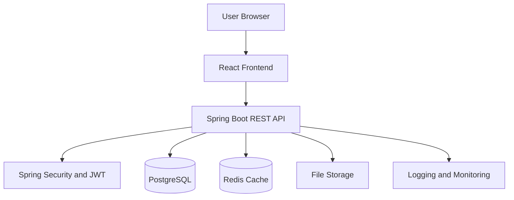
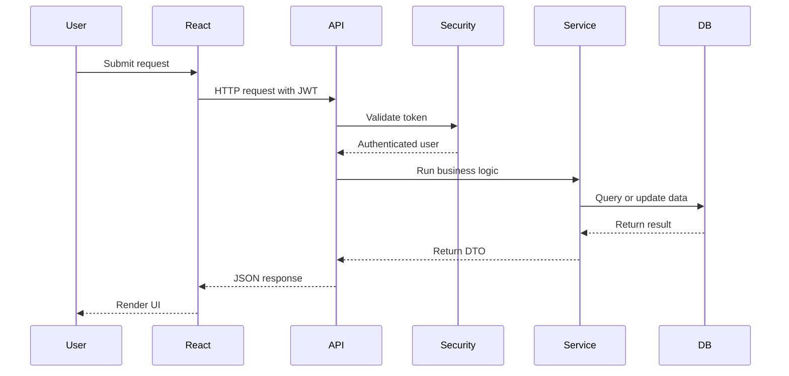
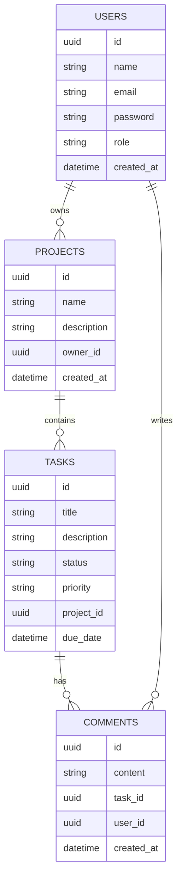
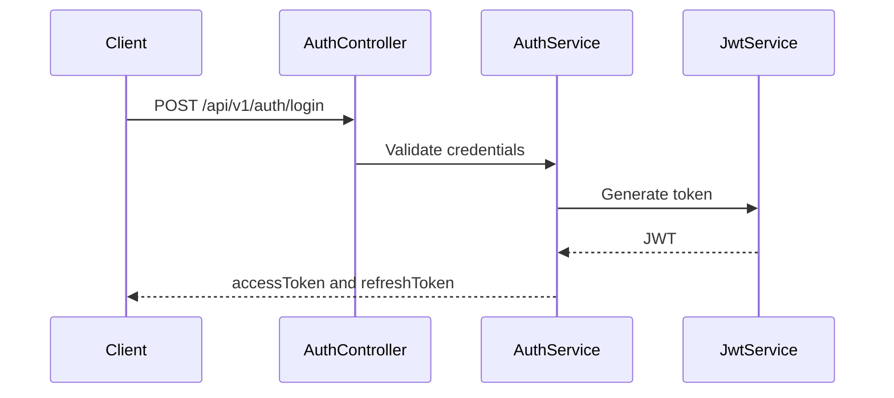
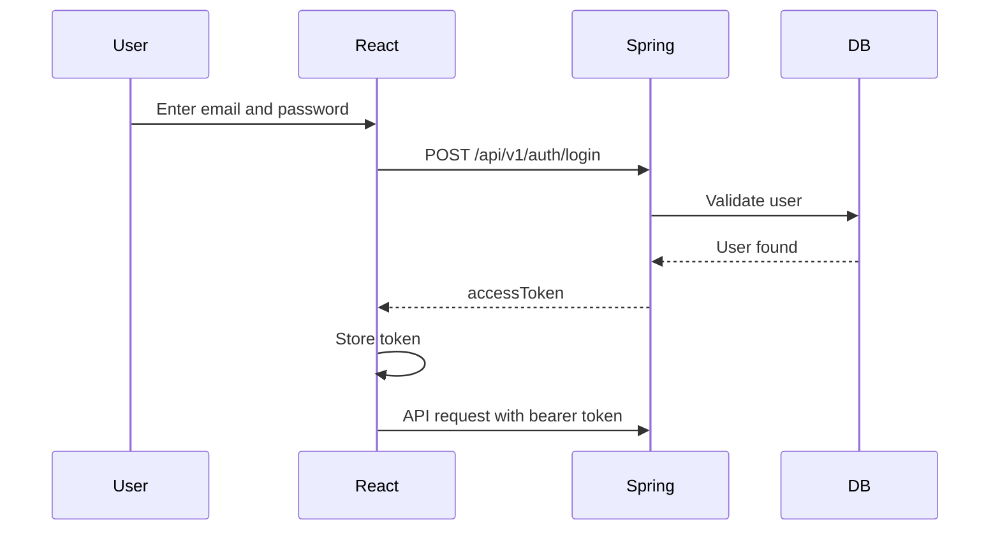

# Production-Level React + Spring Boot Full-Stack Guide

This is a Git-friendly, step-by-step guide for building a production-level full-stack application using React as the frontend and Spring Boot as the backend.

---

## Table of Contents

- [1. Project Goal](#1-project-goal)
- [2. Final Architecture](#2-final-architecture)
- [3. Technology Stack](#3-technology-stack)
- [4. Repository Structure](#4-repository-structure)
- [5. Backend Setup](#5-backend-setup)
- [6. Backend Package Structure](#6-backend-package-structure)
- [7. Database Design](#7-database-design)
- [8. Entity Layer](#8-entity-layer)
- [9. Repository Layer](#9-repository-layer)
- [10. DTO Layer](#10-dto-layer)
- [11. Service Layer](#11-service-layer)
- [12. Controller Layer](#12-controller-layer)
- [13. Global Exception Handling](#13-global-exception-handling)
- [14. Validation](#14-validation)
- [15. Spring Security and JWT](#15-spring-security-and-jwt)
- [16. Role-Based Authorization](#16-role-based-authorization)
- [17. Pagination Sorting and Filtering](#17-pagination-sorting-and-filtering)
- [18. Flyway Database Migration](#18-flyway-database-migration)
- [19. Swagger OpenAPI](#19-swagger-openapi)
- [20. Backend Testing](#20-backend-testing)
- [21. Frontend Setup](#21-frontend-setup)
- [22. Frontend Folder Structure](#22-frontend-folder-structure)
- [23. Routing](#23-routing)
- [24. Axios API Client](#24-axios-api-client)
- [25. Authentication Flow](#25-authentication-flow)
- [26. Protected Routes](#26-protected-routes)
- [27. React Query](#27-react-query)
- [28. Forms With React Hook Form and Zod](#28-forms-with-react-hook-form-and-zod)
- [29. Role-Based UI](#29-role-based-ui)
- [30. Frontend Testing](#30-frontend-testing)
- [31. Docker Setup](#31-docker-setup)
- [32. Docker Compose](#32-docker-compose)
- [33. Logging and Monitoring](#33-logging-and-monitoring)
- [34. Security Checklist](#34-security-checklist)
- [35. Performance Checklist](#35-performance-checklist)
- [36. CI CD With GitHub Actions](#36-ci-cd-with-github-actions)
- [37. Deployment Checklist](#37-deployment-checklist)
- [38. Advanced Topics](#38-advanced-topics)
- [39. Interview Talking Points](#39-interview-talking-points)
- [40. Learning Roadmap](#40-learning-roadmap)

---

## 1. Project Goal

Build a production-level Project Management Application.

Core features:

- Register and login
- JWT authentication
- Refresh token support
- Role-based authorization
- Projects
- Tasks
- Comments
- Pagination
- Search and filtering
- File upload
- Admin dashboard
- Audit logging
- Docker deployment
- CI/CD pipeline

---

## 2. Final Architecture



Request flow:



---

## 3. Technology Stack

Frontend:

```text
React
TypeScript
Vite
React Router
TanStack Query
Axios
React Hook Form
Zod
Tailwind CSS
Vitest
React Testing Library
Playwright
```

Backend:

```text
Java 17 or Java 21
Spring Boot 3
Spring Web
Spring Security
Spring Data JPA
PostgreSQL
Flyway
JWT
Swagger OpenAPI
JUnit 5
Mockito
Testcontainers
Docker
```

---

## 4. Repository Structure

```text
project-management-app/
├── backend/
│   ├── src/
│   ├── pom.xml
│   └── Dockerfile
├── frontend/
│   ├── src/
│   ├── package.json
│   └── Dockerfile
├── docker-compose.yml
├── .github/
│   └── workflows/
│       └── ci.yml
└── README.md
```

---

## 5. Backend Setup

Create a Spring Boot project with these dependencies:

```text
Spring Web
Spring Security
Spring Data JPA
PostgreSQL Driver
Validation
Flyway Migration
Spring Boot Actuator
Lombok
Springdoc OpenAPI
```

Example Maven dependencies:

```xml
<dependencies>
    <dependency>
        <groupId>org.springframework.boot</groupId>
        <artifactId>spring-boot-starter-web</artifactId>
    </dependency>

    <dependency>
        <groupId>org.springframework.boot</groupId>
        <artifactId>spring-boot-starter-security</artifactId>
    </dependency>

    <dependency>
        <groupId>org.springframework.boot</groupId>
        <artifactId>spring-boot-starter-data-jpa</artifactId>
    </dependency>

    <dependency>
        <groupId>org.postgresql</groupId>
        <artifactId>postgresql</artifactId>
        <scope>runtime</scope>
    </dependency>

    <dependency>
        <groupId>org.springframework.boot</groupId>
        <artifactId>spring-boot-starter-validation</artifactId>
    </dependency>

    <dependency>
        <groupId>org.flywaydb</groupId>
        <artifactId>flyway-core</artifactId>
    </dependency>
</dependencies>
```

Basic `application.yml`:

```yaml
spring:
  datasource:
    url: jdbc:postgresql://localhost:5432/project_db
    username: project_user
    password: project_password
  jpa:
    hibernate:
      ddl-auto: validate
    open-in-view: false
  flyway:
    enabled: true

server:
  port: 8080
```

---

## 6. Backend Package Structure

```text
com.example.projectmanagement/
├── auth/
│   ├── AuthController.java
│   ├── AuthService.java
│   ├── JwtService.java
│   └── dto/
├── user/
│   ├── User.java
│   ├── Role.java
│   ├── UserRepository.java
│   └── UserService.java
├── project/
│   ├── Project.java
│   ├── ProjectController.java
│   ├── ProjectService.java
│   ├── ProjectRepository.java
│   └── dto/
├── task/
│   ├── Task.java
│   ├── TaskController.java
│   ├── TaskService.java
│   ├── TaskRepository.java
│   └── dto/
├── common/
│   ├── exception/
│   ├── response/
│   └── config/
└── security/
    ├── SecurityConfig.java
    ├── JwtAuthenticationFilter.java
    └── CustomUserDetailsService.java
```

---

## 7. Database Design



---

## 8. Entity Layer

User entity:

```java
package com.example.projectmanagement.user;

import jakarta.persistence.*;
import lombok.*;
import java.time.Instant;
import java.util.UUID;

@Entity
@Table(name = "users")
@Getter
@Setter
@Builder
@NoArgsConstructor
@AllArgsConstructor
public class User {

    @Id
    @GeneratedValue(strategy = GenerationType.UUID)
    private UUID id;

    @Column(nullable = false, length = 100)
    private String name;

    @Column(nullable = false, unique = true, length = 150)
    private String email;

    @Column(nullable = false)
    private String password;

    @Enumerated(EnumType.STRING)
    @Column(nullable = false, length = 30)
    private Role role;

    @Column(nullable = false)
    private Instant createdAt;

    @PrePersist
    void onCreate() {
        createdAt = Instant.now();
    }
}
```

Role enum:

```java
package com.example.projectmanagement.user;

public enum Role {
    ADMIN,
    MANAGER,
    MEMBER
}
```

Project entity:

```java
package com.example.projectmanagement.project;

import com.example.projectmanagement.user.User;
import jakarta.persistence.*;
import lombok.*;
import java.time.Instant;
import java.util.UUID;

@Entity
@Table(name = "projects")
@Getter
@Setter
@Builder
@NoArgsConstructor
@AllArgsConstructor
public class Project {

    @Id
    @GeneratedValue(strategy = GenerationType.UUID)
    private UUID id;

    @Column(nullable = false, length = 150)
    private String name;

    @Column(columnDefinition = "TEXT")
    private String description;

    @ManyToOne(fetch = FetchType.LAZY, optional = false)
    @JoinColumn(name = "owner_id")
    private User owner;

    @Column(nullable = false)
    private Instant createdAt;

    @PrePersist
    void onCreate() {
        createdAt = Instant.now();
    }
}
```

---

## 9. Repository Layer

User repository:

```java
package com.example.projectmanagement.user;

import org.springframework.data.jpa.repository.JpaRepository;
import java.util.Optional;
import java.util.UUID;

public interface UserRepository extends JpaRepository<User, UUID> {
    Optional<User> findByEmail(String email);
    boolean existsByEmail(String email);
}
```

Project repository:

```java
package com.example.projectmanagement.project;

import org.springframework.data.domain.Page;
import org.springframework.data.domain.Pageable;
import org.springframework.data.jpa.repository.JpaRepository;
import java.util.UUID;

public interface ProjectRepository extends JpaRepository<Project, UUID> {
    Page<Project> findByNameContainingIgnoreCase(String name, Pageable pageable);
}
```

---

## 10. DTO Layer

Do not expose entities directly from controllers.

Create project request:

```java
package com.example.projectmanagement.project.dto;

import jakarta.validation.constraints.NotBlank;
import jakarta.validation.constraints.Size;

public record CreateProjectRequest(
        @NotBlank(message = "Project name is required")
        @Size(max = 150, message = "Project name must be less than 150 characters")
        String name,

        @Size(max = 5000, message = "Description is too long")
        String description
) {}
```

Project response:

```java
package com.example.projectmanagement.project.dto;

import java.time.Instant;
import java.util.UUID;

public record ProjectResponse(
        UUID id,
        String name,
        String description,
        UUID ownerId,
        Instant createdAt
) {}
```

---

## 11. Service Layer

```java
package com.example.projectmanagement.project;

import com.example.projectmanagement.project.dto.CreateProjectRequest;
import com.example.projectmanagement.project.dto.ProjectResponse;
import com.example.projectmanagement.user.User;
import com.example.projectmanagement.user.UserRepository;
import lombok.RequiredArgsConstructor;
import org.springframework.stereotype.Service;
import org.springframework.transaction.annotation.Transactional;
import java.util.UUID;

@Service
@RequiredArgsConstructor
public class ProjectService {

    private final ProjectRepository projectRepository;
    private final UserRepository userRepository;

    @Transactional
    public ProjectResponse createProject(CreateProjectRequest request, UUID ownerId) {
        User owner = userRepository.findById(ownerId)
                .orElseThrow(() -> new RuntimeException("User not found"));

        Project project = Project.builder()
                .name(request.name())
                .description(request.description())
                .owner(owner)
                .build();

        Project saved = projectRepository.save(project);
        return toResponse(saved);
    }

    private ProjectResponse toResponse(Project project) {
        return new ProjectResponse(
                project.getId(),
                project.getName(),
                project.getDescription(),
                project.getOwner().getId(),
                project.getCreatedAt()
        );
    }
}
```

---

## 12. Controller Layer

```java
package com.example.projectmanagement.project;

import com.example.projectmanagement.project.dto.CreateProjectRequest;
import com.example.projectmanagement.project.dto.ProjectResponse;
import jakarta.validation.Valid;
import lombok.RequiredArgsConstructor;
import org.springframework.http.HttpStatus;
import org.springframework.web.bind.annotation.*;
import java.security.Principal;
import java.util.UUID;

@RestController
@RequestMapping("/api/v1/projects")
@RequiredArgsConstructor
public class ProjectController {

    private final ProjectService projectService;

    @PostMapping
    @ResponseStatus(HttpStatus.CREATED)
    public ProjectResponse createProject(
            @Valid @RequestBody CreateProjectRequest request,
            Principal principal
    ) {
        UUID ownerId = UUID.fromString(principal.getName());
        return projectService.createProject(request, ownerId);
    }
}
```

---

## 13. Global Exception Handling

Error response:

```java
package com.example.projectmanagement.common.exception;

import java.time.Instant;

public record ErrorResponse(
        Instant timestamp,
        String code,
        String message
) {}
```

Global handler:

```java
package com.example.projectmanagement.common.exception;

import org.springframework.http.HttpStatus;
import org.springframework.web.bind.annotation.*;
import java.time.Instant;

@RestControllerAdvice
public class GlobalExceptionHandler {

    @ExceptionHandler(RuntimeException.class)
    @ResponseStatus(HttpStatus.BAD_REQUEST)
    public ErrorResponse handleRuntime(RuntimeException ex) {
        return new ErrorResponse(
                Instant.now(),
                "BAD_REQUEST",
                ex.getMessage()
        );
    }
}
```

---

## 14. Validation

Register request:

```java
package com.example.projectmanagement.auth.dto;

import jakarta.validation.constraints.Email;
import jakarta.validation.constraints.NotBlank;
import jakarta.validation.constraints.Size;

public record RegisterRequest(
        @NotBlank
        String name,

        @Email
        @NotBlank
        String email,

        @Size(min = 8, message = "Password must be at least 8 characters")
        String password
) {}
```

---

## 15. Spring Security and JWT

Authentication flow:



Security configuration:

```java
package com.example.projectmanagement.security;

import lombok.RequiredArgsConstructor;
import org.springframework.context.annotation.*;
import org.springframework.security.authentication.AuthenticationProvider;
import org.springframework.security.config.annotation.method.configuration.EnableMethodSecurity;
import org.springframework.security.config.annotation.web.builders.HttpSecurity;
import org.springframework.security.web.*;
import org.springframework.security.web.authentication.UsernamePasswordAuthenticationFilter;

@Configuration
@EnableMethodSecurity
@RequiredArgsConstructor
public class SecurityConfig {

    private final JwtAuthenticationFilter jwtAuthenticationFilter;
    private final AuthenticationProvider authenticationProvider;

    @Bean
    SecurityFilterChain securityFilterChain(HttpSecurity http) throws Exception {
        return http
                .csrf(csrf -> csrf.disable())
                .authorizeHttpRequests(auth -> auth
                        .requestMatchers(
                                "/api/v1/auth/**",
                                "/swagger-ui/**",
                                "/v3/api-docs/**"
                        ).permitAll()
                        .anyRequest().authenticated()
                )
                .authenticationProvider(authenticationProvider)
                .addFilterBefore(jwtAuthenticationFilter, UsernamePasswordAuthenticationFilter.class)
                .build();
    }
}
```

JWT service:

```java
package com.example.projectmanagement.security;

import io.jsonwebtoken.Jwts;
import io.jsonwebtoken.security.Keys;
import org.springframework.stereotype.Service;
import java.security.Key;
import java.util.Date;
import java.util.Map;

@Service
public class JwtService {

    private final String secret = System.getenv("JWT_SECRET");

    public String generateToken(String subject, Map<String, Object> claims) {
        long now = System.currentTimeMillis();

        return Jwts.builder()
                .claims(claims)
                .subject(subject)
                .issuedAt(new Date(now))
                .expiration(new Date(now + 1000 * 60 * 15))
                .signWith(getSigningKey())
                .compact();
    }

    private Key getSigningKey() {
        return Keys.hmacShaKeyFor(secret.getBytes());
    }
}
```

---

## 16. Role-Based Authorization

Use method-level security.

```java
@PreAuthorize("hasRole('ADMIN')")
@DeleteMapping("/{id}")
public void deleteProject(@PathVariable UUID id) {
    projectService.deleteProject(id);
}
```

Allow admin and manager:

```java
@PreAuthorize("hasAnyRole('ADMIN', 'MANAGER')")
@PostMapping
public ProjectResponse createProject(@Valid @RequestBody CreateProjectRequest request) {
    return projectService.createProject(request);
}
```

---

## 17. Pagination Sorting and Filtering

Controller:

```java
@GetMapping
public Page<ProjectResponse> getProjects(
        @RequestParam(defaultValue = "") String search,
        @RequestParam(defaultValue = "0") int page,
        @RequestParam(defaultValue = "10") int size,
        @RequestParam(defaultValue = "createdAt") String sortBy
) {
    return projectService.searchProjects(search, page, size, sortBy);
}
```

Service:

```java
public Page<ProjectResponse> searchProjects(String search, int page, int size, String sortBy) {
    Pageable pageable = PageRequest.of(page, size, Sort.by(sortBy).descending());

    return projectRepository
            .findByNameContainingIgnoreCase(search, pageable)
            .map(this::toResponse);
}
```

---

## 18. Flyway Database Migration

Create:

```text
backend/src/main/resources/db/migration/V1__create_users_table.sql
```

SQL:

```sql
CREATE TABLE users (
    id UUID PRIMARY KEY,
    name VARCHAR(100) NOT NULL,
    email VARCHAR(150) NOT NULL UNIQUE,
    password VARCHAR(255) NOT NULL,
    role VARCHAR(50) NOT NULL,
    created_at TIMESTAMP NOT NULL
);
```

Create:

```text
backend/src/main/resources/db/migration/V2__create_projects_table.sql
```

SQL:

```sql
CREATE TABLE projects (
    id UUID PRIMARY KEY,
    name VARCHAR(150) NOT NULL,
    description TEXT,
    owner_id UUID NOT NULL REFERENCES users(id),
    created_at TIMESTAMP NOT NULL
);
```

---

## 19. Swagger OpenAPI

Add dependency:

```xml
<dependency>
    <groupId>org.springdoc</groupId>
    <artifactId>springdoc-openapi-starter-webmvc-ui</artifactId>
    <version>2.5.0</version>
</dependency>
```

Open locally:

```text
http://localhost:8080/swagger-ui/index.html
```

---

## 20. Backend Testing

Unit test example:

```java
@ExtendWith(MockitoExtension.class)
class ProjectServiceTest {

    @Mock
    private ProjectRepository projectRepository;

    @Mock
    private UserRepository userRepository;

    @InjectMocks
    private ProjectService projectService;

    @Test
    void shouldCreateProject() {
        // arrange
        // act
        // assert
    }
}
```

Integration test with Testcontainers:

```java
@Testcontainers
@SpringBootTest
class ProjectIntegrationTest {

    @Container
    static PostgreSQLContainer<?> postgres =
            new PostgreSQLContainer<>("postgres:16");

    @DynamicPropertySource
    static void configure(DynamicPropertyRegistry registry) {
        registry.add("spring.datasource.url", postgres::getJdbcUrl);
        registry.add("spring.datasource.username", postgres::getUsername);
        registry.add("spring.datasource.password", postgres::getPassword);
    }

    @Test
    void contextLoads() {}
}
```

---

## 21. Frontend Setup

Create the React app:

```bash
npm create vite@latest frontend -- --template react-ts
cd frontend
npm install
```

Install dependencies:

```bash
npm install axios react-router-dom @tanstack/react-query react-hook-form zod @hookform/resolvers
npm install -D vitest @testing-library/react @testing-library/jest-dom playwright
```

---

## 22. Frontend Folder Structure

```text
frontend/src/
├── app/
│   ├── App.tsx
│   ├── router.tsx
│   └── queryClient.ts
├── api/
│   ├── axiosClient.ts
│   └── authApi.ts
├── features/
│   ├── auth/
│   ├── projects/
│   └── tasks/
├── components/
│   ├── ui/
│   └── layout/
├── hooks/
├── utils/
└── main.tsx
```

---

## 23. Routing

```tsx
import { createBrowserRouter } from "react-router-dom";
import { LoginPage } from "../features/auth/LoginPage";
import { ProjectsPage } from "../features/projects/ProjectsPage";
import { ProtectedRoute } from "../features/auth/ProtectedRoute";

export const router = createBrowserRouter([
  {
    path: "/login",
    element: <LoginPage />,
  },
  {
    path: "/projects",
    element: (
      <ProtectedRoute>
        <ProjectsPage />
      </ProtectedRoute>
    ),
  },
]);
```

---

## 24. Axios API Client

```tsx
import axios from "axios";

export const axiosClient = axios.create({
  baseURL: import.meta.env.VITE_API_BASE_URL,
  withCredentials: true,
});

axiosClient.interceptors.request.use((config) => {
  const token = localStorage.getItem("accessToken");

  if (token) {
    config.headers.Authorization = `Bearer ${token}`;
  }

  return config;
});
```

---

## 25. Authentication Flow



Auth API:

```tsx
import { axiosClient } from "../../api/axiosClient";

export type LoginRequest = {
  email: string;
  password: string;
};

export type LoginResponse = {
  accessToken: string;
  role: "ADMIN" | "MANAGER" | "MEMBER";
};

export async function login(data: LoginRequest): Promise<LoginResponse> {
  const response = await axiosClient.post<LoginResponse>("/auth/login", data);
  return response.data;
}
```

---

## 26. Protected Routes

```tsx
import { Navigate } from "react-router-dom";

type Props = {
  children: React.ReactNode;
};

export function ProtectedRoute({ children }: Props) {
  const token = localStorage.getItem("accessToken");

  if (!token) {
    return <Navigate to="/login" replace />;
  }

  return <>{children}</>;
}
```

---

## 27. React Query

Query client:

```tsx
import { QueryClient } from "@tanstack/react-query";

export const queryClient = new QueryClient({
  defaultOptions: {
    queries: {
      retry: 1,
      staleTime: 30000,
    },
  },
});
```

Fetch projects:

```tsx
import { useQuery } from "@tanstack/react-query";
import { axiosClient } from "../../api/axiosClient";

export function useProjects() {
  return useQuery({
    queryKey: ["projects"],
    queryFn: async () => {
      const response = await axiosClient.get("/projects");
      return response.data;
    },
  });
}
```

---

## 28. Forms With React Hook Form and Zod

```tsx
import { useForm } from "react-hook-form";
import { zodResolver } from "@hookform/resolvers/zod";
import { z } from "zod";

const loginSchema = z.object({
  email: z.string().email(),
  password: z.string().min(8),
});

type LoginFormValues = z.infer<typeof loginSchema>;

export function LoginPage() {
  const form = useForm<LoginFormValues>({
    resolver: zodResolver(loginSchema),
  });

  function onSubmit(values: LoginFormValues) {
    console.log(values);
  }

  return (
    <form onSubmit={form.handleSubmit(onSubmit)}>
      <input {...form.register("email")} />
      <input type="password" {...form.register("password")} />
      <button type="submit">Login</button>
    </form>
  );
}
```

---

## 29. Role-Based UI

```tsx
type Role = "ADMIN" | "MANAGER" | "MEMBER";

type CanAccessProps = {
  role: Role;
  allowed: Role[];
  children: React.ReactNode;
};

export function CanAccess({ role, allowed, children }: CanAccessProps) {
  if (!allowed.includes(role)) {
    return null;
  }

  return <>{children}</>;
}
```

Usage:

```tsx
<CanAccess role={user.role} allowed={["ADMIN", "MANAGER"]}>
  <button>Create Project</button>
</CanAccess>
```

---

## 30. Frontend Testing

Component test:

```tsx
import { render, screen } from "@testing-library/react";
import { LoginPage } from "./LoginPage";

test("renders login button", () => {
  render(<LoginPage />);
  expect(screen.getByText("Login")).toBeInTheDocument();
});
```

Playwright test:

```ts
import { test, expect } from "@playwright/test";

test("user can open login page", async ({ page }) => {
  await page.goto("/login");
  await expect(page.getByText("Login")).toBeVisible();
});
```

---

## 31. Docker Setup

Backend Dockerfile:

```dockerfile
FROM eclipse-temurin:21-jdk AS build
WORKDIR /app
COPY . .
RUN ./mvnw clean package -DskipTests

FROM eclipse-temurin:21-jre
WORKDIR /app
COPY --from=build /app/target/*.jar app.jar
EXPOSE 8080
ENTRYPOINT ["java", "-jar", "app.jar"]
```

Frontend Dockerfile:

```dockerfile
FROM node:20 AS build
WORKDIR /app
COPY package*.json ./
RUN npm ci
COPY . .
RUN npm run build

FROM nginx:alpine
COPY --from=build /app/dist /usr/share/nginx/html
EXPOSE 80
```

---

## 32. Docker Compose

```yaml
services:
  postgres:
    image: postgres:16
    environment:
      POSTGRES_DB: project_db
      POSTGRES_USER: project_user
      POSTGRES_PASSWORD: project_password
    ports:
      - "5432:5432"

  backend:
    build: ./backend
    environment:
      SPRING_DATASOURCE_URL: jdbc:postgresql://postgres:5432/project_db
      SPRING_DATASOURCE_USERNAME: project_user
      SPRING_DATASOURCE_PASSWORD: project_password
      JWT_SECRET: replace-with-secure-secret-replace-with-secure-secret
    ports:
      - "8080:8080"
    depends_on:
      - postgres

  frontend:
    build: ./frontend
    environment:
      VITE_API_BASE_URL: http://localhost:8080/api/v1
    ports:
      - "3000:80"
    depends_on:
      - backend
```

---

## 33. Logging and Monitoring

Backend logging:

```java
private static final Logger log = LoggerFactory.getLogger(ProjectService.class);

log.info("Creating project for ownerId={}", ownerId);
log.warn("Project not found id={}", projectId);
log.error("Failed to create project", exception);
```

Actuator config:

```properties
management.endpoints.web.exposure.include=health,info,metrics
management.endpoint.health.show-details=always
```

---

## 34. Security Checklist

- Use HTTPS in production.
- Store JWT secret in environment variables.
- Use short-lived access tokens.
- Store refresh tokens securely.
- Hash passwords using BCrypt.
- Validate all input.
- Do not expose entity objects directly.
- Configure CORS strictly.
- Add rate limiting.
- Add audit logs for admin actions.
- Do not log passwords or tokens.
- Use secure cookies when possible.
- Keep dependencies updated.

---

## 35. Performance Checklist

Backend:

- Use pagination for large lists.
- Add database indexes.
- Avoid N plus one queries.
- Use projections or DTO queries.
- Enable connection pooling.
- Cache read-heavy data.
- Use async processing for slow tasks.
- Avoid returning huge JSON payloads.

Frontend:

- Use route-based code splitting.
- Use React Query caching.
- Debounce search input.
- Avoid unnecessary re-renders.
- Use virtualization for large lists.
- Compress images.
- Keep bundle size small.

---

## 36. CI CD With GitHub Actions

```yaml
name: CI

on:
  push:
    branches:
      - main
  pull_request:

jobs:
  backend:
    runs-on: ubuntu-latest

    defaults:
      run:
        working-directory: backend

    steps:
      - uses: actions/checkout@v4

      - uses: actions/setup-java@v4
        with:
          distribution: temurin
          java-version: 21

      - name: Run backend tests
        run: ./mvnw test

  frontend:
    runs-on: ubuntu-latest

    defaults:
      run:
        working-directory: frontend

    steps:
      - uses: actions/checkout@v4

      - uses: actions/setup-node@v4
        with:
          node-version: 20

      - name: Install frontend dependencies
        run: npm ci

      - name: Run frontend tests
        run: npm test
```

---

## 37. Deployment Checklist

Before deployment:

- Backend tests pass.
- Frontend tests pass.
- Environment variables are configured.
- Database migrations are tested.
- HTTPS is enabled.
- CORS allows only trusted domains.
- Logs are configured.
- Health endpoint is enabled.
- Docker images build successfully.
- Secrets are not committed.
- Production database backup is configured.

---

## 38. Advanced Topics

Learn these after completing the basic version:

- Refresh token rotation
- Redis caching
- Rate limiting
- Audit logs
- File upload to S3
- WebSocket notifications
- Optimistic UI updates
- Background jobs
- Outbox pattern
- Event-driven architecture
- Kubernetes deployment
- Blue-green deployment
- Observability with Prometheus and Grafana

---

## 39. Interview Talking Points

Use this explanation:

> I designed the app with a React TypeScript frontend and a Spring Boot backend. The backend follows layered architecture with controllers, services, repositories, DTOs, validation, exception handling, and JWT security. PostgreSQL is used as the primary database, Flyway manages schema migrations, and Docker Compose runs the complete local environment. The frontend uses React Router for navigation, Axios for API calls, React Query for server state, and React Hook Form with Zod for form validation. Production readiness includes testing, logging, monitoring, environment-based configuration, CI/CD, and deployment checks.

---

## 40. Learning Roadmap

Basic:

- Java
- Spring Boot REST APIs
- React components
- TypeScript basics
- PostgreSQL basics

Intermediate:

- Spring Security
- JWT
- React Router
- Axios
- React Query
- DTOs
- Validation
- Exception handling

Advanced:

- Testcontainers
- CI/CD
- Docker
- Redis
- Observability
- Rate limiting
- Refresh token rotation
- Production deployment
