# Cassandra + Spring Boot Visual Reference

> A visual-first, code-light guide for building **write-heavy systems** with Apache Cassandra and Spring Boot.

## Clickable Index

### Basics
1. [What Cassandra Is Good At](#1-what-cassandra-is-good-at)
2. [Mental Model](#2-mental-model)
3. [Core Terms](#3-core-terms)
4. [Cassandra vs Relational DB Thinking](#4-cassandra-vs-relational-db-thinking)

### Data Modeling
5. [Query-First Modeling](#5-query-first-modeling)
6. [Partition Key and Clustering Columns](#6-partition-key-and-clustering-columns)
7. [Primary Key Visuals](#7-primary-key-visuals)
8. [Good vs Bad Partitions](#8-good-vs-bad-partitions)
9. [Time-Series Modeling](#9-time-series-modeling)

### Spring Boot Basics
10. [Spring Boot Project Setup](#10-spring-boot-project-setup)
11. [Application Configuration](#11-application-configuration)
12. [Entity, Repository, Service, Controller](#12-entity-repository-service-controller)
13. [Basic CRUD API](#13-basic-crud-api)

### Write-Heavy Systems
14. [Why Cassandra Handles Heavy Writes](#14-why-cassandra-handles-heavy-writes)
15. [Write Path Visual](#15-write-path-visual)
16. [Design Example: Event Ingestion System](#16-design-example-event-ingestion-system)
17. [Design Example: IoT Telemetry](#17-design-example-iot-telemetry)
18. [Design Example: User Activity Feed](#18-design-example-user-activity-feed)
19. [Design Example: Audit Log System](#19-design-example-audit-log-system)

### Advanced Topics
20. [Consistency Levels](#20-consistency-levels)
21. [Replication Strategy](#21-replication-strategy)
22. [Lightweight Transactions](#22-lightweight-transactions)
23. [TTL and Expiring Data](#23-ttl-and-expiring-data)
24. [Batching: Good and Bad](#24-batching-good-and-bad)
25. [Indexes and Materialized Views](#25-indexes-and-materialized-views)
26. [Pagination](#26-pagination)
27. [Performance Checklist](#27-performance-checklist)
28. [Production Architecture](#28-production-architecture)
29. [Common Mistakes](#29-common-mistakes)
30. [Quick Cheat Sheet](#30-quick-cheat-sheet)

---

# 1. What Cassandra Is Good At

Cassandra is a distributed NoSQL database designed for:

- Very high write throughput
- Horizontal scaling
- Multi-node fault tolerance
- Time-series and event-style data
- Large datasets spread across many nodes

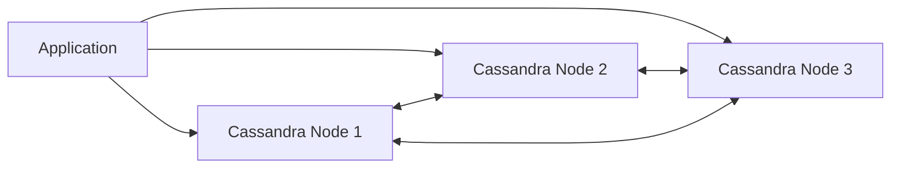

Best fit examples:

| Use Case | Why Cassandra Fits |
|---|---|
| IoT sensor data | Massive continuous writes |
| Clickstream events | Append-only events |
| Logs and audit trails | Time-based writes and reads |
| Messaging metadata | High write volume |
| User activity history | Query by user and time |

---

# 2. Mental Model

Think of Cassandra as a **distributed hash map with sorted rows inside each key**.

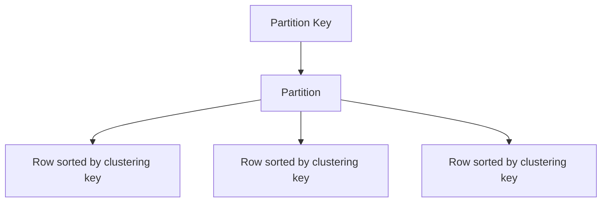

Example:

```sql
PRIMARY KEY ((user_id), event_time)
```

Visual:

```text
Partition: user_id = 101
 ├── event_time = 2026-05-01T10:00
 ├── event_time = 2026-05-01T10:01
 └── event_time = 2026-05-01T10:02
```

---

# 3. Core Terms

| Term | Meaning |
|---|---|
| Keyspace | Similar to database/schema |
| Table | Stores rows |
| Partition key | Decides which node stores data |
| Clustering column | Sorts rows inside a partition |
| Replication factor | Number of copies of data |
| Consistency level | Number of replicas that must respond |
| SSTable | Immutable on-disk data file |
| Memtable | In-memory write buffer |
| Commit log | Durable write-ahead log |

---

# 4. Cassandra vs Relational DB Thinking

## Relational DB

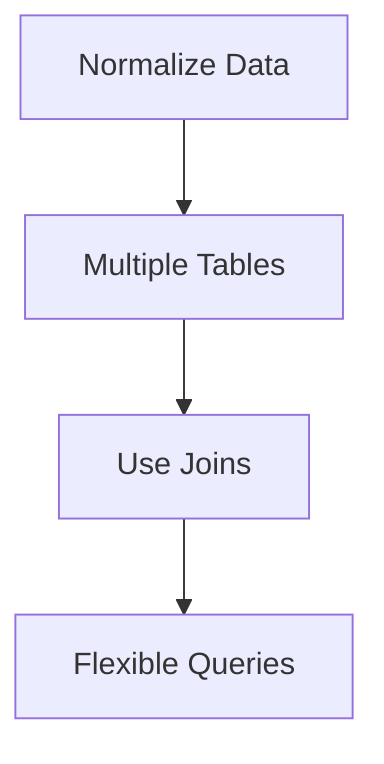

## Cassandra

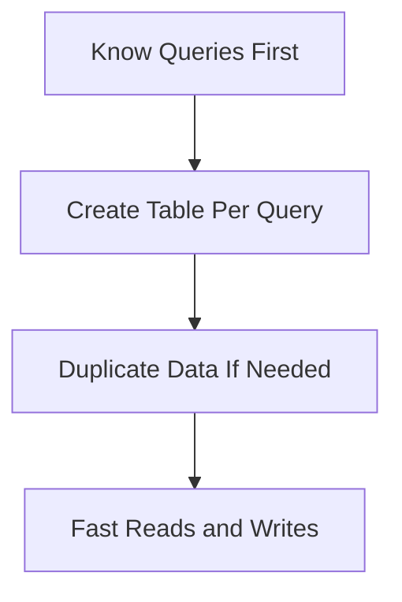

Rule:

> In Cassandra, design tables around queries, not around entities.

---

# 5. Query-First Modeling

Start with access patterns.

Example requirement:

> Get latest events for a user.

Good table:

```sql
CREATE TABLE user_events_by_user (
    user_id text,
    event_day date,
    event_time timestamp,
    event_id uuid,
    event_type text,
    payload text,
    PRIMARY KEY ((user_id, event_day), event_time, event_id)
) WITH CLUSTERING ORDER BY (event_time DESC, event_id ASC);
```

Visual:

```text
Partition key: (user_id, event_day)
Clustering:    event_time DESC, event_id ASC

Partition: user_123 + 2026-05-01
 ├── 10:03 event_login
 ├── 10:02 event_click
 └── 10:01 event_view
```

Why include `event_day`?

Because a very active user could create a giant partition if partitioned only by `user_id`.

---

# 6. Partition Key and Clustering Columns

```sql
PRIMARY KEY ((device_id, bucket_day), event_time)
```

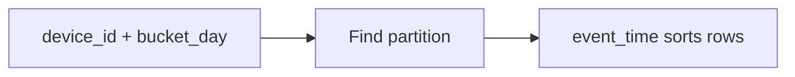

| Part | Purpose |
|---|---|
| `device_id, bucket_day` | Distributes and limits partition size |
| `event_time` | Sorts events inside partition |

---

# 7. Primary Key Visuals

## Simple Primary Key

```sql
PRIMARY KEY (id)
```

```text
id decides partition.
One row per id.
```

## Composite Partition Key

```sql
PRIMARY KEY ((user_id, day), event_time)
```

```text
(user_id + day) decides partition.
event_time sorts rows inside that partition.
```

## Full Visual

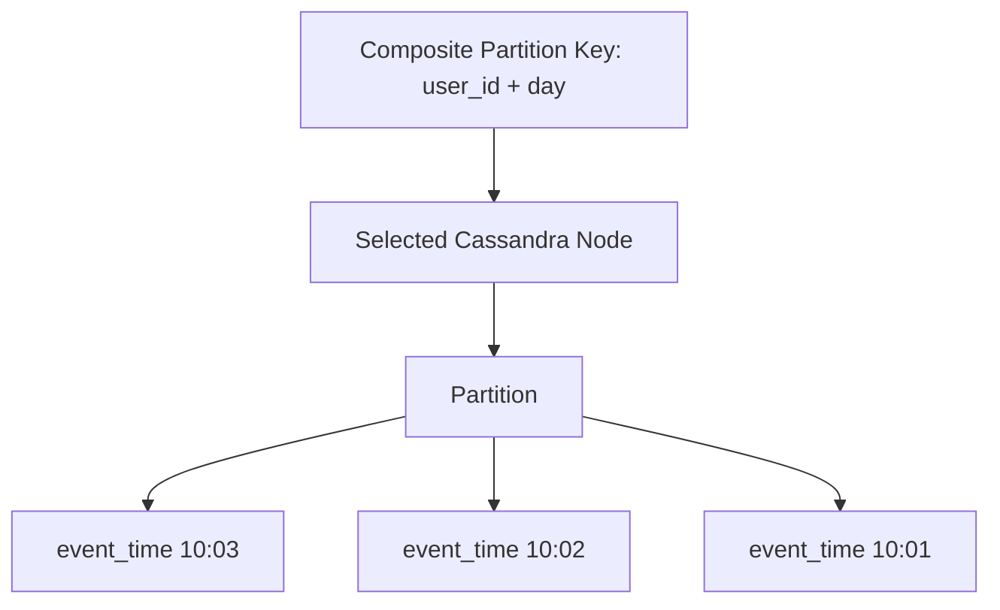

---

# 8. Good vs Bad Partitions

## Bad: Hot Partition

```sql
PRIMARY KEY ((tenant_id), event_time)
```

Problem:

```text
Tenant A has millions of events per minute.
All writes go to one logical partition.
```

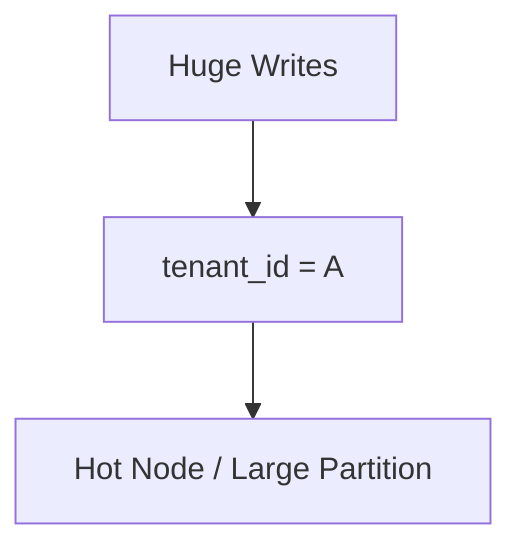

## Better: Bucketed Partition

```sql
PRIMARY KEY ((tenant_id, event_day, bucket_id), event_time)
```

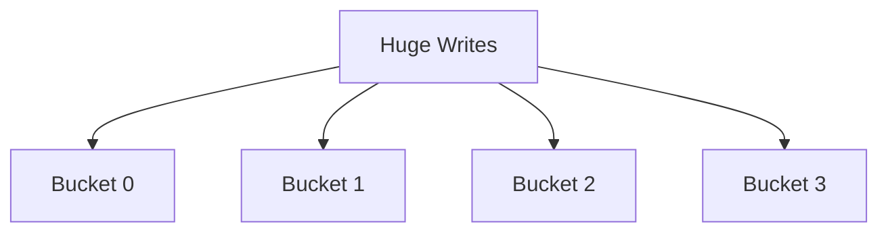

Bucket strategy example:

```java
int bucketId = Math.abs(eventId.hashCode()) % 16;
```

---

# 9. Time-Series Modeling

Common pattern:

```sql
CREATE TABLE device_events_by_day (
    device_id text,
    day date,
    event_time timestamp,
    event_id uuid,
    temperature double,
    status text,
    PRIMARY KEY ((device_id, day), event_time, event_id)
) WITH CLUSTERING ORDER BY (event_time DESC, event_id ASC);
```

Query:

```sql
SELECT * FROM device_events_by_day
WHERE device_id = 'device-1'
AND day = '2026-05-01'
LIMIT 100;
```

Visual:

```text
device-1 + 2026-05-01
 ├── 23:59 event
 ├── 23:58 event
 ├── 23:57 event
 └── ...
```

---

# 10. Spring Boot Project Setup

Maven dependencies:

```xml
<dependencies>
    <dependency>
        <groupId>org.springframework.boot</groupId>
        <artifactId>spring-boot-starter-web</artifactId>
    </dependency>

    <dependency>
        <groupId>org.springframework.boot</groupId>
        <artifactId>spring-boot-starter-data-cassandra</artifactId>
    </dependency>

    <dependency>
        <groupId>org.projectlombok</groupId>
        <artifactId>lombok</artifactId>
        <optional>true</optional>
    </dependency>
</dependencies>
```

Project structure:

```text
src/main/java/com/example/cassandra
 ├── CassandraApp.java
 ├── config/
 ├── entity/
 ├── repository/
 ├── service/
 └── controller/
```

---

# 11. Application Configuration

`application.yml`

```yaml
spring:
  cassandra:
    contact-points: localhost
    port: 9042
    keyspace-name: app_keyspace
    local-datacenter: datacenter1
    schema-action: none
```

Local Cassandra with Docker:

```bash
docker run --name cassandra-local \
  -p 9042:9042 \
  -d cassandra:latest
```

Create keyspace:

```sql
CREATE KEYSPACE app_keyspace
WITH replication = {
  'class': 'SimpleStrategy',
  'replication_factor': 1
};
```

---

# 12. Entity, Repository, Service, Controller

Flow:

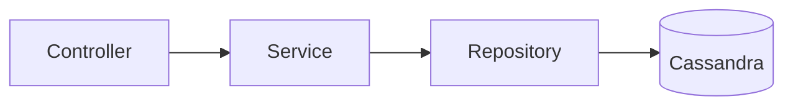

---

# 13. Basic CRUD API

## Table

```sql
CREATE TABLE user_events_by_user (
    user_id text,
    event_day date,
    event_time timestamp,
    event_id uuid,
    event_type text,
    payload text,
    PRIMARY KEY ((user_id, event_day), event_time, event_id)
) WITH CLUSTERING ORDER BY (event_time DESC, event_id ASC);
```

## Primary Key Class

```java
package com.example.cassandra.entity;

import java.io.Serializable;
import java.time.Instant;
import java.time.LocalDate;
import java.util.UUID;
import lombok.*;
import org.springframework.data.cassandra.core.cql.PrimaryKeyType;
import org.springframework.data.cassandra.core.mapping.PrimaryKeyClass;
import org.springframework.data.cassandra.core.mapping.PrimaryKeyColumn;

@Getter
@Setter
@NoArgsConstructor
@AllArgsConstructor
@EqualsAndHashCode
@PrimaryKeyClass
public class UserEventKey implements Serializable {

    @PrimaryKeyColumn(name = "user_id", type = PrimaryKeyType.PARTITIONED, ordinal = 0)
    private String userId;

    @PrimaryKeyColumn(name = "event_day", type = PrimaryKeyType.PARTITIONED, ordinal = 1)
    private LocalDate eventDay;

    @PrimaryKeyColumn(name = "event_time", type = PrimaryKeyType.CLUSTERED, ordinal = 2)
    private Instant eventTime;

    @PrimaryKeyColumn(name = "event_id", type = PrimaryKeyType.CLUSTERED, ordinal = 3)
    private UUID eventId;
}
```

## Entity

```java
package com.example.cassandra.entity;

import lombok.*;
import org.springframework.data.cassandra.core.mapping.PrimaryKey;
import org.springframework.data.cassandra.core.mapping.Table;

@Getter
@Setter
@NoArgsConstructor
@AllArgsConstructor
@Builder
@Table("user_events_by_user")
public class UserEvent {

    @PrimaryKey
    private UserEventKey key;

    private String eventType;
    private String payload;
}
```

## Repository

```java
package com.example.cassandra.repository;

import com.example.cassandra.entity.UserEvent;
import com.example.cassandra.entity.UserEventKey;
import java.time.LocalDate;
import java.util.List;
import org.springframework.data.cassandra.repository.CassandraRepository;
import org.springframework.data.cassandra.repository.Query;

public interface UserEventRepository extends CassandraRepository<UserEvent, UserEventKey> {

    @Query("SELECT * FROM user_events_by_user WHERE user_id = ?0 AND event_day = ?1 LIMIT ?2")
    List<UserEvent> findLatestEvents(String userId, LocalDate eventDay, int limit);
}
```

## Service

```java
package com.example.cassandra.service;

import com.example.cassandra.entity.UserEvent;
import com.example.cassandra.entity.UserEventKey;
import com.example.cassandra.repository.UserEventRepository;
import java.time.Instant;
import java.time.LocalDate;
import java.time.ZoneOffset;
import java.util.List;
import java.util.UUID;
import lombok.RequiredArgsConstructor;
import org.springframework.stereotype.Service;

@Service
@RequiredArgsConstructor
public class UserEventService {

    private final UserEventRepository repository;

    public UserEvent saveEvent(String userId, String eventType, String payload) {
        Instant now = Instant.now();
        LocalDate day = LocalDate.ofInstant(now, ZoneOffset.UTC);

        UserEvent event = UserEvent.builder()
            .key(new UserEventKey(userId, day, now, UUID.randomUUID()))
            .eventType(eventType)
            .payload(payload)
            .build();

        return repository.save(event);
    }

    public List<UserEvent> latest(String userId, LocalDate day, int limit) {
        return repository.findLatestEvents(userId, day, limit);
    }
}
```

## Controller

```java
package com.example.cassandra.controller;

import com.example.cassandra.entity.UserEvent;
import com.example.cassandra.service.UserEventService;
import java.time.LocalDate;
import java.util.List;
import lombok.RequiredArgsConstructor;
import org.springframework.web.bind.annotation.*;

@RestController
@RequestMapping("/users/{userId}/events")
@RequiredArgsConstructor
public class UserEventController {

    private final UserEventService service;

    @PostMapping
    public UserEvent create(
        @PathVariable String userId,
        @RequestBody CreateEventRequest request
    ) {
        return service.saveEvent(userId, request.eventType(), request.payload());
    }

    @GetMapping
    public List<UserEvent> latest(
        @PathVariable String userId,
        @RequestParam LocalDate day,
        @RequestParam(defaultValue = "100") int limit
    ) {
        return service.latest(userId, day, limit);
    }

    public record CreateEventRequest(String eventType, String payload) {}
}
```

---

# 14. Why Cassandra Handles Heavy Writes

Cassandra writes are fast because writes are mostly append operations.

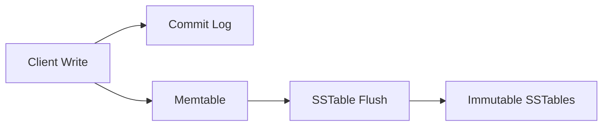

Important idea:

> Cassandra does not update rows in-place like many relational databases. It writes new data and later compacts files.

---

# 15. Write Path Visual

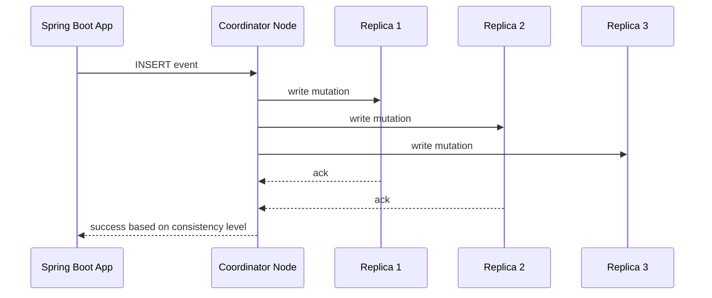

For write-heavy systems, tune:

- Partition design
- Batch size
- Consistency level
- Replication factor
- Compaction strategy
- TTL usage

---

# 16. Design Example: Event Ingestion System

## Requirement

- Ingest millions of user events
- Query latest events by user and day
- Query events by tenant and time window

## Architecture

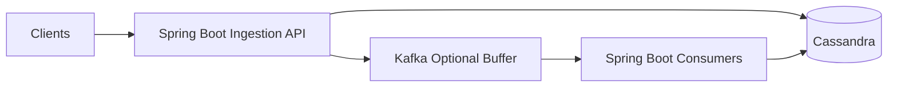

For very heavy writes, prefer Kafka between API and Cassandra.

## Table 1: User Events

```sql
CREATE TABLE user_events_by_user_day (
    user_id text,
    day date,
    event_time timestamp,
    event_id uuid,
    tenant_id text,
    event_type text,
    payload text,
    PRIMARY KEY ((user_id, day), event_time, event_id)
) WITH CLUSTERING ORDER BY (event_time DESC, event_id ASC);
```

## Table 2: Tenant Events with Buckets

```sql
CREATE TABLE tenant_events_by_day_bucket (
    tenant_id text,
    day date,
    bucket int,
    event_time timestamp,
    event_id uuid,
    user_id text,
    event_type text,
    payload text,
    PRIMARY KEY ((tenant_id, day, bucket), event_time, event_id)
) WITH CLUSTERING ORDER BY (event_time DESC, event_id ASC);
```

## Bucket Calculation

```java
public int bucketFor(UUID eventId, int bucketCount) {
    return Math.abs(eventId.hashCode()) % bucketCount;
}
```

Visual:

```text
tenant_1 + 2026-05-01
 ├── bucket 0 → events
 ├── bucket 1 → events
 ├── bucket 2 → events
 └── bucket 15 → events
```

---

# 17. Design Example: IoT Telemetry

## Requirement

- Devices send readings every second
- Query latest readings by device
- Expire old readings after 30 days

```sql
CREATE TABLE device_telemetry_by_hour (
    device_id text,
    hour_bucket text,
    reading_time timestamp,
    reading_id uuid,
    temperature double,
    humidity double,
    battery double,
    PRIMARY KEY ((device_id, hour_bucket), reading_time, reading_id)
) WITH CLUSTERING ORDER BY (reading_time DESC, reading_id ASC)
  AND default_time_to_live = 2592000;
```

`hour_bucket` example:

```text
2026-05-01-13
```

Java bucket helper:

```java
import java.time.Instant;
import java.time.ZoneOffset;
import java.time.format.DateTimeFormatter;

public class TimeBucketUtil {
    private static final DateTimeFormatter HOUR_FORMAT =
        DateTimeFormatter.ofPattern("yyyy-MM-dd-HH").withZone(ZoneOffset.UTC);

    public static String hourBucket(Instant instant) {
        return HOUR_FORMAT.format(instant);
    }
}
```

Visual:

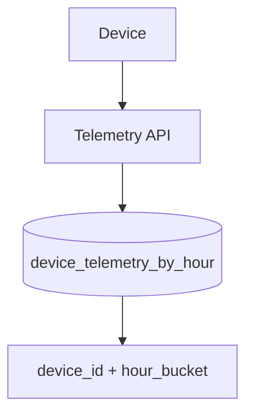

---

# 18. Design Example: User Activity Feed

## Requirement

- Show latest activity for each user
- High write volume
- Read latest 50 activities quickly

```sql
CREATE TABLE activity_feed_by_user (
    user_id text,
    feed_day date,
    activity_time timestamp,
    activity_id uuid,
    actor_id text,
    action text,
    target_id text,
    PRIMARY KEY ((user_id, feed_day), activity_time, activity_id)
) WITH CLUSTERING ORDER BY (activity_time DESC, activity_id ASC);
```

Spring repository:

```java
@Query("SELECT * FROM activity_feed_by_user WHERE user_id = ?0 AND feed_day = ?1 LIMIT ?2")
List<ActivityFeedItem> findLatest(String userId, LocalDate feedDay, int limit);
```

Write fan-out pattern:

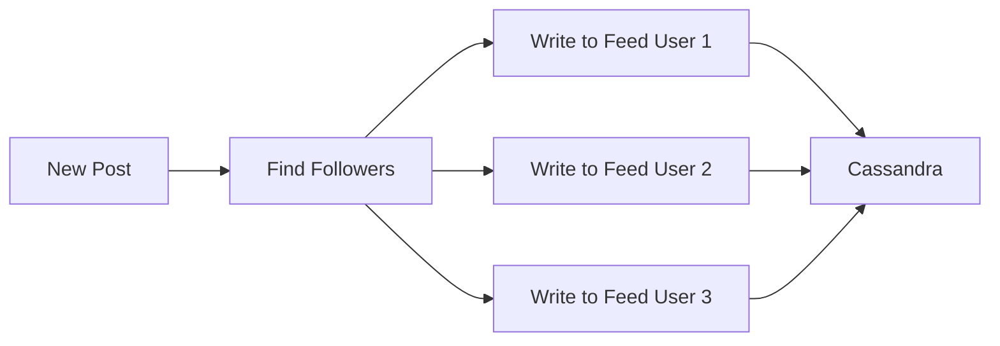

Tradeoff:

| Pattern | Write Cost | Read Cost |
|---|---:|---:|
| Fan-out on write | High | Low |
| Fan-out on read | Low | High |

For Cassandra, fan-out on write often works well when reads must be very fast.

---

# 19. Design Example: Audit Log System

## Requirement

- Store audit logs for compliance
- Query logs by tenant, actor, and date
- Retain logs for 1 year

```sql
CREATE TABLE audit_logs_by_tenant_day (
    tenant_id text,
    day date,
    bucket int,
    log_time timestamp,
    log_id uuid,
    actor_id text,
    action text,
    resource_id text,
    details text,
    PRIMARY KEY ((tenant_id, day, bucket), log_time, log_id)
) WITH CLUSTERING ORDER BY (log_time DESC, log_id ASC)
  AND default_time_to_live = 31536000;
```

Use multiple tables for multiple query patterns:

```sql
CREATE TABLE audit_logs_by_actor_day (
    actor_id text,
    day date,
    log_time timestamp,
    log_id uuid,
    tenant_id text,
    action text,
    resource_id text,
    details text,
    PRIMARY KEY ((actor_id, day), log_time, log_id)
) WITH CLUSTERING ORDER BY (log_time DESC, log_id ASC);
```

Visual:

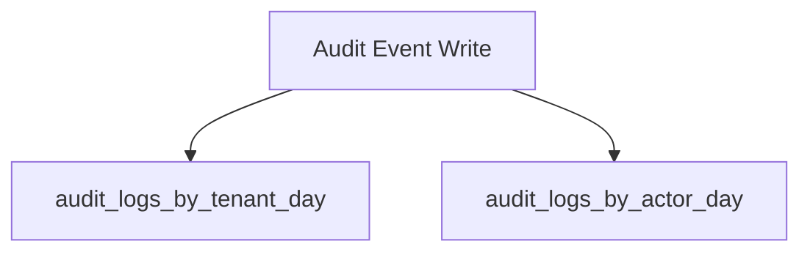

This is normal in Cassandra: duplicate writes for fast query-specific reads.

---

# 20. Consistency Levels

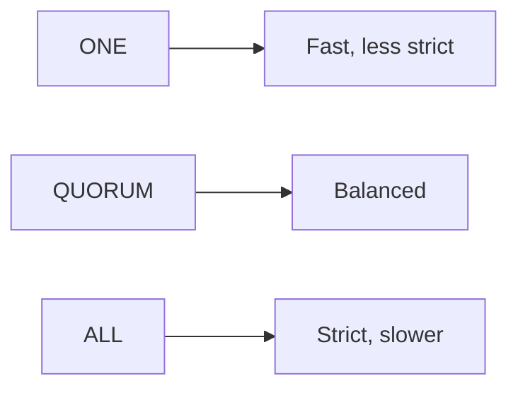

Common choices:

| Consistency | Meaning | Typical Use |
|---|---|---|
| ONE | One replica confirms | Very fast writes |
| LOCAL_QUORUM | Majority in local DC confirms | Common production default |
| ALL | All replicas confirm | Rare, strict consistency |

Example config:

```yaml
spring:
  cassandra:
    request:
      consistency: local_quorum
```

Rule of thumb:

```text
For strong-enough consistency in one datacenter:
write = LOCAL_QUORUM
read  = LOCAL_QUORUM
```

---

# 21. Replication Strategy

For production, use `NetworkTopologyStrategy`.

```sql
CREATE KEYSPACE app_keyspace
WITH replication = {
  'class': 'NetworkTopologyStrategy',
  'dc1': 3
};
```

Visual:

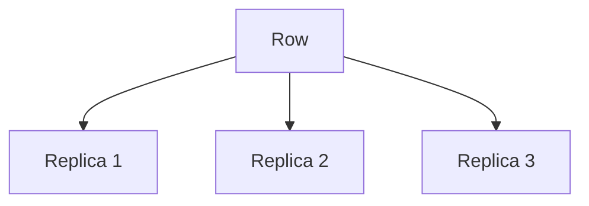

Replication factor 3 means three copies of each partition.

---

# 22. Lightweight Transactions

Cassandra supports compare-and-set with `IF NOT EXISTS` or `IF column = value`.

```sql
INSERT INTO users_by_email (email, user_id, created_at)
VALUES ('a@example.com', uuid(), toTimestamp(now()))
IF NOT EXISTS;
```

Use carefully.

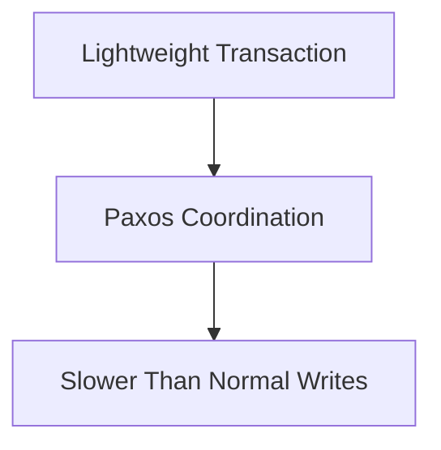

Good for:

- Unique username
- Unique email
- Idempotency key

Bad for:

- Every event write
- High-volume telemetry
- Clickstream ingestion

---

# 23. TTL and Expiring Data

TTL automatically expires data.

```sql
CREATE TABLE events_with_ttl (
    user_id text,
    day date,
    event_time timestamp,
    event_id uuid,
    payload text,
    PRIMARY KEY ((user_id, day), event_time, event_id)
) WITH default_time_to_live = 604800;
```

604800 seconds = 7 days.

Per-write TTL:

```sql
INSERT INTO events_with_ttl (user_id, day, event_time, event_id, payload)
VALUES ('u1', '2026-05-01', toTimestamp(now()), uuid(), 'hello')
USING TTL 3600;
```

Visual:


Warning:

> Heavy TTL usage creates tombstones. Monitor tombstones and compaction.

---

# 24. Batching: Good and Bad

## Bad Batch

Do not batch unrelated partitions just to make writes faster.

```sql
BEGIN BATCH
INSERT INTO events_by_user ... user_id = 'u1';
INSERT INTO events_by_user ... user_id = 'u2';
INSERT INTO events_by_user ... user_id = 'u3';
APPLY BATCH;
```

Problem:

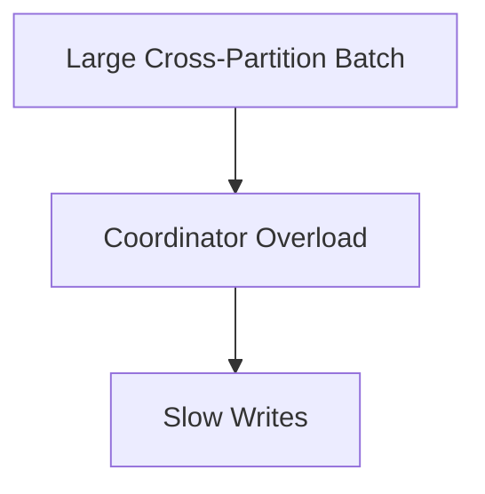

## Good Batch

Use small batches for same partition or atomic multi-table updates when truly needed.

```sql
BEGIN BATCH
INSERT INTO user_profile ...;
INSERT INTO user_profile_history ...;
APPLY BATCH;
```

Rule:

> Cassandra batches are for atomicity, not bulk loading.

---

# 25. Indexes and Materialized Views

Avoid using secondary indexes as a replacement for proper data modeling.

Bad:

```sql
CREATE INDEX ON events_by_user (event_type);
```

If `event_type` has high cardinality or huge result sets, this can perform badly.

Better:

```sql
CREATE TABLE events_by_type_day (
    event_type text,
    day date,
    event_time timestamp,
    event_id uuid,
    user_id text,
    payload text,
    PRIMARY KEY ((event_type, day), event_time, event_id)
) WITH CLUSTERING ORDER BY (event_time DESC, event_id ASC);
```

Visual:

```mermaid
flowchart LR
    Query[Need query by event_type] --> NewTable[Create table by event_type]
```

---

# 26. Pagination

Use Cassandra paging instead of large limits.

Spring Data example with `Slice`:

```java
import org.springframework.data.cassandra.core.query.CassandraPageRequest;
import org.springframework.data.domain.Slice;

public Slice<UserEvent> getFirstPage(String userId, LocalDate day) {
    CassandraPageRequest pageRequest = CassandraPageRequest.first(50);
    return repository.findByKeyUserIdAndKeyEventDay(userId, day, pageRequest);
}
```

Repository method style:

```java
Slice<UserEvent> findByKeyUserIdAndKeyEventDay(
    String userId,
    LocalDate eventDay,
    Pageable pageable
);
```

Visual:

```mermaid
flowchart LR
    Page1[Page 1: 50 rows] --> Token[Paging State]
    Token --> Page2[Page 2: next 50 rows]
```

---

# 27. Performance Checklist

## Data Model

- Query by full partition key
- Keep partitions bounded
- Use time buckets for time-series data
- Avoid unbounded partitions
- Avoid `ALLOW FILTERING`

## Writes

- Avoid large cross-partition batches
- Prefer async writes for ingestion pipelines
- Use idempotent event IDs
- Use Kafka or queue when spikes are expected

## Reads

- Read from one partition when possible
- Use limits
- Use paging
- Avoid large scans

## Operations

- Monitor tombstones
- Monitor compaction
- Watch disk usage
- Track p99 latency
- Use replication factor 3 in production

---

# 28. Production Architecture

```mermaid
flowchart TD
    Client[Clients] --> LB[Load Balancer]
    LB --> API1[Spring Boot API 1]
    LB --> API2[Spring Boot API 2]
    API1 --> Kafka[Kafka / Queue]
    API2 --> Kafka
    Kafka --> W1[Writer Worker 1]
    Kafka --> W2[Writer Worker 2]
    W1 --> C[(Cassandra Cluster)]
    W2 --> C
    C --> M[Metrics + Alerts]
```

Recommended pattern for write-heavy systems:

```text
Client → API → Queue → Writer Workers → Cassandra
```

Why:

- Absorbs traffic spikes
- Allows retries
- Gives backpressure
- Protects Cassandra from sudden overload

---

# 29. Common Mistakes

| Mistake | Better Approach |
|---|---|
| Modeling like SQL | Model by query |
| Using joins | Denormalize into query tables |
| One giant partition | Use time or hash buckets |
| Using indexes everywhere | Create query-specific tables |
| Large batches | Use async writes or bulk loader |
| `ALLOW FILTERING` | Redesign table |
| No TTL planning | Plan retention and tombstones |
| Reading huge ranges | Use pagination and buckets |

---

# 30. Quick Cheat Sheet

## Best Table Pattern for Events

```sql
CREATE TABLE events_by_owner_day (
    owner_id text,
    day date,
    event_time timestamp,
    event_id uuid,
    event_type text,
    payload text,
    PRIMARY KEY ((owner_id, day), event_time, event_id)
) WITH CLUSTERING ORDER BY (event_time DESC, event_id ASC);
```

## Best Write-Heavy Flow

```mermaid
flowchart LR
    API --> Queue
    Queue --> Workers
    Workers --> Cassandra
```

## Partition Key Rule

```text
Good partition key = distributes writes + supports query + keeps partition size bounded
```

## Avoid

```sql
SELECT * FROM table WHERE non_key_column = 'x' ALLOW FILTERING;
```

## Prefer

```sql
CREATE TABLE table_by_x (... PRIMARY KEY ((x, day), time, id));
```

---

# Appendix A: Complete Mini Example

## CQL

```sql
CREATE TABLE order_events_by_order_day (
    order_id text,
    day date,
    event_time timestamp,
    event_id uuid,
    status text,
    message text,
    PRIMARY KEY ((order_id, day), event_time, event_id)
) WITH CLUSTERING ORDER BY (event_time DESC, event_id ASC);
```

## Java Entity Key

```java
@PrimaryKeyClass
@Getter
@Setter
@NoArgsConstructor
@AllArgsConstructor
@EqualsAndHashCode
public class OrderEventKey implements Serializable {

    @PrimaryKeyColumn(name = "order_id", type = PrimaryKeyType.PARTITIONED, ordinal = 0)
    private String orderId;

    @PrimaryKeyColumn(name = "day", type = PrimaryKeyType.PARTITIONED, ordinal = 1)
    private LocalDate day;

    @PrimaryKeyColumn(name = "event_time", type = PrimaryKeyType.CLUSTERED, ordinal = 2)
    private Instant eventTime;

    @PrimaryKeyColumn(name = "event_id", type = PrimaryKeyType.CLUSTERED, ordinal = 3)
    private UUID eventId;
}
```

## Java Entity

```java
@Table("order_events_by_order_day")
@Getter
@Setter
@Builder
@NoArgsConstructor
@AllArgsConstructor
public class OrderEvent {

    @PrimaryKey
    private OrderEventKey key;

    private String status;
    private String message;
}
```

## Repository

```java
public interface OrderEventRepository extends CassandraRepository<OrderEvent, OrderEventKey> {

    @Query("SELECT * FROM order_events_by_order_day WHERE order_id = ?0 AND day = ?1 LIMIT ?2")
    List<OrderEvent> latestForOrder(String orderId, LocalDate day, int limit);
}
```

## Service

```java
@Service
@RequiredArgsConstructor
public class OrderEventService {

    private final OrderEventRepository repository;

    public OrderEvent addEvent(String orderId, String status, String message) {
        Instant now = Instant.now();
        LocalDate day = LocalDate.ofInstant(now, ZoneOffset.UTC);

        OrderEvent event = OrderEvent.builder()
            .key(new OrderEventKey(orderId, day, now, UUID.randomUUID()))
            .status(status)
            .message(message)
            .build();

        return repository.save(event);
    }
}
```

## Visual Request Flow

```mermaid
sequenceDiagram
    participant Client
    participant Controller
    participant Service
    participant Repository
    participant Cassandra

    Client->>Controller: POST /orders/123/events
    Controller->>Service: addEvent(...)
    Service->>Repository: save(event)
    Repository->>Cassandra: INSERT row
    Cassandra-->>Repository: ack
    Repository-->>Service: saved entity
    Service-->>Controller: response
    Controller-->>Client: 200 OK
```

---

# Appendix B: Write-Heavy Design Decision Tree

```mermaid
flowchart TD
    Start[Need to store events?] --> Query[What is the read query?]
    Query --> ByUser[By user/time]
    Query --> ByTenant[By tenant/time]
    Query --> ByDevice[By device/time]

    ByUser --> UserTable[Partition: user_id + day]
    ByTenant --> TenantVolume{Very high tenant volume?}
    TenantVolume -->|Yes| TenantBucket[Partition: tenant_id + day + bucket]
    TenantVolume -->|No| TenantDay[Partition: tenant_id + day]
    ByDevice --> DeviceTable[Partition: device_id + hour/day]

    UserTable --> TTL{Need retention?}
    TenantBucket --> TTL
    TenantDay --> TTL
    DeviceTable --> TTL
    TTL -->|Yes| UseTTL[Use TTL carefully]
    TTL -->|No| NoTTL[No TTL]
```

---

# Appendix C: Best Practices Summary

```text
1. Start with queries.
2. Create table per query.
3. Choose partition keys that distribute writes.
4. Use clustering columns for ordering.
5. Bucket high-volume time-series data.
6. Avoid ALLOW FILTERING.
7. Avoid large cross-partition batches.
8. Use TTL only with tombstone awareness.
9. Use LOCAL_QUORUM for balanced production consistency.
10. Put Kafka/queue before Cassandra for serious write-heavy systems.
```
