# Elasticsearch + Spring Boot Visual Reference

Visual-first, chapter-wise guide from basics to advanced topics, with compact Java/Spring Boot examples for product search and geo-spatial search.

> Current reference notes: Elasticsearch is a distributed search and analytics engine built on Lucene, optimized for near real-time search and analytics.[^elastic-ref] The official Elasticsearch Java API Client provides strongly typed requests/responses and currently documents Java 17+ as a requirement.[^java-client] Spring Data Elasticsearch provides repositories and higher-level operations over Elasticsearch clients.[^spring-data]

[^elastic-ref]: https://www.elastic.co/docs/reference/elasticsearch
[^java-client]: https://www.elastic.co/docs/reference/elasticsearch/clients/java/getting-started
[^spring-data]: https://docs.spring.io/spring-data/elasticsearch/reference/index.html

---

## Table of Contents

1. Mental Model
2. Setup with Docker + Spring Boot
3. Index, Document, Mapping
4. Spring Boot Project Structure
5. Product Document Model
6. Repository Basics
7. CRUD APIs
8. Search Basics
9. Product Search: Filters, Sorting, Pagination
10. Relevance: Boosting, Fuzziness, Highlighting
11. Geo-Spatial Search
12. Aggregations
13. Autocomplete / Search Suggestions
14. Advanced Query DSL
15. Performance and Production Tips
16. Testing
17. Common Mistakes
18. Mini Cheat Sheet

---

# 1. Mental Model

## Elasticsearch in one picture

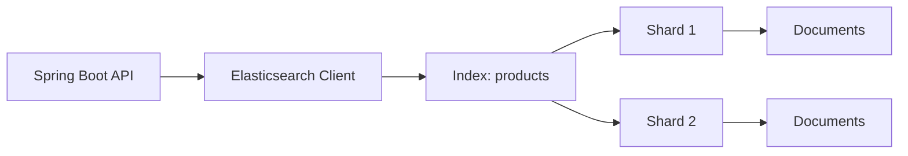

## Core vocabulary

| Term | Visual meaning | Example |
|---|---|---|
| Cluster | Whole ES system | `localhost:9200` |
| Index | Table-like collection | `products` |
| Document | JSON row | one product |
| Field | JSON property | `name`, `price` |
| Mapping | Schema rules | `price: double` |
| Query DSL | JSON search language | `match`, `bool`, `geo_distance` |
| Analyzer | Text tokenizer | lowercase, stemming |

## SQL vs Elasticsearch

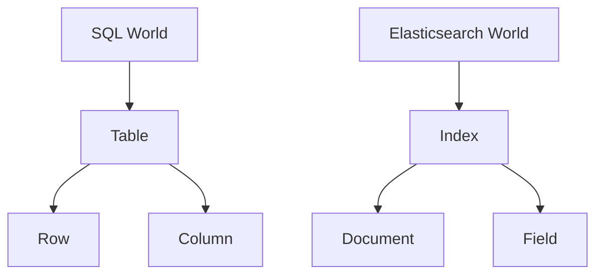

---

# 2. Setup with Docker + Spring Boot

## Docker Compose

```yaml
services:
  elasticsearch:
    image: docker.elastic.co/elasticsearch/elasticsearch:9.3.0
    container_name: es-dev
    environment:
      - discovery.type=single-node
      - xpack.security.enabled=false
      - ES_JAVA_OPTS=-Xms1g -Xmx1g
    ports:
      - "9200:9200"
```

Run:

```bash
docker compose up -d
curl http://localhost:9200
```

## Gradle dependencies

```gradle
dependencies {
    implementation 'org.springframework.boot:spring-boot-starter-web'
    implementation 'org.springframework.boot:spring-boot-starter-data-elasticsearch'
    implementation 'co.elastic.clients:elasticsearch-java:9.3.0'
    compileOnly 'org.projectlombok:lombok'
    annotationProcessor 'org.projectlombok:lombok'
}
```

## application.yml

```yaml
spring:
  elasticsearch:
    uris: http://localhost:9200
```

---

# 3. Index, Document, Mapping

## Product JSON document

```json
{
  "id": "p100",
  "name": "iPhone 15 Pro Max",
  "brand": "Apple",
  "category": "phones",
  "description": "Titanium smartphone with pro camera",
  "price": 1199.99,
  "rating": 4.8,
  "inStock": true,
  "location": { "lat": 40.7128, "lon": -74.0060 }
}
```

## Mapping idea

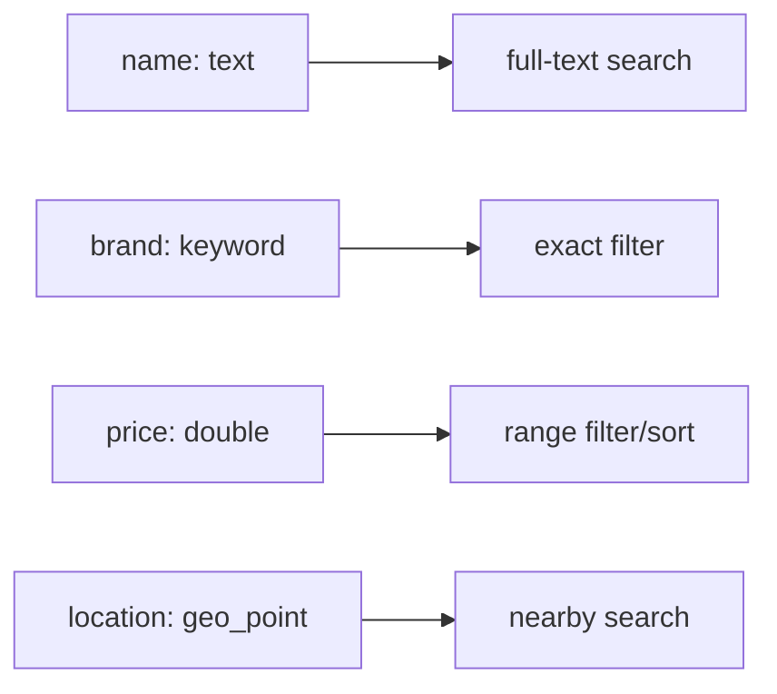

Elasticsearch supports `geo_point` for latitude/longitude pairs and `geo_shape` for shapes such as polygons and lines.[^geo]

[^geo]: https://www.elastic.co/docs/reference/query-languages/query-dsl/geo-queries

---

# 4. Spring Boot Project Structure

```text
src/main/java/com/example/search
 ├── SearchApplication.java
 ├── config/
 │    └── ElasticsearchConfig.java
 ├── product/
 │    ├── ProductDocument.java
 │    ├── ProductRepository.java
 │    ├── ProductService.java
 │    └── ProductController.java
 └── dto/
      ├── ProductSearchRequest.java
      └── GeoSearchRequest.java
```

---

# 5. Product Document Model

```java
package com.example.search.product;

import lombok.*;
import org.springframework.data.annotation.Id;
import org.springframework.data.elasticsearch.annotations.*;
import org.springframework.data.elasticsearch.core.geo.GeoPoint;

@Data
@Builder
@NoArgsConstructor
@AllArgsConstructor
@Document(indexName = "products")
public class ProductDocument {

    @Id
    private String id;

    @MultiField(
        mainField = @Field(type = FieldType.Text, analyzer = "standard"),
        otherFields = @InnerField(suffix = "keyword", type = FieldType.Keyword)
    )
    private String name;

    @Field(type = FieldType.Keyword)
    private String brand;

    @Field(type = FieldType.Keyword)
    private String category;

    @Field(type = FieldType.Text)
    private String description;

    @Field(type = FieldType.Double)
    private Double price;

    @Field(type = FieldType.Double)
    private Double rating;

    @Field(type = FieldType.Boolean)
    private Boolean inStock;

    @GeoPointField
    private GeoPoint location;
}
```

---

# 6. Repository Basics

```java
package com.example.search.product;

import org.springframework.data.elasticsearch.repository.ElasticsearchRepository;
import java.util.List;

public interface ProductRepository extends ElasticsearchRepository<ProductDocument, String> {
    List<ProductDocument> findByBrand(String brand);
    List<ProductDocument> findByCategoryAndInStock(String category, Boolean inStock);
}
```

## Repository flow

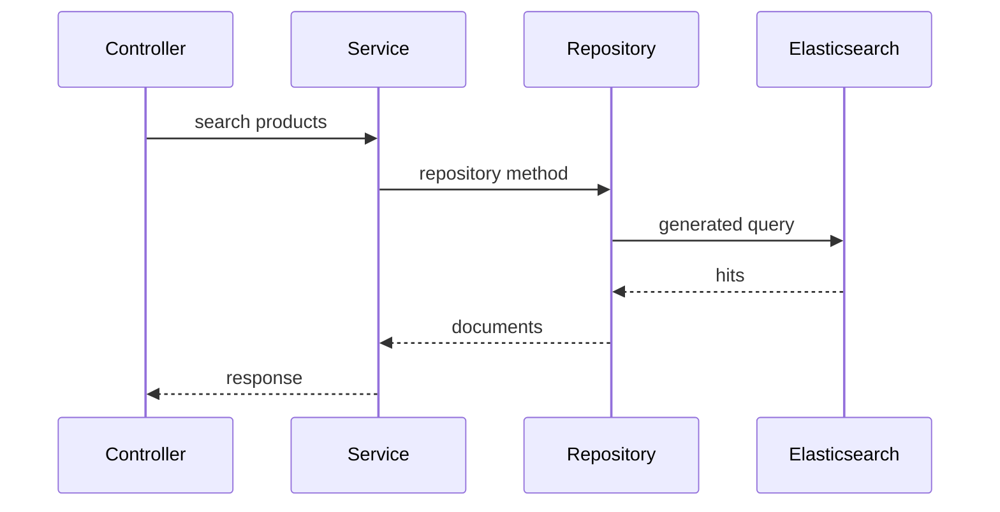

---

# 7. CRUD APIs

```java
@RestController
@RequestMapping("/api/products")
@RequiredArgsConstructor
public class ProductController {

    private final ProductRepository repository;

    @PostMapping
    public ProductDocument save(@RequestBody ProductDocument product) {
        return repository.save(product);
    }

    @GetMapping("/{id}")
    public ProductDocument get(@PathVariable String id) {
        return repository.findById(id)
                .orElseThrow(() -> new RuntimeException("Product not found"));
    }

    @DeleteMapping("/{id}")
    public void delete(@PathVariable String id) {
        repository.deleteById(id);
    }
}
```

---

# 8. Search Basics

## Match vs Term

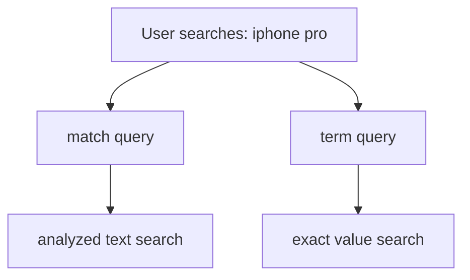

Use:

| Need | Query |
|---|---|
| Search product name | `match` |
| Filter category | `term` |
| Price between 100 and 500 | `range` |
| Combine many rules | `bool` |

Elasticsearch Query DSL is a JSON-style language for complex searching, filtering, and aggregations.[^query-dsl]

[^query-dsl]: https://www.elastic.co/docs/explore-analyze/query-filter/languages/querydsl

---

# 9. Product Search: Filters, Sorting, Pagination

## Request DTO

```java
@Data
public class ProductSearchRequest {
    private String q;
    private String brand;
    private String category;
    private Double minPrice;
    private Double maxPrice;
    private Boolean inStock;
    private int page = 0;
    private int size = 10;
    private String sortBy = "rating";
    private String sortDirection = "desc";
}
```

## Visual product search query

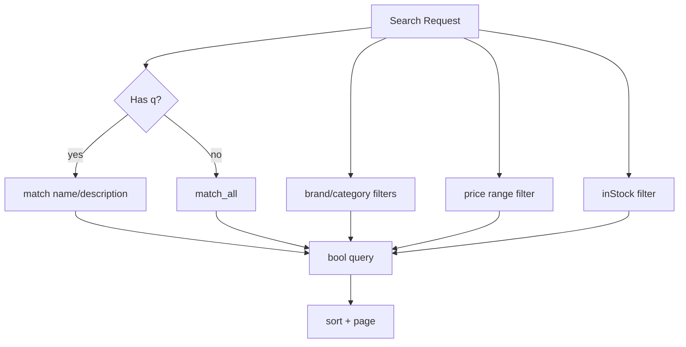

## Service using ElasticsearchOperations

```java
@Service
@RequiredArgsConstructor
public class ProductService {

    private final ElasticsearchOperations operations;

    public SearchPage<ProductDocument> search(ProductSearchRequest req) {
        Criteria criteria = new Criteria();

        if (req.getQ() != null && !req.getQ().isBlank()) {
            criteria = new Criteria("name").matches(req.getQ())
                    .or(new Criteria("description").matches(req.getQ()));
        }

        if (req.getBrand() != null) {
            criteria = criteria.and(new Criteria("brand").is(req.getBrand()));
        }

        if (req.getCategory() != null) {
            criteria = criteria.and(new Criteria("category").is(req.getCategory()));
        }

        if (req.getMinPrice() != null || req.getMaxPrice() != null) {
            Criteria price = new Criteria("price");
            if (req.getMinPrice() != null) price = price.greaterThanEqual(req.getMinPrice());
            if (req.getMaxPrice() != null) price = price.lessThanEqual(req.getMaxPrice());
            criteria = criteria.and(price);
        }

        if (req.getInStock() != null) {
            criteria = criteria.and(new Criteria("inStock").is(req.getInStock()));
        }

        Sort sort = Sort.by(
            "desc".equalsIgnoreCase(req.getSortDirection())
                ? Sort.Direction.DESC
                : Sort.Direction.ASC,
            req.getSortBy()
        );

        Pageable pageable = PageRequest.of(req.getPage(), req.getSize(), sort);
        Query query = new CriteriaQuery(criteria).setPageable(pageable);

        SearchHits<ProductDocument> hits = operations.search(query, ProductDocument.class);
        return SearchHitSupport.searchPageFor(hits, pageable);
    }
}
```

## Controller endpoint

```java
@PostMapping("/search")
public SearchPage<ProductDocument> search(@RequestBody ProductSearchRequest request) {
    return productService.search(request);
}
```

---

# 10. Relevance: Boosting, Fuzziness, Highlighting

## Relevance scoring picture

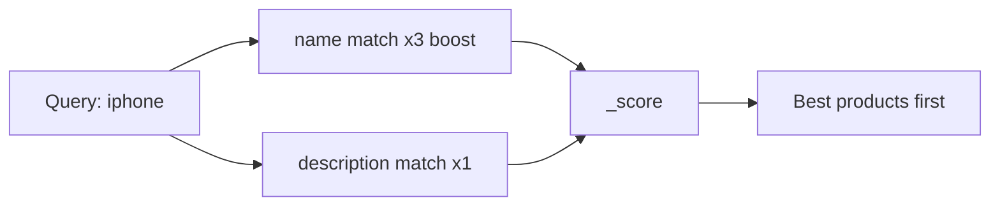

## Native query example

```java
NativeQuery query = NativeQuery.builder()
    .withQuery(q -> q.bool(b -> b
        .should(s -> s.match(m -> m
            .field("name")
            .query("iphone")
            .boost(3.0f)))
        .should(s -> s.match(m -> m
            .field("description")
            .query("iphone")))
    ))
    .build();

SearchHits<ProductDocument> hits = operations.search(query, ProductDocument.class);
```

## Fuzzy search

```java
NativeQuery query = NativeQuery.builder()
    .withQuery(q -> q.match(m -> m
        .field("name")
        .query("iphnoe")
        .fuzziness("AUTO")
    ))
    .build();
```

---

# 11. Geo-Spatial Search

Elasticsearch `geo_distance` finds documents within a distance from a central point.[^geo-distance]

[^geo-distance]: https://www.elastic.co/docs/reference/query-languages/query-dsl/query-dsl-geo-distance-query

## Location model

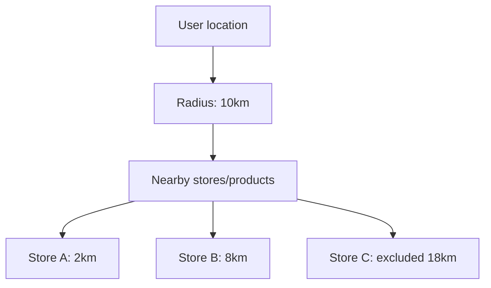

## Geo request DTO

```java
@Data
public class GeoSearchRequest {
    private double lat;
    private double lon;
    private String distance = "10km";
    private String q;
    private int page = 0;
    private int size = 10;
}
```

## Geo query with Java API style

```java
public SearchHits<ProductDocument> nearbyProducts(GeoSearchRequest req) {
    NativeQuery query = NativeQuery.builder()
        .withQuery(q -> q.bool(b -> {
            if (req.getQ() != null && !req.getQ().isBlank()) {
                b.must(m -> m.match(mm -> mm
                    .field("name")
                    .query(req.getQ())
                ));
            }

            b.filter(f -> f.geoDistance(g -> g
                .field("location")
                .distance(req.getDistance())
                .location(l -> l.latlon(ll -> ll
                    .lat(req.getLat())
                    .lon(req.getLon())
                ))
            ));

            return b;
        }))
        .withPageable(PageRequest.of(req.getPage(), req.getSize()))
        .build();

    return operations.search(query, ProductDocument.class);
}
```

## Geo controller

```java
@PostMapping("/nearby")
public SearchHits<ProductDocument> nearby(@RequestBody GeoSearchRequest request) {
    return productService.nearbyProducts(request);
}
```

## Example request

```json
{
  "lat": 40.7128,
  "lon": -74.0060,
  "distance": "5km",
  "q": "iphone"
}
```

---

# 12. Aggregations

## Aggregation mental model

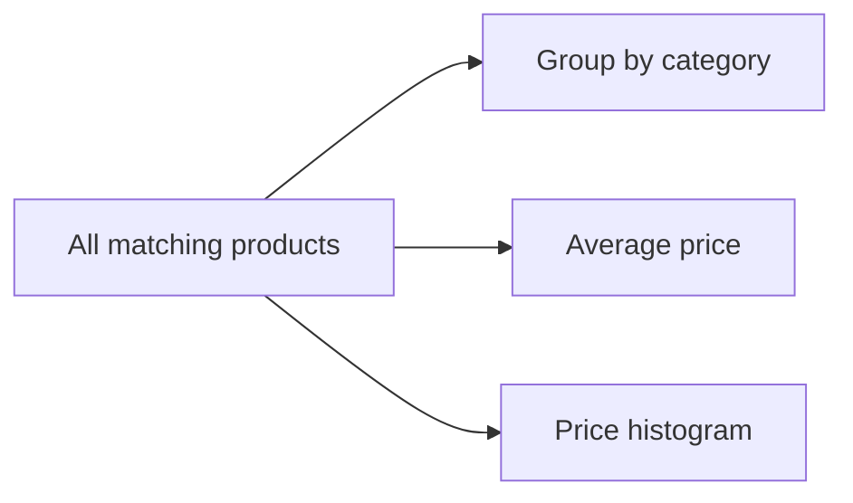

## Use cases

| Need | Aggregation |
|---|---|
| Count by brand | terms aggregation |
| Average rating | avg aggregation |
| Price buckets | histogram/range aggregation |
| Products per area | geo grid aggregation |

## Example: count by category

```java
NativeQuery query = NativeQuery.builder()
    .withQuery(q -> q.matchAll(m -> m))
    .withAggregation("categories", a -> a
        .terms(t -> t.field("category"))
    )
    .build();

SearchHits<ProductDocument> hits = operations.search(query, ProductDocument.class);
```

---

# 13. Autocomplete / Search Suggestions

## Visual flow

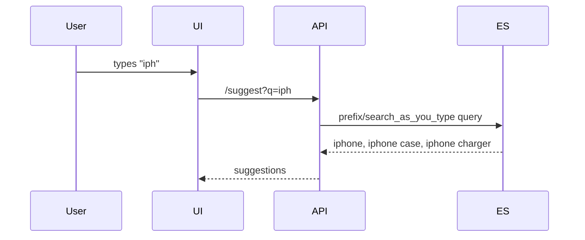

## Simple prefix query

```java
NativeQuery query = NativeQuery.builder()
    .withQuery(q -> q.prefix(p -> p
        .field("name.keyword")
        .value("iph")
    ))
    .withPageable(PageRequest.of(0, 5))
    .build();
```

For better production autocomplete, consider `search_as_you_type`, edge n-grams, or completion suggester.

---

# 14. Advanced Query DSL

## Bool query visual

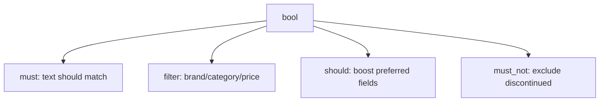

Elasticsearch bool queries combine clauses such as `must`, `filter`, `should`, and `must_not`.[^bool]

[^bool]: https://www.elastic.co/docs/reference/query-languages/query-dsl/query-dsl-bool-query

## Example: advanced product search

```java
NativeQuery query = NativeQuery.builder()
    .withQuery(q -> q.bool(b -> b
        .must(m -> m.multiMatch(mm -> mm
            .query("wireless headphones")
            .fields("name^3", "description", "brand^2")
        ))
        .filter(f -> f.term(t -> t.field("category").value("audio")))
        .filter(f -> f.range(r -> r
            .number(n -> n.field("price").gte(50.0).lte(300.0))
        ))
        .mustNot(n -> n.term(t -> t.field("inStock").value(false)))
    ))
    .withPageable(PageRequest.of(0, 20, Sort.by("rating").descending()))
    .build();
```

## Search template idea

Search templates let you store parameterized searches and run them with different variables, which helps avoid exposing raw query syntax to users.[^templates]

[^templates]: https://www.elastic.co/docs/solutions/search/search-templates

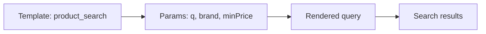

---

# 15. Performance and Production Tips

## Query cost picture

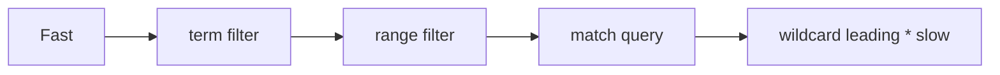

## Checklist

| Topic | Rule of thumb |
|---|---|
| Exact filtering | Use `keyword` fields |
| Full text | Use `text` fields |
| Sorting | Sort on `keyword`, numeric, date, not analyzed text |
| Pagination | Avoid deep `from/size`; use `search_after` for deep pages |
| Bulk indexing | Use bulk APIs for large imports |
| Mapping | Define explicit mappings for important fields |
| Geo | Use `geo_point` for lat/lon distance search |
| Security | Enable auth/TLS in non-local environments |

## Bulk indexing example

```java
public void saveMany(List<ProductDocument> products) {
    repository.saveAll(products);
}
```

---

# 16. Testing

## Integration test idea

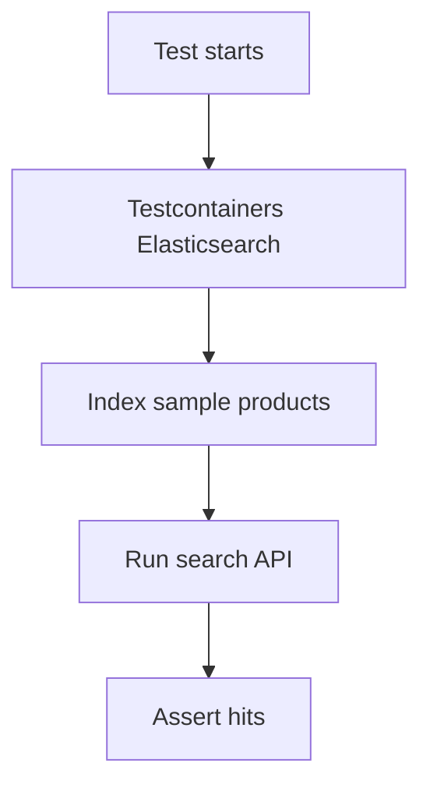

## Simple test skeleton

```java
@SpringBootTest
class ProductSearchTest {

    @Autowired ProductRepository repository;
    @Autowired ProductService service;

    @BeforeEach
    void setup() {
        repository.deleteAll();
        repository.save(ProductDocument.builder()
            .id("1")
            .name("iPhone 15")
            .brand("Apple")
            .category("phones")
            .price(999.0)
            .rating(4.8)
            .inStock(true)
            .location(new GeoPoint(40.7128, -74.0060))
            .build());
    }

    @Test
    void shouldFindProductByName() {
        ProductSearchRequest req = new ProductSearchRequest();
        req.setQ("iphone");

        SearchPage<ProductDocument> result = service.search(req);
        assertThat(result.getTotalElements()).isGreaterThan(0);
    }
}
```

---

# 17. Common Mistakes

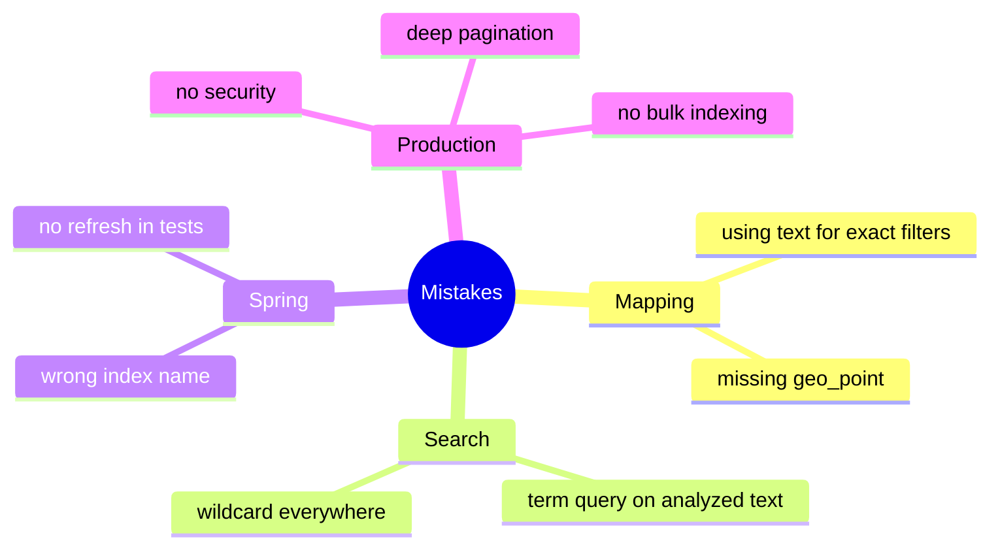

## Quick fixes

| Problem | Fix |
|---|---|
| Brand filter returns nothing | Use `brand` as `keyword` |
| Geo search fails | Ensure field is `geo_point` |
| Sorting by name fails | Sort by `name.keyword` |
| Search typo not found | Add fuzziness |
| Slow imports | Use bulk indexing |

---

# 18. Mini Cheat Sheet

## Query choice

```text
match       -> full-text search
term        -> exact filter
range       -> numbers/dates
bool        -> combine queries
geo_distance -> nearby search
multi_match -> search many fields
aggregation -> analytics/facets
```

## Product search endpoint examples

### Basic search

```http
POST /api/products/search
Content-Type: application/json

{
  "q": "iphone",
  "page": 0,
  "size": 10
}
```

### Filtered search

```http
POST /api/products/search
Content-Type: application/json

{
  "q": "headphones",
  "brand": "Sony",
  "category": "audio",
  "minPrice": 50,
  "maxPrice": 300,
  "inStock": true,
  "sortBy": "rating",
  "sortDirection": "desc"
}
```

### Geo search

```http
POST /api/products/nearby
Content-Type: application/json

{
  "lat": 40.7128,
  "lon": -74.0060,
  "distance": "10km",
  "q": "laptop"
}
```

---

# Recommended Learning Path

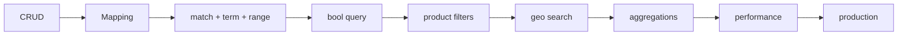

## Practice tasks

1. Create `products` index and save 20 sample products.
2. Add filters: brand, category, price, stock.
3. Add sorting by price and rating.
4. Add fuzzy search for typo tolerance.
5. Add geo search using `geo_point`.
6. Add category counts using aggregations.
7. Add autocomplete endpoint.
8. Add integration tests.

---

## Final Architecture

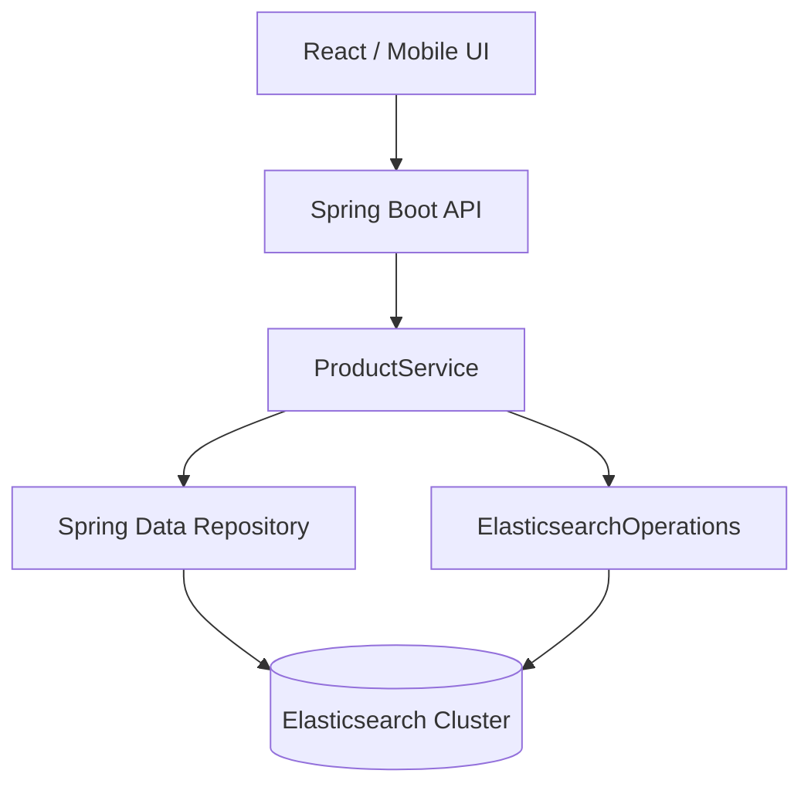

