# GraphQL + Spring Boot: Visual Reference for a Social Media Friends Network

> Goal: learn GraphQL with Spring Boot visually, step by step, from basics to advanced use cases.
>
> Example domain: **People, profiles, posts, follows, friendships, friend requests, feeds**.

---

## Clickable Index

### Basics
1. [What is GraphQL?](#1-what-is-graphql)
2. [GraphQL vs REST: visual idea](#2-graphql-vs-rest-visual-idea)
3. [Core building blocks](#3-core-building-blocks)
4. [Spring Boot project setup](#4-spring-boot-project-setup)
5. [Folder structure](#5-folder-structure)

### Step-by-step Social Network API
6. [Step 1: database model](#6-step-1-database-model)
7. [Step 2: JPA entities](#7-step-2-jpa-entities)
8. [Step 3: GraphQL schema](#8-step-3-graphql-schema)
9. [Step 4: repositories](#9-step-4-repositories)
10. [Step 5: query resolvers](#10-step-5-query-resolvers)
11. [Step 6: mutations](#11-step-6-mutations)
12. [Step 7: nested fields](#12-step-7-nested-fields)
13. [Step 8: run example queries](#13-step-8-run-example-queries)

### Intermediate
14. [Pagination for friends and posts](#14-pagination-for-friends-and-posts)
15. [Friend request workflow](#15-friend-request-workflow)
16. [Timeline/feed use case](#16-timelinefeed-use-case)
17. [Avoiding N+1 queries with DataLoader](#17-avoiding-n1-queries-with-dataloader)
18. [Validation and errors](#18-validation-and-errors)

### Advanced
19. [Security with Spring Security](#19-security-with-spring-security)
20. [Authorization rules](#20-authorization-rules)
21. [Subscriptions for real-time notifications](#21-subscriptions-for-real-time-notifications)
22. [Caching strategy](#22-caching-strategy)
23. [Scaling read-heavy and write-heavy use cases](#23-scaling-read-heavy-and-write-heavy-use-cases)
24. [Advanced architecture diagram](#24-advanced-architecture-diagram)
25. [Practice roadmap](#25-practice-roadmap)
26. [Quick cheat sheet](#26-quick-cheat-sheet)
27. [References](#27-references)

---

# 1. What is GraphQL?

GraphQL is an API query language. The client asks for **exactly the fields it wants**.

```graphql
query {
  person(id: 1) {
    id
    username
    friends {
      username
    }
  }
}
```

Visual idea:

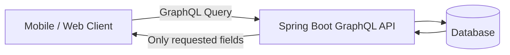

---

# 2. GraphQL vs REST: visual idea

## REST

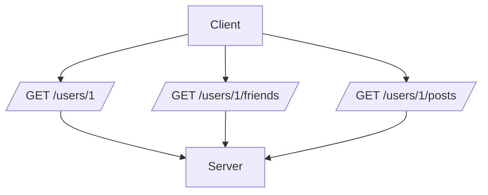

## GraphQL

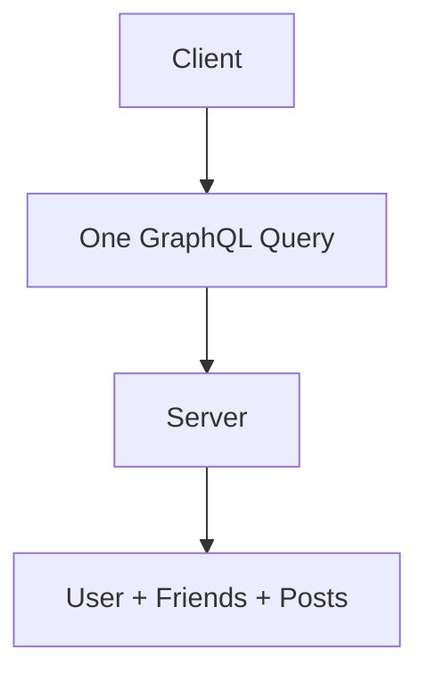

GraphQL is not a database. It is usually an API layer in front of your database, services, caches, or other APIs.

---

# 3. Core building blocks

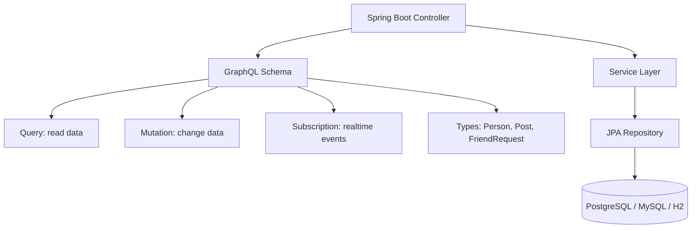

| GraphQL word | Meaning | Social network example |
|---|---|---|
| Type | Data shape | `Person`, `Post` |
| Query | Read operation | `person(id)` |
| Mutation | Write operation | `sendFriendRequest` |
| Resolver | Java method that returns data | `personById()` |
| Nested field | Field inside another type | `person.friends` |
| Subscription | Live updates | new friend request notification |

---

# 4. Spring Boot project setup

Use Spring Initializr or your IDE.

Recommended dependencies:

```xml
<!-- pom.xml -->
<dependencies>
    <dependency>
        <groupId>org.springframework.boot</groupId>
        <artifactId>spring-boot-starter-graphql</artifactId>
    </dependency>

    <dependency>
        <groupId>org.springframework.boot</groupId>
        <artifactId>spring-boot-starter-web</artifactId>
    </dependency>

    <dependency>
        <groupId>org.springframework.boot</groupId>
        <artifactId>spring-boot-starter-data-jpa</artifactId>
    </dependency>

    <dependency>
        <groupId>com.h2database</groupId>
        <artifactId>h2</artifactId>
        <scope>runtime</scope>
    </dependency>

    <dependency>
        <groupId>org.projectlombok</groupId>
        <artifactId>lombok</artifactId>
        <optional>true</optional>
    </dependency>
</dependencies>
```

Minimal config:

```properties
# src/main/resources/application.properties
spring.h2.console.enabled=true
spring.datasource.url=jdbc:h2:mem:socialdb
spring.jpa.hibernate.ddl-auto=create-drop
spring.jpa.show-sql=true
spring.graphql.graphiql.enabled=true
```

Open GraphiQL after starting the app:

```text
http://localhost:8080/graphiql
```

---

# 5. Folder structure

```text
src/main/java/com/example/social
├── SocialNetworkApplication.java
├── entity
│   ├── Person.java
│   ├── Post.java
│   └── FriendRequest.java
├── repository
│   ├── PersonRepository.java
│   ├── PostRepository.java
│   └── FriendRequestRepository.java
├── service
│   └── SocialService.java
└── graphql
    ├── QueryController.java
    ├── MutationController.java
    └── PersonFieldController.java

src/main/resources/graphql
└── schema.graphqls
```

---

# 6. Step 1: database model

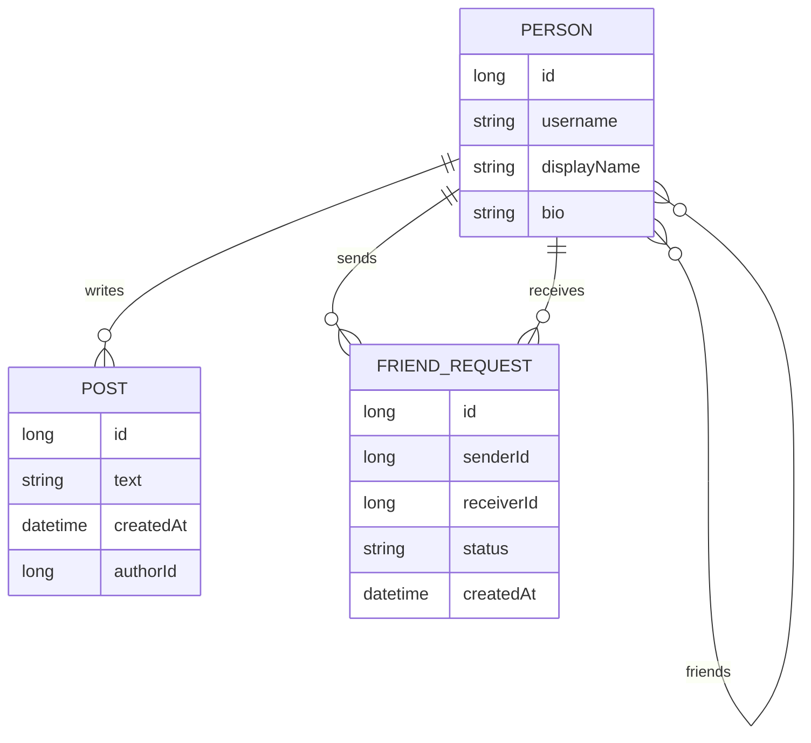

Simple relationship rules:

```text
Person writes many posts.
Person can send many friend requests.
Person can receive many friend requests.
Person can have many friends.
```

---

# 7. Step 2: JPA entities

## Person

```java
package com.example.social.entity;

import jakarta.persistence.*;
import lombok.*;
import java.util.*;

@Entity
@Getter @Setter
@NoArgsConstructor
@AllArgsConstructor
@Builder
public class Person {
    @Id
    @GeneratedValue(strategy = GenerationType.IDENTITY)
    private Long id;

    @Column(unique = true, nullable = false)
    private String username;

    private String displayName;
    private String bio;

    @ManyToMany
    @JoinTable(
        name = "person_friend",
        joinColumns = @JoinColumn(name = "person_id"),
        inverseJoinColumns = @JoinColumn(name = "friend_id")
    )
    private Set<Person> friends = new HashSet<>();
}
```

## Post

```java
package com.example.social.entity;

import jakarta.persistence.*;
import lombok.*;
import java.time.Instant;

@Entity
@Getter @Setter
@NoArgsConstructor
@AllArgsConstructor
@Builder
public class Post {
    @Id
    @GeneratedValue(strategy = GenerationType.IDENTITY)
    private Long id;

    private String text;
    private Instant createdAt;

    @ManyToOne(fetch = FetchType.LAZY)
    private Person author;
}
```

## FriendRequest

```java
package com.example.social.entity;

import jakarta.persistence.*;
import lombok.*;
import java.time.Instant;

@Entity
@Getter @Setter
@NoArgsConstructor
@AllArgsConstructor
@Builder
public class FriendRequest {
    @Id
    @GeneratedValue(strategy = GenerationType.IDENTITY)
    private Long id;

    @ManyToOne(fetch = FetchType.LAZY)
    private Person sender;

    @ManyToOne(fetch = FetchType.LAZY)
    private Person receiver;

    @Enumerated(EnumType.STRING)
    private Status status;

    private Instant createdAt;

    public enum Status {
        PENDING, ACCEPTED, REJECTED
    }
}
```

---

# 8. Step 3: GraphQL schema

Create:

```text
src/main/resources/graphql/schema.graphqls
```

```graphql
type Query {
  people: [Person!]!
  person(id: ID!): Person
  postsByPerson(personId: ID!): [Post!]!
  feed(personId: ID!, limit: Int = 20): [Post!]!
}

type Mutation {
  createPerson(input: CreatePersonInput!): Person!
  createPost(input: CreatePostInput!): Post!
  sendFriendRequest(senderId: ID!, receiverId: ID!): FriendRequest!
  acceptFriendRequest(requestId: ID!): FriendRequest!
}

type Person {
  id: ID!
  username: String!
  displayName: String
  bio: String
  friends: [Person!]!
  posts: [Post!]!
}

type Post {
  id: ID!
  text: String!
  createdAt: String!
  author: Person!
}

type FriendRequest {
  id: ID!
  sender: Person!
  receiver: Person!
  status: FriendRequestStatus!
  createdAt: String!
}

enum FriendRequestStatus {
  PENDING
  ACCEPTED
  REJECTED
}

input CreatePersonInput {
  username: String!
  displayName: String
  bio: String
}

input CreatePostInput {
  authorId: ID!
  text: String!
}
```

Visual map:

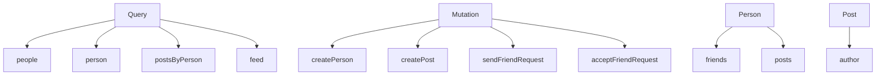

---

# 9. Step 4: repositories

```java
package com.example.social.repository;

import com.example.social.entity.Person;
import org.springframework.data.jpa.repository.JpaRepository;
import java.util.Optional;

public interface PersonRepository extends JpaRepository<Person, Long> {
    Optional<Person> findByUsername(String username);
}
```

```java
package com.example.social.repository;

import com.example.social.entity.Post;
import org.springframework.data.jpa.repository.JpaRepository;
import java.util.*;

public interface PostRepository extends JpaRepository<Post, Long> {
    List<Post> findByAuthorIdOrderByCreatedAtDesc(Long authorId);
    List<Post> findTop20ByAuthorIdInOrderByCreatedAtDesc(Collection<Long> authorIds);
}
```

```java
package com.example.social.repository;

import com.example.social.entity.FriendRequest;
import org.springframework.data.jpa.repository.JpaRepository;

public interface FriendRequestRepository extends JpaRepository<FriendRequest, Long> {
}
```

---

# 10. Step 5: query resolvers

Spring GraphQL maps GraphQL fields to Java methods using annotations.

```java
package com.example.social.graphql;

import com.example.social.entity.*;
import com.example.social.repository.*;
import lombok.RequiredArgsConstructor;
import org.springframework.graphql.data.method.annotation.*;
import org.springframework.stereotype.Controller;

import java.util.List;

@Controller
@RequiredArgsConstructor
public class QueryController {
    private final PersonRepository personRepository;
    private final PostRepository postRepository;

    @QueryMapping
    public List<Person> people() {
        return personRepository.findAll();
    }

    @QueryMapping
    public Person person(@Argument Long id) {
        return personRepository.findById(id).orElse(null);
    }

    @QueryMapping
    public List<Post> postsByPerson(@Argument Long personId) {
        return postRepository.findByAuthorIdOrderByCreatedAtDesc(personId);
    }

    @QueryMapping
    public List<Post> feed(@Argument Long personId, @Argument Integer limit) {
        Person me = personRepository.findById(personId)
            .orElseThrow(() -> new RuntimeException("Person not found"));

        List<Long> friendIds = me.getFriends()
            .stream()
            .map(Person::getId)
            .toList();

        return postRepository.findTop20ByAuthorIdInOrderByCreatedAtDesc(friendIds);
    }
}
```

Flow:

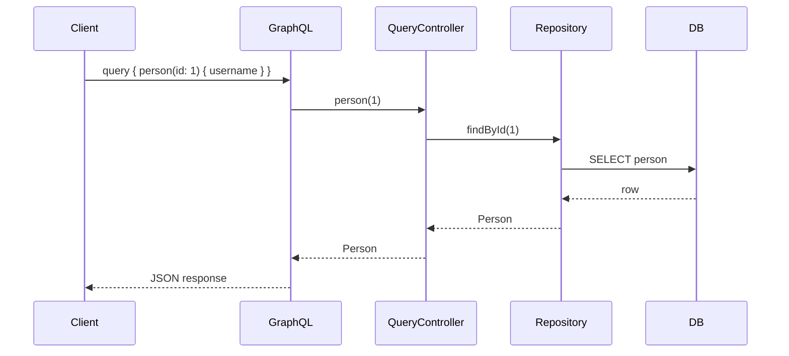

---

# 11. Step 6: mutations

## Input records

```java
package com.example.social.graphql;

public record CreatePersonInput(
    String username,
    String displayName,
    String bio
) {}

public record CreatePostInput(
    Long authorId,
    String text
) {}
```

## Mutation controller

```java
package com.example.social.graphql;

import com.example.social.entity.*;
import com.example.social.repository.*;
import lombok.RequiredArgsConstructor;
import org.springframework.graphql.data.method.annotation.*;
import org.springframework.stereotype.Controller;
import org.springframework.transaction.annotation.Transactional;

import java.time.Instant;

@Controller
@RequiredArgsConstructor
public class MutationController {
    private final PersonRepository personRepository;
    private final PostRepository postRepository;
    private final FriendRequestRepository friendRequestRepository;

    @MutationMapping
    public Person createPerson(@Argument CreatePersonInput input) {
        Person person = Person.builder()
            .username(input.username())
            .displayName(input.displayName())
            .bio(input.bio())
            .build();

        return personRepository.save(person);
    }

    @MutationMapping
    public Post createPost(@Argument CreatePostInput input) {
        Person author = personRepository.findById(input.authorId())
            .orElseThrow(() -> new RuntimeException("Author not found"));

        Post post = Post.builder()
            .author(author)
            .text(input.text())
            .createdAt(Instant.now())
            .build();

        return postRepository.save(post);
    }

    @MutationMapping
    public FriendRequest sendFriendRequest(@Argument Long senderId, @Argument Long receiverId) {
        Person sender = personRepository.findById(senderId)
            .orElseThrow(() -> new RuntimeException("Sender not found"));

        Person receiver = personRepository.findById(receiverId)
            .orElseThrow(() -> new RuntimeException("Receiver not found"));

        FriendRequest request = FriendRequest.builder()
            .sender(sender)
            .receiver(receiver)
            .status(FriendRequest.Status.PENDING)
            .createdAt(Instant.now())
            .build();

        return friendRequestRepository.save(request);
    }

    @Transactional
    @MutationMapping
    public FriendRequest acceptFriendRequest(@Argument Long requestId) {
        FriendRequest request = friendRequestRepository.findById(requestId)
            .orElseThrow(() -> new RuntimeException("Request not found"));

        Person sender = request.getSender();
        Person receiver = request.getReceiver();

        sender.getFriends().add(receiver);
        receiver.getFriends().add(sender);

        request.setStatus(FriendRequest.Status.ACCEPTED);

        personRepository.save(sender);
        personRepository.save(receiver);
        return friendRequestRepository.save(request);
    }
}
```

Mutation flow:

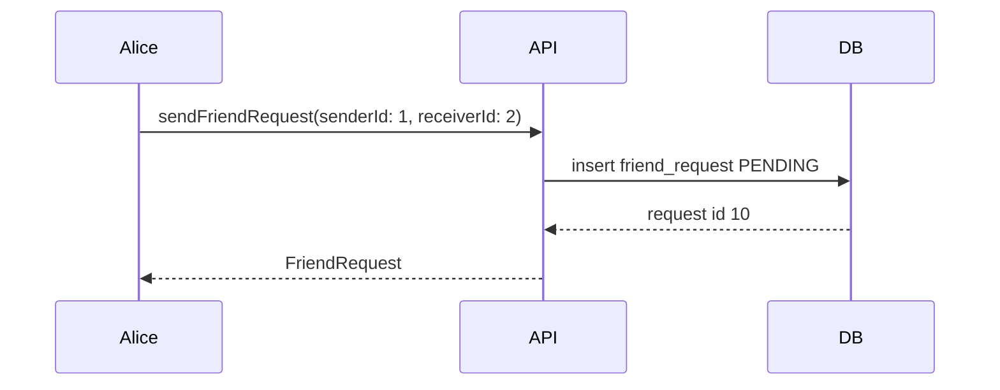

---

# 12. Step 7: nested fields

GraphQL lets the client walk the graph:

```graphql
query {
  person(id: 1) {
    username
    friends {
      username
      posts {
        text
      }
    }
  }
}
```

Add field resolvers:

```java
package com.example.social.graphql;

import com.example.social.entity.*;
import com.example.social.repository.PostRepository;
import lombok.RequiredArgsConstructor;
import org.springframework.graphql.data.method.annotation.*;
import org.springframework.stereotype.Controller;

import java.util.List;
import java.util.Set;

@Controller
@RequiredArgsConstructor
public class PersonFieldController {
    private final PostRepository postRepository;

    @SchemaMapping(typeName = "Person", field = "friends")
    public Set<Person> friends(Person person) {
        return person.getFriends();
    }

    @SchemaMapping(typeName = "Person", field = "posts")
    public List<Post> posts(Person person) {
        return postRepository.findByAuthorIdOrderByCreatedAtDesc(person.getId());
    }
}
```

Visual graph traversal:

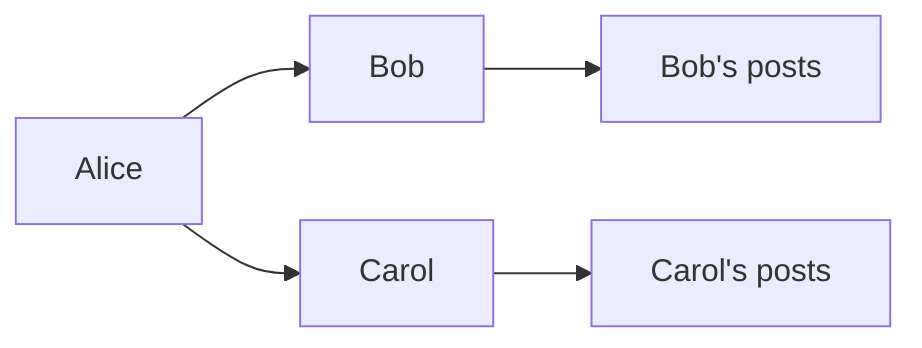

---

# 13. Step 8: run example queries

## Create people

```graphql
mutation {
  alice: createPerson(input: {
    username: "alice",
    displayName: "Alice",
    bio: "Backend engineer"
  }) {
    id
    username
  }

  bob: createPerson(input: {
    username: "bob",
    displayName: "Bob",
    bio: "Java learner"
  }) {
    id
    username
  }
}
```

## Send friend request

```graphql
mutation {
  sendFriendRequest(senderId: 1, receiverId: 2) {
    id
    status
    sender { username }
    receiver { username }
  }
}
```

## Accept friend request

```graphql
mutation {
  acceptFriendRequest(requestId: 1) {
    id
    status
  }
}
```

## Create post

```graphql
mutation {
  createPost(input: {
    authorId: 1,
    text: "Learning GraphQL with Spring Boot!"
  }) {
    id
    text
    author { username }
  }
}
```

## Query social graph

```graphql
query {
  person(id: 1) {
    username
    friends {
      username
      bio
    }
    posts {
      text
      createdAt
    }
  }
}
```

---

# 14. Pagination for friends and posts

Do not return unlimited data.

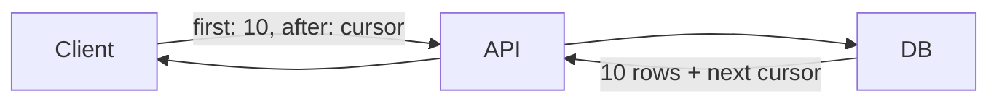

Simple offset style schema:

```graphql
type Query {
  peoplePage(page: Int = 0, size: Int = 10): PersonPage!
}

type PersonPage {
  content: [Person!]!
  page: Int!
  size: Int!
  totalElements: Int!
}
```

Java:

```java
public record PersonPageResponse(
    List<Person> content,
    int page,
    int size,
    long totalElements
) {}

@QueryMapping
public PersonPageResponse peoplePage(@Argument int page, @Argument int size) {
    var result = personRepository.findAll(PageRequest.of(page, size));
    return new PersonPageResponse(
        result.getContent(),
        page,
        size,
        result.getTotalElements()
    );
}
```

For large feeds, prefer cursor pagination.

---

# 15. Friend request workflow

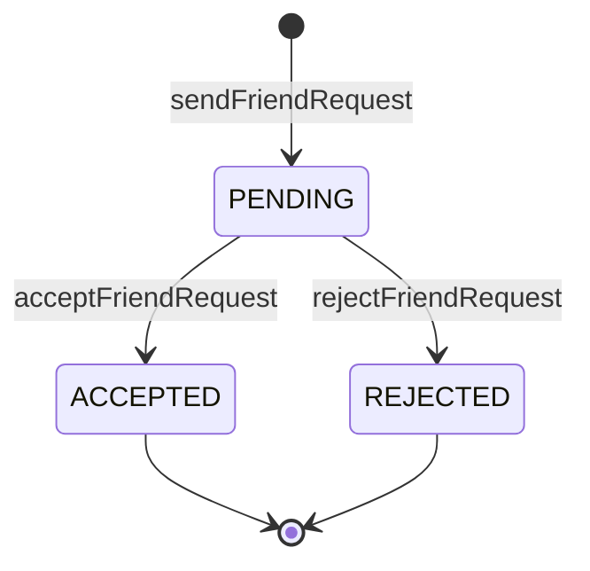

Important checks:

```text
1. Sender cannot equal receiver.
2. Duplicate pending request should be blocked.
3. Existing friends should not send another request.
4. Accepting should create friendship in both directions.
```

Service-style validation:

```java
private void validateFriendRequest(Person sender, Person receiver) {
    if (sender.getId().equals(receiver.getId())) {
        throw new IllegalArgumentException("You cannot friend yourself");
    }

    if (sender.getFriends().contains(receiver)) {
        throw new IllegalArgumentException("Already friends");
    }
}
```

---

# 16. Timeline/feed use case

Feed meaning:

```text
Show posts from my friends, newest first.
```

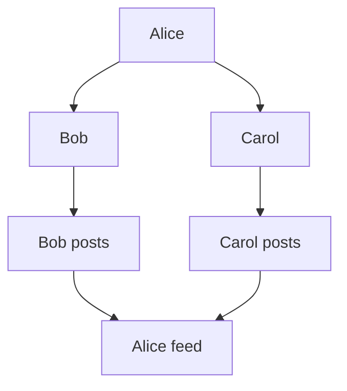

Basic feed query:

```graphql
query {
  feed(personId: 1, limit: 20) {
    text
    createdAt
    author {
      username
    }
  }
}
```

Simple repository method:

```java
List<Post> findTop20ByAuthorIdInOrderByCreatedAtDesc(Collection<Long> authorIds);
```

For production, feed design is usually separate from normal post storage.

---

# 17. Avoiding N+1 queries with DataLoader

Problem:

```graphql
query {
  people {
    username
    posts {
      text
    }
  }
}
```

Bad query pattern:

```text
1 query  -> load people
N queries -> load posts for each person
```

Visual:

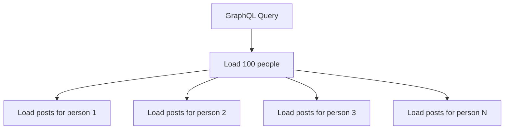

Better:

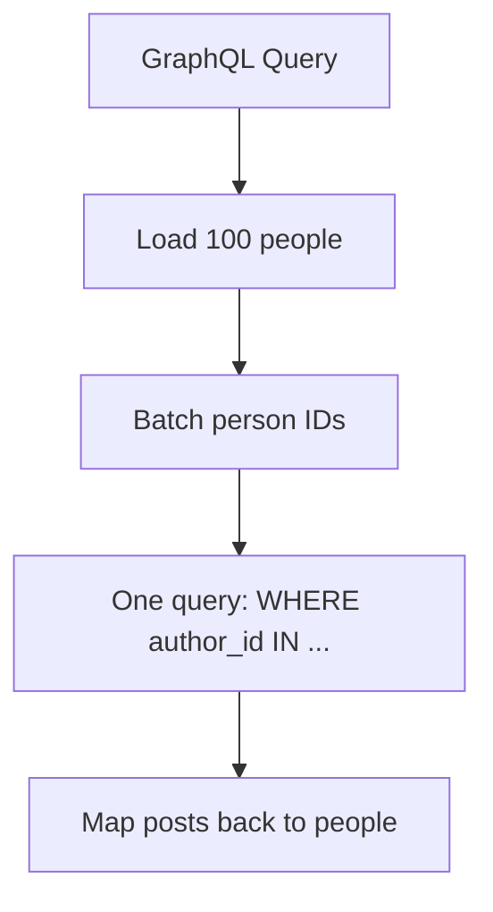

Conceptual DataLoader code:

```java
@BatchMapping(typeName = "Person", field = "posts")
public Map<Person, List<Post>> posts(List<Person> people) {
    List<Long> ids = people.stream().map(Person::getId).toList();
    List<Post> posts = postRepository.findByAuthorIdIn(ids);

    return people.stream().collect(Collectors.toMap(
        person -> person,
        person -> posts.stream()
            .filter(post -> post.getAuthor().getId().equals(person.getId()))
            .toList()
    ));
}
```

Repository:

```java
List<Post> findByAuthorIdIn(Collection<Long> authorIds);
```

---

# 18. Validation and errors

GraphQL errors are returned in an `errors` array.

```json
{
  "data": {
    "sendFriendRequest": null
  },
  "errors": [
    {
      "message": "Already friends"
    }
  ]
}
```

Keep errors useful but not too detailed.

Good:

```text
Already friends
Post text cannot be empty
Person not found
```

Avoid leaking internals:

```text
SQL constraint FK_4929 failed on table person_friend
```

---

# 19. Security with Spring Security

Security flow:

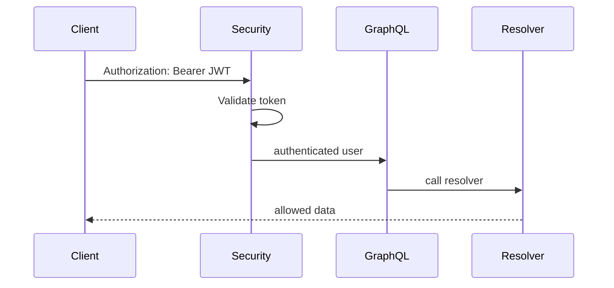

Dependency:

```xml
<dependency>
    <groupId>org.springframework.boot</groupId>
    <artifactId>spring-boot-starter-security</artifactId>
</dependency>
```

Example method protection:

```java
@PreAuthorize("isAuthenticated()")
@MutationMapping
public Post createPost(@Argument CreatePostInput input) {
    // create post only for authenticated user
}
```

---

# 20. Authorization rules

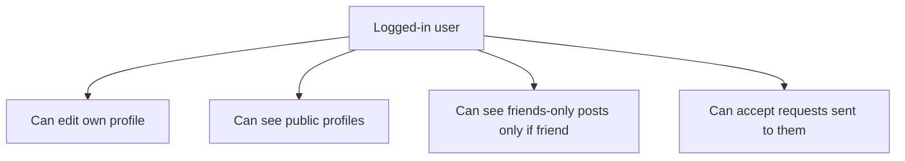

Example check:

```java
private void requireOwner(Long loggedInUserId, Long profileId) {
    if (!loggedInUserId.equals(profileId)) {
        throw new AccessDeniedException("Not allowed");
    }
}
```

Friend-only post rule:

```java
private boolean canViewPost(Person viewer, Post post) {
    Person author = post.getAuthor();
    return author.getId().equals(viewer.getId())
        || author.getFriends().contains(viewer);
}
```

---

# 21. Subscriptions for real-time notifications

Use case:

```text
Bob receives live notification when Alice sends a friend request.
```

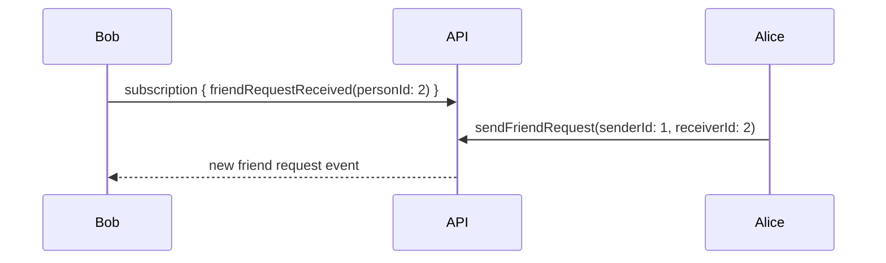

Schema idea:

```graphql
type Subscription {
  friendRequestReceived(personId: ID!): FriendRequest!
}
```

Conceptual Java with Reactor:

```java
@SubscriptionMapping
public Flux<FriendRequest> friendRequestReceived(@Argument Long personId) {
    return friendRequestPublisher.events()
        .filter(request -> request.getReceiver().getId().equals(personId));
}
```

For subscriptions you usually need WebSocket transport.

---

# 22. Caching strategy

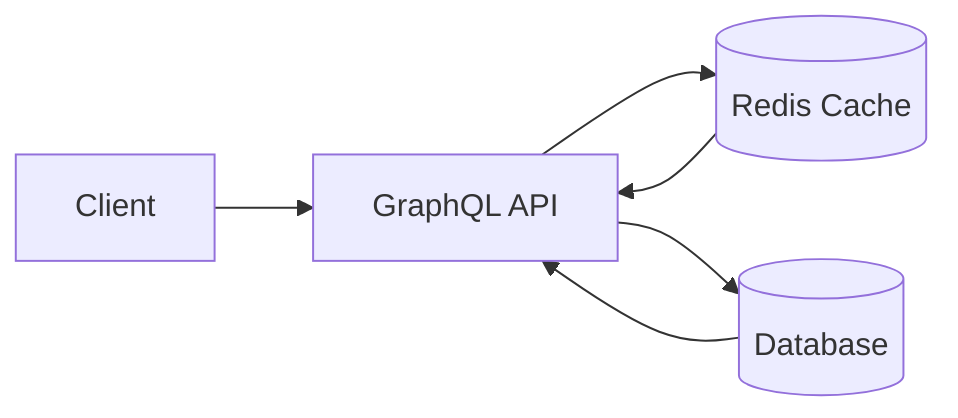

What to cache:

| Data | Cache? | Why |
|---|---:|---|
| Public profile | Yes | Read often, changes rarely |
| Friend count | Yes | Popular field |
| Feed page | Sometimes | Expensive to compute |
| Private data | Carefully | Must respect permissions |
| Mutations | No | Writes must go to source of truth |

Example:

```java
@Cacheable(value = "profile", key = "#id")
public Person getProfile(Long id) {
    return personRepository.findById(id)
        .orElseThrow(() -> new RuntimeException("Person not found"));
}
```

---

# 23. Scaling read-heavy and write-heavy use cases

## Read-heavy: profile and feed reads

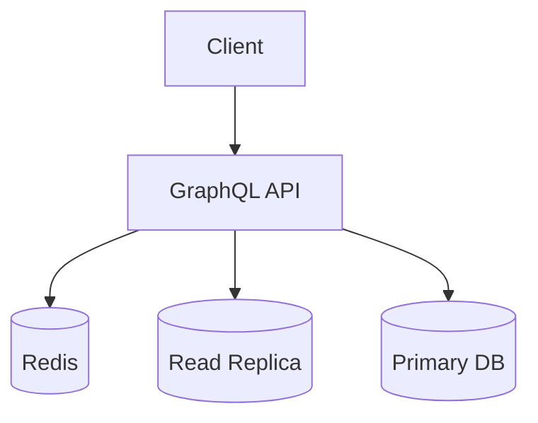

Techniques:

```text
1. Cache profiles.
2. Cache friend counts.
3. Use read replicas.
4. Use DataLoader for batching.
5. Use cursor pagination.
```

## Write-heavy: likes, follows, posts, friend requests

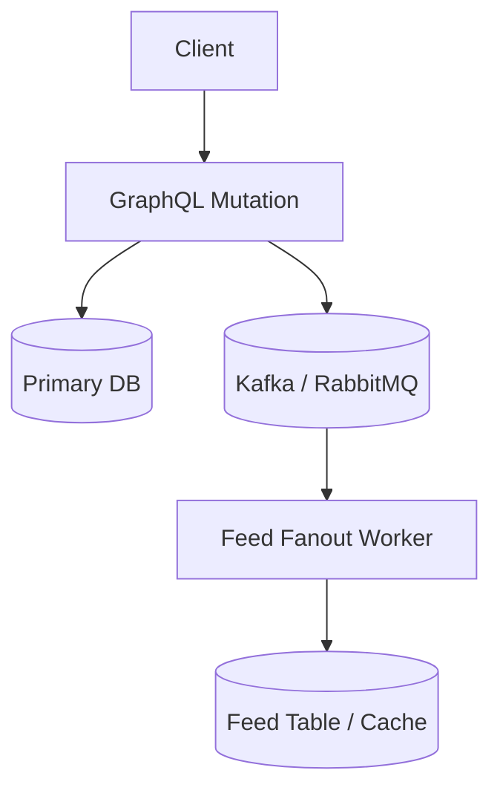

Write-heavy examples:

| Use case | Problem | Better approach |
|---|---|---|
| User creates post | Need to update followers' feeds | Async feed fanout |
| User likes post | Very high write count | Append event, aggregate later |
| User follows celebrity | Millions of followers | Pull model or hybrid feed |
| Friend request spam | Abuse risk | Rate limit + validation |

Feed strategies:

```mermaid
graph LR
  A[Fanout on write] --> B[Fast reads, expensive writes]
  C[Fanout on read] --> D[Cheap writes, expensive reads]
  E[Hybrid] --> F[Use both depending on user size]
```

Rule of thumb:

```text
Normal users: fanout on write.
Celebrity users: fanout on read.
Large platforms: hybrid.
```

---

# 24. Advanced architecture diagram

```mermaid
graph TD
  Web[Web App] --> Gateway[API Gateway]
  Mobile[Mobile App] --> Gateway
  Gateway --> GraphQL[Spring Boot GraphQL Service]

  GraphQL --> Auth[Auth Service]
  GraphQL --> UserService[User/Profile Service]
  GraphQL --> SocialService[Friendship Service]
  GraphQL --> PostService[Post Service]

  UserService --> UserDB[(User DB)]
  SocialService --> GraphDB[(Friendship DB)]
  PostService --> PostDB[(Post DB)]

  GraphQL --> Redis[(Redis Cache)]
  PostService --> Kafka[(Kafka)]
  Kafka --> FeedWorker[Feed Worker]
  FeedWorker --> FeedDB[(Feed Store)]
  GraphQL --> FeedDB
```

GraphQL works well as an API composition layer:

```text
Client asks one query.
GraphQL gathers data from many services.
Client receives one response shape.
```

---

# 25. Practice roadmap

## Level 1: beginner

```text
[x] Create Person
[x] Query Person by id
[x] Create Post
[x] Query posts by person
```

## Level 2: social graph

```text
[x] Send friend request
[x] Accept friend request
[x] Query friends
[x] Query friend's posts
```

## Level 3: production thinking

```text
[x] Add pagination
[x] Add validation
[x] Add authorization
[x] Avoid N+1 queries
```

## Level 4: advanced systems

```text
[x] Feed generation
[x] Real-time notifications
[x] Caching
[x] Async fanout
[x] Read/write scaling
```

---

# 26. Quick cheat sheet

## Annotations

| Annotation | Use |
|---|---|
| `@Controller` | GraphQL controller bean |
| `@QueryMapping` | GraphQL `Query` field |
| `@MutationMapping` | GraphQL `Mutation` field |
| `@SubscriptionMapping` | GraphQL `Subscription` field |
| `@SchemaMapping` | Nested field resolver |
| `@BatchMapping` | Batch nested field resolver |
| `@Argument` | GraphQL argument |

## Common schema patterns

```graphql
type Query {
  person(id: ID!): Person
}
```

```graphql
type Mutation {
  createPost(input: CreatePostInput!): Post!
}
```

```graphql
input CreatePostInput {
  authorId: ID!
  text: String!
}
```

## Common query

```graphql
query {
  people {
    id
    username
  }
}
```

## Common mutation

```graphql
mutation {
  createPerson(input: {
    username: "alice",
    displayName: "Alice"
  }) {
    id
    username
  }
}
```

---

# 27. References

- Spring Boot GraphQL reference: https://docs.spring.io/spring-boot/reference/web/spring-graphql.html
- Spring for GraphQL reference: https://docs.spring.io/spring-graphql/reference/index.html
- GraphQL official learning guide: https://graphql.org/learn/

