# Redis + Spring Boot Guide  
## Learn from basics to advanced with Java code examples and Mermaid diagrams

> This guide teaches Redis with Spring Boot step by step. It starts from Redis basics, then covers Redis data types, Spring Boot integration, caching, pub/sub, streams, distributed locks, transactions, Lua scripts, clustering, and production best practices.

---

## Table of Contents

1. [What is Redis?](#1-what-is-redis)
2. [Where Redis Fits in Architecture](#2-where-redis-fits-in-architecture)
3. [Install and Run Redis](#3-install-and-run-redis)
4. [Redis CLI Basics](#4-redis-cli-basics)
5. [Redis Data Types Overview](#5-redis-data-types-overview)
6. [Spring Boot Redis Setup](#6-spring-boot-redis-setup)
7. [Redis String](#7-redis-string)
8. [Redis Hash](#8-redis-hash)
9. [Redis List](#9-redis-list)
10. [Redis Set](#10-redis-set)
11. [Redis Sorted Set](#11-redis-sorted-set)
12. [Redis Bitmap](#12-redis-bitmap)
13. [Redis HyperLogLog](#13-redis-hyperloglog)
14. [Redis Geospatial](#14-redis-geospatial)
15. [Redis Stream](#15-redis-stream)
16. [Spring Boot Redis Cache](#16-spring-boot-redis-cache)
17. [Cache Aside Pattern](#17-cache-aside-pattern)
18. [Cache TTL and Eviction](#18-cache-ttl-and-eviction)
19. [Redis Pub/Sub](#19-redis-pubsub)
20. [Redis Distributed Lock](#20-redis-distributed-lock)
21. [Redis Transactions](#21-redis-transactions)
22. [Lua Scripting](#22-lua-scripting)
23. [Rate Limiting with Redis](#23-rate-limiting-with-redis)
24. [Session Management](#24-session-management)
25. [Redis with Spring Data Repositories](#25-redis-with-spring-data-repositories)
26. [Redis Serialization](#26-redis-serialization)
27. [Redis Persistence](#27-redis-persistence)
28. [Redis Replication, Sentinel, and Cluster](#28-redis-replication-sentinel-and-cluster)
29. [Monitoring Redis](#29-monitoring-redis)
30. [Production Best Practices](#30-production-best-practices)
31. [Troubleshooting](#31-troubleshooting)
32. [Final Cheat Sheet](#32-final-cheat-sheet)

---

# 1. What is Redis?

Redis means **Remote Dictionary Server**.

Redis is an in-memory data store commonly used as:

- Cache
- Distributed lock store
- Session store
- Message broker
- Rate limiter
- Leaderboard store
- Queue
- Pub/Sub broker
- Stream processing system

Redis is very fast because most data is stored in memory.

---

## Redis vs Database

| Feature | Redis | Relational Database |
|---|---|---|
| Storage | Mostly memory | Disk |
| Speed | Very fast | Slower than memory |
| Query | Key-based | SQL |
| Use case | Cache, counters, queues | Main persistent data |
| Data structure | Rich key-value types | Tables and rows |
| Persistence | Optional | Core feature |

---

# 2. Where Redis Fits in Architecture

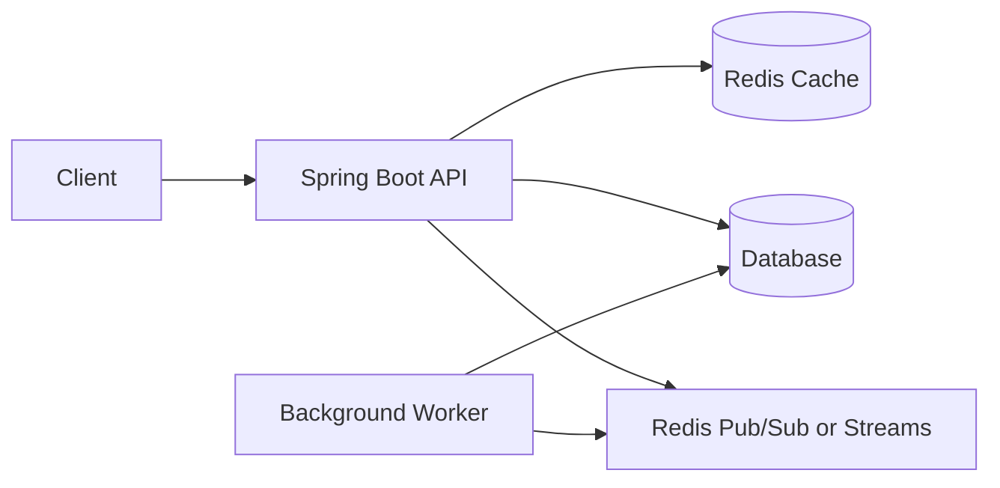

## Common Flow

1. Client calls Spring Boot API.
2. Spring Boot checks Redis.
3. If data exists in Redis, return fast response.
4. If not, fetch from database.
5. Save data in Redis for next request.

---

# 3. Install and Run Redis

## Run Redis with Docker

```bash
docker run --name redis-demo -p 6379:6379 -d redis:7
```

## Check Redis Container

```bash
docker ps
```

## Open Redis CLI

```bash
docker exec -it redis-demo redis-cli
```

## Test Redis

```bash
PING
```

Expected:

```text
PONG
```

---

# 4. Redis CLI Basics

## Set and Get

```bash
SET app:name "Loan Service"
GET app:name
```

## Delete Key

```bash
DEL app:name
```

## Check Key Exists

```bash
EXISTS app:name
```

## Set Key with TTL

```bash
SET user:1 "Alice" EX 60
```

## Check TTL

```bash
TTL user:1
```

## List Keys

```bash
KEYS *
```

> Avoid `KEYS *` in production. Use `SCAN`.

## Production Safe Scan

```bash
SCAN 0 MATCH user:* COUNT 100
```

---

# 5. Redis Data Types Overview

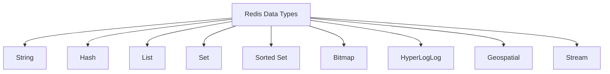

| Type | Best For |
|---|---|
| String | Simple value, JSON, counter |
| Hash | Object fields |
| List | Queue, recent items |
| Set | Unique values |
| Sorted Set | Ranking, leaderboard |
| Bitmap | Daily active flags |
| HyperLogLog | Approx unique count |
| Geospatial | Location search |
| Stream | Event log, async processing |

---

# 6. Spring Boot Redis Setup

## Maven Dependencies

```xml
<dependencies>
    <!-- Spring Web -->
    <dependency>
        <groupId>org.springframework.boot</groupId>
        <artifactId>spring-boot-starter-web</artifactId>
    </dependency>

    <!-- Spring Data Redis -->
    <dependency>
        <groupId>org.springframework.boot</groupId>
        <artifactId>spring-boot-starter-data-redis</artifactId>
    </dependency>

    <!-- Cache abstraction -->
    <dependency>
        <groupId>org.springframework.boot</groupId>
        <artifactId>spring-boot-starter-cache</artifactId>
    </dependency>

    <!-- Optional: Lombok -->
    <dependency>
        <groupId>org.projectlombok</groupId>
        <artifactId>lombok</artifactId>
        <optional>true</optional>
    </dependency>
</dependencies>
```

---

## application.properties

```properties
spring.redis.host=localhost
spring.redis.port=6379

spring.cache.type=redis

server.port=8080
```

For newer Spring Boot versions:

```properties
spring.data.redis.host=localhost
spring.data.redis.port=6379
spring.cache.type=redis
```

---

## Redis Configuration

```java
import com.fasterxml.jackson.annotation.JsonTypeInfo;
import com.fasterxml.jackson.databind.ObjectMapper;
import org.springframework.context.annotation.Bean;
import org.springframework.context.annotation.Configuration;
import org.springframework.data.redis.connection.RedisConnectionFactory;
import org.springframework.data.redis.core.RedisTemplate;
import org.springframework.data.redis.serializer.*;

@Configuration
public class RedisConfig {

    @Bean
    public RedisTemplate<String, Object> redisTemplate(
            RedisConnectionFactory connectionFactory) {

        RedisTemplate<String, Object> template = new RedisTemplate<>();
        template.setConnectionFactory(connectionFactory);

        ObjectMapper objectMapper = new ObjectMapper();
        objectMapper.activateDefaultTyping(
                objectMapper.getPolymorphicTypeValidator(),
                ObjectMapper.DefaultTyping.NON_FINAL,
                JsonTypeInfo.As.PROPERTY
        );

        GenericJackson2JsonRedisSerializer jsonSerializer =
                new GenericJackson2JsonRedisSerializer(objectMapper);

        template.setKeySerializer(new StringRedisSerializer());
        template.setHashKeySerializer(new StringRedisSerializer());

        template.setValueSerializer(jsonSerializer);
        template.setHashValueSerializer(jsonSerializer);

        template.afterPropertiesSet();

        return template;
    }
}
```

---

## Sample Domain Class

```java
import java.io.Serializable;

public class Loan implements Serializable {

    private String loanId;
    private String customerId;
    private double amount;
    private String status;

    public Loan() {
    }

    public Loan(String loanId, String customerId, double amount, String status) {
        this.loanId = loanId;
        this.customerId = customerId;
        this.amount = amount;
        this.status = status;
    }

    public String getLoanId() {
        return loanId;
    }

    public String getCustomerId() {
        return customerId;
    }

    public double getAmount() {
        return amount;
    }

    public String getStatus() {
        return status;
    }

    public void setLoanId(String loanId) {
        this.loanId = loanId;
    }

    public void setCustomerId(String customerId) {
        this.customerId = customerId;
    }

    public void setAmount(double amount) {
        this.amount = amount;
    }

    public void setStatus(String status) {
        this.status = status;
    }
}
```

---

# 7. Redis String

Redis String stores a simple value.

## CLI Examples

```bash
SET loan:1001:status APPROVED
GET loan:1001:status
```

## Counter Example

```bash
INCR page:view:home
INCR page:view:home
GET page:view:home
```

## Use Cases

- Cache JSON object
- Store token
- Store status
- Store counter
- Store feature flag

---

## Spring Boot String Example

```java
import org.springframework.data.redis.core.RedisTemplate;
import org.springframework.stereotype.Service;

import java.time.Duration;

@Service
public class RedisStringService {

    private final RedisTemplate<String, Object> redisTemplate;

    public RedisStringService(RedisTemplate<String, Object> redisTemplate) {
        this.redisTemplate = redisTemplate;
    }

    public void saveLoanStatus(String loanId, String status) {
        String key = "loan:" + loanId + ":status";
        redisTemplate.opsForValue().set(key, status, Duration.ofMinutes(10));
    }

    public String getLoanStatus(String loanId) {
        String key = "loan:" + loanId + ":status";
        Object value = redisTemplate.opsForValue().get(key);
        return value == null ? null : value.toString();
    }

    public Long incrementViewCount(String pageName) {
        String key = "page:view:" + pageName;
        return redisTemplate.opsForValue().increment(key);
    }
}
```

## Controller

```java
import org.springframework.web.bind.annotation.*;

@RestController
@RequestMapping("/redis/string")
public class RedisStringController {

    private final RedisStringService service;

    public RedisStringController(RedisStringService service) {
        this.service = service;
    }

    @PostMapping("/loan/{loanId}/status/{status}")
    public String saveStatus(@PathVariable String loanId,
                             @PathVariable String status) {
        service.saveLoanStatus(loanId, status);
        return "Saved";
    }

    @GetMapping("/loan/{loanId}/status")
    public String getStatus(@PathVariable String loanId) {
        return service.getLoanStatus(loanId);
    }

    @PostMapping("/page/{page}/view")
    public Long increment(@PathVariable String page) {
        return service.incrementViewCount(page);
    }
}
```

---

# 8. Redis Hash

Redis Hash stores field-value pairs under one key.

## Use Cases

- User profile
- Loan object fields
- Product details
- Session attributes

## CLI Examples

```bash
HSET loan:1001 loanId 1001 customerId CUST-1 amount 500000 status APPROVED
HGET loan:1001 status
HGETALL loan:1001
HDEL loan:1001 status
```

## Diagram

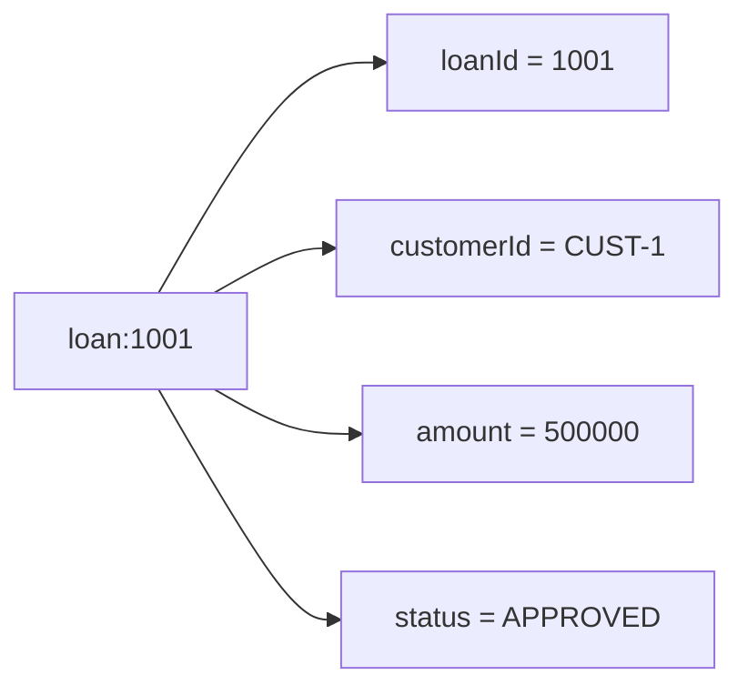

---

## Spring Boot Hash Example

```java
import org.springframework.data.redis.core.RedisTemplate;
import org.springframework.stereotype.Service;

import java.util.Map;

@Service
public class RedisHashService {

    private final RedisTemplate<String, Object> redisTemplate;

    public RedisHashService(RedisTemplate<String, Object> redisTemplate) {
        this.redisTemplate = redisTemplate;
    }

    public void saveLoan(Loan loan) {
        String key = "loan:" + loan.getLoanId();

        redisTemplate.opsForHash().put(key, "loanId", loan.getLoanId());
        redisTemplate.opsForHash().put(key, "customerId", loan.getCustomerId());
        redisTemplate.opsForHash().put(key, "amount", loan.getAmount());
        redisTemplate.opsForHash().put(key, "status", loan.getStatus());
    }

    public Object getLoanField(String loanId, String field) {
        String key = "loan:" + loanId;
        return redisTemplate.opsForHash().get(key, field);
    }

    public Map<Object, Object> getLoan(String loanId) {
        String key = "loan:" + loanId;
        return redisTemplate.opsForHash().entries(key);
    }

    public void updateStatus(String loanId, String status) {
        String key = "loan:" + loanId;
        redisTemplate.opsForHash().put(key, "status", status);
    }
}
```

## Controller

```java
import org.springframework.web.bind.annotation.*;

import java.util.Map;

@RestController
@RequestMapping("/redis/hash")
public class RedisHashController {

    private final RedisHashService service;

    public RedisHashController(RedisHashService service) {
        this.service = service;
    }

    @PostMapping("/loan")
    public String save(@RequestBody Loan loan) {
        service.saveLoan(loan);
        return "Loan saved as hash";
    }

    @GetMapping("/loan/{loanId}")
    public Map<Object, Object> getLoan(@PathVariable String loanId) {
        return service.getLoan(loanId);
    }

    @PatchMapping("/loan/{loanId}/status/{status}")
    public String updateStatus(@PathVariable String loanId,
                               @PathVariable String status) {
        service.updateStatus(loanId, status);
        return "Status updated";
    }
}
```

---

# 9. Redis List

Redis List stores ordered values.

## Use Cases

- Queue
- Recent activity
- Recent transactions
- Task list

## CLI Examples

```bash
LPUSH loan:queue LN-1
LPUSH loan:queue LN-2
RPOP loan:queue
LRANGE loan:queue 0 -1
```

## Queue Diagram

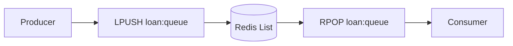

---

## Spring Boot List Example

```java
import org.springframework.data.redis.core.RedisTemplate;
import org.springframework.stereotype.Service;

import java.util.List;

@Service
public class RedisListService {

    private final RedisTemplate<String, Object> redisTemplate;

    public RedisListService(RedisTemplate<String, Object> redisTemplate) {
        this.redisTemplate = redisTemplate;
    }

    public void addLoanToQueue(String loanId) {
        redisTemplate.opsForList().leftPush("loan:queue", loanId);
    }

    public Object processLoanFromQueue() {
        return redisTemplate.opsForList().rightPop("loan:queue");
    }

    public List<Object> getAllLoansInQueue() {
        return redisTemplate.opsForList().range("loan:queue", 0, -1);
    }
}
```

## Controller

```java
import org.springframework.web.bind.annotation.*;

import java.util.List;

@RestController
@RequestMapping("/redis/list")
public class RedisListController {

    private final RedisListService service;

    public RedisListController(RedisListService service) {
        this.service = service;
    }

    @PostMapping("/queue/{loanId}")
    public String add(@PathVariable String loanId) {
        service.addLoanToQueue(loanId);
        return "Added to queue";
    }

    @PostMapping("/queue/process")
    public Object process() {
        return service.processLoanFromQueue();
    }

    @GetMapping("/queue")
    public List<Object> all() {
        return service.getAllLoansInQueue();
    }
}
```

---

# 10. Redis Set

Redis Set stores unique unordered values.

## Use Cases

- Unique visitors
- User roles
- Tags
- Liked users
- Blacklisted tokens

## CLI Examples

```bash
SADD loan:1001:tags HOME PRIORITY VERIFIED
SADD loan:1001:tags HOME
SMEMBERS loan:1001:tags
SISMEMBER loan:1001:tags HOME
SREM loan:1001:tags PRIORITY
```

## Diagram

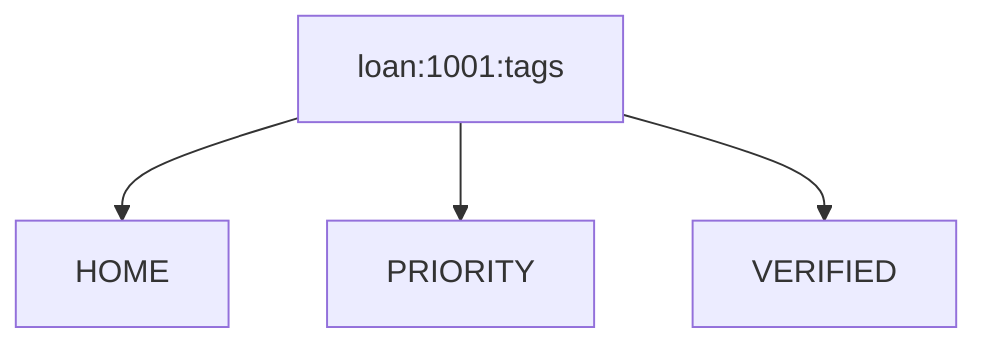

---

## Spring Boot Set Example

```java
import org.springframework.data.redis.core.RedisTemplate;
import org.springframework.stereotype.Service;

import java.util.Set;

@Service
public class RedisSetService {

    private final RedisTemplate<String, Object> redisTemplate;

    public RedisSetService(RedisTemplate<String, Object> redisTemplate) {
        this.redisTemplate = redisTemplate;
    }

    public void addTag(String loanId, String tag) {
        redisTemplate.opsForSet().add("loan:" + loanId + ":tags", tag);
    }

    public Set<Object> getTags(String loanId) {
        return redisTemplate.opsForSet().members("loan:" + loanId + ":tags");
    }

    public Boolean hasTag(String loanId, String tag) {
        return redisTemplate.opsForSet()
                .isMember("loan:" + loanId + ":tags", tag);
    }

    public void removeTag(String loanId, String tag) {
        redisTemplate.opsForSet().remove("loan:" + loanId + ":tags", tag);
    }
}
```

---

# 11. Redis Sorted Set

Redis Sorted Set stores unique values with scores.

## Use Cases

- Leaderboard
- Ranking
- Top customers
- Priority queue
- Sorted timeline

## CLI Examples

```bash
ZADD loan:leaderboard 900 CUST-1
ZADD loan:leaderboard 1200 CUST-2
ZADD loan:leaderboard 700 CUST-3

ZREVRANGE loan:leaderboard 0 10 WITHSCORES
ZRANK loan:leaderboard CUST-1
```

## Diagram

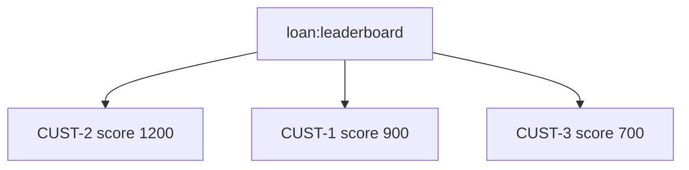

---

## Spring Boot Sorted Set Example

```java
import org.springframework.data.redis.core.RedisTemplate;
import org.springframework.data.redis.core.ZSetOperations;
import org.springframework.stereotype.Service;

import java.util.Set;

@Service
public class RedisSortedSetService {

    private final RedisTemplate<String, Object> redisTemplate;

    public RedisSortedSetService(RedisTemplate<String, Object> redisTemplate) {
        this.redisTemplate = redisTemplate;
    }

    public void addCustomerScore(String customerId, double score) {
        redisTemplate.opsForZSet()
                .add("loan:leaderboard", customerId, score);
    }

    public Set<Object> getTopCustomers() {
        return redisTemplate.opsForZSet()
                .reverseRange("loan:leaderboard", 0, 9);
    }

    public Set<ZSetOperations.TypedTuple<Object>> getTopCustomersWithScores() {
        return redisTemplate.opsForZSet()
                .reverseRangeWithScores("loan:leaderboard", 0, 9);
    }

    public Long getCustomerRank(String customerId) {
        return redisTemplate.opsForZSet()
                .reverseRank("loan:leaderboard", customerId);
    }
}
```

---

# 12. Redis Bitmap

Bitmap stores bits. It is memory efficient for yes/no flags.

## Use Cases

- Daily active users
- Attendance
- Feature usage
- Login tracking

## CLI Examples

```bash
SETBIT login:2025-01-01 1001 1
GETBIT login:2025-01-01 1001
BITCOUNT login:2025-01-01
```

## Diagram

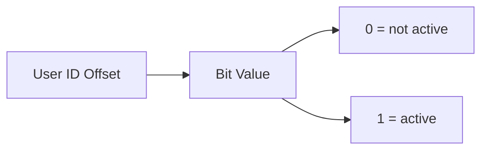

---

## Spring Boot Bitmap Example

```java
import org.springframework.data.redis.core.RedisTemplate;
import org.springframework.stereotype.Service;

@Service
public class RedisBitmapService {

    private final RedisTemplate<String, Object> redisTemplate;

    public RedisBitmapService(RedisTemplate<String, Object> redisTemplate) {
        this.redisTemplate = redisTemplate;
    }

    public void markUserLogin(String date, long userId) {
        String key = "login:" + date;
        redisTemplate.opsForValue().setBit(key, userId, true);
    }

    public Boolean hasUserLoggedIn(String date, long userId) {
        String key = "login:" + date;
        return redisTemplate.opsForValue().getBit(key, userId);
    }
}
```

---

# 13. Redis HyperLogLog

HyperLogLog estimates unique count using very low memory.

## Use Cases

- Unique visitors
- Unique IPs
- Unique customers
- Approximate analytics

## CLI Examples

```bash
PFADD visitors:home user1 user2 user3
PFADD visitors:home user2
PFCOUNT visitors:home
```

## Important

HyperLogLog gives approximate count, not exact values.

---

## Spring Boot HyperLogLog Example

```java
import org.springframework.data.redis.core.RedisTemplate;
import org.springframework.stereotype.Service;

@Service
public class RedisHyperLogLogService {

    private final RedisTemplate<String, Object> redisTemplate;

    public RedisHyperLogLogService(RedisTemplate<String, Object> redisTemplate) {
        this.redisTemplate = redisTemplate;
    }

    public void addVisitor(String page, String userId) {
        redisTemplate.opsForHyperLogLog()
                .add("visitors:" + page, userId);
    }

    public Long countVisitors(String page) {
        return redisTemplate.opsForHyperLogLog()
                .size("visitors:" + page);
    }
}
```

---

# 14. Redis Geospatial

Redis Geospatial stores locations and calculates distances.

## Use Cases

- Nearby branches
- Nearby ATMs
- Delivery tracking
- Store locator

## CLI Examples

```bash
GEOADD bank:branches 77.5946 12.9716 branch-bangalore
GEOADD bank:branches 72.8777 19.0760 branch-mumbai

GEODIST bank:branches branch-bangalore branch-mumbai km
GEOPOS bank:branches branch-bangalore
```

## Diagram

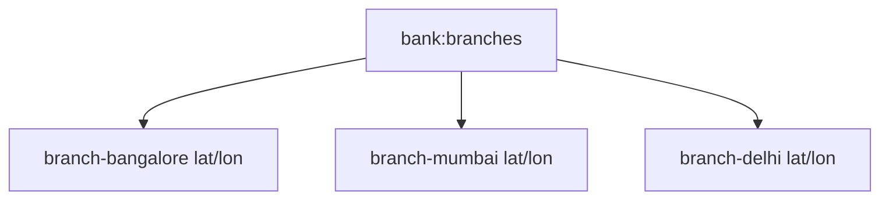

---

## Spring Boot Geo Example

```java
import org.springframework.data.geo.Point;
import org.springframework.data.redis.connection.RedisGeoCommands;
import org.springframework.data.redis.core.RedisTemplate;
import org.springframework.stereotype.Service;

@Service
public class RedisGeoService {

    private final RedisTemplate<String, Object> redisTemplate;

    public RedisGeoService(RedisTemplate<String, Object> redisTemplate) {
        this.redisTemplate = redisTemplate;
    }

    public void addBranch(String branchName, double longitude, double latitude) {
        redisTemplate.opsForGeo()
                .add("bank:branches", new Point(longitude, latitude), branchName);
    }

    public Double distanceBetween(String branch1, String branch2) {
        return redisTemplate.opsForGeo()
                .distance("bank:branches", branch1, branch2)
                .getValue();
    }
}
```

---

# 15. Redis Stream

Redis Stream is an append-only event log.

## Use Cases

- Event processing
- Reliable queue
- Audit log
- Async workflows
- Consumer groups

## Stream Architecture

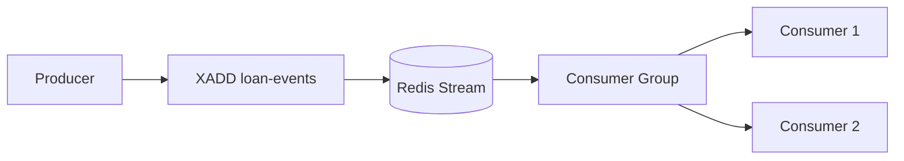

## CLI Examples

```bash
XADD loan-events * loanId LN-1 status CREATED
XREAD COUNT 10 STREAMS loan-events 0
```

## Consumer Group

```bash
XGROUP CREATE loan-events loan-processors $ MKSTREAM
XREADGROUP GROUP loan-processors consumer-1 COUNT 10 STREAMS loan-events >
XACK loan-events loan-processors 1234567890-0
```

---

## Spring Boot Stream Producer

```java
import org.springframework.data.redis.connection.stream.MapRecord;
import org.springframework.data.redis.core.RedisTemplate;
import org.springframework.stereotype.Service;

import java.util.HashMap;
import java.util.Map;

@Service
public class RedisStreamProducer {

    private final RedisTemplate<String, Object> redisTemplate;

    public RedisStreamProducer(RedisTemplate<String, Object> redisTemplate) {
        this.redisTemplate = redisTemplate;
    }

    public void publishLoanCreated(String loanId, String customerId) {
        Map<String, Object> event = new HashMap<>();
        event.put("loanId", loanId);
        event.put("customerId", customerId);
        event.put("eventType", "LOAN_CREATED");

        redisTemplate.opsForStream()
                .add(MapRecord.create("loan-events", event));
    }
}
```

## Controller

```java
import org.springframework.web.bind.annotation.*;

@RestController
@RequestMapping("/redis/stream")
public class RedisStreamController {

    private final RedisStreamProducer producer;

    public RedisStreamController(RedisStreamProducer producer) {
        this.producer = producer;
    }

    @PostMapping("/loan/{loanId}/customer/{customerId}")
    public String publish(@PathVariable String loanId,
                          @PathVariable String customerId) {
        producer.publishLoanCreated(loanId, customerId);
        return "Event published";
    }
}
```

---

# 16. Spring Boot Redis Cache

Spring Cache abstraction makes Redis caching very easy.

## Enable Caching

```java
import org.springframework.boot.SpringApplication;
import org.springframework.boot.autoconfigure.SpringBootApplication;
import org.springframework.cache.annotation.EnableCaching;

@SpringBootApplication
@EnableCaching
public class RedisDemoApplication {

    public static void main(String[] args) {
        SpringApplication.run(RedisDemoApplication.class, args);
    }
}
```

## Cacheable Example

```java
import org.springframework.cache.annotation.Cacheable;
import org.springframework.stereotype.Service;

@Service
public class LoanService {

    @Cacheable(value = "loans", key = "#loanId")
    public Loan getLoanById(String loanId) {
        System.out.println("Fetching from database...");

        // Simulated database response
        return new Loan(loanId, "CUST-101", 500000, "APPROVED");
    }
}
```

## Controller

```java
import org.springframework.web.bind.annotation.*;

@RestController
@RequestMapping("/loans")
public class LoanController {

    private final LoanService loanService;

    public LoanController(LoanService loanService) {
        this.loanService = loanService;
    }

    @GetMapping("/{loanId}")
    public Loan getLoan(@PathVariable String loanId) {
        return loanService.getLoanById(loanId);
    }
}
```

## Cache Flow

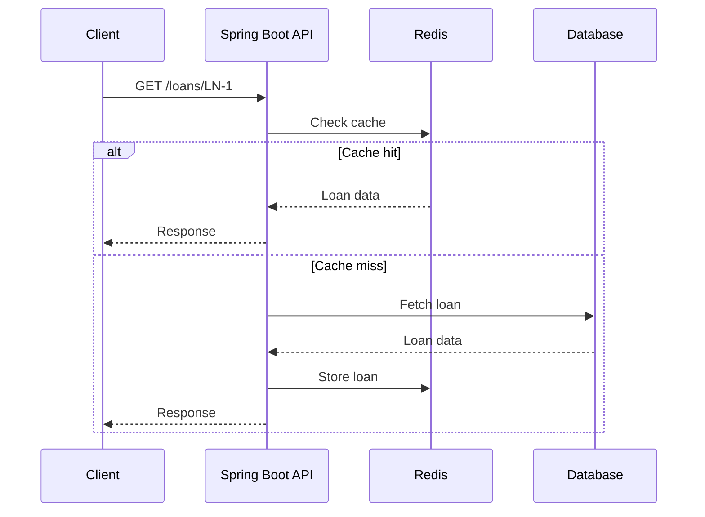

---

# 17. Cache Aside Pattern

Cache Aside is the most common caching pattern.

## How It Works

1. Application checks Redis.
2. If found, return data.
3. If not found, query database.
4. Save result to Redis.
5. Return result.

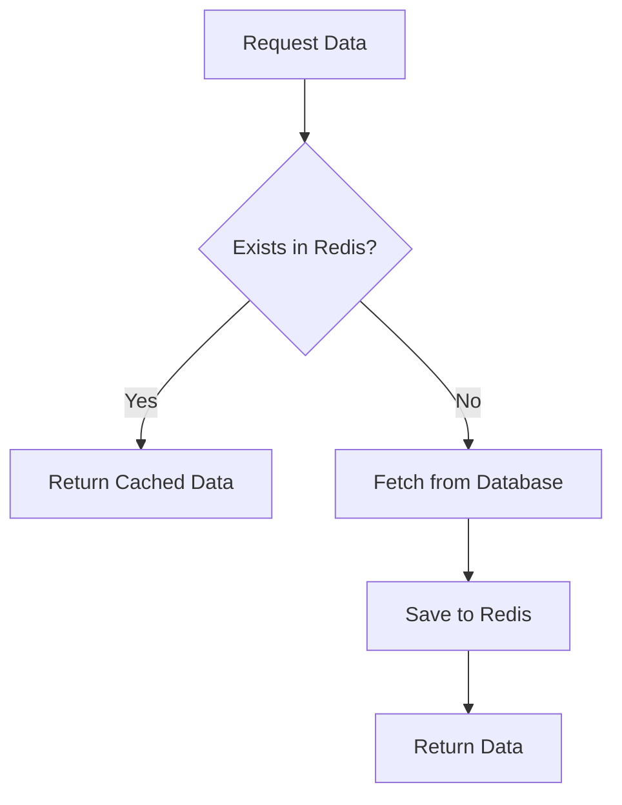

## Manual Cache Aside Code

```java
import org.springframework.data.redis.core.RedisTemplate;
import org.springframework.stereotype.Service;

import java.time.Duration;

@Service
public class LoanCacheAsideService {

    private final RedisTemplate<String, Object> redisTemplate;

    public LoanCacheAsideService(RedisTemplate<String, Object> redisTemplate) {
        this.redisTemplate = redisTemplate;
    }

    public Loan getLoan(String loanId) {
        String key = "loan:cache:" + loanId;

        Object cached = redisTemplate.opsForValue().get(key);
        if (cached != null) {
            return (Loan) cached;
        }

        Loan loanFromDb = fetchLoanFromDatabase(loanId);

        redisTemplate.opsForValue()
                .set(key, loanFromDb, Duration.ofMinutes(10));

        return loanFromDb;
    }

    private Loan fetchLoanFromDatabase(String loanId) {
        System.out.println("Fetching loan from database");
        return new Loan(loanId, "CUST-101", 500000, "APPROVED");
    }
}
```

---

# 18. Cache TTL and Eviction

TTL means Time To Live.

## Why TTL Is Important

- Prevent stale data
- Prevent unlimited memory growth
- Automatically clean unused keys

## CLI

```bash
SET loan:1 APPROVED EX 300
TTL loan:1
EXPIRE loan:1 600
```

## Spring Boot TTL

```java
redisTemplate.opsForValue()
    .set("loan:1", loan, Duration.ofMinutes(5));
```

---

## Redis Cache Manager with TTL

```java
import org.springframework.cache.CacheManager;
import org.springframework.context.annotation.Bean;
import org.springframework.context.annotation.Configuration;
import org.springframework.data.redis.cache.*;
import org.springframework.data.redis.connection.RedisConnectionFactory;

import java.time.Duration;

@Configuration
public class RedisCacheConfig {

    @Bean
    public CacheManager cacheManager(RedisConnectionFactory connectionFactory) {
        RedisCacheConfiguration config = RedisCacheConfiguration
                .defaultCacheConfig()
                .entryTtl(Duration.ofMinutes(10))
                .disableCachingNullValues();

        return RedisCacheManager.builder(connectionFactory)
                .cacheDefaults(config)
                .build();
    }
}
```

## Evict Cache

```java
import org.springframework.cache.annotation.CacheEvict;
import org.springframework.stereotype.Service;

@Service
public class LoanUpdateService {

    @CacheEvict(value = "loans", key = "#loanId")
    public void updateLoanStatus(String loanId, String status) {
        System.out.println("Update database with status: " + status);
    }
}
```

---

# 19. Redis Pub/Sub

Pub/Sub is fire-and-forget messaging.

## Use Cases

- Simple notifications
- Cache invalidation
- Broadcast messages

## Important

Redis Pub/Sub does not store messages. If subscriber is offline, it misses messages.

## Pub/Sub Diagram

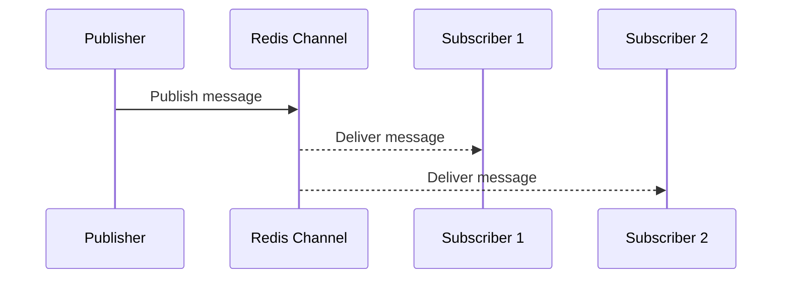

## CLI

Subscriber:

```bash
SUBSCRIBE loan-notifications
```

Publisher:

```bash
PUBLISH loan-notifications "Loan approved"
```

---

## Spring Boot Publisher

```java
import org.springframework.data.redis.core.RedisTemplate;
import org.springframework.stereotype.Service;

@Service
public class RedisPublisher {

    private final RedisTemplate<String, Object> redisTemplate;

    public RedisPublisher(RedisTemplate<String, Object> redisTemplate) {
        this.redisTemplate = redisTemplate;
    }

    public void publish(String channel, String message) {
        redisTemplate.convertAndSend(channel, message);
    }
}
```

## Subscriber

```java
import org.springframework.stereotype.Component;

@Component
public class RedisSubscriber {

    public void handleMessage(String message) {
        System.out.println("Received message: " + message);
    }
}
```

## Listener Configuration

```java
import org.springframework.context.annotation.Bean;
import org.springframework.context.annotation.Configuration;
import org.springframework.data.redis.connection.MessageListener;
import org.springframework.data.redis.listener.*;
import org.springframework.data.redis.listener.adapter.MessageListenerAdapter;

@Configuration
public class RedisPubSubConfig {

    @Bean
    public MessageListenerAdapter listenerAdapter(RedisSubscriber subscriber) {
        return new MessageListenerAdapter(subscriber, "handleMessage");
    }

    @Bean
    public RedisMessageListenerContainer container(
            org.springframework.data.redis.connection.RedisConnectionFactory connectionFactory,
            MessageListenerAdapter listenerAdapter) {

        RedisMessageListenerContainer container =
                new RedisMessageListenerContainer();

        container.setConnectionFactory(connectionFactory);
        container.addMessageListener(
                listenerAdapter,
                new ChannelTopic("loan-notifications")
        );

        return container;
    }
}
```

## Controller

```java
import org.springframework.web.bind.annotation.*;

@RestController
@RequestMapping("/redis/pubsub")
public class RedisPubSubController {

    private final RedisPublisher publisher;

    public RedisPubSubController(RedisPublisher publisher) {
        this.publisher = publisher;
    }

    @PostMapping("/publish")
    public String publish(@RequestParam String message) {
        publisher.publish("loan-notifications", message);
        return "Published";
    }
}
```

---

# 20. Redis Distributed Lock

Distributed lock helps ensure only one instance performs a critical operation.

## Use Cases

- Prevent duplicate payment
- Prevent duplicate loan approval
- Scheduled job single execution
- Inventory update

## Lock Flow

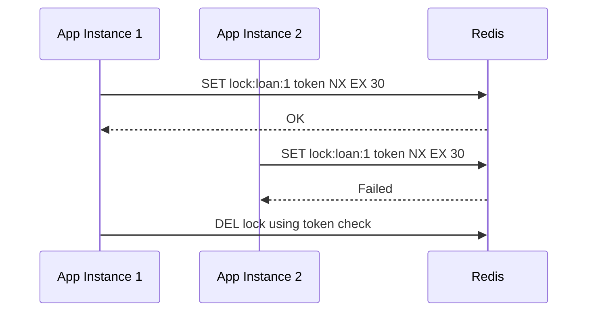

## Simple Lock Code

```java
import org.springframework.data.redis.core.RedisTemplate;
import org.springframework.stereotype.Service;

import java.time.Duration;
import java.util.UUID;

@Service
public class RedisLockService {

    private final RedisTemplate<String, Object> redisTemplate;

    public RedisLockService(RedisTemplate<String, Object> redisTemplate) {
        this.redisTemplate = redisTemplate;
    }

    public String tryLock(String key, Duration ttl) {
        String token = UUID.randomUUID().toString();

        Boolean locked = redisTemplate.opsForValue()
                .setIfAbsent(key, token, ttl);

        return Boolean.TRUE.equals(locked) ? token : null;
    }

    public void unlock(String key, String token) {
        Object value = redisTemplate.opsForValue().get(key);

        if (token.equals(value)) {
            redisTemplate.delete(key);
        }
    }
}
```

## Usage

```java
import org.springframework.stereotype.Service;

import java.time.Duration;

@Service
public class LoanApprovalService {

    private final RedisLockService lockService;

    public LoanApprovalService(RedisLockService lockService) {
        this.lockService = lockService;
    }

    public String approveLoan(String loanId) {
        String lockKey = "lock:loan:" + loanId;

        String token = lockService.tryLock(lockKey, Duration.ofSeconds(30));

        if (token == null) {
            return "Loan approval already in progress";
        }

        try {
            // critical logic
            return "Loan approved";
        } finally {
            lockService.unlock(lockKey, token);
        }
    }
}
```

> For serious production distributed locks, consider Redisson, which handles many edge cases.

---

# 21. Redis Transactions

Redis transaction uses `MULTI`, `EXEC`, `DISCARD`.

## CLI

```bash
MULTI
SET loan:1:status APPROVED
INCR loan:approved:count
EXEC
```

## Diagram

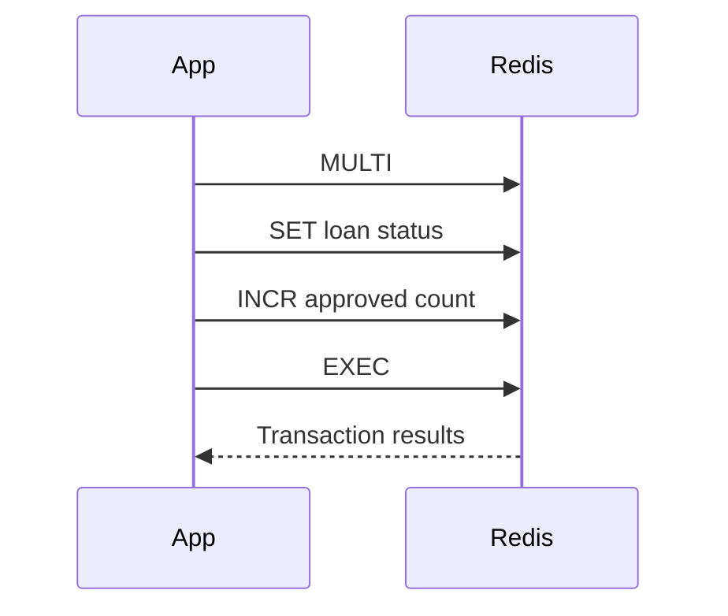

## Spring Boot Transaction Example

```java
import org.springframework.data.redis.core.RedisTemplate;
import org.springframework.stereotype.Service;

import java.util.List;

@Service
public class RedisTransactionService {

    private final RedisTemplate<String, Object> redisTemplate;

    public RedisTransactionService(RedisTemplate<String, Object> redisTemplate) {
        this.redisTemplate = redisTemplate;
    }

    public List<Object> approveLoan(String loanId) {
        return redisTemplate.execute(connection -> {
            connection.multi();

            redisTemplate.opsForValue()
                    .set("loan:" + loanId + ":status", "APPROVED");

            redisTemplate.opsForValue()
                    .increment("loan:approved:count");

            return connection.exec();
        });
    }
}
```

---

# 22. Lua Scripting

Lua scripts run atomically in Redis.

## Use Cases

- Safe unlock
- Rate limiter
- Atomic check-and-update
- Complex multi-key logic

## Safe Unlock Lua Script

```lua
if redis.call("GET", KEYS[1]) == ARGV[1] then
    return redis.call("DEL", KEYS[1])
else
    return 0
end
```

## Spring Boot Lua Unlock

```java
import org.springframework.data.redis.core.RedisTemplate;
import org.springframework.data.redis.core.script.DefaultRedisScript;
import org.springframework.stereotype.Service;

import java.util.Collections;

@Service
public class RedisLuaLockService {

    private final RedisTemplate<String, Object> redisTemplate;

    public RedisLuaLockService(RedisTemplate<String, Object> redisTemplate) {
        this.redisTemplate = redisTemplate;
    }

    public Long unlockSafely(String lockKey, String token) {
        String script =
                "if redis.call('GET', KEYS[1]) == ARGV[1] then " +
                "return redis.call('DEL', KEYS[1]) " +
                "else return 0 end";

        DefaultRedisScript<Long> redisScript =
                new DefaultRedisScript<>(script, Long.class);

        return redisTemplate.execute(
                redisScript,
                Collections.singletonList(lockKey),
                token
        );
    }
}
```

---

# 23. Rate Limiting with Redis

Redis can limit requests per user or IP.

## Fixed Window Rate Limit

Example: max 100 requests per minute.

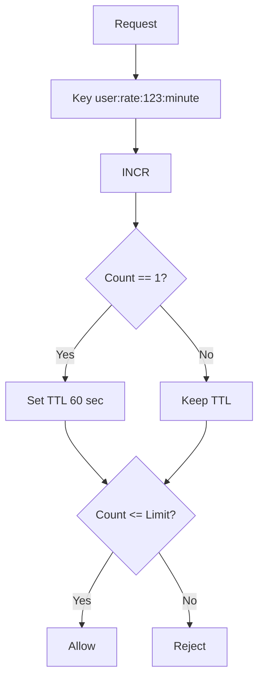

## Java Code

```java
import org.springframework.data.redis.core.RedisTemplate;
import org.springframework.stereotype.Service;

import java.time.Duration;

@Service
public class RateLimiterService {

    private final RedisTemplate<String, Object> redisTemplate;

    public RateLimiterService(RedisTemplate<String, Object> redisTemplate) {
        this.redisTemplate = redisTemplate;
    }

    public boolean allowRequest(String userId, int limitPerMinute) {
        String key = "rate:user:" + userId;

        Long count = redisTemplate.opsForValue().increment(key);

        if (count != null && count == 1) {
            redisTemplate.expire(key, Duration.ofMinutes(1));
        }

        return count != null && count <= limitPerMinute;
    }
}
```

## Controller Example

```java
import org.springframework.web.bind.annotation.*;

@RestController
@RequestMapping("/api")
public class ApiController {

    private final RateLimiterService rateLimiter;

    public ApiController(RateLimiterService rateLimiter) {
        this.rateLimiter = rateLimiter;
    }

    @GetMapping("/secure-data")
    public String getData(@RequestParam String userId) {
        boolean allowed = rateLimiter.allowRequest(userId, 100);

        if (!allowed) {
            return "Too many requests";
        }

        return "Success";
    }
}
```

---

# 24. Session Management

Redis is commonly used to share sessions across many Spring Boot instances.

## Session Architecture

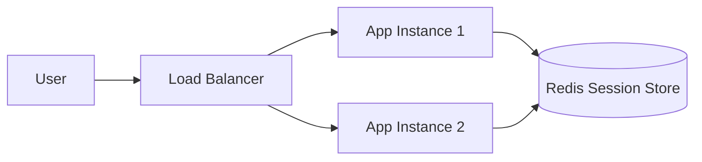

## Maven Dependency

```xml
<dependency>
    <groupId>org.springframework.session</groupId>
    <artifactId>spring-session-data-redis</artifactId>
</dependency>
```

## application.properties

```properties
spring.session.store-type=redis
server.servlet.session.timeout=30m
```

Now session data is stored in Redis instead of local JVM memory.

---

# 25. Redis with Spring Data Repositories

Spring Data Redis can persist objects using repository-style code.

## Entity

```java
import org.springframework.data.annotation.Id;
import org.springframework.data.redis.core.RedisHash;

import java.io.Serializable;

@RedisHash("Customer")
public class Customer implements Serializable {

    @Id
    private String id;
    private String name;
    private String email;

    public Customer() {
    }

    public Customer(String id, String name, String email) {
        this.id = id;
        this.name = name;
        this.email = email;
    }

    public String getId() {
        return id;
    }

    public String getName() {
        return name;
    }

    public String getEmail() {
        return email;
    }
}
```

## Repository

```java
import org.springframework.data.repository.CrudRepository;

public interface CustomerRepository extends CrudRepository<Customer, String> {
}
```

## Service

```java
import org.springframework.stereotype.Service;

import java.util.Optional;

@Service
public class CustomerService {

    private final CustomerRepository repository;

    public CustomerService(CustomerRepository repository) {
        this.repository = repository;
    }

    public Customer save(Customer customer) {
        return repository.save(customer);
    }

    public Optional<Customer> get(String id) {
        return repository.findById(id);
    }
}
```

---

# 26. Redis Serialization

Serialization means converting Java objects into bytes/string for Redis storage.

## Common Serializers

| Serializer | Pros | Cons |
|---|---|---|
| StringRedisSerializer | Human readable keys | Strings only |
| JdkSerializationRedisSerializer | Simple | Not readable, larger payload |
| GenericJackson2JsonRedisSerializer | JSON, flexible | Type metadata |
| Jackson2JsonRedisSerializer | JSON | Needs target class |
| GenericToStringSerializer | Simple values | Limited |

## Recommended

For most APIs:

```text
Keys: StringRedisSerializer
Values: GenericJackson2JsonRedisSerializer
```

## Bad Key Example

```text
\xAC\xED\x00\x05t\x00...
```

This happens when JDK serializer is used for keys.

Use string serializer for keys.

---

# 27. Redis Persistence

Redis is in-memory but can persist to disk.

## Types

| Type | Meaning |
|---|---|
| RDB | Snapshot persistence |
| AOF | Append-only file |
| No persistence | Cache-only mode |

## Persistence Diagram

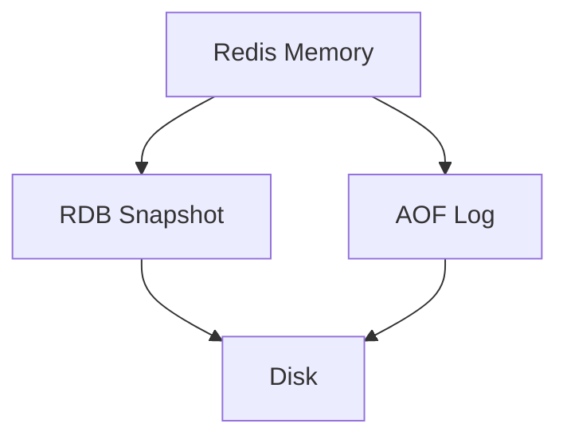

## RDB

Good for snapshots.

```text
save 900 1
save 300 10
save 60 10000
```

## AOF

Better durability.

```text
appendonly yes
appendfsync everysec
```

## Cache Use Case

If Redis is only cache, losing Redis data may be acceptable.

If Redis stores critical events or sessions, configure persistence carefully.

---

# 28. Redis Replication, Sentinel, and Cluster

## Replication

One primary Redis node copies data to replicas.

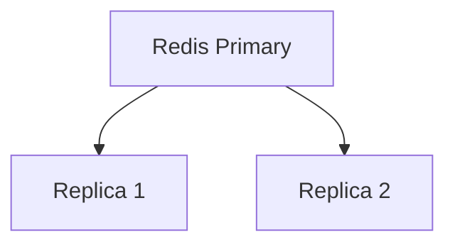

## Sentinel

Sentinel provides automatic failover.

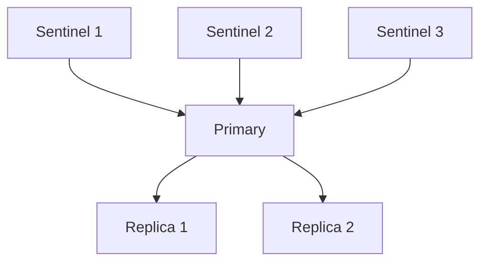

## Cluster

Cluster shards data across multiple primary nodes.

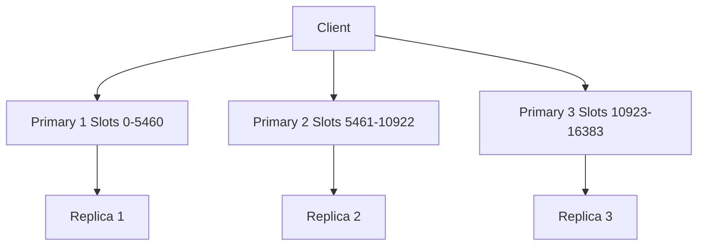

## When to Use What?

| Setup | Use Case |
|---|---|
| Single Redis | Local/dev/small app |
| Primary + Replica | Read scale and backup |
| Sentinel | High availability |
| Cluster | Large data and high throughput |

---

# 29. Monitoring Redis

## Important Redis Metrics

| Metric | Why Important |
|---|---|
| used_memory | Memory usage |
| connected_clients | Client connections |
| blocked_clients | Blocking operations |
| ops_per_sec | Throughput |
| keyspace_hits | Cache hits |
| keyspace_misses | Cache misses |
| evicted_keys | Memory pressure |
| expired_keys | TTL cleanup |
| rejected_connections | Connection limit issue |
| slowlog | Slow commands |

## Redis CLI Info

```bash
INFO
INFO memory
INFO stats
INFO clients
INFO keyspace
```

## Slow Log

```bash
SLOWLOG GET 10
```

## Cache Hit Ratio

```text
hit ratio = keyspace_hits / (keyspace_hits + keyspace_misses)
```

---

# 30. Production Best Practices

## Key Naming

Use consistent names:

```text
entity:id:field
loan:1001:status
customer:2001:profile
rate:user:1001
lock:loan:1001
```

## TTL Rules

Use TTL for:

- Cache keys
- Session keys
- Lock keys
- Rate limiter keys
- Temporary tokens

Avoid TTL for:

- Critical permanent data
- Stream keys unless planned
- Required audit data

## Avoid Big Keys

Bad:

```text
One list with millions of records
One hash with millions of fields
One string with huge JSON
```

Better:

```text
Split by date, tenant, customer, page, partition
```

## Avoid Dangerous Commands in Production

Avoid:

```bash
KEYS *
FLUSHALL
FLUSHDB
```

Use:

```bash
SCAN
```

## Memory Policy

Common policies:

```text
noeviction
allkeys-lru
volatile-lru
allkeys-lfu
volatile-ttl
```

For cache:

```text
allkeys-lru
```

For critical data:

```text
noeviction
```

---

# 31. Troubleshooting

## Problem: Cache Not Working

Checklist:

```text
[ ] Is @EnableCaching present?
[ ] Is spring.cache.type=redis configured?
[ ] Is Redis running?
[ ] Is method public?
[ ] Is method called through Spring bean, not same class self-call?
[ ] Is key correct?
[ ] Is serialization working?
```

---

## Problem: Redis Memory High

```mermaid
flowchart TD
    A[High Redis Memory] --> B[Check big keys]
    B --> C[Check TTL]
    C --> D[Check eviction policy]
    D --> E[Check cache object size]
    E --> F[Split or expire keys]
```

Commands:

```bash
INFO memory
SCAN 0 COUNT 100
MEMORY USAGE key-name
```

---

## Problem: Slow Redis

Checklist:

```text
[ ] Check SLOWLOG
[ ] Avoid KEYS *
[ ] Avoid huge values
[ ] Avoid large LRANGE 0 -1
[ ] Check network latency
[ ] Check CPU
[ ] Check blocked clients
```

Commands:

```bash
SLOWLOG GET 10
INFO commandstats
INFO clients
```

---

## Problem: Lock Not Released

Causes:

```text
[ ] App crashed before unlock
[ ] TTL too long
[ ] Unlock deleted another owner's lock
```

Fix:

```text
[ ] Always set TTL
[ ] Use unique token
[ ] Use Lua script for safe unlock
[ ] Consider Redisson
```

---

## Problem: Cache Stampede

Cache stampede happens when many requests miss cache at the same time.

```mermaid
sequenceDiagram
    participant C1 as Client 1
    participant C2 as Client 2
    participant C3 as Client 3
    participant API
    participant DB

    C1->>API: Cache miss
    C2->>API: Cache miss
    C3->>API: Cache miss
    API->>DB: Query
    API->>DB: Query
    API->>DB: Query
```

Fixes:

- Add distributed lock around cache rebuild
- Use short random TTL jitter
- Preload hot keys
- Use request coalescing

---

# 32. Final Cheat Sheet

## Redis Commands

| Use Case | Command |
|---|---|
| Set value | `SET key value` |
| Get value | `GET key` |
| Delete | `DEL key` |
| TTL | `TTL key` |
| Expire | `EXPIRE key seconds` |
| Hash set | `HSET key field value` |
| Hash get | `HGET key field` |
| List push | `LPUSH key value` |
| List pop | `RPOP key` |
| Set add | `SADD key value` |
| Set members | `SMEMBERS key` |
| Sorted set add | `ZADD key score value` |
| Sorted set range | `ZREVRANGE key 0 10 WITHSCORES` |
| Publish | `PUBLISH channel message` |
| Subscribe | `SUBSCRIBE channel` |
| Stream add | `XADD stream * field value` |
| Scan | `SCAN 0 MATCH pattern COUNT 100` |

---

## Spring Redis APIs

| Redis Type | Spring API |
|---|---|
| String | `opsForValue()` |
| Hash | `opsForHash()` |
| List | `opsForList()` |
| Set | `opsForSet()` |
| Sorted Set | `opsForZSet()` |
| Geo | `opsForGeo()` |
| HyperLogLog | `opsForHyperLogLog()` |
| Stream | `opsForStream()` |

---

## Which Redis Type Should I Use?

```mermaid
flowchart TD
    A[Need to store data] --> B{Simple value?}
    B -->|Yes| C[String]
    B -->|No| D{Object fields?}
    D -->|Yes| E[Hash]
    D -->|No| F{Queue/order?}
    F -->|Yes| G[List or Stream]
    F -->|No| H{Unique values?}
    H -->|Yes| I[Set]
    H -->|No| J{Ranking by score?}
    J -->|Yes| K[Sorted Set]
    J -->|No| L{Approx unique count?}
    L -->|Yes| M[HyperLogLog]
    L -->|No| N{Location?}
    N -->|Yes| O[Geo]
    N -->|No| P[String JSON or custom model]
```

---

# Final Advice

Redis is powerful, but it should be used carefully.

Use Redis when you need:

- Fast reads
- Temporary data
- Counters
- Locks
- Queues
- Pub/Sub
- Streams
- Rate limiting
- Sessions

Avoid Redis when:

- You need complex SQL queries
- You need strong relational consistency
- Data is too large for memory
- You cannot tolerate data loss and persistence is not configured

Start simple:

1. Use Redis as cache.
2. Add TTL.
3. Monitor hit ratio.
4. Add locks/rate limits only when needed.
5. Use streams for reliable async events.
6. Use cluster only when single-node Redis cannot handle memory or throughput.
