# Database Design for System Design Interviews — Ultimate Reference

> A practical, end-to-end guide to database design from **first principles** to **high-scale production architecture**.  
> Covers **SQL vs NoSQL**, **schema design**, **normalization**, **indexing**, **partitioning**, **sharding**, **replication**, **consistency**, **transactions**, **query optimization**, and a **small complete working Spring Boot + PostgreSQL example**.

---

## Table of Contents

1. [How to think about database design](#1-how-to-think-about-database-design)
2. [SQL vs NoSQL](#2-sql-vs-nosql)
3. [Schema design principles](#3-schema-design-principles)
4. [Normalization vs denormalization](#4-normalization-vs-denormalization)
5. [Indexing strategies](#5-indexing-strategies)
6. [Partitioning in PostgreSQL](#6-partitioning-in-postgresql)
7. [Sharding](#7-sharding)
8. [Replication patterns](#8-replication-patterns)
9. [Consistency models](#9-consistency-models)
10. [Transactions and distributed transactions](#10-transactions-and-distributed-transactions)
11. [Query optimization](#11-query-optimization)
12. [Real design examples](#12-real-design-examples)
13. [Complete working Spring Boot + PostgreSQL example](#13-complete-working-spring-boot--postgresql-example)
14. [Spring Boot patterns for partitioning and sharding](#14-spring-boot-patterns-for-partitioning-and-sharding)
15. [Interview answer templates](#15-interview-answer-templates)
16. [Final cheat sheets](#16-final-cheat-sheets)

---

# 1. How to think about database design

Database design is not about picking a trendy database. It is about matching your **data model**, **access patterns**, **consistency needs**, and **scale requirements**.

When an interviewer asks:

> “How would you store this data?”

They are usually testing whether you can reason about:

| Question | Why it matters |
|---|---|
| What entities exist? | Drives schema and relationships |
| What are the most important queries? | Drives indexes, partition keys, and shard keys |
| How much data will exist? | Drives storage and partitioning decisions |
| How much traffic is expected? | Drives read replicas, caching, sharding |
| Is stale data acceptable? | Drives consistency and replication strategy |
| Are transactions required? | Drives SQL vs NoSQL and service boundaries |

---

## 1.1 Practical workflow

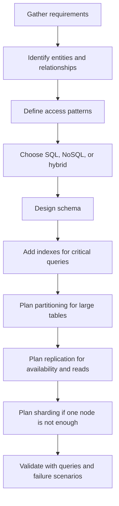

### Explanation

Start from **queries**, not technology. A schema that looks elegant but cannot answer the main queries efficiently is a bad design.

---

# 2. SQL vs NoSQL

## 2.1 Decision table

| Requirement | Prefer SQL | Prefer NoSQL |
|---|---:|---:|
| Strong transactions | ✅ | Sometimes |
| Complex joins | ✅ | ❌ |
| Referential integrity | ✅ | Usually app-managed |
| Flexible schema | Limited | ✅ |
| Huge write scale | Harder | Often easier |
| Query by many dimensions | ✅ | Depends on model |
| Query by primary key only | ✅ | ✅ |
| Nested document reads | Possible with JSONB | ✅ |
| Ad-hoc analytics | ✅ | Weaker |

---

## 2.2 SQL example

```sql
CREATE TABLE users (
    id BIGSERIAL PRIMARY KEY,
    name VARCHAR(100) NOT NULL,
    email VARCHAR(255) UNIQUE NOT NULL
);

CREATE TABLE orders (
    id BIGSERIAL PRIMARY KEY,
    user_id BIGINT NOT NULL REFERENCES users(id),
    total_amount DECIMAL(10,2) NOT NULL,
    created_at TIMESTAMPTZ DEFAULT NOW()
);
```

### When SQL is best

Use SQL when you need:

- ACID transactions
- joins
- constraints
- relational data
- financial correctness
- inventory correctness
- reporting and ad-hoc queries

---

## 2.3 NoSQL categories

| Type | Examples | Best for | Weakness |
|---|---|---|---|
| Document | MongoDB, Couchbase | JSON-like objects, catalogs, profiles | Joins weaker than SQL |
| Key-value | Redis, DynamoDB | sessions, cache, counters | Limited query model |
| Wide-column | Cassandra, HBase | high-write event/time-series data | Modeling is query-first |
| Graph | Neo4j, Neptune | relationship traversal | Specialized operational model |

---

## 2.4 Hybrid architecture

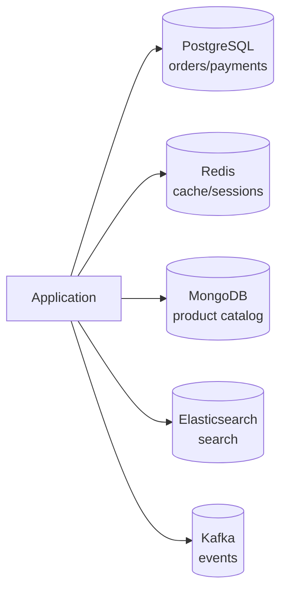

### Explanation

Large systems rarely use one database for everything. Use each database for the job it is good at.

---

# 3. Schema design principles

## 3.1 Start with entities

Example e-commerce model:

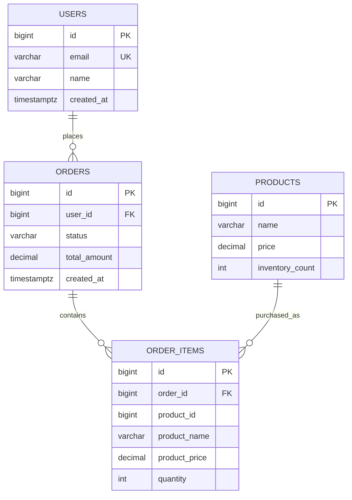

---

## 3.2 Choose primary keys carefully

| Key type | Pros | Cons | Use when |
|---|---|---|---|
| `BIGSERIAL` | Small, fast, index-friendly | Not globally unique | Single DB or simple systems |
| UUID | Globally unique | Bigger index, random inserts | Distributed ID generation |
| UUIDv7 / ULID | Globally unique and time-sortable | Needs library/support | High-scale distributed systems |
| Snowflake ID | Compact, sortable, distributed | Requires ID generator | Very high-scale systems |

---

## 3.3 Use correct data types

| Data | Recommended type | Why |
|---|---|---|
| Money | `DECIMAL(10,2)` | Avoid floating point errors |
| Timestamp | `TIMESTAMPTZ` | Time zone safe |
| ID | `BIGINT`, `UUID`, `ULID` | Scalable identity |
| JSON | `JSONB` | Flexible and indexable |
| Flag | `BOOLEAN` | Clear meaning |
| Status | `VARCHAR` + `CHECK` or enum | Prevent invalid states |

---

## 3.4 Constraints matter

```sql
CREATE TABLE users (
    id BIGSERIAL PRIMARY KEY,
    email VARCHAR(255) UNIQUE NOT NULL,
    age INT CHECK (age >= 0 AND age < 150),
    status VARCHAR(20) NOT NULL CHECK (status IN ('ACTIVE', 'INACTIVE', 'BANNED'))
);
```

### Explanation

Constraints protect the database from bad application code. Use them by default.

---

# 4. Normalization vs denormalization

## 4.1 Normalization

Normalization stores each fact once.

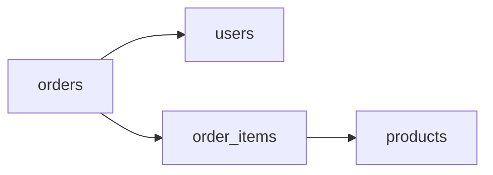

### Benefits

| Benefit | Explanation |
|---|---|
| Less duplication | User/product data stored once |
| Easier updates | Change product name in one place |
| Better consistency | Foreign keys protect relationships |

### Cost

More joins may be required.

---

## 4.2 Denormalization

Denormalization duplicates data for faster reads.

Example:

```sql
CREATE TABLE order_items (
    id BIGSERIAL PRIMARY KEY,
    order_id BIGINT NOT NULL REFERENCES orders(id),
    product_id BIGINT NOT NULL,
    product_name VARCHAR(255) NOT NULL,
    product_price DECIMAL(10,2) NOT NULL,
    quantity INT NOT NULL CHECK (quantity > 0)
);
```

### Why store `product_name` and `product_price` here?

Because an order is a historical record. If the product price changes later, old orders should still show the original purchased price.

---

## 4.3 Rule of thumb

| Situation | Recommendation |
|---|---|
| Core transactional data | Normalize first |
| Historical snapshots | Denormalize intentionally |
| Hot read paths | Denormalize carefully |
| Analytics/reporting | Denormalize aggressively |

---

# 5. Indexing strategies

Indexes are one of the most important database performance tools.

## 5.1 How an index works

Without index:

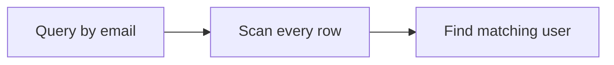

With index:

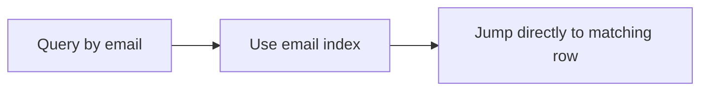

---

## 5.2 Common index types

| Index type | Example | Use case |
|---|---|---|
| Single-column | `email` | Lookup by one column |
| Unique | `email UNIQUE` | Prevent duplicates |
| Composite | `(user_id, status, created_at)` | Multi-condition queries |
| Partial | `WHERE status = 'PENDING'` | Index subset of rows |
| Covering | Includes selected columns | Avoid table lookup |
| GIN | `JSONB`, arrays, full-text | Search inside complex values |

---

## 5.3 Index examples

### Single-column index

```sql
CREATE INDEX idx_orders_user_id
ON orders(user_id);
```

### Unique index

```sql
CREATE UNIQUE INDEX idx_users_email_unique
ON users(email);
```

### Composite index

```sql
CREATE INDEX idx_orders_user_status_created
ON orders(user_id, status, created_at DESC);
```

### Partial index

```sql
CREATE INDEX idx_orders_pending_created
ON orders(created_at DESC)
WHERE status = 'PENDING';
```

---

## 5.4 Composite index order matters

Index:

```sql
CREATE INDEX idx_orders_user_status_created
ON orders(user_id, status, created_at DESC);
```

Good queries:

```sql
SELECT *
FROM orders
WHERE user_id = 42;

SELECT *
FROM orders
WHERE user_id = 42
  AND status = 'PENDING'
ORDER BY created_at DESC;
```

Bad query for this index:

```sql
SELECT *
FROM orders
WHERE status = 'PENDING';
```

### Why?

The index starts with `user_id`. If the query does not filter by `user_id`, PostgreSQL may not be able to use the index efficiently.

---

## 5.5 Index design rule

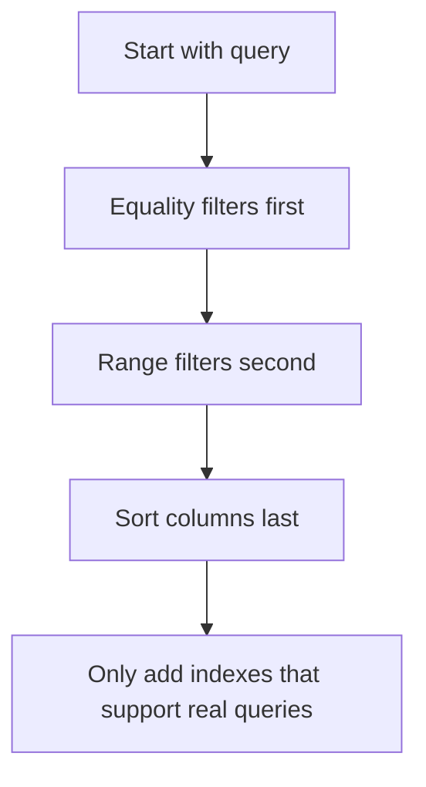

---

## 5.6 Step-by-step indexing example

### Step 1: slow query

```sql
SELECT *
FROM orders
WHERE user_id = 42
  AND status = 'PENDING'
ORDER BY created_at DESC
LIMIT 20;
```

### Step 2: matching index

```sql
CREATE INDEX idx_orders_user_status_created
ON orders(user_id, status, created_at DESC);
```

### Step 3: verify

```sql
EXPLAIN ANALYZE
SELECT *
FROM orders
WHERE user_id = 42
  AND status = 'PENDING'
ORDER BY created_at DESC
LIMIT 20;
```

### What to look for

| Good sign | Bad sign |
|---|---|
| `Index Scan` | `Seq Scan` on huge table |
| Low rows scanned | Millions of rows removed by filter |
| Low execution time | Sorting large result set |

---

# 6. Partitioning in PostgreSQL

Partitioning splits one large logical table into smaller physical tables inside the same database.

## 6.1 Partitioning vs sharding

| Concept | Meaning | Location |
|---|---|---|
| Partitioning | Split a table into pieces | Same database cluster |
| Sharding | Split data across servers | Multiple database nodes |

---

## 6.2 When to partition

Use partitioning when:

- a table is very large
- queries usually filter by date, tenant, or region
- old data must be deleted quickly
- maintenance should happen partition by partition

Avoid partitioning when:

- the table is small
- queries do not filter by partition key
- the key has very low cardinality
- you would create thousands of tiny partitions

---

## 6.3 Range partitioning by time

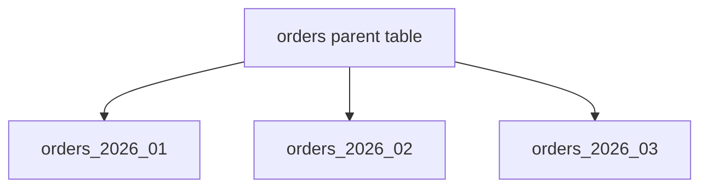

### Parent table

```sql
CREATE TABLE orders (
    id BIGSERIAL,
    user_id BIGINT NOT NULL,
    status VARCHAR(20) NOT NULL,
    total_amount DECIMAL(10,2) NOT NULL,
    created_at TIMESTAMPTZ NOT NULL
) PARTITION BY RANGE (created_at);
```

### Child partitions

```sql
CREATE TABLE orders_2026_01 PARTITION OF orders
FOR VALUES FROM ('2026-01-01') TO ('2026-02-01');

CREATE TABLE orders_2026_02 PARTITION OF orders
FOR VALUES FROM ('2026-02-01') TO ('2026-03-01');

CREATE TABLE orders_2026_03 PARTITION OF orders
FOR VALUES FROM ('2026-03-01') TO ('2026-04-01');
```

### Query with partition pruning

```sql
EXPLAIN ANALYZE
SELECT *
FROM orders
WHERE created_at >= '2026-02-01'
  AND created_at < '2026-03-01';
```

Only the February partition should be scanned.

---

## 6.4 List partitioning by region

```sql
CREATE TABLE customers (
    id BIGSERIAL,
    region VARCHAR(20) NOT NULL,
    name VARCHAR(100) NOT NULL
) PARTITION BY LIST (region);

CREATE TABLE customers_us PARTITION OF customers
FOR VALUES IN ('US');

CREATE TABLE customers_eu PARTITION OF customers
FOR VALUES IN ('EU');
```

---

## 6.5 Hash partitioning by user

```sql
CREATE TABLE sessions (
    id BIGSERIAL,
    user_id BIGINT NOT NULL,
    token VARCHAR(255) NOT NULL
) PARTITION BY HASH (user_id);

CREATE TABLE sessions_p0 PARTITION OF sessions
FOR VALUES WITH (MODULUS 4, REMAINDER 0);

CREATE TABLE sessions_p1 PARTITION OF sessions
FOR VALUES WITH (MODULUS 4, REMAINDER 1);

CREATE TABLE sessions_p2 PARTITION OF sessions
FOR VALUES WITH (MODULUS 4, REMAINDER 2);

CREATE TABLE sessions_p3 PARTITION OF sessions
FOR VALUES WITH (MODULUS 4, REMAINDER 3);
```

---

## 6.6 Partition maintenance

| Operation | Why it helps |
|---|---|
| Add next partition | Prevent inserts from failing |
| Drop old partition | Fast archival/deletion |
| Index each partition | Improves local queries |
| Monitor partition count | Too many partitions can slow planning |

Example:

```sql
DROP TABLE orders_2025_01;
```

This is much faster than deleting millions or billions of rows.

---

# 7. Sharding

Sharding spreads data across multiple database servers.

## 7.1 High-level architecture

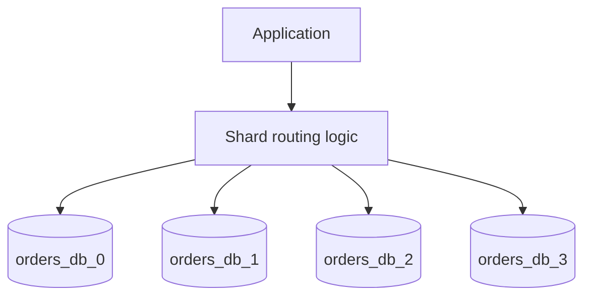

---

## 7.2 Sharding strategies

| Strategy | Rule | Pros | Cons |
|---|---|---|---|
| Range | `user_id 1-1M -> shard 1` | Easy range queries | Hot shards possible |
| Hash | `hash(user_id) % N` | Even distribution | Resharding harder |
| Directory | mapping table | Flexible placement | Extra lookup/service |
| Geo | region-based | Data locality | Uneven traffic possible |

---

## 7.3 Hash sharding example

```java
int shard = Math.abs(Long.hashCode(userId)) % 4;
```

| user_id | hash result | shard |
|---:|---:|---:|
| 42 | hash(42) | 2 |
| 99 | hash(99) | 3 |
| 123 | hash(123) | 1 |

---

## 7.4 Cross-shard query problem

Query with shard key:

```sql
SELECT *
FROM orders
WHERE user_id = 42;
```

Efficient because the application can route to one shard.

Query without shard key:

```sql
SELECT *
FROM orders
WHERE status = 'PENDING';
```

Expensive because the application may need to query every shard.

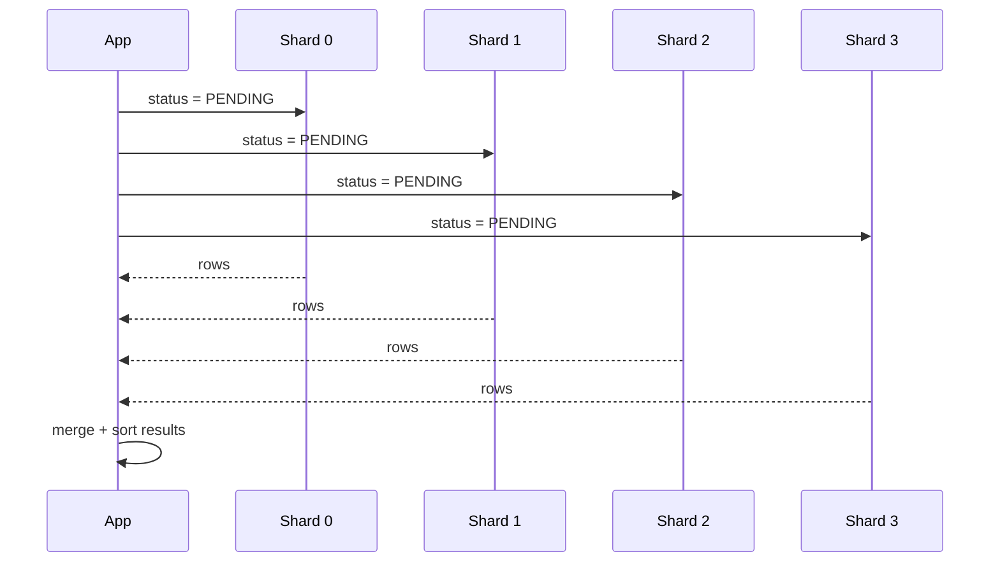

---

## 7.5 Sharding best practices

- choose a high-cardinality shard key
- avoid hot keys
- keep related data together
- avoid cross-shard joins
- avoid cross-shard transactions
- plan resharding before it becomes urgent
- monitor shard imbalance

---

# 8. Replication patterns

Replication copies data to improve availability, durability, and read scalability.

## 8.1 Single-leader replication

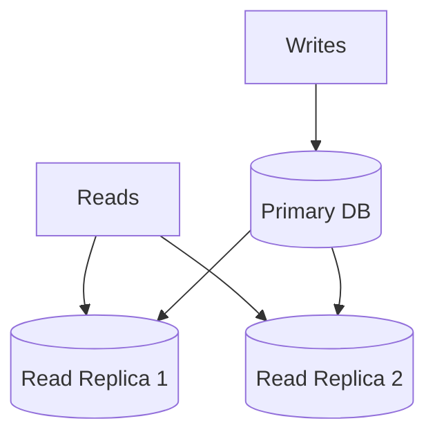

### Explanation

Writes go to the primary. Reads can go to replicas. This improves read scale, but replicas may lag behind.

---

## 8.2 Synchronous vs asynchronous replication

| Mode | Write acknowledgment | Pros | Cons |
|---|---|---|---|
| Synchronous | After replica confirms | Strong durability | Higher latency |
| Asynchronous | After primary writes | Fast writes | Replica lag/data loss risk |

---

## 8.3 Multi-leader replication

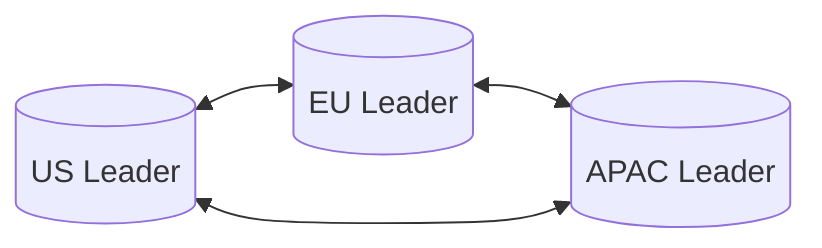

### Use case

Low-latency writes in multiple regions.

### Main problem

Conflicts. Two regions may update the same record at the same time.

---

## 8.4 Leaderless quorum replication

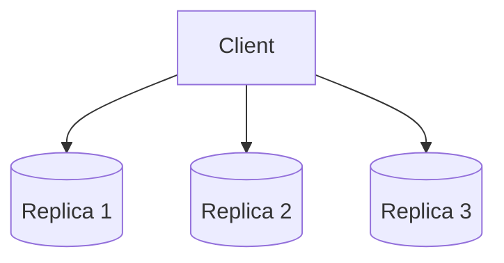

If:

```text
N = 3
W = 2
R = 2
W + R > N
```

Then read and write quorums overlap.

---

# 9. Consistency models

| Model | Meaning | Good for |
|---|---|---|
| Strong consistency | Reads see latest committed write | money, inventory |
| Eventual consistency | Replicas converge over time | feeds, analytics |
| Read-your-writes | User sees their own update | profile/cart |
| Causal consistency | Dependent events appear in order | comments/replies |

---

## 9.1 Choosing consistency

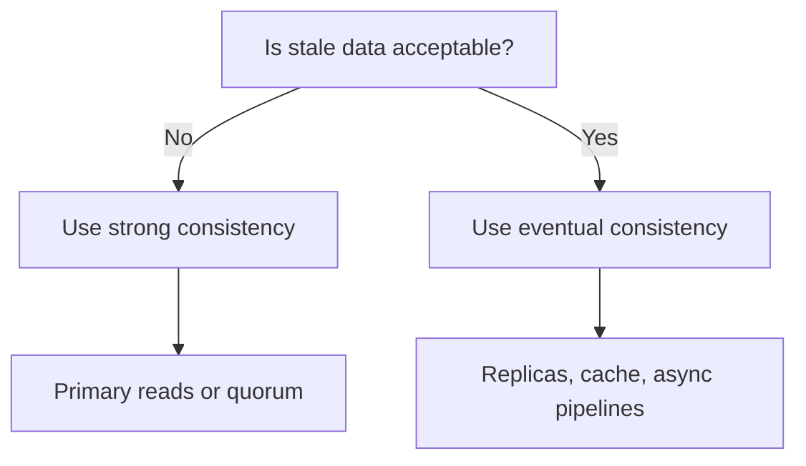

---

# 10. Transactions and distributed transactions

## 10.1 Local transaction

```sql
BEGIN;

UPDATE accounts SET balance = balance - 100 WHERE id = 1;
UPDATE accounts SET balance = balance + 100 WHERE id = 2;

COMMIT;
```

Use when all required data is in one database.

---

## 10.2 Isolation levels

| Isolation level | Dirty read | Non-repeatable read | Phantom read |
|---|---:|---:|---:|
| Read uncommitted | Possible | Possible | Possible |
| Read committed | No | Possible | Possible |
| Repeatable read | No | No | Possible |
| Serializable | No | No | No |

---

## 10.3 Distributed transaction options

| Pattern | How it works | Use when |
|---|---|---|
| 2PC | Coordinator commits all participants | Strong consistency across resources |
| Saga | Sequence of local transactions + compensations | Microservices |
| Outbox | Write DB row and event in same local transaction | Reliable event publishing |
| TCC | Try, confirm, cancel | Reservation systems |

---

## 10.4 Outbox pattern

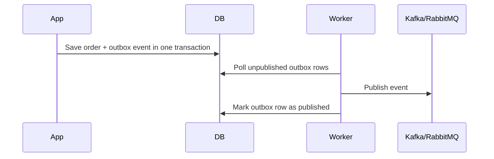

---

# 11. Query optimization

## 11.1 Use EXPLAIN ANALYZE

```sql
EXPLAIN ANALYZE
SELECT *
FROM orders
WHERE user_id = 42
  AND status = 'PENDING';
```

Look for:

| Problem | Meaning | Possible fix |
|---|---|---|
| Seq Scan on huge table | Full table scan | Add index |
| Large sort | Sorting many rows | Add index matching order |
| Nested loop on huge input | Bad join strategy | Better indexes/statistics |
| Rows removed by filter | Read too many rows | Better predicate/index |

---

## 11.2 Common fixes

```sql
-- Add index
CREATE INDEX idx_orders_user_status
ON orders(user_id, status);

-- Select fewer columns
SELECT id, total_amount, status
FROM orders
WHERE user_id = 42;

-- Add limit
SELECT *
FROM orders
WHERE user_id = 42
ORDER BY created_at DESC
LIMIT 20;
```

---

## 11.3 Caching read path

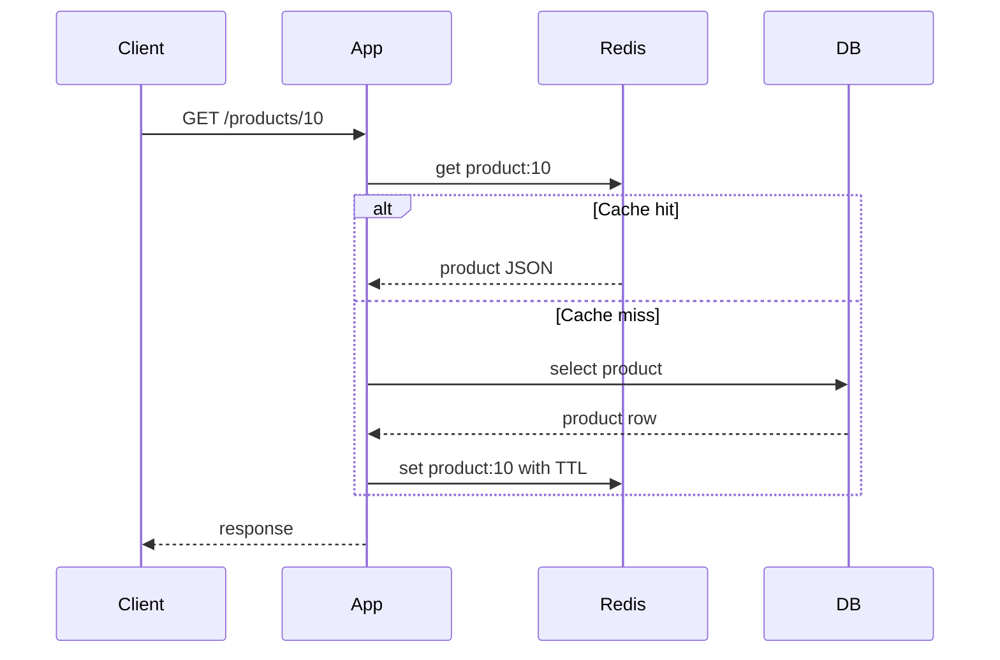

---

# 12. Real design examples

## 12.1 E-commerce order system

### Good database choices

| Data | Store | Why |
|---|---|---|
| users/orders/payments | PostgreSQL | ACID and constraints |
| sessions/cart cache | Redis | Fast key-value |
| product search | Elasticsearch | Search relevance |
| events | Kafka + warehouse | Analytics |

### Core schema

```sql
CREATE TABLE users (
    id BIGSERIAL PRIMARY KEY,
    email VARCHAR(255) UNIQUE NOT NULL
);

CREATE TABLE products (
    id BIGSERIAL PRIMARY KEY,
    name VARCHAR(255) NOT NULL,
    price DECIMAL(10,2) NOT NULL,
    inventory_count INT NOT NULL CHECK (inventory_count >= 0)
);

CREATE TABLE orders (
    id BIGSERIAL PRIMARY KEY,
    user_id BIGINT NOT NULL REFERENCES users(id),
    status VARCHAR(20) NOT NULL DEFAULT 'PENDING',
    total_amount DECIMAL(10,2) NOT NULL,
    created_at TIMESTAMPTZ DEFAULT NOW()
);
```

---

## 12.2 Feed system

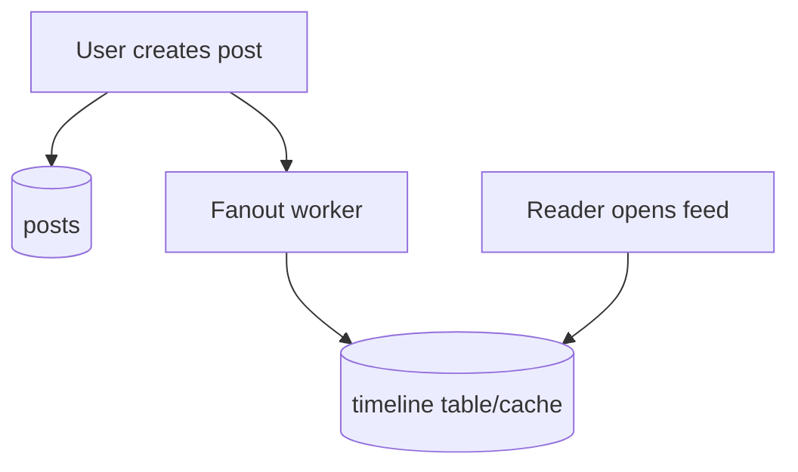

| Model | How it works | Best for |
|---|---|---|
| Pull | Query followed users at read time | Small follow graph |
| Push | Precompute timelines | Fast reads |
| Hybrid | Push normal users, pull celebrities | Large social systems |

---

# 13. Complete working Spring Boot + PostgreSQL example

This section contains a small runnable application.

## 13.1 What it demonstrates

| Feature | Where |
|---|---|
| Schema design | `schema.sql` |
| Indexing | `idx_orders_user_status_created` |
| Transaction | `OrderService#createOrder` |
| Inventory-safe update | `ProductRepository#reserveInventory` |
| Query optimization | `EXPLAIN ANALYZE` endpoint |
| PostgreSQL partitioning example | `partitioning.sql` |
| Replication explanation | Docker note |
| Manual sharding pattern | Section 14 |

---

## 13.2 Project structure

```text
shop-demo/
  pom.xml
  docker-compose.yml
  src/main/resources/
    application.yml
    schema.sql
    data.sql
    partitioning.sql
  src/main/java/com/example/shop/
    ShopApplication.java
    product/
      ProductEntity.java
      ProductRepository.java
    order/
      OrderEntity.java
      OrderRepository.java
      OrderService.java
      OrderController.java
      CreateOrderRequest.java
```

---

## 13.3 docker-compose.yml

```yaml
services:
  postgres:
    image: postgres:16
    container_name: shop-postgres
    environment:
      POSTGRES_DB: shopdb
      POSTGRES_USER: postgres
      POSTGRES_PASSWORD: postgres
    ports:
      - "5432:5432"
```

Run:

```bash
docker compose up -d
```

---

## 13.4 pom.xml

```xml
<project xmlns="http://maven.apache.org/POM/4.0.0"
         xmlns:xsi="http://www.w3.org/2001/XMLSchema-instance"
         xsi:schemaLocation="http://maven.apache.org/POM/4.0.0 https://maven.apache.org/xsd/maven-4.0.0.xsd">

    <modelVersion>4.0.0</modelVersion>

    <groupId>com.example</groupId>
    <artifactId>shop-demo</artifactId>
    <version>0.0.1-SNAPSHOT</version>

    <parent>
        <groupId>org.springframework.boot</groupId>
        <artifactId>spring-boot-starter-parent</artifactId>
        <version>3.3.4</version>
        <relativePath/>
    </parent>

    <properties>
        <java.version>21</java.version>
    </properties>

    <dependencies>
        <dependency>
            <groupId>org.springframework.boot</groupId>
            <artifactId>spring-boot-starter-web</artifactId>
        </dependency>

        <dependency>
            <groupId>org.springframework.boot</groupId>
            <artifactId>spring-boot-starter-data-jpa</artifactId>
        </dependency>

        <dependency>
            <groupId>org.springframework.boot</groupId>
            <artifactId>spring-boot-starter-validation</artifactId>
        </dependency>

        <dependency>
            <groupId>org.postgresql</groupId>
            <artifactId>postgresql</artifactId>
            <scope>runtime</scope>
        </dependency>
    </dependencies>
</project>
```

---

## 13.5 application.yml

```yaml
spring:
  datasource:
    url: jdbc:postgresql://localhost:5432/shopdb
    username: postgres
    password: postgres
    hikari:
      maximum-pool-size: 10
      minimum-idle: 2
      connection-timeout: 30000

  sql:
    init:
      mode: always

  jpa:
    hibernate:
      ddl-auto: none
    show-sql: true
    properties:
      hibernate:
        format_sql: true

server:
  port: 8080
```

---

## 13.6 schema.sql

```sql
DROP TABLE IF EXISTS order_items;
DROP TABLE IF EXISTS orders;
DROP TABLE IF EXISTS products;
DROP TABLE IF EXISTS users;

CREATE TABLE users (
    id BIGSERIAL PRIMARY KEY,
    email VARCHAR(255) UNIQUE NOT NULL,
    name VARCHAR(100) NOT NULL,
    created_at TIMESTAMPTZ NOT NULL DEFAULT NOW()
);

CREATE TABLE products (
    id BIGSERIAL PRIMARY KEY,
    name VARCHAR(255) NOT NULL,
    price DECIMAL(10,2) NOT NULL CHECK (price >= 0),
    inventory_count INT NOT NULL CHECK (inventory_count >= 0),
    created_at TIMESTAMPTZ NOT NULL DEFAULT NOW()
);

CREATE TABLE orders (
    id BIGSERIAL PRIMARY KEY,
    user_id BIGINT NOT NULL REFERENCES users(id),
    status VARCHAR(20) NOT NULL CHECK (status IN ('PENDING', 'CONFIRMED', 'CANCELLED')),
    total_amount DECIMAL(10,2) NOT NULL CHECK (total_amount >= 0),
    created_at TIMESTAMPTZ NOT NULL DEFAULT NOW()
);

CREATE TABLE order_items (
    id BIGSERIAL PRIMARY KEY,
    order_id BIGINT NOT NULL REFERENCES orders(id),
    product_id BIGINT NOT NULL,
    product_name VARCHAR(255) NOT NULL,
    product_price DECIMAL(10,2) NOT NULL,
    quantity INT NOT NULL CHECK (quantity > 0)
);

CREATE INDEX idx_orders_user_status_created
ON orders(user_id, status, created_at DESC);

CREATE INDEX idx_products_name
ON products(name);
```

---

## 13.7 data.sql

```sql
INSERT INTO users(email, name)
VALUES
('alice@example.com', 'Alice'),
('bob@example.com', 'Bob');

INSERT INTO products(name, price, inventory_count)
VALUES
('Laptop', 999.99, 10),
('Mouse', 49.99, 100),
('Keyboard', 89.99, 50);
```

---

## 13.8 ShopApplication.java

```java
package com.example.shop;

import org.springframework.boot.SpringApplication;
import org.springframework.boot.autoconfigure.SpringBootApplication;

@SpringBootApplication
public class ShopApplication {
    public static void main(String[] args) {
        SpringApplication.run(ShopApplication.class, args);
    }
}
```

---

## 13.9 ProductEntity.java

```java
package com.example.shop.product;

import jakarta.persistence.*;
import java.math.BigDecimal;
import java.time.OffsetDateTime;

@Entity
@Table(name = "products")
public class ProductEntity {

    @Id
    @GeneratedValue(strategy = GenerationType.IDENTITY)
    private Long id;

    private String name;

    @Column(nullable = false, precision = 10, scale = 2)
    private BigDecimal price;

    @Column(name = "inventory_count", nullable = false)
    private Integer inventoryCount;

    @Column(name = "created_at", nullable = false)
    private OffsetDateTime createdAt;

    public Long getId() { return id; }
    public String getName() { return name; }
    public BigDecimal getPrice() { return price; }
    public Integer getInventoryCount() { return inventoryCount; }
    public OffsetDateTime getCreatedAt() { return createdAt; }
}
```

---

## 13.10 ProductRepository.java

```java
package com.example.shop.product;

import org.springframework.data.jpa.repository.*;
import org.springframework.data.repository.query.Param;

public interface ProductRepository extends JpaRepository<ProductEntity, Long> {

    @Modifying
    @Query("""
        update ProductEntity p
        set p.inventoryCount = p.inventoryCount - :quantity
        where p.id = :productId
          and p.inventoryCount >= :quantity
    """)
    int reserveInventory(@Param("productId") Long productId,
                         @Param("quantity") int quantity);
}
```

---

## 13.11 OrderEntity.java

```java
package com.example.shop.order;

import jakarta.persistence.*;
import java.math.BigDecimal;
import java.time.OffsetDateTime;

@Entity
@Table(name = "orders")
public class OrderEntity {

    @Id
    @GeneratedValue(strategy = GenerationType.IDENTITY)
    private Long id;

    @Column(name = "user_id", nullable = false)
    private Long userId;

    private String status;

    @Column(name = "total_amount", nullable = false, precision = 10, scale = 2)
    private BigDecimal totalAmount;

    @Column(name = "created_at", nullable = false)
    private OffsetDateTime createdAt;

    public Long getId() { return id; }
    public Long getUserId() { return userId; }
    public String getStatus() { return status; }
    public BigDecimal getTotalAmount() { return totalAmount; }
    public OffsetDateTime getCreatedAt() { return createdAt; }

    public void setUserId(Long userId) { this.userId = userId; }
    public void setStatus(String status) { this.status = status; }
    public void setTotalAmount(BigDecimal totalAmount) { this.totalAmount = totalAmount; }
}
```

---

## 13.12 OrderRepository.java

```java
package com.example.shop.order;

import org.springframework.data.jpa.repository.JpaRepository;
import java.util.List;

public interface OrderRepository extends JpaRepository<OrderEntity, Long> {
    List<OrderEntity> findTop20ByUserIdAndStatusOrderByCreatedAtDesc(Long userId, String status);
}
```

---

## 13.13 CreateOrderRequest.java

```java
package com.example.shop.order;

import jakarta.validation.constraints.Min;
import jakarta.validation.constraints.NotNull;

public record CreateOrderRequest(
        @NotNull Long userId,
        @NotNull Long productId,
        @Min(1) int quantity
) {}
```

---

## 13.14 OrderService.java

```java
package com.example.shop.order;

import com.example.shop.product.ProductEntity;
import com.example.shop.product.ProductRepository;
import jakarta.transaction.Transactional;
import org.springframework.stereotype.Service;

import java.math.BigDecimal;
import java.util.List;

@Service
public class OrderService {

    private final ProductRepository productRepository;
    private final OrderRepository orderRepository;

    public OrderService(ProductRepository productRepository,
                        OrderRepository orderRepository) {
        this.productRepository = productRepository;
        this.orderRepository = orderRepository;
    }

    @Transactional
    public OrderEntity createOrder(CreateOrderRequest request) {
        int updatedRows = productRepository.reserveInventory(
                request.productId(),
                request.quantity()
        );

        if (updatedRows == 0) {
            throw new IllegalStateException("Product is out of stock");
        }

        ProductEntity product = productRepository.findById(request.productId())
                .orElseThrow(() -> new IllegalArgumentException("Product not found"));

        BigDecimal total = product.getPrice()
                .multiply(BigDecimal.valueOf(request.quantity()));

        OrderEntity order = new OrderEntity();
        order.setUserId(request.userId());
        order.setStatus("CONFIRMED");
        order.setTotalAmount(total);

        return orderRepository.save(order);
    }

    public List<OrderEntity> latestConfirmedOrders(Long userId) {
        return orderRepository.findTop20ByUserIdAndStatusOrderByCreatedAtDesc(
                userId,
                "CONFIRMED"
        );
    }
}
```

---

## 13.15 OrderController.java

```java
package com.example.shop.order;

import jakarta.validation.Valid;
import org.springframework.jdbc.core.JdbcTemplate;
import org.springframework.web.bind.annotation.*;

import java.util.List;

@RestController
@RequestMapping("/orders")
public class OrderController {

    private final OrderService orderService;
    private final JdbcTemplate jdbcTemplate;

    public OrderController(OrderService orderService, JdbcTemplate jdbcTemplate) {
        this.orderService = orderService;
        this.jdbcTemplate = jdbcTemplate;
    }

    @PostMapping
    public OrderEntity create(@Valid @RequestBody CreateOrderRequest request) {
        return orderService.createOrder(request);
    }

    @GetMapping
    public List<OrderEntity> latestConfirmed(@RequestParam Long userId) {
        return orderService.latestConfirmedOrders(userId);
    }

    @GetMapping("/explain")
    public List<String> explain(@RequestParam Long userId) {
        return jdbcTemplate.queryForList("""
            EXPLAIN ANALYZE
            SELECT *
            FROM orders
            WHERE user_id = ?
              AND status = 'CONFIRMED'
            ORDER BY created_at DESC
            LIMIT 20
            """, String.class, userId);
    }
}
```

---

## 13.16 Run the app

### Step 1: start PostgreSQL

```bash
docker compose up -d
```

### Step 2: run Spring Boot

```bash
mvn spring-boot:run
```

### Step 3: create order

```bash
curl -X POST http://localhost:8080/orders \
  -H "Content-Type: application/json" \
  -d '{"userId":1,"productId":1,"quantity":2}'
```

### Step 4: list latest confirmed orders

```bash
curl "http://localhost:8080/orders?userId=1"
```

### Step 5: check query plan

```bash
curl "http://localhost:8080/orders/explain?userId=1"
```

You should see an index-based plan when enough data exists.

---

## 13.17 partitioning.sql

This is a separate learning script. Do not run it together with the normal `schema.sql` unless you intentionally replace the `orders` table.

```sql
DROP TABLE IF EXISTS orders_partitioned CASCADE;

CREATE TABLE orders_partitioned (
    id BIGSERIAL,
    user_id BIGINT NOT NULL,
    status VARCHAR(20) NOT NULL,
    total_amount DECIMAL(10,2) NOT NULL,
    created_at TIMESTAMPTZ NOT NULL
) PARTITION BY RANGE (created_at);

CREATE TABLE orders_partitioned_2026_01
PARTITION OF orders_partitioned
FOR VALUES FROM ('2026-01-01') TO ('2026-02-01');

CREATE TABLE orders_partitioned_2026_02
PARTITION OF orders_partitioned
FOR VALUES FROM ('2026-02-01') TO ('2026-03-01');

CREATE INDEX idx_orders_partitioned_2026_01_user_created
ON orders_partitioned_2026_01(user_id, created_at DESC);

CREATE INDEX idx_orders_partitioned_2026_02_user_created
ON orders_partitioned_2026_02(user_id, created_at DESC);

INSERT INTO orders_partitioned(user_id, status, total_amount, created_at)
VALUES
(1, 'CONFIRMED', 99.99, '2026-01-15'),
(1, 'CONFIRMED', 49.99, '2026-02-10');

EXPLAIN ANALYZE
SELECT *
FROM orders_partitioned
WHERE created_at >= '2026-02-01'
  AND created_at < '2026-03-01'
  AND user_id = 1;
```

---

## 13.18 Replication example with PostgreSQL

In production, replication is usually configured at the database/infrastructure level, not inside Spring Boot.

Spring Boot can use:

| Data source | Use |
|---|---|
| Primary | writes and strong reads |
| Replica | read-only queries |

Conceptual routing:

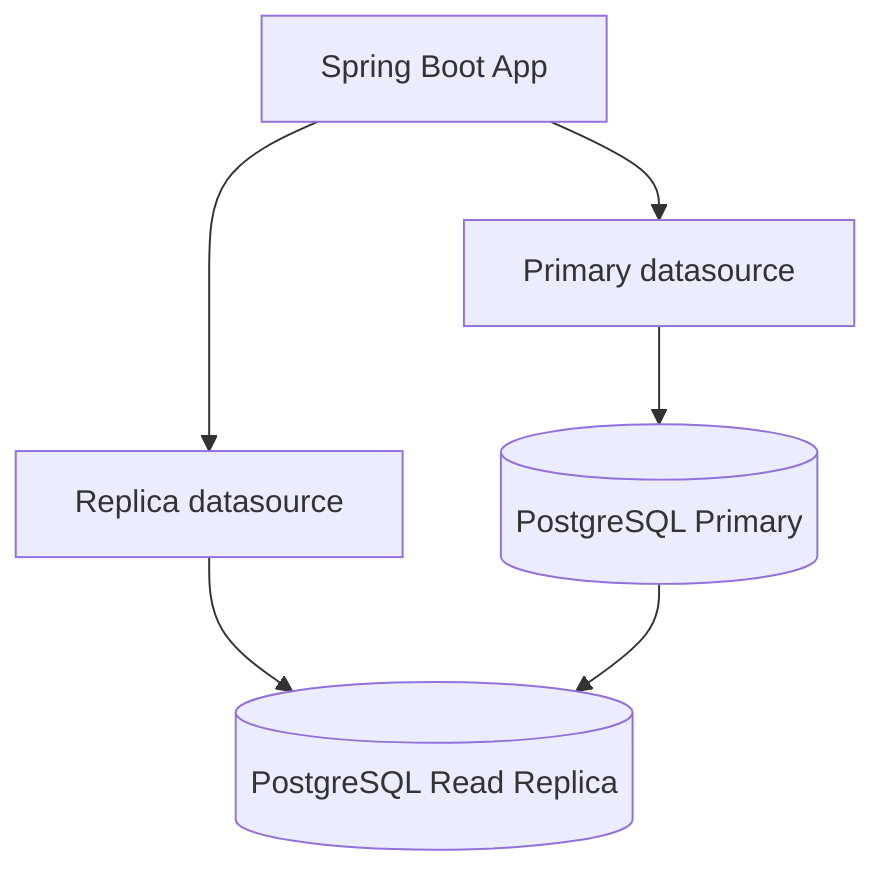

Simple rule:

- use primary for writes
- use primary for read-after-write flows
- use replicas for dashboards, feeds, and stale-tolerant reads

---

# 14. Spring Boot patterns for partitioning and sharding

## 14.1 Partitioning with PostgreSQL

Partitioning is transparent to the application when done in the database.

Your app queries the parent table:

```sql
SELECT *
FROM orders_partitioned
WHERE created_at >= ?
  AND created_at < ?;
```

PostgreSQL routes the query to relevant partitions.

### App rule

If you partition by `created_at`, your application queries should include `created_at` ranges.

Bad:

```java
orderRepository.findAll();
```

Good:

```java
findByCreatedAtBetween(start, end);
```

---

## 14.2 Manual sharding utility

```java
package com.example.shop.sharding;

public final class ShardUtil {
    private ShardUtil() {}

    public static int shardForUserId(Long userId, int numberOfShards) {
        return Math.floorMod(Long.hashCode(userId), numberOfShards);
    }
}
```

---

## 14.3 Multiple shard datasources

```java
package com.example.shop.config;

import org.springframework.boot.jdbc.DataSourceBuilder;
import org.springframework.context.annotation.Bean;
import org.springframework.context.annotation.Configuration;

import javax.sql.DataSource;
import java.util.Map;

@Configuration
public class ShardDataSourceConfig {

    @Bean
    public Map<Integer, DataSource> shardDataSources() {
        return Map.of(
            0, DataSourceBuilder.create()
                    .url("jdbc:postgresql://localhost:5432/orders_db_0")
                    .username("postgres")
                    .password("postgres")
                    .build(),

            1, DataSourceBuilder.create()
                    .url("jdbc:postgresql://localhost:5432/orders_db_1")
                    .username("postgres")
                    .password("postgres")
                    .build()
        );
    }
}
```

---

## 14.4 Sharded reader

```java
package com.example.shop.sharding;

import org.springframework.jdbc.core.JdbcTemplate;
import org.springframework.stereotype.Service;

import javax.sql.DataSource;
import java.util.Map;

@Service
public class ShardedOrderReader {

    private final Map<Integer, DataSource> shardDataSources;

    public ShardedOrderReader(Map<Integer, DataSource> shardDataSources) {
        this.shardDataSources = shardDataSources;
    }

    public int countOrdersByUser(Long userId) {
        int shard = ShardUtil.shardForUserId(userId, shardDataSources.size());

        JdbcTemplate jdbcTemplate = new JdbcTemplate(shardDataSources.get(shard));

        Integer count = jdbcTemplate.queryForObject(
                "select count(*) from orders where user_id = ?",
                Integer.class,
                userId
        );

        return count == null ? 0 : count;
    }
}
```

---

# 15. Interview answer templates

## 15.1 SQL or NoSQL?

```text
I would start from access patterns and consistency requirements.
If we need strong ACID transactions, joins, and constraints, I would choose PostgreSQL.
If the data is document-shaped and mostly read as a whole object, I might choose MongoDB.
For high-scale systems, I would often use a hybrid: PostgreSQL for transactional data, Redis for cache, Kafka for events, and a search store for search queries.
```

---

## 15.2 How would you scale the database?

```text
I would first optimize schema, indexes, and queries.
Then I would add caching and read replicas for read-heavy traffic.
If tables become very large, I would partition by a natural key like created_at or tenant_id.
If one database can no longer handle write load or storage, I would shard by a high-cardinality key such as user_id.
I would avoid cross-shard joins and design access patterns around the shard key.
```

---

## 15.3 How would you explain index design?

```text
I would start from the most important queries.
For composite indexes, I would place equality filters first, then range filters, then sort columns.
I would validate the index using EXPLAIN ANALYZE and remove indexes that are not used because every index slows writes and consumes storage.
```

---

## 15.4 How would you explain partitioning?

```text
Partitioning splits a large table into smaller physical pieces inside the same database.
It helps when queries filter by the partition key, such as created_at.
It also makes retention easier because old partitions can be dropped quickly.
It does not by itself solve the problem of one database server being too small; that is what sharding is for.
```

---

## 15.5 How would you explain replication?

```text
Replication copies data from a primary database to replicas.
It improves availability and can scale reads.
The trade-off is replica lag, especially with asynchronous replication.
For read-after-write flows, I would read from the primary or use sticky/session-aware routing.
```

---

# 16. Final cheat sheets

## 16.1 SQL vs NoSQL

| Need | Use |
|---|---|
| ACID transactions | SQL |
| Joins | SQL |
| Flexible nested documents | Document DB |
| Huge write ingestion | Wide-column/event store |
| Cache/session | Key-value |
| Relationship traversal | Graph DB |

---

## 16.2 Index cheat sheet

| Query pattern | Index |
|---|---|
| `WHERE email = ?` | `(email)` |
| `WHERE user_id = ? ORDER BY created_at DESC` | `(user_id, created_at DESC)` |
| `WHERE user_id = ? AND status = ? ORDER BY created_at DESC` | `(user_id, status, created_at DESC)` |
| `WHERE status = 'PENDING'` only for small subset | Partial index |
| JSONB containment | GIN index |

---

## 16.3 Partitioning vs sharding

| Feature | Partitioning | Sharding |
|---|---|---|
| Splits data | Yes | Yes |
| Same DB server/cluster | Usually yes | No |
| Multiple servers | Not necessarily | Yes |
| Helps delete old data | Yes | Not primary goal |
| Helps exceed one server write/storage limit | Limited | Yes |
| App routing needed | Usually no | Usually yes |

---

## 16.4 Scaling path

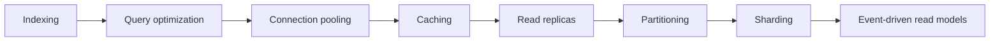

---

## 16.5 Final interview rule

```text
Start with access patterns.
Design the schema.
Add indexes for critical queries.
Use transactions where correctness matters.
Scale reads with cache and replicas.
Scale large tables with partitioning.
Scale beyond one database server with sharding.
Explain consistency trade-offs clearly.
```

---

# Closing note

The goal is not to memorize every database feature.

The goal is to understand:

- what the workload needs
- what each database is good at
- what trade-offs you are making
- how the design evolves from simple to large scale

That is what interviewers are really testing.
