# SQL + Spring Boot Visual Mastery Reference

> Visual-first notes for learning SQL from basics to advanced, with Spring Boot examples, diagrams, before/after tables, and bottom-up query building.

---

## Clickable Index

### Part 1 — SQL Basics
- [1. What is SQL?](#1-what-is-sql)
- [2. SQL Mental Model](#2-sql-mental-model)
- [3. Database Setup From Scratch](#3-database-setup-from-scratch)
- [4. Sample Social App Database](#4-sample-social-app-database)
- [5. Create Tables](#5-create-tables)
- [6. Insert Data](#6-insert-data)
- [7. SELECT Basics](#7-select-basics)
- [8. WHERE Filtering](#8-where-filtering)
- [9. ORDER BY and LIMIT](#9-order-by-and-limit)

### Part 2 — Query Building
- [10. Bottom-Up Query Creation Pattern](#10-bottom-up-query-creation-pattern)
- [11. Easy SQL Queries](#11-easy-sql-queries)
- [12. Medium SQL Queries](#12-medium-sql-queries)
- [13. Hard SQL Queries](#13-hard-sql-queries)
- [14. Joins Visually](#14-joins-visually)
- [15. Group By and Aggregation](#15-group-by-and-aggregation)
- [16. Subqueries](#16-subqueries)
- [17. CTEs](#17-ctes)
- [18. Window Functions](#18-window-functions)

### Part 3 — Spring Boot With SQL
- [19. Spring Boot Project Setup](#19-spring-boot-project-setup)
- [20. application.yml](#20-applicationyml)
- [21. Entity Layer](#21-entity-layer)
- [22. Repository Layer](#22-repository-layer)
- [23. Service Layer](#23-service-layer)
- [24. REST Controller Layer](#24-rest-controller-layer)
- [25. Native SQL in Spring Boot](#25-native-sql-in-spring-boot)
- [26. Pagination and Sorting](#26-pagination-and-sorting)

### Part 4 — Advanced SQL Design
- [27. Indexes](#27-indexes)
- [28. Transactions](#28-transactions)
- [29. Isolation Levels](#29-isolation-levels)
- [30. Read-Heavy Systems](#30-read-heavy-systems)
- [31. Write-Heavy Systems](#31-write-heavy-systems)
- [32. Query Optimization Checklist](#32-query-optimization-checklist)
- [33. SQL Master Practice Plan](#33-sql-master-practice-plan)

---

# 1. What is SQL?

SQL means **Structured Query Language**.

You use SQL to talk to relational databases.

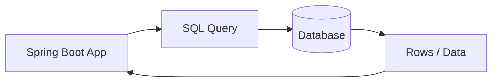

Common SQL commands:

| Command | Meaning | Example |
|---|---|---|
| `SELECT` | Read data | `SELECT * FROM users;` |
| `INSERT` | Add data | `INSERT INTO users ...` |
| `UPDATE` | Change data | `UPDATE users SET ...` |
| `DELETE` | Remove data | `DELETE FROM users ...` |
| `CREATE` | Create table/database | `CREATE TABLE users ...` |
| `ALTER` | Modify structure | `ALTER TABLE users ...` |
| `DROP` | Delete structure | `DROP TABLE users;` |

---

# 2. SQL Mental Model

A database is like a group of connected Excel sheets.

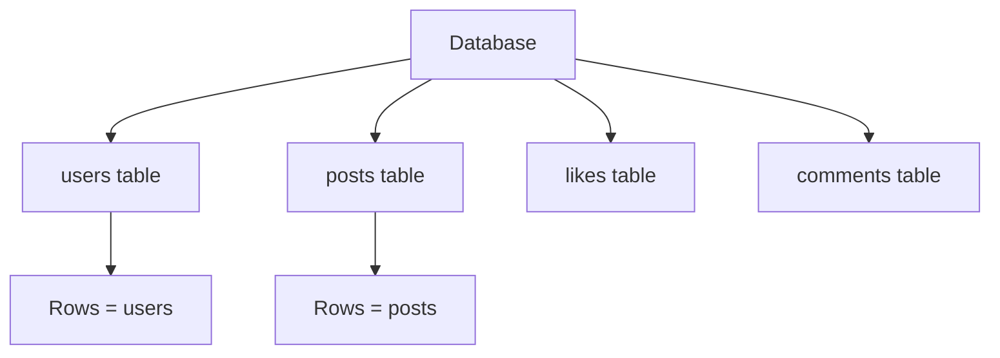

## Table example

| id | username | email |
|---:|---|---|
| 1 | alice | alice@test.com |
| 2 | bob | bob@test.com |

## SQL mental translation

| Real-world idea | SQL idea |
|---|---|
| One spreadsheet file | Database |
| One sheet | Table |
| One row in a sheet | Row / record |
| One column | Field / attribute |
| Unique row number | Primary key |
| Link to another table | Foreign key |

---

# 3. Database Setup From Scratch

## Option A: PostgreSQL with Docker

```bash
mkdir sql-springboot-demo
cd sql-springboot-demo
```

Create `docker-compose.yml`:

```yaml
services:
  postgres:
    image: postgres:16
    container_name: sql-demo-postgres
    environment:
      POSTGRES_DB: socialdb
      POSTGRES_USER: appuser
      POSTGRES_PASSWORD: apppass
    ports:
      - "5432:5432"
    volumes:
      - postgres_data:/var/lib/postgresql/data

volumes:
  postgres_data:
```

Start database:

```bash
docker compose up -d
```

Connect:

```bash
docker exec -it sql-demo-postgres psql -U appuser -d socialdb
```

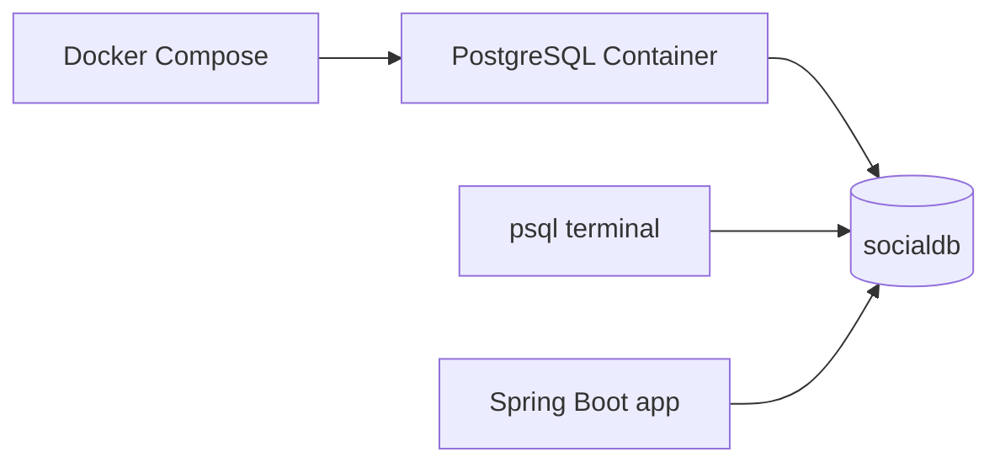

## Option B: H2 for Learning

Use H2 when you want a lightweight database inside Spring Boot.

| Option | Best for | Notes |
|---|---|---|
| PostgreSQL Docker | Realistic learning | Closest to production |
| H2 | Fast experiments | Some SQL syntax differs from PostgreSQL |

---

# 4. Sample Social App Database

We will build a simple social network database.

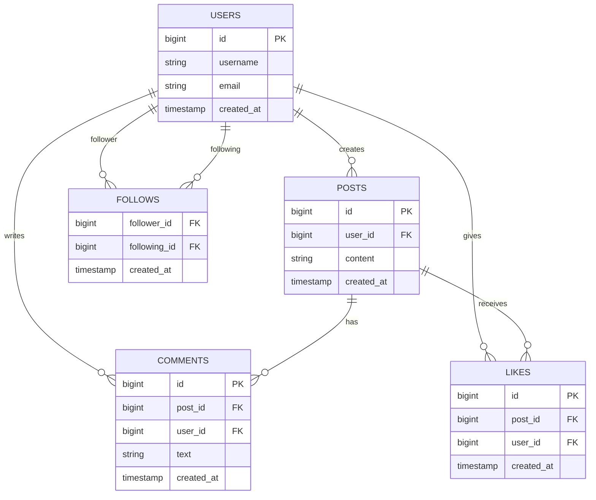

## Relationship map

| Table | Stores | Important relationship |
|---|---|---|
| `users` | People using the app | One user can create many posts |
| `posts` | User posts | Each post belongs to one user |
| `comments` | Comments on posts | Each comment belongs to one user and one post |
| `likes` | Likes on posts | One user can like one post once |
| `follows` | User follow graph | One user follows another user |

---

# 5. Create Tables

```sql
CREATE TABLE users (
    id BIGSERIAL PRIMARY KEY,
    username VARCHAR(50) NOT NULL UNIQUE,
    email VARCHAR(100) NOT NULL UNIQUE,
    created_at TIMESTAMP NOT NULL DEFAULT CURRENT_TIMESTAMP
);
```

```sql
CREATE TABLE posts (
    id BIGSERIAL PRIMARY KEY,
    user_id BIGINT NOT NULL REFERENCES users(id),
    content TEXT NOT NULL,
    created_at TIMESTAMP NOT NULL DEFAULT CURRENT_TIMESTAMP
);
```

```sql
CREATE TABLE comments (
    id BIGSERIAL PRIMARY KEY,
    post_id BIGINT NOT NULL REFERENCES posts(id),
    user_id BIGINT NOT NULL REFERENCES users(id),
    text TEXT NOT NULL,
    created_at TIMESTAMP NOT NULL DEFAULT CURRENT_TIMESTAMP
);
```

```sql
CREATE TABLE likes (
    id BIGSERIAL PRIMARY KEY,
    post_id BIGINT NOT NULL REFERENCES posts(id),
    user_id BIGINT NOT NULL REFERENCES users(id),
    created_at TIMESTAMP NOT NULL DEFAULT CURRENT_TIMESTAMP,
    UNIQUE(post_id, user_id)
);
```

```sql
CREATE TABLE follows (
    follower_id BIGINT NOT NULL REFERENCES users(id),
    following_id BIGINT NOT NULL REFERENCES users(id),
    created_at TIMESTAMP NOT NULL DEFAULT CURRENT_TIMESTAMP,
    PRIMARY KEY (follower_id, following_id)
);
```

## Before and after

### Before creating tables

| Database | Tables |
|---|---|
| `socialdb` | none |

### After creating tables

| Database | Tables created |
|---|---|
| `socialdb` | `users`, `posts`, `comments`, `likes`, `follows` |

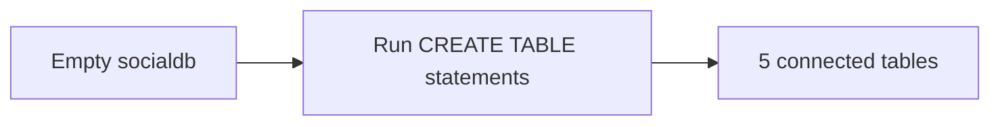

---

# 6. Insert Data

```sql
INSERT INTO users (username, email) VALUES
('alice', 'alice@test.com'),
('bob', 'bob@test.com'),
('charlie', 'charlie@test.com'),
('diana', 'diana@test.com');
```

```sql
INSERT INTO posts (user_id, content) VALUES
(1, 'Hello SQL world'),
(1, 'Learning Spring Boot'),
(2, 'PostgreSQL is powerful'),
(3, 'I like backend development');
```

```sql
INSERT INTO comments (post_id, user_id, text) VALUES
(1, 2, 'Nice post!'),
(1, 3, 'Welcome!'),
(2, 2, 'Spring Boot is great'),
(3, 1, 'Yes it is');
```

```sql
INSERT INTO likes (post_id, user_id) VALUES
(1, 2),
(1, 3),
(2, 2),
(3, 1),
(3, 3);
```

```sql
INSERT INTO follows (follower_id, following_id) VALUES
(1, 2),
(1, 3),
(2, 1),
(3, 1),
(4, 1);
```

## Inserted sample data

### users

| id | username | email |
|---:|---|---|
| 1 | alice | alice@test.com |
| 2 | bob | bob@test.com |
| 3 | charlie | charlie@test.com |
| 4 | diana | diana@test.com |

### posts

| id | user_id | content |
|---:|---:|---|
| 1 | 1 | Hello SQL world |
| 2 | 1 | Learning Spring Boot |
| 3 | 2 | PostgreSQL is powerful |
| 4 | 3 | I like backend development |

### likes

| id | post_id | user_id | Meaning |
|---:|---:|---:|---|
| 1 | 1 | 2 | Bob liked Alice's first post |
| 2 | 1 | 3 | Charlie liked Alice's first post |
| 3 | 2 | 2 | Bob liked Alice's second post |
| 4 | 3 | 1 | Alice liked Bob's post |
| 5 | 3 | 3 | Charlie liked Bob's post |

### follows

| follower_id | following_id | Meaning |
|---:|---:|---|
| 1 | 2 | Alice follows Bob |
| 1 | 3 | Alice follows Charlie |
| 2 | 1 | Bob follows Alice |
| 3 | 1 | Charlie follows Alice |
| 4 | 1 | Diana follows Alice |

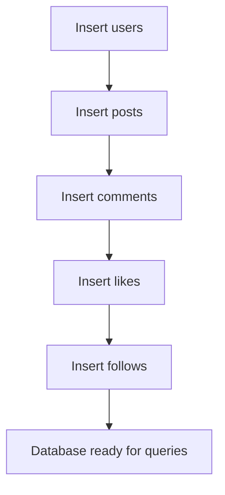

---

# 7. SELECT Basics

Read all users:

```sql
SELECT *
FROM users;
```

## Before query

`users` table:

| id | username | email |
|---:|---|---|
| 1 | alice | alice@test.com |
| 2 | bob | bob@test.com |
| 3 | charlie | charlie@test.com |
| 4 | diana | diana@test.com |

## After result

| id | username | email |
|---:|---|---|
| 1 | alice | alice@test.com |
| 2 | bob | bob@test.com |
| 3 | charlie | charlie@test.com |
| 4 | diana | diana@test.com |

Read selected columns:

```sql
SELECT id, username
FROM users;
```

## After result

| id | username |
|---:|---|
| 1 | alice |
| 2 | bob |
| 3 | charlie |
| 4 | diana |

Visual:

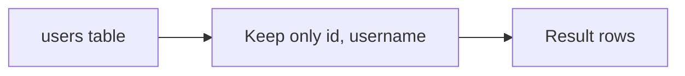

---

# 8. WHERE Filtering

```sql
SELECT *
FROM users
WHERE username = 'alice';
```

## Before query

| id | username | email |
|---:|---|---|
| 1 | alice | alice@test.com |
| 2 | bob | bob@test.com |
| 3 | charlie | charlie@test.com |
| 4 | diana | diana@test.com |

## After result

| id | username | email |
|---:|---|---|
| 1 | alice | alice@test.com |


More examples:

```sql
SELECT *
FROM posts
WHERE user_id = 1;
```

Result:

| id | user_id | content |
|---:|---:|---|
| 1 | 1 | Hello SQL world |
| 2 | 1 | Learning Spring Boot |

```sql
SELECT *
FROM posts
WHERE content LIKE '%SQL%';
```

Result:

| id | user_id | content |
|---:|---:|---|
| 1 | 1 | Hello SQL world |

```sql
SELECT *
FROM posts
WHERE created_at >= CURRENT_DATE - INTERVAL '7 days';
```

---

# 9. ORDER BY and LIMIT

Latest posts:

```sql
SELECT *
FROM posts
ORDER BY created_at DESC
LIMIT 10;
```

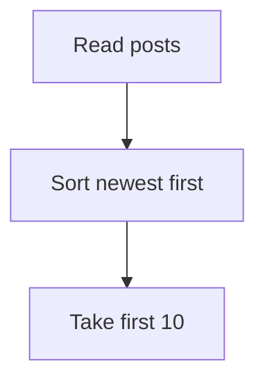

## Before query

| id | user_id | content | created_at order |
|---:|---:|---|---:|
| 1 | 1 | Hello SQL world | 1 |
| 2 | 1 | Learning Spring Boot | 2 |
| 3 | 2 | PostgreSQL is powerful | 3 |
| 4 | 3 | I like backend development | 4 |

## After result with `ORDER BY created_at DESC LIMIT 2`

| id | user_id | content | created_at order |
|---:|---:|---|---:|
| 4 | 3 | I like backend development | 4 |
| 3 | 2 | PostgreSQL is powerful | 3 |

---

# 10. Bottom-Up Query Creation Pattern

Use this 5-step pattern:

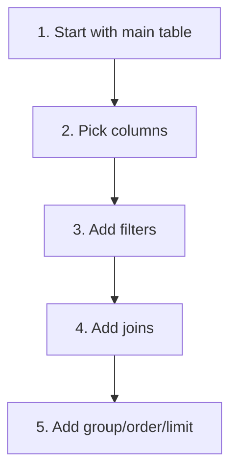

Template:

```sql
SELECT columns
FROM main_table
JOIN other_table ON condition
WHERE filters
GROUP BY columns
HAVING group_filter
ORDER BY column
LIMIT count;
```

## Query building checklist

| Step | Question | SQL clause |
|---:|---|---|
| 1 | What table is the main source? | `FROM` |
| 2 | What columns do I need? | `SELECT` |
| 3 | Which rows should remain? | `WHERE` |
| 4 | Do I need other tables? | `JOIN` |
| 5 | Do I need summary rows? | `GROUP BY` |
| 6 | Do I need sorted results? | `ORDER BY` |
| 7 | Do I need fewer rows? | `LIMIT` |

---

# 11. Easy SQL Queries

## Easy 1: Get all users

Step 1:

```sql
FROM users
```

Step 2:

```sql
SELECT *
FROM users;
```

Result:

| id | username | email |
|---:|---|---|
| 1 | alice | alice@test.com |
| 2 | bob | bob@test.com |
| 3 | charlie | charlie@test.com |
| 4 | diana | diana@test.com |

## Easy 2: Get usernames only

Step 1:

```sql
FROM users
```

Step 2:

```sql
SELECT username
FROM users;
```

Result:

| username |
|---|
| alice |
| bob |
| charlie |
| diana |

## Easy 3: Get posts by Alice

Step 1: Alice has `id = 1`.

```sql
FROM posts
```

Step 2:

```sql
SELECT *
FROM posts
```

Step 3:

```sql
SELECT *
FROM posts
WHERE user_id = 1;
```

Result:

| id | user_id | content |
|---:|---:|---|
| 1 | 1 | Hello SQL world |
| 2 | 1 | Learning Spring Boot |

## Easy 4: Get latest 5 posts

Step 1:

```sql
SELECT *
FROM posts
```

Step 2:

```sql
SELECT *
FROM posts
ORDER BY created_at DESC
```

Step 3:

```sql
SELECT *
FROM posts
ORDER BY created_at DESC
LIMIT 5;
```

---

# 12. Medium SQL Queries

## Medium 1: Show posts with author names

Visual join:


### Before query

`posts`:

| id | user_id | content |
|---:|---:|---|
| 1 | 1 | Hello SQL world |
| 2 | 1 | Learning Spring Boot |
| 3 | 2 | PostgreSQL is powerful |
| 4 | 3 | I like backend development |

`users`:

| id | username |
|---:|---|
| 1 | alice |
| 2 | bob |
| 3 | charlie |
| 4 | diana |

Step 1: Start from posts.

```sql
SELECT *
FROM posts p;
```

Step 2: Join users.

```sql
SELECT *
FROM posts p
JOIN users u ON p.user_id = u.id;
```

Step 3: Pick useful columns.

```sql
SELECT p.id, p.content, u.username, p.created_at
FROM posts p
JOIN users u ON p.user_id = u.id;
```

Step 4: Latest first.

```sql
SELECT p.id, p.content, u.username, p.created_at
FROM posts p
JOIN users u ON p.user_id = u.id
ORDER BY p.created_at DESC;
```

### After result

| id | content | username |
|---:|---|---|
| 4 | I like backend development | charlie |
| 3 | PostgreSQL is powerful | bob |
| 2 | Learning Spring Boot | alice |
| 1 | Hello SQL world | alice |

## Medium 2: Count likes per post


### Before query

`posts`:

| id | content |
|---:|---|
| 1 | Hello SQL world |
| 2 | Learning Spring Boot |
| 3 | PostgreSQL is powerful |
| 4 | I like backend development |

`likes`:

| id | post_id | user_id |
|---:|---:|---:|
| 1 | 1 | 2 |
| 2 | 1 | 3 |
| 3 | 2 | 2 |
| 4 | 3 | 1 |
| 5 | 3 | 3 |

Step 1:

```sql
SELECT p.id, p.content
FROM posts p;
```

Step 2:

```sql
SELECT p.id, p.content, l.id
FROM posts p
LEFT JOIN likes l ON p.id = l.post_id;
```

Step 3:

```sql
SELECT p.id, p.content, COUNT(l.id) AS like_count
FROM posts p
LEFT JOIN likes l ON p.id = l.post_id
GROUP BY p.id, p.content;
```

Step 4:

```sql
SELECT p.id, p.content, COUNT(l.id) AS like_count
FROM posts p
LEFT JOIN likes l ON p.id = l.post_id
GROUP BY p.id, p.content
ORDER BY like_count DESC;
```

### After result

| id | content | like_count |
|---:|---|---:|
| 1 | Hello SQL world | 2 |
| 3 | PostgreSQL is powerful | 2 |
| 2 | Learning Spring Boot | 1 |
| 4 | I like backend development | 0 |

## Medium 3: Users with follower count

```sql
SELECT u.id, u.username, COUNT(f.follower_id) AS follower_count
FROM users u
LEFT JOIN follows f ON u.id = f.following_id
GROUP BY u.id, u.username
ORDER BY follower_count DESC;
```

Result:

| id | username | follower_count |
|---:|---|---:|
| 1 | alice | 3 |
| 2 | bob | 1 |
| 3 | charlie | 1 |
| 4 | diana | 0 |

---

# 13. Hard SQL Queries

## Hard 1: Feed query for Alice

Goal: show posts from users Alice follows.

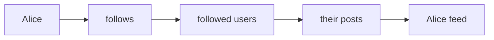

### Before query

Alice follows:

| follower_id | following_id | Meaning |
|---:|---:|---|
| 1 | 2 | Alice follows Bob |
| 1 | 3 | Alice follows Charlie |

Posts from followed users:

| id | user_id | content |
|---:|---:|---|
| 3 | 2 | PostgreSQL is powerful |
| 4 | 3 | I like backend development |

Step 1: Find people Alice follows.

```sql
SELECT following_id
FROM follows
WHERE follower_id = 1;
```

Step 2: Get posts from those people.

```sql
SELECT *
FROM posts
WHERE user_id IN (
    SELECT following_id
    FROM follows
    WHERE follower_id = 1
);
```

Step 3: Join author names.

```sql
SELECT p.id, p.content, u.username, p.created_at
FROM posts p
JOIN users u ON p.user_id = u.id
WHERE p.user_id IN (
    SELECT following_id
    FROM follows
    WHERE follower_id = 1
);
```

Step 4: Latest first.

```sql
SELECT p.id, p.content, u.username, p.created_at
FROM posts p
JOIN users u ON p.user_id = u.id
WHERE p.user_id IN (
    SELECT following_id
    FROM follows
    WHERE follower_id = 1
)
ORDER BY p.created_at DESC
LIMIT 20;
```

### After result

| id | content | username |
|---:|---|---|
| 4 | I like backend development | charlie |
| 3 | PostgreSQL is powerful | bob |

## Hard 2: Trending posts

Goal: rank posts by likes and comments.

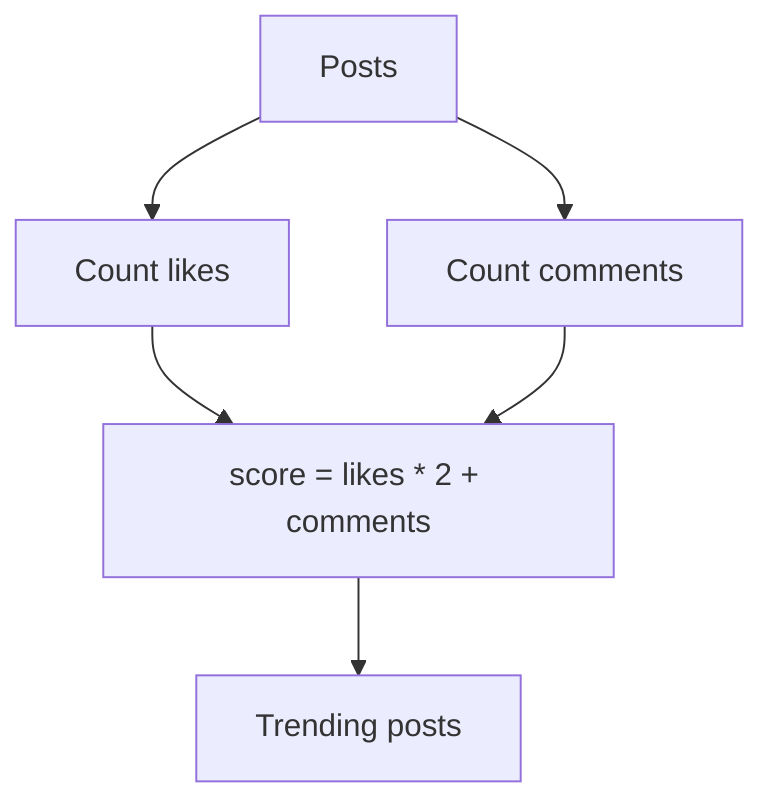

Step 1: Count likes.

```sql
SELECT post_id, COUNT(*) AS like_count
FROM likes
GROUP BY post_id;
```

Likes result:

| post_id | like_count |
|---:|---:|
| 1 | 2 |
| 2 | 1 |
| 3 | 2 |

Step 2: Count comments.

```sql
SELECT post_id, COUNT(*) AS comment_count
FROM comments
GROUP BY post_id;
```

Comments result:

| post_id | comment_count |
|---:|---:|
| 1 | 2 |
| 2 | 1 |
| 3 | 1 |

Step 3: Use CTEs.

```sql
WITH like_counts AS (
    SELECT post_id, COUNT(*) AS like_count
    FROM likes
    GROUP BY post_id
),
comment_counts AS (
    SELECT post_id, COUNT(*) AS comment_count
    FROM comments
    GROUP BY post_id
)
SELECT p.id, p.content,
       COALESCE(lc.like_count, 0) AS like_count,
       COALESCE(cc.comment_count, 0) AS comment_count
FROM posts p
LEFT JOIN like_counts lc ON p.id = lc.post_id
LEFT JOIN comment_counts cc ON p.id = cc.post_id;
```

Step 4: Add score.

```sql
WITH like_counts AS (
    SELECT post_id, COUNT(*) AS like_count
    FROM likes
    GROUP BY post_id
),
comment_counts AS (
    SELECT post_id, COUNT(*) AS comment_count
    FROM comments
    GROUP BY post_id
)
SELECT p.id, p.content,
       COALESCE(lc.like_count, 0) AS like_count,
       COALESCE(cc.comment_count, 0) AS comment_count,
       COALESCE(lc.like_count, 0) * 2 + COALESCE(cc.comment_count, 0) AS score
FROM posts p
LEFT JOIN like_counts lc ON p.id = lc.post_id
LEFT JOIN comment_counts cc ON p.id = cc.post_id
ORDER BY score DESC
LIMIT 10;
```

### After result

| id | content | like_count | comment_count | score |
|---:|---|---:|---:|---:|
| 1 | Hello SQL world | 2 | 2 | 6 |
| 3 | PostgreSQL is powerful | 2 | 1 | 5 |
| 2 | Learning Spring Boot | 1 | 1 | 3 |
| 4 | I like backend development | 0 | 0 | 0 |

## Hard 3: Rank users by post count

```sql
SELECT u.id,
       u.username,
       COUNT(p.id) AS post_count,
       RANK() OVER (ORDER BY COUNT(p.id) DESC) AS user_rank
FROM users u
LEFT JOIN posts p ON u.id = p.user_id
GROUP BY u.id, u.username
ORDER BY user_rank;
```

Result:

| id | username | post_count | user_rank |
|---:|---|---:|---:|
| 1 | alice | 2 | 1 |
| 2 | bob | 1 | 2 |
| 3 | charlie | 1 | 2 |
| 4 | diana | 0 | 4 |

---

# 14. Joins Visually

## INNER JOIN

Only matching rows.

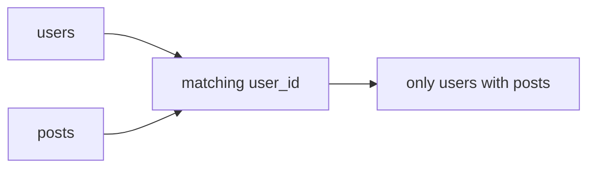

```sql
SELECT u.username, p.content
FROM users u
INNER JOIN posts p ON u.id = p.user_id;
```

Result:

| username | content |
|---|---|
| alice | Hello SQL world |
| alice | Learning Spring Boot |
| bob | PostgreSQL is powerful |
| charlie | I like backend development |

## LEFT JOIN

All left table rows, even if no match.

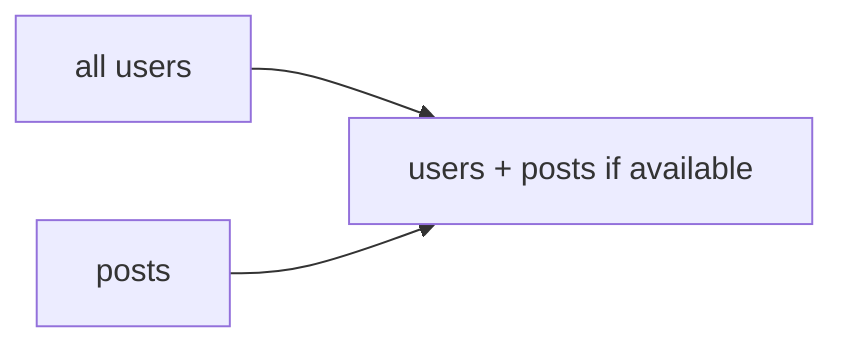

```sql
SELECT u.username, p.content
FROM users u
LEFT JOIN posts p ON u.id = p.user_id;
```

Result:

| username | content |
|---|---|
| alice | Hello SQL world |
| alice | Learning Spring Boot |
| bob | PostgreSQL is powerful |
| charlie | I like backend development |
| diana | NULL |

## Join choice table

| Join type | Keeps unmatched left rows? | Keeps unmatched right rows? | Common use |
|---|---:|---:|---|
| `INNER JOIN` | No | No | Only matching records |
| `LEFT JOIN` | Yes | No | Keep all main records |
| `RIGHT JOIN` | No | Yes | Rare; can usually rewrite as `LEFT JOIN` |
| `FULL JOIN` | Yes | Yes | Compare two datasets |

---

# 15. Group By and Aggregation

Aggregation means combining many rows into summary rows.

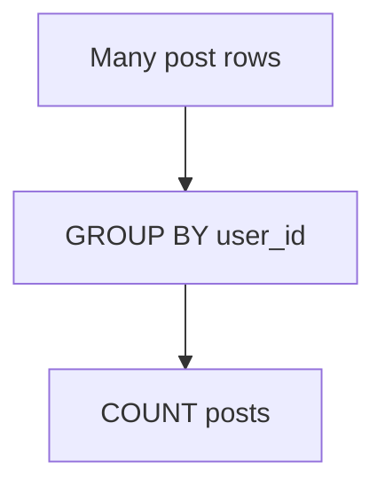

Posts per user:

```sql
SELECT user_id, COUNT(*) AS post_count
FROM posts
GROUP BY user_id;
```

Result:

| user_id | post_count |
|---:|---:|
| 1 | 2 |
| 2 | 1 |
| 3 | 1 |

Posts per username:

```sql
SELECT u.username, COUNT(p.id) AS post_count
FROM users u
LEFT JOIN posts p ON u.id = p.user_id
GROUP BY u.username;
```

Result:

| username | post_count |
|---|---:|
| alice | 2 |
| bob | 1 |
| charlie | 1 |
| diana | 0 |

Filter groups with `HAVING`:

```sql
SELECT u.username, COUNT(p.id) AS post_count
FROM users u
LEFT JOIN posts p ON u.id = p.user_id
GROUP BY u.username
HAVING COUNT(p.id) >= 2;
```

Result:

| username | post_count |
|---|---:|
| alice | 2 |

---

# 16. Subqueries

A subquery is a query inside another query.

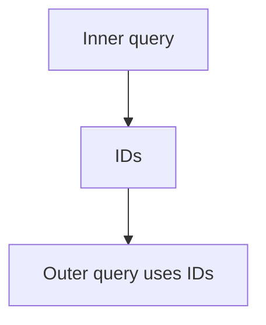

Users who posted something:

```sql
SELECT *
FROM users
WHERE id IN (
    SELECT user_id
    FROM posts
);
```

Result:

| id | username | email |
|---:|---|---|
| 1 | alice | alice@test.com |
| 2 | bob | bob@test.com |
| 3 | charlie | charlie@test.com |

Posts with above-average likes:

```sql
SELECT p.id, p.content, COUNT(l.id) AS like_count
FROM posts p
LEFT JOIN likes l ON p.id = l.post_id
GROUP BY p.id, p.content
HAVING COUNT(l.id) > (
    SELECT AVG(like_total)
    FROM (
        SELECT COUNT(*) AS like_total
        FROM likes
        GROUP BY post_id
    ) x
);
```

Result using sample data:

| id | content | like_count |
|---:|---|---:|
| 1 | Hello SQL world | 2 |
| 3 | PostgreSQL is powerful | 2 |

---

# 17. CTEs

CTE means **Common Table Expression**.

Use CTEs to make hard queries readable.

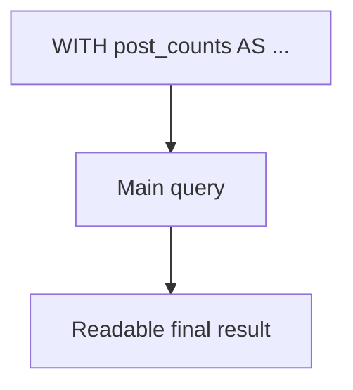

```sql
WITH post_counts AS (
    SELECT user_id, COUNT(*) AS post_count
    FROM posts
    GROUP BY user_id
)
SELECT u.username, COALESCE(pc.post_count, 0) AS post_count
FROM users u
LEFT JOIN post_counts pc ON u.id = pc.user_id;
```

Result:

| username | post_count |
|---|---:|
| alice | 2 |
| bob | 1 |
| charlie | 1 |
| diana | 0 |

---

# 18. Window Functions

Window functions calculate values across related rows without collapsing them.

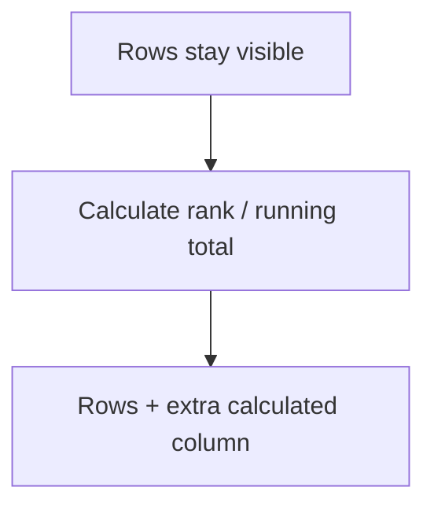

Rank posts by newest per user:

```sql
SELECT id,
       user_id,
       content,
       created_at,
       ROW_NUMBER() OVER (
           PARTITION BY user_id
           ORDER BY created_at DESC
       ) AS post_number_for_user
FROM posts;
```

Result:

| id | user_id | content | post_number_for_user |
|---:|---:|---|---:|
| 2 | 1 | Learning Spring Boot | 1 |
| 1 | 1 | Hello SQL world | 2 |
| 3 | 2 | PostgreSQL is powerful | 1 |
| 4 | 3 | I like backend development | 1 |

Top latest post per user:

```sql
WITH ranked_posts AS (
    SELECT id,
           user_id,
           content,
           created_at,
           ROW_NUMBER() OVER (
               PARTITION BY user_id
               ORDER BY created_at DESC
           ) AS rn
    FROM posts
)
SELECT *
FROM ranked_posts
WHERE rn = 1;
```

Result:

| id | user_id | content | rn |
|---:|---:|---|---:|
| 2 | 1 | Learning Spring Boot | 1 |
| 3 | 2 | PostgreSQL is powerful | 1 |
| 4 | 3 | I like backend development | 1 |

---

# 19. Spring Boot Project Setup

Create project from Spring Initializr.

Dependencies:

- Spring Web
- Spring Data JPA
- PostgreSQL Driver
- Validation
- Lombok optional
- Flyway optional

```mermaid
flowchart TD
    Browser["Client"] --> Controller["REST Controller"]
    Controller --> Service["Service"]
    Service --> Repository["Repository"]
    Repository --> DB[("PostgreSQL")]
```

Maven dependencies:

```xml
<dependency>
    <groupId>org.springframework.boot</groupId>
    <artifactId>spring-boot-starter-web</artifactId>
</dependency>

<dependency>
    <groupId>org.springframework.boot</groupId>
    <artifactId>spring-boot-starter-data-jpa</artifactId>
</dependency>

<dependency>
    <groupId>org.postgresql</groupId>
    <artifactId>postgresql</artifactId>
    <scope>runtime</scope>
</dependency>
```

---

# 20. application.yml

```yaml
spring:
  datasource:
    url: jdbc:postgresql://localhost:5432/socialdb
    username: appuser
    password: apppass

  jpa:
    hibernate:
      ddl-auto: validate
    show-sql: true
    properties:
      hibernate:
        format_sql: true

  flyway:
    enabled: true
```

Folder structure:

```text
src/main/java/com/example/social
├── controller
├── service
├── repository
├── entity
└── dto

src/main/resources/db/migration
└── V1__create_social_tables.sql
```

---

# 21. Entity Layer

`UserEntity.java`

```java
package com.example.social.entity;

import jakarta.persistence.*;
import java.time.LocalDateTime;

@Entity
@Table(name = "users")
public class UserEntity {

    @Id
    @GeneratedValue(strategy = GenerationType.IDENTITY)
    private Long id;

    @Column(nullable = false, unique = true)
    private String username;

    @Column(nullable = false, unique = true)
    private String email;

    @Column(name = "created_at", nullable = false)
    private LocalDateTime createdAt = LocalDateTime.now();

    public Long getId() { return id; }
    public String getUsername() { return username; }
    public void setUsername(String username) { this.username = username; }
    public String getEmail() { return email; }
    public void setEmail(String email) { this.email = email; }
}
```

`PostEntity.java`

```java
package com.example.social.entity;

import jakarta.persistence.*;
import java.time.LocalDateTime;

@Entity
@Table(name = "posts")
public class PostEntity {

    @Id
    @GeneratedValue(strategy = GenerationType.IDENTITY)
    private Long id;

    @Column(name = "user_id", nullable = false)
    private Long userId;

    @Column(nullable = false)
    private String content;

    @Column(name = "created_at", nullable = false)
    private LocalDateTime createdAt = LocalDateTime.now();

    public Long getId() { return id; }
    public Long getUserId() { return userId; }
    public void setUserId(Long userId) { this.userId = userId; }
    public String getContent() { return content; }
    public void setContent(String content) { this.content = content; }
    public LocalDateTime getCreatedAt() { return createdAt; }
}
```

## Entity-to-table mapping

| Java field | Database column | Notes |
|---|---|---|
| `id` | `id` | Primary key |
| `username` | `username` | Unique user name |
| `email` | `email` | Unique email |
| `createdAt` | `created_at` | Java camelCase maps to SQL snake_case manually |

---

# 22. Repository Layer

```java
package com.example.social.repository;

import com.example.social.entity.UserEntity;
import org.springframework.data.jpa.repository.JpaRepository;

import java.util.Optional;

public interface UserRepository extends JpaRepository<UserEntity, Long> {
    Optional<UserEntity> findByUsername(String username);
}
```

```java
package com.example.social.repository;

import com.example.social.entity.PostEntity;
import org.springframework.data.jpa.repository.JpaRepository;

import java.util.List;

public interface PostRepository extends JpaRepository<PostEntity, Long> {
    List<PostEntity> findByUserIdOrderByCreatedAtDesc(Long userId);
}
```

## Repository method translation

| Repository method | SQL idea |
|---|---|
| `findByUsername(String username)` | `WHERE username = ?` |
| `findByUserIdOrderByCreatedAtDesc(Long userId)` | `WHERE user_id = ? ORDER BY created_at DESC` |
| `findAll(Pageable pageable)` | `LIMIT/OFFSET` with sorting |

---

# 23. Service Layer

```java
package com.example.social.service;

import com.example.social.entity.PostEntity;
import com.example.social.repository.PostRepository;
import org.springframework.stereotype.Service;

import java.util.List;

@Service
public class PostService {

    private final PostRepository postRepository;

    public PostService(PostRepository postRepository) {
        this.postRepository = postRepository;
    }

    public PostEntity createPost(Long userId, String content) {
        PostEntity post = new PostEntity();
        post.setUserId(userId);
        post.setContent(content);
        return postRepository.save(post);
    }

    public List<PostEntity> getPostsByUser(Long userId) {
        return postRepository.findByUserIdOrderByCreatedAtDesc(userId);
    }
}
```

```mermaid
sequenceDiagram
    participant Controller
    participant Service
    participant Repository
    participant DB as PostgreSQL

    Controller->>Service: createPost(userId, content)
    Service->>Repository: save(post)
    Repository->>DB: INSERT INTO posts ...
    DB-->>Repository: saved row
    Repository-->>Service: PostEntity
    Service-->>Controller: PostEntity
```

---

# 24. REST Controller Layer

```java
package com.example.social.controller;

import com.example.social.entity.PostEntity;
import com.example.social.service.PostService;
import org.springframework.web.bind.annotation.*;

import java.util.List;

@RestController
@RequestMapping("/api/posts")
public class PostController {

    private final PostService postService;

    public PostController(PostService postService) {
        this.postService = postService;
    }

    @PostMapping
    public PostEntity createPost(@RequestBody CreatePostRequest request) {
        return postService.createPost(request.userId(), request.content());
    }

    @GetMapping("/user/{userId}")
    public List<PostEntity> getUserPosts(@PathVariable Long userId) {
        return postService.getPostsByUser(userId);
    }

    public record CreatePostRequest(Long userId, String content) {}
}
```

Test with curl:

```bash
curl -X POST http://localhost:8080/api/posts \
  -H "Content-Type: application/json" \
  -d '{"userId":1,"content":"SQL from Spring Boot"}'
```

## API before and after

### Before request

| posts count for user_id 1 |
|---:|
| 2 |

### After request

| id | user_id | content |
|---:|---:|---|
| 5 | 1 | SQL from Spring Boot |

---

# 25. Native SQL in Spring Boot

Use native SQL when queries are complex or performance-sensitive.

Projection:

```java
package com.example.social.repository;

public interface PostSummaryView {
    Long getPostId();
    String getContent();
    String getUsername();
    Long getLikeCount();
}
```

Repository:

```java
package com.example.social.repository;

import com.example.social.entity.PostEntity;
import org.springframework.data.jpa.repository.JpaRepository;
import org.springframework.data.jpa.repository.Query;

import java.util.List;

public interface PostRepository extends JpaRepository<PostEntity, Long> {

    @Query(value = """
        SELECT p.id AS postId,
               p.content AS content,
               u.username AS username,
               COUNT(l.id) AS likeCount
        FROM posts p
        JOIN users u ON p.user_id = u.id
        LEFT JOIN likes l ON p.id = l.post_id
        GROUP BY p.id, p.content, u.username
        ORDER BY likeCount DESC
        LIMIT 10
        """, nativeQuery = true)
    List<PostSummaryView> findTopPosts();
}
```

Result shape:

| postId | content | username | likeCount |
|---:|---|---|---:|
| 1 | Hello SQL world | alice | 2 |
| 3 | PostgreSQL is powerful | bob | 2 |
| 2 | Learning Spring Boot | alice | 1 |
| 4 | I like backend development | charlie | 0 |

---

# 26. Pagination and Sorting

Use pagination for large result sets.

```mermaid
flowchart LR
    Client["Client asks page 0 size 20"] --> API["Spring Boot API"]
    API --> SQL["LIMIT 20 OFFSET 0"]
    SQL --> DB[("Database")]
```

Repository:

```java
import org.springframework.data.domain.Page;
import org.springframework.data.domain.Pageable;
import org.springframework.data.jpa.repository.JpaRepository;

public interface PostRepository extends JpaRepository<PostEntity, Long> {
    Page<PostEntity> findByUserId(Long userId, Pageable pageable);
}
```

Controller:

```java
@GetMapping("/user/{userId}/page")
public Page<PostEntity> getUserPostsPage(
        @PathVariable Long userId,
        Pageable pageable
) {
    return postRepository.findByUserId(userId, pageable);
}
```

Example:

```bash
curl "http://localhost:8080/api/posts/user/1/page?page=0&size=10&sort=createdAt,desc"
```

## Pagination translation

| URL parameter | SQL equivalent |
|---|---|
| `page=0` | `OFFSET 0` |
| `page=1` | `OFFSET size` |
| `size=10` | `LIMIT 10` |
| `sort=createdAt,desc` | `ORDER BY created_at DESC` |

---

# 27. Indexes

Indexes make reads faster.

```mermaid
flowchart LR
    Query["WHERE user_id = 1"] --> Index["posts_user_id_idx"]
    Index --> Rows["matching posts"]
```

Create indexes:

```sql
CREATE INDEX idx_posts_user_id_created_at
ON posts(user_id, created_at DESC);
```

```sql
CREATE INDEX idx_likes_post_id
ON likes(post_id);
```

```sql
CREATE INDEX idx_comments_post_id
ON comments(post_id);
```

Use index for feed query:

```sql
CREATE INDEX idx_follows_follower_id
ON follows(follower_id);
```

Check query plan:

```sql
EXPLAIN ANALYZE
SELECT *
FROM posts
WHERE user_id = 1
ORDER BY created_at DESC
LIMIT 10;
```

Index rule:

| Query Pattern | Good Index |
|---|---|
| `WHERE user_id = ?` | `(user_id)` |
| `WHERE user_id = ? ORDER BY created_at DESC` | `(user_id, created_at DESC)` |
| `JOIN likes ON post_id` | `(post_id)` |
| `WHERE email = ?` | unique index on email |

## Before and after indexing

| State | What database does |
|---|---|
| Before index | Scans many rows to find matches |
| After index | Jumps directly to matching values |

---

# 28. Transactions

A transaction groups multiple database operations as one unit.

```mermaid
flowchart TD
    Start["Start transaction"] --> InsertPost["Insert post"]
    InsertPost --> InsertActivity["Insert activity"]
    InsertActivity --> Success{"All good?"}
    Success -->|"Yes"| Commit["COMMIT"]
    Success -->|"No"| Rollback["ROLLBACK"]
```

Spring Boot example:

```java
import org.springframework.stereotype.Service;
import org.springframework.transaction.annotation.Transactional;

@Service
public class SocialWriteService {

    private final PostRepository postRepository;
    private final ActivityRepository activityRepository;

    public SocialWriteService(PostRepository postRepository,
                              ActivityRepository activityRepository) {
        this.postRepository = postRepository;
        this.activityRepository = activityRepository;
    }

    @Transactional
    public void createPostWithActivity(Long userId, String content) {
        PostEntity post = new PostEntity();
        post.setUserId(userId);
        post.setContent(content);
        postRepository.save(post);

        ActivityEntity activity = new ActivityEntity();
        activity.setUserId(userId);
        activity.setType("POST_CREATED");
        activityRepository.save(activity);
    }
}
```

## Transaction outcomes

| Situation | Result |
|---|---|
| Post insert succeeds and activity insert succeeds | Both are committed |
| Post insert succeeds but activity insert fails | Both are rolled back |
| Error happens before commit | Database returns to previous safe state |

---

# 29. Isolation Levels

Isolation controls how transactions see each other.

```mermaid
flowchart LR
    T1["Transaction 1"] --> DB[("Database")]
    T2["Transaction 2"] --> DB
    DB --> Rules["Isolation rules"]
```

Common levels:

| Level | Meaning |
|---|---|
| READ COMMITTED | See only committed data |
| REPEATABLE READ | Same row looks same during transaction |
| SERIALIZABLE | Strongest, like transactions run one by one |

Spring example:

```java
@Transactional(isolation = Isolation.READ_COMMITTED)
public void updateProfile(Long userId, String email) {
    // safe database update
}
```

---

# 30. Read-Heavy Systems

Read-heavy means many users read data more than they write.

Examples:

- News feed
- Product catalog
- Profile page
- Trending posts

```mermaid
flowchart TD
    Client["Many readers"] --> Cache["Redis cache"]
    Cache -->|"cache miss"| API["Spring Boot"]
    API --> DB[("SQL Database")]
    DB --> API
    API --> Cache
```

Patterns:

| Pattern | Use |
|---|---|
| Indexing | Faster reads |
| Pagination | Avoid loading too much |
| Cache | Reduce database hits |
| Read replica | Scale reads |
| Materialized view | Precompute heavy results |

Example materialized view:

```sql
CREATE MATERIALIZED VIEW post_stats AS
SELECT p.id AS post_id,
       COUNT(DISTINCT l.id) AS like_count,
       COUNT(DISTINCT c.id) AS comment_count
FROM posts p
LEFT JOIN likes l ON p.id = l.post_id
LEFT JOIN comments c ON p.id = c.post_id
GROUP BY p.id;
```

Refresh:

```sql
REFRESH MATERIALIZED VIEW post_stats;
```

---

# 31. Write-Heavy Systems

Write-heavy means many inserts/updates happen quickly.

Examples:

- Likes
- Comments
- Chat messages
- Event logging
- Click tracking

```mermaid
flowchart TD
    Client["Many writes"] --> API["Spring Boot"]
    API --> Queue["RabbitMQ / Kafka"]
    Queue --> Worker["Background worker"]
    Worker --> DB[("SQL Database")]
```

Patterns:

| Pattern | Why |
|---|---|
| Batch inserts | Fewer DB calls |
| Queue writes | Smooth traffic spikes |
| Avoid too many indexes | Indexes slow writes |
| Partition large tables | Easier large-scale storage |
| Idempotency key | Avoid duplicate writes |

Example idempotent like:

```sql
INSERT INTO likes (post_id, user_id)
VALUES (1, 2)
ON CONFLICT (post_id, user_id) DO NOTHING;
```

Spring repository native query:

```java
@Modifying
@Query(value = """
    INSERT INTO likes (post_id, user_id)
    VALUES (:postId, :userId)
    ON CONFLICT (post_id, user_id) DO NOTHING
    """, nativeQuery = true)
void likePost(Long postId, Long userId);
```

## Idempotent like before and after

| Attempt | Existing row? | Result |
|---:|---|---|
| 1 | No | Insert like |
| 2 | Yes | Do nothing, no duplicate |

---

# 32. Query Optimization Checklist

```mermaid
flowchart TD
    Slow["Slow query"] --> Explain["Run EXPLAIN ANALYZE"]
    Explain --> Index["Check indexes"]
    Index --> Rows["Check row count"]
    Rows --> Join["Check joins"]
    Join --> Select["Select only needed columns"]
    Select --> Page["Add pagination"]
    Page --> Cache["Cache if read-heavy"]
```

Checklist:

- Avoid `SELECT *` in production APIs.
- Add indexes for common filters and joins.
- Use pagination for lists.
- Avoid N+1 queries in JPA.
- Use native SQL for complex reports.
- Measure with `EXPLAIN ANALYZE`.
- Cache expensive read-heavy queries.
- Keep write-heavy tables with fewer indexes.

## Optimization decision table

| Symptom | Likely fix |
|---|---|
| Query scans many rows | Add or improve index |
| API returns huge list | Add pagination |
| Many repeated same reads | Add cache |
| JPA loads children one by one | Fix N+1 with fetch join or query redesign |
| Report query is unreadable | Use CTEs or materialized view |

---

# 33. SQL Master Practice Plan

## Level 1: Basics

Practice:

```sql
SELECT * FROM users;
SELECT username FROM users;
SELECT * FROM posts WHERE user_id = 1;
SELECT * FROM posts ORDER BY created_at DESC LIMIT 5;
```

## Level 2: Joins

Practice:

```sql
SELECT u.username, p.content
FROM users u
JOIN posts p ON u.id = p.user_id;
```

## Level 3: Aggregation

Practice:

```sql
SELECT p.id, COUNT(l.id) AS like_count
FROM posts p
LEFT JOIN likes l ON p.id = l.post_id
GROUP BY p.id;
```

## Level 4: Feed Queries

Practice:

```sql
SELECT p.*
FROM posts p
WHERE p.user_id IN (
    SELECT following_id
    FROM follows
    WHERE follower_id = 1
)
ORDER BY p.created_at DESC;
```

## Level 5: Advanced Analytics

Practice:

```sql
WITH user_post_counts AS (
    SELECT user_id, COUNT(*) AS post_count
    FROM posts
    GROUP BY user_id
)
SELECT u.username,
       COALESCE(upc.post_count, 0) AS post_count,
       RANK() OVER (ORDER BY COALESCE(upc.post_count, 0) DESC) AS rank
FROM users u
LEFT JOIN user_post_counts upc ON u.id = upc.user_id;
```

## Practice tracker

| Level | Skill | Done? |
|---:|---|---|
| 1 | `SELECT`, `WHERE`, `ORDER BY`, `LIMIT` | ☐ |
| 2 | `JOIN` | ☐ |
| 3 | `GROUP BY`, `COUNT` | ☐ |
| 4 | Subqueries and feeds | ☐ |
| 5 | CTEs and window functions | ☐ |

---

# Final Visual Summary

```mermaid
flowchart TD
    Basics["SELECT / WHERE / ORDER BY"] --> Joins["JOIN tables"]
    Joins --> Grouping["GROUP BY / COUNT / SUM"]
    Grouping --> Subqueries["Subqueries / CTEs"]
    Subqueries --> Windows["Window functions"]
    Windows --> Spring["Spring Boot Repository"]
    Spring --> Performance["Indexes / Transactions / Optimization"]
    Performance --> Mastery["SQL Mastery"]
```

---

## Best Way To Learn

Do not memorize SQL.

Build queries bottom-up:

1. Start with the main table.
2. Select needed columns.
3. Add filters.
4. Add joins.
5. Add grouping.
6. Add sorting.
7. Add pagination.
8. Run `EXPLAIN ANALYZE` for performance.
