# Spring Boot TDD Visual Reference

A visual, step-by-step guide for **Test-Driven Development (TDD)** in Spring Boot, from basics to advanced testing across all layers.

> Goal: write tests first, make them pass, then refactor safely.

---

## Clickable Index

1. [What is TDD?](#1-what-is-tdd)
2. [TDD Cycle](#2-tdd-cycle)
3. [Project Setup](#3-project-setup)
4. [Example Domain: Task Management API](#4-example-domain-task-management-api)
5. [Layer Map](#5-layer-map)
6. [Way 1: Unit Test Utility / Plain Java](#6-way-1-unit-test-utility--plain-java)
7. [Way 2: Service Layer TDD](#7-way-2-service-layer-tdd)
8. [Way 3: Repository Layer TDD](#8-way-3-repository-layer-tdd)
9. [Way 4: Controller Layer TDD](#9-way-4-controller-layer-tdd)
10. [Way 5: Integration Test TDD](#10-way-5-integration-test-tdd)
11. [Way 6: Validation Test TDD](#11-way-6-validation-test-tdd)
12. [Way 7: Exception Handling TDD](#12-way-7-exception-handling-tdd)
13. [Way 8: Security Test TDD](#13-way-8-security-test-tdd)
14. [Way 9: Testcontainers TDD](#14-way-9-testcontainers-tdd)
15. [Way 10: Automated Tests in CI](#15-way-10-automated-tests-in-ci)
16. [Advanced TDD Patterns](#16-advanced-tdd-patterns)
17. [Testing Pyramid](#17-testing-pyramid)
18. [Common Annotations Cheat Sheet](#18-common-annotations-cheat-sheet)
19. [Best Practices](#19-best-practices)
20. [Full Step-by-Step Mini Project](#20-full-step-by-step-mini-project)

---

# 1. What is TDD?

TDD means:

```text
1. Write failing test
2. Write smallest code to pass
3. Refactor
4. Repeat
```

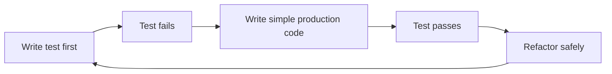

---

# 2. TDD Cycle

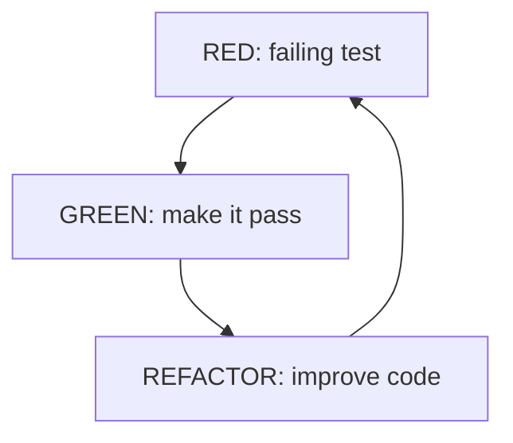

Small rule:

```text
Never write big production code before a test explains why it exists.
```

---

# 3. Project Setup

## Maven dependencies

```xml
<dependencies>
    <dependency>
        <groupId>org.springframework.boot</groupId>
        <artifactId>spring-boot-starter-web</artifactId>
    </dependency>

    <dependency>
        <groupId>org.springframework.boot</groupId>
        <artifactId>spring-boot-starter-data-jpa</artifactId>
    </dependency>

    <dependency>
        <groupId>org.springframework.boot</groupId>
        <artifactId>spring-boot-starter-validation</artifactId>
    </dependency>

    <dependency>
        <groupId>com.h2database</groupId>
        <artifactId>h2</artifactId>
        <scope>runtime</scope>
    </dependency>

    <dependency>
        <groupId>org.springframework.boot</groupId>
        <artifactId>spring-boot-starter-test</artifactId>
        <scope>test</scope>
    </dependency>

    <dependency>
        <groupId>org.springframework.security</groupId>
        <artifactId>spring-security-test</artifactId>
        <scope>test</scope>
    </dependency>

    <dependency>
        <groupId>org.testcontainers</groupId>
        <artifactId>junit-jupiter</artifactId>
        <scope>test</scope>
    </dependency>

    <dependency>
        <groupId>org.testcontainers</groupId>
        <artifactId>postgresql</artifactId>
        <scope>test</scope>
    </dependency>
</dependencies>
```

## Folder structure

```text
src
 ├── main
 │   └── java/com/example/tdd
 │       ├── controller
 │       ├── service
 │       ├── repository
 │       ├── entity
 │       ├── dto
 │       └── exception
 └── test
     └── java/com/example/tdd
         ├── controller
         ├── service
         ├── repository
         ├── integration
         └── security
```

---

# 4. Example Domain: Task Management API

We will build a small task API.

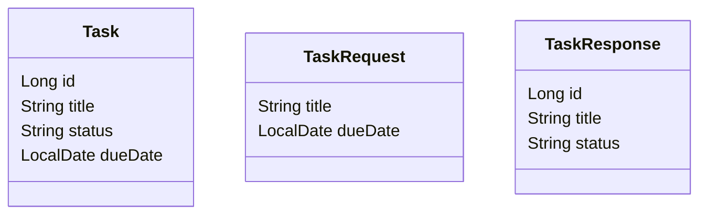

Main use cases:

```text
Create task
Find task by id
List open tasks
Mark task complete
Reject invalid task title
Secure admin-only delete
```

---

# 5. Layer Map

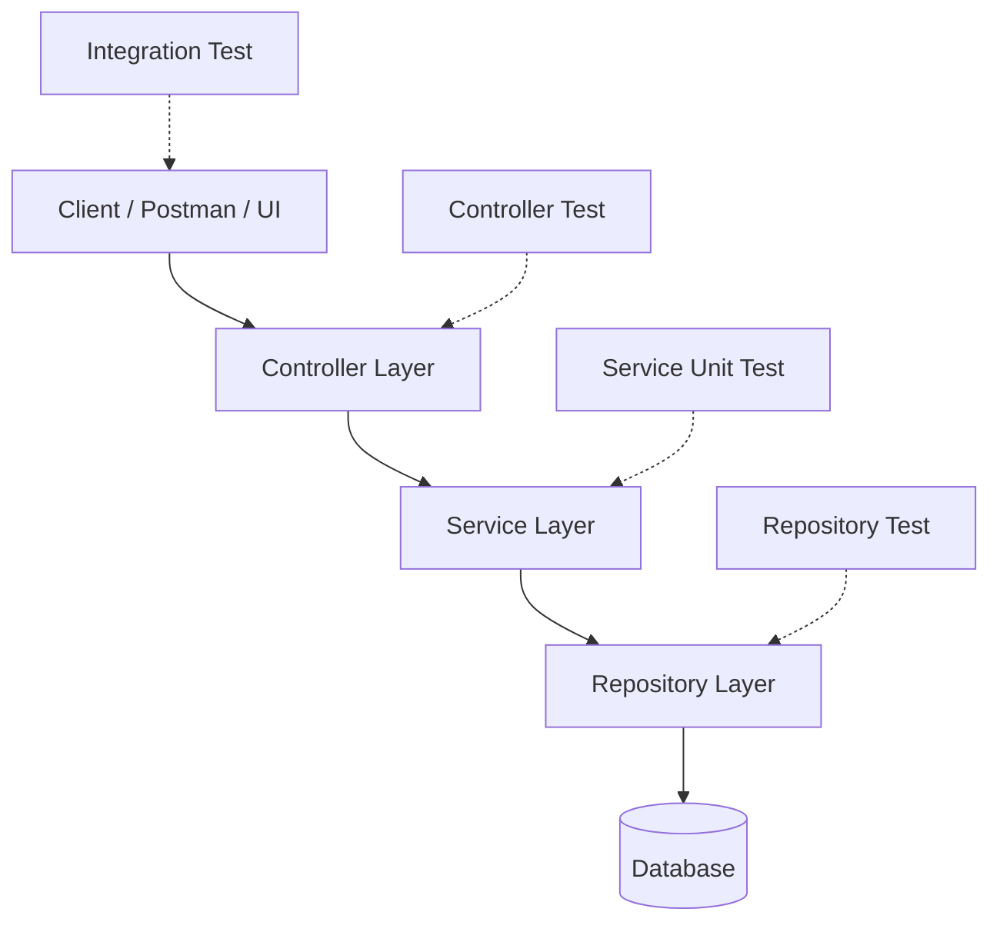

---

# 6. Way 1: Unit Test Utility / Plain Java

Use this when no Spring context is needed.

## Red test first

```java
import org.junit.jupiter.api.Test;

import static org.assertj.core.api.Assertions.assertThat;

class TaskStatusUtilTest {

    @Test
    void newTaskShouldStartAsOpen() {
        String status = TaskStatusUtil.defaultStatus();

        assertThat(status).isEqualTo("OPEN");
    }
}
```

## Green code

```java
public class TaskStatusUtil {

    public static String defaultStatus() {
        return "OPEN";
    }
}
```

Visual:

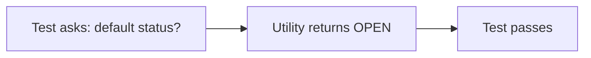

---

# 7. Way 2: Service Layer TDD

Service tests are fast. Mock the repository.

## Step 1: Write failing service test

```java
@ExtendWith(MockitoExtension.class)
class TaskServiceTest {

    @Mock
    private TaskRepository taskRepository;

    @InjectMocks
    private TaskService taskService;

    @Test
    void createTaskShouldSaveTaskAsOpen() {
        Task saved = new Task(1L, "Learn TDD", "OPEN", null);

        when(taskRepository.save(any(Task.class))).thenReturn(saved);

        TaskResponse response = taskService.createTask(
            new TaskRequest("Learn TDD", null)
        );

        assertThat(response.id()).isEqualTo(1L);
        assertThat(response.title()).isEqualTo("Learn TDD");
        assertThat(response.status()).isEqualTo("OPEN");

        verify(taskRepository).save(any(Task.class));
    }
}
```

## Step 2: Create service code

```java
@Service
public class TaskService {

    private final TaskRepository taskRepository;

    public TaskService(TaskRepository taskRepository) {
        this.taskRepository = taskRepository;
    }

    public TaskResponse createTask(TaskRequest request) {
        Task task = new Task();
        task.setTitle(request.title());
        task.setDueDate(request.dueDate());
        task.setStatus("OPEN");

        Task saved = taskRepository.save(task);

        return new TaskResponse(saved.getId(), saved.getTitle(), saved.getStatus());
    }
}
```

Visual:

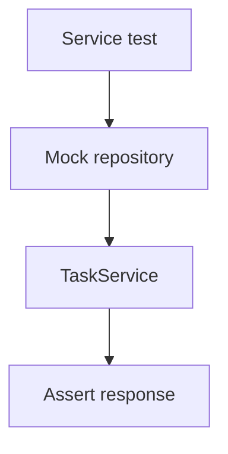

---

# 8. Way 3: Repository Layer TDD

Use `@DataJpaTest` for JPA repository tests.

## Entity

```java
@Entity
public class Task {

    @Id
    @GeneratedValue(strategy = GenerationType.IDENTITY)
    private Long id;

    private String title;
    private String status;
    private LocalDate dueDate;

    public Task() {}

    public Task(Long id, String title, String status, LocalDate dueDate) {
        this.id = id;
        this.title = title;
        this.status = status;
        this.dueDate = dueDate;
    }

    // getters and setters
}
```

## Repository test first

```java
@DataJpaTest
class TaskRepositoryTest {

    @Autowired
    private TaskRepository taskRepository;

    @Test
    void findByStatusShouldReturnOpenTasks() {
        Task task = new Task(null, "Write tests", "OPEN", null);
        taskRepository.save(task);

        List<Task> result = taskRepository.findByStatus("OPEN");

        assertThat(result).hasSize(1);
        assertThat(result.get(0).getTitle()).isEqualTo("Write tests");
    }
}
```

## Repository code

```java
public interface TaskRepository extends JpaRepository<Task, Long> {
    List<Task> findByStatus(String status);
}
```

Visual:

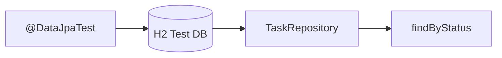

---

# 9. Way 4: Controller Layer TDD

Use `@WebMvcTest` to test only the web layer.

## Controller test first

```java
@WebMvcTest(TaskController.class)
class TaskControllerTest {

    @Autowired
    private MockMvc mockMvc;

    @MockBean
    private TaskService taskService;

    @Test
    void createTaskShouldReturn201() throws Exception {
        when(taskService.createTask(any(TaskRequest.class)))
            .thenReturn(new TaskResponse(1L, "Learn MVC test", "OPEN"));

        mockMvc.perform(post("/api/tasks")
                .contentType(MediaType.APPLICATION_JSON)
                .content("""
                    { "title": "Learn MVC test" }
                """))
            .andExpect(status().isCreated())
            .andExpect(jsonPath("$.id").value(1))
            .andExpect(jsonPath("$.status").value("OPEN"));
    }
}
```

## Controller code

```java
@RestController
@RequestMapping("/api/tasks")
public class TaskController {

    private final TaskService taskService;

    public TaskController(TaskService taskService) {
        this.taskService = taskService;
    }

    @PostMapping
    public ResponseEntity<TaskResponse> create(@Valid @RequestBody TaskRequest request) {
        return ResponseEntity.status(HttpStatus.CREATED)
            .body(taskService.createTask(request));
    }
}
```

Visual:

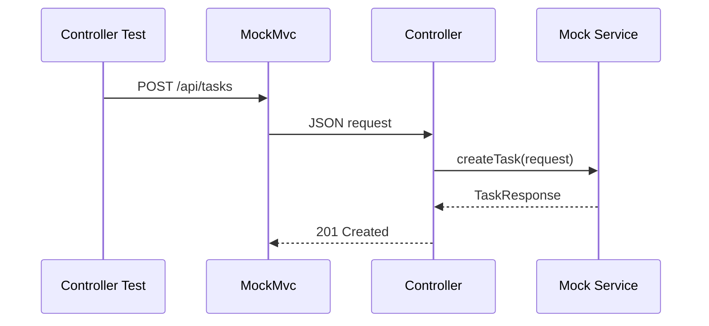

---

# 10. Way 5: Integration Test TDD

Integration tests load the real Spring context.

## Full API test

```java
@SpringBootTest
@AutoConfigureMockMvc
class TaskIntegrationTest {

    @Autowired
    private MockMvc mockMvc;

    @Autowired
    private TaskRepository taskRepository;

    @BeforeEach
    void cleanDb() {
        taskRepository.deleteAll();
    }

    @Test
    void createThenListOpenTasks() throws Exception {
        mockMvc.perform(post("/api/tasks")
                .contentType(MediaType.APPLICATION_JSON)
                .content("""
                    { "title": "Integration test" }
                """))
            .andExpect(status().isCreated());

        mockMvc.perform(get("/api/tasks?status=OPEN"))
            .andExpect(status().isOk())
            .andExpect(jsonPath("$[0].title").value("Integration test"));
    }
}
```

Visual:

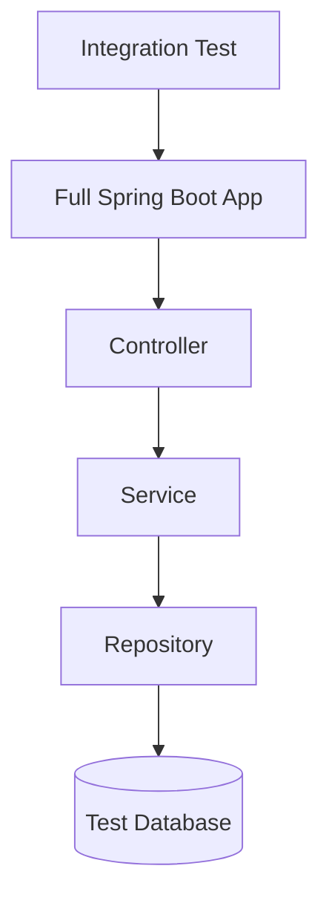

---

# 11. Way 6: Validation Test TDD

Use validation to reject bad input.

## DTO

```java
public record TaskRequest(
    @NotBlank(message = "title is required")
    String title,

    LocalDate dueDate
) {}
```

## Test invalid request

```java
@WebMvcTest(TaskController.class)
class TaskValidationTest {

    @Autowired
    private MockMvc mockMvc;

    @MockBean
    private TaskService taskService;

    @Test
    void blankTitleShouldReturn400() throws Exception {
        mockMvc.perform(post("/api/tasks")
                .contentType(MediaType.APPLICATION_JSON)
                .content("""
                    { "title": "" }
                """))
            .andExpect(status().isBadRequest());
    }
}
```

Visual:

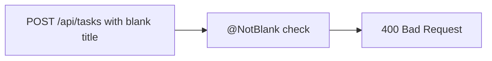

---

# 12. Way 7: Exception Handling TDD

Test error behavior before writing handlers.

## Custom exception

```java
public class TaskNotFoundException extends RuntimeException {
    public TaskNotFoundException(Long id) {
        super("Task not found: " + id);
    }
}
```

## Error response

```java
public record ErrorResponse(String message) {}
```

## Handler

```java
@RestControllerAdvice
public class GlobalExceptionHandler {

    @ExceptionHandler(TaskNotFoundException.class)
    public ResponseEntity<ErrorResponse> handleTaskNotFound(TaskNotFoundException ex) {
        return ResponseEntity.status(HttpStatus.NOT_FOUND)
            .body(new ErrorResponse(ex.getMessage()));
    }
}
```

## Test first

```java
@WebMvcTest(TaskController.class)
class TaskExceptionTest {

    @Autowired
    private MockMvc mockMvc;

    @MockBean
    private TaskService taskService;

    @Test
    void unknownTaskShouldReturn404() throws Exception {
        when(taskService.findById(99L))
            .thenThrow(new TaskNotFoundException(99L));

        mockMvc.perform(get("/api/tasks/99"))
            .andExpect(status().isNotFound())
            .andExpect(jsonPath("$.message").value("Task not found: 99"));
    }
}
```

Visual:

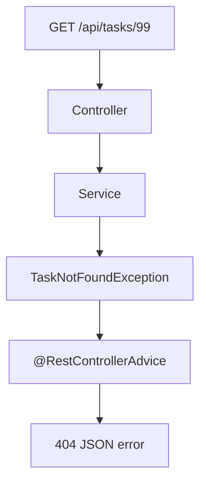

---

# 13. Way 8: Security Test TDD

Use this when endpoints need authentication or roles.

## Security config

```java
@Configuration
@EnableWebSecurity
public class SecurityConfig {

    @Bean
    SecurityFilterChain securityFilterChain(HttpSecurity http) throws Exception {
        return http
            .csrf(csrf -> csrf.disable())
            .authorizeHttpRequests(auth -> auth
                .requestMatchers(HttpMethod.GET, "/api/tasks/**").hasAnyRole("USER", "ADMIN")
                .requestMatchers(HttpMethod.DELETE, "/api/tasks/**").hasRole("ADMIN")
                .anyRequest().authenticated()
            )
            .httpBasic(Customizer.withDefaults())
            .build();
    }
}
```

## Security test

```java
@WebMvcTest(TaskController.class)
@Import(SecurityConfig.class)
class TaskSecurityTest {

    @Autowired
    private MockMvc mockMvc;

    @MockBean
    private TaskService taskService;

    @Test
    void unauthenticatedUserShouldGet401() throws Exception {
        mockMvc.perform(get("/api/tasks/1"))
            .andExpect(status().isUnauthorized());
    }

    @Test
    @WithMockUser(roles = "USER")
    void userCanViewTask() throws Exception {
        when(taskService.findById(1L))
            .thenReturn(new TaskResponse(1L, "Secure task", "OPEN"));

        mockMvc.perform(get("/api/tasks/1"))
            .andExpect(status().isOk());
    }

    @Test
    @WithMockUser(roles = "USER")
    void userCannotDeleteTask() throws Exception {
        mockMvc.perform(delete("/api/tasks/1"))
            .andExpect(status().isForbidden());
    }

    @Test
    @WithMockUser(roles = "ADMIN")
    void adminCanDeleteTask() throws Exception {
        mockMvc.perform(delete("/api/tasks/1"))
            .andExpect(status().isNoContent());
    }
}
```

Visual:

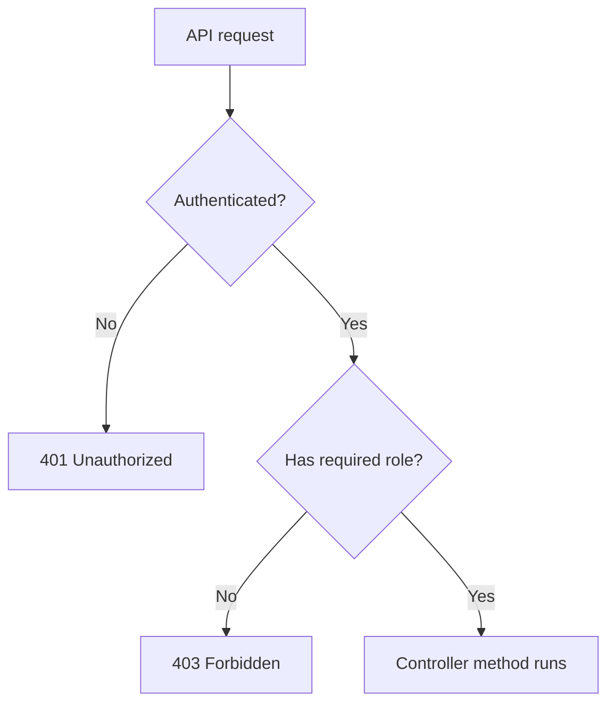

---

# 14. Way 9: Testcontainers TDD

Use Testcontainers when H2 is not close enough to production DB.

## PostgreSQL integration test

```java
@Testcontainers
@SpringBootTest
@AutoConfigureMockMvc
class TaskPostgresContainerTest {

    @Container
    static PostgreSQLContainer<?> postgres = new PostgreSQLContainer<>("postgres:16")
        .withDatabaseName("testdb")
        .withUsername("test")
        .withPassword("test");

    @DynamicPropertySource
    static void configureProperties(DynamicPropertyRegistry registry) {
        registry.add("spring.datasource.url", postgres::getJdbcUrl);
        registry.add("spring.datasource.username", postgres::getUsername);
        registry.add("spring.datasource.password", postgres::getPassword);
    }

    @Autowired
    private MockMvc mockMvc;

    @Test
    void appShouldUseRealPostgresContainer() throws Exception {
        mockMvc.perform(get("/actuator/health"))
            .andExpect(status().isOk());
    }
}
```

Visual:

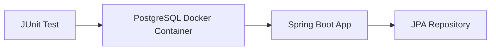

---

# 15. Way 10: Automated Tests in CI

Run tests automatically before merging code.

## GitHub Actions example

```yaml
name: Java CI

on:
  push:
    branches: [ main ]
  pull_request:
    branches: [ main ]

jobs:
  test:
    runs-on: ubuntu-latest

    steps:
      - name: Checkout code
        uses: actions/checkout@v4

      - name: Set up JDK
        uses: actions/setup-java@v4
        with:
          distribution: temurin
          java-version: 21

      - name: Run tests
        run: ./mvnw clean test
```

CI flow:

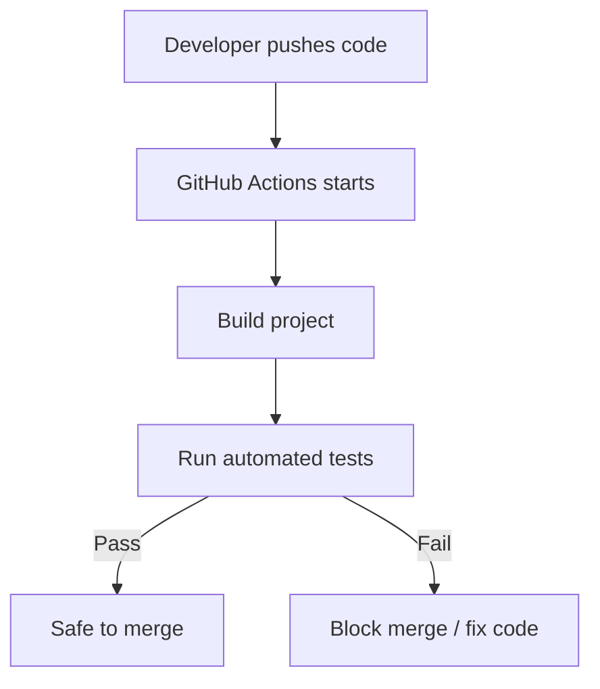

---

# 16. Advanced TDD Patterns

## Pattern 1: Arrange, Act, Assert

```java
@Test
void example() {
    // Arrange
    Task task = new Task(null, "AAA", "OPEN", null);

    // Act
    String status = task.getStatus();

    // Assert
    assertThat(status).isEqualTo("OPEN");
}
```

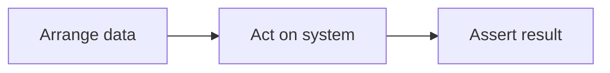

## Pattern 2: Given, When, Then

```java
@Test
void completeTaskShouldChangeStatus() {
    // Given
    Task task = new Task(1L, "Learn", "OPEN", null);

    // When
    task.markComplete();

    // Then
    assertThat(task.getStatus()).isEqualTo("DONE");
}
```

## Pattern 3: One behavior per test

Good:

```java
@Test
void createTaskShouldReturnOpenStatus() {}
```

Avoid:

```java
@Test
void createUpdateDeleteAndListTask() {}
```

---

# 17. Testing Pyramid

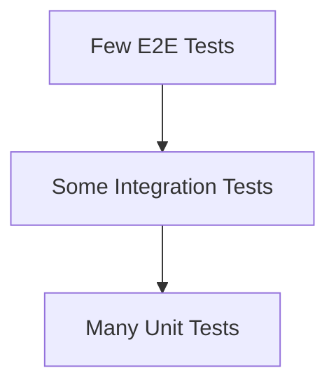

Meaning:

```text
Unit tests: many, fast, cheap
Integration tests: some, slower
E2E tests: few, expensive
```

---

# 18. Common Annotations Cheat Sheet

| Annotation | Use |
|---|---|
| `@Test` | Marks a test method |
| `@SpringBootTest` | Loads full Spring app |
| `@WebMvcTest` | Tests controller layer only |
| `@DataJpaTest` | Tests repository/JPA layer |
| `@MockBean` | Adds Spring mock bean |
| `@Mock` | Mockito mock |
| `@InjectMocks` | Injects mocks into tested class |
| `@AutoConfigureMockMvc` | Enables MockMvc in integration tests |
| `@WithMockUser` | Fake logged-in user for security tests |
| `@Testcontainers` | Enables container-based tests |
| `@DynamicPropertySource` | Injects dynamic DB properties |

---

# 19. Best Practices

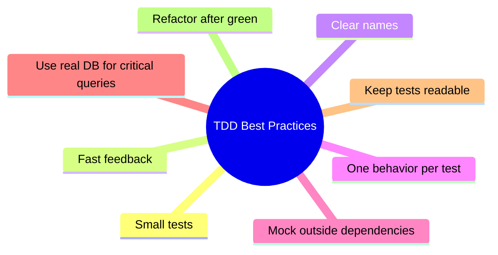

Checklist:

```text
[ ] Test name explains behavior
[ ] Test fails for the right reason
[ ] Production code is minimal
[ ] Test passes
[ ] Refactor done
[ ] Edge cases covered
```

---

# 20. Full Step-by-Step Mini Project

## Step 1: DTOs

```java
public record TaskRequest(
    @NotBlank(message = "title is required")
    String title,
    LocalDate dueDate
) {}

public record TaskResponse(
    Long id,
    String title,
    String status
) {}
```

## Step 2: Entity

```java
@Entity
public class Task {

    @Id
    @GeneratedValue(strategy = GenerationType.IDENTITY)
    private Long id;

    private String title;
    private String status;
    private LocalDate dueDate;

    public void markComplete() {
        this.status = "DONE";
    }

    // constructors, getters, setters
}
```

## Step 3: Repository

```java
public interface TaskRepository extends JpaRepository<Task, Long> {
    List<Task> findByStatus(String status);
}
```

## Step 4: Service test first

```java
@ExtendWith(MockitoExtension.class)
class TaskServiceTest {

    @Mock
    TaskRepository repository;

    @InjectMocks
    TaskService service;

    @Test
    void markCompleteShouldChangeStatusToDone() {
        Task task = new Task(1L, "TDD", "OPEN", null);

        when(repository.findById(1L)).thenReturn(Optional.of(task));
        when(repository.save(any(Task.class))).thenAnswer(invocation -> invocation.getArgument(0));

        TaskResponse response = service.markComplete(1L);

        assertThat(response.status()).isEqualTo("DONE");
    }
}
```

## Step 5: Service code

```java
@Service
public class TaskService {

    private final TaskRepository repository;

    public TaskService(TaskRepository repository) {
        this.repository = repository;
    }

    public TaskResponse markComplete(Long id) {
        Task task = repository.findById(id)
            .orElseThrow(() -> new TaskNotFoundException(id));

        task.markComplete();
        Task saved = repository.save(task);

        return new TaskResponse(saved.getId(), saved.getTitle(), saved.getStatus());
    }

    public TaskResponse findById(Long id) {
        Task task = repository.findById(id)
            .orElseThrow(() -> new TaskNotFoundException(id));

        return new TaskResponse(task.getId(), task.getTitle(), task.getStatus());
    }

    public TaskResponse createTask(TaskRequest request) {
        Task task = new Task();
        task.setTitle(request.title());
        task.setDueDate(request.dueDate());
        task.setStatus("OPEN");

        Task saved = repository.save(task);
        return new TaskResponse(saved.getId(), saved.getTitle(), saved.getStatus());
    }
}
```

## Step 6: Controller

```java
@RestController
@RequestMapping("/api/tasks")
public class TaskController {

    private final TaskService service;

    public TaskController(TaskService service) {
        this.service = service;
    }

    @PostMapping
    public ResponseEntity<TaskResponse> create(@Valid @RequestBody TaskRequest request) {
        return ResponseEntity.status(HttpStatus.CREATED).body(service.createTask(request));
    }

    @GetMapping("/{id}")
    public TaskResponse findById(@PathVariable Long id) {
        return service.findById(id);
    }

    @PatchMapping("/{id}/complete")
    public TaskResponse complete(@PathVariable Long id) {
        return service.markComplete(id);
    }

    @DeleteMapping("/{id}")
    @ResponseStatus(HttpStatus.NO_CONTENT)
    public void delete(@PathVariable Long id) {
        // add delete service method using TDD
    }
}
```

## Step 7: Final request lifecycle

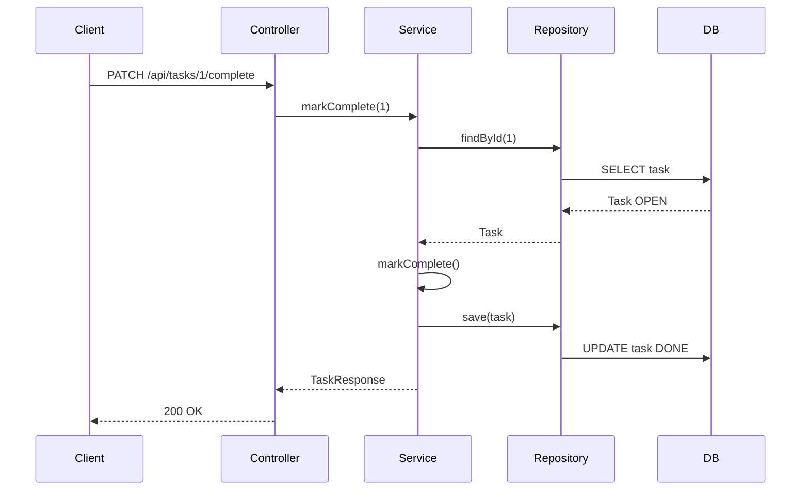

---

# Final Mental Model

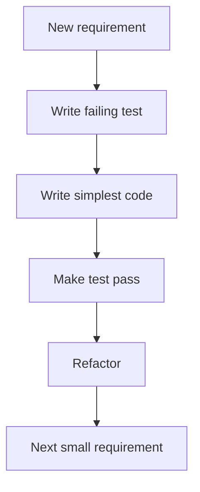

Use TDD like a GPS:

```text
Test = destination
Production code = route
Refactor = cleaner road
```
