# Spring Boot Observability, Logging Aggregation, and Monitoring — Visual Reference

> Visual-first reference for learning **logging**, **metrics**, **tracing**, **log aggregation**, **dashboards**, and **alerts** with Spring Boot.

---

## Clickable Index

### Basics
- [1. What is Observability?](#1-what-is-observability)
- [2. Three Pillars: Logs, Metrics, Traces](#2-three-pillars-logs-metrics-traces)
- [3. Spring Boot Observability Stack](#3-spring-boot-observability-stack)
- [4. Project Setup](#4-project-setup)

### Logging
- [5. Basic Logging in Spring Boot](#5-basic-logging-in-spring-boot)
- [6. Structured JSON Logging](#6-structured-json-logging)
- [7. Correlation ID / Trace ID in Logs](#7-correlation-id--trace-id-in-logs)
- [8. Log Levels and Best Practices](#8-log-levels-and-best-practices)

### Metrics and Monitoring
- [9. Spring Boot Actuator](#9-spring-boot-actuator)
- [10. Micrometer Metrics](#10-micrometer-metrics)
- [11. Prometheus Setup](#11-prometheus-setup)
- [12. Grafana Dashboard Setup](#12-grafana-dashboard-setup)

### Tracing
- [13. Distributed Tracing Basics](#13-distributed-tracing-basics)
- [14. OpenTelemetry Setup](#14-opentelemetry-setup)
- [15. Jaeger Tracing Setup](#15-jaeger-tracing-setup)

### Log Aggregation Tools
- [16. ELK Stack: Elasticsearch + Logstash + Kibana](#16-elk-stack-elasticsearch--logstash--kibana)
- [17. EFK Stack: Elasticsearch + Fluent Bit + Kibana](#17-efk-stack-elasticsearch--fluent-bit--kibana)
- [18. Loki + Promtail + Grafana](#18-loki--promtail--grafana)

### Advanced
- [19. Alerts with Prometheus Alertmanager](#19-alerts-with-prometheus-alertmanager)
- [20. Health Checks and Readiness/Liveness](#20-health-checks-and-readinessliveness)
- [21. Custom Business Metrics](#21-custom-business-metrics)
- [22. Error Tracking Options](#22-error-tracking-options)
- [23. Production Architecture](#23-production-architecture)
- [24. Tool Comparison](#24-tool-comparison)
- [25. Step-by-Step Learning Path](#25-step-by-step-learning-path)

---

# 1. What is Observability?

Observability means your application can answer:

```text
What happened?
Where did it happen?
Why did it happen?
How bad is it?
Who is affected?
```

## Visual idea

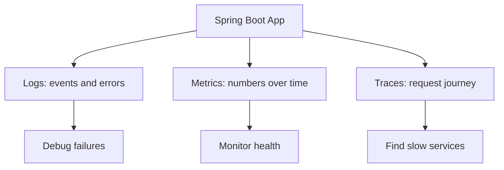

---

# 2. Three Pillars: Logs, Metrics, Traces

| Pillar | Question answered | Example |
|---|---|---|
| Logs | What happened? | `Payment failed for order 101` |
| Metrics | How many / how fast? | `http_server_requests_seconds_count` |
| Traces | Where did time go? | API → Service → DB → External API |

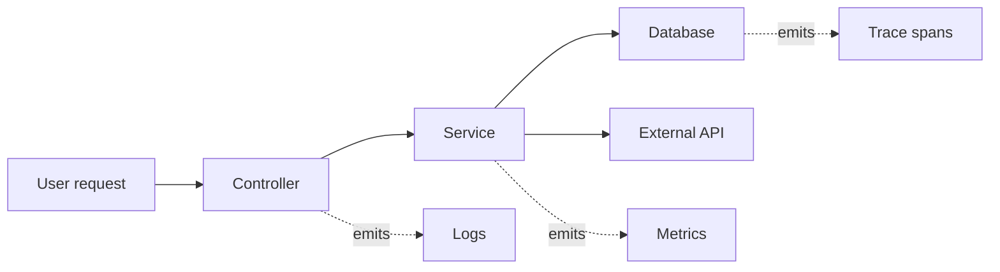

---

# 3. Spring Boot Observability Stack

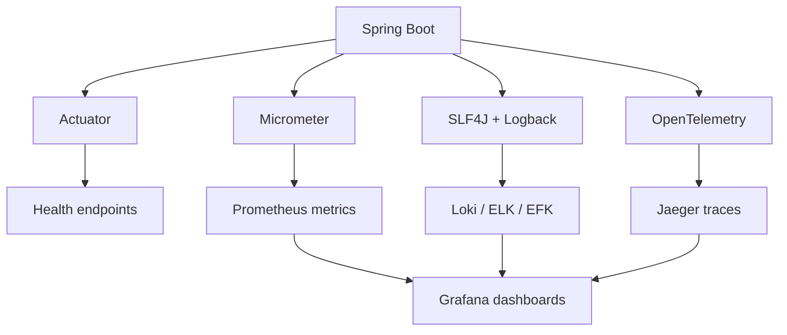

---

# 4. Project Setup

## Maven dependencies

```xml
<dependencies>
    <dependency>
        <groupId>org.springframework.boot</groupId>
        <artifactId>spring-boot-starter-web</artifactId>
    </dependency>

    <dependency>
        <groupId>org.springframework.boot</groupId>
        <artifactId>spring-boot-starter-actuator</artifactId>
    </dependency>

    <dependency>
        <groupId>io.micrometer</groupId>
        <artifactId>micrometer-registry-prometheus</artifactId>
    </dependency>

    <dependency>
        <groupId>io.micrometer</groupId>
        <artifactId>micrometer-tracing-bridge-otel</artifactId>
    </dependency>

    <dependency>
        <groupId>io.opentelemetry</groupId>
        <artifactId>opentelemetry-exporter-otlp</artifactId>
    </dependency>

    <dependency>
        <groupId>net.logstash.logback</groupId>
        <artifactId>logstash-logback-encoder</artifactId>
        <version>7.4</version>
    </dependency>
</dependencies>
```

## application.yml

```yaml
spring:
  application:
    name: order-service

server:
  port: 8080

management:
  endpoints:
    web:
      exposure:
        include: health,info,metrics,prometheus,loggers
  endpoint:
    health:
      show-details: always
  tracing:
    sampling:
      probability: 1.0

logging:
  level:
    root: INFO
    com.example: DEBUG
```

---

# 5. Basic Logging in Spring Boot

## Flow

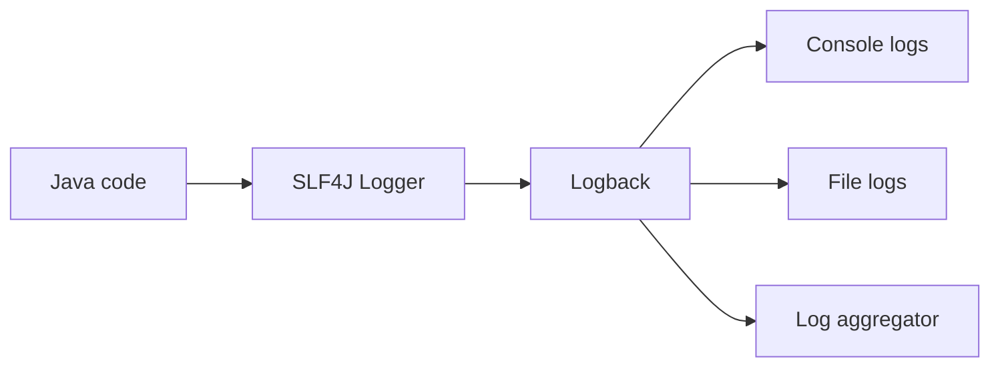

## Small controller example

```java
package com.example.demo.order;

import org.slf4j.Logger;
import org.slf4j.LoggerFactory;
import org.springframework.web.bind.annotation.*;

@RestController
@RequestMapping("/orders")
public class OrderController {

    private static final Logger log = LoggerFactory.getLogger(OrderController.class);

    @PostMapping
    public String createOrder(@RequestBody CreateOrderRequest request) {
        log.info("Creating order for userId={} amount={}", request.userId(), request.amount());
        return "Order created";
    }
}

record CreateOrderRequest(Long userId, double amount) {}
```

## What to log

```text
Good:
- orderId
- userId
- status
- durationMs
- traceId

Avoid:
- passwords
- tokens
- credit card numbers
- personal secrets
```

---

# 6. Structured JSON Logging

Plain logs are hard to search. JSON logs are easy to query.

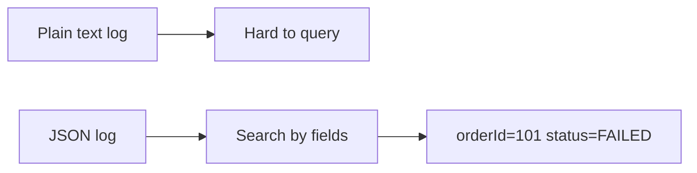

## logback-spring.xml

Create:

```text
src/main/resources/logback-spring.xml
```

```xml
<configuration>
    <appender name="CONSOLE_JSON" class="ch.qos.logback.core.ConsoleAppender">
        <encoder class="net.logstash.logback.encoder.LoggingEventCompositeJsonEncoder">
            <providers>
                <timestamp />
                <logLevel />
                <loggerName />
                <threadName />
                <message />
                <mdc />
                <stackTrace />
            </providers>
        </encoder>
    </appender>

    <root level="INFO">
        <appender-ref ref="CONSOLE_JSON" />
    </root>
</configuration>
```

## Example JSON log shape

```json
{
  "@timestamp": "2026-05-01T10:20:30Z",
  "level": "INFO",
  "logger_name": "com.example.demo.order.OrderController",
  "message": "Creating order for userId=7 amount=50.0",
  "traceId": "abc123",
  "spanId": "def456"
}
```

---

# 7. Correlation ID / Trace ID in Logs

A correlation ID connects all logs from one request.

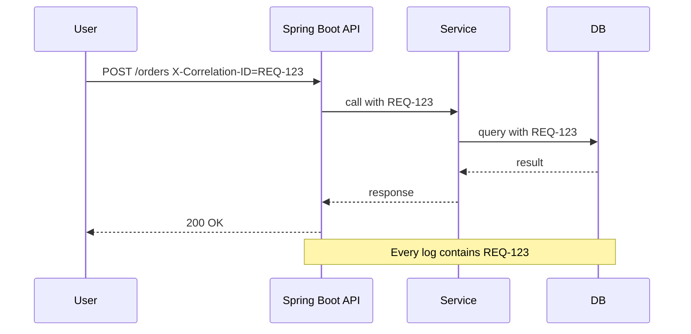

## Filter example

```java
package com.example.demo.observability;

import jakarta.servlet.*;
import jakarta.servlet.http.HttpServletRequest;
import org.slf4j.MDC;
import org.springframework.stereotype.Component;

import java.io.IOException;
import java.util.UUID;

@Component
public class CorrelationIdFilter implements Filter {

    private static final String HEADER = "X-Correlation-ID";

    @Override
    public void doFilter(ServletRequest request, ServletResponse response, FilterChain chain)
            throws IOException, ServletException {

        HttpServletRequest httpRequest = (HttpServletRequest) request;
        String correlationId = httpRequest.getHeader(HEADER);

        if (correlationId == null || correlationId.isBlank()) {
            correlationId = UUID.randomUUID().toString();
        }

        try {
            MDC.put("correlationId", correlationId);
            chain.doFilter(request, response);
        } finally {
            MDC.remove("correlationId");
        }
    }
}
```

---

# 8. Log Levels and Best Practices

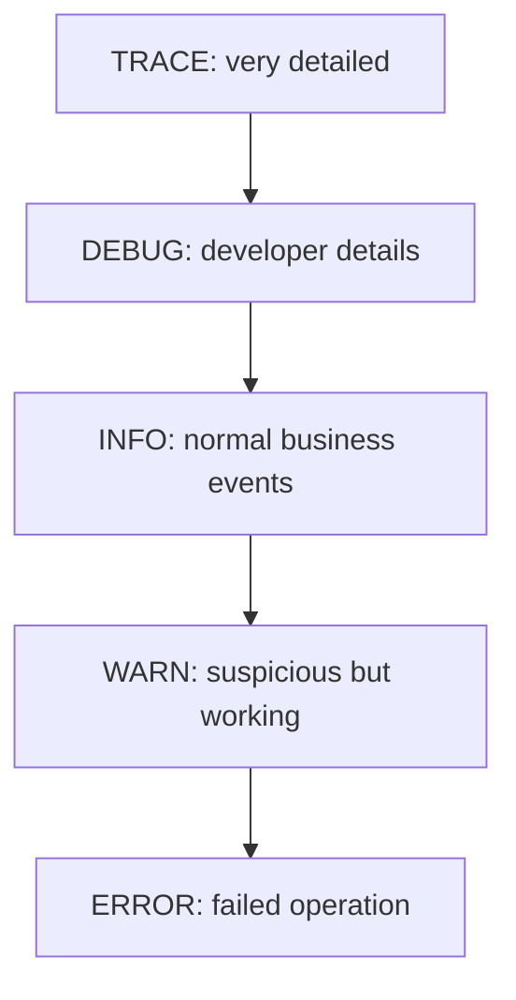

## Example

```java
log.debug("Loaded product id={}", productId);
log.info("Order created orderId={} userId={}", orderId, userId);
log.warn("Payment retry orderId={} attempt={}", orderId, attempt);
log.error("Payment failed orderId={}", orderId, exception);
```

## Production rule

```text
Default production level: INFO
Turn on DEBUG only for specific packages during investigation.
```

---

# 9. Spring Boot Actuator

Actuator exposes health, metrics, and runtime info.

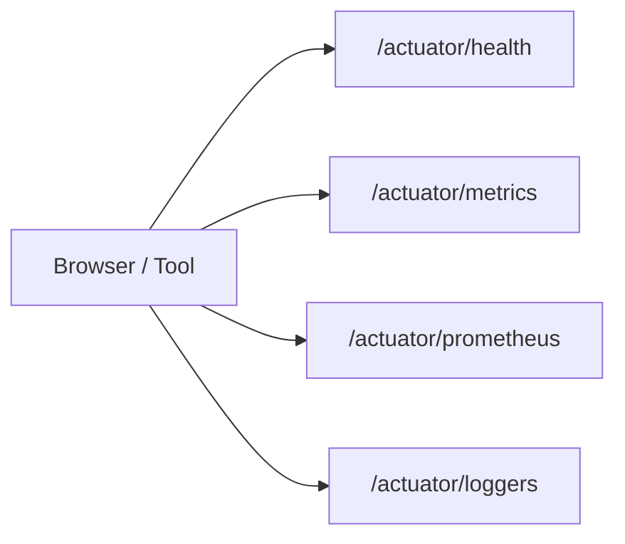

## Test endpoints

```bash
curl http://localhost:8080/actuator/health
curl http://localhost:8080/actuator/metrics
curl http://localhost:8080/actuator/prometheus
```

## Sample health response

```json
{
  "status": "UP"
}
```

---

# 10. Micrometer Metrics

Micrometer is the metrics facade used by Spring Boot.

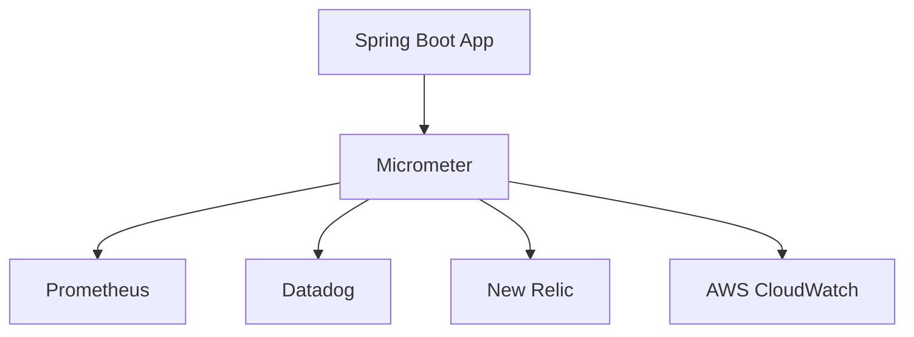

## Custom counter

```java
package com.example.demo.order;

import io.micrometer.core.instrument.Counter;
import io.micrometer.core.instrument.MeterRegistry;
import org.springframework.stereotype.Service;

@Service
public class OrderMetricsService {

    private final Counter orderCreatedCounter;

    public OrderMetricsService(MeterRegistry meterRegistry) {
        this.orderCreatedCounter = Counter.builder("orders.created.total")
                .description("Total number of created orders")
                .tag("service", "order-service")
                .register(meterRegistry);
    }

    public void orderCreated() {
        orderCreatedCounter.increment();
    }
}
```

## Timer example

```java
package com.example.demo.order;

import io.micrometer.core.annotation.Timed;
import org.springframework.stereotype.Service;

@Service
public class PaymentService {

    @Timed(value = "payment.process.duration", description = "Payment processing time")
    public String processPayment(Long orderId) {
        return "PAID";
    }
}
```

---

# 11. Prometheus Setup

Prometheus scrapes metrics from Spring Boot.

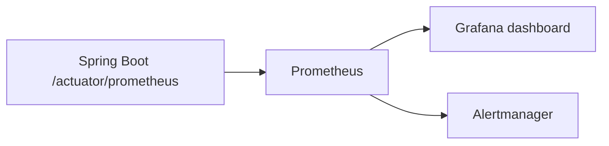

## prometheus.yml

```yaml
global:
  scrape_interval: 15s

scrape_configs:
  - job_name: "spring-boot-app"
    metrics_path: "/actuator/prometheus"
    static_configs:
      - targets: ["host.docker.internal:8080"]
```

## Docker command

```bash
docker run -d \
  --name prometheus \
  -p 9090:9090 \
  -v ./prometheus.yml:/etc/prometheus/prometheus.yml \
  prom/prometheus
```

## Useful PromQL

```promql
http_server_requests_seconds_count

rate(http_server_requests_seconds_count[1m])

sum(rate(http_server_requests_seconds_count[5m])) by (uri)

histogram_quantile(
  0.95,
  sum(rate(http_server_requests_seconds_bucket[5m])) by (le, uri)
)
```

---

# 12. Grafana Dashboard Setup

Grafana visualizes metrics and logs.

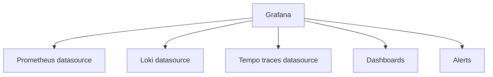

## Docker command

```bash
docker run -d \
  --name grafana \
  -p 3000:3000 \
  grafana/grafana
```

Open:

```text
http://localhost:3000
```

Default login:

```text
admin / admin
```

## First dashboard panels

```text
Panel 1: Request rate
PromQL: sum(rate(http_server_requests_seconds_count[1m]))

Panel 2: Error rate
PromQL: sum(rate(http_server_requests_seconds_count{status=~"5.."}[1m]))

Panel 3: P95 latency
PromQL: histogram_quantile(0.95, sum(rate(http_server_requests_seconds_bucket[5m])) by (le))

Panel 4: JVM memory
PromQL: jvm_memory_used_bytes
```

---

# 13. Distributed Tracing Basics

Tracing shows the journey of a request.

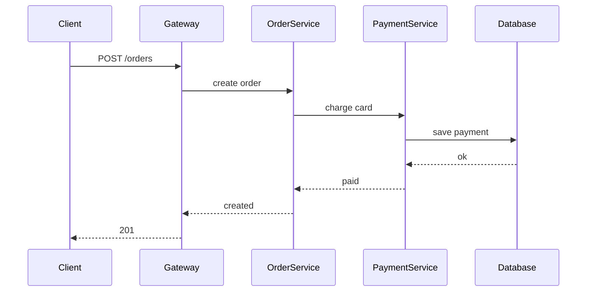

## Trace vocabulary

| Term | Meaning |
|---|---|
| Trace | Full request journey |
| Span | One operation inside a trace |
| Trace ID | ID shared by all spans |
| Span ID | ID for one operation |

---

# 14. OpenTelemetry Setup

OpenTelemetry collects traces, metrics, and logs in a vendor-neutral way.

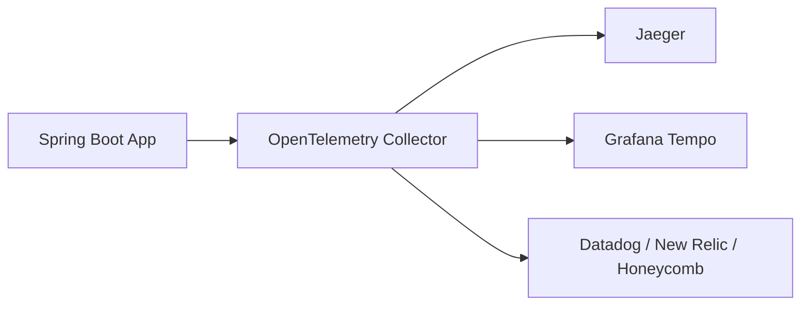

## application.yml tracing config

```yaml
management:
  tracing:
    sampling:
      probability: 1.0
  otlp:
    tracing:
      endpoint: http://localhost:4318/v1/traces
```

## Add manual span

```java
package com.example.demo.order;

import io.micrometer.tracing.Span;
import io.micrometer.tracing.Tracer;
import org.springframework.stereotype.Service;

@Service
public class InventoryService {

    private final Tracer tracer;

    public InventoryService(Tracer tracer) {
        this.tracer = tracer;
    }

    public boolean reserveStock(Long productId) {
        Span span = tracer.nextSpan().name("reserve-stock").start();
        try (Tracer.SpanInScope scope = tracer.withSpan(span)) {
            span.tag("productId", String.valueOf(productId));
            return true;
        } finally {
            span.end();
        }
    }
}
```

---

# 15. Jaeger Tracing Setup

Jaeger stores and displays traces.

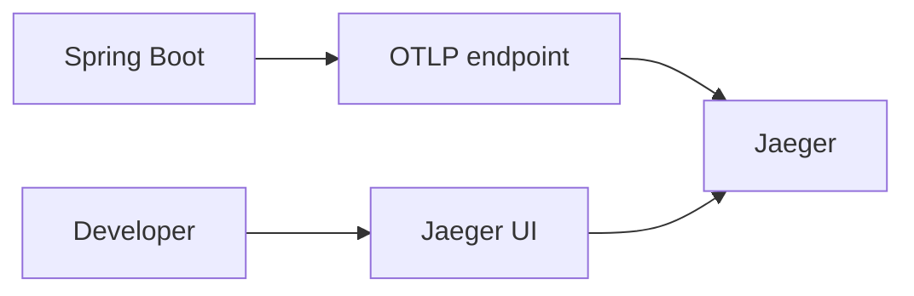

## Docker command

```bash
docker run -d \
  --name jaeger \
  -e COLLECTOR_OTLP_ENABLED=true \
  -p 16686:16686 \
  -p 4317:4317 \
  -p 4318:4318 \
  jaegertracing/all-in-one
```

Open:

```text
http://localhost:16686
```

---

# 16. ELK Stack: Elasticsearch + Logstash + Kibana

ELK is a common log aggregation stack.

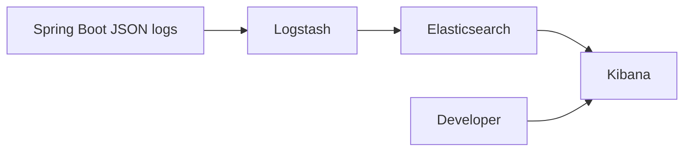

## logstash.conf

```conf
input {
  tcp {
    port => 5000
    codec => json
  }
}

filter {
  mutate {
    add_field => { "service" => "order-service" }
  }
}

output {
  elasticsearch {
    hosts => ["http://elasticsearch:9200"]
    index => "spring-logs-%{+YYYY.MM.dd}"
  }
  stdout { codec => rubydebug }
}
```

## Logback TCP appender idea

```xml
<appender name="LOGSTASH" class="net.logstash.logback.appender.LogstashTcpSocketAppender">
    <destination>localhost:5000</destination>
    <encoder class="net.logstash.logback.encoder.LogstashEncoder" />
</appender>

<root level="INFO">
    <appender-ref ref="LOGSTASH" />
</root>
```

## Search examples in Kibana

```text
level: ERROR
service: order-service
correlationId: "REQ-123"
message: "Payment failed"
```

---

# 17. EFK Stack: Elasticsearch + Fluent Bit + Kibana

EFK is popular in Kubernetes.

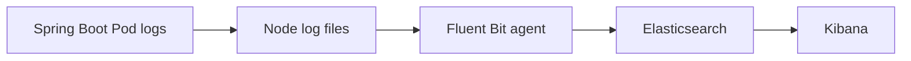

## Fluent Bit basic config

```ini
[INPUT]
    Name tail
    Path /var/log/containers/*.log
    Parser docker
    Tag kube.*

[OUTPUT]
    Name es
    Match *
    Host elasticsearch
    Port 9200
    Index spring-boot-logs
```

## When to use EFK

```text
Use EFK when:
- app runs in Kubernetes
- logs are written to stdout
- sidecar or daemonset collects logs
```

---

# 18. Loki + Promtail + Grafana

Loki is log aggregation built for Grafana.

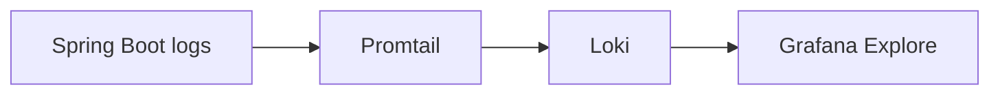

## docker-compose.yml

```yaml
version: "3.8"

services:
  loki:
    image: grafana/loki:2.9.0
    ports:
      - "3100:3100"
    command: -config.file=/etc/loki/local-config.yaml

  promtail:
    image: grafana/promtail:2.9.0
    volumes:
      - ./logs:/var/log/app
      - ./promtail.yml:/etc/promtail/config.yml
    command: -config.file=/etc/promtail/config.yml

  grafana:
    image: grafana/grafana
    ports:
      - "3000:3000"
```

## promtail.yml

```yaml
server:
  http_listen_port: 9080

positions:
  filename: /tmp/positions.yaml

clients:
  - url: http://loki:3100/loki/api/v1/push

scrape_configs:
  - job_name: spring-boot
    static_configs:
      - targets:
          - localhost
        labels:
          job: spring-boot
          service: order-service
          __path__: /var/log/app/*.log
```

## LogQL examples

```logql
{service="order-service"}

{service="order-service"} |= "ERROR"

{service="order-service"} | json | level="ERROR"

rate({service="order-service"} |= "Payment failed" [5m])
```

---

# 19. Alerts with Prometheus Alertmanager

Alerts notify you before users complain.

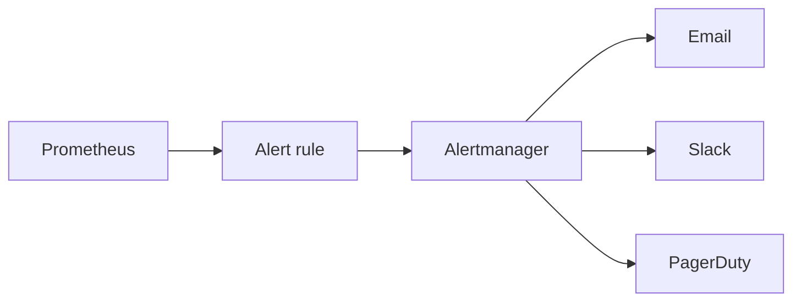

## alert-rules.yml

```yaml
groups:
  - name: spring-boot-alerts
    rules:
      - alert: HighErrorRate
        expr: sum(rate(http_server_requests_seconds_count{status=~"5.."}[5m])) > 1
        for: 2m
        labels:
          severity: critical
        annotations:
          summary: "High 5xx error rate"
          description: "More than 1 server error per second for 2 minutes."

      - alert: HighLatencyP95
        expr: histogram_quantile(0.95, sum(rate(http_server_requests_seconds_bucket[5m])) by (le)) > 1
        for: 5m
        labels:
          severity: warning
        annotations:
          summary: "High p95 latency"
```

---

# 20. Health Checks and Readiness/Liveness

Health checks tell platforms whether your app is alive and ready.

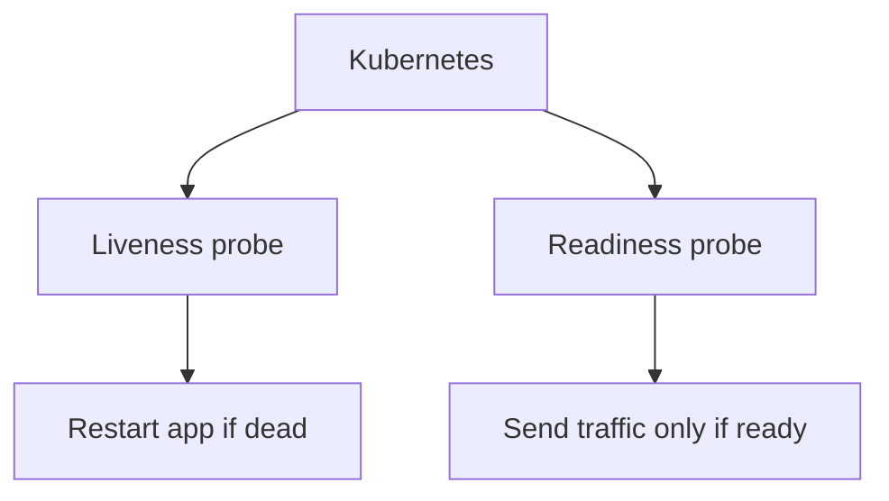

## application.yml

```yaml
management:
  endpoint:
    health:
      probes:
        enabled: true
  health:
    livenessstate:
      enabled: true
    readinessstate:
      enabled: true
```

## URLs

```text
/actuator/health/liveness
/actuator/health/readiness
```

## Custom health indicator

```java
package com.example.demo.health;

import org.springframework.boot.actuate.health.Health;
import org.springframework.boot.actuate.health.HealthIndicator;
import org.springframework.stereotype.Component;

@Component
public class ExternalPaymentHealthIndicator implements HealthIndicator {

    @Override
    public Health health() {
        boolean paymentProviderAvailable = true;

        if (paymentProviderAvailable) {
            return Health.up()
                    .withDetail("paymentProvider", "available")
                    .build();
        }

        return Health.down()
                .withDetail("paymentProvider", "unavailable")
                .build();
    }
}
```

---

# 21. Custom Business Metrics

Business metrics help answer product questions.

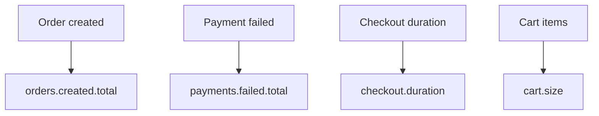

## Example service

```java
package com.example.demo.checkout;

import io.micrometer.core.instrument.Counter;
import io.micrometer.core.instrument.MeterRegistry;
import io.micrometer.core.instrument.Timer;
import org.springframework.stereotype.Service;

@Service
public class CheckoutService {

    private final Counter checkoutSuccess;
    private final Counter checkoutFailure;
    private final Timer checkoutTimer;

    public CheckoutService(MeterRegistry registry) {
        this.checkoutSuccess = Counter.builder("checkout.success.total").register(registry);
        this.checkoutFailure = Counter.builder("checkout.failure.total").register(registry);
        this.checkoutTimer = Timer.builder("checkout.duration").register(registry);
    }

    public String checkout(Long userId) {
        return checkoutTimer.record(() -> {
            try {
                checkoutSuccess.increment();
                return "SUCCESS";
            } catch (Exception ex) {
                checkoutFailure.increment();
                throw ex;
            }
        });
    }
}
```

---

# 22. Error Tracking Options

Error tracking groups exceptions and shows stack traces.

```mermaid
flowchart LR
    App["Spring Boot App"] --> Error["Exception"]
    Error --> Logs["Logs"]
    Error --> Tracker["Error tracker"]
    Tracker --> Group["Group similar errors"]
    Tracker --> Alert["Notify team"]
```

## Common tools

| Tool | Best for |
|---|---|
| Sentry | Error tracking and release monitoring |
| Rollbar | Error grouping and alerts |
| Bugsnag | App stability monitoring |
| Datadog APM | Full commercial observability |
| New Relic | APM, infra, browser monitoring |
| Grafana Cloud | Logs, metrics, traces hosted |
| Elastic Observability | Logs, metrics, APM, SIEM |

## Global exception handler with logging

```java
package com.example.demo.error;

import org.slf4j.Logger;
import org.slf4j.LoggerFactory;
import org.springframework.http.ResponseEntity;
import org.springframework.web.bind.annotation.ExceptionHandler;
import org.springframework.web.bind.annotation.RestControllerAdvice;

@RestControllerAdvice
public class GlobalExceptionHandler {

    private static final Logger log = LoggerFactory.getLogger(GlobalExceptionHandler.class);

    @ExceptionHandler(Exception.class)
    public ResponseEntity<ErrorResponse> handle(Exception ex) {
        log.error("Unhandled exception", ex);
        return ResponseEntity.internalServerError()
                .body(new ErrorResponse("INTERNAL_ERROR", "Something went wrong"));
    }
}

record ErrorResponse(String code, String message) {}
```

---

# 23. Production Architecture

## Recommended open-source stack

```mermaid
flowchart TD
    subgraph AppLayer["Application Layer"]
        App1["Spring Boot Service A"]
        App2["Spring Boot Service B"]
        App3["Spring Boot Service C"]
    end

    subgraph Signals["Signals"]
        Logs["JSON logs"]
        Metrics["Prometheus metrics"]
        Traces["OTel traces"]
    end

    subgraph Storage["Observability Storage"]
        Loki["Loki logs"]
        Prom["Prometheus metrics"]
        Jaeger["Jaeger traces"]
    end

    subgraph View["Visualization"]
        Grafana["Grafana dashboards"]
        Alerts["Alerts"]
    end

    App1 --> Logs
    App1 --> Metrics
    App1 --> Traces
    App2 --> Logs
    App2 --> Metrics
    App2 --> Traces
    App3 --> Logs
    App3 --> Metrics
    App3 --> Traces

    Logs --> Loki
    Metrics --> Prom
    Traces --> Jaeger

    Loki --> Grafana
    Prom --> Grafana
    Jaeger --> Grafana
    Prom --> Alerts
```

## Request debugging flow

```mermaid
flowchart TD
    Problem["User says checkout is slow"] --> Dashboard["Check Grafana latency panel"]
    Dashboard --> Trace["Open trace for slow request"]
    Trace --> Span["Find slow span"]
    Span --> Logs["Search logs by traceId"]
    Logs --> Cause["Find root cause"]
    Cause --> Fix["Fix and deploy"]
```

---

# 24. Tool Comparison

| Category | Tool | Open source? | Notes |
|---|---|---:|---|
| Metrics | Prometheus | Yes | Best common metrics backend |
| Dashboard | Grafana | Yes | Works with Prometheus, Loki, Tempo |
| Logs | Loki | Yes | Great with Grafana, cheaper indexing |
| Logs | ELK | Yes / Commercial | Powerful search, heavier setup |
| Logs | EFK | Yes / Commercial | Kubernetes-friendly log collection |
| Traces | Jaeger | Yes | Good tracing UI |
| Traces | Tempo | Yes | Grafana-native tracing |
| Collector | OpenTelemetry Collector | Yes | Vendor-neutral pipeline |
| APM | Datadog | No | Managed full observability |
| APM | New Relic | No | Managed full observability |
| Error Tracking | Sentry | Yes / Cloud | Strong exception tracking |
| Cloud | AWS CloudWatch | No | Best inside AWS ecosystem |
| Cloud | Azure Monitor | No | Best inside Azure ecosystem |
| Cloud | Google Cloud Operations | No | Best inside GCP ecosystem |

---

# 25. Step-by-Step Learning Path

## Step 1: Start with Actuator

```mermaid
flowchart LR
    Add["Add actuator"] --> Enable["Expose health and metrics"]
    Enable --> Test["curl /actuator/health"]
```

Checklist:

```text
- Add spring-boot-starter-actuator
- Enable health, metrics, prometheus
- Test /actuator/health
```

---

## Step 2: Add structured logs

```mermaid
flowchart LR
    Logback["logback-spring.xml"] --> JSON["JSON logs"]
    JSON --> Searchable["Searchable fields"]
```

Checklist:

```text
- Add logstash-logback-encoder
- Configure JSON console logs
- Add correlationId to MDC
```

---

## Step 3: Add Prometheus

```mermaid
flowchart LR
    Spring["Spring Boot"] --> Prom["Prometheus scrape"]
    Prom --> Query["PromQL"]
```

Checklist:

```text
- Add micrometer-registry-prometheus
- Configure prometheus.yml
- Open http://localhost:9090
```

---

## Step 4: Add Grafana

```mermaid
flowchart LR
    Prometheus["Prometheus"] --> Grafana["Grafana"]
    Grafana --> Dashboard["Dashboard panels"]
```

Checklist:

```text
- Start Grafana
- Add Prometheus datasource
- Build request rate, latency, error panels
```

---

## Step 5: Add tracing

```mermaid
flowchart LR
    Spring["Spring Boot"] --> OTel["OpenTelemetry"]
    OTel --> Jaeger["Jaeger UI"]
```

Checklist:

```text
- Add Micrometer tracing bridge
- Add OTLP exporter
- Start Jaeger
- Open http://localhost:16686
```

---

## Step 6: Add log aggregation

Choose one:

```mermaid
flowchart TD
    Need["Need log aggregation"] --> Simple["Local/simple? Use Loki"]
    Need --> Search["Heavy search? Use ELK"]
    Need --> Kubernetes["Kubernetes? Use EFK or Loki"]
```

---

## Step 7: Add alerts

```mermaid
flowchart LR
    Metrics["Metrics"] --> Rules["Alert rules"]
    Rules --> Notify["Slack / Email / Pager"]
```

Checklist:

```text
- Alert on 5xx errors
- Alert on high latency
- Alert on app down
- Alert on memory pressure
```

---

# Full Local Docker Compose Example

This stack starts:

```text
Prometheus + Grafana + Loki + Promtail + Jaeger
```

```yaml
version: "3.8"

services:
  prometheus:
    image: prom/prometheus
    ports:
      - "9090:9090"
    volumes:
      - ./prometheus.yml:/etc/prometheus/prometheus.yml

  grafana:
    image: grafana/grafana
    ports:
      - "3000:3000"

  loki:
    image: grafana/loki:2.9.0
    ports:
      - "3100:3100"
    command: -config.file=/etc/loki/local-config.yaml

  promtail:
    image: grafana/promtail:2.9.0
    volumes:
      - ./logs:/var/log/app
      - ./promtail.yml:/etc/promtail/config.yml
    command: -config.file=/etc/promtail/config.yml

  jaeger:
    image: jaegertracing/all-in-one
    environment:
      - COLLECTOR_OTLP_ENABLED=true
    ports:
      - "16686:16686"
      - "4317:4317"
      - "4318:4318"
```

---

# Final Mental Model

```mermaid
flowchart TD
    Question["Production question"] --> LogsQ["What happened?"]
    Question --> MetricsQ["How often and how slow?"]
    Question --> TracesQ["Where did the request spend time?"]

    LogsQ --> LokiOrELK["Loki / ELK / EFK"]
    MetricsQ --> Prometheus["Prometheus"]
    TracesQ --> JaegerOrTempo["Jaeger / Tempo"]

    LokiOrELK --> Grafana["Grafana / Kibana"]
    Prometheus --> Grafana
    JaegerOrTempo --> Grafana
```

## Best beginner stack

```text
Spring Boot Actuator
+ Micrometer
+ Prometheus
+ Grafana
+ Loki
+ Jaeger
```

## Best production habit

```text
Every important request should have:
- traceId
- correlationId
- useful logs
- metrics
- dashboard
- alert
```

