# Spring Boot High-Scale API Capstone Reference

> A production-quality, book-style reference for building a high-scale Spring Boot API capstone project using Spring Boot, Spring MVC, Spring Data JPA, Reactive WebFlux, Spring Batch, CQRS, Saga, design patterns, data access patterns, testing, observability, security, and deployment practices.

---

## Table of Contents

1. [Capstone Project Overview](#1-capstone-project-overview)
2. [Reference Architecture](#2-reference-architecture)
3. [Project Setup](#3-project-setup)
4. [Domain-Driven Design Structure](#4-domain-driven-design-structure)
5. [REST API Design](#5-rest-api-design)
6. [Spring Data JPA Layer](#6-spring-data-jpa-layer)
7. [Data Access Patterns](#7-data-access-patterns)
8. [Service Layer and Business Rules](#8-service-layer-and-business-rules)
9. [DTOs, Mapping, and Validation](#9-dtos-mapping-and-validation)
10. [Exception Handling](#10-exception-handling)
11. [Transactions and Consistency](#11-transactions-and-consistency)
12. [Caching Strategy](#12-caching-strategy)
13. [Security with JWT](#13-security-with-jwt)
14. [CQRS Pattern](#14-cqrs-pattern)
15. [Saga Pattern](#15-saga-pattern)
16. [Event-Driven Architecture](#16-event-driven-architecture)
17. [Reactive APIs with WebFlux](#17-reactive-apis-with-webflux)
18. [Spring Batch Processing](#18-spring-batch-processing)
19. [Resilience Patterns](#19-resilience-patterns)
20. [Observability](#20-observability)
21. [Testing and TDD](#21-testing-and-tdd)
22. [Layer-by-Layer Testing](#22-layer-by-layer-testing)
23. [Load and Performance Testing](#23-load-and-performance-testing)
24. [Deployment with Docker](#24-deployment-with-docker)
25. [Kubernetes Production Deployment](#25-kubernetes-production-deployment)
26. [Production Checklist](#26-production-checklist)
27. [Capstone Milestones](#27-capstone-milestones)

---

# 1. Capstone Project Overview

## 1.1 Project Theme

We will build a production-style **Order Management Platform**.

The system supports:

- Customer registration
- Product catalog
- Inventory reservation
- Order creation
- Payment authorization
- Order fulfillment
- Order cancellation
- Event-driven communication
- Batch report generation
- Reactive product search
- CQRS read model
- Saga-based distributed transaction handling
- Layer-by-layer automated tests

## 1.2 Core Modules

```text
order-platform
├── order-service
├── inventory-service
├── payment-service
├── notification-service
├── reporting-batch
└── api-gateway
```

For a capstone project, you can start with a modular monolith and later split into microservices.

---

# 2. Reference Architecture

## 2.1 High-Level Architecture

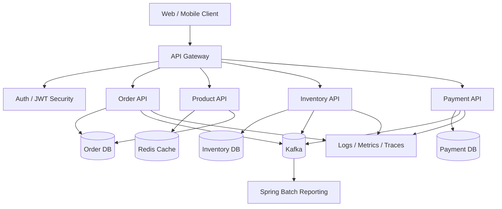

## 2.2 Layered Architecture

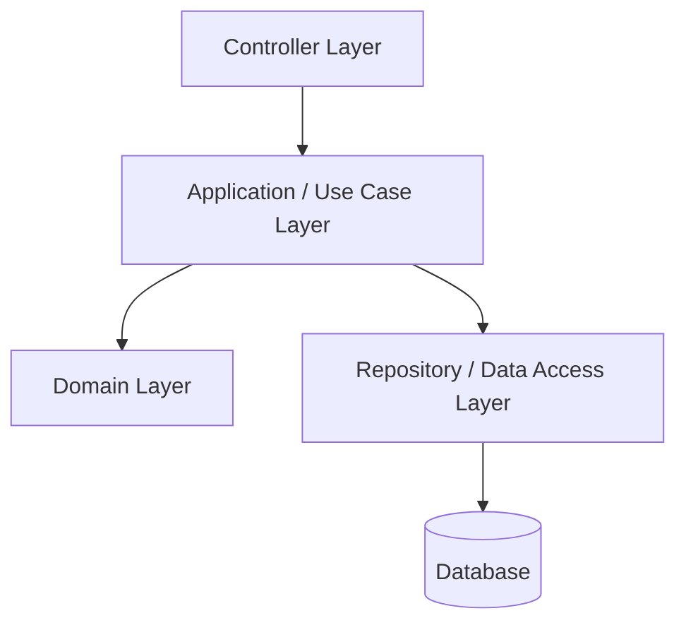

## 2.3 Recommended Package Structure

```text
com.example.orderplatform
├── OrderPlatformApplication.java
├── common
│   ├── exception
│   ├── validation
│   ├── security
│   └── config
├── order
│   ├── api
│   ├── application
│   ├── domain
│   ├── infrastructure
│   └── testdata
├── product
│   ├── api
│   ├── application
│   ├── domain
│   └── infrastructure
├── inventory
│   ├── api
│   ├── application
│   ├── domain
│   └── infrastructure
└── payment
    ├── api
    ├── application
    ├── domain
    └── infrastructure
```

---

# 3. Project Setup

## 3.1 Maven Dependencies

Use Java 21 and Spring Boot 3.x.

```xml
<dependencies>
    <!-- Web MVC -->
    <dependency>
        <groupId>org.springframework.boot</groupId>
        <artifactId>spring-boot-starter-web</artifactId>
    </dependency>

    <!-- Validation -->
    <dependency>
        <groupId>org.springframework.boot</groupId>
        <artifactId>spring-boot-starter-validation</artifactId>
    </dependency>

    <!-- JPA -->
    <dependency>
        <groupId>org.springframework.boot</groupId>
        <artifactId>spring-boot-starter-data-jpa</artifactId>
    </dependency>

    <!-- PostgreSQL -->
    <dependency>
        <groupId>org.postgresql</groupId>
        <artifactId>postgresql</artifactId>
        <scope>runtime</scope>
    </dependency>

    <!-- Redis Cache -->
    <dependency>
        <groupId>org.springframework.boot</groupId>
        <artifactId>spring-boot-starter-data-redis</artifactId>
    </dependency>

    <!-- Security -->
    <dependency>
        <groupId>org.springframework.boot</groupId>
        <artifactId>spring-boot-starter-security</artifactId>
    </dependency>

    <!-- OAuth2 Resource Server for JWT -->
    <dependency>
        <groupId>org.springframework.boot</groupId>
        <artifactId>spring-boot-starter-oauth2-resource-server</artifactId>
    </dependency>

    <!-- WebFlux for reactive APIs -->
    <dependency>
        <groupId>org.springframework.boot</groupId>
        <artifactId>spring-boot-starter-webflux</artifactId>
    </dependency>

    <!-- R2DBC -->
    <dependency>
        <groupId>org.springframework.boot</groupId>
        <artifactId>spring-boot-starter-data-r2dbc</artifactId>
    </dependency>

    <!-- Spring Batch -->
    <dependency>
        <groupId>org.springframework.boot</groupId>
        <artifactId>spring-boot-starter-batch</artifactId>
    </dependency>

    <!-- Kafka -->
    <dependency>
        <groupId>org.springframework.kafka</groupId>
        <artifactId>spring-kafka</artifactId>
    </dependency>

    <!-- Actuator -->
    <dependency>
        <groupId>org.springframework.boot</groupId>
        <artifactId>spring-boot-starter-actuator</artifactId>
    </dependency>

    <!-- Tests -->
    <dependency>
        <groupId>org.springframework.boot</groupId>
        <artifactId>spring-boot-starter-test</artifactId>
        <scope>test</scope>
    </dependency>

    <dependency>
        <groupId>org.springframework.security</groupId>
        <artifactId>spring-security-test</artifactId>
        <scope>test</scope>
    </dependency>

    <dependency>
        <groupId>org.testcontainers</groupId>
        <artifactId>postgresql</artifactId>
        <scope>test</scope>
    </dependency>

    <dependency>
        <groupId>org.springframework.batch</groupId>
        <artifactId>spring-batch-test</artifactId>
        <scope>test</scope>
    </dependency>
</dependencies>
```

## 3.2 Application Configuration

```yaml
spring:
  application:
    name: order-platform

  datasource:
    url: jdbc:postgresql://localhost:5432/order_platform
    username: postgres
    password: postgres

  jpa:
    hibernate:
      ddl-auto: validate
    open-in-view: false
    properties:
      hibernate:
        format_sql: true
        jdbc:
          batch_size: 50

  data:
    redis:
      host: localhost
      port: 6379

  kafka:
    bootstrap-servers: localhost:9092

management:
  endpoints:
    web:
      exposure:
        include: health,info,metrics,prometheus
  tracing:
    sampling:
      probability: 1.0

server:
  port: 8080
```

---

# 4. Domain-Driven Design Structure

## 4.1 Domain Model

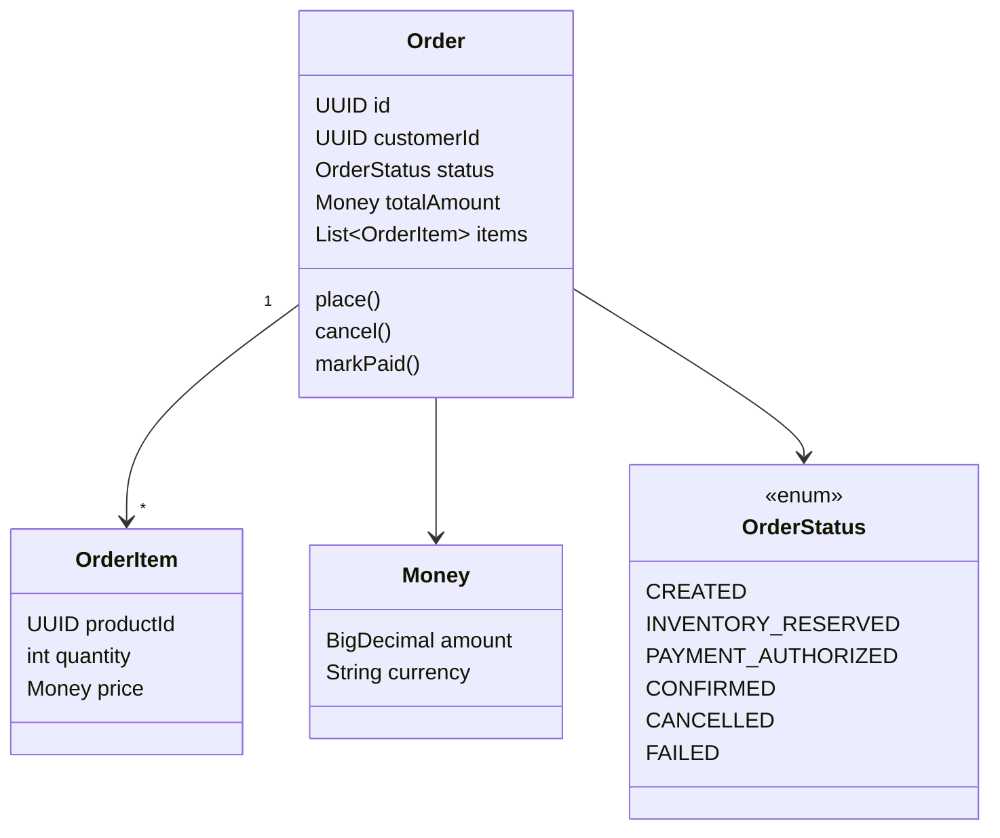

## 4.2 Domain Entity

```java
package com.example.orderplatform.order.domain;

import jakarta.persistence.*;
import java.math.BigDecimal;
import java.util.*;

@Entity
@Table(name = "orders")
public class Order {

    @Id
    private UUID id;

    @Column(nullable = false)
    private UUID customerId;

    @Enumerated(EnumType.STRING)
    @Column(nullable = false)
    private OrderStatus status;

    @Embedded
    private Money totalAmount;

    @ElementCollection
    @CollectionTable(name = "order_items", joinColumns = @JoinColumn(name = "order_id"))
    private List<OrderItem> items = new ArrayList<>();

    protected Order() {
    }

    private Order(UUID id, UUID customerId, List<OrderItem> items) {
        this.id = id;
        this.customerId = customerId;
        this.items = items;
        this.status = OrderStatus.CREATED;
        this.totalAmount = calculateTotal(items);
    }

    public static Order place(UUID customerId, List<OrderItem> items) {
        if (items == null || items.isEmpty()) {
            throw new IllegalArgumentException("Order must contain at least one item");
        }
        return new Order(UUID.randomUUID(), customerId, items);
    }

    public void markInventoryReserved() {
        requireStatus(OrderStatus.CREATED);
        this.status = OrderStatus.INVENTORY_RESERVED;
    }

    public void markPaymentAuthorized() {
        requireStatus(OrderStatus.INVENTORY_RESERVED);
        this.status = OrderStatus.PAYMENT_AUTHORIZED;
    }

    public void confirm() {
        requireStatus(OrderStatus.PAYMENT_AUTHORIZED);
        this.status = OrderStatus.CONFIRMED;
    }

    public void cancel() {
        if (this.status == OrderStatus.CONFIRMED) {
            throw new IllegalStateException("Confirmed order cannot be cancelled directly");
        }
        this.status = OrderStatus.CANCELLED;
    }

    private void requireStatus(OrderStatus expected) {
        if (this.status != expected) {
            throw new IllegalStateException("Expected status " + expected + " but was " + status);
        }
    }

    private Money calculateTotal(List<OrderItem> items) {
        BigDecimal total = items.stream()
            .map(item -> item.price().amount().multiply(BigDecimal.valueOf(item.quantity())))
            .reduce(BigDecimal.ZERO, BigDecimal::add);

        return new Money(total, "USD");
    }

    public UUID getId() {
        return id;
    }

    public UUID getCustomerId() {
        return customerId;
    }

    public OrderStatus getStatus() {
        return status;
    }

    public Money getTotalAmount() {
        return totalAmount;
    }

    public List<OrderItem> getItems() {
        return Collections.unmodifiableList(items);
    }
}
```

## 4.3 Value Objects

```java
package com.example.orderplatform.order.domain;

import jakarta.persistence.Embeddable;
import java.math.BigDecimal;

@Embeddable
public record Money(BigDecimal amount, String currency) {
    public Money {
        if (amount == null || amount.signum() < 0) {
            throw new IllegalArgumentException("Amount must be non-negative");
        }
        if (currency == null || currency.isBlank()) {
            throw new IllegalArgumentException("Currency is required");
        }
    }
}
```

```java
package com.example.orderplatform.order.domain;

import jakarta.persistence.Embeddable;
import java.util.UUID;

@Embeddable
public record OrderItem(UUID productId, int quantity, Money price) {
    public OrderItem {
        if (productId == null) {
            throw new IllegalArgumentException("Product ID is required");
        }
        if (quantity <= 0) {
            throw new IllegalArgumentException("Quantity must be positive");
        }
        if (price == null) {
            throw new IllegalArgumentException("Price is required");
        }
    }
}
```

```java
package com.example.orderplatform.order.domain;

public enum OrderStatus {
    CREATED,
    INVENTORY_RESERVED,
    PAYMENT_AUTHORIZED,
    CONFIRMED,
    CANCELLED,
    FAILED
}
```

---

# 5. REST API Design

## 5.1 API Flow

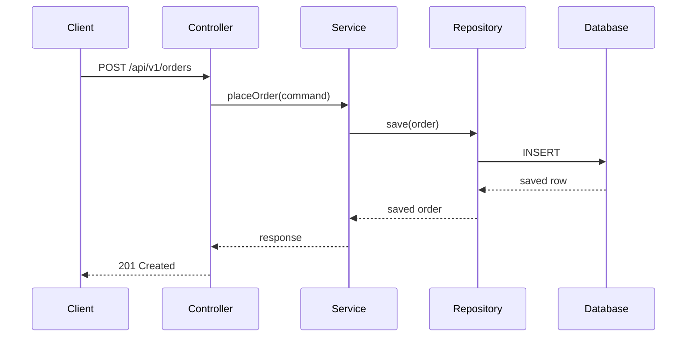

## 5.2 Request DTO

```java
package com.example.orderplatform.order.api.dto;

import jakarta.validation.Valid;
import jakarta.validation.constraints.NotEmpty;
import jakarta.validation.constraints.NotNull;
import java.math.BigDecimal;
import java.util.List;
import java.util.UUID;

public record CreateOrderRequest(
    @NotNull UUID customerId,
    @NotEmpty List<@Valid CreateOrderItemRequest> items
) {
    public record CreateOrderItemRequest(
        @NotNull UUID productId,
        int quantity,
        @NotNull BigDecimal price
    ) {
    }
}
```

## 5.3 Response DTO

```java
package com.example.orderplatform.order.api.dto;

import java.math.BigDecimal;
import java.util.List;
import java.util.UUID;

public record OrderResponse(
    UUID id,
    UUID customerId,
    String status,
    BigDecimal totalAmount,
    String currency,
    List<OrderItemResponse> items
) {
    public record OrderItemResponse(
        UUID productId,
        int quantity,
        BigDecimal price
    ) {
    }
}
```

## 5.4 Controller

```java
package com.example.orderplatform.order.api;

import com.example.orderplatform.order.api.dto.CreateOrderRequest;
import com.example.orderplatform.order.api.dto.OrderResponse;
import com.example.orderplatform.order.application.OrderCommandService;
import jakarta.validation.Valid;
import org.springframework.http.*;
import org.springframework.web.bind.annotation.*;

import java.net.URI;
import java.util.UUID;

@RestController
@RequestMapping("/api/v1/orders")
public class OrderController {

    private final OrderCommandService orderCommandService;

    public OrderController(OrderCommandService orderCommandService) {
        this.orderCommandService = orderCommandService;
    }

    @PostMapping
    public ResponseEntity<OrderResponse> createOrder(@Valid @RequestBody CreateOrderRequest request) {
        OrderResponse response = orderCommandService.placeOrder(request);

        return ResponseEntity
            .created(URI.create("/api/v1/orders/" + response.id()))
            .body(response);
    }

    @GetMapping("/{id}")
    public ResponseEntity<OrderResponse> getOrder(@PathVariable UUID id) {
        return ResponseEntity.ok(orderCommandService.getOrder(id));
    }
}
```

---

# 6. Spring Data JPA Layer

## 6.1 Repository

```java
package com.example.orderplatform.order.infrastructure.persistence;

import com.example.orderplatform.order.domain.Order;
import com.example.orderplatform.order.domain.OrderStatus;
import org.springframework.data.jpa.repository.*;
import org.springframework.data.repository.query.Param;

import java.util.*;

public interface OrderJpaRepository extends JpaRepository<Order, UUID>, JpaSpecificationExecutor<Order> {

    List<Order> findByCustomerId(UUID customerId);

    List<Order> findByStatus(OrderStatus status);

    @Query("""
        select o from Order o
        where o.customerId = :customerId
        and o.status = :status
    """)
    List<Order> findCustomerOrdersByStatus(
        @Param("customerId") UUID customerId,
        @Param("status") OrderStatus status
    );
}
```

## 6.2 Database Migration

Use Flyway or Liquibase in production.

```sql
CREATE TABLE orders (
    id UUID PRIMARY KEY,
    customer_id UUID NOT NULL,
    status VARCHAR(50) NOT NULL,
    amount NUMERIC(19, 2) NOT NULL,
    currency VARCHAR(3) NOT NULL,
    created_at TIMESTAMP NOT NULL DEFAULT CURRENT_TIMESTAMP,
    updated_at TIMESTAMP NOT NULL DEFAULT CURRENT_TIMESTAMP
);

CREATE TABLE order_items (
    order_id UUID NOT NULL REFERENCES orders(id),
    product_id UUID NOT NULL,
    quantity INT NOT NULL,
    amount NUMERIC(19, 2) NOT NULL,
    currency VARCHAR(3) NOT NULL
);

CREATE INDEX idx_orders_customer_id ON orders(customer_id);
CREATE INDEX idx_orders_status ON orders(status);
CREATE INDEX idx_orders_customer_status ON orders(customer_id, status);
```

---

# 7. Data Access Patterns

## 7.1 Repository Pattern

Use repositories for aggregate persistence.

```java
package com.example.orderplatform.order.domain;

import java.util.Optional;
import java.util.UUID;

public interface OrderRepository {
    Order save(Order order);
    Optional<Order> findById(UUID id);
}
```

Adapter:

```java
package com.example.orderplatform.order.infrastructure.persistence;

import com.example.orderplatform.order.domain.Order;
import com.example.orderplatform.order.domain.OrderRepository;
import org.springframework.stereotype.Repository;

import java.util.Optional;
import java.util.UUID;

@Repository
public class OrderRepositoryAdapter implements OrderRepository {

    private final OrderJpaRepository jpaRepository;

    public OrderRepositoryAdapter(OrderJpaRepository jpaRepository) {
        this.jpaRepository = jpaRepository;
    }

    @Override
    public Order save(Order order) {
        return jpaRepository.save(order);
    }

    @Override
    public Optional<Order> findById(UUID id) {
        return jpaRepository.findById(id);
    }
}
```

## 7.2 Specification Pattern

```java
package com.example.orderplatform.order.infrastructure.persistence;

import com.example.orderplatform.order.domain.Order;
import com.example.orderplatform.order.domain.OrderStatus;
import org.springframework.data.jpa.domain.Specification;

import java.util.UUID;

public class OrderSpecifications {

    public static Specification<Order> hasCustomerId(UUID customerId) {
        return (root, query, cb) -> customerId == null
            ? cb.conjunction()
            : cb.equal(root.get("customerId"), customerId);
    }

    public static Specification<Order> hasStatus(OrderStatus status) {
        return (root, query, cb) -> status == null
            ? cb.conjunction()
            : cb.equal(root.get("status"), status);
    }
}
```

## 7.3 DAO Pattern for Read-Optimized Queries

```java
package com.example.orderplatform.order.infrastructure.query;

import org.springframework.jdbc.core.JdbcTemplate;
import org.springframework.stereotype.Repository;

import java.util.List;
import java.util.UUID;

@Repository
public class OrderReadDao {

    private final JdbcTemplate jdbcTemplate;

    public OrderReadDao(JdbcTemplate jdbcTemplate) {
        this.jdbcTemplate = jdbcTemplate;
    }

    public List<OrderSummaryView> findOrderSummaries(UUID customerId) {
        return jdbcTemplate.query("""
            select id, customer_id, status, amount, currency
            from orders
            where customer_id = ?
            order by created_at desc
            """,
            (rs, rowNum) -> new OrderSummaryView(
                UUID.fromString(rs.getString("id")),
                UUID.fromString(rs.getString("customer_id")),
                rs.getString("status"),
                rs.getBigDecimal("amount"),
                rs.getString("currency")
            ),
            customerId
        );
    }
}
```

```java
package com.example.orderplatform.order.infrastructure.query;

import java.math.BigDecimal;
import java.util.UUID;

public record OrderSummaryView(
    UUID id,
    UUID customerId,
    String status,
    BigDecimal amount,
    String currency
) {
}
```

---

# 8. Service Layer and Business Rules

## 8.1 Command Service

```java
package com.example.orderplatform.order.application;

import com.example.orderplatform.order.api.dto.CreateOrderRequest;
import com.example.orderplatform.order.api.dto.OrderResponse;
import com.example.orderplatform.order.domain.*;
import org.springframework.stereotype.Service;
import org.springframework.transaction.annotation.Transactional;

import java.util.UUID;

@Service
public class OrderCommandService {

    private final OrderRepository orderRepository;
    private final OrderMapper orderMapper;

    public OrderCommandService(OrderRepository orderRepository, OrderMapper orderMapper) {
        this.orderRepository = orderRepository;
        this.orderMapper = orderMapper;
    }

    @Transactional
    public OrderResponse placeOrder(CreateOrderRequest request) {
        Order order = Order.place(
            request.customerId(),
            request.items().stream()
                .map(item -> new OrderItem(
                    item.productId(),
                    item.quantity(),
                    new Money(item.price(), "USD")
                ))
                .toList()
        );

        Order savedOrder = orderRepository.save(order);
        return orderMapper.toResponse(savedOrder);
    }

    @Transactional(readOnly = true)
    public OrderResponse getOrder(UUID id) {
        Order order = orderRepository.findById(id)
            .orElseThrow(() -> new OrderNotFoundException(id));

        return orderMapper.toResponse(order);
    }
}
```

## 8.2 Domain Exception

```java
package com.example.orderplatform.order.application;

import java.util.UUID;

public class OrderNotFoundException extends RuntimeException {
    public OrderNotFoundException(UUID id) {
        super("Order not found: " + id);
    }
}
```

---

# 9. DTOs, Mapping, and Validation

## 9.1 Mapper

```java
package com.example.orderplatform.order.application;

import com.example.orderplatform.order.api.dto.OrderResponse;
import com.example.orderplatform.order.domain.Order;
import org.springframework.stereotype.Component;

@Component
public class OrderMapper {

    public OrderResponse toResponse(Order order) {
        return new OrderResponse(
            order.getId(),
            order.getCustomerId(),
            order.getStatus().name(),
            order.getTotalAmount().amount(),
            order.getTotalAmount().currency(),
            order.getItems().stream()
                .map(item -> new OrderResponse.OrderItemResponse(
                    item.productId(),
                    item.quantity(),
                    item.price().amount()
                ))
                .toList()
        );
    }
}
```

## 9.2 Validation Best Practices

Use:

- `@NotNull` for required fields
- `@NotBlank` for strings
- `@Positive` for quantities
- Custom validators for business-specific rules
- Domain validation for invariant protection

---

# 10. Exception Handling

## 10.1 Error Response

```java
package com.example.orderplatform.common.exception;

import java.time.Instant;
import java.util.List;

public record ApiErrorResponse(
    Instant timestamp,
    int status,
    String error,
    String message,
    String path,
    List<FieldErrorResponse> fieldErrors
) {
}
```

```java
package com.example.orderplatform.common.exception;

public record FieldErrorResponse(
    String field,
    String message
) {
}
```

## 10.2 Global Exception Handler

```java
package com.example.orderplatform.common.exception;

import com.example.orderplatform.order.application.OrderNotFoundException;
import jakarta.servlet.http.HttpServletRequest;
import org.springframework.http.*;
import org.springframework.web.bind.MethodArgumentNotValidException;
import org.springframework.web.bind.annotation.*;

import java.time.Instant;

@RestControllerAdvice
public class GlobalExceptionHandler {

    @ExceptionHandler(OrderNotFoundException.class)
    public ResponseEntity<ApiErrorResponse> handleNotFound(
        OrderNotFoundException ex,
        HttpServletRequest request
    ) {
        return ResponseEntity.status(HttpStatus.NOT_FOUND).body(
            new ApiErrorResponse(
                Instant.now(),
                404,
                "Not Found",
                ex.getMessage(),
                request.getRequestURI(),
                List.of()
            )
        );
    }

    @ExceptionHandler(MethodArgumentNotValidException.class)
    public ResponseEntity<ApiErrorResponse> handleValidation(
        MethodArgumentNotValidException ex,
        HttpServletRequest request
    ) {
        var fieldErrors = ex.getBindingResult().getFieldErrors().stream()
            .map(error -> new FieldErrorResponse(error.getField(), error.getDefaultMessage()))
            .toList();

        return ResponseEntity.badRequest().body(
            new ApiErrorResponse(
                Instant.now(),
                400,
                "Validation Error",
                "Invalid request body",
                request.getRequestURI(),
                fieldErrors
            )
        );
    }
}
```

---

# 11. Transactions and Consistency

## 11.1 Transaction Rules

Use transactions at the use-case/service boundary.

```java
@Transactional
public OrderResponse placeOrder(CreateOrderRequest request) {
    // write use case
}
```

```java
@Transactional(readOnly = true)
public OrderResponse getOrder(UUID id) {
    // read use case
}
```

## 11.2 Transaction Flow

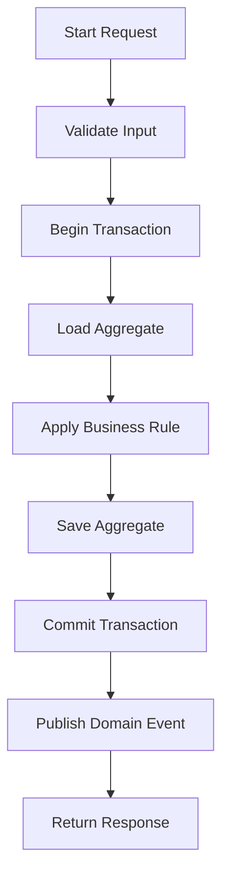

## 11.3 Outbox Pattern

For production event publishing, avoid publishing directly inside business logic. Use the outbox pattern.

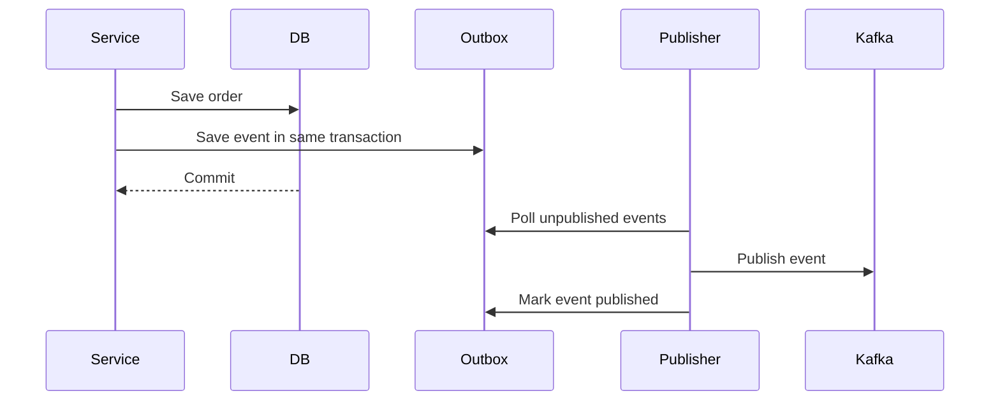

Outbox entity:

```java
@Entity
@Table(name = "outbox_events")
public class OutboxEvent {

    @Id
    private UUID id;

    private String aggregateType;
    private UUID aggregateId;
    private String eventType;

    @Column(columnDefinition = "jsonb")
    private String payload;

    private boolean published;
    private Instant createdAt;

    protected OutboxEvent() {
    }

    public OutboxEvent(String aggregateType, UUID aggregateId, String eventType, String payload) {
        this.id = UUID.randomUUID();
        this.aggregateType = aggregateType;
        this.aggregateId = aggregateId;
        this.eventType = eventType;
        this.payload = payload;
        this.published = false;
        this.createdAt = Instant.now();
    }
}
```

---

# 12. Caching Strategy

## 12.1 Cache Flow

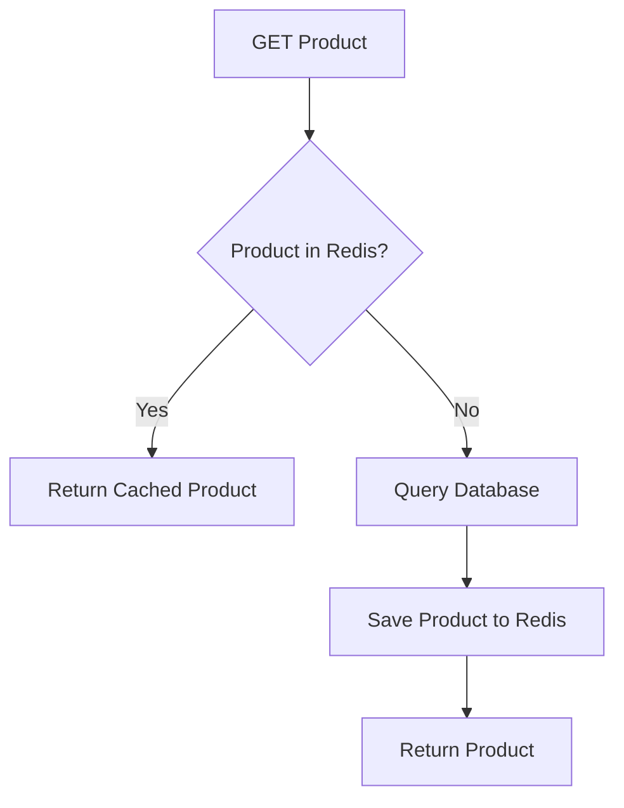

## 12.2 Enable Cache

```java
@EnableCaching
@SpringBootApplication
public class OrderPlatformApplication {
    public static void main(String[] args) {
        SpringApplication.run(OrderPlatformApplication.class, args);
    }
}
```

## 12.3 Cached Service

```java
@Service
public class ProductQueryService {

    private final ProductRepository productRepository;

    public ProductQueryService(ProductRepository productRepository) {
        this.productRepository = productRepository;
    }

    @Cacheable(value = "products", key = "#productId")
    public ProductResponse getProduct(UUID productId) {
        Product product = productRepository.findById(productId)
            .orElseThrow(() -> new ProductNotFoundException(productId));

        return ProductResponse.from(product);
    }

    @CacheEvict(value = "products", key = "#productId")
    public void evictProduct(UUID productId) {
    }
}
```

---

# 13. Security with JWT

## 13.1 Security Flow

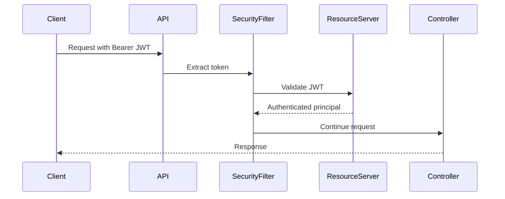

## 13.2 Security Configuration

```java
@Configuration
@EnableMethodSecurity
public class SecurityConfig {

    @Bean
    SecurityFilterChain securityFilterChain(HttpSecurity http) throws Exception {
        return http
            .csrf(csrf -> csrf.disable())
            .authorizeHttpRequests(auth -> auth
                .requestMatchers("/actuator/health").permitAll()
                .requestMatchers("/api/v1/orders/**").hasAuthority("SCOPE_orders.write")
                .anyRequest().authenticated()
            )
            .oauth2ResourceServer(oauth2 -> oauth2.jwt(Customizer.withDefaults()))
            .build();
    }
}
```

## 13.3 Method-Level Security

```java
@PreAuthorize("hasAuthority('SCOPE_orders.write')")
@Transactional
public OrderResponse placeOrder(CreateOrderRequest request) {
    // secured command
}
```

---

# 14. CQRS Pattern

## 14.1 CQRS Concept

CQRS separates:

- Commands: write operations that change state
- Queries: read operations optimized for retrieval

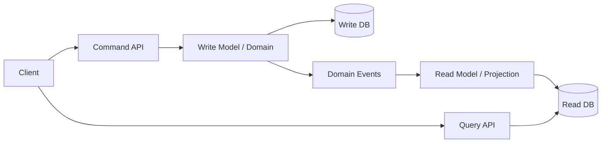

## 14.2 Command Object

```java
public record PlaceOrderCommand(
    UUID customerId,
    List<PlaceOrderItemCommand> items
) {
}
```

```java
public record PlaceOrderItemCommand(
    UUID productId,
    int quantity,
    BigDecimal price
) {
}
```

## 14.3 Command Handler

```java
@Service
public class PlaceOrderCommandHandler {

    private final OrderRepository orderRepository;
    private final OutboxService outboxService;

    public PlaceOrderCommandHandler(
        OrderRepository orderRepository,
        OutboxService outboxService
    ) {
        this.orderRepository = orderRepository;
        this.outboxService = outboxService;
    }

    @Transactional
    public UUID handle(PlaceOrderCommand command) {
        Order order = Order.place(
            command.customerId(),
            command.items().stream()
                .map(item -> new OrderItem(
                    item.productId(),
                    item.quantity(),
                    new Money(item.price(), "USD")
                ))
                .toList()
        );

        orderRepository.save(order);
        outboxService.saveOrderCreatedEvent(order);

        return order.getId();
    }
}
```

## 14.4 Query Handler

```java
@Service
public class OrderQueryService {

    private final OrderReadDao orderReadDao;

    public OrderQueryService(OrderReadDao orderReadDao) {
        this.orderReadDao = orderReadDao;
    }

    public List<OrderSummaryView> getCustomerOrders(UUID customerId) {
        return orderReadDao.findOrderSummaries(customerId);
    }
}
```

---

# 15. Saga Pattern

## 15.1 Saga Flow

Use Saga when one business transaction spans multiple services.

Example order flow:

1. Create order
2. Reserve inventory
3. Authorize payment
4. Confirm order
5. If any step fails, compensate previous steps

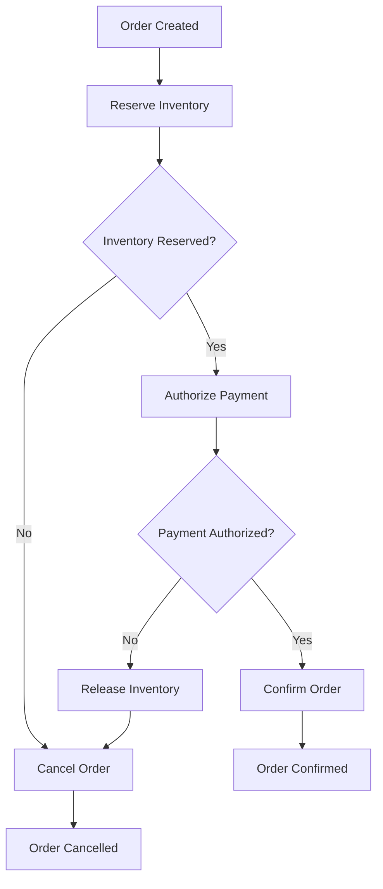

## 15.2 Orchestration Saga

```java
@Service
public class OrderSagaOrchestrator {

    private final InventoryClient inventoryClient;
    private final PaymentClient paymentClient;
    private final OrderRepository orderRepository;

    public OrderSagaOrchestrator(
        InventoryClient inventoryClient,
        PaymentClient paymentClient,
        OrderRepository orderRepository
    ) {
        this.inventoryClient = inventoryClient;
        this.paymentClient = paymentClient;
        this.orderRepository = orderRepository;
    }

    @Transactional
    public void processOrder(UUID orderId) {
        Order order = orderRepository.findById(orderId)
            .orElseThrow(() -> new OrderNotFoundException(orderId));

        try {
            inventoryClient.reserve(order);
            order.markInventoryReserved();

            paymentClient.authorize(order);
            order.markPaymentAuthorized();

            order.confirm();
            orderRepository.save(order);
        } catch (Exception ex) {
            compensate(order);
            throw ex;
        }
    }

    private void compensate(Order order) {
        try {
            inventoryClient.release(order);
        } catch (Exception ignored) {
            // Log and retry through dead-letter queue in production
        }

        order.cancel();
        orderRepository.save(order);
    }
}
```

## 15.3 Choreography Saga

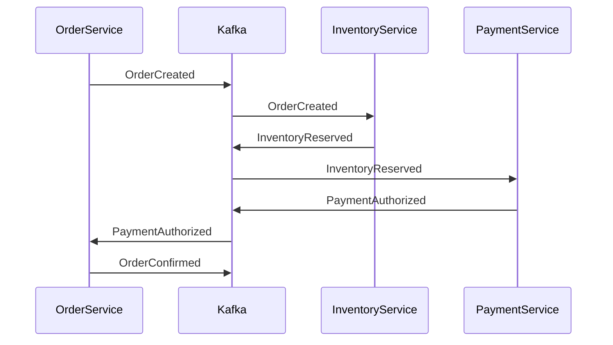

Event listener:

```java
@Component
public class InventoryEventListener {

    private final InventoryService inventoryService;
    private final KafkaTemplate<String, Object> kafkaTemplate;

    public InventoryEventListener(
        InventoryService inventoryService,
        KafkaTemplate<String, Object> kafkaTemplate
    ) {
        this.inventoryService = inventoryService;
        this.kafkaTemplate = kafkaTemplate;
    }

    @KafkaListener(topics = "order-created", groupId = "inventory-service")
    public void onOrderCreated(OrderCreatedEvent event) {
        try {
            inventoryService.reserve(event.orderId(), event.items());
            kafkaTemplate.send("inventory-reserved", new InventoryReservedEvent(event.orderId()));
        } catch (Exception ex) {
            kafkaTemplate.send("inventory-reservation-failed", new InventoryReservationFailedEvent(event.orderId()));
        }
    }
}
```

---

# 16. Event-Driven Architecture

## 16.1 Event Contract

```java
public record OrderCreatedEvent(
    UUID eventId,
    UUID orderId,
    UUID customerId,
    Instant occurredAt,
    List<OrderCreatedItemEvent> items
) {
}
```

```java
public record OrderCreatedItemEvent(
    UUID productId,
    int quantity,
    BigDecimal price
) {
}
```

## 16.2 Kafka Producer

```java
@Service
public class OrderEventPublisher {

    private final KafkaTemplate<String, OrderCreatedEvent> kafkaTemplate;

    public OrderEventPublisher(KafkaTemplate<String, OrderCreatedEvent> kafkaTemplate) {
        this.kafkaTemplate = kafkaTemplate;
    }

    public void publish(OrderCreatedEvent event) {
        kafkaTemplate.send("order-created", event.orderId().toString(), event);
    }
}
```

## 16.3 Kafka Consumer

```java
@Component
public class OrderEventConsumer {

    @KafkaListener(topics = "order-created", groupId = "reporting-service")
    public void consume(OrderCreatedEvent event) {
        // update reporting projection
    }
}
```

---

# 17. Reactive APIs with WebFlux

## 17.1 When to Use Reactive

Use WebFlux when you need high concurrency with non-blocking I/O, such as:

- Streaming APIs
- High-volume read APIs
- External API aggregation
- Reactive database drivers
- Reactive messaging pipelines

Do not mix blocking JPA calls inside reactive pipelines unless moved to a bounded elastic scheduler.

## 17.2 Reactive Flow

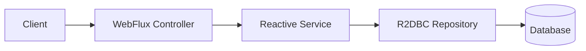

## 17.3 Reactive Entity

```java
@Table("product_search_view")
public class ProductSearchDocument {

    @Id
    private UUID id;
    private String name;
    private String description;
    private BigDecimal price;

    // getters and setters
}
```

## 17.4 R2DBC Repository

```java
public interface ProductSearchRepository extends ReactiveCrudRepository<ProductSearchDocument, UUID> {
    Flux<ProductSearchDocument> findByNameContainingIgnoreCase(String name);
}
```

## 17.5 WebFlux Controller

```java
@RestController
@RequestMapping("/api/v1/reactive/products")
public class ProductReactiveController {

    private final ProductSearchRepository repository;

    public ProductReactiveController(ProductSearchRepository repository) {
        this.repository = repository;
    }

    @GetMapping("/search")
    public Flux<ProductSearchDocument> search(@RequestParam String q) {
        return repository.findByNameContainingIgnoreCase(q);
    }

    @GetMapping("/{id}")
    public Mono<ResponseEntity<ProductSearchDocument>> getById(@PathVariable UUID id) {
        return repository.findById(id)
            .map(ResponseEntity::ok)
            .defaultIfEmpty(ResponseEntity.notFound().build());
    }
}
```

---

# 18. Spring Batch Processing

## 18.1 Batch Use Case

Generate a daily order revenue report.

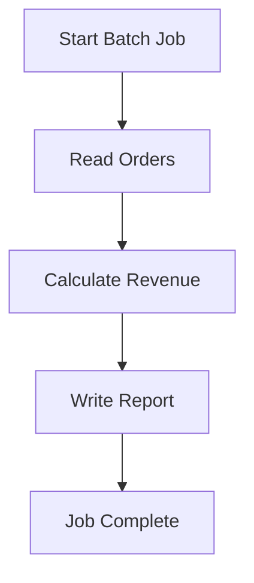

## 18.2 Batch Configuration

```java
@Configuration
@EnableBatchProcessing
public class RevenueReportJobConfig {

    @Bean
    public Job revenueReportJob(
        JobRepository jobRepository,
        Step revenueReportStep
    ) {
        return new JobBuilder("revenueReportJob", jobRepository)
            .start(revenueReportStep)
            .build();
    }

    @Bean
    public Step revenueReportStep(
        JobRepository jobRepository,
        PlatformTransactionManager transactionManager,
        ItemReader<OrderSummaryView> reader,
        ItemProcessor<OrderSummaryView, RevenueReportRow> processor,
        ItemWriter<RevenueReportRow> writer
    ) {
        return new StepBuilder("revenueReportStep", jobRepository)
            .<OrderSummaryView, RevenueReportRow>chunk(100, transactionManager)
            .reader(reader)
            .processor(processor)
            .writer(writer)
            .build();
    }
}
```

## 18.3 Processor

```java
@Component
public class RevenueReportProcessor implements ItemProcessor<OrderSummaryView, RevenueReportRow> {

    @Override
    public RevenueReportRow process(OrderSummaryView item) {
        return new RevenueReportRow(
            item.id(),
            item.customerId(),
            item.amount(),
            item.currency()
        );
    }
}
```

---

# 19. Resilience Patterns

## 19.1 Circuit Breaker

```java
@Service
public class PaymentClient {

    private final WebClient webClient;

    public PaymentClient(WebClient.Builder builder) {
        this.webClient = builder.baseUrl("http://payment-service").build();
    }

    @CircuitBreaker(name = "paymentService", fallbackMethod = "fallbackAuthorize")
    @Retry(name = "paymentService")
    public PaymentResponse authorize(Order order) {
        return webClient.post()
            .uri("/api/v1/payments/authorize")
            .bodyValue(order)
            .retrieve()
            .bodyToMono(PaymentResponse.class)
            .block();
    }

    public PaymentResponse fallbackAuthorize(Order order, Throwable throwable) {
        return PaymentResponse.failed("Payment service unavailable");
    }
}
```

## 19.2 Bulkhead Pattern

Use bulkheads to isolate failure.

```yaml
resilience4j:
  bulkhead:
    instances:
      paymentService:
        maxConcurrentCalls: 20
        maxWaitDuration: 100ms
```

---

# 20. Observability

## 20.1 Observability Flow

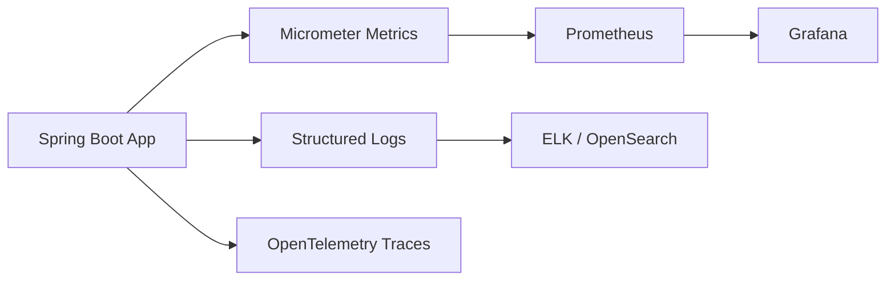

## 20.2 Actuator Configuration

```yaml
management:
  endpoints:
    web:
      exposure:
        include: health,info,metrics,prometheus,loggers
  endpoint:
    health:
      show-details: always
```

## 20.3 Custom Metrics

```java
@Service
public class OrderMetrics {

    private final Counter orderCreatedCounter;

    public OrderMetrics(MeterRegistry registry) {
        this.orderCreatedCounter = Counter.builder("orders.created")
            .description("Number of orders created")
            .register(registry);
    }

    public void incrementOrdersCreated() {
        orderCreatedCounter.increment();
    }
}
```

---

# 21. Testing and TDD

## 21.1 TDD Cycle

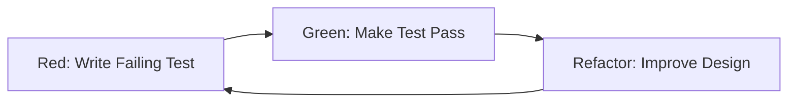

## 21.2 TDD Rules

1. Write a failing test first.
2. Write the minimum production code required.
3. Refactor without changing behavior.
4. Keep tests fast.
5. Use test names that describe business behavior.

Example test name:

```java
shouldCreateOrderWhenRequestIsValid()
```

---

# 22. Layer-by-Layer Testing

## 22.1 Domain Unit Test

```java
class OrderTest {

    @Test
    void shouldCreateOrderWithCreatedStatus() {
        Order order = Order.place(
            UUID.randomUUID(),
            List.of(new OrderItem(
                UUID.randomUUID(),
                2,
                new Money(BigDecimal.TEN, "USD")
            ))
        );

        assertThat(order.getStatus()).isEqualTo(OrderStatus.CREATED);
        assertThat(order.getTotalAmount().amount()).isEqualByComparingTo("20");
    }

    @Test
    void shouldRejectOrderWithoutItems() {
        assertThatThrownBy(() -> Order.place(UUID.randomUUID(), List.of()))
            .isInstanceOf(IllegalArgumentException.class)
            .hasMessageContaining("at least one item");
    }
}
```

## 22.2 Mapper Test

```java
class OrderMapperTest {

    private final OrderMapper mapper = new OrderMapper();

    @Test
    void shouldMapOrderToResponse() {
        Order order = Order.place(
            UUID.randomUUID(),
            List.of(new OrderItem(
                UUID.randomUUID(),
                1,
                new Money(BigDecimal.valueOf(50), "USD")
            ))
        );

        OrderResponse response = mapper.toResponse(order);

        assertThat(response.id()).isEqualTo(order.getId());
        assertThat(response.status()).isEqualTo("CREATED");
    }
}
```

## 22.3 Repository Test with DataJpaTest

```java
@DataJpaTest
class OrderJpaRepositoryTest {

    @Autowired
    private OrderJpaRepository repository;

    @Test
    void shouldSaveAndFindOrder() {
        Order order = Order.place(
            UUID.randomUUID(),
            List.of(new OrderItem(
                UUID.randomUUID(),
                1,
                new Money(BigDecimal.TEN, "USD")
            ))
        );

        repository.save(order);

        Optional<Order> found = repository.findById(order.getId());

        assertThat(found).isPresent();
        assertThat(found.get().getStatus()).isEqualTo(OrderStatus.CREATED);
    }
}
```

## 22.4 Service Test with Mockito

```java
@ExtendWith(MockitoExtension.class)
class OrderCommandServiceTest {

    @Mock
    private OrderRepository orderRepository;

    @Mock
    private OrderMapper orderMapper;

    @InjectMocks
    private OrderCommandService service;

    @Test
    void shouldPlaceOrder() {
        CreateOrderRequest request = new CreateOrderRequest(
            UUID.randomUUID(),
            List.of(new CreateOrderRequest.CreateOrderItemRequest(
                UUID.randomUUID(),
                1,
                BigDecimal.TEN
            ))
        );

        when(orderRepository.save(any(Order.class)))
            .thenAnswer(invocation -> invocation.getArgument(0));

        when(orderMapper.toResponse(any(Order.class)))
            .thenReturn(new OrderResponse(
                UUID.randomUUID(),
                request.customerId(),
                "CREATED",
                BigDecimal.TEN,
                "USD",
                List.of()
            ));

        OrderResponse response = service.placeOrder(request);

        assertThat(response.status()).isEqualTo("CREATED");
        verify(orderRepository).save(any(Order.class));
    }
}
```

## 22.5 Controller Test with MockMvc

```java
@WebMvcTest(OrderController.class)
class OrderControllerTest {

    @Autowired
    private MockMvc mockMvc;

    @MockBean
    private OrderCommandService orderCommandService;

    @Test
    void shouldCreateOrder() throws Exception {
        UUID orderId = UUID.randomUUID();

        when(orderCommandService.placeOrder(any()))
            .thenReturn(new OrderResponse(
                orderId,
                UUID.randomUUID(),
                "CREATED",
                BigDecimal.TEN,
                "USD",
                List.of()
            ));

        mockMvc.perform(post("/api/v1/orders")
                .contentType(MediaType.APPLICATION_JSON)
                .content("""
                    {
                      "customerId": "11111111-1111-1111-1111-111111111111",
                      "items": [
                        {
                          "productId": "22222222-2222-2222-2222-222222222222",
                          "quantity": 1,
                          "price": 10.00
                        }
                      ]
                    }
                    """))
            .andExpect(status().isCreated())
            .andExpect(jsonPath("$.status").value("CREATED"));
    }
}
```

## 22.6 Integration Test with Testcontainers

```java
@SpringBootTest
@Testcontainers
class OrderIntegrationTest {

    @Container
    static PostgreSQLContainer<?> postgres = new PostgreSQLContainer<>("postgres:16")
        .withDatabaseName("order_platform")
        .withUsername("postgres")
        .withPassword("postgres");

    @DynamicPropertySource
    static void configure(DynamicPropertyRegistry registry) {
        registry.add("spring.datasource.url", postgres::getJdbcUrl);
        registry.add("spring.datasource.username", postgres::getUsername);
        registry.add("spring.datasource.password", postgres::getPassword);
    }

    @Autowired
    private TestRestTemplate restTemplate;

    @Test
    void shouldCreateOrderEndToEnd() {
        CreateOrderRequest request = new CreateOrderRequest(
            UUID.randomUUID(),
            List.of(new CreateOrderRequest.CreateOrderItemRequest(
                UUID.randomUUID(),
                1,
                BigDecimal.TEN
            ))
        );

        ResponseEntity<OrderResponse> response = restTemplate.postForEntity(
            "/api/v1/orders",
            request,
            OrderResponse.class
        );

        assertThat(response.getStatusCode()).isEqualTo(HttpStatus.CREATED);
        assertThat(response.getBody().status()).isEqualTo("CREATED");
    }
}
```

## 22.7 Reactive Test with StepVerifier

```java
@WebFluxTest(ProductReactiveController.class)
class ProductReactiveControllerTest {

    @Autowired
    private WebTestClient webTestClient;

    @MockBean
    private ProductSearchRepository repository;

    @Test
    void shouldSearchProducts() {
        when(repository.findByNameContainingIgnoreCase("phone"))
            .thenReturn(Flux.just(new ProductSearchDocument()));

        webTestClient.get()
            .uri("/api/v1/reactive/products/search?q=phone")
            .exchange()
            .expectStatus().isOk();
    }
}
```

## 22.8 Batch Test

```java
@SpringBatchTest
@SpringBootTest
class RevenueReportJobTest {

    @Autowired
    private JobLauncherTestUtils jobLauncherTestUtils;

    @Test
    void shouldRunRevenueReportJob() throws Exception {
        JobExecution execution = jobLauncherTestUtils.launchJob();

        assertThat(execution.getStatus()).isEqualTo(BatchStatus.COMPLETED);
    }
}
```

## 22.9 Security Test

```java
@WebMvcTest(OrderController.class)
class OrderSecurityTest {

    @Autowired
    private MockMvc mockMvc;

    @MockBean
    private OrderCommandService orderCommandService;

    @Test
    void shouldRejectUnauthenticatedRequest() throws Exception {
        mockMvc.perform(get("/api/v1/orders/{id}", UUID.randomUUID()))
            .andExpect(status().isUnauthorized());
    }

    @Test
    @WithMockUser(authorities = "SCOPE_orders.write")
    void shouldAllowAuthorizedRequest() throws Exception {
        when(orderCommandService.getOrder(any()))
            .thenReturn(new OrderResponse(
                UUID.randomUUID(),
                UUID.randomUUID(),
                "CREATED",
                BigDecimal.TEN,
                "USD",
                List.of()
            ));

        mockMvc.perform(get("/api/v1/orders/{id}", UUID.randomUUID()))
            .andExpect(status().isOk());
    }
}
```

---

# 23. Load and Performance Testing

## 23.1 Performance Targets

Recommended capstone targets:

| Area | Target |
|---|---:|
| P95 latency for order creation | < 300 ms |
| P95 latency for product search | < 150 ms |
| Error rate | < 1% |
| CPU utilization | < 70% |
| DB connection pool saturation | Avoid sustained saturation |
| Cache hit ratio | > 80% for hot product reads |

## 23.2 k6 Test Script

```javascript
import http from 'k6/http';
import { check, sleep } from 'k6';

export const options = {
  vus: 50,
  duration: '1m',
  thresholds: {
    http_req_duration: ['p(95)<300'],
    http_req_failed: ['rate<0.01']
  }
};

export default function () {
  const payload = JSON.stringify({
    customerId: '11111111-1111-1111-1111-111111111111',
    items: [
      {
        productId: '22222222-2222-2222-2222-222222222222',
        quantity: 1,
        price: 10.00
      }
    ]
  });

  const params = {
    headers: {
      'Content-Type': 'application/json',
      'Authorization': 'Bearer TOKEN'
    }
  };

  const res = http.post('http://localhost:8080/api/v1/orders', payload, params);

  check(res, {
    'status is 201': r => r.status === 201
  });

  sleep(1);
}
```

---

# 24. Deployment with Docker

## 24.1 Dockerfile

```dockerfile
FROM eclipse-temurin:21-jdk AS build
WORKDIR /app
COPY . .
RUN ./mvnw clean package -DskipTests

FROM eclipse-temurin:21-jre
WORKDIR /app
COPY --from=build /app/target/order-platform.jar app.jar
EXPOSE 8080
ENTRYPOINT ["java", "-jar", "app.jar"]
```

## 24.2 Docker Compose

```yaml
version: "3.9"

services:
  app:
    build: .
    ports:
      - "8080:8080"
    environment:
      SPRING_DATASOURCE_URL: jdbc:postgresql://postgres:5432/order_platform
      SPRING_DATASOURCE_USERNAME: postgres
      SPRING_DATASOURCE_PASSWORD: postgres
      SPRING_DATA_REDIS_HOST: redis
      SPRING_KAFKA_BOOTSTRAP_SERVERS: kafka:9092
    depends_on:
      - postgres
      - redis
      - kafka

  postgres:
    image: postgres:16
    environment:
      POSTGRES_DB: order_platform
      POSTGRES_USER: postgres
      POSTGRES_PASSWORD: postgres
    ports:
      - "5432:5432"

  redis:
    image: redis:7
    ports:
      - "6379:6379"

  kafka:
    image: bitnami/kafka:latest
    ports:
      - "9092:9092"
```

---

# 25. Kubernetes Production Deployment

## 25.1 Deployment

```yaml
apiVersion: apps/v1
kind: Deployment
metadata:
  name: order-platform
spec:
  replicas: 3
  selector:
    matchLabels:
      app: order-platform
  template:
    metadata:
      labels:
        app: order-platform
    spec:
      containers:
        - name: order-platform
          image: your-registry/order-platform:1.0.0
          ports:
            - containerPort: 8080
          env:
            - name: SPRING_PROFILES_ACTIVE
              value: prod
          readinessProbe:
            httpGet:
              path: /actuator/health/readiness
              port: 8080
            initialDelaySeconds: 20
            periodSeconds: 10
          livenessProbe:
            httpGet:
              path: /actuator/health/liveness
              port: 8080
            initialDelaySeconds: 30
            periodSeconds: 20
          resources:
            requests:
              memory: "512Mi"
              cpu: "500m"
            limits:
              memory: "1Gi"
              cpu: "1000m"
```

## 25.2 Service

```yaml
apiVersion: v1
kind: Service
metadata:
  name: order-platform-service
spec:
  selector:
    app: order-platform
  ports:
    - protocol: TCP
      port: 80
      targetPort: 8080
```

---

# 26. Production Checklist

## 26.1 API Quality

- Use consistent URL naming.
- Use versioning: `/api/v1`.
- Validate request bodies.
- Return meaningful error responses.
- Add pagination for list endpoints.
- Add idempotency keys for payment/order creation.
- Avoid exposing internal entity models.

## 26.2 Database Quality

- Use migrations.
- Add indexes for frequent queries.
- Avoid N+1 queries.
- Use pagination.
- Configure connection pool.
- Use read replicas for heavy read workloads.
- Monitor slow queries.

## 26.3 Security Quality

- Enforce HTTPS.
- Validate JWTs.
- Use least-privilege authorization.
- Do not log secrets.
- Store secrets in a secret manager.
- Add rate limiting.
- Validate file uploads, if any.

## 26.4 Observability Quality

- Enable health checks.
- Export Prometheus metrics.
- Use correlation IDs.
- Use structured JSON logs.
- Add distributed tracing.
- Alert on error rate, latency, CPU, memory, and DB saturation.

## 26.5 Testing Quality

- Domain unit tests
- Mapper tests
- Repository tests
- Service tests
- Controller tests
- Security tests
- Integration tests
- Contract tests
- Reactive tests
- Batch tests
- Load tests

---

# 27. Capstone Milestones

## Milestone 1: Foundation

Deliverables:

- Spring Boot project
- PostgreSQL setup
- Docker Compose
- Health check endpoint
- Basic package structure

## Milestone 2: Core Domain

Deliverables:

- Order aggregate
- Product entity
- Inventory entity
- Domain validation
- Unit tests

## Milestone 3: REST API

Deliverables:

- Create order API
- Get order API
- List customer orders API
- DTOs and mappers
- Global exception handling

## Milestone 4: Persistence

Deliverables:

- JPA repositories
- Flyway migrations
- Indexes
- Repository tests
- Query optimization

## Milestone 5: Security

Deliverables:

- JWT resource server
- Method-level security
- Security tests

## Milestone 6: CQRS

Deliverables:

- Command handlers
- Query handlers
- Read DAO
- Read-optimized projection

## Milestone 7: Events and Saga

Deliverables:

- Kafka integration
- Outbox table
- Order-created event
- Inventory reservation flow
- Payment authorization flow
- Saga compensation flow

## Milestone 8: Reactive API

Deliverables:

- Reactive product search
- R2DBC repository
- WebFlux tests

## Milestone 9: Batch Processing

Deliverables:

- Revenue report job
- Reader, processor, writer
- Batch test

## Milestone 10: Production Readiness

Deliverables:

- Dockerfile
- Kubernetes manifests
- Actuator metrics
- Load test report
- Final README
- Architecture diagrams
- Test coverage report

---

# Appendix A: Recommended Design Patterns

## Creational Patterns

| Pattern | Use Case |
|---|---|
| Factory | Create domain objects with rules |
| Builder | Construct complex DTOs or test data |
| Singleton | Spring beans are singleton by default |

## Structural Patterns

| Pattern | Use Case |
|---|---|
| Adapter | Connect domain interfaces to external systems |
| Facade | Simplify complex subsystem interaction |
| Proxy | Security, caching, transactions |

## Behavioral Patterns

| Pattern | Use Case |
|---|---|
| Strategy | Payment method selection |
| Template Method | Batch processing steps |
| Observer | Domain events |
| Chain of Responsibility | Validation pipeline |

---

# Appendix B: Access Patterns

## Read Access Patterns

- Read by primary key
- Read by customer ID
- Read by status
- Search by text
- Paginated list
- Cached hot reads
- CQRS read model
- Aggregated reporting views

## Write Access Patterns

- Create aggregate
- Update aggregate through business methods
- Optimistic locking
- Idempotent command handling
- Outbox event write
- Saga state write

## Example Idempotency Table

```sql
CREATE TABLE idempotency_keys (
    id UUID PRIMARY KEY,
    idempotency_key VARCHAR(255) UNIQUE NOT NULL,
    request_hash VARCHAR(255) NOT NULL,
    response_body TEXT,
    created_at TIMESTAMP NOT NULL DEFAULT CURRENT_TIMESTAMP
);
```

---

# Appendix C: Final Capstone Evaluation Rubric

| Area | Excellent |
|---|---|
| Architecture | Clear layered or hexagonal architecture |
| Domain | Rich domain model with business rules |
| Persistence | JPA with migrations and indexes |
| API | Clean REST design and validation |
| Security | JWT and role/scope-based access |
| Testing | Tests at all major layers |
| CQRS | Separate command and query paths |
| Saga | Compensation logic implemented |
| Events | Kafka or event simulation with outbox |
| Reactive | WebFlux endpoint with reactive test |
| Batch | Spring Batch job with test |
| Observability | Actuator, logs, metrics |
| Deployment | Docker and Kubernetes configs |
| Documentation | Mermaid diagrams and README |

---

## End of Reference

This document is intended to be used as a complete capstone development guide. Start with the modular monolith version, then evolve selected modules into independently deployable services when the domain boundaries become stable.
